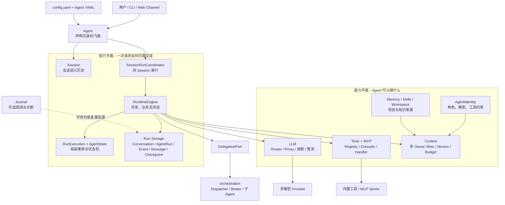
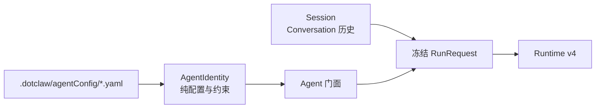
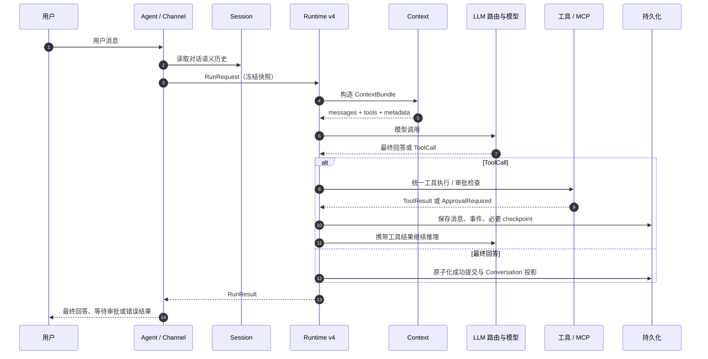
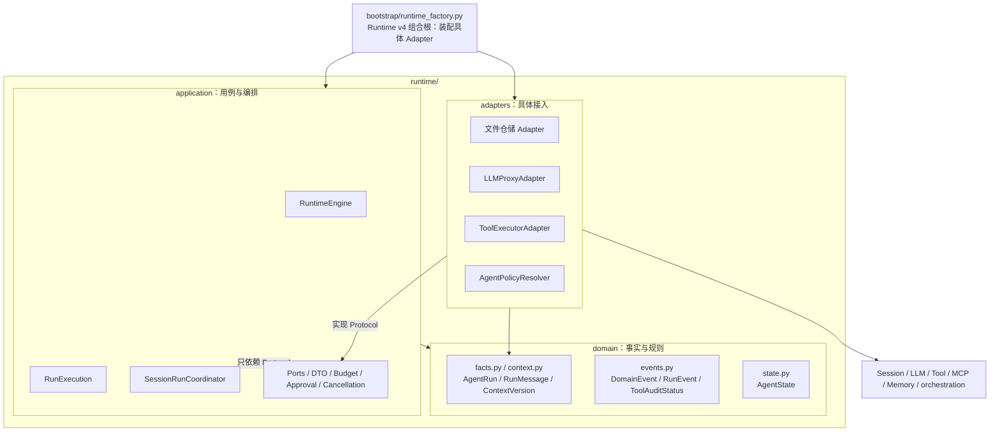
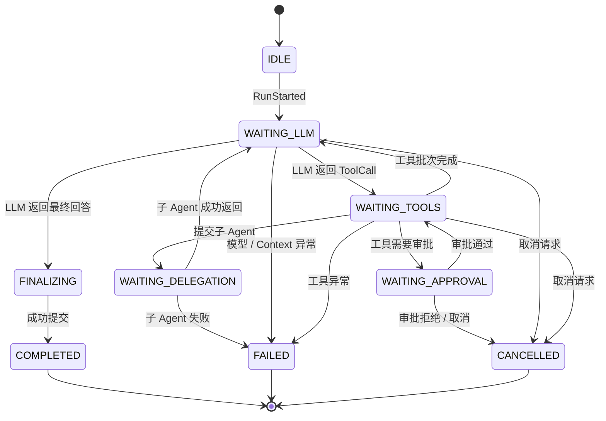
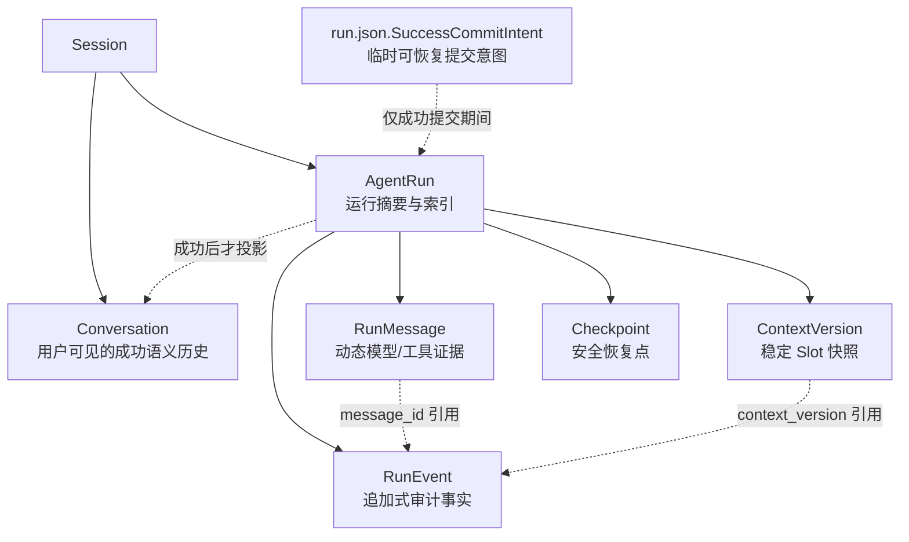
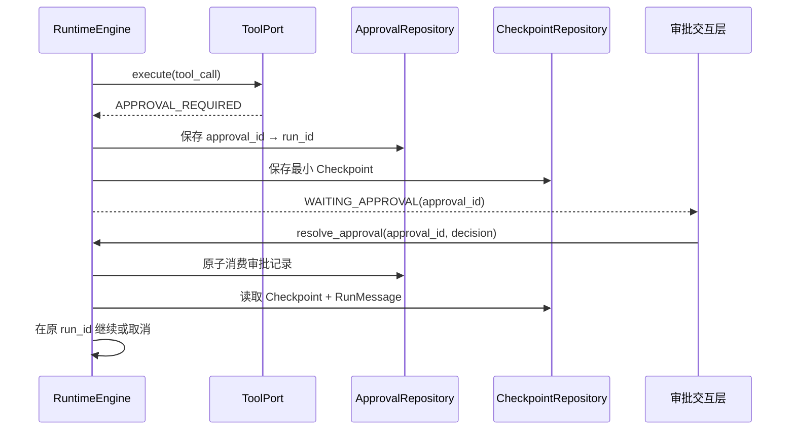

<div align="center">

# 🐾 dotClaw

**以声明式 Agent、可恢复 Runtime 和可插拔基础设施构建的轻量级 Agent Harness框架**

声明式角色 · 模型路由容错 · 工具与 MCP · 上下文与记忆 · 可恢复执行 · 运行观测 · 多 Agent 协作

[](https://python.org)
[](LICENSE)
[](https://github.com/aandbcct/dotClaw)

</div>

---

## dotClaw 是什么

dotClaw 是一个面向 AI Agent 应用开发的 Python 框架。它既提供 Agent 的角色声明、模型与工具接入、上下文和记忆构建，也提供把一次请求可靠地运行、暂停、恢复、审计和委派出去的执行底座。

项目把 Agent 系统拆成两类关注点：

- **能力平面**回答“Agent 能做什么、此刻应该看到什么”：声明式角色、模型路由、工具与 MCP、Skills、Memory、Workspace；
- **执行平面**回答“这次请求如何可靠地完成”：Session、Runtime v4、运行仓储、审批、取消与多 Agent 委派。

Runtime v4 是 dotClaw 的关键执行底座，而不是项目的全部。它将每条用户输入处理为独立 `AgentRun`，让运行中的上下文、状态机、取消令牌与消息证据都归属于该 Run，而不是挂在全局 Runtime 或 Agent 实例上。



## 核心亮点

| 领域 | 设计 | 工程价值 |
|---|---|---|
| 声明式角色 | `AgentIdentity` + YAML Agent 配置 | 角色、模型偏好、工具约束与执行基础设施解耦 |
| 模型调用韧性 | `ModelRouter` + `LLMProxy` + 限流/熔断/降级 | 将模型选择与失败编排从 Agent 逻辑中移出 |
| 工具与 MCP | Registry / Executor / Handler 三层，统一适配 MCP | 工具定义、执行边界和具体业务逻辑可独立扩展 |
| 上下文工程 | 多 Owner Slot、Context Version、动态事实引用、精确 Token 预算 | 稳定上下文可审计，多轮工具 ReAct 不产生冗余快照 |
| 记忆与技能 | Memory、Knowledge、Skill Registry 作为 Context 来源 | 不让 Runtime 直接耦合检索和提示词细节 |
| 会话与执行分离 | Conversation 与 AgentRun / RunMessage / RunEvent 分容器 | 对话语义保持干净，执行细节可审计、可排障 |
| Run 级隔离 | 每个请求创建独立 `RunExecution` | 多个 Session 可并行，不会共享“当前 Agent / 当前消息 / 当前状态” |
| 可恢复提交 | `run.json.SuccessCommitIntent` + 幂等补偿 | 防止 Run 已完成但 Conversation 缺少最终回答的半提交状态 |
| 历史压缩 | 调用前精确计数、最旧 75% Conversation、Run 内 staged 候选 | 超限不静默裁剪；取消/失败/中断不污染 Session 历史 |
| 工具审计 | `TOOL_STARTED` / `TOOL_COMPLETED` 成对事件 | 成功、审批、失败、取消与委派工具调用均可追溯 |
| 安全控制协议 | `approval_id → run_id`、checkpoint、run 级取消 | 审批在原 Run 恢复；有副作用工具不盲目重放 |
| 多 Agent 解耦 | `RuntimeDelegationAdapter` 封装 Dispatcher/Broker | Runtime 只处理提交、结果和取消，不重新耦合编排细节 |

## 模块版图：从角色到外部能力

### 声明式 Agent 与会话

`Agent` 是轻量门面：它持有不可变的 `AgentIdentity`，从当前 Session 构造冻结请求，再将普通消息、审批结果和取消请求交给协调器。角色配置不持有运行时对象，因此同一套执行基础设施可以服务多个不同 Agent 身份。



### 模型、工具、上下文与知识

| 模块 | 当前职责 | 与执行内核的关系 |
|---|---|---|
| `llm/` | 模型选择、限流、熔断、重试和跨模型降级 | 经 `LLMPort` 返回标准化模型响应 |
| `tools/` | 工具注册、审批判定、超时和 Handler 执行 | 经 `ToolPort` 暴露调用能力 |
| `mcp/` | MCP Server 连接与工具适配 | 作为 ToolExecutor 的工具来源 |
| `context/` | Slot 组装、缓存、token 预算和降级 | 实现 `ContextPort`，产出完整 `ContextBundle` |
| `memory/` / `skills/` | 检索、技能目录、项目/知识补充 | 作为 Context Slot 的依赖，不侵入状态机 |
| `journal/` | 可选 trace、报告和调试观测 | 不承担 checkpoint 或 Runtime 恢复事实 |
| `orchestration/` | AgentRegistry、Dispatcher、Broker 等编排语义 | 经 `DelegationPort` 被 Runtime 使用 |

这种模块化使“换一个模型提供商”“增加一个 MCP 工具”“新增一个记忆来源”和“替换运行存储”成为局部接入工作，而不是重写 Agent 主流程。

### 一条请求如何穿过系统



## Runtime：可靠执行底座

### 分层与依赖边界



- `domain`：稳定运行事实、领域事件、状态枚举与状态机规则；不依赖外部技术实现。
- `application`：一次执行如何创建、循环、恢复、取消和提交；不直接调用具体 SDK，也不读写具体文件。
- `adapters`：将文件仓储、LLMProxy、ToolExecutor、SessionManager 和既有编排系统翻译为 Application Port。
- `bootstrap/runtime_factory.py`：Runtime v4 组合根，负责将具体能力装配进抽象执行内核。

### 状态机与运行控制



普通用户消息总是创建新 Run。模型若需要补充信息，会正常生成澄清回复并完成当前 Run；下一条消息再由 Conversation 提供语义连续性。只有审批等结构化控制事件会恢复已有 Run。

## 运行事实、恢复与观测



```text
data/sessions/{session_id}/
├── session.json              # Conversation 与已提交 history_compressions
└── agent_runs/{run_id}/
    ├── run.json                 # AgentRun、活动版本、staged 候选与成功意图
    ├── messages.json            # v4：RunMessage 与 ContextVersion
    ├── events.jsonl             # RunEvent：按 sequence 追加的事实
    ├── checkpoint.json          # 审批等待等安全边界的最小恢复快照
```

这里有三个重要的工程约束：

1. **快照与事实分离**：`ContextVersion` 只保存 Snapshot Slot；Run Message 由 `LLM_STARTED.incremental_message_ids` 引用，工具结果会进入下一轮输入而不会不断创建版本。
2. **成功提交可补偿**：`RUN_COMPLETED`、Conversation/历史摘要投影和 `run.json=COMPLETED` 由 `SuccessCommitIntent` 组成可恢复提交协议；恢复器会幂等补齐未完成步骤。
3. **只从安全边界恢复**：Checkpoint 保存状态、游标、预算、活动版本和 pending 控制引用，不复制完整 prompt 或工具结果。正在执行且有副作用的工具不会被 Runtime 盲目重放。

成功才写入 Conversation；失败、取消和等待审批只保存运行事实。`Journal` 可以提供诊断和观测，但不再作为 Runtime 的状态恢复来源。

## 上下文、审批与多 Agent 的关键细节

### Context Slot：隔离、降级与预算

`ContextProvider` 是 `ContextPort` 的实现。它以 `ContextPlan` 组合 Agent、Session、Run、Global 四类 Owner 的 Slot；Snapshot Slot 形成可审计的 `ContextVersion`，`run_messages` 作为事实引用型 Slot 注入动态 ReAct 证据。

每次业务 LLM 调用前由 tiktoken 精确统计实际输入。超限时压缩最旧 75% 完整 Conversation，候选先暂存当前 Run，只有 Run 成功才提交到 Session；取消、失败或中断不会污染长期历史。更多设计见[上下文工程说明](docs/wiki/上下文工程说明.md)。

### 工具审批、取消与委派



- 取消是 run 级控制信号：Engine 向 LLMPort、ToolPort 发出 best-effort 取消，并在安全点收口终态；
- `RuntimeDelegationAdapter` 将 Dispatcher、Broker 和子 Session 封装成 `DelegationPort`，父子关系通过 `parent_run_id`、`root_run_id` 和事件表达；
- 父 Run 取消时，取消信号可以沿 DelegationPort 传播到当前子 Run。

## 项目结构

```text
dotClaw/
├── src/dotclaw/
│   ├── agent/           # AgentIdentity、Agent 门面、工厂
│   ├── runtime/         # Runtime v4：domain / application / adapters
│   ├── context/         # 多 Owner Slot、Context Version、Token 预算
│   ├── llm/             # ModelRouter、LLMProxy、熔断与限流
│   ├── tools/           # Registry、Executor、Handler、审批与工具定义
│   ├── mcp/             # MCP 提供者与工具适配
│   ├── memory/          # 记忆检索、存储与蒸馏
│   ├── skills/          # Skill 扫描、注册与解析
│   ├── session/         # Session 与 Conversation 语义存储
│   ├── orchestration/   # AgentRegistry、Dispatcher、Broker、委派适配
│   ├── journal/         # 可选诊断、报告与观测数据
│   ├── channel/         # CLI 等交互通道
│   ├── config/          # YAML 配置与环境变量展开
│   ├── bootstrap/       # Runtime v4 组合根
│   └── scheduler/       # 调度能力
├── .dotclaw/agentConfig/# Agent 角色 YAML 定义
├── config.yaml          # 全局配置
├── model_router_config.yaml
├── scripts/             # 迁移等维护脚本
└── tests/
```

## 快速开始

### 环境要求

- Python 3.13+
- 已配置模型访问所需的环境变量与 `config.yaml`

### 安装与启动

```bash
pip install -e .
python -m dotclaw
```

也可以使用安装后的命令：

```bash
dotclaw
```

`.dotclaw/agentConfig/*.yaml` 用于定义 Agent 身份；`config.yaml` 和 `model_router_config.yaml` 用于配置会话、模型和路由策略。CLI 支持 `/new`、`/list`、`/switch`、`/tools`、`/mcp`、`/skills`、`/cancel <run_id>`、`/model` 等命令。

## 验证

```powershell
# 默认运行当前架构测试；自动跳过 legacy 测试
.\.venv\Scripts\python.exe -m pytest

# Runtime v4 架构边界与持久化护栏
.\.venv\Scripts\python.exe -m pytest tests/runtime_v2/test_architecture_contract.py tests/runtime_v2/test_phase6_finalization.py
```

## 可靠性与演进边界

当前 Runtime v4 已提供运行隔离、成功提交补偿、审批恢复、Context Version 与动态事实审计、调用前历史压缩和 Port 解耦。这是可靠单进程运行与可演进架构的基础。

当前 Session 租约是进程内 `asyncio.Lock`，运行仓储是本地文件；它**不是多节点分布式高可用实现**。后续可在既有 Port 边界替换为分布式 Session 租约、PostgreSQL/对象存储、后台 Worker、OpenTelemetry 投影等能力，而无需让 `RuntimeEngine` 直接依赖数据库、队列或监控 SDK。

## 文档导航

- [Runtime 模块总体说明](docs/wiki/Runtime%20模块总体说明.md)：Runtime v4 的分层、状态机、提交协议、可靠性与排障
- [上下文工程说明](docs/wiki/上下文工程说明.md)：多 Owner Slot、Context Version、动态事实引用与历史压缩


---

<div align="center">

**🐾 dotClaw · 用工程化边界组织 Agent 能力与可靠执行**

</div>
