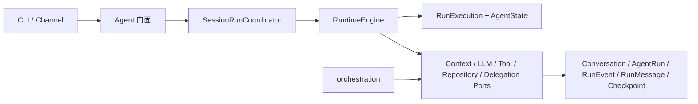

<div align="center">

# 🐾 dotClaw

**基于声明式 Agent 与 Runtime v2 的轻量级 Agent 框架**

声明式角色约束 · Run 级状态机 · Port 驱动执行 · 可恢复持久化 · 多 Agent 委派

[](https://python.org)
[](LICENSE)

</div>

## 简介

dotClaw 的执行内核是业务无状态的 `RuntimeEngine`。每条用户消息创建独立 `RunExecution`；上下文、模型、工具、运行仓储、审批和委派均通过明确的 Port 接入，避免执行内核依赖具体 Session、Journal 或多 Agent 调度实现。



## 运行模型

- `Agent`：持有不可变 `AgentIdentity`，只把普通消息、审批和取消交给协调器。
- `SessionRunCoordinator`：同一 Session 串行，不同 Session 可并行；取消信号可立即传递给活动 Run。
- `RuntimeEngine`：为每次执行创建局部 `RunExecution`，驱动纯 `AgentState`，在安全边界持久化事实与检查点。
- `RuntimeDelegationAdapter`：实现 `DelegationPort`，将子 Run 调度和 Task/Broker 生命周期交给 `orchestration`。

成功运行才会把最终 assistant 回复投影到 Conversation；失败、取消和等待审批只更新运行事实与检查点。

## 持久化布局

```text
data/sessions/{session_id}/agent_runs/{run_id}/
├── run.json        # AgentRun 摘要
├── events.jsonl    # 有序 RunEvent
├── messages.json   # 完整 RunMessage
└── checkpoint.json # 最新可恢复安全点（可选）
```

旧单文件 AgentRun 可使用 `scripts/migrate_agent_run_v1_to_v2.py` 迁移。迁移源文件保持只读；缺失或格式错误会返回明确错误信息。

## 快速开始

```bash
pip install -e .
python -m dotclaw
```

配置文件 `config.yaml` 与 `.dotclaw/agentConfig/*.yaml` 支持多 Agent 身份、模型和工具白名单。

## 验证

```powershell
.\.venv\Scripts\python.exe -m pytest
```

Runtime 重构的设计、实施计划和迁移记录见：

- [Runtime 重构设计](docs/Development/runtime/runtime重构设计.md)
- [Runtime 重构开发计划](docs/Development/runtime/runtime重构开发计划.md)
- [Runtime 重构迁移清单](docs/Development/runtime/runtime重构迁移清单.md)
