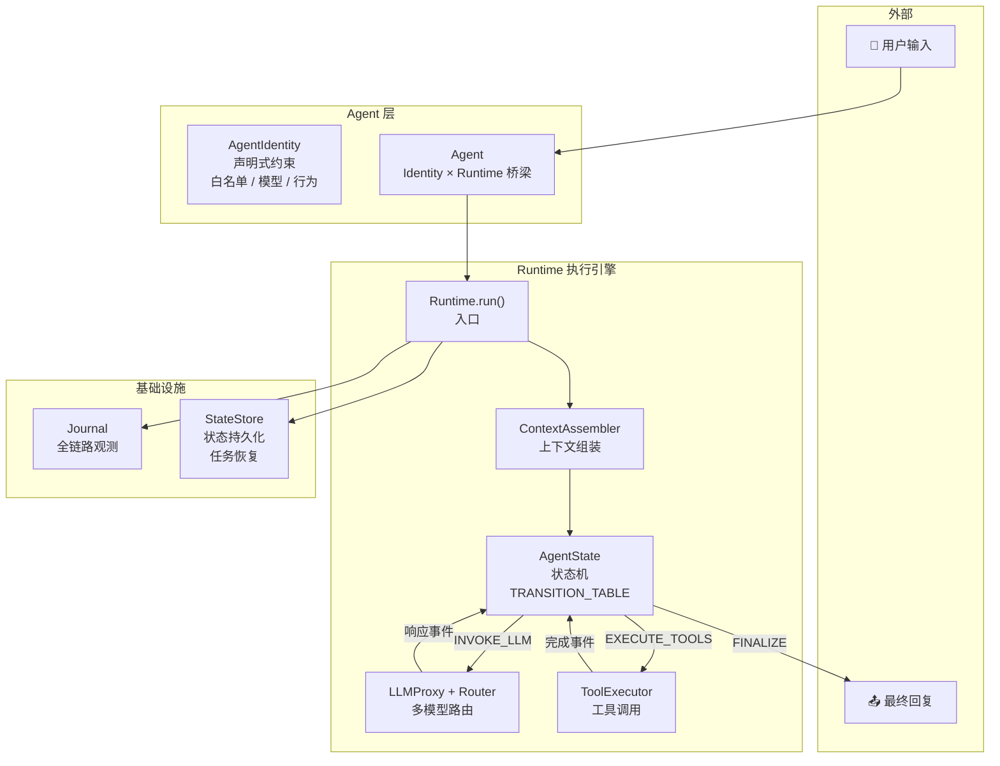
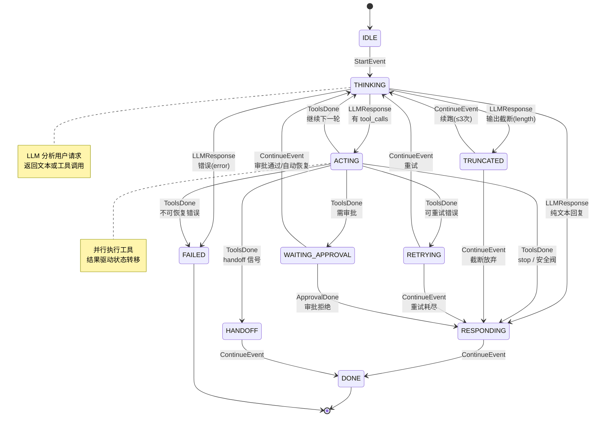
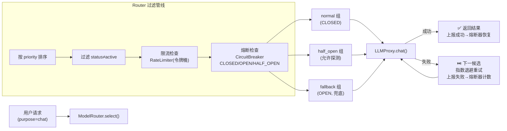
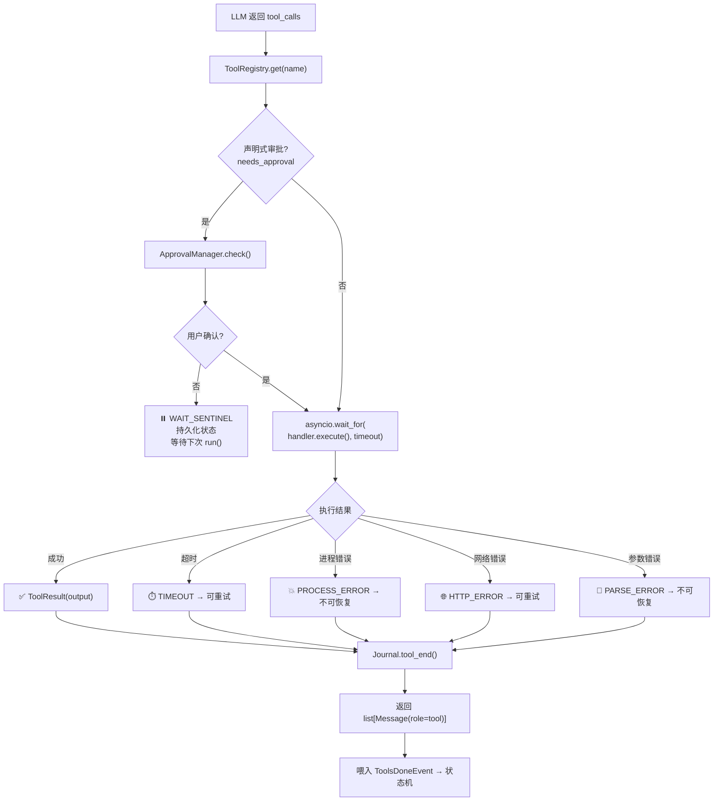
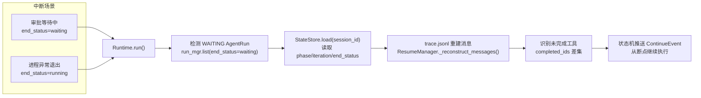
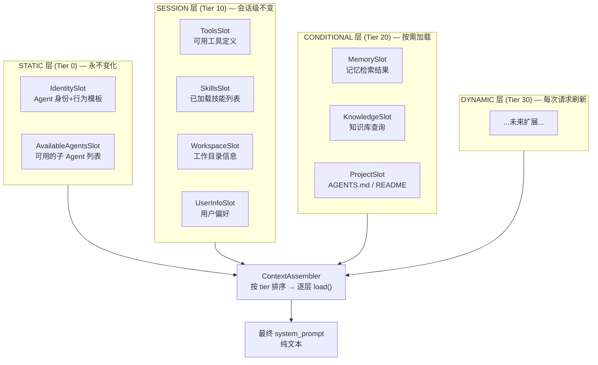
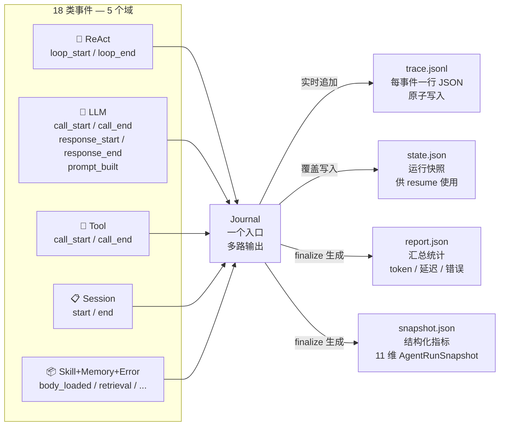

<div align="center">

# 🐾 dotClaw

**基于声明式 Agent 与状态机驱动的轻量级 Agent 框架**

声明式角色约束 · 事件驱动 ReAct 循环 · 状态机决策 · 多模型路由容错 · 全链路可观测

[](https://python.org)
[](LICENSE)

</div>

---

## 简介

**dotClaw** 是一个轻量级 Agent 框架。核心是一套**基于声明式规则表的状态机**，驱动 ReAct（思考→行动→观察）循环，配以多模型路由器、工具调度器、上下文组装器和全链路观测系统。Agent 身份（角色、权限、行为约束）以纯数据声明，与执行引擎完全解耦。



> **关键设计**：AgentIdentity 是纯 `frozen dataclass`，只声明"被允许做什么"（工具白名单、模型、行为模板）。Runtime 是真正执行引擎，通过 `TRANSITION_TABLE`（声明式规则表）驱动 AgentState 状态机。两者通过 Agent 桥接，互不耦合。

---

## 快速开始

```bash
# 安装
pip install -e .

# 配置 API Key
export QWEN_API_KEY=sk-xxxxxxxxxxxxxxxx

# 启动
python -m dotclaw
```

配置文件 `config.yaml` 和 `.dotclaw/agentConfig/*.yaml` 支持多 Agent 定义和环境变量 `${ENV_VAR}` 展开。

---

## 核心设计

### 事件驱动的 ReAct 循环 + 声明式状态机

Agent 的一次执行不是简单的 `while True: call_llm()` 死循环，而是由**声明式规则表（TRANSITION_TABLE）**驱动的事件状态机。



**状态转换规则表（精简）**：

| 当前状态 | 触发事件 | 目标状态 | 条件 | 设计意图 |
|----------|----------|----------|------|----------|
| `IDLE` | `StartEvent` | `THINKING` | — | 启动状态机 |
| `THINKING` | `LLMResponse` | `FAILED` | `finish_reason="error"` (P10) | LLM 调用失败，立即终止 |
| `THINKING` | `LLMResponse` | `TRUNCATED` | `finish_reason="length"` (P20) | 输出截断，支持续跑 |
| `THINKING` | `LLMResponse` | `ACTING` | 有 `tool_calls` (P30) | LLM 需要调用工具 |
| `THINKING` | `LLMResponse` | `RESPONDING` | 纯文本 (P40) | 这是最终回复 |
| `ACTING` | `ToolsDone` | `RETRYING` | 可重试错误 (P5) | 网络抖动等，自动重试 |
| `ACTING` | `ToolsDone` | `FAILED` | 不可恢复错误 (P10) | 工具致命失败 |
| `ACTING` | `ToolsDone` | `WAITING_APPROVAL` | 需审批 (P15) | 挂起持久化，等人工 |
| `ACTING` | `ToolsDone` | `HANDOFF` | handoff 信号 (P20) | 任务流转其他 Agent |
| `ACTING` | `ToolsDone` | `RESPONDING` | stop / 安全阀 (P30-40) | 停止循环 |
| `ACTING` | `ToolsDone` | `THINKING` | 默认 (P50) | 继续下一轮 |
| `WAITING_APPROVAL` | `ContinueEvent` | `THINKING` | 自动恢复 | 下次 `run()` 自动检测 |

> 完整规则表含 20+ 条，所有规则集中在 `agent_state.py` 的 `_TRANSITION_TABLE` 一个列表里。新增或修改状态转换只需加/改一行，不需要修改任何分发逻辑。

**Runtime 中的执行循环**（精简）：

```
run(session, agent, user_message)
  ├─ ContextAssembler.build()           → system_prompt
  ├─ state.handle_event(StartEvent)     → INVOKE_LLM
  │
  └─ while phase not in {DONE, FAILED}:
       ├─ INVOKE_LLM  → llm.chat() → response
       │   └─ state.handle_event(LLMResponseEvent) → 新 action
       ├─ EXECUTE_TOOLS → 审批检查 → 并行执行 → 超时控制
       │   └─ state.handle_event(ToolsDoneEvent) → 新 action
       ├─ HANDOFF_TARGET → 新 Runtime.run() 递归
       ├─ FINALIZE → 返回 final_answer → DONE
       └─ WAIT   → 持久化 → 返回 WAIT_SENTINEL
```

**安全机制**：
- **max_iterations** — 硬上限，防止死循环
- **工具死循环检测** — 连续 3 次相同 `(工具名, 参数 hash)` 即终止
- **TRUNCATED 续跑上限** — 最多连续 3 次截断续跑
- **RETRYING 重试上限** — 每个工具最多 2 次自动重试

---

### 声明式 Agent 架构

Agent 被拆成三层：**声明层**（Identity）、**桥接层**（Agent）、**执行层**（Runtime），三者完全解耦。

```mermaid
graph TD
    subgraph 声明层["声明层 — 纯数据，零运行时依赖"]
        YAML[".dotclaw/agentConfig/<br/>code-engineer.yaml"]
        ID["AgentIdentity (frozen dataclass)<br/>━━━━━━━━━━━━<br/>agent_id: code-engineer<br/>allowed_tools: exec, read_file...<br/>system_prompt_template: ...<br/>model: (空=回退全局)<br/>max_loop_steps: 15<br/>capabilities: code_generation,..."]
    end

    subgraph 桥接层["桥接层 — Identity 约束作用到 Runtime"]
        AG["Agent<br/>━━━━━━━━━━<br/>resolve_model(runtime)<br/>resolve_tools(runtime)<br/>resolve_system_prompt(runtime)<br/>process(runtime, session, msg)"]
        REG["AgentRegistry<br/>扫描所有 agentConfig/*.yaml<br/>支持 A2A AgentCard 元数据"]
    end

    subgraph 执行层["执行层 — 顶层基础设施"]
        RT["Runtime<br/>━━━━━━━━━━━<br/>llm / tool_executor<br/>assembler / journal<br/>state_store / channel<br/>run(session, agent, msg)"]
    end

    subgraph 外部["外部协作"]
        MSG["AgentMessaging<br/>A2A 通信"]
        SP["spawn_agent 工具"]
    end

    YAML -->|load_agent_config()| ID
    ID --> AG
    REG --> AG
    AG -->|process(runtime, ...)| RT
    MSG --> AG
    SP --> RT
```

**核心原则**：

| 原则 | 说明 |
|------|------|
| **Identity 零依赖** | `frozen dataclass`，不含任何可执行对象，可以 JSON 序列化、跨进程传递 |
| **Agent 不持有 Runtime** | `process(runtime, ...)` 接收 Runtime 作为参数，一个 Agent 可复用到不同 Runtime 实例 |
| **约束通过桥接方法施加** | `resolve_model()` 从 Identity.model 或 config 回退；`resolve_tools()` 按白名单过滤 |
| **YAML 声明式配置** | Agent 角色定义在 `.dotclaw/agentConfig/{agent_id}.yaml`，支持 `${ENV_VAR}` |
| **A2A 元数据内置** | `capabilities` / `input_modes` / `output_modes` 对标 A2A AgentCard，为子 Agent 路由提供基础 |

当前内置 7 个 Agent 角色：`daily-assistant`（通用）、`code-engineer`（编程）、`data-analyst`（分析）、`planner-coordinator`（规划）、`content-creator`（写作）、`domain-expert`（问答）、`customer-service`（客服）。

---

## 关键支撑模块

### 多模型路由与容错

一句请求可能经过多个模型供应商才得到回复。路由层负责"选谁"、代理层负责"失败了怎么办"。



- **ModelRouter** — 按 `purpose.chat.priority` 排序、过滤非 active、限流拦截、熔断过滤，输出候选队列
- **LLMProxy** — 遍历候选，单模型内指数退避重试，跨模型自动降级
- **CircuitBreaker** — 三态熔断（CLOSED→OPEN→HALF_OPEN），按 provider 独立计数
- **RateLimiter** — 令牌桶限流，保护 API 配额
- 支持 Qwen / DeepSeek / OpenAI / Gemini 多供应商，配置在 `model_router_config.yaml`

### 工具调用链路

工具执行不是简单的"调函数"。它经过审批、超时控制、错误分类、可重试判断多条分支。



- **三层架构**：`ToolRegistry`（注册）→ `ToolExecutor`（执行+审批+超时）→ `ToolHandler`（实际逻辑）
- **声明式审批**：工具定义中的 `needs_approval` 字段 + 用户配置的 `approval_commands`，双重策略
- **超时控制**：每个工具独立 `asyncio.wait_for()` 超时，不阻塞其他工具并行执行
- **错误分类**：`TIMEOUT` / `PROCESS_ERROR` 可重试，`HTTP_ERROR` / `PARSE_ERROR` 不可恢复
- **8 个内置工具** + MCP 协议工具 + 动态注册（spawn_agent / kill_agent）

### 任务恢复

Agent 执行可能在任何时候中断 —— 审批等待、进程退出、网络断开。恢复机制确保 Agent 从断点继续，而不是从头开始。



- **WAIT_SENTINEL 机制** — 审批等待时返回 `"__DOTCLAW_WAIT__"`，下次 `run()` 自动检测并恢复，调用方无感
- **StateSnapshot** — 持久化 `(phase, iteration, end_status, tasks, error_message)`，原子写入（临时文件 + `os.replace`）
- **消息重建** — 从 `trace.jsonl` 按顺序重建 `user → assistant → tool` 消息链，`_run_ids` 精确去重
- **零感知恢复** — 调用方不需要传任何 resume 参数，`run()` 内部自动处理

### 上下文工程

每次 LLM 调用的 system prompt 不是写死的，而是由**四级分层 Slot 系统**按 token 预算动态组装。



- **Tier 分层** — STATIC(0) → SESSION(10) → CONDITIONAL(20) → DYNAMIC(30)，低层永久缓存，高层按需加载
- **内置缓存** — 每个 Slot 自带 `cache_policy`，避免重复计算
- **9 个内置 Slot** — 覆盖身份、工具、技能、记忆、知识库、项目上下文
- **可插拔** — 新增 Slot 只需继承 `ContextSlot` 基类，注册到 Assembler 即可

---

## 全链路观测（Journal）

Journal 是横向覆盖所有模块的观测层。它在 ReAct 流程的每个关键节点埋入事件，一路实时写入 trace，最终生成结构化报告和指标快照。



- **18 类标准事件** — 覆盖 ReAct / LLM（5 类）/ Tool / Session / Skill / Memory / Error 全部域
- **三路 sink** — `trace.jsonl`（实时追加）、`state.json`（原子覆盖）、`report.json` + `snapshot.json`（结束时生成）
- **Snapshot 指标** — 11 维 `AgentRunSnapshot`（ReAct 效率 / 工具调用统计 / Token 消耗 / 延迟 P95 等）
- **diff 对比** — `diff_snapshots(baseline, candidate)` 支持版本间指标变化率分析

---

## 多 Agent 协作（前瞻）

架构已预留多 Agent 协作能力：

- **Handoff** — `Runtime._handle_handoff()` 内递归调用 `derived_runtime.run()`，当前 Agent 的状态和上下文自动传递给目标 Agent
- **spawn_agent** — 动态工具，根据 `capabilities` 匹配 `AgentRegistry` 中的子 Agent，创建独立 Session 异步执行
- **AgentMessaging** — A2A 通信层，支持 Agent 间消息路由和结果回传

---

## 项目结构

```
dotClaw/
├── src/dotclaw/
│   ├── runtime/          # 执行引擎：Runtime + AgentState 状态机 + StateStore
│   ├── agent/            # Agent 层：Identity（声明式）+ Agent（桥梁）+ 工厂 + 上下文组装
│   ├── llm/              # LLM 引擎：Proxy（降级编排）+ Router（选路）+ CircuitBreaker + RateLimiter
│   ├── tools/            # 工具系统：Registry/Executor/Handler 三层 + 审批 + 内置工具
│   ├── journal/          # 全链路观测：18 类事件 + trace/state/report 三路 sink + Snapshot
│   ├── mcp/              # MCP 协议：stdio + Streamable HTTP 双传输
│   ├── memory/           # 三层记忆：FTS5 + 向量双路召回 + DeepDream 蒸馏
│   ├── skills/           # Skill 系统：扫描注册 + prompt 注入
│   ├── session/          # 会话体系：Session + AgentRun
│   ├── orchestration/    # 多 Agent 编排：AgentRegistry + AgentMessaging
│   ├── config/           # 配置：YAML → dataclass + ${ENV} 展开
│   ├── channel/          # 通道：CLI + Rich 渲染
│   ├── common/           # 通用工具
│   └── cli/              # CLI Banner
├── config.yaml           # 全局配置
├── model_router_config.yaml  # 模型路由配置
├── .dotclaw/agentConfig/     # Agent 角色 YAML 定义
└── tests/                # 单元测试
```

---

<div align="center">

**🐾 dotClaw · 状态机驱动的声明式 Agent 框架**

</div>
