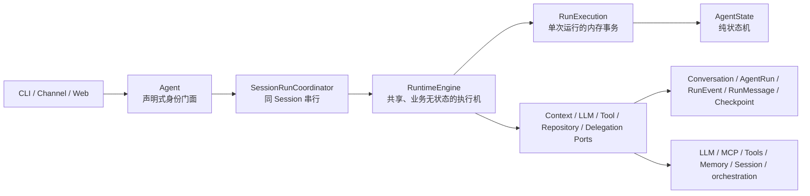
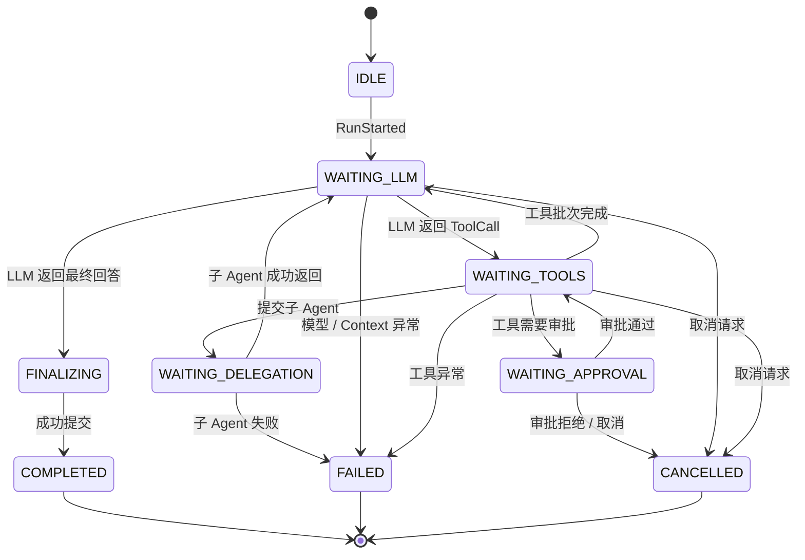
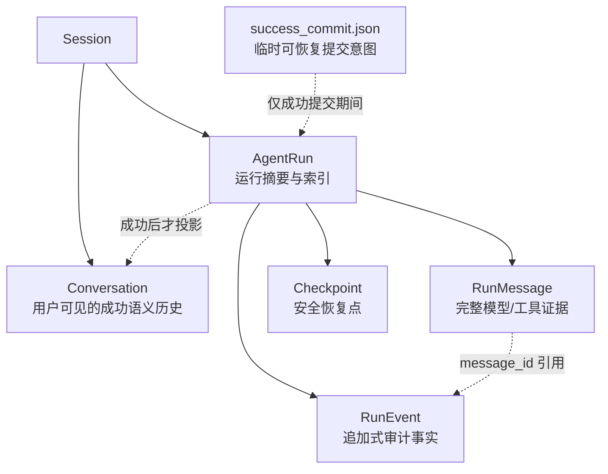
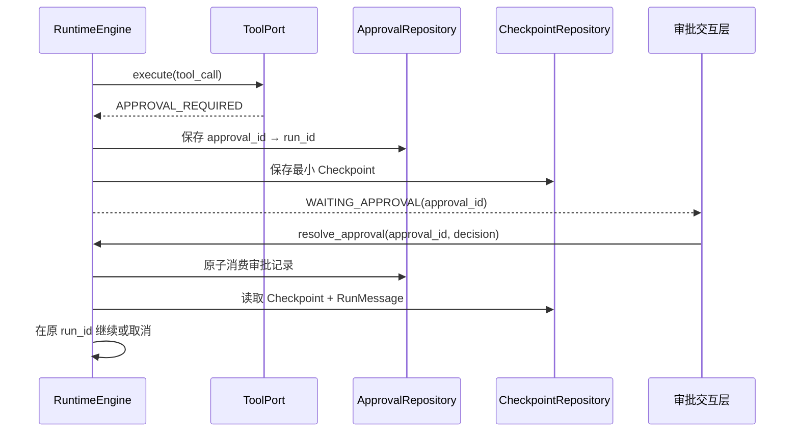

<div align="center">

# 🐾 dotClaw

**面向长程任务的轻量级 Agent Runtime 框架**

声明式 Agent · Run 级状态机 · Session 隔离 · Port 驱动 · 可审计持久化 · 安全审批 · 多 Agent 委派

[](https://python.org)
[](LICENSE)
[](https://github.com/aandbcct/dotClaw)

</div>

## dotClaw 是什么

dotClaw 是一个以 **Runtime** 为核心的 Python Agent 框架。它关注的不只是“让模型调用工具”，还关注一次 Agent 执行在工具失败、审批等待、进程重启、多会话并发时，是否仍然能保持状态隔离、结果可追溯和提交一致。

它将一次用户输入视为一次独立的 `AgentRun`：运行中的上下文、状态机、取消令牌与消息证据都归属于该 Run，而不是挂在全局 Runtime 或 Agent 实例上。



## 核心亮点

| 能力 | 设计 | 解决的问题 |
|---|---|---|
| Run 级隔离 | 每个请求创建独立 `RunExecution` | 多个 Session 可并行，不会共享“当前 Agent / 当前消息 / 当前状态” |
| 会话顺序 | `SessionRunCoordinator` 对同一 Session 串行化 | Conversation 不需要并发合并，历史顺序稳定 |
| 纯状态机 | `AgentState` 只处理“事件 → 新状态 + 下一动作” | 状态规则可独立测试，不耦合 LLM、工具、文件或 Session |
| Port 驱动 | Runtime 仅依赖 `ContextPort`、`LLMPort`、`ToolPort`、Repository 等协议 | 可替换存储、模型、工具平台与多 Agent 编排，不污染执行内核 |
| 五类持久化容器 | Conversation、AgentRun、RunEvent、RunMessage、Checkpoint 各自只回答一个问题 | 避免把消息、trace、快照、会话语义混成一份不可维护的大 JSON |
| 可恢复成功提交 | `success_commit.json` 记录临时提交意图，并在启动/读取时幂等补偿 | 防止“Run 已完成但 Conversation 没有最终回答”的半提交状态 |
| 安全审批恢复 | `approval_id → run_id`，Checkpoint + RunMessage 在同一 `run_id` 上恢复 | 审批不会新建第二个 Run，也不会由 UI 随意指定恢复目标 |
| 完整 ReAct 证据 | 保存实际 LLM 请求、响应、工具调用与工具结果 | 排障可回放；工具结果会进入下一次模型上下文，不会丢失 |
| 上下文降级保护 | Slot 作用域缓存、单 Slot 失败隔离、token 预算裁剪 | Memory / Knowledge 等非关键来源失败时，运行仍有机会继续 |
| 多 Agent 解耦 | `RuntimeDelegationAdapter` 封装既有 Dispatcher/Broker | Runtime 只处理“提交、结果、取消”，不重新耦合编排细节 |

## Runtime 架构

### 分层与依赖边界


- `domain`：只放稳定的运行事实、领域事件、状态枚举与状态机规则；不依赖外部技术实现。
- `application`：只放一次执行如何创建、循环、恢复、取消和提交；不直接调用具体 SDK，也不读写具体文件。
- `adapters`：将文件仓储、LLMProxy、ToolExecutor、SessionManager、既有编排系统翻译为 Application Port。
- `bootstrap/runtime_factory.py`：负责 Runtime v2 的装配；Runtime 内核与具体基础设施在此建立依赖关系。

### 执行生命周期



普通用户消息总是创建新 Run。若模型要求补充信息，它会作为一次正常的最终回答写入 Conversation；下一条用户消息再创建新 Run，由冻结的会话历史提供语义连续性。只有审批等结构化控制事件会恢复已有 Run。

## 运行事实与持久化



```text
data/sessions/{session_id}/
├── conversation.json
└── agent_runs/{run_id}/
    ├── run.json                 # AgentRun：状态、归属、统计、引用、错误摘要
    ├── messages.json            # RunMessage：完整 LLM 请求/响应和工具结果
    ├── events.jsonl             # RunEvent：按 sequence 追加的事实
    ├── checkpoint.json          # 审批等待等安全边界的最小恢复快照
    └── success_commit.json      # 成功提交未完成时的临时补偿意图
```

写入遵循一个重要不变量：**先原子保存 `messages.json`，再追加引用消息 ID 的 `RunEvent`**。这样每个已持久化事件都能找到它引用的完整消息。

### 成功、失败、取消的区别

| 运行结果 | Conversation | AgentRun / RunEvent | Checkpoint |
|---|---|---|---|
| 成功 | 写入用户输入与最终 assistant 回复 | `COMPLETED` + `RUN_COMPLETED` | 删除 |
| 失败 | 不写 assistant 回复 | `FAILED` + 错误摘要 + `RUN_FAILED` | 不作为恢复入口 |
| 取消 | 不写 assistant 回复 | `CANCELLED` + `RUN_CANCELLED` | 删除 |
| 等待审批 | 不写 assistant 回复 | `WAITING_APPROVAL` + 等待事件 | 保存，用于同 Run 恢复 |

成功提交需要同时完成 `RUN_COMPLETED`、Conversation 投影和 `run.json=COMPLETED`。本地文件仓储通过临时 `success_commit.json` 把这三步变成可补偿的提交协议：任一步中断后，启动、读取 Run、查找 Run 或读取 Conversation 都会尝试幂等补齐，而不会长期暴露半成功状态。

## 上下文、工具与多 Agent

### Context Slot

`SlotContextProvider` 是 `ContextPort` 的实现。Runtime 只拿到最终 `ContextBundle`，不参与 system prompt、Memory、Skill、工具定义或历史裁剪的拼装。

| Scope | 缓存键 | 适合内容 |
|---|---|---|
| `STATIC` | `agent_id + identity_version` | Identity、稳定工具说明 |
| `SESSION` | `agent_id + identity_version + session_id` | 会话级稳定内容 |
| `CONDITIONAL` | `run_id` | 单 Run 条件内容 |
| `DYNAMIC` | 不缓存 | 即时 Memory、环境状态 |

每次 LLM 调用的完整 messages 会保存为 `RunMessage`。在工具返回或审批恢复后，之前的 assistant tool call 与 tool result 会被重新加入模型上下文，保持 ReAct 过程连续。

### 工具审批与取消



取消是 run 级控制信号：Engine 向 LLMPort、ToolPort 发送 best-effort 取消，并在安全点收口终态。对正在执行且有副作用的工具，dotClaw 不会根据 checkpoint 盲目重放；应由工具提供幂等键、状态查询或人工确认。

### 多 Agent 委派

多 Agent 不进入 Runtime 内核。`RuntimeDelegationAdapter` 将既有 `orchestration` 的 Dispatcher、Broker 和子 Session 封装为 `DelegationPort`；Engine 只看到“提交子 Run、读取结果、取消子 Run”。父子关系以 `parent_run_id`、`root_run_id` 与 RunEvent 保存。

## 快速开始

### 环境要求

- Python 3.13+
- 已配置模型访问所需的 `config.yaml`

### 安装与启动

```bash
pip install -e .
python -m dotclaw
```

也可以安装命令行入口：

```bash
dotclaw
```

Agent 身份与角色配置位于 `.dotclaw/agentConfig/*.yaml`；全局配置位于 `config.yaml`。CLI 支持 `/new`、`/list`、`/switch`、`/tools`、`/mcp`、`/skills`、`/cancel <run_id>`、`/model` 等命令。

## 可靠性与扩展边界

当前 Runtime v2 已提供运行隔离、成功提交补偿、审批恢复、消息/事件审计、上下文降级和 Port 解耦。这是可靠单进程运行与可演进架构的基础。

但当前 Session 租约是进程内 `asyncio.Lock`，运行仓储是本地文件；它**不是多节点分布式高可用实现**。如果要扩展到多实例部署，应在 Port 边界替换为：

```text
分布式 Session 租约  → Redis / 数据库锁 + fencing token
高可用运行仓储        → PostgreSQL / 对象存储 Adapter
后台长任务            → 队列、Worker、心跳与 lease 续租
可观测平台            → 订阅 RunEvent 构建 Trace / OpenTelemetry 投影
```

这些演进不应让 `RuntimeEngine` 重新直接依赖数据库、队列、SessionManager 或监控 SDK。

## 验证

```powershell
# 默认运行当前架构测试（自动跳过 legacy 测试）
.\.venv\Scripts\python.exe -m pytest

# Runtime v2 架构边界与物理删除护栏
.\.venv\Scripts\python.exe -m pytest tests/runtime_v2/test_architecture_contract.py tests/runtime_v2/test_phase6_finalization.py
```

## 文档导航

- [Runtime 模块总体说明](docs/wiki/Runtime%20模块总体说明.md)：当前实现的分层、流程、状态机、持久化、可靠性与排障说明
- [Runtime 重构设计](docs/Development/runtime/runtime重构设计.md)：重构决策、容器边界和不变量
- [Runtime 重构开发计划](docs/Development/runtime/runtime重构开发计划.md)：实施阶段与验收标准
- [Runtime 重构迁移清单](docs/Development/runtime/runtime重构迁移清单.md)：旧模块替代关系、删除与数据迁移
- [运行时执行机讨论](docs/wiki/runtime执行机.md)：早期 Runtime 定位讨论

## 当前明确不包含的能力

- 跨多个 Run 的 `Task` 领域模型；
- 分布式 Session 租约、跨进程队列与远程 Worker；
- 自动恢复正在执行的外部副作用工具；
- 将 Trace 作为另一份持久化事实源；
- RunMessage 去重、对象存储、细粒度权限和生命周期治理。

这些需求可以沿现有 Domain、Application、Port 和 Adapter 边界逐步扩展，而不需要重新引入一个持有全部状态的巨型 Runtime。
