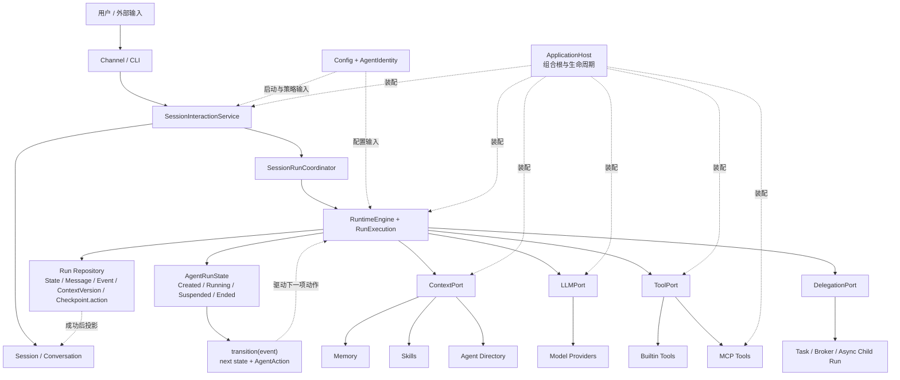
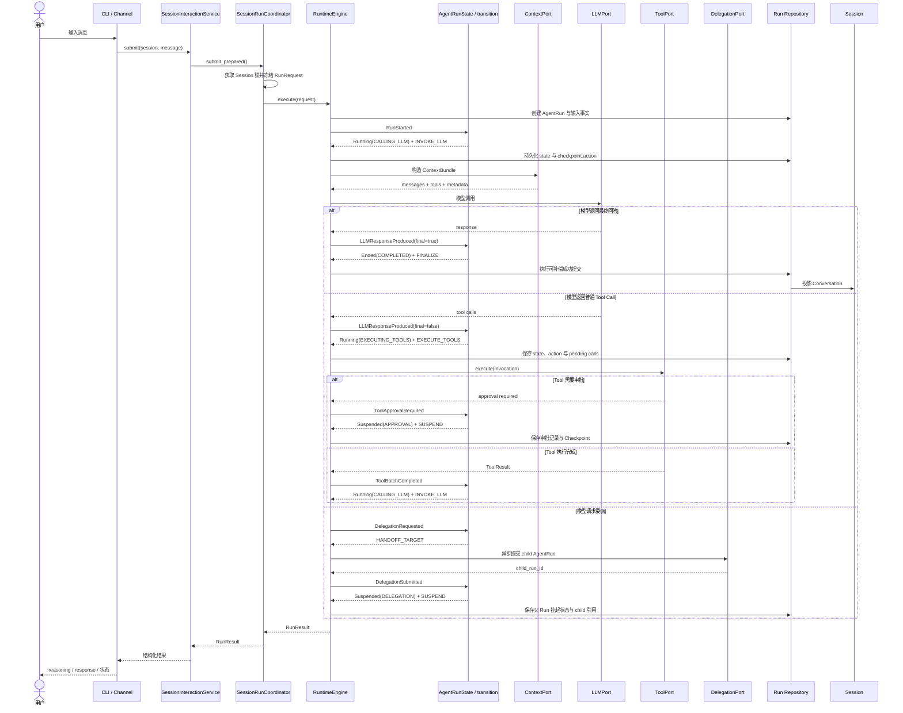

<div align="center">

# 🐾 dotClaw

**面向本地 Agent 应用开发的轻量级 Agent Harness**

声明式 Agent · 可恢复执行 · 模型路由 · 工具安全 · MCP · 上下文工程 · 记忆与技能 · 多 Agent 委派

[](https://www.python.org/)
[](pyproject.toml)
[](LICENSE)
[](https://github.com/aandbcct/dotClaw)

</div>

---

## dotClaw 是什么

dotClaw 是一个使用 Python 构建的本地 Agent Harness。它将 Agent 的身份、模型、工具、上下文与知识能力，与一次请求的执行、审批、恢复和持久化过程分开管理。

项目关注两类问题：

- **能力层**：Agent 是谁、能调用什么、模型在当前时刻应该看到什么；
- **执行层**：一次请求如何隔离运行、调用外部能力、等待审批、处理中断，并在成功后可靠提交结果。

dotClaw 当前适合：

- 学习和验证 Agent Harness 的工程边界；
- 构建本地、单进程的 Agent 应用；
- 研究 Runtime、Context、Tool、MCP 和多 Agent 委派的协作方式；
- 在不绑定特定模型供应商或工具实现的前提下扩展 Agent 能力。

---

## 总体架构


```mermaid
flowchart TB
    User["用户 / 外部输入"] --> Channel["Channel / CLI"]
    Channel --> App["SessionInteractionService"]
    App --> Session["Session / Conversation"]
    App --> Coordinator["SessionRunCoordinator"]
    Coordinator --> Runtime["RuntimeEngine + RunExecution"]

    Config["Config + AgentIdentity"] -.启动与策略输入.-> App
    Config -.配置输入.-> Runtime

    Runtime --> State["AgentRunState<br/>Created / Running / Suspended / Ended"]
    State --> Transition["transition(event)<br/>next state + AgentAction"]
    Transition -.驱动下一项动作.-> Runtime

    Runtime --> Context["ContextPort"]
    Runtime --> LLM["LLMPort"]
    Runtime --> Tool["ToolPort"]
    Runtime --> Delegation["DelegationPort"]
    Runtime --> Facts["Run Repository<br/>State / Message / Event / ContextVersion / Checkpoint.action"]

    Context --> Memory["Memory"]
    Context --> Skills["Skills"]
    Context --> AgentDir["Agent Directory"]

    LLM --> Providers["Model Providers"]
    Tool --> Builtin["Builtin Tools"]
    Tool --> MCP["MCP Tools"]
    Delegation --> Orchestration["Task / Broker / Async Child Run"]

    Facts -.成功后投影.-> Session

    Host["ApplicationHost<br/>组合根与生命周期"] -.装配.-> App
    Host -.装配.-> Runtime
    Host -.装配.-> Context
    Host -.装配.-> LLM
    Host -.装配.-> Tool
    Host -.装配.-> MCP
```

关键边界：

1. `ApplicationHost` 是组合根，不参与正常请求的业务处理；
2. `SessionInteractionService` 是普通请求的应用入口；
3. `SessionRunCoordinator` 保证同一 Session 串行，不同 Session 可以并行；
4. `AgentRun.state` 是单个 Run 唯一的持久化控制状态；
5. 所有状态变化来自 `transition()`，RuntimeEngine 只执行返回的 `AgentAction`；
6. Runtime 只通过 Port 调用能力模块；
7. MCP 是 Tool 来源，不在 Runtime 中建立独立调用分支；
8. Journal 和 Scheduler 的代码与配置目前存在，但尚未进入 ApplicationHost 主链。

---

## 一次请求如何运行


```mermaid
sequenceDiagram
    actor User as 用户
    participant Channel as CLI / Channel
    participant App as SessionInteractionService
    participant Coord as SessionRunCoordinator
    participant Runtime as RuntimeEngine
    participant State as AgentRunState / transition
    participant Context as ContextPort
    participant LLM as LLMPort
    participant Tool as ToolPort
    participant Delegation as DelegationPort
    participant Repo as Run Repository
    participant Session as Session

    User->>Channel: 输入消息
    Channel->>App: submit(session, message)
    App->>Coord: submit_prepared()
    Coord->>Coord: 获取 Session 锁并冻结 RunRequest
    Coord->>Runtime: execute(request)
    Runtime->>Repo: 创建 AgentRun 与输入事实
    Runtime->>State: RunStarted
    State-->>Runtime: Running(CALLING_LLM) + INVOKE_LLM
    Runtime->>Repo: 持久化 state 与 checkpoint.action
    Runtime->>Context: 构造 ContextBundle
    Context-->>Runtime: messages + tools + metadata
    Runtime->>LLM: 模型调用

    alt 模型返回最终回答
        LLM-->>Runtime: response
        Runtime->>State: LLMResponseProduced(final=true)
        State-->>Runtime: Ended(COMPLETED) + FINALIZE
        Runtime->>Repo: 执行可补偿成功提交
        Repo->>Session: 投影 Conversation
    else 模型返回普通 Tool Call
        LLM-->>Runtime: tool calls
        Runtime->>State: LLMResponseProduced(final=false)
        State-->>Runtime: Running(EXECUTING_TOOLS) + EXECUTE_TOOLS
        Runtime->>Repo: 保存 state、action 与 pending calls
        Runtime->>Tool: execute(invocation)

        alt Tool 需要审批
            Tool-->>Runtime: approval required
            Runtime->>State: ToolApprovalRequired
            State-->>Runtime: Suspended(APPROVAL) + SUSPEND
            Runtime->>Repo: 保存审批记录与 Checkpoint
        else Tool 执行完成
            Tool-->>Runtime: ToolResult
            Runtime->>State: ToolBatchCompleted
            State-->>Runtime: Running(CALLING_LLM) + INVOKE_LLM
        end
    else 模型请求委派
        Runtime->>State: DelegationRequested
        State-->>Runtime: HANDOFF_TARGET
        Runtime->>Delegation: 异步提交 child AgentRun
        Delegation-->>Runtime: child_run_id
        Runtime->>State: DelegationSubmitted
        State-->>Runtime: Suspended(DELEGATION) + SUSPEND
        Runtime->>Repo: 保存父 Run 挂起状态与 child 引用
    end

    Runtime-->>Coord: RunResult
    Coord-->>App: RunResult
    App-->>Channel: 结构化结果
    Channel-->>User: reasoning / response / 状态
```

普通用户消息总是创建新 Run。已有 Run 的结构化控制入口包括：

- `resolve_approval()`：恢复 `Suspended(APPROVAL)`；
- `resume_delegation()`：子 Run 结束后恢复 `Suspended(DELEGATION)`；
- `resume_run()`：根据 `Checkpoint.action` 恢复未结束 Run；
- `cancel()` / `abandon_run()`：将未结束 Run 收口。

CLI 的 `/retry <run_id>` 是 `resume_run()` 的交互命令名；可恢复性由未结束状态与有效 Checkpoint 共同决定。

---

## 核心设计

dotClaw 不是把 `LLM → Tool → Answer` 串起来的单次调用 Demo。项目重点处理的是 Agent 进入多轮工具调用、审批等待、上下文增长、进程重启恢复和子 Agent 协作后，如何保持执行隔离、事实一致和模块可替换。

以下七项均已进入当前主链，不是仅停留在设计文档中的规划。

### 1. Run 级隔离与并发模型

**问题：**多个请求共用一个长期存活的 Agent 或 Runtime 对象时，“当前消息、当前状态、取消标记和待审批操作”容易相互污染；但为每次请求重新创建整套模型、工具和仓储基础设施，又会增加资源成本并破坏统一生命周期管理。

**机制：**

```text
一条用户消息
→ 一个 AgentRun
→ 一个 RunExecution
→ 一套独立的消息游标、预算、取消令牌和控制数据
```

`RuntimeEngine` 是可复用执行协调器，不保存“当前 Agent”“当前 Session”或活动 Run 状态；`RunExecution` 只承载单次 Run 的易变运行数据。

并发边界由 `SessionRunCoordinator` 统一维护：

```text
同一 Session
→ 串行执行

不同 Session
→ 可以并行执行
```

取消操作绕过 Session 锁直接发送控制信号，避免“Run 持锁等待外部调用，取消又等待同一把锁”的死锁。

**工程价值：**隔离单位明确到 Run，共享基础设施不会引入共享业务状态；Session 并发约束、取消语义和请求快照冻结都集中在稳定边界中，而不是散落在 Agent、Channel 或 Tool 内。

### 2. 分层、动作驱动的持久化状态机

**问题：**把生命周期、执行阶段、等待原因和终态结果压进一组扁平枚举，会产生大量本不应该存在的状态组合，也会迫使 Engine 直接根据状态名编排控制流。

**机制：**

`AgentRunState` 使用判别联合表达单个 Run 的唯一持久化控制状态：

```text
Created
Running(stage)
Suspended(reason, control_id, resume_stage)
Ended(outcome)
```

其中：

```text
RunStage
├── CALLING_LLM
└── EXECUTING_TOOLS

SuspendReason
├── APPROVAL
└── DELEGATION

RunOutcome
├── COMPLETED
├── FAILED
├── CANCELLED
└── ABANDONED
```

所有状态变化都经过纯函数：

```text
AgentRunEvent
→ transition(current_state, event)
→ StateTransition(next_state, AgentAction)
→ RuntimeEngine 执行下一项动作
```

Engine 不直接决定业务状态，只消费：

```text
INVOKE_LLM
EXECUTE_TOOLS
HANDOFF_TARGET
SUSPEND
FINALIZE
```

非法事件会被拒绝，原状态保持不变，并追加结构化审计事实。

**工程价值：**联合状态排除了生命周期、阶段、等待原因和结果之间的非法笛卡尔积；状态机可以脱离 LLM、Tool、Channel 和仓储单独测试，Engine 也从“状态判断器”收敛为动作执行器。

### 3. Operation-node 恢复与补偿提交

**问题：**一次 Agent 执行会跨越模型调用、工具副作用、审批等待、子 Run 和多个本地文件。只保存一个状态名无法回答“当前应继续执行哪个操作”，也无法避免“最终回答已生成，但 Conversation 尚未写入”的半提交状态。

**机制：**

```text
AgentRun.state     唯一持久化控制状态
RunMessage         LLM / Tool / Delegation 正文事实
RunEvent           按顺序追加的审计事实
ContextVersion     某次模型调用的稳定输入版本
Checkpoint.action  当前 operation node / 下一项动作
Checkpoint.pending 工具、审批或委派恢复引用
ApprovalRecord     approval_id 与原 Run 的关联
SuccessCommitIntent
                   Conversation 投影与 Run 完成的补偿控制记录
```

每次非终态迁移后，Runtime 会在下一次外部副作用前持久化新的 `AgentRun.state` 和与之匹配的 `Checkpoint.action`。

恢复不再依赖额外的“中断”业务状态：

```text
未结束 AgentRun + 有效 Checkpoint
→ resume_run(run_id)
→ 读取 Checkpoint.action
→ 恢复 INVOKE_LLM 或 EXECUTE_TOOLS operation node
```

工具节点会从 `Checkpoint.pending` 恢复待执行调用，避免退化为重新调用模型；但外部副作用仍不保证跨崩溃 exactly-once。审批通过后继续原 `run_id`。成功路径先进入 `Ended(COMPLETED)`，再通过 `SuccessCommitIntent` 幂等补齐 Conversation、完成事件和 Run 终态。

**工程价值：**可恢复性成为“非终态 Run + operation node + 持久化事实”的组合，而不是额外业务状态。进程在执行或跨文件提交中途退出后，可以从明确节点继续或补齐提交，同时保留副作用边界的真实限制。

### 4. Context 版本与确定性预算

**问题：**多轮 ReAct 会持续累积 Conversation、工具结果和动态事实。简单截断最近消息既会破坏工具调用语义，也无法说明某次模型调用到底看到了什么。

**机制：**

- Context 按 Agent、Session、Run 和 Global Owner 组合 Slot；
- 稳定 Slot 固化为 `ContextVersion`，动态 RunMessage 通过事实引用进入下一轮；
- 使用显式 tokenizer 对实际可枚举输入进行确定性计数；
- 超限时压缩最旧的完整 Conversation，而不是切断单条工具交互；
- 历史压缩结果先暂存当前 Run，只有 Run 成功才提交到 Session。

```text
Context Plan
→ Slot 加载与降级
→ ContextBundle
→ Token 计数
→ 继续 / 压缩 / 拒绝
→ ContextVersion
```

**工程价值：**模型输入可审计、预算决策可复现；取消、失败和未结束 Run 不会污染长期会话摘要。

### 5. 声明式 Tool 安全系统

**问题：**工具描述只能说明“这个工具通常做什么”，真正风险取决于本次参数：写工作区文件、写 `.env` 和写工作区外路径需要完全不同的决策。

**机制：**

```text
ToolDefinition + 已验证参数
→ CapabilityBroker 解释本次资源请求
→ PolicyEngine 计算 allow / ask / deny
→ Runtime 持久化审批或直接执行
→ ToolHandler
→ 统一 ToolResult 与审计事件
```

全局 Policy 是安全上限，Agent 级 Policy 只能继续收窄。Builtin 与 MCP Tool 进入同一个 Registry 和执行链；Runtime 主路径把审批转换为可持久化控制事件，而不是让 Tool 直接向用户提问。

**工程价值：**工具声明、实际资源访问和审批流程形成可测试边界；增加新工具时不需要在 Agent 主循环中重新实现安全判断。

### 6. 模型路由、调用韧性与双通道输出

**问题：**模型调用不仅会失败，还涉及不同用途、Provider 限流、暂时故障、模型禁用和 reasoning 格式差异。将这些逻辑写进 Agent 循环会让业务状态机与供应商细节耦合。

**机制：**

- `Purpose → Model → Provider` 三级选择；
- Provider 级重试、速率限制和熔断；
- 候选模型按优先级降级；
- 模型逻辑名与供应商 `model_id` 分离；
- Provider 输出统一归一为 reasoning 与 response 两类事件；
- CLI 通过运行级 `LLMOutputPort` 展示增量，不把 reasoning 写入 Conversation。

**工程价值：**Runtime 只处理标准化 LLM 结果，不感知具体 SDK；模型切换、故障编排和输出协议变化被限制在 LLM 边界内。

### 7. 异步子 Agent 委派与独立 Run

**问题：**在父 Run 内直接切换 Agent 身份，会把两套消息、工具权限、取消状态和恢复事实混在同一个执行上下文中；同步阻塞父 Engine 等待子任务，也难以表达真实的外部等待状态。

**机制：**

```text
delegate ToolCall
→ DelegationRequested
→ AgentAction.HANDOFF_TARGET
→ RuntimeDelegationAdapter 异步提交 child AgentRun
→ DelegationSubmitted
→ 父 Run 进入 Suspended(DELEGATION)
```

子 Agent 使用独立 Session 和 Run，并通过 `parent_run_id`、`root_run_id` 和委派事件与父 Run 关联。子 Run 结束后：

```text
resume_delegation(child_run_id)
→ 写入 DELEGATION_RESULT
→ DelegationCompleted
→ 父 Run 恢复为 Running(CALLING_LLM)
```

子 Run 的成功、失败、取消或放弃都会作为结构化结果回灌父模型，由父 Agent 决定后续；父 Run 取消时，取消信号可以传播到当前 child Run。

**工程价值：**多 Agent 能力复用同一状态机、审批、Context 和持久化模型，不需要另建第二套 Runtime。父 Run 的外部等待被显式建模为 `Suspended(DELEGATION)`。当前 Task、等待映射和异步任务主要保存在内存，因此跨进程恢复仍是明确边界。

---

## 当前能力

| 能力 | 当前状态 | 说明 |
|---|---|---|
| 声明式 Agent | 已接入主链 | YAML Identity、模型、Prompt、工具与 Context 约束 |
| Session 与 Conversation | 已接入主链 | 本地文件持久化成功对话语义 |
| 可恢复 Runtime | 已接入主链 | Run 隔离、分层 `AgentRunState`、action-driven Engine、operation-node Checkpoint 与成功提交补偿 |
| 模型路由 | 已接入主链 | 多 Provider、Purpose 路由、重试、限流和熔断 |
| reasoning / response 双通道 | 已接入主链 | CLI 可显示或隐藏 reasoning 增量 |
| Builtin Tool | 已接入主链 | 文件、进程、系统、记忆、计算和固定网络服务 |
| Tool 安全策略 | 已接入主链 | Capability、allow/ask/deny、审批与 Agent 级收窄 |
| MCP Tool | 可选接入 | 当前默认 `mcp_servers: []`，不会连接 Server |
| Context Slot | 已接入主链 | 多 Owner、缓存、版本、动态事实引用和 Token 预算 |
| Memory | 可选接入 | 检索进入 Context；Dream 当前通过 CLI 手动触发 |
| Skills | 可选接入 | 当前示例目录默认被跳过，Registry 初始可为空 |
| 多 Agent 委派 | 已接入主链 | 异步 child Run、`Suspended(DELEGATION)` 与结果回灌；Task 和等待映射当前主要在内存 |
| Journal | 未接入主链 | 代码和配置存在，不作为 Runtime 恢复事实源 |
| Scheduler | 未接入主链 | `ReminderManager` 存在，但 Host 当前不创建和管理 |

---

## 快速开始

### 环境要求

- Python 3.13+
- 至少一个可用的模型 Provider API Key
- Git

### 1. 克隆并安装

```bash
git clone https://github.com/aandbcct/dotClaw.git
cd dotClaw

python -m venv .venv
```

激活虚拟环境：

```bash
# Windows PowerShell
.\.venv\Scripts\Activate.ps1

# Linux / macOS
source .venv/bin/activate
```

安装运行依赖：

```bash
pip install -e .
```

需要运行测试时安装开发依赖：

```bash
pip install -e ".[dev]"
```

### 2. 配置模型密钥

当前默认模型是 Qwen。在项目根目录创建 `.env`：

```dotenv
QWEN_API_KEY=your_api_key
```

可选网络工具：

```dotenv
TAVILY_API_KEY=your_tavily_api_key
```

系统环境变量优先于项目根 `.env`。

使用其他 Provider 时，同步修改：

```text
model_router_config.yaml
config.yaml
```

并提供相应环境变量，例如：

```text
DEEPSEEK_API_KEY
OPENAI_API_KEY
GEMINI_API_KEY
```

### 3. 启动 CLI

```bash
python -m dotclaw
```

安装后也可以直接使用：

```bash
dotclaw
```

隐藏 reasoning 展示：

```bash
dotclaw --hide-thinking
```

---

## CLI 命令

| 命令 | 作用 |
|---|---|
| `/new [标题]` | 创建并切换到新对话 |
| `/list` | 列出 Session |
| `/switch <id>` | 切换 Session |
| `/delete <id>` | 删除 Session |
| `/tools` | 查看已注册 Tool |
| `/mcp` | 查看 MCP Server 状态 |
| `/skills` | 查看已加载 Skill |
| `/dream` | 手动触发记忆蒸馏 |
| `/cancel <run_id>` | 取消指定 Run |
| `/retry <run_id>` | 按 `Checkpoint.action` 恢复未结束 Run |
| `/abandon <run_id>` | 显式放弃未结束 Run |
| `/model` | 查看当前模型 |
| `/help` | 查看帮助 |
| `/quit` | 退出 |

危险 Tool 需要审批时，CLI 会显示结构化确认并在原 Run 上继续或取消。

---

## 配置入口

### `config.yaml`

应用级配置：

```text
Agent 默认值
Tool / Network / MCP
Skills / Memory
Session
Debug
```

### `model_router_config.yaml`

模型路由配置：

```text
Provider
Model
Purpose
Reasoning
Retry / Rate Limit / Circuit Breaker
```

### `.dotclaw/agentConfig/*.yaml`

Agent Identity：

```text
agent_id
agent_name
model
system_prompt_template
allowed_tools
policy_rules
context_slot_ids
max_loop_steps
```

### `.env`

本地 Secret 和环境变量。不要提交真实密钥。

---

## 最小 Agent 配置示例

```yaml
agent_id: coding
agent_name: "Coding Assistant"
description: "面向代码阅读与修改的本地 Agent"

model: qwen3.7-max
workspace: "."

allowed_tools:
  - builtin.files.read_text
  - builtin.files.write_text
  - builtin.files.list_directory
  - builtin.process.execute

max_loop_steps: 12

system_prompt_template: |
  你是 {agent_name}，一个代码助手。
  修改代码前先阅读相关文件。
  对有副作用或高风险操作先请求确认。

context_slot_ids:
  - identity
  - tools
  - skills
```

将文件保存到：

```text
.dotclaw/agentConfig/coding.yaml
```

重新启动后，`ApplicationHost` 会扫描 Agent Identity 目录。

---

## Tool 与 MCP

Builtin Tool 使用 `@tool` 声明并在启动时自动发现，当前覆盖工作区文件、进程执行、系统信息、记忆、计算以及 Tavily、Open-Meteo 等固定网络 Provider。

所有 Tool 都经过统一 Registry、安全策略和执行结果契约。网络工具只访问代码预声明的服务与主机，不提供 Agent 可控的任意 URL 抓取能力。

MCP Tool 使用：

```text
mcp.<server>.<tool>
```

接入同一 ToolRegistry。当前只注册 MCP tools；resources 和 prompts 保留 Client 原生接口。Server 连接与 Tool 调用分别受 `mcp.connect`、`mcp.call` 策略控制，仓库默认没有配置 MCP Server。

---

## 数据与运行事实

默认运行数据按 Session 和 Run 分层保存：

```text
data/sessions/
├── approvals/
└── {session_id}/
    ├── session.json
    └── agent_runs/{run_id}/
        ├── run.json
        ├── messages.json
        ├── events.jsonl
        └── checkpoint.json
```

其中：

- `session.json` 保存成功 Conversation 和已提交历史摘要；
- `run.json` 保存 `AgentRunState`、活动引用、staged 压缩候选和 `SuccessCommitIntent`；
- `messages.json` 保存 RunMessage 与 ContextVersion；
- `events.jsonl` 保存追加式 RunEvent 审计事实；
- `checkpoint.json` 保存当前 `AgentAction`、事件/消息游标、活动 ContextVersion，以及 Tool、审批或 Delegation 的 pending 恢复引用。

状态与 Checkpoint 的关系是：

```text
AgentRun.state
→ 当前唯一持久化控制状态

Checkpoint.action
→ 从哪个 operation node 继续执行

Checkpoint.pending
→ 恢复该 operation 所需的最小引用
```

详细状态迁移、数据契约和恢复顺序见 [Runtime 模块 Wiki](docs/wiki/Runtime%20模块总体说明.md)。

---

## 项目结构

```text
dotClaw/
├── src/dotclaw/
│   ├── agent/           # AgentIdentity 与声明加载
│   ├── bootstrap/       # ApplicationHost 与应用入口
│   ├── channel/         # CLI 和运行级输出适配
│   ├── config/          # 配置模型、加载与兼容
│   ├── context/         # Slot、Plan、缓存与物化
│   ├── llm/             # Provider、Router、Proxy 与 Reasoning
│   ├── mcp/             # MCP Client、Provider 和 Tool Adapter
│   ├── memory/          # 记忆存储、检索与蒸馏
│   ├── orchestration/   # Task、Broker 与 Delegation
│   ├── runtime/         # Domain、Application、Ports 与 Adapters
│   ├── scheduler/       # ReminderManager，当前未装配
│   ├── session/         # Session 与 Conversation
│   ├── skills/          # Skill 扫描与 Registry
│   ├── tools/           # Tool 定义、Registry、安全与执行
│   └── journal/         # 旧观测设施，当前未进入 Runtime 主链
├── .dotclaw/agentConfig/
├── docs/wiki/
├── skills/
├── tests/
├── config.yaml
├── model_router_config.yaml
└── pyproject.toml
```

---

## 测试

安装开发依赖后运行：

```bash
python -m pytest
```

默认测试配置排除 `legacy` 标记的历史迁移测试。

按模块运行：

```bash
python -m pytest tests/runtime_v2
python -m pytest tests/tools
python -m pytest tests/context
python -m pytest tests/llm
```

---

## 当前边界

dotClaw 当前明确定位为本地、单进程 Agent Harness：

- Session 协调使用进程内 `asyncio.Lock`，不是跨进程租约；
- Session、Run、Checkpoint 和审批主要使用本地文件存储；
- `AgentRunState` 与 Checkpoint 新格式不兼容旧 phase/status 数据；开发和测试环境升级后需要清理旧 Session/Run 数据；
- `resume_run()` 可以根据 `Checkpoint.action` 恢复 LLM 或 Tool operation node，但有副作用 Tool 不保证跨崩溃 exactly-once；
- Tool 安全链不是操作系统级强沙箱；
- LLM 和 Tool 的取消当前主要是 best effort；
- Delegation 的 child Run 可以异步执行并挂起父 Run，但 Task、结果缓存和等待映射主要保存在内存，进程重启后不能继续原等待关系；
- Config、Agent Identity 和 Tool Registry 不支持运行时热重载；
- Journal 和 Scheduler 尚未进入 ApplicationHost 主链；
- MCP resources 和 prompts 尚未进入 Agent 能力主链。

这些边界是当前实现状态，不代表已经完成的分布式或生产级能力。

---

## 开发者文档

完整源码地图、模块边界、调用流程、设计取舍和修改入口见：

- [dotClaw 开发者 Wiki](docs/wiki/README.md)
- [Runtime 模块](docs/wiki/Runtime%20模块总体说明.md)
- [Bootstrap 与应用入口](docs/wiki/Bootstrap%20与应用入口模块总体说明.md)
- [Context 模块](docs/wiki/Context%20模块总体说明.md)
- [Tool 模块](docs/wiki/Tool%20模块总体说明.md)
- [Config 模块](docs/wiki/Config%20模块总体说明.md)

其余模块由 Wiki 首页统一导航。

---

## License

本项目采用 [MIT License](LICENSE)。

---

<div align="center">

**dotClaw · 用清晰的工程边界组织 Agent 能力与可靠执行**

</div>
