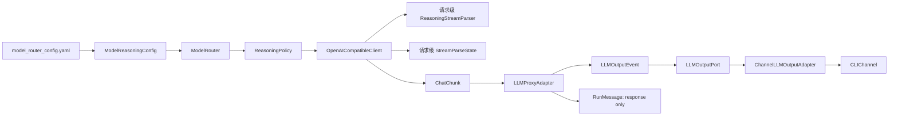
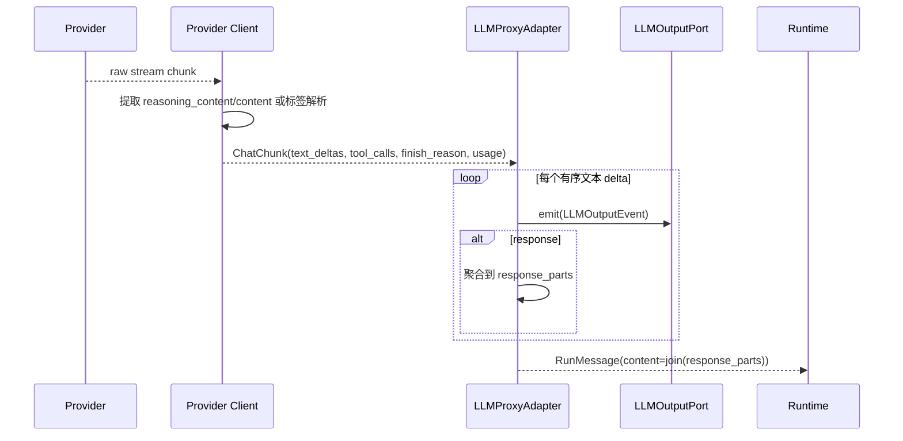

# LLM Reasoning / Response 双通道输出总体设计

> 状态：设计已确认，待开发
>
> 范围：LLM 流式输出协议升级与 Provider Client 并发安全修复

## 1. 背景与问题

当前调用链为：

```text
CLI / Channel
  → SessionInteractionService → SessionRunCoordinator → RuntimeEngine
  → LLMPort → LLMProxyAdapter → LLMProxy → ModelRouter → Provider Client
```

现有 `ChatChunk` 只携带 `content`、单个 `tool_call` 与 `is_final`。`LLMProxyAdapter` 将所有 `content` 聚合为最终回答，并通过 `TextStreamPort.emit(run_id, chunk)` 转发给 CLI。因此它无法区分模型的 reasoning 与面向用户的 response。

同时，`ModelRouter` 会缓存 Provider Client，而 `OpenAICompatibleClient` 将工具调用累计状态和 `finish_reason` 放在 Client 实例字段中。多个 Session 并发调用同一模型时，请求状态可能互相重置或串线。

## 2. 目标、非目标与范围

### 目标

- 将 OpenAI-Compatible Chat Completions 的 `reasoning_content` 与 `content` 标准化为有序文本增量。
- 支持按模型配置启用的 `<think>` / `<response>` 标签解析。
- Runtime 将两类增量作为结构化事件传递给入口层；CLI 分区实时展示“思考”和“回答”。
- 最终 `RunMessage.content`、Conversation、Context Version 和历史压缩只保存 response。
- Provider Client 可继续缓存复用，但所有请求级解析状态必须隔离。
- 保持现有工具调用、审批、持久化、Run 状态机和取消协议的职责不变。

### 非目标

- 不实现 OpenAI Responses、Gemini 或 Anthropic 的专有 reasoning 协议。
- 不实现完整 Run 事件总线、事件重放、断点续传、事件编号或重排。
- 不实现 reasoning 的持久化、审计正文、脱敏、权限开关或用户级显示开关。
- 不扩展 Capability/Purpose 路由、多模态、`generate()` API 或底层网络取消。

### 已确认决策

1. 原生 `reasoning_content` 是主路径；标签解析仅由模型配置显式启用。
2. `qwen3.7-max` 采用 `reasoning.mode: native`；其余现有模型保持 `none`，待实际 Provider 协议验证后逐个开启。
3. `ChatChunk` 是标准化数据包，不使用单一 `ChunkKind`；文本类型属于其中有序的 `ChatTextDelta`。
4. 只有已经向入口层发出 reasoning 或 response 文本时，当前 LLM 调用才视为“已输出”，不得重试或降级；此前失败可沿用候选模型重试/降级。
5. 标签解析不支持嵌套，以“正文不丢失”为准则容错。
6. `TextStreamPort` 一次性替换为 `LLMOutputPort`，不保留兼容别名。

## 3. 核心协议与唯一真相

### 3.1 LLM 公共协议

文件：`src/dotclaw/llm/base.py`

```python
class TextDeltaKind(StrEnum):
    REASONING = "reasoning"
    RESPONSE = "response"


@dataclass(frozen=True)
class ChatTextDelta:
    kind: TextDeltaKind
    content: str


@dataclass(frozen=True)
class ChatChunk:
    text_deltas: tuple[ChatTextDelta, ...] = ()
    tool_calls: tuple[ToolCall, ...] = ()
    finish_reason: str | None = None
    usage: LLMUsage | None = None
```

`ChatChunk` 可同时携带文本、已组装工具调用、结束原因和用量。`text_deltas` 是有序 tuple：原生字段同时存在时固定为 reasoning 后 response；标签模式严格按原始文本顺序产生。Provider 在跨原始包组装工具参数或 parser 在流结束时 flush 时，可以产生相应的标准化收尾包；因此“尽量保留原始包边界”是原则，而不是强制一对一不变量。

### 3.2 模型配置与解析策略

文件：`src/dotclaw/config/settings.py`、`src/dotclaw/llm/reasoning.py`

```yaml
reasoning:
  mode: native # none | native | tags
```

标签模式可覆盖 `reasoning_tags.start/end` 与 `response_tags.start/end`，默认分别为 `<think>`、`</think>`、`<response>`、`</response>`。

配置层只解析静态 `ModelReasoningConfig`；`ModelRouter` 在创建缓存 Client 时转换为不可变 `ReasoningPolicy`。Provider 不从 YAML 读取 SDK 字段名。

`ReasoningStreamParser` 为每次 `chat()` 新建的状态机：

- 未匹配结束标签按普通 response 原文输出；
- reasoning 区内嵌套开始标签按 reasoning 原文输出；
- 流结束时，已确认正文按当前区域输出，标签本身不展示；
- `mode=none` 不识别标签，所有 `content` 原样成为 response。

### 3.3 Runtime 输出协议

文件：`src/dotclaw/runtime/application/dto.py`、`ports.py`

```python
class LLMOutputKind(StrEnum):
    REASONING_DELTA = "reasoning_delta"
    RESPONSE_DELTA = "response_delta"


@dataclass(frozen=True)
class LLMOutputEvent:
    session_id: str
    run_id: str
    kind: LLMOutputKind
    content: str


class LLMOutputPort(Protocol):
    """接收一次 LLM 调用产生的有序增量输出事件。"""

    async def emit(self, event: LLMOutputEvent) -> None:
        ...
```

不增加 `sequence`、`call_index` 或 `llm_call_id`。当前单一异步迭代器与串行 `await emit()` 已保证单次调用交付顺序；Run 全局顺序和调用次数继续由既有 `RunEvent.sequence`、审计 `call_index` 表达。

## 4. 分层、依赖与职责



| 模块 | 允许职责 | 禁止职责 |
| --- | --- | --- |
| `config` | 加载和校验静态模型配置 | 解析流、访问 Provider SDK |
| `llm/reasoning.py` | 标签状态机和不可变策略 | 网络、Session、Run、YAML |
| Provider Client | 请求映射、原生字段提取、工具参数组装、标准化 Chunk | 知道 Runtime、CLI、Session/Run |
| `LLMProxy` | 路由、重试、降级 | 解析 Provider 字段、展示输出 |
| `LLMProxyAdapter` | `ChatTextDelta → LLMOutputEvent`、聚合 response | 解析标签、决定模型能力 |
| Channel Adapter | 解释展示 kind 并调用通用 `Channel.stream()` | 依赖 `ChatChunk` 或 Provider |

依赖方向固定为：`config` 不依赖 `llm`；`llm` 不依赖 `runtime`；Runtime adapter 可依赖 LLM 公共协议；Channel 只依赖 Runtime application DTO/Port；bootstrap 负责装配。

## 5. 数据、持久化与展示边界

| 数据 | 唯一所有者 | 是否持久化 | 生命周期 |
| --- | --- | --- | --- |
| 工具调用累计、finish reason、标签缓冲 | 单次 `chat()` 的局部状态 | 否 | 调用结束即释放 |
| `ReasoningPolicy` | 缓存 Provider Client | 否，静态配置可重建 | Client 生命周期 |
| reasoning delta | `LLMOutputEvent` / Channel | 否 | 实时展示 |
| response | `RunMessage.content` | 是 | Run、Conversation 与 Context 的既有生命周期 |

reasoning 不写入 checkpoint、RunMessage、Conversation 或 Context，因此审批恢复和中断重试均不重放已展示 reasoning；这符合当前“实时展示而非运行事实”的边界。

## 6. 正常流程



CLI 适配器以 `run_id` 维护当前展示 kind：首个 reasoning 前打印“思考”，首个 response 前打印“回答”，连续同类 delta 不重复标题。`main.py` 每次提交创建一个适配器，审批恢复继续透传同一个输出端口。

## 7. 失败、降级和并发

### 失败与降级

- 在任何可见 `ChatTextDelta` 被交付前发生失败：允许当前模型重试或切换候选模型。
- 已交付 reasoning 或 response 后发生失败：不得切换模型继续拼接，也不回滚 CLI 已展示内容；沿用流中断失败语义。
- 降级或重试创建新的 `StreamParseState` 与 `ReasoningStreamParser`，绝不复用失败调用的 buffer。
- 工具调用仍仅在 Provider 完成参数组装后交给 Runtime；其尚未执行时不构成“可见输出”。

### 并发不变量

`ModelRouter` 可以缓存 Client，但 Client 仅保存 API 配置、model ID、SDK/连接资源和不可变 Policy。它不得保存当前请求的工具参数、finish reason、token、标签状态、Session 或 Run。每次调用都新建 `StreamParseState` 和 parser，不加同模型全局锁。

## 8. 迁移与删除边界

这是一次同分支、分阶段验证、最终统一切换的内部协议迁移。配置层以 `mode=none` 保持旧 YAML 行为；Python 接口不保留双轨兼容。

| 旧项 | 唯一替代项 | 删除条件 |
| --- | --- | --- |
| `ChatChunk.content/tool_call/is_final` | `text_deltas/tool_calls/finish_reason/usage` | Provider、Proxy、Adapter、测试调用点归零 |
| `TextStreamPort` | `LLMOutputPort` | 所有 Runtime 入口、Fake 与 Channel Adapter 已迁移 |
| `ChannelTextStreamAdapter` | `ChannelLLMOutputAdapter` | CLI、审批恢复和测试无旧引用 |
| `has_streamed_text` | `has_streamed_response` | RunExecution、RunResult、Engine、CLI 与断言全部替换 |

## 9. 风险、限制与后续演进

- reasoning 是 Provider 暴露的文本，不被视作稳定或可信的审计事实；本阶段仅在本地 CLI 展示。
- 标签模式依赖模型遵守约定；容错目标是保留文本而非推断模型意图。
- 当前不保证底层网络取消立即生效。
- 后续若支持 Web/SSE、重连或持久化事件，应在更高层 Run 事件协议中引入 call/event ID，而不是反向污染 `ChatChunk`。

