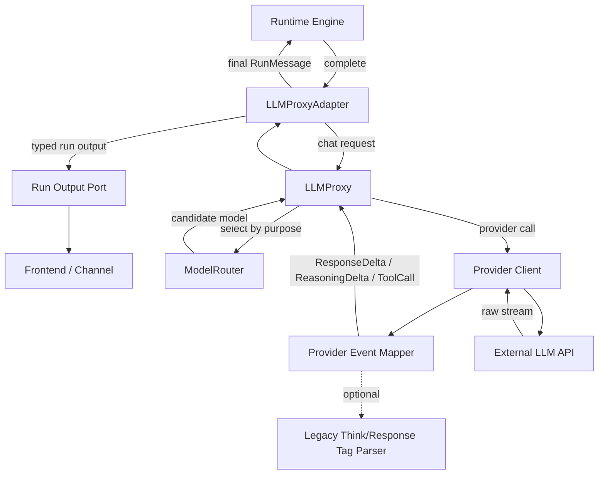

# dotClaw LLM 模块当前问题诊断

> 分析基线：`feat/applicationHost` 分支  
> 文档目的：明确当前 LLM 模块存在的问题、问题产生的原因、可能造成的影响、改造复杂度与推荐优先级。  
> 当前最紧要目标：
>
> 1. 支持模型返回的 `think`、`reasoning`、`response` 等不同输出通道，并将思考过程或推理摘要流式输出到前端；
> 2. 修复 Provider Client 的并发安全问题，避免多个 Run 并发调用同一模型时发生流式状态串线。

---

## 1. 当前模块概况

当前 LLM 调用链大致为：

```text
Runtime Engine
    ↓
LLMPort
    ↓
LLMProxyAdapter
    ↓
LLMProxy
    ↓
ModelRouter
    ↓
Provider Client / OpenAICompatibleClient
    ↓
外部模型服务
```

现有分层方向基本合理：

- Runtime 决定何时调用模型；
- `LLMProxyAdapter` 负责 Runtime 领域对象与旧 LLM 对象之间的转换；
- `LLMProxy` 负责模型候选遍历、重试、降级和流式保护；
- `ModelRouter` 负责根据 Purpose、模型状态、限流和熔断状态生成候选模型；
- Provider Client 负责调用具体供应商并解析流式响应。

目前的核心问题并不是分层完全错误，而是底层协议仍停留在简单的：

```text
Message(content: str)
        ↓
ChatChunk(content / tool_call / final)
```

该协议能够支持普通文本对话和基础 Function Calling，但难以继续承载：

- reasoning / think 输出；
- response 正文与 reasoning 的区分；
- 多模态输入；
- 结构化输出；
- 细粒度前端事件；
- 可靠取消；
- 更严格的模型能力路由。

---

# 2. 问题一：Provider Client 存在并发安全问题

## 2.1 当前实现

`OpenAICompatibleClient` 在 Client 实例字段中保存流式调用的临时状态：

```python
self._pending_tool_calls
self._stream_finish_reason
```

每次调用 `chat()` 时，会执行：

```python
self._reset_stream_state()
```

之后 `_parse_stream_chunk()` 会持续读写这些实例字段，以完成：

- 跨 Chunk 的工具名称拼接；
- 跨 Chunk 的工具参数拼接；
- finish reason 记录。

同时，`ModelRouter` 会缓存 Provider Client。也就是说，同一个模型的多个调用很可能共享同一个 Client 实例。

## 2.2 问题本质

Client 是长生命周期共享对象，但其中存放了单次请求的可变状态。

这违反了一个关键约束：

> 可缓存、可共享的 Provider Client 必须是无请求状态的，或者其请求状态必须完全隔离。

## 2.3 触发场景

假设同一个进程中同时存在两个 Run：

```text
Run A                              Run B
调用 chat()
_reset_stream_state()
收到 tool_call 第一个参数片段
                                   调用 chat()
                                   _reset_stream_state()
继续接收 Run A 的后续片段
                                   接收 Run B 的片段
```

Run B 的 `_reset_stream_state()` 会清空 Run A 正在使用的状态。

更严重时，两个请求可能交替修改同一个 `_pending_tool_calls`。

## 2.4 可能后果

- 工具调用参数被截断；
- A 请求的参数片段混入 B 请求；
- 工具名称或 call ID 串线；
- finish reason 错误；
- 某个 Run 丢失工具调用；
- 并发测试偶发失败，且难以稳定复现；
- 单用户本地运行正常，但多 Run、子 Agent 并行后出现异常。

该问题与未来 Multi-Agent、后台任务和多 Session 并行直接冲突。

## 2.5 推荐修复

将流式解析状态变成调用局部对象：

```python
@dataclass
class StreamParseState:
    pending_tool_calls: dict[int, PendingToolCall]
    finish_reason: str | None = None
```

调用时：

```python
async def chat(...):
    state = StreamParseState(pending_tool_calls={})

    async for chunk in response:
        for event in self._parse_stream_chunk(chunk, state):
            yield event
```

`_parse_stream_chunk()` 必须显式接收 `state`，不得读写 Client 的请求级实例字段。

## 2.6 改造复杂度

**复杂度：低到中。**

主要改动：

- 将两个实例字段移动到局部状态对象；
- 修改 `_parse_stream_chunk()` 参数；
- 增加并发流测试；
- 检查其他 Provider 是否也保存请求状态。

该改造不需要修改 Runtime、Router 或前端协议，适合最先实施。

## 2.7 优先级

**P0，必须首先修复。**

原因：这是已有功能的正确性问题，而不是新增能力问题。

---

# 3. 问题二：当前输出协议无法区分 think、reasoning 与 response

## 3.1 当前实现

当前 `ChatChunk` 主要包含：

```python
content: str
工具调用 tool_call
is_final
finish_reason
input_tokens
output_tokens
```

`LLMProxyAdapter` 对所有 `chunk.content` 做相同处理：

```python
content_parts.append(chunk.content)
await text_stream_port.emit(run_id, chunk.content)
```

因此，对 Runtime 和前端来说，所有模型输出都只是普通文本。

## 3.2 问题本质

不同供应商可能通过不同方式返回推理内容：

- 独立的 `reasoning_content` 字段；
- 独立的 reasoning delta 事件；
- `<think>...</think>` 标签；
- `analysis` 与 `final` 两种内容通道；
- 只返回可展示的 reasoning summary；
- 完全不返回 reasoning。

当前协议只认识 `content`，因此 Provider 即使解析到了 reasoning，也没有统一的上层表达方式。

## 3.3 为什么不能只在前端解析 `<think>`

一种最简单的做法是把完整文本直接传给前端，让前端解析：

```text
<think>...</think><response>...</response>
```

该方案存在明显问题：

1. 并不是所有模型都使用 XML 标签；
2. 标签可能跨多个流式 Chunk；
3. 模型正文可能包含同名标签；
4. Provider 已经拿到结构化 reasoning 时，重新拼成字符串会丢失信息；
5. 前端会耦合供应商协议；
6. 日后新增桌面端、CLI、WebSocket Channel 时，需要重复解析逻辑；
7. 标签未闭合或流中断时难以恢复。

因此标签解析只能作为兼容策略，不能成为 Runtime 的正式协议。

## 3.4 推荐方向：统一 LLM 输出事件

将单一 `ChatChunk` 升级为带类型的事件：

```python
class LLMEvent:
    pass

@dataclass(frozen=True)
class ResponseTextDelta(LLMEvent):
    text: str

@dataclass(frozen=True)
class ReasoningDelta(LLMEvent):
    text: str

@dataclass(frozen=True)
class ToolCallStarted(LLMEvent):
    call_id: str
    name: str

@dataclass(frozen=True)
class ToolCallArgumentsDelta(LLMEvent):
    call_id: str
    delta: str

@dataclass(frozen=True)
class ToolCallCompleted(LLMEvent):
    call: ToolCall

@dataclass(frozen=True)
class UsageReported(LLMEvent):
    input_tokens: int
    output_tokens: int

@dataclass(frozen=True)
class GenerationCompleted(LLMEvent):
    finish_reason: str
```

Provider 负责映射不同供应商的原始协议：

```text
供应商 reasoning_content ─┐
供应商 reasoning delta ───┼──→ ReasoningDelta
<think> 标签兼容解析 ─────┘

供应商 content ─────────────→ ResponseTextDelta
<response> 标签兼容解析 ────→ ResponseTextDelta
```

## 3.5 Runtime 与前端如何使用

`TextStreamPort` 目前只能传文本：

```python
emit(run_id, chunk: str)
```

它应逐步升级为通用输出事件端口：

```python
class RunOutputPort(Protocol):
    async def emit(self, event: RunOutputEvent) -> None:
        ...
```

例如：

```python
@dataclass(frozen=True)
class AssistantReasoningDelta:
    run_id: str
    text: str

@dataclass(frozen=True)
class AssistantTextDelta:
    run_id: str
    text: str
```

前端便可以分别渲染：

```text
思考中...
  reasoning delta

最终回答
  response text delta
```

## 3.6 关于“思考链路”的边界

工程上应区分：

1. **Provider 明确提供、允许展示的 reasoning 内容**；
2. **Provider 提供的 reasoning summary**；
3. **模型在普通文本中自行生成的 `<think>` 内容**；
4. **系统内部不可见、不可获取的隐藏推理过程**。

LLM 模块只能展示实际从 Provider 响应中得到的内容，不能假设所有模型都有完整思维链。

建议配置可见性：

```python
class ReasoningVisibility(StrEnum):
    HIDDEN = "hidden"
    SUMMARY = "summary"
    PROVIDER_EXPOSED = "provider_exposed"
```

## 3.7 最小改造方案

考虑到完整事件协议会影响 Adapter、Runtime 和 Channel，可以分两步实施。

### 第一步：小改造，优先满足前端展示

先扩展 `ChatChunk`：

```python
@dataclass
class ChatChunk:
    content: str = ""
    reasoning_content: str = ""
    channel: Literal["response", "reasoning"] | None = None
    ...
```

或者更简单：

```python
@dataclass
class ChatChunk:
    type: Literal[
        "response_delta",
        "reasoning_delta",
        "tool_call",
        "usage",
        "completed",
    ]
    content: str = ""
```

同时扩展流式端口：

```python
emit(run_id, channel, chunk)
```

该方案可以快速打通前端，但仍保留 `ChatChunk` 这一过渡类型。

### 第二步：完整事件化

再将 `ChatChunk` 替换成 `LLMEvent` 联合类型，并将 Tool Call 的开始、参数增量和完成事件也结构化。

## 3.8 改造复杂度

- **Provider 解析 reasoning：中等**；
- **LLM 事件协议：中等**；
- **Runtime 输出端口升级：中等**；
- **前端分类渲染：低到中**；
- **完整兼容不同 Provider：中到高**。

如果首版只支持当前主要 Provider，并允许使用过渡版 `ChatChunk.type`，整体复杂度可控制在中等。

## 3.9 优先级

**P0/P1，是当前最重要的新增能力。**

推荐顺序：

```text
先修 Provider 并发状态
    ↓
定义 response/reasoning 两类增量
    ↓
实现主要 Provider 的事件映射
    ↓
升级 Adapter 和前端输出
    ↓
最后兼容 <think>/<response> 标签流式解析
```

---

# 4. 问题三：Capability 已声明，但尚未成为可靠的路由约束

## 4.1 当前配置

当前 `model_router_config.yaml` 已声明模型能力：

```yaml
models:
  qwen3.7-max:
    capabilities: [chat, function_calling]

  text-embedding-v4:
    capabilities: [embedding]
```

同时也声明了用途：

```yaml
purposes:
  chat:
    priority: ...

  embedding:
    priority: ...

  context_compaction:
    priority: ...
```

说明 Capability 和 Purpose 的配置基础已经存在。

## 4.2 Capability 和 Purpose 的区别

### Capability：模型客观能做什么

例如：

```text
text_generation
embedding
function_calling
image_input
reasoning
structured_output
```

Capability 是模型属性。

### Purpose：本次调用为什么发生

例如：

```text
agent_response
context_compaction
history_summary
embedding
memory_extraction
```

Purpose 是业务调用属性。

同一个 Capability 可以服务多个 Purpose：

```text
text_generation
    ├── agent_response
    ├── context_compaction
    ├── history_summary
    └── memory_extraction
```

同一个 Purpose 也可能需要多个 Capability：

```text
agent_response
    ├── text_generation
    ├── function_calling
    └── image_input（当消息含图片时）
```

## 4.3 当前问题

当前 Router 主要根据 Purpose 的优先级得到候选模型，然后再根据状态、限流和熔断进行过滤。

如果 Capability 只是配置字段，但没有参与请求级硬过滤，可能出现：

- 带工具的请求被路由到不支持 Function Calling 的模型；
- 图片请求被路由到纯文本模型；
- embedding 请求错误进入生成模型；
- reasoning 强需求进入不支持 reasoning 的模型；
- forced model 与实际请求不匹配，直到供应商返回 400 才发现。

## 4.4 推荐使用位置

Capability 应主要用在 Router：

```text
GenerateRequest / EmbeddingRequest
        ↓
RequirementBuilder
        ↓
ModelRequirement
        ↓
ModelRouter
        ↓
先按 Capability 硬过滤
        ↓
再按 Purpose 排序
        ↓
再过滤状态、限流、熔断
```

请求需求可以从实际请求推导：

```python
required = {TEXT_GENERATION}

if request.tools:
    required.add(FUNCTION_CALLING)

if request.contains_image:
    required.add(IMAGE_INPUT)

if request.reasoning.enabled:
    required.add(REASONING)
```

## 4.5 改造复杂度

**复杂度：中等。**

需要：

- 规范 Capability 枚举；
- 给模型配置建立结构化描述；
- 从请求生成 `ModelRequirement`；
- Router 增加硬过滤；
- 增加能力不匹配错误；
- 增加配置启动校验。

该问题很重要，但不是当前 think/response 支持的前置条件。可以排在 reasoning 输出打通之后。

## 4.6 优先级

**P1。**

---

# 5. 问题四：LLMProxy 的接口和职责仍然偏向固定 Chat 调用

## 5.1 当前实现

`LLMProxy` 的主入口是：

```python
chat(messages, tools, model, purpose, stream, journal)
```

内部直接调用：

```python
client.chat(messages, tools, stream)
```

Embedding 则由另一个相对简单的 `embed()` 路径处理。

## 5.2 问题本质

当前 Proxy 既承担统一模型调用入口，又在实现层写死 Chat Completion 形态。

随着能力增加，容易出现：

```text
chat()
vision_chat()
reasoning_chat()
structured_chat()
audio_chat()
```

或者出现一个失去类型约束的万能接口：

```python
invoke(operation: str, **kwargs)
```

两种方式都不理想。

## 5.3 推荐方向

只区分少数真正不同的操作：

```python
class LLMOperation(StrEnum):
    GENERATE = "generate"
    EMBED = "embed"
```

其中：

- 文本、图片属于 Generate 的输入形式；
- reasoning 属于 Generate 的输出特性；
- Function Calling 属于 Generate 的输出能力；
- Structured Output 属于 Generate 的响应约束。

推荐接口：

```python
async def generate(
    request: GenerateRequest,
    control: CallControl | None = None,
) -> AsyncIterator[LLMEvent]:
    ...

async def embed(
    request: EmbeddingRequest,
    control: CallControl | None = None,
) -> EmbeddingResult:
    ...
```

## 5.4 改造复杂度

**复杂度：中到高。**

因为会影响：

- `base.py`；
- Provider 抽象；
- `LLMProxy`；
- Router 的 operation 过滤；
- Adapter；
- Context Compaction、Memory 等其他调用方。

不建议为了当前 think/response 需求立即完成全部重构。

可以先保留 `chat()`，在内部引入事件类型，后续再迁移到 `generate()`。

## 5.5 优先级

**P2。**

---

# 6. 问题五：Message 只能携带字符串，无法自然支持多模态

## 6.1 当前实现

```python
@dataclass
class Message:
    role: ...
    content: str
```

这意味着消息正文只能表示纯文本。

## 6.2 可能后果

后续支持图片时，通常只能临时采用：

- 在字符串中放 URL；
- 在字符串中放 Base64；
- 增加 `images` 平行字段；
- 在 Provider 中识别特殊字符串格式。

这些做法都会让领域协议与供应商格式混在一起。

## 6.3 推荐方向

将内容改为 Part：

```python
@dataclass(frozen=True)
class TextPart:
    text: str

@dataclass(frozen=True)
class ImagePart:
    source: MediaSource
    mime_type: str

ContentPart = TextPart | ImagePart

@dataclass(frozen=True)
class LLMMessage:
    role: MessageRole
    content: tuple[ContentPart, ...]
```

## 6.4 改造复杂度

**复杂度：高。**

因为会影响：

- Session/RunMessage 到 LLMMessage 的转换；
- Context Slot；
- 附件存储；
- 媒体权限和大小校验；
- Provider Request Mapper；
- Token 估算；
- Checkpoint 和持久化引用。

当前不紧急，可以等 reasoning 输出稳定后再做。

## 6.5 优先级

**P2/P3。**

---

# 7. 问题六：取消只存在于 Runtime 协议，没有真正取消底层 LLM 请求

## 7.1 当前实现

`LLMPort` 已声明：

```python
async def cancel(run_id: str) -> None
```

但 `LLMProxyAdapter.cancel()` 目前没有实际逻辑。

因此用户取消 Run 后，可能只是 Runtime 不再继续处理，而底层模型请求仍在运行。

## 7.2 可能后果

- SSE 连接继续占用；
- 模型继续生成并计费；
- 无用 Chunk 继续到达；
- 已结束 Run 仍向输出端口写数据；
- retry sleep 和限流等待无法及时停止；
- 并发槽位或连接迟迟不释放。

## 7.3 推荐方向

增加 Run 到活动调用的映射：

```python
@dataclass
class ActiveLLMCall:
    task: asyncio.Task
    cancel_event: asyncio.Event
    response_closer: Callable | None
```

```python
class LLMCallRegistry:
    active_calls: dict[str, ActiveLLMCall]
```

取消包含三层：

1. 设置 `cancel_event`，进行协作取消；
2. 对调用 Task 执行 `task.cancel()`；
3. 尽可能关闭 SDK 的流式 response。

同时必须确保：

```python
except asyncio.CancelledError:
    raise
```

取消不能被 Adapter 包装为 `LLMUnavailableError`。

## 7.4 改造复杂度

**复杂度：中到高。**

难点不是 `task.cancel()`，而是：

- Registry 的注册和清理；
- race condition；
- retry/fallback/限流等待时的取消；
- SDK 是否提供 response close；
- 取消后 Runtime 状态投影；
- 防止晚到 Chunk 写入前端。

## 7.5 优先级

**P1/P2。**

该问题重要，但不阻碍 think/response 首版输出。

---

# 8. 问题七：错误、重试、降级和可观测语义仍然不够精确

## 8.1 当前实现

当前主要按以下边界分类：

- 第一个 Chunk 之前失败：可以重试或切换模型；
- 已输出至少一个 Chunk 后失败：抛出 `NonRetryableStreamError`，不再切模型。

这个原则本身是正确的，因为用户已经看到部分输出后，另一个模型无法安全续写。

## 8.2 当前不足

错误类型还不足以表达：

- 鉴权错误；
- 参数错误；
- 模型不存在；
- 限流；
- 上下文超限；
- 内容过滤；
- 首 Token 超时；
- 流空闲超时；
- 用户取消；
- Provider 故障；
- 输出已经开始。

目前很多未知异常都会进入统一重试逻辑，可能造成无意义重试。

## 8.3 推荐方向

建立结构化错误：

```python
@dataclass
class LLMError(Exception):
    code: LLMErrorCode
    provider: str | None
    model: str | None
    retryable: bool
    fallback_allowed: bool
    output_started: bool
    message: str
```

不同错误采用不同策略：

| 错误 | 当前模型重试 | 切换模型 |
|---|---:|---:|
| 建连超时，尚未输出 | 是 | 是 |
| 429 限流 | 视策略 | 是 |
| API Key 错误 | 否 | 可切其他 Provider |
| 请求参数错误 | 否 | 通常否 |
| 上下文超限 | 否 | 可压缩或切长上下文模型 |
| 流中途断开 | 否 | 否 |
| 用户取消 | 否 | 否 |

## 8.4 Journal 的语义问题

当前实现收到首个 Chunk 后调用 `llm_call_end()`，这更接近“首 Token 到达”，而不是真正的调用结束。

建议拆成：

```text
llm.call.started
llm.first_token
llm.call.completed
llm.call.failed
llm.call.cancelled
llm.model.fallback
```

这对于前端展示思考过程也有价值：前端可以区分模型选择、等待首 Token、reasoning 输出和 final 输出。

## 8.5 改造复杂度

**复杂度：中等。**

可以渐进式完成，先补：

- Cancelled；
- Rate Limited；
- Context Overflow；
- Authentication；
- Stream Interrupted。

## 8.6 优先级

**P1/P2。**

---

# 9. 七个问题的优先级与复杂度汇总

| 编号 | 问题 | 性质 | 优先级 | 复杂度 | 是否是当前目标前置条件 |
|---|---|---|---|---|---|
| 1 | Provider Client 请求状态共享，并发不安全 | 正确性缺陷 | P0 | 低到中 | 是，必须先修 |
| 2 | 无法区分 reasoning/think 与 response | 核心新增能力 | P0/P1 | 中 | 当前主目标 |
| 3 | Capability 未真正参与请求级硬过滤 | 路由可靠性 | P1 | 中 | 否 |
| 4 | Proxy 接口写死 Chat，缺少统一 Generate 协议 | 架构扩展性 | P2 | 中到高 | 否，可后移 |
| 5 | Message 只支持字符串，无法自然支持多模态 | 输入协议限制 | P2/P3 | 高 | 否 |
| 6 | Runtime 有取消协议，但底层请求未真正取消 | 资源与状态可靠性 | P1/P2 | 中到高 | 否 |
| 7 | 错误、重试、降级、Journal 语义不精确 | 韧性与可观测性 | P1/P2 | 中 | 部分相关 |

---

# 10. 当前推荐的最小改造范围

考虑改造复杂度，当前不建议一次性重写整个 LLM 模块。

建议当前迭代只完成以下范围。

## 10.1 必做：修复 Provider 并发状态

目标：

- Client 实例中不再保存请求级流状态；
- 同一个 Provider Client 可以被多个 Run 并发安全使用；
- 增加两个并发 Tool Call 流的自动化测试。

涉及范围：

```text
llm/openai_compat.py
Provider 测试
```

## 10.2 必做：引入 response/reasoning 两种流事件

首版可以不立即完成完整 `LLMEvent` 体系，只增加过渡协议：

```python
class ChunkType(StrEnum):
    RESPONSE_DELTA = "response_delta"
    REASONING_DELTA = "reasoning_delta"
    TOOL_CALL = "tool_call"
    COMPLETED = "completed"
```

```python
@dataclass
class ChatChunk:
    type: ChunkType
    content: str = ""
    tool_call: ToolCall | None = None
    ...
```

Provider 映射：

```text
reasoning_content → REASONING_DELTA
普通 content → RESPONSE_DELTA
```

## 10.3 必做：升级 Runtime 输出端口

可以先做最小修改：

```python
async def emit(
    self,
    run_id: str,
    channel: Literal["reasoning", "response"],
    chunk: str,
) -> None:
    ...
```

后续再升级成完整 `RunOutputEvent`。

## 10.4 必做：前端分通道展示

前端应至少支持：

```text
reasoning：折叠区域、思考区域或状态区域
response：最终回答正文
```

前端不能直接依赖某家模型的 `reasoning_content` 字段，也不应负责解析供应商协议。

## 10.5 可选：兼容 `<think>` / `<response>` 标签

标签解析应位于 Provider 兼容层或专门的 Stream Tag Parser 中。

解析器需要支持：

- 标签跨 Chunk；
- 一个 Chunk 内出现多个标签；
- 标签未闭合；
- 没有标签时默认作为 response；
- 流结束时残余缓冲区处理。

不要使用简单的每 Chunk 正则表达式，因为标签可能被拆分为：

```text
Chunk 1: "<thi"
Chunk 2: "nk>正在分析"
Chunk 3: "...</think><res"
Chunk 4: "ponse>结论"
```

## 10.6 当前暂缓

以下内容不应与当前需求捆绑到同一迭代：

- 完整多模态 Message Part；
- `chat()` 全面替换为 `generate()`；
- 全部 Capability 路由重写；
- 完整 Call Registry 和底层 HTTP 取消；
- 全量错误体系重构。

这些内容可以在 response/reasoning 输出稳定后逐步推进。

---

# 11. 当前迭代后的推荐依赖关系



该阶段的关键边界：

```text
Provider
负责识别供应商原始 reasoning / content

LLMProxy
负责重试、降级，不负责前端展示

LLMProxyAdapter
负责将 LLM 流事件转换为 Runtime 输出事件

Frontend
只根据 reasoning / response 类型渲染，不解析供应商字段
```

---

# 12. 推荐实施顺序

```text
阶段 1：修复 Provider Client 并发状态
    ↓
阶段 2：定义过渡版 ChunkType
    ↓
阶段 3：实现主要 Provider 的 reasoning/response 映射
    ↓
阶段 4：升级 LLMProxyAdapter 和输出端口
    ↓
阶段 5：前端分通道展示
    ↓
阶段 6：增加 <think>/<response> 标签兼容解析
    ↓
阶段 7：补充并发、标签跨 Chunk、流中断测试
```

---

# 13. 结论

当前 LLM 模块最需要区分两类问题：

## 已有功能的正确性问题

Provider Client 将请求级流状态放在共享实例中，是实际存在的并发安全缺陷。该问题改造范围相对可控，应立即修复。

## 当前最重要的能力缺口

现有 `ChatChunk(content)` 和 `TextStreamPort(chunk)` 只能表达单一文本流，无法让 Provider、Runtime 和前端稳定地区分 reasoning 与最终回答。

当前最合适的策略不是立即全面重写 LLM 模块，而是先建立一个最小但正确的两通道事件协议：

```text
REASONING_DELTA
RESPONSE_DELTA
```

在此基础上打通：

```text
Provider 原始响应
    → LLM 类型化 Chunk
    → Runtime 类型化输出
    → 前端分类展示
```

等该链路稳定后，再继续推进 Capability 硬过滤、统一 GenerateRequest、多模态和真实取消。
