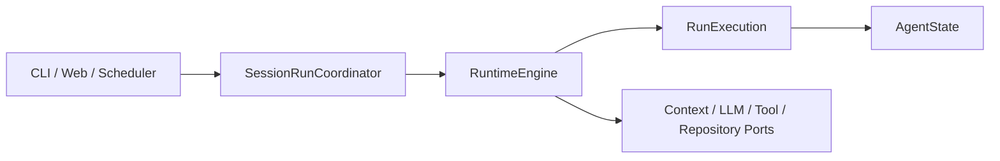
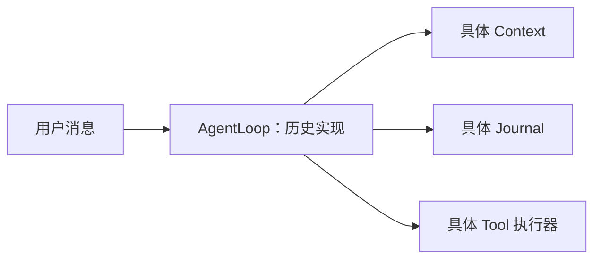

# 开发架构状态

> 当前 Runtime 设计以 [Runtime 重构设计](runtime/runtime重构设计.md) 为唯一实施依据；本页用于区分现行设计和历史资料。

## 现行 Runtime 目标

`RuntimeEngine` 是业务无状态的共享执行协调器。每个 `AgentRun` 创建独立的 `RunExecution`，纯 `AgentState` 决定下一步动作，具体的上下文、LLM、工具与持久化能力均通过 Port 接入。

## 历史设计：AgentLoop

下图仅用于理解旧资料，**不代表当前或新增代码的实现方向**。旧 `AgentLoop` 将执行控制、上下文与具体基础设施放在同一条调用链中；后续迁移不得据此新增依赖。

旧 API 的调用方、替代方向和删除条件见
[Runtime 重构迁移清单](runtime/runtime重构迁移清单.md)。
