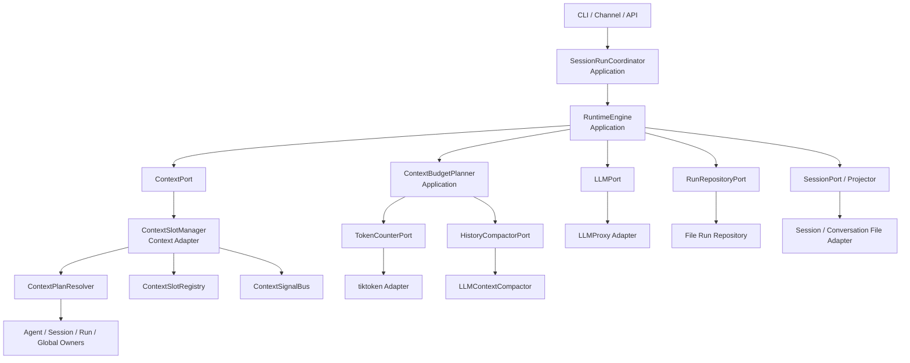
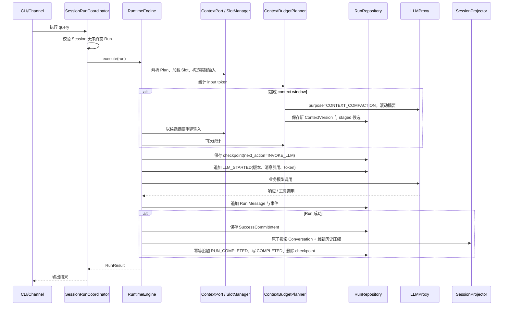

# LLM_STARTED 前上下文压缩与上下文槽重构整体设计

> 状态：设计已确认，待按开发计划实施
> 范围：Runtime v3 的上下文版本、Session 历史压缩、Context Slot 生命周期、严格 Session 串行与可恢复模型中断。
> 关联文档：[详细开发计划](LLM_STARTED前上下文压缩与上下文槽重构开发计划.md)

## 1. 背景、问题与范围

现有 Runtime 已具备 `messages.json`、`events.jsonl`、`run.json`、`checkpoint.json` 与 `session.json` 的持久化分层，但上下文仍以启动时固定 Slot 元组和 `initial_context` 快照组织。它存在以下问题：

| 问题 | 当前表现 | 目标状态 |
|---|---|---|
| 历史超限 | Run 创建前直接压缩并写入 Session，无法覆盖工具调用后的上下文增长 | 每次业务模型调用的 `LLM_STARTED` 前按实际输入检查，并将候选延迟到 Run 成功时提交 |
| 上下文审计 | `initial_context` 只能描述初始输入，无法还原多轮工具调用后的上下文演化 | `messages.json.context_versions` 保存完整、有序、不可变的上下文版本 |
| Slot 生命周期 | Runtime 组合根创建固定 Slot 元组，缓存范围与真实数据 Owner 混在一起 | Slot 统一注入接口，但数据仍归 Agent、Session、Run、Global 等实体所有 |
| 失败恢复 | 模型不可用会使 Run 失败或留下运行态 | 调用前保存 checkpoint；代理重试耗尽后转为可恢复的 `INTERRUPTED` |
| Session 一致性 | 审批等待后可能释放调度权，导致同一 Session 的上下文分叉 | 一个 Session 同时仅允许一个未终态 Run，包含等待审批和中断状态 |

本次只重构 Runtime 上下文与持久化边界，不改变 Tool、Skill、Memory、Channel 的业务含义，也不实现多 Run 分支合并、跨进程 Slot 信号队列或用户普通 query 队列。

### 1.1 核心术语

| 术语 | 定义 |
|---|---|
| Conversation | Session 中一条完整的用户问题及其最终回答；历史压缩的最小单位，禁止拆分。 |
| Run Message | 单次 AgentRun 内追加的用户输入、LLM 请求/响应、工具调用与工具结果等审计事实。 |
| Context Slot | 将某个 Owner 的内容转换为可注入 LLM 请求的结构化贡献的适配单元，不拥有领域数据。 |
| Context Plan | 某次 Run 实际启用、排序后的 Slot 绑定集合。 |
| Context Version | 一个 Context Plan 的完整、不可变快照；版本从 1 连续递增。 |
| Staged History Compression | 已生成但尚未提交到 Session 的历史压缩候选；其控制信息归 Run，摘要正文归 Context Version。 |
| Incremental Messages | 当前 LLM 请求中除 Context Version 外，由 Run Message 事实引用带入的消息集合。 |

## 2. 已确认的架构决策与不变量

1. **Session 严格串行。** 同一 Session 至多一个未终态 Run；`RUNNING`、`WAITING_APPROVAL`、`INTERRUPTED` 都占有调度权。普通 query 返回 `SESSION_BUSY`，不创建队列；审批、拒绝、取消是对活动 Run 的控制命令。
2. **压缩只处理 Session Conversation。** Run 的工具结果、模型中间消息、委派结果永远保留在 `messages.json.messages`，不进入 `history_compressions`。
3. **检查发生在每次业务 LLM 调用前。** 统计当前真实输入：系统内容、压缩摘要、未压缩历史、当次用户输入、Run Message、工具 Schema 与协议开销；不为未来输出或下一轮预留空间。
4. **超过窗口时压缩最旧 75%。** 从当前压缩边界后的完整 Conversation 选择最旧 75%，至少保留一条最新 Conversation 原文；摘要输入过大时按完整 Conversation 分批滚动摘要。压缩后仍超限即以确定性错误失败，禁止静默裁剪。
5. **候选只在 Run 成功时提交。** `session.json` 只保存已提交的 Conversation 与历史压缩；取消、审批等待、失败与中断都不改写它。
6. **Context Version 是 Run 内不可变审计事实。** 内容变化追加新版本，不更新旧版本；不使用 `previous_version`。快照只包含本次 Context Plan 已绑定的 Slot。
7. **Slot 是统一的注入抽象，Owner 才是数据真相。** Slot 不直接写 Session、Run 或 Agent 配置；它们通过明确的 Port 读取各 Owner 的数据。
8. **模型代理负责单次调用重试。** 重试耗尽且服务不可用时，Runtime 保存 checkpoint 并转为 `INTERRUPTED`；参数、Token 计数器和不可满足的预算等确定性问题转为 `FAILED`。
9. **本次直接采用 v3。** 现有 Session 数据视为测试数据；不读、不写 v1/v2，也不提供迁移脚本或兼容分支。

## 3. 目标分层与依赖方向



`runtime.domain` 仅保存跨技术成立的事实模型和枚举，不导入 `context`、文件实现、LLM SDK 或 CLI。`runtime.application` 编排状态机，只依赖 Port。`context` 是 `ContextPort` 的适配器实现；组合根负责装配 Registry、Owner 读取 Port、Manager、TokenCounter 与 LLM Adapter。

目标文件树保持精简，实际文件名可在实现时微调，但职责不得漂移：

```text
src/dotclaw/
├── runtime/
│   ├── domain/context.py                 # ContextVersion、快照、候选、枚举
│   ├── application/context_budget.py     # 预算决策、候选编排
│   ├── application/engine.py             # LLM_STARTED 安全点、恢复、成功提交
│   ├── application/session_run_coordinator.py
│   ├── application/ports.py               # Context、Token、压缩、存储等 Port
│   └── adapters/tiktoken_token_counter.py
└── context/
    ├── contracts.py                       # Slot、Contribution、Binding、Descriptor
    ├── registry.py                        # Slot 类型注册与构造
    ├── plan_resolver.py                   # 多 Owner 组合为 Context Plan
    ├── slot_manager.py                    # 缓存、刷新、释放、信号分发
    ├── signals.py                         # 进程内信号总线
    ├── provider.py                        # ContextPort 组装实现
    └── slots/                             # Agent / Session / Run / Global Slot
```

## 4. 模块职责、数据所有权与公开契约

| 模块 | 解决的问题 → 机制 → 收益 | 持有状态 / 唯一真相 | 公开输入与输出 | 禁止职责 / 迁移关系 |
|---|---|---|---|---|
| `ContextSlot` | 用统一结构接入不同上下文来源 → `load`、`refresh`、`release` → 新 Slot 不需修改 Engine | 仅私有缓存；不拥有业务数据 | `load(binding) -> ContextContribution`；`refresh(request)`；`release()` | 不写 Session/Run/Agent；替代 `produce() -> str | None` |
| `ContextSlotRegistry` | 消除启动时固定元组 → 注册 Descriptor 与构造器 → 新 Slot 可声明式接入 | Slot Descriptor 与工厂 | 注册、查询、构造 | 不组装请求、不缓存内容 |
| `ContextPlanResolver` | 将不同生命周期内容组合为一次调用的有效计划 → 根据 Owner 配置解析 Binding → 只快照已启用 Slot | 无业务内容 | `resolve(agent, session, run) -> ContextPlan` | 不加载 Slot 内容；替代固定 Slot 元组 |
| `ContextSlotManager` | 统一缓存刷新与释放 → 按 Binding 管理实例、处理定向刷新和信号 → Slot 与外部变更解耦 | 实例缓存、失效标记、订阅关系 | `request_refresh`、`drain_signals`、`load_plan`、`release_scope` | 外部不得直接调用具体 Slot 的 `refresh` |
| `ContextPort` | 将 Plan 物化为 LLM 实际输入 → 组装 Contribution、工具定义、Run 消息引用 → Engine 不依赖 Slot 实现 | 无持久化真相 | `build_context(...) -> ContextBundle` | 不决定预算、不写版本；演进自 `SlotContextProvider` |
| `ContextBudgetPlanner` | 防止真实输入超窗口 → TokenCounter 计数、75% 选择与分批摘要 → 不丢当前输入 | 无长期状态 | `plan(context) -> ContextBudgetDecision` | 不直接写 Session/Run；不做字符数估算 |
| `RuntimeEngine` | 建立可恢复 LLM 安全点 → checkpoint、版本保存、事件、状态迁移 → 可审计可重试 | `RunExecution` 为内存控制状态 | 执行、恢复、重试、完成 | 不持有 Slot、Session 或文件实现 |
| `SessionRunCoordinator` | 保证 Session 一致上下文 → 未终态 Run 占有 Session → 无分支竞争 | 活动 Run 占用关系 | 创建、控制、重试、放弃 | 不解释 Slot 与压缩算法 |
| Run Repository | 保存 Run 的事实和控制面 → 原子文件写、恢复意图 → 崩溃后可补偿 | `messages.json`、`events.jsonl`、`run.json`、`checkpoint.json` | 追加事实、保存版本、保存 checkpoint、提交成功 | 不重算上下文、不拥有 Session 历史 |
| Session Repository / Projector | 保存长期会话事实 → 成功提交时投影 Conversation 与最新摘要 → 避免未完成 Run 污染 | `session.json` | 读取、原子应用成功投影 | 不保存 Run Message 或候选正文 |

### 4.1 Owner 与 Slot 的关系

| Owner | 代表性 Slot | Owner 的数据真相 | 刷新来源 |
|---|---|---|---|
| Agent | identity、skills、tools | `AgentContextProfile`、启用 Tool/Skill 配置 | 配置/注册表显式变更 |
| Session | history、user_info、文件内容 | `session.json`、Session 绑定资源 | Session 写入、文件版本变化或定向刷新 |
| Run | run_messages、memory、knowledge | `messages.json.messages`、本次检索结果 | 新 Run Message、Tool 完成、显式刷新 |
| Global | available_agents | Agent 注册表/全局服务 | 注册表变更 |

`Agent` 在本文特指可注入能力的 `AgentContextProfile`，既不是 `AgentIdentity`，也不是运行中的 `AgentRun`。Tools Slot 只将工具策略或简短说明贡献给系统内容；实际工具 Schema 必须从 Agent 的启用工具 ID 经 `ToolAvailabilityResolver/ToolCatalog` 解析，唯一进入 `ContextBundle.tools`。

## 5. 数据容器与唯一真相

| 物理文件 | 保存内容 | 不保存内容 | 唯一写入者 | 读取者与生命周期 |
|---|---|---|---|---|
| `messages.json` v3 | `context_versions` 完整快照、Run Message 事实 | Session 最终 Conversation、候选控制状态 | Run Repository | 审计、恢复、LLM 输入重建；Run 保留期内存在 |
| `events.jsonl` | `LLM_STARTED`、状态迁移、审批与恢复事件 | 大段上下文正文 | Run Repository | 审计和恢复；与 Run 同生命周期 |
| `run.json` | Run 状态、`active_context_version`、候选元数据/引用、成功提交意图 | 摘要正文、重复 Message 内容 | Run Repository | 协调器、Engine、恢复；与 Run 同生命周期 |
| `checkpoint.json` | 下一动作、消息/事件序号、Context Version、预算决策、候选引用 | 最终 Session 投影 | Run Repository | 中断恢复；终态或放弃后删除 |
| `session.json` | 已提交 Conversation、`history_compressions`、压缩边界及版本 | Run 中间消息、未提交候选 | Session Repository / Projector | 下一 Run 的 History Slot；Session 删除时清理 |

`messages.json` 的顶层版本固定为 `3`。每个 `context_versions` 元素包含连续 `version`、创建时间、完整 Slot 快照、有序注入序号、内容 hash 与整体 hash。每个计划内 Slot 必须出现，状态为 `INCLUDED`、`EMPTY` 或 `FAILED`；仅注册但未启用的 Slot 不写入。`RunMessagesSlot` 仅产生 Message ID 引用，消息正文仍只存在 `messages.json.messages`。

`run.json.staged_history_compressions` 包含候选 ID、状态、Session 基线、覆盖至的 Conversation ID、源 hash、摘要 hash 与 Context Version 引用。摘要正文只能在对应 Context Version 的 History Slot 载荷中出现一次。同一 Run 可保留多个候选以审计，但成功路径仅提交最新候选。

## 6. 正常调用与成功提交



成功提交以 `SuccessCommitIntent` 为恢复边界：先持久化包含最终 Conversation、最新候选引用和目标状态的意图；随后 Session Projector 对 `session.json` 原子应用 Conversation 与摘要；最后幂等写入 `RUN_COMPLETED` 和 `run.json=COMPLETED`。进程在任一中间点停止时，恢复器根据意图重复未完成步骤，禁止留下“事件完成而 Session 未投影”的矛盾事实。

## 7. 状态、异常与恢复边界

| 场景 | Run 状态与持久化 | Session/候选副作用 | 恢复或后续操作 |
|---|---|---|---|
| 正常完成 | `COMPLETED`，删除 checkpoint | 原子提交最终 Conversation 和最新候选 | 释放 Session |
| 用户取消 | `CANCELLED`，保留审计、删除 checkpoint | 不提交候选 | 释放 Session |
| 审批等待 | `WAITING_APPROVAL`，checkpoint 保留 | 不提交候选，仍占有 Session | 仅批准/拒绝/取消控制命令可操作 |
| LLM 服务重试耗尽 | `INTERRUPTED`，checkpoint 的 `next_action=INVOKE_LLM` | 不提交候选，仍占有 Session | `retry_interrupted(run_id)` 恢复 |
| 进程重启发现 `RUNNING` | 转为 `INTERRUPTED(PROCESS_RESTART)` | 不提交候选 | 显式重试或放弃 |
| Tokenizer 未配置/不可用、压缩后仍超限、参数错误 | `FAILED` | 不提交候选 | 释放 Session；修复配置后重新发起 Run |
| 用户在中断 Run 上提交新 query | 旧 Run 变 `ABANDONED`，删除 checkpoint | 不提交候选；保留审计 | 创建新 Run |

压缩 LLM 与业务 LLM 都由 Proxy 在单次调用内重试。重试耗尽后的不可用属于可恢复外部错误；不能把代理内部重试或网络细节下沉到 Slot、Session 或文件 Adapter。每次业务 LLM 调用前必须写 checkpoint；压缩调用失败时不得生成新 Context Version 或 staged 候选，且不得写业务 `LLM_STARTED`。

## 8. 并发、一致性与幂等

隔离单位是 Session，而非单次 LLM 调用。`SessionRunCoordinator` 必须以持久化的活动 Run 状态判定占用，进程内锁只用于缩小同进程竞争窗口，不能作为唯一真相。所有未终态状态均不释放占用；因此本期没有同 Session 的 Run A/Run B 并发、摘要合并或 Conversation 分支问题。

文件持久化使用临时文件加原子替换。所有恢复动作以 `run_id`、候选 ID、Conversation ID 与事件 ID 幂等：重复恢复不得追加重复 Conversation、重复摘要或重复终态事件。`Context Version` 只能追加，且只有 Slot 载荷 hash 变化时生成新版本，确保审计引用稳定。

## 9. 扩展点与后续演进

| 扩展点 | 当前最小契约 | 当前不决定的内容 | 需具备的契约测试 |
|---|---|---|---|
| `TokenCounterPort` | 输入实际 LLM 请求，返回精确 token 数或明确错误 | 非 tiktoken 的供应商 Tokenizer | 工具 Schema 计数、缺编码告警与拒绝 |
| `HistoryCompactorPort` | 输入前摘要与完整 Conversation 批次，返回摘要 | 模型选择、提示词细节、未来 fallback | 单批、滚动分批、失败不产生候选 |
| `ContextSignalBus` | 发布与消费进程内类型化信号 | 跨进程队列、排序、重放、持久化 | 仅订阅 Slot 收到、未订阅 Slot 不刷新 |
| `ContextSlotRegistry` | 注册 Descriptor 与构造器，按 Slot ID 构建 | 插件发现和热卸载 | 新 Slot 不修改 Engine/Provider 即可加入 Plan |

后续若需要跨进程或持久化信号总线，必须新增事件顺序、去重键、重放窗口和崩溃恢复设计，不得将当前进程内 SignalBus 直接宣称为可靠消息队列。后续如开放同 Session 并行 Run，必须先引入 Session Branch、Conversation merge 与压缩冲突策略；本期不具备此能力。

## 10. 迁移、删除、风险与限制

本次是破坏性 v3 切换：本地 Session 均可删除，不做在线数据迁移、旧读兼容或回滚到 v2。回滚边界是代码版本回退并清空测试 Session 目录，不能混读同一份旧数据。

| 旧项 | 替代关系 | 物理删除条件 |
|---|---|---|
| `initial_context` 与其 Repository/Port 方法 | `context_versions` + `active_context_version` | v3 读写、审批恢复和输入重建测试通过；生产搜索无引用 |
| `requires_messages_migration()` 与 v1/v2 分支 | 无替代兼容层，直接拒绝旧格式 | 所有 fixture 改 v3；迁移脚本和测试删除 |
| `ContextCompactionScope.RUN_CONTEXT` | 仅保留 `SESSION_HISTORY` 历史压缩语义 | 领域、Adapter、测试、文档搜索归零 |
| `SessionHistoryPreparationService` 预压缩写 Session | Engine 的 `LLM_STARTED` 前 staged 压缩 | 动态压缩、取消/中断不提交测试通过 |
| 固定 Slot 元组与 `produce()` | Registry + PlanResolver + Manager + `load()` | 默认组合根、测试和调用方迁移完成 |
| `SlotCacheScope` 混合枚举 | Owner、刷新策略、缓存范围三个独立枚举 | 不再存在 `STATIC/SESSION/CONDITIONAL/DYNAMIC` 混用 |
| Workspace/Project 默认 Slot | 不纳入默认 Plan | 无生产引用及针对默认注入的测试 |
| 字符数除以 4 的 token 估算/静默裁剪 | `TokenCounterPort` + 明确预算失败 | 所有预算路径和测试改为 TokenCounter |

风险主要在于 tokenizer 编码与模型实际分词可能不完全一致。首期对 Qwen 压缩路由显式配置 `cl100k_base` 兼容编码，并将编码随策略冻结；若没有明确编码则记录不含 prompt 内容的 `WARNING` 并拒绝调用，而不是静默低估。代码与测试完成前，本文的目标能力均为设计要求，不可表述为已经具备的运行时事实。
