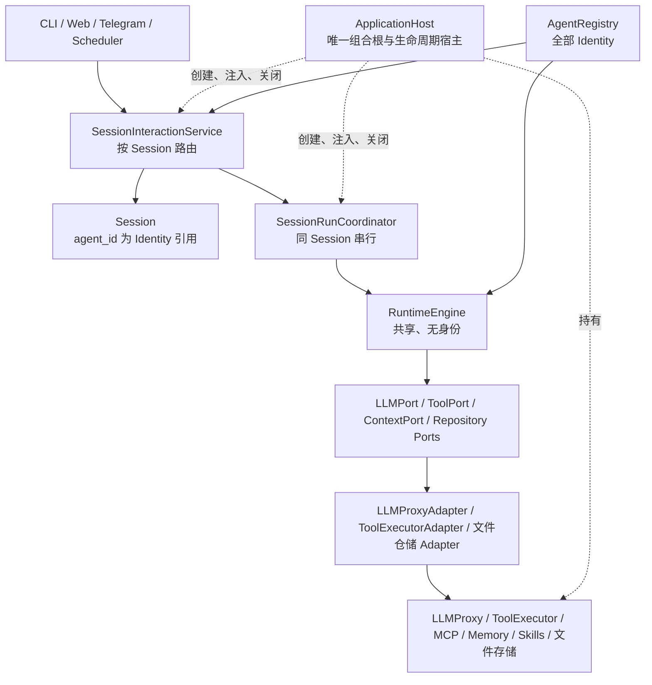
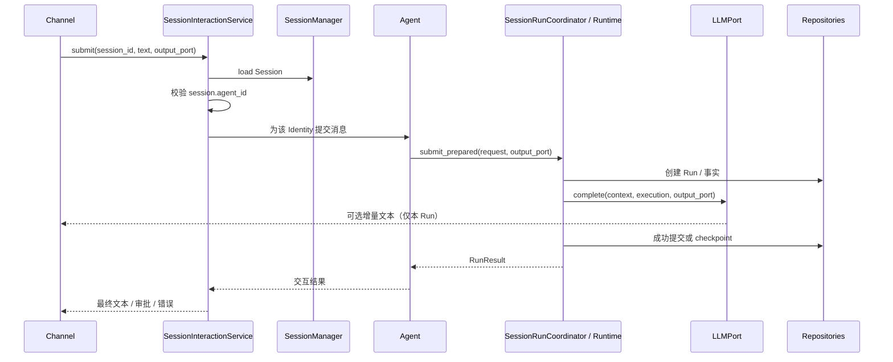

# Runtime ApplicationHost 收口总体设计

## 1. 背景、目标与范围

### 1.1 背景

当前入口由 `main.py` 构建 `ApplicationHost`（唯一组合根）启动。`ApplicationHost` 创建并持有全部应用级资源、调用 `bootstrap/runtime_factory.py` 装配 Runtime，使 `agent/` 回归为内部轻量门面，不再反向承担应用组合根职责，且 `Agent` 仅持有身份与协调器、不持有任何基础设施或资源生命周期。

Runtime v4 的端口与状态机边界已经存在，但其组合根、Session 到 Identity 的绑定、跨 Channel 流输出和审批恢复仍未收口。项目定位为本地、单进程 Agent harness，本次目标是完成主架构的逻辑闭环，不引入分布式运行时或新的业务能力。

### 1.2 目标

- 建立 `bootstrap.ApplicationHost` 作为唯一公开组合根和资源生命周期所有者。
- 让用户以 Session 为交互单位；每个 Session 持久化绑定一个 Identity，而非绑定内存中的 Agent 对象。
- 将 `Agent` 收缩为内部的、身份化的轻量交互门面；`RuntimeEngine` 保持共享、无身份、无单次 Run 状态。
- 将流输出目标改为提交/Run 级依赖，允许多个 Channel 共享一个 Runtime 而不串流。
- 使所有注册 Identity 的 Context Slot 配置都能生效。
- 移除审批恢复对 `ToolExecutorAdapter` 进程内状态的依赖，使重启后可从持久化事实安全恢复。
- 明确 Session 删除、启动初始化、降级和恢复的责任边界。

### 1.3 非目标

- 不实现多进程或多节点 Session 租约。
- 不补造底层 LLM/工具的强制取消句柄；继续保留当前 best-effort 取消协议。
- 不大规模拆分 `RuntimeEngine` 的状态机实现。
- 不新增泛化的 `ChatService` 或 `RuntimeOperations`。后续出现第二个真实 Channel 调用者时再提取具体用例接口。
- 不迁移或删除开发者现有本地测试数据；测试数据由开发者自行清理。

### 1.4 术语

| 术语 | 本设计中的含义 |
| --- | --- |
| Identity | 持久化可引用的 `agent_id` 及其模型、提示词、工具白名单、上下文 Slot 等策略配置。 |
| Agent | 内部轻量门面：以一个 Identity 构造请求并调用共享 Coordinator；不是用户可见的长驻执行器。 |
| Session | 用户可见的连续对话容器，持久化绑定一个 Identity，并保存成功对话与会话级摘要。 |
| Run | 一次真实任务执行，持有状态机、消息、事件、checkpoint 和冻结策略。 |
| Runtime | 共享、无身份的执行内核，负责状态机、持久化、恢复、审批、取消和并发协调。 |
| ApplicationHost | 最外层组合根与生命周期宿主；不承载领域业务或 Channel 呈现逻辑。 |

## 2. 现状与目标差异

| 主题 | 当前事实 | 目标唯一真相 |
| --- | --- | --- |
| 组合根 | `agent/factory.py` 创建大部分基础设施，`runtime_factory.py` 只装配部分 Runtime。 | `ApplicationHost` 创建并持有全部应用级资源；Runtime 工厂仅为内部装配函数。 |
| Agent | 同时持有 `ToolExecutor`、MCP、Skills、Dream、ContextPort 和关闭逻辑。 | Agent 只持有 Identity 与 Coordinator，负责交互请求/结果转换。 |
| Session Identity | 已有 `Session.agent_id` 字段，但创建入口未保证写入，提交也不验证。 | `Session.agent_id` 必填且为提交 Identity 的唯一权威。 |
| Channel 流输出 | `LLMProxyAdapter` 构造时绑定一个 `TextStreamPort`。 | 输出端口仅属于一次提交/Run，Runtime 实例可被多个 Channel 共享。 |
| Context 配置 | 仅用启动主 Identity 构建 Agent Owner 的 Slot 覆盖。 | 从完整 Identity Registry 构造每个 Identity 的 Slot 覆盖。 |
| 审批恢复 | `ToolExecutorAdapter` 以 `_waiting_calls` 内存集合判断已批准调用。 | 批准事实由 checkpoint/控制状态传递；Adapter 不保存恢复权威状态。 |
| Session 删除 | 仅删除 `session.json`，会遗留运行目录和审批记录。 | 应用级删除流程拒绝活动 Run，并完整清理关联存储和缓存。 |

## 3. 目标架构

依赖方向必须始终由外向内：Channel 和 bootstrap 可以依赖交互门面、Runtime Port 与具体基础设施；Runtime application 只能依赖 Protocol/DTO/domain；Adapter 可以依赖具体基础设施；domain 不依赖上述任一层。

## 4. 模块职责与公开接口

### 4.1 `bootstrap.ApplicationHost`

`ApplicationHost` 是唯一公开启动对象。它负责：读取配置、加载所有 Identity、创建基础设施、装配 Runtime、完成首次 MCP 发现、执行启动恢复，并在 `shutdown()` 中按依赖逆序关闭资源。

它公开给入口层的最小能力为：

- `session_interaction`：提交消息、审批、取消、重试、放弃；
- `session_manager`：创建、查询和列举 Session；
- 必要的只读诊断资源，暂供现有 CLI 的 `/tools`、`/mcp`、`/skills`、`/dream` 使用；
- `shutdown()`：关闭已完成首次发现的 MCP Provider，并释放 Context Owner 缓存。

Host 不得承载对话业务规则、渲染逻辑或 Runtime 状态机。`runtime_factory.py` 降为 Host 的内部组装器；`agent/factory.py` 删除。

### 4.2 `SessionInteractionService`

该服务是必要的最小 Session 入口，不是泛化的 ChatService。它接收 `Session`（或 Session ID）、用户输入和可选输出端口，读取 `session.agent_id`，在 `AgentRegistry` 中验证 Identity（声明边界 `AgentIdentity`），再以冻结的 `RunRequest` 直接提交共享 `SessionRunCoordinator`；不构造任何运行时 Agent 门面。

允许依赖：SessionManager、AgentRegistry、Coordinator。禁止依赖具体 LLM、工具、MCP 或 Channel 实现。未知或空 Identity 必须返回明确错误，不能回退到默认 Identity。`get_identity(session)` 提供只读校验入口供 CLI Banner 与 `/model` 展示。

### 4.3 `AgentIdentity`（声明边界，非可执行对象）

`AgentIdentity` 是角色、模型、系统提示、可用工具、Context Slot 与策略收窄的声明边界，持有不可变约束，不是可执行对象、不拥有运行生命周期或基础设施。运行时提交以冻结的 `RunRequest.agent_id` 严格按 `session.agent_id` 路由；身份策略由 `AgentPolicyResolver` 在 Run 开始时冻结，不依赖任何运行时 Agent 实例。

### 4.4 Runtime 与 Adapter

`RuntimeEngine` 仍只依赖 Ports。`LLMProxyAdapter` 接收共享 `LLMProxy`，但不再在构造函数保存 Channel；每次 `complete` 从本次执行参数获得可选输出端口。`ToolExecutorAdapter` 保持对共享 ToolExecutor 的适配，但不得将审批授权或已执行事实存放在进程内集合中。

`RuntimeServices` 只暴露 Runtime 装配与恢复所必需的服务，例如 coordinator、run repository、context port。工具、MCP、Skills 等展示资源从该 DTO 移至 Host。

### 4.5 Identity 与 Context

Identity Registry 是所有可用 Identity 的唯一目录。Runtime Policy Resolver 依据 `RunRequest.agent_id` 解析并冻结策略；Context Plan 配置也必须依据同一 Registry，为每个有 `context_slot_ids` 的 Identity 写入 Agent Owner 覆盖。身份配置变更不会改变已存在 Run 的 `AgentPolicySnapshot`。

## 5. 数据、删除与生命周期

### 5.1 持久化归属

| 容器 | 保存内容 | 唯一写入者 | Identity 关系 |
| --- | --- | --- | --- |
| `Session` | 标题、成功对话、历史摘要、`agent_id` | SessionManager/成功投影 | `agent_id` 是 Session 的必填绑定。 |
| `AgentRun` | Run 摘要、冻结策略、状态、父子关系 | RuntimeEngine + RunRepository | 记录实际执行的 `agent_id` 与 identity 版本。 |
| Run messages/events/checkpoint | 执行事实、审计、可恢复边界 | RuntimeEngine + Repository | 继承 Run 的冻结策略，不读取可变 Session Identity。 |
| Approval record | `approval_id -> session_id/run_id` | ApprovalService/Repository | 用于恢复原 Run，不是 Channel 状态。 |

新 Session 必须在创建时持久化显式 Identity；调用方未指定时，Host 使用配置默认 Identity 后再写入。由于现有数据是可清理测试数据，本次不为缺失 `agent_id` 保留兼容读取。

### 5.2 删除 Session

删除是应用级流程，不是只删单个 JSON 文件：

1. 查询该 Session 是否有非终态 Run；存在则拒绝删除，要求先取消、重试或放弃。
2. 使该 Session 的待审批记录不可恢复并清理。
3. 删除完整 Session 存储目录，包括 `session.json`、`agent_runs/`、checkpoint、消息和事件。
4. 释放该 Session 的 SESSION 范围缓存及其 Run 的 RUN 范围缓存；AGENT 范围缓存按 Identity 跨 Session 共享，仅在 Identity/Host 生命周期终点释放。

本地文件存储不提供跨文件全原子删除；步骤设计为幂等，进程中断后可安全重试。该规则描述项目功能，不授权本次开发过程删除开发者已有数据。

### 5.3 初始化与关闭

关键依赖失败即启动失败：配置、默认/注册 Identity、LLM、ToolExecutor、Session/Runtime 存储。可降级依赖为 Skills、Memory 和 MCP；降级状态必须记录日志并被诊断入口读取。Host 启动时补偿未决成功提交；Run 中断保持按 Session 访问时恢复的本地单进程语义。

Host 关闭顺序：关闭已完成首次发现的 MCP Provider，释放 Agent/Session/Run Context 缓存，再释放其他可关闭资源。Agent 不参与资源关闭。Host 启动时在 `ApplicationHost.build()` 内 await 首次 MCP 发现（provider 内部并行发现各 server，失败 server 降级），MCP 为可降级依赖；`initialize()` 中途失败时 `build()` 先幂等 `shutdown()` 回收已创建的 MCP/Context 等部分资源再抛出。

## 6. 正常流程与关键分支

- 成功：成功提交协议投影 Conversation，Run 终态后释放 Run Context。
- 审批：checkpoint 与 approval record 是恢复权威；批准工具调用的事实必须由恢复参数传给 ToolPort。
- 进程重启：未决成功提交在 Host 启动补偿；运行中的 Run 在后续 Session 操作时变为可重试中断；审批恢复不得重新弹出同一审批。
- 取消：继续使用当前 best-effort LLM/Tool Port 取消；没有底层取消句柄时，在安全点收口终态。
- 输出：一个 Run 的输出端口不可被共享 Adapter 缓存；无输出端口时只返回最终结果。

## 7. 并发、一致性与架构不变量

- Session 是对话和串行隔离单位；Coordinator 在进程内以每 Session 锁执行。
- Run 是状态、审计与恢复隔离单位；RuntimeEngine 不保存当前 Run 成员状态。
- Identity 是 Session 的选择和 Run 的冻结输入；Session 改变不追溯修改历史 Run。
- Channel 仅在提交时携带输出端口；不得被 Runtime 单例或 Adapter 保存。
- 审批/执行幂等由持久化 Run/Checkpoint/事件表达；Adapter 的内存缓存只能是可丢弃优化，不能影响恢复语义。
- ApplicationHost 是具体基础设施的唯一生命周期所有者；Agent、Runtime application 与 domain 不得创建或关闭外部资源。

## 8. 风险、限制与后续演进

- 本次仍是单进程本地 harness；`asyncio.Lock` 不能作为多进程/多节点租约。
- 底层 LLMProxy 和 ToolExecutor 现无可取消句柄，取消只能尽力传播，不能承诺中断外部副作用。
- 当前 CLI 的诊断命令可暂从 Host 读取资源；第二个真实 Channel 出现后，再提取只读目录/维护用例接口。
- 同一 Session 的 Identity 重新绑定不是本次功能。若未来需要，必须作为显式用例记录切换事件，并定义历史摘要和会话级 Context 的隔离/重置策略。

