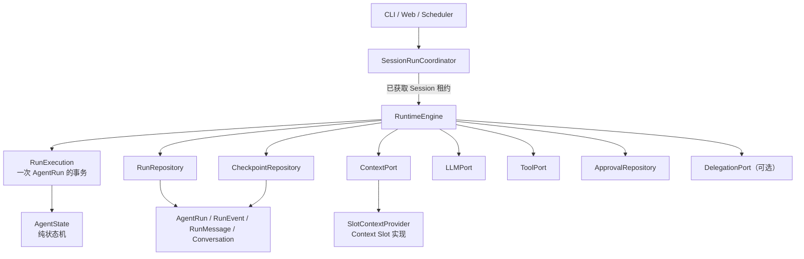

# Runtime 重构设计

> 状态：已完成实施并通过最终验收
> 范围：Runtime 内核、运行状态、持久化边界、上下文接口与运行控制协议。  
> 非范围：本阶段不引入跨 Run 的 `Task` 领域模型，不重做 Memory / Skill 业务逻辑，不重做多 Agent 编排语义。

## 1. 目标与结论

dotClaw 的 Runtime 目标不是“一个持有当前 Agent、Session 和消息的长生命周期对象”，而是一个共享的执行机：

> **`RuntimeEngine` 是业务无状态的 Agent 执行协调器。它为每次执行创建独立的 `RunExecution`，驱动纯 `AgentState` 状态机，调用外部 Ports，并在确定的提交点持久化运行事实与恢复状态。**

其中：

- `RuntimeEngine` 可以作为应用级共享组件，支持不同 Session 的 Run 并发执行；
- `RunExecution` 是一次 `AgentRun` 的短生命周期执行事务，承载全部执行期可变状态；
- 真正的隔离单位是 `AgentRun` / `RunExecution`，不是 RuntimeEngine 实例；
- 同一 Session 同一时刻只能有一个活跃 Run；不同 Session 可以并发；
- 普通用户消息总是创建新的 Run；只有审批、异步回调等运行控制事件才恢复已有 Run；
- LLM 需要用户补充信息时，正常结束本轮并在 Conversation 中提出问题，而不是挂起原 Run。

## 2. 顶层分层与调用关系



依赖必须始终从上层指向下层：

```text
application / runtime engine  →  ports  →  adapters
domain / state machine        →  无外部依赖
adapters                      →  可依赖现有 Memory、MCP、文件存储等实现
```

`RuntimeEngine` 不得 import 或直接依赖以下具体模块：`SessionManager`、`Agent` 实例、`Journal`、`ContextSlot`、`MemoryManager`、`MCPToolProvider`、CLI / Web Channel。它只能通过请求快照与 Ports 使用这些能力。

## 3. 推荐文件层级

以下是目标结构；迁移时允许新旧文件并存，但新代码只能依赖新边界。

```text
src/dotclaw/
├── bootstrap/
│   └── runtime_factory.py          # 组合根：读取配置、构造 adapters、注入 RuntimeEngine
│
├── runtime/
│   ├── domain/
│   │   ├── state.py                # AgentState、AgentPhase、AgentAction
│   │   ├── events.py               # 领域事件：LLMCompleted、ToolCompleted 等
│   │   ├── models.py               # RunRequest、RunResult、RunStatus、RunError
│   │   └── execution.py            # RunExecution：一次运行的内存事务对象
│   │
│   ├── application/
│   │   ├── engine.py               # RuntimeEngine：生命周期协调器
│   │   ├── approval_service.py     # resolve_approval() 控制协议
│   │   ├── ports.py                # Context / LLM / Tool / Repository 等 Protocol
│   │   └── session_coordinator.py  # SessionRunCoordinator：租约与队列
│   │
│   └── adapters/
│       ├── context_slots.py        # SlotContextProvider：现有 Slot 的适配实现
│       ├── run_repository.py       # RunRepository 的本地仓储适配器
│       ├── checkpoint_repository.py # CheckpointRepository 的本地仓储适配器
│       └── approval_repository.py  # 审批记录仓储适配器
│
├── context/
│   ├── slots.py                    # ContextSlot、ScopeKey、SlotContext
│   └── providers.py                # Identity / Tools / Memory 等具体 Slot
│
└── adapters/
    ├── llm/                        # OpenAI / Qwen / Router 等 LLMPort 实现
    ├── tools/                      # 内置工具、MCP 等 ToolPort 实现
    └── delegation/                 # 现有 orchestration 的 DelegationPort 适配器
```

此树表达的是依赖边界，不要求一次性移动所有文件。第一轮重构可先在现有 `runtime/` 下新增 `domain/`、`application/` 与 `ports.py`，用适配器包住旧实现。

## 4. 核心对象及其边界

### 4.1 RuntimeEngine

`RuntimeEngine` 是共享执行机，不保存任何某次执行的业务可变状态。

它负责：

1. 接收已经获得 Session 租约的普通用户请求；
2. 创建 `AgentRun` 与 `RunExecution`；
3. 调用 `AgentState` 决定下一步动作；
4. 调用 Context、LLM、Tool、Delegation 等 Port；
5. 将完整消息、事件、检查点以确定顺序持久化；
6. 在成功、失败、取消、审批等待等提交点完成事务；
7. 处理审批恢复和 run 级取消。

它不负责：

- Session 队列、Session 的长期管理、普通消息的路由；
- Agent 配置文件加载、MCP 启动、CLI 命令；
- 上下文槽的具体组合、Memory / Skill 的业务实现；
- Journal / Trace 的格式化、展示与分析；
- 多 Agent Dispatcher 的具体实现。

公开操作建议只有语义明确的两类：

```python
async def execute(self, request: RunRequest) -> RunResult:
    """执行一条普通用户消息；总是创建新的 AgentRun。"""

async def resolve_approval(self, approval_id: str, approved: bool) -> RunResult:
    """处理结构化审批结果；由 Runtime 定位并恢复等待中的 AgentRun。"""

async def cancel(self, run_id: str, reason: str) -> None:
    """取消指定运行；在安全点结束并释放 Session 租约。"""
```

### 4.2 RunExecution

`RunExecution` 是一次 AgentRun 的内存事务对象。它由 RuntimeEngine 创建，结束后销毁；它不是持久化实体，持久化事实由 Repository 管理。

它持有：

- `AgentState`；
- 当前 Run 的临时消息游标；
- token / iteration / timeout 等预算；
- run 级取消令牌；
- 当前 pending approval、待执行工具或子执行引用；
- `RunRequest` 的冻结输入与 Agent 执行策略快照。

它不持有：

- Session 的可变对象；
- 全局工具注册表、LLM 客户端、Journal；
- 跨 Run 的 Task 状态。

### 4.3 AgentState

`AgentState` 是纯领域状态机，由 `RunExecution` 持有。它只执行：

```text
(当前 phase, 领域事件, 最小控制字段) → (新 phase, 下一步 action)
```

它可持有 phase、iteration、retry / truncate 次数、循环检测指纹、等待控制状态等最小控制数据；但不得持有消息全文、Session、Agent、Repository、LLM、Tool 或 Task 实体。

典型动作：

```text
INVOKE_LLM | EXECUTE_TOOLS | FINALIZE | WAIT | HANDOFF_TARGET
```

典型事件：

```text
RunStarted | LLMCompleted | ToolCompleted | ApprovalResolved |
DelegationCompleted | CancelRequested | TimeoutReached
```

状态变化是 `RunEvent`，恢复数据是 `Checkpoint`；状态机不自行保存文件。

### 4.4 SessionRunCoordinator

`SessionRunCoordinator` 位于 RuntimeEngine 之外，管理跨 Run 的 Session 并发规则：

- 为每个 Session 分配“单活跃 Run”租约；
- 将同一 Session 的普通用户消息按 FIFO 排队；
- 将已获租约的请求交给 `RuntimeEngine.execute()`；
- run 结束、失败、取消或进入审批等待时处理租约释放 / 重新获取策略；
- 不读取 Checkpoint，不判断状态机，不解释用户自然语言，不解析审批含义。

不同 Session 使用不同租约，可并行执行；同一 Session 的 Conversation 由此保持线性、无需并发合并。

## 5. 请求、补充信息与恢复语义

### 5.1 普通用户请求

普通请求只包含本次用户输入与已冻结的会话视图：

```python
@dataclass(frozen=True)
class RunRequest:
    session_id: str
    lease_id: str
    agent_id: str
    user_message: Message
    conversation: ConversationSnapshot
```

启动新 Run 时，Runtime 解析并固定该 Agent 的身份 / 策略版本，将其保存到 AgentRun。运行中不得读取会被其他请求修改的 Session 或 Agent 配置。

### 5.2 LLM 要求用户补充信息

这是正常对话，而不是 Runtime 等待：

```text
Run A：用户需求信息不足
  → Agent 回复澄清问题
  → Run A = COMPLETED
  → 用户消息与澄清回复写入 Conversation

下一条用户消息
  → 新建 Run B
  → LLM 根据 Conversation 判断它是补充还是新话题
```

当前阶段不引入 Task，因此不保存“一个语义任务跨多个 Run 的进行状态”。

### 5.3 审批恢复

审批是具有安全语义的控制协议：

```text
ToolPort 声明 ApprovalRequired
  → Runtime 创建 ApprovalRecord
  → 保存 Checkpoint，追加 WAITING_APPROVAL 事件
  → 审批交互层仅提交 approval_id + decision
  → Runtime.resolve_approval() 查询 approval_id → run_id
  → 加载 Checkpoint 与 RunMessage，恢复原 run_id
```

审批交互层不能决定“要恢复哪一个 Run”；它只处理有限选项。Runtime 校验审批记录与 Run 状态后才决定是否恢复。

### 5.4 取消与超时

取消是 Runtime 的 run 级控制操作：

- 取消令牌在安全点生效；
- LLMPort / ToolPort 仅提供 best-effort cancellation；
- 不可中断、有副作用的外部操作不得自动重放；
- 最终写入 `RUN_CANCELLED` 事件和 `AgentRun=CANCELLED`，不写 Conversation；
- 清理 Checkpoint 与待审批记录，释放 Session 租约。

超时使用相同路径，只是取消原因不同。

## 6. Ports 与模块依赖

Runtime 只依赖以下抽象协议。具体的文件、数据库、OpenAI、MCP、Memory 等实现必须位于 adapter 层。

| Port | Runtime 使用的能力 | 不应泄漏的实现细节 |
|---|---|---|
| `RunRepository` | 创建 / 加载 / 提交 AgentRun；追加 RunEvent；写 RunMessage；提交成功 Conversation 投影 | JSON、SQLite、事务实现、目录结构 |
| `CheckpointRepository` | 保存、加载、删除指定 run 的恢复点 | 文件替换、历史清理策略 |
| `ContextPort` | 基于冻结输入与执行视图构造 `ContextBundle` | Slot、Memory、Skill、RAG、token 裁剪细节 |
| `LLMPort` | 执行模型调用、返回标准化响应、best-effort cancel | Provider、路由、SDK、重试实现 |
| `ToolPort` | 检查权限 / 审批需求、执行工具、返回标准化结果 | 内置工具、MCP、Shell、远程 worker |
| `ApprovalRepository` | 创建 / 查询 / 消费审批记录 | UI、CLI、持久化形式 |
| `DelegationPort` | 提交子执行、查询 / 取消子执行结果 | Dispatcher、InstanceManager、子 Agent Session |

`DelegationPort` 是可选扩展。本轮 Runtime 重构不改变现有多 Agent 编排语义；Runtime 只将其视为“提交外部执行、等待结果、接收结果”的能力。

## 7. ContextPort 与上下文槽

现有 Slot 架构应保留，但迁入 `ContextPort` 内部。Runtime 不再调用 `on_new_request()`、不再手工拼接 system prompt 或 history。

```python
class ContextPort(Protocol):
    async def build(
        self,
        request: RunRequest,
        execution: RunExecutionView,
    ) -> ContextBundle:
        ...
```

`ContextBundle` 至少包括：

- 实际发送给模型的完整 `messages`；
- 可用工具定义；
- token 估算、裁剪决策、Memory / Skill 来源等 `ContextMetadata`。

Runtime 获得 Bundle 后，负责将**实际发送给 LLM 的完整 messages**写进 `RunMessage`，并追加 `CONTEXT_BUILT` 与 LLM 调用事件。

### 7.1 Slot 缓存作用域

现有单值 `_cached` 不能在共享 RuntimeEngine 下使用。缓存必须按 scope key 隔离：

| Slot 类型 | 建议缓存键 |
|---|---|
| `STATIC` | `agent_id + identity_version` |
| `SESSION` | `agent_id + identity_version + session_id` |
| `CONDITIONAL` | `run_id` 或 `request_id` |
| `DYNAMIC` | 不缓存 |

现有 `IdentitySlot`、`ToolsSlot`、`SkillsSlot`、`MemorySlot` 等业务内容可先原样保留；第一轮只改 ContextPort 接口、缓存作用域与 token 预算控制。`SlotContext` 中的 `Journal` 依赖应删除，Context 层只能返回 metadata，不能持久化或发布观测事件。

## 8. 持久化容器边界

持久化容器必须各自只回答一个问题，不能互为副本。

| 容器 | 回答的问题 | 保存内容 | 明确不保存 |
|---|---|---|---|
| `Conversation` | 用户与 Agent 成功交流了什么？ | 用户消息、成功终态的最终 assistant 消息 | 工具调用、状态、失败、审批、内部 prompt |
| `AgentRun` | 这次运行是谁、何时、因何结束？ | 索引、归属、终态、统计、消息 / checkpoint 引用 | 完整消息、事件副本、状态快照 |
| `RunEvent` | 运行中客观发生了什么？ | 有序的结构化事实、摘要、RunMessage 引用 | 完整 payload、可恢复快照、会话语义 |
| `RunMessage` | 这次运行真实发送 / 接收了什么？ | 完整 prompt、LLM response、tool calls / results、错误原文 | Conversation 投影、恢复状态判断 |
| `Checkpoint` | 从哪个安全边界、如何继续？ | 状态快照、消息游标、下一动作、pending 控制、预算 | 审计全历史、完整 prompt / tool result |

### 8.1 AgentRun 摘要模型

`AgentRun` 是索引和终态摘要，而不是消息容器：

```python
@dataclass
class AgentRun:
    run_id: str
    session_id: str
    agent_id: str
    parent_run_id: str | None
    root_run_id: str | None

    status: RunStatus
    started_at: datetime
    ended_at: datetime | None
    resume_count: int

    input_message_id: str
    final_message_id: str | None
    latest_checkpoint_id: str | None

    agent_policy_version: str
    model_id: str
    duration_ms: int | None
    llm_call_count: int
    tool_call_count: int
    tokens_in: int
    tokens_out: int
    error_summary: RunError | None
```

逐次 LLM / 工具统计属于 `RunEvent`；AgentRun 中保留最终聚合值，以支持快速筛选慢 run、失败 run 和高成本 run。

### 8.2 RunEvent

`RunEvent` 是唯一的运行明细事实源，按 `run_id + sequence` 追加且同步持久化。关键事件至少包括：

```text
RUN_STARTED
CONTEXT_BUILT
LLM_STARTED / LLM_COMPLETED
TOOL_STARTED / TOOL_COMPLETED
STATE_TRANSITION
CHECKPOINT_SAVED
WAITING_APPROVAL / APPROVAL_RESOLVED
DELEGATION_SUBMITTED / DELEGATION_COMPLETED
RUN_COMPLETED / RUN_FAILED / RUN_CANCELLED
```

事件只放摘要、hash、耗时、token 和 `RunMessage` 的逻辑消息 ID；大 payload 不复制进事件。

### 8.3 RunMessage

`RunMessage` 是完整执行消息证据。每个 Run 一个 `messages.json`，不按 message 单独建文件：

```json
{
  "run_id": "r-123",
  "version": 1,
  "messages": [
    {"id": "m-001", "sequence": 1, "kind": "llm_request", "role": "system"},
    {"id": "m-002", "sequence": 2, "kind": "llm_request", "role": "user"},
    {"id": "m-003", "sequence": 3, "kind": "llm_response", "role": "assistant"},
    {"id": "m-004", "sequence": 4, "kind": "tool_result", "role": "tool"}
  ]
}
```

实际内容需要按脱敏策略保存。每次 LLM 调用都保存实际发送的完整输入快照，即使 system prompt 重复；第一阶段优先保证可回放和排障，去重以后再做。

写入顺序必须是：**先原子更新 `messages.json`，再追加引用这些消息的 `RunEvent`**。因此任一已落盘 Event 都不会指向不存在的消息。

### 8.4 Checkpoint

Checkpoint 只服务于从安全边界恢复：

```json
{
  "run_id": "r-123",
  "checkpoint_sequence": 8,
  "event_sequence": 21,
  "message_sequence": 14,
  "agent_state": {"phase": "waiting_approval", "iteration": 2},
  "next_action": "execute_tools",
  "pending": {"kind": "approval", "approval_id": "a-1"},
  "budget": {"max_iterations": 10, "tokens_in": 6246, "tokens_out": 101}
}
```

恢复时使用 Checkpoint 的游标从 `RunMessage` 重建临时消息；Checkpoint 绝不复制完整消息、完整 prompt 或完整工具结果。第一阶段只需保留最新安全点，后续再决定保留历史版本。

### 8.5 本地文件存储布局

第一阶段可以使用如下简单、可检查的文件结构：

```text
data/sessions/{session_id}/agent_runs/{run_id}/
├── run.json            # AgentRun 摘要
├── events.jsonl        # RunEvent，追加写
├── messages.json       # RunMessage，完整执行消息
├── checkpoint.json     # 最新安全恢复点
└── success_commit.json # 仅在成功提交未完成时存在的可恢复事务意图
```

未来替换为 SQLite、PostgreSQL 或对象存储时，应仅替换 Repository Adapter，不改变 Runtime 域模型和 Port。

## 9. 运行事务与提交时机

### 9.1 正常完成

```text
创建 AgentRun(RUNNING)
  → 保存 RunMessage
  → 追加 RunEvent
  → 状态机推进
  → LLM / Tool 循环
  → 生成最终助手回复
  → 同一提交边界：
      AgentRun = COMPLETED
      Conversation 追加最终 assistant message
      RunEvent += RUN_COMPLETED
      （文件存储先写 success_commit.json；启动或读取时补偿未决意图）
  → 删除过期 Checkpoint
  → 释放 Session 租约
```

### 9.2 失败与取消

失败和取消只提交 AgentRun 终态、错误摘要与 RunEvent；不产生 Conversation 的 assistant 消息。完整诊断信息保留在 RunMessage / RunEvent 中。

### 9.3 审批等待与恢复

进入审批等待前，Runtime 必须保存 Checkpoint 并记录 `WAITING_APPROVAL`。恢复后使用相同 `run_id`，追加 `APPROVAL_RESOLVED` 与 `RUN_RESUMED`，不得创建第二个 AgentRun。

### 9.4 安全边界

第一阶段只保证从以下边界恢复：

- 一次 LLM 响应完整返回后；
- 一次工具调用完整结束后；
- 进入审批等待前；
- 收到异步外部结果后。

不承诺在正在执行的 LLM 请求或工具进程中精确续跑。有副作用工具必须使用幂等键、外部状态查询或人工确认，Runtime 禁止盲目重放。

## 10. 与现有模块的关系与迁移映射

| 现有模块 | 当前问题 | 重构后的定位 |
|---|---|---|
| `runtime/runtime.py` | 旧执行循环耦合状态、上下文、Journal 与持久化 | 已删除；由 `RuntimeEngine` 只依赖 Ports 的执行机替代 |
| `runtime/agent_state.py`、`runtime/task.py` | 旧状态机耦合 Message、Tool 与 Task | 已删除；由纯 `runtime/domain/state.py` 与 `DelegationPort` 替代 |
| `runtime/state_store.py` | Session 级恢复状态混入执行事务 | 已删除；由 run 级 `CheckpointRepository` 替代 |
| `session/agent_run.py` | 混合保存消息、快照与 trace 标识 | 已删除；由 AgentRun 摘要、RunMessage、RunEvent、Checkpoint 分离保存 |
| `session/session.py` | 会话历史与运行关联 | 保留 Conversation / Session 业务事实；不保存执行过程 |
| `agent/agent.py` | 旧入口混入 Runtime 与直接提交 | 已收敛为 Coordinator 门面；会话提交由 RunRepository 完成 |
| 旧 `slotContext`、`StateSink`、本地 runner、Task 工具 | 旧兼容或反向依赖路径 | 已删除；由 ContextPort、CheckpointRepository 与 DelegationPort 替代 |
| `orchestration/*` | 多 Agent 调度实现 | 保持业务实现，通过 `RuntimeDelegationAdapter` 对接 DelegationPort |
| `agent/factory.py` | 组合根薄包装 | 委托 `bootstrap/runtime_factory.py` 装配 Runtime v2 服务 |

## 11. 迁移顺序

迁移必须以可运行纵切进行，不做大爆炸重写。

1. **建立新领域模型与 Ports**：新增 `RunExecution`、`RunRequest`、`RunResult`、RunEvent / RunMessage / Checkpoint 协议；不改变现有执行路径。
2. **收缩 AgentRun 持久化**：先引入 `RunMessage` 和 RunEvent 文件；保持旧字段只读兼容，新增 run 不再写 `messages`、`state_snapshot`、`trace_ids`。
3. **改造 Checkpoint**：将 `StateStore` 从 Session 键改为 run 键；只在安全边界写入；移除 Journal `state_sink` 的恢复职责。
4. **抽 ContextPort**：用 SlotContextProvider 包住现有 Slot；改为 scoped cache 和完整 `ContextBundle`；Runtime 停止手工组装上下文。
5. **迁入 RuntimeEngine**：将现有 `Runtime.run()` 的控制循环逐段迁入 Engine；删除 `_current_agent`、`_current_session_id`、`_current_agentrun_id` 等实例字段。
6. **迁移提交语义**：取消 `Agent.process()` 对 Session 的直接保存；由 RunRepository 在成功终态统一提交 Conversation 与 AgentRun。
7. **接入审批与取消协议**：ToolPort 返回审批需求；Runtime 统一 checkpoint / resume / cancel。
8. **适配 delegation**：以 DelegationPort 包住现有 orchestration；不改变其业务语义。
9. **删除旧兼容层**：当调用方和测试迁移为零后，删除旧 snapshot / trace IDs / 旧 AgentRun message 字段与 Journal 反向依赖。

## 12. 不变量与验收标准

以下不变量应成为架构测试：

1. 同一 Session 两个普通用户请求不能同时执行；不同 Session 可以并发；
2. `RuntimeEngine` 同时执行多个 run 时，不存在任何 `_current_*` 类型的 run 级实例字段；
3. `AgentState` 不 import LLM Client、Tool、Repository、Session、Task；
4. 成功 run 才能将最终 assistant 回复写入 Conversation；失败、取消、审批等待不得写入；
5. 每一条持久化的 `RunEvent` 所引用的 RunMessage 必须已经存在；
6. Checkpoint 不得包含完整 prompt / tool result；可用 checkpoint 游标从 RunMessage 恢复；
7. `resolve_approval()` 只接受有效且仍等待的 `approval_id`，并恢复原 `run_id`；
8. Context Slot 缓存不会跨 agent、session 或 run scope 泄漏；
9. Runtime 不读取 Journal 的私有字段，也不经 Journal 保存 Checkpoint；
10. 取消有副作用工具时，系统记录不确定结果，绝不自动重放。

## 13. 延后决策

以下内容与本设计兼容，但明确不纳入第一轮：

- `Task`：跨多个 Run 的目标、进度和任务状态；
- Web / OpenTelemetry / 持久化 Trace：它们可以订阅或渲染 RunEvent，但不是执行事实源；
- RunMessage 去重、加密、对象存储、TTL 与细粒度权限；
- 分布式 Session 租约、跨进程队列与远程 worker；
- delegation 的 Run 树、聚合、取消传播与重试策略；
- 自动恢复仍在运行中的外部副作用工具。

这些能力必须通过既定 Ports 和容器边界扩展，不能重新让 RuntimeEngine 依赖具体基础设施。
