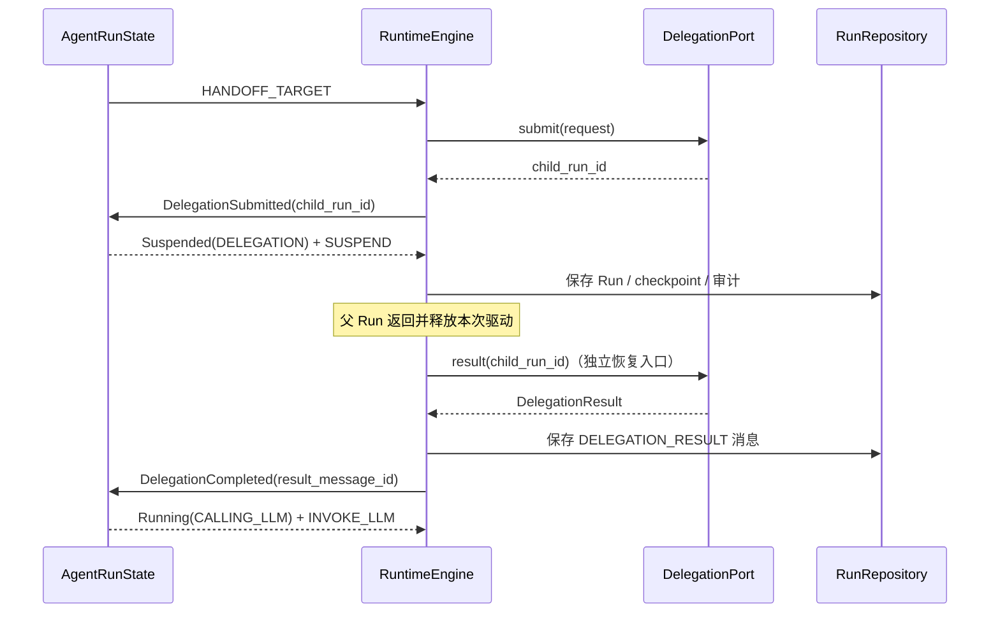

# AgentRun 状态机总体设计

> 状态：已确认设计  
> 范围：Runtime v4 的单个 `AgentRun` 控制状态机重构  
> 关联：`docs/Development/todo.md`、`docs/Development/runtime/runtime重构设计.md`

## 1. 背景与目标

当前 Runtime 以 `AgentState.phase` 驱动一次 Run，同时以 `AgentRun.status` 保存另一份运行状态。`AgentPhase` 混合了执行阶段、外部等待、终态结果和 `INTERRUPTED`；`RuntimeEngine` 又通过 `phase` 分支自行决定调用 LLM 或工具。因此同一控制事实被状态机和 Engine 分别解释，成功提交路径甚至会出现状态机仍为 `FINALIZING`、持久化 Run 已为 `COMPLETED` 的不闭环。

本设计将一个 `AgentRun` 的控制事实收敛到一个受约束的联合状态，并保持既有的 Ports、消息审计和 checkpoint/resume 职责边界。

目标：

- `AgentRunState` 成为单个 `AgentRun` 唯一的持久化控制状态；删除 `RunStatus` 与扁平 `AgentPhase`。
- 以 `state + event -> next_state + action` 完整表达状态机迁移；Engine 只执行 action，不根据 state 推断下一步。
- 以带数据的事件联合类型表达决策事实，避免 `kind + 多个可选字段` 的无效组合。
- 将审批和 delegation 变为显式的 `Suspended` 状态；`HANDOFF_TARGET` 成为真正可达 action。
- 删除 `INTERRUPTED` 作为 AgentRun 状态；非终态 Run 保持原 `run_id`，恢复仍由 checkpoint/resume 负责。

非目标：

- 不新增 `ExecutionAttempt`、分布式租约或多 Worker 接管模型。
- 不重新设计 checkpoint/resume 的副作用核验算法。
- 不引入运行时 `TRANSITION_TABLE`、guard、priority 或自动链式事件。
- 不为旧 checkpoint/run 数据提供兼容读取；测试阶段数据可清空，只支持新格式。

## 2. 核心术语与所有权

| 概念 | 所有者 | 含义 |
| --- | --- | --- |
| `AgentRun` | 运行持久化实体 | 一次用户请求的身份、策略、状态、摘要与引用。 |
| `AgentRunState` | `AgentRun.state` | 唯一控制状态；描述该 Run 当前可接受什么事件、应执行什么 action。 |
| `AgentRunEvent` | 状态机输入 | 发生在 Engine 或外部控制边界的瞬时决策事实，不是审计日志。 |
| `AgentAction` | 状态机输出 | Engine 下一步需要执行的原子操作类别；不携带业务正文。 |
| `RunEvent` | `events.jsonl` | 持久化审计事实，记录操作进度与诊断，不直接驱动状态机。 |
| `RunCheckpoint` | checkpoint/resume | 当前操作节点的 action、已确认审计位置与恢复引用；不保存第二份状态机状态。 |
| `RunExecution` | Engine 内存对象 | 一次进程内驱动所需的可变执行数据；不是持久化领域实体。 |

`AgentRunState` 替换当前 `AgentState` 的定位，而不是新建第二个状态机对象。`RunExecution.state` 仅持有当前 `AgentRun.state` 的内存工作副本；持久化真相始终是 `AgentRun.state`。

## 3. 状态模型

```python
@dataclass(frozen=True)
class Created:
    pass


@dataclass(frozen=True)
class Running:
    stage: RunStage


@dataclass(frozen=True)
class Suspended:
    reason: SuspendReason
    control_id: str
    resume_stage: RunStage


@dataclass(frozen=True)
class Ended:
    outcome: RunOutcome


RunMode: TypeAlias = Created | Running | Suspended | Ended


@dataclass(frozen=True)
class AgentRunState:
    mode: RunMode
    iteration: int = 0
    retry_count: int = 0
    truncate_count: int = 0
    loop_fingerprint: str = ""
```

`iteration` 等字段是状态机快照中的累计控制/统计值，进入 `Ended` 后保留最终值但不再修改；当前 MVP 不额外抽取包装类型。

### 3.1 局部枚举

```text
RunStage
├── PREPARING          # 预留；当前首个实际阶段为 CALLING_LLM
├── CALLING_LLM
└── EXECUTING_TOOLS

SuspendReason
├── APPROVAL
└── DELEGATION

RunOutcome
├── COMPLETED
├── FAILED
├── CANCELLED
└── ABANDONED
```

`Created` 表示 Run 已被持久化、尚未开始；它没有业务字段是正常的。`Ended` 是包含成功和非成功结果的终态根类型；不使用容易产生成功语义歧义的 `Finished`，也不使用纯理论术语 `Terminal`。

### 3.2 状态不变量

- 同一时刻 `mode` 只能为四种分支之一，避免生命周期、阶段、等待原因、结果的非法笛卡尔积。
- 只有 `Suspended` 持有 `control_id`；它仅用于验证外部唤醒事件属于当前等待项。
- `control_id` 不保存审批正文、子 Run 输出或 ToolCall 参数；这些内容分别属于审批记录、`RunMessage` 和 checkpoint 的 `pending`。
- `Ended` 是唯一终态。`state.is_ended()` 是仓储筛选、Session 占用判断和入口结果判断的唯一标准。
- `INTERRUPTED` 不属于该模型。进程丢失、系统崩溃和外部瞬断是执行尝试/恢复事实，不是 AgentRun 的长期业务状态。

## 4. 事件、action 与迁移

### 4.1 两类事件严格分离

`AgentRunEvent` 是 `transition()` 的瞬时输入，按领域分组为类型别名：

```text
LlmEvent        = LLMResponseProduced | LLMCallFailed
ToolEvent       = ToolBatchCompleted | ToolApprovalRequired | ToolBatchFailed
ApprovalEvent   = ApprovalGranted | ApprovalRejected
DelegationEvent = DelegationRequested | DelegationSubmitted | DelegationCompleted
ControlEvent    = CancelRequested | TimeoutReached | AbandonRequested

AgentRunEvent = RunStarted | LlmEvent | ToolEvent | ApprovalEvent | DelegationEvent | ControlEvent
```

每种事件只携带该分支决定迁移所需的事实或稳定引用。例如 `ToolApprovalRequired` 带 `approval_id`，`DelegationCompleted` 带 `child_run_id` 与已持久化的结果消息 ID；不使用 `kind`、布尔开关和大量可选字段拼接多个互斥结果。

`RunEvent` 保持为 `events.jsonl` 的审计信封，继续保存 `run_id`、`sequence`、`occurred_at`、审计类型和安全的 `data`。`AgentRunEvent` 不重复这些共通持久化字段，也不向 Channel、Repository 或其它业务组件传播。

### 4.2 action 集合

```text
INVOKE_LLM
EXECUTE_TOOLS
HANDOFF_TARGET
SUSPEND
FINALIZE
```

- `INVOKE_LLM`：构造/冻结必要上下文并调用 LLM；结果变为下一 `AgentRunEvent`。
- `EXECUTE_TOOLS`：执行当前待处理的工具批次；审批、失败或完成结果变为下一事件。
- `HANDOFF_TARGET`：提交目标 Agent，不携带目标参数；Engine 从当前 ToolCall/执行数据构造 `DelegationRequest`。
- `SUSPEND`：持久化等待节点和恢复引用后结束本次 Engine 驱动。
- `FINALIZE`：持久化 `Ended`、终态审计与现有成功提交协议后返回结果。

不保留 `WAIT`：它混淆挂起和结束。不保留 `STOP`：在本设计中 `Ended` 总是伴随 `FINALIZE`，没有独立生产者。

### 4.3 最小迁移结果

```python
@dataclass(frozen=True)
class StateTransition:
    state: AgentRunState
    action: AgentAction
```

状态机只计算状态与 action；它不构造 LLM 请求、ToolCall、审批记录、checkpoint、审计事件或 Repository 写入。

### 4.4 迁移路由

状态机先按联合状态路由，再在局部 handler 中匹配该状态允许的少数事件：

```python
def transition(state: AgentRunState, event: AgentRunEvent) -> StateTransition:
    match state.mode:
        case Created():
            return _on_created(state, event)
        case Running():
            return _on_running(state, event)
        case Suspended():
            return _on_suspended(state, event)
        case Ended():
            raise InvalidTransition(...)
```

这保留当前类型化 handler 的局部可读性，同时避免旧 `TRANSITION_TABLE` 中 guard、priority、side effect 和自动链分散一条规则语义的问题。

### 4.5 已确认迁移矩阵

| 当前状态 | 输入事件 | 下一状态 | action |
| --- | --- | --- | --- |
| `Created` | `RunStarted` | `Running(CALLING_LLM)` | `INVOKE_LLM` |
| `Running(CALLING_LLM)` | `LLMResponseProduced(final)` | `Ended(COMPLETED)` | `FINALIZE` |
| `Running(CALLING_LLM)` | `LLMResponseProduced(tool_calls)` | `Running(EXECUTING_TOOLS)` | `EXECUTE_TOOLS` |
| `Running(CALLING_LLM)` | `LLMCallFailed(unrecoverable)` | `Ended(FAILED)` | `FINALIZE` |
| `Running(EXECUTING_TOOLS)` | `ToolBatchCompleted` | `Running(CALLING_LLM)` | `INVOKE_LLM` |
| `Running(EXECUTING_TOOLS)` | `ToolApprovalRequired` | `Suspended(APPROVAL, approval_id, EXECUTING_TOOLS)` | `SUSPEND` |
| `Running(EXECUTING_TOOLS)` | `ToolBatchFailed` | `Ended(FAILED)` | `FINALIZE` |
| `Running(EXECUTING_TOOLS)` | `DelegationRequested` | 状态不变 | `HANDOFF_TARGET` |
| `Running(EXECUTING_TOOLS)` | `DelegationSubmitted(child_run_id)` | `Suspended(DELEGATION, child_run_id, CALLING_LLM)` | `SUSPEND` |
| `Suspended(APPROVAL)` | `ApprovalGranted` | `Running(EXECUTING_TOOLS)` | `EXECUTE_TOOLS` |
| `Suspended(APPROVAL)` | `ApprovalRejected` | `Ended(CANCELLED)` | `FINALIZE` |
| `Suspended(DELEGATION)` | `DelegationCompleted` | `Running(CALLING_LLM)` | `INVOKE_LLM` |
| 任意未结束状态 | `CancelRequested` | `Ended(CANCELLED)` | `FINALIZE` |
| 任意未结束状态 | `TimeoutReached` | `Ended(FAILED)` | `FINALIZE` |
| 任意未结束状态 | `AbandonRequested` | `Ended(ABANDONED)` | `FINALIZE` |

子 Run 的成功、失败、取消或放弃都先固化为父 Run 的 `DELEGATION_RESULT` 消息，再产生 `DelegationCompleted`。状态机始终回到 `Running(CALLING_LLM)`，由源 Agent 决定继续、换目标、使用其它工具或结束。

### 4.6 非法事件

状态机收到不属于当前状态的事件、错误 `control_id` 或已经结束后的事件时，必须抛出 `InvalidTransition`，且不改变状态。Application 边界负责：

1. 记录 error 日志；
2. 追加 `STATE_TRANSITION_REJECTED` 审计 `RunEvent`；
3. 返回结构化 `INVALID_STATE` 错误。

审计只记录当前 mode/detail、事件类型和安全原因，不记录消息正文、完整工具参数等敏感负载。

## 5. Engine、持久化与恢复边界

### 5.1 正常操作节点

一个操作节点遵循：

```text
当前 State + 输入 Event
        ↓ transition
下一 State + 当前 Action
        ↓
执行 Action，并记录 RunEvent / RunMessage
        ↓
产生下一 Event
```

`state` 与 `action` 同时由一次迁移确定。Engine 在 action 前持久化节点所需事实；action 的外部副作用通过既有 `RunEvent`、消息和 checkpoint 记录进度。Engine 不允许重新读取 `state.mode` 来选择调用 LLM、工具或 delegation。

### 5.2 数据容器

| 容器 | 保存 | 不保存 | 唯一写入者 |
| --- | --- | --- | --- |
| `run.json` / `AgentRun` | 身份、`AgentRunState`、策略、统计、结果引用和错误摘要 | 第二份 status | RunRepository，经 Engine 状态迁移写入 |
| `messages.json` | LLM 输入/输出、工具结果、delegation 结果全文 | 控制状态 | Engine / RunRepository |
| `events.jsonl` | 可审计的开始、完成、拒绝迁移和副作用事实 | 状态机输入对象 | Engine / RunRepository |
| `checkpoint.json` | 当前节点 `action`、事件/消息序号、`pending`、预算、Context Version | `AgentRunState` 的第二份快照 | CheckpointRepository，经 Engine 写入 |
| `success_commit.json` | 成功投影的临时补偿意图 | 长期业务状态 | RunRepository，成功后删除 |

checkpoint 字段命名从 `next_action` 改为 `action`。其含义是“当前持久化操作节点应执行的 action”，不是根据 state 推导的未来动作。

### 5.3 恢复与中断

崩溃、进程重启或临时外部不可用不产生 `AgentRunEvent`，也不使 Run 进入 `Ended`。恢复入口以以下事实继续同一 `run_id`：

```text
AgentRun.state + RunCheckpoint.action + RunEvent / RunMessage + pending
```

checkpoint/resume 模块负责判断 action 尚未开始、进行中或完成后尚未产生下一事件的情况；它可根据审计事实安全重试、重建事件或要求人工处理。本次只调整状态与字段归属，不扩大副作用恢复算法。

新的普通请求发现同 Session 存在非 `Ended` Run 时返回 Session Busy；不得自动放弃旧 Run。恢复和放弃均为显式控制操作：`resume_run(run_id)` 继续原 Run，`abandon_run(run_id)` 通过 `AbandonRequested` 收口为 `Ended(ABANDONED)`。

## 6. 审批与 delegation 流程



`DelegationPort.submit()` 只提交子执行；不在提交节点立即将 `result()` 视为必须可得。独立恢复入口在子 Run 已结束后查询结果。`HANDOFF_TARGET` 的工具调用与待处理批次属于 `RunExecution` 的执行数据，不进入 state 或 action 负载。

## 7. 并发与架构不变量

- 状态机仅管理单个 `AgentRun`；Session FIFO、单活动 Run 和租约仍由 `SessionRunCoordinator` 管理。
- 父/子 Run 各自拥有独立状态机；父 Run 只通过 `Suspended(DELEGATION)` 表示等待子结果。
- `AgentRunState` 是唯一控制状态源；不保留 `RunStatus`、`AgentPhase` 或 checkpoint 内的平行状态。
- `RunExecution` 持有每次进程内执行的可变数据，但不获得状态迁移解释权。
- 所有状态改变都经过 `transition(event)`；取消和放弃也不得由 Engine 直接改写状态。
- action 不携带 prompt、ToolCall、审批正文或 delegation 正文；真实数据留在既有消息、pending 与执行容器。

## 8. 风险与后续演进

本设计不承诺多进程租约、通用 action 幂等、执行尝试统计或人工恢复工作台。若未来存在这些需求，再独立评估 `ExecutionAttempt`、持久化 lease 和副作用 journal，不能反向将它们塞入 `AgentRunState`。

新增路径遵循固定闭环：选择状态维度（stage/reason/outcome）→ 新增决策事件 → 在所属状态 handler 增加迁移 → 复用或新增 action 执行器 → 增加状态机和 Engine 测试。该结构允许扩展，同时避免重建扁平 phase 或通用优先级表。
