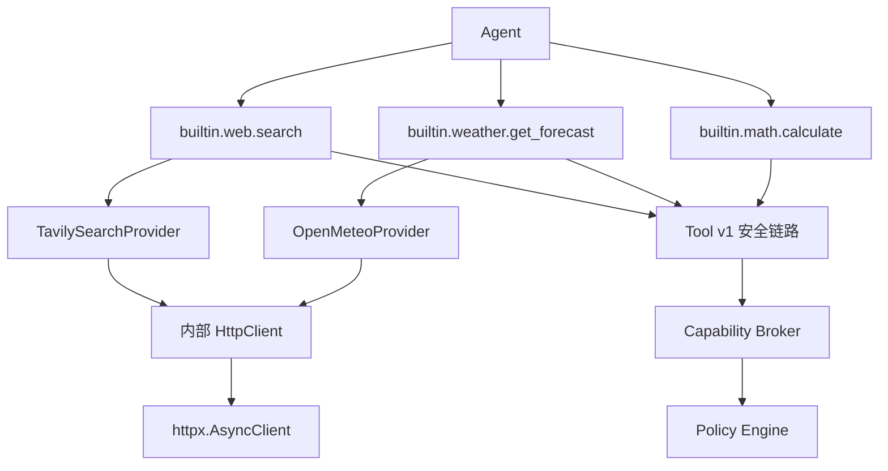

# Tool v1 内置通用工具开发计划

## 1. 文档目的与范围

本文是 Tool v1 内置通用工具扩展的唯一开发计划，面向 `dotClaw` 作为 **通用 Agent Harness** 的定位。它将已确认的联网边界收敛为可验证的实现步骤；不重复改写 Tool v1 总体设计。

### 1.1 已确认范围

- 新增内部受控 HTTP 基础设施：基于 `httpx` 的薄 `HttpClient`，仅供内置 Provider 使用，不注册为 Tool。
- 新增三个本地 Tool：
  - `builtin.web.search`：固定调用 Tavily Search。
  - `builtin.weather.get_forecast`：固定调用 Open-Meteo 地理编码和预报接口。
  - `builtin.math.calculate`：受限表达式计算。
- 网络服务默认关闭；Tavily 和 Open-Meteo 分别启用。
- 所有新 Tool 沿用 Tool v1 的固定链路：参数校验 → Capability Broker → Policy Engine → 审批 → Handler → Journal。

### 1.2 明确不在本期范围

- 不提供通用 HTTP Tool、任意 URL 抓取、网页正文提取、爬虫或搜索引擎 HTML 抓取。
- 不实现 Todo、提醒、日程、独立文本解析、任意正则提取或重复的日期时间 Tool。
- 不引入 HTTP 网关服务、Sidecar、第三方本地 Tool 插件机制或 Tavily SDK。
- 不实现 OS 级网络隔离、代理配置管理或持久化网络授权；HTTP 客户端仅兼容系统已有的代理环境变量。

### 1.3 代码事实与实施假设

**代码事实**：当前 `ToolPolicy.NETWORK` 的 Broker 从 Tool 参数 `url` 提取主机，且 `network.http` 默认 `deny`。这适用于旧的“任意 URL”构想，不适用于固定 Provider。

**代码事实**：`ToolsConfig` 留有未被新 Tool v1 使用的 `web_search_enabled` 旧字段；`httpx` 尚未作为直接项目依赖声明。

**实施假设**：运行 dotClaw 的个人电脑可直接访问互联网；如系统设置了 `HTTP_PROXY`、`HTTPS_PROXY` 或 `NO_PROXY`，`httpx` 按其标准行为使用。网络不可达是可观测的运行失败，不通过代码绕过网络限制。

## 2. 已确认设计契约

### 2.1 分层与依赖方向



- `HttpClient` 是内部基础设施，不出现在 Agent Tool Schema、Tool Registry 或用户提示词中。
- Provider 是固定外部协议的适配器；Handler 只做 Pydantic 参数到 Provider 的调用与 `ToolResult` 映射。
- 端点、HTTP 方法和认证方式属于 Provider 代码，不允许由 Agent 参数或 YAML 覆盖。
- Tool 核心只依赖 `HttpClient` 的窄 Protocol；实际 `httpx.AsyncClient` 在 Bootstrap/ApplicationHost 装配和关闭。

### 2.2 静态网络能力声明

网络 Tool 不再以 `url` 或 `host_param` 接收目标主机。扩展 `ToolDefinition` 的显式安全字段：

| 字段 | 含义 |
| --- | --- |
| `network_service` | Provider 服务标识，如 `tavily`、`open_meteo`。 |
| `network_hosts` | 该 Tool 静态声明的精确 HTTPS 主机集合。 |

`CapabilityBroker` 对 `ToolPolicy.NETWORK` 从上述字段生成一个或多个 `NETWORK_HTTP` 请求；每个请求携带 `service` 与 `host`。Broker 不读取 Agent 参数中的 URL。`PolicyEngine` 必须同时满足：全局网络上限允许、服务已启用、服务允许该精确主机、Agent 策略未收窄为 `ask` 或 `deny`，才返回 `allow`。

### 2.3 配置、密钥与启用语义

在 `tools` 下新增结构化 `network` 配置；示意如下：

```yaml
tools:
  network:
    tavily:
      enabled: false
    open_meteo:
      enabled: false
```

- 默认两项均为 `false`，不产生可用的网络能力。
- 启用服务是用户对该服务的显式预授权。若 `tools.policy.rules` 未显式设置 `network.http`，工厂在至少一个服务启用时派生 `network.http: allow`；没有启用服务时派生 `deny`。用户显式写出的 `allow`、`ask`、`deny` 始终优先，Agent 策略仍只能收窄。这样用户只需启用服务，不必维护第二个重复开关。
- 工厂据此构造仅包含已启用服务和固定主机的网络策略作用域；未启用服务的请求一律 `POLICY_DENIED`。默认 `config.yaml` 不再显式写入 `network.http: deny`，以免它覆盖服务启用产生的受限授权；未配置时的代码默认值仍为 deny。
- `TAVILY_API_KEY` 只从环境变量读取。缺失时 `builtin.web.search` 返回 `CONFIGURATION_ERROR`；不读取 YAML 中的密钥，不将变量值、Authorization 头或请求体写入日志、审计或 `ToolResult`。
- Open-Meteo 首版无需密钥。固定主机为 `geocoding-api.open-meteo.com` 和 `api.open-meteo.com`；Tavily 固定主机为 `api.tavily.com`。
- 删除 `ToolsConfig.web_search_enabled` 及其 YAML 读取路径；不保留旧字段兼容。若配置中出现旧 `tools.web_search`，加载时输出一次明确弃用警告并忽略。

### 2.4 HTTP 安全与资源边界

`HttpClient` 只提供 Provider 所需的受限异步请求接口，并在自身再次校验服务、方法与完整 URL，形成纵深防御。

- 只允许 HTTPS、精确声明主机和 443 端口；拒绝 IP 字面量、非标准端口、用户信息段、重定向与未声明路径的跨主机跳转。
- `follow_redirects=False`；不实现任意 URL、域名通配符或由 Agent 控制的 endpoint。
- 默认连接超时 3 秒、总超时 10 秒、单响应最大 1 MiB、全局并发上限 4；这些值不暴露给 Agent。
- Tavily 不自动重试，避免重复计费；Open-Meteo 仅对连接/读取超时等临时网络错误重试一次，HTTP 4xx 不重试。
- 用流式读取执行响应大小限制；不得先无界读取再检查长度。
- 不向 Provider 发送会话记录、系统提示词、工作区文件、环境变量或不属于 Tool 参数的内容。
- `HttpClient.close()` 必须在 ApplicationHost 关闭流程调用，确保共享连接池被关闭。

### 2.5 Tool 契约

所有三个 Tool 都使用显式 Pydantic `args_model`，`extra="forbid"`，严格校验；不依赖简单签名推导。

| Tool | 参数契约 | 返回契约 |
| --- | --- | --- |
| `builtin.web.search` | `query: str`，去除首尾空白后 1–256 字符；可选 `max_results`，范围 1–5，默认 5。 | 最多 5 项 `{title, url, snippet, score?}`；限制单项和总输出长度，不请求页面正文、图片、Extract/Crawl/Map。 |
| `builtin.weather.get_forecast` | `location: str`，2–120 字符；可选 `country_code`，严格两位 ISO 3166-1 alpha-2；`days: int`，1–7，默认 3。 | 成功：解析地点、经纬度、时区、当前天气及每日预报。无候选：结构化业务结果；多候选：最多 5 个候选，供 Agent 向用户追问；不静默猜测。 |
| `builtin.math.calculate` | `expression: str`，去除首尾空白后 1–256 字符。 | 有限数值或明确计算错误；不执行 Python 代码、不访问文件、网络或环境。 |

天气 Provider 对城市名先请求地理编码，再以解析出的经纬度和 `timezone=auto` 请求预报；预报请求固定当前天气字段和每日字段。对外只暴露上述稳定业务 Schema，不机械透传 Open-Meteo 的全部参数、模型、历史数据或单位选项。

搜索结果和天气地点名均是不可信外部数据：Tool 描述、返回结构和 Agent 提示词集成不得把其中内容解释为指令。

### 2.6 错误、审计与审批

- 增加 `CONFIGURATION_ERROR`、`NETWORK_ERROR`、`RESPONSE_TOO_LARGE` 三个统一 Tool 错误码及对应错误类型；错误信息不得包含密钥、认证头、完整 URL 查询串或响应正文。
- 网络 Tool 在 Policy 判定为 `allow` 后自动执行；Agent 策略可收窄为 `ask` 或 `deny`。`ask` 无交互通道时仍按 Tool v1 规则拒绝。
- Provider 返回脱敏 `network_audit` 元数据：服务标识、主机、HTTP 状态类别、耗时、响应字节数、重试次数；`ToolExecutor` 负责将其写为 Journal 事件或扩展 `TOOL_END` 字段。`HttpClient` 不直接依赖 Journal。
- 搜索 API 鉴权失败、限流、服务错误和天气服务错误必须映射为统一错误码，并以安全的、可诊断但不泄密的信息返回。

## 3. 开发阶段

### 阶段 0：基线与契约测试

**目标**：在不改变现有行为的前提下固定新接口与迁移边界。

- 新增 `tests/tools/test_tools_network_contract.py`，先以 Fake Provider/HttpClient 覆盖静态服务、主机、禁用服务和错误映射。
- 为 `ToolDefinition`、`CapabilityRequest`、`PolicyScope` 增加最小字段与默认值，确保不影响现有 builtin、MCP Tool 和直接构造测试。
- 覆盖 `network.http` 默认拒绝、服务未启用拒绝、服务启用但主机不匹配拒绝、Agent 收窄优先的组合。
- 完成门槛：现有 Tool v1 全量测试与新增契约测试通过；无真实网络请求。

### 阶段 1：配置与静态网络能力链路

**目标**：使固定 Provider 能通过现有 Broker/Policy 安全链路，但仍不发 HTTP。

**修改项**：

- `src/dotclaw/tools/base.py`：为 `ToolDefinition`、`ToolExecutionContext`、错误码补充网络声明、内部依赖注入与错误类型字段，全部保持默认值。
- `src/dotclaw/tools/capability.py`：将 NETWORK 解析从参数 `url` 改为 `network_service`/`network_hosts` 静态声明；支持一 Tool 多主机请求。
- `src/dotclaw/tools/policy.py`：新增已启用网络服务到精确主机集合的约束；空集合 fail-closed；保留全局上限和 Agent 只能收窄的不变量。
- `src/dotclaw/config/settings.py` 与 `config.yaml`：新增网络服务配置、删除旧 `web_search_enabled` 读取并提供弃用警告。
- `src/dotclaw/bootstrap/_host_components.py`：将配置投影为 `PolicyScope`，不得让 Handler 自己读取 YAML 决定权限。

**验收**：任何 Agent 参数均无法改变目标主机；禁用服务、未声明主机和 Agent `deny` 均不得进入 Handler。

### 阶段 2：薄 HTTP 客户端与生命周期

**目标**：提供可 Fake、可关闭、无通用出网入口的 HTTP 依赖。

**新增/修改项**：

- 在 `pyproject.toml` 显式增加 `httpx` 直接依赖；不以 OpenAI 的传递依赖为前提。
- 新增 `src/dotclaw/tools/http_client.py`：定义窄 `HttpClient` Protocol、`HttpxHttpClient` 实现、固定服务路由表、流式大小限制、超时、并发控制、代理环境变量兼容和脱敏异常。
- 在 Bootstrap/ApplicationHost 装配共享客户端，并将其作为只读内部依赖写入 Tool 执行上下文；补齐应用关闭时的异步关闭调用。
- 使用 Fake/Mock Transport 测试，不访问真实 Tavily 或 Open-Meteo。

**验收**：拒绝非 HTTPS、错误服务/主机、重定向、超限响应；超时、连接失败、关闭后调用和代理环境均有确定行为；客户端不会在 Tool 注册表暴露。

### 阶段 3：Tavily 与 Open-Meteo Provider 及 Tool

**目标**：在阶段 1–2 的边界内实现两个固定联网 Tool。

**新增项**：

- `src/dotclaw/tools/providers/tavily.py`：固定 `POST /search`、读取 `TAVILY_API_KEY`、请求最小必要字段、将 Provider JSON 映射为受限搜索结果。
- `src/dotclaw/tools/providers/open_meteo.py`：固定地理编码和预报调用、地点候选处理、当前/每日字段映射及一次受限重试。
- `src/dotclaw/tools/builtin/web_tool.py` 与 `weather_tool.py`：显式 Pydantic 模型、`@tool` 静态网络声明、Provider 注入和统一 `ToolResult`。
- 更新可信 builtin Discovery 的导入边界（如需要），不增加手工注册列表。

**验收**：

- 无 Tavily 密钥、无结果、401/429/5xx、超时、畸形响应均返回预期错误且不泄密。
- 搜索请求不包含网页提取参数，输出不超过定义上限。
- 天气地点唯一时返回预报；零/多候选分别返回稳定的业务结构；`country_code` 能缩小候选范围；`days` 边界严格校验。
- 所有网络 Tool 调用均经过验证、Broker 与 Policy；Journal 只记录脱敏网络摘要。

### 阶段 4：受限计算 Tool

**目标**：提供独立于进程执行 Tool 的确定性数学计算能力。

**新增/修改项**：

- 在 `pyproject.toml` 增加经审查且版本约束明确的 `simpleeval` 直接依赖。
- 新增 `src/dotclaw/tools/builtin/math_tool.py`：显式 `CalculateArgs`，仅允许 `+ - * / // % **`、括号、数值字面量及固定数学函数白名单；拒绝属性访问、下标、赋值、导入、集合、名称查找和非有限结果。
- 在调用求值器前实施表达式长度、AST 深度/节点数、指数与结果规模限制；异常映射为安全的计算错误，不回显内部栈。

**验收**：普通算术与白名单函数正确；代码注入、属性/下标访问、超长/深层表达式、超大幂、除零和非有限结果均安全拒绝；该 Tool 不产生 Capability Request。

### 阶段 5：集成验证、文档收敛与清理

**目标**：验证真实装配、清除旧搜索配置，并使用户文档与实现一致。

- 运行 Tool、Runtime Adapter 与全量默认测试集；对 Tavily/Open-Meteo 采用 Mock 契约测试。真实联网 smoke 仅在用户已启用服务并提供 Tavily 密钥时手工执行，不作为 CI 必要条件。
- 更新 `README.md` 与 `docs/wiki/Tool 模块总体说明.md`：说明三个新增 Tool、服务启用方式、密钥位置、固定 Provider 边界与“没有任意网页抓取”的限制；不粘贴实现代码。
- 搜索验证不存在 `web_search_enabled` 的生产读取路径；删除相应历史测试或迁移为弃用告警测试。
- 确认新增注释全部使用中文，且新 Tool 不引入 `get_*_handler()` 或手工注册路径。

## 4. 测试矩阵与最终验收

| 维度 | 必测场景 |
| --- | --- |
| 参数校验 | 额外字段、空白/超长字符串、非法国家码、天数/结果数越界、计算表达式非法。 |
| Broker/Policy | 静态主机生成、多主机声明、服务关闭、主机错配、全局拒绝、Agent 收窄。 |
| HTTP 边界 | HTTPS/443 限制、重定向拒绝、响应大小、超时、并发、关闭、脱敏。 |
| Provider | Tavily 成功/无密钥/401/429/5xx；Open-Meteo 唯一/零/多候选与预报失败。 |
| 输出安全 | 搜索条数和字符截断、外部文本不作为指令、错误和 Journal 不泄密。 |
| 回归 | 既有 builtin、MCP、审批、Agent 级策略和 Runtime Adapter 测试。 |

最终完成必须同时满足：

1. 三个 Tool 通过 `@tool` 被可信 builtin Discovery 发现，且 Schema 与运行时校验均来自显式 Pydantic 模型。
2. 网络 Tool 不存在 Agent 可控 URL/host/endpoint 参数，且无法绕过 Broker、Policy 或启用服务白名单。
3. `HttpClient` 不出现在 Tool Registry，不持有 Journal，生命周期可关闭；Provider 不使用未经声明的 SDK 或外部端点。
4. 旧 `web_search_enabled` 已无生产读取路径；无兼容双轨或手工注册残留。
5. 全量默认测试通过，`python -m compileall src` 通过，`git diff --check` 对本次文件无错误。

## 5. 迁移、删除与提交建议

### 5.1 迁移与删除

本任务不迁移用户业务数据，也不改写既有 Tool 名称。唯一配置清理项为旧 `tools.web_search.enabled`：本次不再读取，出现时只告警，下一次配置大版本再删除告警兼容。

删除前搜索验证：

```text
rg -n "web_search_enabled|tools\.web_search" src tests config.yaml
```

除专门的弃用告警测试和迁移说明外，生产代码不得存在匹配项。

### 5.2 推荐提交顺序

1. `feat(tools): 增加固定网络服务配置与静态能力策略`
2. `feat(tools): 增加受控 httpx 内部客户端`
3. `feat(tools): 新增 Tavily 搜索与 Open-Meteo 天气工具`
4. `feat(tools): 新增受限数学计算工具`
5. `docs(tools): 更新内置工具与联网配置说明`
