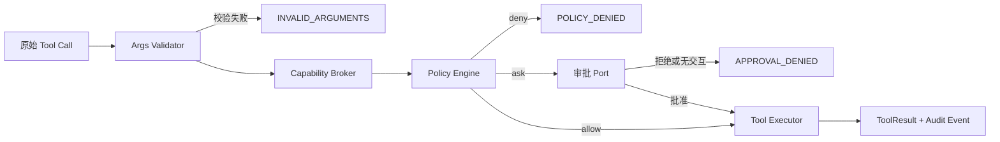
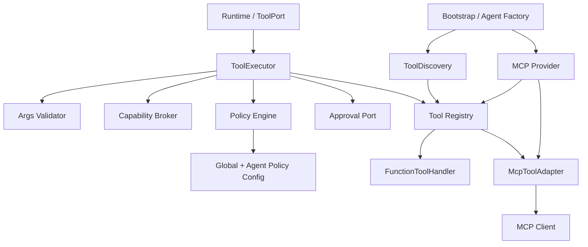
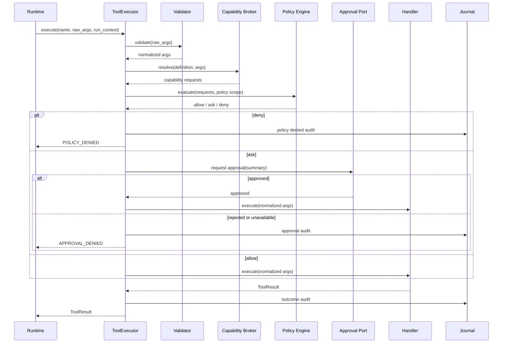

# Tool v1 总体设计

## 1. 文档定位

本文定义 dotClaw Tool 模块 v1 的目标架构，供后续开发、测试和代码审查使用。本文中的结论按以下标记区分：

- **已确认决策**：本次设计讨论已确认，实施必须遵从。
- **代码事实**：基于当前仓库代码核查得出。
- **实现假设**：为使设计可落地而作出的最小假设；实现前或实现中若需变更，必须更新本文和开发计划。
- **后续演进**：明确不属于本次范围。

## 2. 背景与问题

### 2.1 代码事实

当前工具层包含 `ToolRegistry`、`ToolExecutor`、`ToolHandler` 与 `BuiltinToolHandler`。内置工具由 `dotclaw.tools.builtin.register_all()` 手工导入各模块的 `get_*_handler()` 并注册。`ToolRegistry.register()` 对同名工具采取静默覆盖。工具参数 Schema 由各工具手写 JSON Schema，`BuiltinToolHandler` 未在调用工具函数前执行统一参数校验。

当前 MCP Provider 在后台连接 server，并将 MCP tools、resources、prompts 都适配为 `ToolHandler` 注册到同一 Registry；其中 MCP tool 没有 server 命名空间。审批机制基于 `ToolDefinition.needs_approval` 与工具名称列表，且没有交互 Channel 时会默认通过审批。`ToolExecutor` 中已有“将安全模块独立出去”的待办。

项目依赖中当前未声明 Pydantic 或 JSON Schema 校验库；引入 Pydantic 是本次实现工作的一部分。

### 2.2 目标

1. 用 `@tool` 装饰器替代本地工具的 `get_*_handler()` 和手工注册列表。
2. 以 Pydantic 参数模型为本地工具 Schema 与运行时参数校验的唯一事实来源。
3. 统一本地与 MCP 工具的命名、发现、结果、错误和审计契约。
4. 将参数验证、资源请求翻译、策略判断、审批和执行分离，形成可测试的安全边界。
5. 规范 MCP 的暴露范围、命名空间和 Run 级生命周期。
6. 为后续 OS 级沙箱与自定义本地工具包预留边界，但不伪称已实现。

### 2.3 非目标与范围边界

- **已确认决策**：本次不实现容器、权限降级、网络命名空间等 OS 级真实沙箱；只能预留 `sandbox` 决策字段。
- **已确认决策**：本次不将 MCP resources/prompts 伪装为 LLM 工具；它们可保留在 MCP 原生 API 中，但不进入 Tool Registry。
- **已确认决策**：首版 Discovery 仅扫描可信包 `dotclaw.tools.builtin`，不扫描任意工作区目录，不支持第三方本地工具包。
- 本次不改变 Runtime v2 的审批等待/恢复语义；Tool 模块只提供更清晰的策略决策与执行接口。

## 3. 核心术语

| 术语 | 定义 |
| --- | --- |
| Tool Definition | 面向 LLM 的名称、描述、参数 Schema、来源和元数据定义。 |
| Tool Args Model | 本地工具的 Pydantic 入参模型，是 JSON Schema 与运行时验证的唯一来源。 |
| Tool Discovery | 导入可信工具包并收集被 `@tool` 标记函数的过程。 |
| Capability Request | 对一次已验证 Tool Call 所触及资源的结构化描述，如工作区文件写入或 MCP 调用。 |
| Capability Broker | 将 Tool Call、已验证参数和工具策略档案翻译为 Capability Request 的内部组件。 |
| Policy Engine | 对 Capability Request 计算 `allow`、`ask`、`deny` 及执行约束的组件。 |
| Policy Profile | 工具装饰器选择的内置资源访问档案，而不是工具作者维护的自由能力集合。 |
| Run 工具快照 | 一个 Run 开始时固定的可用 Tool Definition 集合；Run 内不动态增删。 |

## 4. 已确认架构决策

### 4.1 声明、Schema 与校验

- **已确认决策**：本地工具使用 `@tool(...)` 装饰器声明注册元数据；装饰器附着元数据，不在导入时向全局 Registry 写入状态。
- **已确认决策**：复杂工具显式提供 Pydantic `args_model`；简单工具允许从签名推导等价模型。实现首版必须先定义"简单"的支持范围，不能默默降级为无校验。
- **已确认决策**：首版签名推导仅支持两类函数：① 零参函数；② 全部业务参数均为 `str`、`int`、`float`、`bool` 的普通位置/关键字参数，且允许字面量默认值。以下情形**一律不支持**推导，必须显式提供 `args_model`：`Optional`/`Union`、容器（`list`/`dict`/`set`/`tuple`）、枚举、嵌套模型、`Annotated` 约束、仅位置参数（`/`）、`*args`、`**kwargs`、自定义类型。Discovery 阶段遇到不支持的签名必须直接抛出 `ToolDeclarationError`，**绝不降级为无校验调用**。
- **已确认决策**：本地工具默认 `extra="forbid"`，拒绝未声明字段；关键参数使用严格类型。校验失败返回 `INVALID_ARGUMENTS/validation`，工具函数、Broker 与 Policy Engine 均不得运行。
- **实现假设**：引入 Pydantic v2，并以 `model_json_schema()` 输出 LLM 所需 JSON Schema；若模型兼容层要求不同 JSON Schema 方言，由单独的 Schema Adapter 负责转换。

本地工具建议形态如下，示例仅表达接口，不是最终代码：

```python
@tool(
    name="builtin.files.read_text",
    args_model=ReadTextArgs,
    policy=ToolPolicy.WORKSPACE_READ,
)
async def read_text(args: ReadTextArgs, context: ToolContext) -> str:
    """读取工作区内的 UTF-8 文本文件。"""
```

### 4.2 规范命名与冲突

- **已确认决策**：内置工具名称使用 `builtin.<domain>.<action>`；现有工具的目标名称为：

| 旧名称 | 目标名称 |
| --- | --- |
| `read_file` | `builtin.files.read_text` |
| `write_file` | `builtin.files.write_text` |
| `list_dir` | `builtin.files.list_directory` |
| `exec` | `builtin.process.execute` |
| `memory_read` | `builtin.memory.read` |
| `memory_write` | `builtin.memory.write` |
| `system_info` | `builtin.system.get_info` |
| `get_time` | `builtin.system.get_time` |

- **已确认决策**：MCP tool 名称使用 `mcp.<server>.<tool>`；`server` 是配置中稳定的 server 名，`tool` 保留 MCP 原始 tool 名的可识别、合法化形式。协议调用仍使用原始 MCP tool 名。
- **已确认决策**：Registry 禁止同名静默覆盖；发现或注册冲突必须使该来源的初始化失败，并输出冲突双方与来源。

### 4.3 安全模型

**已确认决策**：安全不是给模型看的第二份工具说明。`description` 用于模型选择工具；安全链路根据本次已验证参数判断资源访问是否允许。



- **已确认决策**：默认拒绝，策略显式给出 `allow`、`ask` 或 `deny`。
- **已确认决策**：无可用交互审批通道时，`ask` 必须拒绝，不能像现状一样默认放行。
- **已确认决策**：工具作者不维护自由组合的能力列表；本地工具只选择内置 `ToolPolicy` 档案。Broker 根据档案与参数自动形成资源请求。MCP 的 `MCP(server)` 档案由 Provider 自动生成。
- **已确认决策**：首版 Broker 覆盖文件、进程、网络、MCP 四类资源请求；Policy Decision 可携带简单约束（工作区根目录、超时上限、`sandbox` 预留字段）。
- **已确认决策**：全局策略是安全上限，Agent 级策略只能收窄，不得放宽；审批仅对本次调用有效，不持久化临时授权。
- **已确认决策**：审计应记录规范工具名、资源请求、匹配规则、最终决策、耗时及结果；参数与输出必须按敏感字段规则脱敏。

**实现假设**：首版内置 Policy Profile 至少包括 `WORKSPACE_READ`、`WORKSPACE_WRITE`、`PROCESS`、`NETWORK` 与 `MCP`。它们是 Broker 的翻译模板，不是开放给配置任意拼装的字符串能力系统。

### 4.4 MCP 边界与生命周期

- **已确认决策**：MCP v1 仅将 `tools/list` 的工具暴露为 Tool Registry 条目。resources/prompts 不注册为工具。
- **已确认决策**：MCP Provider 负责连接、初始化、发现、健康状态、关闭和重连；MCP Tool Adapter 只负责协议参数/结果转换；Tool Executor 不直接了解 MCP 协议。
- **已确认决策**：Agent 启动阶段完成 MCP 发现并形成 Provider 快照。单个 server 失败可降级，不阻塞 Agent 启动。
- **已确认决策**：每个 Run 从可用 Provider 快照取得固定工具清单，Run 内不增删工具。server 在 Run 中断线时调用返回 `MCP_UNAVAILABLE`；重连结果只在下一 Run 生效。
- **实现假设**：需要由 Runtime/Context 集成点在 Run 创建时取得 Tool Registry 的不可变 definitions 快照，不能继续在上下文拼装期间读取会变化的 Registry。

### 4.5 统一执行与结果契约

所有工具的固定执行顺序为：原始参数 → 入参验证与规范化 → Capability Broker → Policy Engine → 审批 → Handler 执行 → 结果与审计。

- **已确认决策**：本地函数和 MCP Adapter 均返回统一 `ToolResult`。MCP 原始协议对象不得穿透 Tool 模块。
- **已确认决策**：结果必须具备面向模型的内容、`is_error`、`error_code`、`error_type` 以及运行/审计 metadata。短期内可保留 `output: str` 兼容现有调用方，但内部应预留内容块表达而不是把异常文本当成功输出。
- **实现假设**：统一错误码至少包括 `INVALID_ARGUMENTS`、`POLICY_DENIED`、`APPROVAL_DENIED`、`TOOL_NOT_FOUND`、`TIMEOUT`、`MCP_UNAVAILABLE`、`EXECUTION_ERROR`、`EXECUTOR_ERROR`。

## 5. 总体分层与依赖方向



依赖规则：

- `tools` 核心不得直接 import MCP transport、CLI Channel 或具体 Runtime 实现；审批通过 Port/Protocol 注入。
- `mcp` 只依赖 Tool 核心抽象，不能反向控制 Policy 或 Executor。
- `bootstrap/agent factory` 是唯一装配点，负责可信包 Discovery、全局策略、Agent 收窄策略和 MCP Provider。
- `ToolRegistry` 只保存已构造 handler，不承担发现、验证、策略、审批或执行。

## 6. 模块职责与迁移映射

| 目标模块 | 职责 | 禁止职责 | 现有替代/迁移来源 |
| --- | --- | --- | --- |
| `tools.decorator` | 保存 `@tool` 声明元数据 | 注册全局状态、执行策略 | 新增 |
| `tools.discovery` | 可信包导入、收集声明、构造 handler | 执行工具、扫描任意目录 | `builtin.register_all()` |
| `tools.schema` | Pydantic/签名到 JSON Schema、参数验证与规范化 | 策略判断 | 手写 `parameters` |
| `tools.function_handler` | 调用已验证本地函数、规范化返回值 | 参数验证、审批 | `BuiltinToolHandler` |
| `tools.capability` | Capability Request、Broker、Policy Profile | 用户交互 | Executor 内安全待办 |
| `tools.policy` | 规则合并、allow/ask/deny、约束与脱敏规则 | 执行外部副作用 | `ApprovalManager` 的名称判断部分 |
| `tools.approval` | 仅将 `ask` 决策交由 Channel/Runtime 完成 | 自行放行、定义策略 | 现有 `ApprovalManager` |
| `tools.registry` | 无冲突注册、查询与快照 | 静默覆盖、执行 | 现有 `ToolRegistry` |
| `tools.executor` | 编排固定安全链路、超时、统一结果与审计 | 解析具体资源或 MCP 协议 | 现有 `ToolExecutor` |
| `mcp.provider` | 连接、发现、快照、状态、关闭/重连 | 将 resources/prompts 注册成工具 | 现有 `MCPToolProvider` |
| `mcp.tool_adapter` | MCP tool 参数/返回协议转换 | Registry 生命周期、策略决策 | 现有三个 MCP Handler |

## 7. 配置、状态与审计

### 7.1 策略配置

**已确认决策**：全局配置提供可授予的安全上限，Agent 配置仅可收窄。配置示意：

```yaml
tools:
  policy:
    workspace_root: .
    rules:
      workspace.read: allow
      workspace.write: ask
      process.exec: ask
      network.http: deny
      mcp.connect: ask
      mcp.call: ask
    denied_paths: [".env", ".git/**", "**/*.key"]
    allowed_mcp_servers: ["github"]
```

**待落实的实现细节**：默认规则的最终 YAML 值、规则优先级和路径 glob 语义应在实现第一阶段通过测试固定；它们不改变已确认的“默认拒绝、全局上限、Agent 收窄”原则。

### 7.2 审计数据

本次不新增业务持久化实体。工具调用审计沿用 Journal 作为唯一写入者，扩展其事件字段以写入：`tool_name`、`source`、`capability_requests` 摘要、`policy_decision`、`matched_rule`、`approval_outcome`、`timeout`、`duration` 与 `error_code`。完整原始参数、令牌、密钥、认证头和敏感输出不写入审计。

## 8. 关键流程与异常语义

### 8.1 正常与受控审批流程



### 8.2 状态与失败归属

| 场景 | 所有者 | 行为 |
| --- | --- | --- |
| 参数无效 | Validator | 返回 `INVALID_ARGUMENTS`；无副作用。 |
| 策略拒绝 | Policy Engine | 返回 `POLICY_DENIED`；无审批、无执行。 |
| 需要审批但无 Channel | Approval Port | 返回 `APPROVAL_DENIED`；不得默认放行。 |
| 用户拒绝 | Approval Port | 返回 `APPROVAL_DENIED`。 |
| 工具超时 | Executor | 取消 handler，返回 `TIMEOUT`；handler 负责清理其子进程/连接。 |
| MCP server 不可用 | MCP Adapter | 返回 `MCP_UNAVAILABLE`；不转换为普通成功文本。 |
| MCP 连接失败 | MCP Provider | 标记 server 降级；不阻塞 Agent 启动。 |
| 工具名冲突 | Discovery/Registry | 启动失败或该来源加载失败；绝不覆盖已有定义。 |

## 9. 并发、一致性与恢复

- Tool Registry 在启动发现和 MCP Provider 更新期间需要受单一异步锁保护；`snapshot()` 返回不可变 definitions 元组。
- **已确认决策**：Run 的隔离单位是 Tool Definition 快照。MCP 的重连和可用性变化不会修改正在运行 Run 的可见工具集。
- Policy Decision 只针对当前调用有效；不会写入永久授权状态，因此无授权状态恢复问题。
- 审批/执行语义仍由 Runtime 的既有等待与恢复机制持有；ToolExecutor 不保存跨 Run 的审批状态。
- 超时/取消后的外部副作用无法保证回滚；高风险工具依赖 `ask` 与具体 handler 的取消清理，审计记录最终状态。

## 10. 架构不变量与风险

### 10.1 不变量

1. 任何工具函数之前必须完成参数验证。
2. 任何外部副作用之前必须完成 Broker 与 Policy 决策。
3. `ask` 在无交互能力时等价于拒绝。
4. Registry 内工具名全局唯一，禁止静默覆盖。
5. MCP tools 必须带 server 命名空间；resources/prompts 不进入 Registry。
6. 一个 Run 中的 LLM 工具 Schema 与可调用工具集一致且不可变。
7. 新代码只能依赖新边界；旧注册 API 不得承接新增工具。

### 10.2 风险与限制

- 路径规范化必须防范 `..`、符号链接/联接点逃逸和 Windows 路径大小写差异；这是安全关键实现。
- 进程命令字符串难以完全解析，首版只能基于受控执行接口、明确风险规则和审批降低风险，不能声称完成命令沙箱。
- MCP server 由外部代码提供；按 server 授权仅控制 dotClaw 是否调用，不能限制 server 内部行为。
- Pydantic 生成的 JSON Schema 与 MCP/OpenAI 兼容格式可能需要转换与回归测试。

## 11. 后续演进

- 真正的 OS 级沙箱与网络隔离。
- 通过显式 allowlist 配置加载第三方本地工具包。
- 资源与 prompts 的独立一等能力模型，而非伪装成 tools。
- 更丰富的内容块 ToolResult 和可持久化、显式管理的授权策略（如未来确有产品需求）。
