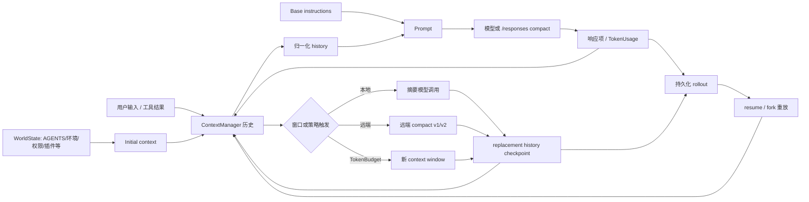
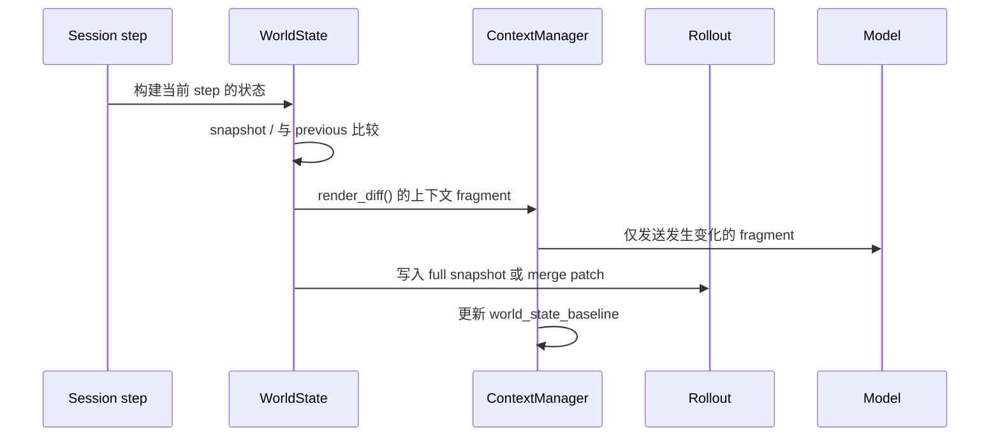
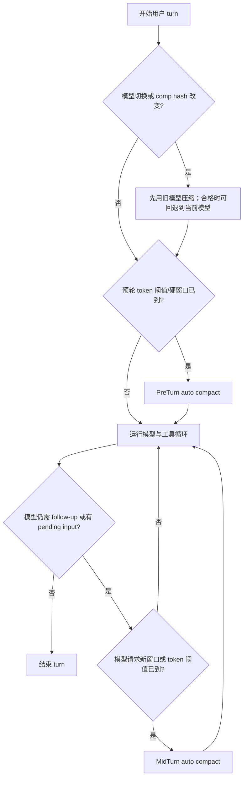

# Codex CLI 上下文工程与压缩机制源码解读

> 分析对象：OpenAI 公共仓库 [`openai/codex`](https://github.com/openai/codex)，提交 [`bf3c1972b7d045c0a3a48dff91f381070f8f69e1`](https://github.com/openai/codex/tree/bf3c1972b7d045c0a3a48dff91f381070f8f69e1)（2026-07-20）。
>
> 本文聚焦 Rust 核心运行时中「模型可见上下文」和 compaction 的完整执行链：构造、增量更新、计量、触发、替换、持久化、恢复及测试。没有把 UI 展示层或与此无关的 CLI/SDK 子项目逐文件复述。

仓库中的 `codex-cli` 是 npm 包入口（`codex` 指向 `bin/codex.js`）；本文讨论的上下文语义实际由 `codex-rs/core` 运行时实现，因此源码追踪以该 crate 为主。

## 结论先行

Codex CLI 的 compaction 不是简单地“让模型总结聊天记录，然后删掉旧消息”。它把上下文分成三个彼此独立、但在请求时组合的层次：

1. **基础指令（base instructions）**：随推理请求单独传递，不混入普通历史。
2. **规范化运行状态（initial context / world state）**：如 `AGENTS.md`、环境、权限、插件、协作模式与技能目录。它有快照、差分、持久化和重放机制。
3. **会话轨迹（conversation history）**：用户消息、助手消息、推理密文、工具调用及工具结果；进入历史前就进行输出截断，发送前再做工具调用配对和多模态归一化。

压缩的产物是一个新的、可恢复的 **history checkpoint**，而不是对旧历史做原地修改。普通的“手动/预轮压缩”在下一轮重新注入完整初始上下文；正在执行中的“中途压缩”则把完整初始上下文插在最后一个真实用户消息之前，以同时满足模型所期待的序列形状与运行状态的正确性。

当前实现有四条策略路径：本地摘要、远端 compaction v1、远端 compaction v2，以及启用 `TokenBudget` 特性时的“直接开启新窗口”。后者刻意不摘要，也不保留对话轨迹；它通过新的窗口 ID、开发者指令和可选 notes MCP 提示，让模型主动以新的上下文窗口继续。

## 阅读范围与证据

关键证据来自以下源码及对应集成测试：

- [会话与初始上下文构造](https://github.com/openai/codex/blob/bf3c1972b7d045c0a3a48dff91f381070f8f69e1/codex-rs/core/src/session/mod.rs)
- [历史管理与 token 估算](https://github.com/openai/codex/blob/bf3c1972b7d045c0a3a48dff91f381070f8f69e1/codex-rs/core/src/context_manager/history.rs)
- [WorldState 快照/差分模型](https://github.com/openai/codex/blob/bf3c1972b7d045c0a3a48dff91f381070f8f69e1/codex-rs/core/src/context/world_state/mod.rs)
- [压缩调度与本地实现](https://github.com/openai/codex/blob/bf3c1972b7d045c0a3a48dff91f381070f8f69e1/codex-rs/core/src/compact.rs)
- [远端 v1](https://github.com/openai/codex/blob/bf3c1972b7d045c0a3a48dff91f381070f8f69e1/codex-rs/core/src/compact_remote.rs)、[远端 v2](https://github.com/openai/codex/blob/bf3c1972b7d045c0a3a48dff91f381070f8f69e1/codex-rs/core/src/compact_remote_v2.rs)
- [回合循环和自动触发](https://github.com/openai/codex/blob/bf3c1972b7d045c0a3a48dff91f381070f8f69e1/codex-rs/core/src/session/turn.rs)、[窗口判定](https://github.com/openai/codex/blob/bf3c1972b7d045c0a3a48dff91f381070f8f69e1/codex-rs/core/src/session/context_window.rs)
- [checkpoint 重放](https://github.com/openai/codex/blob/bf3c1972b7d045c0a3a48dff91f381070f8f69e1/codex-rs/core/src/session/rollout_reconstruction.rs) 与 [核心集成测试](https://github.com/openai/codex/blob/bf3c1972b7d045c0a3a48dff91f381070f8f69e1/codex-rs/core/tests/suite/compact.rs)

下文的“事实”均可在这些文件中直接定位；“工程判断”是基于这些事实作出的归纳，会明确标注。

## 代码层级

```text
codex-rs/
├─ prompts/templates/compact/
│  ├─ prompt.md                         # 本地摘要交接提示词
│  └─ summary_prefix.md                 # 新模型读取摘要的前缀
├─ core/src/
│  ├─ session/
│  │  ├─ turn.rs                        # 请求循环、pre/mid-turn 自动压缩
│  │  ├─ context_window.rs              # 阈值与可用窗口判定
│  │  ├─ token_budget.rs                # 预算提醒与兜底提示
│  │  ├─ rollout_reconstruction.rs      # resume/fork 时的 checkpoint 重放
│  │  └─ mod.rs                         # 初始上下文、持久化、替换历史
│  ├─ context/
│  │  ├─ world_state/mod.rs             # 分段状态快照与差分
│  │  └─ token_budget_context.rs        # 新窗口的模型可见元数据
│  ├─ context_manager/history.rs        # 历史规范化、截断、计量
│  ├─ compact.rs                         # 本地摘要与公共辅助函数
│  ├─ compact_remote.rs                  # 远端 compaction v1
│  ├─ compact_remote_v2.rs               # 远端 compaction v2
│  └─ compact_token_budget.rs            # 不摘要的新窗口策略
└─ protocol/src/
   └─ protocol.rs / compacted_item.rs    # CompactedItem、TokenUsage 等协议对象
```

## 总体架构



依赖方向是：`session/turn` 负责生命周期编排；`ContextManager` 只负责内存历史和其不变量；`WorldState` 只负责状态的表示、快照与增量渲染；不同 compaction 实现只生成或接收 replacement history，最终统一经 `Session::replace_compacted_history` 安装并持久化。

## 一、上下文工程：不是把所有信息塞进每次请求

### 1. 请求的基本形状

每次模型请求由 `Prompt` 组合而成：

- `base_instructions`：模型/人格相关基础指令，独立于 `input`；
- `input`：经 `ContextManager::for_prompt` 归一化后的历史项；
- `tools`：根据当前 step 的工具路由生成的模型可见 schema；
- 与模型能力匹配的并行工具调用、输入模态、推理强度、服务等级等元数据。

这避免了把不变的基础策略不断写进可变历史。更重要的是，代码审查规则也明确要求“上下文只能增量建立、避免频繁改变导致缓存未命中、每个注入项必须有硬上限”。这是对 prompt cache、输入预算和可重放性的共同约束，而不是单纯的提示词风格。

### 2. Initial context：规范状态的首次全量注入

`Session::build_initial_context_with_world_state` 聚合为少量 developer/user 消息。它会包含或按特性开关选择：开发者指令、模型切换说明、人格、技能说明、推荐插件、扩展贡献的 thread/turn context、token-budget 窗口信息、协作模式，以及 `WorldState` 的完整渲染。

它的职责是将“运行时现在是什么样”翻译成模型可读的规范事实；它**不**应成为普通对话的事实记录。生成的项会被赋予 turn ID，因此压缩 checkpoint、恢复和 UI 事件可以关联到同一个生命周期。

### 3. WorldState：状态快照 + 差分，而非重复整段环境

`WorldState` 按稳定的 section ID 管理状态分区。内置分区包括：`AGENTS.md`、apps instructions、协作模式、环境、环境指令、权限、插件和 realtime，扩展也能注册自己的分区。

每个 `WorldStateSection` 必须提供：

- 可序列化、非 null 的最小比较快照；
- 从前一个状态到当前状态的 `render_diff`；
- 可选的旧格式和 retained-history 识别能力。

`ContextManager::update_world_state` 同时产生两种结果：发给模型的上下文 fragment，以及写入 rollout 的完整快照或 RFC 7386 merge patch。若内存快照缺失，系统会检查 retained history 是否仍保有对应 fragment；不能证明仍存在时会当作“首次出现”重新注入。这是一个很关键的防御：压缩、回滚和恢复后不会因为错误地相信旧 baseline 而漏掉安全/环境/指令更新。



**工程判断**：这相当于将“会话语义状态”和“事件历史”分离。前者可用快照/补丁高效恢复，后者仍保留按时间的可审计轨迹；它比用摘要承担环境状态可靠得多。

### 4. History：先限流，后归一化，再发送

`ContextManager` 的 `items` 按从旧到新的顺序保存，并有 `history_version` 记录 compaction/rollback 等重写。写入历史时：

- 只接收 API 语义消息，过滤 system 和 `CompactionTrigger` 等本地标记；
- 工具/自定义工具输出立即按模型的 `truncation_policy × 1.2` 截断；
- 发送前确保每个工具 call 都有 output、每个 output 都有 call；
- 移除模型不支持的图像、音频输入。

这条路径意味着“大工具输出”不会无界地进入后续每个请求；而 call/output 配对不变量防止了压缩、回滚或截断后得到 API 不可接受的半个工具事务。

### 5. Token 计量的边界

服务端返回的 `TokenUsage` 是主来源。若服务端没有确认已包含历史 reasoning，客户端会估算最后一个用户边界之前的加密 reasoning；再加上最后一个模型生成项之后、服务端尚未计入的本地新增项。估算采用字节近似，不是 tokenizer 的精确值。

图像不会按 base64 文本长度粗暴计费：普通输入图像使用固定的 resized 估计；`detail: original` 按 32px patch 数估算，最多 10,000 patches，并使用 SHA-1 键的 32 项 LRU 缓存。加密工具输出也使用针对编码长度的近似修正。它们的共同目的都是让阈值判定不被序列化载荷大小严重误导。

## 二、何时压缩：窗口、预算和生命周期触发器

`context_window_token_status` 同时维护两个界限：模型完整 context window 是硬上限；auto-compact 预算是可配置的软阈值。配置可选择两种统计范围：

| 范围 | 计算方式 | 适用动机 |
| --- | --- | --- |
| `total`（默认） | 整个 active context 的 token 数 | 简单、保守地限制每个窗口总大小 |
| `body_after_prefix` | active context 减去当前窗口首次请求的 input-token baseline | 不让固定初始指令/环境前缀吞掉可用于工作轨迹的预算 |

`body_after_prefix` 的 baseline 优先使用服务端第一次观测到的 `input_tokens`，恢复场景才使用本地估算；因此它刻意把首次请求的 output 计为窗口内增长，而不是前缀。

触发时机如下：



具体触发原因包括：用户显式 `/compact`、上下文/预算到限、模型的 `new_context_window` 工具请求、模型 compaction compatibility hash 改变，以及切换到更小 context window 的模型。只有在仍需继续采样时，回合中途的到限才会立即 rollover；否则下一个用户 turn 预先压缩。

TokenBudget 还可以在余量低于阈值时注入一次提醒；若配置了 fallback prompt，会预留额外 buffer，并在基础预算归零时最多注入一次兜底提示，而不是无限重复提示。

## 三、四种 compaction 实现

### 1. 本地摘要（非远端 provider）

`compact.rs` 将当前 history 加上一条合成用户消息，默认提示词要求生成面向“下一位 LLM”的简洁交接：当前进展与决策、约束/偏好、待办和关键引用。该提示词可以由 `compact_prompt` 覆盖。

模型完成后，代码从本次压缩 turn 的最后一个 assistant message 取得摘要，并构造新历史：

1. 收集全部真实用户消息，排除以前的 summary；
2. 从最近消息向前保留，总额硬限制为 **20,000 近似 tokens**；跨界的最早一条被截断；
3. 追加一条用户角色 summary，前缀说明“另一模型已开始工作”，使下一模型把它当 handoff 而非普通用户意图；
4. 安装为 replacement history。

当本地摘要请求本身触发 `ContextWindowExceeded`，它会每次移除最旧 history item（连同其 call/output 对应项）并重试；其他流错误按 provider 的重试上限退避重试。若压缩后仍只剩一项而超窗，才将 token 使用标记为 full 并失败。

### 2. 远端 compaction v1

当 model provider 声明支持 remote compaction 时，v1 通过 `compact_conversation_history` 把完整 `Prompt`（history、基础指令、当前工具 schema）交给远端端点，接收它返回的 replacement history。

在调用前，它会从最新项向前把工具输出重写为“输出过大，已截断”的短文本，或把 tool-search 的 tools 清空，直到估计输入不超过模型硬窗口。随后安装结果时会过滤远端返回的 developer 消息与非真实用户包装消息，避免把过期或重复的运行时指令重新带回历史；当前 session 会重新插入权威的 initial context。

### 3. 远端 compaction v2

v2 仍先处理过窗工具输出，但不依赖端点直接返回完整可用历史。它在 `Prompt.input` 末尾加入 `CompactionTrigger`，流式请求只接受**恰好一个** `ResponseItem::Compaction` 输出项，否则视为协议错误。

安装时，v2 从原 prompt 中仅保留 `user`/`developer`/`system` 消息，再套用同一合法性过滤，最后按最近优先限制文字到 **64,000 近似 tokens**，保留图像，并追加远端给出的 compaction item。assistant 消息、工具调用、普通工具结果不会被原样保留。也就是说，远端 compaction item 是压缩后历史的语义锚点，而非把模型“总结文本”暴露成一条普通对话。

v2 的流式传输最多重试两次（取 provider 上限和 2 的较小值）；还记录输入历史、请求、结果及“installed checkpoint”的 trace。若使用旧模型压缩因可回退错误失败，且当前认证/供应商条件满足，系统会以当前模型再试，并记录 model fallback 事件。

### 4. TokenBudget：开启新窗口，不做摘要

启用 `Feature::TokenBudget` 时，无论手动还是自动 compaction 都改走 `compact_token_budget.rs`：触发前/后 hook 与 `ContextCompaction` 生命周期仍然存在，但核心动作是 `start_new_context_window`，不调用摘要模型或远端 compact 端点。

模型通过 developer context 得到 thread ID、首个/前一个/当前 window ID、可选 notes MCP `thread_hint` 和可选 guidance。`new_context_window` 工具也明确返回“会在不总结对话历史的情况下开始新窗口”。

这不是传统意义的压缩，而是将长任务交给模型自己在窗口边界写入足够的外部/持久化状态。它牺牲隐式聊天记忆，换取明确的窗口隔离和 token-budget 约束。

## 四、压缩后的正确性：初始上下文位置、持久化与恢复

### 初始上下文的两种注入规则

| 场景 | replacement history 中的 initial context | 原因 |
| --- | --- | --- |
| 手动压缩、pre-turn 压缩 | 不直接放入 replacement history；清空 reference baseline，下一常规 turn 全量重新注入 | 压缩是一个新的请求边界，避免把旧动态配置误认为当前配置 |
| mid-turn 压缩 | 放在最后一个真实用户消息之前；没有真实用户消息时放在 summary/compaction item 前 | 压缩项必须保持末尾，且正在继续的模型请求必须立刻看到权威状态 |

这条规则由 `InitialContextInjection::{DoNotInject, BeforeLastUserMessage}` 显式建模，而不是由调用者隐式约定。中途路径也会把当前 `TurnContextItem` 和完整 WorldState snapshot 作为新 baseline 持久化。

### Checkpoint 的写入顺序

`replace_compacted_history` 的顺序具有语义：

1. 替换内存 history，并在需要时补充 response item ID；
2. 如果中途压缩已经重注入 world state，写入 **full** WorldState snapshot；
3. 持久化含 `replacement_history`、window number 与窗口 UUID 链的 `CompactedItem`；
4. 再持久化 WorldState baseline 和 TurnContext baseline；
5. 标记 session-start source 为 `Compact`。

“先 replacement history，后 baseline”的顺序确保 resume/fork 重放时，不会得到一个声称状态已存在、但模型历史中尚未有该状态的快照。

### Resume / fork 的重放算法

恢复不需要从线程起点重放整条记录：`reconstruct_history_from_rollout` 倒序扫描 rollout，寻找最新仍存活的 `replacement_history` checkpoint；一旦同时拿到前一 turn 设置和 reference context baseline，便停止向更旧记录扫描，只正序重放该 checkpoint 之后的后缀。

它还会：

- 把“撤销最近 N 个真实用户 turn”解释为逆向扫描中跳过 N 个符合边界的 segment；
- 从 `CompactedItem` 恢复 window number 和 UUID 链；
- 重放 WorldState 的 full snapshot 与 merge patch；
- 兼容没有 replacement history 的旧 compaction 记录：用用户消息和摘要重建，并在下一轮重新注入规范 context；
- 在 `body_after_prefix` 模式下，于恢复后估算当前前缀 baseline，等待服务端首次 usage 样本将其校正。

**工程判断**：checkpoint + suffix replay 使 compaction 同时成为“内存减负”和“恢复加速索引”。它也让 fork 的语义可预测：分叉点之后只有新分支追加的 suffix 会参与新 history。

## 五、可靠性措施与边界

| 问题 | 机制 | 收益 | 当前边界 |
| --- | --- | --- | --- |
| 工具结果可能无限大 | 写入时截断；远端压缩前二次降级大输出 | 防止工具输出占满后续上下文 | 截断会丢失细节，模型只能看到占位说明 |
| 压缩输出不符合协议 | v2 要求恰好一个 compaction item；否则失败 | 避免安装模糊的半成品历史 | v1 依赖远端直接返回 replacement history，客户端过滤较多但不能证明其摘要质量 |
| 动态状态在压缩后失真 | WorldState 快照/diff；mid-turn 重新注入完整权威状态 | 权限、环境和指令不会只依赖摘要记忆 | 现有 section 必须正确实现 snapshot 与 retained matcher |
| 网络/模型切换失败 | 流退避重试、旧模型失败时按条件回退当前模型、pre/post compact hooks | 模型升级或短暂服务失败不必直接中断任务 | 本地摘要只有在有效 history 仍有多项时能通过删最旧项自救 |
| 多次压缩的可追踪性 | window UUID 链、analytics、trace checkpoint、rollout `CompactedItem` | 可以关联一次压缩前后和恢复路径 | 摘要本身仍是有损语义压缩，CLI 也会提示多次 compaction 会降低准确性 |
| token 数不精确 | 服务端 usage 为主，本地按字节/媒体近似补齐 | 能对未回传的局部内容及时触发保护 | 本地估算不是 tokenizer 精确值；阈值附近可能有偏差 |

仓库的集成测试覆盖了手动/自动压缩、多个连续压缩、超过窗口后的重试、远端 v2、恢复/分叉、模型变小、comp hash 变化、模型 fallback、`body_after_prefix`、加密 reasoning 计量、hooks、生命周期事件与 request-shape 快照。这些测试是上述行为比阅读注释更强的证据。

## 对构建同类 Agent 的可迁移原则

1. **把状态与轨迹分开**：权限、环境、工具目录等应由结构化 snapshot/diff 保证正确性；摘要只承担任务语义交接。
2. **把压缩视为 checkpoint 提交**：一次提交要同时定义 replacement history、状态 baseline、窗口身份和可重放顺序。
3. **压缩前先限制输入**：无界工具输出必须在进入长期历史前截断；压缩请求本身也应有“仍然超窗时怎么降级”的策略。
4. **区分 pre-turn 与 mid-turn**：两者的 prompt 边界不同。后者尤其要保证状态注入位置和最后一条压缩项的顺序。
5. **预算不等于模型最大窗口**：为固定前缀与工作轨迹分别建账，硬窗口永远独立兜底。
6. **恢复优先用最新 checkpoint + 后缀**：避免每次 resume 全量扫描/重建，并使 rollback/fork 可被精确定义。
7. **摘要的质量不是系统正确性**：摘要会有损且会随多次压缩退化；把必须正确的事实存入规范状态或外部持久化工具，而不是寄托在摘要里。

## 当前限制与需要谨慎解读之处

- 本地 summary 只保证最近真实用户消息最多约 20k tokens 加一份模型生成的摘要；它不保证工具结果、助手回复或早期用户消息的逐字保留。
- 远端 v2 的 64k 限制只按**消息文本**近似计量；图像会保留但不在这项文本预算中计数，实际多模态输入仍受模型完整窗口限制。
- TokenBudget 的“新窗口”不是无损延续。若模型没有把关键进度写入文件、notes 或下一窗口的可见状态，先前聊天细节不会自动保留。
- 代码清楚表明本地 token 估算是 coarse lower bound；不应把 UI 中的本地剩余 token 显示理解成精确 tokenizer 结果。
- 远端 compaction 的具体服务端摘要/加密格式不在公开 CLI 仓库内。本文只描述客户端可观察到的请求、验证、过滤和安装语义。
