# Agent 与 Identity 模块总体说明

> 适用代码：`aandbcct/dotClaw` 的 `master` 分支  
> 扫描基准：2026-07-28，包含 AgentIdentity 声明、YAML 加载、AgentRegistry、默认 Identity、Session 绑定、Runtime Policy 冻结、Context Plan、Tool Agent Policy、Delegation 接入与 AgentRun 状态机分层重构（`master@31f30ae75d22f2b384e04a643894eaf9c0607323`）
> 文档定位：自顶向下解释 dotClaw 如何用声明式 Identity 描述 Agent，如何将 Identity 绑定到 Session 并冻结为每次 Run 的执行策略，以及各字段在 Runtime、Context、Tool 和 Orchestration 中的真实消费边界。  
> 编写基准：《dotClaw Wiki 编写规范与验收准则 v1.1》  
> 上级导航：[dotClaw 开发者 Wiki](./README.md)

**快速导航**

| 需要回答的问题 | 阅读位置 |
|---|---|
| AgentIdentity 是什么、为什么不是运行中的 Agent 对象 | 第 1～2 节 |
| Agent 与 Identity 涉及哪些逻辑组件和外部接入 | 第 3 节 |
| 各字段、Loader、Registry、Policy Resolver 分别做什么 | 第 4 节 |
| 启动、Session 路由、策略冻结、Tool Policy 和委托如何运行 | 第 5 节 |
| YAML、Registry、Snapshot、Context 和 Delegation 契约 | 第 6 节 |
| 修改某项 Identity 能力从哪里开始 | 第 7 节 |
| 当前设计为何如此、存在哪些问题、如何演进 | 第 8 节 |
| 具体源码在哪里 | 第 9 节 |

```text
.dotclaw/agentConfig/*.yaml
→ load_agent_config()
→ AgentIdentity
→ AgentRegistry
→ Session.agent_id
→ RunRequest.agent_id
→ AgentPolicyResolver
→ AgentPolicySnapshot
→ Context / LLM / Tool / Delegation
```

---

## 1. 模块定位与边界

Agent 与 Identity 部分是 dotClaw 的**声明式 Agent 定义和运行策略来源层**。

当前系统没有一个长期存活、持有 Runtime 和外部资源的“Agent 实例”。`AgentIdentity` 只是不可变声明数据；真正的单次执行状态属于 `AgentRun` 和 `RunExecution`，共享执行机属于 RuntimeEngine。

该部分解决的核心问题是：

> 如何用稳定的 Identity 声明 Agent 的身份、模型、提示词、工具可见性、工具策略、Context Slot 和委托能力，并在 Session 与 Run 边界把这些声明转换为可审计的执行策略快照。

### 1.1 核心职责

当前职责归纳为六组：

1. **身份声明**：用 `agent_id`、名称、描述和标签描述一个逻辑 Agent。
2. **行为与模型约束**：声明 System Prompt、模型和循环预算来源。
3. **工具与安全约束**：声明工具白名单和 Agent 级 Tool Policy 收窄规则。
4. **Context 约束**：声明 Agent Owner 启用的 Context Slot。
5. **目录与路由**：在启动时建立 AgentRegistry，并由 Session 持久化 `agent_id`。
6. **运行冻结与委托**：每次 Run 将目标 Identity 冻结为 `AgentPolicySnapshot`，委托时按 target_agent_id 创建独立子 Session 和子 Run。

### 1.2 主要使用者

| 使用者 | 如何使用 Identity |
|---|---|
| `ApplicationHost` | 启动时加载全部 Identity，并确定默认项 |
| `SessionInteractionService` | 创建 Session、校验 Session.agent_id、提交 RunRequest |
| `AgentPolicyResolver` | 将 Identity 冻结为每次 Run 的不可变策略 |
| `ContextProvider` | 读取冻结 Prompt/Tool，并生成可用 Agent 摘要 |
| `ToolExecutor` | 按当前 Run 的 agent_id应用 Agent 级 Policy 收窄 |
| `LLMProxyAdapter` | 使用冻结策略中的 model_id 作为模型优先项 |
| `RuntimeDelegationAdapter` | 校验 target_agent_id，创建目标 Session 和子 Run |
| CLI | 展示当前 Identity 名称和模型，不持有 Agent 执行对象 |

### 1.3 明确不负责的内容

Agent 与 Identity 不负责：

1. **运行状态**：不持有 AgentRun、状态机、消息游标、审批或取消状态。
2. **基础设施**：不创建 Runtime、LLM、Tool、Memory、MCP、Channel 或 HTTP Client。
3. **工具安全执行**：不解析敏感资源、不计算最终 Policy，也不执行 Tool。
4. **上下文物化**：不读取 Session 历史、Memory 或 Knowledge，也不构造最终 ContextBundle。
5. **委托调度**：不创建 Task、不启动子 Run，也不保存父子运行状态。
6. **动态治理**：不提供热重载、版本发布、租户隔离、远程 A2A Discovery 或持久化 Agent 生命周期。

### 1.4 与相邻模块的职责边界

| 相邻模块 | Agent/Identity 负责 | 相邻模块负责 |
|---|---|---|
| Config | 提供 Identity 的全局回退值 | 读取 config.yaml、模型路由和全局 Tool Policy |
| Bootstrap | 提供可加载的声明类型 | 决定加载目录、默认 Identity 和装配顺序 |
| Orchestration | 提供逻辑主归属为 Agent 的 AgentRegistry | Task、Dispatcher、Delegation 和父子运行协调 |
| Session | 提供可绑定的 agent_id | 持久化 Session 与 agent_id |
| Runtime | 提供策略声明来源 | 冻结 AgentPolicySnapshot、执行与恢复 |
| Context | 提供 context_slot_ids、Prompt 和工具声明来源 | 解析 Plan、加载 Slot 和持久化 ContextVersion |
| Tool | 提供 allowed_tools 与 policy_rules | Tool Registry、Capability、Policy、审批和执行 |
| LLM | 提供模型逻辑名 | Purpose 路由、Provider 调用和 fallback |
| Channel / CLI | 提供显示名称和模型信息 | 用户交互、命令和输出 |
| A2A / 外部 Agent 网络 | 仅保留类似 AgentCard 的标签字段 | 当前没有远程协议、端点和服务发现 |

---

## 2. 模块在项目中的位置

### 2.1 全局位置图

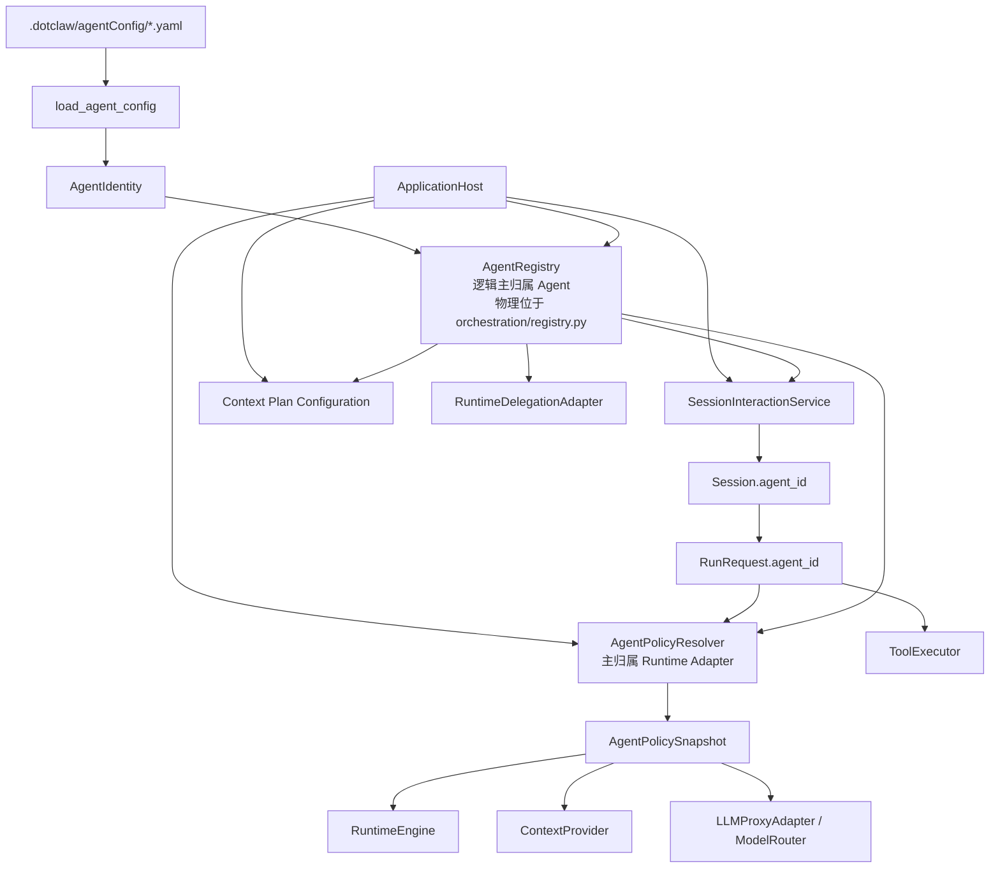

**结论：**

- 配置文件是声明来源，AgentRegistry 是进程内目录，Session.agent_id 是持久化路由键。
- 每次 Run 的策略由 Runtime Adapter 解析并冻结，运行中不直接读取 Identity 文件。
- Context、LLM 和 Tool 消费的是不同投影：Prompt/Tool Snapshot、model_id 和 agent_id。
- Delegation 使用同一个 AgentRegistry 查找目标，但创建独立 Session 和 Run。
- AgentIdentity 不反向持有 Runtime、Registry、Session 或 Provider。

### 2.2 从 Session 到 Run 的位置

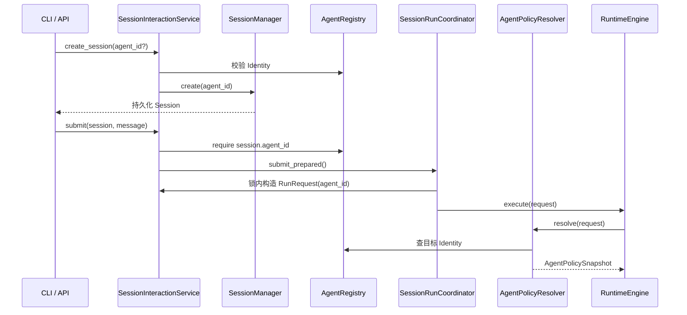

**结论：**

- 新建 Session 时先验证 Identity，再持久化绑定关系。
- 已有 Session 的 agent_id 是权威；未知或空值明确失败，不回退默认 Identity。
- RunRequest 只携带 agent_id，不携带可变 AgentIdentity 对象。
- Runtime 在创建 AgentRun 前冻结策略。
- Session.model 不参与该普通提交链。

### 2.3 声明、目录与快照的生命周期

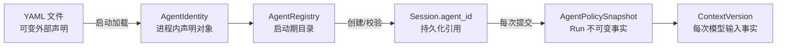

**结论：**

- YAML 修改不会自动改变已经加载的 AgentRegistry。
- 新 Run 使用 Registry 当前对象冻结新 Policy Snapshot。
- 已开始 Run、审批恢复、delegation 恢复和 Checkpoint 恢复复用已持久化 Policy Snapshot。
- ContextVersion 是某次模型输入事实，不等同于 Identity 版本。
- Tool policy_rules 当前存在独立的懒加载缓存，不完全遵循该单一路径。

### 2.4 依赖方向

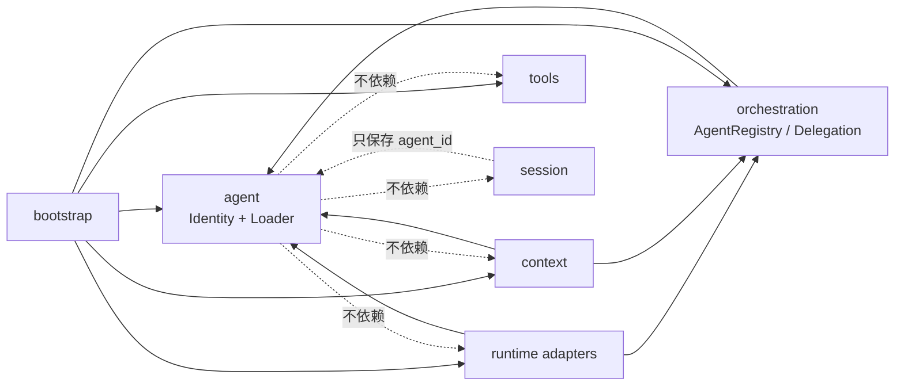

**结论：**

- `src/dotclaw/agent` 是底层声明模块，只依赖标准库、YAML 和通用环境变量展开。
- AgentRegistry 的逻辑文档主归属 Agent；当前物理实现仍位于 `orchestration/registry.py`，Orchestration 只消费其目录能力。
- AgentPolicyResolver 主归属 Runtime Adapter，负责依赖倒置后的冻结。
- Bootstrap 是具体实现汇聚点。
- 禁止 AgentIdentity 直接调用 LLM、ToolExecutor、ContextProvider 或 SessionManager。

---

## 3. 组件总览

Agent 与 Identity Wiki 负责完整说明 Identity 声明、加载和 AgentRegistry。Runtime、Context、Tool、Session 与 Orchestration 只作为消费边界展开。

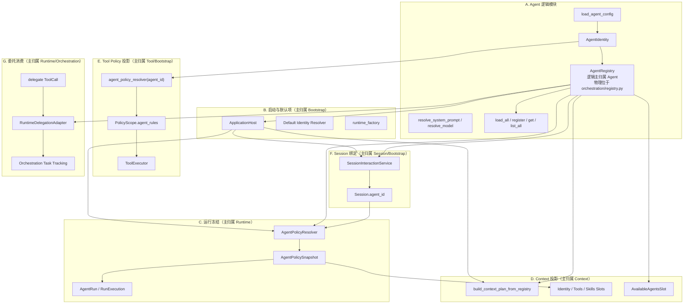

**结论：**

- Agent 逻辑模块完整包含 Identity、Loader、解析方法和 AgentRegistry。
- AgentRegistry 当前物理位于 `orchestration/registry.py`，但其权威 Wiki 主归属是 Agent；Orchestration 只使用目录查询能力。
- Runtime Policy、Context Slot、Tool Scope、Session 路由和 Delegation 都是外部投影。
- 委托章节只说明 Identity 查找和子 Run 策略隔离，Task/Broker 状态机留给 Orchestration Wiki。
- 当前最大一致性风险来自各消费路径没有全部使用同一个冻结快照。

### 3.1 组成部分与责任

| 分类 | 组成部分 | 逻辑主归属 | 稳定职责 |
|---|---|---|---|
| Agent 核心 | `AgentIdentity` | Agent | 声明身份、模型、Prompt、工具、Context 和能力标签 |
| Agent 核心 | `load_agent_config` | Agent | YAML 路径、环境变量展开和 DTO 构造 |
| Agent 目录 | `AgentRegistry` | Agent | 启动扫描、程序化注册和按 ID 查询 |
| 启动边界 | `ApplicationHost` | Bootstrap | 加载目录、检查非空、选择默认 Identity |
| 运行冻结 | `AgentPolicyResolver` | Runtime Adapter | 解析目标 Identity 并冻结 AgentPolicySnapshot |
| 运行事实 | `AgentPolicySnapshot` | Runtime Domain | 保存 Run 的不可变身份与策略 |
| Context 投影 | Plan + Agent Slots | Context | 启用 Slot，注入 Prompt、Tools 和 Agent 目录摘要 |
| Tool 投影 | Policy Resolver Closure | Bootstrap/Tool | 按 agent_id 读取 policy_rules 并构造独立 Scope |
| Session 绑定 | Session + Interaction Service | Session/Bootstrap | 持久化和校验 agent_id |
| 委托消费 | RuntimeDelegationAdapter | Runtime/Orchestration | 校验目标 Identity，创建目标子 Run |
| 配置示例 | `.dotclaw/agentConfig/*.yaml` | Agent 配置 | 提供声明文件；只有 Loader 读取的字段才生效 |

---

## 4. 各组件的类与职责

本节从 Agent Core 进入 Loader、Registry、Runtime Policy、Context、Tool、Session 和 Delegation。外部适配器会保留必要说明，但不改变其主归属。

### 4.1 `AgentIdentity`

#### 4.1.1 `AgentIdentity`

**职责与用途：**`AgentIdentity` 是一个 `frozen=True` 的声明式 dataclass，用来描述“这个逻辑 Agent 被允许以什么身份、模型、Prompt、工具和 Context 参与运行”。

它不持有：

```text
RuntimeEngine
LLMProxy
ToolExecutor
Session
Memory
Channel
当前 Run
```

因此：

```text
AgentIdentity
≠ 运行中的 Agent 实例
≠ AgentRun
≠ RunExecution
```

`frozen=True` 只禁止重新给字段赋值；`allowed_tools`、`policy_rules`、`tags` 等内部 list/dict 仍是可变对象。

#### 4.1.2 身份标识字段

**职责与用途：**`agent_id` 和 `agent_name` 提供稳定标识与展示名称。

```text
agent_id
→ Registry key
→ Session.agent_id
→ RunRequest.agent_id
→ AgentPolicySnapshot.agent_id
→ Context Owner key
→ Delegation source/target

agent_name
→ Prompt 占位符
→ CLI 展示
→ 可用 Agent 摘要
→ 委托 Session 标题
```

当前没有对 agent_id 的格式、空白、路径安全或全局唯一性进行 dataclass 级校验。

#### 4.1.3 `allowed_tools`

**职责与用途：**声明模型在本次 Run 中可见的 Tool Definition 白名单。

语义：

```text
[]
→ 所有当前已注册工具可见
→ 但排除旧 Task 协议工具

["a", "b"]
→ 只保留名称精确匹配的定义
```

它控制模型看见哪些 Schema，不直接决定某次 Tool Call 是否通过 Capability、Policy 或审批。

当前未知工具名会被静默忽略；没有启动期完整性校验。

#### 4.1.4 `policy_rules`

**职责与用途：**声明 Agent 级 Tool Policy 收窄规则：

```text
profile → allow | ask | deny
```

最终决策由 Tool PolicyEngine 取全局规则与 Agent 规则中更严格者。Identity 不能通过该字段放宽全局上限。

该字段当前不进入 AgentPolicySnapshot，而由 ToolExecutor 的独立解析器按 agent_id重新加载并缓存。

#### 4.1.5 Prompt 与模型字段

**职责与用途：**

```text
system_prompt_template
→ resolve_system_prompt()
→ 空时回退 config.agent.system_prompt

model
→ resolve_model(global default)
→ 作为 Runtime Policy.model_id
→ LLM Router forced_model
```

Prompt 模板仅支持：

```text
{agent_name}
{workspace}
```

使用 Python `str.format()`，未声明的占位符会在策略冻结时抛异常。

#### 4.1.6 `max_loop_steps` 与 `workspace`

**职责与用途：**

- `max_loop_steps` 被冻结到 `AgentPolicySnapshot.max_iterations` 和 `RunBudget.max_iterations`；
- `workspace` 只用于 Prompt 占位符替换。

当前边界：

- Runtime 尚未在主循环中消费 max_iterations 进行停止判断；
- workspace 不改变 Tool Policy 的 workspace_root；
- workspace 不改变进程 CWD；
- workspace 不被规范化为 project_root 下的绝对路径。

#### 4.1.7 元数据与 AgentCard 风格字段

**职责与用途：**

```text
description
tags
capabilities
input_modes
output_modes
```

当前实际使用：

- description：可用 Agent Context 摘要；
- capabilities：可用 Agent Context 摘要；
- tags：仅保存和测试，未进入路由；
- input_modes/output_modes：仅保存和测试，委托链不强制。

这些字段只是类似 A2A AgentCard 的本地声明，不表示当前存在 A2A Server、远程 AgentCard 或协议级模式协商。

#### 4.1.8 `context_slot_ids`

**职责与用途：**声明该 Agent Owner 显式启用的 Context Slot ID。

语义：

```text
None
→ 使用 Context 默认 AGENT 计划
→ identity / tools / skills

()
→ 显式启用零个 AGENT Slot

("identity", "tools")
→ 精确替换该 Agent 的默认 AGENT Slot 列表
```

它不是追加列表。未知 Slot 不在加载期校验，通常在 Context Plan 解析时失败。

#### 4.1.9 解析方法

**职责与用途：**`resolve_system_prompt()` 与 `resolve_model()` 将 Identity 局部配置与全局回退连接起来。

```text
resolve_system_prompt()
→ 只做模板替换
→ 不读取 Config

resolve_model(default_model)
→ identity.model or default_model
```

这两个方法不验证结果是否对应已配置模型、有效路径或安全 Prompt。

---

### 4.2 Identity 配置加载

#### 4.2.1 `load_agent_config`

**职责与用途：**将一个 YAML 文件转换为 AgentIdentity。

入口：

```python
load_agent_config(agent_id="default", path=None)
```

路径优先级：

```text
显式 path
→ 绝对路径直接使用
→ 相对路径基于模块推导的 project_root

未传 path
→ .dotclaw/agentConfig/{agent_id}.yaml
```

#### 4.2.2 项目根与环境变量

**职责与用途：**Loader 通过 `dotclaw.__file__` 推导项目根，并对 YAML 全树执行 `${ENV_VAR}` 展开。

它不接收 ApplicationHost 的 project_root 参数。因此：

- Host 通过绝对 path 加载 Registry 时路径一致；
- Tool policy resolver 通过 agent_id 加载时重新使用模块根；
- 自定义 Host project_root 不会自然贯穿所有 Identity 读取路径。

#### 4.2.3 文件缺失与 YAML 异常回退

**职责与用途：**当前以下情况不会抛出：

```text
文件不存在
文件打开失败
YAML 解析失败
```

而是返回：

```python
AgentIdentity(agent_id=传入的 agent_id)
```

当 AgentRegistry 使用 `load_agent_config(path=path)` 时没有传入文件名对应 agent_id，因此坏文件可能返回 `agent_id="default"` 并被注册。

#### 4.2.4 字段转换

**职责与用途：**Loader 将 YAML 字段转换为 dataclass 字段。

部分行为：

```text
agent_name/model/workspace/description
→ str(...)

allowed_tools/tags/capabilities/input_modes/output_modes
→ list(...)

max_loop_steps
→ int(...)

agent_id
→ raw.get(...)
```

当前没有完整 Schema。字符串误写为列表字段时，`list("abc")` 会变成字符列表；非数字 max_loop_steps 会抛异常；agent_id 不强制为字符串。

#### 4.2.5 `context_slot_ids` 与 `policy_rules` 解析

**职责与用途：**

`context_slot_ids`：

```text
必须是 list 且全部元素为 str
→ 转 tuple

否则
→ None
→ 静默回退默认 Context Plan
```

`policy_rules`：

```text
必须是 dict
只保留 key 为 str 且 value 为 allow/ask/deny 的项
无合法项
→ None
```

非法条目当前不记录具体 warning。

#### 4.2.6 YAML 字段实际消费边界

**职责与用途：**Loader 只读取 AgentIdentity 构造中明确列出的字段。

当前仓库的 `default.yaml` 还包含：

```text
model_params
registered_skills
agent_prompt
```

这些字段不会进入 AgentIdentity：

- `model_params` 不覆盖 LLM 请求参数；
- `registered_skills` 不过滤 Skill；
- `agent_prompt` 不作为 System Prompt；
- 有效字段名是 `system_prompt_template`。

因此配置示例中的字段存在不等于运行时生效。

---

### 4.3 `AgentRegistry`

#### 4.3.1 `AgentRegistry`

**职责与用途：**AgentRegistry 是进程级 Identity 目录，逻辑文档主归属 Agent。当前代码文件仍位于 `orchestration/registry.py`，这是物理位置，不改变其职责归属。

内部结构：

```text
dict[agent_id, AgentIdentity]
```

它不持久化、不持有 Agent 实例、不执行路由评分，也不管理远程服务发现。

#### 4.3.2 `load_all`

**职责与用途：**扫描指定目录下的 `*.yaml` 并注册 Loader 返回的 Identity。

行为：

```text
目录不存在
→ 保持空目录

单文件 Loader 返回对象
→ 按 identity.agent_id 覆盖写入

Loader 后续字段转换抛异常
→ warning 并跳过
```

glob 顺序没有业务保证；重复 ID 后加载者覆盖先加载者。

#### 4.3.3 `register`

**职责与用途：**程序化注入 Identity，主要用于测试或运行期扩展。

它同样直接覆盖已有 agent_id，没有：

```text
重复保护
版本号
变更事件
Context Plan 重建
Tool Policy 缓存失效
```

因此 Registry 动态变更并不保证各消费模块同步更新。

#### 4.3.4 `get` 与 `list_all`

**职责与用途：**

```text
get(agent_id)
→ Identity | None

list_all()
→ 当前字典值的新 list
```

list_all 返回新列表，但元素仍是原 Identity 对象。当前没有排序、可见性过滤或只读 Directory Protocol 对外封装。

---

### 4.4 Runtime 策略冻结

#### 4.4.1 `AgentPolicyResolver`

**职责与用途：**实现 Runtime `RunPolicyPort`，将 Identity、全局 Config、Tool Registry 和 RouterConfig 转换为一次 Run 的不可变 `AgentPolicySnapshot`。

构造时绑定：

```text
默认主 Identity
Config
ToolExecutor
project_root
AgentRegistry?
RouterConfig?
```

它不保存单次 Run 状态。

#### 4.4.2 目标 Identity 解析

**职责与用途：**`_resolve_identity(request.agent_id)` 支持：

```text
request.agent_id == 默认 Identity ID
→ 使用构造期对象

其他 ID
→ AgentRegistry.get

未装配 Registry 或找不到
→ ValueError
```

因此同一 RuntimeEngine 可以执行不同 Session 和 Delegation Target，而不是固定一个主 Agent。

#### 4.4.3 `resolve`

**职责与用途：**在 RuntimeEngine 创建 AgentRun 前冻结：

```text
agent_id
identity_version
model_id
max_iterations
system_prompt
tools
project_root
max_context_tokens
context_window
tokenizer_encoding
context_compaction_model
context_compaction_tokenizer_encoding
```

冻结结果同时保存到 AgentRun 和 RunExecution。

#### 4.4.4 工具定义冻结

**职责与用途：**`_allowed_definitions()` 从 ToolExecutor 获取当前 Registry 的深拷贝快照，再应用 Identity.allowed_tools。

无论白名单如何，以下旧 Task 工具都会排除：

```text
task_send_message
wait_task
task_status
cancel_task
```

真正的 `delegate` ToolCall 由 RuntimeEngine 特殊识别，不属于上述旧 Task 工具集合。

#### 4.4.5 模型与 Context 预算冻结

**职责与用途：**

```text
identity.resolve_model(config.llm.default_model)
→ model_id

RouterConfig.models[model_id]
→ context_window
→ tokenizer_encoding
```

找不到模型或无 RouterConfig 时：

```text
context_window → config.agent.max_context_tokens
tokenizer_encoding → ""
```

Runtime 在真正预算时要求 tokenizer_encoding 非空，因此该回退可能导致 Run 被确定性拒绝。

#### 4.4.6 `identity_version`

**职责与用途：**当前版本算法：

```text
sha256(repr(identity))[:16]
```

当前实际用于：

- 写入 AgentPolicySnapshot；
- 随 AgentRun 持久化，供审计识别本次声明版本。

它当前没有进入 ContextSlotManager 的 Cache Key，也不会自动触发 Context Plan、Tool Policy Cache 或 Registry 失效。

该版本不是配置文件 hash，也不是显式发布版本；字典插入顺序和内部可变集合变化可能影响结果。

#### 4.4.7 `AgentPolicySnapshot`

**职责与用途：**Runtime Domain 中的不可变运行事实。

字段：

```text
agent_id
identity_version
model_id
max_iterations
policy_data: JSONMap
```

它随 AgentRun 持久化。审批恢复、delegation 恢复和 Checkpoint 恢复复用保存的 Snapshot，不重新读取 Registry 或 YAML。

---

### 4.5 Context 投影

#### 4.5.1 `build_context_plan_from_registry`

**职责与用途：**在 Bootstrap 装配期将每个 Identity.context_slot_ids 转换为 AGENT Owner 的精确 Plan 覆盖。

只为显式非 None 的 Identity 建立覆盖；其他 Agent 使用默认计划。

Plan Configuration 在 ContextProvider 创建后保持固定，不自动跟随 Registry 动态变更。

#### 4.5.2 Agent Owner Slots

**职责与用途：**默认 AGENT Slot：

```text
identity
tools
skills
```

来源：

- identity Slot：冻结 policy_data.system_prompt；
- tools Slot：冻结 policy_data.tools；
- skills Slot：全局 SkillRegistry 描述。

`context_slot_ids` 控制是否启用这些 Slot，但当前不能为不同 Agent 选择不同 Skill 白名单。

#### 4.5.3 `AvailableAgentsSlot`

**职责与用途：**把 AgentRegistry 全部 Identity 格式化为全局 System Content：

```text
agent_id
agent_name
description
capabilities
```

用于让父模型了解可委托目标。

当前没有：

```text
可见性过滤
调用者权限过滤
租户过滤
目标健康状态
input/output mode 校验
```

#### 4.5.4 Context 快照边界

**职责与用途：**Agent Prompt 和 Tool Definitions 进入 ContextVersion 的 Snapshot Slot。

因此：

- 同一 Run 的审批恢复可重放已冻结内容；
- Registry 或 Tool Registry 后续变化不会改变旧 ContextVersion；
- AvailableAgentsSlot 当前为 GLOBAL/NONE Cache Scope，但内容仍来自 Registry；
- Identity 自身不保存 ContextVersion。

---

### 4.6 Tool Agent Policy 投影

#### 4.6.1 Tool Policy Resolver Closure

**职责与用途：**Bootstrap 构建 ToolExecutor 时创建一个按 agent_id 加载 `policy_rules` 的闭包。

行为：

```text
首次 agent_id
→ load_agent_config(agent_id=...)
→ 读取 policy_rules
→ 进程内缓存

后续调用
→ 直接返回缓存
```

该路径在 AgentRegistry 创建之前装配，不复用 Registry 对象。

#### 4.6.2 `ToolExecutor._effective_scope`

**职责与用途：**每次 Tool 执行根据 `execution_context.agent_id` 构造独立 PolicyScope。

Agent 规则只作为 `agent_rules` 注入，并与全局上限取更严格决策，避免主 Agent 规则污染 Delegation Target。

解析失败当前回退仅使用全局 Scope，不阻断执行。

#### 4.6.3 `ToolExecutorAdapter`

**职责与用途：**Runtime Adapter 将冻结 PolicySnapshot.agent_id 写入 ToolExecutionContext。

因此 Tool Policy 使用的是本 Run 的 Agent ID，但规则正文不是来自同一个 AgentPolicySnapshot。

#### 4.6.4 Tool 白名单与 Tool Policy 的区别

**职责与用途：**

```text
allowed_tools
→ 决定模型看到哪些 Tool Definition

policy_rules
→ 决定某次已产生 Tool Call 的 allow/ask/deny 上限
```

白名单不替代 Policy；Policy 也不自动把 Tool 从模型上下文隐藏。

---

### 4.7 Session 绑定

#### 4.7.1 `Session.agent_id`

**职责与用途：**Session 持久化一个必填 agent_id，作为该对话的长期 Identity 绑定。

反序列化缺失 agent_id 会失败；创建 Session 时空字符串会失败。

Session 不持久化完整 Identity Snapshot。

#### 4.7.2 `SessionInteractionService`

**职责与用途：**负责：

```text
创建 Session 时解析默认/显式 Identity
提交前校验 session.agent_id
锁内创建 RunRequest(agent_id)
```

已有 Session 的未知 Identity 不允许回退默认值，避免行为和权限静默变化。

#### 4.7.3 `Session.model`

**职责与用途：**Session 仍持久化 model 字段。

当前普通 Session 创建不传 identity.model，Delegation 创建目标 Session 时会传入 identity.model；但 Runtime 提交只读取 session.agent_id，再由 AgentPolicyResolver 解析 model。

因此 Session.model 当前是非权威冗余字段。

---

### 4.8 Delegation 对 Identity 的消费

#### 4.8.1 `delegate` ToolCall 识别

**职责与用途：**RuntimeEngine 对名称为 `delegate` 的 ToolCall 做特殊转换，要求参数：

```text
target_agent_id
title
objective
```

它不会进入普通 ToolExecutor Handler 路径，而是转成 `DelegationRequest`。

#### 4.8.2 `RuntimeDelegationAdapter`

**职责与用途：**校验 target_agent_id，创建目标 Session，并异步提交独立子 Run。

目标 Identity 来源是共享 AgentRegistry。子 Run使用：

```text
agent_id = target Identity
独立 session_id
独立 run_id
parent_run_id
root_run_id
空 ConversationSnapshot
文本 user message
```

#### 4.8.3 委托目标 Session 与策略

**职责与用途：**目标 Session 创建时写入：

```text
agent_id = identity.agent_id
model = identity.model
```

真正的子 Run 策略仍由 AgentPolicyResolver 根据 child Request.agent_id 冻结。Session.model 不作为权威。

#### 4.8.4 Orchestration 边界

**职责与用途：**Agent Wiki 到此只确认：

```text
AgentRegistry 提供目标 Identity
→ RuntimeDelegationAdapter 创建目标 Session 和子 Run
→ Orchestration 记录 Task 与消息状态
```

Task 状态机、Dispatcher、MessageBroker、结果等待与取消传播的完整机制主归属 Orchestration Wiki，本节不再展开。

#### 4.8.5 能力与模式边界

**职责与用途：**父模型通过 AvailableAgentsSlot 文本看到 capabilities，并自行决定 target_agent_id。

当前系统没有程序化执行：

```text
capability matching
input_modes 校验
output_modes 校验
source→target allowlist
delegation depth/cycle policy
目标并发容量判断
```

委托输入始终被包装为文本。

---

### 4.9 Bootstrap 与生命周期

#### 4.9.1 Identity 启动

**职责与用途：**ApplicationHost 在 LLM、Tool、Memory 和 MCP 之后创建 AgentRegistry 并加载：

```text
project_root/.dotclaw/agentConfig/*.yaml
```

Registry 为空时启动失败。

ToolExecutor 在 Registry 之前创建，因此 Tool policy_rules 使用独立 Loader，而不是共享 Registry。

#### 4.9.2 默认 Identity

**职责与用途：**Host 规则：

```text
存在 "default"
→ 使用 default

否则只有一个 Identity
→ 使用唯一项

否则
→ 启动失败
```

SessionInteractionService 内有一套相似的兜底逻辑，正常生产路径由 Host 显式传入 default_agent_id。

#### 4.9.3 Identity 生命周期

**职责与用途：**AgentRegistry 没有 close；ApplicationHost.shutdown 也不释放 Identity。

当前生命周期：

```text
Host initialize
→ load Registry

Host 存活
→ Registry 常驻

Host shutdown
→ 进程对象自然回收
```

AGENT Context Cache 在 Host shutdown 时通过 ContextPort.release_all 释放，不由 AgentIdentity 自身管理。

---

## 5. 组件依赖和使用流程

本节分别说明启动加载、默认 Identity、Session 路由、Run 策略冻结、Context 投影、Tool Policy、恢复、委托和配置变更。

### 5.1 启动加载

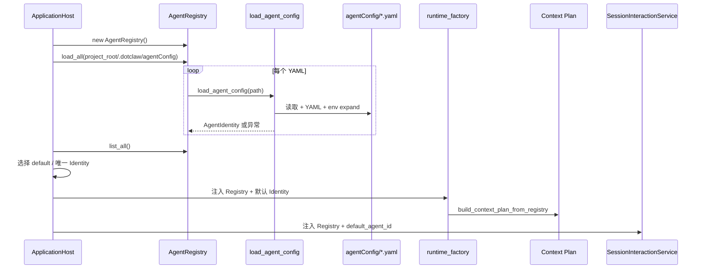

**结论：**

- Registry 加载是 Host 启动关键阶段；最终为空会终止启动。
- 单文件读取/YAML 错误可能回退为默认 Identity，而不是被视为失败。
- Context Plan 覆盖在 RuntimeFactory 装配时一次性构建。
- ToolExecutor 此前已经创建，其 policy_rules 不复用刚加载的 Registry。
- Host 就绪不表示每个 Identity 都通过严格 Schema 校验。

### 5.2 单文件加载

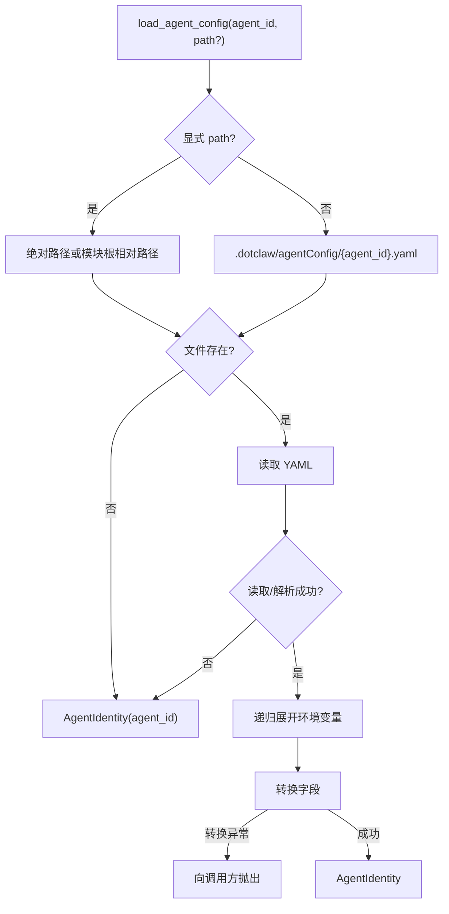

**结论：**

- 文件缺失、读取失败和 YAML 语法错误属于宽松回退。
- 字段类型转换错误属于异常路径。
- Registry 调用 path 时未传文件名对应 agent_id，宽松回退可能产生 `default`。
- Loader 没有返回错误报告，调用者无法区分真实默认配置与失败回退。
- 环境变量展开后的值直接参与 Identity 和 identity_version。

### 5.3 默认 Identity 选择

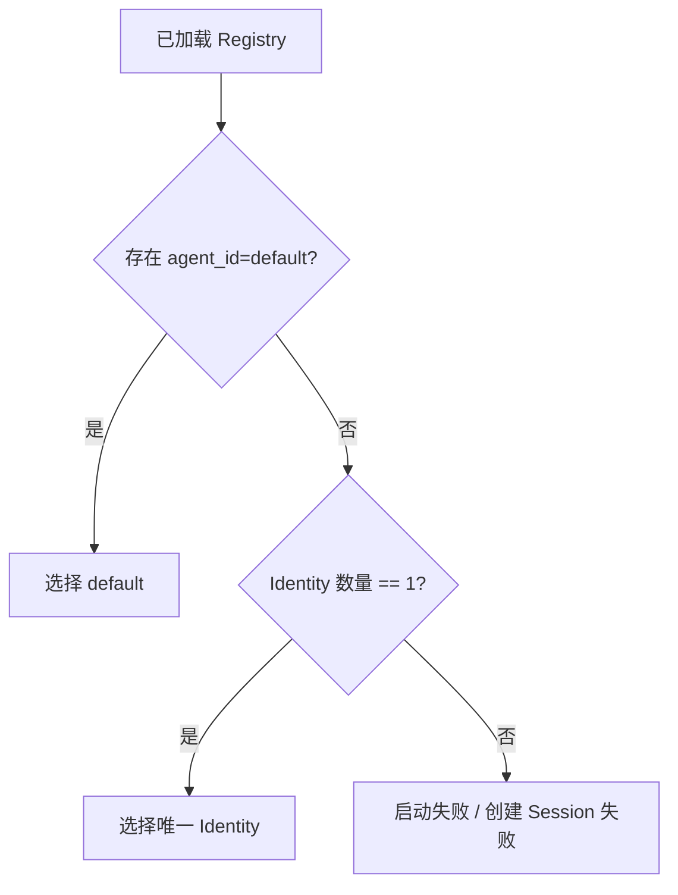

**结论：**

- 默认项由 ID 和数量决定，不根据 tags、capabilities 或优先级选择。
- 多个 Identity 时必须包含 `default`，否则 Host 拒绝启动。
- SessionInteractionService 也保留同类逻辑，存在重复实现。
- 默认 Identity 只用于新 Session 兜底和 Resolver 构造，不覆盖已有 Session.agent_id。

### 5.4 新建 Session

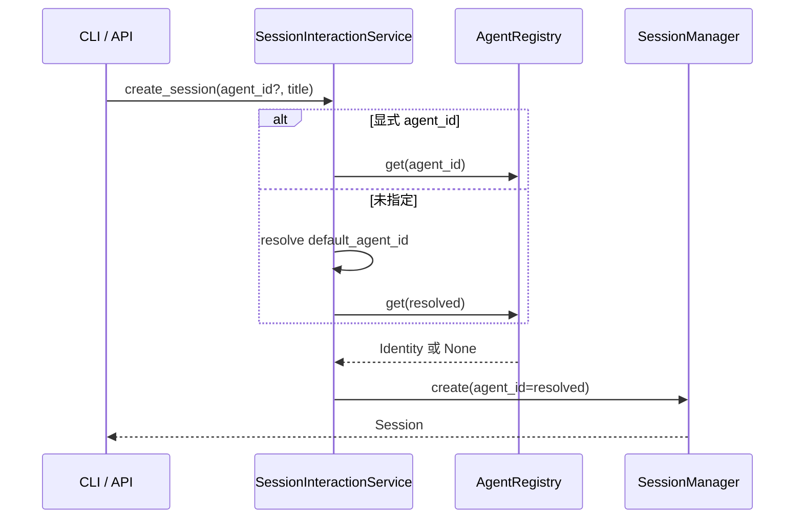

**结论：**

- Identity 必须在创建前已注册。
- Session 只保存 agent_id，不复制 Prompt、工具或 Policy。
- 普通创建不把 identity.model 写入 Session.model。
- Identity 文件后续变化不会改变 Session 绑定的 ID，但可能影响未来 Run 的策略来源。
- 删除或重命名 Identity 后，旧 Session 会明确失败。

### 5.5 普通提交与策略冻结

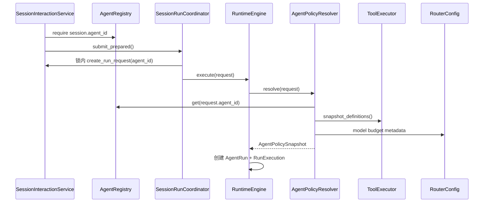

**结论：**

- 策略冻结发生在 AgentRun 创建前。
- Tool Definitions 是当时 Tool Registry 的深拷贝快照。
- Identity.model、Prompt 和 max_loop_steps 在这一安全点冻结。
- AgentPolicySnapshot 随 Run 持久化。
- Runtime 不在每次 LLM 轮次重新读取 Identity。

### 5.6 工具可见性冻结

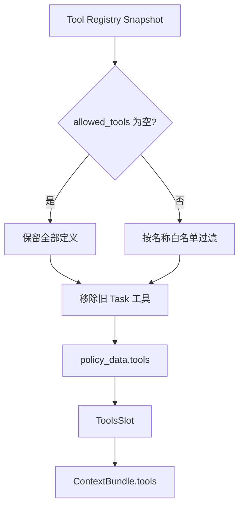

**结论：**

- allowed_tools 控制的是模型可见 Schema。
- 空列表是“全部允许”，不是“没有工具”。
- 未注册白名单项静默消失。
- Run 内 Tool Registry 后续变化不影响已冻结 Schema。
- Tool 执行时仍需经过 Capability、Policy 和审批。

### 5.7 Prompt、模型与 Context 预算

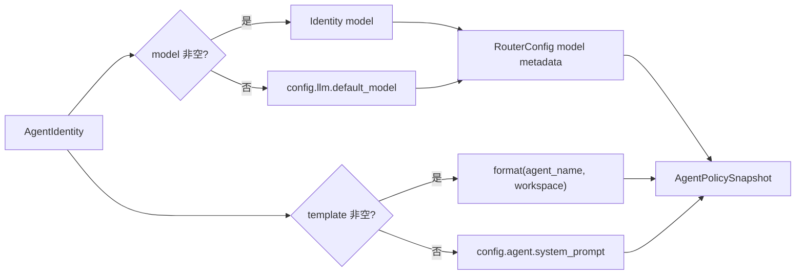

**结论：**

- Prompt 和模型的回退由 AgentPolicyResolver 完成。
- workspace 只参与 Prompt 文本。
- model 逻辑名还需由 LLM Router 解析。
- RouterConfig 缺少模型或 tokenizer 时，Run 可能在 Context Budget 阶段失败。
- Identity.model 不保证最终 Router 一定选中该模型，因为 LLM forced model 当前是优先语义。

### 5.8 Context Plan 与 Agent Slot

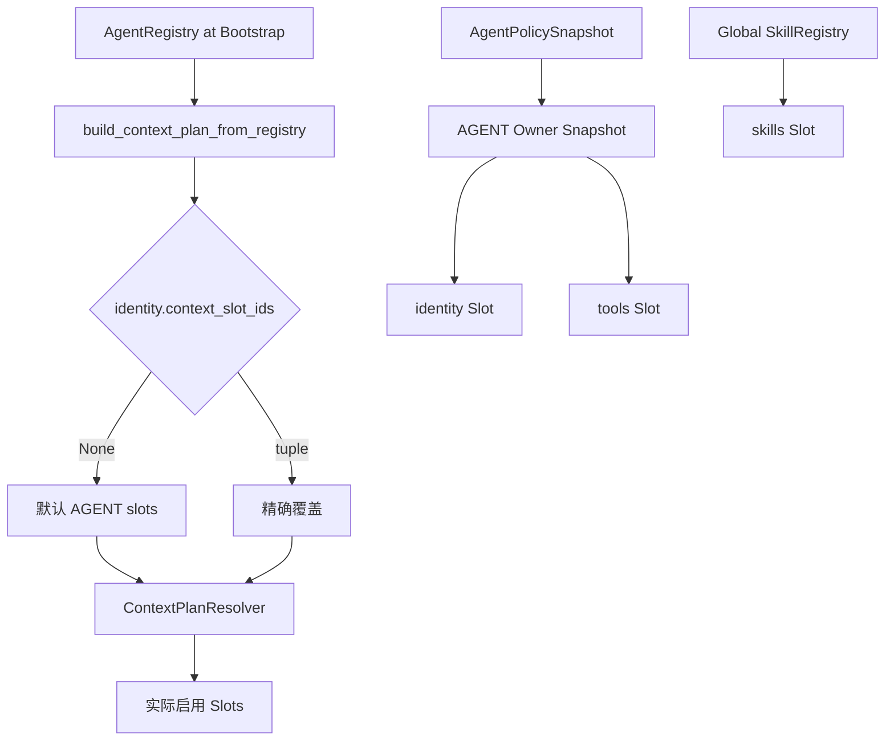

**结论：**

- context_slot_ids 在启动装配时转为 Plan Configuration。
- 它替换默认 AGENT 计划，不是追加。
- Identity/Tools 内容来自 Run 冻结策略，Skills 内容来自全局 SkillRegistry。
- 配置未知 Slot 通常延迟到第一次 Context 构建才失败。
- Registry 动态注册后不会自动重建已有 Plan Configuration。

### 5.9 可用 Agent 摘要

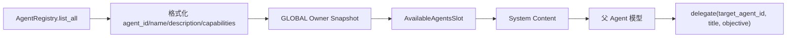

**结论：**

- capabilities 影响模型看到的文字，不进行程序化路由。
- 所有 Registry Identity 默认对所有 Agent 可见。
- 没有来源 Agent→目标 Agent 权限过滤。
- Agent 健康状态、并发和输入模式不会进入摘要。
- 最终 target_agent_id 由模型 ToolCall 明确给出。

### 5.10 Tool Policy

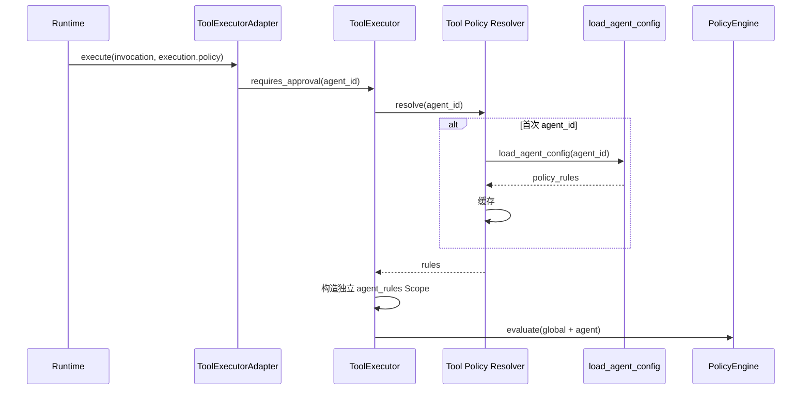

**结论：**

- Tool Policy 使用 Run 的冻结 agent_id。
- policy_rules 正文却来自独立 Loader 和进程缓存，而不是 AgentPolicySnapshot。
- Agent Rule 只能收窄全局上限。
- 解析失败当前回退全局规则，属于可用性优先。
- Identity 文件在启动后修改，Registry 与 Tool Policy 可能看到不同版本。

### 5.11 审批、delegation 与 Checkpoint 恢复


**结论：**

- 恢复路径不重新读取 YAML、Registry 或 RouterConfig。
- 原模型、Prompt、工具快照和预算元数据继续生效。
- 这是 Run 可审计性的核心边界。
- Tool Policy 执行时仍可能通过独立缓存获取规则，不完全属于 Snapshot。
- Identity 被删除也不直接破坏已持久化 Run 的 Policy，但入口查找和新 Run 会失败。

### 5.12 Delegation

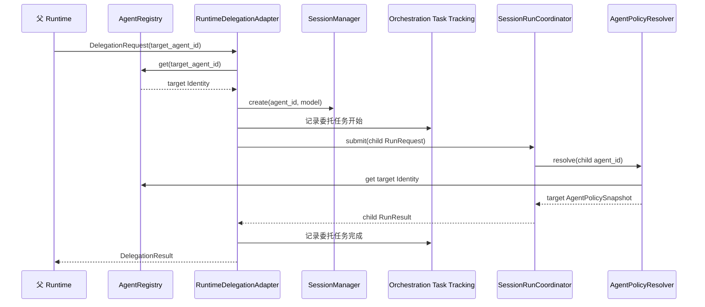

**结论：**

- 子 Agent 是独立 Run，不是父 Agent 对象中的嵌套实例。
- 子 Session agent_id 与 RunRequest.agent_id 一致。
- 子 Run 使用目标 Identity 的模型、Prompt、工具和 Context Plan。
- 父 Agent 规则不应污染目标 Tool Scope。
- 当前没有委托深度、环路和允许目标列表。

### 5.13 Identity 变更的影响范围

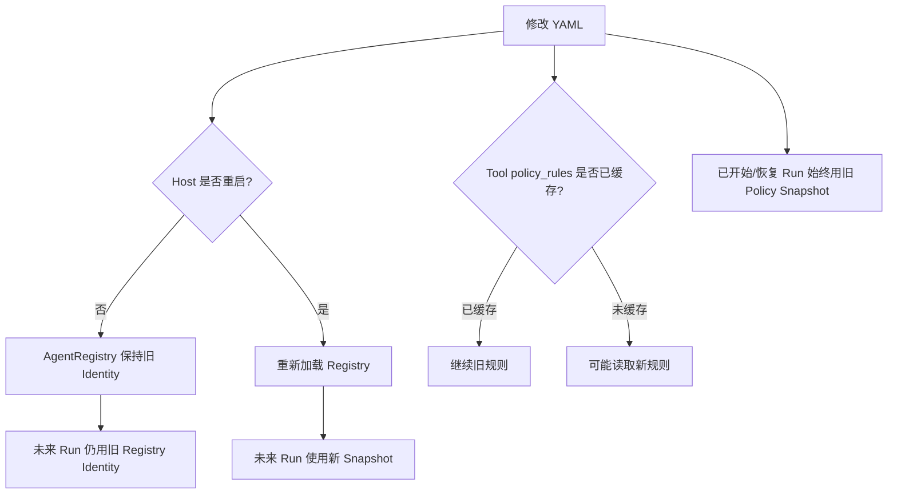

**结论：**

- 当前没有一致的 Identity 热重载事务。
- 同一文件变更后，Registry、Context Plan 和 Tool Policy 可能处于不同版本。
- 已开始 Run 保持原 Snapshot 是正确的审计边界。
- 未来 Run 是否使用新声明取决于 Registry 是否重载。
- Tool policy_rules 的首次访问时间会影响实际版本。

### 5.14 Session 删除与 Agent 生命周期

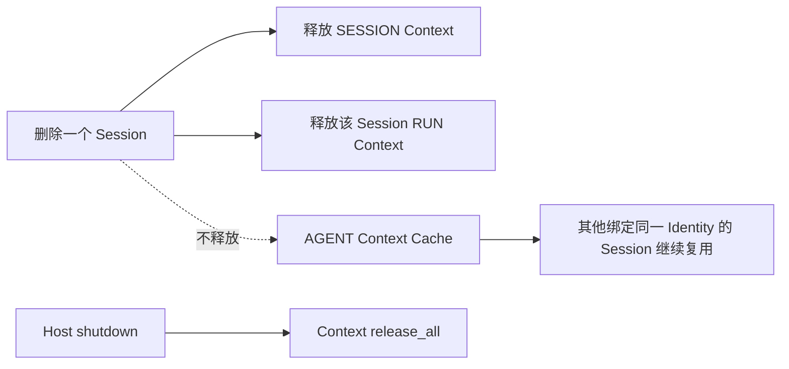

**结论：**

- Identity 生命周期长于单个 Session。
- 删除 Session 不删除 Registry Identity。
- AGENT Scope Cache 不能随单 Session 删除，否则影响其他 Session。
- 当前没有单个 Agent unload 生命周期。
- Host shutdown 通过 ContextPort 释放 Agent Cache，Identity 对象自然回收。

---

## 6. 对外接口与数据契约

### 6.1 Agent Core 公共 API

`dotclaw.agent` 当前公开：

```python
AgentIdentity
load_agent_config
```

AgentRegistry 不从该包导出，主归属 `dotclaw.orchestration.registry`。

### 6.2 AgentIdentity 字段契约

| 字段 | 类型 | 当前实际作用 | 空值/默认语义 |
|---|---|---|---|
| `agent_id` | str 注解 | 全局逻辑 ID、Session/Run 路由 | 无 dataclass 校验 |
| `agent_name` | str | 展示、Prompt、委托标题 | 默认空；Loader 默认 DotClaw |
| `allowed_tools` | list[str] | Run Tool Definition 白名单 | 空 = 全部 |
| `policy_rules` | dict/None | Tool Policy 收窄 | None = 仅全局 |
| `system_prompt_template` | str | Run System Prompt | 空 = 全局 Prompt |
| `model` | str | Run 模型逻辑名 | 空 = 全局默认模型 |
| `max_loop_steps` | int | Snapshot/RunBudget 最大迭代字段 | 默认 10；当前未执行限制 |
| `workspace` | str | Prompt 占位符 | Loader 默认 "." |
| `description` | str | Agent 目录摘要 | 空时用 agent_name |
| `tags` | list[str] | 元数据 | 当前无路由 |
| `capabilities` | list[str] | 可用 Agent 摘要 | 空显示“通用” |
| `input_modes` | list[str] | AgentCard 风格元数据 | 默认 text，未强制 |
| `output_modes` | list[str] | AgentCard 风格元数据 | 默认 text，未强制 |
| `context_slot_ids` | tuple/None | AGENT Context Plan 覆盖 | None = 默认计划 |

### 6.3 YAML 实际字段

Loader 当前识别：

```yaml
agent_id:
agent_name:
model:
workspace:
allowed_tools:
max_loop_steps:
system_prompt_template:
description:
tags:
capabilities:
input_modes:
output_modes:
context_slot_ids:
policy_rules:
```

支持 `${ENV_VAR}` 展开。

当前示例中但 Loader 不识别：

```yaml
model_params:
registered_skills:
agent_prompt:
```

### 6.4 示例配置契约

当前有效的最小配置：

```yaml
agent_id: coder
agent_name: 编程助手
model: qwen-plus
workspace: .
allowed_tools: []
max_loop_steps: 10
system_prompt_template: |
  你是 {agent_name}。
  工作目录提示为 {workspace}。
description: 负责代码分析与修改
tags: [coding]
capabilities: [code_generation, code_review]
input_modes: [text]
output_modes: [text]
context_slot_ids: [identity, tools, skills]
policy_rules:
  filesystem.write: ask
  process.execute: deny
```

该示例只表示 Loader 字段，不表示 profile 名一定已被 Tool 定义使用。

### 6.5 Loader 错误契约

| 情况 | 当前结果 |
|---|---|
| 文件不存在 | 返回默认 AgentIdentity |
| 打开文件失败 | 返回默认 AgentIdentity |
| YAML 解析失败 | 返回默认 AgentIdentity |
| 环境变量未展开为空 | 按展开结果继续 |
| `max_loop_steps` 无法 int | 抛异常 |
| list 字段为字符串 | 转成字符列表 |
| context_slot_ids 非字符串列表 | 静默变 None |
| policy_rules 非法项 | 静默过滤 |
| Prompt 未知占位符 | 策略冻结时抛异常 |

当前没有标准化 `IdentityLoadError` 或 `IdentityLoadReport`。

### 6.6 Registry 契约

```python
AgentRegistry.load_all(path) -> None
AgentRegistry.register(identity) -> None
AgentRegistry.get(agent_id) -> AgentIdentity | None
AgentRegistry.list_all() -> list[AgentIdentity]
```

调用者不能假设：

- load_all 严格验证每个文件；
- list_all 有稳定排序；
- 重复 ID 会报错；
- register 会触发 Context/Tool 更新；
- Registry 会持久化或热重载。

### 6.7 默认 Identity 契约

```text
default ID 存在
→ 使用 default

无 default 且只有一个 Identity
→ 使用唯一项

其他
→ 明确失败
```

该规则用于新 Session 兜底，不用于修复已有 Session。

### 6.8 Session 绑定契约

1. Session 创建必须提供有效非空 agent_id。
2. Session 反序列化缺失 agent_id 失败。
3. SessionInteractionService 必须在 Registry 中找到该 ID。
4. 已有 Session 未知 ID 不回退默认 Identity。
5. RunRequest.agent_id 从 Session 绑定派生。
6. Session 不保存完整 Identity。
7. Session.model 当前不作为策略权威。

### 6.9 AgentPolicySnapshot 契约

```text
AgentPolicySnapshot
├── agent_id
├── identity_version
├── model_id
├── max_iterations
└── policy_data
    ├── system_prompt
    ├── tools
    ├── project_root
    ├── max_context_tokens
    ├── context_window
    ├── tokenizer_encoding
    ├── context_compaction_model
    └── context_compaction_tokenizer_encoding
```

它是 Run 的持久化事实。恢复必须复用，不得重算覆盖。

### 6.10 工具白名单契约

```text
allowed_tools == []
→ 全部当前定义，排除旧 Task Tools

allowed_tools 非空
→ 精确名称交集，排除旧 Task Tools
```

白名单仅影响 `ContextBundle.tools`。执行端仍检查 Tool 是否存在和安全策略。

### 6.11 Agent Tool Policy 契约

```text
policy_rules
→ profile: allow/ask/deny
→ 只允许与全局决策取更严格值
```

当前规则正文由 ToolExecutor 的 Loader Cache 提供，而不是 PolicySnapshot。

### 6.12 Context Plan 契约

```text
context_slot_ids is None
→ 默认 AGENT 计划

context_slot_ids is tuple
→ 精确覆盖
```

默认 AGENT 计划：

```text
identity
tools
skills
```

Slot 必须存在且 Owner 必须为 AGENT，否则 Context Plan 解析失败。

### 6.13 Available Agents 契约

当前公开给模型的每个条目包含：

```text
agent_id
agent_name
description
capabilities
```

不包含：

```text
allowed_tools
policy_rules
model
workspace
Context Slot
健康状态
并发状态
访问控制
```

### 6.14 Delegation 契约

`delegate` 参数：

```text
target_agent_id: str
title: str
objective: str
```

目标必须存在于 Registry。子 Run：

- 使用目标 agent_id；
- 使用独立 Session/Run；
- Conversation 初始为空；
- 输入为 title/objective 拼接的文本；
- 通过同一 AgentPolicyResolver 冻结目标策略；
- 结果以 Tool 角色回到父 Run。

### 6.15 Identity 版本契约

当前：

```text
identity_version = sha256(repr(identity))[:16]
```

它表示进程内 Identity 对象表示的摘要，不是：

```text
配置文件内容 hash
语义规范化 hash
发布版本
Registry revision
Tool policy_rules 实际版本保证
```

### 6.16 关键不变量

1. `AgentIdentity` 只能是声明数据，不得持有 Runtime、Session、Provider 或当前 Run。
2. `AgentRegistry` 是新 Session、新 Run 和委托目标查询的进程内权威目录。
3. Session 必须持久化非空 `agent_id`；已有 Session 的绑定不得静默回退默认 Identity。
4. `RunRequest` 只携带 `agent_id`，不得携带可变 Identity 对象引用。
5. Runtime 必须在创建 AgentRun 前冻结 `AgentPolicySnapshot`。
6. 已开始 Run、审批恢复、delegation 恢复和 Checkpoint 恢复必须复用原 Policy Snapshot，不得按当前配置重算覆盖。
7. Identity 的 Prompt 和模型回退必须在策略冻结时完成。
8. `allowed_tools` 只控制模型可见 Tool Schema，不得替代 Tool Capability、Policy 和审批。
9. Agent 级 `policy_rules` 只能收窄全局 Tool Policy，不能放宽全局上限。
10. 每次 Run 的 Tool Definitions 必须使用不可变 Registry Snapshot。
11. `context_slot_ids` 的显式值是 AGENT Plan 精确覆盖，不是默认列表追加。
12. Agent Prompt 与实际 Tool Definitions 必须进入可恢复的 ContextVersion Snapshot。
13. Delegation Target 必须存在于 AgentRegistry。
14. 子 Run 必须冻结目标 Identity 的 Policy，不得继承父 Run 的 PolicySnapshot。
15. 子 Agent 的 Tool Scope 必须依据目标 `agent_id` 计算。
16. 删除单个 Session 不得删除共享 Identity，也不得释放仍被其他 Session 使用的 AGENT Scope。
17. Registry 或 YAML 变更只能影响未来新 Run，不得改写已经持久化的 PolicySnapshot。
18. AgentRegistry 的逻辑主归属保持在 Agent；Orchestration、Runtime、Context 和 Bootstrap 只能通过明确接口消费其目录能力。

---

## 7. 常见修改入口

| 修改目标 | 首要入口 | 可能涉及 | 必须保持的不变量 |
|---|---|---|---|
| 新增 Identity 字段 | `agent/identity.py::AgentIdentity` | Loader、Snapshot、Context、示例配置 | 明确字段的主消费者和冻结边界 |
| 修改 YAML 字段 | `load_agent_config` | `.dotclaw/agentConfig/*.yaml`、测试 | 示例与实际 Loader 一致 |
| 增加严格校验 | Agent Loader / 新 Schema | Registry、Bootstrap 错误处理 | 不得把坏文件伪装为 default |
| 修改配置路径 | `load_agent_config`、Host | Tool policy resolver、project_root | 所有读取使用同一根 |
| 修改 Prompt 占位符 | `resolve_system_prompt` | AgentPolicyResolver、文档 | 未知字段必须明确校验 |
| 修改模型回退 | `resolve_model` + AgentPolicyResolver | LLM Router、RouterConfig | Identity model 与实际模型语义一致 |
| 修改工具白名单 | `_allowed_definitions` | Tool Registry、Context ToolsSlot | 白名单只控制可见性 |
| 将空白名单改为拒绝 | AgentIdentity + PolicyResolver | 默认配置、迁移 | 必须显式兼容旧配置 |
| 修改 Tool Policy 字段 | `policy_rules` 解析 | ToolExecutor、PolicyEngine | Agent 只能收窄全局上限 |
| 统一 Tool Policy 来源 | `_build_tools` + AgentRegistry | Bootstrap 顺序、缓存 | Run 使用的规则必须可审计 |
| 修改循环上限 | `max_loop_steps` + RuntimeEngine | RunBudget、Checkpoint | 预算必须真实执行且可恢复 |
| 修改 workspace 语义 | AgentIdentity + Tool Policy | project_root、Capability Broker | Prompt 路径与安全根不得混淆 |
| 修改 Agent 元数据 | description/tags/capabilities | AvailableAgentsSlot、CLI | 展示字段不自动获得权限 |
| 实现能力路由 | AgentRegistry / 新 Directory Service | Delegation、Context | 选择结果必须稳定和可解释 |
| 实现 input/output modes | Delegation Adapter | Request DTO、Provider、Tool | 模式必须在提交前验证 |
| 修改 Context Slot 选择 | `context_slot_ids` | Context Plan Resolver、Defaults | 明确替换还是追加 |
| 提前验证 Context Slot | Host 启动检查 | Context Registry、Agent Loader | Slot ID 和 Owner 必须匹配 |
| 修改 Registry 加载 | `AgentRegistry.load_all` | LoadReport、Bootstrap | 重复和失败必须可观测 |
| 修改默认 Identity | Host + SessionInteractionService | Session create、CLI | 旧 Session 不得回退 |
| 添加 Registry 热重载 | AgentRegistry | Context Plan、Tool Cache、运行 Snapshot | 已开始 Run 保持旧版本 |
| 添加 Identity 卸载 | AgentRegistry + Host | Session、Context AGENT Scope | 有绑定 Session 时明确策略 |
| 修改 Identity 版本 | `_identity_version` | AgentPolicySnapshot、审计、未来缓存失效 | 使用规范化稳定内容，明确是否进入 Cache Key |
| 修改 Policy Snapshot | `AgentPolicyResolver.resolve` | Runtime Domain、Repository | 恢复路径必须兼容 |
| 将 policy_rules 纳入 Snapshot | Policy Resolver + Tool Adapter | ToolExecutor | 执行时不再读可变磁盘 |
| 修改 Session Identity | `SessionInteractionService` | Session migration、Runtime | 必须显式迁移和审计 |
| 清理 Session.model | Session DTO / Delegation | 兼容迁移 | 模型权威只保留一处 |
| 修改可用 Agent 摘要 | `_available_agents_text` | capabilities、可见性策略 | 不暴露敏感策略与路径 |
| 添加 Agent 可见性 | Agent Directory Port | Context、Delegation | source Agent 只能看到允许目标 |
| 修改 Delegate 参数 | `_delegation_request` | Tool Schema、Adapter、Task | Runtime 与模型 Schema 必须同步 |
| 添加委托深度限制 | RuntimeEngine / DelegationPort | root_run_id、parent_run_id | 防止循环和无限派生 |
| 添加委托允许列表 | Identity / Policy | Context 可见性、Adapter | 展示与执行必须同源 |
| 排查 Session 未知 Identity | Session.agent_id → Registry | Loader、重命名/删除 | 禁止静默切换默认 Agent |
| 排查模型未生效 | Identity.model → PolicySnapshot → Router | LLM purpose / forced model | 区分优先与强制 |
| 排查 Prompt 未生效 | YAML 字段名 → Loader → Snapshot | `agent_prompt` 漂移 | 只认实际字段 |
| 排查工具缺失 | allowed_tools → Registry snapshot → Context | disabled tools / MCP 时序 | 检查实际定义名 |
| 排查 Tool Policy 不一致 | Tool Loader Cache vs Registry | 启动顺序、文件修改 | 记录规则来源版本 |
| 排查 Context Slot 缺失 | context_slot_ids → Plan Config | Slot Registry、Owner | 未知项应启动期失败 |
| 排查子 Agent 行为错误 | target_agent_id → child PolicySnapshot | Session、Tool Scope | 不继承父 Agent 策略 |

---

## 8. 设计取舍、痛点和演进方向

本节分别说明当前架构承诺、核心选择、真实问题和候选演进，不将未来方案写成已实现能力。

### 8.1 当前架构承诺

当前 master 可以确认：

1. `AgentIdentity` 是声明式纯数据，不是运行中的 Agent。
2. Agent Core 只公开 Identity 和 Loader。
3. AgentRegistry 是进程级 Identity 目录，逻辑主归属 Agent；当前物理实现位于 Orchestration 目录。
4. Session 持久化 agent_id，并以此路由未来 Run。
5. 每次 Run 在创建前冻结 AgentPolicySnapshot。
6. 审批、delegation 与 Checkpoint 恢复复用原 Policy Snapshot。
7. Prompt、模型和 Tool Definitions 在 Run 边界冻结。
8. Context Slot 选择在 Bootstrap 阶段从 Registry 建立。
9. Tool Agent Policy 按当前 Run agent_id构造独立 Scope。
10. Delegation Target 使用同一 Registry，并执行独立子 Run。
11. capabilities/input_modes/output_modes 当前主要是元数据。
12. Agent 不参与 Host 资源关闭。

### 8.2 核心设计取舍

#### 8.2.1 声明式 Identity，而非运行时 Agent 门面

**问题与选择：**若每个 Agent 对象持有 Runtime、LLM、Tool 和 Session，多 Agent 会复制基础设施并模糊 Run 隔离。当前 Identity 只保存声明，共享 Runtime 根据 agent_id冻结策略。

**未选择：**每 Session 一个 Agent 实例、Agent 持有 Runtime、Agent 对象内部维护当前状态。

**收益：**基础设施共享；Run 状态归属明确；Session 与 Agent 声明解耦。

**代价与边界：**字段需要由多个 Adapter 投影，容易产生消费路径漂移。

#### 8.2.2 Session 持久化 ID，而不是完整 Identity

**问题与选择：**完整复制 Identity 到每个 Session 会造成配置重复和迁移困难。当前只保存 agent_id。

**未选择：**Session 内嵌 Prompt、工具和 Policy；CLI 保存当前 Agent 全局状态。

**收益：**Session 文件轻量；多个 Session 共享一个逻辑 Identity。

**代价与边界：**Identity 删除或重命名后旧 Session 无法继续；未来 Run 使用哪个版本依赖 Registry 生命周期。

#### 8.2.3 Run 开始时冻结 Policy Snapshot

**问题与选择：**运行过程中配置、工具和模型目录可能变化。当前在 Run 开始前解析一次并持久化。

**未选择：**每轮 LLM 动态读取 YAML、恢复时重算当前策略。

**收益：**审批恢复可审计；同一 Run 行为稳定；Context Version 可复原。

**代价与边界：**Tool policy_rules 当前仍在 Snapshot 外，冻结并不完整。

#### 8.2.4 工具可见性与工具安全分离

**问题与选择：**模型看见 Tool 与某次调用是否允许是两个问题。allowed_tools 只过滤 Schema，policy_rules 只收窄执行 Policy。

**未选择：**一个列表同时表达可见、允许、审批和资源范围。

**收益：**职责清楚；Tool 安全仍由 Capability/Policy 决定。

**代价与边界：**配置者需要理解两个层次；两条消费路径可能不一致。

#### 8.2.5 空工具白名单表示全部

**问题与选择：**为了默认 Agent 开箱可用，空 allowed_tools 解释为全部当前工具。

**未选择：**空列表表示零工具、必须显式列出每个工具。

**收益：**新增工具可自动对默认 Agent 可见；配置简单。

**代价与边界：**安全语义偏 fail-open；新增工具会扩大未显式白名单 Agent 的模型能力面。

#### 8.2.6 Agent 级 Policy 只能收窄

**问题与选择：**Agent 配置不能突破全局安全上限。最终规则取更严格者。

**未选择：**Agent 规则覆盖全局、每个 Agent 自带完整 PolicyEngine。

**收益：**全局安全边界稳定；委托目标不能自行提权。

**代价与边界：**Loader 失败回退全局可能比预期 Agent 规则更宽。

#### 8.2.7 Context Slot 使用精确覆盖

**问题与选择：**不同 Agent 可能需要完全不同的 Context 组成。context_slot_ids 显式值替换默认 AGENT 计划。

**未选择：**只能追加默认 Slot、所有 Agent 固定 Context。

**收益：**可关闭 identity/tools/skills 等默认内容。

**代价与边界：**字段名看不出是替换；空 tuple 会完全移除 AGENT Slot；缺少启动校验。

#### 8.2.8 Registry 中所有 Agent 平等

**问题与选择：**Identity 不保存 sub_agents 层级，Agent 关系在运行时通过 target_agent_id协商。

**未选择：**主 Agent 配置内嵌固定子 Agent 树。

**收益：**目录简单；任意 Agent 可作为主入口或委托目标。

**代价与边界：**没有天然可见性、允许列表、层级和循环限制。

#### 8.2.9 能力标签通过 Context 交给模型

**问题与选择：**当前用 capabilities 文本帮助父模型选择目标，而不是编写确定性 Router。

**未选择：**基于规则或向量的 Agent 匹配器。

**收益：**实现轻量；能力语义开放。

**代价与边界：**选择不可验证；模型可能忽略标签或选错目标。

#### 8.2.10 Delegation 创建独立 Session 和 Run

**问题与选择：**子 Agent 需要自己的 Identity、Policy 和运行事实。当前每次委托创建目标 Session 与子 Run。

**未选择：**父 Run 内直接切换 Identity、共享同一消息流执行子 Agent。

**收益：**父子策略隔离；可独立取消和审计。

**代价与边界：**每次委托产生新 Session；子历史不复用；缺少 Session 回收与长期目标会话复用策略。

#### 8.2.11 宽松 Loader 兼容旧配置

**问题与选择：**文件缺失或 YAML 错误时返回默认 Identity，避免早期配置问题阻断应用。

**未选择：**所有配置错误立即失败。

**收益：**旧项目更容易启动。

**代价与边界：**错误被伪装为合法 default，安全与可观测性较差。

#### 8.2.12 类似 AgentCard 的本地字段

**问题与选择：**保留 capabilities、input_modes、output_modes，为未来多 Agent 路由预留契约。

**未选择：**等远程 A2A 实现后再增加字段。

**收益：**配置可以提前表达能力。

**代价与边界：**字段名称容易让读者误以为远程 A2A 已实现。

### 8.3 已知痛点

#### A1. 默认 YAML 与 Loader 字段漂移

仓库默认配置包含：

```text
model_params
registered_skills
agent_prompt
```

Loader 不读取这些字段。尤其 active `agent_prompt` 不等于 `system_prompt_template`，实际运行会回退全局 Prompt。

#### A2. 文件和 YAML 错误被伪装为默认 Identity

读取/YAML 异常返回 `AgentIdentity(agent_id=传入值)`。Registry 通过 path 调用时传入值仍是默认 `"default"`，坏文件可能注册出一个合法外观的 default。

这会使：

- Host 非空检查通过；
- 默认 Identity 选择通过；
- 用户误以为文件已生效；
- Prompt/Tool/Policy 实际全部使用默认值。

#### A3. Loader 缺少严格类型 Schema

list 字段直接 `list(value)`，字符串会拆成字符；agent_id 不强制 str；max_loop_steps 直接 int 转换；字段范围和空白没有统一校验。

#### A4. `frozen=True` 不是深度不可变

AgentIdentity 的 list/dict 字段仍可原地修改：

```python
identity.allowed_tools.append(...)
identity.policy_rules["x"] = "deny"
```

这会绕过 dataclass frozen 语义，并可能使 identity_version、Registry 和已持有引用产生不一致。

#### A5. identity_version 使用 `repr(identity)`，且未参与缓存失效

当前版本：

- 不是 YAML 内容 hash；
- 不是规范化语义 hash；
- 受 dict/list 表示顺序影响；
- 只截取 16 个十六进制字符；
- 不包含 Tool policy_rules 实际缓存版本保证；
- 没有进入 Context Slot Cache Key 或 Plan/Tool Cache 失效协议。

#### A6. Registry 重复 ID 静默覆盖

`load_all()` 和 `register()` 都直接写字典。重复文件、坏文件回退 default 或程序化注册会覆盖已有对象，顺序依赖 glob/调用顺序。

#### A7. Registry 没有结构化加载报告

调用者只能看到日志和最终 list，无法得到：

```text
成功文件
回退文件
跳过文件
重复 ID
覆盖关系
未知字段
无效字段
```

#### A8. 默认 Identity 解析逻辑重复

ApplicationHost 与 SessionInteractionService 各有一套 default/唯一项逻辑。当前结果通常一致，但未来新增优先级或禁用状态时容易漂移。

#### A9. Registry 缺少版本、热重载和卸载

没有：

```text
revision
reload
unregister
load transaction
change event
cache invalidation
```

动态 register 也不会同步 Context Plan 和 Tool Policy Cache。

#### A10. Tool Policy 不复用 AgentRegistry

ToolExecutor 在 AgentRegistry 之前创建，并用独立 Loader 按 agent_id读取 policy_rules。

同一 Agent 的：

```text
Prompt/model/tools/context
→ Registry Identity

Tool policy_rules
→ 文件懒加载缓存
```

不是同一个冻结来源。

#### A11. Tool Policy 的版本由首次调用时间决定

文件在 Host 启动后、某 Agent 首次 Tool 调用前修改，Tool Policy 可能读到新值；Registry 仍保留启动时旧 Identity。首次调用后又长期缓存。

#### A12. Tool Policy Loader 不使用 Host project_root

按 agent_id调用 `load_agent_config()` 会重新根据包位置推导项目根。自定义 ApplicationHost project_root 时，Registry 和 Tool Policy 可能读取不同目录。

#### A13. Tool Policy 解析失败回退全局 Scope

异常或规则缺失不会阻断执行，而是仅应用全局 Policy。如果配置者预期 Agent 有更严格 deny，失败路径可能扩大权限。

#### A14. 空 allowed_tools 是 fail-open 语义

新增任意已注册 Tool 会自动对所有空白名单 Agent 可见。即使 Tool Policy 可拦截，模型能力面、Prompt Token 和误调用面都会扩大。

#### A15. allowed_tools 未知项静默忽略

拼写错误不会在启动时失败或 warning，只表现为工具缺失。MCP 命名空间变化也难以诊断。

#### A16. max_loop_steps 尚未真正限制循环

字段被写入 PolicySnapshot 和 RunBudget，但 Runtime 主循环没有根据 max_iterations 停止或递增独立预算。

因此配置注释“ReAct 最大迭代数”高估了当前行为。

#### A17. workspace 语义容易被误解

workspace 只替换 Prompt，占位值可能是相对路径；它不控制：

- Tool Policy workspace_root；
- 文件 Tool 实际根；
- process CWD；
- Session/Memory 路径。

#### A18. Prompt 模板缺少预校验

`str.format()` 会把未知花括号视为格式字段。代码示例、JSON 或未支持占位符可能导致 Run 策略冻结失败。

#### A19. Session.model 是冗余非权威字段

普通 Session 多为空，Delegation Session 写 identity.model，但 Runtime 始终通过 agent_id重算 Policy.model_id。

它可能与实际 Snapshot 不一致并误导调试。

#### A20. context_slot_ids 名称和语义不匹配

名称像“启用列表”，但实际是精确替换默认 AGENT Plan。空列表/空 tuple 会移除全部 AGENT Slot。

#### A21. Context Slot 缺少启动校验

Loader 不确认：

- Slot 是否注册；
- Slot Owner 是否为 AGENT；
- 是否重复；
- 是否破坏最低必要 Context。

错误通常延迟到首次 Run。

#### A22. Context Plan 在启动时固定，Registry 可程序化变化

后续 register 新 Identity：

- AgentPolicyResolver 可以找到；
- AvailableAgentsSlot 可以展示；
- 但该 Agent 没有启动时生成的 context_slot_ids 覆盖；
- Tool Policy 仍走磁盘。

目录动态能力不一致。

#### A23. AvailableAgentsSlot 无可见性和权限过滤

所有 Identity 都进入所有 Agent 的全局 Context。没有租户、来源 Agent、目标 allowlist 或敏感 Agent 隐藏。

#### A24. capabilities 只是文本标签

没有确定性能力匹配、置信度、版本、健康状态或 Tool 能力验证。描述错误会直接影响模型决策。

#### A25. input_modes/output_modes 未执行

Delegation Request 始终是文本，结果也按文本返回。字段不会拒绝不兼容调用，也不会影响 Provider/Tool。

#### A26. 没有委托允许列表、深度和环路限制

任意能看到 `delegate` 的 Agent 可以指定 Registry 中任意 target_agent_id。root_run_id/parent_run_id 被记录，但未用于深度预算或循环检测。

#### A27. AgentRegistry 虽主归属 Agent，但消费者仍直接依赖具体实现

Context Plan Builder、SessionInteractionService、AgentPolicyResolver 和 DelegationAdapter 直接依赖具体 AgentRegistry，尚未通过 Agent 模块定义的最小 Directory Protocol 隔离。

#### A28. AgentPolicySnapshot.policy_data 是弱类型 JSONMap

Prompt、Tools、窗口和 tokenizer 等关键字段用字符串键传递。字段拼写、类型和版本兼容只能在运行时检查。

#### A29. PolicySnapshot 不含完整 Agent 安全声明

Snapshot 包含 tools 白名单投影，但不含 policy_rules、workspace 安全根或 Delegate allowlist。运行审计无法仅凭 Snapshot 复原完整 Agent 权限。

#### A30. Agent Scope 缺少单独卸载生命周期

Context Manager 支持 AGENT Scope Cache，但 Host 只有 release_all；Registry 无 unregister 与 cache release 协调。

#### A31. AgentCard 命名可能高估 A2A 完成度

capabilities/input_modes/output_modes 的注释对标 A2A AgentCard，但项目没有远程协议、URL、认证、健康检查和远程发现。

#### A32. 配置未知字段没有诊断

Loader 对未消费字段不 warning，示例配置漂移可以长期存在。

#### A33. Registry list_all 无稳定排序

AvailableAgentsSlot 的条目顺序依赖注册/文件遍历顺序，可能导致模型上下文和 Context Version 在不同环境下变化。

#### A34. Identity 删除/重命名没有 Session 迁移

已有 Session 会变成未知 Identity，入口直接失败。当前没有重绑定命令、迁移报告或旧 ID alias。

#### A35. Delegation 每次创建新 Session

没有目标会话复用、自动回收或可见的临时 Session 标记。大量委托会积累 Session 目录。

### 8.4 演进方向

| 编号 | 解决的痛点 | 候选方向 | 影响与代价 |
|---|---|---|---|
| E1 | A1、A32 | 定义正式 Agent YAML Schema；删除未消费字段或实现对应能力；未知字段默认 warning/strict fail | Agent、Config、示例、测试 |
| E2 | A2、A3 | 区分 `load_strict()` 与显式 `load_or_default()`；Host/Registry 使用严格模式 | Agent Loader、Bootstrap；旧配置需迁移 |
| E3 | A3 | 使用 Pydantic/严格 dataclass parser，校验 ID、列表、整数范围和决策值 | Agent、Config |
| E4 | A4 | 将所有集合改为 tuple / MappingProxy / 不可变 DTO，保证深度不可变 | AgentIdentity、调用方测试 |
| E5 | A5 | 使用规范化 JSON 计算完整 identity content hash；保存 Schema Version 和文件来源；需要时把 revision 接入 Context/Tool Cache 失效 | Runtime Policy、Registry、Context、Tool、审计 |
| E6 | A6、A7、A33 | `AgentRegistry.load_all()` 返回 AgentLoadReport，排序文件、拒绝重复、记录来源与覆盖 | Orchestration、Bootstrap、CLI |
| E7 | A8 | 提取单一 DefaultIdentityResolver，Host 和 Session 创建共用 | Bootstrap、SessionInteraction |
| E8 | A9、A22、A30 | 引入版本化 AgentDirectory：事务 reload、unregister、change event、AGENT Cache release | Orchestration、Context、Tool |
| E9 | A10、A11、A12、A13 | Tool Policy 从 AgentPolicySnapshot 或同一 Registry revision 获取；删除独立磁盘 Loader Cache | Bootstrap、Runtime、Tool |
| E10 | A14 | 将空白名单语义改为显式模式：`tool_access: all|none|allowlist`，提供迁移 | Agent、PolicyResolver、配置 |
| E11 | A15 | Host 启动时验证 allowed_tools 对实际 Tool Registry；区分可选动态 MCP Tool | Agent、Tool、Bootstrap |
| E12 | A16 | Runtime 在每次 LLM/Tool 循环安全点递增并检查 max_iterations，Checkpoint 保存已用次数 | Runtime、AgentPolicySnapshot |
| E13 | A17 | 将 Prompt workspace 与 Tool security workspace 分开命名；统一解析绝对路径 | Agent、Tool、Bootstrap |
| E14 | A18 | Prompt Template 编译/校验，限定允许占位符并支持字面花括号诊断 | Agent Loader、PolicyResolver |
| E15 | A19 | 删除 Session.model 或明确改为创建时展示快照，并禁止参与执行 | Session、Delegation、迁移 |
| E16 | A20、A21 | 改名 `agent_context_plan`，显式支持 `replace`/`extend`；Host 启动期验证 Slot/Owner | Agent、Context、Bootstrap |
| E17 | A23、A24、A26 | 增加 AgentVisibilityPolicy 和 DelegationPolicy：allow_targets、max_depth、deny_cycles | Agent、Context、Runtime、Orchestration |
| E18 | A24、A25 | 定义结构化 AgentCapability/Mode，并在选择和提交前验证 | Agent Directory、Delegation |
| E19 | A27 | 由 Agent 模块定义最小 `AgentDirectoryPort`、`AgentPolicySource`、`AgentPlanDirectory`；Bootstrap 注入具体 Registry，消费者不再依赖物理实现 | Agent、Bootstrap、Runtime、Context、Orchestration |
| E20 | A28、A29 | 将 policy_data 拆为类型化 PromptPolicy、ToolVisibilityPolicy、ContextBudgetPolicy、ToolSecurityPolicy | Runtime Domain、Adapters、持久化迁移 |
| E21 | A31 | 在实现远程 A2A 前将字段注明为 local metadata；真正接入时增加 endpoint/auth/health/version | Agent、A2A、Config |
| E22 | A34 | 提供 Identity Rename/Alias 和 Session Rebind 迁移命令，必须显式确认权限变化 | Session、AgentRegistry、CLI |
| E23 | A35 | 为 Delegation Session 定义 temporary/owned_by_run，终态自动归档或按策略复用 | Orchestration、Session |
| E24 | 多项 | 建立端到端契约测试：坏 YAML、重复 ID、Snapshot 恢复、Tool Scope、Context Plan 和委托隔离 | tests/agent、runtime、context、tools、orchestration |

---

## 9. 源码索引

### 9.1 Agent Core

```text
src/dotclaw/agent/
├── __init__.py
└── identity.py
```

| 文件 | 主要内容 |
|---|---|
| `agent/__init__.py` | 导出 AgentIdentity 和 load_agent_config |
| `agent/identity.py` | Identity dataclass、Prompt/Model 解析、YAML Loader |

### 9.2 Identity 配置

```text
.dotclaw/agentConfig/
└── *.yaml
```

当前确认的示例：

```text
.dotclaw/agentConfig/default.yaml
```

该文件中的部分字段与 Loader 已发生漂移，实际生效字段以 `load_agent_config()` 为准。

### 9.3 AgentRegistry 物理实现与 Orchestration 参考

```text
src/dotclaw/orchestration/
├── registry.py
├── runtime_delegation_adapter.py
├── dispatcher.py
├── message_broker.py
└── task.py
```

| 文件 | 本 Wiki 中的定位 |
|---|---|
| `orchestration/registry.py` | AgentRegistry 当前物理实现；逻辑主归属 Agent |
| `orchestration/runtime_delegation_adapter.py` | 跨模块消费参考：目标 Identity 校验、目标 Session 和子 Run |
| `orchestration/dispatcher.py` | Orchestration Wiki 主归属：委托 Task 状态 |
| `orchestration/message_broker.py` | Orchestration Wiki 主归属：Task 消息与活动状态 |
| `orchestration/task.py` | Orchestration Wiki 主归属：Task、Endpoint 和 Specification 契约 |

本 Wiki 不完整展开 Dispatcher、MessageBroker 和 Task 状态机，只说明它们如何消费 AgentRegistry 与目标 Identity。

### 9.4 Runtime 策略与执行

```text
src/dotclaw/runtime/
├── adapters/
│   ├── agent_policy_resolver.py
│   └── tool_executor_adapter.py
├── application/
│   ├── engine.py
│   ├── execution.py
│   ├── request_factory.py
│   └── ports.py
└── domain/
    └── facts.py
```

| 文件 | Agent/Identity 视角 |
|---|---|
| `runtime/adapters/agent_policy_resolver.py` | Identity→AgentPolicySnapshot |
| `runtime/adapters/tool_executor_adapter.py` | 将 policy.agent_id 注入 ToolExecutionContext |
| `runtime/application/request_factory.py` | Session→冻结 RunRequest.agent_id |
| `runtime/application/engine.py` | 冻结 Policy、创建 AgentRun、识别 delegate |
| `runtime/application/execution.py` | RunBudget 和 Policy 只读视图 |
| `runtime/application/ports.py` | RunPolicyPort |
| `runtime/domain/facts.py` | AgentPolicySnapshot 和 AgentRun 事实 |

### 9.5 Context 接入

```text
src/dotclaw/context/
├── defaults.py
├── plan_resolver.py
├── provider.py
└── slots.py
```

| 文件 | Agent/Identity 视角 |
|---|---|
| `context/plan_resolver.py` | 从 Registry 构建 Agent Plan 覆盖 |
| `context/defaults.py` | 默认 AGENT Slot 和 Context Provider 组合根 |
| `context/provider.py` | 冻结 Prompt/Tools 与可用 Agent 摘要 |
| `context/slots.py` | IdentitySlot、ToolsSlot、AvailableAgentsSlot |

### 9.6 Tool Policy 接入

```text
src/dotclaw/
├── bootstrap/_host_components.py
└── tools/executor.py
```

| 文件 | Agent/Identity 视角 |
|---|---|
| `bootstrap/_host_components.py` | 创建独立 Agent policy_rules Loader Cache |
| `tools/executor.py` | 按 agent_id 构造 Agent 收窄 Scope |

### 9.7 Bootstrap 与 Session

```text
src/dotclaw/bootstrap/
├── application_host.py
├── runtime_factory.py
└── session_interaction.py

src/dotclaw/session/
└── session.py
```

| 文件 | Agent/Identity 视角 |
|---|---|
| `bootstrap/application_host.py` | 加载 Registry、选择默认 Identity |
| `bootstrap/runtime_factory.py` | 将 Registry 注入 Context、Policy 和 Delegation |
| `bootstrap/session_interaction.py` | 创建/校验 Session Identity |
| `session/session.py` | 持久化 agent_id 和非权威 model |

### 9.8 已确认测试

```text
tests/agent/test_identity.py
```

覆盖：

- 基础字段；
- frozen 赋值限制；
- Prompt 占位符；
- Model 回退；
- capabilities/input_modes/output_modes 默认值。

当前仍需要补充严格 Loader、Registry、Policy Snapshot、Tool Scope、Context Plan 和 Delegation 的端到端测试。
