# Bootstrap 与应用入口模块总体说明

> 适用代码：`aandbcct/dotClaw` 的 `master` 分支  
> 扫描基准：2026-07-28，包含 ApplicationHost 唯一组合根、Runtime/Context/Tool 装配、MCP 首次发现、SessionInteractionService、reasoning/response 运行级输出与 AgentRun 状态机分层重构（`master@31f30ae75d22f2b384e04a643894eaf9c0607323`）
> 文档定位：自顶向下解释 dotClaw 如何从配置和基础设施组装为可交互应用，说明启动、降级、恢复、Session 路由、CLI 接入和关闭边界，并记录当前设计取舍、真实痛点和演进方向。  
> 编写基准：《dotClaw Wiki 编写规范与验收准则 v1.1》  
> 上级导航：[dotClaw 开发者 Wiki](./README.md)

**快速导航**

| 需要回答的问题 | 阅读位置 |
|---|---|
| Bootstrap 为什么存在、与 Runtime/CLI 如何分工 | 第 1～2 节 |
| 启动和应用入口有哪些逻辑组件 | 第 3 节 |
| ApplicationHost、构建器、RuntimeServices、SessionInteractionService 分别做什么 | 第 4 节 |
| 冷启动、普通消息、审批、失败清理和关闭如何运行 | 第 5 节 |
| 公开 API、关键/可降级矩阵和生命周期契约 | 第 6 节 |
| 修改某个装配或入口从哪里开始 | 第 7 节 |
| 当前设计为何如此、存在哪些问题、如何演进 | 第 8 节 |
| 具体源码在哪里 | 第 9 节 |

```text
dotclaw 命令
→ main()
→ CLIChannel
→ ApplicationHost.build()
→ Config / Project Root
→ 基础设施构建与首次发现
→ AgentRegistry
→ build_runtime_services()
→ 启动成功提交补偿
→ SessionInteractionService
→ RuntimeEngine
```

---

## 1. 模块定位与边界

Bootstrap 与应用入口模块是 dotClaw 的**对象图组装、启动就绪和外部交互桥接层**。

其中：

- `ApplicationHost` 是唯一公开组合根和进程级资源宿主；
- `_host_components.py` 与 `runtime_factory.py` 是 Host 私有装配实现；
- `SessionInteractionService` 是按 Session 路由 Identity 的最小应用入口；
- `main.py` 与 Channel Adapter 负责 CLI 命令、用户交互和最终展示。

该模块解决的核心问题不是“如何执行一次 AgentRun”，而是：

> 如何从配置、Identity 和具体基础设施构造一致的 Runtime 对象图，定义启动、降级、应用入口、恢复和关闭边界。

### 1.1 核心职责

当前职责归纳为六组：

1. **启动输入**：确定项目根目录，加载 Config、`.env` 和模型路由配置。
2. **基础设施装配**：创建 LLM、Session、Skills、Tool、HTTP、Memory 和 MCP，并区分关键依赖与可降级依赖。
3. **Identity 启动**：扫描 Agent 配置，建立 AgentRegistry，并确定新 Session 使用的默认 Identity。
4. **Runtime 对象图**：创建 Context、Repository、Adapter、RuntimeEngine、Coordinator 和 Delegation。
5. **应用入口**：提供 Session 创建、普通提交、审批恢复、delegation 恢复、`resume_run()`、`abandon_run()`、`cancel()` 和完整删除用例。
6. **恢复与生命周期**：等待 MCP 首次发现，补偿未决成功提交，并在失败或退出时关闭当前明确管理的资源。

### 1.2 主要使用者

| 使用者 | 如何使用 Bootstrap 与入口 |
|---|---|
| `dotclaw.main` | 调用 `ApplicationHost.build()`，取得 Session 入口和诊断资源 |
| CLI / 未来 Channel | 通过 `SessionInteractionService` 提交消息和控制操作 |
| Runtime | 接收 Bootstrap 创建的所有 Port 与 Adapter |
| Context | 接收 Skills、Memory、AgentRegistry 和 Plan Configuration |
| Tool / MCP | 复用同一 Registry、PolicyEngine 和 CapabilityBroker |
| Session | 由 Host 创建 SessionManager，由应用入口协调创建和删除 |
| 测试或嵌入式入口 | 可显式注入 Config；自定义 project_root 当前尚未贯穿 SessionManager，不能视为完整隔离能力 |

### 1.3 明确不负责的内容

Bootstrap 与应用入口不负责：

1. **运行控制**：不执行 Runtime 状态机、ReAct 循环、Token 预算或 Tool 调用。
2. **具体能力实现**：不实现 LLM Provider、Tool Handler、Memory 检索、MCP 协议或 Journal。
3. **运行事实持久化**：不直接保存 AgentRun、RunMessage、ContextVersion 或 Checkpoint。
4. **用户交互语义**：Host 不保存当前 Session/Run，也不解析自然语言审批或直接渲染模型输出。
5. **通用容器能力**：不提供插件容器、自动依赖发现、统一 Close 协议或任意资源回收保证。
6. **动态与分布式能力**：不提供配置热重载、跨进程服务发现、分布式启动协调或完整健康保证。

### 1.4 与相邻模块的职责边界

| 相邻模块 | Bootstrap/入口负责 | 相邻模块负责 |
|---|---|---|
| Config | 调用加载入口并传递 Config | YAML、`.env`、校验、兼容迁移和 RouterConfig 解析 |
| LLM | 创建 Router、Limiter、Breaker 和 Proxy | Provider 调用、重试、reasoning 解析和流式响应 |
| Tool | 创建共享 Registry、Executor 和安全组件 | Discovery、Capability、Policy、审批和 Handler 执行 |
| MCP | 决定是否创建、等待首次发现并关闭 | Server 连接、状态和 MCP Tool 注册 |
| Memory / Skills | 创建并注入，失败时允许降级 | 存储、扫描、检索、蒸馏和领域逻辑 |
| Agent / Orchestration | 加载全部 Identity，确定默认项并注入 Registry | Identity 定义、目录查询、Dispatcher 和子 Run |
| Context | 注入来源并持有 ContextPort 生命周期 | Plan、Slot、物化、刷新和 Snapshot |
| Runtime | 创建所有 Port 实现并注入 Engine | Run 隔离、状态机、预算、恢复和提交 |
| Session | 创建 SessionManager 和应用入口 | Session 持久化与 Conversation |
| Channel / CLI | 解析命令、询问审批、展示增量和结果 | 输入输出传输与终端渲染 |
| Journal | 当前未由 Host 创建或注入执行主链 | 事件观测、Trace、Report 和 Snapshot |
| Scheduler | 当前未由 Host 创建或绑定 Channel | 一次性提醒任务和取消 |

## 2. 模块在项目中的位置

### 2.1 全局位置图

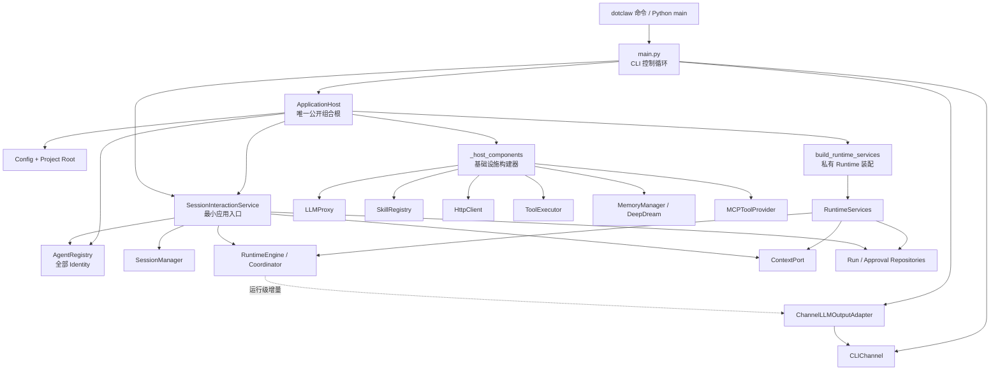

**结论：**

- `main.py` 是 CLI 入口，不是组合根；它只创建 Channel、调用 Host，并驱动用户交互。
- `ApplicationHost` 是唯一公开组合根，负责基础设施、Identity、Runtime 和应用入口的创建顺序。
- `_host_components` 负责单组件构造，`runtime_factory` 负责 Runtime 对象图，二者均为 Host 私有实现。
- `SessionInteractionService` 位于 CLI 与 Coordinator 之间，不直接依赖 LLM、Tool、MCP 或 Channel。
- Channel 输出和诊断展示不反向进入 Runtime 构造对象图。

### 2.2 公开入口与私有装配

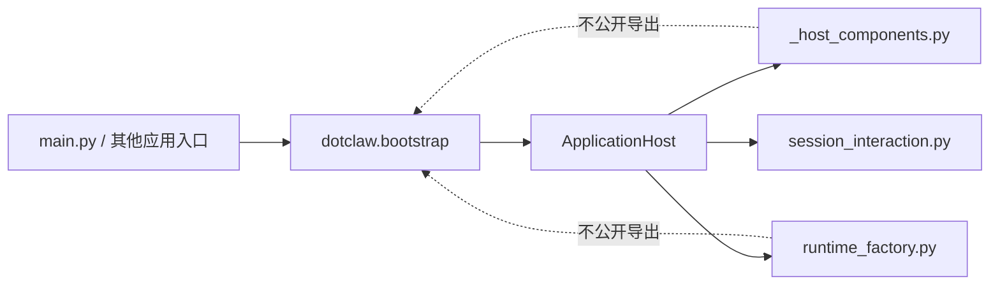

`dotclaw.bootstrap.__all__` 当前只导出：

```text
ApplicationHost
```

**结论：**

- 调用发起者是 `main.py` 或其他外部入口，公开组合根是 `ApplicationHost`。
- Host 内部通过 `_host_components` 和 `runtime_factory` 协调具体装配。
- 应用业务调用通过 `host.session_interaction` 进入，不直接取得 RuntimeEngine。
- Tool、MCP、Skills 等 Host 属性只用于诊断或专用命令，不是普通执行入口。
- 禁止外部调用私有 Factory 拼装半套系统，也禁止私有 Factory 反向成为公共稳定 API。

### 2.3 启动阶段位置

```text
配置与项目根
→ 关键基础设施
→ 可降级基础设施
→ MCP 首次发现
→ Identity 加载与默认选择
→ Runtime/Context/Repository 装配
→ 未决成功提交补偿
→ SessionInteractionService
→ Host 就绪
```

顺序中最关键的约束：

1. LLMProxy 和 SessionManager 必须先存在。
2. Skills 在 ToolExecutor 前创建，以便 SkillParser 注入。
3. HttpClient 在 ToolExecutor 前创建，以便网络工具共享。
4. ToolExecutor 在 MCP 前创建，因为 MCP 复用其安全组件和 Registry。
5. MCP 首次发现必须在 Runtime Policy 冻结工具定义前完成。
6. AgentRegistry 必须在 Context Plan、Agent Policy 和 Delegation 装配前完成。
7. 成功提交补偿必须在应用入口对外就绪前完成。

### 2.4 依赖方向

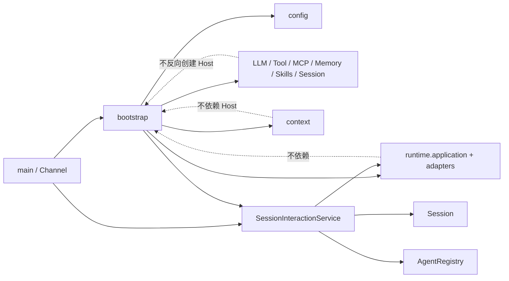

**结论：**

- `main.py` 是外部调用发起者，`ApplicationHost` 是具体实现依赖汇聚点。
- 依赖倒置发生在 Runtime/Context 的 Port 边界；Bootstrap 负责把具体实现注入这些 Port。
- `SessionInteractionService` 是应用用例协调者，但不创建基础设施。
- 组合根允许依赖具体模块，这是其职责，不是 Domain/Application 反向依赖。
- 禁止 Runtime、Context 或具体能力模块反向导入 Bootstrap；也禁止 `main.py` 越过应用入口直接调用 Engine。

## 3. 组件总览

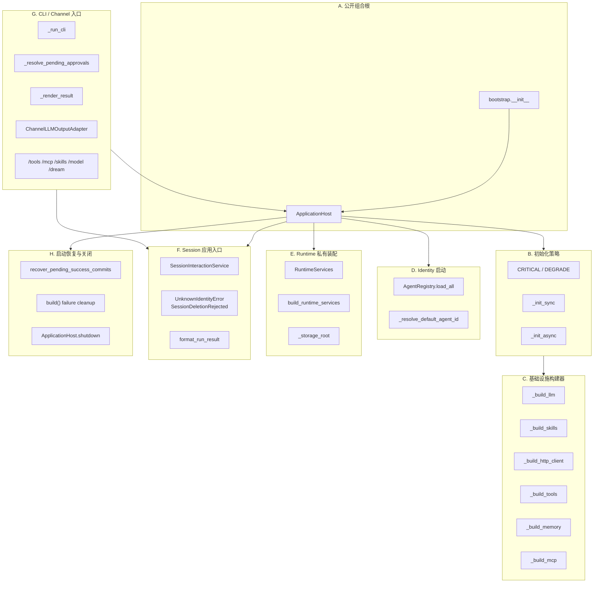

**结论：**

- Host 决定顺序和生命周期，构建器只创建单项能力。
- 初始化辅助只决定“抛出还是返回 None”，不决定后续功能如何降级。
- RuntimeFactory 是 Host 内部的第二层组合点，专门收敛 Runtime Ports 与 Adapters。
- SessionInteractionService 是应用用例入口，不是对象工厂或 Runtime 门面。
- CLI 负责命令和展示；Runtime 输出通过运行级 Adapter 接到当前 Channel。
- 启动恢复当前特指未决成功提交补偿，不代表启动时全量恢复所有 Session/Run。

### 3.1 组成部分与责任

| 层级 | 组成部分 | 稳定职责 | 主要入口 |
|---|---|---|---|
| 公开组合根 | Host | 创建、持有、暴露和关闭应用资源 | `ApplicationHost.build()` |
| 初始化策略 | 同步/异步辅助 | 统一关键/降级异常处理 | `_init_sync`、`_init_async` |
| 基础设施 | 构建器 | 从 Config 创建具体组件 | `_build_*` |
| Identity | Registry + 默认选择 | 加载全部 Identity 并确定默认项 | `AgentRegistry.load_all` |
| Runtime 装配 | RuntimeServices | 创建 Context、Repos、Adapters、Engine、Coordinator | `build_runtime_services` |
| 应用入口 | Session 服务 | Session→Identity 路由和控制用例 | `SessionInteractionService` |
| CLI 入口 | main 与命令 | 用户输入、审批和结果渲染 | `_run_cli` |
| 输出适配 | Channel Adapter | reasoning/response 分区输出 | `ChannelLLMOutputAdapter` |
| 可靠性 | 恢复与关闭 | 补偿成功提交，回收已知资源 | Host build/shutdown |

---

## 4. 各组件的类与职责

本节从组合根进入初始化策略、具体构建器、Runtime 装配、应用入口和 CLI 接入。每个重要类或部分先说明职责、存在原因和调用链位置。

### 4.1 公开组合根

#### 4.1.1 `ApplicationHost`

**职责与用途：**`ApplicationHost` 是 dotClaw 唯一公开的应用组合根和进程级资源宿主。它解决“各入口不能自行创建不同版本的 LLM、Tool Registry、Runtime 和 SessionManager”的问题，位于 Config/具体模块与 CLI/未来 API 入口之间。

Host 持有：

```text
Config
project_root
LLMProxy
SessionManager
AgentRegistry
ToolExecutor
MCPToolProvider
SkillRegistry
Memory DeepDream
ContextPort
RuntimeServices
SessionInteractionService
HttpClient
```

其中部分字段可以为 `None`，表示对应能力未启用或初始化失败后已降级。

Host 不持有：

```text
current_session
current_run
current_agent_execution
LLM stream state
approval decision
CLI command state
```

这些状态分别归入口循环、Runtime 或运行级 Adapter。

#### 4.1.2 `ApplicationHost.__init__`

**职责与用途：**构造函数只绑定已经解析的 Config、project_root 和可选 Channel，并将运行资源初始化为 None。它不执行 I/O 或异步连接，便于测试显式注入配置。

```python
ApplicationHost(config, project_root, channel=None)
```

当前 `channel` 被保存为 `_channel`，但后续初始化、输出和关闭路径均未读取它。模型输出已经改为每次 Run 传入 `ChannelLLMOutputAdapter`，因此该字段属于当前未使用接口。

#### 4.1.3 `ApplicationHost.build`

**职责与用途：**`build()` 是推荐的公开异步构建入口。它读取全局 Config 和项目根，创建 Host，调用 `initialize()`，并在中途失败时尝试 `shutdown()` 回收已经创建的已知资源。

流程：

```text
get_config()
→ _find_project_root()
→ ApplicationHost(config, root)
→ await initialize()
→ 返回就绪 Host
```

失败流程：

```text
initialize 抛出
→ await shutdown()
→ 原异常继续向上抛出
```

`build()` 不将启动失败转换为 `RunResult`；启动阶段没有 Runtime 可用于承载该错误。

#### 4.1.4 `ApplicationHost.initialize`

**职责与用途：**`initialize()` 是实际装配流程。它按依赖顺序创建基础设施、加载 Identity、构造 Runtime、执行启动补偿并创建 Session 应用入口。

当前顺序：

```text
1. LLMProxy
2. SessionManager
3. SkillRegistry（可降级）
4. HttpClient（可降级）
5. ToolExecutor（关键）
6. MemoryManager + DeepDream（可降级）
7. MCPToolProvider 首次发现（可降级）
8. AgentRegistry.load_all
9. 默认 Identity
10. RuntimeServices
11. recover_pending_success_commits
12. SessionInteractionService
```

初始化完成的标志不是单独状态枚举，而是 `_session_interaction` 已赋值并记录 Host 就绪日志。

#### 4.1.5 `_resolve_default_agent_id`

**职责与用途：**Host 的默认 Identity 选择用于两个场景：

- Runtime Policy Resolver 的默认主 Identity；
- 新建 Session 未显式指定 agent_id 时的默认值。

规则：

```text
存在 agent_id == "default"
→ 选择 default

否则 Registry 只有一个 Identity
→ 选择唯一 Identity

否则
→ 启动失败，要求显式提供 default
```

它返回 `AgentIdentity` 对象，而不是字符串。

#### 4.1.6 Host 属性

**职责与用途：**属性将已经完成装配的应用入口和诊断资源暴露给 `main.py`，避免 CLI 直接访问私有字段。

关键属性：

| 属性 | 用途 | 未初始化行为 |
|---|---|---|
| `config` | CLI 日志级别、模型展示 | 始终返回构造时 Config |
| `session_interaction` | 普通消息和控制用例 | 抛 RuntimeError |
| `session_manager` | CLI 列表/切换 Session | 抛 RuntimeError |
| `agent_registry` | Banner/外部查询 | 抛 RuntimeError |
| `tool_executor` | `/tools` 诊断 | 返回 None 或实例 |
| `mcp_provider` | `/mcp` 诊断 | 返回 None 或实例 |
| `skill_registry` | `/skills` 诊断 | 返回 None 或实例 |
| `memory_dream` | `/dream` 命令 | 返回 None 或实例 |

Tool、MCP、Skills 和 Dream 属性只是诊断或专用命令入口，不用于绕过 Runtime 执行业务 Tool。

#### 4.1.7 `ApplicationHost.shutdown`

**职责与用途：**`shutdown()` 在正常退出和初始化失败时回收 Host 明确管理的可关闭资源。它逐项捕获关闭异常，避免一个资源关闭失败阻止后续资源清理。

当前顺序：

```text
MCP Provider shutdown
→ ContextPort.release_all
→ HttpClient.close
```

完成后对应字段被设置为 None。

当前没有通用生命周期注册表。LLMProxy、SessionManager、SkillRegistry、MemoryManager/Storage、RuntimeServices 和 SessionInteractionService 没有在该方法中统一关闭或置空。

---

### 4.2 初始化失败策略

#### 4.2.1 `CRITICAL` 与 `DEGRADE`

**职责与用途：**两个字符串常量表示单组件初始化失败时的处理方式。

```text
CRITICAL
→ 原异常继续抛出，Host 构建失败

DEGRADE
→ 记录 warning，返回 None，继续启动
```

它们不是枚举，也没有编译期约束。传入除 `"critical"` 外的其他值都会按降级处理。

#### 4.2.2 `_init_sync`

**职责与用途：**`_init_sync()` 为同步构建器提供统一异常处理。它只包装一次函数调用，不重试、不回滚函数内部已经产生的副作用。

```python
_init_sync(name, fn, on_fail=DEGRADE)
```

当前使用：

```text
SkillRegistry → DEGRADE
ToolExecutor  → CRITICAL
```

LLMProxy、SessionManager 和 AgentRegistry 没有通过该辅助构建，异常直接传播。

#### 4.2.3 `_init_async`

**职责与用途：**`_init_async()` 为异步初始化提供与 `_init_sync()` 相同的失败策略。

当前使用：

```text
MemoryManager + DeepDream → DEGRADE
MCPToolProvider           → DEGRADE
```

它接收已经创建的 Awaitable，而不是 coroutine factory。因此调用前发生的同步异常不在其 try/except 内；当前 `_build_memory()` 和 `_build_mcp()` 返回内部 coroutine，构建主体仍在 await 时执行。

#### 4.2.4 关键与可降级矩阵

**职责与用途：**该矩阵表示当前真实启动行为，不等于模块在业务上的重要程度。

| 组件/阶段 | 当前策略 | 失败结果 |
|---|---|---|
| Config / project root | 关键 | Host 无法创建 |
| LLMProxy | 关键 | 启动失败 |
| SessionManager | 关键 | 启动失败 |
| SkillRegistry | 可降级 | Skills Context 和 SkillParser 不可用 |
| HttpClient | 可降级 | 受控网络工具缺少共享客户端 |
| ToolExecutor | 关键 | 启动失败 |
| MemoryManager / DeepDream | 可降级 | Memory Context 和 `/dream` 不可用 |
| 单个 MCP Server | 可降级 | 记录 failed server，其余继续 |
| MCP Provider 整体 | 可降级 | MCP 不可用 |
| 单个 Identity 文件异常 | 混合 | 部分读取/YAML 错误回退默认 Identity；部分字段转换错误被跳过并 warning |
| 零个已注册 Identity | 关键 | 启动失败 |
| 默认 Identity 歧义 | 关键 | 启动失败 |
| Runtime 装配 | 关键 | 启动失败 |
| 未决成功提交补偿 | 关键 | 启动失败 |
| SessionInteractionService 创建 | 关键 | 启动失败 |

---

### 4.3 基础设施构建器

#### 4.3.1 `_build_llm`

**职责与用途：**`_build_llm()` 创建共享 `LLMProxy` 及其模型路由、限流器和熔断器。它位于 Host 初始化首段，是 Runtime、Memory 和历史压缩共同依赖的关键组件。

配置选择：

```text
model_router_config.yaml 存在
→ load_router_config()

否则
→ _build_router_config_from_legacy(config.llm)
```

随后为每个 Provider 创建：

```text
RateLimitConfig
BreakerConfig
```

并装配：

```text
ModelRouter
→ LLMProxy
```

当前 `load_router_config()` 没有把 YAML 中的 `circuit_breaker` 字段写入 `ProviderConfig`，因此 `_build_llm()` 虽然会创建 BreakerConfig，但通常读取到默认空配置并使用默认阈值。Router 文件中的自定义熔断参数尚未贯通。

该函数只构造对象，不执行真实模型请求或健康检查。因此“构建成功”不表示 API Key、网络和模型在首个 Run 时一定可用。

#### 4.3.2 `_build_skills`

**职责与用途：**`_build_skills()` 根据配置扫描一个或多个 Skill 目录，创建 `SkillRegistry` 并注册发现的元数据。

语义：

```text
config.skills.enabled == False
→ 返回 None，不视为失败

enabled == True
→ 解析相对/绝对目录
→ SkillScanner.scan()
→ 注册全部 SkillMeta
```

异常由外层 `_init_sync(..., DEGRADE)` 处理。

#### 4.3.3 `_build_http_client`

**职责与用途：**`_build_http_client()` 创建共享受控 `HttpxHttpClient`，供内置网络 Provider 经 ToolExecutor 上下文使用，并由 Host 在关闭时统一回收连接池。

构造异常在函数内部直接捕获并降级为 None，没有使用 `_init_sync()`。

当前无论 Tavily/Open-Meteo 是否启用，Host 都会尝试创建该客户端。

#### 4.3.4 `_build_tools`

**职责与用途：**`_build_tools()` 创建 Tool 模块的共享核心对象图，是 Host 中最复杂的单组件构建器。ToolExecutor 是 Runtime 必要依赖，因此外层按 CRITICAL 处理。

装配内容：

```text
ToolRegistry
ToolDiscovery
PolicyScope / PolicyEngine
CapabilityBroker
ApprovalManager
SkillParser
ToolExecutor
```

主要顺序：

```text
发现 Builtin
→ 应用 disabled_tools
→ 构建全局 PolicyScope
→ 投影启用网络服务
→ 推导 network.http 规则
→ 创建 PolicyEngine/Broker/Approval
→ 创建 Agent Policy Resolver
→ 注入 SkillParser 和 HttpClient
→ 返回 ToolExecutor
```

Agent Policy resolver 当前通过 `load_agent_config(agent_id)` 从磁盘按需读取 `policy_rules`，并在闭包内缓存；它不复用稍后由 Host 加载的 AgentRegistry。

`disabled_tools` 在 MCP 首次发现之前应用，因此它只会移除当时已经注册的工具；后续注册的 MCP Tool 不受该列表处理。该顺序属于 Tool 配置与 MCP 装配的跨模块边界。

#### 4.3.5 `_build_memory`

**职责与用途：**`_build_memory()` 返回一个异步初始化过程，创建 MemoryStorage、Chunker、EmbeddingCache、FlushManager、MemoryManager 和 DeepDream。

对象关系：

```text
MemoryStorage(SQLite)
TextChunker
EmbeddingCache
MemoryFlushManager(LLMProxy)
→ MemoryManager
→ DeepDream
```

当前判断条件是：

```python
if not (hasattr(config, "memory") and config.memory)
```

`Config.memory` 是默认存在的 dataclass，因此现有配置模型没有明确的 `memory.enabled` 关闭开关；正常情况下每次启动都会尝试构建 Memory，再由 `_init_async` 在失败时降级。

#### 4.3.6 `_build_mcp`

**职责与用途：**`_build_mcp()` 创建 `MCPToolProvider` 并等待首次发现。它必须在 Runtime Policy Resolver 冻结工具定义之前执行。

前置条件：

```text
config.tools.mcp_enabled
AND mcp_servers 非空
```

Provider 复用 ToolExecutor 的：

```text
registry
policy_engine
capability_broker
```

首次发现语义：

- 各 Server 并行连接；
- 单个 Server 失败进入 failed_servers；
- 成功 Server 注册命名空间 MCP Tool；
- `mcp.connect` 未明确 ALLOW 时拒绝连接；
- 首次发现完成后才返回 Host。

`_build_mcp()` 内部还捕获 `provider.start()` 的整体异常并返回 None，外层又通过 `_init_async(..., DEGRADE)` 包装，形成两层降级边界。

---

### 4.4 Identity 启动

#### 4.4.1 `AgentRegistry.load_all`

**职责与用途：**Host 在基础设施就绪后扫描 `.dotclaw/agentConfig/*.yaml`，将全部 `AgentIdentity` 加载到进程内目录，供 Session 路由、Context Plan、Agent Policy 和 Delegation 使用。

当前行为需要分两层理解：

```text
目录不存在
→ Registry 为空

load_agent_config 读取/YAML 解析失败
→ 返回默认 AgentIdentity
→ path 调用未显式传 agent_id，因此可能注册为 "default"

字段转换等后续异常
→ AgentRegistry 捕获
→ warning 并跳过

正常成功
→ 按 identity.agent_id 写入字典
```

Host 在加载后执行：

```text
registry.list_all() 为空
→ 启动失败
```

Registry 对重复 agent_id 没有显式报错，后加载项会覆盖先加载项。由于部分坏文件会回退为默认 Identity，Host 的“至少一个 Identity”检查不等同于“至少一个配置文件被严格解析成功”。

#### 4.4.2 默认 Identity

**职责与用途：**默认 Identity 不是“所有 Session 的隐式 Agent”，而是创建新 Session时的兜底和 AgentPolicyResolver 的默认主 Identity。

已有 Session 提交时：

```text
session.agent_id
→ 必须在 Registry 中存在
→ 不回退默认 Identity
```

这避免一个损坏或过期 Session 静默切换 Agent 权限与行为。

---

### 4.5 Runtime 私有装配

#### 4.5.1 `RuntimeServices`

**职责与用途：**`RuntimeServices` 是 Host 私有的 Runtime 装配结果容器。它将 ApplicationHost 和 SessionInteractionService 后续需要的核心对象集中返回，避免 `build_runtime_services()` 返回匿名元组。

字段：

```text
engine
context_port
coordinator
run_repository
approval_repository
agent_registry
```

其中：

- `engine` 由 Coordinator 使用；
- `context_port` 由 Host 持有并在关闭时释放；
- `run_repository` 用于启动成功提交补偿和 Session 删除检查；
- `approval_repository` 用于 Session 删除清理；
- `agent_registry` 与 Host 已持有的同一对象重复返回。

Tool、MCP、Skills、Memory 和 HttpClient 不通过该容器转交，因为它们由 Host 直接持有。

#### 4.5.2 `build_runtime_services`

**职责与用途：**`build_runtime_services()` 是 Runtime 的私有组合函数。它解决“Host 不应在一个方法中手工创建所有 Runtime Repository、Adapter 和 Service”的问题。

输入：

```text
Config
project_root
default AgentIdentity
LLMProxy
ToolExecutor
SessionManager
SkillRegistry?
MemoryManager?
AgentRegistry
```

输出：

```text
RuntimeServices
```

装配顺序：

```text
解析 Session 存储根
→ 构建 ContextProvider
→ 构建 RunRepository + ConversationProjector
→ 构建 ApprovalRepository
→ 构建 Dispatcher + MessageBroker
→ 构建 RuntimeDelegationAdapter
→ 构建 RuntimeEngine 与全部 Ports
→ 构建 SessionRunCoordinator
→ 将 Coordinator 反向绑定 DelegationAdapter
→ 返回 RuntimeServices
```

具体 Adapter：

```text
AgentPolicyResolver
ApprovalRepositoryAdapter
CheckpointRepositoryAdapter
RunRepositoryAdapter
TiktokenTokenCounter
LLMContextCompactor
LLMProxyAdapter
SessionConversationProjector
ToolExecutorAdapter
RuntimeDelegationAdapter
```

该函数依赖具体实现是组合根职责，不应被 Runtime Domain/Application 反向调用。

#### 4.5.3 Context 装配

**职责与用途：**RuntimeFactory 在创建 Engine 前构建 ContextProvider，并将可用来源注入 `ContextDependencies`。

当前注入：

```text
skill_registry
memory_manager
agent_registry
build_context_plan_from_registry(agent_registry)
```

当前未注入：

```text
knowledge_base
user_profile
```

因此 Knowledge/UserInfo Slot 接口存在，但生产装配默认无数据。

#### 4.5.4 Repository 装配

**职责与用途：**RuntimeFactory 统一计算存储根，并确保 SessionManager、RunRepository、CheckpointRepository 和 ApprovalRepository 指向同一 Session 根目录。

```python
_storage_root(project_root, config.session.directory)
```

规则：

```text
绝对目录
→ 直接使用

相对目录
→ project_root / configured_directory
```

SessionManager 自己忽略 Host 传入的 project_root，并根据 `dotclaw.__file__` 重新解析项目根。默认安装布局下两者通常指向同一目录；但显式构造 `ApplicationHost(config, custom_project_root)` 时，SessionManager 与 Runtime Repositories 可能落在不同根目录。

因此 `_storage_root()` 当前并未真正“确保所有存储组件使用同一根”，它只统一 Runtime 侧 Repository。

#### 4.5.5 Runtime Adapter 装配

**职责与用途：**RuntimeFactory 将具体模块转换为 Runtime Port：

```text
LLMProxy       → LLMProxyAdapter
ToolExecutor   → ToolExecutorAdapter
Agent/Config   → AgentPolicyResolver
SessionManager → SessionConversationProjector
Memory/Skills  → ContextProvider dependencies
Orchestration  → RuntimeDelegationAdapter
```

RuntimeEngine 只接收这些 Port 和 Service，不读取 Host 或 Config 全局单例。

#### 4.5.6 RouterConfig 注入

**职责与用途：**AgentPolicyResolver 需要 RouterConfig 冻结模型 context_window、tokenizer_encoding 和压缩模型设置。

RuntimeFactory 当前独立执行：

```python
load_router_config(project_root / "model_router_config.yaml")
```

这与 `_build_llm()` 的配置选择不是同一个共享结果：

```text
_build_llm:
    Router 文件缺失 → 从 legacy config.llm 构建 RouterConfig

runtime_factory:
    Router 文件缺失 → load_router_config 返回空 RouterConfig
```

因此两个组件在缺少 Router 文件时可能看到不同的模型元数据，详见第 8 节。

#### 4.5.7 Delegation 双向绑定

**职责与用途：**`RuntimeDelegationAdapter` 创建时需要 SessionManager、AgentRegistry 和 Dispatcher；它在提交子 Run 时又需要 Coordinator。

为避免构造循环，当前顺序是：

```text
创建 DelegationAdapter（尚无 Coordinator）
→ 创建 RuntimeEngine
→ 创建 SessionRunCoordinator
→ delegation_port.bind_coordinator(coordinator)
```

这是组合根中的显式后绑定。业务代码不应在绑定完成前使用 DelegationPort。

---

### 4.6 Session 应用入口

#### 4.6.1 `SessionInteractionService`

**职责与用途：**`SessionInteractionService` 是 Channel/CLI 面向 Runtime 的最小应用服务。它按 Session 中持久化的 agent_id 路由 Identity，协调 Session 创建、普通提交、控制操作和完整删除。

构造依赖：

```text
SessionManager
AgentRegistry
SessionRunCoordinator
default_agent_id?
RunRepositoryAdapter?
ApprovalRepositoryAdapter?
ContextPort?
```

类注释称允许依赖 SessionManager、AgentRegistry 和 Coordinator，但 Session 删除能力还直接依赖具体 Runtime Repository Adapter 和 ContextPort。

它不负责：

- 创建 LLM、Tool 或 Runtime；
- 保存当前 Session；
- 解析 CLI 命令；
- 询问用户是否审批；
- 渲染 Markdown；
- 持有 Agent 运行对象。

#### 4.6.2 `UnknownIdentityError`

**职责与用途：**该异常表示 Session 不存在、Session agent_id 为空/未知，或无法确定新 Session 默认 Identity。

入口必须显式报告该错误，不能静默回退到另一个 Agent。

#### 4.6.3 `SessionDeletionRejected`

**职责与用途：**该异常表示 Session 仍有非终态 Run，完整删除会产生孤儿审批、运行事实或 Context 缓存，因此应用入口拒绝删除。

它是应用级错误，不是 SessionManager 的文件系统异常。

#### 4.6.4 `create_session`

**职责与用途：**创建新 Session 时解析显式或默认 agent_id，验证 Registry 后将绑定关系持久化。

规则：

```text
显式 agent_id
→ 必须已注册

未显式提供
→ 使用 Host 传入默认 ID
→ 否则 default
→ 否则唯一 Identity
→ 否则失败
```

创建时不构造 Agent Runtime 实例。

#### 4.6.5 `get_identity`

**职责与用途：**该只读方法为 Banner 和 `/model` 提供当前 Session 对应 Identity。它复用与提交相同的严格校验，不改变 Session。

#### 4.6.6 `submit`

**职责与用途：**普通提交将 Session 与用户输入转换为延迟 `RunRequest` Factory，再交给 `SessionRunCoordinator.submit_prepared()`。

关键顺序：

```text
加载/接收 Session
→ 校验 session.agent_id
→ 定义 _make_request()
→ Coordinator 获取 Session 锁
→ 锁内冻结 ConversationSnapshot
→ Runtime execute
```

`output_port` 是本次 Run 的可选运行级参数，不在 Service 构造期绑定。

#### 4.6.7 控制操作

**职责与用途：**Service 将结构化控制操作透传给 Coordinator：

| 方法 | 语义 |
|---|---|
| `resolve_approval` | 用 approval_id 和决定恢复原 Run |
| `cancel` | 请求活动/等待中的 Run 取消 |
| `resume_run`（恢复边界） | 从 Checkpoint.action 重放可恢复非终态 Run |
| `abandon` / 取消 | 显式放弃并经 transition 进入 Ended(ABANDONED)，释放 Session 占用 |

Service 不接收自然语言审批结论，也不查找“当前 Run”进行猜测。

#### 4.6.8 `delete_session`

**职责与用途：**Session 删除是应用级协调流程，不是单个 JSON 文件删除。

顺序：

```text
检查 Session 目录存在
→ 查询非终态 Run，有则拒绝
→ 扫描 agent_runs 子目录收集 run_id
→ 删除该 Session 的审批记录
→ SessionManager 递归删除完整目录
→ 释放所有 RUN Context Scope
→ 释放 SESSION Context Scope
```

当前 Service 通过物理目录扫描 `_run_ids_in()` 获取 Run ID，因此了解本地文件仓储布局。

`SessionManager.delete()` 使用 `shutil.rmtree()` 完成递归删除；这是完整目录删除，但不是跨文件系统意义上的原子事务。

#### 4.6.9 `format_run_result`

**职责与用途：**该函数将结构化 RunResult 转为入口可展示的非流式文本。

映射：

```text
final_message       → 正文
Suspended(APPROVAL) → 等待审批提示
非终态（恢复中）     → 可重试提示
ABANDONED           → 放弃提示
SESSION_BUSY        → 会话忙提示
其他 error          → 执行失败
其他状态            → 执行未完成
```

它不决定是否重复输出最终 response；该判断由 `_render_result()` 根据 `has_streamed_response` 执行。

---

### 4.7 CLI 与 Channel 入口

#### 4.7.1 `main`

**职责与用途：**`main()` 是 `pyproject.toml` 中 `dotclaw` 命令的同步入口。它解析 `--hide-thinking`，再用 `asyncio.run()` 启动 CLI。

```text
dotclaw
→ dotclaw.main:main
→ asyncio.run(_run_cli())
```

只捕获 KeyboardInterrupt；其他启动异常由 Python 默认错误路径输出。

#### 4.7.2 `_run_cli`

**职责与用途：**`_run_cli()` 是 CLI 控制循环。它创建 CLIChannel、构建 Host、选择或创建当前 Session，并处理命令或普通消息。

边界：

- 当前 Session 只存在于 CLI 局部变量；
- Host 不保存当前 Session；
- 每次用户消息创建新的运行级输出 Adapter；
- 命令操作调用应用服务或诊断属性；
- finally 中始终调用 Host.shutdown()。

#### 4.7.3 CLI Session 选择

**职责与用途：**CLI 启动后从 `SessionManager.list_all()` 取得最近更新的第一个 Session；若不存在，则通过 Service 创建“主对话”。

```text
存在 Session
→ current_session = sessions[0]

不存在
→ service.create_session(title="主对话")
```

CLI 切换 Session 仅改变局部 `current_session`，不会修改 Host 或 Runtime 的共享状态。

#### 4.7.4 CLI 命令分派

**职责与用途：**`_run_cli()` 使用字符串 if/elif 分派当前命令。

分类：

```text
Session:
    /new /list /switch /delete

Runtime control:
    /cancel /retry /abandon

Diagnostics:
    /tools /mcp /skills /model

Optional service:
    /dream

Process:
    /help /quit
```

命令入口与普通消息路径分离；以 `/` 开头的文本不会提交给 Agent。

#### 4.7.5 `_resolve_pending_approvals`

**职责与用途：**CLI 审批循环负责向用户询问，并只把 approval_id 与布尔决定交给 SessionInteractionService。

```text
RunResult.Suspended(APPROVAL)
→ Channel.ask_user
→ y/yes => approved
→ service.resolve_approval
→ 若再次等待审批则继续
```

审批交互属于 Channel/入口，不属于 RuntimeEngine 或 ToolExecutor。

#### 4.7.6 `_render_result`

**职责与用途：**该函数根据流式状态决定最终展示方式：

```text
has_streamed_response == True
→ 只补终端换行

False
→ format_run_result
→ Channel.print_markdown
```

这样 response 已增量展示时不会重复打印最终正文。

#### 4.7.7 `_refresh_banner`

**职责与用途：**每次启动、新建、切换或删除后切换 Session 时，CLI 按当前 Session Identity 重建 Banner。

展示信息：

```text
agent_name
resolved model
session title
project root workspace
```

Banner 不参与 Runtime Policy 冻结。

#### 4.7.8 诊断命令

**职责与用途：**`/tools`、`/mcp`、`/skills` 和 `/model` 读取 Host 暴露的诊断资源，不修改 Runtime 状态。

- `/tools` 查看当前 Tool Registry 定义；
- `/mcp` 查看 Server 状态；
- `/skills` 查看 SkillMeta；
- `/model` 查看当前 Session Identity 解析的模型；
- `/dream` 直接调用可选 DeepDream 服务。

`/dream` 是 CLI 对可选服务的直接调用，不经过 Runtime AgentRun。

#### 4.7.9 `ChannelLLMOutputAdapter`

**职责与用途：**该 Adapter 将 Runtime 的 `LLMOutputEvent` 转为当前 Channel 的纯文本分区输出。

每次普通消息或 retry 都创建新实例：

```text
Channel
+ show_reasoning
→ ChannelLLMOutputAdapter
→ 作为 output_port 传入 Service/Runtime
```

内部按 run_id 记录上次输出类型：

```text
reasoning_delta → “思考”
response_delta  → “回答”
```

`--hide-thinking` 只隐藏 reasoning 的入口展示，不改变模型调用、Runtime 聚合或最终 response。

#### 4.7.10 `CLIChannel`

**职责与用途：**CLIChannel 实现通用 Channel 的 receive/send/stream/ask_user/Markdown 输出。

模型增量使用：

```python
console.print(chunk, end="", markup=False)
```

避免模型输出中的 Rich 标记被解释。审批询问使用同步 `input()` 的 executor 包装。

---

### 4.8 配置与项目根入口

#### 4.8.1 `_find_project_root`

**职责与用途：**Config 和 SessionManager 都根据 `dotclaw.__file__` 向上两级确定项目根，而不是使用当前工作目录。

这使：

- config.yaml；
- model_router_config.yaml；
- `.env`；
- 相对 Session/Memory/Skills 路径

通常基于安装包所在项目根解析。

#### 4.8.2 `get_config`

**职责与用途：**`get_config()` 是进程级懒加载 Config 单例。ApplicationHost.build 使用它读取配置。

首次加载：

```text
_find_project_root
→ load .env，不覆盖系统环境变量
→ 读取 config.yaml
→ 环境变量展开
→ 构造 Config
→ 缓存在全局 _config
```

后续 Host.build 不会自动重新读取配置文件。

#### 4.8.3 Router 配置

**职责与用途：**模型路由存在独立的 `model_router_config.yaml`。Bootstrap 当前在两个位置读取/构造 RouterConfig：

- `_build_llm()` 为 LLMProxy 创建路由；
- `build_runtime_services()` 为 AgentPolicyResolver 加载预算元数据。

两个调用点没有共享同一个 RouterConfig 对象。

---

### 4.9 启动恢复与关闭边界

#### 4.9.1 `recover_pending_success_commits`

**职责与用途：**Host 在 Runtime Repository 创建后、SessionInteractionService 对外之前，扫描并补偿未完成的成功提交。

它处理的是：

```text
success_commit.json
→ Conversation 投影
→ RUN_COMPLETED 事件
→ run.json COMPLETED
→ 清理临时意图
```

它不在 Host 启动时改写遗留非终态 Run 的状态；该恢复由 Coordinator 在具体 Session 下次提交前调用 `recover_session()`，交由恢复边界按 Checkpoint 重放。

#### 4.9.2 初始化失败清理

**职责与用途：**`ApplicationHost.build()` 在 `initialize()` 抛异常时调用 `shutdown()`。

能够回收的对象取决于失败发生位置：

- MCP 已赋给 Host 后可以 shutdown；
- ContextPort 已赋给 Host 后可以 release_all；
- HttpClient 构建后可以 close；
- 其他对象没有统一清理协议。

如果构建器在把部分资源赋给 Host 前内部失败，Host 未必能获得该对象执行清理。

#### 4.9.3 正常关闭

**职责与用途：**CLI 的 finally 保证正常退出、命令异常或 KeyboardInterrupt 传播时调用 Host.shutdown()。

关闭异常只记录 warning，不覆盖主流程退出。

---

### 4.10 当前未纳入 Host 的模块

#### 4.10.1 `ReminderManager`

**职责与用途：**`ReminderManager` 是 Scheduler 模块当前的一次性提醒实现。它持有异步 Task 和可选 Channel，但 ApplicationHost 没有创建、暴露、关闭或恢复该对象。

虽然 `Config.scheduler.enabled` 已存在，当前启动链没有消费该字段。因此：

```text
scheduler.enabled
≠ Scheduler 已启动
```

提醒任务只存在于进程内，进程退出后不会恢复；未来接入 Host 时必须补充 Task 取消和 Channel 生命周期。

#### 4.10.2 `Journal`

**职责与用途：**Journal 模块提供事件、Trace、Report 和 Snapshot 能力，Config 也包含 `JournalConfig`，但当前 ApplicationHost、RuntimeFactory 和 SessionInteractionService 均未创建或注入 Journal。

因此：

```text
journal.trace / snapshot 配置存在
≠ Runtime 当前已通过 Bootstrap 接入 Journal
```

Runtime 的恢复事实仍来自 RunRepository、RunEvent、RunMessage、ContextVersion 和 Checkpoint，不能把 Journal 描述为当前启动主链组件。

---

## 5. 组件依赖和使用流程

本节分别说明冷启动、降级、普通请求、审批、Session 操作、失败清理、成功提交补偿和正常关闭。

### 5.1 冷启动与就绪

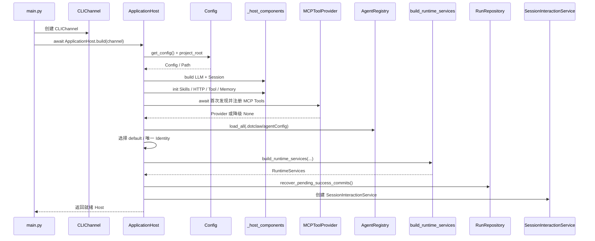

**结论：**

- `ApplicationHost.build()` 是启动发起者，`initialize()` 是顺序协调者。
- ToolExecutor 在 MCP 前创建；MCP 首次发现完成后才装配 Runtime Policy。
- Identity 在 RuntimeFactory 前加载，使 Context Plan、Policy 和 Delegation 使用同一目录。
- 成功提交补偿完成后才创建应用入口。
- Host 就绪只表示对象图和首次发现完成，不表示外部 LLM API 已通过健康检查。

### 5.2 关键与可降级初始化

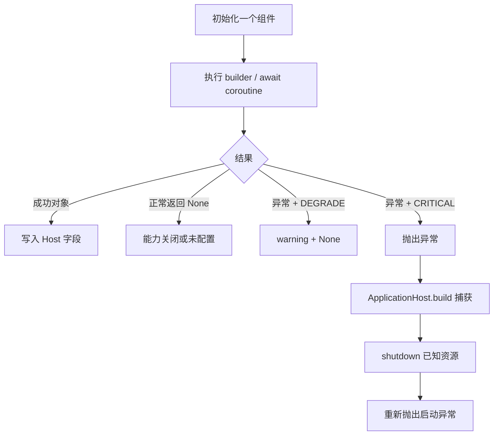

**结论：**

- 降级的结果统一表现为 None，但“配置关闭”和“初始化失败”只能通过日志区分。
- `_init_sync/_init_async` 不做重试和回滚。
- ToolExecutor、Runtime 装配和成功提交补偿失败会终止启动。
- Skills、Memory 和 MCP 失败不会阻止 Host 就绪。
- 单个 MCP Server 失败在 Provider 内部降级，不会使整个 Provider 必然为 None。

### 5.3 普通用户消息

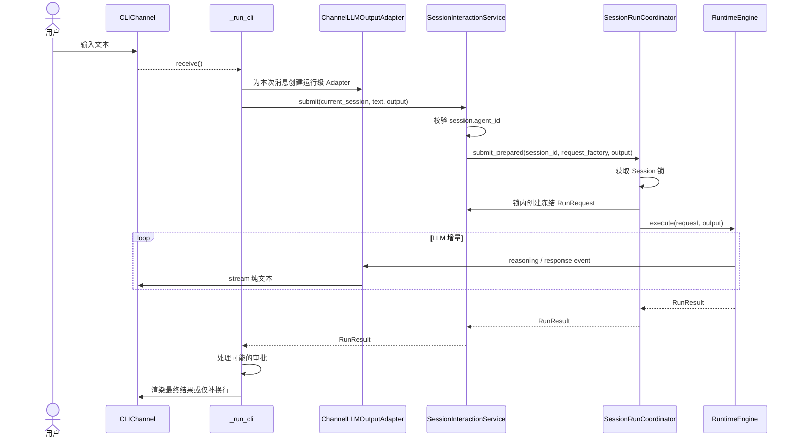

**结论：**

- 当前 Session 由 CLI 局部变量持有，Host 和 Runtime 不保存它。
- 每条普通消息创建独立 Output Adapter，避免跨 Run 标题状态串扰。
- RunRequest 必须在 Session 锁内冻结。
- Runtime 只返回结构化结果；CLI 决定审批询问和最终渲染。
- 入口不能直接调用 Engine 绕过 Session→Identity 校验。

### 5.4 审批交互

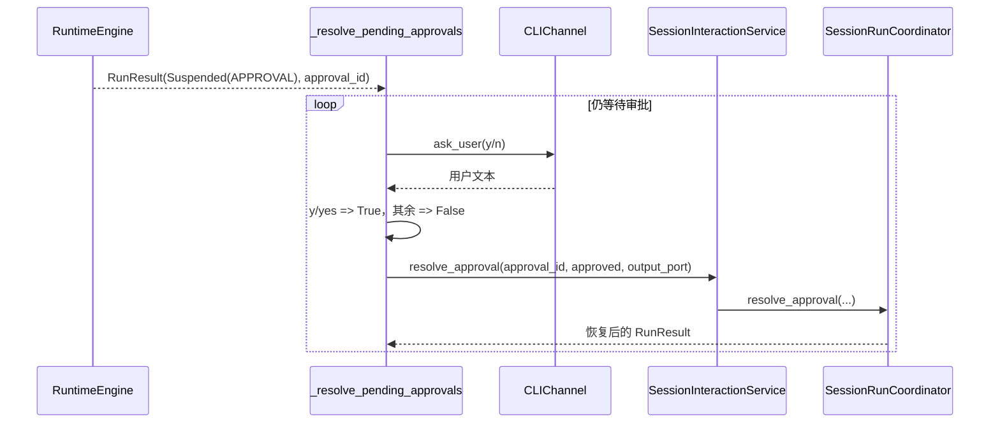

**结论：**

- 用户交互属于 CLI，approval_id 与决定属于应用服务输入。
- ToolExecutor 和 Runtime 不读取 y/n 文本。
- 同一个运行级 Output Adapter继续用于审批恢复后的模型输出。
- 非 y/yes 的任意输入当前都被解释为拒绝，没有二次确认或取消选项。
- 连续多个审批会在同一个循环中处理。

### 5.5 Session 创建、切换与删除

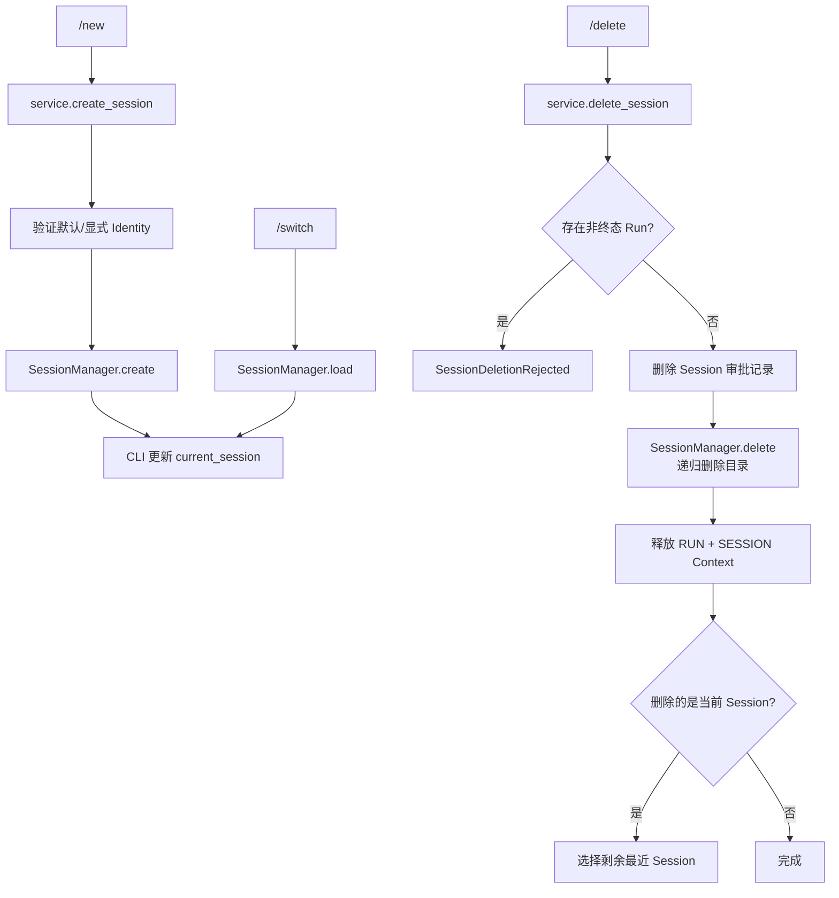

**结论：**

- Session 必须持久化有效 agent_id。
- `/switch` 只改变 CLI 当前选择，不改变 Session 文件。
- 删除协调者是 SessionInteractionService，而非 SessionManager。
- 活动 Run 存在时拒绝删除。
- 删除使用本地目录布局收集 Run Scope，当前应用服务与文件仓储存在耦合。
- 删除当前 Session 且没有剩余 Session 时，CLI 当前代码不会立即创建新 Session；下一轮普通操作可能继续持有已删除对象，详见第 8 节。

### 5.6 Runtime 私有装配

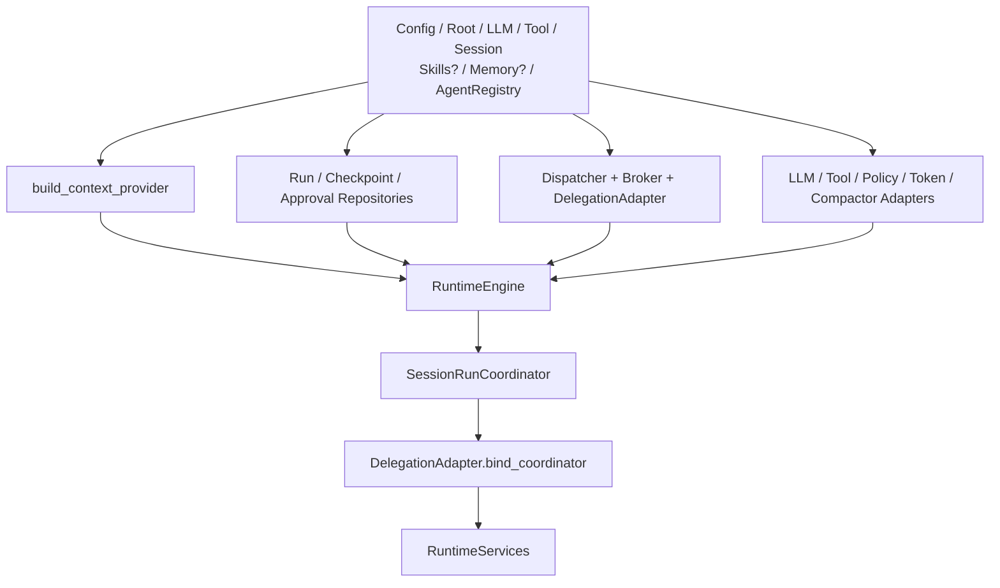

**结论：**

- RuntimeFactory 是具体实现装配点，不是 Runtime Application 服务。
- Context、Repository 和所有 Adapter 在同一调用中创建。
- Delegation 的构造循环通过组合根后绑定解决。
- ToolExecutor 为必填；函数内部仍保留 None 检查作为防御。
- Host 与 RuntimeFactory 共同持有部分对象引用，应避免两处各自创建重复实例。

### 5.7 启动成功提交补偿

```mermaid
flowchart LR
    RuntimeServices["RuntimeServices ready"] --> Recover["run_repository.recover_pending_success_commits"]
    Recover --> Scan["扫描 success_commit intents"]
    Scan --> Project["幂等补齐 Conversation"]
    Project --> Event["幂等补齐 RUN_COMPLETED"]
    Event --> Complete["写 Run COMPLETED"]
    Complete --> Cleanup["删除 checkpoint / intent"]
    Cleanup --> Entry["创建 SessionInteractionService"]
```

**结论：**

- 该步骤是 Host 启动关键阶段，失败会阻止入口就绪。
- 补偿依赖 Runtime Repository 和 SessionConversationProjector 已完成装配。
- 它只恢复未决成功提交，不处理所有非终态 Run。
- 遗留非终态 Run 在对应 Session 下次提交前由 Coordinator 调用 `recover_session()` 交由恢复边界重放。
- Journal 不参与补偿。

### 5.8 初始化失败清理

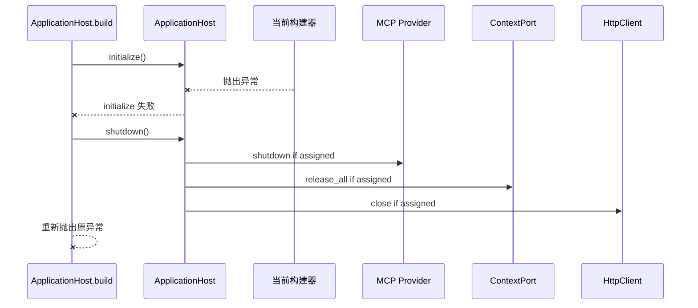

**结论：**

- `build()` 尝试避免半初始化 Host 直接泄漏已知资源。
- 清理只覆盖已经赋值给 Host、且 shutdown 显式认识的对象。
- 构建器内部创建后、赋值前失败的资源可能无法由 Host 回收。
- shutdown 中单项关闭失败只记录 warning。
- CLI `main()` 不把一般启动异常转换为友好终端消息。

### 5.9 正常关闭

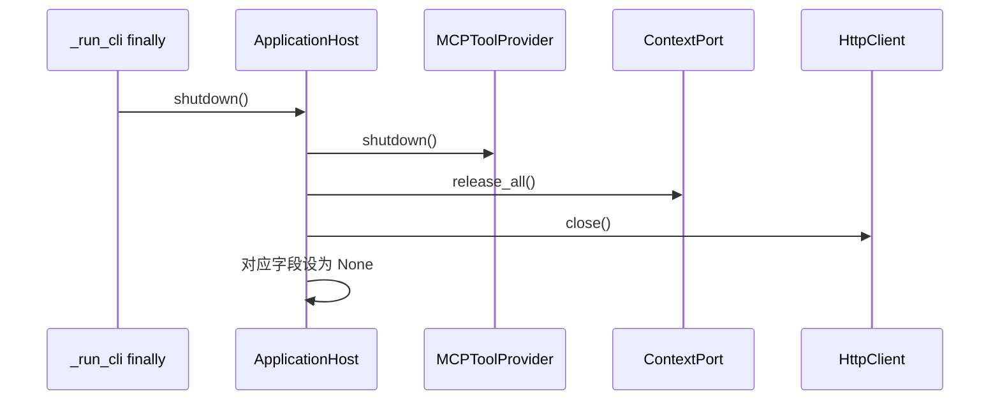

**结论：**

- 关闭发起者是 CLI finally，Host 是资源关闭协调者。
- 当前顺序体现 MCP→Context→HTTP 的显式依赖考虑。
- shutdown 可重复调用时不会重复关闭已置 None 的三项资源。
- Host 没有完整 lifecycle state；其他属性在关闭后仍可能返回旧对象。
- MemoryStorage 的 SQLite 连接当前没有被 Host 关闭。

### 5.10 诊断与专用命令旁路

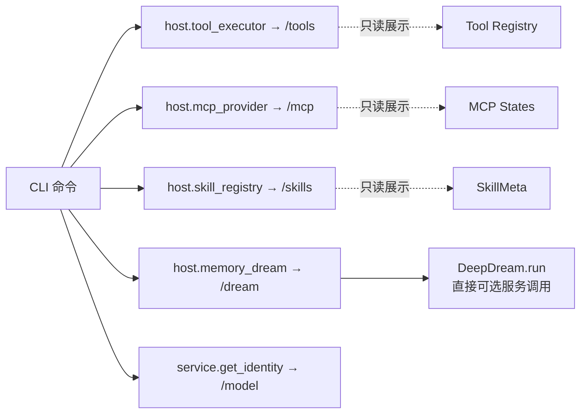

**结论：**

- `/tools`、`/mcp`、`/skills` 和 `/model` 是只读诊断。
- `/dream` 是应用专用操作，会直接调用 Memory 服务，不创建 AgentRun。
- 诊断属性不应被普通消息路径用于执行 Tool。
- 未来增加 Web/API 入口时，应决定这些专用操作是否也需要统一应用服务和权限边界。

---

## 6. 对外接口与数据契约

### 6.1 Bootstrap 公共 API

`dotclaw.bootstrap` 当前只公开：

```python
ApplicationHost
```

推荐启动方式：

```python
host = await ApplicationHost.build(channel=channel)
try:
    service = host.session_interaction
    ...
finally:
    await host.shutdown()
```

`runtime_factory` 和 `_host_components` 是私有实现，不应作为外部稳定 API。

### 6.2 Host 构建契约

`ApplicationHost.build()` 保证：

1. Config 与项目根已经解析；
2. Runtime 必要依赖已经构造；
3. 至少一个 Identity 已加载；
4. 默认 Identity 可确定；
5. MCP 首次发现已完成或整体降级；
6. RuntimeServices 已完成装配；
7. 未决成功提交已补偿；
8. SessionInteractionService 可用。

它不保证：

1. 首次真实 LLM 请求一定成功；
2. 所有 MCP Server 都连接成功；
3. Skills、Memory 和网络能力一定可用；
4. 配置文件在 Host 生命周期内动态刷新；
5. 所有外部资源均实现统一关闭协议；
6. `scheduler.enabled` 或 Journal 配置会自动创建对应运行服务。

### 6.3 Host 属性契约

| 属性 | 稳定用途 | 是否应用业务入口 |
|---|---|---|
| `session_interaction` | 普通提交和控制 | 是 |
| `session_manager` | CLI Session 列表/切换 | 部分 |
| `agent_registry` | Identity 查询/展示 | 只读 |
| `tool_executor` | Tool 诊断 | 否 |
| `mcp_provider` | MCP 诊断 | 否 |
| `skill_registry` | Skill 诊断 | 否 |
| `memory_dream` | `/dream` 专用操作 | 独立旁路 |
| `config` | 展示与入口配置 | 否 |

### 6.4 初始化策略契约

| 策略 | 调用者预期 | 返回 |
|---|---|---|
| CRITICAL | 没有该组件应用无法正确运行 | 对象或抛异常 |
| DEGRADE | 对应能力可缺失 | 对象或 None |

调用者必须明确处理 None。初始化辅助不会自动：

- 关闭依赖该能力的命令；
- 修改 Config；
- 生成 Capability 报告；
- 向用户显示降级原因；
- 重试。

### 6.5 `RuntimeServices` 契约

```text
engine
context_port
coordinator
run_repository
approval_repository
agent_registry
```

Host 主要使用：

```text
context_port
run_repository
coordinator
approval_repository
```

SessionInteractionService 主要使用：

```text
coordinator
run_repository
approval_repository
context_port
```

`engine` 通过 Coordinator 间接使用。外部 CLI 不应从 RuntimeServices 取得 Engine。

### 6.6 `SessionInteractionService` 契约

公开应用用例：

```text
create_session
get_identity
submit
resolve_approval
cancel
resume_run（恢复边界）
abandon（显式放弃）
delete_session
```

关键要求：

1. 已有 Session 的 agent_id 是权威，不回退默认值。
2. 普通提交必须通过 `submit_prepared()` 在锁内冻结请求。
3. output_port 是单次调用参数。
4. 控制操作使用 run_id 或 approval_id，不使用隐式“当前运行”。
5. 删除前必须拒绝非终态 Run。
6. 删除必须清理审批、完整目录和 Context Scope。
7. Service 不直接调用 LLM、Tool 或 MCP。

### 6.7 CLI 输出契约

```text
LLMOutputEvent
→ ChannelLLMOutputAdapter
→ Channel.stream(markup=False)

RunResult
→ has_streamed_response?
→ 补换行或 format_run_result + Markdown
```

reasoning：

- 可按 `--hide-thinking` 隐藏；
- 不改变 Runtime 事实；
- 不在最终 `_render_result` 中重放。

response：

- 增量已展示时只补换行；
- 未增量展示时使用 final_message 或状态文本。

### 6.8 配置与路径契约

| 数据 | 解析根 |
|---|---|
| `config.yaml` | dotclaw 项目根 |
| `.env` | dotclaw 项目根 |
| `model_router_config.yaml` | dotclaw 项目根 |
| Agent Config | `project_root/.dotclaw/agentConfig` |
| 相对 Skill 目录 | project_root |
| 相对 Memory 路径 | project_root |
| 相对 Session 目录 | project_root |
| Runtime Repository 根 | Host 传入的 project_root + session.directory |
| SessionManager 根 | `dotclaw.__file__` 推导的项目根 + session.directory |

默认入口下两者通常一致；自定义 project_root 当前不能保证一致。系统环境变量优先于 `.env`；`.env` 只补齐缺失值。

### 6.9 启动与关闭不变量

1. 外部只通过 `ApplicationHost` 创建完整应用对象图。
2. LLMProxy 与 SessionManager 必须在 Runtime 装配前存在。
3. ToolExecutor 必须在 MCP 前存在。
4. MCP 首次发现必须在 Runtime Policy 冻结 Tool Definitions 前完成。
5. AgentRegistry 必须在 Context Plan、Policy 和 Delegation 装配前完成。
6. 至少一个 Identity 必须有效。
7. 多个 Identity 且无 `default` 时 Host 不猜测默认项。
8. 普通入口不能绕过 SessionInteractionService 直接调用 Engine。
9. SessionInteractionService 不能构造基础设施。
10. RuntimeFactory 创建的 Adapter 与 Repository 必须只创建一套共享实例。
11. 未决成功提交补偿必须在入口就绪前完成。
12. 配置关闭与初始化失败都可能产生 None，调用者必须区分能力缺失。
13. Host build 失败必须尝试清理已知资源。
14. 正常 CLI 退出必须在 finally 调用 shutdown。
15. shutdown 单项异常不能阻止后续已知资源关闭。
16. Tool/MCP/Skill 诊断属性不得作为普通执行旁路。
17. 当前 Session 归入口层，不归 Host。
18. 运行级 Output Adapter 不得在 Host 构造期全局绑定。
19. 已有 Session 的未知 Identity 必须明确失败。
20. Session 删除不能只删除 session.json。
21. 启动成功提交补偿不等于全量 Run 恢复。
22. Host 关闭能力只能描述为当前显式实现，不应夸大为通用资源容器。
23. Config 中存在 Scheduler/Journal 字段不代表 Host 已完成对应模块装配。
24. Session 与 Runtime 事实应使用同一绝对存储根；当前自定义 project_root 路径尚未满足该不变量。

---

## 7. 常见修改入口

| 修改目标 | 首要入口 | 可能涉及 | 必须保持的不变量 |
|---|---|---|---|
| 修改公开启动方式 | `bootstrap/application_host.py::build` | config、main、shutdown | 失败时清理并重新抛出 |
| 修改启动顺序 | `ApplicationHost.initialize` | `_host_components`、runtime_factory | 依赖必须先于使用者 |
| 新增关键组件 | `initialize` + 新 `_build_*` | shutdown、Host 字段 | 构建失败必须终止并可清理 |
| 新增可降级组件 | `_init_sync/_init_async` 调用点 | 属性、命令、Context | None 路径必须完整处理 |
| 修改失败策略 | `_host_components.py` | 日志、CLI 启动错误 | 不得把关键依赖静默降级 |
| 修改 LLM 装配 | `_build_llm` | RouterConfig、AgentPolicyResolver | LLM 路由、Breaker 和预算元数据一致 |
| 修改 Router 配置解析 | `config/settings.py::load_router_config` | `_build_llm`、AgentPolicyResolver | YAML 字段必须完整映射 |
| 修改 Skill 启动 | `_build_skills` | Tool SkillParser、Context SkillsSlot | disabled 与 failure 可区分 |
| 修改网络工具依赖 | `_build_http_client`、`_build_tools` | Tool Provider、shutdown | 共享客户端只创建一套 |
| 修改 Tool 组合 | `_build_tools` | MCP、Agent Policy、Config | MCP 必须复用同一安全组件 |
| 修改 Agent Tool Policy | `_resolve_agent_policy_rules` | AgentRegistry、Identity reload | Policy 来源与 Run Identity 一致 |
| 修改 Memory 启动 | `_build_memory` | Config、Context、Dream、shutdown | 禁用和降级语义明确 |
| 修改 MCP 就绪语义 | `_build_mcp` | ToolRegistry、Host initialize | Runtime 冻结前完成首次发现 |
| 修改 Identity 扫描 | `AgentRegistry.load_all` | default selection、Context Plan | 重复/无效配置必须可诊断 |
| 修改默认 Identity | Host + SessionInteractionService | AgentRegistry、Session create | 已有 Session 不得回退默认 |
| 修改 Runtime 装配 | `runtime_factory.py` | Runtime Adapters、Context、Repos | 外部不直接调用私有 Factory |
| 新增 Runtime Port | `build_runtime_services` | RuntimeEngine、Adapter | 具体实现只在组合根出现 |
| 修改 Session 存储根 | Host 路径解析 + SessionManager + `_storage_root` | Repository、删除流程 | 所有事实必须使用同一绝对根 |
| 修改普通消息入口 | `SessionInteractionService.submit` | Coordinator、request_factory | 锁内冻结 RunRequest |
| 修改控制操作 | SessionInteractionService + Coordinator | Runtime Engine | 使用明确 run/approval ID |
| 修改 Session 删除 | `delete_session` | Repos、Context、SessionManager | 活动 Run 时拒绝 |
| 修改 CLI 命令 | `main.py::_run_cli` | Host 属性、应用服务 | 命令与普通消息路径分离 |
| 修改审批交互 | `_resolve_pending_approvals` | Channel、RunResult | Runtime 不解析 y/n |
| 修改流式输出 | `ChannelLLMOutputAdapter` | LLMOutputPort、render | 每个提交单独实例 |
| 修改最终渲染 | `_render_result`、`format_run_result` | RunResult | 已流式 response 不重复 |
| 修改关闭顺序 | `ApplicationHost.shutdown` | 所有资源构建器 | 依赖逆序、单项失败不阻塞 |
| 接入 Scheduler | `ApplicationHost.initialize` + `scheduler/reminder.py` | Channel、shutdown、Config | Task 必须可取消并定义恢复语义 |
| 接入 Journal | Host/RuntimeFactory 的观测 Adapter | Runtime Events、Config、shutdown | Journal 不得成为恢复事实源 |
| 排查启动失败 | Host 日志 → 构建阶段 → shutdown 日志 | Config、Identity、外部服务 | 区分 CRITICAL 与 DEGRADE |
| 排查首个 Run 缺工具 | MCP 首次发现 → Tool Registry → Policy Snapshot | Host、Tool、Runtime | 不在 Runtime 装配后补注册 |

---

## 8. 设计取舍、痛点和演进方向

本节只保留理解 Bootstrap 和应用入口架构所必需的判断。当前事实、真实问题和候选方案分别陈述。

### 8.1 当前架构承诺

当前 master 可以确认：

1. `ApplicationHost` 是 `dotclaw.bootstrap` 唯一公开启动对象。
2. Host 持有进程级资源，但不持有当前 Session、Run 或 Agent 执行状态。
3. `_host_components` 负责单项基础设施构造，`runtime_factory` 负责 Runtime 对象图。
4. ToolExecutor 是 Runtime 关键依赖；Skills、Memory、HTTP 和 MCP 可以降级。
5. MCP 首次发现完成后才装配 Runtime，首个 Run 能看到成功注册的 MCP Tools。
6. 全部 Identity 在 Runtime/Context/Delegation 装配前加载。
7. SessionInteractionService 是普通提交和控制的应用入口。
8. CLI 负责命令、审批询问和展示，不进入 Runtime 状态机。
9. reasoning/response 输出 Adapter 按提交创建，不在 Host 中全局绑定。
10. 启动时补偿未决成功提交，正常退出时显式关闭 MCP、Context 和 HTTP。

### 8.2 核心设计取舍

#### 8.2.1 唯一公开组合根

**问题与选择：**如果 CLI、测试、AgentFactory 和子模块分别创建 LLM、Tool Registry 或 Runtime，会形成多个不一致对象图。当前只公开 `ApplicationHost`，其余 Factory 保持私有。

**未选择：**公开全部 `_build_*`、Service Locator、每个 Agent 自建 Runtime、模块导入时创建全局对象。

**收益：**创建顺序、共享实例和生命周期集中；Runtime/Context/Tool 文档可以假设只有一套主对象图。

**代价与边界：**Host 依赖大量具体模块；文件规模和初始化方法会随功能增长。

#### 8.2.2 异步 `build()` 与轻量 `__init__`

**问题与选择：**MCP、Memory 和未来服务需要异步启动，Python `__init__` 无法可靠 await。当前构造函数只保存输入，`build()/initialize()` 完成真实装配。

**未选择：**构造函数内启动事件循环、模块导入时异步初始化、要求调用者逐项构建。

**收益：**启动就绪语义清楚；失败可以统一进入 cleanup。

**代价与边界：**对象存在“已构造但未初始化”状态，当前没有显式 lifecycle enum 防止误用或重复 initialize。

#### 8.2.3 关键与可降级依赖

**问题与选择：**轻型本地 Agent 不应因 Skills、Memory 或一个 MCP Server 失败而完全不可用，但没有 LLM、Session、Tool 或 Identity 时无法满足核心语义。

**未选择：**所有组件失败都退出、所有组件失败都静默、后台无限重试后才就绪。

**收益：**部分能力故障时仍可启动；关键边界明确。

**代价与边界：**None 同时表示“关闭”和“失败”；降级原因主要存在日志中，缺少结构化能力报告。

#### 8.2.4 等待 MCP 首次发现

**问题与选择：**Runtime Policy 在 Run 创建时快照模型可见 Tool Definitions。如果 MCP 在 Host 就绪后才异步注册，首个 Run 可能看不到工具。

**未选择：**完全后台发现、首个 Run 懒发现、每轮 Context 动态读取 MCP。

**收益：**Host 返回时 Tool Registry 对首次运行稳定；单 Server 仍可并行和降级。

**代价与边界：**启动时间受最慢 MCP Server 的 startup timeout 影响；整体异常路径需要正确清理部分连接。

#### 8.2.5 两级组合根

**问题与选择：**Host 若直接创建所有 Runtime Adapter 会过度膨胀。当前 Host 管基础设施和生命周期，RuntimeFactory 管 Context/Repository/Adapter/Engine 对象图。

**未选择：**一个超大 initialize、RuntimeEngine 自己读取全局 Config、每个 Adapter 自行创建依赖。

**收益：**Runtime 装配细节集中；Host 主链仍可阅读。

**代价与边界：**Host 与 RuntimeServices 存在重复引用；RouterConfig 等共享构建结果未完全统一。

#### 8.2.6 最小 Session 应用入口

**问题与选择：**CLI 需要按 Session 路由 Identity，但不应恢复旧的“Agent 门面持有 Runtime”结构。当前使用 SessionInteractionService，只编排 Session、Registry、Coordinator 和删除资源。

**未选择：**泛化 ChatService、运行时 Agent 对象、CLI 直接调用 Engine。

**收益：**提交边界稳定；Session Identity 权威；未来 API 可以复用应用用例。

**代价与边界：**删除用例引入具体 Repository 和文件目录耦合，Service 已不再是完全最小的三依赖对象。

#### 8.2.7 运行级输出 Adapter

**问题与选择：**共享 LLM Adapter 若在构造期绑定 Channel，会导致并发 Run 输出状态串扰。当前每条消息创建 `ChannelLLMOutputAdapter` 并沿调用参数传递。

**未选择：**Host 全局 Channel、RuntimeEngine 依赖 CLI、reasoning 专用方法加入通用 Channel。

**收益：**输出按 Run 隔离；同一 Runtime 可用于不同入口；隐藏 reasoning 只是入口策略。

**代价与边界：**每个入口都需要实现 Adapter 创建和最终去重；Host 构造参数中的 Channel 已失去作用。

#### 8.2.8 严格 Session Identity

**问题与选择：**已有 Session 若绑定未知 Identity，静默切换到默认 Agent 会改变提示词、工具和权限。当前明确失败。

**未选择：**任何缺失都回退 default、Session 不持久化 agent_id、CLI 保存当前 Agent 全局变量。

**收益：**历史和权限语义稳定。

**代价与边界：**删除或重命名 Identity 后旧 Session 无法继续，需要显式迁移工具。

#### 8.2.9 启动前成功提交补偿

**问题与选择：**文件系统多事实成功提交可能在崩溃时只完成一部分。Host 在应用入口就绪前调用 Repository 补偿。

**未选择：**首个读取时才全部懒恢复、忽略临时意图、CLI 手工修复。

**收益：**用户看到 Session 前，成功 Conversation 与 Run 终态已一致。

**代价与边界：**启动会扫描本地事实；补偿失败会阻止整个应用启动；其他 RUNNING Run 仍是按 Session 懒恢复。

#### 8.2.10 诊断资源由 Host 暴露

**问题与选择：**CLI 需要 `/tools`、`/mcp` 和 `/skills`，但不应自行保留第二份 Registry。Host 返回只读诊断引用。

**未选择：**CLI 重建 Registry、所有诊断都进入 Runtime Tool、Service Locator。

**收益：**展示与真实共享对象一致。

**代价与边界：**Host 公共表面积增加；`/dream` 已成为直接副作用旁路，需要单独治理。

### 8.3 已知痛点

#### B1. Host 缺少显式生命周期状态

当前没有：

```text
NEW
INITIALIZING
READY
SHUTTING_DOWN
CLOSED
FAILED
```

因此：

- 可以手工重复调用 `initialize()`；
- 初始化中途时属性状态由多个 None 字段隐式表达；
- shutdown 后 `session_interaction`、`session_manager`、`agent_registry` 和 `runtime_services` 仍保留旧对象；
- 无法明确拒绝关闭后继续提交。

#### B2. 关闭协议硬编码且不完整

`shutdown()` 只认识：

```text
MCP
Context
HttpClient
```

MemoryStorage 创建 SQLite 连接，但当前 Host 没有关闭路径；LLMProxy、MemoryManager 和未来资源也没有统一 lifecycle contract。

这意味着“Host 持有全部资源”目前是对象引用意义，不是通用资源回收保证。

#### B3. `channel` 构造参数未使用

`ApplicationHost.__init__` 和 `build()` 接收 Channel 并保存 `_channel`，后续没有读取。运行级输出已经通过调用参数传入。

该字段会误导读者认为 Host 或 Runtime 在构造期绑定输出通道。

#### B4. LLM 与 Runtime Policy 使用不同 RouterConfig 构建路径

`_build_llm()` 在 Router 文件缺失时使用 legacy `config.llm` 构建 RouterConfig；`build_runtime_services()` 却独立调用 `load_router_config()`，文件缺失时得到空 RouterConfig。

结果可能是：

```text
LLMProxy 可以按 legacy 路由调用模型
但 AgentPolicySnapshot 缺少对应 tokenizer_encoding
→ Runtime Context Budget 确定性拒绝
```

即使文件存在，两处独立解析也增加漂移和重复 I/O。

#### B5. Memory 没有明确启停开关，且 SQLite 生命周期未收口

`Config.memory` 总是存在，`_build_memory()` 的当前判断通常不会返回“配置关闭”。Memory 每次启动都会尝试创建，失败才降级。

同时 MemoryStorage 持有 SQLite Connection，但没有被 Host shutdown 管理。

#### B6. MCP 整体失败存在双重捕获和部分资源清理风险

`_build_mcp()` 内部捕获 `provider.start()` 异常并返回 None，外部又使用 `_init_async(..., DEGRADE)`。

若 `provider.start()` 在部分 Client 已连接后发生整体异常，局部 `provider` 未赋给 Host，Host shutdown 无法获得它执行清理。当前 Provider 的常见单 Server 异常由 gather 降级，但整体异常边界仍不统一。

#### B7. HttpClient 无论网络服务是否启用都会创建

即使 Tavily 和 Open-Meteo 都关闭，Host 仍创建 `HttpxHttpClient` 并在退出时关闭。构造成本较低，但能力开关与资源创建不一致。

#### B8. Tool Agent Policy 与 Host AgentRegistry 来源分离

ToolExecutor 的 Agent Policy resolver 在第一次遇到 agent_id 时重新从磁盘调用 `load_agent_config()` 并缓存 policy_rules；Host 的 AgentRegistry 则在稍后启动阶段扫描并保存完整 Identity。

可能出现：

- Host Registry 与 Tool Policy 读取时间不同；
- 文件变更后两个子系统看到不同版本；
- 无效/重复 Identity 的处理路径不同；
- Run Policy 与 Tool Policy 不来自同一个冻结 Identity 对象。

#### B9. Identity 加载存在宽松回退、覆盖和可观测性问题

`AgentRegistry.load_all()` 外层会对抛出的字段转换异常 warning 并跳过，但 `load_agent_config(path=...)` 对文件读取或 YAML 解析异常会直接返回默认 `AgentIdentity`。由于 path 调用没有显式传入文件名对应的 agent_id，这类坏文件可能注册为 `default`。

同时：

- 重复 agent_id 后者覆盖前者；
- glob 顺序不应成为业务优先级；
- Host 只检查 Registry 非空；
- 没有报告哪些文件成功、回退、跳过或覆盖。

因此“Host 已加载至少一个 Identity”不等于“至少一个 Identity 配置严格有效”。

#### B10. 默认 Identity 选择逻辑重复

Host 和 SessionInteractionService 都实现：

```text
显式 default
→ 唯一 Identity
→ 否则失败
```

虽然 Host 将 default_agent_id 传给 Service，使正常路径结果一致，但两处逻辑未来可能漂移。

#### B11. RuntimeServices 存在冗余引用与具体类型

Host 已持有 AgentRegistry，RuntimeServices 又返回同一 Registry，但 ApplicationHost 不使用该字段。

容器字段全部是具体 Adapter 类型，适合作为 Host 私有结果，但不应被误认为 Runtime 稳定公共接口。

#### B12. SessionInteractionService 与存储实现耦合

Service 直接依赖：

```text
RunRepositoryAdapter
ApprovalRepositoryAdapter
Path
agent_runs 目录布局
```

并通过 `_run_ids_in()` 扫描物理目录。这使 Session 删除用例难以替换为数据库 Repository，也与类注释中“仅依赖 SessionManager、AgentRegistry、Coordinator”不一致。

#### B13. 删除最后一个当前 Session 后 CLI 保留陈旧对象

删除当前 Session 后，CLI 只在仍有其他 Session 时切换；若列表为空，局部 `current_session` 仍引用已删除 Session。

下一条普通消息可能使用已删除 Session 对象提交，导致持久化和成功投影异常。应在删除最后一个 Session 后立即创建新 Session，或将当前值置空并阻止提交。

#### B14. `main.py` 命令分派过于集中

`_run_cli()` 同时管理：

- Session 选择；
- 命令解析；
- Runtime 控制；
- 诊断；
- Dream；
- Output Adapter；
- 审批循环；
- 错误展示。

新增入口或权限规则时容易复制逻辑。`/dream` 还直接调用副作用服务，不经过统一应用命令层。

#### B15. Config 使用进程全局单例，公开 build 不支持覆盖

`ApplicationHost.build()` 固定调用 `get_config()`，同进程内不会自动重载文件。虽然可以直接构造 Host 注入 Config，但推荐公开入口没有 `config/project_root` 参数。

这限制：

- 多实例不同配置；
- 配置热重载；
- 集成测试隔离；
- 嵌入其他应用。

#### B16. 日志在 `main.py` 导入阶段配置

日志 Handler 在 Config 加载前固定为：

```text
./data/dotclaw.log
```

`FileHandler` 在模块导入阶段立即创建；若当前工作目录下 `./data` 不存在，程序可能在进入 ApplicationHost.build 之前失败。

Host 就绪后只修改日志 level，没有应用 `config.debug.log_file`。工作目录不同于项目根时，日志路径与其他存储根也可能不同。

#### B17. 初始化策略用字符串且降级状态不可观测

`CRITICAL/DEGRADE` 是字符串；非 `"critical"` 值都按降级处理。

Host 不保存结构化 StartupReport，用户只能从：

- 某属性是否 None；
- warning 日志；
- 诊断命令

推断能力状态。无法统一回答“哪些组件因关闭、配置错误或外部故障而不可用”。

#### B18. 启动恢复语义分散

Host 只恢复 pending success commits；遗留 RUNNING Run 由 Coordinator 在某 Session 下次提交时处理。

这在实现上合理，但：

- 没有统一 Startup Recovery Report；
- 一个长时间不再访问的 Session 会一直保留 RUNNING 状态；
- 文档和日志容易把“启动恢复”泛化为全部运行恢复。

#### B19. 版本与阶段命名残留

`runtime_factory.py`、错误消息、pyproject 测试注释和多个 docstring 仍使用：

```text
Runtime v2
阶段 1/2/5
总体设计 §...
```

这些内部历史标记对当前读者构成噪声，也容易让人误以为存在多套并行 Bootstrap/Runtime。

#### B20. Host 就绪没有外部健康验证

LLMProxy 构建只创建 Router、Limiter 和 Breaker，不验证：

- API Key；
- Provider 网络；
- 默认模型可用性；
- tokenizer 配置与模型一致性。

因此关键组件“构建成功”与“首个业务请求可成功”仍有距离。该选择避免启动时产生外部调用，但需要明确能力边界。

#### B21. Scheduler 与 Journal 配置尚未进入组合根

Config 已定义：

```text
SchedulerConfig.enabled
JournalConfig
```

仓库也存在 `ReminderManager` 和 Journal 模块，但 Host 没有创建或注入它们。配置表面能力与实际启动能力不一致，容易让用户误判：

- `scheduler.enabled=true` 时提醒服务已运行；
- `journal.trace=true` 时 Runtime 已写 Journal；
- Host shutdown 已管理提醒 Task 或 Journal 资源。

#### B22. RouterConfig 加载遗漏 Circuit Breaker 配置

`model_router_config.yaml` 支持每个 Provider 配置 `circuit_breaker`，`ProviderConfig` 也包含对应字段；但 `load_router_config()` 当前构造 ProviderConfig 时没有传入该字段。

结果是：

```text
YAML 自定义 failure_threshold / cooldown_seconds / half_open_max
→ 未进入 ProviderConfig
→ _build_llm 读取默认空配置
→ BreakerConfig 使用代码默认值
```

因此 Breaker 实例存在，但用户填写的自定义熔断参数没有生效。

#### B23. 自定义 project_root 没有贯穿 Session 存储

RuntimeFactory 使用 Host 传入的 project_root 解析 Run、Checkpoint 和 Approval Repository 根目录；SessionManager 则重新根据 `dotclaw.__file__` 计算项目根。

默认入口下通常一致，但直接构造：

```python
ApplicationHost(config, custom_project_root)
```

时可能形成：

```text
SessionManager
→ 包安装位置 / session.directory

Runtime Repositories
→ custom_project_root / session.directory
```

这会破坏 Session、Conversation 和 AgentRun 事实必须同根的核心不变量，也使删除、投影和恢复可能访问不同目录。

### 8.4 演进方向

| 编号 | 解决的痛点 | 候选方向 | 影响与代价 |
|---|---|---|---|
| E1 | B1 | 引入 HostLifecycle 状态机，限制重复 initialize、关闭后属性访问和并发 build/shutdown | Bootstrap、入口测试；需定义半初始化状态 |
| E2 | B2、B5 | 定义 `AsyncCloseable`/resource stack，构建成功即注册逆序清理；为 MemoryStorage 增加 close | Bootstrap、Memory、LLM/HTTP/MCP；需处理同步/异步混合资源 |
| E3 | B3 | 删除 Host 的 channel 参数和字段；Channel 只在入口创建运行级 Adapter | Bootstrap、main、测试 |
| E4 | B4 | Host 只解析一次 RouterConfig，同时注入 ModelRouter 和 AgentPolicyResolver；legacy fallback 也共享同一结果 | Config、LLM、RuntimeFactory；避免重复解析 |
| E5 | B5 | 为 MemoryConfig 增加 `enabled`，区分关闭、初始化失败和运行故障 | Config、Bootstrap、Context、CLI |
| E6 | B6 | 让 `_build_mcp` 不吞整体异常，由统一 resource stack 在失败时 shutdown 部分 Provider；保留 Server 级降级 | MCP、Bootstrap |
| E7 | B7 | 仅在至少一个受控网络服务启用时创建 HttpClient，或由 Tool Network Provider 惰性获取 | Bootstrap、Tool、Config |
| E8 | B8 | 先加载 AgentRegistry，再构建 ToolExecutor；Agent policy resolver 从同一 Identity 目录读取冻结规则 | Bootstrap、Tool、Agent；需调整启动顺序 |
| E9 | B9 | 让严格加载路径在读取/YAML 错误时失败而非生成默认 Identity；`AgentRegistry.load_all` 返回 `AgentLoadReport`，检测回退、跳过、重复 ID 和预期缺失 | Agent、AgentRegistry、Host、CLI 诊断 |
| E10 | B10 | 提取单一 DefaultIdentityResolver，Host 和 Session 创建共用 | Bootstrap、SessionInteraction |
| E11 | B11 | 缩减 RuntimeServices 为 Host 真正需要的协议/对象，移除重复 agent_registry | RuntimeFactory、Host |
| E12 | B12 | 为 Session 删除定义应用 Ports：ActiveRunQuery、ApprovalCleanup、ContextScopeCleanup、SessionStore；禁止扫描物理目录 | Bootstrap 应用入口、Runtime Repositories、Session |
| E13 | B13 | 删除当前最后一个 Session 后立即创建默认 Session，或显式维护 `Session | None` 并在提交前恢复 | main、SessionInteraction |
| E14 | B14 | 提取 CLICommandRouter/ApplicationCommands；Dream 等副作用用例进入明确应用服务 | main、Bootstrap、Memory、未来 API |
| E15 | B15 | 增加 `ApplicationHost.build(config=None, project_root=None)` 或独立 `HostBuilder`，保留默认 Config 单例入口 | Bootstrap、Config、测试 |
| E16 | B16 | 在 Config 加载后配置日志，使用 project_root 解析 `debug.log_file`，避免 import-time Handler | main、Config、Logging |
| E17 | B17、B18 | 产生结构化 StartupReport/RecoveryReport，区分 DISABLED、READY、DEGRADED、FAILED 与恢复数量 | Bootstrap、CLI/API、Observability |
| E18 | B19 | 清理阶段号和 Runtime v2 文案；版本号只用于持久化格式或发布版本 | 全仓注释、Wiki、测试标记 |
| E19 | B20 | 提供可选 `--health-check` 或诊断命令，验证默认模型、Router 元数据、Tokenizer 和外部服务，不强制普通启动调用 | Bootstrap、LLM、CLI；增加启动延迟与外部成本 |
| E20 | B21 | 明确选择是否接入 Scheduler/Journal：接入则创建应用 Service、生命周期和诊断；不接入则移除或标记未消费配置 | Bootstrap、Scheduler、Journal、Config、Channel |
| E21 | B22 | 在 `load_router_config()` 中完整映射 circuit_breaker，并增加 YAML→ProviderConfig→BreakerConfig 的配置测试 | Config、LLM、Bootstrap |
| E22 | B23 | 由 Host 一次性解析所有绝对路径；SessionManager 只接收已解析的 Session 根，RuntimeFactory 复用同一对象或值 | Bootstrap、Session、Runtime Repositories、测试 |

---

## 9. 源码索引

### 9.1 Bootstrap 目录

```text
src/dotclaw/bootstrap/
├── __init__.py
├── application_host.py
├── _host_components.py
├── runtime_factory.py
└── session_interaction.py
```

### 9.2 Bootstrap 文件

| 文件 | 逻辑组件 | 主要内容 |
|---|---|---|
| `bootstrap/__init__.py` | 公共 API | 只导出 ApplicationHost |
| `bootstrap/application_host.py` | 公开组合根 | build、initialize、属性、默认 Identity、shutdown |
| `bootstrap/_host_components.py` | 基础设施构建 | 失败策略、LLM/Skills/HTTP/Tool/Memory/MCP |
| `bootstrap/runtime_factory.py` | Runtime 私有装配 | Context、Repos、Adapters、Engine、Coordinator |
| `bootstrap/session_interaction.py` | 应用入口 | Session 路由、提交、控制、删除和结果格式化 |

### 9.3 CLI 与 Channel 接入

```text
src/dotclaw/
├── main.py
└── channel/
    ├── base.py
    ├── cli.py
    └── runtime_llm_output.py
```

| 文件 | Bootstrap/入口视角 |
|---|---|
| `main.py` | 命令入口、CLI 循环、审批和结果展示 |
| `channel/base.py` | 通用 Channel 输入输出协议 |
| `channel/cli.py` | Rich CLI 实现 |
| `channel/runtime_llm_output.py` | Runtime LLMOutputPort 到 Channel 的运行级适配 |

### 9.4 配置与 Identity

```text
src/dotclaw/
├── config/
│   ├── __init__.py
│   └── settings.py
├── agent/
│   └── identity.py
└── orchestration/
    └── registry.py
```

| 文件 | Bootstrap 视角 |
|---|---|
| `config/settings.py` | Config 单例、项目根、`.env`、RouterConfig |
| `agent/identity.py` | Identity YAML 解析和声明式策略 |
| `orchestration/registry.py` | 启动扫描和 Identity 目录 |

### 9.5 被装配的核心模块

```text
src/dotclaw/
├── llm/
│   ├── proxy.py
│   ├── model_router.py
│   ├── rate_limiter.py
│   └── circuit_breaker.py
├── tools/
│   ├── executor.py
│   ├── registry.py
│   ├── discovery.py
│   ├── policy.py
│   ├── capability.py
│   └── http_client.py
├── mcp/
│   └── provider.py
├── memory/
│   ├── storage.py
│   ├── manager.py
│   └── dream.py
├── skills/
│   ├── scanner.py
│   └── registry.py
├── context/
│   └── defaults.py
├── runtime/
│   ├── application/
│   └── adapters/
├── session/
│   └── session.py
├── scheduler/
│   ├── __init__.py
│   └── reminder.py
└── journal/
    └── __init__.py
```

补充说明：

| 文件 | Bootstrap 视角 |
|---|---|
| `scheduler/reminder.py` | 当前未被 Host 装配的一次性提醒实现 |
| `journal/__init__.py` | 当前未被 Host 装配的观测模块公共入口 |

### 9.6 包入口

```text
pyproject.toml

[project.scripts]
dotclaw = "dotclaw.main:main"
```

CLI 执行路径：

```text
安装后的 dotclaw 命令
→ dotclaw.main.main
→ _run_cli
→ ApplicationHost.build
```
