# Config 模块总体说明

> 适用代码：`aandbcct/dotClaw` 的 `master` 分支  
> 扫描基准：2026-07-27，包含 `config.yaml`、`model_router_config.yaml`、`.env` 展开、Config/RouterConfig 数据模型、Agent Identity 相邻配置、Bootstrap 实际消费、CLI、各模块配置使用与当前测试
> 文档定位：自顶向下解释 dotClaw 如何从多份 YAML 和环境变量生成启动期配置对象，哪些字段真正控制运行行为，哪些字段只在兼容路径生效、被解析但未消费，或因解析与装配缺口而失效。  
> 编写基准：《dotClaw Wiki 编写规范与验收准则 v1.1》  
> 上级导航：[dotClaw 开发者 Wiki](./README.md)

**快速导航**

| 需要回答的问题 | 阅读位置 |
|---|---|
| Config 当前负责什么、不负责什么 | 第 1～2 节 |
| 三类配置来源及其优先级 | 第 2、5、6 节 |
| Config、RouterConfig、AgentIdentity 如何分工 | 第 3～4 节 |
| 启动加载、路由选择、环境变量和兼容回退如何运行 | 第 5 节 |
| 各字段到底是否生效 | 第 6 节字段消费矩阵 |
| 修改某项配置从哪里开始 | 第 7 节 |
| 当前痛点与演进方向 | 第 8 节 |
| 具体源码和测试在哪里 | 第 9 节 |

```text
当前配置来源

系统环境变量
        │
        ├── 优先于项目根 .env
        │
项目根 .env（override=False）
        │
        ├── 为 ${VAR} 提供值
        │
config.yaml
        ├── Config
        │   ├── Agent 默认行为
        │   ├── Tool / MCP / Skills / Memory
        │   ├── Session / Scheduler / Debug / Journal
        │   └── LLM 旧格式兼容数据
        │
model_router_config.yaml
        ├── RouterConfig
        │   ├── Provider
        │   ├── Model
        │   ├── Purpose
        │   └── Reasoning
        │
.dotclaw/agentConfig/*.yaml
        └── AgentIdentity
            ├── Model / Prompt
            ├── Tool 白名单与策略
            ├── Context Slots
            └── Delegation 元数据

运行期
ApplicationHost.build()
→ get_config() 全局单例
→ _build_llm 生成 RouterConfig A
→ runtime_factory 再加载 RouterConfig B
→ Bootstrap 按组件读取字段
→ 每次 Run 合并 Config + AgentIdentity + RouterConfig B
```

---

## 1. 模块定位与边界

Config 模块是 dotClaw 的**启动期配置加载、兼容迁移和弱类型数据映射层**。

它负责：

```text
YAML
→ 环境变量字符串替换
→ 局部校验与兼容迁移
→ Dataclass 配置对象
→ Bootstrap / Runtime / 模块消费者
```

它不是完整的配置管理系统。当前没有：

```text
运行时 Reload
配置写回
Schema 生成
Secret Store
值来源追踪
统一强类型验证
配置版本迁移框架
CLI config status
```

### 1.1 核心职责

当前职责归纳为七组：

1. **项目根解析**：从 `dotclaw` 包位置推导项目根。
2. **环境加载**：读取项目根 `.env`，系统环境变量优先。
3. **主配置加载**：把 `config.yaml` 转换为 `Config`。
4. **模型路由加载**：把 `model_router_config.yaml` 转换为 `RouterConfig`。
5. **兼容迁移**：迁移旧 Builtin Tool 名，兼容缺少 Router 文件的旧 LLM 配置。
6. **局部校验**：校验 Tool Policy、Network bool、MCP Server、Reasoning mode/tag 等关键字段。
7. **全局缓存**：通过 `get_config()` 懒加载并缓存主 Config。

### 1.2 主要使用者

| 使用者 | 如何使用 Config |
|---|---|
| `ApplicationHost.build()` | 读取全局 Config 和项目根 |
| `_build_llm()` | 根据 Router 文件是否存在选择 RouterConfig 或 Legacy LLMConfig |
| `_build_tools()` | 消费 Tool、Network、Policy 和部分 MCP 配置 |
| `_build_skills()` | 消费 SkillsConfig |
| `_build_memory()` | 消费 MemoryConfig 的部分字段 |
| `_build_mcp()` | 消费 MCP 开关、Global 和 Server 列表 |
| `SessionManager` / Runtime Repository | 消费 Session directory |
| `AgentPolicyResolver` | 合并 Config、RouterConfig 与 AgentIdentity |
| CLI | 使用 Debug level、默认模型和 Host 暴露的 Config |
| LLM Router | 消费 Provider、Model、Purpose 与 Reasoning 配置 |
| Tool Policy | 消费全局规则、拒绝路径、Server 允许列表和网络服务 |
| Agent Identity Loader | 独立加载 `.dotclaw/agentConfig/*.yaml`，只复用环境变量展开 |

### 1.3 明确不负责的内容

Config 当前不负责：

1. **业务组件生命周期**：ApplicationHost 负责构建、降级和关闭。
2. **每次 Run 的最终策略**：AgentPolicyResolver 合并 Identity 和 Config。
3. **动态模型健康状态**：RateLimiter/CircuitBreaker 负责。
4. **Tool 实际安全判定**：CapabilityBroker 与 PolicyEngine 负责。
5. **路径访问安全**：Tool Policy 负责；Config 只提供字符串。
6. **配置文件修改和持久化**：没有写 API。
7. **Secret 加密与轮换**：环境变量值直接进入配置对象。
8. **Agent Identity 注册**：AgentRegistry 负责扫描和索引。
9. **远程配置中心**：所有配置都来自本地文件和进程环境。
10. **未知键拒绝**：绝大多数未知 YAML 字段会被忽略。

### 1.4 与相邻模块的职责边界

| 相邻模块 | Config 负责 | 相邻模块负责 |
|---|---|---|
| Bootstrap | 提供配置对象 | 字段投影、构造顺序、失败策略 |
| LLM | 提供 Router 配置 | 选路、重试、限流、熔断和 Client |
| Agent/Identity | 提供全局默认 | Agent 级覆盖、白名单和角色数据 |
| Tool | 提供声明值 | Policy 合并、Capability、审批和执行 |
| MCP | 提供 Server/Timeout | Transport、发现、调用和状态 |
| Skills | 提供目录与开关 | 扫描、解析和注册 |
| Memory | 提供路径与参数 | 索引、检索、Flush 和 Dream |
| Session | 提供存储目录 | Session 文件与 Run 事实持久化 |
| Journal | 声明旧 JournalConfig | 事件写入；当前 Runtime 主链主要使用 RunEvent 仓储 |
| CLI | 提供可读取值 | 日志级别调整和状态展示 |
| `.env` | 决定加载位置与优先级 | python-dotenv 执行变量注入 |

---

## 2. 模块在项目中的位置

### 2.1 全局位置图

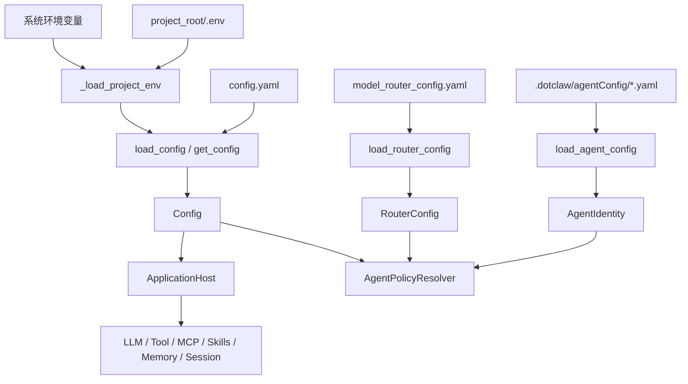

**结论：**

- Config 不是单一对象，而是 Config、RouterConfig 和 AgentIdentity 三个配置域。
- `config.yaml` 由 Config 包统一加载。
- Router YAML 由同一 `settings.py` 单独加载。
- Agent YAML 由 Agent 模块加载，不进入 Config 聚合对象。
- 最终 Run 策略在 Runtime Adapter 中合并三类配置。

### 2.2 环境变量优先级

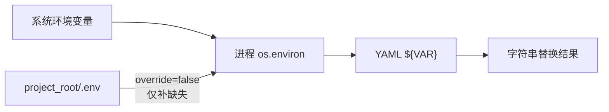

**结论：**

- 系统环境变量优先。
- `.env` 不覆盖已经存在的系统变量。
- YAML 只有显式 `${VAR}` 才会使用环境变量。
- 未设置变量保留原始占位符并记录 warning。
- 替换只生成字符串，不按目标字段自动转换类型。

### 2.3 RouterConfig 的双消费路径

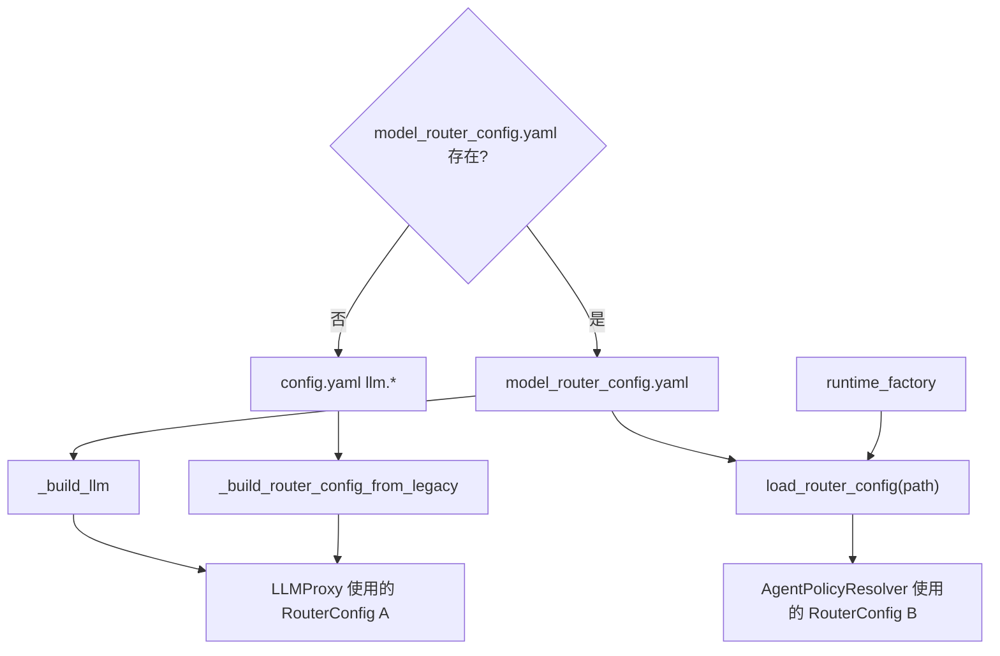

**结论：**

- LLM 构建和 Runtime 策略当前没有共享同一个有效 RouterConfig 实例。
- Router 文件存在时，两条路径分别解析同一文件，得到两个独立对象。
- Router 文件缺失时，LLMProxy 使用 Legacy 转换结果，而 AgentPolicyResolver 直接加载缺失文件并得到空 RouterConfig。
- 这可能使实际模型选路与 Context Window、Tokenizer、Compaction Model 等运行策略来自不同配置事实。
- `config.llm.default_model` 仍参与 Identity 模型回退，因此主 Config 也没有完全退出 LLM 决策。

### 2.4 启动配置消费图

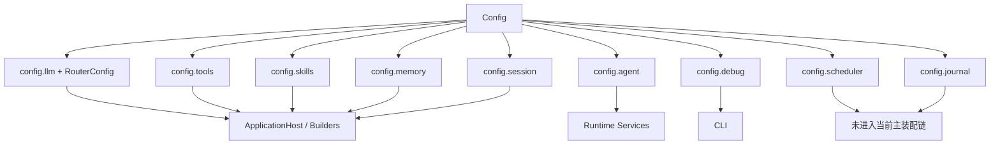

**结论：**

- Config 聚合对象比当前主链实际消费的配置面更大。
- SchedulerConfig 当前没有进入 ApplicationHost。
- JournalConfig 没有进入 Runtime 的装配链。
- Debug level 在 Host 就绪后才应用。
- 字段是否生效仍取决于 Loader、Builder 和目标组件三层是否全部闭合。

### 2.5 依赖方向

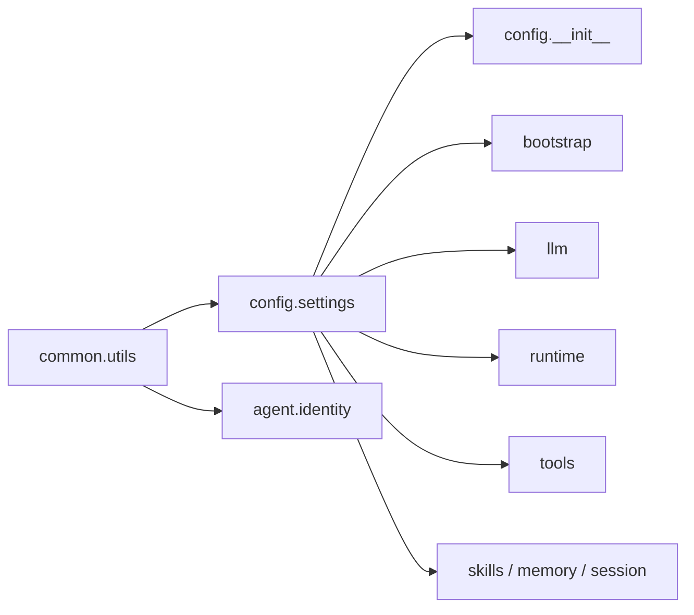

**结论：**

- Config Core 依赖 YAML、dotenv、Path 和 common.utils。
- Config 不依赖 LLM、Tool、Runtime 等业务模块。
- 多数业务模块直接依赖 `config.settings` 的具体 Dataclass。
- Agent 配置加载器只复用 common.utils，不复用主 Config Loader。
- Config 包导出面没有覆盖 `settings.py` 中全部配置类型。

---

## 3. 组件总览

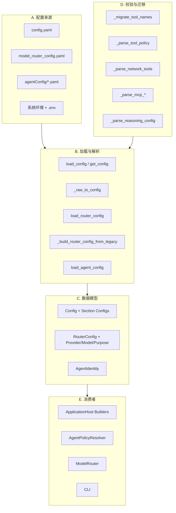

**结论：**

- 配置系统由来源、加载器、数据模型、兼容逻辑和消费者组成。
- `settings.py` 同时承担模型定义、解析、兼容和全局缓存。
- Router 与主 Config 使用独立加载流程。
- AgentIdentity 是相邻配置域，不属于 Config 聚合对象。
- 运行事实只能通过消费者代码判断，不能仅凭 Dataclass 字段判断。

### 3.1 逻辑组件与责任

| 分类 | 组件 | 主归属 | 责任 |
|---|---|---|---|
| Source | `config.yaml` | 项目根 | 应用级默认与模块配置 |
| Source | `model_router_config.yaml` | 项目根 | LLM Provider/Model/Purpose 路由 |
| Source | `.env` | 项目根 | 本地 Secret/变量补充 |
| Source | Agent YAML | `.dotclaw/agentConfig` | Agent 级策略覆盖 |
| Utility | `_find_project_root` | Config | 推导项目根 |
| Utility | `expand_env_vars` | Common | 递归字符串替换 |
| Main Loader | `load_config` | Config | 读取和转换主 YAML |
| Main Cache | `get_config` | Config | 懒加载全局单例 |
| Main Model | `Config` | Config | 聚合模块配置 |
| Router Loader | `load_router_config` | Config | 读取 Router YAML |
| Legacy Adapter | `_build_router_config_from_legacy` | Config | 无 Router 文件时转换旧 LLM 配置 |
| Router Model | `RouterConfig` | Config | Provider/Model/Purpose 聚合 |
| Migration | `_migrate_tool_names` | Config | 旧 Builtin 名迁移 |
| Parser | Tool/Network/MCP parsers | Config | 局部校验和结构映射 |
| Parser | `_parse_reasoning_config` | Config | reasoning 模式和标签校验 |
| Adjacent Loader | `load_agent_config` | Agent | 加载 AgentIdentity |
| Composition | ApplicationHost Builders | Bootstrap | 把字段投影到组件 |
| Runtime Merge | AgentPolicyResolver | Runtime | 冻结每 Run 最终策略 |

### 3.2 当前配置来源清单

| 文件 | 当前是否存在 | 主要权威范围 | 加载时机 |
|---|---:|---|---|
| `config.yaml` | 是 | 应用、Tool、MCP、Skills、Memory、Session、Debug | 首次 `get_config()` |
| `model_router_config.yaml` | 是 | LLM Provider、Model、Purpose、Reasoning | LLM 构建及 Runtime Factory |
| `.env` | 可选 | `${VAR}` 的进程环境补充 | `load_config()` 前 |
| `.dotclaw/agentConfig/*.yaml` | 至少需要一个 | Agent 行为、工具、策略、Context | Host 初始化 |
| Dataclass defaults | 始终存在 | 文件缺失或字段未提供时回退 | 对象构造 |
| Tool/LLM 代码默认 | 始终存在 | Config 未覆盖或解析遗漏时回退 | 组件构建/运行 |

### 3.3 当前实际值摘要

| 域 | 当前仓库显式值 | 当前实际影响 |
|---|---|---|
| LLM default | `qwen3.7-max` | Identity 模型回退 |
| Router providers | qwen/deepseek/gemini/openai | Provider Client 配置 |
| Router models | 5 个，gemini disabled | Purpose 路由过滤 |
| Router purposes | chat/embedding/context_compaction | LLMProxy 选路 |
| Tools builtin | true | 注册 Builtin |
| Network | tavily/open_meteo 均 true | 派生 network.http allow |
| MCP | enabled，servers=[] | 不创建 Provider |
| Skills | `./skills` | Scanner 使用；默认 skip `_` |
| Memory | long_term_file | 当前该字段未控制实际 Manager 路径 |
| Session | `./data/sessions` | Session 与 Runtime 存储根 |
| Scheduler | true | 当前 Host 未构造 Scheduler |
| Debug | INFO + log_file | level 后置生效；log_file 当前硬编码路径碰巧一致 |
| Journal | trace/snapshot 开关 | 当前 Runtime 主链未注入 JournalConfig |

---

## 4. 各组件的类与职责

本节只把核心配置模型、加载入口和跨域解析机制提升为四级标题。单字段默认值、简单 Getter 和局部转换放在所属组件内部说明。

### 4.1 项目根与环境

#### 4.1.1 `_find_project_root` 与路径辅助

**职责与用途：**从 `dotclaw.__file__` 所在包目录向上两级推导项目根，并为主配置、Router 配置和 Memory 相对路径提供基准。

当前假设：

```text
project_root/
├── config.yaml
├── model_router_config.yaml
└── src/dotclaw/
```

`_resolve_memory_path()` 只服务 MemoryConfig：

```text
绝对路径
→ 原样返回

相对路径
→ project_root / path
```

当前限制：

- 根目录不能通过 CLI、环境变量或构造参数统一覆盖；
- AgentIdentity 与 SessionManager 各自重复实现项目根推导；
- 当前路径规则依赖源码目录假设；本次扫描未通过 Installed Wheel 运行测试验证安装态兼容性；
- 函数名 `_resolve_memory_path` 限制了复用范围。

#### 4.1.2 `.env` 与环境变量展开

**职责与用途：**`_load_project_env()` 使用：

```python
load_dotenv(project_root / ".env", override=False)
```

因此系统环境优先，`.env` 只补充缺失项。

`expand_env_vars()` 递归处理：

```text
str
dict
list
```

未定义变量：

```text
记录 warning
保留 ${VAR}
```

它不做：

```text
目标字段类型转换
Secret 脱敏
变量必填校验
默认值表达式
嵌套变量语法
```

---

### 4.2 主配置模型

#### 4.2.1 `Config`

**职责与用途：**聚合应用级配置：

```text
llm
agent
tools
skills
memory
session
scheduler
debug
journal
```

Config 是普通可变 dataclass：

- 没有 frozen；
- 没有版本；
- 没有来源信息；
- 没有字段级校验状态；
- 可以在运行期原地修改，但既有组件不会自动重建。

#### 4.2.2 `LLMConfig` 与 `AgentConfig`

**职责与用途：**保留旧 LLM 配置兼容数据，并提供全局 Agent 默认值。

`LLMConfig`：

```text
default_model
clients
fallbacks
retry_max_retries
retry_base_delay
stream
```

当前 Router 文件存在时：

- `default_model` 仍被 Runtime 使用；
- 其余字段不参与 `_build_llm()`；
- Router 文件缺失时，clients/retry 转换为 RouterConfig；
- fallbacks 没有真正进入转换结果；
- stream 没有进入 Runtime 调用，Adapter 固定 `stream=True`。

`AgentConfig`：

```text
system_prompt
max_context_tokens
keep_recent_messages
truncated_continue
rules
```

当前消费者：

- system_prompt：Identity Prompt 为空时回退；
- max_context_tokens：模型预算信息缺失时回退；
- keep_recent_messages：当前 Context 未使用；
- truncated_continue：`_raw_to_config()` 没有读取 YAML；
- rules：会被解析，但未进入 AgentPolicySnapshot。

#### 4.2.3 Tool、Skills 与 Memory 配置

**职责与用途：**声明主要可选能力的启动参数。

Tools：

```text
builtin_enabled
mcp_enabled
skill_enabled
approval_commands
disabled_tools
exec_timeout
network
mcp_global
mcp_servers
policy
```

Skills：

```text
directory
enabled
skip_prefix
```

Memory：

```text
路径
分块
Embedding
检索权重
Sync
Flush
Dream
时间衰减
```

这些对象只声明数据。是否生效取决于 Bootstrap 是否投影、目标组件是否消费。

#### 4.2.4 Session、Scheduler、Debug 与 Journal 配置

**职责与用途：**声明存储、调度、日志和旧 Journal 开关。

```text
SessionConfig.directory

SchedulerConfig.enabled

DebugConfig.level
DebugConfig.log_file

JournalConfig
→ trace_dir / snapshot_dir
→ console / trace / snapshot / history / state
```

当前实际情况：

- Session directory 被主链消费；
- SchedulerConfig 没有进入 ApplicationHost；
- Debug level 在 Host 就绪后设置；
- Debug log_file 没有进入 logging.basicConfig；
- JournalConfig 没有进入 Runtime 组合根；
- `_raw_to_config()` 只读取 Journal 的 console/trace/snapshot，不读取 history/state。

---

### 4.3 主配置加载

#### 4.3.1 `load_config`

**职责与用途：**执行主配置完整加载：

```text
推导 project_root
→ 加载 .env
→ 解析 config.yaml 路径
→ 文件不存在则 Config()
→ yaml.safe_load
→ 递归环境变量展开
→ _raw_to_config
```

路径规则：

- 绝对路径直接使用；
- 相对路径基于 project_root；
- 默认路径是项目根 `config.yaml`。

错误边界：

- 文件不存在：返回全部默认 Config；
- 空 YAML：`yaml.safe_load()` 返回 None，后续 `_raw_to_config()` 会失败；
- 顶层非 Mapping：后续 `.get()` 会失败；
- YAML 语法错误：直接向上传播；
- 未定义环境变量：只 warning，不阻断。

#### 4.3.2 `get_config`

**职责与用途：**提供进程级懒加载单例。

```python
_config: Config | None = None
```

首次调用：

```text
_config is None
→ load_config()
→ 缓存对象
```

后续调用直接返回同一可变对象。

当前没有：

```text
reload()
reset()
文件 mtime 检查
线程锁
配置版本
变更事件
```

ApplicationHost.build() 使用该入口，因此修改 YAML 后需要新进程才能重新加载。

---

### 4.4 Router 配置

#### 4.4.1 `RouterConfig` 数据模型

**职责与用途：**表达 LLM Router 的四层数据：

```text
DefaultsConfig
ProviderConfig
ModelConfig
PurposeConfig
```

Provider：

```text
api_key
base_url
rate_limit
circuit_breaker
retry
```

Model：

```text
provider
model_id
context_window
tokenizer_encoding
capabilities
status
reasoning
```

Purpose：

```text
description
priority[]
```

当前消费：

- defaults.model：无 Purpose 候选时回退；
- defaults.provider：当前 Router 未直接使用；
- defaults.parameters：当前 LLMProxy 未使用；
- defaults.fallback_enabled：当前未使用；
- Provider api/base/retry/rate limit：已使用；
- Provider circuit_breaker：Builder 使用，但 Loader 当前遗漏 YAML 投影；
- Model capabilities：当前没有参与 Purpose 能力校验；
- Purpose description：展示性字段，运行时未使用；
- priority：核心路由顺序。

#### 4.4.2 `load_router_config`

**职责与用途：**加载 `model_router_config.yaml` 并生成 RouterConfig。

流程：

```text
默认/相对路径解析
→ safe_load_yaml
→ 空数据返回 RouterConfig()
→ expand_env_vars
→ defaults
→ providers
→ models
→ purposes
```

Reasoning 使用独立强校验。

当前解析遗漏：

- Provider `circuit_breaker` 没有传给 ProviderConfig；
- Provider 未做 Mapping 类型校验；
- Model provider 引用未校验；
- Purpose model 引用未校验；
- defaults.model 是否存在未校验；
- capabilities 与 Purpose 没有匹配校验。

`load_router_config()` 本身不调用 `_load_project_env()`。正常 ApplicationHost 路径因为先执行 `get_config()`，进程环境通常已经补齐；独立调用则依赖外部环境预先加载。

#### 4.4.3 Legacy Router 转换

**职责与用途：**当 Router 文件不存在时，把 `config.yaml.llm` 转换为 RouterConfig。

转换：

```text
第一个 Client
→ inferred default provider

LLM default_model
→ Router defaults.model

每个唯一 provider
→ ProviderConfig

每个 client
→ ModelConfig

clients 顺序
→ chat priority
```

当前差异：

- 所有模型 context_window 固定 32000；
- capabilities 固定 chat/function_calling；
- defaults.parameters 固定 temperature/max_tokens；
- `llm.fallbacks` 没有进入 Purpose；
- stream 没有进入 Router；
- reasoning 全部使用默认 none；
- 旧配置与 Router 文件的能力不等价。

---

### 4.5 局部解析与兼容

#### 4.5.1 Tool 名迁移与 Tool Policy 解析

**职责与用途：**处理 Tool v1 配置兼容和安全规则。

旧名迁移覆盖：

```text
read_file
write_file
list_dir
exec
memory_read
memory_write
system_info
get_time
```

新旧名冲突时去重并 warning。

Tool Policy：

- 只接受 allow/ask/deny；
- 非 Mapping 返回默认空配置；
- 非法决策 warning 后忽略；
- denied_paths 与 allowed_mcp_servers 转成 list；
- 空列表无法表达“显式覆盖为空”与“未提供”的区别。

旧 `tools.exec.*` / `tools.python.*` 不再读取。

旧 `tools.web_search` 只告警并忽略。

#### 4.5.2 Network、MCP 与 Reasoning 解析

**职责与用途：**对高风险或结构复杂字段执行局部校验。

Network：

- enabled 只接受真实 bool；
- `"true"`、1 等会 warning 并视为 false。

MCP：

- 校验 name；
- 校验重复 name；
- 校验 transport；
- stdio 要求 command；
- HTTP 要求 url；
- 不校验 timeout 正数和 args/headers 元素类型。

Reasoning：

```text
none
native
tags
```

tags 模式校验起止标签非空且不同。无 reasoning 字段回退 none。

---

### 4.6 Agent Identity 相邻配置

#### 4.6.1 `load_agent_config`

**职责与用途：**从：

```text
.dotclaw/agentConfig/{agent_id}.yaml
```

加载 AgentIdentity。

支持：

```text
显式 path
相对 project_root
${ENV_VAR}
context_slot_ids 类型过滤
policy_rules 决策过滤
```

失败行为：

- 文件不存在：返回最小默认 Identity；
- YAML 解析异常：静默返回默认 Identity；
- max_loop_steps 使用 `int()`，非法字符串会在转换时抛出；
- 未知键忽略。

AgentIdentity 与 Config 的合并发生在 AgentPolicyResolver：

```text
Identity system_prompt
→ 非空优先，否则 config.agent.system_prompt

Identity model
→ 非空优先，否则 config.llm.default_model
```

它没有进入 Config 全局单例，也没有配置版本或统一诊断。

---

### 4.7 Bootstrap 投影

#### 4.7.1 ApplicationHost Builders

**职责与用途：**把 Config 字段投影为具体组件。

关键构建：

```text
LLM
ToolExecutor
SessionManager
AgentRegistry
Runtime Services
```

可降级构建：

```text
Skills
Memory
MCP
HTTP Client
```

Config 的“是否生效”需要同时满足：

```text
Loader 已读取
→ Builder 已传递
→ 目标组件已消费
```

仅在 Dataclass 中存在字段不代表功能存在。

#### 4.7.2 `AgentPolicyResolver`

**职责与用途：**在每个 Run 冻结：

```text
最终模型
最终 System Prompt
Tool Definition 快照
max_iterations
Context Window
Tokenizer
Compaction Model
```

合并来源：

```text
Config
+ RouterConfig
+ AgentIdentity
+ ToolRegistry
```

因此 Config 是启动期默认和安全上限，不是最终 Run 策略的唯一权威。

---

## 5. 组件依赖和使用流程

本节只描述当前实际运行流程。字段失效、权威冲突和演进建议集中放在第 8 节。

### 5.1 ApplicationHost 主配置加载

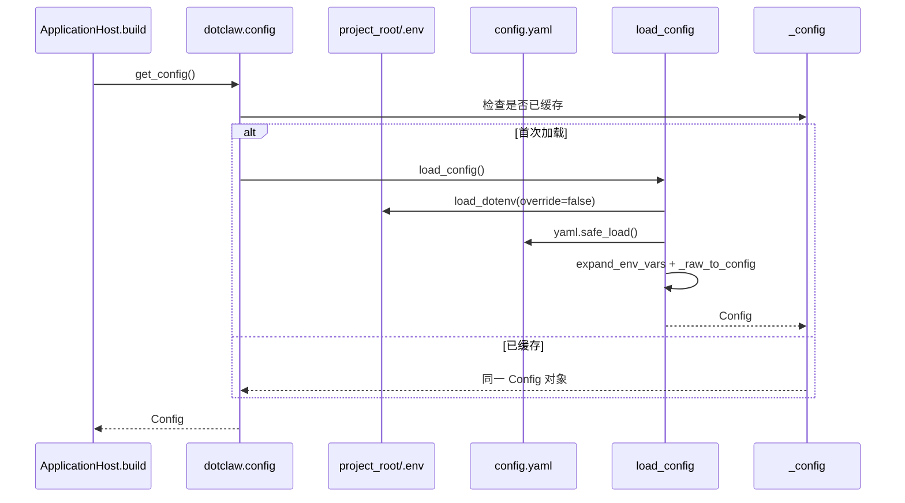

**结论：**

- 主配置只在首次 `get_config()` 时加载。
- `.env` 在 YAML 读取前进入进程环境。
- YAML 修改不会自动刷新。
- Host 持有与全局单例相同的 Config 对象。
- 加载异常发生在 Host 实例创建前，不能按可选组件策略降级。

### 5.2 环境变量替换

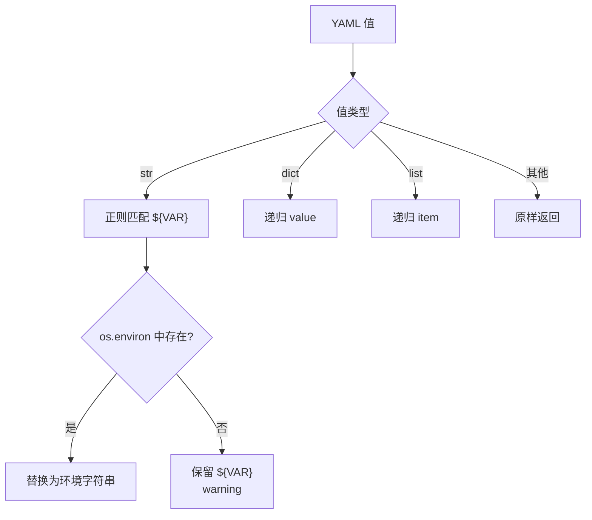

**结论：**

- 环境展开是递归字符串替换，不是类型化覆盖。
- API Key、URL 和 Header 是适合的使用场景。
- float/int/bool 字段完全由环境变量提供时可能得到字符串。
- 未解析 Secret 会继续进入 Config 对象。
- 当前没有“某变量必须存在”的声明方式。

### 5.3 缺失、空文件与错误 YAML

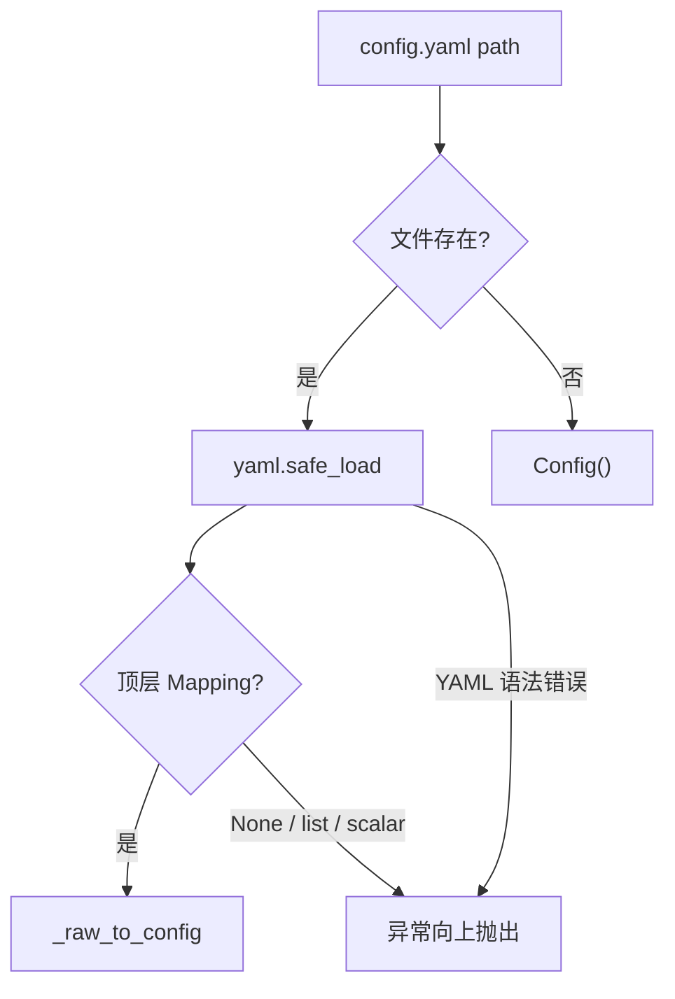

**结论：**

- “文件不存在”会静默使用全部代码默认。
- “文件存在但为空”不会等价于缺失文件，而会在转换时失败。
- 顶层非 Mapping 同样后置失败。
- 主配置没有统一 ConfigError 类型。
- 默认启动与配置损坏的可观测语义不一致。

### 5.4 两套 RouterConfig 的构造

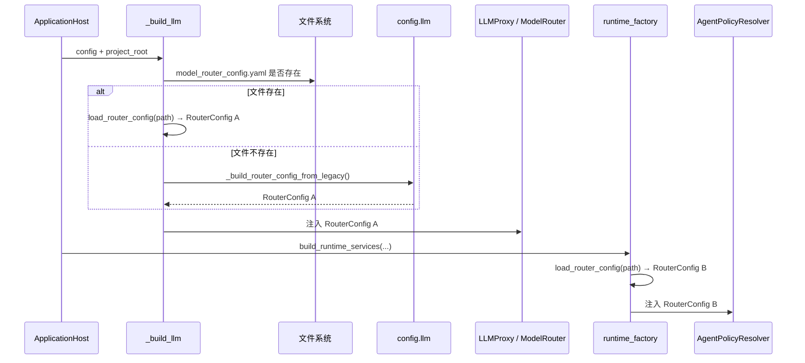

**结论：**

- Router 文件存在时，A 与 B 是对同一文件的两次独立解析。
- Router 文件缺失时，A 是 Legacy 转换结果，B 是空 RouterConfig。
- Router 文件为空时，两条路径都得到空 RouterConfig，不自动回退 Legacy。
- LLMProxy 使用 A 做实际模型选路；AgentPolicyResolver 使用 B 提供模型预算、Tokenizer 和 Compaction 配置。
- 该分裂的根因与影响集中见 C2。

### 5.5 Router Provider、Model 与 Purpose 构建

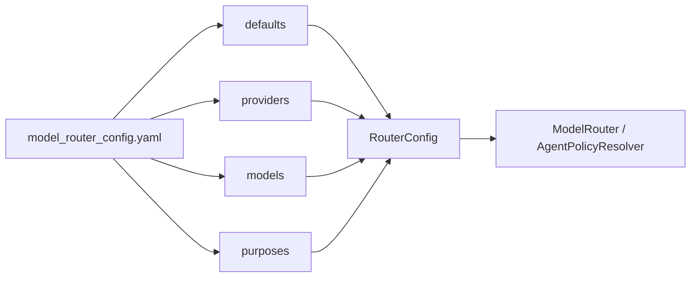

**结论：**

- Provider 和 Model 引用关系没有在 Loader 中交叉校验。
- Purpose 优先级只在 ModelRouter.select() 时过滤不存在或 disabled 模型。
- defaults.model 不存在时，Router 仍可构造，错误延迟到 Client 获取。
- Reasoning 是 Model 级配置。
- Context window 和 Tokenizer 由 Runtime 策略冻结使用。

### 5.6 Tool 配置投影

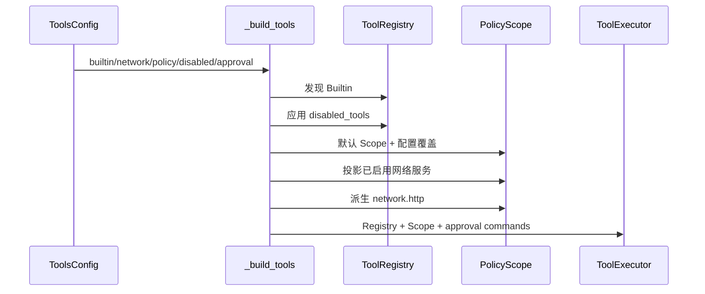

**结论：**

- disabled_tools 在 Builtin 注册后、MCP 注册前执行。
- Network Service 同时控制服务允许表和默认 network.http。
- 显式 policy.rules.network.http 优先于自动派生。
- 空 denied_paths/allowed_mcp_servers 不覆盖设计默认值。
- skill_enabled 和 exec_timeout 不进入该 Builder。

### 5.7 Skills、Memory 与 MCP 构建

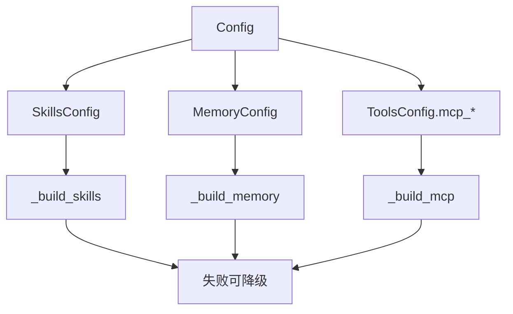

**结论：**

- 配置解析发生在降级边界之前；解析错误仍可能阻断 Host。
- 组件构建期错误才由 `_init_sync/_init_async` 降级。
- SkillsConfig 三个字段均进入 Scanner。
- MemoryConfig 只投影部分字段。
- MCP 只有开关启用且 Server 列表非空才创建 Provider。

### 5.8 Session 路径进入两套消费者

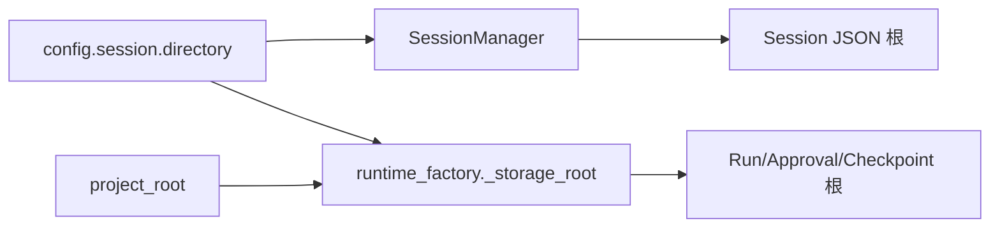

**结论：**

- SessionManager 内部再次推导项目根并 resolve。
- Runtime Factory 显式接收 project_root 后解析同一目录。
- 当前默认相对路径最终趋于一致。
- 两套实现没有共享同一个已解析 Path 对象。
- 自定义/安装布局下仍存在漂移风险。

### 5.9 Run 策略合并

```mermaid
sequenceDiagram
    participant Request as RunRequest
    participant Resolver as AgentPolicyResolver
    participant Identity as AgentIdentity
    participant Config as Config
    participant RouterB as RouterConfig B
    participant LLM as LLMProxy<br/>RouterConfig A
    participant Tools as ToolRegistry
    participant Snapshot as AgentPolicySnapshot

    Request->>Resolver: agent_id
    Resolver->>Identity: 解析 Agent
    Resolver->>Config: 默认模型、Prompt、预算回退
    Resolver->>RouterB: context_window / tokenizer / compaction model
    Resolver->>Tools: snapshot definitions
    Resolver->>Resolver: Identity 覆盖 + Tool 过滤
    Resolver-->>Snapshot: 不可变 Run 策略
    Snapshot-.model_id 用于调用.->LLM
```

**结论：**

- Config 不是每次 Run 的最终值。
- Identity model/prompt 优先于全局默认。
- Tool 白名单来自 Identity。
- AgentPolicyResolver 读取的是 Runtime Factory 独立加载的 RouterConfig B。
- LLMProxy 内部实际选路使用 RouterConfig A；当前两者没有共同的有效配置对象。
- Policy Snapshot 固化后不受后续 Config 对象修改影响。

### 5.10 配置修改后的行为

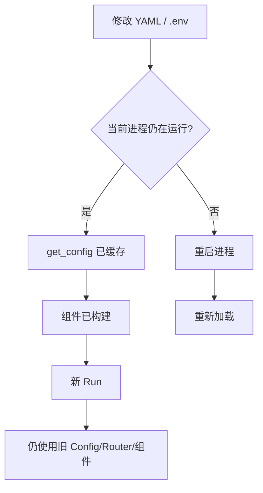

**结论：**

- 当前没有配置热更新。
- 修改 Config 对象本身也不会重建 LLM Router、Tool Scope 或 Memory。
- 新 Run 只重新解析 Identity 和 Tool Definition 快照，不重新加载全局 YAML。
- Agent Identity 文件由 Registry 启动时加载，也不是每 Run 重读。
- 配置变更的唯一完整生效路径是重启应用。

---

## 6. 对外接口与数据契约

### 6.1 Config 包公共 API

`dotclaw.config` 当前导出：

```text
Config
LLMConfig / LLMClientConfig
AgentConfig
ToolsConfig
SkillsConfig
MemoryConfig
SessionConfig
SchedulerConfig
DebugConfig
load_config / get_config / _find_project_root

ProviderConfig / ProviderRetryConfig
ModelConfig
PurposePriority / PurposeConfig
DefaultsConfig / RouterConfig
load_router_config
_build_router_config_from_legacy
```

未通过包级 `__all__` 导出但存在于 settings.py：

```text
ToolPolicyConfig
NetworkServiceConfig / NetworkToolsConfig
McpGlobalConfig / McpServerConfig
JournalConfig
ModelReasoningConfig
```

消费者因此经常直接导入 `dotclaw.config.settings`。

### 6.2 主配置加载契约

```python
load_config(path: str | Path = "config.yaml") -> Config
get_config() -> Config
```

保证：

- 相对路径基于推导出的项目根；
- 缺失文件返回 Config 默认对象；
- `.env` 不覆盖系统环境；
- 支持 `${VAR}`；
- Tool 旧名迁移。

不保证：

- 空文件正常回退；
- 顶层类型校验；
- 未知字段告警；
- 运行时 Reload；
- Config 深度不可变。

### 6.3 Router 配置加载契约

```python
load_router_config(path: str | Path | None = None) -> RouterConfig
```

- path=None：项目根 `model_router_config.yaml`；
- 相对 path：基于项目根；
- 文件缺失/空数据：空 RouterConfig；
- Reasoning 非法：ValueError；
- 其他类型错误可能在 `.get()` 或迭代时暴露。

`_build_llm()` 决定是否调用 Legacy Builder，不由 Loader 自动决定。

### 6.4 环境变量契约

支持形式：

```yaml
api_key: ${QWEN_API_KEY}
headers:
  Authorization: Bearer ${MCP_API_KEY}
```

当前没有：

```text
${VAR:-default}
${VAR:?required}
类型注解
Secret 标记
脱敏显示
```

未定义变量保持字面占位符。

### 6.5 项目根契约

Config 假定：

```text
Path(dotclaw.__file__).parent.parent.parent
```

或等价的包目录向上两级是项目根。

该根用于：

- config.yaml；
- model_router_config.yaml；
- .env；
- Skills；
- Memory；
- Runtime Session storage；
- Agent Identity 默认路径。

但部分消费者自行重复推导或使用当前工作目录。

### 6.6 `config.yaml` 当前顶层契约

```yaml
llm:
agent:
tools:
skills:
memory:
session:
scheduler:
debug:
journal:
```

未知顶层键会被忽略。

缺失某节时使用代码默认对象。

### 6.7 `model_router_config.yaml` 当前顶层契约

```yaml
defaults:
providers:
models:
purposes:
```

Loader 没有显式验证四节必须为 Mapping。

Router 内部关系由 ModelRouter 运行时解释。

### 6.8 Agent Identity 相邻契约

```yaml
agent_id:
agent_name:
model:
workspace:
allowed_tools:
policy_rules:
max_loop_steps:
system_prompt_template:
description:
tags:
capabilities:
input_modes:
output_modes:
context_slot_ids:
```

该文件不进入 Config 单例，由 AgentRegistry 独立加载。

### 6.9 主 Config 字段消费矩阵

| 字段 | 解析 | Builder/消费者 | 当前状态 |
|---|---:|---|---|
| `llm.default_model` | 是 | AgentPolicyResolver、CLI、Legacy Builder | **有效** |
| `llm.clients` | 是 | 仅 Router 文件缺失时 | **条件有效** |
| `llm.fallbacks` | 是 | Legacy Builder 未投影 | **未消费** |
| `llm.retry.*` | 是 | 仅 Legacy Builder | **条件有效** |
| `llm.stream` | 是 | Runtime Adapter 固定 true | **未消费** |
| `agent.system_prompt` | 是 | AgentPolicyResolver | **有效** |
| `agent.max_context_tokens` | 是 | Budget fallback | **有效** |
| `agent.keep_recent_messages` | 是 | 当前 Context 无消费者 | **未消费** |
| `agent.truncated_continue` | **未读取 YAML** | 当前无主链消费者 | **配置失效** |
| `agent.rules` | 是 | 未进入 Policy Snapshot | **未消费** |
| `tools.builtin_enabled` | 是 | `_build_tools` | **有效** |
| `tools.mcp_enabled` | 是 | `_build_mcp` | **有效** |
| `tools.skill_enabled` | 是 | 无消费者 | **未消费** |
| `tools.approval_commands` | 是+迁移 | ToolExecutor | **有效** |
| `tools.disabled_tools` | 是+迁移 | Builtin 注册后应用 | **部分有效** |
| `tools.exec_timeout` | 是 | Builder 未传递 | **未消费** |
| `tools.network.*.enabled` | 严格 bool | Tool Scope | **有效** |
| `tools.policy.rules` | 局部校验 | Policy Scope | **有效** |
| `tools.policy.denied_paths` | 是 | 非空时覆盖默认 | **条件有效** |
| `tools.policy.allowed_mcp_servers` | 是 | 非空时覆盖默认 | **条件有效** |
| `tools.mcp_global` | 是 | MCP Client | **有效** |
| `tools.mcp_servers` | 结构校验 | MCP Provider | **有效** |
| `skills.directory/enabled/skip_prefix` | 是 | Skill Builder | **有效** |
| `session.directory` | 是 | SessionManager/Runtime Repo | **有效** |
| `scheduler.enabled` | 是 | Host 未构造 Scheduler | **未消费** |
| `debug.level` | 是 | CLI 在 Host 就绪后设置 | **部分有效** |
| `debug.log_file` | 是 | main.py 使用硬编码路径 | **未消费** |
| `journal.trace_dir/snapshot_dir` | 是 | Runtime 未注入 JournalConfig | **未消费于主链** |
| `journal.console/trace/snapshot` | 是 | Runtime 未注入 | **未消费于主链** |
| `journal.history/state` | **未读取 YAML** | Runtime 未注入 | **配置失效** |

### 6.10 MemoryConfig 字段消费矩阵

| 字段组 | 当前状态 |
|---|---|
| `workspace`、`db_path` | 有效 |
| `chunk_max_tokens`、`chunk_overlap_tokens` | 有效 |
| `embedding_dimensions` | 有效 |
| `vector_weight`、`keyword_weight` | 有效 |
| `sync_on_search` | 已传递，但 Manager 当前不按该字段自动 Sync |
| `max_results`、`min_score` | 已传递，但公开 search 默认参数形成另一权威 |
| `long_term_file` | 未驱动 Manager/DeepDream 实际路径 |
| `embedding_provider/model/api_base/api_key` | 未投影到生产 Embedding 路径 |
| `flush_threshold/flush_max_messages` | 已废弃且无主链消费 |
| `dream_enabled/dream_schedule` | Host/调度器未消费 |
| `temporal_decay_half_life_days` | Builder 未传递 |

### 6.11 RouterConfig 字段消费矩阵

| 字段 | LLMProxy / ModelRouter | AgentPolicyResolver | 当前状态 |
|---|---|---|---|
| `defaults.model` | 作为无 Purpose 候选时回退 | 不直接作为 Identity 默认 | **有效，但两实例可能分裂** |
| `defaults.provider` | 当前 Router 未直接使用 | 不使用 | **未消费** |
| `defaults.parameters` | LLMProxy 未使用 | 不使用 | **未消费** |
| `defaults.fallback_enabled` | 未使用 | 不使用 | **未消费** |
| `providers.api_key/base_url` | 有效 | 不使用 | **有效** |
| `providers.rate_limit` | 有效 | 不使用 | **有效** |
| `providers.retry` | 有效 | 不使用 | **有效** |
| `providers.circuit_breaker` | Builder 有消费者，但 Loader 未投影 YAML | 不使用 | **配置失效** |
| `models.provider/model_id` | 有效 | 按模型名读取预算元数据 | **有效** |
| `models.context_window/tokenizer_encoding` | 不参与远端调用 | 提供 Run Budget | **只在 RouterConfig B 有效** |
| `models.capabilities` | 当前不参与 Purpose 校验 | 不使用 | **未消费** |
| `models.status` | 过滤 disabled 模型 | 不直接判断 | **有效** |
| `models.reasoning` | Provider 输出解析使用 | 不使用 | **有效** |
| `purposes.description` | 不使用 | 不使用 | **未消费** |
| `purposes.priority` | 核心路由顺序 | 用于选择 Compaction Model | **有效，但依赖各自实例** |
| `PurposePriority.weight` | 仅作为旧字段读取别名 | 不进入对象 | **兼容读取** |

当前默认配置中，部分失效字段与代码默认值碰巧相同，例如 `agent.truncated_continue`、`tools.exec_timeout`、`debug.log_file` 和 Provider circuit breaker。默认运行结果一致不能证明这些字段已经形成有效配置链。

### 6.12 Tool Policy 空列表契约

当前 Builder 仅在列表非空时覆盖默认 Scope：

```python
if denied_paths:
    override

if allowed_mcp_servers:
    override
```

因此“字段未提供”和“显式配置 `[]`”在装配阶段不可区分。当前契约事实是：空列表不会清空默认安全约束；其设计问题与演进方向见 C12/E11。

### 6.13 当前仓库有效配置摘要

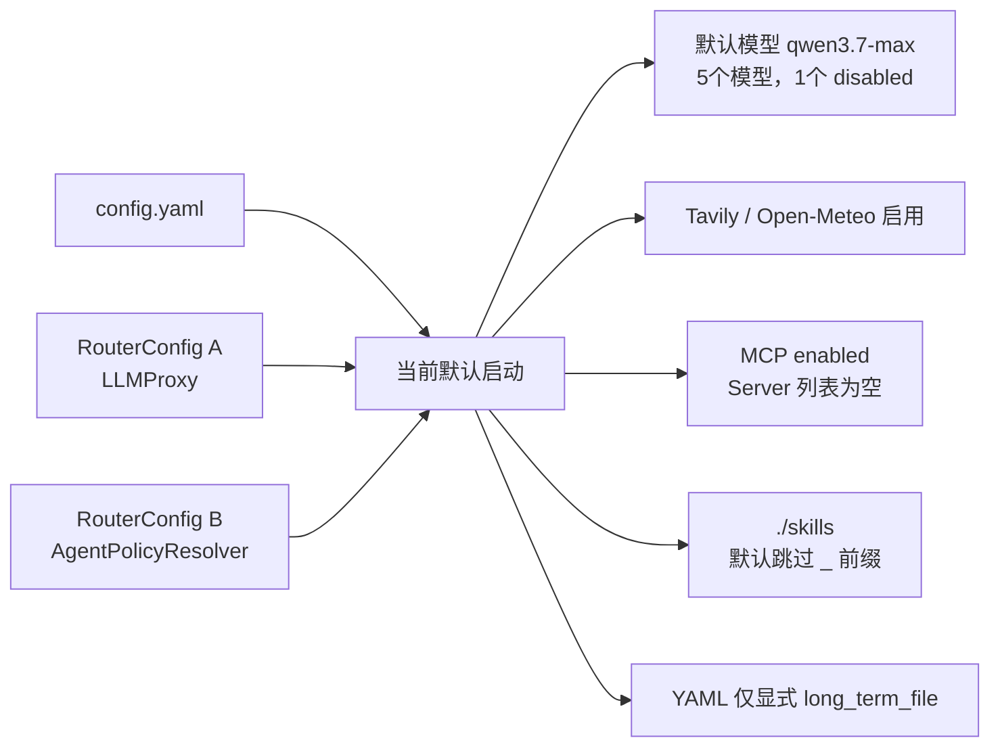

**结论：**

- 当前仓库存在 Router 文件，因此 A 与 B 都从同一文件独立解析，默认模型均为 qwen3.7-max。
- Network 两个固定服务显式启用。
- MCP 子系统开关启用，但没有 Server，因此不创建 Provider。
- Skills 使用 `./skills`，默认跳过 `_example`。
- Memory YAML 只显式配置 long_term_file，而该字段当前不控制 Manager/Dream 的实际路径。
- 当前默认状态没有暴露 Router 文件缺失时的 A/B 分裂，但该缺陷仍然存在。

### 6.14 错误与回退契约

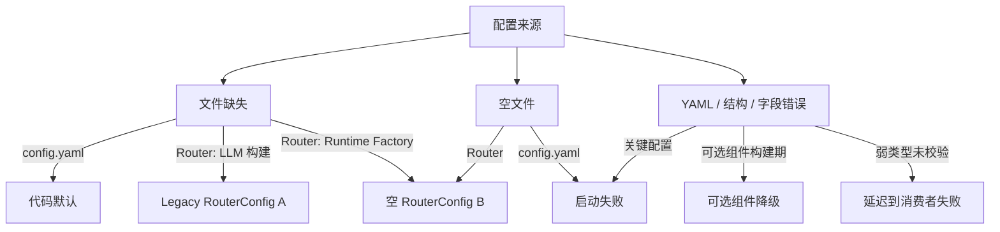

**结论：**

- 主配置缺失会回退 Config 默认；主配置空文件或顶层类型错误可能失败。
- Router 文件缺失时，LLM 构建和 Runtime 策略采用不同回退。
- Router 文件存在但空时返回空 RouterConfig，不自动进入 Legacy。
- 配置解析发生在组件降级边界之前；构建期可选组件错误才可能降级。
- 弱类型值可能延迟到具体消费者才暴露。

| 情况 | 当前行为 |
|---|---|
| config.yaml 不存在 | 返回 Config 默认 |
| config.yaml 空文件 | 后续 AttributeError 风险 |
| config.yaml YAML 语法错误 | 启动失败 |
| 未知主配置键 | 静默忽略 |
| 未定义 `${VAR}` | warning，保留占位符 |
| 非法 Tool Policy decision | warning，忽略该规则 |
| Network enabled 非 bool | warning，按 false |
| 重复 MCP Server name | ValueError |
| MCP transport 缺必要字段 | ValueError |
| reasoning mode/tag 非法 | ValueError |
| Router 文件不存在：LLM 构建 | Legacy LLM 转换 |
| Router 文件不存在：Runtime Factory | 空 RouterConfig |
| Router 文件存在但空 | 空 RouterConfig |
| Agent YAML 不存在/解析失败 | 默认 AgentIdentity |
| 可选组件消费配置失败 | Host 降级该组件 |
| 关键 LLM/Tool 配置失败 | Host 启动失败 |

### 6.15 Config 生命周期契约

```text
进程首次 get_config()
→ Config 单例

ApplicationHost.initialize()
→ 组件读取配置并构造

每个 Run
→ AgentPolicyResolver 使用既有 Config/Router/Identity

ApplicationHost.shutdown()
→ 不清 Config 单例
```

同进程重新 Build Host 仍会复用旧 Config。

### 6.16 当前实现已经保证的不变量

1. 系统环境变量不会被项目 `.env` 覆盖。
2. 主配置相对路径基于推导项目根。
3. 缺失 config.yaml 会回退 Dataclass 默认。
4. Tool 旧名在新列表字段中会迁移。
5. Tool Policy 只接受 allow/ask/deny。
6. Network enabled 非 bool 不会意外开启。
7. MCP Server name 不能为空且不能重复。
8. MCP transport 只允许 stdio/streamable_http。
9. tags Reasoning 标签必须非空且起止不同。
10. Router 文件存在时优先于 Legacy LLM 配置。
11. Skills 目录相对项目根解析。
12. Memory 路径 Helper 相对项目根解析。
13. Agent Prompt/Model 可覆盖全局默认。
14. Run 会冻结最终 Policy Snapshot。
15. 全局 Config 只懒加载一次。
16. 未知旧 `tools.web_search` 不会重新启用任意网络能力。

### 6.17 当前未保证的跨模块边界

当前配置系统尚不能保证：

1. Config、RouterConfig 与 AgentIdentity 形成一个带来源、版本和 Hash 的有效配置快照。
2. LLMProxy 与 AgentPolicyResolver 共享同一个有效 RouterConfig。
3. 所有相对路径由同一个已解析 `ProjectPaths` 对象提供。
4. Config Reload 能原子重建组件，并且只影响后续 Run。
5. 可选组件降级、未消费字段和实际生效值可通过统一诊断接口查看。
6. Config 层对 Secret 提供统一类型、repr 脱敏和错误脱敏；当前只能确认其以普通字符串保存，因此存在被消费者误输出的风险。
7. 当前基于源码目录推导项目根的规则已经通过 Installed Wheel 运行场景验证。

## 7. 常见修改入口

| 修改目标 | 首要入口 | 可能涉及 | 必须保持的不变量 |
|---|---|---|---|
| 新增主配置顶层节 | `Config` + `_raw_to_config` | config.yaml、Bootstrap | 声明、解析、消费三处同时更新 |
| 新增字段 | 对应 Dataclass | Loader、Builder、测试 | 不把“已声明”误写成“已生效” |
| 增加强类型校验 | `load_config` / `_raw_to_config` | 错误类型、兼容 | 配置错误必须可定位 |
| 修改项目根规则 | `_find_project_root` | Agent、Session、Bootstrap | 统一所有相对路径 |
| 支持显式配置路径 | `load_config` / Host.build | CLI、ENV | 不破坏默认项目根 |
| 修改 `.env` 优先级 | `_load_project_env` | 部署、测试 | 系统环境优先级明确 |
| 增加 required env | `expand_env_vars` 上层 Schema | Secret、错误 | 不打印 Secret 值 |
| 增加类型化 ENV | Config Schema | int/bool/float | 替换后再校验 |
| 处理空 YAML | `load_config` | tests/config | 缺失和空文件语义明确 |
| 拒绝未知键 | Config Schema | 兼容迁移 | 提供明确弃用周期 |
| 增加 Config Version | config.yaml | Migration | 迁移可重复、可审计 |
| 修改 Tool 旧名映射 | `_BUILTIN_NAME_MIGRATION` | Tool Registry | 新旧冲突规则稳定 |
| 修改 Policy 决策 | `_parse_tool_policy` | PolicyEngine | 非法值 fail-closed |
| 支持空 allowlist deny-all | ToolPolicyConfig + `_build_tools` | MCP Policy | 区分未提供与显式空 |
| 修改 Network 开关 | `_parse_network_tools` | `_build_tools` | 只接受真实 bool |
| 新增网络服务 | NetworkToolsConfig | KNOWN_NETWORK_HOSTS、Tool | 配置只决定启用，不暴露任意 URL |
| 修改 MCP Global | McpGlobalConfig | Client、Tests | Server override 优先 |
| 修改 MCP Server Schema | McpServerConfig + parser | Transport、Security | name 唯一、必要字段完整 |
| 修改 Skills 配置 | SkillsConfig | `_build_skills` | 相对路径基于项目根 |
| 修改 Memory 路径 | MemoryConfig | Manager、Dream、Builtin Tool | 单一路径权威 |
| 修改 Memory 检索参数 | MemoryConfig | Manager.search | 构造默认与方法默认统一 |
| 修改 Dream 调度 | MemoryConfig/SchedulerConfig | Host、Scheduler | 开关与 schedule 真正消费 |
| 修改 Session 根 | SessionConfig | SessionManager、RuntimeFactory | 两套消费者使用同一 Path |
| 修改 Debug 日志 | DebugConfig | main.py logging 初始化 | 启动日志也受配置控制 |
| 修改 Journal 配置 | JournalConfig | Runtime Event Repository | 不混用旧 Journal 和 RunEvent |
| 修改 Router Defaults | DefaultsConfig | ModelRouter、Proxy | defaults.model 必须存在 |
| 修改 Provider 配置 | ProviderConfig | `_build_llm` | circuit breaker 必须投影 |
| 修改 Model 配置 | ModelConfig | Router、Policy Resolver | provider 引用存在 |
| 修改 Purpose | PurposeConfig | ModelRouter | model 引用和 capabilities 匹配 |
| 修改 Reasoning | `_parse_reasoning_config` | ReasoningPolicy、Provider | mode 与标签契约稳定 |
| 修改 Legacy 转换 | `_build_router_config_from_legacy` | config.yaml llm | 与 Router 能力差异明确 |
| 修改 Agent 默认 Prompt | AgentConfig | AgentPolicyResolver | Identity 非空时优先 |
| 修改 Agent 配置格式 | `load_agent_config` | AgentRegistry、Runtime | 失败不能静默隐藏关键错误 |
| 增加 Config Reload | 新 ConfigService | Host、Router、Registry | 已有 Run Snapshot 不变 |
| 增加 `/config status` | CLI + ConfigSnapshot | Secret 脱敏 | 展示实际生效值与来源 |
| 排查配置不生效 | Loader→Builder→Consumer | Wiki 字段矩阵 | 分清解析、传递、消费 |
| 排查模型不生效 | Router 文件存在性→Purpose→Identity | Router、CLI | 检查完整模型名 |
| 排查 Tool 不生效 | Config→Registry 顺序→Policy | MCP/Builtin | 注意 disabled_tools 时机 |
| 排查路径错误 | project_root→消费者解析 | CWD、安装布局 | 输出规范化路径 |
| 排查环境变量 | `.env`→os.environ→placeholder | warning、类型 | 不回显 Secret |
| 增加 Config 测试 | `tests/config/` | 模块集成测试 | 覆盖字段消费而非仅解析 |

---

## 8. 设计取舍、痛点和演进方向

本节区分当前实现事实、设计取舍和未来方案。字段存在、YAML 存在或默认运行结果正确，都不能单独证明配置契约已经闭合。

### 8.1 当前架构承诺

当前 master 可以确认：

1. `config.yaml` 是应用级主配置。
2. `model_router_config.yaml` 存在时整体接管 LLM Router 构建。
3. Agent Identity YAML 是独立配置域。
4. 系统环境变量优先于 `.env`。
5. `.env` 只在 `load_config()` 中自动加载。
6. `${VAR}` 只做递归字符串替换。
7. `get_config()` 是进程级懒加载单例。
8. 主配置缺失时回退全部 Dataclass 默认。
9. Tool 旧规范名会迁移。
10. Network enabled 只接受真实 bool。
11. MCP 与 Reasoning 有局部结构校验。
12. ApplicationHost 是 Config 的主要消费组合根。
13. 每个 Run 最终策略由 Config、RouterConfig 与 AgentIdentity 合并。
14. 当前 Router 文件定义 4 个 Provider、5 个 Model 和 3 个 Purpose。
15. SchedulerConfig 当前未进入 Host。
16. Config 中存在多项未消费或解析遗漏字段。

### 8.2 核心设计取舍

#### 8.2.1 Dataclass + 手写 Parser

**问题与选择：**项目需要轻量、直观且易学习的配置对象。

**未选择：**统一 Pydantic Settings 或 JSON Schema。

**收益：**依赖少，字段与代码映射直接。

**代价与边界：**校验分散，新增字段容易只改 Dataclass、不改 Parser 或消费者。

#### 8.2.2 主配置与 Router 配置分离

**问题与选择：**LLM Router 结构比应用配置更复杂且演进更快。

**未选择：**把所有 Provider/Model/Purpose 嵌入 config.yaml。

**收益：**Router 文件可独立维护，多供应商结构清晰。

**代价与边界：**默认模型、重试和 Provider 信息出现双重权威。

#### 8.2.3 Router 文件存在即整体启用

**问题与选择：**避免复杂逐字段合并。

**未选择：**Router YAML 覆盖 Legacy Config 的部分字段。

**收益：**选择逻辑简单、确定。

**代价与边界：**空文件或不完整文件也阻断 Legacy 回退。

#### 8.2.4 环境变量占位符

**问题与选择：**Secret 不应直接写入 YAML。

**未选择：**通用环境变量到所有字段的自动覆盖。

**收益：**显式、可读，系统环境和 `.env` 优先级简单。

**代价与边界：**未定义变量保留字面值，数值与布尔字段缺少类型转换。

#### 8.2.5 项目根约定优于显式工作目录

**问题与选择：**dotClaw 当前定位为项目内本地 Harness。

**未选择：**用户目录、XDG 目录或 `DOTCLAW_CONFIG_HOME`。

**收益：**源码开发体验直接。

**代价与边界：**安装包、嵌入式调用和多项目共享配置不稳定。

#### 8.2.6 局部 Fail-Closed 校验

**问题与选择：**安全敏感配置需要避免宽松转换。

**未选择：**所有值统一 `bool()/str()/int()` 强制转换。

**收益：**Network 非 bool 不会意外开启；非法 Policy 不会宽松放行。

**代价与边界：**不同字段的失败语义不一致。

#### 8.2.7 全局 Config 单例

**问题与选择：**启动期配置不应在运行中漂移。

**未选择：**每次调用重新读文件。

**收益：**组件看到同一对象，性能和确定性好。

**代价与边界：**测试、嵌入和运行时 Reload 缺少正式入口。

#### 8.2.8 Agent Identity 独立配置

**问题与选择：**多 Agent 策略应独立于全局配置。

**未选择：**把所有 Agent 列表放进 config.yaml。

**收益：**角色文件可独立扩展，AgentRegistry 易扫描。

**代价与边界：**错误处理、项目根和环境展开重复实现。

#### 8.2.9 兼容迁移集中在加载期

**问题与选择：**旧 Tool 名不应污染运行期代码。

**未选择：**Registry 同时注册旧名和新名。

**收益：**运行时只看到规范名。

**代价与边界：**迁移机制仅覆盖 Tool 名，没有统一 Config Version。

#### 8.2.10 最终策略按 Run 冻结

**问题与选择：**运行过程中配置和工具集合不能漂移。

**未选择：**每轮 LLM 调用重新读取 YAML。

**收益：**Run 可恢复、可审计。

**代价与边界：**配置 Reload 必须明确只影响后续 Run。

### 8.3 已知痛点

#### C1. 三套配置域缺少统一配置快照

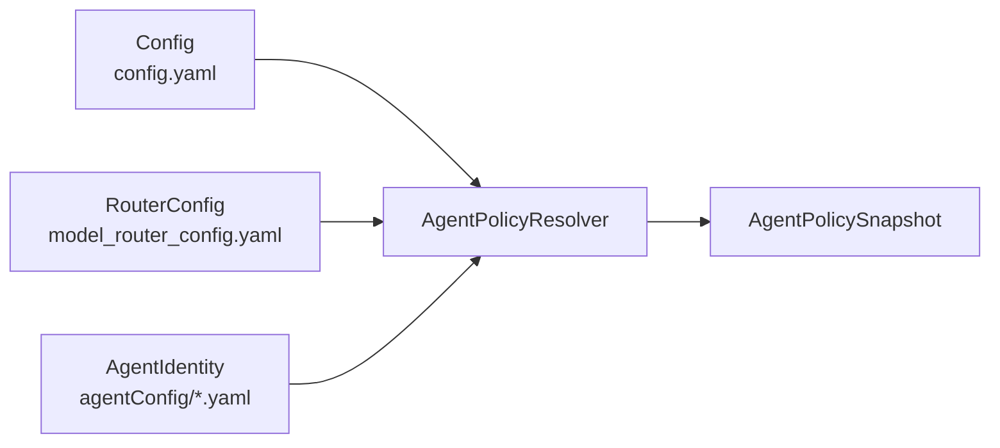

**结论：**最终行为由三套对象共同决定，但没有统一版本、来源、内容 Hash 或诊断快照。排查时必须跨文件和消费者人工追踪。

#### C2. 有效 RouterConfig 双实例与回退分裂

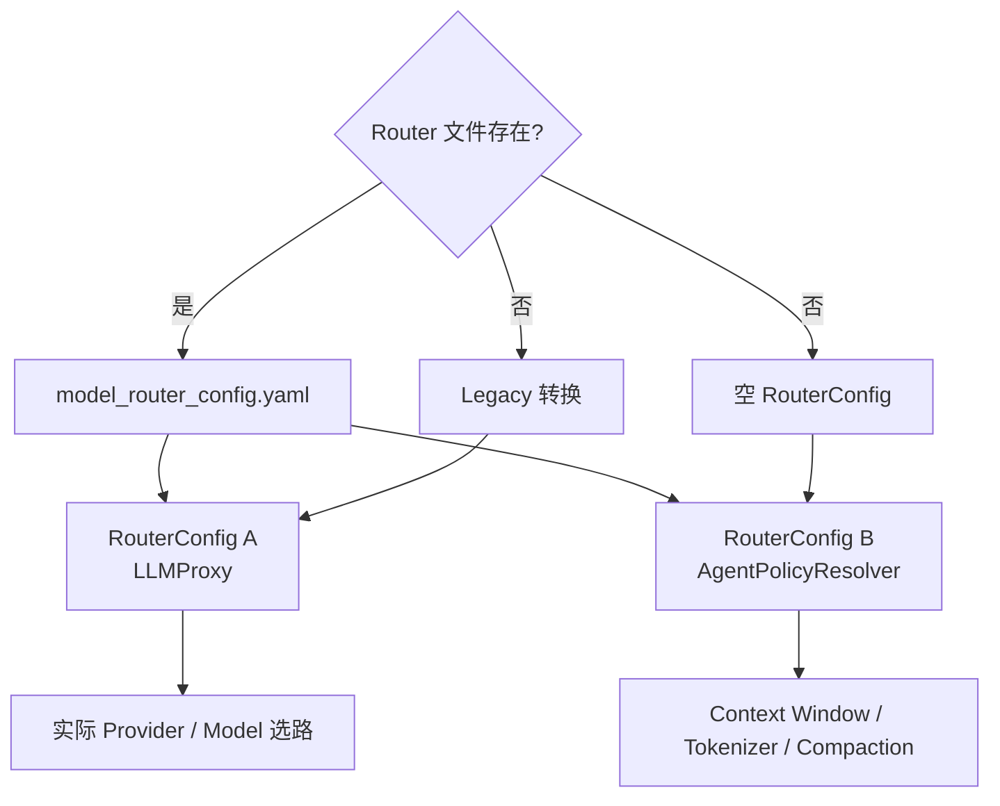

**结论：**LLM 构建和 Runtime Factory 分别创建 RouterConfig。文件存在时是两个独立实例；文件缺失时分别回退到 Legacy 和空配置，导致模型实际选路与运行预算策略可能基于不同事实。这比单纯的“双文件权威”更严重。

#### C3. 主配置缺失、空文件和损坏的行为不一致

```mermaid
flowchart TD
    Missing["文件缺失"] --> Defaults["Config 默认值"]
    Empty["空文件"] --> NoneRaw["raw=None"] --> Crash["转换异常"]
    Invalid["YAML 错误"] --> Crash
    WrongType["顶层 list/scalar"] --> Crash
```

**结论：**“没有配置”可启动，“存在空配置”反而失败，且没有统一 ConfigError 和字段路径。

#### C4. 手写 Parser 容易产生声明、解析、消费三层漂移

已确认：

```text
AgentConfig.truncated_continue
→ Dataclass 有
→ config.yaml 有
→ _raw_to_config 未读取

JournalConfig.history/state
→ Dataclass 有
→ Parser 未读取

ProviderConfig.circuit_breaker
→ Dataclass 有
→ YAML 有
→ load_router_config 未投影
```

默认值碰巧一致掩盖了配置失效。

#### C5. 大量字段被解析但没有运行消费者

典型包括：

```text
llm.fallbacks
llm.stream
agent.keep_recent_messages
agent.rules
tools.skill_enabled
tools.exec_timeout
scheduler.enabled
debug.log_file
Router defaults.parameters
Router defaults.fallback_enabled
Model capabilities
Purpose description
```

配置面显著大于真实能力面。

#### C6. Environment 替换不具备类型和必填语义

`${VAR}` 总是替换为字符串；未定义变量保留占位符。数值、布尔、列表字段可能延迟失败，Secret 缺失可能直到远端认证才暴露。

#### C7. Secret 只换存储位置，没有形成安全边界

API Key 和 Header 会作为普通字符串存入 Dataclass。Config 层当前没有统一提供：

```text
Secret 类型
repr 脱敏
错误脱敏
必填校验
轮换
来源审计
```

因此存在被下游消费者、调试代码或异常信息误输出的风险；本次审阅未把该风险表述为已经发生的泄漏事件。

#### C8. 项目根与相对路径解析分散

```mermaid
flowchart TD
    Package["dotclaw.__file__"]
    ConfigRoot["Config._find_project_root"]
    AgentRoot["AgentIdentity._find_project_root"]
    SessionRoot["SessionManager 内部推导"]
    CWD["当前工作目录"]
    ToolPath["Tool Policy workspace_root"]
    LogPath["日志 ./data/dotclaw.log"]

    Package --> ConfigRoot
    Package --> AgentRoot
    Package --> SessionRoot
    CWD --> ToolPath
    CWD --> LogPath
```

**结论：**Config、AgentIdentity、SessionManager 都独立推导项目根；Tool Policy 和日志路径又可能基于当前工作目录。没有统一 `ProjectPaths`，相同相对字符串的解释依赖具体消费者。

#### C9. Global Config 单例没有 Reload 和测试隔离契约

`get_config()` 缓存可变对象，没有 reset/reload。修改 YAML、`.env` 或 Config 对象后，已构建组件与 Router 不会同步更新。

#### C10. Router 关系缺少启动期一致性校验

未校验：

```text
defaults.model 存在
model.provider 存在
purpose.model 存在
purpose 所需能力与 model.capabilities 匹配
embedding purpose 只选择 embedding model
active 模型具有可用 Provider
```

错误可能在首次请求时才出现。

#### C11. Legacy LLM 转换本身不具备 Router 等价能力

即使只看 LLMProxy 使用的 RouterConfig A，Legacy 转换仍丢失 fallbacks、Reasoning、真实 context window、tokenizer 和 capabilities。相同 `config.yaml` 在 Router 文件存在或缺失时具有不同能力；这与 C2 的“双实例分裂”是两个独立问题。

#### C12. Tool 安全配置不能表达显式空值

`denied_paths=[]` 和 `allowed_mcp_servers=[]` 因 truthy 判断不覆盖默认 Scope。用户不能通过 YAML 明确清空默认值，空列表语义失真。

#### C13. Config 消费顺序影响工具行为

`disabled_tools` 在 MCP 注册前应用，因此不能禁用后续 MCP Tool；Network 规则在 Builder 中派生；声明式配置的最终含义依赖装配顺序。

#### C14. 调试与观测配置没有覆盖启动全过程

main.py 在读取 Config 前以 WARNING 和硬编码日志文件初始化。`debug.level` 只在 Host 就绪后生效，`debug.log_file` 不生效。配置加载和组件初始化阶段无法使用用户配置的日志级别。

#### C15. Scheduler、Memory 和 Journal 配置承诺没有闭环

- SchedulerConfig 没有 Host 消费者；
- Memory 多个 Embedding/Flush/Dream 字段未生效；
- JournalConfig 没有进入 Runtime 主链；
- 配置文件给出的功能承诺超过当前运行能力。

#### C16. 测试分散，缺少字段消费与配置快照验收

当前测试覆盖 Tool 名迁移、Network、MCP、Reasoning 和部分 Router，但没有独立 `tests/config`，也没有自动检查：

```text
Dataclass 字段是否被 Parser 读取
Parser 字段是否被 Builder 使用
YAML 示例是否真正改变行为
当前生效值与来源
```

### 8.4 演进方向

| 编号 | 解决的痛点 | 候选方向 | 影响与代价 |
|---|---|---|---|
| E1 | C1 | 建立 `EffectiveConfigSnapshot`，包含 Config/Router/Identity 版本、来源与 Hash | Config、Runtime、CLI |
| E2 | C2、C11 | 在 Bootstrap 只构建一次 EffectiveRouterConfig，并同时注入 LLMProxy 与 AgentPolicyResolver；显式定义 Router/Legacy 模式和空文件回退 | Config、LLM、Runtime |
| E3 | C3 | 使用统一 `ConfigLoadError(path, field, reason)`；缺失/空文件语义显式化 | Config、Bootstrap |
| E4 | C4 | 使用强类型 Schema 自动生成 Parser，增加“Dataclass 字段覆盖率”测试 | Config、Tests |
| E5 | C5、C15 | 删除死字段或标记 experimental；每个字段必须有消费入口和契约测试 | 全模块 |
| E6 | C6 | 环境展开后执行目标类型验证；支持 required/default 占位符语义 | Common、Config |
| E7 | C7 | 引入 SecretStr/SecretRef，repr 和错误统一脱敏，启动期检查必需 Secret | Config、LLM、MCP |
| E8 | C8 | 建立 `ProjectPaths`，统一 Config、Agent、Session、Memory、Tool 和日志路径 | Bootstrap、各模块 |
| E9 | C9 | 提供受控 `ConfigService.reload()`，原子替换后只重建后续 Run 所需组件 | Config、Host |
| E10 | C10 | 增加 RouterGraphValidator，校验 Provider/Model/Purpose/Capability 全关系 | Config、LLM |
| E11 | C12 | 使用 Optional/ListOverride 表达 absent 与 explicit empty | Config、Policy |
| E12 | C13 | 统一 Provider 注册后再应用 disabled_tools，输出最终 Tool 配置快照 | Bootstrap、Tool |
| E13 | C14 | 在 main() 参数解析后先加载最小 LoggingConfig，再构造 Host | CLI、Logging |
| E14 | C15 | 为 Scheduler、Memory、Journal 建立真实消费链，未实现前从公开 YAML 移除字段 | Bootstrap、模块 |
| E15 | C16 | 新建 `tests/config`，覆盖来源优先级、字段消费、示例 YAML 和错误快照 | Tests、CI |
| E16 | 多项 | 增加 `/config status` 与 `config validate`，只显示脱敏后的实际值、来源和未消费字段 | CLI、Config |

---

## 9. 源码索引

### 9.1 Config Core

```text
src/dotclaw/config/
├── __init__.py
└── settings.py
```

| 文件 | 主要内容 |
|---|---|
| `config/__init__.py` | 部分 Config/Router 类型与 Loader 导出 |
| `config/settings.py` | Dataclass、Parser、环境加载、兼容迁移、主配置单例 |

### 9.2 通用环境与 YAML

```text
src/dotclaw/common/utils.py
```

提供：

```text
expand_env_vars
safe_load_yaml
```

### 9.3 当前配置文件

```text
config.yaml
model_router_config.yaml
.env                     # 可选，不应提交 Secret
.dotclaw/agentConfig/*.yaml
```

### 9.4 Bootstrap 消费

```text
src/dotclaw/bootstrap/
├── _host_components.py
├── application_host.py
└── runtime_factory.py
```

| 文件 | Config 视角 |
|---|---|
| `_host_components.py` | LLM、Tools、Skills、Memory、MCP 字段投影 |
| `application_host.py` | get_config、Session、组件失败策略 |
| `runtime_factory.py` | Session storage、RouterConfig 和 Run Policy 装配 |

### 9.5 Runtime 与 Agent 合并

```text
src/dotclaw/runtime/adapters/agent_policy_resolver.py
src/dotclaw/agent/identity.py
src/dotclaw/orchestration/registry.py
```

相关职责：

```text
AgentIdentity 加载
Identity 覆盖全局默认
Model Budget
Tool 白名单
Run Policy Snapshot
```

### 9.6 LLM 消费

```text
src/dotclaw/llm/
├── model_router.py
├── proxy.py
├── reasoning.py
├── rate_limiter.py
├── circuit_breaker.py
└── providers/
```

Config 影响：

```text
Provider Client
Purpose Priority
Model Status
Retry
Rate Limit
Circuit Breaker
Reasoning
Context Window / Tokenizer
```

### 9.7 Tool、MCP、Skills 与 Memory 消费

```text
src/dotclaw/tools/
src/dotclaw/mcp/
src/dotclaw/skills/
src/dotclaw/memory/
```

具体行为分别见对应模块 Wiki。

### 9.8 Session、CLI 与 Journal

```text
src/dotclaw/session/session.py
src/dotclaw/main.py
src/dotclaw/journal/journal.py
```

| 文件 | Config 视角 |
|---|---|
| `session/session.py` | 独立解析 Session directory |
| `main.py` | debug.level 后置应用；日志文件硬编码 |
| `journal/journal.py` | 旧 JournalConfig 消费接口，当前未进入 Runtime 主装配 |

### 9.9 当前配置测试

已确认的现代测试包括：

```text
tests/llm/test_reasoning_config.py
tests/llm/test_model_router_contract.py
tests/tools/test_tools_config_migration.py
tests/tools/test_tools_network_contract.py
tests/tools/test_tools_mcp_policy.py
tests/tools/test_tools_mcp_provider.py
tests/tools/test_tools_schema_mcp.py
tests/runtime_v2/test_phase2_application_host.py
tests/runtime_v2/test_phase0_contracts.py
```

覆盖：

- Reasoning none/native/tags；
- Reasoning 非法配置；
- Tool 旧名迁移；
- 旧 Tool 嵌套配置不再读取；
- 旧 web_search 告警；
- Network bool 与安全投影；
- MCP Server/Policy/Schema；
- ApplicationHost 构建与降级；
- Model Router 基础契约。

### 9.10 当前测试缺口

默认 pytest testpaths 没有独立：

```text
tests/config
```

建议新增：

```text
tests/config/test_load_config.py
tests/config/test_environment_precedence.py
tests/config/test_empty_and_invalid_yaml.py
tests/config/test_field_consumption.py
tests/config/test_router_graph_validation.py
tests/config/test_legacy_router_equivalence.py
tests/config/test_project_paths.py
tests/config/test_secret_redaction.py
tests/config/test_reload.py
tests/config/test_example_files.py
```

最低验收范围：

```text
系统环境 > .env
未定义变量行为
环境变量类型转换
缺失/空/错误 YAML
未知字段
所有 Dataclass 字段解析覆盖
所有 Parser 字段 Builder 消费覆盖
Router Provider/Model/Purpose 引用
Router 文件存在/缺失/空文件
Legacy 转换差异
显式空安全列表
debug 日志启动期生效
Session/Memory/Tool 路径统一
Config reload 只影响新 Run
Secret 不出现在 repr/日志
仓库两份 YAML 通过 validate
```

