# Context 模块总体说明

> 适用代码：`aandbcct/dotClaw` 的 `master` 分支  
> 扫描基准：2026-07-28，包含多 Owner Context Plan、结构化 Slot、ContextVersion、精确 Owner 生命周期释放、定向刷新信号与 AgentRun 状态机分层重构
> 扫描提交：`31f30ae75d22f2b384e04a643894eaf9c0607323`
> 文档定位：自顶向下解释 Context 在系统中的位置、完整组件、核心类、数据来源、注入与版本边界，并记录当前设计取舍、真实痛点和演进方向。  
> 编写基准：《dotClaw Wiki 编写规范与验收准则 v1.1》  
> 上级导航：[dotClaw 开发者 Wiki](./README.md)

**快速导航**

| 需要回答的问题 | 阅读位置 |
|---|---|
| Context 为什么存在、与 Runtime/Session/Agent 如何分工 | 第 1～2 节 |
| Context 有哪些逻辑组件 | 第 3 节 |
| Plan、Slot、Owner、Provider 和 ContextVersion 分别是什么 | 第 4 节 |
| 一次 Context 如何构建、刷新、恢复和释放 | 第 5 节 |
| ContextBundle、Slot DTO 和持久化契约 | 第 6 节 |
| 修改某个上下文来源从哪里开始 | 第 7 节 |
| 当前设计为何如此、存在哪些问题、如何演进 | 第 8 节 |
| 具体源码在哪里 | 第 9 节 |

```text
RuntimeEngine
→ ContextPort.build(RunRequest, RunExecutionView)
→ ContextProvider 读取 Owner 数据
→ ContextPlanResolver 解析启用 Slot
→ ContextSlotManager 加载 Slot
→ ContextContribution[]
→ messages + tools + ContextMetadata
→ Runtime 持久化 ContextVersion
→ LLMPort
```

---

## 1. 模块定位与边界

Context 是 dotClaw 的**结构化模型输入组装层**。它位于 Runtime 与 Agent、Session、Memory、Skills、Tool Definitions、Agent Directory 等内容来源之间，根据当前 Run 的冻结输入和执行视图，解析一次有效的 Context Plan，加载有序 Slot，并物化为标准 `ContextBundle`。

Context 解决的核心问题不是“拼接一段 Prompt”，而是：

> 如何把属于不同生命周期和事实来源的模型输入，按 Owner、Slot、顺序、持久化方式和刷新边界组织成一次可审计、可恢复且可扩展的 LLM 输入。

### 1.1 核心职责

Context 当前承担七组职责：

1. **结构化来源建模**：用 `ContextOwner`、`ContextSlotDescriptor` 和封闭的 `ContextContributionKind` 描述输入来源。
2. **Plan 解析**：根据默认配置和精确 Owner 覆盖，决定本次启用哪些 Slot，并按声明顺序排列。
3. **Owner 数据隔离**：在 Provider 边界读取 Agent、Session、Run 和 Global 数据，再以只读快照交给 Slot。
4. **Slot 生命周期管理**：创建、缓存、刷新和释放 Slot 私有实例。
5. **输入物化**：将结构化贡献转换为有序 LLM messages、实际 Tool Definitions 和 Context metadata。
6. **快照与事实引用分离**：将稳定内容交给 Runtime 形成 `ContextVersion`，将动态 RunMessage 仅作为事实引用重放。
7. **恢复支持**：审批、delegation 或 Checkpoint 恢复时，以活动 ContextVersion 加当前 RunMessage 重新构造输入，不重新查询可变外部来源。

### 1.2 主要使用者

| 使用者 | 如何使用 Context |
|---|---|
| `RuntimeEngine` | 在每次业务 LLM 调用前调用 `ContextPort.build()` |
| `RuntimeEngine` | 在成功提交后请求刷新历史压缩 Slot，在 Run 终态释放 RUN 缓存 |
| `SessionInteractionService` | 删除 Session 时释放 SESSION 与相关 RUN 缓存 |
| `ApplicationHost` | 构造 ContextProvider，并在关闭时释放所有缓存 |
| Agent Identity | 通过 `context_slot_ids` 覆盖自身 AGENT Owner Slot 计划 |
| LLM Adapter | 消费 ContextBundle.messages 和 ContextBundle.tools |
| Runtime Repository | 保存由 Runtime 从 Context metadata 构造的 ContextVersion |

### 1.3 明确不负责的内容

Context 不负责：

1. 创建 AgentRun、驱动状态机或决定何时调用 LLM；
2. 计算最终 Context Window 是否超限或执行历史压缩；
3. 保存 Session Conversation、RunMessage、ContextVersion 或 Checkpoint；
4. 决定 Agent 可以使用哪些 Tool，Tool 定义来自冻结的 Runtime Policy；
5. 管理 Memory、Skills、Agent Registry 或知识库的长期生命周期；
6. 执行 Tool、审批、MCP 调用或模型 Provider 重试；
7. 将 reasoning、Channel 输出或 Journal 作为 Context 来源；
8. 提供可靠消息总线或跨进程刷新协议；
9. 自动区分可信系统指令与不可信检索内容；
10. 保证所有外部内容来源都已配置或一定非空。

### 1.4 与相邻模块的职责边界

| 相邻模块 | Context 负责 | 相邻模块负责 |
|---|---|---|
| Runtime | 构造 ContextBundle、暴露 Slot snapshots 与事实引用 | 决定构建时机、Token 预算、ContextVersion、Checkpoint 和恢复 |
| Agent | 读取冻结策略中的 system prompt、tools 和 Agent Slot 配置 | 定义 Identity、工具白名单、模型和 `context_slot_ids` |
| Session | 接收冻结 Conversation、历史摘要和 Session owner_key | 保存长期 Conversation、用户资料和已提交压缩摘要 |
| Memory | 通过最小 Port 读取检索结果并格式化为贡献 | 保存、索引、搜索和蒸馏长期记忆 |
| Skills | 读取技能描述摘要 | 扫描、解析和维护 Skill Registry |
| Tool | 接收经过 Agent Policy 筛选的 Tool Definitions | 注册 Handler、生成定义、执行和安全策略 |
| Agent / Agent Directory | 读取可委派 Agent 目录摘要 | 管理 AgentIdentity 与 AgentRegistry |
| Orchestration | 不管理 Identity 目录，只消费可委派目标 | 管理 Task、Broker、目标 Session 与子 Run 映射 |
| LLM | 提供标准 messages 和 tools | Provider 协议、流式输出、reasoning 和重试 |
| Bootstrap | 暴露构建辅助函数和依赖容器 | 选择具体依赖、创建 Provider、控制关闭顺序 |

---

## 2. 模块在项目中的位置

### 2.1 全局位置图

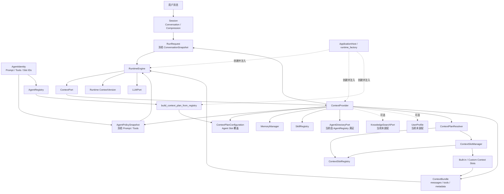

**结论：**

- Runtime 是 Context 构建的发起者，`ContextProvider` 是 Context 模块的对外协调者。
- Provider 不直接读取 SessionManager 或 AgentIdentity；它从 Runtime 传入的 `RunRequest`、`RunExecutionView.policy` 和 Plan Configuration 获取冻结数据。
- Session 与 AgentIdentity 是 Context 的上游事实来源，但在进入 Provider 前已经分别转换为 ConversationSnapshot、AgentPolicySnapshot 和 Plan Configuration。
- Memory、Skills、Agent Directory 以及可选 Knowledge/UserProfile 是 Provider 运行时直接读取的外部来源。
- Context 只返回 ContextBundle；ContextVersion 由 Runtime 创建和持久化。
- LLM 不直接读取 Memory 或 Session，模型输入统一通过 ContextPort。
- Bootstrap 负责把具体来源和 Plan 构建结果注入 Context；其中 Agent Plan 构建辅助函数目前仍直接依赖具体 AgentRegistry。

### 2.2 一次 Context 构建在请求链中的位置

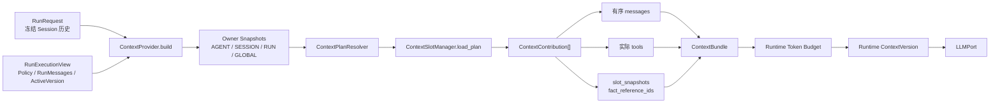

**结论：**

- Context 构建输入由 `RunRequest` 和只读 `RunExecutionView` 共同组成。
- Plan 决定启用和顺序，Slot 产出结构化贡献，Provider 负责最终物化。
- Token 预算位于 Context 构建之后，由 Runtime 根据实际 ContextBundle 执行。
- ContextVersion 不是 ContextProvider 返回值，而是 Runtime 对 snapshot 型贡献的持久化投影。

### 2.3 四类 Owner

```text
GLOBAL
→ 进程级共享信息，例如可委派 Agent 目录

AGENT
→ Identity 级稳定信息，例如 system prompt、tools、skills

SESSION
→ 会话级长期信息，例如用户资料、已提交历史压缩

RUN
→ 单次运行信息，例如冻结 Conversation、Memory/Knowledge 检索、RunMessage 引用
```

Owner 同时决定：

- `owner_key` 如何形成；
- Plan 精确覆盖的作用域；
- Slot 实例缓存键；
- 生命周期释放时机；
- 刷新信号的定向范围。

Owner 不表示信息可信级别，也不表示消息 role。

### 2.4 依赖方向

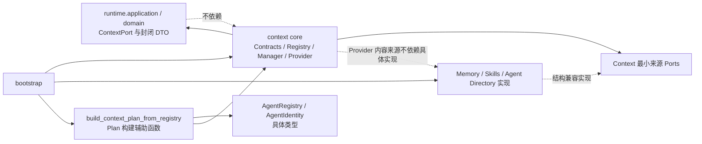

当前依赖结构需要分两部分理解：

1. **运行时内容来源已经基本倒置**
   - `ContextPort` 和 ContextVersion 领域 DTO 由 Runtime 定义；
   - ContextProvider 实现 ContextPort；
   - Memory、Knowledge、Skills 和 Agent Directory 通过 Context 自己定义的最小 Protocol 被读取；
   - Bootstrap 将具体对象注入 `ContextDependencies`。

2. **Agent Plan 构建仍存在具体依赖**
   - `build_context_plan_from_registry()` 位于 `context/plan_resolver.py`；
   - 它直接接收具体 `AgentRegistry`，并读取具体 `AgentIdentity.context_slot_ids`；
   - 因此不能笼统表述为“Context 核心完全不依赖具体 Agent 实现”。

更准确的边界是：

> Provider 的内容来源使用最小 Protocol；Agent Plan 的 Bootstrap 构建辅助函数尚未完成依赖倒置。

## 3. 组件总览

Context 不是单一 Provider 类，而是由契约、声明、配置、解析、生命周期、内容来源、物化和 Runtime 接入共同组成。

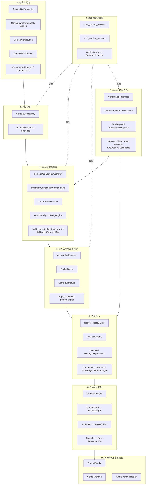

**结论：**

- `ContextProvider` 是模块对外协调者：读取 Owner 数据、调用 Resolver/Manager，并完成最终物化。
- `ContextPlanResolver` 只决定启用 Slot、Owner 绑定和全局顺序，不加载 Slot 内容。
- `ContextSlotManager` 只管理实例、失效、加载和释放，不直接读取 Session、Memory 或 Agent 配置。
- Slot 只产生封闭的 `ContextContribution`，不直接构造某个 LLM Provider 的协议消息。
- ContextVersion、Token 预算和恢复属于 Runtime 接入边界，不属于 Slot 或 Manager 的内部职责。
- Bootstrap 负责接入具体来源；Agent Plan 构建辅助函数当前直接读取 AgentRegistry，是一个尚未完全倒置的适配点。

### 3.1 组成部分与责任

| 层级 | 组成部分 | 稳定职责 | 主要入口 |
|---|---|---|---|
| 结构化契约 | Slot 描述与贡献 DTO | 说明来源、载荷、顺序、状态和持久化方式 | `contracts.py`、`runtime.domain.context` |
| Slot 注册 | Registry 与默认声明 | 保存唯一 descriptor 和 factory | `ContextSlotRegistry`、`_register_defaults` |
| Plan | 配置与解析 | 决定本次启用 Slot、Owner 绑定和顺序 | `ContextPlanResolver` |
| Owner 边界 | 外部依赖与快照 | 在 Provider 边界读取不同领域数据 | `ContextDependencies`、`_owner_data` |
| 生命周期 | 实例、缓存和刷新 | 创建、失效、加载、释放 Slot | `ContextSlotManager` |
| 信号 | 定向刷新 | 进程内暂存和分发刷新请求 | `ContextSignalBus` |
| 内置能力 | 十个默认 Slot | 将 Owner 数据转为封闭贡献 | `slots.py` |
| Provider | 物化 | 贡献转 messages、tools、metadata | `ContextProvider` |
| Runtime 接入 | 版本与恢复 | ContextVersion、事实引用与活动版本重放 | Runtime Engine + Domain DTO |
| 装配 | 组合根与关闭 | 构建 Provider、注入来源、释放作用域 | `defaults.py`、`runtime_factory.py` |

---

## 4. 各组件的类与职责

本节从逻辑组件进入核心类、协议、数据对象和重要实现细节。每个类或部分先说明职责、存在原因和调用链位置，再展开字段、行为和边界。

### 4.1 结构化契约与领域类型

#### 4.1.1 `ContextSlotDescriptor`

**职责与用途：**`ContextSlotDescriptor` 是一种 Slot 类型的静态声明。它说明该 Slot 属于哪个 Owner、会贡献什么类型的数据、是否进入 ContextVersion、如何缓存、如何刷新以及在最终输入中的顺序。

字段：

| 字段 | 含义 |
|---|---|
| `slot_id` | 全局唯一 Slot 标识 |
| `owner` | 数据唯一所有者类型 |
| `contribution_kind` | 封闭的贡献载荷类别 |
| `persistence_mode` | `SNAPSHOT` 或 `FACT_REFERENCE` |
| `cache_scope` | Slot 实例生命周期 |
| `refresh_policy` | 声明刷新策略 |
| `order` | 跨 Owner 的全局注入顺序 |

Descriptor 不保存内容，也不代表某次 Run 已启用该 Slot。

#### 4.1.2 `ContextOwnerSnapshot`

**职责与用途：**`ContextOwnerSnapshot` 是 Provider 在一次 Plan 解析前为某个精确 Owner 准备的只读数据容器。它隔离外部领域对象，避免 Slot 直接持有 Session、AgentRegistry 或 MemoryManager。

包含：

```text
owner_key
data: JSONMap
```

当前 owner_key：

```text
AGENT  → agent_id
SESSION→ session_id
RUN    → run_id
GLOBAL → "global"
```

这里的“Snapshot”表示本次构建读取到的只读视图，不等同于持久化 `ContextSlotSnapshot`。

#### 4.1.3 `ContextSlotBinding`

**职责与用途：**`ContextSlotBinding` 将静态 Descriptor 与本次具体 Owner 绑定。它是 Plan 中真正可执行的元素，Slot 只通过 Binding 读取 owner_key 和 owner_data。

```text
Descriptor
+ 精确 owner_key
+ 本次 owner_data
= ContextSlotBinding
```

Binding 是单次构建对象，不进入 Repository。

#### 4.1.4 `ContextContribution`

**职责与用途：**`ContextContribution` 是 Slot 对本次模型上下文的结构化输出。它避免 Slot 直接返回任意字符串或 Provider-specific message，使 Provider 可以按封闭 kind 统一物化。

字段：

| 字段 | 作用 |
|---|---|
| `kind` | 决定如何物化 |
| `status` | `INCLUDED / EMPTY / FAILED` |
| `content` | 封闭的内容 DTO |
| `error_code` | Slot 失败的安全错误类别 |

当前 `content` 联合类型：

```text
TextSlotContent
ToolDefinitionsSlotContent
ConversationMessagesSlotContent
RunMessageReferencesSlotContent
```

需要注意：`ContextContribution` 的默认 content 是 `TextSlotContent("")`。调用者若构造非文本 kind 却不显式传入匹配内容，类型语义会不一致；内置 Slot 当前都显式构造正确 DTO。

#### 4.1.5 `ContextSlot` Protocol

**职责与用途：**`ContextSlot` 是所有上下文来源的统一加载接口。它只接收 Binding，不拥有外部领域数据，也不负责 Plan、排序、持久化或最终消息物化。

协议方法：

```text
load(binding) -> ContextContribution
refresh(binding) -> None
should_refresh(binding, signal) -> bool
release() -> None
```

职责边界：

- `load()` 读取本次 Owner 快照；
- `refresh()` 失效 Slot 自己的私有缓存；
- `should_refresh()` 判断定向信号是否与该绑定相关；
- `release()` 释放该实例私有资源。

内置 Slot 当前几乎都是无状态实现，但协议允许未来 Slot 持有缓存、索引或连接。

#### 4.1.6 Runtime 领域类型

**职责与用途：**Context 的持久化边界使用 `runtime.domain.context` 中的封闭类型。这样 Runtime 可以保存和恢复 ContextVersion，而不需要依赖 Context 模块的具体类。

关键枚举：

| 类型 | 当前值 |
|---|---|
| `ContextOwner` | GLOBAL、AGENT、SESSION、RUN |
| `ContextContributionKind` | SYSTEM_CONTENT、TOOL_DEFINITIONS、HISTORY_COMPRESSIONS、CONVERSATION_MESSAGES、RUN_MESSAGE_REFERENCES |
| `ContextPersistenceMode` | SNAPSHOT、FACT_REFERENCE |
| `ContextSlotStatus` | INCLUDED、EMPTY、FAILED |
| `ContextRefreshReason` | OWNER_DATA_CHANGED、CONFIGURATION_CHANGED、EXTERNAL_SOURCE_CHANGED |

关键数据：

```text
ContextSlotSnapshot
ContextVersion
TextSlotContent
ToolDefinitionsSlotContent
ConversationMessagesSlotContent
RunMessageReferencesSlotContent
```

这些类型属于 Runtime Domain，因为它们参与 Run 事实、Checkpoint 恢复和持久化格式；Context 模块负责生产它们。

---

### 4.2 Slot 注册

#### 4.2.1 `ContextSlotRegistry`

**职责与用途：**`ContextSlotRegistry` 保存 Slot 类型的 Descriptor 和构造器。它解决“Plan 按 slot_id 引用 Slot，而具体实例需要按生命周期延迟创建”的问题。

内部结构：

```text
dict[
    slot_id,
    (ContextSlotDescriptor, factory)
]
```

行为：

| 方法 | 作用 |
|---|---|
| `register()` | 注册唯一 Descriptor 和 factory |
| `descriptor()` | 根据 slot_id 查询静态声明 |
| `create()` | 调用 factory 创建 Slot 实例 |

Registry 明确不负责：

- 读取 Slot 内容；
- 决定本次是否启用；
- 保存 Slot 实例；
- 处理刷新信号；
- 访问 Owner 数据。

重复 `slot_id` 会在启动装配阶段立即失败。

#### 4.2.2 默认注册 `_register_defaults`

**职责与用途：**`_register_defaults()` 是当前内置 Slot 的声明式组合点。它把 Slot 类与 Owner、kind、持久化模式、缓存范围和顺序绑定。

默认十个 Slot：

| 顺序 | slot_id | Owner | Contribution | Persistence | Cache |
|---:|---|---|---|---|---|
| 10 | `identity` | AGENT | SYSTEM_CONTENT | SNAPSHOT | AGENT |
| 20 | `tools` | AGENT | TOOL_DEFINITIONS | SNAPSHOT | AGENT |
| 30 | `skills` | AGENT | SYSTEM_CONTENT | SNAPSHOT | AGENT |
| 40 | `available_agents` | GLOBAL | SYSTEM_CONTENT | SNAPSHOT | NONE |
| 50 | `user_info` | SESSION | SYSTEM_CONTENT | SNAPSHOT | SESSION |
| 60 | `history_compressions` | SESSION | HISTORY_COMPRESSIONS | SNAPSHOT | SESSION |
| 70 | `conversation` | RUN | CONVERSATION_MESSAGES | SNAPSHOT | RUN |
| 80 | `memory` | RUN | SYSTEM_CONTENT | SNAPSHOT | RUN |
| 90 | `knowledge` | RUN | SYSTEM_CONTENT | SNAPSHOT | RUN |
| 100 | `run_messages` | RUN | RUN_MESSAGE_REFERENCES | FACT_REFERENCE | RUN |

所有默认 Descriptor 当前都声明 `ContextRefreshPolicy.SIGNAL`。

#### 4.2.3 注册与启用的区别

**职责与用途：**注册表示一种 Slot 类型可用，启用表示本次 Plan 真的包含该 Slot。两者由不同组件管理。

```text
Registry
→ “系统有哪些 Slot 类型”

Plan Configuration
→ “某个 Owner 本次启用哪些 Slot”

Plan Resolver
→ “将启用 ID 绑定为有序 ContextSlotBinding”
```

注册但未启用的 Slot 不应进入最终 Context。当前实现仍可能在 Plan 解析前读取其外部来源，详见第 8 节 R1。

---

### 4.3 Plan 配置与解析

#### 4.3.1 `ContextPlanConfigurationPort`

**职责与用途：**`ContextPlanConfigurationPort` 抽象“某类 Owner、某个精确 owner_key 启用哪些 Slot”。它把 Slot 选择策略从 Resolver 中分离。

接口：

```python
enabled_slot_ids(owner, owner_key) -> tuple[str, ...]
```

它不返回顺序权威；最终顺序仍以 Registry Descriptor 的 `order` 为准。

#### 4.3.2 `ContextOwnerPlanConfiguration`

**职责与用途：**`ContextOwnerPlanConfiguration` 表示一个 Owner 类型的默认启用列表，用于没有精确 owner_key 覆盖时回退。

例如：

```text
AGENT  → identity, tools, skills
GLOBAL → available_agents
SESSION→ user_info, history_compressions
RUN    → conversation, memory, knowledge, run_messages
```

#### 4.3.3 `InMemoryContextPlanConfiguration`

**职责与用途：**`InMemoryContextPlanConfiguration` 是当前 Plan 配置实现。它支持：

```text
精确 Owner Key 覆盖
→ 若存在，返回覆盖列表

否则
→ 返回该 Owner 类型的默认列表
```

数据结构：

```text
default_configurations:
    tuple[ContextOwnerPlanConfiguration, ...]

owner_configurations:
    Mapping[
        ContextOwner,
        Mapping[owner_key, tuple[slot_id, ...]]
    ]
```

它是内存适配器，不读取 YAML、数据库或远程配置。

#### 4.3.4 `ContextPlanResolver`

**职责与用途：**`ContextPlanResolver` 将四类 Owner Snapshot 和 Plan Configuration 转换为一次有序的 `ContextPlan`。它只做解析、校验与排序，不加载任何 Slot 内容。

流程：

```text
遍历 owner_snapshots
→ 查询 enabled_slot_ids(owner, owner_key)
→ Registry.descriptor(slot_id)
→ 校验 descriptor.owner == owner
→ 构造 ContextSlotBinding
→ 按 descriptor.order 全局排序
```

重要不变量：

- 未注册 slot_id 会抛 `KeyError`；
- Slot Owner 与配置 Owner 不一致会抛 `ValueError`；
- 不按配置列表顺序注入，而按 Descriptor.order 排序；
- Resolver 不捕获配置错误，错误会使本次 Context 构建失败。

#### 4.3.5 `build_context_plan_from_registry`

**职责与用途：**该函数将 `AgentRegistry` 中显式声明 `context_slot_ids` 的 Identity 转换为 AGENT Owner 精确覆盖，同时保留其他 Owner 的默认配置。

当前语义：

```text
AgentIdentity.context_slot_ids is None
→ 使用默认 AGENT Plan：identity, tools, skills

AgentIdentity.context_slot_ids = (...)
→ 完整替换该 agent_id 的 AGENT Slot 列表
```

限制：

- 只为 `ContextOwner.AGENT` 生成覆盖；
- Identity 不能通过该字段覆盖 SESSION、RUN 或 GLOBAL Plan；
- 字段名虽然通用，实际语义是“Agent Owner Slot IDs”；
- 显式列表是替换，不是增量追加；
- 配置了其他 Owner 的 slot_id 会在 Resolver 校验时失败。

---

### 4.4 Owner 数据边界与外部来源

#### 4.4.1 `ContextDependencies`

**职责与用途：**`ContextDependencies` 是 ContextProvider 可使用的外部来源集合。它只暴露最小 Protocol，避免 Context 核心依赖具体实现类。

可选依赖：

| 依赖 | 提供内容 |
|---|---|
| `skill_registry` | 技能描述摘要 |
| `memory_manager` | 与用户输入相关的长期记忆 |
| `knowledge_base` | 外部知识摘要 |
| `user_profile` | 用户名和偏好语言 |
| `agent_registry` | 可委派 Agent 目录 |
| `plan_configuration` | Slot 启用配置 |

所有依赖均允许为 `None`。缺失时对应 owner_data 为空，默认 Slot 返回 `EMPTY`。

#### 4.4.2 最小来源 Protocol

**职责与用途：**Context 自己定义只读 Protocol，使 Memory、Skills 和 AgentRegistry 只需要满足 Context 所需字段，而不是暴露完整模块 API。

主要协议：

```text
MemorySearchPort.search(query)
KnowledgeSearchPort.search(query)
SkillRegistryPort.get_descriptions_block(max_desc_len)
AgentDirectoryPort.list_all()
ContextPlanConfigurationPort.enabled_slot_ids(owner, owner_key)
```

这些 Protocol 通过结构类型兼容当前实现，没有显式 Adapter 类。

#### 4.4.3 `ContextProvider._owner_data`

**职责与用途：**`_owner_data()` 是 Context 与外部领域数据的反腐边界。它将 RunRequest、冻结 Policy 和注入依赖转换为四个 `ContextOwnerSnapshot`，Manager 和 Slot 不再读取外部对象。

当前数据映射：

```text
AGENT
├── system_prompt
├── skills_text
└── tools

SESSION
├── history_compression
└── user_info_text

RUN
├── conversation_messages
├── message_ids
├── memory_text
└── knowledge_text

GLOBAL
└── available_agents_text
```

具体来源：

| Owner 字段 | 来源 |
|---|---|
| `system_prompt` | `execution.policy.policy_data` |
| `tools` | 冻结的 Agent Policy |
| `skills_text` | SkillRegistry descriptions |
| `history_compression` | RunRequest 中当前有效摘要 |
| `user_info_text` | 可选 UserProfile |
| `conversation_messages` | 冻结 ConversationSnapshot |
| `message_ids` | 当前 RunExecutionView.run_messages |
| `memory_text` | MemorySearchPort，查询为当前用户消息 |
| `knowledge_text` | KnowledgeSearchPort，查询为当前用户消息 |
| `available_agents_text` | AgentDirectoryPort.list_all() |

Provider 在一次 `_owner_data()` 调用中直接读取这些来源，再解析 Plan。

#### 4.4.4 当前 Bootstrap 注入情况

**职责与用途：**`build_runtime_services()` 决定生产环境中哪些 ContextDependencies 实际存在。

当前注入：

```text
skill_registry
memory_manager
agent_registry
plan_configuration
```

当前没有注入：

```text
knowledge_base
user_profile
```

因此默认 Plan 虽然启用：

```text
user_info
knowledge
```

但生产装配下这两个 Slot 通常返回 `EMPTY`。这应理解为接口已预留、当前能力未接通。

---

### 4.5 Slot 生命周期、缓存与刷新

#### 4.5.1 `ContextCacheScope`

**职责与用途：**`ContextCacheScope` 描述 Slot **实例**的缓存生命周期，不表示内容一定被缓存。

```text
AGENT
SESSION
RUN
NONE
```

Manager 的实例键统一为：

```text
(slot_id, owner, owner_key)
```

当前默认 Descriptor 的 owner 与 cache_scope 对齐，Global 使用 NONE。

#### 4.5.2 `ContextSlotManager`

**职责与用途：**`ContextSlotManager` 管理 Slot 实例、绑定、失效标记和生命周期释放。它不读取 Owner 数据，也不负责最终消息物化。

内部状态：

```text
_instances:
    binding_key → ContextSlot

_bindings:
    binding_key → 最新 ContextSlotBinding

_invalid_bindings:
    set[binding_key]

_signal_bus:
    ContextSignalBus
```

`load_plan()` 流程：

```text
为每个 Binding 订阅定向信号
→ 按 cache_scope 获取或创建 Slot
→ 保存最新 Binding
→ drain_signals()
→ 对失效实例调用 refresh()
→ 调用 load()
→ 异常转换为 FAILED Contribution
→ 清除本次失效标记
```

Manager 逐 Slot 顺序加载，不并行执行。

#### 4.5.3 Slot 失败降级

**职责与用途：**Manager 捕获任意 Slot 异常，并将其转换为：

```text
ContextContribution(
    kind = descriptor.contribution_kind,
    status = FAILED,
    content = 对应 kind 的空 DTO,
    error_code = 异常类名
)
```

这样单个 Slot 失败不会直接使整个 Context 构建失败。

当前限制：

- Descriptor 没有 required/optional 或 failure policy；
- Identity、Tools 等关键 Slot 与 Memory 等可选 Slot 使用同一降级规则；
- 只记录异常类名，不记录安全错误摘要；
- Runtime 可以保存 FAILED status，但仍可能继续调用模型。

#### 4.5.4 `request_refresh`

**职责与用途：**`request_refresh(slot_id, owner, owner_key)` 直接将精确 Binding 标记为失效。下一次 `load_plan()` 到达安全点时，Manager 先调用 Slot.refresh()，再重新 load()。

这是一条本地控制路径，不经过 SignalBus。

当前 Runtime 在成功提交新的历史压缩后调用：

```text
request_refresh(
    "history_compressions",
    ContextOwner.SESSION,
    session_id
)
```

#### 4.5.5 `ContextSignalBus`

**职责与用途：**`ContextSignalBus` 是进程内的类型化刷新信号缓冲。它允许外部通过 `ContextPort.publish_signal()` 请求某个精确 Slot/Owner 在下一构建安全点刷新。

信号包含：

```text
slot_id
owner
owner_key
reason
payload
```

总线保存：

```text
_signals
_subscriptions
```

`drain()` 只返回已经有精确订阅的信号，然后清空当前全部信号。

边界：

- 不持久化；
- 不重试；
- 不保证进程重启后投递；
- 发布早于订阅的信号可能丢失；
- 当前没有 unsubscribe；
- 它不是领域事件总线或跨进程消息系统。

#### 4.5.6 `ContextRefreshPolicy`

**职责与用途：**`ContextRefreshPolicy` 声明 Slot 期望的刷新模式：

```text
ON_DEMAND
SIGNAL
```

当前 Manager 没有根据该字段改变订阅、失效或加载逻辑；所有默认 Slot 都声明 SIGNAL。该枚举目前主要是声明信息，尚未形成完整执行语义。

#### 4.5.7 生命周期释放

**职责与用途：**释放操作按 Owner 生命周期清理缓存实例和私有资源。

```text
Run 终态
→ RuntimeEngine.release_scope(RUN, run_id)

Session 删除
→ SessionInteractionService.release_scope(RUN, each run_id)
→ release_scope(SESSION, session_id)

Host 关闭
→ ContextPort.release_all()
```

Agent 级缓存不会随单个 Session 删除，因为多个 Session 可能共享同一 Identity。

当前没有明确的 Agent Identity 卸载流程来调用：

```text
release_scope(AGENT, agent_id)
```

---

### 4.6 内置 Slot

#### 4.6.1 `_TextOwnerSlot`

**职责与用途：**`_TextOwnerSlot` 是多个无状态文本 Slot 的基础实现。它从 Binding.owner_data 的一个固定字段读取字符串，并转换为 `SYSTEM_CONTENT` 贡献。

使用它的 Slot：

```text
IdentitySlot
SkillsSlot
UserInfoSlot
MemorySlot
KnowledgeSlot
AvailableAgentsSlot
```

规则：

- 非空字符串 → `INCLUDED + TextSlotContent(text)`；
- 空值或非字符串 → `EMPTY + TextSlotContent("")`；
- `refresh()` 和 `release()` 当前为空；
- `should_refresh()` 只匹配精确 slot_id、owner 和 owner_key。

这些 Slot 的消息 role 最终统一是 SYSTEM，不因来源不同而改变。

#### 4.6.2 `IdentitySlot`

**职责与用途：**`IdentitySlot` 将 Run 冻结策略中的 system prompt 注入模型上下文。它属于 AGENT Owner，默认顺序最前。

来源：

```text
AgentPolicySnapshot.policy_data["system_prompt"]
```

它读取的是 Run 创建时冻结的 Prompt，不会在同一 Run 中重新读取 Agent 配置文件。

#### 4.6.3 `ToolsSlot`

**职责与用途：**`ToolsSlot` 将 AgentPolicySnapshot 中已经筛选的工具定义转换为 `ToolDefinitionsSlotContent`。它决定模型本次能看到的 Tool Schema，不决定 Tool 是否真正可执行。

输入要求：

```text
[
  {
    "name": str,
    "description": str,
    "parameters": dict
  }
]
```

非法条目被跳过。有效列表为空时返回 EMPTY。

边界：

- Tool 白名单过滤发生在 Runtime Policy Resolver；
- Context 只复制冻结定义；
- ToolExecutor 执行时仍按名称查询当前 Registry；
- Context Version 保存 Tools Slot 并生成独立 tool_schema_hash。

#### 4.6.4 `SkillsSlot`

**职责与用途：**`SkillsSlot` 将 SkillRegistry 的描述摘要作为 Agent 级系统内容注入。它只提供技能概览，不读取完整 Skill 文件，也不执行 Skill。

Provider 当前使用：

```python
registry.get_descriptions_block(max_desc_len=20)
```

并包装为：

```text
## 可用技能
```

如果 SkillRegistry 未装配或没有描述，Slot 为 EMPTY。

#### 4.6.5 `AvailableAgentsSlot`

**职责与用途：**`AvailableAgentsSlot` 将 AgentRegistry 中的 Agent 名称、描述和 capabilities 格式化为全局系统内容，供父 Agent 决定是否委派。

输出包含：

```text
agent_id
agent_name
description
capabilities
```

当前未根据调用 Agent、权限或可见性过滤目录；所有已注册 Identity 都会进入摘要。

该 Slot 的 cache_scope 是 NONE，每次构建创建新实例。

#### 4.6.6 `UserInfoSlot`

**职责与用途：**`UserInfoSlot` 将可选 UserProfile 中的用户名和偏好语言注入 Session 级系统内容。

当前 `runtime_factory` 没有注入 UserProfile，因此默认生产装配下通常为空。

该类型只支持两个字段，尚不是完整的用户画像或隐私策略系统。

#### 4.6.7 `HistoryCompressionsSlot`

**职责与用途：**`HistoryCompressionsSlot` 注入当前有效的历史摘要。它属于 SESSION Owner，并以专用 `HISTORY_COMPRESSIONS` kind 返回。

最终物化为：

```text
SYSTEM:
以下是此前对话的压缩摘要：
{summary}
```

摘要来源不是 Slot 自行读取 Session，而是 `RunRequest.conversation.compressed_history`。当 Runtime 在本 Run 中生成 staged 候选后，会重建 RunRequest，使新摘要在当前 Run 中优先；只有成功提交后才更新 Session。

#### 4.6.8 `ConversationSlot`

**职责与用途：**`ConversationSlot` 保存压缩边界之后仍需原文注入的完整 Conversation。它属于 RUN Owner，因为每次 Run 使用创建时冻结的历史视图。

它将 JSONMap 转换为：

```text
ConversationMessagesSlotContent[
    ConversationSlotMessage(
        message_id,
        role,
        content,
        created_at
    )
]
```

物化时保留每条消息原始 role 和顺序。

#### 4.6.9 `MemorySlot`

**职责与用途：**`MemorySlot` 注入当前用户输入检索出的长期记忆摘要。实际搜索发生在 Provider，Slot 只读取已经格式化的 `memory_text`。

格式：

```text
## 相关记忆

- (source:path) [title] snippet
```

当前 Context 层没有：

- 结果数量上限；
- 总字符或 Token 上限；
- 来源信任标签；
- 单独超时；
- 对检索结果的进一步排序。

具体限制可能由 MemoryManager 自身提供，但 Context 契约没有强制要求。

#### 4.6.10 `KnowledgeSlot`

**职责与用途：**`KnowledgeSlot` 为可选知识库检索结果预留 RUN 级注入位置。当前 Slot 和 Port 已实现，但 `runtime_factory` 没有注入 `knowledge_base`，默认生产装配下为空。

输出格式：

```text
## 相关知识

{knowledge summary}
```

#### 4.6.11 `RunMessagesSlot`

**职责与用途：**`RunMessagesSlot` 只保存当前 RunMessage 的 message_id 引用，不复制 LLM Response、Tool Result 和 Delegation Result 正文。

返回：

```text
RunMessageReferencesSlotContent(message_ids)
```

它是默认 Slot 中唯一的：

```text
ContextPersistenceMode.FACT_REFERENCE
```

因此不会进入 ContextVersion.slots。Provider 在本次物化时从 `RunExecutionView.run_messages` 读取真实正文，Runtime 在 `LLM_STARTED` 事件中记录 fact_reference_message_ids。

---

### 4.7 ContextProvider 与最终物化

#### 4.7.1 `ContextProvider`

**职责与用途：**`ContextProvider` 是 Context 模块的对外协调器，也是 Runtime `ContextPort` 的当前实现。它负责读取 Owner 数据、解析 Plan、加载 Slot，并把贡献转换为标准 ContextBundle。

构造依赖：

```text
ContextPlanResolver
ContextSlotManager
ContextDependencies
```

公开能力：

| 方法 | 作用 |
|---|---|
| `build()` | 构造一次 ContextBundle |
| `release_scope()` | 释放精确 Owner 生命周期 |
| `release_all()` | Host 关闭时释放全部实例 |
| `request_refresh()` | 直接标记精确 Slot 失效 |
| `publish_signal()` | 发布类型化刷新信号 |

#### 4.7.2 正常 `build()` 流程

**职责与用途：**正常构建从当前外部来源生成新的 Slot contributions。

```text
_owner_data()
→ resolver.resolve()
→ manager.load_plan()
→ _snapshots()
→ _messages_from_contributions()
→ _tools_from_contributions()
→ _fact_reference_ids()
→ ContextBundle
```

返回的 `ContextMetadata` 当前设置：

```text
estimated_tokens = 0
source_names = 启用 Slot ID 列表
slot_snapshots = 仅 SNAPSHOT Slot
fact_reference_message_ids = RunMessagesSlot IDs
```

ContextProvider 不执行 Token 计数，因此 `estimated_tokens=0` 不是实际估算结果。

#### 4.7.3 `_messages_from_contributions`

**职责与用途：**该函数按 Plan 顺序将结构化贡献物化为 LLM messages。

映射规则：

| Contribution kind | 物化方式 |
|---|---|
| SYSTEM_CONTENT | 一条 SYSTEM RunMessage |
| HISTORY_COMPRESSIONS | 带固定前缀的一条 SYSTEM RunMessage |
| CONVERSATION_MESSAGES | 按原 role 展开为多条消息 |
| RUN_MESSAGE_REFERENCES | 从当前 run_messages 查正文并重放 |
| TOOL_DEFINITIONS | 不进入 messages |

仅 `status == INCLUDED` 的贡献会注入。EMPTY 和 FAILED 不产生消息。

#### 4.7.4 `_tools_from_contributions`

**职责与用途：**该函数从实际 INCLUDED 的 Tools Slot 提取模型可见 Tool Definitions。

如果没有 Tools Slot、Slot 为 EMPTY/FAILED，或 Plan 禁用了它：

```text
ContextBundle.tools = ()
```

Context 不从 ToolRegistry 动态补齐工具。

#### 4.7.5 `_snapshots`

**职责与用途：**`_snapshots()` 将 Plan 中 `persistence_mode == SNAPSHOT` 的 Binding 与 Contribution 转换为 `ContextSlotSnapshot`。

每个 Snapshot 保存：

```text
slot_id
owner
kind
persistence_mode
status
order
content
content_hash
error_code
```

FACT_REFERENCE Slot 被排除，避免在 ContextVersion 中复制 RunMessage 正文。

#### 4.7.6 内容哈希

**职责与用途：**ContextProvider 为单个 Snapshot contribution 生成规范化 SHA-256 hash，Runtime 再为完整 Slot 列表生成 ContextVersion.content_hash 和 tool_schema_hash。

Provider 的单 Slot `content_hash` 只对规范化 `content` 计算 SHA-256，不包含 kind、status 或 error_code。

Runtime 的完整 ContextVersion hash 依据：

```text
slot_id
owner
kind
order
status
content
```

不包含单 Slot content_hash 和 error_code；但版本复用还会比较完整 `ContextSlotSnapshot` 元组，因此 error_code 或单 Slot hash 变化仍会导致版本不相同。

哈希用于：

- 判断 Context 是否变化；
- 审计；
- 恢复一致性；
- Tool Schema 变化检测。

它不是签名或权限校验。

---

### 4.8 Runtime ContextVersion 与恢复接入

#### 4.8.1 `ContextBundle`

**职责与用途：**`ContextBundle` 是 ContextPort 返回给 Runtime 和 LLMPort 的标准结果。

```text
messages: tuple[RunMessage, ...]
tools: tuple[ToolDefinition, ...]
metadata: ContextMetadata
```

它是一次调用的内存对象，不直接写入 Repository。

#### 4.8.2 Runtime 创建 ContextVersion

**职责与用途：**Runtime 在 Context 构建和预算通过后，将 `metadata.slot_snapshots` 转换为不可变 `ContextVersion` 并追加到 Run 事实。

流程：

```text
ContextProvider.build
→ Runtime ContextBudgetPlanner
→ _append_context_version
→ content_hash / tool_schema_hash
→ 若与活动版本完全相同则复用
→ 否则 append next version
→ 保存 LLM Checkpoint
→ 写 LLM_STARTED
→ 调用 LLM
```

Context 模块不决定版本编号，也不写 `messages.json`。

#### 4.8.3 Snapshot 与 Fact Reference

**职责与用途：**Context 将不同事实按恢复需求分为两种持久化方式。

```text
SNAPSHOT
→ 内容直接进入 ContextVersion
→ 适合 system prompt、tools、skills、摘要、Conversation、Memory 等本次稳定输入

FACT_REFERENCE
→ ContextVersion 不保存正文
→ 只在 metadata 和 LLM_STARTED 中保存 message_id
→ 正文保留在 RunMessage
```

该设计避免 RunMessage 在：

```text
messages.json
ContextVersion
Checkpoint
```

中被多次复制。

#### 4.8.4 `_bundle_from_active_version`

**职责与用途：**审批、delegation 或 Checkpoint 恢复时，Provider 不重新读取 Agent、Memory、Skills、AgentRegistry 等可变来源，而是以活动 ContextVersion 的 Snapshot Slot 重建贡献，再追加当前 RunMessage 引用。

流程：

```text
active_context_version.slots
→ ContextContribution[]
→ 当前 run_messages 的 ID 引用
→ messages + tools
→ ContextBundle
```

这保证恢复使用原 Run 当时的稳定上下文，同时把审批前后新产生的 RunMessage 加入下一轮。

#### 4.8.5 ContextVersion 严格校验

**职责与用途：**Runtime Domain 对持久化 ContextVersion 执行严格校验：

- version 必须从 1 开始；
- 只能包含 SNAPSHOT Slot；
- slot_id 在一个版本内唯一；
- injection_order 必须递增；
- content 必须匹配 contribution kind；
- Tool parameters 必须是对象；
- RunMessage 引用不得被反序列化为 Snapshot。

旧或损坏格式不会被静默解释。

---

### 4.9 Bootstrap 装配与生命周期

#### 4.9.1 `build_context_provider`

**职责与用途：**`build_context_provider()` 是 Context 内部组合辅助函数。它创建默认 Registry、SignalBus、SlotManager、PlanResolver 和 Provider。

顺序：

```text
创建 ContextSlotRegistry
→ 注册十个默认 Slot
→ 创建 ContextSignalBus
→ 创建 ContextSlotManager
→ 选择自定义或默认 PlanConfiguration
→ 创建 ContextPlanResolver
→ 返回 ContextProvider
```

它不读取全局 Config，也不直接创建 Memory、Skills 或 AgentRegistry。

#### 4.9.2 `build_runtime_services`

**职责与用途：**Runtime 组合根决定生产环境的 ContextDependencies，并将 ContextProvider 注入 RuntimeEngine。

当前装配：

```text
skill_registry
memory_manager
agent_registry
build_context_plan_from_registry(agent_registry)
```

当前未装配：

```text
knowledge_base
user_profile
```

ContextProvider 作为 `RuntimeServices.context_port` 暴露给 ApplicationHost 和 SessionInteractionService。

#### 4.9.3 `ApplicationHost`

**职责与用途：**ApplicationHost 控制 Context 的进程级生命周期。

启动：

```text
构建 Skills / Memory / AgentRegistry
→ build_runtime_services
→ build_context_provider
→ 注入 RuntimeEngine
→ 注入 SessionInteractionService
```

关闭：

```text
MCP shutdown
→ ContextPort.release_all()
→ HTTP Client close
```

Context 不拥有 MemoryManager 和 SkillRegistry 的关闭权。

#### 4.9.4 Session 与 Run 生命周期

**职责与用途：**Runtime 和应用入口按 Owner 生命周期释放 Context 缓存。

```text
Run COMPLETED / FAILED / CANCELLED / ABANDONED
→ release_scope(RUN, run_id)

Run 非终态（如 Suspended(APPROVAL)）
→ 不释放，保留恢复所需作用域

Session 删除
→ 先拒绝活动 Run
→ 删除审批和 Session 数据
→ release all RUN scopes in session
→ release_scope(SESSION, session_id)
```

Agent 和 Global 生命周期当前只在 Host `release_all()` 时统一清理。

---

## 5. 组件依赖和使用流程

本节分别说明启动注册、正常构建、Plan 覆盖、Slot 加载、物化、ContextVersion、恢复、刷新、历史压缩和生命周期释放。

### 5.1 启动注册与装配

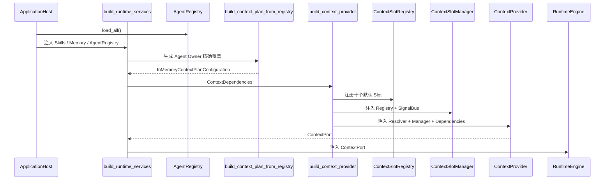

**结论：**

- AgentRegistry 必须先加载，Plan 才能获得 Identity 的 `context_slot_ids`。
- 默认 Slot 注册是同步、显式且失败即终止的启动步骤。
- ContextProvider 是 Runtime 使用的唯一 ContextPort 实现。
- Knowledge 和 UserProfile 当前未进入生产装配。

### 5.2 正常 Context 构建

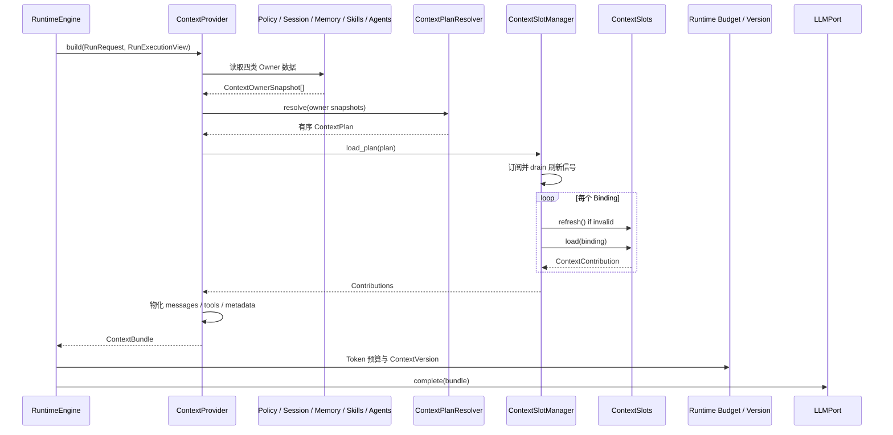

**结论：**

- Engine 是构建发起者，Provider 是 Context 内部协调者。
- Manager 顺序加载 Slot，并将单 Slot 异常降级为 FAILED。
- Plan 决定最终注入，但当前外部来源在 Plan 解析前已被 Provider 读取。
- ContextBundle 返回后，预算、版本持久化和 LLM 调用都由 Runtime 负责。

### 5.3 Agent Slot 覆盖

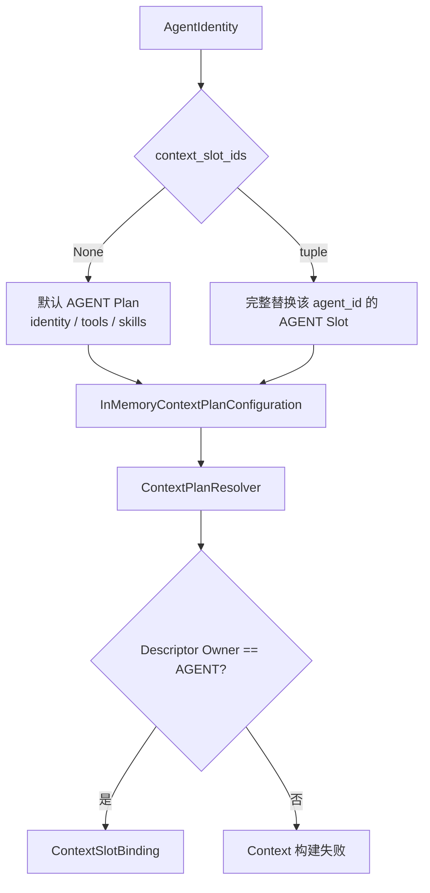

**结论：**

- 覆盖只作用于 AGENT Owner，不影响 Session、Run 和 Global 默认 Plan。
- 显式列表是完整替换，不是增量扩展。
- 未注册 Slot 或 Owner 不匹配会在构建时失败。
- 当前没有启动期预验证所有 Identity 的 Context Plan。

### 5.4 Slot 加载与失败降级

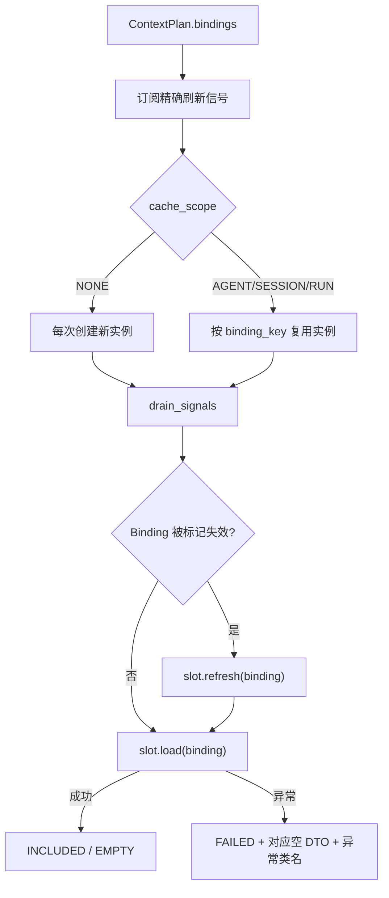

**结论：**

- 缓存的是 Slot 实例，不一定是内容。
- Binding 每次构建都会更新，缓存实例读取当前 Owner 快照。
- Manager 没有 required Slot 概念，所有异常使用相同降级策略。
- cache_scope NONE 的实例当前不会进入 Manager 的 release 路径。

### 5.5 Contribution 物化

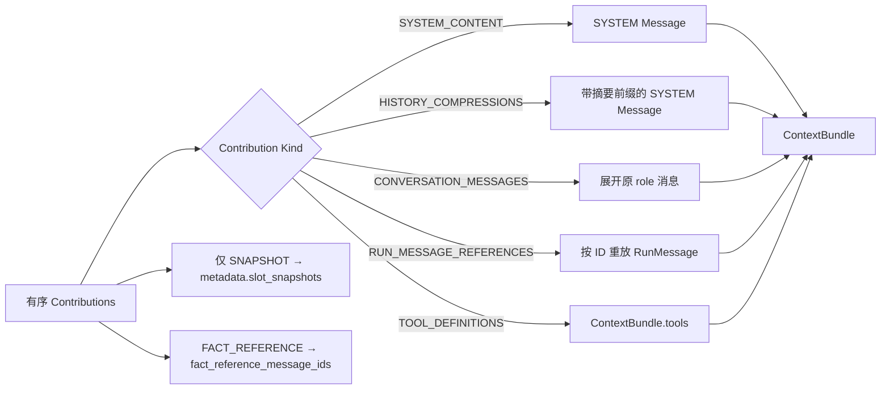

**结论：**

- 注入顺序来自 Descriptor.order，不来自外部来源完成顺序。
- EMPTY 和 FAILED 贡献不会进入 messages 或 tools，但 Snapshot 会保留其 status。
- Memory、Knowledge、Skills、Agent Directory 和 UserInfo 都以 SYSTEM role 注入。
- RunMessage 正文只从 Runtime 事实读取，不复制到 ContextVersion。

### 5.6 ContextVersion 创建与复用

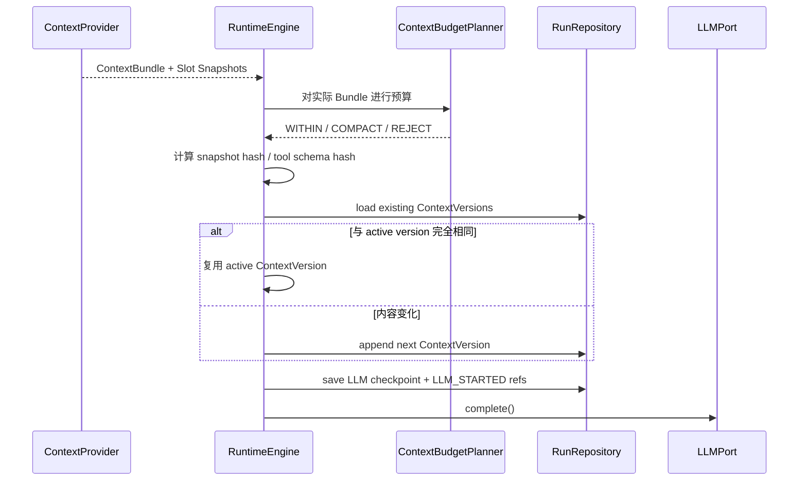

**结论：**

- ContextProvider 只提供 Snapshot，Runtime 决定版本编号、复用和持久化。
- Fact Reference 不进入 ContextVersion，message_id 写入 LLM_STARTED。
- Tools Slot 有独立 hash，便于审计模型可见工具变化。
- ContextVersion 在 LLM 调用前成为恢复安全点的一部分。

### 5.7 审批、delegation 与 Checkpoint 恢复

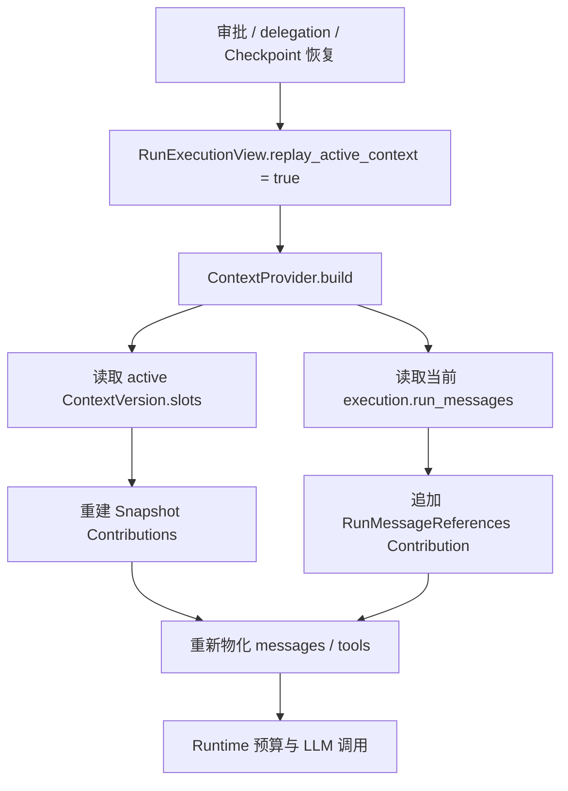

**结论：**

- 恢复不重新搜索 Memory/Knowledge，也不重新读取 Skills、Agent Directory 或当前 Agent 配置。
- Snapshot 使用原活动版本；动态 RunMessage 使用当前持久化事实。
- 恢复 Context 与原 ContextVersion 的来源一致，但会包含审批或工具阶段新增的 RunMessage。
- ContextPort 不读取 Checkpoint；Runtime 负责恢复 execution view。

### 5.8 历史压缩与 Context 的关系

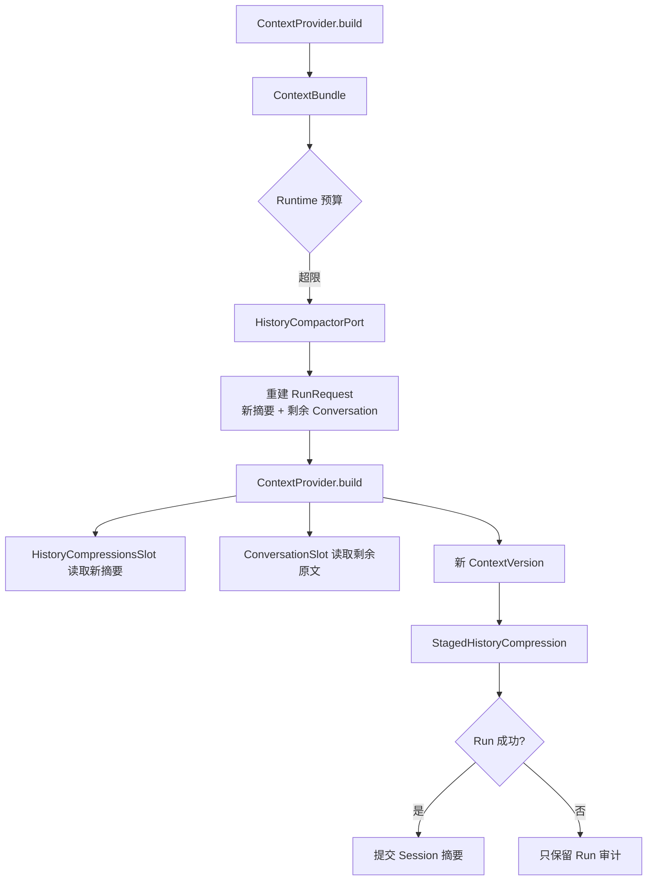

**结论：**

- 压缩算法、批次选择和模型调用属于 Runtime，不属于 Context。
- Context 只读取重建后的 RunRequest，并生成新的摘要与 Conversation Slot。
- staged 候选不是 Session 事实，失败 Run 不更新长期摘要。
- 成功提交后 Runtime 请求刷新 SESSION Owner 的历史摘要 Slot。

### 5.9 刷新信号

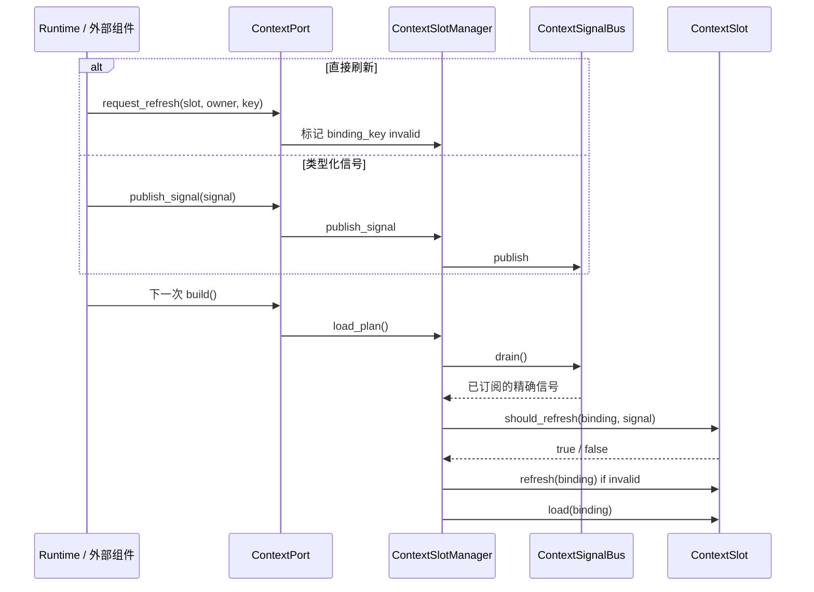

**结论：**

- 刷新发生在下一次 Context 构建安全点，不会主动重建正在使用的 ContextBundle。
- `request_refresh` 是精确失效；Signal 允许 Slot 根据 payload/reason 判断。
- 当前内置 Slot 的 refresh 都是空实现，因为内容来自每次新的 Binding。
- SignalBus 只保证进程内尽力交付，不是可靠事件系统。

### 5.10 生命周期释放

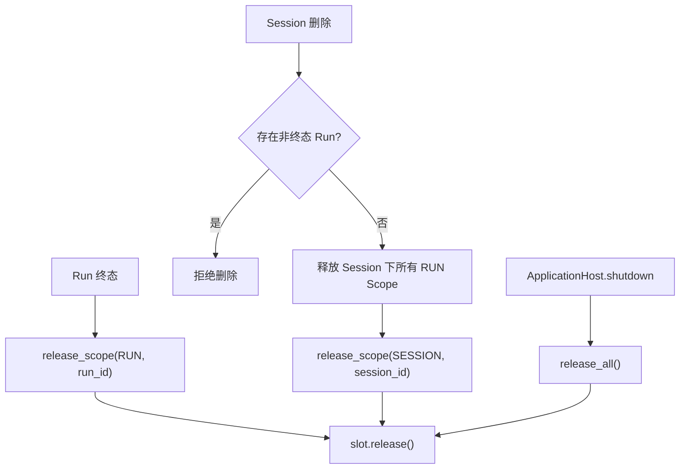

**结论：**

- RUN 缓存与单次执行绑定，非终态 AgentRunState 仍占用 Session。
- SESSION 缓存只在 Session 删除时释放。
- AGENT 缓存可跨多个 Session 复用，当前只在 Host 关闭时释放。
- NONE Scope 实例不进入 `_instances`，当前 Manager 不会调用其 release()。

---

## 6. 对外接口与数据契约

### 6.1 Context 公共 API

`dotclaw.context` 当前导出：

```text
ContextPort
ContextProvider
ContextMetadata
ContextDependencies

ContextSlot
ContextSlotDescriptor
ContextSlotBinding
ContextContribution
ContextOwnerSnapshot
ContextPlan

ContextSlotRegistry
ContextSlotManager
ContextPlanResolver
ContextPlanConfigurationPort
InMemoryContextPlanConfiguration

ContextSignalBus
ContextRefreshSignal
ContextRefreshReason

十个内置 Slot
构建与默认配置辅助函数
```

普通业务代码不应直接创建 Manager 或 Slot。生产入口是：

```text
build_context_provider(ContextDependencies)
```

Runtime 只依赖 `ContextPort`。

### 6.2 `ContextPort`

ContextPort 由 Runtime Application 定义，ContextProvider 实现：

```text
build(request, execution) -> ContextBundle
release_scope(owner, owner_key)
release_all()
request_refresh(slot_id, owner, owner_key)
publish_signal(signal)
```

契约要求：

- `build()` 不修改 RunRequest、RunExecution 或 Session；
- 返回的 message/tool 顺序稳定；
- 恢复模式优先使用 active ContextVersion；
- release 方法可重复调用；
- refresh 只影响后续安全点；
- ContextPort 不保存 Runtime 事实。

### 6.3 `ContextBundle`

| 字段 | 内容 | 生产者 | 消费者 |
|---|---|---|---|
| `messages` | 本次 LLM 调用的有序 RunMessage | ContextProvider | Runtime Token Budget、LLMPort |
| `tools` | 实际模型可见 ToolDefinition | ToolsSlot + Provider | Runtime Token Budget、LLMPort |
| `metadata` | Slot 来源、Snapshot 和 Fact IDs | ContextProvider | Runtime ContextVersion、LLM_STARTED |

`ContextMetadata` 当前字段：

```text
estimated_tokens
source_names
truncation_applied
details
slot_snapshots
fact_reference_message_ids
```

当前 ContextProvider：

```text
estimated_tokens = 0
truncation_applied = False
details = {}
```

Token 预算和历史压缩由 Runtime 另行处理，因此前三个旧字段不应被解释为真实预算结果。

### 6.4 Plan 契约

```text
ContextOwnerSnapshot[]
+ ContextPlanConfigurationPort
+ ContextSlotRegistry
→ ContextPlan.bindings
```

关键不变量：

1. 每个 Binding 必须引用已注册 Slot。
2. Descriptor.owner 必须等于配置查询的 Owner。
3. Binding 必须携带精确 owner_key。
4. 最终注入顺序按 Descriptor.order 排序。
5. 同一个 Plan 当前没有显式防止重复 slot_id；默认配置和内存覆盖使用 tuple，调用者应避免重复。
6. 配置错误直接使构建失败，不降级为空 Plan。

### 6.5 Slot 契约

一个 Slot 实现必须保证：

1. 只从 `ContextSlotBinding` 读取本次数据；
2. 返回与 Descriptor.contribution_kind 匹配的 Content DTO；
3. EMPTY 和 FAILED 使用对应 kind 的空 DTO；
4. `refresh()` 不修改 Owner 领域数据；
5. `should_refresh()` 不执行外部副作用；
6. `release()` 可安全调用；
7. 若持有资源，应选择会被 Manager 管理的 cache_scope；
8. 不直接构造 ContextVersion 或 LLM Provider 消息。

### 6.6 Owner 与 Cache Scope

| Owner | owner_key | 默认 Cache Scope | 当前释放点 |
|---|---|---|---|
| GLOBAL | `"global"` | NONE | Host 关闭只释放被缓存实例；NONE 不缓存 |
| AGENT | `agent_id` | AGENT | Host 关闭 |
| SESSION | `session_id` | SESSION | Session 删除、Host 关闭 |
| RUN | `run_id` | RUN | Run 终态、Session 删除、Host 关闭 |

当前 Manager 的 `release_scope()` 只释放：

```text
descriptor.cache_scope == 该 Owner 对应 Scope
```

若自定义 Descriptor 的 owner 与 cache_scope 不一致，按 owner 调用 release_scope 时可能不会释放。默认 Descriptor 均保持一致。

### 6.7 Snapshot 与 Fact Reference

| 模式 | 保存位置 | 适用内容 | 恢复方式 |
|---|---|---|---|
| `SNAPSHOT` | ContextVersion.slots | 当次稳定直接载荷 | 从活动版本重建 Contribution |
| `FACT_REFERENCE` | RunMessage + LLM_STARTED IDs | 动态 ReAct 事实 | 按 message_id 读取正文 |

ContextVersion 只能包含 SNAPSHOT Slot。反序列化时发现 FACT_REFERENCE 会拒绝。

### 6.8 默认 Plan

```text
AGENT
├── identity
├── tools
└── skills

GLOBAL
└── available_agents

SESSION
├── user_info
└── history_compressions

RUN
├── conversation
├── memory
├── knowledge
└── run_messages
```

最终顺序：

```text
identity
→ tools
→ skills
→ available_agents
→ user_info
→ history_compressions
→ conversation
→ memory
→ knowledge
→ run_messages
```

注意：Tool Definitions 不进入 messages，RunMessages 在物化时按事实顺序展开。

### 6.9 关键不变量

1. Runtime 是 Context 构建发起者，ContextProvider 不主动调用 LLM。
2. Owner 数据只能在 Provider 边界读取，Manager 和 Slot 不读取外部领域对象。
3. Plan 只决定启用和顺序，不负责加载内容。
4. Registry 只保存 Descriptor 和 factory，不保存实例。
5. Slot 实例缓存键必须包含 slot_id、owner 和 owner_key。
6. Snapshot Slot 与 Fact Reference Slot 不得混写。
7. ContextVersion 不保存 RunMessage 正文。
8. Tools Slot 必须来自 Run 冻结 Policy，不从当前 Registry 动态补齐。
9. Conversation Slot 必须来自 Run 创建时冻结的 ConversationSnapshot。
10. 恢复时不重新查询可变 Memory、Knowledge、Skills 或 Agent Directory。
11. 单 Slot FAILED 不应伪装成 INCLUDED。
12. Slot 顺序必须由 Descriptor.order 决定并保持稳定。
13. ContextProvider 不声称自己完成 Token 预算或裁剪。
14. 历史压缩候选未成功提交前不得写入 Session。
15. RUN Scope 只在不可恢复终态释放；等待审批和中断需保留恢复上下文。
16. Session 删除不能在存在非终态 Run 时清理 Context。
17. SignalBus 不能作为可靠事实源。
18. 外部检索内容进入 SYSTEM role 是当前事实，不能误写成已具备不可信数据隔离。
19. Knowledge 和 UserInfo Slot 接口存在不等于生产装配已经提供数据。
20. AGENT Plan 覆盖是完整替换，不是默认列表追加。
21. 可缓存自定义 Slot 若有可变状态，必须自行保证跨 Session 并发安全；当前 Manager 不提供该保证。

---

## 7. 常见修改入口

| 修改目标 | 首要入口 | 可能涉及 | 必须保持的不变量 |
|---|---|---|---|
| 新增一个 Slot 类型 | `context/slots.py` 或新文件 | contracts、defaults、Runtime DTO | 返回与 contribution kind 匹配的 Content |
| 注册新 Slot | `context/defaults.py::_register_defaults` | Descriptor order、Owner、cache scope | slot_id 唯一 |
| 修改默认 Plan | `default_context_plan_configuration()` | Agent overrides、测试 | Owner 与 Descriptor 一致 |
| 修改 Agent Slot 配置 | `AgentIdentity.context_slot_ids`、`build_context_plan_from_registry` | YAML loader、Resolver | 当前只覆盖 AGENT Owner |
| 新增 Session/Run/Global 精确配置 | 新 `ContextPlanConfigurationPort` 实现 | runtime_factory | 默认回退语义明确 |
| 修改 Slot 注入顺序 | Descriptor.order | ContextVersion、Prompt 行为 | 顺序唯一且稳定 |
| 新增 Contribution Kind | `runtime/domain/context.py` | Slot、Provider 物化、序列化、Repository | 封闭 DTO 全链路贯通 |
| 修改 Owner 数据来源 | `ContextProvider._owner_data` | ContextDependencies、来源 Port | Slot 不直接访问领域对象 |
| 接入 Knowledge | `ContextDependencies.knowledge_base` | runtime_factory、具体 Adapter | 结果大小、超时和信任边界明确 |
| 接入 UserProfile | `ContextDependencies.user_profile` | ApplicationHost、隐私配置 | 只注入允许字段 |
| 修改 Memory 注入 | `_memory_text`、MemorySearchPort | MemoryManager、预算 | 不把未受限结果无限注入 |
| 修改 Skills 摘要 | `_skills_text`、SkillsSlot | SkillRegistry | 完整 Skill 内容不在此加载 |
| 修改 Agent 目录摘要 | `_available_agents_text` | AgentRegistry、Delegation | 可见性和权限规则明确 |
| 修改 Slot 缓存 | `ContextSlotManager._slot` | cache scope、release | 实例不能跨 owner_key 串扰 |
| 修改失败策略 | `ContextSlotManager.load_plan` | Descriptor、Runtime | 区分 required/optional 后再调整 |
| 修改刷新 | `request_refresh`、SignalBus、`should_refresh` | 生命周期调用点 | 只影响下一安全点 |
| 修改 Context 物化 | `_messages_from_contributions` | LLM Adapter、Token Budget | role、ToolCall、顺序保持 |
| 修改 Snapshot | `_snapshots`、Runtime `_append_context_version` | Domain DTO、Repository | FACT_REFERENCE 不复制正文 |
| 修改恢复 | `_bundle_from_active_version` | Runtime retry/approval | 使用活动版本和当前 RunMessage |
| 修改历史摘要注入 | HistoryCompressionsSlot | Runtime compaction、Session Projector | staged 与 committed 分离 |
| 修改生命周期释放 | SlotManager、Engine、SessionInteraction、Host | 自定义 Slot 资源 | release 可幂等 |
| 排查某次 Context | `ContextVersion → LLM_STARTED → RunMessage` | RunRepository | 不仅查看最终 Conversation |

---

## 8. 设计取舍、痛点和演进方向

本节区分当前已实现的架构承诺、核心选择、代码中的真实问题和候选演进方案。

### 8.1 当前架构承诺

当前 master 可以确认：

1. Context 输入按 GLOBAL、AGENT、SESSION、RUN 四类 Owner 组织。
2. Slot 类型由 Registry 声明，单次启用由 Plan Configuration 决定。
3. Plan Resolver 只绑定和排序，不加载内容。
4. Provider 是唯一外部领域数据读取边界。
5. Manager 管理实例、失效和释放，不物化消息。
6. Slot 返回封闭的结构化 Contribution，不直接返回 Provider-specific payload。
7. Snapshot 与 Fact Reference 分离，ContextVersion 不复制 RunMessage 正文。
8. 恢复优先重放活动 ContextVersion，不重新查询可变来源。
9. Agent 可以显式替换自身 AGENT Owner Slot 计划。
10. Context 的预算、压缩、版本编号和持久化由 Runtime 负责。

### 8.2 核心设计取舍

#### 8.2.1 多 Owner Slot，而不是一个扁平 Prompt Builder

**问题与选择：**不同上下文内容具有不同所有者和生命周期。当前将其建模为 Owner + Slot + Binding，而不是把所有字符串放进一个 PromptBuilder。

**未选择：**单个 system prompt 模板、按文件目录拼接、所有来源统一 Session 生命周期。

**收益：**生命周期、缓存、刷新和配置覆盖有明确作用域；Agent、Session 和 Run 数据不会共用同一个模糊容器。

**代价与边界：**类型和 DTO 增加；Owner 只表示所有权，不自动解决信任级别和预算优先级。

#### 8.2.2 Registry 与 Plan 分离

**问题与选择：**“系统支持什么 Slot”与“本次启用什么 Slot”是不同问题。Registry 保存类型声明，Plan Configuration 保存选择，Resolver 绑定并排序。

**未选择：**在 Provider 中硬编码 if/else、按目录自动发现并全部启用、让 Slot 自行判断是否参与。

**收益：**新增 Slot 不必修改 Provider 主流程；不同 Agent 可以选择不同 AGENT Plan；顺序权威集中在 Descriptor。

**代价与边界：**配置错误在运行构建时才暴露；当前没有全量启动预验证。

#### 8.2.3 Provider 读取 Owner 数据，Slot 只消费快照

**问题与选择：**如果 Slot 直接依赖 MemoryManager、SessionManager 和 AgentRegistry，来源生命周期和测试会分散。当前由 Provider 读取外部数据，再把 JSONMap 快照交给 Slot。

**未选择：**每个 Slot 注入具体服务、Service Locator、Slot 直接读取全局对象。

**收益：**Slot 可纯测试；Manager 不理解领域来源；恢复可以绕过外部读取并使用活动版本。

**代价与边界：**Provider 成为高连接度边界；当前会在 Plan 解析前读取所有来源，削弱 Slot 禁用的成本隔离。

#### 8.2.4 结构化 Contribution，而不是任意字符串

**问题与选择：**Tool Schema、Conversation、RunMessage 引用和系统文本的持久化语义不同。当前使用封闭 kind 和 Content DTO。

**未选择：**所有 Slot 返回字符串、任意 dict payload、直接返回 OpenAI message。

**收益：**物化和序列化可穷举；ContextVersion 可以严格校验；Provider 与 LLM 协议解耦。

**代价与边界：**新增 kind 需要修改 Domain、Provider、序列化和测试全链路。

#### 8.2.5 Snapshot 与 Fact Reference 分离

**问题与选择：**RunMessage 已经是运行事实，复制到 ContextVersion 会形成多份正文。当前稳定输入做 Snapshot，动态 ReAct 消息只保存 ID 引用。

**未选择：**完整 Prompt 快照、ContextVersion 复制全部 RunMessage、恢复时从最新 Session 重建。

**收益：**减少重复，恢复使用原稳定输入，动态事实仍保持唯一来源。

**代价与边界：**恢复和审计需要联合读取 ContextVersion、RunMessage 和 LLM_STARTED。

#### 8.2.6 实例缓存按 Owner 生命周期管理

**问题与选择：**未来 Slot 可能持有索引、连接或私有缓存。Manager 按 `(slot_id, owner, owner_key)` 隔离实例，并在 Run、Session、Agent 或 Host 生命周期释放。

**未选择：**全局单例 Slot、每次都重新构造所有 Slot、由 Slot 自己监听 Session 删除。

**收益：**避免跨 Owner 串扰；资源生命周期可集中治理。

**代价与边界：**当前内置 Slot 基本无状态，缓存基础设施的收益尚未充分体现；NONE Scope 资源释放仍不完整。

#### 8.2.7 安全点刷新，而不是主动修改在途 Context

**问题与选择：**外部内容变化时直接修改正在使用的 ContextBundle 会破坏一次 LLM 调用的稳定性。当前只标记失效，在下一次 build 安全点 refresh/load。

**未选择：**后台线程主动改 Prompt、每个来源变化都重建在途 ContextVersion、可靠跨进程事件总线。

**收益：**单次调用输入稳定；刷新和 Runtime 状态机解耦。

**代价与边界：**信号可能延迟或丢失；当前 RefreshPolicy 尚未形成完整执行语义。

#### 8.2.8 ContextVersion 归 Runtime，而不是 Context 模块

**问题与选择：**ContextVersion 与 Run、Checkpoint、审批恢复和 Repository 格式紧密关联。当前领域 DTO 和持久化由 Runtime 所有，Context 只生产 Snapshot metadata。

**未选择：**ContextProvider 自行写 Repository、Context 模块管理 Run 版本、LLM Adapter 保存 Prompt。

**收益：**事实和恢复边界集中；Context 可以保持无持久化副作用。

**代价与边界：**Context 模块依赖 Runtime 的 DTO 和 Domain 类型，独立复用性降低。

#### 8.2.9 单 Slot 失败降级

**问题与选择：**Memory 或 Knowledge 等可选来源失败时，不应必然使整个 Run 失败。Manager 将异常转换为 FAILED Contribution，Provider 跳过注入。

**未选择：**任何 Slot 异常都终止 Run、异常正文直接注入模型、静默当作 EMPTY。

**收益：**可选来源具有降级能力；ContextVersion 仍可审计 FAILED status。

**代价与边界：**当前缺少 required/optional 分级，关键 Slot 失败也会继续。

### 8.3 已知痛点

#### C1. Plan 禁用不能避免来源读取

`ContextProvider._owner_data()` 在调用 Resolver 之前已经：

- 搜索 Memory；
- 搜索 Knowledge；
- 读取 Skills；
- 枚举 AgentRegistry；
- 格式化 UserProfile。

因此，即使 Plan 禁用 `memory` 或 `knowledge`，昂贵查询仍会发生。Plan 当前控制“是否注入”，不能完整控制“是否获取”。

#### C2. 没有 required/optional Slot 语义

所有 Slot 异常统一降级为 FAILED + 空内容。若未来 Identity、Policy 约束或其他关键 Slot 失败，Runtime 仍可能在缺少关键上下文的情况下调用模型。

Descriptor 没有：

```text
criticality
failure_policy
fallback
```

#### C3. 缓存与刷新机制尚未被内置 Slot 真正使用

内置 Slot 都从最新 Binding 直接读取数据，`refresh()` 和 `release()` 基本为空。Manager 缓存的是实例，不缓存内容。

当前结构主要为未来有状态 Slot 预留，但增加了：

- `_instances`；
- `_bindings`；
- `_invalid_bindings`；
- SignalBus；
- RefreshPolicy

等维护成本。

#### C4. NONE Scope 实例不会被 release

cache_scope 为 NONE 时，Manager 每次创建新实例，但不放入 `_instances`。`release_scope()` 和 `release_all()` 只遍历 `_instances`。

当前 `AvailableAgentsSlot` 无资源，因此没有实际泄漏；自定义 NONE Slot 若持有资源，其 `release()` 不会被调用。

#### C5. RefreshPolicy 没有执行语义

虽然 Descriptor 声明 `ON_DEMAND / SIGNAL`，Manager：

- 对所有 Binding 都 subscribe；
- `request_refresh` 可失效任意 Binding；
- 没有根据 policy 选择行为。

当前所有默认 Slot 都使用 SIGNAL，`ON_DEMAND` 尚未真正实现。

#### C6. SignalBus 订阅和投递边界粗糙

当前：

- subscriptions 不会解除；
- signals 无大小上限；
- `drain()` 清空包括未匹配信号在内的全部缓冲；
- 发布早于订阅的信号可能丢失；
- reason 和 payload 对内置 Slot 没有实际作用。

它适合作为单进程尽力提示，不适合作为可靠刷新机制。

#### C7. Knowledge 和 UserInfo 默认启用但未装配

默认 Plan 包含 `knowledge` 和 `user_info`，但 RuntimeFactory 没有传入 knowledge_base 或 user_profile。

结果是：

- 文档和 Plan 看起来存在能力；
- 实际生产 Context 通常为空；
- 用户难以区分“没有结果”和“根本未配置来源”。

#### C8. 外部检索内容以 SYSTEM role 注入

Memory、Knowledge、Skills、Agent Directory 和 UserInfo 都被物化为 SYSTEM 消息。当前没有：

- 不可信来源标签；
- 指令与数据分隔；
- Prompt Injection 清洗；
- 来源级 trust policy。

若 Knowledge 或 Memory 含有恶意指令，其优先级可能高于普通用户内容。

#### C9. Agent Plan 配置语义容易误解

`context_slot_ids` 名称看似可以控制完整 Context Plan，实际只覆盖 AGENT Owner。并且显式列表完整替换默认 identity/tools/skills，而不是追加。

错误 Slot ID 和 Owner mismatch 只在某次构建时暴露，没有 Host 启动预验证。

#### C10. ContextMetadata 存在遗留字段

ContextProvider 始终返回：

```text
estimated_tokens = 0
truncation_applied = False
details = {}
```

真实预算由 Runtime 计算。这些字段容易让调用者误以为 Context 模块仍负责估算和截断。

#### C11. 外部查询缺少 Context 层资源约束

Memory 和 Knowledge 查询：

- 顺序执行；
- 没有 Context 级 timeout；
- 没有并发控制；
- 没有结果长度上限；
- 没有取消令牌；
- 查询只使用当前 user_message.content。

外部模块可能自行限制，但 Context Port 契约没有要求。

#### C12. Agent Directory 没有可见性过滤

`available_agents` 会列举 AgentRegistry 中所有 Identity，包括当前 Agent 自身。没有按：

- 来源 Agent 权限；
- capabilities；
- tags；
- tenant；
- delegation policy

进行筛选。

#### C13. Contribution 默认 content 可能产生类型不一致

`ContextContribution` 默认 content 为 `TextSlotContent("")`。构造非文本 kind 时如果调用者忘记传 content，会形成：

```text
TOOL_DEFINITIONS + TextSlotContent
```

内置实现没有触发，但公共契约允许这种无效组合。

#### C14. Context Plan 允许重复 Slot ID

Resolver 没有对本次 Binding 的 slot_id 去重。如果配置列表重复同一 slot_id，Plan 会重复加载和注入。

ContextVersion 又要求版本内 slot_id 唯一，因此重复的 SNAPSHOT Slot 会在 Runtime 创建 ContextVersion 时失败，错误发现较晚。

#### C15. AGENT Scope 缺少独立释放事件

Agent Slot 实例可跨 Session 复用，但当前没有 Identity 卸载、配置重载或 Agent 删除流程调用 `release_scope(AGENT, agent_id)`。

长期运行且动态加载大量 Identity 时，Agent 实例缓存可能持续增长。

#### C16. FAILED 诊断信息过少

Manager 只保存异常类名，既避免泄漏敏感信息，也导致排障时无法区分同类异常的具体原因。ContextVersion 中会看到 FAILED，但需要额外日志才能定位。

#### C17. 共享 Manager 与 AGENT Slot 缺少并发保护

ContextProvider 和 ContextSlotManager 是进程级共享对象，不同 Session 可以并发调用 `build()`。绑定同一 Agent 的多个 Session 会复用同一个 AGENT Scope Slot 实例。

当前没有：

- Manager 状态锁；
- 单 Slot 实例锁；
- 对 stateful Slot 的并发协议；
- Signal drain 与 load_plan 的原子边界。

内置 Slot 无状态，当前风险有限；未来有状态或带缓存的 AGENT Slot 可能发生并发 load/refresh、绑定覆盖或失效标记竞争。

#### C18. Agent Plan 构建辅助函数仍依赖具体 Agent 类型

`build_context_plan_from_registry()` 位于 Context 模块内部，但直接导入并接收：

```text
AgentRegistry
AgentIdentity
```

这与 Provider 内容来源使用最小 Protocol 的依赖方向不一致。当前影响集中在 Bootstrap 装配阶段，不影响 ContextProvider 的运行时内容读取，但会造成：

- Context 模块了解 Orchestration 的具体 Registry；
- AgentIdentity 字段变化需要直接修改 Context；
- Plan 构建辅助函数难以复用于其他 Agent Directory 实现；
- 文档容易误写为“Context 已完全依赖倒置”。

### 8.4 演进方向

| 编号 | 解决的痛点 | 候选方向 | 影响与代价 |
|---|---|---|---|
| E1 | C1、C11 | 两阶段 Plan：先解析启用 Slot，再按启用来源懒加载 Owner 数据；昂贵来源可并行并支持 timeout/cancel | Provider、Slot/Source Port、Runtime Cancellation；需保持恢复不重新查询 |
| E2 | C2 | Descriptor 增加 required/optional、failure policy 和 fallback；Runtime 根据关键 Slot 失败决定拒绝或降级 | Contracts、Manager、ContextMetadata、Runtime |
| E3 | C3、C5 | 明确选择：要么简化无状态内置 Slot 的缓存/刷新层，要么实现真正的内容缓存和 RefreshPolicy 策略 | Manager、Slots、测试；避免保留半实现抽象 |
| E4 | C4 | 对 NONE Scope 使用 `async with` 或 load 后 finally release，保证临时实例资源回收 | SlotManager；需定义 load 结果与 release 顺序 |
| E5 | C6 | SignalBus 增加 unsubscribe、容量、去重和明确丢弃策略；若需要跨进程则换持久化事件或版本轮询 | Context、Host、外部发布者 |
| E6 | C7 | 只在实际装配来源时启用 UserInfo/Knowledge，或为 unavailable 状态增加显式 metadata | RuntimeFactory、Plan Configuration、配置 |
| E7 | C8 | 为检索内容增加 trust level 和 DATA contribution kind，物化为明确的不可信数据块而非高权重系统指令 | Runtime Domain DTO、Provider、LLM Prompt 协议 |
| E8 | C9、C14 | 将 Agent 字段改名为 `agent_context_slot_ids` 或引入完整分 Owner 配置；Host 启动时预解析并验证所有 Plan，禁止重复 | Agent、Context Plan、Bootstrap |
| E9 | C10 | 删除或重定义 ContextMetadata 的 estimated/truncation 字段，预算结果由独立 Runtime DTO 表达 | Runtime DTO、Context、调用者、存储兼容 |
| E10 | C11 | 在 Memory/Knowledge Port 中加入 max_results、max_chars/token、deadline 和 CancellationToken | Memory、Knowledge、Context、Runtime |
| E11 | C12 | 增加 AgentDirectory 查询条件和 DelegationPolicy，排除不可见或不可委派 Identity | AgentRegistry、Orchestration、Context |
| E12 | C13 | 用按 kind 分开的 Contribution 构造器或运行时校验，禁止 kind/content 不匹配 | Contracts、Slots、Manager |
| E13 | C15 | 增加 AgentRegistry reload/unload 生命周期事件，并释放精确 AGENT Scope | Bootstrap、AgentRegistry、Context |
| E14 | C16 | ContextMetadata 保存脱敏错误分类和稳定 reason code，详细原因只进入受控日志/Journal | Manager、Metadata、Observability |
| E15 | C17 | 为共享 Manager 和可缓存 Slot 定义并发模型：不可变 Slot、每绑定锁或 owner-key 串行；信号 drain 与失效更新需要受控临界区 | Context Manager、Custom Slot、Runtime 并发测试 |
| E16 | C18 | 将 `build_context_plan_from_registry()` 移到 Bootstrap Adapter，或改为依赖只暴露 agent_id/context_slot_ids 的最小 Plan Directory Protocol | Context Plan、Agent/Orchestration、Bootstrap；需要调整公共导出与测试 |

---

## 9. 源码索引

### 9.1 Context 目录

```text
src/dotclaw/context/
├── __init__.py
├── contracts.py
├── defaults.py
├── plan_configuration.py
├── plan_resolver.py
├── ports.py
├── provider.py
├── registry.py
├── signals.py
├── slot_manager.py
└── slots.py
```

### 9.2 Context 文件

| 文件 | 逻辑组件 | 主要内容 |
|---|---|---|
| `context/__init__.py` | 公共 API | 导出 Context 公开契约、内置 Slot 和构建函数 |
| `context/contracts.py` | 结构化契约 | Descriptor、Binding、Contribution、Plan、Slot Protocol |
| `context/registry.py` | Slot 注册 | Descriptor 与 factory 注册表 |
| `context/plan_configuration.py` | Plan 配置 | 默认与精确 Owner Key 的内存配置 |
| `context/plan_resolver.py` | Plan 解析 | Owner 绑定、校验、排序、Agent 覆盖构建 |
| `context/ports.py` | 外部来源边界 | Memory、Knowledge、Skills、Agent Directory 最小 Protocol |
| `context/signals.py` | 刷新 | 进程内信号、订阅和 drain |
| `context/slot_manager.py` | 生命周期 | 实例缓存、失效、加载、失败降级和释放 |
| `context/slots.py` | 内置能力 | 十个默认 Slot |
| `context/provider.py` | 对外协调 | Owner 数据、Plan、物化、Snapshot、恢复重放 |
| `context/defaults.py` | 内部组合根 | 默认注册、默认 Plan、Provider 构建 |

### 9.3 Runtime 领域与应用接入

```text
src/dotclaw/runtime/
├── domain/
│   └── context.py
└── application/
    ├── dto.py
    ├── ports.py
    └── engine.py
```

| 文件 | Context 视角 |
|---|---|
| `runtime/domain/context.py` | Owner、Contribution Kind、Content DTO、ContextSlotSnapshot、ContextVersion |
| `runtime/application/dto.py` | ContextBundle、ContextMetadata、ContextRefreshSignal |
| `runtime/application/ports.py` | ContextPort 协议 |
| `runtime/application/engine.py` | 构建时机、Token 预算、ContextVersion、恢复和历史压缩 |

### 9.4 跨模块来源与生命周期

```text
src/dotclaw/
├── agent/
│   └── identity.py
├── orchestration/
│   └── registry.py
├── skills/
│   └── registry.py
├── memory/
│   └── manager.py
└── bootstrap/
    ├── runtime_factory.py
    ├── application_host.py
    └── session_interaction.py
```

| 文件 | Context 视角 |
|---|---|
| `agent/identity.py` | `context_slot_ids` AGENT Plan 覆盖 |
| `orchestration/registry.py` | AvailableAgents 来源和 Plan 构建所需 Identity 列表 |
| `skills/registry.py` | Skills 描述来源 |
| `memory/manager.py` | MemorySearchPort 当前实现 |
| `bootstrap/runtime_factory.py` | ContextDependencies 生产装配 |
| `bootstrap/application_host.py` | Host 关闭时 release_all |
| `bootstrap/session_interaction.py` | Session 删除时释放 SESSION/RUN Scope |
