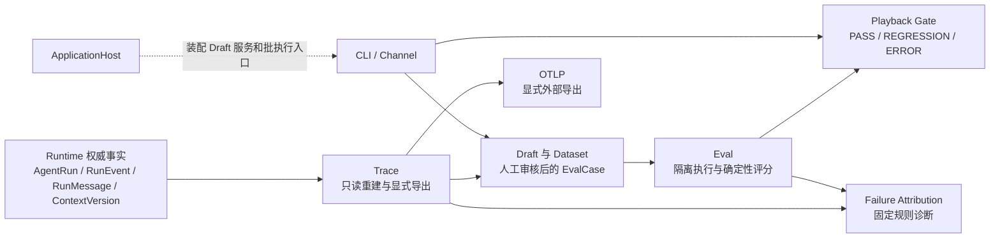
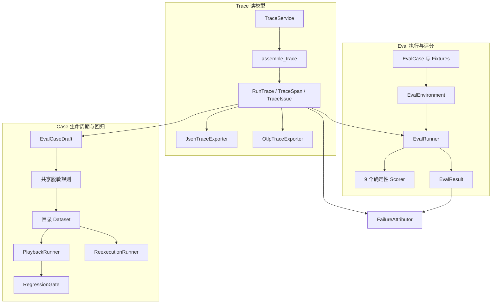
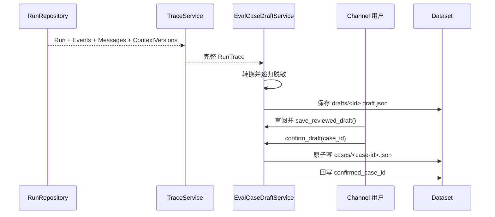
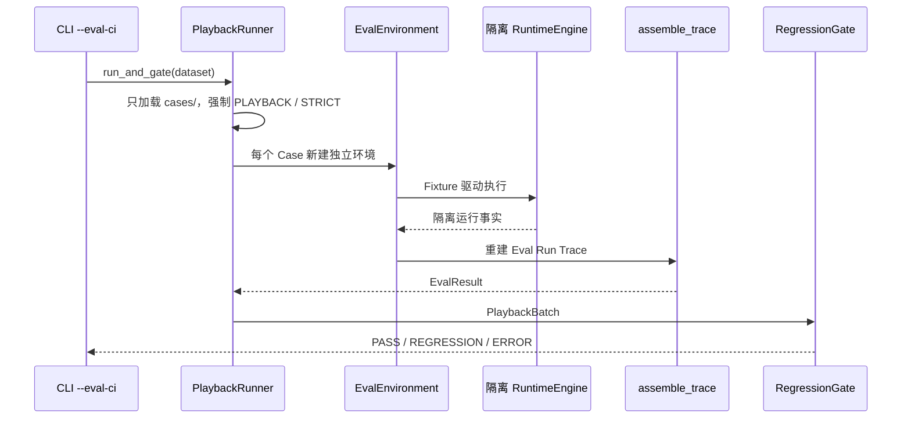

# Eval 模块总体说明

> 编写基准：[dotClaw Wiki 编写规范与验收准则](./internal/Wiki%20编写规范与验收准则.md)  
> 上级导航：[dotClaw 开发者 Wiki](./readme.md)  
> 代码扫描提交：`2426220`（2026-08-05）

## 1. 模块定位与边界

Eval 将一次 Agent 行为转化为可保存、可重复执行、可确定性判定的工程反馈闭环。它消费 Runtime 已持久化的运行事实或人工确认的 Case，在隔离环境中重新运行，并把结果用于本地诊断或 CI 回归闸门。

模块对外提供以下能力：

- `RunTrace`（运行追踪）的只读重建与显式导出；
- `EvalCase`（版本化评测用例）的 Fixture 驱动执行和九类确定性断言；
- 从完整历史 Trace 生成、脱敏、人工确认并持久化 Dataset Case 的流程；
- 冻结 Playback、仅供人工观察的 Re-execution，以及只接收 Playback 结果的 Regression Gate；
- 基于 Trace 与 EvalResult 的固定规则失败归因；
- 完整终态 Trace 的显式 OTLP 导出。

它明确不负责：

- 运行期间的前端进度；前端应读取 `AgentRun` 与 `RunEvent`；
- Runtime 的恢复、状态迁移、Journal 改造或第二套运行事实；
- LLM Judge、加权总分、真实副作用回放和费用金额门禁；
- 自动确认 Draft，或猜测任意自然语言是否含敏感信息；
- 将 Re-execution 结果送入 CI Gate。

`trace/` 是 Eval 的前置读模型，而非 Runtime 的一部分。Trace 的完整说明归本模块；Runtime Wiki 只说明其如何保存权威事实。

## 2. 模块在项目中的位置



普通用户请求不会自动进入这条链。`ApplicationHost`（应用组合根）创建 Draft 服务，CLI 的 `/eval` 命令驱动审核或批执行；`--eval-ci <dataset>` 运行 Playback Gate 并以进程退出码表达结果。

依赖方向必须保持为：

```text
Runtime domain / application ports
        ↑ 只读事实
Trace
        ↑ 使用
Eval
```

- Runtime 不得导入 Trace 或 Eval；
- Trace 只读取 Runtime Facts，不得写回 Run、Session 或 Checkpoint；
- Eval 可以调用隔离的 RuntimeEngine 和 Trace；
- OTLP SDK 只位于 Trace 导出适配器；普通 Trace 导入不加载它；
- Exporter、Trace 重建、Fixture 配置和断言失败必须分别报告，不能改变原 Run 结果。

## 3. 组件总览



| 逻辑组件 | 解决的问题 | 核心类型 | 关键边界 |
|---|---|---|---|
| Trace 重建 | 让上层不直接解析事件流 | `TraceService`、`assemble_trace()`、`RunTrace` | 只读、动态组装、不是事实源 |
| 导出与隐私 | 生成可交付追踪工件而不默认泄漏内容 | JSON / OTLP 导出器、共享脱敏规则 | 调用方显式触发；OTLP 只接收完整终态 Trace |
| Case 与 Fixture | 表达可重复的 Agent 行为输入 | `EvalCase`、Fixture 模型、`EvalEnvironment` | 默认拒绝真实依赖；每次执行使用独立内存事实 |
| Runner 与评分 | 在隔离 Run 上得到可追溯结论 | `EvalRunner`、`EvalResult`、Scorer | 无 LLM Judge；每条 Expectation 独立判定 |
| Draft 与 Dataset | 将历史行为变为人工审核的回归资产 | `EvalCaseDraft`、`EvalCaseDraftService` | Draft 与 Case 分目录保存；Channel 不直接读写文件 |
| Playback 与 Gate | 用冻结事实阻断行为回退 | `PlaybackRunner`、`RegressionGate` | 仅 Playback 可进 Gate；三态报告 |
| Re-execution 与归因 | 观察当前行为并解释失败 | `ReexecutionRunner`、`FailureAttributor` | 不进 Gate；外部副作用仍要求 Fixture |

## 4. 各组件的类与职责

### 4.1 Trace 重建与读模型

`TraceService`（Trace 查询服务）是 Runtime 仓储的只读消费者。它按 `run_id` 加载 Run、连续 Event、Message 与 ContextVersion，再交给纯函数 `assemble_trace()`（Trace 组装函数）；它不解释文件格式之外的事件语义，也不写出工件。

`RunTrace`（派生运行追踪）保存这次读取所见的权威事实引用、Span、派生指标与 Issue。它不是持久化源，`is_partial` 只说明该快照是否缺少完成所需语义，不能被用于恢复或替代 Run 状态。

| 类型 | 创建者与读取者 | 数据性质 | 关键不变量 |
|---|---|---|---|
| `RunTraceSource`（读取快照元数据） | Assembler 创建；导出和 Eval 读取 | 派生元数据 | `record_hash` 仅由权威输入计算，不含组装时间 |
| `TraceSpan`（统一执行区间） | Assembler 创建；Scorer、导出器、归因器读取 | 派生事实视图 | 只保存消息 ID / ContextVersion 引用，不复制正文 |
| `TraceIssue`（结构化不完整证据） | Assembler 创建；诊断和归因读取 | 派生诊断 | 缺配对、缺消息、冲突等语义问题不静默丢弃 |
| `TraceMetrics`（派生指标） | Assembler 创建；展示或评分读取 | 派生值 | 不回写 `AgentRun.statistics` |

Assembler 按 Event sequence 配对 LLM、Tool、Approval 与 Delegation 的开始/结束事件。结构损坏应在 Runtime 读取时失败；结构合法但历史语义不足则保留 Trace 并产出 `TraceIssue`（结构化问题）。非终态 Run 或未配对 Span 产生 `is_partial=True`。

### 4.2 显式导出与内容边界

`JsonTraceExporter`（JSON 导出器）把既有 `RunTrace` 序列化到调用方指定的文件。默认只允许终态 Trace；调试导出部分 Trace 必须显式允许。默认输出结构、引用、哈希与脱敏标记，不输出 Prompt、模型正文或工具输出。

`OtlpTraceExporter`（OTLP 导出器）将完整终态 Trace 显式映射为 RUN 根 Span 和 LLM、Tool、Approval、Delegation 子 Span。它拒绝非终态、部分或 `INCOMPLETE` Trace；导出失败通过 `OtlpExportResult`（导出结果）报告，不改变 Runtime、Trace 或 Eval。

`trace.redaction`（共享脱敏规则）持有已知敏感字段名和凭证模式。Eval Draft 与 OTLP 内容模式共用它，避免两套规则漂移；它只保护已知模式，不声称识别任意敏感自然语言。

### 4.3 EvalCase、Fixture 与隔离环境

`EvalCase`（版本化评测用例）是可持久化的执行输入：它冻结会话、策略、上下文、LLM、Tool、审批、委派 Fixture 与有序 Expectation。它复用 Runtime 的策略、消息和 Tool DTO，不创建平行 Agent 或 Context 模型。

`EvalEnvironment`（隔离评测环境）为一个 Case 组装独立的内存 Run 仓储、Checkpoint、固定 TokenCounter、固定 HistoryCompactor 和 Fixture 端口，再创建隔离 `RuntimeEngine`。它不共享生产 Session、原 Run 或 Fixture 消费游标。

| 执行模式 | 匹配模式 | 可变路径 | 禁止事项 |
|---|---|---|---|
| Playback | STRICT | 无 | 禁止注入任何真实依赖；额外、缺失、顺序或参数不匹配均失败 |
| Re-execution | NORMAL | 当前 LLM、Context、Policy 可显式注入 | Tool、审批、委派等外部副作用必须由 Fixture 覆盖；不进 Gate |

`FixtureConfigurationError`（Fixture 配置错误）用于未匹配调用、未消费声明、非法模式等不可信执行，而不是把它伪装成业务断言失败。

### 4.4 Runner、Result 与九类 Scorer

`EvalRunner`（评测协调器）先验证 Expectation，再运行隔离环境、组装 Eval Run Trace、校验 Fixture 消费，最后按 Expectation 逐条调用 Scorer。它不重算 Runtime 状态，也不修改 Trace 来让评分通过。

`EvalResult`（评测结果）保存 Case、隔离 Run、逐条断言、失败分类及可选 Trace 引用。`passed=True` 当且仅当所有已配置 Expectation 通过；它区分 Runtime、Trace 重建、Fixture 配置和 Assertion 四类失败。

九个固定 Scorer 只消费与自身 kind 匹配的 Expectation：

| Scorer | 校验对象 |
|---|---|
| RunStatus | Run 终态结果 |
| ToolSequence / ToolArgument | 工具选择顺序与关键参数 |
| Approval / Policy | 审批结果与策略证据 |
| OutputAssertion | 最终助手输出的 exact / contains / regex 断言 |
| ContextRetention | 指定 ContextVersion 中的文本或消息引用 |
| TokenBudget / IterationBudget | Trace 指标与调用次数上限 |

### 4.5 Draft、审核与目录 Dataset

`EvalCaseDraft`（待审核评测草案）由完整历史 Trace 生成，记录来源 Run、record hash、Trace schema、候选 Case、是否需要复核和已确认 Case ID。它不是可直接执行的正式资产。

`EvalCaseDraftService`（草案应用服务）是 Channel 与 Dataset 的唯一窄入口，提供创建、加载、人工审阅保存、确认和列表能力。它校验路径片段，在确认时先原子写入 Case，再回写 Draft 的确认标记；不删除 Draft，也不参与 Runtime 主流程。

Dataset 是目录而非数据库：

```text
<dataset-root>/<dataset-name>/
├── drafts/<draft-id>.draft.json
└── cases/<case-id>.json
```

只加载 `cases/` 进入批执行，Draft 会被忽略。载荷先递归脱敏；已知凭证模式会令 Draft 保持 `requires_review=True`，必须经 `save_reviewed_draft()` 后才能 `confirm_draft()`。

### 4.6 Playback、Re-execution、Gate 与归因

`PlaybackRunner`（冻结回放执行器）强制将 Dataset Case 以 Playback / STRICT 运行，并把每个结果包装为 `PlaybackBatch`（可信回放批次）。`RegressionGate`（回归闸门）只接受该批次，避免普通 Re-execution 结果绕过来源限制。

| Gate 状态 | 含义 | CI 结果 |
|---|---|---|
| PASS | 全部可信 Playback 通过 | 退出码 0 |
| REGRESSION | 至少一个可信执行的断言失败 | 非零 |
| ERROR | Dataset、Fixture、Runtime 或 Trace 无法产生可信结果 | 非零 |

`ReexecutionRunner`（重新执行器）覆写 Case 为 NORMAL 模式，只供人工比较当前 Agent / Prompt / LLM 行为；它不会生成 `PlaybackBatch`，不会调用 Gate，也不允许真实副作用端口。

`FailureAttributor`（失败归因器）只读取 `RunTrace` 与 `EvalResult`，按事件时序选择最早且足以解释失败的固定类别，输出 `AttributionResult`（归因结果）及 HIGH / MEDIUM 置信度；证据不足稳定返回 UNKNOWN，而不做自然语言推测。

## 5. 组件依赖和使用流程

### 5.1 从历史 Run 到可回归 Case



发起者是 Channel，不是 Runtime 主循环。Trace 是 Draft 的来源证据，Dataset 是审核后的 Case 资产；任何部分 Trace、未审 Draft 或重复 Case 都在服务/存储边界明确失败，而不会被静默加入回归集。

### 5.2 冻结 Playback 与 Gate



协调者是 `PlaybackRunner`，而非 Gate。Gate 不重新评分，只区分可信断言失败与评测基础设施错误；这保证 CI 的结论只来自可重复的冻结输入。

### 5.3 显式导出与诊断

JSON 与 OTLP 都是 Trace 的下游消费者。导出器不登记到 Runtime、不会自动上报，也不会将失败转换为 Run 或 Eval 失败。归因同样只消费既有 Trace / Result，因此不会产生新的执行事实。

## 6. 对外接口与数据契约

| 接口 | 调用者 | 输入 / 输出 | 关键约束 |
|---|---|---|---|
| `TraceService.get_trace(run_id)` | 诊断、Draft、Eval | `run_id` → `RunTrace` | 只读四类 Runtime 事实 |
| `assemble_trace(...)` | TraceService、EvalRunner、测试 | 已加载事实 → `RunTrace` | 纯函数，不读写文件或调用 Runtime |
| `EvalRunner.run(case, dependencies)` | Playback / Re-execution | `EvalCase` → `EvalResult` | 每条 Expectation 都有证据；失败分类互斥 |
| `EvalCaseDraftService` | Channel / ApplicationHost | Draft 生命周期操作 | Channel 不直接读写 Dataset |
| `PlaybackRunner.run_and_gate(...)` | CLI / CI | Dataset → `RegressionReport` | 强制 Playback；仅此路径可入 Gate |
| `ReexecutionRunner.run_dataset(...)` | 人工诊断 | Dataset → `EvalResult[]` | 结果不能包装为 Gate 输入 |
| `OtlpTraceExporter.export(...)` | 显式调用方 | 完整终态 Trace → 导出结果 | 默认不含内容；失败隔离 |

配置入口是 `Config.eval.dataset_directory`，默认值为 `./data/datasets`；`ApplicationHost` 把它解析为受控 Dataset 根目录。没有额外 Registry、数据库或后台服务配置。

关键不变量：

- `record_hash` 是 Trace 的权威输入摘要，不因脱敏或导出而改变；
- Fixture 未匹配、剩余或非法 Expectation 是配置错误，不是断言失败；
- Playback 永远 STRICT，Re-execution 永远不能进入 Gate；
- Draft 不删除，确认不覆盖既有 Case；
- 默认导出不包含正文，`include_content=True` 仍走已知模式脱敏；
- Eval 的隔离 Run、仓储与 Checkpoint 不修改生产 Run / Session / 工作目录。

## 7. 常见修改入口

| 修改目标 | 首要入口 | 同时关注 | 必须保持的不变量 |
|---|---|---|---|
| 新增确定性断言 | `eval/scorers/`、`ExpectationKind` | Runner 校验、Case 测试 | 不新增平行 Case 模型；每条断言有 Trace 证据 |
| 修改 Fixture 匹配 | `fixtures.py`、`environment.py` | Playback / Re-execution 测试 | STRICT 不得放宽；副作用端口不得真实回退 |
| 调整 Case schema | `models.py`、Dataset 读写 | 版本与兼容测试 | 未知 / 损坏 schema 明确失败 |
| 修改 Draft 转换或脱敏 | `draft.py`、`redaction.py` | 审核服务、OTLP 内容模式 | 共用规则；不自动确认敏感 Draft |
| 修改 CI Gate | `playback.py`、`gate.py`、`regression.py` | `main.py --eval-ci` | 只接受 PlaybackBatch；ERROR 不得伪装为回退 |
| 扩展失败归因 | `attribution.py`、`attribution_rules.py` | Trace / Result 证据测试 | 固定规则、最早决定性证据、无猜测 |
| 调整 Trace 配对或指标 | `trace/assembler.py`、`models.py` | Golden Trace、Runtime 事件契约 | 只读事实；不把语义不完整升级为读取异常 |
| 修改导出 | `trace/exporters/` | 脱敏、惰性 OTel、失败隔离测试 | Runtime 不得感知 Exporter |

## 8. 设计取舍、痛点和演进方向

### 8.1 当前设计与取舍

**动态 Trace，而非第二份持久化记录。** Runtime 已有 Run、Event、Message 与 ContextVersion 事实；再保存 Trace 会引入同步、恢复与双真相问题。当前选择查询时组装，因此获取 Trace 有读取成本，也不承诺跨多个文件的事务快照，但权威边界清晰。

**Fixture 驱动的确定性评测，而非 LLM Judge。** 评分器只检查可验证事实，Playback 冻结策略、上下文和外部结果。这限制了它对开放式质量的判断能力，却能给 CI 提供可解释、可复现的结论。

**Draft 人工确认，而非自动沉淀历史行为。** 历史 Trace 可能包含偶然行为、秘密或不合理期望。保留多个 Draft 并要求审阅增加了操作步骤，但避免把一次真实运行直接升级为长期回归契约。

**Playback 与 Re-execution 分离。** 前者衡量冻结行为是否回退，后者观察当前 Agent / Prompt / LLM 的变化。代价是两者不能混用；收益是随机模型结果和真实调用尝试不会污染 Gate。

### 8.2 当前限制

- 脱敏只识别字段名和已知凭证模式，不能可靠判断任意自然语言敏感内容；
- Trace 只解释当前已定义的五类 Span，不建事件图、不推测压缩 Span；
- Re-execution 的当前 LLM / Context / Policy 注入是库级能力；CLI 默认仍以 Dataset Fixture 执行；
- OTLP 是调用方显式导出能力，不提供后台 Collector、采样策略或实时前端；
- Eval 只使用本地目录 Dataset，不提供多人并发审核、远端 Dataset 或 Case 搜索服务。

### 8.3 候选演进方向

以下内容尚未实现，也不是当前模块承诺：在不破坏 Playback 确定性的前提下增加 Dataset 选择/查询能力；为明确授权的内容治理提供更完整的人工审核 UI；或在已有稳定调用方后再考虑更通用的导出与报告扩展点。任何此类演进都应先证明第二个真实调用方和新的数据一致性需求，不能提前引入 Registry 或 Service 层。

## 9. 源码索引

```text
src/dotclaw/
├── trace/
│   ├── models.py              # RunTrace、Span、Issue、指标与默认内容视图
│   ├── assembler.py           # 权威事实到 Trace 的唯一解释入口
│   ├── service.py             # RunRepository 的只读查询入口
│   ├── redaction.py           # Trace / Eval 共用的敏感规则
│   └── exporters/             # JSON 与惰性 OTLP 显式导出
├── eval/
│   ├── models.py              # EvalCase、Fixture、Expectation 与 schema
│   ├── fixtures.py            # Scripted / Fixture Port 匹配实现
│   ├── environment.py         # 隔离 RuntimeEngine 和依赖边界
│   ├── runner.py              # Case 执行、Trace 重建和 Scorer 汇总
│   ├── scorers/               # 九个确定性评分器
│   ├── draft.py               # Trace 转 Draft
│   ├── redaction.py           # Draft 递归脱敏与复核标记
│   ├── dataset.py             # 目录 Dataset 的严格读写
│   ├── draft_service.py       # Channel 审核 / 确认入口
│   ├── playback.py            # 冻结批执行与 Gate 接入
│   ├── reexecution.py         # 当前行为观察路径
│   ├── regression.py / gate.py# 报告规范化与三态 Gate
│   └── attribution*.py        # 固定规则失败归因
├── bootstrap/application_host.py # Dataset 根目录与服务装配
└── main.py                    # /eval 与 --eval-ci CLI 入口

tests/
├── trace/                     # 组装、服务、JSON / OTLP 导出测试
└── eval/                      # Case、Fixture、Runner、Dataset、Gate、归因测试
```
