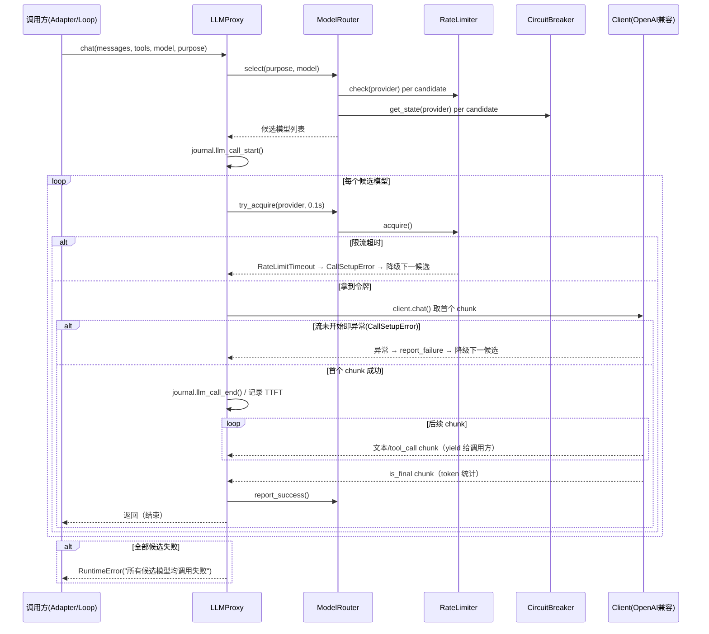
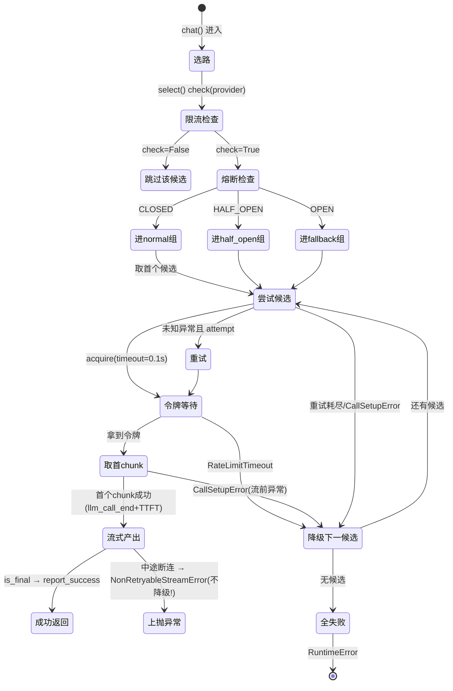
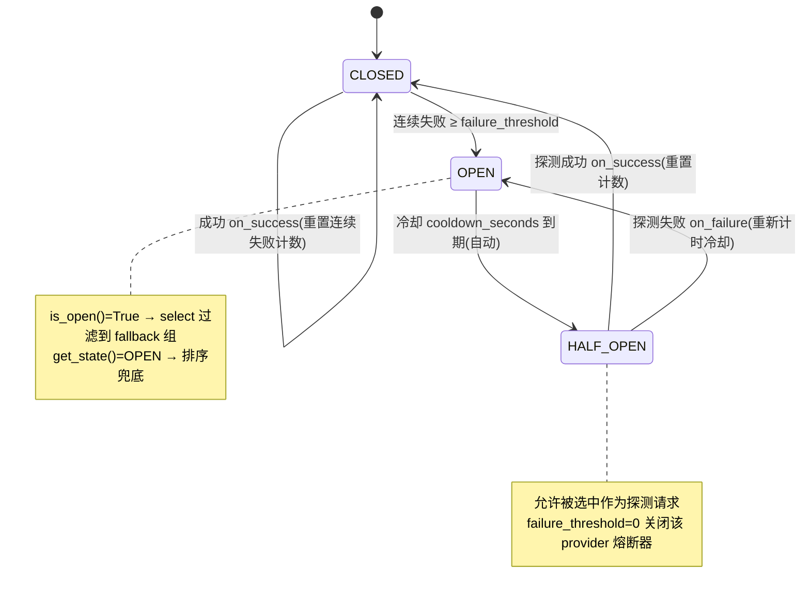

# LLM 模块总体说明

> 适用实现：LLM 模块重写版（ModelRouter + LLMProxy + RateLimiter + CircuitBreaker + OpenAI 兼容 Provider）
> 定位：把「模型选择、限流、熔断、降级、重试」从 Agent 业务循环中移出，集中为统一的 LLM 调用基础设施。
> 设计原则：**路由智能归 Router、编排保护归 Proxy、韧性策略（限流/熔断）下沉为可替换组件；Provider 通过注册表插件化；所有外部调用统一走 OpenAI 兼容协议。**

## 1. 概览

**模块定位**：LLM 模块是 dotClaw 与底层大模型供应商之间的唯一适配层。它向上层（Runtime v4 的 `LLMProxyAdapter`、旧的 `AgentLoop`、`MemoryManager`/`Dream` 上下文压缩等）提供统一的流式 `chat()` 与非流式 `embed()` 接口，向下对 OpenAI / Qwen / DeepSeek 等供应商做协议封装与韧性编排。

**核心职责**
- 按「用途（purpose）+ 模型优先级」生成候选模型链，并即时过滤被限流或熔断的供应商。
- 对单次调用做指数退避重试；对整条候选链做跨模型降级（fallback）。
- 以内置令牌桶做供应商维度并发限流，以熔断器做供应商维度失败隔离。
- 通过 Provider 注册表懒加载客户端，统一封装 OpenAI 兼容协议（消息转换、流式 chunk 解析、tool_calls 增量拼接、token 统计）。
- 在调用内部发射 `journal.llm_call_start/end` 观测事件，且统计 TTFT（首 token 延迟）与输入输出 token。

**非职责**
- 不持有对话业务状态：消息历史、工具结果追加由调用方（`LLMProxyAdapter` / `AgentLoop`）负责，`LLMClient.chat()` 只消费当次 `messages`。
- 不解析 LLM 返回的 tool_call 业务语义（交给 Runtime / AgentLoop 处理）；模块只把 `tool_calls` 还原为结构化 `ToolCall` 流式吐出。
- 不实现 Agent 循环、上下文压缩策略、记忆召回——这些只是 LLM 模块的调用方。
- 不做供应商鉴权以外的配置持久化：路由配置来自 `model_router_config.yaml`（或降级自 `config.yaml` 的 `llm.clients`），模块本身不写配置。

**入口与适用边界**
- 统一调用入口：`LLMProxy.chat(messages, tools, model, purpose, stream, journal)`（流式）、`LLMProxy.embed(texts, model, purpose, dimensions)`（向量化）。
- 装配入口：`agent/factory.py:_build_llm`（旧链路组合根）、`bootstrap/runtime_factory.py`（Runtime v4 组合根，包进 `LLMProxyAdapter`）。
- 适用边界：任何需要向大模型发请求的场景（对话、function calling、上下文压缩、记忆/梦境的向量化）。`model_router_config.yaml` 缺失时自动降级为单供应商 P1 行为。

## 2. 代码层级

```text
src/dotclaw/llm/
├── __init__.py              # 公共导出：LLMClient / ChatChunk / Message / ToolCall / ToolDefinition
│                           #        LLMProxy / ModelRouter / RateLimiter / CircuitBreaker
├── base.py                  # LLMClient(ABC) + Message / ToolCall / ToolDefinition / ChatChunk 数据类
│                           #        LLMUsage 用途枚举
├── model_router.py          # ModelRouter：选路 + 客户端懒加载 + 成功/失败上报门面
├── proxy.py                 # LLMProxy：重试编排 + 跨模型降级 + 流式保护 + Journal 追踪
│                           #        CallSetupError / NonRetryableStreamError 异常语义
├── rate_limiter.py          # RateLimiter：令牌桶限流（check 无锁近似 / acquire 真守门）
│                           #        RateLimitConfig / RateLimitTimeout
├── circuit_breaker.py       # CircuitBreaker：供应商维度熔断器状态机
│                           #        BreakerConfig / BreakerState
├── openai_compat.py         # OpenAICompatibleClient：OpenAI 协议通用实现（子类只覆写 3 个钩子）
└── providers/               # Provider 子包（注册表 + 适配实现）
    ├── __init__.py          # register() / get_provider() / _discover() 自动发现
    ├── qwen.py              # @register("qwen")  QwenClient
    ├── deepseek.py          # @register("deepseek") DeepSeekClient
    └── openai.py            # @register("openai") OpenAIClient

# 上层调用方（不在本模块，但构成模块边界）
src/dotclaw/runtime/adapters/llm_proxy_adapter.py   # LLMProxyAdapter：旧 LLMProxy → Runtime v4 的 LLMPort
src/dotclaw/agent/factory.py                        # _build_llm()：组合根
src/dotclaw/bootstrap/runtime_factory.py            # Runtime v4 组合根，包进 LLMProxyAdapter
src/dotclaw/config/settings.py                      # RouterConfig 数据类 + load_router_config()
model_router_config.yaml                            # 路由配置（优先级 / 限流 / 熔断 / 重试）
```

## 3. 总体架构

```mermaid
flowchart TD
    Caller["上层调用方<br/>LLMProxyAdapter / AgentLoop / MemoryManager / Dream"]
    Proxy["LLMProxy<br/>重试编排 + 跨模型降级 + 流式保护"]
    Router["ModelRouter<br/>select() 选路 + get_client() 懒加载 + 上报门面"]
    RL["RateLimiter<br/>令牌桶限流"]
    CB["CircuitBreaker<br/>供应商熔断状态机"]
    Reg["Provider 注册表<br/>get_provider(name)"]
    Base["OpenAICompatibleClient(ABC)"]
    Clients["QwenClient / DeepSeekClient / OpenAIClient"]
    Ext["外部供应商 API<br/>OpenAI 兼容 HTTP/SSE"]

    Caller -->|chat() / embed()| Proxy
    Proxy -->|select(purpose, model)| Router
    Router -->|check(provider)| RL
    Router -->|get_state(provider)| CB
    Proxy -->|try_acquire(provider)| RL
    Router -->|get_client(model)| Reg
    Reg -->|实例化| Clients
    Clients -->|继承| Base
    Base -->|AsyncOpenAI| Ext
    Proxy -->|report_success / report_failure| Router
    Router -->|on_success / on_failure| CB

    style Proxy fill:#1f3a5f,color:#fff
    style Router fill:#1f3a5f,color:#fff
    style RL fill:#5a3a1f,color:#fff
    style CB fill:#5a3a1f,color:#fff
    style Ext fill:#444,color:#fff
```

分层关系：**上层调用方（端口消费者）→ 编排层（LLMProxy）→ 路由智能层（ModelRouter）→ 韧性组件（RateLimiter / CircuitBreaker）→ 适配器（Provider 注册表 + OpenAICompatibleClient）→ 外部系统（供应商 API）**。Router 通过依赖倒置持有 `RateLimiter` / `CircuitBreaker` 两个抽象，Proxy 只依赖 `ModelRouter` 门面，不直接接触限流/熔断，符合依赖倒置与接口隔离。

## 4. 模块说明与依赖

### 4.1 base.py — 抽象与数据契约
- **职责**：定义 `LLMClient`（抽象基类，仅 `chat()` / `embed()` 两个抽象方法）、`LLMUsage`（用途枚举：chat / context_compaction）、以及四大数据类 `Message` / `ToolCall` / `ToolDefinition` / `ChatChunk`。`ChatChunk` 是流式最小单元：`content` 文本片段、`tool_call` 工具调用、`is_final` 结束标记、`finish_reason`、`input_tokens` / `output_tokens`（仅 `is_final=True` 的 chunk 携带）。
- **依赖**：无。是所有其他模块的公共上游类型来源。
- **禁止职责**：不实现任何 IO；不持有配置或状态。

### 4.2 model_router.py — ModelRouter（路由智能层）
- **职责**：`select(purpose, forced_model)` 生成排序 + 过滤后的候选模型名列表；`get_client(model)` 懒加载并缓存客户端实例；`try_acquire(provider, timeout)` 透传限流获取；`report_success/failure(model)` 驱动熔断器；`_get_retry_config / _get_backoff_config` 提供重试参数给 Proxy。
- **依赖**：持有 `RouterConfig`（路由表）、`RateLimiter`、`CircuitBreaker`。`get_client` 通过 `providers.get_provider()` 查注册表，未知 provider 回退到 `QwenClient`。
- **过滤顺序（select 内部 `_build_candidates`）**：
  1. 按 `purpose.priority` 排序，过滤 `status != "active"`；
  2. `rate_limiter.check(provider) == False` → 跳过；
  3. `circuit_breaker.get_state(provider)`：`closed` → normal 组，`half_open` → half_open 组（允许探测），`open` → fallback 组；
  4. 候选 = `normal + half_open`；无可用候选且存在 fallback 时，保留最优先的 OPEN 模型兜底；
  5. `forced_model` 命中则提升到候选首位（精确 model → 该 provider 全部模型 → 降级扩大搜索）。
- **禁止职责**：不直接发起 HTTP 请求；不做令牌等待与重试计时（交给 Proxy / RateLimiter）。

### 4.3 proxy.py — LLMProxy（编排层）
- **职责**：`chat()` 统一入口——`select()` 取候选 → 逐模型尝试（单模型内指数退避重试）→ `CallSetupError` / `RateLimitTimeout` 降级到下一候选 → `NonRetryableStreamError` 直接上抛 → 内部发射 `journal.llm_call_start` / `llm_call_end` 并统计 TTFT。
- **依赖**：仅持有 `ModelRouter`。通过 Router 门面间接使用限流/熔断，不直连。
- **异常语义（可靠性的核心边界）**：
  - `CallSetupError`：流开始前异常（连接超时、HTTP 非 2xx、认证失败、DNS 失败）→ **降级**到下一候选。
  - `RateLimitTimeout`：限流令牌获取超时 → 转为 `CallSetupError` → **降级**。
  - `NonRetryableStreamError`：流式已开始产出至少一个 chunk 后中途断连/解析失败 → **不重试、不降级，直接上抛**给调用方（已产生部分响应，不应由另一个模型续写）。
- **禁止职责**：不维护候选列表排序逻辑（归 Router）；不持久化熔断/限流状态（进程内内存态）。

### 4.4 rate_limiter.py — RateLimiter（韧性组件）
- **职责**：按 provider 维度的令牌桶并发控制。`check(provider)` 无锁近似读（供 `select()` 提前过滤）；`acquire(provider, timeout)` 真正获取令牌，`requests_per_minute=0` 即不限流，超时抛 `RateLimitTimeout`。
- **依赖**：构造时注入 `provider_name → RateLimitConfig`。用 `asyncio.Lock` 保护 refill+consume 复合操作；等待在锁外 `await asyncio.sleep()`，避免阻塞其他请求。
- **设计要点**：`check()` 的不精确读不影响正确性——真正守门的是 `acquire()`；`check()` 只是减少无谓的候选尝试。

### 4.5 circuit_breaker.py — CircuitBreaker（韧性组件）
- **职责**：按 provider 维度跟踪连续失败率，状态机 `CLOSED → OPEN → HALF_OPEN → CLOSED/OPEN`。`on_success/on_failure(provider)` 由 Router 上报驱动；`is_open/get_state(provider)` 供 `select()` 过滤/排序；`try_half_open(provider)` 预留探测配额；`on_state_change` 回调支持外部观测。
- **依赖**：构造时注入 `provider_name → BreakerConfig`（`failure_threshold` / `cooldown_seconds` / `half_open_max`）。`failure_threshold == 0` 表示该 provider 关闭熔断器。
- **自动转换**：`_get_effective_state` 在 OPEN 且已过冷却时间时自动转 HALF_OPEN，无需外部定时轮询。

### 4.6 openai_compat.py + providers/ — 协议适配层
- **职责**：`OpenAICompatibleClient` 封装 OpenAI 兼容 API 的通用逻辑（消息格式转换含 tool_calls 序列化、SSE chunk 解析含跨 chunk 的 arguments 增量拼接、流/非流两种返回、embed 分批调用）。子类只需覆写 `_get_api_key` / `_get_base_url` / `_get_model_id` 三个钩子。
- **依赖倒置**：`providers/__init__.py` 用 `register()` 装饰器注册表 + `_discover()` 自动导入触发注册；Router 通过 `get_provider()` 查表，新增供应商只需新建一个 `@register` 模块，无需改 Router。
- **禁止职责**：不感知限流/熔断/重试（那是 Router/Proxy 的职责）；不缓存客户端实例（缓存归 Router）。

## 5. 业务处理流程

### 5.1 主路径：一次 chat 调用（含限流、重试、降级）



### 5.2 关键分支
- **单模型内重试**：`for attempt in range(max_retries)`，未知异常按 `delay = base_delay * 2**attempt` 指数退避后重试；重试耗尽则抛 `CallSetupError` 降级。
- **异常/分支路径（必须覆盖）**：见第 6 节状态与分支。

### 5.3 embed 路径
`LLMProxy.embed(texts, model, purpose="embedding", dimensions)` → `Router.select("embedding", model)` 取首个候选 → `get_client` → `client.embed()` 按 `_EMBED_BATCH_SIZE=16` 分批调用供应商 Embeddings API，聚合返回。embed 不做跨模型降级，仅取候选首位；无候选抛 `RuntimeError`。

## 6. 状态与分支

### 6.1 调用结果状态归属与落点



### 6.2 CircuitBreaker 状态机（供应商维度）



### 6.3 关键分支对照表

| 分支 | 触发条件 | 状态归属 | 最终落点 |
|------|----------|----------|----------|
| 正常成功 | 首个候选产出 `is_final` | Router 上报 `report_success` → 熔断器重置/恢复 | 返回 `AsyncIterator[ChatChunk]` |
| 单模型重试耗尽 | 未知异常且 `attempt == max-1` | Router 上报 `report_failure` | `CallSetupError` → 降级 |
| 限流超时 | `acquire` 等待 > 0.1s | 不计入失败（仅降级） | `CallSetupError` → 降级 |
| 流前异常 | 连接/DNS/HTTP 非 2xx/认证 | Router 上报 `report_failure` → 可能推进熔断 | `CallSetupError` → 降级 |
| 流中异常 | 已产出 ≥1 chunk 后断连 | 不重试、不降级 | `NonRetryableStreamError` 上抛调用方 |
| 全部候选失败 | 候选链耗尽 | 各 provider 已上报失败 | `RuntimeError` 上抛 |
| 熔断兜底 | 全部 CLOSED 不可用 | 保留最优先 OPEN 模型 | 仍以兜底模型尝试一次 |

## 7. 工程化设计亮点

- **问题 → 机制 → 收益 → 边界**
  1. **跨模型韧性（降级）**：Proxy 把「单模型重试」与「跨模型降级」两层分离。单模型内 `max_retries` 指数退避；跨模型 `for model_name in candidates` 失败即 `continue`。**收益**：单个供应商宕机不影响整体可用性。**边界**：降级仅在 `CallSetupError`/`RateLimitTimeout`（流未开始）时触发；流已开始则上抛，避免不同模型拼接出脏响应。
  2. **流前/流后异常语义隔离**：`CallSetupError`（可降级）与 `NonRetryableStreamError`（不可降级）二分。**收益**：已产生部分文本响应的调用绝不会被另一个模型「续写」导致内容错乱。**边界**：判定点是「是否成功取到首个 chunk」（`await anext(chat_iter)` 之前 vs 之后）。
  3. **限流双层读（近似 + 精确）**：`check()` 无锁近似读供 `select()` 提前过滤，`acquire()` 持 `asyncio.Lock` 精确获取并在锁外 `sleep`。**收益**：`select()` 不过度尝试被限流的 provider，又不引入锁竞争热点。**边界**：`check()` 可能读到过期状态，但 `acquire()` 是真正守门员，不影响正确性。
  4. **熔断自动状态机**：OPEN 状态在 `get_state()` 调用时按 `cooldown_seconds` 自动转 HALF_OPEN，无需后台定时器轮询。**收益**：零额外调度开销实现冷却恢复；`failure_threshold=0` 可单 provider 关闭熔断。**边界**：状态是进程内存态，多进程部署各自独立计数，不共享熔断视图。
  5. **Provider 插件化（注册表 + 自动发现）**：`register()` 装饰器 + `_discover()` 导入即注册，Router 经 `get_provider()` 查表，未知 provider 回退 `QwenClient`。**收益**：新增供应商零改动 Router。**边界**：回退到 QwenClient 仅作兼容兜底，行为未必与真实 provider 一致，会打 warning 日志。
  6. **协议复用（OpenAI 兼容基类）**：Qwen/DeepSeek/OpenAI 三个客户端共享 `OpenAICompatibleClient`，只覆写 3 个钩子，并统一处理跨 chunk 的 `tool_calls.arguments` 增量拼接与 `stream_options.include_usage` 的 token 统计。**收益**：避免三套重复 SSE 解析；tool_call 分段拼接错误是常见 bug 源，在此集中处理。**边界**：仅覆盖 OpenAI 协议格式；非兼容供应商需另写独立 `LLMClient` 实现并 `@register`。
  7. **观测内聚（Journal 在 Proxy 内部）**：`journal.llm_call_start()` 在 `select()` 后、`journal.llm_call_end()` 在首个 chunk 成功时由 Proxy 内部发射。**收益**：重试/降级路径对调用方透明可观测，新调用方无需手动补埋点。**边界**：`llm_call_end` 只在首 chunk 成功路径触发，整次调用失败时不发射对应 end 事件（见第 9 节限制）。
  8. **TTFT 与 token 统计**：Proxy 记录 `call_start` 与首个 chunk 时间戳算出 `ttft_ms`，并从 `is_final` chunk 提取 `input_tokens`/`output_tokens` 累计。**收益**：为性能排障与成本统计提供一手证据。**边界**：token 数依赖供应商在 `stream_options.include_usage` 下返回的 usage chunk；不支持该选项的供应商 token 为 0。

## 8. 数据与运维语义

- **配置来源（数据容器）**：`RouterConfig` 由 `config/settings.py:load_router_config()` 从 `model_router_config.yaml` 加载（支持 `${ENV_VAR}` 展开）；文件缺失时由 `_build_router_config_from_legacy(config.llm)` 从旧 `config.yaml` 的 `llm.clients` 自动构建为单供应商 P1 行为。四个子表：`defaults`（全局默认/兜底模型）、`providers`（api_key/base_url/rate_limit/circuit_breaker/retry）、`models`（provider/model_id/context_window/capabilities/status）、`purposes`（用途 → 模型优先级列表）。
- **运行时状态（生命周期）**：`RateLimiter` 的令牌桶、`CircuitBreaker` 的失败计数/打开时间、ModelRouter 的 `_client_cache` 均为**进程内存态**，随进程启动初始化，进程退出即丢失，无持久化、无跨进程共享。
- **客户端缓存**：`ModelRouter._client_cache` 按 model 名缓存 `LLMClient` 实例（同 model 复用同一连接客户端）；配置不变则全程单例。
- **监控/排障入口**：
  - 日志：`dotclaw.llm`（Proxy 降级决策）、`dotclaw.llm.router`（选路/兜底 warning）、`dotclaw.llm.circuit_breaker`（状态变更 info）。
  - 观测：Proxy 内部 `journal.llm_call_start/end` 事件，结合 Journal 的 trace/state 输出做调用链复盘。
  - 配置调参：`model_router_config.yaml` 调 `rate_limit.requests_per_minute`（0=不限流）、`circuit_breaker.{failure_threshold, cooldown_seconds, half_open_max}`、`retry.{max_attempts, backoff_factor}`、`purposes.*.priority`（降级顺序）。
- **环境变量**：`api_key` / `base_url` 为空时注意——`base_url` 为空（如配置中的 `gemini` 项）会导致 `AsyncOpenAI` 请求打到默认 OpenAI 地址；`api_key` 用 `${ENV}` 占位，缺失则运行期鉴权失败（归为 `CallSetupError` 降级）。

## 9. 当前限制与演进方向

- **`chat()` 写死 chat 能力**：`LLMProxy.chat()` 是统一入口，但方法内部固定调用 `client.chat()`，无法经同一编排路径复用限流/熔断做 `embed` 等其他能力；`embed` 是独立方法且不做跨模型降级。演进方向：把「能力分发」从 Proxy 解耦（代码内已有 `# todo` 标注）。
- **熔断探测配额未强制**：`CircuitBreaker.try_half_open()` 已实现，但 `ModelRouter._build_candidates` 把 `HALF_OPEN` provider 直接放进候选组，并未调用 `try_half_open()` 限制探测并发数（`half_open_max` 当前不生效）。多并发下可能同时向同一 HALF_OPEN provider 发起多个探测。`try_half_open` 目前为死代码，需接入 Router 才能真正限制探测请求数。
- **`journal.llm_call_end` 仅首 chunk 路径触发**：整次调用在全部候选失败后不发射对应的 `llm_call_end`，且 `finally` 块为空（`proxy.py:199-200`）。调用链观测在失败路径不完整。
- **限流/熔断状态非持久、非跨进程**：多副本部署时各进程独立计数，可能出现「全局已过载但某进程仍放行」的视图不一致。若需全局一致性，需引入集中式限流/熔断后端（如 Redis）。
- **`gemini` provider 无可用 client**：配置中存在 `gemini` provider 但 `providers/` 下无 `@register("gemini")` 实现，实际调用会回退到 `QwenClient` 且 `base_url` 为空，几乎必然失败降级。属配置/实现不一致，建议补齐 `GeminiClient` 或从配置移除。
- **`select()` 无候选时的回退**：所有候选不可用且 `fallback` 为空时返回 `[self._config.defaults.model]`，该默认模型未必在 `models` 表中，可能导致 `get_client` 抛 `ValueError`。
- **未覆盖场景**：批量并发调用的全局配额编排、流式中途主动取消（当前 `LLMProxyAdapter.cancel()` 为尽力取消空实现，无真实取消句柄）、非 OpenAI 协议供应商（需独立 `LLMClient`）。
