# LLM 模块总体说明

> 适用代码：`aandbcct/dotClaw` 的 `master` 分支  
> 扫描基准：2026-07-26，包含 Purpose 路由、Provider 级限流与熔断、流式 Tool Call 组装、reasoning/response 双通道、Runtime LLMPort Adapter、上下文压缩和 Embedding 接入  
> 扫描提交：`3d343abea03c58e68fdcdf5fc8271352bafc988c`  
> 文档定位：自顶向下解释 LLM 模块在系统中的位置、完整组件、核心类、路由和恢复性边界，并记录当前实现、真实痛点和演进方向。  
> 编写基准：《dotClaw Wiki 编写规范与验收准则 v1.1》  
> 上级导航：[dotClaw 开发者 Wiki](./README.md)

**快速导航**

| 需要回答的问题 | 阅读位置 |
|---|---|
| LLM 模块为什么存在、与 Runtime/Provider 如何分工 | 第 1～2 节 |
| LLM 模块有哪些逻辑组件 | 第 3 节 |
| Router、Proxy、Provider、Reasoning 和 Adapter 分别做什么 | 第 4 节 |
| Chat、Fallback、Tool Call、Reasoning、Compaction 和 Embedding 如何运行 | 第 5 节 |
| 消息、Chunk、配置、错误和输出契约 | 第 6 节 |
| 修改某项 LLM 能力从哪里开始 | 第 7 节 |
| 当前设计为何如此、存在哪些问题、如何演进 | 第 8 节 |
| 具体源码在哪里 | 第 9 节 |

```text
ContextBundle
→ Runtime LLMPort
→ LLMProxyAdapter
→ LLMProxy
→ ModelRouter
→ RateLimiter / CircuitBreaker
→ Provider Registry
→ OpenAICompatibleClient
→ ChatChunk
→ reasoning 输出 + response/ToolCall 聚合
```

---

## 1. 模块定位与边界

LLM 模块是 dotClaw 的**模型协议、路由和调用韧性层**。它位于 Runtime、Context、Memory 等模型使用者与具体模型供应商之间，将不同模型和 Provider 统一为流式 `ChatChunk` 与 Embedding 接口。

它解决的核心问题不是“保存 Agent 的完整运行状态”，而是：

> 如何根据调用用途和模型策略选择候选模型，通过 Provider 级限流、熔断、重试与降级发起调用，并把文本、reasoning、Tool Call、结束原因和 Token Usage 标准化交给上层。

### 1.1 核心职责

当前职责可归纳为七组：

1. **统一模型契约**：定义 Message、Tool Definition、Tool Call、ChatChunk、Token Usage 和 LLMClient。
2. **用途路由**：根据 purpose、priority、模型状态、限流和熔断状态生成候选模型。
3. **调用编排**：按候选遍历，执行单模型重试、指数退避和候选降级。
4. **协议适配**：把 dotClaw 消息和工具定义转换为 OpenAI-compatible 请求，并解析流式响应。
5. **Reasoning 分流**：按 none、native、tags 三种策略生成有序 reasoning/response 增量。
6. **Tool Call 组装**：跨流式 Chunk 累积 ID、名称和 JSON 参数，形成标准 ToolCall。
7. **跨模块接入**：为 Runtime 主调用、历史压缩、Memory Flush、DeepDream 和 Embedding 提供模型能力。

### 1.2 主要使用者

| 使用者 | 如何使用 LLM |
|---|---|
| `RuntimeEngine` | 通过 `LLMPort` 执行业务模型调用 |
| `LLMProxyAdapter` | 将 ContextBundle 转换为 LLM Message/Tool，并将 Chunk 转成 RunMessage |
| `LLMContextCompactor` | 使用 `context_compaction` purpose 执行非流式历史压缩 |
| `MemoryManager` | 使用 `embedding` purpose 生成检索向量 |
| `MemoryFlushManager` | 使用非流式 Chat 生成日记忆结构化决策 |
| `DeepDream` | 使用 LLM 对长期记忆进行蒸馏 |
| `ApplicationHost` | 构建 Router、Limiter、Breaker 和共享 LLMProxy |
| CLI/Channel | 不直接调用模型，通过 Runtime 输出端口消费 reasoning/response |

### 1.3 明确不负责的内容

LLM 模块不负责：

1. **Runtime 与运行事实**：不创建 AgentRun、不驱动状态机，也不保存 RunMessage、ContextVersion 或 Checkpoint。
2. **Context 与预算**：不组装完整 Context、不执行 Context Window 预算，也不决定历史压缩批次。
3. **Tool 与副作用**：不审批 Capability、不执行 Tool，也不保存 Tool Result。
4. **领域数据**：不维护 Session、Agent Identity、Memory 文件或长期事实。
5. **入口展示**：不解析 CLI 命令、不询问审批，也不决定 reasoning 是否展示或 Markdown 如何渲染。
6. **分布式治理与生命周期**：不提供跨进程限流、分布式熔断、Provider 状态持久化、统一取消句柄或完整调用账本。

### 1.4 与相邻模块的职责边界

| 相邻模块 | LLM 负责 | 相邻模块负责 |
|---|---|---|
| Bootstrap | 提供 Router/Proxy 构造类型 | 加载配置并创建 Router、Limiter、Breaker、Proxy |
| Config | 消费 RouterConfig 和 Reasoning Config | YAML、环境变量、兼容配置和字段校验 |
| Runtime | 提供标准 Chat 与输出增量 | 决定调用时机、最终 RunMessage、错误映射和取消协议 |
| Context | 消费标准 messages/tools | 组装模型输入、Slot、ContextVersion 和事实引用 |
| Tool | 返回标准 ToolCall | Tool 声明、安全、审批、执行和结果 |
| Channel | 提供 reasoning/response 语义增量 | 展示策略、纯文本输出和最终去重 |
| Memory | 提供 Chat/Embedding 能力 | 检索、索引、摘要文件和向量存储 |
| Journal | 保留可选调用钩子 | 当前未由 Host/Runtime 主链注入 |
| Provider SDK | 统一调用和解析 | HTTP、SSE、认证和具体 API 行为 |

## 2. 模块在项目中的位置

### 2.1 全局位置图

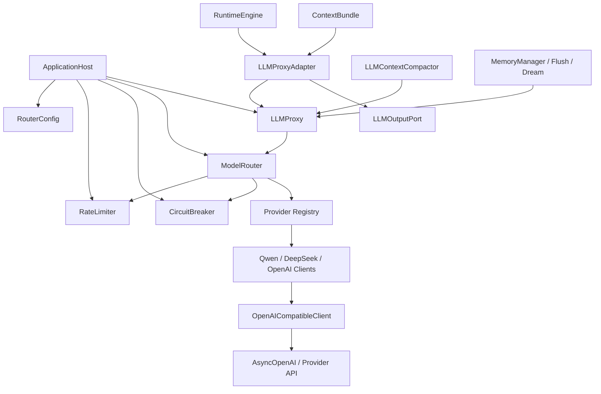
```mermaid
flowchart TB
    Host["ApplicationHost"]
    Config["RouterConfig"]
    Router["ModelRouter"]
    Limiter["RateLimiter"]
    Breaker["CircuitBreaker"]
    Proxy["LLMProxy"]

    Runtime["RuntimeEngine"]
    Adapter["LLMProxyAdapter"]
    Context["ContextBundle"]
    Output["LLMOutputPort"]

    Compactor["LLMContextCompactor"]
    Memory["MemoryManager / Flush / Dream"]

    Registry["Provider Registry"]
    Client["OpenAICompatibleClient"]
    Concrete["Qwen / DeepSeek / OpenAI Clients"]
    SDK["AsyncOpenAI / Provider API"]

    Host --> Config
    Host --> Limiter
    Host --> Breaker
    Host --> Router
    Host --> Proxy

    Runtime --> Adapter
    Context --> Adapter
    Adapter --> Proxy
    Adapter --> Output

    Compactor --> Proxy
    Memory --> Proxy

    Proxy --> Router
    Router --> Limiter
    Router --> Breaker
    Router --> Registry
    Registry --> Concrete
    Concrete --> Client
    Client --> SDK
```

**结论：**

- Bootstrap 是对象图发起者，`LLMProxy` 是主要调用门面，`ModelRouter` 是路由协调者。
- Runtime 不直接依赖 Provider SDK，而是通过 LLMPort Adapter 接入。
- RateLimiter 和 CircuitBreaker 由 Router 持有，Proxy 通过 Router 门面使用。
- Provider Client 负责协议解析，不负责候选选择和 Runtime 事实持久化。
- Compactor 和 Memory 复用同一 Proxy，但其调用语义与 Runtime Chat 主链并不完全相同。

### 2.2 业务 Chat 主链

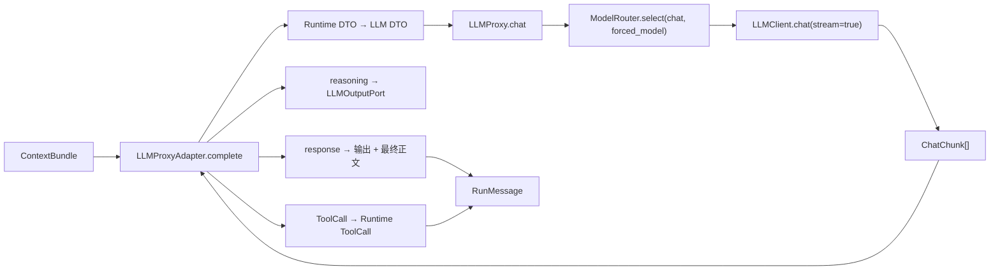
```mermaid
flowchart LR
    Bundle["ContextBundle"] --> Adapter["LLMProxyAdapter.complete"]
    Adapter --> Convert["Runtime DTO → LLM DTO"]
    Convert --> Proxy["LLMProxy.chat"]
    Proxy --> Select["ModelRouter.select(chat, forced_model)"]
    Select --> Provider["LLMClient.chat(stream=true)"]
    Provider --> Chunk["ChatChunk[]"]
    Chunk --> Adapter
    Adapter --> Reasoning["reasoning → LLMOutputPort"]
    Adapter --> Response["response → 输出 + 最终正文"]
    Adapter --> Calls["ToolCall → Runtime ToolCall"]
    Response --> RunMessage["RunMessage"]
    Calls --> RunMessage
```

**结论：**

- Runtime Policy 中冻结的 model_id 作为 `forced_model` 传入 Router。
- reasoning 只发射到输出端口，不进入最终 RunMessage。
- response 同时增量输出并聚合到最终 assistant 消息。
- Tool Call 在 Provider 层完成跨 Chunk 组装，在 Runtime Adapter 层解析 JSON 参数。
- Runtime 业务路径固定使用流式调用。

### 2.3 辅助调用分支

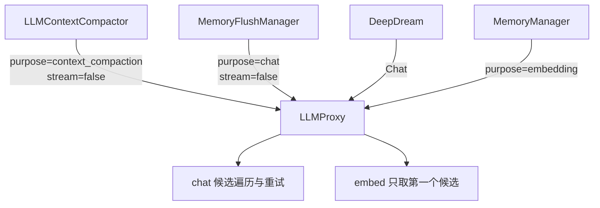
```mermaid
flowchart TB
    Proxy["LLMProxy"]

    Compact["LLMContextCompactor"] -->|purpose=context_compaction<br/>stream=false| Proxy
    Flush["MemoryFlushManager"] -->|purpose=chat<br/>stream=false| Proxy
    Dream["DeepDream"] -->|Chat| Proxy
    Memory["MemoryManager"] -->|purpose=embedding| Proxy

    Proxy --> Chat["chat 候选遍历与重试"]
    Proxy --> Embed["embed 只取第一个候选"]
```

**结论：**

- Context Compaction 复用 Chat 路由，但关闭流式输出且不提供 Tool。
- Memory Flush 使用默认 chat purpose，而不是独立 memory purpose。
- Embedding 有独立 Proxy 方法，但当前没有复用 Chat 的完整重试、限流、熔断上报和候选降级。
- 辅助消费者必须自行决定是否只接收 response，当前实现并不统一。

### 2.4 依赖方向

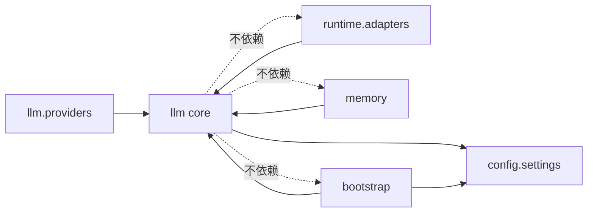
```mermaid
flowchart LR
    Config["config.settings"]
    LLM["llm core"]
    Providers["llm.providers"]
    RuntimeAdapter["runtime.adapters"]
    Memory["memory"]
    Bootstrap["bootstrap"]

    LLM --> Config
    Providers --> LLM
    RuntimeAdapter --> LLM
    Memory --> LLM
    Bootstrap --> Config
    Bootstrap --> LLM

    LLM -.不依赖.-> RuntimeAdapter
    LLM -.不依赖.-> Memory
    LLM -.不依赖.-> Bootstrap
```

**结论：**

- LLM Core 可以依赖配置 DTO，但不依赖 Runtime、Memory 或 Bootstrap。
- Runtime 和 Memory 通过 Adapter/调用门面依赖 LLM。
- Provider 实现依赖 LLM 基础契约和 OpenAI-compatible 基类。
- 具体 Config→Router→Proxy 对象图只在 Bootstrap 构造。
- 禁止 Provider Client 直接保存 Run 或调用 ToolExecutor。

---

## 3. 组件总览

LLM Wiki 需要同时解释 LLM 核心、外部适配器和模型能力消费者，但三者不能混写为同一模块内部组件。

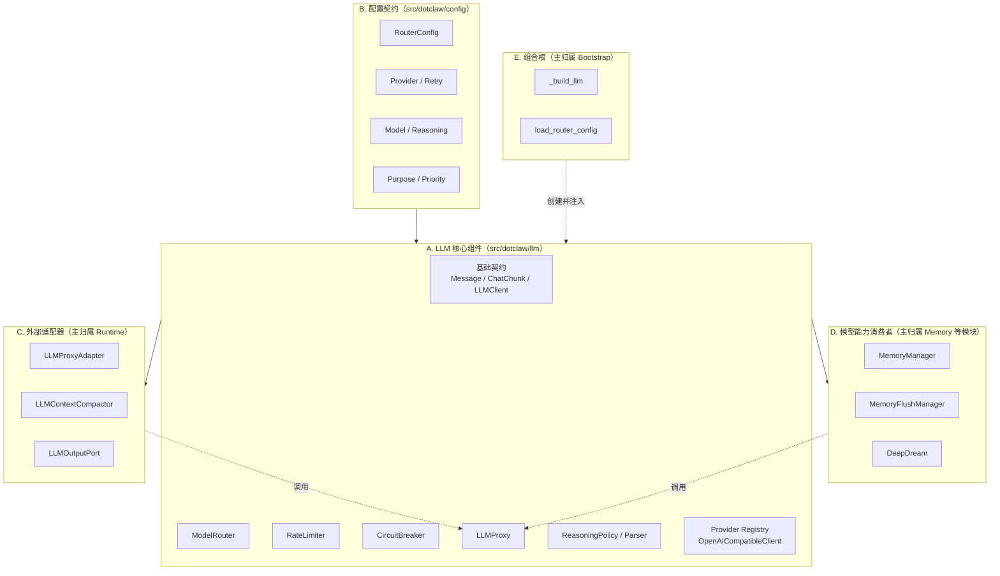
```mermaid
flowchart TB
    subgraph LLMCore["A. LLM 核心组件（src/dotclaw/llm）"]
        Contracts["基础契约<br/>Message / ChatChunk / LLMClient"]
        Router["ModelRouter"]
        Limiter["RateLimiter"]
        Breaker["CircuitBreaker"]
        Proxy["LLMProxy"]
        Reasoning["ReasoningPolicy / Parser"]
        Provider["Provider Registry<br/>OpenAICompatibleClient"]
    end

    subgraph ConfigLayer["B. 配置契约（src/dotclaw/config）"]
        RouterConfig["RouterConfig"]
        ProviderConfig["Provider / Retry"]
        ModelConfig["Model / Reasoning"]
        Purpose["Purpose / Priority"]
    end

    subgraph ExternalAdapters["C. 外部适配器（主归属 Runtime）"]
        LLMAdapter["LLMProxyAdapter"]
        Compactor["LLMContextCompactor"]
        Output["LLMOutputPort"]
    end

    subgraph Consumers["D. 模型能力消费者（主归属 Memory 等模块）"]
        MemoryManager["MemoryManager"]
        Flush["MemoryFlushManager"]
        Dream["DeepDream"]
    end

    subgraph Composition["E. 组合根（主归属 Bootstrap）"]
        Builder["_build_llm"]
        Loader["load_router_config"]
    end

    ConfigLayer --> LLMCore
    LLMCore --> ExternalAdapters
    LLMCore --> Consumers
    Composition -.创建并注入.-> LLMCore
    ExternalAdapters -.调用.-> Proxy
    Consumers -.调用.-> Proxy
```

**结论：**

- `src/dotclaw/llm` 内部组件包括契约、Router、Limiter、Breaker、Proxy、Reasoning 和 Provider 协议层。
- `LLMProxyAdapter` 与 `LLMContextCompactor` 的主归属是 Runtime；本 Wiki 只解释它们如何接入 LLM。
- `MemoryManager`、`MemoryFlushManager` 和 `DeepDream` 的主归属是 Memory；它们是模型能力消费者，不是 LLM 内部组件。
- `_build_llm` 的主归属是 Bootstrap，负责创建共享对象图。
- ModelRouter 负责候选和 Client 生命周期，LLMProxy 负责编排，Provider Client 负责协议。
- Runtime Adapter 决定哪些文本成为运行事实；辅助消费者当前对 reasoning 的过滤并不统一。

### 3.1 组成部分与责任

| 分类 | 组成部分 | 主归属 | 稳定职责 |
|---|---|---|---|
| LLM 核心 | Base DTO / LLMClient | LLM | 模型无关消息与响应 |
| LLM 核心 | ModelRouter | LLM | 选择、过滤、Client 缓存和状态上报 |
| LLM 核心 | RateLimiter | LLM | Provider 级令牌桶 |
| LLM 核心 | CircuitBreaker | LLM | Provider 级状态机 |
| LLM 核心 | LLMProxy | LLM | 重试、退避、候选切换和流保护 |
| LLM 核心 | Reasoning Policy / Parser | LLM | 文本语义分流 |
| LLM 核心 | Provider Registry / Compat Client | LLM | 实现发现、协议转换和解析 |
| 配置契约 | Router/Provider/Model/Purpose | Config | 描述候选、供应商和 reasoning |
| 外部适配器 | LLMProxyAdapter | Runtime | DTO 转换、输出和最终消息 |
| 外部适配器 | LLMContextCompactor | Runtime | 非流式历史压缩 |
| 能力消费者 | MemoryManager / Flush / Dream | Memory | 向量化、日记忆决策和蒸馏 |
| 组合根 | `_build_llm` | Bootstrap | 创建并注入共享对象图 |

---

## 4. 各组件的类与职责

本节从模型无关契约进入配置、Router、Proxy、Reasoning、Provider、Runtime Adapter 和辅助消费者。每个重要类或部分先说明职责、存在原因和调用链位置。

### 4.1 基础契约

#### 4.1.1 `LLMUsage`

**职责与用途：**`LLMUsage` 表示部分 Chat 路由用途，当前定义：

```text
CHAT
CONTEXT_COMPACTION
```

它用于历史压缩时避免魔法字符串。Embedding 方法仍使用字符串 `"embedding"`，因此该枚举尚未覆盖全部模型用途。

**`TextDeltaKind`**

**职责与用途：**`TextDeltaKind` 为文本增量赋予语义：

```text
REASONING
RESPONSE
```

它不表示 Provider 字段名，也不表示入口是否展示。Provider 将原始字段或标签转换为该类型，Runtime Adapter 再决定持久化边界。

**`ChatTextDelta`**

**职责与用途：**`ChatTextDelta` 是单个 Chunk 内有序文本片段。一个原始 Provider Chunk 可以产生多个 delta，例如：

```text
reasoning_content
→ REASONING

content
→ RESPONSE
```

native 模式同时存在两者时，顺序固定为 reasoning 在前、response 在后；tags 模式按原始文本中标签出现顺序输出。

**`TokenUsage`**

**职责与用途：**`TokenUsage` 保存单次 Provider 调用返回的输入、输出 Token 快照。

```text
input_tokens
output_tokens
```

它来自 Provider API 的 usage，不是 Runtime TokenCounter 的预算结果。未返回 usage 时当前值为 0。

#### 4.1.2 `Message`

**职责与用途：**`Message` 是 Provider 无关的模型消息 DTO。

字段：

| 字段 | 含义 |
|---|---|
| `role` | system/user/assistant/tool |
| `content` | 文本正文 |
| `name` | 可选消息名称 |
| `tool_call_id` | Tool Result 关联 ID |
| `tool_calls` | assistant 发出的 Tool Call |

当前 Message 不保存 reasoning 或 Provider 私有状态。

#### 4.1.3 `ToolCall`

**职责与用途：**LLM 层 ToolCall 保存模型返回的原始 JSON 字符串参数。

```text
id
name
arguments: str
```

JSON 校验不在 Provider 层完成。Runtime Adapter 会把 arguments 解析为对象，失败时当前降级为空对象。

**`ToolDefinition`**

**职责与用途：**ToolDefinition 是模型可见 Function Schema。

```text
name
description
parameters
```

LLM 不判断 Capability、审批或实际 Handler 是否存在。

#### 4.1.4 `ChatChunk`

**职责与用途：**`ChatChunk` 是流式或非流式调用的标准输出包，可平行携带：

```text
text_deltas
tool_calls
finish_reason
usage
```

并非每个 Chunk 都有所有字段。OpenAI-compatible 流式实现通常：

```text
若干文本 Chunk
→ 可选 ToolCall Chunk
→ 最终 finish/usage Chunk
```

#### 4.1.5 `LLMClient`

**职责与用途：**`LLMClient` 是具体 Provider 的模型协议接口。

```python
chat(messages, tools=None, stream=True) -> AsyncIterator[ChatChunk]
embed(texts, dimensions=1024) -> list[list[float]]
```

即使 `stream=False`，Chat 仍通过 AsyncIterator 统一返回一个或多个 ChatChunk。

---

### 4.2 路由配置

**`ProviderRetryConfig`**

**职责与用途：**保存 Provider 级重试配置：

```text
max_attempts
backoff_factor
```

`max_attempts` 在 Proxy 中作为总尝试次数使用，不是“首次调用外额外重试次数”。

#### 4.2.1 `ProviderConfig`

**职责与用途：**描述一个 Provider：

```text
api_key
base_url
rate_limit
circuit_breaker
retry
```

当前 `load_router_config()` 没有将 YAML 的 `circuit_breaker` 写入该对象，因此 Breaker 通常使用默认值。

**`ModelReasoningConfig`**

**职责与用途：**描述一个模型输出中 reasoning 的识别方式：

```text
mode = none | native | tags
reasoning_start / reasoning_end
response_start / response_end
```

只有 tags 模式使用自定义标签；none/native 转换为 `ReasoningPolicy` 时使用标准默认标签但不会解析它们。

#### 4.2.2 `ModelConfig`

**职责与用途：**描述路由中的一个逻辑模型名及其真实 Provider Model ID。

字段：

```text
provider
model_id
context_window
tokenizer_encoding
capabilities
status
reasoning
```

当前 Router 实际使用：

- provider；
- model_id；
- status；
- reasoning。

context_window 和 tokenizer_encoding 由 Runtime Policy 使用；capabilities 当前未参与 Router 的 Chat/Embedding/Tool 能力过滤。

**`PurposePriority`**

**职责与用途：**声明一个模型在某个 purpose 下的优先级。数字越小越优先。

**`PurposeConfig`**

**职责与用途：**为某个调用用途保存描述和有序模型候选。

当前候选链直接由 `priority` 列表形成，没有独立 fallback_chain 字段。

**`DefaultsConfig`**

**职责与用途：**保存全局默认 Provider、模型、默认参数和 fallback 开关。

当前 Router 主要读取 `defaults.model`。`defaults.provider`、`defaults.parameters` 和 `fallback_enabled` 尚未完整进入请求和降级执行路径。

#### 4.2.3 `RouterConfig`

**职责与用途：**聚合：

```text
defaults
providers
models
purposes
```

它是 Bootstrap、Router 和 Runtime Policy 之间共享的模型目录契约。但当前 Bootstrap 构建 LLM 与 Runtime Policy 时会分别加载/构造 RouterConfig，存在漂移风险。

**`_parse_reasoning_config`**

**职责与用途：**把 YAML reasoning 子段解析为 `ModelReasoningConfig`。

校验：

- mode 必须是 none/native/tags；
- tags 模式的起止标签不能为空；
- reasoning 起止不能相同；
- response 起止不能相同。

当前没有校验四个标签之间的交叉冲突，例如 reasoning_start 与 response_start 相同。

#### 4.2.4 `load_router_config`

**职责与用途：**加载 `model_router_config.yaml`，展开环境变量，构造 RouterConfig。

当前映射：

```text
defaults
providers.api_key/base_url/rate_limit/retry
models.provider/model_id/context_window/tokenizer/capabilities/status/reasoning
purposes.priority
```

遗漏：

```text
providers.circuit_breaker
```

文件为空或不存在时返回默认空 RouterConfig。

#### 4.2.5 `_build_router_config_from_legacy`

**职责与用途：**当 Router 文件不存在时，Bootstrap 使用旧 `config.yaml.llm.clients` 构建兼容 RouterConfig。

该路径主要生成 Chat 路由。Embedding 和 Context Compaction 若没有对应 purpose，Router 会回退 `defaults.model`。

---

### 4.3 `ModelRouter`

#### 4.3.1 `ModelRouter`

**职责与用途：**ModelRouter 是候选模型、Provider 状态和 Provider Client 生命周期的协调者。

持有：

```text
RouterConfig
RateLimiter
CircuitBreaker
model_name → LLMClient cache
```

它不执行 Provider 流迭代和文本聚合。

#### 4.3.2 `select`

**职责与用途：**根据 purpose 和可选 forced_model 返回候选模型名列表。

正常流程：

```text
读取 purpose.priority
→ priority 升序
→ 过滤未配置或非 active 模型
→ RateLimiter.check
→ CircuitBreaker.get_state
→ CLOSED + HALF_OPEN
→ forced_model 提升
→ 必要时 OPEN 兜底
```

如果 `_build_candidates()` 返回空列表，`select()` 直接回退：

```text
[defaults.model]
```

该回退不会再次验证 defaults.model 是否存在、active、未限流或未熔断。

**`_build_candidates`**

**职责与用途：**将模型分为：

```text
normal
half_open
fallback(open)
```

正常候选为 `normal + half_open`。只在正常和半开候选都为空时，保留最优先的一个 OPEN 模型作为紧急兜底。

因此熔断器不是绝对拒绝边界，而是排序与降级信号。

**`_prioritize_forced`**

**职责与用途：**将调用者指定的模型或 Provider 提到前面。

规则：

1. forced_model 精确匹配当前 purpose 候选；
2. forced_model 精确匹配当前 purpose 的 OPEN 候选；
3. forced_model 匹配 Provider 名，则将该 Provider 的 active 模型放前；
4. 不匹配则保持 purpose 顺序。

限制：

- 精确模型若已配置但不在该 purpose.priority 中，不会从全局 models 自动加入；
- Provider 匹配会扩大到全局 active 模型；
- forced OPEN 模型仍允许立即尝试。

#### 4.3.3 `get_client`

**职责与用途：**按逻辑模型名懒加载并缓存 LLMClient。

流程：

```text
查 ModelConfig
→ 查 ProviderConfig
→ Provider Registry
→ 实例化具体 Client
→ 按 model_name 缓存
```

缓存的是 dotClaw LLMClient，不是底层 AsyncOpenAI 连接池。

**`_instantiate_client`**

**职责与用途：**从 Provider Registry 取得 Client 类，注入：

```text
api_key
base_url
model_id
ReasoningPolicy
```

如果 Provider 未注册，当前回退到 `QwenClient`，而不是配置失败。

**Provider 状态门面**

**职责与用途：**Router 向 Proxy 暴露：

```text
try_acquire(provider, timeout)
report_success(model)
report_failure(model)
get_provider_name(model)
```

Proxy 不直接访问 RateLimiter 和 CircuitBreaker。

**Retry 配置门面**

**职责与用途：**`_get_retry_config()` 和 `_get_backoff_config()` 从模型所属 Provider 读取重试参数。

它们是私有方法，但 LLMProxy 当前直接调用，形成类间私有 API 耦合。

---

### 4.4 `RateLimiter`

**`RateLimitConfig`**

**职责与用途：**当前只支持每分钟请求数：

```text
requests_per_minute
```

0 或未配置表示不限流。

#### 4.4.1 `RateLimiter`

**职责与用途：**Provider 级令牌桶，同一 Provider 的多个模型共享配额。

内部状态：

```text
provider → (tokens, last_refill_time)
一个全局 asyncio.Lock
```

**`check`**

**职责与用途：**无锁近似检查，用于 Router 提前过滤。

它不消费 Token，也不保证随后 acquire 成功。真正守门员是 acquire。

#### 4.4.2 `acquire`

**职责与用途：**在锁内补充并尝试消费 Token。

```text
有 Token
→ 立即消费

无 Token
→ 计算 wait_time
→ 超过 timeout 则 RateLimitTimeout
→ 否则锁外 sleep
→ 再次进入锁更新
```

Proxy 当前固定传入 0.1 秒 timeout。

#### 4.4.3 `RateLimitTimeout`

**职责与用途：**表示调用前无法及时获取 Token。Proxy 将其转换为候选降级信号，不计入 Circuit Breaker 失败。

---

### 4.5 `CircuitBreaker`

**`BreakerConfig`**

**职责与用途：**保存：

```text
failure_threshold
cooldown_seconds
half_open_max
```

failure_threshold=0 表示关闭该 Provider 熔断。

#### 4.5.1 `BreakerState`

**职责与用途：**三态：

```text
CLOSED
OPEN
HALF_OPEN
```

#### 4.5.2 `CircuitBreaker`

**职责与用途：**按 Provider 跟踪连续失败和冷却时间。

状态转换：

```text
CLOSED --连续失败达阈值--> OPEN
OPEN --冷却完成--> HALF_OPEN
HALF_OPEN --成功--> CLOSED
HALF_OPEN --失败--> OPEN
```

状态只在进程内存中，不跨重启共享。

**`get_state` / `_get_effective_state`**

**职责与用途：**查询时自动执行 OPEN→HALF_OPEN 转换。Router 使用它进行候选分组。

**`on_success` / `on_failure`**

**职责与用途：**由 Proxy 在一次模型尝试成功或失败后上报。

当前 Proxy 对每次重试尝试都上报失败，因此阈值统计的是 Provider 尝试失败次数，不是完整业务调用失败次数。

#### 4.5.3 `try_half_open`

**职责与用途：**用于限制 HALF_OPEN 探测并发数量。

当前 ModelRouter 只读取 `get_state()`，没有调用 `try_half_open()`，因此 `half_open_max` 尚未形成实际守门语义。

---

### 4.6 `LLMProxy`

#### 4.6.1 `CallSetupError`

**职责与用途：**表示尚可安全切换候选的调用失败。

来源：

- RateLimitTimeout；
- 流开始但尚未产生文本增量时中断；
- 单模型全部重试耗尽。

#### 4.6.2 `NonRetryableStreamError`

**职责与用途：**表示已经向上层交付可见 reasoning/response 后发生流异常。此时重试或切换模型可能造成重复输出，因此直接向上抛出。

当前“可见输出”只判断 `text_deltas`，不包含已交付 ToolCall。

#### 4.6.3 `LLMProxy`

**职责与用途：**提供统一 Chat/Embedding 门面。Chat 负责完整候选编排，Embedding 当前是简化路径。

**`available_models`**

**职责与用途：**返回当前 `chat` purpose 的 Router 候选。结果受限流、熔断和配置状态影响，不是完整模型配置列表。

#### 4.6.4 `chat`

**职责与用途：**完整流程：

```text
Router.select
→ 遍历 model candidates
→ get_client
→ 读取 Provider retry/backoff
→ 每次尝试 acquire
→ client.chat
→ anext 首个 Chunk
→ 流式转发
→ 成功上报
→ 失败重试或切换候选
```

`get_client()` 在单模型重试 try 块之前执行。模型/Provider 配置错误或 Client 构造异常会直接中断整个调用，不进入当前候选的重试和降级。

**首 Chunk 边界**

**职责与用途：**Proxy 主动 `anext(chat_iter)`，用于区分：

- 调用前/首 Chunk 前失败；
- 已开始流式交付后的失败。

当前 first_chunk_ts 在第一个传输 Chunk 到达时记录，不要求该 Chunk 包含可见文本。相关 TTFT/Token 局部变量没有形成返回结果或主链观测输出。

**单模型重试**

**职责与用途：**未知异常按 ProviderRetryConfig 执行指数退避：

```text
base_delay * 2^attempt
```

每次异常会 `report_failure()`。最终失败转换为 CallSetupError，随后尝试下一个模型。

**候选降级**

**职责与用途：**RateLimitTimeout 和 CallSetupError 会切换下一个候选。NonRetryableStreamError 不降级。

全部候选失败后抛 RuntimeError，并包含候选名和最后错误。

#### 4.6.5 `embed`

**职责与用途：**按 embedding purpose 获取候选，取第一个 Client 执行 Embedding。

当前未执行：

- try_acquire；
- Provider 重试；
- 候选切换；
- report_success/failure；
- Circuit Breaker 更新。

**Journal 钩子**

**职责与用途：**Chat 接收可选 journal 并调用 `llm_call_start/end`。

当前 Runtime Adapter 不传 journal，Host 也未将 Journal 接入主链。`llm_call_end()` 当前在首 Chunk 到达时调用，名称与完整调用结束语义不一致。

---

### 4.7 Reasoning

#### 4.7.1 `ReasoningMode`

**职责与用途：**

```text
NONE
→ content 全部作为 response

NATIVE
→ reasoning_content 作为 reasoning
→ content 作为 response

TAGS
→ 只解析 content 中的标签
→ 忽略 reasoning_content
```

#### 4.7.2 `ReasoningPolicy`

**职责与用途：**不可变、模型级策略。ModelRouter 创建 Client 时从 ModelReasoningConfig 转换并注入。

Client 可以跨请求缓存，因为 Policy 不含请求级状态。

#### 4.7.3 `ReasoningStreamParser`

**职责与用途：**仅 tags 模式使用的单次 Chat 状态机。

状态：

```text
OUTSIDE
REASONING
EXPLICIT_RESPONSE
```

语义：

- 标签外文本默认 response；
- reasoning 区文本为 reasoning；
- response 区文本为 response；
- 协议标签被剥离；
- 不支持嵌套；
- 未匹配标签按当前区域原文输出。

**跨 Chunk 标签缓冲**

**职责与用途：**Parser 会保留可能是标签前缀的尾部文本，等待下一原始 Chunk 补全。

流结束时 flush：

- REASONING 区剩余文本仍为 reasoning；
- 其他区域剩余文本为 response；
- 未闭合区域不会被视为错误。

---

### 4.8 Provider 注册表

#### 4.8.1 Provider Registry

**职责与用途：**装饰器将 provider_name 映射到 LLMClient 类。

重复名称当前直接覆盖，没有冲突错误。

**`get_provider`**

**职责与用途：**首次 Registry 为空时触发自动发现，然后按名称查询。

**`_discover`**

**职责与用途：**遍历 providers 目录下所有 Python 模块并导入，触发注册装饰器。

特点：

- 单个模块导入失败记录 warning；
- `_auto_discovered` 在导入前设置为 True；
- 失败模块不会在后续自动重试；
- 若 Registry 在调用前已非空，`get_provider()` 不会触发完整发现。

---

### 4.9 `OpenAICompatibleClient`

#### 4.9.1 `_StreamParseState`

**职责与用途：**保存一次流式调用的局部状态：

```text
pending_tool_calls
finish_reason
input_tokens
output_tokens
```

每次 chat 新建，避免缓存 Client 的并发调用共享工具参数或 reasoning Parser。

#### 4.9.2 `OpenAICompatibleClient`

**职责与用途：**统一 OpenAI-compatible Provider 的：

- Message 转换；
- Tool Schema 转换；
- Chat 请求；
- SSE 解析；
- ToolCall 累积；
- reasoning 分流；
- Token Usage；
- Embedding 分批。

具体 Provider 只提供 API Key、Base URL、Model ID 和 AsyncOpenAI Client。

**`_convert_messages`**

**职责与用途：**转换 role、content、name、tool_call_id 和 tool_calls。

当前不发送：

- reasoning_content；
- reasoning；
- Provider 私有状态；
-模型级默认 parameters。

**Tool Schema 转换**

**职责与用途：**把 ToolDefinition 转成 OpenAI function schema：

```json
{
  "type": "function",
  "function": {
    "name": "...",
    "description": "...",
    "parameters": {}
  }
}
```

当前不显式设置 tool_choice、parallel_tool_calls 或 strict。

#### 4.9.3 流式 Chat

**职责与用途：**请求参数：

```text
model
messages
stream
stream_options.include_usage
tools?
```

随后：

```text
每个原始 Chunk
→ usage 更新
→ ToolCall 参数累积
→ reasoning/response delta
→ finish 时输出 ToolCall Chunk
→ 流结束 flush tags parser
→ 最终 finish/usage Chunk
```

**ToolCall 累积**

**职责与用途：**按 Provider ToolCall index 累积：

```text
id
function.name
function.arguments
```

finish_reason 出现时一次性输出所有 name 非空的 ToolCall。

#### 4.9.4 非流式 Chat

**职责与用途：**读取完整 message.content、reasoning_content 和 usage，并生成一个 ChatChunk。

当前限制：

- 不解析 `message.tool_calls`；
- finish_reason 固定为 `"stop"`，未读取 choice.finish_reason；
- 非流式带工具调用的标准契约不完整。

当前 Runtime 主调用固定 stream=True，Compactor/Memory 非流式调用不携带工具，因此主路径尚未触发该缺口。

#### 4.9.5 `embed`

**职责与用途：**按 16 条文本分批调用 OpenAI Embeddings API，向 Provider 传入 model、input 和 dimensions。

它不负责路由、重试和缓存；路由由 LLMProxy，缓存由 MemoryManager。

**`_get_client`**

**职责与用途：**具体 Provider 每次 Chat/Embed 调用时创建 AsyncOpenAI。

ModelRouter 缓存的是 Client 包装器，底层 AsyncOpenAI 当前没有跨调用复用和显式关闭。

---

### 4.10 具体 Provider

#### 4.10.1 `QwenClient`

**职责与用途：**注册名 `qwen`，使用 OpenAI-compatible 基类，仅保存 api_key、base_url 和 model。

#### 4.10.2 `DeepSeekClient`

**职责与用途：**注册名 `deepseek`，复用相同协议基类。Reasoning 行为由模型配置而不是 Client 类硬编码。

#### 4.10.3 `OpenAIClient`

**职责与用途：**注册名 `openai`，复用相同协议基类。

#### 4.10.4 未注册 Provider 回退

**职责与用途：**ModelRouter 对未知 provider 当前回退到 QwenClient。

由于 QwenClient 本质也是 OpenAI-compatible 包装器，该回退可能对部分兼容端点工作，但会把配置错误延迟到请求阶段，并缺少明确 Provider 能力验证。

---

### 4.11 Runtime 接入

#### 4.11.1 `LLMProxyAdapter`

**职责与用途：**实现 Runtime `LLMPort`，负责两套 DTO 转换和最终运行语义收敛。

输入：

```text
ContextBundle
RunExecutionView
LLMOutputPort?
```

输出：

```text
RunMessage(LLM_RESPONSE)
```

**输入转换**

**职责与用途：**将 Runtime RunMessage 转换为 LLM Message，并将 Runtime ToolDefinition 转换为 LLM ToolDefinition。

Runtime ToolCall.arguments 对象会重新序列化为 JSON 字符串。

**模型选择**

**职责与用途：**Adapter 使用冻结策略：

```python
model=execution.policy.model_id
```

传入 LLMProxy forced_model，purpose 使用默认 chat，stream 固定 True。

#### 4.11.2 Reasoning 与 Response 边界

**职责与用途：**

```text
REASONING
→ 只 emit LLMOutputEvent
→ 不聚合最终正文

RESPONSE
→ emit
→ 聚合最终正文
→ 标记 has_streamed_response
```

没有 output_port 时 response 仍聚合，但 has_streamed_response 为 False。

**ToolCall 转换**

**职责与用途：**将 LLM ToolCall.arguments JSON 解析为 Runtime 对象。

当前非法 JSON或非对象值统一降级 `{}`，没有保留解析错误。

**错误映射**

**职责与用途：**Adapter 捕获所有异常并统一抛：

```text
LLMUnavailableError("业务模型服务不可用")
```

因此 NonRetryableStreamError、配置错误、输出端口错误和 Provider 错误在 Runtime 上层被压缩为同一类别。

**取消**

**职责与用途：**`cancel(run_id)` 当前为空实现，因为 LLMProxy 没有请求句柄。

---

### 4.12 Context 压缩接入

#### 4.12.1 `LLMContextCompactor`

**职责与用途：**把 Runtime ContextCompactionRequest 转成一次无 Tool、非流式模型调用。

```text
purpose=context_compaction
stream=false
tools=None
```

**压缩输入**

**职责与用途：**构造：

```text
system: 压缩规则
user: previous_summary + fragments + target_token_budget JSON
```

摘要为空时失败，避免静默丢失历史。

**文本聚合**

**职责与用途：**当前会把每个 ChatChunk 的全部 `text_deltas` 内容拼接，不区分 reasoning 和 response。

若压缩模型配置 native/tags reasoning，推理文本可能进入最终摘要。

---

### 4.13 Memory 接入

#### 4.13.1 `MemoryManager`

**职责与用途：**通过 `LLMProxy.embed()` 为查询和 Memory Chunk 生成向量。

查询失败时：

```text
向量检索跳过
→ 仍执行关键词检索
```

批量同步失败时只跳过向量索引。

**Embedding Cache**

**职责与用途：**单条查询向量由 MemoryManager 自己缓存。LLMProxy 和 Provider 不缓存 Embedding 结果。

#### 4.13.2 `MemoryFlushManager`

**职责与用途：**使用非流式 Chat 生成 append/modify/skip JSON 决策。

当前会拼接所有 text_deltas；Reasoning 文本可能破坏 JSON，随后降级为本地追加摘要。

#### 4.13.3 `DeepDream`

**职责与用途：**复用同一 LLMProxy 对长期 Memory 做蒸馏。它属于 Memory 领域消费者，不改变 LLM Router 契约。

---

### 4.14 Bootstrap 装配

#### 4.14.1 `_build_llm`

**职责与用途：**创建：

```text
RouterConfig
RateLimiter
CircuitBreaker
ModelRouter
LLMProxy
```

Router 文件存在时加载新配置；不存在时从旧 Config 构建兼容配置。

**Rate Limit 装配**

**职责与用途：**从：

```text
providers.{name}.rate_limit.requests_per_minute
```

创建 Provider 级 RateLimitConfig。

**Circuit Breaker 装配**

**职责与用途：**从 ProviderConfig.circuit_breaker 创建 BreakerConfig。

当前 RouterConfig Loader 没有填充该字段，因此通常使用：

```text
failure_threshold=5
cooldown_seconds=30
half_open_max=1
```

**Runtime 装配**

**职责与用途：**同一 LLMProxy 同时注入：

```text
LLMProxyAdapter
LLMContextCompactor
MemoryManager / Flush / Dream
```

这保证模型目录和 Provider Client Registry 共享，但不同消费者的错误与输出语义仍由各自 Adapter 决定。

---


## 5. 组件依赖和使用流程

本节分别说明启动装配、业务 Chat、候选选择、单模型重试、流式保护、Reasoning、ToolCall、非流式辅助调用、Embedding、限流和熔断。

### 5.1 启动装配

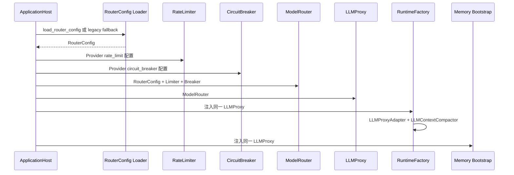
```mermaid
sequenceDiagram
    participant Host as ApplicationHost
    participant Config as RouterConfig Loader
    participant Limiter as RateLimiter
    participant Breaker as CircuitBreaker
    participant Router as ModelRouter
    participant Proxy as LLMProxy
    participant Runtime as RuntimeFactory
    participant Memory as Memory Bootstrap

    Host->>Config: load_router_config 或 legacy fallback
    Config-->>Host: RouterConfig
    Host->>Limiter: Provider rate_limit 配置
    Host->>Breaker: Provider circuit_breaker 配置
    Host->>Router: RouterConfig + Limiter + Breaker
    Host->>Proxy: ModelRouter
    Host->>Runtime: 注入同一 LLMProxy
    Runtime->>Runtime: LLMProxyAdapter + LLMContextCompactor
    Host->>Memory: 注入同一 LLMProxy
```

**结论：**

- Host 是装配发起者，ModelRouter 是 LLM 内部共享状态协调者。
- Runtime Chat、Context Compaction 和 Memory 共用同一 Router、Limiter、Breaker 和 Client Cache。
- RouterConfig 在当前 Bootstrap 中没有作为单一对象同时注入 Runtime Policy，模型预算元数据可能与实际 Router 漂移。
- Breaker 配置对象会创建，但 YAML 自定义值当前未被 Loader 写入。

### 5.2 Runtime 业务 Chat

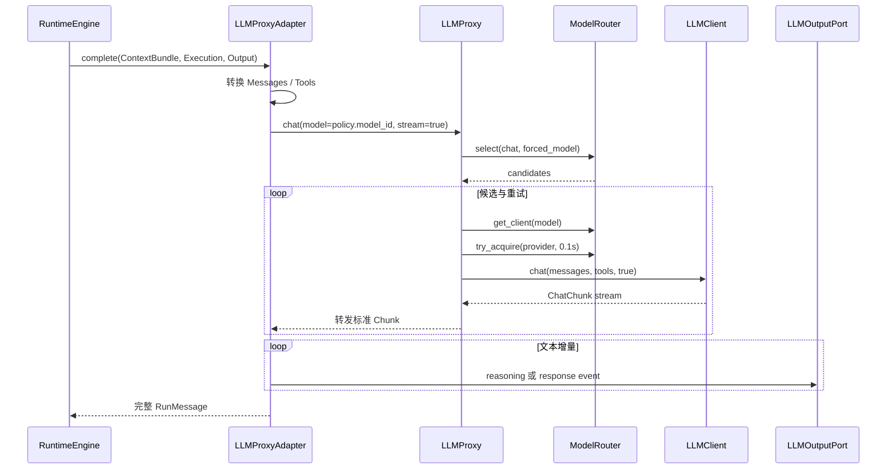
```mermaid
sequenceDiagram
    participant Engine as RuntimeEngine
    participant Adapter as LLMProxyAdapter
    participant Proxy as LLMProxy
    participant Router as ModelRouter
    participant Client as LLMClient
    participant Output as LLMOutputPort

    Engine->>Adapter: complete(ContextBundle, Execution, Output)
    Adapter->>Adapter: 转换 Messages / Tools
    Adapter->>Proxy: chat(model=policy.model_id, stream=true)
    Proxy->>Router: select(chat, forced_model)
    Router-->>Proxy: candidates

    loop 候选与重试
        Proxy->>Router: get_client(model)
        Proxy->>Router: try_acquire(provider, 0.1s)
        Proxy->>Client: chat(messages, tools, true)
        Client-->>Proxy: ChatChunk stream
        Proxy-->>Adapter: 转发标准 Chunk
    end

    loop 文本增量
        Adapter->>Output: reasoning 或 response event
    end
    Adapter-->>Engine: 完整 RunMessage
```

**结论：**

- Adapter 发起 Proxy 调用，Proxy 协调候选，Provider Client 协议化外部调用。
- forced_model 来自 Run 创建时冻结的 Policy，不从 Session 或 CLI 临时读取。
- reasoning 与 response 的持久化边界由 Runtime Adapter 决定，不由 Provider 决定。
- Provider 返回的 usage 进入 RunMessage metadata，不替代 Runtime 输入预算。

### 5.3 候选构建

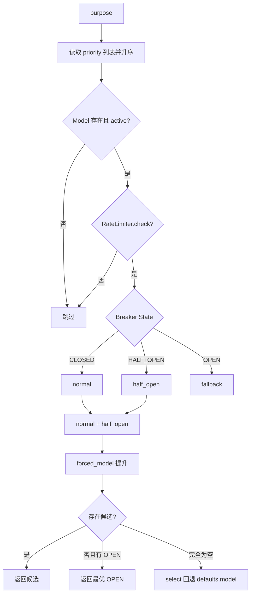
```mermaid
flowchart TD
    Purpose["purpose"] --> Priority["读取 priority 列表并升序"]
    Priority --> Active{"Model 存在且 active?"}
    Active -->|否| Skip["跳过"]
    Active -->|是| Rate{"RateLimiter.check?"}
    Rate -->|否| Skip
    Rate -->|是| State{"Breaker State"}
    State -->|CLOSED| Normal["normal"]
    State -->|HALF_OPEN| Half["half_open"]
    State -->|OPEN| Open["fallback"]

    Normal --> Merge["normal + half_open"]
    Half --> Merge
    Merge --> Forced["forced_model 提升"]
    Forced --> Has{"存在候选?"}
    Has -->|是| Return["返回候选"]
    Has -->|否且有 OPEN| Emergency["返回最优 OPEN"]
    Has -->|完全为空| Default["select 回退 defaults.model"]
```

**结论：**

- status、限流和熔断是候选过滤信号。
- OPEN Provider 在全部正常候选消失时仍可能作为紧急兜底被调用。
- HALF_OPEN 当前只被加入候选，没有调用 `try_half_open()` 限制探测数量。
- 完全空候选时 defaults.model 会绕过前述过滤重新进入结果。
- `fallback_enabled` 当前不影响该流程。

### 5.4 Forced Model

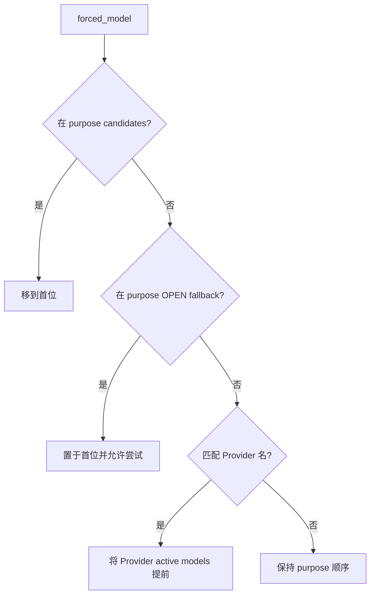
```mermaid
flowchart TD
    Forced["forced_model"] --> Exact{"在 purpose candidates?"}
    Exact -->|是| Front["移到首位"]
    Exact -->|否| OpenExact{"在 purpose OPEN fallback?"}
    OpenExact -->|是| OpenFront["置于首位并允许尝试"]
    OpenExact -->|否| Provider{"匹配 Provider 名?"}
    Provider -->|是| ProviderModels["将 Provider active models 提前"]
    Provider -->|否| Ignore["保持 purpose 顺序"]
```

**结论：**

- Identity.model 不是绝对强制，只是候选优先提示。
- 精确模型若不在当前 purpose.priority 中会被忽略。
- Provider 名匹配可以扩大到该 Provider 的全局 active 模型。
- forced OPEN 模型不受熔断排序保护。
- 不匹配只记录 warning，不使调用失败。

### 5.5 单模型重试与候选降级

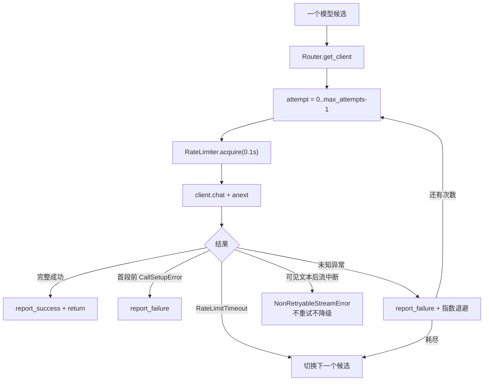
```mermaid
flowchart TD
    Candidate["一个模型候选"] --> Client["Router.get_client"]
    Client --> Attempt["attempt = 0..max_attempts-1"]
    Attempt --> Acquire["RateLimiter.acquire(0.1s)"]
    Acquire --> Start["client.chat + anext"]
    Start --> Result{"结果"}

    Result -->|完整成功| Success["report_success + return"]
    Result -->|RateLimitTimeout| Next["切换下一个候选"]
    Result -->|首段前 CallSetupError| Failure["report_failure"]
    Result -->|未知异常| Retry["report_failure + 指数退避"]
    Retry -->|还有次数| Attempt
    Retry -->|耗尽| Next
    Result -->|可见文本后流中断| Abort["NonRetryableStreamError<br/>不重试不降级"]
```

**结论：**

- 单模型重试发生在候选切换之前。
- Provider 失败按每次 attempt 计入 Circuit Breaker。
- RateLimitTimeout 不计入 Provider 失败。
- Client 构造位于重试块外，配置/构造错误会直接中断整个调用。
- 一旦交付非空文本 delta，后续流中断不会自动重试。

### 5.6 流式可见输出边界

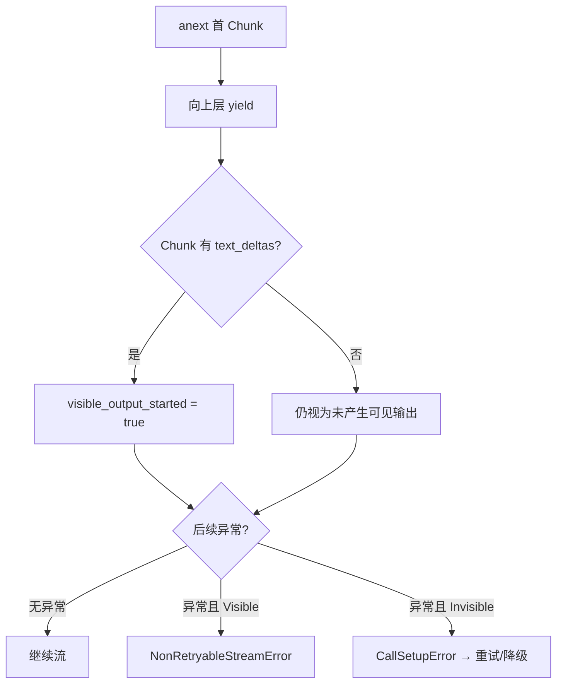
```mermaid
flowchart TD
    First["anext 首 Chunk"] --> Yield["向上层 yield"]
    Yield --> Text{"Chunk 有 text_deltas?"}
    Text -->|是| Visible["visible_output_started = true"]
    Text -->|否| Invisible["仍视为未产生可见输出"]

    Visible --> Error{"后续异常?"}
    Invisible --> Error

    Error -->|无异常| Continue["继续流"]
    Error -->|异常且 Visible| NonRetry["NonRetryableStreamError"]
    Error -->|异常且 Invisible| Setup["CallSetupError → 重试/降级"]
```

**结论：**

- “可见输出”只认 reasoning/response 文本，不认 usage、finish 或 ToolCall。
- 首 Chunk 到达时间不等于首个可见 Token 时间。
- ToolCall 已交付但没有文本时，理论上仍可能被视为可重试边界。
- Proxy 不缓冲已经 yield 的文本，因此不能在上层无感切换模型。

### 5.7 Native Reasoning

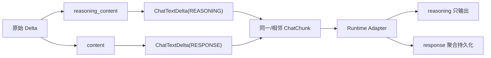
```mermaid
flowchart LR
    Provider["原始 Delta"] --> RC["reasoning_content"]
    Provider --> Content["content"]
    RC --> Reasoning["ChatTextDelta(REASONING)"]
    Content --> Response["ChatTextDelta(RESPONSE)"]
    Reasoning --> Chunk["同一/相邻 ChatChunk"]
    Response --> Chunk
    Chunk --> Adapter["Runtime Adapter"]
    Adapter --> Output["reasoning 只输出"]
    Adapter --> Persist["response 聚合持久化"]
```

**结论：**

- native 模式只读取 `reasoning_content`。
- reasoning 与 response 同一原始 Chunk 存在时，reasoning 先输出。
- Provider 返回的其他 reasoning 字段当前不会被识别。
- Runtime 不保存 reasoning，因此后续消息不会将它重新发送给 Provider。

### 5.8 Tags Reasoning

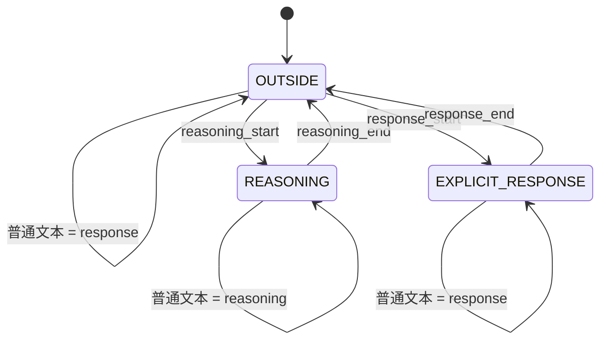
```mermaid
stateDiagram-v2
    [*] --> OUTSIDE
    OUTSIDE --> REASONING: reasoning_start
    REASONING --> OUTSIDE: reasoning_end
    OUTSIDE --> EXPLICIT_RESPONSE: response_start
    EXPLICIT_RESPONSE --> OUTSIDE: response_end

    OUTSIDE --> OUTSIDE: 普通文本 = response
    REASONING --> REASONING: 普通文本 = reasoning
    EXPLICIT_RESPONSE --> EXPLICIT_RESPONSE: 普通文本 = response
```

**结论：**

- Parser 每次 Chat 新建，状态不会跨请求复用。
- 标签可跨原始 Chunk，通过尾部缓冲拼接。
- 不支持嵌套；区域内非匹配标签按正文保留。
- 流结束时未闭合区域不会报错。
- 四标签交叉相同或互为前缀时，当前配置校验不足。

### 5.9 流式 ToolCall 组装

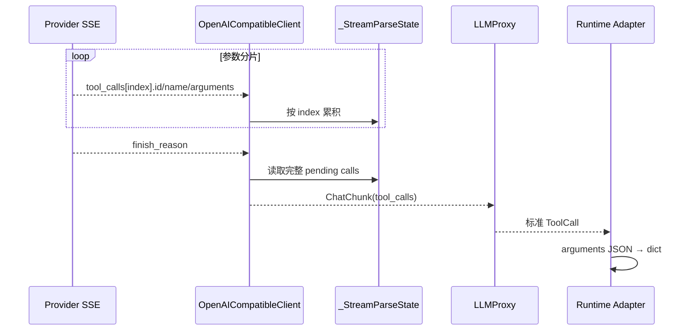
```mermaid
sequenceDiagram
    participant SDK as Provider SSE
    participant Client as OpenAICompatibleClient
    participant State as _StreamParseState
    participant Proxy as LLMProxy
    participant Adapter as Runtime Adapter

    loop 参数分片
        SDK-->>Client: tool_calls[index].id/name/arguments
        Client->>State: 按 index 累积
    end
    SDK-->>Client: finish_reason
    Client->>State: 读取完整 pending calls
    Client-->>Proxy: ChatChunk(tool_calls)
    Proxy-->>Adapter: 标准 ToolCall
    Adapter->>Adapter: arguments JSON → dict
```

**结论：**

- Provider Client 只拼接参数，不校验 JSON Schema。
- ToolCall 只在检测到 finish_reason 时集中输出。
- Runtime Adapter 将非法 JSON 静默映射为空对象。
- Tool Capability、Policy 和审批在 LLM 层之外。
- 非流式分支当前不提取 ToolCall。

### 5.10 非流式 Chat

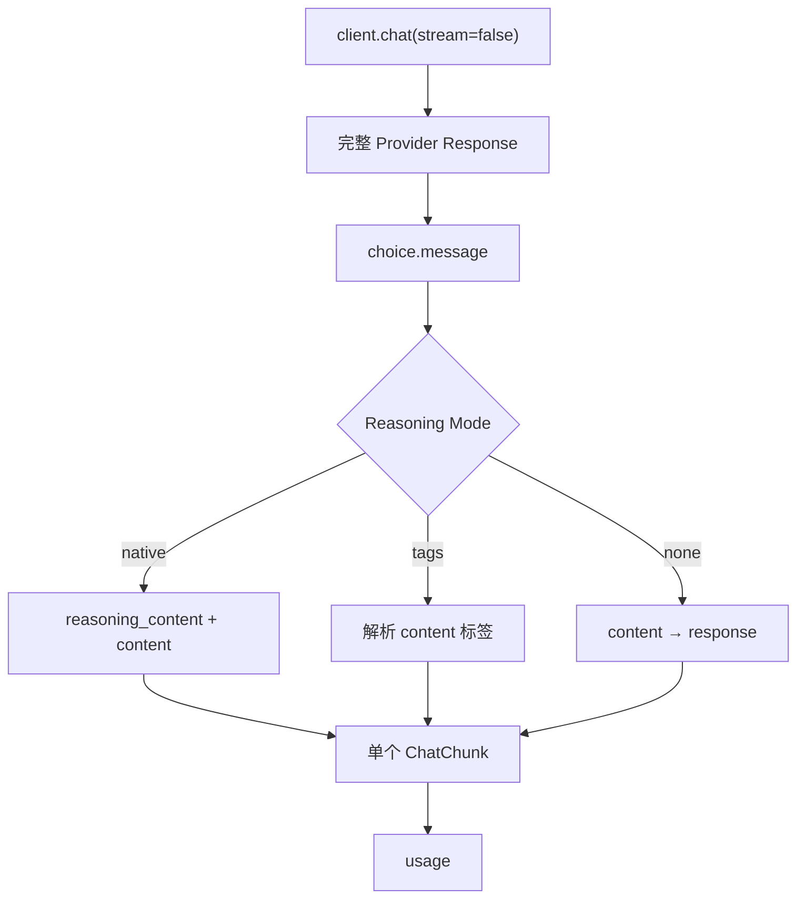
```mermaid
flowchart TD
    Call["client.chat(stream=false)"] --> Response["完整 Provider Response"]
    Response --> Message["choice.message"]
    Message --> Reasoning{"Reasoning Mode"}
    Reasoning -->|native| Native["reasoning_content + content"]
    Reasoning -->|tags| Tags["解析 content 标签"]
    Reasoning -->|none| None["content → response"]
    Native --> Chunk["单个 ChatChunk"]
    Tags --> Chunk
    None --> Chunk
    Chunk --> Usage["usage"]
```

**结论：**

- 非流式仍使用 AsyncIterator 统一契约。
- 当前 finish_reason 固定 stop。
- 当前忽略完整响应中的 message.tool_calls。
- Context Compactor 和 Memory Flush 不传 tools，因此尚未依赖非流式 ToolCall。
- 辅助消费者应过滤 response，但当前多数直接拼接全部 delta。

### 5.11 Context Compaction

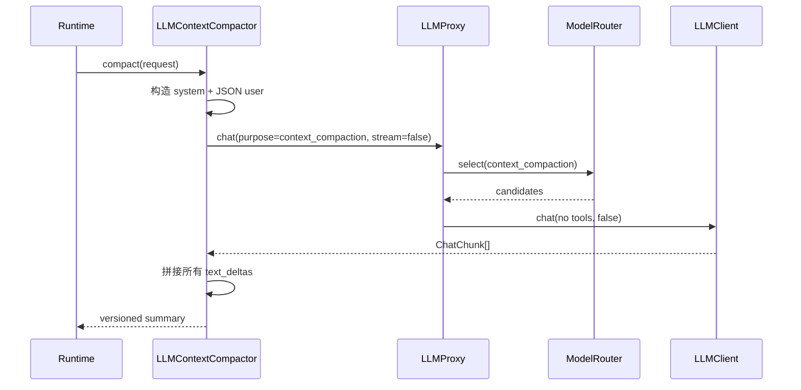
```mermaid
sequenceDiagram
    participant Runtime as Runtime
    participant Compactor as LLMContextCompactor
    participant Proxy as LLMProxy
    participant Router as ModelRouter
    participant Client as LLMClient

    Runtime->>Compactor: compact(request)
    Compactor->>Compactor: 构造 system + JSON user
    Compactor->>Proxy: chat(purpose=context_compaction, stream=false)
    Proxy->>Router: select(context_compaction)
    Router-->>Proxy: candidates
    Proxy->>Client: chat(no tools, false)
    Client-->>Compactor: ChatChunk[]
    Compactor->>Compactor: 拼接所有 text_deltas
    Compactor-->>Runtime: versioned summary
```

**结论：**

- 压缩调用复用 Chat 的重试和候选降级。
- 压缩不携带 Tool，避免模型执行副作用。
- 空摘要会使压缩失败。
- 当前 reasoning 与 response 全部被拼接，可能污染摘要。
- legacy Router 没有该 purpose 时回退默认 Chat 模型。

### 5.12 Embedding

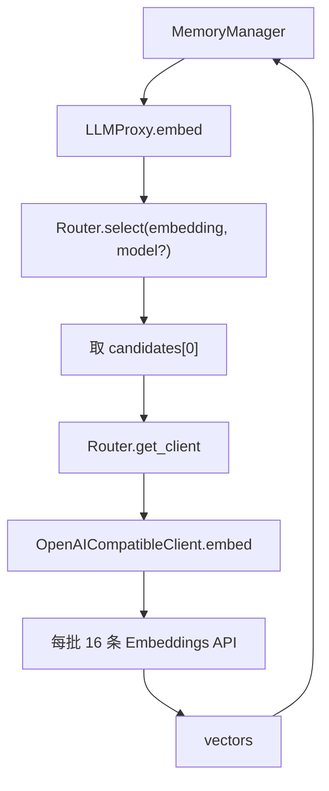
```mermaid
flowchart TD
    Memory["MemoryManager"] --> Proxy["LLMProxy.embed"]
    Proxy --> Select["Router.select(embedding, model?)"]
    Select --> First["取 candidates[0]"]
    First --> Client["Router.get_client"]
    Client --> Batch["OpenAICompatibleClient.embed"]
    Batch --> API["每批 16 条 Embeddings API"]
    API --> Vectors["vectors"]
    Vectors --> Memory
```

**结论：**

- Embedding 使用 Router 的 purpose 选择，但不遍历后续候选。
- 不执行限流 acquire、重试、Breaker 上报和降级。
- MemoryManager 对单查询向量提供 LRU Cache。
- Embedding 失败时 Memory 检索可降级为关键词。
- MemoryConfig 中 provider/model/api 字段当前没有直接决定该路由。

### 5.13 RateLimiter

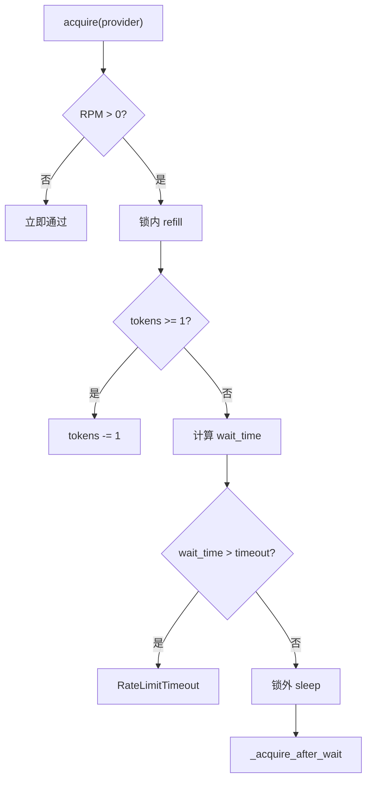
```mermaid
flowchart TD
    Request["acquire(provider)"] --> Config{"RPM > 0?"}
    Config -->|否| Pass["立即通过"]
    Config -->|是| Lock["锁内 refill"]
    Lock --> Token{"tokens >= 1?"}
    Token -->|是| Consume["tokens -= 1"]
    Token -->|否| Wait["计算 wait_time"]
    Wait --> Timeout{"wait_time > timeout?"}
    Timeout -->|是| Error["RateLimitTimeout"]
    Timeout -->|否| Sleep["锁外 sleep"]
    Sleep --> Reacquire["_acquire_after_wait"]
```

**结论：**

- 限流维度是 Provider，不是模型。
- Router.check 是无锁预判，acquire 才是实际守门。
- Proxy timeout 固定 100ms，更倾向于快速切换候选而非排队。
- 等待后的二次获取没有重新判断是否真正积累到完整 Token，存在并发超发风险。
- 状态只在当前进程内。

### 5.14 Circuit Breaker

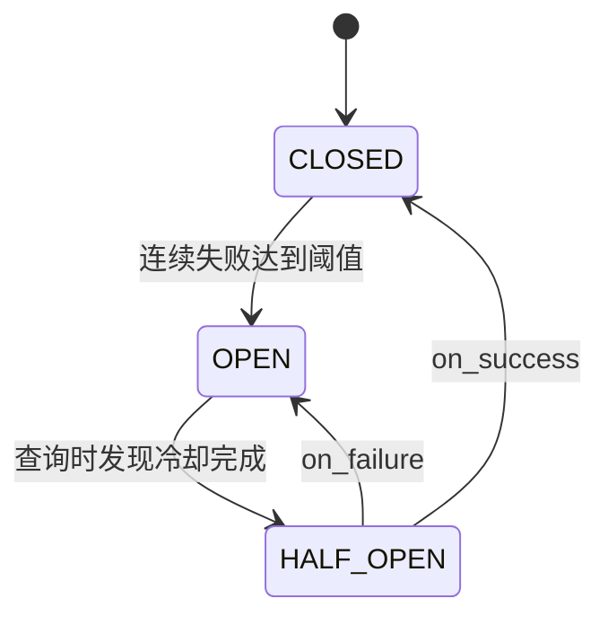
```mermaid
stateDiagram-v2
    [*] --> CLOSED
    CLOSED --> OPEN: 连续失败达到阈值
    OPEN --> HALF_OPEN: 查询时发现冷却完成
    HALF_OPEN --> CLOSED: on_success
    HALF_OPEN --> OPEN: on_failure
```

**结论：**

- 熔断维度是 Provider，同一 Provider 的模型共享状态。
- 状态转换在 Router 查询和 Proxy 上报时发生。
- `try_half_open()` 当前没有接入 Router，half_open_max 未生效。
- 全部正常候选消失时 Router 仍会尝试一个 OPEN Provider。
- 状态修改没有锁，不是跨线程/多协程严格原子状态机。

### 5.15 Provider 自动发现

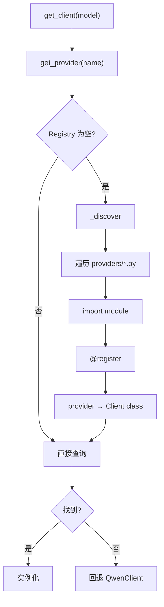
```mermaid
flowchart TD
    Router["get_client(model)"] --> Get["get_provider(name)"]
    Get --> Empty{"Registry 为空?"}
    Empty -->|是| Discover["_discover"]
    Discover --> Files["遍历 providers/*.py"]
    Files --> Import["import module"]
    Import --> Decorator["@register"]
    Decorator --> Registry["provider → Client class"]
    Empty -->|否| Lookup["直接查询"]
    Registry --> Lookup
    Lookup --> Found{"找到?"}
    Found -->|是| Instantiate["实例化"]
    Found -->|否| Qwen["回退 QwenClient"]
```

**结论：**

- 发现发生在首次 Client 创建，而不是 Host 启动时主动验证。
- 单模块导入失败只 warning，Registry 可能部分可用。
- 未注册 Provider 不会立即失败，而会进入 Qwen-compatible 回退。
- Provider 注册重复会覆盖。
- Provider 能力和 ModelConfig.capabilities 当前未交叉校验。

---

## 6. 对外接口与数据契约

### 6.1 LLM 公共 API

`dotclaw.llm` 当前公开：

```text
LLMClient
Message
ToolCall
ToolDefinition
ChatChunk
ChatTextDelta
TextDeltaKind
TokenUsage

LLMProxy
ModelRouter

ReasoningMode
ReasoningPolicy
ReasoningStreamParser

RateLimiter
RateLimitConfig
RateLimitTimeout

CircuitBreaker
BreakerConfig
BreakerState
```

OpenAICompatibleClient 和 Provider Registry 未从顶层 `__init__` 导出。

### 6.2 Chat 请求契约

```python
LLMProxy.chat(
    messages,
    tools=None,
    model=None,
    purpose="chat",
    stream=True,
    journal=None,
) -> AsyncIterator[ChatChunk]
```

调用者必须理解：

1. model 是优先提示，不保证绝对选中。
2. purpose 决定候选链。
3. stream=False 仍返回 AsyncIterator。
4. ChatChunk 可能只含文本、ToolCall、finish 或 usage。
5. 部分文本已经 yield 后发生异常不会自动降级。
6. tools=None 表示无工具；空列表在 Adapter 层转为 None。
7. Provider/模型构造错误可能绕过候选降级。

### 6.3 Embedding 请求契约

```python
LLMProxy.embed(
    texts,
    model=None,
    purpose="embedding",
    dimensions=1024,
) -> list[list[float]]
```

当前行为：

- 代码保留空候选防御检查，但 `ModelRouter.select()` 通常至少返回 `defaults.model`；
- 主要失败风险是默认模型未配置、Provider 不支持 Embedding 或 API 调用失败，而不是候选列表真正为空；
- 只使用第一个候选；
- Provider Client 按 16 条分批；
- 不保证输出数量与输入数量在异常 Provider 下自动验证；
- 不执行 Chat 的完整韧性协议。

### 6.4 `ChatChunk` 契约

| 字段 | 含义 | 是否可并存 |
|---|---|---|
| `text_deltas` | 有序 reasoning/response 文本 | 是 |
| `tool_calls` | 已组装的 ToolCall | 是 |
| `finish_reason` | Provider 结束原因 | 是 |
| `usage` | Token 快照 | 是 |

调用者不能假设：

- 每个 Chunk 只有一种字段；
- ToolCall 一定和 finish/usage 在同一 Chunk；
- 第一个 Chunk 一定含文本；
- 最后一个 Chunk 一定有正文。

### 6.5 Reasoning 契约

| 模式 | 输入来源 | response 来源 | reasoning 是否进入 Runtime 消息 |
|---|---|---|---|
| none | 不读取 reasoning 字段 | content | 否 |
| native | reasoning_content | content | 否 |
| tags | content 标签区 | 标签外/response 区 | 否 |

当前 Message 不保存 reasoning，因此 LLM 模块不保证 Provider 私有 reasoning 状态在多轮 Tool Call 中回传。

### 6.6 ToolCall 契约

Provider 层：

```text
arguments: JSON 字符串
```

Runtime 层：

```text
arguments: JSON 对象
```

转换失败：

```text
当前 → {}
```

这不是 Schema Validation；Tool 层仍需执行参数和安全校验。

### 6.7 路由配置契约

```text
RouterConfig
├── defaults
├── providers
├── models
└── purposes
```

关键关系：

1. Purpose.priority 引用逻辑 model name。
2. ModelConfig.provider 引用 ProviderConfig key。
3. ModelRouter Client Cache 以逻辑 model name 为键。
4. Provider 级限流、熔断和重试由同 Provider 下所有模型共享。
5. ModelConfig.model_id 是发送给 Provider API 的真实模型名。
6. reasoning 是模型级，不是 Provider 级。
7. context_window/tokenizer_encoding 主要由 Runtime Policy 使用。
8. capabilities 当前是声明信息，Router 不强制。

### 6.8 错误契约

| 错误 | 所在层 | 当前语义 |
|---|---|---|
| `RateLimitTimeout` | RateLimiter | 快速切换候选 |
| `CallSetupError` | Proxy | 当前模型安全失败，可换候选 |
| `NonRetryableStreamError` | Proxy | 可见文本后中断，不重试 |
| Provider SDK 异常 | Client/Proxy | 通常单模型重试 |
| 全候选失败 RuntimeError | Proxy | 模型服务整体失败 |
| `LLMUnavailableError` | Runtime Adapter | 所有底层异常统一映射 |
| `HistoryCompactorUnavailable` | Compactor | 压缩模型不可用 |

Runtime 当前无法从 `LLMUnavailableError` 区分：

- 配置错误；
- 限流耗尽；
- 熔断；
- Provider 认证；
- 流中断；
- 输出端口异常。

### 6.9 Runtime 输出契约

```text
ChatTextDelta(REASONING)
→ LLMOutputEvent.REASONING_DELTA

ChatTextDelta(RESPONSE)
→ LLMOutputEvent.RESPONSE_DELTA
→ 最终 RunMessage.content
```

`has_streamed_response` 只有在 output_port 存在且发射过 response 时为 True。

### 6.10 Client 生命周期契约

当前：

```text
ModelRouter
→ 缓存 LLMClient per model

OpenAICompatibleClient
→ 每次 chat/embed 创建 AsyncOpenAI
```

因此没有稳定的：

- 底层 Client close；
- 连接池跨调用复用；
- Host shutdown 回收 Provider SDK；
- 请求 Operation Handle。

### 6.11 关键不变量

1. Runtime 业务调用必须通过 LLMPort Adapter，而不是直接调用 Provider。
2. Router 负责候选，Proxy 负责重试，Provider 负责协议解析。
3. Provider Client 不保存请求级流状态。
4. 同一原始 Chunk 的 native reasoning 必须先于 response。
5. reasoning 不进入最终 RunMessage 和 Conversation。
6. response 必须保持原始顺序聚合。
7. ToolCall 参数必须跨 Chunk 按 index 累积。
8. Provider ToolCall JSON 不能代替 Tool 层参数校验。
9. 一旦交付可见文本，流中断不得自动切模型产生重复输出。
10. Provider 级限流和熔断由同 Provider 所有模型共享。
11. RateLimiter.check 只是预判，acquire 是守门。
12. OPEN Provider 仍可能作为最后兜底；不能把 Breaker 描述为绝对禁止。
13. HALF_OPEN 并发限制当前未接入，不能声称 half_open_max 已生效。
14. forced_model 是优先提示，不是绝对强制。
15. exact forced model 不在 purpose 链时当前可能被忽略。
16. defaults.model 回退必须存在于 models 才能成功创建 Client；当前未提前验证。
17. Runtime Chat 使用 stream=True；非流式 ToolCall 契约当前不完整。
18. Context Compactor 不应携带 Tool。
19. Compactor/Memory 摘要只应使用 response；当前实现尚未满足。
20. Embedding 当前不具备 Chat 等价的限流、重试和降级。
21. RouterConfig 的 circuit_breaker YAML 当前未贯通。
22. Provider Registry 自动发现失败不是可靠事实源。
23. 未注册 Provider 当前会回退 QwenClient，不能视为已验证兼容。
24. Message 不保存 Provider reasoning state。
25. LLMProxyAdapter.cancel 当前不终止底层请求。
26. Runtime 输出端口异常不应被误判为 Provider 不可用；当前尚未分离。
27. Provider Token Usage 与 Runtime Token Budget 是不同事实。
28. Client Cache 不等于底层 HTTP Client Cache。
29. Config 中 parameters/fallback_enabled/capabilities 存在不等于执行路径已消费。
30. Journal 参数存在不等于生产 Runtime 已接入 Journal。

---

## 7. 常见修改入口

| 修改目标 | 首要入口 | 可能涉及 | 必须保持的不变量 |
|---|---|---|---|
| 新增基础 DTO | `llm/base.py` | Provider、Runtime Adapter、测试 | Provider 无关、序列化语义明确 |
| 新增调用用途 | `LLMUsage`、RouterConfig purposes | Proxy、Bootstrap、消费者 | 候选链和 fallback 明确 |
| 修改模型候选顺序 | `model_router.py::_build_candidates` | rate/breaker/forced model | priority 稳定，状态过滤可解释 |
| 修改 forced model | `_prioritize_forced` | AgentPolicyResolver | 明确“强制”还是“优先” |
| 修改默认回退 | `ModelRouter.select` | DefaultsConfig、Config 校验 | 默认模型必须已配置且可调用 |
| 新增 Provider | `llm/providers/*.py` + `@register` | Config、Reasoning、Embedding | 不依赖 Runtime，定义能力边界 |
| 修改 Provider 发现 | `providers/__init__.py` | 启动验证、日志 | 失败和重复不可静默 |
| 修改 OpenAI 请求 | `openai_compat.py::chat` | Provider 兼容、工具、reasoning | 流式/非流式语义一致 |
| 修改 Message 转换 | `_convert_messages` | reasoning passthrough、ToolCall | role 和关联 ID 不丢失 |
| 修改 ToolCall 解析 | `_parse_stream_chunk` | Runtime Adapter、Tool | 按 index 组装，finish 边界明确 |
| 完善非流式 ToolCall | `OpenAICompatibleClient.chat` 非流分支 | Compactor、未来调用者 | 与流式标准 Chunk 一致 |
| 修改 native reasoning | `_extract_text_deltas` | ModelReasoningConfig、Runtime Output | reasoning 不混入 response |
| 修改 tags reasoning | `ReasoningStreamParser` | 配置校验、测试 | 跨 Chunk 标签不丢失 |
| 修改标签配置 | `_parse_reasoning_config` | ReasoningPolicy | 检查四标签冲突 |
| 修改限流 | `rate_limiter.py` | Router、Proxy | acquire 才是权威守门 |
| 修改限流 timeout | `LLMProxy.chat` | 候选策略、用户延迟 | 明确排队还是快速降级 |
| 修改熔断 | `circuit_breaker.py` | Router、Bootstrap Config | HALF_OPEN 探测必须受控 |
| 修改失败计数 | Proxy report_failure 调用点 | Breaker 阈值 | 区分 attempt 与 logical call |
| 修改单模型重试 | `LLMProxy.chat` | RetryConfig、取消 | 可见输出后不得重放 |
| 修改候选降级 | `LLMProxy.chat` | Error 分类、Router | 配置错误和服务错误分离 |
| 修改 Embedding | `LLMProxy.embed` | Memory、Router、Limiter | 输出顺序与输入对应 |
| 修改 Runtime LLM 接入 | `runtime/adapters/llm_proxy_adapter.py` | Runtime DTO、Channel | reasoning/response 边界不变 |
| 修改输出错误处理 | LLMProxyAdapter + Output Port | Channel、Runtime Error | 输出故障不伪装 Provider 故障 |
| 修改 ToolCall JSON | `_tool_call_from_legacy` | Tool Adapter | 不静默吞掉解析错误 |
| 修改 Context 压缩 | `llm_context_compactor.py` | History Compaction、Router purpose | 只使用 response |
| 修改 Memory Flush | `memory/flush.py` | LLM Proxy、JSON parser | reasoning 不污染 JSON |
| 修改 Embedding 路由配置 | `model_router_config.yaml` | Memory Config、Model capabilities | 使用 embedding 模型 |
| 修改 Router Loader | `config/settings.py::load_router_config` | Bootstrap、Policy | 完整映射所有 Provider 字段 |
| 修改 Client 生命周期 | OpenAICompatibleClient / Host | AsyncOpenAI、shutdown | 不泄漏连接池 |
| 接入 Journal | LLMProxy + Bootstrap/Runtime | Observability | 不影响调用成功语义 |
| 排查模型未按 Identity 选择 | Policy model → purpose priority → forced model | RouterConfig | exact model 必须在候选链或定义强制语义 |
| 排查无 Token Usage | Provider stream_options → final Chunk → Adapter | SDK 兼容 | 0 不应伪装精确值 |
| 排查流式重复风险 | visible_output_started → Error 分类 | Proxy、Channel | 已交付文本后不自动重试 |

---

## 8. 设计取舍、痛点和演进方向

本节区分当前已实现的架构承诺、核心设计选择、真实问题和候选演进方案。

### 8.1 当前架构承诺

当前 master 可以确认：

1. LLM 对上层暴露模型无关 Message、Tool 和 ChatChunk。
2. ModelRouter 负责候选选择，LLMProxy 负责调用编排，Provider Client 负责协议。
3. Chat 候选按 purpose.priority 生成。
4. 限流、熔断和重试以 Provider 为主要作用域。
5. Provider Client 的流式解析状态为请求局部状态。
6. Reasoning 支持 none、native 和 tags 三种模型级策略。
7. Runtime 只持久化 response 和 ToolCall，不持久化 reasoning。
8. 流式 ToolCall 参数按 index 累积，在结束边界统一输出。
9. Runtime Chat、Context Compaction 和 Memory 共用同一 LLMProxy。
10. Embedding 使用同一 Router，但当前采用简化执行路径。

### 8.2 核心设计取舍

#### 8.2.1 Router、Proxy、Provider 三层分离

**问题与选择：**模型选择、调用失败编排和协议解析变化频率不同。当前分别由 ModelRouter、LLMProxy 和 LLMClient 实现。

**未选择：**一个 Client 同时读取配置、选模型、重试和写 Runtime；每个 Provider 自己实现 fallback。

**收益：**候选策略统一；Provider 实现轻量；Runtime 不理解 SDK。

**代价与边界：**错误和私有方法跨层传递较多，配置错误所在层不总能被正确分类。

#### 8.2.2 Purpose 驱动路由

**问题与选择：**Chat、Context Compaction 和 Embedding 对模型的能力和成本要求不同。当前用 purpose.priority 定义独立候选链。

**未选择：**所有调用固定默认模型、消费者直接指定 Provider URL。

**收益：**调用者只表达用途；配置可以调整模型顺序。

**代价与边界：**capabilities 没有强制校验，purpose 缺失会直接回退默认模型。

#### 8.2.3 Provider 级韧性状态

**问题与选择：**同一 Provider 的模型通常共享 API Key、域名和限额。当前 RateLimiter、CircuitBreaker 和 RetryConfig 以 Provider 为作用域。

**未选择：**每模型独立限流/熔断、全局单桶。

**收益：**符合多数供应商配额和故障域。

**代价与边界：**一个模型失败会影响同 Provider 其他模型；Provider 下不同 Endpoint/账号无法独立治理。

#### 8.2.4 可见输出后禁止自动降级

**问题与选择：**流式文本已经展示后切模型会产生重复、拼接或语义跳变。当前只允许首个可见文本前重试和降级。

**未选择：**任何流错误都自动重试、先完整缓冲再展示。

**收益：**避免重复用户输出，保留低 TTFT。

**代价与边界：**中途失败只能向上报错；ToolCall 可见边界尚未纳入判断。

#### 8.2.5 Request-local 解析状态

**问题与选择：**Router 缓存 Provider Client，如果 Client 保存 Tool 参数或标签状态，并发 Session 会串线。当前每次 Chat 创建 `_StreamParseState` 和 Reasoning Parser。

**未选择：**Client 实例字段保存 pending calls、每个请求重新创建所有 Wrapper。

**收益：**缓存 Client 仍能并发；解析状态生命周期明确。

**代价与边界：**底层 AsyncOpenAI 反而每次新建，没有获得连接复用收益。

#### 8.2.6 封闭 Reasoning 语义

**问题与选择：**不同模型通过字段或标签返回推理。当前统一为 REASONING/RESPONSE 两类增量。

**未选择：**上层直接读取 Provider 字段、所有文本都写入最终回答。

**收益：**Channel 和 Runtime 不依赖供应商；reasoning 可独立展示。

**代价与边界：**Provider 私有推理状态被丢弃，部分模型多轮 Tool 协议可能需要回传。

#### 8.2.7 ToolCall 在 Provider 层组装

**问题与选择：**SSE 中 ToolCall 名称和参数可能跨多个 Chunk。当前 OpenAI-compatible Client 在协议层组装，Runtime 只接收完整调用。

**未选择：**Runtime 理解 OpenAI index/delta 协议。

**收益：**协议细节不泄漏；多个 Provider 共享实现。

**代价与边界：**非流式 ToolCall 尚未实现；JSON 错误直到 Runtime Adapter 才处理。

#### 8.2.8 Stream/Non-stream 统一 AsyncIterator

**问题与选择：**调用者希望统一消费方式。当前 stream=False 也 yield ChatChunk。

**未选择：**流式返回 Iterator、非流式返回另一个 Response DTO。

**收益：**Compactor、Memory 和 Runtime 可以共用聚合循环。

**代价与边界：**非流式分支容易与流式能力不一致，当前 ToolCall 和 finish_reason 已出现差异。

#### 8.2.9 Unknown Provider 兼容回退

**问题与选择：**部分供应商提供 OpenAI-compatible Endpoint。当前未注册 Provider 会使用 QwenClient 作为兼容 Wrapper。

**未选择：**未知名称立即失败、每个兼容 Provider 都写空壳 Client。

**收益：**兼容端点可能无需新增代码。

**代价与边界：**配置拼写错误和真实不兼容被延迟到请求期，Provider 能力不可验证。

#### 8.2.10 同一 Proxy 复用到辅助能力

**问题与选择：**Context Compaction、Memory Flush 和 Embedding 不再各自创建 Provider Client。当前统一复用 LLMProxy。

**未选择：**每个模块直接调用 OpenAI SDK。

**收益：**配置和 Client Registry 集中。

**代价与边界：**Chat 编排只部分复用于 Embedding；辅助消费者对 reasoning 的处理不一致。

### 8.3 已知痛点

#### L1. RouterConfig 在 Bootstrap 中存在双重构建

LLMProxy 构建在 Router 文件缺失时使用 legacy Config 生成 RouterConfig；Runtime AgentPolicyResolver 则单独调用 `load_router_config()`，文件缺失时得到空配置。

实际模型路由和 Runtime 冻结的 context_window/tokenizer 可能不一致。

#### L2. Circuit Breaker YAML 字段未被 Loader 映射

ProviderConfig 定义 circuit_breaker，Bootstrap 也读取它，但 `load_router_config()` 构造 ProviderConfig 时遗漏该字段。

用户配置的阈值当前通常不生效。

#### L3. 默认参数和 fallback 开关未进入执行路径

`DefaultsConfig.parameters` 中的 temperature/max_tokens 没有传给 OpenAI 请求；`fallback_enabled` 没有控制 Proxy 候选降级。

配置表面语义超过实际执行能力。

#### L4. Model capabilities 未被 Router 强制

ModelConfig.capabilities 当前不参与：

- chat 路由；
- Tool Calling；
- embedding 路由；
- reasoning 能力验证。

错误模型可能进入不支持的用途。

#### L5. Exact forced model 可能被静默忽略

Runtime 将 Identity.model 作为 forced_model，但精确模型若不在 purpose.priority 中，Router 不会从全局 models 加入，只记录 warning 并使用原候选。

“Agent 指定模型”与“实际使用模型”可能不一致。

#### L6. 空候选回退绕过状态过滤

当 purpose 候选因限流、配置或状态全部消失时，`select()` 返回 defaults.model，不重新验证：

- 模型是否存在；
- status；
- 限流；
- Breaker。

默认模型构造错误还会在 Proxy 重试块外直接中断。

#### L7. Embedding 没有完整韧性编排

`LLMProxy.embed()` 只调用第一个候选，不使用：

- Provider 限流；
- RetryConfig；
- Circuit Breaker；
- 后续候选；
- 成功/失败上报。

Memory 向量能力的可靠性明显弱于 Chat。

#### L8. `LLMUsage` 未覆盖 Embedding

枚举包含 chat/context_compaction，但 Embedding 使用裸字符串。用途契约没有形成单一封闭集合。

#### L9. HALF_OPEN 探测上限未生效

CircuitBreaker 实现了 `try_half_open()`，ModelRouter 未调用。多个并发 Session 可以同时对 HALF_OPEN Provider 发起探测，`half_open_max` 只是未消费配置。

#### L10. Circuit Breaker 按 Attempt 计失败且没有并发锁

Proxy 每次重试异常都调用 on_failure。一轮业务请求可能快速耗尽阈值。

状态字典没有锁，多协程同时更新时缺乏严格原子性。

#### L11. OPEN Provider 仍可被强制或兜底调用

forced model 在 OPEN 状态会被放到首位；全部 Provider 不可用时也会保留一个 OPEN 候选。

这是可用性优先选择，但会削弱熔断保护和冷却语义。

#### L12. RateLimiter 等待后可能并发超发

`_acquire_after_wait()` 在重新进入锁后直接执行：

```text
tokens = max(0, tokens - 1)
```

没有确认 tokens >= 1。多个请求同时 sleep 后醒来时，可能全部通过。

#### L13. 固定 100ms 限流等待不可配置

Proxy 对所有用途和 Provider 固定 timeout=0.1。高配额短突发场景可能过早切换模型，单 Provider 部署则可能直接失败。

#### L14. Provider Client 构造错误绕过候选降级

Router.get_client 在 Proxy 单候选 try/except 之前执行。模型未配置、Provider 未配置或 Client 构造失败会终止整个 Chat，而不是尝试后续候选。

#### L15. Provider 自动发现不完整且不可重试

`_auto_discovered` 在导入前设为 True；单模块导入失败后不再自动重试。

若 Registry 已因手工导入存在一个 Provider，get_provider 不触发全目录发现。

#### L16. Provider 注册冲突和未知回退过于宽松

重复注册直接覆盖；未知 Provider 回退 QwenClient。

系统没有启动期 ProviderLoadReport 或模型→Client 能力校验。

#### L17. 底层 AsyncOpenAI 每次调用创建且不关闭

ModelRouter 缓存 Wrapper Client，但 Qwen/DeepSeek/OpenAI Client 每次 `_get_client()` 都创建 AsyncOpenAI。

没有跨调用连接池复用，也没有 Host shutdown 生命周期。

#### L18. 非流式 Chat 与流式能力不一致

非流式分支：

- 忽略 message.tool_calls；
- finish_reason 固定 stop；
- 不保留部分 Provider 字段。

统一 AsyncIterator 契约没有保证统一功能语义。

#### L19. Provider-native reasoning 状态不会回传

Message 和 Runtime RunMessage 不保存 reasoning_content，`_convert_messages()` 也不发送。

需要在后续 Tool Call 轮次回传推理状态的 Provider/模型目前无法完整兼容。

#### L20. Native reasoning 只识别 `reasoning_content`

兼容服务若通过其他字段返回 reasoning，当前会静默丢失。能力由字段名硬编码，而不是 Provider Hook。

#### L21. Tags 配置校验不足

只验证各自 start/end 不相同，没有检查：

- reasoning 与 response 标签相同；
- 标签互为前缀；
- 四标签整体唯一。

Parser 会按最早位置和最长标签处理，但配置语义可能歧义。

#### L22. Compactor 和 Memory Flush 会拼接 reasoning

LLMContextCompactor 和 MemoryFlushManager 遍历全部 text_deltas，不筛选 RESPONSE。

后果：

- reasoning 进入历史摘要；
- reasoning 破坏 Flush JSON；
- 触发不必要本地降级。

#### L23. Runtime Adapter 压缩所有 LLM 异常

配置错误、Provider 错误、NonRetryableStreamError、OutputPort 异常等统一变成 LLMUnavailableError。

Runtime 无法决定：

- 是否重试；
- 是否提示部分输出；
- 是否切换入口；
- 是否修复配置。

#### L24. OutputPort 故障可能被误判为模型故障

`output_port.emit()` 位于 Adapter 的模型流 try 块内。Channel 输出异常会被统一映射成业务模型不可用。

#### L25. ToolCall JSON 错误被静默改为空对象

非法 JSON 或数组参数统一变 `{}`，没有保留 raw arguments、错误类型或 retryable 信息。

模型参数错误与真实空对象无法区分。

#### L26. ToolCall 不属于 Proxy 可见输出边界

Proxy 只在 text_deltas 非空时标记 visible_output_started。已经向上 yield ToolCall 后若发生异常，理论上仍可触发重试或候选切换。

#### L27. 缺少真实取消和调用 deadline

LLMProxy 没有 Operation Handle；Runtime Adapter.cancel 为空。

除 RateLimiter 100ms 外，模型请求、流式读取和重试总时长没有 Runtime 可控 deadline。

#### L28. Journal 钩子处于半接入状态

Proxy 支持 journal，但 Runtime 不传，Host 不装配。

同时：

- `llm_call_end()` 在首 Chunk 到达时调用；
- TTFT/Token 局部变量没有形成输出；
- finally 为空。

它不能被描述为当前完整观测能力。

#### L29. Memory Embedding 配置存在重复来源

MemoryConfig 包含 embedding_provider/model/api_base/api_key，但 Bootstrap 只将 dimensions 传入 MemoryManager，实际模型由 Router 的 embedding purpose 决定。

配置字段容易误导用户。

#### L30. 全局 `config.llm.stream` 未控制 Runtime 主路径

Runtime Adapter 固定 stream=True；Compactor/Flush 显式 stream=False。旧 Config 中 stream 字段没有成为当前调用策略权威。

### 8.4 演进方向

| 编号 | 解决的痛点 | 候选方向 | 影响与代价 |
|---|---|---|---|
| E1 | L1、L2 | Bootstrap 只构造一次完整 RouterConfig，同时注入 LLM Router 和 Runtime Policy；补齐 circuit_breaker 映射 | Config、Bootstrap、Runtime Policy |
| E2 | L3 | 定义 RequestOptions，将 defaults.parameters 和 fallback_enabled 明确接入或删除未消费配置 | Config、Proxy、Provider |
| E3 | L4、L8 | 统一 `LLMUsage`，Router 按 capabilities 校验 chat/tool/embedding/reasoning | Base、Config、Router、测试 |
| E4 | L5 | 明确 forced_model 语义：精确模型已配置且 active 时加入候选，或改名 preferred_model | Router、Agent Policy |
| E5 | L6、L14 | Router 启动期验证 defaults/purpose/model/provider；Client 构造失败转换为候选级 SetupError | Router、Bootstrap、Proxy |
| E6 | L7 | 提取通用 `execute_candidates(operation)`，Chat 与 Embed 共用限流、重试、Breaker 和 fallback | Proxy、LLMClient、Memory |
| E7 | L9、L10、L11 | 为 Breaker 增加原子 probe lease；明确 OPEN 是否允许 emergency fallback，并按 logical call/错误类别计数 | CircuitBreaker、Router、Proxy |
| E8 | L12、L13 | RateLimiter 使用条件循环或 semaphore/token bucket，按 deadline 等待；timeout 进入配置 | RateLimiter、ProviderConfig |
| E9 | L15、L16 | Host 启动时显式 discover/validate，返回 ProviderLoadReport；重复和未知 Provider 默认失败 | Provider Registry、Bootstrap |
| E10 | L17 | Provider Client 持有可复用 AsyncOpenAI，并实现 async close；Host 统一逆序关闭 | Providers、Bootstrap |
| E11 | L18 | 流式和非流式共用同一标准化解析，补齐 ToolCall、finish_reason 和 usage 测试 | OpenAICompatibleClient |
| E12 | L19、L20 | 增加 ProviderMessageState/ReasoningPassthrough Hook，仅保存协议必需状态而非默认持久化全文 | Base DTO、Provider、Runtime Context |
| E13 | L21 | 校验四标签全局唯一、非空和前缀冲突，或构建确定性 tokenizer | Config、Reasoning Parser |
| E14 | L22 | 辅助消费者只聚合 RESPONSE；reasoning 可丢弃或进入受控观测字段 | Compactor、Memory Flush/Dream |
| E15 | L23、L24 | 建立结构化 LLMErrorCode：CONFIG、RATE_LIMIT、AUTH、SETUP、STREAM_PARTIAL、OUTPUT_DELIVERY、UNAVAILABLE | LLM、Runtime Adapter、Channel |
| E16 | L25 | ToolCall 保留 raw arguments 和 parse_error；Tool 层返回明确 INVALID_ARGUMENTS | Base DTO、Runtime Adapter、Tool |
| E17 | L26 | 将 ToolCall 交付计入不可重试边界，或在 Proxy 内缓冲到调用完成再发布 | Proxy、Runtime Adapter |
| E18 | L27 | Provider 调用注册 Operation Handle，支持 deadline、cancel 和流关闭 | LLMClient、Proxy、Runtime |
| E19 | L28 | 删除未使用 Journal 局部指标或接入结构化 LLMCallTelemetry；区分首传输 Chunk 与首可见 Token | LLM、Journal、Bootstrap |
| E20 | L29、L30 | 清理旧 LLM/Memory 配置：路由配置成为模型选择权威，调用策略使用独立明确字段 | Config、Bootstrap、Memory |
| E21 | 多项 | 增加端到端契约测试：多 Provider fallback、流中断、并发 tags、ToolCall、Embedding 和 Runtime 输出 | tests/llm、tests/runtime、tests/memory |

---

## 9. 源码索引

### 9.1 LLM 目录

```text
src/dotclaw/llm/
├── __init__.py
├── base.py
├── proxy.py
├── model_router.py
├── rate_limiter.py
├── circuit_breaker.py
├── reasoning.py
├── openai_compat.py
└── providers/
    ├── __init__.py
    ├── qwen.py
    ├── deepseek.py
    └── openai.py
```

上表列出本次扫描确认的 LLM 文件和具体 Provider 实现。Provider Registry 会自动导入目录内其他 Python 模块，因此实际新增 Provider 应以仓库当前目录为准。

### 9.2 LLM 核心文件

| 文件 | 逻辑组件 | 主要内容 |
|---|---|---|
| `llm/__init__.py` | 公共 API | 导出契约、Proxy、Router、Reasoning、Limiter、Breaker |
| `llm/base.py` | 基础契约 | Message、ToolCall、ChatChunk、LLMClient |
| `llm/model_router.py` | 路由 | purpose 候选、状态过滤、Client Cache |
| `llm/proxy.py` | 调用编排 | 重试、退避、降级、流保护、Embedding |
| `llm/rate_limiter.py` | 限流 | Provider 令牌桶 |
| `llm/circuit_breaker.py` | 熔断 | CLOSED/OPEN/HALF_OPEN |
| `llm/reasoning.py` | Reasoning | Policy 和标签流解析 |
| `llm/openai_compat.py` | 协议适配 | OpenAI 消息、SSE、ToolCall、Embedding |
| `llm/providers/__init__.py` | Provider 注册 | 注册表和自动发现 |
| `llm/providers/qwen.py` | Provider | Qwen OpenAI-compatible Client |
| `llm/providers/deepseek.py` | Provider | DeepSeek OpenAI-compatible Client |
| `llm/providers/openai.py` | Provider | OpenAI Client |

### 9.3 Config 接入

```text
src/dotclaw/config/settings.py
model_router_config.yaml
config.yaml
```

| 内容 | 作用 |
|---|---|
| `ProviderConfig` | API、Rate Limit、Breaker、Retry |
| `ModelConfig` | Provider、Model ID、窗口、Tokenizer、能力、状态、Reasoning |
| `PurposeConfig` | 用途候选顺序 |
| `DefaultsConfig` | 默认模型与参数 |
| `load_router_config` | 新路由配置加载 |
| `_build_router_config_from_legacy` | 旧 LLM Config 兼容 |

### 9.4 Bootstrap 接入

```text
src/dotclaw/bootstrap/
├── _host_components.py
└── runtime_factory.py
```

| 文件 | LLM 视角 |
|---|---|
| `_host_components.py` | 创建 RouterConfig、RateLimiter、CircuitBreaker、ModelRouter、LLMProxy |
| `runtime_factory.py` | 将 Proxy 注入 Runtime Adapter、Context Compactor 和 Policy |

### 9.5 Runtime 接入

```text
src/dotclaw/runtime/
├── application/
│   ├── ports.py
│   └── dto.py
└── adapters/
    ├── llm_proxy_adapter.py
    └── llm_context_compactor.py
```

| 文件 | LLM 视角 |
|---|---|
| `runtime/application/ports.py` | LLMPort、LLMOutputPort、LLMUnavailableError |
| `runtime/application/dto.py` | ContextBundle、LLMOutputEvent |
| `runtime/adapters/llm_proxy_adapter.py` | Runtime DTO、reasoning/response 和 ToolCall 转换 |
| `runtime/adapters/llm_context_compactor.py` | 非流式上下文压缩 |

### 9.6 Memory 接入

```text
src/dotclaw/memory/
├── manager.py
├── flush.py
├── dream.py
├── embedding.py
└── storage.py
```

| 文件 | LLM 视角 |
|---|---|
| `memory/manager.py` | Embedding 查询和批量向量 |
| `memory/flush.py` | 非流式结构化日记忆决策 |
| `memory/dream.py` | 长期记忆蒸馏 |
| `memory/embedding.py` | 查询向量 Cache |
| `memory/storage.py` | Embedding 持久化与向量检索 |

### 9.7 Channel 输出接入

```text
src/dotclaw/channel/runtime_llm_output.py
```

该 Adapter 消费 Runtime `LLMOutputEvent`，按 run_id 展示“思考/回答”分区。它不直接依赖 LLM Provider Client。

