# MCP 模块总体说明

> 适用代码：`aandbcct/dotClaw` 的 `master` 分支  
> 扫描基准：2026-07-27，包含 MCP Client、Tool Provider、Tool Adapter、Config、Bootstrap、Tool 安全链、Agent 工具快照、CLI 与当前测试  
> 扫描提交：`3d343abea03c58e68fdcdf5fc8271352bafc988c`  
> 文档定位：自顶向下解释 dotClaw 如何连接 MCP Server、发现并注册 MCP Tools、经过统一 Tool 安全链执行调用，同时明确 resources/prompts、重连、动态刷新和结果内容类型中哪些已经接入、哪些仅保留底层接口。  
> 编写基准：《dotClaw Wiki 编写规范与验收准则 v1.1》  
> 上级导航：[dotClaw 开发者 Wiki](./README.md)

**快速导航**

| 需要回答的问题 | 阅读位置 |
|---|---|
| MCP 在 dotClaw 中负责什么、不负责什么 | 第 1～2 节 |
| Client、Provider、Adapter 和 Tool 安全链如何分工 | 第 3～4 节 |
| 启动发现、连接授权、工具执行、重连和关闭如何运行 | 第 5 节 |
| 配置、命名、Schema、状态和错误契约 | 第 6 节 |
| 修改某项 MCP 能力从哪里开始 | 第 7 节 |
| 当前设计、真实问题与演进方向 | 第 8 节 |
| 具体源码和测试在哪里 | 第 9 节 |

```text
当前已接入主链
MCP Server
→ McpClient 连接并发现 tools/resources/prompts
→ MCPToolProvider 只选择 tools
→ McpToolAdapter 转换为 ToolHandler
→ ToolRegistry
→ AgentPolicyResolver 按 Agent.allowed_tools 冻结 Run 工具快照
→ ToolExecutor 参数校验 / mcp.call Policy / Approval
→ MCP tools/call
→ ToolResult
→ Runtime

当前未进入 Agent 主链
MCP resources
MCP prompts
MCP 动态 list_changed
MCP 进度/流式内容
MCP 结构化与多模态结果保真

当前仓库默认状态
tools.mcp_enabled = true
tools.mcp_servers = []
→ _build_mcp() 返回 None
→ 不连接任何 Server
→ 不注册任何 MCP Tool
→ CLI /mcp 显示“MCP 未启用”
```

---

## 1. 模块定位与边界

MCP 模块是 dotClaw 的**外部 MCP Server 连接、能力发现与 Tool 适配层**。

它负责把 Server 暴露的 MCP Tool 转换为 dotClaw 统一 `ToolHandler`，并复用 Tool 模块已有的：

```text
Tool Definition
JSON Schema 校验
Capability Broker
Policy Engine
Approval
Timeout
Journal
Run 级工具快照
```

MCP 模块本身不直接决定某个 Agent 能否调用工具，也不直接把 Server 输出写进模型上下文。它只提供协议连接和适配；最终可见性与执行权仍由 Agent、Runtime 和 Tool 安全链决定。

### 1.1 核心职责

当前职责归纳为六组：

1. **连接管理**：按 Server 配置建立 stdio 或 streamable HTTP 连接。
2. **能力发现**：在初始化后读取 tools、resources 和 prompts 列表。
3. **Tool 适配**：只把 MCP tools 转换为 dotClaw `ToolHandler`。
4. **安全接入**：连接前经过 `mcp.connect` 网关，调用时经过 `mcp.call` 安全链。
5. **状态与降级**：记录 pending、connected、failed 和 crashed Server，允许单 Server 失败。
6. **生命周期管理**：在 Host 启动时完成首次发现，在 Host 关闭时释放连接。

### 1.2 主要使用者

| 使用者 | 如何使用 MCP |
|---|---|
| `ApplicationHost` | 创建并持有 MCPToolProvider，统一启动和关闭 |
| `_build_mcp()` | 读取配置、复用 ToolExecutor 安全组件、等待首次发现 |
| `MCPToolProvider` | 并行连接 Server，注册 tools，记录 Server 状态 |
| `McpClient` | 负责单 Server 协议连接、发现、调用、重连和关闭 |
| `McpToolAdapter` | 将一个 MCP Tool 转成 ToolDefinition 与 ToolHandler |
| `ToolRegistry` | 保存 MCP Tool Handler |
| `ToolExecutor` | 对 MCP Tool 执行统一校验、策略、审批和超时 |
| `CapabilityBroker` | 根据 ToolDefinition.metadata 形成 MCP_CALL 请求 |
| `PolicyEngine` | 评估允许 Server、`mcp.connect` 与 `mcp.call` |
| `AgentPolicyResolver` | 按 Agent.allowed_tools 冻结可见 MCP Tool |
| CLI `/tools` | 按 Server 展示已注册 MCP Tool |
| CLI `/mcp` | 展示 Provider 中的 Server 状态 |
| `McpClient.read_resource/get_prompt` | 底层原生接口；当前没有生产调用者 |

### 1.3 明确不负责的内容

MCP 当前不负责：

1. **Agent 工具授权**：Agent.allowed_tools 和 Agent policy_rules 属于 Agent/Tool。
2. **Tool 安全执行编排**：参数校验、审批、Journal 和 Runtime 两阶段审批属于 Tool/Runtime。
3. **resources/prompts 的 Agent 暴露**：当前只发现并缓存，不注册成 Tool。
4. **Server 安装与进程包管理**：不负责安装 npm/pip 包或验证命令来源。
5. **动态能力同步**：不监听 tools/list_changed、resources/list_changed 或 prompts/list_changed。
6. **远程认证生命周期**：只消费配置 Headers，不刷新 Token、不管理 OAuth。
7. **流式与进度传播**：不处理 MCP Progress Notification 或增量 Tool Result。
8. **结构化内容保真**：当前最终统一压成字符串 ToolResult。
9. **多租户隔离**：Server 配置和 Provider 是 Host 级全局资源。

### 1.4 与相邻模块的职责边界

| 相邻模块 | MCP 负责 | 相邻模块负责 |
|---|---|---|
| Tool | 构造 MCP Tool Handler | Registry、Schema、Capability、Policy、Approval、Journal |
| Agent | 提供 Tool Definition | allowed_tools 与 Agent policy_rules |
| Runtime | 不驱动 AgentRun | 冻结 Run 工具快照、审批恢复和 Tool Message |
| Bootstrap | 提供 Provider 构造能力 | 初始化顺序、降级、Host 持有和关闭 |
| Config | 消费 MCP 配置对象 | YAML、环境变量展开和基础校验 |
| CLI | 提供状态数据 | `/mcp` 与 `/tools` 的展示 |
| MCP Server | 发出协议请求 | tools/resources/prompts 定义与实际业务副作用 |
| Channel | 不直接使用 | 用户审批交互 |
| Journal | 不保存事件 | 通用 Tool 安全审计 |
| Context | 不拼接 MCP 专用文本 | 通过 Tools Slot 展示 Run 已冻结的 Tool Definitions |
| HTTP Client | 不复用 dotClaw HttpClient | MCP SDK 自身管理 streamable HTTP Transport |

---

## 2. 模块在项目中的位置

### 2.1 全局位置图

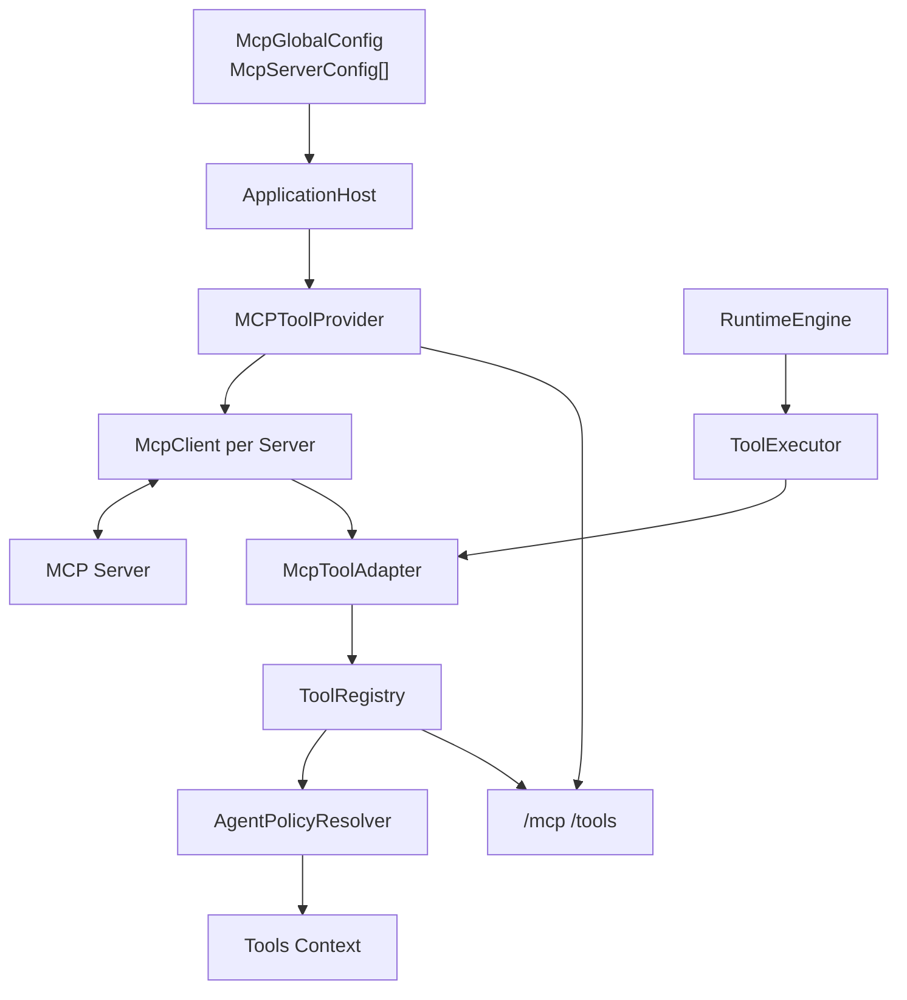

**结论：**

- MCP Provider 依赖既有 ToolRegistry，不创建独立执行系统。
- 每个配置 Server 对应一个 McpClient。
- Adapter 是协议世界和 dotClaw Tool 世界的唯一生产桥接。
- Agent Context 只看到已经注册且通过 Agent 白名单的 Tool Definition。
- CLI 从 Provider 和 ToolExecutor 两个入口分别展示 Server 与 Tool。

### 2.2 tools、resources 与 prompts

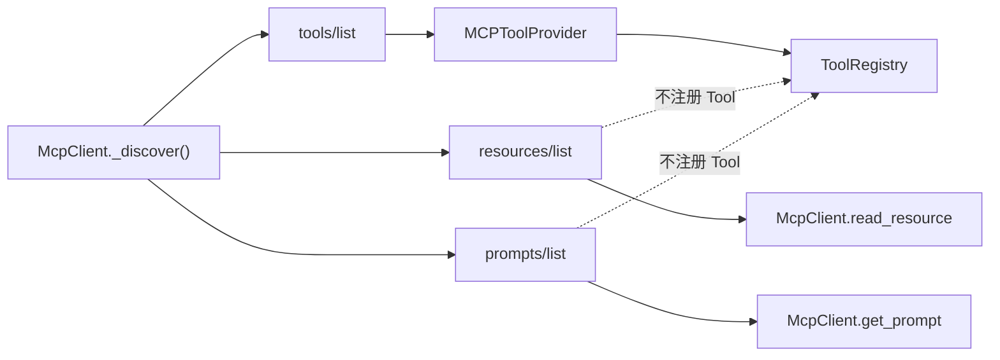

**结论：**

- `tools/list` 失败会使连接失败。
- `resources/list` 和 `prompts/list` 失败会被吞掉并降级为空列表。
- 只有 tools 会进入 ToolRegistry。
- read_resource/get_prompt 虽是公开 Client 方法，但当前 Host、Runtime、CLI 和 Context 都不调用。
- resources/prompts 当前属于“底层能力存在，产品主链未接入”。

### 2.3 启动平面与执行平面

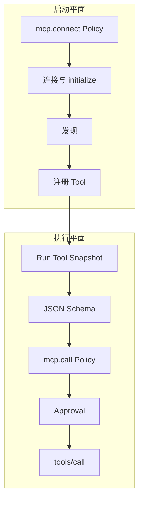

**结论：**

- 连接发生在 Host 初始化阶段，没有用户 Channel。
- 工具调用发生在具体 Run 内，可以进入 Runtime 审批恢复。
- `mcp.connect` 与 `mcp.call` 是两个独立安全阶段。MCP 连接和调用分别经过两个独立安全阶段。
- 首次发现完成后才构造 Runtime，避免首个 Run 漏掉 MCP Tool。
- 运行中不会重新发现并修改 Registry。

### 2.4 MCP 安全平面

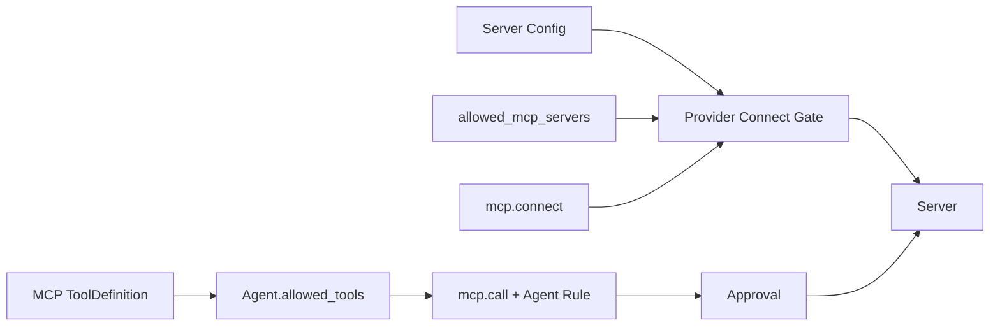

**结论：**

- Server 名必须先进入允许列表才能连接或调用。
- 全局规则是安全上限，Agent 规则只能收窄。
- Agent.allowed_tools 控制 Tool Definition 是否进入模型可见集。
- 即使模型看到 Tool，调用时仍会重新评估 mcp.call。
- 默认 mcp.call=ASK，需要结构化审批。

### 2.5 Run 级工具可见性

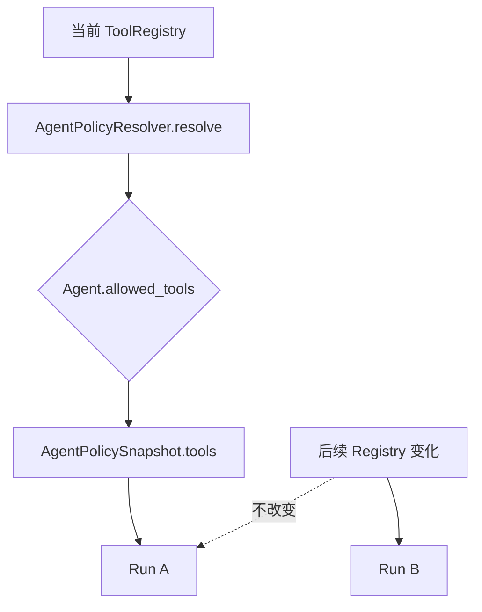

**结论：**

- 每个 Run 创建时捕获深拷贝 Tool Definition 快照。
- allowed_tools 为空表示允许所有已注册工具。
- allowed_tools 非空时必须写完整命名空间名，如 `mcp.github.search_issues`。
- Run 内 Registry 后续变化不生效。
- 新 Run 才能看到后续工具变化。

### 2.6 当前仓库默认配置

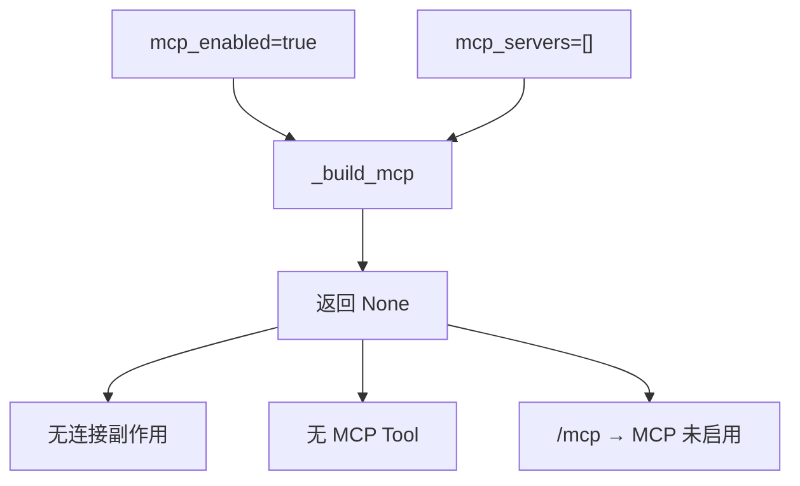

**结论：**

- 当前仓库没有实际启用的 MCP Server。
- `mcp_enabled=true` 只表示允许 MCP 子系统工作，不代表已经配置 Server。
- Provider 为 None 时 CLI 统一显示“MCP 未启用”。
- 当前默认 `allowed_mcp_servers=["github"]` 没有产生连接，因为不存在 name=github 的 Server 配置。
- 配置文件中的 filesystem 和 remote-api 只是注释示例。

### 2.7 依赖方向

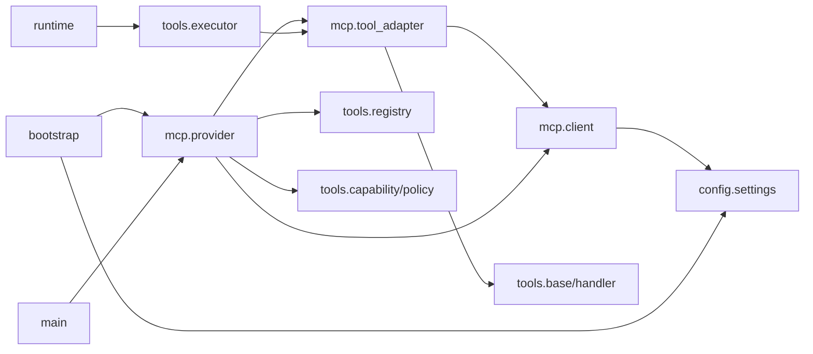

**结论：**

- Client 不依赖 Runtime 或 Agent。
- Adapter 依赖 Tool 稳定类型。
- Provider 同时依赖 MCP Client 与 Tool Registry/Security。
- Runtime 只通过 ToolExecutor 间接使用 MCP。
- MCP SDK 是 Client 的外部协议依赖。
- Config 和 Bootstrap 是 MCP 的组合边界。

---

## 3. 组件总览

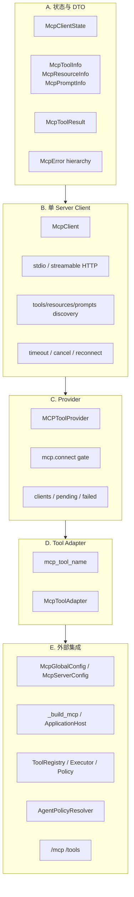

**结论：**

- MCP Core 可以分成 DTO、Client、Provider 和 Adapter 四层。
- Config、Bootstrap 和 Tool Security 是外部装配层。
- Provider 是生命周期与多 Server 协调者。
- Client 是协议状态所有者。
- Adapter 不管理连接和注册表生命周期。

### 3.1 组成部分与责任

| 分类 | 组成部分 | 主归属 | 稳定职责 |
|---|---|---|---|
| Domain | `McpClientState` | MCP | 表示单 Client 状态 |
| Domain | `McpToolInfo` | MCP | 保存 tools/list 元数据 |
| Domain | `McpResourceInfo` | MCP | 保存 resources/list 元数据 |
| Domain | `McpPromptInfo` | MCP | 保存 prompts/list 元数据 |
| Domain | `McpToolResult` | MCP | 将 MCP 内容压成统一字符串结果 |
| Client | `McpClient` | MCP | 单 Server Transport、Session、发现、调用与重连 |
| Provider | `MCPToolProvider` | MCP/Tool Provider | 多 Server 启动、连接网关、Tool 注册和状态 |
| Adapter | `mcp_tool_name` | MCP | 生成 Tool Registry 命名空间名 |
| Adapter | `McpToolAdapter` | MCP/Tool | ToolDefinition 与 tools/call 桥接 |
| Config | `McpGlobalConfig` | Config | 全局超时和重连默认值 |
| Config | `McpServerConfig` | Config | Server、Transport、认证和覆盖项 |
| Security | `CapabilityBroker` | Tool | 形成 MCP_CALL 请求 |
| Security | `PolicyEngine` | Tool | 允许列表、连接和调用策略 |
| Runtime | `AgentPolicyResolver` | Runtime | Agent 白名单和 Run 快照 |
| Bootstrap | `_build_mcp` | Bootstrap | 创建并等待首次发现 |
| Lifecycle | `ApplicationHost` | Bootstrap | 持有与关闭 Provider |
| CLI | `_cmd_mcp` / `_cmd_tools` | CLI | 状态和工具诊断 |

---

## 4. 各组件的类与职责

本节只把核心领域对象、核心类和跨模块契约提升为四级标题。连接、发现、重连、状态汇总等方法级行为放在所属类内说明。

### 4.1 状态与数据模型

#### 4.1.1 MCP 状态与错误模型

**职责与用途：**定义单个 Client 的连接状态和 MCP 专属异常边界。

`McpClientState`：

```text
STARTING
CONNECTED
CRASHED
FAILED
SHUTDOWN
```

| 状态 | 主要来源 |
|---|---|
| STARTING | Client 构造后的初始状态 |
| CONNECTED | initialize 与首次发现完成 |
| FAILED | 启动握手或发现失败 |
| CRASHED | 运行调用错误后不重连或重连失败 |
| SHUTDOWN | 显式关闭完成 |

异常层级：

```text
McpError
├── McpClientError
└── McpUnavailableError
```

- `McpClientError` 主要由 Provider 把连接失败归一化后使用；
- `McpUnavailableError` 拒绝对 FAILED、CRASHED 和 SHUTDOWN Client 的调用；
- 协议异常、SDK 异常和 Timeout 并未全部转换为 MCP 专属异常；
- 当前状态模型没有 RECONNECTING、DEGRADED 或 DISCONNECTED。

#### 4.1.2 MCP 能力与结果 DTO

**职责与用途：**把 MCP SDK 类型投影为内部轻量对象，并统一承载调用结果。

能力 DTO：

```text
McpToolInfo
→ name / description / input_schema

McpResourceInfo
→ uri / name / description / mime_type

McpPromptInfo
→ name / description / arguments[]
```

这些对象都是普通可变 dataclass，没有内容版本、Server 标识或发现时间。Server 归属由持有它们的 McpClient 隐含表达。

`McpToolResult`：

```text
content: str
is_error: bool
error_message: str
```

当前转换规则：

- 文本内容保留 text；
- data/blob 只保留 MIME 和字节数占位；
- 不支持的内容类型写入占位字符串；
- Prompt 消息以前缀 `[role]` 拼接；
- `error_message` 当前没有被转换逻辑赋值。

---

### 4.2 单 Server Client

#### 4.2.1 `McpClient`

**职责与用途：**拥有一个 MCP Server 的 Transport、ClientSession、状态、失败计数和能力发现结果。

持有：

```text
McpServerConfig
McpGlobalConfig
Transport
ClientSession
Client State
Failure Count
Tools / Resources / Prompts
```

一个 Client 只对应一个 Server 名称。Provider 可通过 `client_factory` 注入测试替身。

**连接与首次发现**

`connect()` 当前执行：

```text
清理旧连接
→ 创建 Transport
→ 创建 ClientSession
→ initialize()
→ _discover()
→ CONNECTED
```

Transport：

```text
stdio
→ StdioClientTransport(command, args)

streamable_http
→ HttpClientTransport(url, headers)
```

`startup_timeout` 只包裹 `session.initialize()`；后续 `_discover()` 不在同一 deadline 中。启动异常被记录为 FAILED 并返回 False，Client 不向 Provider 返回结构化失败原因。

`_discover()` 依次调用：

1. tools/list；
2. resources/list；
3. prompts/list。

tools 是强依赖；resources/prompts 失败时各自降级为空。发现结果直接覆盖 Client 内存列表，不产生版本或差异对象。

**Tool、Resource 与 Prompt 调用**

`call_tool()`：

1. 拒绝 FAILED、CRASHED 和 SHUTDOWN；
2. 使用显式 timeout 或最终 tool_timeout；
3. 调用 `session.call_tool()`；
4. Timeout 时尝试发送 cancel；
5. 非 Timeout 异常时进入重连处理；
6. 当前失败调用不会因重连成功而自动重试。

`read_resource()` 与 `get_prompt()` 复用相同的状态检查、timeout、cancel、重连和字符串结果转换，但当前没有生产调用者。

**错误、重连与取消**

`_handle_execution_error()`：

```text
restart_on_crash=false
→ CRASHED

restart_on_crash=true
→ failure_count + 1
→ 达阈值则 CRASHED
→ 否则只调用一次 connect()
```

`connect()` 成功会把 failure_count 重置为 0；单次 reconnect 返回 False 时立即进入 CRASHED。

Timeout 时按 Session 能力尝试 `send_cancel()` 或 `cancel()`；失败只记录 debug。

**关闭与旧连接清理**

`shutdown()` 和 `_cleanup_old_connection()` 都尝试关闭 Session 并终止 Transport。关闭异常被吞掉，最终状态设为 SHUTDOWN。

---

### 4.3 多 Server Provider

#### 4.3.1 `MCPToolProvider`

**职责与用途：**实现 ToolProvider，并协调多个 Server 的连接授权、首次发现、Tool 注册、状态汇总和关闭。

持有：

```text
global config
server configs
ToolRegistry
PolicyEngine
CapabilityBroker
client_factory
clients
failed_servers
pending_servers
started
```

`CapabilityBroker` 当前只保存为字段；连接网关直接构造 CapabilityRequest。

**启动**

`start()`：

1. 重复启动时返回空列表；
2. 将全部 Server 标记 pending；
3. 构造 Client；
4. `asyncio.gather(return_exceptions=True)` 并行连接；
5. 单 Server 异常写入 failed_servers；
6. 汇总成功注册的 Tool 名称。

Provider 启动完成不代表所有 Server 成功。

**单 Server 连接与注册**

`_connect_and_register()`：

```text
mcp.connect 授权
→ client.connect()
→ 遍历 client.tools
→ 创建 McpToolAdapter
→ registry.register()
→ 全部成功后 clients[server]=client
```

resources 和 prompts 不注册。当前没有 Server 级临时注册事务。

**连接授权**

`_authorize_connect()` 构造：

```text
CapabilityRequest(
  kind=MCP_CONNECT,
  profile="mcp.connect",
  server=server
)
```

生产环境复用 ToolExecutor 的 PolicyEngine。只有 ALLOW 才连接；ASK 和 DENY 都拒绝。没有 PolicyEngine 时放行，主要用于测试或降级装配。

**审批声明、状态与关闭**

Provider 根据全局 `mcp.call` 是否为 ASK 设置 Adapter 的 `needs_approval`，但调用时 ToolExecutor 仍按 Agent 有效 Scope 重新评估。

`get_server_states()` 按 pending、clients、failed_servers 的顺序合并状态，旧 failed 记录可能覆盖同名 Client 状态。

`shutdown()` 关闭 `clients`，清空 clients/pending 并重置 started；当前不清 failed_servers，也不注销 ToolRegistry 中的 MCP Handler。

---

### 4.4 Tool 适配

#### 4.4.1 MCP Tool 命名契约

**职责与用途：**`mcp_tool_name()` 生成 Tool Registry 名：

```text
mcp.<sanitized_server>.<sanitized_tool>
```

规范化：

```text
非 [A-Za-z0-9_]
→ "_"

空字符串
→ "_"
```

远端协议调用仍使用原始 Tool 名。该替换不是可逆编码，不同原始名称可能规范化为同名。

#### 4.4.2 `McpToolAdapter`

**职责与用途：**把一个 `McpToolInfo` 转换为 dotClaw `ToolHandler`。

ToolDefinition：

```text
name
→ mcp.<server>.<tool>

description
→ MCP description

parameters / input_schema
→ MCP inputSchema

source
→ ToolSource.MCP

metadata
→ server / mcp_type / mcp_tool_name

policy_profile
→ mcp.call

timeout
→ Server/Global tool_timeout
```

执行时使用原始 Tool 名调用 Client，并映射为统一 ToolResult：

| 情况 | ToolResult |
|---|---|
| MCP 正常文本 | output=content |
| MCP `isError=true` | EXECUTION_ERROR |
| asyncio Timeout | TIMEOUT |
| McpUnavailableError | MCP_UNAVAILABLE |
| 其他异常 | EXECUTION_ERROR |

Adapter 不执行参数校验、Policy 或审批；这些发生在 ToolExecutor 进入 Handler 前。

---

### 4.5 MCP 配置

#### 4.5.1 `McpGlobalConfig` 与 `McpServerConfig`

**职责与用途：**声明全局默认值和单 Server Transport/认证/覆盖项。

Global 默认值：

```text
startup_timeout = 4.0
tool_timeout = 60.0
restart_on_crash = true
max_restart_attempts = 3
```

Server：

```text
name
transport

stdio
→ command / args

streamable_http
→ url / headers

optional overrides
→ startup_timeout
→ tool_timeout
→ restart_on_crash
→ max_restart_attempts
```

Server Getter 按“Server 值非 None 优先，否则 Global”解析最终值。

`_parse_mcp_servers()` 校验：

```text
name 必填
name 唯一
transport 合法
stdio 必须 command
streamable_http 必须 url
```

当前没有校验 timeout/restart 次数正数、headers/args 元素类型、URL scheme 或 command 是否存在。环境变量展开只做字符串替换，不按目标字段自动做数值类型转换。

---

### 4.6 Tool 安全与 Runtime 接入

#### 4.6.1 MCP Capability、Policy 与 ToolExecutor

**职责与用途：**把 MCP 连接和调用纳入 dotClaw 统一安全链。

连接阶段：

```text
MCP_CONNECT
profile=mcp.connect
server=配置名称
```

调用阶段：

```text
MCP_CALL
profile=mcp.call
server=ToolDefinition.metadata.server
```

默认：

```text
mcp.connect = ASK
mcp.call = ASK
allowed_mcp_servers = ["github"]
```

Provider 后台连接只有显式 ALLOW 才执行；具体 Tool 调用则通过 ToolExecutor：

```text
Tool 查找
→ JSON Schema 校验
→ CapabilityBroker
→ PolicyEngine
→ Approval
→ Handler
→ timeout
→ Journal
```

MCP inputSchema 使用 `validate_json_schema()` 的有限实现，不是完整 JSON Schema Validator。

#### 4.6.2 Agent 工具快照

**职责与用途：**`AgentPolicyResolver` 在每个 Run 读取 Tool Definition 快照、排除旧 Task Tool、按 Agent.allowed_tools 精确名称过滤，并保存到 AgentPolicySnapshot。

MCP 首次发现发生在 Runtime 构造前，正常首个 Run 可以看到已成功注册的工具。已有 Run 不受后续 Registry 变化影响。

---

### 4.7 Bootstrap 与诊断

#### 4.7.1 `_build_mcp` 与 `ApplicationHost`

**职责与用途：**在 `mcp_enabled` 且 `mcp_servers` 非空时创建 Provider，复用 ToolExecutor 的 registry、policy_engine 和 capability_broker，并等待 `provider.start()` 完成。

ApplicationHost 在 Runtime 构造前完成 MCP 首次发现；关闭时优先 shutdown Provider。半初始化后关键组件失败时，Host.build 也会进入资源清理。

#### 4.7.2 CLI `/mcp` 与 `/tools`

**职责与用途：**提供 MCP Server 和 Tool 的只读诊断。

`/mcp`：

```text
Provider=None
→ MCP 未启用

Provider 存在
→ 展示每个 Server 的状态和失败消息
```

`/tools`：

- 按 ToolSource 区分 Builtin 与 MCP；
- MCP Tool 按 metadata.server 分组；
- 显示 Tool 名、描述和声明式“需审批”标记；
- 不显示 resources、prompts、原始 Tool 名、Schema 或 failure_count。

---

## 5. 组件依赖和使用流程

本节说明正常协作路径。初始化泄漏、注册事务、重连语义和动态刷新等问题集中在第 8.3 节。

### 5.1 当前默认启动

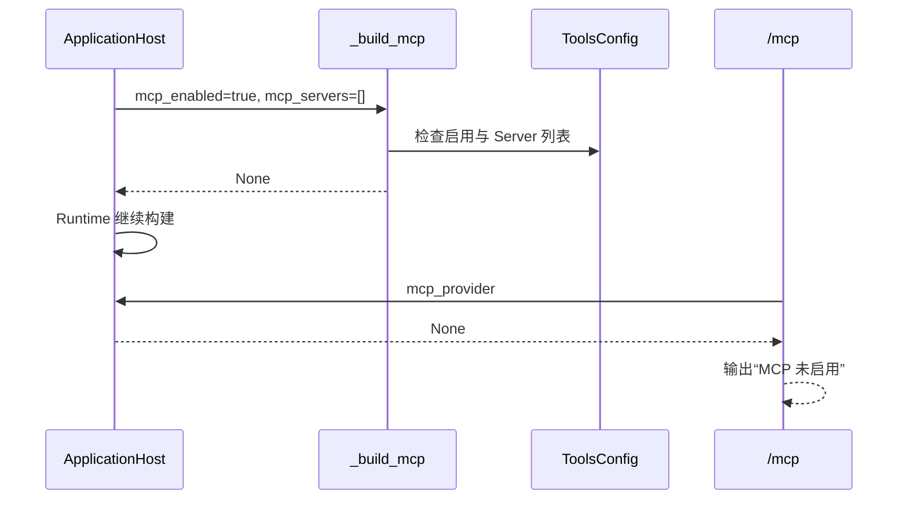

**结论：**

- 当前仓库默认不产生 MCP 连接。
- MCP SDK 仍是安装依赖，但不会在运行期导入 Transport。
- ToolRegistry 中只有其他来源 Tool。
- `/mcp` 无法区分“开关关闭”和“开关开启但 Server 列表为空”。
- 配置注释示例不会被解析为 Server。

### 5.2 配置 Server 后的启动

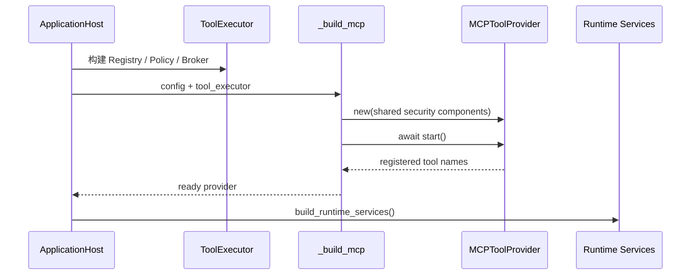

**结论：**

- ToolExecutor 必须先于 MCP 构建。
- MCP 不创建第二套 Registry 或 Policy。
- Host 等待首次发现完成。
- Server 失败不会自动使 Provider 为 None，只要 start 主流程未整体抛出。
- Runtime 构造时 Registry 已包含成功发现的 MCP Tool。

### 5.3 连接授权

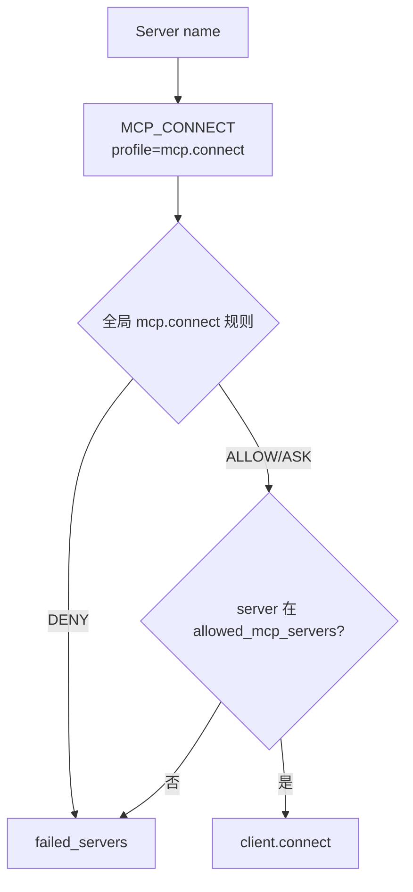

**结论：**

- Provider 启动没有 Agent execution_context，因此只使用全局 Scope。
- Server 在允许列表时，PolicyEngine 对 MCP_CONNECT 返回 ALLOW。
- 不在允许列表时 fail-closed。
- 全局 mcp.connect=DENY 会优先拒绝。
- 连接阶段不进入交互审批。

### 5.4 协议连接与发现

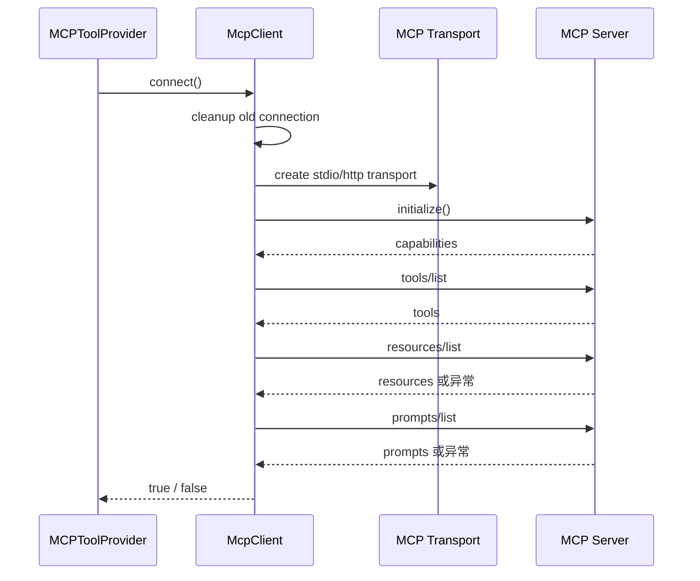

**结论：**

- initialize 有 startup_timeout。
- discovery 当前没有统一 startup_timeout。
- tools 是连接成功的必要条件。
- resources/prompts 是可降级能力。
- 发现结果只保存在 Client 内存。

### 5.5 Tool 注册

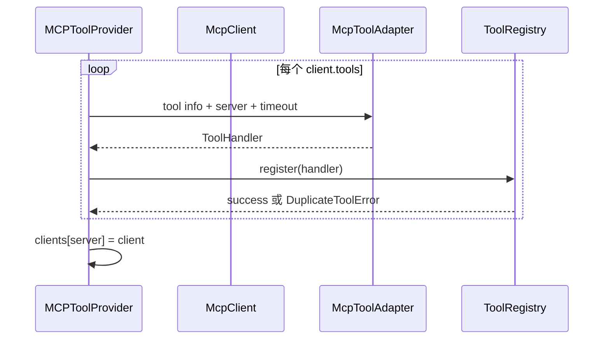

**结论：**

- 原始 Tool 名只用于协议调用。
- Registry 名增加 Server 命名空间并规范化字符。
- ToolRegistry 对重复名抛错，不静默覆盖。
- Client 只有在全部工具注册成功后才进入 Provider.clients。
- resources/prompts 不参与注册。

### 5.6 首个 Run 工具快照

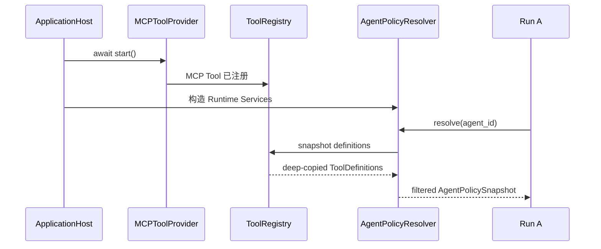

**结论：**

- 当前启动顺序修复了“首个 Run 早于 MCP 发现”的问题。
- Agent 白名单过滤发生在每个 Run。
- 快照只包含 Tool Definition，不包含 Client 状态。
- Server 后续崩溃不会从已有 Run 的工具列表移除该 Tool。
- 调用时由 Adapter 返回 MCP_UNAVAILABLE。

### 5.7 MCP Tool 调用

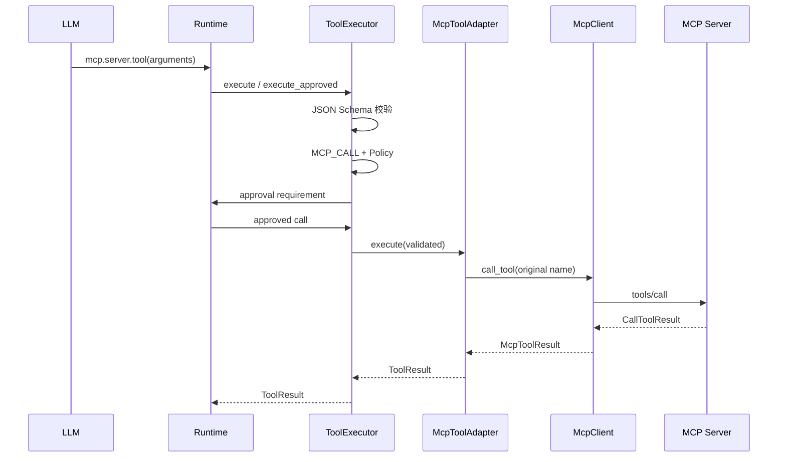

**结论：**

- 模型调用 Registry 名，Server 收到原始 MCP Tool 名。
- 参数校验在网络副作用前完成。
- Agent policy_rules 可以把 mcp.call 从 allow/ask 收窄到 ask/deny。
- Runtime 两阶段审批后使用 execute_approved，避免重复询问。
- Tool Result 最终作为普通 Tool Message 返回模型。

### 5.8 MCP 调用审批

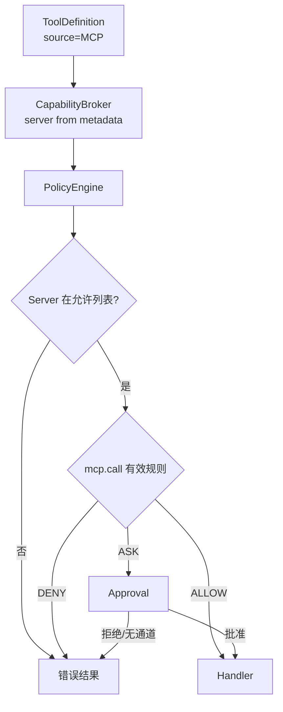

**结论：**

- Server allowlist 是资源约束，优先于 ASK/ALLOW。
- `needs_approval` 与 Policy ASK 都可触发审批。
- Agent 规则不能把全局 ASK 放宽为 ALLOW。
- 无 Channel 的直接 ToolExecutor.execute 会拒绝 ASK。
- Runtime 正常路径可以持久化 approval_id 后恢复。

### 5.9 Timeout 与 Cancel

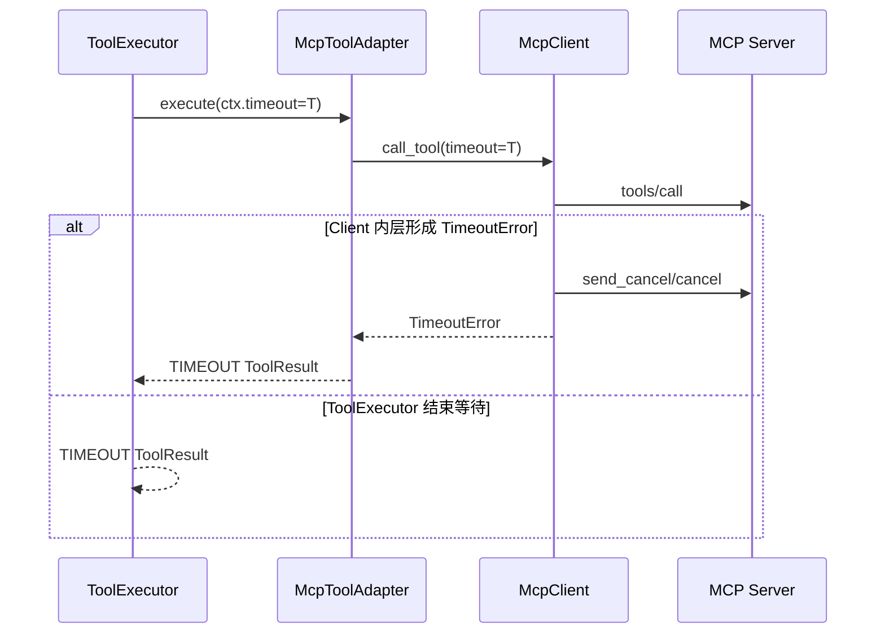

**结论：**

- ToolDefinition.timeout 同时传给 ToolExecutor 和 McpClient。
- Client 形成 TimeoutError 时会尝试发送 MCP Cancel。
- 两层最终都映射为统一 TIMEOUT。
- Timeout 不进入 Client 的非超时重连分支。
- 两层 timeout 的责任竞争与 Cancel 完成性问题见 P8。

### 5.10 运行错误与重连

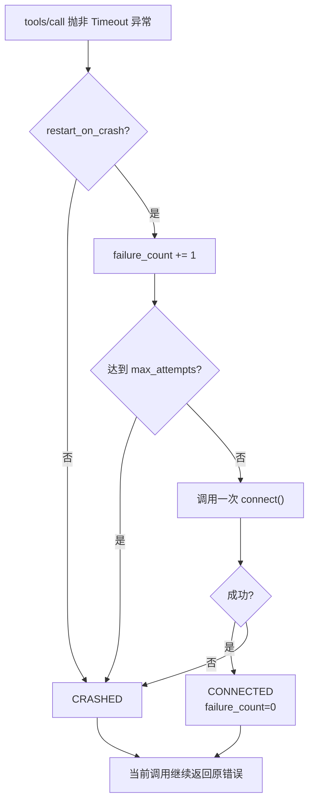

**结论：**

- 非 Timeout 调用异常才进入重连处理。
- 当前错误处理最多调用一次 `connect()`。
- 重连成功也不会自动重试本次 Tool Call。
- `connect()` 会重新发现 Client 能力。
- 重连次数语义、并发协调和 Registry 刷新问题分别见 P5、P7 和 P6。

### 5.11 resources 与 prompts 原生调用

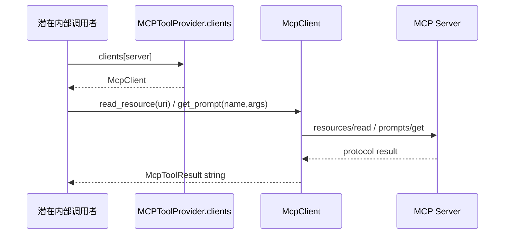

**结论：**

- Client 已提供 Resource 和 Prompt 原生调用方法。
- 当前 Runtime、Agent、Context 和 CLI 没有生产调用入口。
- 这些方法复用 Client 的状态、timeout、cancel 和重连行为。
- 它们没有对应 Tool Adapter 或独立 Capability/Policy 契约。
- 安全消费入口缺失集中见 P10。

### 5.12 关闭

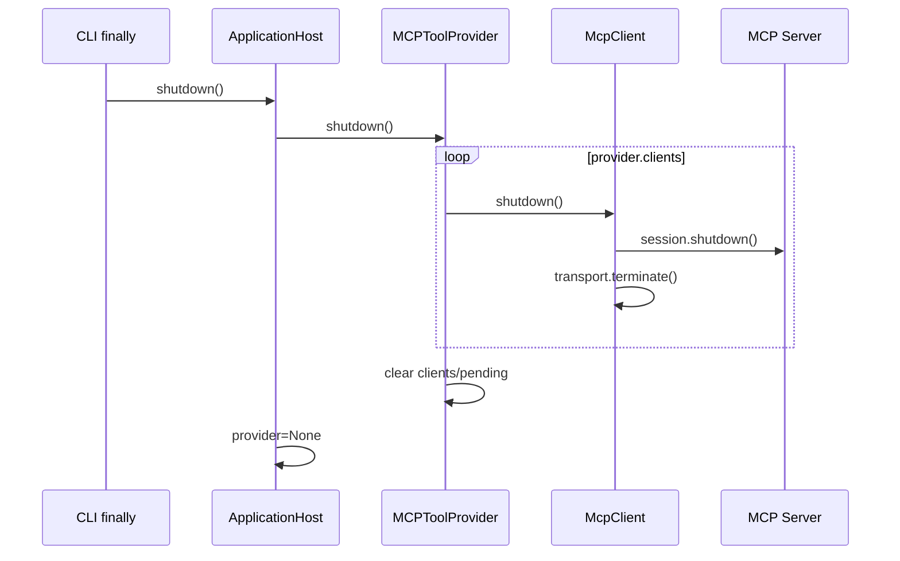

**结论：**

- Host 按依赖逆序优先关闭 MCP。
- 半初始化后关键组件失败时，Host.build 也会尝试关闭已持有 Provider。
- Provider 只关闭 `clients` 中已登记的 Client。
- 当前关闭流程清空 clients/pending 并重置 started。
- Registry 注销、failed 状态清理和 restart 一致性问题见 P4。

## 6. 对外接口与数据契约

### 6.1 包级公共 API

`dotclaw.mcp` 当前导出：

```python
McpClient
McpClientState
McpError
McpClientError
McpUnavailableError
McpToolInfo
McpResourceInfo
McpPromptInfo
McpToolResult
McpToolAdapter
mcp_tool_name
MCPToolProvider
```

resources/prompts 的调用能力通过 McpClient 方法公开，但没有独立 Provider 或 Application Service。

### 6.2 Global 配置契约

```yaml
tools:
  mcp_global:
    startup_timeout: 4.0
    tool_timeout: 60.0
    restart_on_crash: true
    max_restart_attempts: 3
```

Server 字段为 None 时回退 Global。

### 6.3 Server 配置契约

stdio：

```yaml
- name: filesystem
  transport: stdio
  command: npx
  args:
    - -y
    - "@anthropic/mcp-server-filesystem"
    - /tmp
```

streamable HTTP：

```yaml
- name: remote-api
  transport: streamable_http
  url: http://localhost:8080/mcp
  headers:
    Authorization: "Bearer ${MCP_API_KEY}"
  tool_timeout: 120.0
```

Server name 必须唯一。

### 6.4 环境变量契约

Config 在构造 dataclass 前递归展开 `${ENV_VAR}`。

因此可展开：

```text
command
args
url
headers
timeout 等任意 YAML 值
```

未定义变量的具体展开语义由 common.utils 决定。MCP 模块不单独管理 Secret。

展开过程不会按目标字段自动做数值类型转换；若把 timeout 或重连次数完全写成环境变量字符串，需要额外验证最终类型。

### 6.5 Transport 契约

允许值：

```text
stdio
streamable_http
```

代码分支中任何非 stdio 都进入 HTTP Transport，但 Config 解析和 dataclass 校验会提前拒绝其他值。

stdio 当前没有配置：

```text
cwd
env
stderr policy
process shutdown grace period
```

HTTP 当前没有配置：

```text
TLS policy
proxy
connect timeout
OAuth refresh
```

### 6.6 Client 状态契约

```text
构造
→ STARTING

connect 成功
→ CONNECTED

connect 失败
→ FAILED

运行错误且不重连/重连失败
→ CRASHED

shutdown
→ SHUTDOWN
```

当前状态没有持久化；Host 重启后重新构造。

### 6.7 发现契约

Client 始终尝试：

```text
tools/list
resources/list
prompts/list
```

但 Provider 只消费 `client.tools`。

发现列表是完整覆盖，不支持增量版本或 capability changed 通知。

### 6.8 Tool 命名契约

Registry 名：

```text
mcp.<sanitize(server)>.<sanitize(original_tool)>
```

合法字符：

```text
A-Z a-z 0-9 _
```

原始 Tool 名保存在：

```text
definition.metadata["mcp_tool_name"]
```

Server 名保存在：

```text
definition.metadata["server"]
```

### 6.9 ToolDefinition 契约

```text
source = MCP
parameters = inputSchema
policy_profile = mcp.call
timeout = resolved tool_timeout
metadata.mcp_type = tool
needs_approval = global mcp.call 是否 ASK
```

`parameters` 与 `input_schema` 指向构造时传入的 dict，没有 Schema 版本字段。

### 6.10 JSON Schema 校验契约

当前支持：

- 顶层对象；
- properties；
- required；
- unknown field；
- primitive type；
- enum；
- array；
- object 的有限递归。

当前对：

```text
$ref
$defs
allOf
anyOf
oneOf
```

降级为跳过对应深度检查，不阻断调用。

空 Schema 接受任意对象。

### 6.11 安全配置契约

```yaml
tools:
  policy:
    rules:
      mcp.connect: ask
      mcp.call: ask
    allowed_mcp_servers:
      - github
```

实际连接语义：

- Server 在 allowlist 且 mcp.connect 非 DENY：ALLOW；
- Server 不在 allowlist：DENY；
- 后台连接不进入 Approval。

实际调用语义：

- Server 不在 allowlist：DENY；
- Server 在 allowlist：继续按 mcp.call 的有效规则处理。

### 6.12 Agent 可见性契约

```yaml
allowed_tools:
  - mcp.github.search_issues
```

名称必须与 Registry 规范化后的完整名称一致。

allowed_tools 为空时默认允许所有已注册 MCP Tool。

### 6.13 结果契约

MCP 结果最终进入：

```text
ToolResult.output: str
ToolResult.is_error
ToolResult.error_code
ToolResult.error_type
```

当前不保留：

```text
原始 MCP Content 数组
structuredContent
image/audio/blob 内容
资源 URI
MIME 内容本体
Server response metadata
```

### 6.14 错误映射契约

| 失败位置 | 当前结果 |
|---|---|
| Config 校验失败 | Config/Host 启动失败 |
| mcp.connect 拒绝 | failed_servers，Server 不连接 |
| initialize/discovery 失败 | Client FAILED，Provider failed_servers |
| Tool 名冲突 | 该 Server 注册流程异常 |
| 参数不合法 | INVALID_ARGUMENTS，不发送 tools/call |
| mcp.call Policy 拒绝 | POLICY_DENIED |
| 审批拒绝 | APPROVAL_DENIED |
| Client 不可用 | MCP_UNAVAILABLE |
| Tool timeout | TIMEOUT |
| MCP isError | EXECUTION_ERROR |
| 其他协议/SDK异常 | EXECUTION_ERROR |

### 6.15 Provider 状态契约

```python
clients: dict[str, McpClient]
failed_servers: dict[str, str]
get_server_states() -> dict[str, tuple[McpClientState, str]]
```

没有公开：

```text
registered_tools_by_server
last_connected_at
failure_count
last_error
discovered resource/prompt count
health
```

### 6.16 生命周期契约

启动：

```text
ToolExecutor ready
→ await Provider.start
→ Runtime ready
```

关闭：

```text
Provider.shutdown
→ Client shutdown
→ Host release remaining resources
```

运行中没有公开 start_server、stop_server、reload 或 reconnect API。

### 6.17 当前实现已经保证的不变量

1. MCP 初始化不是 Runtime 必要条件。
2. 没有 Server 配置时不创建 Provider。
3. 首次发现完成后才构造 Runtime。
4. 单个 Server 连接失败不会阻止其他 Server 注册。
5. Server 连接前必须经过 mcp.connect 网关。
6. 不在 allowed_mcp_servers 的 Server不能连接或调用。
7. 只有 MCP tools 进入 ToolRegistry。
8. resources/prompts 不会伪装成 Tool。
9. MCP Tool Registry 名带 Server 命名空间。
10. 原始 MCP Tool 名用于协议调用。
11. MCP Tool 参数在 tools/call 前经过 JSON Schema 校验。
12. MCP Tool 调用进入统一 Policy 和 Approval。
13. Agent.allowed_tools 能过滤 MCP Tool。
14. 每个 Run 持有不可变 Tool Definition 快照。
15. Client Timeout 会尝试发出 MCP Cancel。
16. Client 不可用统一映射为 MCP_UNAVAILABLE。
17. Host shutdown 会关闭已登记的 MCP Client。
18. `/mcp` 不读取 Runtime 内部状态。

### 6.18 当前未保证的契约边界

当前实现尚不能保证：

1. Transport、initialize 与全部首次发现共享同一个 startup deadline。
2. 单 Server 的连接、发现与 Tool 注册具备原子提交和完整回滚。
3. `max_restart_attempts` 等价于一次故障中的连续重连次数。
4. Client 重连后的 Tool 列表和 Schema 自动同步到 ToolRegistry。
5. Provider shutdown/restart 同步注销 MCP Tool 并清理全部失败状态。
6. 规范化后的 Tool 名在所有原始 Server/Tool 名组合下唯一。
7. ToolExecutor 与 McpClient 之间只有一个 timeout/cancel 权威。
8. resources/prompts 具备受 Capability、Policy 和 Agent 授权保护的消费入口。
9. 结构化、多模态和大结果在转换为 ToolResult 后保持内容语义。
10. MCP SDK 的当前使用方式经过明确版本兼容矩阵验证。
11. Header、Command、Args 和错误日志具有统一 Secret 脱敏规则。
12. 动态 Server/Tool 变化会以原子方式更新 Registry，并且只影响后续 Run。

## 7. 常见修改入口

| 修改目标 | 首要入口 | 可能涉及 | 必须保持的不变量 |
|---|---|---|---|
| 新增 Client 状态 | `McpClientState` | Provider、CLI、测试 | 状态转移有唯一语义 |
| 修改 Tool 元数据 | `McpToolInfo` | Adapter、Registry | 保留原始协议名 |
| 修改 Resource 元数据 | `McpResourceInfo` | Client、未来 Resource Port | URI 与 MIME 不丢失 |
| 修改 Prompt 元数据 | `McpPromptInfo` | Client、未来 Prompt Port | 参数定义可验证 |
| 修改结果内容 | `McpToolResult` | Adapter、ToolResult、Runtime | 不静默丢弃内容 |
| 支持 structuredContent | `from_mcp` | ToolResult 内容块 | 保持文本兼容 |
| 支持图片/音频 | `from_mcp` | Artifact、Channel | 大内容不直接塞 Prompt |
| 修改 Transport | `McpClient.connect` | Config、SDK、Shutdown | 初始化与关闭成对 |
| 增加 stdio env/cwd | `McpServerConfig` + Client | Config、Policy | 不把 Secret 写日志 |
| 增加 OAuth | HTTP Transport 构造 | Config、Token Store | Token 生命周期独立 |
| 修改启动超时 | `connect` | `_discover`、Bootstrap | 覆盖整个首次就绪 |
| 修改发现顺序 | `_discover` | Provider、降级语义 | tools 失败边界明确 |
| 支持 list_changed | Client Notification Handler | Provider、Registry、Run Snapshot | 只影响后续 Run |
| 修改 Tool 调用 | `call_tool` | Adapter、重连 | 当前调用是否重试明确 |
| 修改 Resource 调用 | `read_resource` | 新安全 Port | 不能绕过 Policy |
| 修改 Prompt 调用 | `get_prompt` | 新安全 Port | Prompt 内容按低信任处理 |
| 修改 Cancel | `_send_cancel` | Timeout Owner | 不重复取消 |
| 修改重连 | `_handle_execution_error` | State、Provider、Registry | 次数和退避真实生效 |
| 增加重连退避 | Client | Config、Clock/Test | 不阻塞其他 Server |
| 增加并发限制 | Client/Provider | Semaphore、Config | 单 Server 隔离 |
| 修改 Provider 启动 | `MCPToolProvider.start` | Bootstrap、状态 | 单 Server 失败可降级 |
| 修改连接网关 | `_authorize_connect` | Capability、Policy | 无 Channel 时 fail-closed |
| 修改 Tool 注册 | `_connect_and_register` | Registry Transaction | 失败必须回滚 |
| 修改 Tool 命名 | `mcp_tool_name` | Agent allowed_tools、迁移 | 无碰撞且可追踪 |
| 修改冲突策略 | ToolRegistry/Provider | 状态、回滚 | 不留部分注册 |
| 修改审批默认 | `_mcp_needs_approval` | ToolExecutor、Agent Policy | 调用时仍重新评估 |
| 修改 Server 状态 | `get_server_states` | CLI、Metrics | 不用旧失败覆盖新成功 |
| 支持 Provider restart | `shutdown/start` | Registry、failed_servers | 重启前完全清理 |
| 修改 Global Config | `McpGlobalConfig` | parser、Client | 校验正数与边界 |
| 修改 Server Config | `McpServerConfig` | parser、Transport | name 唯一 |
| 修改允许服务器 | ToolPolicyConfig/_build_tools | PolicyScope | 空列表语义不能被吞掉 |
| 禁用某个 MCP Tool | `_build_mcp` 后置过滤 | disabled_tools、Registry | 顺序正确 |
| 修改 Agent 可见性 | Agent.allowed_tools | Resolver、Context | 使用完整 Registry 名 |
| 修改 JSON Schema | `validate_json_schema` | MCP Adapter、Tests | 不能误报已完整支持 |
| 替换 JSON Schema 库 | tools/schema.py | Dependency、错误脱敏 | 参数错误不泄露值 |
| 修改双层 Timeout | ToolExecutor + Adapter | Client Cancel | 单一权威 |
| 修改 Bootstrap 顺序 | ApplicationHost.initialize | Run Snapshot | 首个 Run不漏工具 |
| 修改 Host Shutdown | ApplicationHost.shutdown | Provider、Client | 半初始化可回收 |
| 修改 CLI `/mcp` | `_cmd_mcp` | Provider state | 区分禁用/空配置/失败 |
| 修改 CLI `/tools` | `_cmd_tools` | Tool metadata | 按 Server 分组稳定 |
| 排查 Server 不连接 | Config→allowlist→connect rule→Client | 日志、CLI | 区分策略与协议失败 |
| 排查首个 Run 无 Tool | Provider start→Registry→Resolver | Bootstrap | 确认首次发现已 await |
| 排查 Tool 不可见 | Registry→allowed_tools→Run Snapshot | Agent | 使用规范化完整名 |
| 排查 Tool 被拒绝 | MCP_CALL→allowlist→mcp.call→Agent rule | Approval | 区分 Policy 和 Approval |
| 排查 Timeout | Executor timeout→Client timeout→cancel | Server | 判断哪层先超时 |
| 排查重连后 Schema 旧 | Client tools→Registry | Provider | 当前不会自动刷新 |
| 排查 `/mcp` 状态异常 | clients/pending/failed 合并 | restart/shutdown | 检查 stale failed |
| 增加 MCP 测试 | `tests/tools/` | Runtime/Bootstrap | Fake 与真实 Server 分层 |

---

## 8. 设计取舍、痛点和演进方向

本节只依据当前 master 的生产代码和默认配置，不把完整 MCP 协议能力推断为 dotClaw 已经支持。

### 8.1 当前架构承诺

当前 master 可以确认：

1. MCP 是可降级的外部 Tool 来源。
2. 当前默认配置没有 MCP Server，默认不连接、不注册工具。
3. McpClient 支持 stdio 与 streamable HTTP 两类配置。
4. Client 初始化后发现 tools、resources 和 prompts。
5. 只有 tools 被注册进 ToolRegistry。
6. MCP Tool 名统一为 `mcp.<server>.<tool>` 的规范化形式。
7. Server 连接前经过 `mcp.connect` 网关。
8. MCP Tool 调用经过 `mcp.call`、Server allowlist 和 Agent 收窄规则。
9. MCP Tool 参数先经过 JSON Schema 校验。
10. 首次发现完成后才构造 Runtime。
11. 每个 Run 持有独立 Tool Definition 快照。
12. 单 Server 失败不会阻塞其他 Server 和 Runtime。
13. Tool Timeout 时 Client 会尝试发送 Cancel。
14. 非 Timeout 调用错误可能触发重连。
15. resources/prompts 当前没有 Agent 或 Runtime入口。
16. Host 关闭时关闭 Provider.clients 中的 Client。
17. 当前 MCP 测试主要使用 FakeMcpClient，不依赖真实 Server。
18. `mcp` 依赖只声明 `>=1.0.0`，没有上界锁定。

### 8.2 核心设计取舍

#### 8.2.1 只把 MCP Tools 接入 Tool Registry

**问题与选择：**Tool 是当前 Agent Harness 最成熟的外部副作用接口。resources/prompts 保留 Client 原生能力，但不伪装为 Tool。

**未选择：**自动为 resources/prompts 生成 Tool。

**收益：**所有外部调用复用统一安全链，避免语义混淆。

**代价与边界：**MCP 三类核心能力只有一类进入生产主链。

#### 8.2.2 Tool 名增加 Server 命名空间

**问题与选择：**不同 Server 可以暴露同名 Tool。

**未选择：**直接使用原始 MCP Tool 名。

**收益：**一般情况下避免跨 Server 同名冲突，并保留来源。

**代价与边界：**字符替换不是可逆编码，仍可能产生规范化碰撞。

#### 8.2.3 连接采用配置预授权

**问题与选择：**Host 启动阶段没有交互 Channel，无法执行 ASK 审批。

**未选择：**启动时弹出用户审批。

**收益：**后台连接行为确定，未授权 Server fail-closed。

**代价与边界：**连接权限依赖静态 allowlist，配置语义必须非常准确。

#### 8.2.4 调用复用统一 Tool 安全链

**问题与选择：**MCP Server 是外部副作用来源，不应绕过本地安全模型。

**未选择：**Adapter 直接调用 Client。

**收益：**统一参数校验、Policy、Approval、Journal 与错误码。

**代价与边界：**MCP 原生高级语义被压入通用 Tool 契约。

#### 8.2.5 启动等待首次发现

**问题与选择：**Runtime 每个 Run 会冻结 Tool 快照。

**未选择：**后台 fire-and-forget 发现。

**收益：**首个 Run 能看到成功连接的 MCP Tool。

**代价与边界：**Server 初始化和 discovery 会增加 Host 启动时延。

#### 8.2.6 单 Server 失败降级

**问题与选择：**一个外部 Server 故障不应阻断本地 Agent。

**未选择：**任意 MCP Server 失败即终止应用。

**收益：**多 Server 场景具有故障隔离。

**代价与边界：**部分注册和资源清理必须更严格，否则会留下半状态。

#### 8.2.7 单 Client 持有 Transport 和 Session

**问题与选择：**每个 Server 使用一个长期协议会话。

**未选择：**每次 ToolCall 重建连接。

**收益：**调用开销低，发现结果可复用。

**代价与边界：**并发调用、重连和关闭共享同一可变资源。

#### 8.2.8 Run 级 Tool Definition 快照

**问题与选择：**运行中的工具集合不能因外部 Server 变化而漂移。

**未选择：**每次 LLM 循环读取动态 Registry。

**收益：**Run 可审计、可恢复。

**代价与边界：**Server 崩溃或工具移除后，旧 Run 仍会看到已失效 Definition。

#### 8.2.9 MCP 内容统一为字符串

**问题与选择：**现有 ToolResult 主要面向文本输出。

**未选择：**立即引入 MCP Content Block 联合类型。

**收益：**接入成本低，Runtime 无需理解 MCP 类型。

**代价与边界：**结构化、多模态、资源引用和元数据会丢失。

#### 8.2.10 使用 Fake Client 做专项测试

**问题与选择：**CI 不应依赖外部 Server、npm 和网络。

**未选择：**所有测试启动真实 MCP 进程。

**收益：**测试快、稳定，可覆盖 Provider/Adapter/Policy。

**代价与边界：**Transport、SDK、握手、取消和进程关闭缺少真实兼容验证。

### 8.3 已知痛点

#### P1. 默认配置与 CLI 状态语义混淆

当前 `mcp_enabled=true` 但 `mcp_servers=[]`，Builder 返回 None。CLI 因此显示“MCP 未启用”，无法区分：

```text
开关关闭
Server 列表为空
MCP 构建整体降级
```

配置者难以从 CLI 判断真实原因。

#### P2. 启动 Timeout 和失败清理没有覆盖完整首次就绪

```mermaid
flowchart TD
    Connect["McpClient.connect"]
    Cleanup["清理旧连接"]
    Transport["创建新 Transport/Session"]
    Init["initialize<br/>有 startup_timeout"]
    Discover["tools/resources/prompts discovery<br/>无统一 timeout"]
    Fail["异常 / 卡住"]
    Stored{"Client 进入 Provider.clients?"}
    Leak["否：Provider.shutdown 无法关闭该 Client"]

    Connect --> Cleanup --> Transport --> Init --> Discover
    Init --> Fail
    Discover --> Fail
    Fail --> Stored
    Stored -->|否| Leak
```

**结论：**startup_timeout 只约束 initialize。初次连接或注册失败的 Client 不会进入 Provider.clients；connect 异常后也没有显式清理本次新建的 Session/Transport，因此存在资源未被 Provider 托管和关闭的泄漏风险。

#### P3. Tool 注册不是事务，规范化冲突会留下部分状态

```mermaid
sequenceDiagram
    participant S as Server
    participant P as Provider
    participant R as ToolRegistry

    S-->>P: tools A, B, C
    P->>R: register A
    R-->>P: success
    P->>R: register B
    R-->>P: DuplicateToolError
    P-->>P: Server 标记 FAILED
    Note over R: A 仍留在 Registry
    Note over P: Client 未加入 clients，shutdown 不管理
```

**结论：**Server 级注册失败不会回滚已注册 Handler。由于连接是并行的，规范化后同名冲突的先后结果还可能取决于完成顺序。

#### P4. Provider shutdown/restart 没有收口 Registry 与失败状态

`shutdown()`：

```text
清 clients
清 pending
started=false
```

但不会：

```text
注销 MCP Tool
清 failed_servers
清 Server→Tool 索引
```

同一 Provider 再 start 时可能遇到 DuplicateToolError；旧 failed 记录还会在状态合并时覆盖新成功 Client。

#### P5. `max_restart_attempts` 的实际语义与名称不一致

当前行为：

- failure_count 达阈值前只执行一次 connect；
- 该 connect 一旦失败，立即 CRASHED，不继续剩余次数；
- connect 成功又把 failure_count 清零；
- 当前失败调用不自动重试。

因此 `max_restart_attempts=3` 并不等价于“连续尝试重连三次”。

#### P6. 重连后的发现结果不更新 ToolRegistry

connect 重连会重新写 `client.tools/resources/prompts`，但 Provider 不重新适配或比较 Tool：

```text
新增 Tool
→ Registry 看不到

删除 Tool
→ Registry 仍保留

Schema 变化
→ ToolDefinition 仍是旧版本
```

Client 和 Registry 可能长期不一致。

#### P7. 同一 Client 的并发调用与重连缺少协调

多个 ToolCall 可共享同一个 Session。任一调用触发 `_cleanup_old_connection()` 时，可能关闭其他仍在执行的调用所依赖的 Session/Transport。当前没有 Lock、generation、lease 或 per-server concurrency limit。

#### P8. 双层相同 Timeout 使 Cancel 是否发送存在竞争

ToolExecutor 和 McpClient 默认都使用同一 timeout。外层 wait_for 如果先取消 Adapter，内层 TimeoutError 分支可能来不及调用 `_send_cancel()`。两层超时责任重复，但协议取消只存在内层。

#### P9. MCP 结果被压平并丢失内容语义

当前只保留文本和二进制长度占位。以下内容无法保真进入 Runtime：

```text
structuredContent
image/audio/blob
embedded resource
MIME payload
annotations
原始 content 顺序与类型
```

`McpToolResult.error_message` 也没有被实际填充。

#### P10. resources/prompts 是无安全消费入口的死端

Client 已发现并公开 read/get 方法，但生产代码没有调用者。若其他代码直接通过 `provider.clients` 使用，又会绕过 ToolExecutor 的 Capability、Policy、Approval 和 Agent 白名单。

#### P11. MCP JSON Schema 校验只实现有限子集

`$ref`、allOf、anyOf、oneOf 等组合子会降级跳过深度检查。复杂 MCP Tool Schema 可能在本地“校验通过”，再由远端 Server 报错；文档不能将其描述为完整 JSON Schema 实现。

#### P12. 配置装配存在三个容易误判的语义

第一，`_build_tools()` 只有在 `allowed_mcp_servers` 非空时覆盖默认 Scope，因此显式配置：

```yaml
allowed_mcp_servers: []
```

当前不会得到 deny-all，而会保留默认 `["github"]`。

第二，`disabled_tools` 在 MCP Provider 注册之前执行：

```yaml
disabled_tools:
  - mcp.github.some_tool
```

当时 Registry 中还没有该工具，因此不能禁用后续发现并注册的 MCP Tool。

第三，环境变量展开只进行字符串替换，不按 Config 目标字段做类型转换。把 timeout 或重连次数完全写成 `${ENV_VAR}` 时，最终可能仍是字符串；这是 Config 类型校验缺口，而不是 McpClient 的协议行为。

#### P13. Tool 名字符替换可能碰撞

例如：

```text
server "a-b" 与 "a_b"
tool "read.file" 与 "read/file"
```

都可能规范化成相同片段。当前没有原始名 Hash、转义编码或碰撞前置检测。

#### P14. Provider 接口与内部依赖存在契约漂移

- `discover_and_register(registry)` 接受 registry 参数，却忽略它并调用 self.start()；
- `capability_broker` 注入后只保存，不参与 connect 授权；
- Provider 同时承担 ToolProvider、生命周期、状态和策略网关，接口边界不完全一致。

#### P15. 状态与可观测性不足

当前没有：

```text
RECONNECTING
last_error
last_connected_at
failure_count
发现耗时
Tool 数量
调用成功率
Cancel 结果
```

connect 开始也不会显式把状态改回 STARTING。CLI 只能看到粗粒度枚举和 Provider 失败字符串。

#### P16. MCP SDK 兼容和真实集成验证不足

`pyproject.toml` 对 MCP SDK 只声明：

```text
mcp>=1.0.0
```

当前没有声明兼容上界，本次扫描也未确认明确的 MCP SDK 兼容矩阵。专项测试主要使用 FakeMcpClient，能够验证适配逻辑，但不能验证当前安装版本下：

```text
Transport 类名和构造参数
ClientSession 生命周期
initialize/list/call API
Cancel 方法
stdio 子进程退出
HTTP 连接关闭
```

### 8.4 演进方向

| 编号 | 解决的痛点 | 候选方向 | 影响与代价 |
|---|---|---|---|
| E1 | P1 | CLI 返回 DISABLED、NO_SERVERS、DEGRADED、READY 四类启动状态 | CLI、Bootstrap、Provider |
| E2 | P2 | 用单一 startup deadline 包裹 Transport、initialize 与 discovery；失败统一 finally cleanup | Client、Config、Tests |
| E3 | P3、P13 | 引入 ServerRegistrationTransaction；预计算全部规范名、检测碰撞后一次提交或完整回滚 | Provider、Registry |
| E4 | P4 | Provider 保存 server→tool names；shutdown 注销 Handler、清 failed，并支持幂等 restart | Provider、Registry、Host |
| E5 | P5 | 重连实现明确循环、退避和 jitter；区分单次错误、连续失败和生命周期总次数 | Client、Config |
| E6 | P6 | 重连发现生成 CapabilityDiff，由 Provider 原子更新 Registry，仅影响后续 Run | Client、Provider、Runtime |
| E7 | P7 | 每 Server 增加并发 Semaphore 与 connection generation；重连等待活动调用安全结束 | Client、Provider |
| E8 | P8 | 由 ToolExecutor 或 McpClient 单一拥有 Timeout；另一层只接收 deadline，确保 Cancel 可完成 | Tool、MCP |
| E9 | P9 | 扩展 ToolResult 为 ContentBlock/Artifact，保留结构化、多模态和 MIME 信息 | Tool、Runtime、Channel |
| E10 | P10 | 为 Resource/Prompt 建立独立 Port、Capability 与 Agent授权；未完成前保持不对外暴露 | MCP、Context、Tool |
| E11 | P11 | 使用成熟 JSON Schema Validator，并限定支持 Draft；错误继续脱敏 | Tool Schema、Dependency |
| E12 | P12 | 配置字段使用“是否提供”而非 truthy 判断；disabled_tools 在 Provider 注册后统一应用；环境变量展开后执行强类型校验 | Config、Bootstrap、Tool |
| E13 | P14 | 拆分 `MCPDiscoveryProvider` 与 `MCPConnectionManager`；删除未使用依赖和误导参数 | MCP、ToolProvider |
| E14 | P15 | 增加 ServerSnapshot：状态、错误码、时间、能力数量、重连次数和延迟 | MCP、CLI、Journal |
| E15 | P16 | 锁定 MCP SDK 兼容范围，增加本地 stdio Echo Server 和可控 HTTP Server 集成测试 | Dependency、Tests、CI |
| E16 | 多项 | 增加运行期 `/mcp reload|reconnect|disable` 应用服务，所有变更通过原子 Registry 更新 | Host、CLI、Provider |

---

## 9. 源码索引

### 9.1 MCP Core

```text
src/dotclaw/mcp/
├── __init__.py
├── client.py
├── provider.py
└── tool_adapter.py
```

| 文件 | 主要内容 |
|---|---|
| `mcp/__init__.py` | 公共导出与 tools-only 边界说明 |
| `mcp/client.py` | 状态、DTO、Transport、Session、发现、调用、重连和关闭 |
| `mcp/provider.py` | 多 Server 启动、连接网关、Tool 注册、状态与关闭 |
| `mcp/tool_adapter.py` | Tool 名规范化、ToolDefinition 和结果映射 |

### 9.2 Tool 安全集成

```text
src/dotclaw/tools/
├── base.py
├── handler.py
├── registry.py
├── provider.py
├── capability.py
├── policy.py
├── schema.py
└── executor.py
```

| 文件 | MCP 视角 |
|---|---|
| `tools/base.py` | ToolSource.MCP、ToolDefinition、ToolResult 和错误码 |
| `tools/registry.py` | 无冲突注册与 Run 快照基础 |
| `tools/provider.py` | ToolProvider ABC |
| `tools/capability.py` | MCP_CONNECT/MCP_CALL 与 Server 元数据 |
| `tools/policy.py` | mcp.connect/mcp.call、allowlist 与 Agent 收窄 |
| `tools/schema.py` | MCP JSON Schema 有限校验 |
| `tools/executor.py` | MCP 调用的完整安全链和外层 timeout |

### 9.3 Runtime 与 Agent 可见性

```text
src/dotclaw/runtime/adapters/agent_policy_resolver.py
src/dotclaw/agent/identity.py
```

相关职责：

```text
Agent.allowed_tools
Agent.policy_rules
Tool Definition Run Snapshot
```

### 9.4 Bootstrap 与生命周期

```text
src/dotclaw/bootstrap/
├── _host_components.py
└── application_host.py
```

| 文件 | MCP 视角 |
|---|---|
| `_host_components.py` | `_build_tools()`、`_build_mcp()` 和初始化顺序 |
| `application_host.py` | 首次发现等待、Provider 属性、半初始化清理和 shutdown |

### 9.5 Config 与当前默认值

```text
src/dotclaw/config/settings.py
config.yaml
```

当前仓库：

```yaml
tools:
  mcp_enabled: true
  policy:
    rules:
      mcp.connect: ask
      mcp.call: ask
    allowed_mcp_servers: ["github"]
  mcp_global:
    startup_timeout: 4.0
    tool_timeout: 60.0
    restart_on_crash: true
    max_restart_attempts: 3
  mcp_servers: []
```

因此默认 Provider 为 None。

### 9.6 CLI

```text
src/dotclaw/main.py
```

相关入口：

```text
/tools
/mcp
ApplicationHost.shutdown()
```

### 9.7 依赖

```text
pyproject.toml
```

当前声明：

```text
mcp>=1.0.0
Python>=3.13
```

`pyproject.toml` 没有声明 MCP SDK 兼容上界；当前文档扫描未确认项目中存在明确的 MCP SDK 兼容矩阵。

### 9.8 当前测试

已确认的现代测试：

```text
tests/tools/test_tools_mcp_adapter.py
tests/tools/test_tools_mcp_policy.py
tests/tools/test_tools_mcp_provider.py
tests/tools/test_tools_mcp_snapshot.py
tests/tools/test_tools_schema_mcp.py
tests/tools/test_phase5_p0_regression.py
tests/runtime_v2/test_phase2_application_host.py
```

覆盖：

- MCP Tool 命名空间；
- 原始 Tool 名保留；
- ToolDefinition metadata/policy；
- 结果与错误码映射；
- 只注册 tools；
- 多 Server 同原始名；
- 单 Server 连接失败降级；
- connect/call allowlist；
- 参数校验阻止网络调用；
- 首次发现与 Run Snapshot；
- ApplicationHost shutdown；
- MCP JSON Schema 有限校验。

### 9.9 当前测试缺口

尚未形成充分证据的范围：

```text
真实 stdio Server 握手
真实 streamable HTTP Server
首次 discovery 超时
初次失败资源清理
规范化碰撞与注册回滚
Provider shutdown 后 restart
failed_servers 清理
重连次数与退避
重连后的 Tool Diff
并发 ToolCall 与重连
双层 Timeout 的 Cancel 竞争
structuredContent / image / audio
resources/read / prompts/get 安全链
MCP SDK 多版本兼容矩阵
配置空 allowlist 的实际装配语义
disabled_tools 禁用 MCP Tool
```

建议新增：

```text
tests/mcp/test_client_integration_stdio.py
tests/mcp/test_client_integration_http.py
tests/mcp/test_client_reconnect.py
tests/mcp/test_provider_transaction.py
tests/mcp/test_provider_restart.py
tests/mcp/test_content_conversion.py
tests/mcp/test_resources_prompts_boundary.py
tests/bootstrap/test_mcp_config_semantics.py
tests/runtime_v2/test_mcp_run_snapshot.py
```

最低验收条件：

```text
启动失败不遗留 Transport/Session
发现全程受 deadline 约束
注册失败零部分 Tool
重连次数与配置一致
重连后 Registry 和 Client 一致
关闭后可安全重启
空 allowlist 真正 deny-all
disabled_tools 可禁用 MCP Tool
真实 SDK 调用通过
所有多模态内容有明确保真或拒绝策略
```

