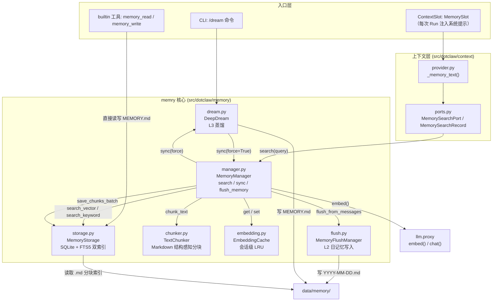
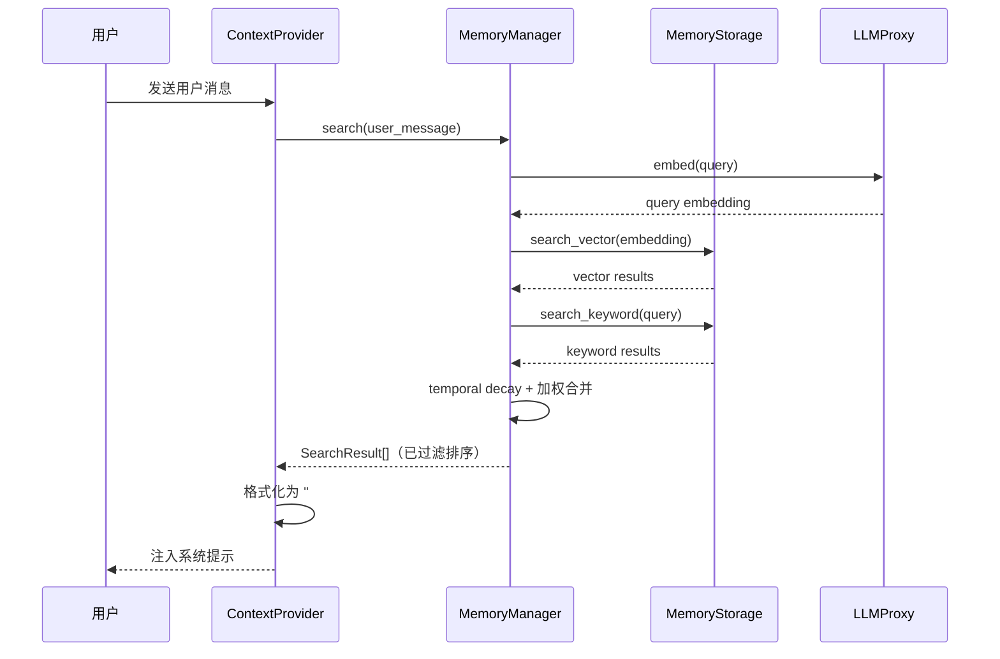
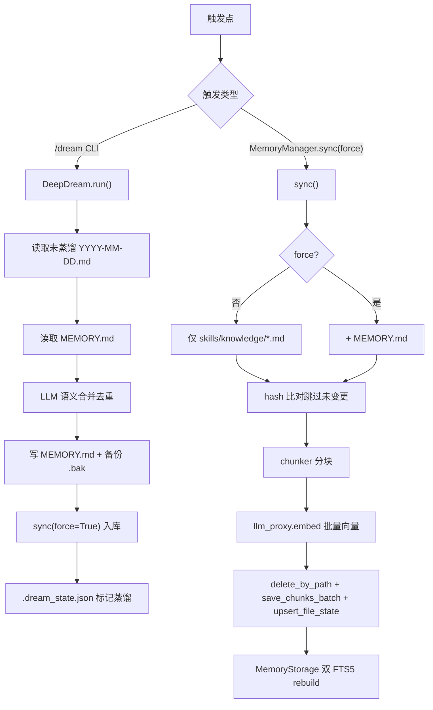
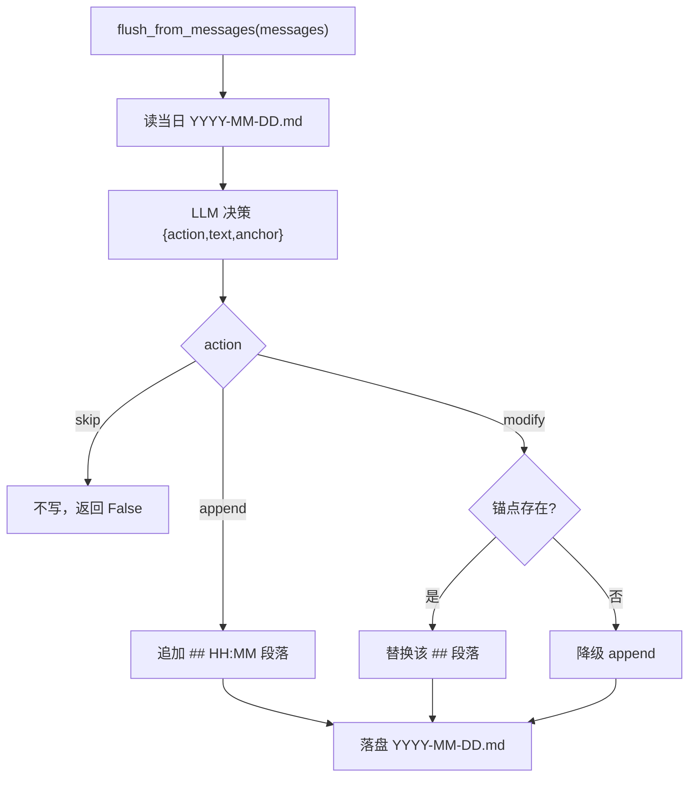
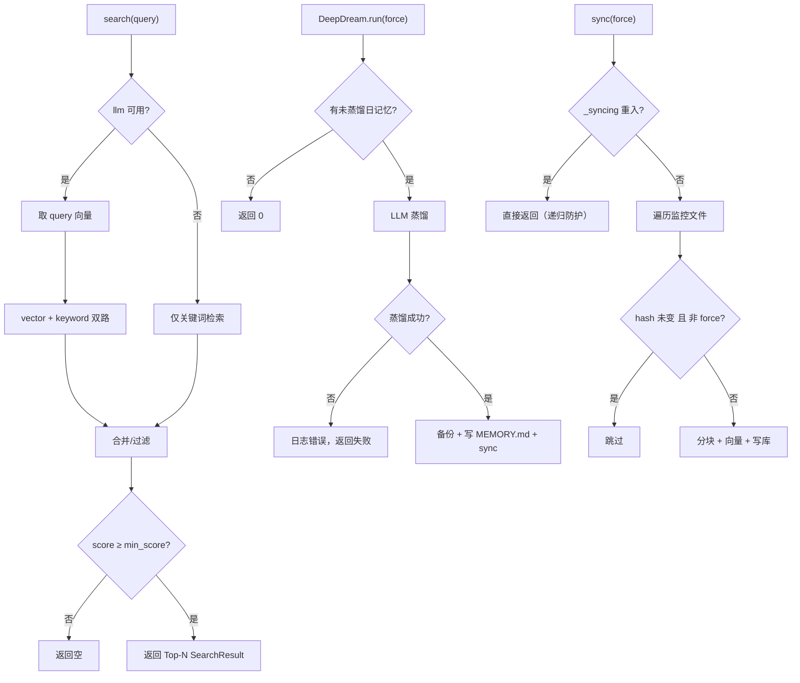

# Memory 模块总体说明

> 适用实现：Memory 子系统（L2 日记忆 + L3 长期记忆 + 向量索引）
> 定位：为 Agent 提供长期记忆的**检索、索引与蒸馏**能力，并通过 ContextPort 注入系统提示。
> 设计原则：**检索与写入分离、向量与关键词混合、文件变更驱动增量索引、LLM 语义蒸馏去重、通过 MemorySearchPort 隔离基础设施。**

## 1. 一句话理解 Memory

Memory 模块不是"对话历史库"（那在 `storage.conversation`），而是 Agent 的**长期知识层**：它把分散的 Markdown 知识源（日记忆、长期记忆、技能知识库）分块、向量化、建立双索引，并在每次请求时按用户意图做语义检索，把相关片段注入提示。

因此，记忆的三层结构为：

```text
L1 对话历史  → storage.conversation（不在本模块）
L2 日记忆    → data/memory/YYYY-MM-DD.md（MemoryFlushManager 写入，按话题增量/修改/跳过）
L3 长期记忆  → data/memory/MEMORY.md（DeepDream 蒸馏，经 sync 入库）
索引层       → data/memory/memory.db（MemoryStorage：SQLite + FTS5 双索引 + embedding BLOB）
```

同一项目共享一个 `memory.db` 与一个 `memory/` 目录；记忆**不按 Session/用户隔离**，是全 Agent 共享的工作区记忆。

## 2. 顶层架构



## 3. 代码层级

```text
src/dotclaw/
├── memory/                      # 记忆核心（本模块）
│   ├── __init__.py              # 包入口，导出 MemoryManager
│   ├── manager.py               # MemoryManager：检索/索引/flush 调度总入口
│   ├── storage.py               # MemoryStorage（SQLite+FTS5）、MemoryChunk、SearchResult
│   ├── chunker.py               # TextChunker：Markdown 结构感知分块
│   ├── embedding.py             # EmbeddingProvider(ABC) / OpenAIEmbeddingProvider / EmbeddingCache
│   ├── flush.py                 # MemoryFlushManager：L2 日记忆写入（append/modify/skip）
│   └── dream.py                 # DeepDream：L3 蒸馏（日记忆 → MEMORY.md）
├── context/
│   ├── ports.py                 # MemorySearchPort / MemorySearchRecord（接口契约）
│   ├── provider.py              # _memory_text()：检索结果转提示文本
│   └── slots.py                 # MemorySlot：绑定 "memory_text" 上下文变量
├── agent/
│   ├── factory.py               # _build_memory()：组合根
│   └── agent.py                 # 持有 DeepDream（memory_dream 属性）
├── tools/builtin/
│   └── memory_tool.py           # memory_read / memory_write 工具（直读直写 MEMORY.md）
└── config/
    └── settings.py              # MemorySettings：db_path / 分块 / 向量权重等
```

## 4. 模块说明与依赖

### 4.1 `memory/__init__.py` — 包入口
仅导出 `MemoryManager`，并声明"L2 由 MemoryManager 管理，对话持久化已迁移到 `storage.conversation`，Session 已迁移到 `session`"。

### 4.2 `memory/manager.py` — MemoryManager（核心）
统一检索入口 + 索引调度 + flush/dream 触发。构造依赖：`storage` / `chunker` / `workspace` / `llm_proxy` / `flush_manager` / `embedding_cache` 以及若干检索超参。

| 方法 | 职责 |
|---|---|
| `search(query, max_results, min_score)` | **混合检索**：向量（FTS5 可选）+ 关键词（FTS5）+ 时间衰减 → 加权合并 → 按 `min_score` 过滤 → 取 `max_results`。 |
| `sync(force=False)` | **索引调度**：文件变更检测（hash 比对）→ 分块 → 批量 embedding → 写库。仅处理 `skills/knowledge/*.md`；`force=True` 时追加 `MEMORY.md`。 |
| `flush_memory(messages, reason, journal)` | 委托 `flush_manager.flush_from_messages()` 写入 L2 日记忆。 |
| `_get_embedding(text)` | 单条文本向量，含 `EmbeddingCache` LRU 命中。 |
| `_apply_temporal_decay(results)` | 对 `source=="memory"`（日记忆）按文件名 `YYYY-MM-DD` 做半衰期衰减；`MEMORY.md` 不衰减。 |

> ⚠️ `flush_memory()` 目前**全局无调用点**（详见第 9 节）；`sync_on_search` 字段被接收但未在 `search()` 内被引用。

### 4.3 `memory/storage.py` — MemoryStorage
SQLite + FTS5 双索引 + embedding BLOB + 文件变更检测。

- **表**：`chunks`（主键 id、path、行号、text、embedding BLOB、hash、source、title、metadata、时间戳）；`files`（path/hash/mtime/size 变更检测）。
- **双 FTS5**：`chunks_fts`（unicode61，英文）+ `chunks_fts_trigram`（trigram，中文 ≥3 字）。`save_chunks_batch` 走 UPSERT 后**手动 rebuild** 两张 FTS（各自 try/except 独立）。
- **关键词检索** `search_keyword`：CJK 检测 → trigram 或 unicode61；无结果降级 `LIKE`。
- **向量检索** `search_vector`：从库读 embedding BLOB，numpy 向量化余弦相似度（无 numpy 降级纯 Python，慢 ~100x）。
- 迁移兼容：`title` 列对已有库 `ALTER TABLE` 追加。

### 4.4 `memory/chunker.py` — TextChunker
按行 + token 估算分块，**Markdown 结构感知**（不切断 `##` 标题边界，提取 `##` 作为 `title`），支持 `overlap`（块尾重叠）。中文 1 token/字、英文 1 token/4 字符的差异化估算。

### 4.5 `memory/embedding.py` — 嵌入抽象 + 缓存
- `EmbeddingProvider`（ABC）+ `OpenAIEmbeddingProvider`：OpenAI 兼容 API，batch=16。
- `EmbeddingCache`：会话级 LRU（`OrderedDict`，max 256），按文本 sha256 取键。

> ⚠️ `EmbeddingProvider` / `OpenAIEmbeddingProvider` 当前是**死代码**——`MemoryManager` 实际通过注入的 `llm_proxy.embed()` 取向量（见 `factory.py`：仅 `EmbeddingCache` 被使用）。

### 4.6 `memory/flush.py` — MemoryFlushManager（L2 日记忆）
`flush_from_messages(messages, reason)`：读当日 `YYYY-MM-DD.md` → 构建对话文本 → 调 LLM 返回结构化 JSON（`action: append/modify/skip`，`text`，`target_anchor`）→ 执行写入。`skip` 跳过、`modify` 按 `## HH:MM` 锚点替换、`append` 追加带时间戳段落。LLM 失败时降级为简单追加摘要。

### 4.7 `memory/dream.py` — DeepDream（L3 蒸馏）
`run(force=False)`：读所有未蒸馏的 `YYYY-MM-DD.md` → 读现有 `MEMORY.md` → LLM 语义合并去重、按主题 `##` 分组 → 写 `MEMORY.md`（写前备份 `.bak`）→ 调 `memory_mgr.sync(force=True)` 入库 → 更新 `.dream_state.json`（去重防重复蒸馏）。LLM 不可用时退化为拼接。

### 4.8 `context/ports.py` — MemorySearchPort / MemorySearchRecord
接口契约（Protocol）。`MemoryManager.search()` 结构满足 `MemorySearchPort`（`async def search(query) -> Sequence[MemorySearchRecord]`）。`ContextDependencies.memory_manager: MemorySearchPort | None` 通过此端口解耦。

### 4.9 `context/provider.py` — `_memory_text()`
`ContextProvider` 在构建 RUN 快照时，以 `user_message.content` 为 query 调 `memory_manager.search()`，格式化为 `## 相关记忆` 文本块，存入快照变量 `memory_text`。

### 4.10 `context/slots.py` — MemorySlot
`_TextOwnerSlot("memory_text")`，从 RUN 快照读取 `memory_text` 注入系统提示。属于每轮（RUN 级）条件性上下文。

### 4.11 `agent/factory.py` — `_build_memory()`（组合根）
异步工厂：`MemoryStorage(config.memory.get_db_path)` → `TextChunker` → `EmbeddingCache` → `MemoryFlushManager` → `MemoryManager` → `DeepDream(memory_manager=...)`，返回 `(memory_mgr, dream)`。其中 `memory_mgr` 作为 `MemorySearchPort` 注入 `ContextDependencies`；`dream` 存到 `Agent.memory_dream`，由 CLI `/dream` 触发。

### 4.12 `tools/builtin/memory_tool.py` — 记忆工具
`memory_read` / `memory_write` 直读直写 `MEMORY.md`（`memory_write` 需审批）。**注意**：它绕过 `MemoryManager` 与索引，直接落盘——写入后不会自动 `sync` 进向量库，下次蒸馏（`/dream`）才会被 `DeepDream` 拾取并入库。

## 5. 业务处理流程

### 5.1 检索注入流程（每次 Run）



### 5.2 索引 / 蒸馏流程（sync + dream）



### 5.3 L2 写入决策（flush，当前未接入主流程）



## 6. 状态与分支



- **检索分支**：向量与关键词两路独立；向量路仅在 `llm_proxy` 存在时执行；合并后按 `min_score` 截断。
- **蒸馏分支**：无新日记忆直接返回；LLM 失败降级为原样拼接（不入库）；写前备份旧 `MEMORY.md` 为 `.bak`。
- **索引分支**：`_syncing` 标志防止重入；hash 未变更且非 `force` 时跳过整文件；`source` 决定时间衰减是否生效（仅 `memory` 衰减）。

## 7. 工程化设计亮点

1. **混合检索 + 时间衰减**：向量语义召回 + FTS5 关键词召回，按 `vector_weight`/`keyword_weight` 加权合并；日记忆随年龄半衰期衰减，长期记忆恒权——兼顾相关性与时效性。
2. **中英文双 FTS5 索引**：unicode61（英文分词）+ trigram（中文 ≥3 字），并带 `LIKE` 降级兜底，保证 CJK 与 ASCII 都能查到。
3. **文件变更检测**：`files` 表存 hash/mtime/size，未变更文件跳过索引，避免重复 embedding（尽管单文件内部仍全量重入，见第 9 节）。
4. **Markdown 结构感知分块**：不切断 `##` 标题，`title` 字段保留章节主题，检索结果带主题上下文，提升可解释性。
5. **会话级 LRU 嵌入缓存**：`EmbeddingCache`（256 条）避免同一 query 重复调 API。
6. **LLM 结构化写入决策**：flush 用 `append/modify/skip` 三类动作 + 时间戳锚点，避免日记忆无限膨胀、支持话题延续合并。
7. **蒸馏去重与状态机**：`.dream_state.json` 记录已蒸馏日期，`force` 才重做，避免重复蒸馏；写前备份防丢失。
8. **依赖倒置**：`MemoryManager` 仅依赖 `MemorySearchPort` 契约（由 context 层定义），embedding 经 `llm_proxy` 统一调度；`numpy` 缺失自动降级纯 Python 实现。

## 8. 数据与运维语义

### 8.1 数据容器

| 文件 / 表 | 路径 | 内容 | 写入方 |
|---|---|---|---|
| `memory.db` | `data/memory/memory.db` | `chunks` / `files` / 双 FTS5 索引 | MemoryStorage |
| `YYYY-MM-DD.md` | `data/memory/` | L2 日记忆（按 `## HH:MM` 段落） | MemoryFlushManager（**当前未接入**） |
| `MEMORY.md` | `data/memory/` | L3 长期记忆（按 `## 主题` 分组） | DeepDream / memory_write 工具 |
| `MEMORY.md.bak` | `data/memory/` | 蒸馏前备份 | DeepDream |
| `.dream_state.json` | `data/memory/` | 各日蒸馏状态 | DeepDream |

### 8.2 配置项（`config.yaml` → `MemorySettings`）

| 配置键 | 默认值 | 说明 | 是否生效 |
|---|---|---|---|
| `memory.db_path` | `./data/memory/memory.db` | 向量库路径 | ✅ |
| `memory.workspace` | `./data` | 记忆目录根 | ✅ |
| `memory.chunk_max_tokens` | `500` | 单块 token 上限 | ✅ |
| `memory.chunk_overlap_tokens` | `50` | 块尾重叠 | ✅ |
| `memory.embedding_dimensions` | `1024` | 向量维度（**须与模型一致**） | ✅ |
| `memory.max_results` | `5` | 检索返回条数 | ✅ |
| `memory.min_score` | `0.1` | 低分截断阈值 | ✅ |
| `memory.vector_weight` | `0.7` | 向量召回权重 | ✅ |
| `memory.keyword_weight` | `0.3` | 关键词召回权重 | ✅ |
| `memory.temporal_decay_half_life_days` | `30.0` | 日记忆半衰期 | ✅ |
| `memory.embedding_model` / `api_base` / `api_key` | `text-embedding-v3` / `""` | 预留给 `EmbeddingProvider`（实际未使用） | ❌ 走 `llm_proxy` |
| `memory.sync_on_search` | `True` | 意图在 search 时触发 sync | ❌ 实际未引用 |
| `memory.flush_threshold` / `flush_max_messages` | `20` / `10` | 旧阈值策略 | ❌ 已废弃 |
| `memory.dream_enabled` / `dream_schedule` | `True` / `55 23 * * *` | 蒸馏开关与定时 | ❌ 仅 `/dream` CLI 触发 |

### 8.3 排障入口
- 检索无结果：检查 `memory.db` 是否经 `sync` / `/dream` 入库；确认 `embedding_dimensions` 与模型实际维度一致。
- 中文搜不到：确认 SQLite 编译带 FTS5 trigram；`search_keyword` 对 <3 字中文走 unicode61 可能漏召回。
- 性能：未装 `numpy` 时向量检索降级纯 Python（慢 ~100x），应安装 `numpy`。
- 索引未更新：检查 `files` 表 hash 是否过期；`force=True`（如 `/dream`）强制重入。

## 9. 当前限制与演进方向

1. **L2 flush 接线缺口（高优）**：`MemoryManager.flush_memory()` 全局无任何调用点，每轮 L2 日记忆写入实际**未接入运行主流程**（配置注释称"改为每轮触发"但未落地）。后果：`YYYY-MM-DD.md` 不会被自动生成，`DeepDream` 依赖的日记忆源为空，长期记忆蒸馏链条断裂。建议：在 Run 收尾（或 Runtime 提交点）调用 `agent.memory_manager.flush_memory(...)`。
2. **`EmbeddingProvider` 死代码**：`embedding.py` 的 `OpenAIEmbeddingProvider` 未被任何路径使用，实际嵌入统一走 `llm_proxy.embed()`。建议清理或改为实际被 `MemoryManager` 注入使用，消除误导。
3. **`sync_on_search` / `dream_schedule` / `SchedulerConfig` 未生效**：三者均被声明但无消费逻辑。若需"搜索即索引"或定时蒸馏，应在 `search()` 与 Scheduler 模块补齐实现。
4. **单文件全量重入**：`sync()` 对每个变更文件整体重分块重嵌入（代码 TODO 已标注），大文件代价高；后续应做块级增量（按 chunk hash 比对）。
5. **记忆不按 Session/用户隔离**：`memory.db` 与 `memory/` 是项目级共享，多 Agent/多用户混用同一索引。需要租户隔离时应引入 `session_id`/`user_id` 维度列。
6. **维度一致性硬约束**：`embedding_dimensions` 若与 `llm_proxy` 实际返回维度不符，余弦分数无意义但不报错，需加断言校验。
7. **`MEMORY.md` 写入不自动入库**：`memory_write` 工具直写文件后不触发 `sync`，须等 `/dream` 才进向量库，期间检索不到新写入。

---

> 协同文档：`Runtime 模块总体说明.md`（执行引擎）、`Tool 模块总体说明.md`（memory_read/write 工具归属）、`context/` 系列（MemorySlot 注入链路）。
