# Memory 模块总体说明

> 适用代码：`aandbcct/dotClaw` 的 `master` 分支  
> 扫描基准：2026-07-26，包含 SQLite/FTS5 存储、文本分块、Embedding、混合检索、MemoryManager、日记忆 Flush、DeepDream、Context 接入、Bootstrap、Config 与 Builtin Memory Tool 边界  
> 扫描提交：`3d343abea03c58e68fdcdf5fc8271352bafc988c`  
> 文档定位：自顶向下解释 dotClaw 当前 Memory 如何同步工作区知识和长期记忆、执行混合检索并进入 Context，同时明确日记忆写入、长期蒸馏、定时任务、索引更新和隔离能力中哪些已经接入主链、哪些仅有组件实现。  
> 编写基准：《dotClaw Wiki 编写规范与验收准则 v1.1》  
> 上级导航：[dotClaw 开发者 Wiki](./README.md)

**快速导航**

| 需要回答的问题 | 阅读位置 |
|---|---|
| Memory 在系统中是什么，与 Session/Knowledge 有什么区别 | 第 1～2 节 |
| 存储、分块、Embedding、Manager、Flush 和 Dream 如何分工 | 第 3～4 节 |
| 启动、同步、检索、日记忆和蒸馏如何运行 | 第 5 节 |
| SQLite、文件、查询、配置和 Context 契约 | 第 6 节 |
| 修改某项 Memory 能力从哪里开始 | 第 7 节 |
| 当前实际能力、问题和候选演进路线 | 第 8 节 |
| 具体源码在哪里 | 第 9 节 |

```text
当前已接入的读取链
用户消息
→ ContextProvider
→ MemoryManager.search()
→ 向量检索 + FTS5/LIKE
→ MemorySlot
→ ContextVersion Snapshot
→ LLM

当前未闭环的写入链
成功 Run
⇏ MemoryManager.flush_memory()

手动维护链
/dream
→ DeepDream
→ MEMORY.md
→ MemoryManager.sync(force=True)
→ SQLite 索引
```

---

## 1. 模块定位与边界

Memory 模块是 dotClaw 的**工作区级长期信息文件、索引和相关内容检索层**。

它将部分 Markdown 文件分块并保存到本地 SQLite，通过 Embedding、FTS5 和简单时间衰减产生 `SearchResult`，再由 Context 模块把结果作为当前 Run 的 System Content 注入模型。

当前实现还提供：

- 从消息生成当日日记文件的 `MemoryFlushManager`；
- 将日记文件蒸馏为 `MEMORY.md` 的 `DeepDream`；
- 直接读写 `MEMORY.md` 的 Builtin Tool。

但必须区分：

> “组件存在”不等于“生产主链已经自动调用”。

当前正常 Run 已接入 **Memory 检索**，但没有自动触发 **日记忆 Flush**；DeepDream 只通过 CLI `/dream` 手动触发，配置中的定时表达式尚未进入 Scheduler。

### 1.1 核心职责

当前职责归纳为六组：

1. **长期信息存储**：在 SQLite 中保存分块、文件状态、Embedding 和全文索引。
2. **结构化分块**：按行、估算 Token 和 Markdown 二级标题生成可检索块。
3. **混合检索**：组合向量相似度、关键词结果和时间衰减。
4. **Context 来源**：通过 `MemorySearchPort` 为 RUN Owner 提供相关记忆文本。
5. **日记忆生成**：将一组消息转换为每日 Markdown 摘要段落。
6. **长期蒸馏**：将未蒸馏日记和已有 `MEMORY.md` 语义合并，再重新同步索引。

### 1.2 主要使用者

| 使用者 | 如何使用 Memory |
|---|---|
| `ContextProvider` | 按当前用户消息调用 `MemoryManager.search()` |
| `MemorySlot` | 读取 Provider 已格式化的 `memory_text` |
| `ApplicationHost` | 以可降级依赖创建 MemoryManager 与 DeepDream |
| `runtime_factory` | 将 MemoryManager 注入 ContextDependencies |
| CLI `/dream` | 手动执行 DeepDream |
| `LLMProxy` | 为查询和文件块生成 Embedding；为 Flush/Dream 生成文本 |
| `builtin.memory.read/write` | 直接读写指定 `MEMORY.md`，但不经过 MemoryManager |
| 推导出的 `skills/knowledge/*.md` | 作为静态知识文件被 MemoryManager 同步；默认配置下位于项目根 |
| Config | 提供存储、分块、Embedding、检索和 Dream 配置字段 |

### 1.3 明确不负责的内容

Memory 当前不负责：

1. **Session 语义历史**：Conversation、HistoryCompression 和成功投影属于 Session/Runtime。
2. **Run 执行事实**：RunMessage、RunEvent、Checkpoint 和 ContextVersion 属于 Runtime。
3. **外部知识库协议**：Context 的 `KnowledgeSearchPort` 是另一条可选边界，当前默认未装配。
4. **自动对话记忆闭环**：当前 Runtime/CLI 正常提交后不自动调用 `flush_memory()`。
5. **定时任务调度**：`dream_schedule` 只是配置字段，现有 Scheduler 只提供一次性 Reminder。
6. **用户级遗忘与隔离**：当前没有 user_id、tenant_id、agent_id 或 session_id 过滤和删除协议。
7. **Tool 安全策略**：Builtin Memory Tool 的路径能力、审批和执行由 Tool 模块负责。

### 1.4 与相邻模块的职责边界

| 相邻模块 | Memory 负责 | 相邻模块负责 |
|---|---|---|
| Context | 提供 SearchResult | 决定查询时机、Slot、消息角色、Snapshot 和 Token 预算 |
| Session | 不保存 Conversation | 成功对话、历史压缩和 Session 生命周期 |
| Runtime | 不驱动 AgentRun | 调用 Context、持久化输入快照、恢复和执行 |
| LLM | 组织 Memory 用途 | Chat/Embedding Provider、模型路由、限流和熔断 |
| Tool | 不负责 Tool Policy | `builtin.memory.read/write` 声明、路径策略和审批 |
| Skills | 读取由 Workspace 层级推导出的 `skills/knowledge/*.md` | Skill 发现、元数据和知识文件维护 |
| Knowledge | 当前把部分知识混入 Memory 索引 | 独立 KnowledgeSearchPort 的具体实现 |
| Bootstrap | 提供可构造对象 | 组件创建、降级、注入和生命周期 |
| Config | 消费 MemoryConfig | YAML 解析、环境变量和项目根 |
| Scheduler | 不创建定时任务 | 未来按 schedule 触发 Dream |
| Journal | 可选记录 Flush 结果 | 观测和诊断，不是 Memory 事实源 |

---

## 2. 模块在项目中的位置

### 2.1 全局位置图

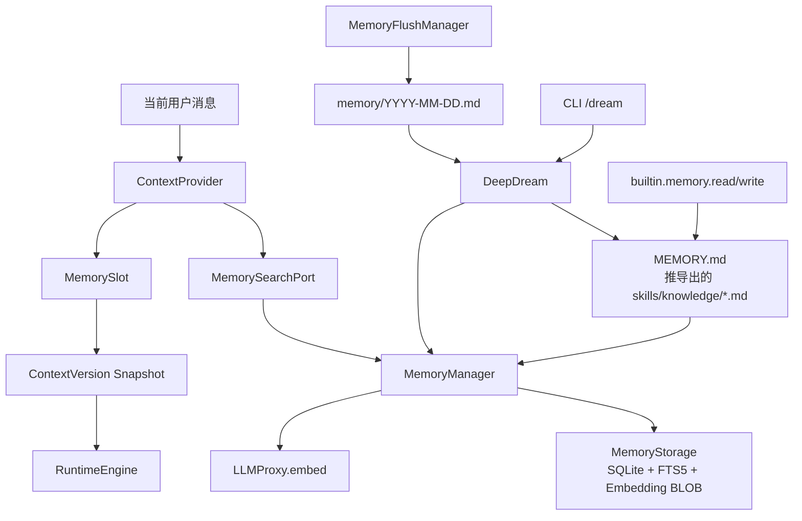
```mermaid
flowchart TB
    User["当前用户消息"]
    Context["ContextProvider"]
    Port["MemorySearchPort"]
    Manager["MemoryManager"]
    Storage["MemoryStorage<br/>SQLite + FTS5 + Embedding BLOB"]
    LLM["LLMProxy.embed"]
    Slot["MemorySlot"]
    Version["ContextVersion Snapshot"]
    Engine["RuntimeEngine"]

    Files["MEMORY.md<br/>推导出的 skills/knowledge/*.md"]
    Flush["MemoryFlushManager"]
    Dream["DeepDream"]
    Daily["memory/YYYY-MM-DD.md"]
    CLI["CLI /dream"]
    Tool["builtin.memory.read/write"]

    User --> Context
    Context --> Port
    Port --> Manager
    Manager --> Storage
    Manager --> LLM
    Context --> Slot
    Slot --> Version
    Version --> Engine

    Files --> Manager
    Flush --> Daily
    Daily --> Dream
    CLI --> Dream
    Dream --> Files
    Dream --> Manager
    Tool --> Files
```

**结论：**

- 读取链的直接调用者是 ContextProvider。
- MemoryManager 是同步与检索协调者。
- Storage 不调用 LLM；Embedding 由 Manager 通过 LLMProxy 获取。
- Flush 与 Dream 是写入维护组件，不属于 Runtime 执行状态机。
- Builtin Tool 直接操作文件，不调用 Manager。
- Bootstrap 是唯一生产组合根。

### 2.2 数据与文件布局

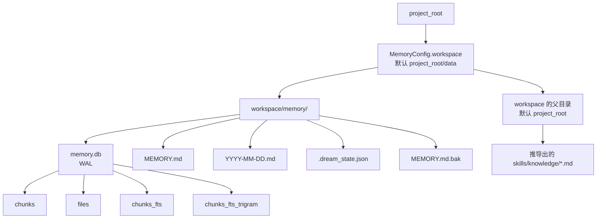
```mermaid
flowchart TB
    Root["project_root"]
    Workspace["MemoryConfig.workspace<br/>默认 project_root/data"]
    MemoryDir["workspace/memory/"]
    DB["memory.db<br/>WAL"]
    Memo["MEMORY.md"]
    Daily["YYYY-MM-DD.md"]
    State[".dream_state.json"]
    Backup["MEMORY.md.bak"]
    DerivedRoot["workspace 的父目录<br/>默认 project_root"]
    Skills["推导出的 skills/knowledge/*.md"]

    Root --> Workspace
    Workspace --> MemoryDir
    Workspace --> DerivedRoot
    DerivedRoot --> Skills
    MemoryDir --> DB
    MemoryDir --> Memo
    MemoryDir --> Daily
    MemoryDir --> State
    MemoryDir --> Backup

    DB --> Chunks["chunks"]
    DB --> Files["files"]
    DB --> FTS["chunks_fts"]
    DB --> Trigram["chunks_fts_trigram"]
```

**结论：**

- 默认 `workspace=./data`，因此 Memory 文件位于 `project_root/data/memory`。
- SQLite、日记、长期记忆、Dream 状态和备份共享 `workspace/memory`。
- 静态知识目录不是直接使用 `project_root` 参数，而是由 `workspace/memory` 向上两级后拼接 `skills/knowledge`；默认配置下才等价于 `project_root/skills/knowledge/*.md`。
- 自定义 Workspace 若不保持 `project_root/data` 这一层级关系，静态知识目录也会随之漂移。
- 当前 Config 的 `long_term_file` 没有决定 DeepDream/Manager 的实际路径；它们按 Workspace 固定使用 `memory/MEMORY.md`。
- Builtin Tool 默认也使用 `./data/memory/MEMORY.md`，但允许调用参数覆盖。

### 2.3 读取平面与写入平面

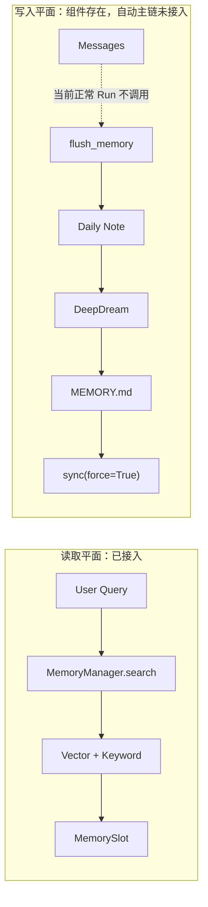
```mermaid
flowchart LR
    subgraph ReadPlane["读取平面：已接入"]
        Query["User Query"]
        Search["MemoryManager.search"]
        Hybrid["Vector + Keyword"]
        Context["MemorySlot"]
    end

    subgraph WritePlane["写入平面：组件存在，自动主链未接入"]
        Messages["Messages"]
        Flush["flush_memory"]
        Daily["Daily Note"]
        Dream["DeepDream"]
        Memo["MEMORY.md"]
        Sync["sync(force=True)"]
    end

    Query --> Search --> Hybrid --> Context
    Messages -.当前正常 Run 不调用.-> Flush
    Flush --> Daily --> Dream --> Memo --> Sync
```

**结论：**

- 读取和写入不是一个闭环事务。
- 检索已经进入每个普通 Run 的 Context 构建。
- Flush 只能由外部显式调用。
- Dream 目前由 `/dream` 手动调用。
- 写文件成功不自动保证索引已更新。

### 2.4 Memory、Session History 与 Knowledge

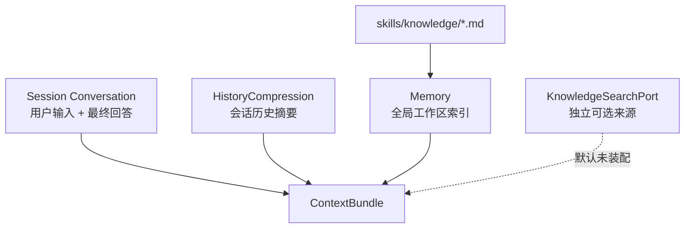
```mermaid
flowchart TB
    Session["Session Conversation<br/>用户输入 + 最终回答"]
    Compression["HistoryCompression<br/>会话历史摘要"]
    Memory["Memory<br/>全局工作区索引"]
    KnowledgePort["KnowledgeSearchPort<br/>独立可选来源"]
    SkillsKnowledge["skills/knowledge/*.md"]
    Context["ContextBundle"]

    Session --> Context
    Compression --> Context
    Memory --> Context
    KnowledgePort -.默认未装配.-> Context
    SkillsKnowledge --> Memory
```

**结论：**

- Session History 是按 Session 隔离的成功对话事实。
- HistoryCompression 是会话上下文优化，不是长期个性记忆。
- Memory 当前是工作区全局索引，跨 Session 和 Agent 共享。
- 默认配置下的 `project_root/skills/knowledge/*.md` 虽语义上是知识，当前通过 MemoryManager 返回并进入 Memory Slot；实际目录由 Workspace 层级推导。
- 独立 Knowledge Slot 默认没有具体数据源。

### 2.5 当前隔离模型

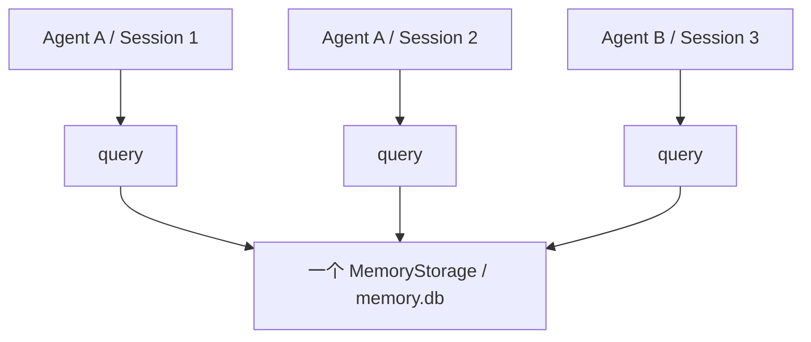
```mermaid
flowchart TD
    DB["一个 MemoryStorage / memory.db"]
    A1["Agent A / Session 1"]
    A2["Agent A / Session 2"]
    B1["Agent B / Session 3"]
    Q1["query"]
    Q2["query"]
    Q3["query"]

    A1 --> Q1 --> DB
    A2 --> Q2 --> DB
    B1 --> Q3 --> DB
```

**结论：**

- MemoryManager 是 ApplicationHost 级单实例。
- Context 查询只传入当前用户文本。
- 查询没有 agent_id、session_id、user_id 或 source filter。
- 所有 Agent 和 Session 共享同一 SQLite 数据集。
- Session 删除不会删除 Memory 文件或索引。

### 2.6 依赖方向

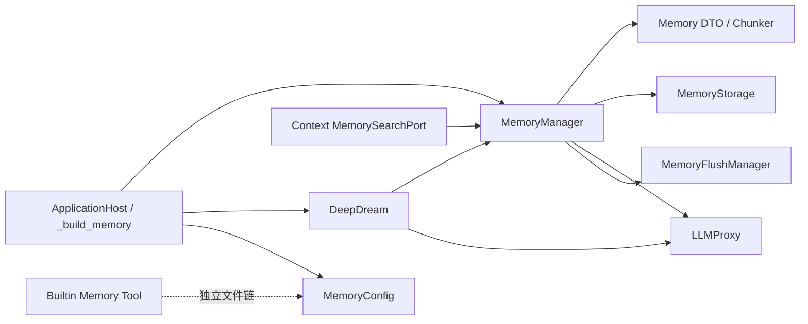
```mermaid
flowchart LR
    Domain["Memory DTO / Chunker"]
    Storage["MemoryStorage"]
    Manager["MemoryManager"]
    Flush["MemoryFlushManager"]
    Dream["DeepDream"]
    ContextPort["Context MemorySearchPort"]
    Bootstrap["ApplicationHost / _build_memory"]
    LLM["LLMProxy"]
    Tool["Builtin Memory Tool"]
    Config["MemoryConfig"]

    Manager --> Domain
    Manager --> Storage
    Manager --> LLM
    Manager --> Flush
    Dream --> Manager
    Dream --> LLM
    ContextPort --> Manager
    Bootstrap --> Manager
    Bootstrap --> Dream
    Bootstrap --> Config
    Tool -.独立文件链.-> Config
```

**结论：**

- MemoryManager 直接依赖现有 LLMProxy，而不是 Memory 自己的 EmbeddingProvider Port。
- Context 通过结构协议依赖 Manager，避免直接导入 Memory 类型。
- DeepDream 反向调用 Manager.sync，形成 Memory 内部维护链。
- Builtin Tool 与 Manager 没有调用关系。
- Memory Domain 当前不是严格分层架构，Storage、LLM 和文件操作都由具体类直接使用。

---

## 3. 组件总览

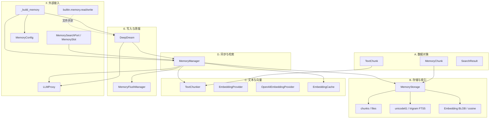
```mermaid
flowchart TB
    subgraph DTO["A. 数据对象"]
        TextChunk["TextChunk"]
        MemoryChunk["MemoryChunk"]
        SearchResult["SearchResult"]
    end

    subgraph Index["B. 存储与索引"]
        Storage["MemoryStorage"]
        SQLite["chunks / files"]
        FTS["unicode61 / trigram FTS5"]
        Vector["Embedding BLOB / cosine"]
    end

    subgraph Processing["C. 文本与向量"]
        Chunker["TextChunker"]
        Provider["EmbeddingProvider"]
        OpenAIProvider["OpenAIEmbeddingProvider"]
        Cache["EmbeddingCache"]
    end

    subgraph Coordination["D. 同步与检索"]
        Manager["MemoryManager"]
    end

    subgraph Write["E. 写入与蒸馏"]
        Flush["MemoryFlushManager"]
        Dream["DeepDream"]
    end

    subgraph Integration["F. 外部接入"]
        Context["MemorySearchPort / MemorySlot"]
        Bootstrap["_build_memory"]
        Config["MemoryConfig"]
        Tool["builtin.memory.read/write"]
        LLM["LLMProxy"]
    end

    TextChunk --> Chunker
    MemoryChunk --> Storage
    Storage --> SQLite
    Storage --> FTS
    Storage --> Vector
    Manager --> Chunker
    Manager --> Storage
    Manager --> Cache
    Manager --> LLM
    Manager --> Flush
    Dream --> Manager
    Dream --> LLM
    Context --> Manager
    Bootstrap --> Manager
    Bootstrap --> Dream
    Bootstrap --> Config
    Tool -.文件共享.-> Dream
```

**结论：**

- DTO、存储、分块、协调和维护是五个核心职责组。
- `EmbeddingProvider` 抽象与生产 Bootstrap 当前不在同一调用链。
- MemoryManager 是检索和文件同步的总协调者。
- Flush 负责日记，Dream 负责长期合并，两者不能互换。
- Context 只消费 SearchResult 的只读字段。
- Builtin Tool 是相邻工具能力，不是 MemoryManager 的公共 API。

### 3.1 组成部分与责任

| 分类 | 组成部分 | 主归属 | 稳定职责 |
|---|---|---|---|
| DTO | `TextChunk` | Memory | 分块文本、行号和标题 |
| DTO | `MemoryChunk` | Memory | 可持久化分块、Embedding、来源和 Hash |
| DTO | `SearchResult` | Memory | 检索返回的路径、分数和摘要 |
| Storage | `MemoryStorage` | Memory | SQLite Schema、文件状态、FTS 和向量扫描 |
| Processing | `TextChunker` | Memory | Markdown 结构感知分块 |
| Processing | `EmbeddingCache` | Memory | 进程内查询向量缓存 |
| Processing | `EmbeddingProvider` | Memory | Embedding 抽象；当前生产未使用 |
| Coordination | `MemoryManager` | Memory | Sync、Search、Flush 入口和融合排序 |
| Write | `MemoryFlushManager` | Memory | 消息→每日记忆 |
| Distillation | `DeepDream` | Memory | 每日记忆→长期 `MEMORY.md` |
| Context | `MemorySearchPort` | Context | 最小检索 Protocol |
| Context | `MemorySlot` | Context | 将格式化结果写入 RUN Snapshot |
| Bootstrap | `_build_memory` | Bootstrap | 构造、配置投影和可降级装配 |
| Config | `MemoryConfig` | Config | Memory 配置声明与路径解析 |
| Tool | Builtin Memory | Tool | 受 Policy 约束的直接文件读写 |
| LLM | `LLMProxy.embed/chat` | LLM | Embedding 和摘要/蒸馏模型调用 |

---

## 4. 各组件的类与职责

本节先说明 Memory 自身的 DTO、存储、分块、检索、Flush 和 Dream，再解释 Context、Bootstrap、Config、LLM 与 Builtin Tool 的直接接入边界。

### 4.1 分块与检索数据对象

#### 4.1.1 `TextChunk`

**职责与用途：**表示 `TextChunker` 产生的内存分块结果。

字段：

```text
text
start_line
end_line
title
```

行号当前从 0 开始。`title` 只记录最近的 Markdown `## ` 二级标题。

#### 4.1.2 `MemoryChunk`

**职责与用途：**表示准备写入 SQLite 的完整分块。

字段：

```text
id
path
start_line / end_line
text
embedding
hash
source
title
metadata
```

`source` 注释允许：

```text
memory
session
knowledge
```

当前 Manager 实际只生成：

```text
MEMORY.md → memory
推导出的 skills/knowledge/*.md → knowledge
```

没有生产路径生成 `session` 来源。

#### 4.1.3 `SearchResult`

**职责与用途：**是 MemoryManager 和 Context 之间的实际检索结果对象。

字段：

```text
path
start_line / end_line
score
snippet
source
title
```

`metadata` 和完整 Chunk ID 不会进入 SearchResult。Context 只使用 path、snippet、source 和 title。

**DTO 可变性**

**说明：**三个 DTO 都是普通可变 dataclass。

MemoryManager 在融合和时间衰减阶段会直接修改 `SearchResult.score`。调用方如果复用同一对象，需要理解分数不是不可变事实。

---

### 4.2 `MemoryStorage`

#### 4.2.1 `MemoryStorage`

**职责与用途：**封装一个 SQLite Connection，同时承担关系表、FTS5 和向量检索。

构造时立即：

```text
创建父目录
→ sqlite3.connect(check_same_thread=False)
→ PRAGMA journal_mode=WAL
→ PRAGMA foreign_keys=ON
→ 创建表和索引
```

它不是异步 Store，所有 SQL 操作都在调用线程同步执行。

**`chunks` 表**

**说明：**保存每个分块的正文与向量：

```text
id PRIMARY KEY
path
start_line / end_line
text
embedding BLOB
hash
source
title
metadata JSON text
created_at / updated_at Unix seconds
```

当前没有显式 schema version 表。

**`files` 表**

**说明：**保存被监控文件的同步状态：

```text
path PRIMARY KEY
hash
mtime
size
updated_at
```

Manager 主要按文件 Hash 判断是否需要重建，而不是依赖 mtime 和 size。

**双 FTS5 索引**

**说明：**创建两个 external-content FTS5 表：

```text
chunks_fts
→ 默认 unicode61
→ 英文和一般 Token 查询

chunks_fts_trigram
→ trigram case-insensitive
→ 长度至少 3 的 CJK 查询
```

保存分块后通过 `rebuild` 全量重建两套索引。

**Title 迁移**

**说明：**建表后无条件尝试：

```sql
ALTER TABLE chunks ADD COLUMN title ...
```

并吞掉任意 `sqlite3.OperationalError`。

这同时兼容旧数据库和隐藏其他 ALTER 失败，无法区分“列已存在”与真实迁移异常。

#### 4.2.2 `save_chunks_batch`

**职责与用途：**逐块执行 UPSERT，然后一次 commit。

Embedding 保存方式：

```text
numpy 可用
→ float32 bytes

numpy 不可用
→ JSON bytes
```

UPSERT 当前更新：

```text
text
embedding
hash
title
updated_at
```

不会更新 path、行号、source 和 metadata。Manager 通常会先按 path 删除，因此正常同步较少命中旧字段问题。

**FTS 重建策略**

**说明：**每次 `save_chunks_batch()` 后重建完整 FTS 表。

它避免 SQLite external-content FTS 不随 UPSERT 自动更新，但代价是每同步一个文件都进行全库重建。

**`delete_by_path`**

**说明：**删除指定 path 的 chunks 和 files 记录并 commit。

它不直接重建 FTS；正常 Manager 同步随后调用 save 并重建。若单独调用删除，FTS 内部索引可能保留无效条目，查询 JOIN 会过滤不存在的 chunks。

**文件状态接口**

**说明：**

```text
get_file_state(path)
→ (hash, mtime, size) | None

upsert_file_state(...)
→ 插入或更新 files
```

当前没有列出全部已知文件、标记删除或比较磁盘文件集合的接口。

#### 4.2.3 `search_keyword`

**职责与用途：**执行关键词检索：

```text
CJK 且去空格长度 >= 3
→ trigram FTS

其他
→ unicode61 FTS

FTS 无结果或异常
→ SQL LIKE
```

每个结果的 snippet 固定为 chunk 正文前 200 字符，不围绕命中位置截取。

**FTS 分数**

**说明：**Storage 原样返回 FTS5 `rank` 的浮点值。

FTS5 BM25 类 rank 通常是负值且绝对值语义与余弦分数不同。Storage 不负责归一化，融合逻辑位于 MemoryManager。

#### 4.2.4 `search_vector`

**职责与用途：**从 chunks 表读取所有非空 embedding，再在进程内计算余弦相似度。

它不是 ANN 或 SQLite 向量扩展：

```text
查询成本
≈ 已索引向量总数 × 向量维度
```

**NumPy 与纯 Python 路径**

**说明：**

- NumPy 路径用 `frombuffer(float32)` 和 `np.dot`；
- 无 NumPy 时按 JSON 解码后逐元素计算。

项目依赖中 NumPy 是必装项，纯 Python 路径主要是防御性兼容。

**向量维度**

**说明：**表中不保存 embedding model 或 dimensions。

如果后续模型维度改变，旧 BLOB 与新查询向量长度不一致可能使余弦计算失败。Storage 没有逐行维度校验或迁移机制。

#### 4.2.5 `close`

**职责与用途：**关闭 SQLite Connection 并置空。

当前 ApplicationHost 没有保存 MemoryStorage 引用，也没有在 shutdown 中调用该方法。

---

### 4.3 `TextChunker`

#### 4.3.1 `TextChunker`

**职责与用途：**按行累计估算 Token，并在大小阈值或 Markdown 二级标题处切块。

默认由 Config 提供：

```text
max_tokens = 500
overlap_tokens = 50
```

**Markdown 标题识别**

**说明：**只识别：

```markdown
## 标题
```

不会把：

```markdown
# 一级标题
### 三级标题
```

作为独立边界。

遇到新二级标题时，当前块先结束，再把尾部 overlap 复制到新标题块前。

**Token 估算**

**说明：**使用字符启发式：

```text
中文字符数
+ 其他字符数 // 4
```

最少返回 1。

它与 Runtime 使用的 Tiktoken 精确预算不是同一 Tokenizer，`max_tokens` 只是近似分块尺寸。

**大行与空块边界**

**说明：**达到阈值时保存 `current_lines[:-1]`，把最后一行留到下一块。

若第一行本身超过阈值，可能生成正文为空的 Chunk，再把超长行留在下一块。当前没有单行内部切分。

**Overlap**

**说明：**从上一块末尾按完整行回收不超过 overlap_tokens 的内容。

大小阈值切块时没有使用 `_get_overlap()`，只保留触发阈值的最后一行；完整 overlap 主要发生在标题边界。

---

### 4.4 Embedding 抽象与缓存

#### 4.4.1 `EmbeddingProvider`

**职责与用途：**定义同步接口：

```text
embed_query(text)
embed_batch(texts)
```

当前生产 `_build_memory()` 不构造或注入该抽象。

**`OpenAIEmbeddingProvider`**

**说明：**使用同步 OpenAI-compatible Client 和固定批量大小 16 生成向量。

配置字段：

```text
api_base
api_key
model
dimensions
```

当前 Bootstrap 没有使用它，Memory 实际通过异步 `LLMProxy.embed()` 路由。

#### 4.4.2 `EmbeddingCache`

**职责与用途：**按文本 SHA-256 前 16 个十六进制字符缓存查询向量。

默认最大 256 条，生命周期是 ApplicationHost 中 MemoryManager 实例级，不是 Session 级。

**Cache 淘汰语义**

**说明：**set 新项时按 OrderedDict 最旧项淘汰；更新已有项会移动到末尾。

`get()` 不调用 `move_to_end()`，因此频繁读取不会刷新最近使用顺序，严格来说不是完整 LRU。

**Cache Key 边界**

**说明：**Key 只包含文本 Hash，不包含：

```text
embedding model
dimensions
provider
版本
```

同一进程内切换模型或维度时可能复用不兼容缓存。

---

### 4.5 `MemoryManager`

#### 4.5.1 `MemoryManager`

**职责与用途：**是 Memory 模块的检索、同步和 Flush 门面。

核心依赖：

```text
MemoryStorage
TextChunker
LLMProxy?
MemoryFlushManager?
EmbeddingCache?
Workspace
```

**构造参数**

**说明：**保存：

```text
embedding_dimensions
sync_on_search
vector_weight / keyword_weight
max_results / min_score
temporal_decay_half_life_days
```

当前实际使用情况并不一致：

- dimensions、weights、half-life 被运行逻辑使用；
- `_sync_on_search` 只保存，不在 `search()` 中判断；
- `_max_results`、`_min_score` 只保存，`search()` 使用自己的默认参数。

**Memory 目录**

**说明：**

```text
_memory_dir = workspace / "memory"
```

Manager 不读取 `MemoryConfig.long_term_file`。

#### 4.5.2 `search`

**职责与用途：**当前混合检索流程：

1. 若有 LLM，获取 query embedding；
2. 向量搜索 `max_results × 2`；
3. 关键词搜索 `max_results × 2`；
4. 对两组结果应用时间衰减；
5. 按 `path:start_line` 合并；
6. 按权重加分；
7. 排序、min_score 过滤和截断。

**查询 Embedding**

**说明：**先检查 EmbeddingCache；未命中时调用：

```python
LLMProxy.embed([query], dimensions=_embed_dim)
```

异常被吞掉并降级为关键词检索。

**向量结果融合**

**说明：**直接执行：

```text
score = cosine × vector_weight
```

并以 `path:start_line` 为去重 Key。

**关键词结果融合**

**说明：**对负 FTS rank 使用自定义转换：

```text
score < -0.1
→ (1 - abs(score)) × keyword_weight

其他
→ score × keyword_weight
```

该公式没有统一归一化基准。FTS rank、LIKE 固定 0.05 和余弦相似度并不在同一数值空间。

**默认阈值**

**说明：**`search()` 方法签名固定：

```text
max_results = 5
min_score = 0.1
```

Context 的 `MemorySearchPort.search(query)` 不传额外参数，因此自定义 Config.max_results/min_score 当前不会影响 Context 检索。

关键词 LIKE 的默认 0.05 再乘 0.3 只有 0.015，也会被默认 0.1 过滤。

#### 4.5.3 `sync`

**职责与用途：**同步当前监控文件：

```text
force=False
→ 推导出的 skills/knowledge/*.md

force=True
→ MEMORY.md + 推导出的 skills/knowledge/*.md
```

不会同步每日 `YYYY-MM-DD.md`。

**递归防护**

**说明：**`_syncing` 是一个进程内 bool。

正在同步时再次调用会直接返回。它不是 Lock，无法等待已有同步完成，也不适用于多线程/多进程。

**文件变更检测**

**说明：**读取完整文件并计算 SHA-256。

当 `force=False` 且现有文件 Hash 相同时跳过；`force=True` 会重建所有监控文件，包括未变化的 Skills Knowledge。

**文件删除处理**

**说明：**sync 只遍历当前存在的文件。

如果某个已索引知识文件从磁盘删除，它不会出现在 monitored 列表，也不会调用 `delete_by_path()`，旧 Chunk 会继续存在。

**Chunk ID**

**说明：**按：

```text
relative path
start_line
end_line
```

生成 SHA-256 前 16 位。

正文 Hash 另存，但不参与 ID。

**批量 Embedding**

**说明：**一次把单个文件所有 Chunk 文本交给 `LLMProxy.embed()`。

生成失败时保留无向量 Chunk，仍写入关键词索引。

**文件替换顺序**

**说明：**

```text
delete_by_path
→ save_chunks_batch
→ upsert_file_state
```

三个步骤分别 commit，不是单个数据库事务。中间失败可能留下空或部分状态。

#### 4.5.4 `flush_memory`

**职责与用途：**把任意 messages list 委托给 MemoryFlushManager。

成功时可调用可选 Journal：

```text
journal.memory_write("daily_note", status)
```

当前 Runtime 和 SessionInteractionService 不依赖 MemoryManager，因此正常 Run 后没有调用该方法。

**时间衰减**

**说明：**只对 `source == "memory"` 的结果尝试按文件名 `YYYY-MM-DD` 解析日期并应用指数半衰期。

当前 Manager 不索引每日文件；`source=memory` 的实际文件通常是 `MEMORY.md`，日期解析失败后不衰减。因此当前默认生产数据上该功能基本不生效。

**`_hash_content`**

**说明：**提供静态 SHA-256 辅助方法。

当前 Manager 运行路径没有调用它。

---

### 4.6 `MemoryFlushManager`

#### 4.6.1 `MemoryFlushManager`

**职责与用途：**将一组消息整理为当日 Markdown 记忆。

构造时创建：

```text
workspace/memory/
```

并保存可选 LLMProxy。

**日记文件**

**说明：**按本地时间生成：

```text
memory/YYYY-MM-DD.md
```

每个主题段落以：

```markdown
## HH:MM
摘要
```

表示。

#### 4.6.2 `flush_from_messages`

**职责与用途：**

1. 读取当日文件全文；
2. 将输入 messages 格式化为对话文本；
3. 调用 LLM 获取 JSON 决策；
4. 执行 append、modify 或 skip；
5. LLM/解析异常时使用 fallback。

**Flush Prompt**

**说明：**要求 LLM 输出：

```json
{
  "action": "append|modify|skip",
  "text": "summary",
  "target_anchor": "HH:MM|null"
}
```

并指示提取话题、问题、决策、建议与结论。

**对话格式化**

**说明：**读取每个对象的：

```text
role
content
```

并映射用户、AI、工具和系统标签。消息类型没有强约束，只要求具有对应属性。

**JSON 解析**

**说明：**兼容 Markdown code block，并以正则提取第一个 `{...}`。

只校验 action 枚举，不严格校验 text 和 target_anchor 类型。

#### 4.6.3 `append`

**职责与用途：**以当前本地 `HH:MM` 在文件末尾追加新段落。

同步文件写入发生在异步方法内，没有 `to_thread` 或 aiofiles。

#### 4.6.4 `modify`

**职责与用途：**用正则查找：

```text
## target_anchor
...
直到下一个 ## 或 EOF
```

并替换完整段落。锚点不存在时降级为 append。

同一分钟多个段落可能共享相同 anchor，修改目标不唯一。

**Fallback**

**说明：**LLM 失败时始终 append，并截取用户和助手消息生成简单文本。

Fallback 不执行信息量判断，纯闲聊也可能被写入。

#### 4.6.5 自动调用边界

**职责与用途：**类注释写“每轮对话结束后调用”，Config 也标注 Flush 改为每轮触发。

但当前 CLI、SessionInteractionService 和 RuntimeEngine 主链没有调用点。因此这属于设计意图，不是当前生产事实。

**索引边界**

**说明：**Flush 只修改每日 Markdown，不调用 `MemoryManager.sync()`。

每日文件本身也不在 Manager.sync 的监控列表，因此 Flush 成功不会直接影响检索结果。

---

### 4.7 `DeepDream`

#### 4.7.1 `DeepDream`

**职责与用途：**把日记忆与已有长期记忆合并为新的结构化 `MEMORY.md`。

文件：

```text
MEMORY.md
MEMORY.md.bak
.dream_state.json
YYYY-MM-DD.md
```

**未蒸馏日记选择**

**说明：**扫描：

```text
memory/????-??-??.md
```

并按文件名排序。

若 State 中该日期已有 `distilled_at` 且 `force=False`，直接跳过。

#### 4.7.2 Dream State

**职责与用途：**按日期保存：

```text
distilled_at
entries
hash
```

当前 `entries` 和 `hash` 都基于最终完整 distilled 文档，而不是该日期贡献。

State 不保存日记文件 Hash。已经蒸馏的日记被后续修改时，普通 Dream 不会重新处理。

#### 4.7.3 `run`

**职责与用途：**

```text
读取 State
→ 收集未蒸馏日记
→ 读取完整 MEMORY.md
→ LLM 合并
→ 备份旧文件
→ 覆盖 MEMORY.md
→ sync(force=True)
→ 更新 State
```

没有新日期时直接返回，不执行 Sync。

**Dream Prompt**

**说明：**要求按主题使用：

```markdown
## 主题名
- [日期] 内容
```

并执行语义合并、去重和闲聊过滤。

**无 LLM 降级**

**说明：**没有 LLM 时直接拼接：

```text
existing MEMORY.md
+ 所有新日记全文
```

生产 Host 中 LLM 是关键组件，通常会传入。

**MEMORY 备份**

**说明：**覆盖前把旧内容写到：

```text
MEMORY.md.bak
```

只有一个备份文件，每次 Dream 覆盖上一次备份。

#### 4.7.4 Sync 结果

**职责与用途：**Dream 写入后尝试 `memory_manager.sync(force=True)`。

Sync 失败只记录 warning，仍更新 Dream State 并返回“已蒸馏”。因此文件蒸馏成功与索引同步成功不是同一结果。

**文件写入原子性**

**说明：**MEMORY.md、Backup 和 State 都使用普通 `write_text()`，没有临时文件替换、fsync 或多文件事务。

**输入规模**

**说明：**一次把完整已有 MEMORY.md 和所有未蒸馏日记放入 Chat Prompt。

没有 Token 预算、批处理、截断或递归蒸馏。

#### 4.7.5 调度边界

**职责与用途：**ApplicationHost 保存 DeepDream 并暴露给 CLI `/dream`。

`dream_enabled` 和 `dream_schedule` 没有在 Host、Scheduler 或 CLI 中判断。当前只有手动执行。

---

### 4.8 Context 接入

**`MemorySearchRecord`**

**说明：**Context 定义的结构 Protocol，只要求：

```text
path
snippet
source
title
```

Memory 的 SearchResult 通过结构类型兼容。

#### 4.8.1 `MemorySearchPort`

**职责与用途：**Context 对 Memory 的最小异步入口：

```python
search(query) -> Sequence[MemorySearchRecord]
```

没有 source、scope、limit、deadline、取消令牌或安全等级参数。

**`ContextDependencies.memory_manager`**

**说明：**RuntimeFactory 把 MemoryManager 作为可选依赖注入 ContextProvider。

Memory 初始化失败时为 None，Context 返回空 Memory Text，Host 仍可启动。

#### 4.8.2 `_memory_text`

**职责与用途：**按当前用户消息查询，并格式化：

```markdown
## 相关记忆

- (source:path) [title] snippet
```

分数、行号和完整正文不会进入模型。

#### 4.8.3 `MemorySlot`

**职责与用途：**从 RUN OwnerSnapshot 的 `memory_text` 字段创建 System Content Contribution。

Slot 本身不调用 MemoryManager。

**默认 Plan**

**说明：**默认 RUN Plan 包含：

```text
conversation
memory
knowledge
run_messages
```

Memory 顺序为 80，Knowledge 为 90。

**查询时机**

**说明：**ContextProvider 在解析有效 Plan 之前构造全部 Owner Data，并直接执行 Memory/Knowledge 查询。

即使 Agent Plan 禁用 Memory Slot，当前查询仍可能发生，只是结果不被 Slot 注入。

#### 4.8.4 Snapshot 与恢复

**职责与用途：**MemorySlot 采用 RUN Owner、SNAPSHOT Persistence。

首次实际 LLM 输入会将 Memory 内容写入 ContextVersion；审批恢复或中断重试复用活动 Version，不重新查询当前 Memory。

**Prompt 信任边界**

**说明：**Memory 结果以 System Role 注入。

当前没有引用标记、指令降权、内容清洗或 Prompt Injection 隔离。Memory/Knowledge 文件中的指令性文本可能影响模型高优先级行为。

---

### 4.9 Bootstrap 与 Config

#### 4.9.1 `MemoryConfig`

**职责与用途：**声明：

```text
long_term_file
workspace
db_path
chunk_max_tokens
chunk_overlap_tokens
embedding_*
max_results / min_score
vector_weight / keyword_weight
sync_on_search
flush_threshold / flush_max_messages
dream_enabled / dream_schedule
temporal_decay_half_life_days
```

没有 `enabled` 字段。

**路径解析**

**说明：**

```text
get_db_path(project_root)
get_workspace(project_root)
get_memory_dir(project_root)
```

相对路径基于 project_root。

`get_memory_dir()` 和 `long_term_file` 当前没有用于 DeepDream 构造；Builder只传 Workspace。

#### 4.9.2 `_build_memory`

**职责与用途：**创建：

```text
MemoryStorage
TextChunker
EmbeddingCache
MemoryFlushManager
MemoryManager
DeepDream
```

返回 `(memory_manager, dream)`。

**可降级启动**

**说明：**ApplicationHost 通过 `_init_async(..., DEGRADE)` 构建 Memory。

任意初始化异常会让：

```text
memory_manager = None
memory_dream = None
```

但不会阻止 Runtime 启动。

**Config 实际消费**

**说明：**Builder 当前消费：

```text
workspace
db_path
chunk_max_tokens
chunk_overlap_tokens
embedding_dimensions
sync_on_search
vector_weight
keyword_weight
max_results
min_score
```

但 Manager 内部又没有实际使用 sync_on_search、构造级 max_results 和构造级 min_score。

**未消费配置**

**说明：**当前生产构造没有使用：

```text
long_term_file
embedding_provider
embedding_model
embedding_api_base
embedding_api_key
flush_threshold
flush_max_messages
dream_enabled
dream_schedule
temporal_decay_half_life_days
```

最后一项虽然 Manager 支持构造参数，但 Builder 没有传入，自定义值不会生效。

**启动同步**

**说明：**`_build_memory()` 只构造对象，不调用 `memory_manager.sync()`。

ApplicationHost 后续也没有启动同步步骤。因此已有静态知识不会因 Host 启动自动进入新数据库。

**Host 持有关系**

**说明：**ApplicationHost 只把 `memory_mgr` 传入 RuntimeFactory，并只保存 `DeepDream` 属性。

Host 没有公开 MemoryManager，也没有直接保留 MemoryStorage。

#### 4.9.3 Shutdown

**职责与用途：**Host shutdown 当前关闭 MCP、Context 和 HTTP Client。

没有调用：

```text
MemoryStorage.close
EmbeddingCache.clear
MemoryManager close
```

SQLite Connection 会依赖进程结束或对象回收。

---

### 4.10 Builtin Memory Tool 边界

#### 4.10.1 `builtin.memory.read`

**职责与用途：**读取调用参数指定的 `MEMORY.md`。

默认：

```text
./data/memory/MEMORY.md
```

属于 `workspace.read` Policy，不需要审批。

#### 4.10.2 `builtin.memory.write`

**职责与用途：**向指定文件追加文本。

属于 `workspace.write` Policy，显式 `needs_approval=True`。

**路径来源**

**说明：**Builtin Tool 使用 Tool 参数 `long_term_file`，而不是注入 `MemoryConfig.long_term_file`。

调用者可以在 Policy 允许范围内指定其他文件。

#### 4.10.3 Manager 一致性

**职责与用途：**Tool 读写只操作文件系统：

```text
不更新 SQLite
不刷新 FTS
不生成 Embedding
不更新 Dream State
```

即使写入默认 MEMORY.md，MemoryManager 也要等后续显式 `sync(force=True)` 才能看到新内容。

**Tool 与 DeepDream 竞争**

**说明：**Builtin append、Flush 日记写入和 DeepDream 覆盖写入都没有共享文件锁。

并发操作可能发生覆盖、顺序错乱或基于陈旧正文修改。

---

### 4.11 LLM 接入

#### 4.11.1 `LLMProxy.embed`

**职责与用途：**按 purpose=`embedding` 选择候选列表，只取第一个模型调用 client.embed。

与 Chat 路径不同，它没有遍历候选、指数退避和跨模型降级。

**Embedding 路由**

**说明：**当前 `model_router_config.yaml` 明确配置：

```text
purpose = embedding
model = text-embedding-v4
dimensions = 调用方传入 1024
```

MemoryConfig.embedding_model 不参与选择。

**Flush 与 Dream Chat**

**说明：**Flush 和 DeepDream 调用 `LLMProxy.chat()`，未指定专用 purpose。

它们使用普通 chat 路由和模型，而不是 `memory_flush` 或 `memory_distillation` 独立模型策略。

#### 4.11.2 失败语义

**职责与用途：**

- Query Embedding 失败：MemoryManager 降级关键词；
- 文件 Chunk Embedding 失败：仍写关键词索引；
- Flush Chat 失败：Fallback append；
- Dream Chat 失败：返回失败字符串，不修改 MEMORY.md；
- Dream 后 Sync 失败：仍更新 Dream State。

---


## 5. 组件依赖和使用流程

本节只说明当前存在的正常协作路径。并发、数据一致性、隔离和失效问题集中放在第 8.3 节。

### 5.1 Bootstrap 构建

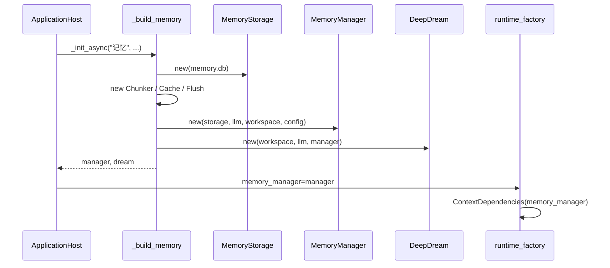
```mermaid
sequenceDiagram
    participant Host as ApplicationHost
    participant Builder as _build_memory
    participant Storage as MemoryStorage
    participant Manager as MemoryManager
    participant Dream as DeepDream
    participant Runtime as runtime_factory

    Host->>Builder: _init_async("记忆", ...)
    Builder->>Storage: new(memory.db)
    Builder->>Builder: new Chunker / Cache / Flush
    Builder->>Manager: new(storage, llm, workspace, config)
    Builder->>Dream: new(workspace, llm, manager)
    Builder-->>Host: manager, dream
    Host->>Runtime: memory_manager=manager
    Runtime->>Runtime: ContextDependencies(memory_manager)
```

**结论：**

- Memory 初始化是可降级步骤。
- Storage 构造时立即打开 SQLite。
- Builder 不执行首次 `sync()`；新数据库可能保持空索引，影响见 M1。
- Manager 进入 Context；Dream 进入 Host CLI 能力。
- Host 不保存 Storage 的关闭句柄。

### 5.2 Context 检索

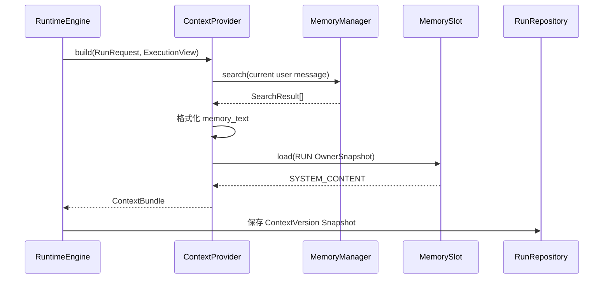
```mermaid
sequenceDiagram
    participant Engine as RuntimeEngine
    participant Context as ContextProvider
    participant Memory as MemoryManager
    participant Slot as MemorySlot
    participant Repo as RunRepository

    Engine->>Context: build(RunRequest, ExecutionView)
    Context->>Memory: search(current user message)
    Memory-->>Context: SearchResult[]
    Context->>Context: 格式化 memory_text
    Context->>Slot: load(RUN OwnerSnapshot)
    Slot-->>Context: SYSTEM_CONTENT
    Context-->>Engine: ContextBundle
    Engine->>Repo: 保存 ContextVersion Snapshot
```

**结论：**

- 查询文本只使用当前用户消息。
- Memory 检索发生在 Run 首次实际 Context 构建时。
- 结果作为 System Content，而不是 Tool Result。
- 检索正文随 ContextVersion 固化。
- 后续恢复不重新查询。

### 5.3 混合检索

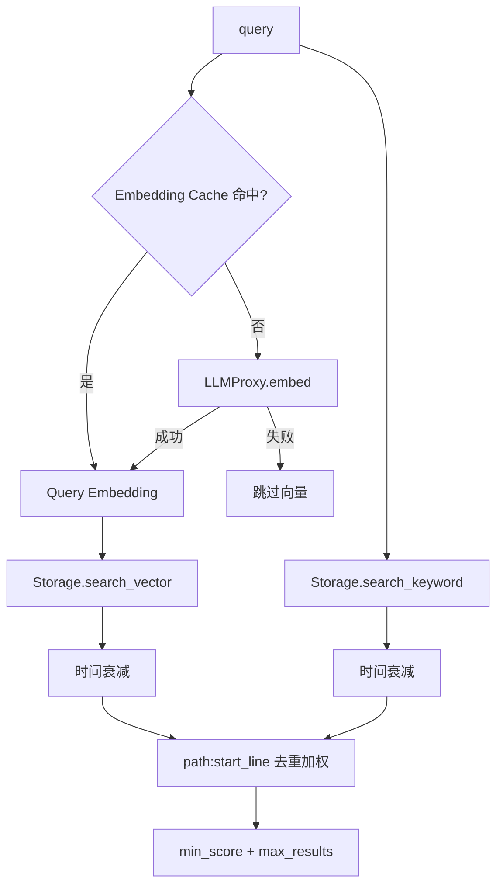
```mermaid
flowchart TD
    Query["query"] --> Cache{"Embedding Cache 命中?"}
    Cache -->|是| QEmb["Query Embedding"]
    Cache -->|否| Embed["LLMProxy.embed"]
    Embed -->|成功| QEmb
    Embed -->|失败| NoVector["跳过向量"]

    QEmb --> Vector["Storage.search_vector"]
    Query --> Keyword["Storage.search_keyword"]

    Vector --> Decay1["时间衰减"]
    Keyword --> Decay2["时间衰减"]
    Decay1 --> Merge["path:start_line 去重加权"]
    Decay2 --> Merge
    Merge --> Filter["min_score + max_results"]
```

**结论：**

- Embedding 失败不会阻止关键词查询。
- 向量和关键词各先取两倍候选。
- 融合 Key 不包含 source 和 end_line。
- 融合会原地修改结果分数。
- 默认 Context 查询最终最多返回 5 条。

### 5.4 关键词检索分支

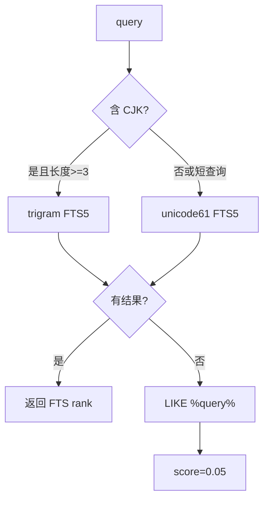
```mermaid
flowchart TD
    Query["query"] --> CJK{"含 CJK?"}
    CJK -->|是且长度>=3| Tri["trigram FTS5"]
    CJK -->|否或短查询| Uni["unicode61 FTS5"]
    Tri --> Found{"有结果?"}
    Uni --> Found
    Found -->|是| Rank["返回 FTS rank"]
    Found -->|否| Like["LIKE %query%"]
    Like --> Fixed["score=0.05"]
```

**结论：**

- 中文短查询不会进入 trigram 分支。
- FTS 异常被视为无结果并降级 LIKE。
- LIKE 只支持完整子串。
- Storage 不归一化 FTS rank。
- Manager 默认阈值可能过滤关键词-only 结果。

### 5.5 静态知识同步

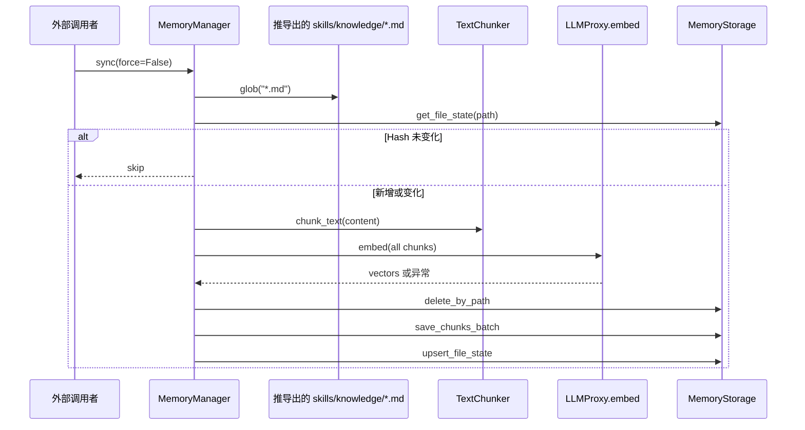
```mermaid
sequenceDiagram
    participant Caller as 外部调用者
    participant Manager as MemoryManager
    participant Disk as 推导出的 skills/knowledge/*.md
    participant Chunker as TextChunker
    participant LLM as LLMProxy.embed
    participant Storage as MemoryStorage

    Caller->>Manager: sync(force=False)
    Manager->>Disk: glob("*.md")
    Manager->>Storage: get_file_state(path)
    alt Hash 未变化
        Manager-->>Caller: skip
    else 新增或变化
        Manager->>Chunker: chunk_text(content)
        Manager->>LLM: embed(all chunks)
        LLM-->>Manager: vectors 或异常
        Manager->>Storage: delete_by_path
        Manager->>Storage: save_chunks_batch
        Manager->>Storage: upsert_file_state
    end
```

**结论：**

- 静态同步只扫描一层 `*.md`，不递归。
- 文件 Hash 是主要增量判断。
- 单个文件的所有 Chunk 一次提交给 LLMProxy。
- Embedding 失败时仍保留关键词索引。
- 已删除文件不会被该流程发现。

### 5.6 Force Sync

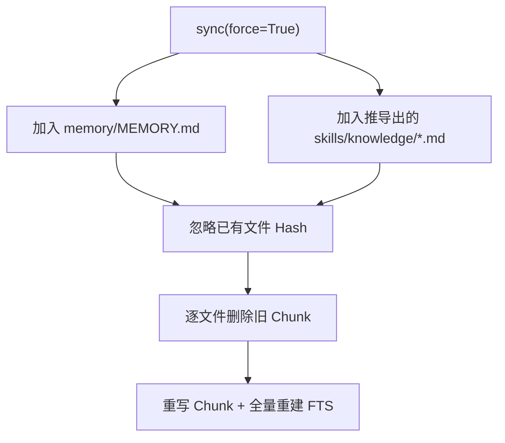
```mermaid
flowchart TD
    Force["sync(force=True)"] --> Memo["加入 memory/MEMORY.md"]
    Force --> Knowledge["加入推导出的 skills/knowledge/*.md"]
    Memo --> Reindex["忽略已有文件 Hash"]
    Knowledge --> Reindex
    Reindex --> Delete["逐文件删除旧 Chunk"]
    Delete --> Save["重写 Chunk + 全量重建 FTS"]
```

**结论：**

- force 不是只强制 MEMORY.md。
- 每次 Dream 会重新处理所有 Skills Knowledge。
- 每个文件保存后都重建整个 FTS。
- 每日记忆文件仍不进入索引。
- Sync 没有对外返回更新统计或部分失败清单。

### 5.7 日记忆 Flush 组件路径

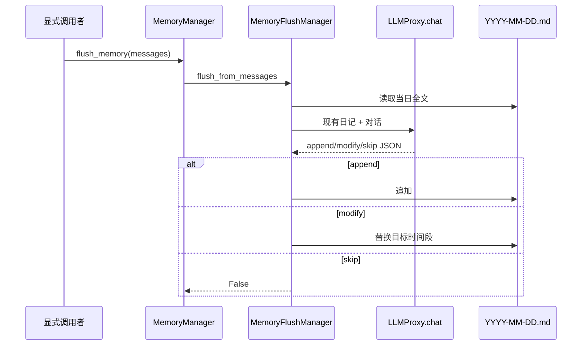
```mermaid
sequenceDiagram
    participant Caller as 显式调用者
    participant Manager as MemoryManager
    participant Flush as MemoryFlushManager
    participant LLM as LLMProxy.chat
    participant File as YYYY-MM-DD.md

    Caller->>Manager: flush_memory(messages)
    Manager->>Flush: flush_from_messages
    Flush->>File: 读取当日全文
    Flush->>LLM: 现有日记 + 对话
    LLM-->>Flush: append/modify/skip JSON
    alt append
        Flush->>File: 追加 ## HH:MM
    else modify
        Flush->>File: 替换目标时间段
    else skip
        Flush-->>Manager: False
    end
```

**结论：**

- 这是可调用组件路径，不是当前自动 Run 路径。
- Flush 接受通用 messages list。
- 失败时可能降级 append。
- 写入后不更新 SQLite。
- 返回值只表示文件是否改变。

### 5.8 DeepDream

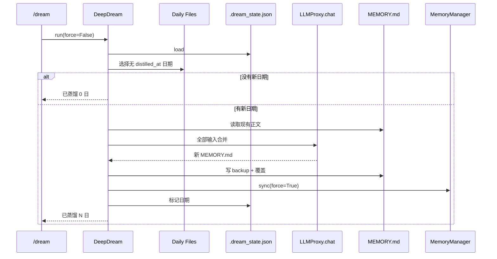
```mermaid
sequenceDiagram
    participant CLI as /dream
    participant Dream as DeepDream
    participant Daily as Daily Files
    participant State as .dream_state.json
    participant LLM as LLMProxy.chat
    participant Memo as MEMORY.md
    participant Manager as MemoryManager

    CLI->>Dream: run(force=False)
    Dream->>State: load
    Dream->>Daily: 选择无 distilled_at 日期
    alt 没有新日期
        Dream-->>CLI: 已蒸馏 0 日
    else 有新日期
        Dream->>Memo: 读取现有正文
        Dream->>LLM: 全部输入合并
        LLM-->>Dream: 新 MEMORY.md
        Dream->>Memo: 写 backup + 覆盖
        Dream->>Manager: sync(force=True)
        Dream->>State: 标记日期
        Dream-->>CLI: 已蒸馏 N 日
    end
```

**结论：**

- Dream 是批量全文合并。
- 没有新日记时不会刷新索引。
- Sync 失败不阻止 State 标记。
- State 以日期而非文件内容版本判断是否处理。
- `/dream` 不检查 `dream_enabled`。

### 5.9 Builtin Tool 直接写入

```mermaid
sequenceDiagram
    participant Model as Agent ToolCall
    participant Tool as builtin.memory.write
    participant Policy as Tool Policy / Approval
    participant File as MEMORY.md
    participant DB as memory.db

    Model->>Tool: content + long_term_file
    Tool->>Policy: workspace.write / approval
    Policy-->>Tool: approved
    Tool->>File: append
    File-->>Tool: success
    Tool-->>Model: 已追加
    File -.没有通知.-> DB
```

**结论：**

- Tool 写入受 Tool 安全链控制。
- 文件路径来自 Tool 参数。
- 写入不调用 DeepDream。
- 写入不更新 Dream State。
- 写入不刷新 Memory 索引。

### 5.10 Runtime 恢复

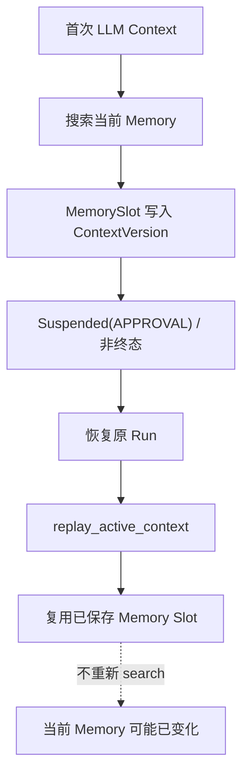
```mermaid
flowchart TD
    First["首次 LLM Context"] --> Search["搜索当前 Memory"]
    Search --> Snapshot["MemorySlot 写入 ContextVersion"]
    Snapshot --> Wait["Suspended(APPROVAL) / 非终态"]
    Wait --> Resume["恢复原 Run"]
    Resume --> Replay["replay_active_context"]
    Replay --> Frozen["复用已保存 Memory Slot"]
    Frozen -.不重新 search.-> Memory["当前 Memory 可能已变化"]
```

**结论：**

- 恢复优先保证原输入可审计。
- Memory 更新不会改变已暂停 Run 的输入。
- 新 Run 才会读取当前索引。
- ContextVersion 保存的是格式化后的相关摘要，不是 SearchResult DTO。
- 删除或修改 Memory 不会追溯改写旧 ContextVersion。

### 5.11 降级路径

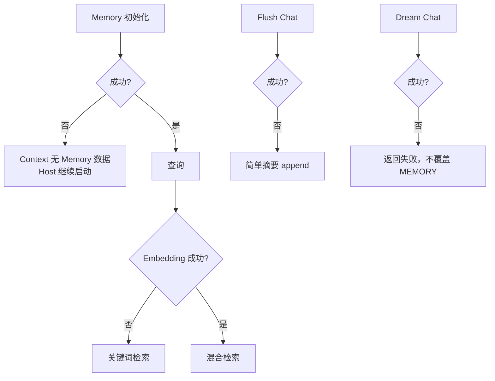
```mermaid
flowchart TD
    Init["Memory 初始化"] --> InitOk{"成功?"}
    InitOk -->|否| NoMemory["Context 无 Memory 数据<br/>Host 继续启动"]
    InitOk -->|是| Search["查询"]
    Search --> EmbedOk{"Embedding 成功?"}
    EmbedOk -->|否| Keyword["关键词检索"]
    EmbedOk -->|是| Hybrid["混合检索"]
    Flush["Flush Chat"] --> FlushOk{"成功?"}
    FlushOk -->|否| Fallback["简单摘要 append"]
    Dream["Dream Chat"] --> DreamOk{"成功?"}
    DreamOk -->|否| DreamFail["返回失败，不覆盖 MEMORY"]
```

**结论：**

- 初始化失败属于整模块降级。
- Query Embedding 失败属于检索策略降级。
- Flush LLM 失败会产生低质量写入副作用。
- Dream LLM 失败不会写长期文件。
- SQLite/关键词查询异常不一定都被隔离，仍可能使 Context 构建失败。

---


## 6. 对外接口与数据契约

### 6.1 包级公共 API

`dotclaw.memory` 当前只导出：

```python
MemoryManager
```

以下类需要从具体文件导入：

```text
MemoryStorage
MemoryChunk
SearchResult
TextChunker
EmbeddingCache
MemoryFlushManager
DeepDream
```

### 6.2 SearchResult 契约

```text
SearchResult
├── path: str
├── start_line: int
├── end_line: int
├── score: float
├── snippet: str
├── source: str
└── title: str
```

注意：

- score 是融合后的运行值；
- snippet 最多 200 字符；
- 不包含 Chunk ID 和 metadata；
- 结果没有 owner/scope 信息。

### 6.3 MemorySearchPort 契约

```python
async def search(query: str) -> Sequence[MemorySearchRecord]
```

Context 不知道 MemoryManager 的额外参数。任何替代实现只需满足结构字段。

### 6.4 SQLite Schema 契约

```text
chunks
files
chunks_fts
chunks_fts_trigram
```

当前没有：

```text
schema_version
embedding_model
embedding_dimensions
owner_type / owner_id
deleted_at
document_version
```

### 6.5 Embedding BLOB 契约

生产依赖安装 NumPy，因此通常保存：

```text
float32 little/native bytes
```

数据库没有编码格式字段。跨架构、无 NumPy读取和维度迁移缺少显式协议。

### 6.6 文件状态契约

Files 表保存：

```text
relative_path
sha256(full content)
mtime integer
size
```

Manager 路径基于：

```text
file.relative_to(project_root)
```

### 6.7 监控文件契约

普通 Sync：

```text
(workspace/memory 向上两级)/skills/knowledge/*.md
```

默认 `workspace=project_root/data` 时，上式等价于：

```text
默认 project_root/skills/knowledge/*.md
```

Force Sync：

```text
workspace/memory/MEMORY.md
(workspace/memory 向上两级)/skills/knowledge/*.md
```

不包括：

```text
data/memory/YYYY-MM-DD.md
任意 Workspace 文件
递归 Skills Knowledge
Builtin 指定的其他 MEMORY 文件
```

### 6.8 Search 参数契约

公开方法允许：

```python
search(query, max_results=5, min_score=0.1)
```

但 Context Protocol 只传 query，因此运行主链使用方法默认值，不使用 Config 中自定义的构造值。

### 6.9 Score 契约

当前只有实现公式，没有稳定跨后端语义：

```text
vector = cosine × vector_weight
keyword = custom(rank) × keyword_weight
same chunk = vector + keyword
```

调用者不应把 score 解释为概率。

### 6.10 Source 契约

当前实际值：

```text
memory
knowledge
```

`session` 仅存在于注释，未由生产同步生成。

### 6.11 Daily Memory 契约

文件名：

```text
YYYY-MM-DD.md
```

段落：

```markdown
## HH:MM
summary
```

Anchor 只精确到分钟，不保证唯一。

### 6.12 Dream State 契约

`.dream_state.json`：

```json
{
  "2026-07-26": {
    "distilled_at": "ISO datetime",
    "entries": 20,
    "hash": "16-char hash"
  }
}
```

当前没有格式版本和源日记 Hash。

### 6.13 MEMORY.md 契约

DeepDream Prompt 期望：

```markdown
## 主题
- [日期] 记忆
```

Builtin Tool 可以写入任意文本，Storage/Chunker 也不会强制验证该格式。

### 6.14 Config 契约

`MemoryConfig` 总是存在，当前无 enabled 开关。

路径：

```text
workspace default = ./data
db_path default = ./data/memory/memory.db
long_term_file default = ./data/memory/MEMORY.md
```

实际 Writer/Manager 对 long_term_file 的遵循不一致。

### 6.15 生命周期契约

启动：

```text
构造 Connection
不自动 Sync
```

运行：

```text
Context 按 Run 查询
```

关闭：

```text
Host 不显式 close MemoryStorage
```

### 6.16 错误与降级契约

| 情况 | 当前行为 |
|---|---|
| Memory 初始化异常 | Host warning，模块整体为 None |
| Query Embedding 失败 | 降级关键词 |
| Chunk Embedding 失败 | 写无向量 Chunk |
| FTS 查询异常 | 降级 LIKE |
| Flush LLM/JSON 失败 | Fallback append |
| Flush 空摘要 | 跳过 |
| Dream LLM 失败 | 返回失败字符串 |
| Dream Sync 失败 | warning，仍更新 State |
| State JSON 损坏 | Dream 抛异常到 CLI 包装 |
| SQLite Vector 维度不一致 | 可能向上抛出 |
| Context Memory 查询异常 | 可能使 Context build 失败 |

### 6.17 当前实现已经保证的不变量

1. Runtime 不直接依赖 MemoryManager，Memory 通过 Context Port 进入执行链。
2. Memory 初始化失败不会阻止 ApplicationHost 启动。
3. 首次 Context 构建的 Memory 结果会进入 ContextVersion Snapshot。
4. 审批恢复和中断重试不会重新查询可变 Memory。
5. MemoryStorage 使用 SQLite WAL。
6. 同一文件正常重新同步前会先删除旧 Chunk。
7. 文件内容未变化且 `force=False` 时跳过重建。
8. Chunk Embedding 失败不阻止关键词索引写入。
9. Query Embedding 失败不阻止关键词搜索。
10. Context 只依赖 SearchResult 的最小只读字段。
11. Daily Flush 和 MEMORY.md Dream 使用不同文件层级。
12. DeepDream 覆盖 MEMORY.md 前会保留一个 `.bak`。
13. DeepDream 只把无 `distilled_at` 的日期作为新输入。
14. Builtin Memory Write 经过 Tool Policy 和审批。
15. Session 删除不会误删工作区全局 Memory。
16. MemorySlot 是 RUN Owner 的 Snapshot Slot。
17. Skills Knowledge 与 MEMORY.md 在 SQLite 中通过 source 区分。
18. Runtime Conversation 和 Memory 索引不会写入同一个存储容器。

### 6.18 必须保持但当前尚未落实的设计约束

1. 成功 Run 若需要形成长期记忆，必须通过明确应用事务触发 Flush；当前没有接入。
2. 文件写入、Dream 和索引同步必须形成可恢复一致性协议；当前彼此独立。
3. 配置中声明的路径、启停、模型和检索参数必须真正贯穿运行逻辑。
4. Memory 查询应具有 owner scope、source filter、limit、deadline 和取消令牌。
5. 关键词、向量和时间分数必须在可解释的统一尺度融合。
6. 索引必须处理文件删除、Embedding 模型/维度变化和 Schema Migration。
7. Memory 写入应提供用户同意、敏感信息过滤和可验证删除。
8. Memory 与 Knowledge 的主归属和注入 Slot 必须一致。
9. 所有 SQLite 和文件资源必须纳入 Host 生命周期。
10. 大规模向量检索不得每次全表扫描。
11. Dream 和 Flush 输入必须受 Token 预算和 Prompt Injection 隔离。
12. 每日记忆修改后必须能重新蒸馏，而不能只按日期永久跳过。

---

## 7. 常见修改入口

| 修改目标 | 首要入口 | 可能涉及 | 必须保持的不变量 |
|---|---|---|---|
| 新增 Memory DTO 字段 | `memory/storage.py` | SQLite Schema、Context Protocol | 旧数据库迁移明确 |
| 修改 SearchResult | `SearchResult` | Context `MemorySearchRecord`、格式化 | Context 最小字段兼容 |
| 增加 Owner Scope | MemoryChunk/Schema/Search | Context、Config、删除 | 查询和写入使用同一 Scope |
| 修改 SQLite 表 | `_create_tables` | Migration、测试、备份 | 不吞掉真实迁移错误 |
| 增加 Schema Version | MemoryStorage | Upgrade、Rollback | 旧库可检测、可迁移 |
| 修改 Embedding 存储 | save/search vector | 模型维度、编码 | 保存 model/dim/version |
| 引入向量数据库 | `search_vector` | Manager、部署 | 保持 SearchResult 契约 |
| 修改 FTS Tokenizer | `_create_tables` | CJK/英文测试 | 明确环境兼容性 |
| 修改关键词查询 | `search_keyword` | Score Fusion | FTS rank 正确归一化 |
| 修改 snippet | `search_keyword/vector` | Context Token 预算 | 围绕命中点且限制长度 |
| 处理文件删除 | `MemoryManager.sync` | files 表、Storage | 磁盘集合与索引一致 |
| 修改增量同步 | `sync` | Chunk ID、Embedding Cache | 未变化 Chunk 不重复向量化 |
| 修改监控目录 | `sync.monitored` | Config、Scope | 明确 source 与信任边界 |
| 递归同步知识 | `skills_knowledge.glob` | 性能、路径 | 避免越过受控根 |
| 索引每日记忆 | `sync` | 时间衰减、Dream | 避免与 MEMORY.md 重复召回 |
| 修改 Chunker | `TextChunker` | Config、Hash、检索质量 | 行号和标题边界稳定 |
| 使用精确 Tokenizer | `_estimate_tokens` | LLM Router | 与 Embedding/Context 模型一致 |
| 修复空 Chunk | `chunk_text` | 大行测试 | 不写空正文 |
| 修改 Overlap | `_get_overlap` | 标题/大小切分 | 重复率和召回可控 |
| 替换 Embedding 路由 | `MemoryManager._get_embedding` | LLMProxy、Config | 查询和文档使用同一模型 |
| 启用独立 Provider | `EmbeddingProvider` | `_build_memory` | 删除双重配置来源 |
| 修复 Cache LRU | `EmbeddingCache.get` | Model Key | 读取刷新顺序 |
| 增加持久缓存 | EmbeddingCache/Storage | model version | 不复用错误维度 |
| 修改混合权重 | `MemoryManager.search` | Config、评测 | 先统一 Score 尺度 |
| 修改结果数量 | `search` + Constructor | Context Port | Config 真正生效 |
| 修改最小分数 | `search` + Config | Keyword fallback | 不误过滤全部关键词结果 |
| 修改时间衰减 | `_apply_temporal_decay` | Source/日期字段 | 日期来自元数据而非猜文件名 |
| 启动自动同步 | `_build_memory` / Host | 启动时延、降级 | 完成后才开放首个 Run |
| 搜索前同步 | `search` | sync_on_search | 避免每轮全量扫描 |
| 修改 Flush 触发 | Session success commit/Application Service | Runtime、隐私 | 只在成功边界写入 |
| 修改 Flush Prompt | `FLUSH_SYSTEM_PROMPT` | JSON Schema、测试 | 输出严格验证 |
| 修改 Daily 格式 | Flush + Dream | State、迁移 | Anchor 稳定唯一 |
| 修改 Fallback | `_fallback_decision` | 隐私、噪声 | LLM 失败不盲写敏感内容 |
| 接入自动 Dream | Scheduler/ApplicationHost | dream_enabled/schedule | 单实例和重入保护 |
| 修改 Dream 增量 | `_load_state` | Daily Hash | 文件变化可重处理 |
| 修改 Dream Prompt | `DREAM_SYSTEM_PROMPT` | Token 预算、安全 | Existing Memory 不是可信指令 |
| 增加 Dream 批处理 | DeepDream.run | State、合并 | 中间结果可恢复 |
| 修改 MEMORY 写入 | DeepDream | Atomic File | 备份和 State 一致 |
| 修复 Sync 失败语义 | DeepDream.run | State、CLI Result | 未入库不能标记完全成功 |
| 修改 Builtin Memory Tool | `tools/builtin/memory_tool.py` | Policy、Manager | 写入后发布刷新信号 |
| 统一 long_term_file | Config + Builder + Tool | Migration | 只有一个路径权威 |
| 增加 Memory 删除 | 新 Memory Application Service | Tool、Storage、Files | 文件和索引同时删除 |
| 增加用户遗忘 | Scope/Delete API | Session/User | 可审计且不可召回 |
| 修改 Context 格式 | `_memory_text` | MemorySlot、Token 预算 | 标注来源并降低指令权重 |
| 禁用 Memory Slot | Context Plan | Provider | 禁用时不执行查询 |
| 修改恢复语义 | ContextVersion | Runtime | 已开始 Run 保持原 Memory |
| 修改 Memory 生命周期 | ApplicationHost.shutdown | Storage、Cache | Connection 必须关闭 |
| 排查 Memory 无结果 | startup sync→DB→Embedding→Score | Config | 区分空索引与低分过滤 |
| 排查知识文件未更新 | files Hash→sync→FTS | 删除/force | 检查是否实际调用 sync |
| 排查 Tool 写入不可检索 | Builtin Tool→MEMORY.md→sync | Dream、Manager | 文件成功不等于索引成功 |
| 排查 Dream 重复/遗漏 | daily files→state | force、Hash | 检查日期是否已标记 |
| 排查 Context 构建失败 | Memory search→Storage/vector | 维度、SQLite | 可选来源错误应结构化降级 |
| 增加 Memory 测试 | `tests/memory/` | pytest testpaths | 覆盖写入、检索和恢复边界 |

---

## 8. 设计取舍、痛点和演进方向

本节严格区分当前设计、当前真实问题和候选演进，不把配置注释或未调用方法写成现有能力。

### 8.1 当前架构承诺

当前 master 可以确认：

1. Memory 是 Context 的可选工作区级内容来源。
2. MemoryManager 提供异步 Search 接口。
3. 存储使用本地 SQLite、WAL、FTS5 和 Embedding BLOB。
4. 文档同步对象是 `workspace/memory/MEMORY.md` 与由 Workspace 层级推导出的 `skills/knowledge/*.md`；默认配置下后者位于项目根。
5. 默认检索组合向量和关键词结果。
6. Memory 结果作为 RUN 级 System Content 进入 ContextVersion。
7. 运行恢复复用原 ContextVersion，不重新查询 Memory。
8. Memory 初始化失败允许 Host 降级启动。
9. Flush、Dream 和 Builtin Tool 都可以修改 Memory 相关文件。
10. 正常 Runtime 成功路径当前不自动调用 Flush。
11. DeepDream 当前由 CLI `/dream` 手动触发。
12. `dream_schedule` 当前没有调度器消费。
13. Builtin Memory Write 不自动刷新索引。
14. Memory 数据当前跨 Agent、Session 共享。
15. SQLite Connection 当前未纳入 Host shutdown。
16. 当前 pytest 默认测试路径没有 `tests/memory`，仓库中也不存在该目录。

### 8.2 核心设计取舍

#### 8.2.1 Memory 经 Context 接入

**问题与选择：**Runtime 不应直接知道检索实现。当前由 Context 定义 `MemorySearchPort`，Manager 结构兼容。

**未选择：**RuntimeEngine 直接调用 MemoryManager 并拼 Prompt。

**收益：**检索实现可替换；ContextVersion 能保存实际输入。

**代价与边界：**Provider 当前在 Plan 解析前查询，禁用 Slot 仍可能产生检索成本。

#### 8.2.2 SQLite 同时承载文本、FTS 和向量

**问题与选择：**轻型本地框架需要零外部服务。当前一个 SQLite 文件保存全部索引。

**未选择：**独立 Elasticsearch、Milvus、Qdrant 或云 Memory 服务。

**收益：**部署简单；文件可复制；事务和全文搜索可复用。

**代价与边界：**向量检索全表扫描；Schema 和 Embedding 迁移需要自行实现。

#### 8.2.3 双 FTS Tokenizer

**问题与选择：**unicode61 对中文连续文本召回有限。当前增加 trigram FTS5，并按 Query 字符集选择。

**未选择：**统一分词器或外部中文检索引擎。

**收益：**无需额外分词依赖。

**代价与边界：**依赖 SQLite 编译能力；短中文查询仍需 LIKE 降级。

#### 8.2.4 Embedding 统一通过 LLMProxy

**问题与选择：**模型路由已经统一管理 Provider。当前 Manager 调用 `LLMProxy.embed()`。

**未选择：**Bootstrap 创建 `OpenAIEmbeddingProvider`。

**收益：**复用模型路由和 Provider 配置。

**代价与边界：**MemoryConfig 中独立 Embedding 配置成为无效字段；Embed 路径本身没有 Chat 级降级。

#### 8.2.5 文件 Hash 驱动同步

**问题与选择：**mtime 在复制和编辑场景不可靠。当前读取全文计算 SHA-256。

**未选择：**只比较 mtime/size。

**收益：**内容未变时可以稳定跳过。

**代价与边界：**每次检查仍读取完整文件；删除文件无法通过只遍历现存文件发现。

#### 8.2.6 日记忆与长期记忆分层

**问题与选择：**每轮摘要不应直接污染稳定长期记忆。当前 Flush 写 Daily，Dream 批量合并到 MEMORY.md。

**未选择：**每次对话直接 append MEMORY.md。

**收益：**可在长期层做主题合并和去重。

**代价与边界：**需要自动触发、State、失败恢复和索引一致性；当前链路未闭环。

#### 8.2.7 Dream 按日期标记

**问题与选择：**避免每次重复处理所有日记。当前 State 按日期保存 distilled_at。

**未选择：**按文件 Hash 或 Entry ID 增量。

**收益：**实现简单。

**代价与边界：**同日文件后续修改不会自动重新蒸馏。

#### 8.2.8 Memory Snapshot 固化到 Run

**问题与选择：**审批恢复必须复现原输入。当前 MemorySlot 保存到 ContextVersion。

**未选择：**每次恢复重新搜索最新 Memory。

**收益：**可审计、可重放。

**代价与边界：**长时间等待的 Run 不会看到新 Memory，这属于确定性选择。

#### 8.2.9 Query Embedding 失败降级关键词

**问题与选择：**Embedding Provider 不可用时仍应尝试回答。当前失败后继续 FTS/LIKE。

**未选择：**Embedding 失败直接终止 Context。

**收益：**理论上具备无向量降级。

**代价与边界：**当前 Score 公式和默认阈值可能让关键词-only 结果全部被过滤。

#### 8.2.10 Memory 初始化整体可降级

**问题与选择：**长期记忆不是 Agent 基本执行的必要条件。当前初始化异常不阻止 Host。

**未选择：**FTS 或数据库失败即终止应用。

**收益：**核心对话仍可运行。

**代价与边界：**用户只能从日志知道 Memory 不可用，Context Metadata 没有显式能力状态。

#### 8.2.11 Builtin Tool 与 Manager 分离

**问题与选择：**模型可以显式读写长期文件，Tool 安全链与自动检索链职责不同。

**未选择：**Builtin Tool 直接依赖 MemoryManager。

**收益：**Tool 简单；路径能力由统一 Policy 控制。

**代价与边界：**文件和索引之间没有一致性通知。

#### 8.2.12 工作区全局 Memory

**问题与选择：**当前面向本地单用户项目，采用一个 Workspace 和数据库。

**未选择：**按 Agent、Session 或 User 建库。

**收益：**所有 Agent 可共享项目知识和长期信息。

**代价与边界：**个性记忆、静态知识和多 Agent 数据互相可见，无法安全支持多用户。

### 8.3 已知痛点

#### M1. 初始化、自动维护与配置没有形成有效运行契约

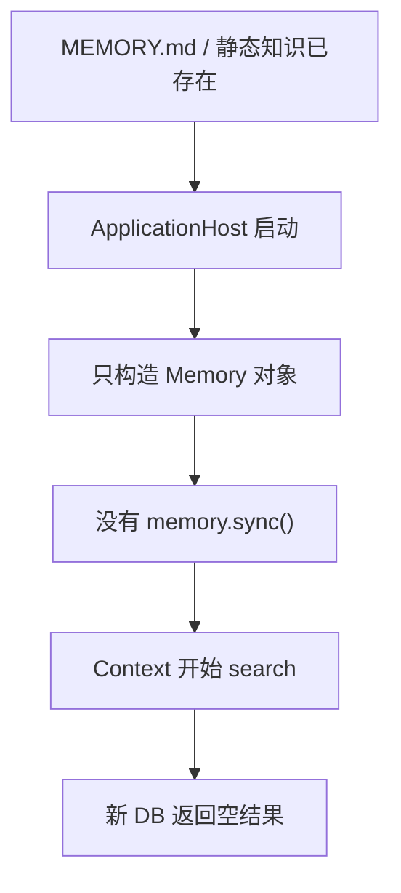
```mermaid
flowchart TD
    Files["MEMORY.md / 静态知识已存在"] --> Start["ApplicationHost 启动"]
    Start --> Build["只构造 Memory 对象"]
    Build --> NoSync["没有 memory.sync()"]
    NoSync --> Search["Context 开始 search"]
    Search --> Empty["新 DB 返回空结果"]
```

**结论：**启动不执行首次同步；正常成功 Run 不触发 Flush；Scheduler 不消费 `dream_schedule`；`dream_enabled`、`sync_on_search`、构造级 `max_results/min_score` 等配置没有贯穿行为。组件和字段存在，但没有形成稳定的应用级维护协议。

#### M2. 长期文件与静态知识路径缺少单一权威

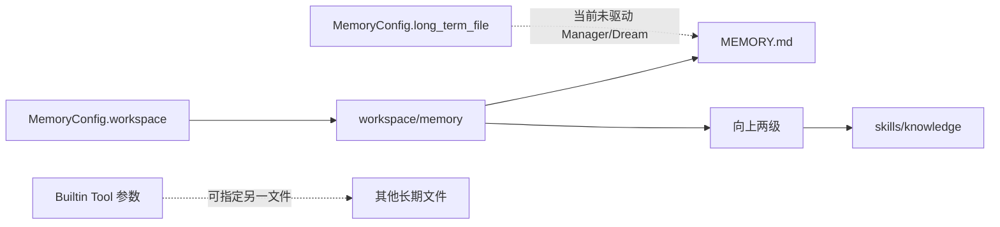
```mermaid
flowchart LR
    Workspace["MemoryConfig.workspace"] --> MemoryDir["workspace/memory"]
    MemoryDir --> Memo["MEMORY.md"]
    MemoryDir --> Up["向上两级"]
    Up --> Knowledge["skills/knowledge"]
    ConfigFile["MemoryConfig.long_term_file"] -.当前未驱动 Manager/Dream.-> Memo
    ToolArg["Builtin Tool 参数"] -.可指定另一文件.-> Other["其他长期文件"]
```

**结论：**Manager/DeepDream 以 Workspace 推导路径，Builtin Tool 使用参数，Config 又声明 long_term_file。默认值碰巧一致，但自定义后可能出现多个长期文件；静态知识路径也不是稳定的 project_root 契约，而会随 Workspace 层级漂移。

#### M3. 文件、索引与 Dream State 没有一致性协议

```mermaid
flowchart LR
    Tool["builtin.memory.write"] --> Memo["MEMORY.md"]
    Flush["MemoryFlushManager"] --> Daily["Daily Note"]
    Dream["DeepDream"] --> Memo
    Memo -.没有统一事件.-> DB["memory.db"]
    Daily -.不在 sync 监控列表.-> DB
    Dream -.sync失败仍可更新.-> State["Dream State"]
```

**结论：**Tool、Flush、Dream 和索引之间没有 Refresh Signal、事务意图或文件 Watcher。文件写入、SQLite 更新和 State 标记可能分别成功，导致检索内容与磁盘内容长期不一致。

#### M4. 静态 Knowledge 与长期 Memory 的主归属混合

推导出的 `skills/knowledge/*.md` 通过 MemoryManager 入库，并以 `source=knowledge` 进入 Memory Slot；Context 同时定义独立 KnowledgeSearchPort/KnowledgeSlot，却默认没有数据源。相同知识概念存在两条不对称边界。

#### M5. 全局数据库没有 Owner 隔离和可验证遗忘

查询只传文本，Schema 没有 user_id、agent_id、session_id 或 tenant_id。所有 Agent/Session 共享结果；Session 删除不清理 Memory，也没有按条目、主题、来源或 Owner 的公共 Forget API。

#### M6. 检索分数与时间模型不可解释

FTS rank、LIKE 固定分数和余弦相似度直接组合，默认阈值可能过滤关键词-only 结果。时间衰减又依赖文件名日期，但 Daily 文件不进入索引，实际 `MEMORY.md` 结果基本不衰减。

#### M7. 向量检索是全表扫描

```mermaid
flowchart TD
    Query["Query Embedding"] --> SQL["SELECT 所有非空 embedding"]
    SQL --> Load["加载全部 BLOB"]
    Load --> Cosine["逐 Chunk 计算 cosine"]
    Cosine --> Sort["全量排序"]
    Sort --> TopK["截取 Top K"]
```

**结论：**时间和内存成本随 Chunk 数线性增长，数据规模扩大后会直接增加 Context 构建和首包延迟。

#### M8. Embedding 版本、缓存和抽象没有收敛

Chunks 表不保存 provider/model/dimensions；模型变化不会自动重建，维度不一致可能使检索失败。EmbeddingCache Key 只含文本且不是严格 LRU；模块又同时保留未接入生产的同步 Provider 与实际使用的 LLMProxy 路径。

#### M9. Sync 不是完整的增量索引事务

`_syncing` 只是 bool；删除文件不会清理旧记录；force 会重建所有知识文件；每文件保存都全库重建 FTS；delete/save/file-state 分多次 commit；没有更新统计、冲突控制和故障恢复。

#### M10. Chunker 的 Token 和结构边界不稳定

字符估算与实际模型 Tokenizer 不一致；标题切分和大小切分的 overlap 规则不同；超长单行可能产生空 Chunk；只识别 Markdown 二级标题。

#### M11. Context Plan 不能真正控制 Memory 查询成本

Provider 在解析有效 Plan 前已经调用 Memory Search。Agent 即使禁用 Memory Slot，仍可能产生 Embedding API、SQLite 查询和延迟，只是结果最终不注入。

#### M12. Context 信任与可选来源错误隔离不足

Memory 内容以 System Role 注入，没有低信任资料包装、引用约束或 Prompt Injection 防护。查询异常也没有统一映射为 EMPTY/FAILED Contribution，可能使整个 Context 构建和 Run 失败。

#### M13. Flush 缺少稳定数据模型、隐私控制和并发协议

Flush 只做弱 JSON 校验，异步方法内同步读写文件；Fallback 可能盲写闲聊或敏感内容；并发 Flush 没有锁和事务，也没有用户同意、敏感级别或来源 Run ID。

#### M14. Daily Entry 使用不稳定的分钟 Anchor

段落只以 `HH:MM` 标识。同一分钟多次写入会产生重复 Anchor，modify 正则可能替换错误段落；没有 entry_id、run_id、版本或内容 Hash。

#### M15. DeepDream 增量状态无法可靠检测日记变化

State 只按日期和 distilled_at 判断，不保存源 Daily Hash。同日后续修改不会重新处理；entries/hash 又来自最终完整 MEMORY.md，不能验证单日日记贡献。

#### M16. DeepDream 缺少预算和可恢复提交

一次把完整 MEMORY.md 与所有新日记送入 Chat，没有 Token 预算、批处理和信任隔离。Backup、MEMORY、Sync 和 State 不在同一事务；Sync 失败仍可能标记已蒸馏。

#### M17. Memory 资源生命周期没有收口

MemoryStorage 有 `close()`，Host 却不保留 Manager/Storage 关闭接口。SQLite Connection、EmbeddingCache 和未来后台 Sync/Dream Task 都没有统一 Lifecycle Port。

#### M18. 当前测试和可观测性不足

默认 pytest testpaths 不包含 Memory，仓库也没有 `tests/memory`。缺少分块、Score、文件删除、维度迁移、Flush/Dream 一致性、Context 降级和 Host Shutdown 回归测试；运行时也缺少索引版本、Chunk 数、模型版本和查询延迟诊断。

### 8.4 演进方向

| 编号 | 解决的痛点 | 候选方向 | 影响与代价 |
|---|---|---|---|
| E1 | M1 | Host 初始化执行受控增量 Sync；成功提交发布 MemoryFlushIntent；Scheduler 按 enabled/schedule 单实例运行 Dream | Bootstrap、Runtime、Session、Scheduler |
| E2 | M2 | 建立唯一 `MemoryPaths`，由 project_root + Config 解析长期文件和知识根；Tool、Manager、Dream 全部注入同一对象 | Config、Bootstrap、Tool、Memory |
| E3 | M3 | 定义 MemoryWriteIntent/IndexRefreshSignal，协调文件、SQLite 和 Dream State 的可恢复提交 | Memory、Tool、Storage |
| E4 | M4 | 将静态 Knowledge 移交 KnowledgeSearchPort，或建立统一 DocumentSource Registry 并明确 Slot 归属 | Memory、Context、Skills |
| E5 | M5 | Schema 增加 owner_type/owner_id；Search/Delete 强制 Scope；提供可审计 Forget API | Domain、Storage、Session |
| E6 | M6 | 使用 RRF 或归一化 BM25+cosine；日期进入 Chunk metadata；通过离线评测确定阈值 | Retrieval、Tests |
| E7 | M7 | 引入 SQLite 向量扩展或可插拔 VectorIndexPort，超过规模阈值后避免全表扫描 | Storage、部署 |
| E8 | M8 | 索引与 Cache 保存 embedding model/dim/version；统一使用 EmbeddingPort，删除双重 Provider 路径 | Memory、LLM、Config |
| E9 | M9 | Sync 在一个事务中更新 chunks/files/FTS，维护已知文件集合并清理删除项，返回结构化统计 | Storage、Manager |
| E10 | M10 | 使用 Router 提供的显式 Tokenizer；修复超长行，统一标题和大小切分的 overlap 规则 | Chunker、Config、Tests |
| E11 | M11 | ContextProvider 先解析 Plan，再惰性加载实际启用的外部 Slot | Context、Memory、Knowledge |
| E12 | M12 | Memory 以低信任资料块注入；MemorySearchPort 返回结构化成功/失败，Provider 将异常降级为 FAILED/EMPTY Contribution | Context、Security |
| E13 | M13、M14 | 定义强类型 DailyEntry，保存 entry_id、run_id、敏感级别和 Hash；使用原子文件或 SQLite 写入 | Flush、Storage、Privacy |
| E14 | M15 | Dream State 按 Daily 文件 Hash 和 Entry Version 增量，文件变化时允许重新蒸馏 | DeepDream、Migration |
| E15 | M16 | 为 Flush/Dream 设置独立 purpose、Token 预算和批处理；用 DreamIntent 协调 Backup、MEMORY、索引和 State | LLM、Memory、Storage |
| E16 | M17 | MemoryManager 实现 AsyncCloseable，Host Resource Stack 逆序关闭 Storage、Cache 和后台任务 | Bootstrap、Memory |
| E17 | M18 | 新建 `tests/memory` 并加入 pytest testpaths，覆盖检索质量、故障注入和跨模块契约 | Tests、CI |
| E18 | M18 | 增加索引版本、文件/Chunk 数、Embedding 模型、最近 Sync 状态和查询延迟的诊断接口 | Memory、CLI、Journal |

## 9. 源码索引

### 9.1 Memory Core

```text
src/dotclaw/memory/
├── __init__.py
├── storage.py
├── chunker.py
├── embedding.py
├── manager.py
├── flush.py
└── dream.py
```

| 文件 | 主要内容 |
|---|---|
| `memory/__init__.py` | 只导出 MemoryManager；模块注释含已过期迁移描述 |
| `memory/storage.py` | MemoryChunk、SearchResult、SQLite、双 FTS 和向量扫描 |
| `memory/chunker.py` | TextChunk 与 Markdown 分块 |
| `memory/embedding.py` | 未接入生产的 EmbeddingProvider/OpenAI 实现与进程缓存 |
| `memory/manager.py` | Search、Sync、Flush 和融合排序 |
| `memory/flush.py` | Daily Memory LLM 决策和文件写入 |
| `memory/dream.py` | Daily→MEMORY.md 蒸馏、State、Backup 和 Force Sync |

### 9.2 Context 接入

```text
src/dotclaw/context/
├── ports.py
├── provider.py
├── slots.py
└── defaults.py
```

| 文件 | Memory 视角 |
|---|---|
| `context/ports.py` | MemorySearchRecord、MemorySearchPort、ContextDependencies |
| `context/provider.py` | 按用户消息查询并格式化 Memory Text |
| `context/slots.py` | MemorySlot |
| `context/defaults.py` | RUN Plan 默认启用 Memory，注册顺序 80 |

### 9.3 Bootstrap 与 Config

```text
src/dotclaw/
├── bootstrap/
│   ├── _host_components.py
│   ├── application_host.py
│   └── runtime_factory.py
└── config/
    └── settings.py
```

| 文件 | Memory 视角 |
|---|---|
| `bootstrap/_host_components.py` | 创建 Storage、Chunker、Cache、Flush、Manager 和 Dream |
| `bootstrap/application_host.py` | 可降级初始化、保存 Dream、缺少 Memory 关闭 |
| `bootstrap/runtime_factory.py` | 将 Manager 注入 ContextDependencies |
| `config/settings.py` | MemoryConfig、YAML 解析和路径辅助 |

### 9.4 LLM 与路由

```text
src/dotclaw/llm/proxy.py
model_router_config.yaml
```

| 文件 | Memory 视角 |
|---|---|
| `llm/proxy.py` | `embed()` 和 Flush/Dream 使用的 `chat()` |
| `model_router_config.yaml` | embedding purpose 当前指向 `text-embedding-v4` |

### 9.5 Builtin Tool

```text
src/dotclaw/tools/builtin/memory_tool.py
```

该文件完整主归属 Tool Wiki。Memory Wiki 只说明它直接操作 `MEMORY.md`，但没有刷新 SQLite 索引。

### 9.6 CLI 与 Scheduler

```text
src/dotclaw/
├── main.py
└── scheduler/
    ├── __init__.py
    └── reminder.py
```

| 文件 | Memory 视角 |
|---|---|
| `main.py` | `/dream` 手动入口；普通提交后没有 Flush |
| `scheduler/reminder.py` | 仅支持一次性 Reminder，不消费 dream_schedule |

### 9.7 配置文件

```text
config.yaml
```

当前仓库配置只显式设置：

```yaml
memory:
  long_term_file: ./data/memory/MEMORY.md
```

Builder 主要使用 MemoryConfig 的其他默认值，并不消费 long_term_file。

### 9.8 测试状态

当前：

```text
tests/memory/
→ 不存在

pyproject.toml testpaths
→ 不包含 Memory
```

建议新增：

```text
tests/memory/test_storage.py
tests/memory/test_chunker.py
tests/memory/test_manager.py
tests/memory/test_flush.py
tests/memory/test_dream.py
tests/context/test_memory_integration.py
tests/bootstrap/test_memory_lifecycle.py
```

最低验证范围：

```text
SQLite Schema 与 Migration
CJK/英文关键词检索
Keyword-only 降级
向量维度变更
Score Fusion
文件新增/修改/删除同步
启动首次 Sync
Builtin 写入后刷新
Daily Entry 并发与 Anchor
Dream Hash 增量
Dream Sync 失败补偿
Context Slot 禁用时不查询
Memory 查询异常降级
Owner Scope 与 Forget
Host shutdown 关闭 SQLite
```

