# Orchestration 与 Delegation 模块总体说明

> 适用代码：`aandbcct/dotClaw` 的 `master` 分支  
> 扫描基准：2026-07-26，包含 Task Domain、TaskMessageBroker、AgentDispatcher、RuntimeDelegationAdapter、Runtime DelegationPort、`delegate` ToolCall 特殊路径、父子 Run 关系、结果回填和取消传播  
> 扫描提交：`3d343abea03c58e68fdcdf5fc8271352bafc988c`  
> 文档定位：自顶向下解释 dotClaw 当前同进程多 Agent 委托如何建立 Task 投影、创建目标 Session 和子 Run、同步等待结果并回填父 Run，以及 Task 状态与 Runtime 状态之间的真实边界。  
> 编写基准：《dotClaw Wiki 编写规范与验收准则 v1.1》  
> 上级导航：[dotClaw 开发者 Wiki](./README.md)

**快速导航**

| 需要回答的问题 | 阅读位置 |
|---|---|
| Orchestration 当前解决什么、不解决什么 | 第 1～2 节 |
| Task、Broker、Dispatcher、Adapter 如何分工 | 第 3～4 节 |
| `delegate` 如何从模型调用变成子 Run | 第 5 节 |
| Task、消息、DTO、父子 Run 和取消契约 | 第 6 节 |
| 修改某项委托能力从哪里开始 | 第 7 节 |
| 当前设计取舍、真实问题与演进路线 | 第 8 节 |
| 具体源码在哪里 | 第 9 节 |

```text
AvailableAgents Context
→ 若 Tool Registry 已注册并向当前 Agent 暴露 delegate Definition
→ 模型可调用 delegate(target_agent_id, title, objective)
→ RuntimeEngine 特殊识别
→ DelegationRequest
→ RuntimeDelegationAdapter
→ 创建目标 Session + Task
→ SessionRunCoordinator 提交子 Run
→ 父 Run 同步等待 DelegationResult
→ DELEGATION_RESULT Tool Message
→ 父模型继续生成最终回答
```

---

## 1. 模块定位与边界

Orchestration / Delegation 模块是 dotClaw 的**同进程多 Agent 委托协调层**。

它不是另一套 Runtime，也不是远程 A2A 平台。当前实现的本质是：

> 父 Run 通过一个特殊 `delegate` ToolCall 指定目标 Agent，Orchestration 创建目标 Session 和子 Run，维护一份内存 Task/Message 投影，并将子 Run 终态转换为父 Run 可消费的 Tool 结果。

### 1.1 核心职责

当前职责归纳为六组：

1. **任务契约**：用 TaskSpecification、TaskEndpoint、TaskMessage 和 TaskStatus 描述一次点对点委托。
2. **消息与状态投影**：在 TaskMessageBroker 中维护有序消息、端点游标和 Task 状态。
3. **委托门面**：由 AgentDispatcher 创建、完成和取消 Task，但不执行子 Run。
4. **Runtime 适配**：把 DelegationRequest 转成目标 Session、RunRequest 和异步子 Run。
5. **结果桥接**：把子 RunResult 标准化为 DelegationResult，并作为 Tool 消息回填父 Run。
6. **取消传播**：父 Run 取消时，向当前等待的子 Run 和 Task 状态同时传播。

### 1.2 主要使用者

| 使用者 | 如何使用 Orchestration |
|---|---|
| `RuntimeEngine` | 特殊识别 `delegate` ToolCall，调用 DelegationPort |
| `RuntimeDelegationAdapter` | 创建目标 Session、Task、子 Run，并缓存执行结果 |
| `SessionRunCoordinator` | 串行执行目标 Session 的子 Run，处理取消 |
| `AgentDispatcher` | 维护 Task 创建、完成和取消门面 |
| `TaskMessageBroker` | 保存 Task、消息、游标、状态与等待条件 |
| `ContextProvider` | 将 AgentRegistry 摘要放入模型上下文，帮助模型选择目标 |
| `AgentPolicyResolver` | 排除旧 Task 工具，但保留当前 `delegate` Tool Definition |
| `CancellationService` | 保存父 Run 当前等待的 child_run_id |
| `SessionManager` | 为每次委托创建独立目标 Session |
| `AgentRegistry` | 提供目标 Identity；其逻辑主归属仍是 Agent 模块 |

### 1.3 明确不负责的内容

Orchestration 当前不负责：

1. **Runtime 执行**：不驱动 LLM、普通 Tool、审批、Context 或 Runtime 状态机。
2. **Agent 与 Session 数据定义**：不加载 Identity、不拥有 AgentRegistry 的逻辑定义，也不制定 Session 持久化规则。
3. **委托安全决策**：当前特殊 `delegate` 路径不经过普通 ToolPort；本模块尚未提供完整 Capability、Policy 和审批协议。
4. **远程和持久化编排**：不提供 HTTP/A2A、认证、服务发现，也不持久化 Task、消息、游标和运行映射。
5. **通用工作流引擎**：不支持 DAG、并行 fan-out、补偿事务、人工工作流或长期任务调度。
6. **执行中通信与长期知识**：Broker 虽定义 QUESTION/REPLY 等消息，但生产 Runtime 主链尚未接入；长期 Memory 由 Memory 模块负责。

### 1.4 与相邻模块的职责边界

| 相邻模块 | Orchestration 负责 | 相邻模块负责 |
|---|---|---|
| Agent | 消费 AgentRegistry 查询目标 | Identity、目录契约和能力元数据 |
| Runtime | 实现 DelegationPort、Task 投影桥接 | 识别 ToolCall、父子 Run 状态、事件和执行 |
| Session | 创建独立目标 Session | Session 持久化、成功 Conversation 和删除 |
| Context | 不构造模型输入 | Available Agents 摘要和 Tool Definitions |
| Tool | 不执行普通 Tool Handler | Tool 注册、Policy、Capability 和审批 |
| Bootstrap | 提供可装配组件 | 创建 Broker、Dispatcher、Adapter 并双向绑定 Coordinator |
| Channel | 不直接展示 Task 内部状态 | 用户输入、审批和 RunResult 展示 |
| Storage | 不保存 Task/Broker | Run、Session、事件、消息和 Checkpoint |
| Cancellation | 提供子 Run 取消入口 | 父子取消映射和活动 Run 令牌 |
| Memory | 不负责长期记忆 | 检索、索引和蒸馏 |

---

## 2. 模块在项目中的位置

### 2.1 全局位置图

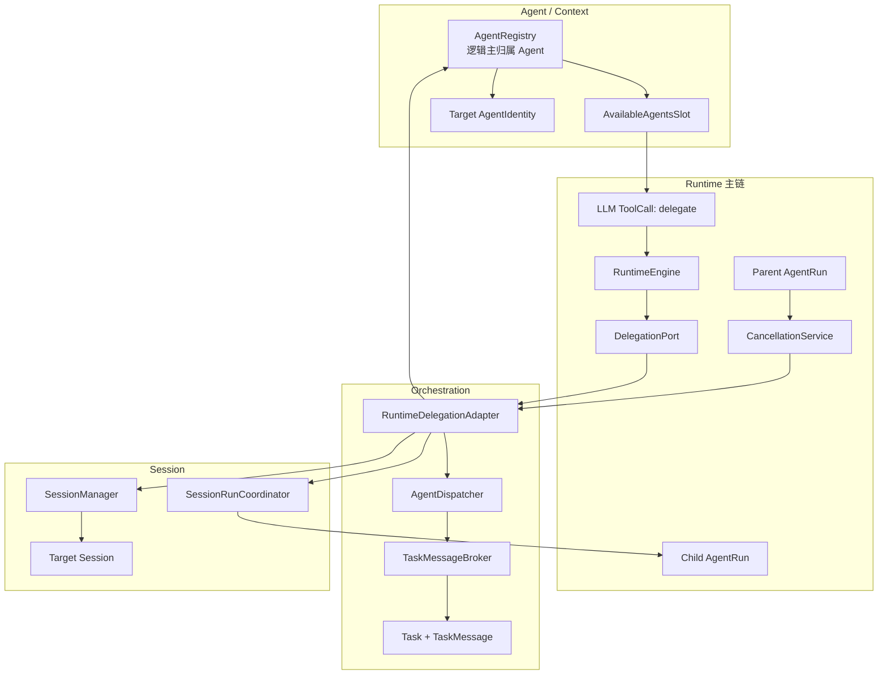

**结论：**

- Orchestration 位于 Runtime 与 Agent/Session 之间。
- RuntimeEngine 只依赖 DelegationPort，不直接依赖 Dispatcher 或 Broker。
- RuntimeDelegationAdapter 是跨模块核心适配器。
- AgentRegistry 物理位于 orchestration 包，但逻辑主归属 Agent，本 Wiki 只说明查询关系。
- Task 与 AgentRun 是两套不同生命周期的投影。

### 2.2 父 Run、子 Run、Task 和 Session

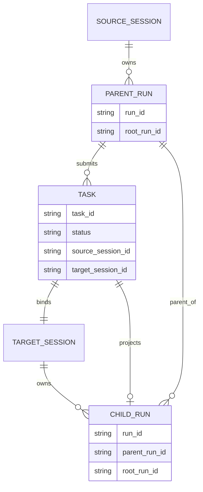

**结论：**

- 每次委托创建一个 Task、一个目标 Session 和一个 child_run_id。
- Task 绑定来源 Session 和目标 Session，不直接保存 parent_run_id 字段。
- 子 AgentRun 持久化 parent_run_id 和 root_run_id。
- 当前一个父 Run 可按顺序产生多个 Task；同一来源 Session 同时只应有一个活动 Task。
- Task 是内存投影，AgentRun 和 Session 是文件持久化事实。

### 2.3 Task 状态与 Run 状态

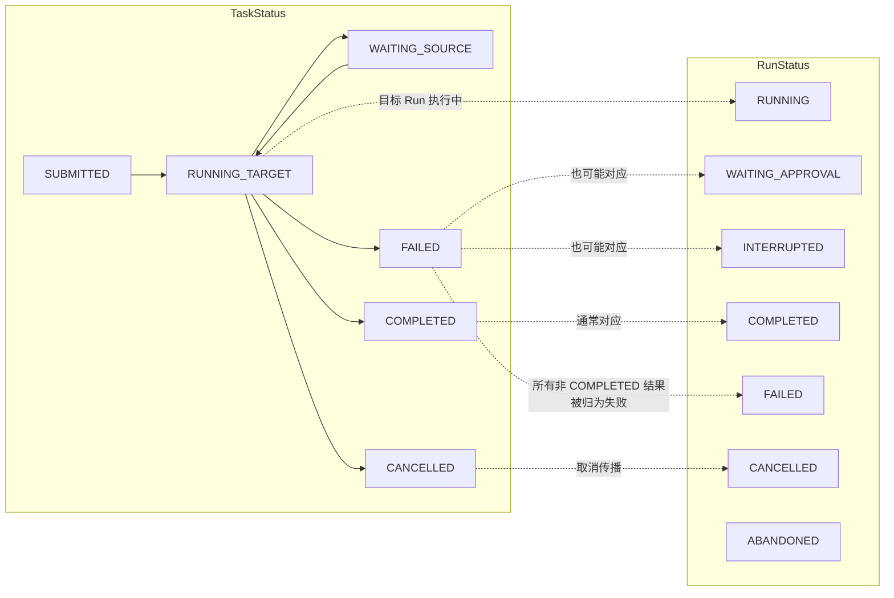

**结论：**

- TaskStatus 表示编排通信下一步由谁行动；RunStatus 表示 Runtime 执行事实。
- 两者不能合并为一套状态机。
- 当前 Adapter 只把 COMPLETED 视为 Task 成功。
- WAITING_APPROVAL、INTERRUPTED 等非终态子 Run会被 Adapter 投影成 Task FAILED。
- Task 终态不保证子 Run 一定已经进入同名终态。

### 2.4 依赖方向

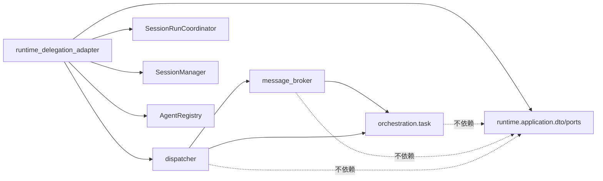

**结论：**

- Task Domain、Broker 和 Dispatcher 不依赖 Runtime。
- RuntimeDelegationAdapter 是允许汇聚 Runtime、Session、Agent 和 Orchestration 的边界。
- Dispatcher 不创建 asyncio 子 Run。
- Broker 不读取 Session、Identity 或 RunRepository。
- Bootstrap 负责解决 Adapter 与 Coordinator 的双向装配。

### 2.5 当前同步等待模型

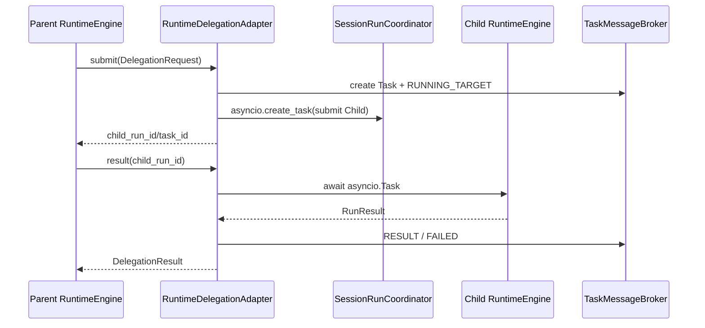

**结论：**

- 子 Run 使用 asyncio Task 异步启动。
- 父 Run 随后立即调用 `result()` 并等待子 Run 结束。
- 从父 Agent 视角，这是同步阻塞式委托，不是后台并行工作。
- 父 Run 持有自己的 Session 锁，子 Run 使用独立目标 Session 锁。
- 当前没有一个父 Run 同时等待多个子 Run 的 fan-out/join。

---

## 3. 组件总览

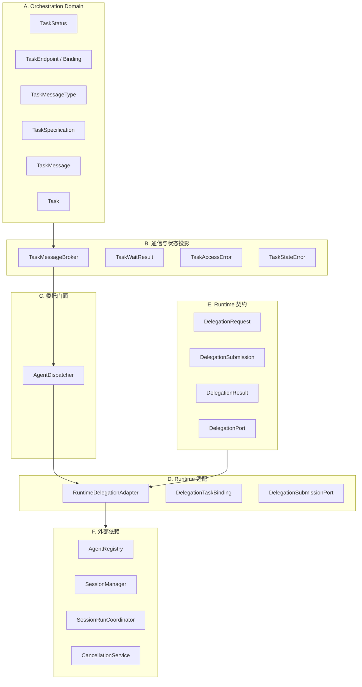

**结论：**

- Task Domain 是纯数据与枚举。
- Broker 是唯一 Task 消息和状态修改通道。
- Dispatcher 是面向 Adapter 的简化门面。
- Adapter 才负责目标 Session、子 Run 和结果缓存。
- Runtime 契约定义在 Runtime Application，不属于 Orchestration Domain。
- AgentRegistry 仅作为目标目录依赖。

### 3.1 组成部分与责任

| 分类 | 组成部分 | 主归属 | 稳定职责 |
|---|---|---|---|
| Domain | `TaskStatus` | Orchestration | Task 通信阶段和终态 |
| Domain | `TaskEndpoint` | Orchestration | SOURCE/TARGET 两端 |
| Domain | `TaskMessageType` | Orchestration | 请求、进度、问答、结果和取消类型 |
| Domain | `TaskSpecification` | Orchestration | 委托目标、材料、约束和交付物 |
| Domain | `TaskMessage` | Orchestration | 按序号追加的点对点消息 |
| Domain | `TaskEndpointBinding` | Orchestration | Endpoint→Identity/Session 绑定 |
| Aggregate | `Task` | Orchestration | 内存状态、结果、错误和取消投影 |
| Broker | `TaskMessageBroker` | Orchestration | 消息、游标、等待、校验和状态推进 |
| Service | `AgentDispatcher` | Orchestration | Task 开始、完成和取消门面 |
| Adapter | `RuntimeDelegationAdapter` | Orchestration/Runtime Adapter | 创建目标 Session、子 Run、结果和取消 |
| Runtime DTO | Delegation Request/Submission/Result | Runtime | 与 Engine 交互的稳定 DTO |
| Runtime Port | `DelegationPort` | Runtime | 提交、查询和取消子执行 |
| Runtime | `RuntimeEngine` | Runtime | 识别 delegate、等待结果、持久化父 Run |
| Directory | `AgentRegistry` | Agent | 按 target_agent_id 返回 Identity |
| Session | `SessionManager` | Session | 创建目标 Session |
| Coordination | `SessionRunCoordinator` | Runtime | 执行和取消目标 Run |
| Context | Available Agents | Context | 向模型描述目标 Agent |
| Cancellation | `CancellationService` | Runtime | 父 Run→当前 child_run_id 映射 |

---

## 4. 各组件的类与职责

本节完整说明 Orchestration Domain、Broker、Dispatcher 和 RuntimeDelegationAdapter；RuntimeEngine、AgentRegistry 和 SessionRunCoordinator 只展开与委托直接相关的消费边界。

### 4.1 Task 状态与端点

#### 4.1.1 `TaskStatus`

**职责与用途：**描述 Task 的通信和结果投影阶段：

```text
SUBMITTED
→ Task 已登记，初始 REQUEST 已创建

RUNNING_TARGET
→ 目标端正在工作，或收到源端补充后继续工作

WAITING_SOURCE
→ 目标端提出 QUESTION，等待来源端回复

COMPLETED / FAILED / CANCELLED
→ Task 终态
```

`is_terminal()` 只把后三项视为终态。

#### 4.1.2 `TaskEndpoint`

**职责与用途：**固定定义点对点通信两端：

```text
SOURCE
TARGET
```

它不是任意 Agent 地址，也不支持一对多参与者、观察者或多目标端。

#### 4.1.3 `TaskMessageType`

**职责与用途：**定义 Broker 状态机可处理的消息类型：

```text
REQUEST
PROGRESS
QUESTION
REPLY
CONTEXT_UPDATE
RESULT
FAILED
CANCELLED
```

当前生产委托链实际使用的主要子集是：

```text
REQUEST
RESULT
FAILED
CANCELLED
```

PROGRESS、QUESTION、REPLY 和 CONTEXT_UPDATE 尚未接入 Runtime 主循环。

---

### 4.2 `TaskSpecification`

#### 4.2.1 `TaskSpecification`

**职责与用途：**描述不可变的任务意图：

```text
title
objective
materials
constraints
expected_deliverables
```

类使用 `frozen=True`，但三个 list 字段内部仍可原地修改，因此不是深度不可变值对象。

#### 4.2.2 `render_user_message`

**职责与用途：**把 TaskSpecification 格式化为目标 Agent 首条用户消息。

输出只包含非空部分，并按：

```text
任务
目标
材料
约束
预期交付物
```

排列。

当前 RuntimeDelegationAdapter 构造的 TaskSpecification 只使用：

```text
title = "Runtime v2 delegation"  # 当前代码中的历史字面量
objective = DelegationRequest.input_message.content
```

materials、constraints 和 expected_deliverables 未从 `delegate` 参数进入生产链。

---

### 4.3 Task 消息与绑定

#### 4.3.1 `TaskMessage`

**职责与用途：**保存一条按 Task 内 sequence 排序的点对点通信事实。

字段包括：

```text
task_id
sequence
sender / recipient
sender_session_id
sender_run_id
message_type
payload
created_at
```

它不直接保存 sender_identity_id；身份需通过 TaskEndpointBinding 还原。

#### 4.3.2 `TaskEndpointBinding`

**职责与用途：**将 SOURCE/TARGET Endpoint 绑定到：

```text
identity_id
session_id
```

Broker 的访问控制要求 Identity 和 Session 同时匹配，防止同一 Identity 的其他 Session 操作该 Task。

**Message 时间戳**

**职责与用途：**`TaskMessage.created_at` 当前取消息追加前的 `task.updated_at`，随后 `_apply_message_state_locked()` 再调用 `task.touch()`。

因此消息时间戳通常表示上一次 Task 更新时间，不一定等于真实消息追加时间。

---

### 4.4 `Task`

#### 4.4.1 `Task`

**职责与用途：**Task 是同进程 delegation 的可变聚合和状态投影。

它保存：

```text
task_id
specification
source / target binding
status
result_message
error
cancellation_requested
created_at / updated_at
```

它不保存 child_run_id、parent_run_id 或 root_run_id 的独立字段。

**`binding_for`**

**职责与用途：**根据 Endpoint 返回 SOURCE 或 TARGET Binding。

只有两个端点，因此未知 Endpoint 不存在独立失败分支。

**`touch`**

**职责与用途：**更新 Task.updated_at，仅约定由 Broker 内部调用。

Task 不是 frozen，且 Broker 的 `get_task()` 会返回原对象引用，外部调用者实际仍可直接修改 status、error 和时间。

---

### 4.5 Broker 错误与等待视图

#### 4.5.1 `TaskAccessError`

**职责与用途：**表示调用者 Identity 或 Session 与指定 Endpoint Binding 不匹配。

它是内存访问检查，不是完整授权策略，也不校验 Tool Capability、租户或用户权限。

#### 4.5.2 `TaskStateError`

**职责与用途：**表示：

- Task 重复创建；
- 状态不允许启动；
- 终态后发送普通消息；
- MessageType 与当前状态/端点不匹配。

#### 4.5.3 `TaskWaitResult`

**职责与用途：**返回：

```text
task
messages
timed_out
```

类本身 frozen，但内部 Task 和 messages list 可变，也不是隔离快照。

---

### 4.6 `TaskMessageBroker`

#### 4.6.1 `TaskMessageBroker`

**职责与用途：**是 Task 消息、游标和状态的唯一内存管理器。

内部状态：

```text
_tasks: task_id → Task
_messages: task_id → list[TaskMessage]
_cursors: (task_id, endpoint) → last sequence
_conditions: task_id → asyncio.Condition
_lock: 全 Broker asyncio.Lock
```

所有 Task 共用一把 `_lock`。

#### 4.6.2 `create_task`

**职责与用途：**原子完成：

1. 拒绝重复 task_id；
2. 登记 Task；
3. 初始化 SOURCE/TARGET 游标；
4. 写入 SOURCE→TARGET 的 REQUEST；
5. 把 TARGET 游标推进到 REQUEST sequence。

最后一步避免 REQUEST 已经作为子 Run 首条用户消息后，又被目标端 `wait_for_messages()` 重复消费。

#### 4.6.3 `mark_target_running`

**职责与用途：**要求 Task 当前为 SUBMITTED，然后切换为 RUNNING_TARGET。

它与 `create_task()` 是两个独立 Broker 操作，中间可能被其他协程观察到 SUBMITTED。

#### 4.6.4 `send_message`

**职责与用途：**在 Broker Lock 内完成：

```text
获取 Task
→ 校验 Endpoint Binding
→ 推导 Recipient
→ 校验状态机
→ 追加消息
→ 更新 Task 状态
```

释放 Lock 后再通知等待者。

**消息允许矩阵**

**职责与用途：**当前允许：

```text
TARGET + PROGRESS + RUNNING_TARGET
TARGET + QUESTION + RUNNING_TARGET
TARGET + RESULT + RUNNING_TARGET
TARGET + FAILED + RUNNING_TARGET
SOURCE + REPLY + WAITING_SOURCE
SOURCE + CONTEXT_UPDATE + WAITING_SOURCE
```

普通 `send_message()` 不允许 CANCELLED；取消必须走 `cancel_task()`。

#### 4.6.5 `_apply_message_state_locked`

**职责与用途：**将消息投影为状态：

```text
QUESTION → WAITING_SOURCE
REPLY / CONTEXT_UPDATE → RUNNING_TARGET
RESULT → COMPLETED
FAILED → FAILED
CANCELLED → CANCELLED
PROGRESS → 状态不变
```

终态消息同时写 result_message；FAILED/CANCELLED 还写 error。

#### 4.6.6 `cancel_task`

**职责与用途：**只允许 SOURCE 端取消。

非终态时追加 SOURCE→TARGET CANCELLED，设置 cancellation_requested，并投影 CANCELLED。Task 已终态时幂等返回，不再追加消息。

#### 4.6.7 `wait_for_messages`

**职责与用途：**校验 Endpoint 后：

1. 立即消费当前可用消息；
2. 若无消息且 Task 终态，直接返回；
3. 否则等待 Condition 或 timeout；
4. 醒来后再次消费消息。

消费会推进该 Endpoint 的单一游标。

**消费游标**

**职责与用途：**每个 Task、每个 Endpoint 只有一个共享游标：

```text
(task_id, SOURCE)
(task_id, TARGET)
```

同一 Endpoint 的多个等待者共享消费位置，不支持独立订阅者或消息回放。

**Task 查询**

**职责与用途：**

```text
get_task
→ 不校验 Endpoint，返回 Task 原引用

get_task_for_endpoint
→ 校验 Identity + Session 后返回 Task 原引用

active_task_for_source
→ 扫描来源 Session 的第一个非终态 Task

latest_task_for_source
→ 按字典插入顺序倒序查找最近 Task
```

Broker 没有分页、清理和持久化。

**Condition 通知**

**职责与用途：**消息提交后使用 task_id 对应的 Condition `notify_all()`。

状态检查与真正进入 `condition.wait()` 之间没有统一锁保护，存在通知发生在等待建立前的丢失唤醒窗口。

---

### 4.7 `AgentDispatcher`

#### 4.7.1 `AgentDispatcher`

**职责与用途：**为 RuntimeDelegationAdapter 提供 Task 状态机门面。

它只依赖 Broker，不依赖 RuntimeEngine、SessionManager 或 RunRepository。

#### 4.7.2 `start_v2_delegation`

**职责与用途：**

```text
检查 source Session 是否已有活动 Task
→ 创建 Task/Bindings
→ Broker.create_task()
→ Broker.mark_target_running()
```

Task ID 使用完整 UUID hex。

活动检查和 Task 创建不是同一个 Broker 原子操作；并发调用可能同时通过检查。

#### 4.7.3 `finish_v2_delegation`

**职责与用途：**读取 Task，若未终态则由 TARGET 发送：

```text
succeeded=True → RESULT
succeeded=False → FAILED
```

它不知道具体 RunStatus；所有非成功子 Run 都被压缩为 Task FAILED。

#### 4.7.4 `cancel_task`

**职责与用途：**仅委托 Broker 写入 Task CANCELLED。

真正的 child Run 取消由 RuntimeDelegationAdapter 转给 SessionRunCoordinator。

---

### 4.8 Runtime Delegation 契约

#### 4.8.1 `DelegationRequest`

**职责与用途：**RuntimeEngine 提交给 DelegationPort 的冻结请求：

```text
parent_run_id
root_run_id
target_agent_id
input_message
source_agent_id
source_session_id
source_tool_call_id
```

来源字段用于 Task Binding 和父 Tool 消息关联。

#### 4.8.2 `DelegationSubmission`

**职责与用途：**Adapter 接受请求后立即返回：

```text
child_run_id
task_id
target_session_id
```

它表示已受理，不表示子 Run 已完成或已可靠注册到磁盘。

#### 4.8.3 `DelegationResult`

**职责与用途：**将子 RunResult 收敛为：

```text
child_run_id
status
output
error
```

不包含 approval_id、has_streamed_response、target_session_id 或 Task 消息历史。

#### 4.8.4 `DelegationPort`

**职责与用途：**Runtime 只依赖三个操作：

```text
submit(request)
result(child_run_id)
cancel(child_run_id)
```

`result()` 在协议注释中称“查询”，当前实现实际会等待 asyncio Task 结束。

**`DelegationSubmissionPort`**

**职责与用途：**RuntimeDelegationAdapter 依赖的最小目标 Run 接口：

```text
submit(RunRequest)
cancel(run_id, reason)
```

生产实现是 SessionRunCoordinator。

---

### 4.9 `RuntimeDelegationAdapter`

#### 4.9.1 `RuntimeDelegationAdapter`

**职责与用途：**是 Orchestration 与 Runtime 的核心桥接器。

内部进程状态：

```text
_coordinator
_session_manager
_agent_registry
_dispatcher
_results: child_run_id → DelegationResult
_running: child_run_id → asyncio.Task[RunResult]
_task_bindings: child_run_id → DelegationTaskBinding
```

#### 4.9.2 `bind_coordinator`

**职责与用途：**解决 RuntimeEngine→Adapter→Coordinator→RuntimeEngine 的组合环。

只允许绑定一次；未绑定时 submit/cancel 会失败。没有 unbind 或 shutdown。

**目标 Identity 与 Session**

**职责与用途：**submit() 要求 source_agent_id/source_session_id 非空，然后按 target_agent_id 查 AgentRegistry。

找到后立即创建：

```text
title = 委托-{agent_name}
model = identity.model
agent_id = identity.agent_id
```

的持久化目标 Session。

**Task 创建**

**职责与用途：**目标 Session 创建后调用 Dispatcher，绑定：

```text
SOURCE = source Identity + source Session
TARGET = target Identity + target Session
```

TaskSpecification 使用通用标题和 DelegationRequest 的整段 input_message。

**子 RunRequest**

**职责与用途：**创建：

```text
session_id = target Session
agent_id = target Identity
conversation = 空 Snapshot，version=0
parent_run_id = 父 Run
root_run_id = 根 Run
run_id = 预生成 child_run_id
```

子输入文本继承 DelegationRequest.input_message 的 role/content/created_at，但使用新的 message_id。

#### 4.9.3 异步提交

**职责与用途：**使用：

```python
asyncio.create_task(coordinator.submit(child_request))
```

启动子 Run，并把 asyncio Task 存入 `_running`。

`await asyncio.sleep(0)` 只是让出一次事件循环，不保证子 Run 已经完成持久化注册。

#### 4.9.4 `result`

**职责与用途：**

- 已有 `_results`：直接返回；
- `_running` 不存在：返回 None；
- 存在：等待 asyncio Task；
- 将 RunResult、CancelledError 或异常转为 DelegationResult；
- 从 `_running` 删除，写入 `_results`；
- 调用 `_finish_task()`。

结果缓存没有淘汰。

#### 4.9.5 `_finish_task`

**职责与用途：**根据 child status 是否为 COMPLETED 调用 Dispatcher：

```text
COMPLETED → RESULT
其他全部 → FAILED
```

然后删除 `_task_bindings`。

Task 已因父取消进入 CANCELLED 时，Dispatcher 会幂等保留终态。

#### 4.9.6 `cancel`

**职责与用途：**

1. 查找 child_run_id 对应 Task Binding；
2. 以 SOURCE Binding 写 Task CANCELLED；
3. 调用 Coordinator.cancel(child_run_id)。

当前 Binding 不保存 parent_run_id，取消 TaskMessage 的 sender_run_id 实际传入 child_run_id。

---

### 4.10 RuntimeEngine 委托路径

#### 4.10.1 `_delegation_request`

**职责与用途：**只在 ToolCall.name 精确等于 `"delegate"` 时转换。

要求 arguments 中：

```text
target_agent_id: str
title: str
objective: str
```

然后生成：

```text
任务：{title}

目标：{objective}
```

作为子 Agent 用户输入。

#### 4.10.2 ToolCall 特殊拦截

**职责与用途：**RuntimeEngine 在 WAITING_TOOLS 循环中先尝试 `_delegation_request()`。

若命中：

- 写 TOOL_STARTED；
- 不调用 ToolPort.execute；
- 直接调用 `_delegate()`；
- 写 TOOL_COMPLETED；
- 把 Delegation Result 计为一次 Tool 调用。

因此当前 delegate 不经过普通 Tool Capability、Policy 或 Approval 流程。

#### 4.10.3 `_delegate`

**职责与用途：**完成：

```text
DelegationPort.submit
→ 注册父子取消映射
→ 写 DELEGATION_SUBMITTED
→ await DelegationPort.result
→ 清除取消映射
→ 写 DELEGATION_RESULT RunMessage
→ 写 DELEGATION_COMPLETED
→ 更新统计和状态
```

#### 4.10.4 `DELEGATION_RESULT` 消息

**职责与用途：**作为父 Run 的 Tool 角色消息写入：

```text
kind = DELEGATION_RESULT
role = TOOL
content = child output 或 error
tool_call_id = 原 delegate call_id
metadata = task_id / child_run_id / target_agent_id / target_session_id
```

下一轮 Context 会把该消息作为运行事实交给父模型。

#### 4.10.5 子 Run 失败语义

**职责与用途：**若 child status 不是 COMPLETED：

1. 仍保存 DELEGATION_RESULT 消息和 DELEGATION_COMPLETED 事件；
2. Tool 审计记 FAILED；
3. 父 Run 直接进入 FAILED；
4. 不再让父模型读取错误后选择备用 Agent。

#### 4.10.6 Runtime AgentState 委托阶段

**职责与用途：**AgentState 定义：

```text
WAITING_DELEGATION
DelegationSubmitted
DelegationCompleted
```

但当前 ToolCall 主路径调用 `_delegate(..., manage_state=False)`，因此实际委托作为 Tool Batch 的一部分处理，主要走 WAITING_TOOLS→ToolCompleted→WAITING_LLM。

独立 WAITING_DELEGATION 状态目前没有在该生产调用路径启用。

---

### 4.11 父子 Run 与取消

#### 4.11.1 `parent_run_id` 与 `root_run_id`

**职责与用途：**

- child.parent_run_id 指向直接父 Run；
- child.root_run_id 沿用最初根 Run；
- 第一层父 Run无 root 时，Engine 使用父自身 run_id 作为根；
- Task 本身不保存这两个字段。

#### 4.11.2 `CancellationService` 父子映射

**职责与用途：**父 Engine 在等待子结果期间保存：

```text
parent_run_id → 当前 child_run_id
```

只支持每个父 Run 一个当前子 Run。

#### 4.11.3 父取消传播

**职责与用途：**RuntimeEngine.cancel(parent_run_id)：

1. 请求父 CancellationToken；
2. 尝试取消父 LLM/Tool；
3. 查当前 child_run_id；
4. 调用 DelegationPort.cancel(child_run_id)。

Adapter 再同时更新 Task 和取消目标 Run。

---

### 4.12 Context、Tool 与 Bootstrap 接入

#### 4.12.1 Available Agents Context

**职责与用途：**ContextProvider 从 AgentRegistry 列出：

```text
agent_id
agent_name
description
capabilities
```

作为“可用子 Agent”System Content。

它没有执行可见性、权限、健康状态、输入模式或并发过滤。

#### 4.12.2 Tool Definition 冻结

**职责与用途：**AgentPolicyResolver 从 ToolExecutor 快照已注册的 Tool Definitions，并排除旧协议工具：

```text
task_send_message
wait_task
task_status
cancel_task
```

`delegate` 不在该排除集合中，但 Resolver 也不会自动创建它。当前已确认的源码只能证明 RuntimeEngine 支持名称为 `delegate` 的 ToolCall；尚未在已扫描文件中确认默认 Tool Definition 的注册来源。

因此模型能够发起委托还必须同时满足：

```text
Tool Registry 中存在 delegate Definition
→ 当前 Agent.allowed_tools 未将其过滤
→ Tools Context Slot 实际把该 Definition 交给模型
```

Runtime 支持该调用，不等于默认 Agent 一定能看到该工具。

#### 4.12.3 RuntimeFactory 装配

**职责与用途：**Bootstrap 创建：

```text
TaskMessageBroker
→ AgentDispatcher
→ RuntimeDelegationAdapter
→ RuntimeEngine(delegation_port)
→ SessionRunCoordinator
→ adapter.bind_coordinator(coordinator)
```

Broker、Dispatcher 和 Adapter 不暴露为 ApplicationHost 公共能力。

---


## 5. 组件依赖和使用流程

本节说明组件装配、目标发现、ToolCall 转换、子 Run 提交、父 Run 等待、成功/失败回填、取消、嵌套委托和进程重启边界。

### 5.1 Bootstrap 装配

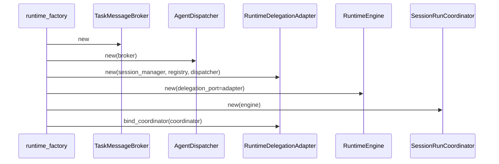

**结论：**

- Adapter 与 Coordinator 构成装配期双向关系。
- RuntimeEngine 只认识 DelegationPort。
- Coordinator 只认识 RuntimeControlPort。
- 双向绑定只允许一次。
- Broker 和 Dispatcher 仅由 Adapter 间接持有。

### 5.2 目标发现

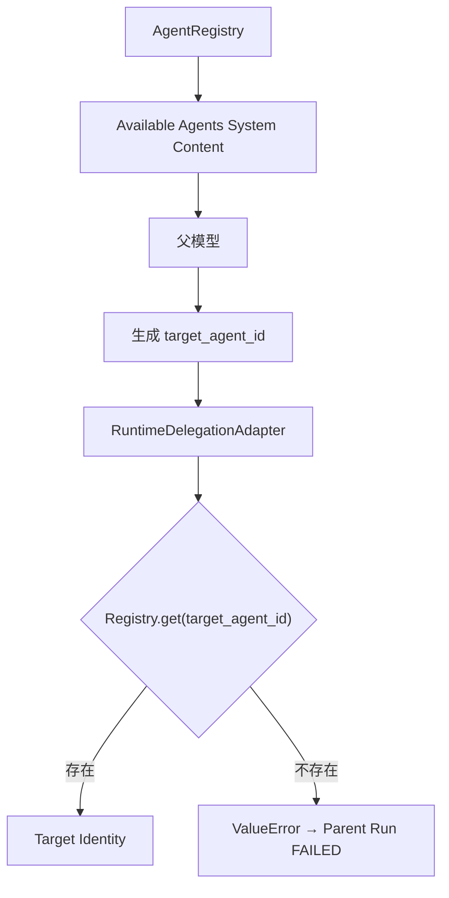

**结论：**

- Agent capabilities 只以文本提示模型。
- 没有确定性能力匹配器。
- target_agent_id 最终由模型 ToolCall 指定。
- Adapter 在执行前再次查 Registry。
- 未知目标会让 delegation 调用失败并终止父 Run。

### 5.3 `delegate` ToolCall 转换

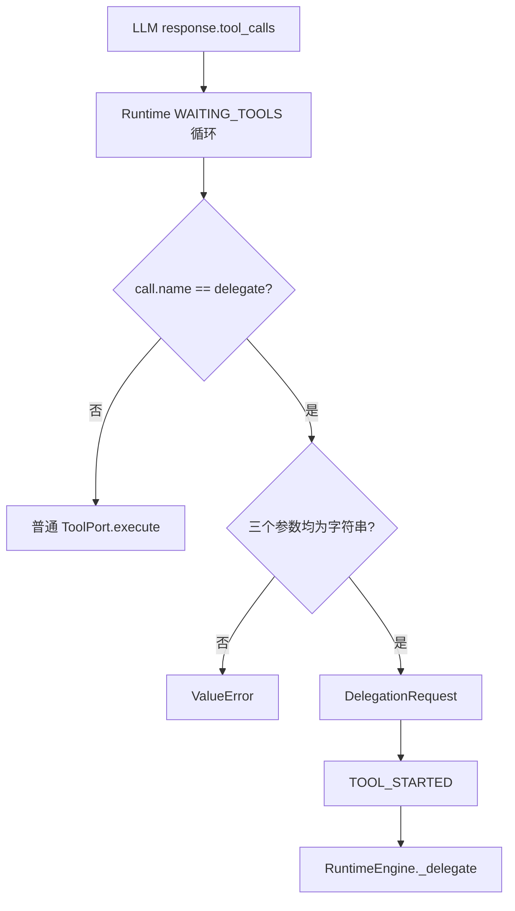

**结论：**

- delegate 与普通 ToolCall 共用 LLM ToolCall 载体。
- Runtime 通过名称进行硬编码特殊分派。
- 参数只做字符串类型检查，不检查空白、目标权限、深度或环路。
- 命中后绕过普通 ToolPort。
- Tool 审计仍然记录 started/completed。

### 5.4 提交 DelegationRequest

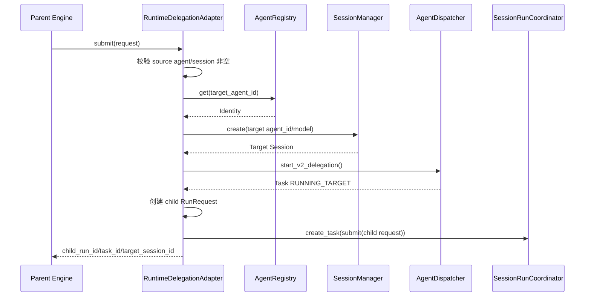

**结论：**

- 目标 Session 在活动 Task 检查之前创建。
- Task 创建成功后才生成 child_run_id。
- Child RunRequest 使用空 ConversationSnapshot。
- 子 Run通过同一个共享 RuntimeEngine 执行，但拥有独立 RunExecution。
- 任一步失败都没有统一补偿已创建的目标 Session 或 Task。

### 5.5 子 Run Identity 与策略隔离

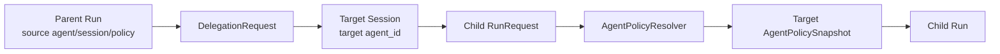

**结论：**

- 子 Run 不继承父 PolicySnapshot。
- 子 Run 根据 target agent_id重新冻结模型、Prompt、Tool Definitions 和 Context Plan。
- 子 Session 历史为空。
- Tool Scope 使用目标 agent_id。
- 父子共享基础设施，但不共享 RunExecution。

### 5.6 父 Run 同步等待

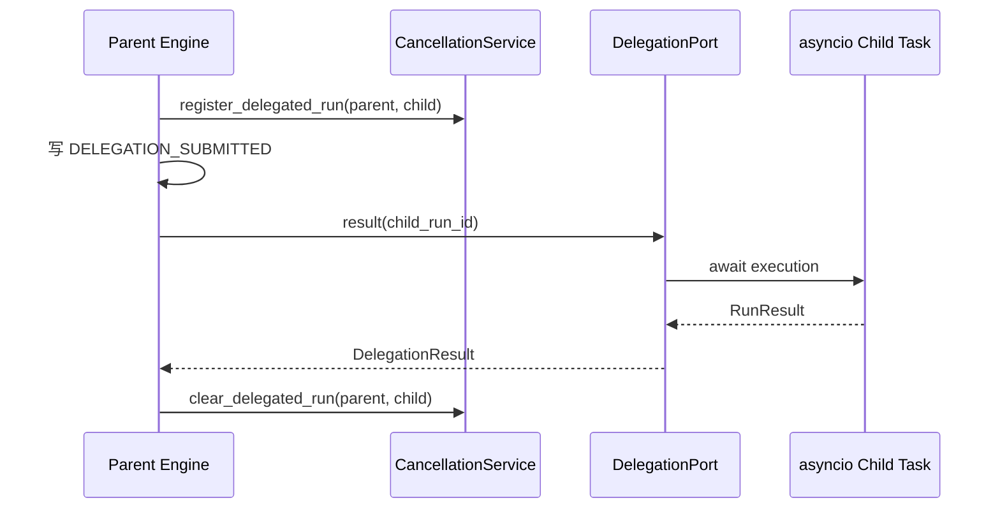

**结论：**

- 父 Run 在等待期间不继续调用 LLM。
- 父 Run 的 Session Lock 保持占用。
- 子 Run使用不同 Session Lock。
- 取消服务只保存当前一个 child_run_id。
- 这不是后台任务或异步通知模型。

### 5.7 子 Run 成功回填

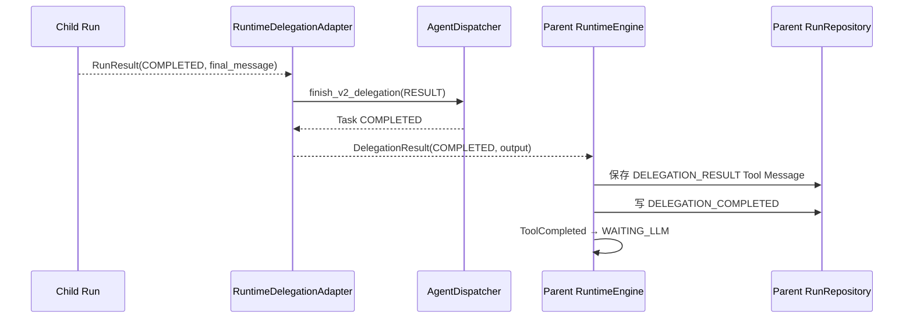

**结论：**

- 子最终回答成为父 Run 的 Tool 角色消息。
- 父模型会在下一轮看到该结果。
- Task 和父 Run各自保存完成投影。
- 父 Conversation 最终只保存父 Run 的用户输入与最终回答。
- Child Run/Session 保留独立成功 Conversation。

### 5.8 子 Run 非成功结果

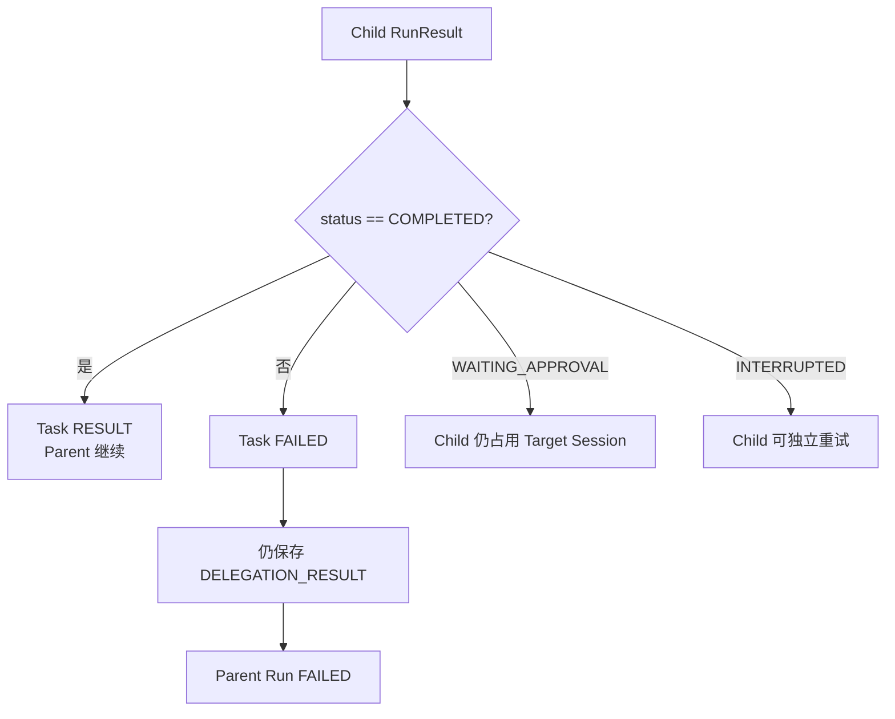

**结论：**

- Adapter 只区分 COMPLETED 与“其他”。
- WAITING_APPROVAL 不会向父入口传播 approval_id。
- INTERRUPTED 不会让父 Run进入可恢复等待。
- 父模型没有机会读取错误并选择替代方案。
- 子 Run 可能仍是非终态，而 Task 和父 Run 已失败。

### 5.9 父取消向下传播

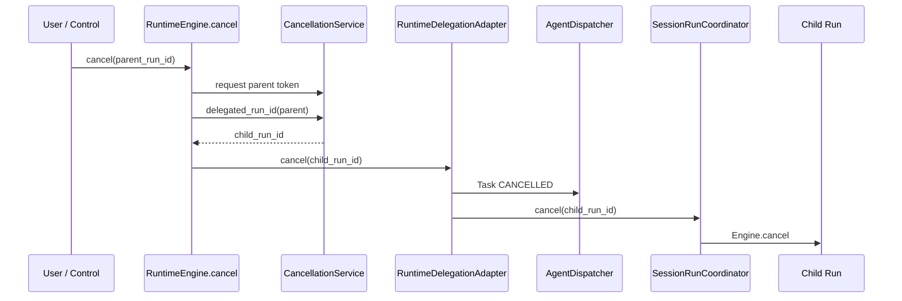

**结论：**

- Task 取消和 child Run 取消是两个步骤。
- Task 会先进入 CANCELLED。
- Coordinator.cancel 不等待目标 Session 锁。
- 取消是尽力语义。
- 当前取消 TaskMessage 的 sender_run_id 错用了 child_run_id。

### 5.10 Broker 已实现但生产主链未接入的通信路径

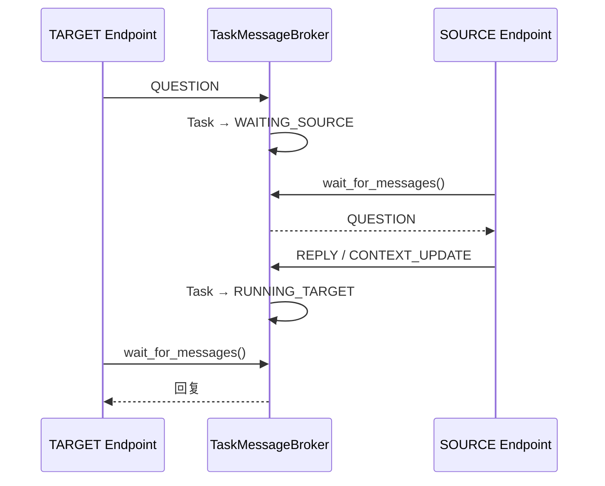

**结论：**

- Broker 已定义中途问答的内存状态机。
- 旧 `wait_task`、`task_send_message`、`task_status` 和 `cancel_task` Tool Definitions 被当前 Policy Resolver 排除。
- RuntimeDelegationAdapter 不调用 wait_for_messages 或 send_message 的问答类型。
- 生产父 Run只是等待 child RunResult。
- 因此当前 Agent 执行过程中不存在真正双向通信。

### 5.11 Message 游标与等待

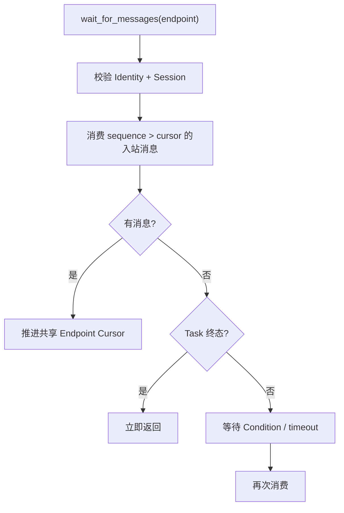

**结论：**

- 消费语义是每 Endpoint 单消费者游标。
- 多个等待者会竞争同一个游标。
- 没有 ack、重投递或独立订阅。
- 消息不持久化。
- 状态检查和 condition.wait 之间存在丢失通知窗口。

### 5.12 多个 delegate ToolCall

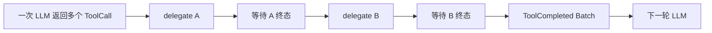

**结论：**

- ToolCall Batch 按顺序循环。
- 多个 delegation 不并行执行。
- 前一个 Task 进入终态后，后一个才能通过 source Session 活动 Task 检查。
- 任一子 Run失败会立即终止父 Run和剩余 ToolCall。
- 当前不支持 fan-out/fan-in。

### 5.13 嵌套委托

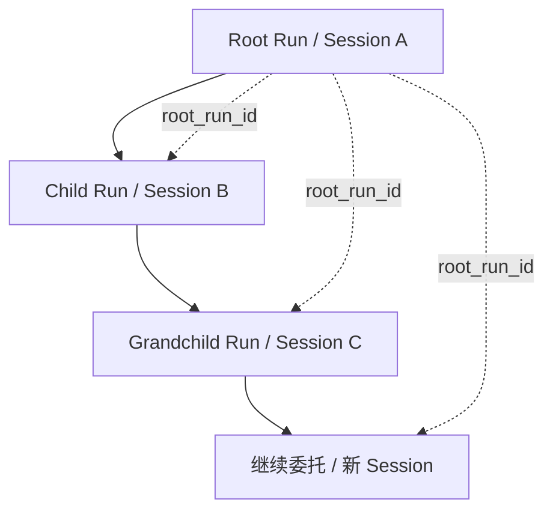

**结论：**

- 子 Agent 可以再次调用 delegate。
- 每层都会创建新 Session。
- root_run_id 能记录共同根，但当前不用于治理。
- 没有 max_depth、cycle detection 或目标 allowlist。
- 委托回原 Agent 也会创建新 Session，不会复用被父 Run锁住的来源 Session。

### 5.14 问题边界说明

进程重启恢复、Target Session 遗留和活动 Task 创建竞态不属于正常委托流程。对应问题图和根因分析分别见第 8.3 节：

```text
进程重启与父子恢复
→ O12

Target Session 生命周期
→ O16

活动 Task 检查与创建竞态
→ O5
```

## 6. 对外接口与数据契约

### 6.1 Orchestration 包公共 API

`dotclaw.orchestration` 当前导出：

```python
Task
TaskStatus
TaskEndpoint
TaskMessage
TaskMessageType
TaskSpecification
AgentRegistry
TaskMessageBroker
AgentDispatcher
```

`RuntimeDelegationAdapter`、TaskEndpointBinding、TaskWaitResult 和错误类型未从包级 `__all__` 导出。

AgentRegistry 虽从此包导出，逻辑权威说明仍归 Agent Wiki。

### 6.2 `TaskSpecification` 契约

```text
TaskSpecification
├── title: str
├── objective: str
├── materials: list[str]
├── constraints: list[str]
└── expected_deliverables: list[str]
```

当前生产 delegate 只使用 title/objective 的文本包装，未使用后三组结构化字段。

### 6.3 `Task` 契约

```text
Task
├── task_id
├── specification
├── source: TaskEndpointBinding
├── target: TaskEndpointBinding
├── status
├── result_message
├── error
├── cancellation_requested
├── created_at
└── updated_at
```

Task 是内存对象，不提供 to_dict/from_dict 和持久化版本。

### 6.4 Task 状态转换契约

允许：

```text
SUBMITTED → RUNNING_TARGET
RUNNING_TARGET → WAITING_SOURCE
WAITING_SOURCE → RUNNING_TARGET
RUNNING_TARGET → COMPLETED
RUNNING_TARGET → FAILED
任意非终态 → CANCELLED（仅 SOURCE cancel_task）
```

PROGRESS 不改变状态。

### 6.5 Endpoint 访问契约

Broker 访问要求同时匹配：

```text
endpoint
identity_id
session_id
```

run_id 不参与访问授权，只写入消息审计字段。

### 6.6 Task 消息序号契约

```text
sequence = 当前 Task 消息数量 + 1
```

Broker 单进程单锁下保证从 1 连续递增。进程退出后消息全部丢失。

### 6.7 Broker 等待契约

```python
wait_for_messages(
    task_id,
    endpoint,
    identity_id,
    session_id,
    timeout,
) -> TaskWaitResult
```

`timeout=None` 可无限等待。timed_out=True 不保证此刻没有已经到达但尚未消费的消息，因为存在通知竞态。

### 6.8 Delegation ToolCall 契约

仅当 `delegate` Tool Definition 已注册、通过 Agent 工具可见性过滤并进入模型 Context 时，模型才可能生成该调用。Runtime 对收到的 ToolCall 硬编码识别：

```json
{
  "name": "delegate",
  "arguments": {
    "target_agent_id": "agent-id",
    "title": "任务标题",
    "objective": "目标描述"
  }
}
```

只校验三项是字符串。

### 6.9 `DelegationRequest` 契约

```text
parent_run_id
root_run_id
target_agent_id
input_message
source_agent_id
source_session_id
source_tool_call_id
```

RuntimeEngine 负责构建；Adapter 不接受来源 Agent/Session 为空。

### 6.10 `DelegationSubmission` 契约

```text
child_run_id
task_id
target_session_id
```

返回后父 Engine 可记录审计和取消映射。它不是“子 Run 已安全持久化”的确认。

### 6.11 `DelegationResult` 契约

```text
child_run_id
status
output
error
```

转换规则：

- final_message 存在：output=content；
- 无 final_message：output=""；
- asyncio Task 取消：CANCELLED + CANCELLED Error；
- Adapter 异常：FAILED + TOOL_FAILURE Error。

### 6.12 Child RunRequest 契约

```text
session_id = 新 Target Session
agent_id = Target Identity
conversation = ConversationSnapshot(target_session_id, (), 0)
parent_run_id = request.parent_run_id
root_run_id = request.root_run_id
run_id = Adapter 预生成 UUID
lease_id = delegation-UUID
```

### 6.13 父结果消息契约

```text
RunMessageKind.DELEGATION_RESULT
role = TOOL
tool_call_id = source_tool_call_id
metadata:
  task_id
  child_run_id
  target_agent_id
  target_session_id
```

结果消息在父 Run messages.json 中持久化。

### 6.14 委托审计事件契约

父 Run写入：

```text
TOOL_STARTED
DELEGATION_SUBMITTED
DELEGATION_COMPLETED
TOOL_COMPLETED
```

DELEGATION_SUBMITTED data 包含 Task、Child Run、Target Agent 和 Target Session。DELEGATION_COMPLETED data 包含 Task、Child Run 和 status。

### 6.15 取消契约

当前只维护：

```text
parent_run_id → 当前 child_run_id
```

父取消时：

```text
Task CANCELLED
→ Coordinator.cancel(child_run_id)
```

不支持一个父 Run同时维护多个活动子 Run。

### 6.16 当前实现已经保证的不变量

1. Task Domain 不依赖 Runtime、Session、Agent 或外部基础设施。
2. Task 消息在单进程 Broker Lock 内按 sequence 连续追加。
3. Broker 校验 Endpoint 的 Identity 和 Session 双重绑定。
4. Task 终态后拒绝普通业务消息。
5. SOURCE 取消 Task 时同时追加 CANCELLED 消息和更新 Task 状态。
6. RuntimeEngine 只通过 DelegationPort 调用 Orchestration Adapter。
7. 每次委托创建独立 Target Session 和 Child RunRequest。
8. 子 Run根据 target_agent_id冻结自己的 AgentPolicySnapshot。
9. Child Run持久化 parent_run_id 和 root_run_id。
10. 父 Run等待子 Run期间登记唯一 child_run_id，允许取消向下传播。
11. 成功子结果以 TOOL 角色 DELEGATION_RESULT 写入父 Run。
12. 父 Run的 Delegation Result 保留原 source_tool_call_id。
13. Adapter 只把 COMPLETED 映射为 Task COMPLETED。
14. Task 消息和 AgentRun 事实属于不同状态模型。
15. 旧 Task 协议工具不会进入当前 Agent Tool Definitions。
16. Broker REQUEST 不会在目标 Endpoint 第一次等待时重复投递。
17. 不同 Target Session 通过 SessionRunCoordinator 分别串行。
18. 父取消不会直接修改 Child Run文件，而是走 Coordinator/Engine 取消协议。

### 6.17 必须保持但当前尚未落实的设计约束

1. delegate 应经过独立 Capability、Policy 和必要审批；当前绕过普通 ToolPort。
2. Task、消息、等待游标和父子映射若需要恢复，必须持久化；当前全部在内存。
3. 子 Run WAITING_APPROVAL/INTERRUPTED 应保留可恢复关联，不应直接压缩为父失败。
4. source Session 唯一活动 Task 检查和创建必须原子；当前先查后写。
5. 父子执行中途通信必须接入 Runtime 安全点；当前 Broker 能力未使用。
6. 委托必须具备 max_depth、cycle detection、target allowlist 和并发预算。
7. Target Session 创建、Task 创建和 Child Run注册应具备补偿或事务意图。
8. Adapter 结果、Task、Condition 和 Session 应有终态清理策略。
9. Parent Run在进程重启后应能按持久化关联重连 Child Run，避免重复委托。
10. TaskMessage sender_run_id 必须与 sender Endpoint 的实际 Run 一致。
11. `result()` 的协议语义应明确是阻塞等待还是非阻塞查询。
12. Child 非成功结果应允许父模型根据错误决定重试、换目标或降级。

---

## 7. 常见修改入口

| 修改目标 | 首要入口 | 可能涉及 | 必须保持的不变量 |
|---|---|---|---|
| 新增 Task 字段 | `orchestration/task.py::Task` | Broker、Dispatcher、持久化方案 | 状态只能由受控聚合操作修改 |
| 修改 TaskStatus | `TaskStatus` + Broker 状态映射 | Dispatcher、Adapter、测试 | 不与 RunStatus 混为一套状态机 |
| 修改 MessageType | `TaskMessageType` | 允许矩阵、状态投影、Context 接入 | 明确发送端和合法状态 |
| 增加深度不可变 | TaskSpecification/TaskWaitResult | Broker 调用方 | list/Task 不得泄漏可变引用 |
| 修改任务文本 | `TaskSpecification.render_user_message` | `_task_specification`、Child input | 避免重复注入 REQUEST |
| 修改 Endpoint 权限 | `_validate_endpoint_locked` | Identity、Session、Delegation Policy | Identity 与 Session 双重绑定 |
| 修改消息序号 | `_append_message_locked` | 持久化、游标 | 每 Task 连续且唯一 |
| 修改消息时间 | `_append_message_locked` | UTC 工具、审计 | 使用真实追加时间 |
| 修改 Broker 状态机 | `_validate_message_locked`、`_apply_message_state_locked` | tests/orchestration | 校验和状态更新同锁原子 |
| 修复等待通知 | `wait_for_messages`、`_notify` | Condition/Queue | 消息到达不能丢失唤醒 |
| 支持多消费者 | Broker cursor 模型 | ack、subscription | 每消费者独立游标 |
| 增加 Task 持久化 | 新 TaskRepository | Broker、恢复、Schema | 消息与状态事务一致 |
| 增加终态清理 | Broker/Adapter Lifecycle | Task、Condition、Result Cache | 未消费结果不得提前删除 |
| 修改活动 Task 限制 | Dispatcher/Broker | source Session 索引 | 检查与创建必须原子 |
| 修改 Task 创建 | `start_v2_delegation` | Target Session、补偿 | 失败不能遗留 Session/Task |
| 修改完成映射 | `finish_v2_delegation` | RunStatus→TaskStatus | 保留等待审批和中断语义 |
| 修改取消 Task | Dispatcher + Adapter.cancel | CancellationService | Task 与 Child Run 同步收口 |
| 修正取消审计 | `DelegationTaskBinding` | sender_run_id | 消息发送 Run 必须真实 |
| 修改 Delegation DTO | `runtime/application/dto.py` | Engine、Adapter、Port | 父子 ID 和来源 ToolCall 保持完整 |
| 修改 DelegationPort | `runtime/application/ports.py` | Adapter、Engine | 明确 result 阻塞/查询语义 |
| 修改目标 Session | `RuntimeDelegationAdapter.submit` | SessionManager、清理 | Target Session 独立且可识别 |
| 修改 Child RunRequest | Adapter.submit | AgentPolicyResolver、Coordinator | Target Policy 不继承 Parent |
| 修改异步提交 | Adapter `_running` | 取消、恢复 | 返回 Submission 前确认 Run 注册 |
| 修改结果缓存 | Adapter.result | 审计、清理 | 幂等查询且有淘汰 |
| 修改 child 非终态 | `_to_delegation_result` / Engine | Approval、retry | 不得误写 Task FAILED |
| 支持子审批 | DelegationResult + Channel | ApprovalRepository、Parent Run | approval_id 必须可路由 |
| 支持子中断重试 | DelegationPort | Coordinator、Checkpoint | 保持原 child_run_id |
| 修改 delegate 参数 | `_delegation_request` + 实际 Tool Definition 注册点 | Provider、文档 | 先确认注册来源，再保持 Schema 单一 |
| 修改 delegate 安全 | Engine ToolCall 分派 | Tool Policy、Capability | 不绕过安全层 |
| 修改父结果消息 | RuntimeEngine._delegate | Context、Tool 协议 | role/tool_call_id 必须匹配 |
| 修改父失败策略 | `_delegate` | AgentState、LLM 重试 | Child error 可交给父模型决策 |
| 修改父子取消 | CancellationService | Adapter、Coordinator | 每个活动 Child 可精确取消 |
| 支持并行子 Run | Cancellation/DelegationPort | Task Group、join | 多 child 映射不能覆盖 |
| 增加深度限制 | Runtime/DelegationPolicy | root/parent 链 | 防止递归失控 |
| 增加目标允许列表 | Agent/DelegationPolicy | AvailableAgents Context | 展示和执行同源 |
| 增加能力路由 | AgentDirectory | Context、Adapter | 选择可解释且执行前复核 |
| 接入中途通信 | Broker + Runtime 安全点 | Task Tools、Checkpoint | 不破坏单 Session 串行 |
| 修改 Available Agents | ContextProvider | 可见性、健康状态 | 不暴露无权调用目标 |
| 修改旧 Task Tools | AgentPolicyResolver | Tool Registry、Runtime | 避免两套协议并存 |
| 修改 Bootstrap 装配 | runtime_factory | Adapter bind、Host | 双向绑定只发生一次 |
| 增加 Adapter shutdown | RuntimeDelegationAdapter | Host、运行任务 | 正确取消/等待未完成 asyncio Task |
| 修改进程恢复 | TaskRepository + RunRepository | Parent/Child relation | 不重复提交 Child |
| 增加临时 Session | Session Domain | Delegation、CLI、清理 | Child 审计仍可追溯 |
| 排查 delegate 不可见 | Tool Definition 注册→Tool Registry→PolicySnapshot→Context | allowed_tools | 先确认 Definition 实际存在，再检查过滤与冻结 |
| 排查目标 Agent 不存在 | AvailableAgents→ToolCall→Registry | Identity 加载 | Context 与执行目录一致 |
| 排查父 Run 直接失败 | Child RunResult→DelegationResult | WAITING_APPROVAL/INTERRUPTED | 检查状态压缩 |
| 排查 Task 长期 RUNNING | Adapter `_running`/`result` | submit 异常、进程退出 | 确认 finish_task 被调用 |
| 排查取消未传播 | CancellationService mapping | Parent 是否正在 await Child | 检查映射清理时机 |
| 排查内存增长 | Broker/Adapter dict | Tasks、Conditions、Results | 设计终态保留策略 |

---

## 8. 设计取舍、痛点和演进方向

本节区分当前架构承诺、核心设计选择、已知问题和候选演进，不把未来多 Agent 能力写成当前实现。

### 8.1 当前架构承诺

当前 master 可以确认：

1. Orchestration 是同进程 delegation，不是远程 A2A。
2. Task Domain 与 Runtime Domain 分离。
3. TaskMessageBroker 是内存消息和 Task 状态的唯一管理器。
4. AgentDispatcher 不执行子 Run。
5. RuntimeDelegationAdapter 创建 Target Session 和 Child Run；RuntimeEngine 支持 `delegate` ToolCall，但默认 Tool Definition 注册来源尚未在已扫描文件中确认。
6. RuntimeEngine 只依赖 DelegationPort。
7. Parent Run同步等待 Child Run终态。
8. Child Run使用独立 Session 和目标 Agent Policy。
9. Child Result 以 Tool 消息回填 Parent Run。
10. Parent Cancel 可向当前 Child Run传播。
11. Broker 定义中途问答，但生产 Runtime 主链未使用。
12. Task、消息、Adapter 映射和结果缓存不持久化。
13. 当前一个 Parent Run不会并行等待多个 Child Run。
14. WAITING_APPROVAL/INTERRUPTED Child 不会形成可恢复父等待。
15. 没有深度、环路、目标允许列表或委托并发治理。

### 8.2 核心设计取舍

#### 8.2.1 Task 与 AgentRun 分离

**问题与选择：**Task 表达来源端和目标端的编排通信，AgentRun 表达具体执行事实。当前保留两套状态模型。

**未选择：**把 TaskStatus 直接等同 RunStatus，或只用 Task 代替子 Run。

**收益：**Broker 不依赖 Runtime；未来可以支持执行外的问答和进度。

**代价与边界：**需要明确映射；当前映射过度压缩了非终态 RunStatus。

#### 8.2.2 Runtime 通过 Port 调用 Orchestration

**问题与选择：**Engine 不应依赖 Dispatcher/Broker。当前只依赖 DelegationPort。

**未选择：**RuntimeEngine 直接创建 Task、Session 和 asyncio Task。

**收益：**Runtime 可测试；Adapter 汇聚跨模块依赖。

**代价与边界：**Adapter 职责较重，并形成与 Coordinator 的双向装配。

#### 8.2.3 每次委托创建独立 Session

**问题与选择：**目标 Agent 需要自己的 Identity、Policy 和 Conversation。当前创建全新 Session。

**未选择：**在 Parent Session 中临时切换 Agent，或复用目标 Agent 的共享 Session。

**收益：**父子上下文和策略隔离；不会争抢同一 Session Lock。

**代价与边界：**委托 Session 持续积累；目标没有先前对话历史。

#### 8.2.4 Parent 同步等待 Child

**问题与选择：**MVP 需要简单的 request/response 委托语义。当前父 Run await Child Result。

**未选择：**后台 Task、并行 DAG、事件通知或稍后回收结果。

**收益：**结果可直接作为 Tool Message 进入下一轮模型。

**代价与边界：**父 Session 长时间占用；无法并行委托；子审批无法回到原交互入口。

#### 8.2.5 `delegate` 作为特殊 ToolCall

**问题与选择：**模型使用统一 ToolCall 协议选择目标和输入，Engine 按名称特殊拦截。

**未选择：**独立模型输出协议、普通 Tool Handler 内部直接运行子 Agent。

**收益：**Provider 无需新协议；结果可遵循 Tool Message 关联。

**代价与边界：**存在硬编码名称；绕过普通 ToolPort 安全路径。

#### 8.2.6 Broker 在单锁内修改消息和状态

**问题与选择：**消息事实和 Task 状态必须一致。Broker 用全局 asyncio.Lock 原子更新两者。

**未选择：**Task 自己修改状态，消息列表独立追加。

**收益：**单进程中状态与消息不分裂。

**代价与边界：**所有 Task 共用一把锁；外部仍可通过 Task 引用绕过。

#### 8.2.7 REQUEST 同时作为 Child 输入

**问题与选择：**初始任务内容已经注入 Child Run的 user message。Broker 仍记录 REQUEST，但推进 TARGET cursor 避免重复读取。

**未选择：**Child 启动后主动 wait_task 获取初始请求。

**收益：**子 Run可直接开始；无需额外 Tool 轮次。

**代价与边界：**Broker 消息流和 Runtime 输入有两份表达，必须保持内容一致。

#### 8.2.8 所有非完成 Child 视为委托失败

**问题与选择：**Parent 只需要最终成功输出。当前只有 COMPLETED 继续，其余均失败。

**未选择：**把 WAITING_APPROVAL、INTERRUPTED 等提升为父 Run控制状态。

**收益：**状态转换简单。

**代价与边界：**破坏可恢复语义，可能遗留未终态 Child。

#### 8.2.9 父取消只追踪当前 Child

**问题与选择：**当前 delegation 串行，因此 CancellationService 保存一个映射。

**未选择：**父 Run维护 Child 集合或 TaskGroup。

**收益：**取消逻辑简单。

**代价与边界：**无法直接扩展到并行 fan-out。

#### 8.2.10 Task/Broker 不持久化

**问题与选择：**MVP 只需要同进程协调，运行审计由 RunRepository 保证。

**未选择：**Task Repository、消息日志和恢复器。

**收益：**实现轻量。

**代价与边界：**重启后 Task 状态和父子等待关系丢失。

#### 8.2.11 所有 Agent 平等作为目标

**问题与选择：**模型从 Available Agents 文本选择任意 Registry Identity。

**未选择：**固定主从树、配置 sub_agents 或静态路由表。

**收益：**关系灵活；嵌套委托自然成立。

**代价与边界：**没有可见性、允许列表和环路治理。

#### 8.2.12 旧 Task 工具暂时排除

**问题与选择：**旧 `wait_task` 等工具没有接入 Runtime 的安全和恢复链。当前 Policy Resolver 排除它们。

**未选择：**继续向模型暴露不完整协议。

**收益：**避免模型进入无法闭环的中途通信路径。

**代价与边界：**Broker 的 QUESTION/REPLY 能力成为未使用的内部能力。

### 8.3 已知痛点

#### O1. Domain 对象缺少深度不可变和只读快照

`TaskSpecification` 虽使用 `frozen=True`，内部 list 仍可修改；`Task` 本身可变，Broker 查询和 `TaskWaitResult` 又返回原对象引用。外部调用者可以绕过 Broker 直接修改状态和绑定。

#### O2. Task 消息时间与 Runtime 审计时间不一致

`TaskMessage.created_at` 取消息追加前的旧 `task.updated_at`，随后才 `touch()`。Task、Message 与 RunEvent 虽都使用 UTC 风格字符串，但无法可靠还原同一动作的时间顺序。

#### O3. Broker 并发、通知和消费模型存在系统性限制

所有 Task 共用一把 Broker Lock；`wait_for_messages()` 的检查与真正等待不在同一条件谓词循环内，存在丢失唤醒窗口；每个 Endpoint 又只有一个共享消费游标，不支持多消费者独立读取、ACK 或回放。

#### O4. Task 与 Adapter 内存状态缺少持久化和生命周期管理

Task、Message、Cursor、Condition、`_running`、`_task_bindings` 和 `_results` 全部只在内存。Broker 与 Adapter 没有终态 TTL、结果确认、自动清理或 shutdown，进程长期运行会持续积累状态。

#### O5. 活动 Task 约束和启动状态不是原子事务

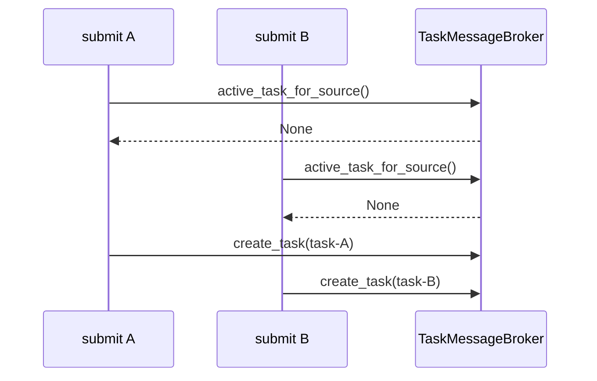

**结论：**“一个来源 Session 只有一个活动 Task”只是 Dispatcher 的先查后写逻辑，并非 Broker 原子不变量；`create_task()` 与 `mark_target_running()` 分离还可能遗留 SUBMITTED Task。

#### O6. Delegation 提交缺少事务和可靠注册确认

Adapter 先创建 Target Session，再创建 Task，随后用 `asyncio.create_task()` 提交 Child Run。任一步失败都没有补偿意图；`await asyncio.sleep(0)` 也不能保证返回 `DelegationSubmission` 时 child `run.json` 已经注册。

#### O7. 取消审计的发送端与 Run ID 不一致

Adapter 以 SOURCE Binding 发送 CANCELLED，但传入的 `sender_run_id` 是 child_run_id。TaskMessage 的发送端语义和运行标识不一致。

#### O8. Child 非终态无法映射为父级可恢复控制状态

WAITING_APPROVAL、INTERRUPTED 及其他非 COMPLETED 结果统一被写成 Task FAILED；approval_id 不进入 `DelegationResult`，父 Run直接失败，无法代理审批、保持父等待、重试原 Child 或让父模型选择降级方案。

#### O9. `delegate` 安全路径和 Tool Definition 来源未统一

Engine 在普通 ToolPort 前按名称特殊拦截，因此 Capability、Policy、Agent Rule 和 Approval 不会评估该委托。

同时，当前源码已确认 Runtime 硬编码了 `delegate` 名称和三个参数，但在已扫描文件中未确认默认 Tool Definition 的注册点。若 Definition 由其他位置注册，Schema 将存在双重来源；若未注册，模型默认根本看不到该能力。

#### O10. 结构化任务契约在 Runtime 适配中丢失

Runtime 将 title/objective 拼为文本；Adapter 又用固定标题 `"Runtime v2 delegation"`（历史字面量） 创建 TaskSpecification。materials、constraints 和 expected_deliverables 虽已存在于 Domain，但没有进入 ToolCall、DelegationRequest 或生产 Task。

#### O11. Broker 中途通信和 WAITING_DELEGATION 状态未接入生产主链

QUESTION、REPLY、CONTEXT_UPDATE 和 PROGRESS 只存在于 Broker 与测试；旧 Task Tools 被 Policy Resolver 排除。实际 ToolCall 路径还以 `manage_state=False` 调用 `_delegate()`，独立 WAITING_DELEGATION 状态转换没有生效。

#### O12. Task 与父子 Run 缺少持久化恢复协议

```mermaid
flowchart TD
    Running["父 Run 等待子 Run"] --> Crash["进程退出"]
    Crash --> Lost["Broker / Task / asyncio Task / results 映射丢失"]
    Crash --> Persisted["Parent/Child run.json 与 Session 保留"]
    Persisted --> Recover["下次访问 recover_session"]
    Recover --> Interrupted["RUNNING → INTERRUPTED"]
    Interrupted --> Retry["手动 retry"]
    Retry --> Duplicate{"可能重新执行 LLM / delegate"}
```

**结论：**TaskMessage 与 RunEvent 存在重复投影，却没有共同事务；Parent 没有持久化 task_id/child_run_id 等委托 Checkpoint，重启后无法重连 Child，重试可能重复创建子任务。

#### O13. 委托治理缺少深度、环路、目标权限和资源预算

root_run_id 只用于追踪，不参与 max_depth、重复 Agent 检测、循环路径、allowed_targets、总子任务数或 token/time 预算。任何能看到 `delegate` 的 Agent 都可以请求 Registry 中任意目标。

#### O14. Agent 发现仍是未经验证的自然语言提示

Available Agents 默认暴露全部 Identity，没有来源可见性、健康、繁忙、禁用或容量过滤；capabilities 只影响模型文本选择，input_modes/output_modes 也不在提交前验证。

#### O15. ToolCall Batch 只能串行并采用 fail-fast

多个 `delegate` 按 ToolCall 顺序逐个等待，无法 fan-out/fan-in；任一 Child 失败会立即终止父 Run，并丢弃同一批次中剩余 ToolCall。

#### O16. Target Session 缺少临时生命周期和失败补偿

```mermaid
flowchart LR
    Submit["Adapter.submit"] --> Create["创建持久化 Target Session"]
    Create --> Task["创建 Task"]
    Task --> Child["创建 Child Run"]
    Child --> Terminal["Child 终态"]
    Terminal --> Stored["Session 与 Run 长期保留"]
    Create --> Failure["后续提交失败"]
    Failure --> Orphan["可能遗留空 Target Session"]
```

**结论：**委托 Session 与普通 Session 无法区分，没有 owner_task_id、owner_run_id、temporary、retention 或自动归档；后续 Task/Child 注册失败时还可能遗留空 Session。

#### O17. DelegationPort 阻塞语义和错误契约不精确

`result()` 名称和注释像查询，实际会阻塞等待终态；目标不存在、提交拒绝、Child 中断和 Adapter 异常多被压缩为 TOOL_FAILURE，调用方难以制定精确恢复策略。

#### O18. AgentRegistry 物理位置与逻辑归属不一致

Registry 文件和包导出位于 orchestration，但逻辑职责属于 Agent Directory，容易让模块说明、依赖方向和未来重构产生歧义。

#### O19. 缺少父子索引和可查询的 Task 摘要

Task 不保存 parent_run_id/root_run_id/child_run_id 的结构化索引；只能按 source Session 扫描。`result_message` 也只保留一条终态消息，无法高效查询进度摘要、消息版本和完整父子历史。

#### O20. Child 进度和流式结果不向父级传播

`DelegationResult` 不包含 has_streamed_response 或 Progress；父 Run只在 Child 终态后收到最终文本，长任务期间无法向父 Agent 或用户提供增量状态。

### 8.4 演进方向

| 编号 | 解决的痛点 | 候选方向 | 影响与代价 |
|---|---|---|---|
| E1 | O1 | 使用 tuple 和冻结 TaskSnapshot；Broker 查询只返回只读副本 | Task Domain、Broker、Tests |
| E2 | O2 | TaskMessage 与 Task 状态更新使用同一个统一 UTC 时间值，并建立跨 RunEvent 关联字段 | Domain、Broker、Audit |
| E3 | O3 | 拆分 Task 级锁；使用 Queue/Event + 条件谓词循环；为消费者建立独立 subscription/cursor | Broker、并发测试 |
| E4 | O4 | 引入 TaskRepository 和终态生命周期：持久化 Task/Message/Cursor/Binding，设置 TTL、ACK 和 Adapter shutdown | Orchestration、Storage、Host |
| E5 | O5 | Broker 提供 `create_and_start_for_source()` 原子操作，并维护 source_session_id 活动索引 | Broker、Dispatcher |
| E6 | O6 | 引入 DelegationSubmitIntent；先校验和预留，再创建 Session/Task/Child；Coordinator 仅在 Run 注册成功后返回 | Adapter、Session、Runtime、Storage |
| E7 | O7 | DelegationTaskBinding 保存 parent_run_id，取消审计使用真实 SOURCE Run | Adapter、Task Audit |
| E8 | O8 | 扩展 DelegationResult 为 COMPLETED/WAITING_APPROVAL/INTERRUPTED/FAILED，并携带 approval_id、target_session_id 和恢复动作 | Runtime DTO、Engine、Channel |
| E9 | O12 | 保存 DelegationCheckpoint 与 Parent/Child/Task Binding；重启时重连现有 Child，而非重新提交 | Runtime、TaskRepository |
| E10 | O9 | 定义唯一的 Delegate Capability/Tool Definition 注册点，由其生成 DTO 校验；委托单独经过 Policy、预算和审批 | Tool Security、Runtime、Bootstrap |
| E11 | O10 | DelegationRequest 保留 title、objective、materials、constraints 和 deliverables 结构，不再文本往返解析 | DTO、Task、Tool Schema |
| E12 | O11 | 在 Child Run安全点接入持久化 TaskInboxPort；启用 WAITING_SOURCE/WAITING_DELEGATION 的可恢复状态 | Runtime、Broker、Checkpoint |
| E13 | O13 | DelegationPolicy 增加 allowed_targets、max_depth、deny_cycles、max_children 和资源预算 | Agent、Runtime、Context |
| E14 | O14 | 建立结构化 AgentDirectory 查询：来源可见性、能力、模式、健康和容量过滤 | Agent Directory、Context、Adapter |
| E15 | O15 | 引入 DelegationGroup/TaskGroup，支持 fan-out、join、部分失败和父模型恢复策略 | Runtime、Cancellation、Task |
| E16 | O16 | Session 增加 `kind=delegation`、owner_task_id、temporary 和 retention；失败意图负责补偿清理 | Session、Orchestration |
| E17 | O17 | 分离 `poll_result()` 与 `wait_result()`；增加精确 DelegationErrorCode 和重试分类 | DelegationPort、Runtime Facts |
| E18 | O18、O19 | 将 Registry 物理移动到 Agent；建立 parent/root/task/child 索引和 TaskSnapshot 查询 API | Agent、Orchestration、CLI |
| E19 | O20 | 增加 Child Progress Port，将增量进度发送给父入口但不写入正式 Conversation | Runtime Output、Channel |
| E20 | 多项 | 建立故障注入和并发测试；若目标是本地可靠编排，优先用 SQLite 事务统一 Task、Binding、Lease 和 Intent | tests/orchestration、Storage、Migration |

## 9. 源码索引

### 9.1 Orchestration Domain

```text
src/dotclaw/orchestration/
├── __init__.py
├── task.py
├── message_broker.py
├── dispatcher.py
├── runtime_delegation_adapter.py
└── registry.py
```

| 文件 | 主要内容 |
|---|---|
| `orchestration/__init__.py` | 导出 Task Domain、Broker、Dispatcher 和兼容 Registry |
| `orchestration/task.py` | TaskStatus、Endpoint、MessageType、Specification、Message、Binding 和 Task |
| `orchestration/message_broker.py` | Task 消息、状态、游标、等待和端点校验 |
| `orchestration/dispatcher.py` | Task 创建、完成和取消门面 |
| `orchestration/runtime_delegation_adapter.py` | Target Session、Child Run、结果缓存和取消传播 |
| `orchestration/registry.py` | AgentRegistry 当前物理实现；逻辑主归属 Agent Wiki |

### 9.2 Runtime Delegation 契约与主链

```text
src/dotclaw/runtime/
├── application/
│   ├── dto.py
│   ├── ports.py
│   ├── engine.py
│   ├── cancellation_service.py
│   └── session_run_coordinator.py
└── domain/
    ├── events.py
    ├── state.py
    └── facts.py
```

| 文件 | Orchestration 视角 |
|---|---|
| `runtime/application/dto.py` | DelegationRequest、Submission 和 Result |
| `runtime/application/ports.py` | DelegationPort |
| `runtime/application/engine.py` | delegate ToolCall 特殊路径、父等待、结果消息和事件 |
| `runtime/application/cancellation_service.py` | Parent→当前 Child 取消映射 |
| `runtime/application/session_run_coordinator.py` | Target Session 子 Run 提交和取消 |
| `runtime/domain/events.py` | DelegationSubmitted/Completed 和审计事件类型 |
| `runtime/domain/state.py` | WAITING_DELEGATION 阶段及状态转换 |
| `runtime/domain/facts.py` | AgentRun parent_run_id/root_run_id、RunMessageKind |

### 9.3 Agent 与 Context 接入

```text
src/dotclaw/
├── runtime/adapters/agent_policy_resolver.py
├── context/provider.py
└── agent/identity.py
```

| 文件 | Orchestration 视角 |
|---|---|
| `runtime/adapters/agent_policy_resolver.py` | 排除旧 Task Tools，按目标 Identity 冻结子策略 |
| `context/provider.py` | 格式化 Available Agents 摘要 |
| `agent/identity.py` | capabilities、input_modes、output_modes 等目标元数据 |

### 9.4 Session 与 Bootstrap

```text
src/dotclaw/
├── session/session.py
├── bootstrap/runtime_factory.py
└── bootstrap/application_host.py
```

| 文件 | Orchestration 视角 |
|---|---|
| `session/session.py` | 创建持久化 Target Session |
| `bootstrap/runtime_factory.py` | Broker、Dispatcher、Adapter、Engine、Coordinator 双向装配 |
| `bootstrap/application_host.py` | 持有 RuntimeServices；当前不公开 Orchestration 管理 API |

### 9.5 已确认测试

```text
tests/orchestration/test_message_broker.py
```

当前覆盖：

- QUESTION→REPLY→RESULT 状态闭环；
- Identity/Session 端点隔离；
- 终态后消息拒绝；
- SOURCE 取消同时写终态消息；
- TARGET 不重复消费已注入的初始 REQUEST。

仍需要补充：

```text
Dispatcher 并发活动 Task
RuntimeDelegationAdapter 成功/异常/取消
Child WAITING_APPROVAL / INTERRUPTED
Parent 取消传播
进程重启与重复委托
Target Session 补偿与清理
Broker lost wakeup
结果缓存和终态清理
委托深度与环路
delegate 安全策略
```

