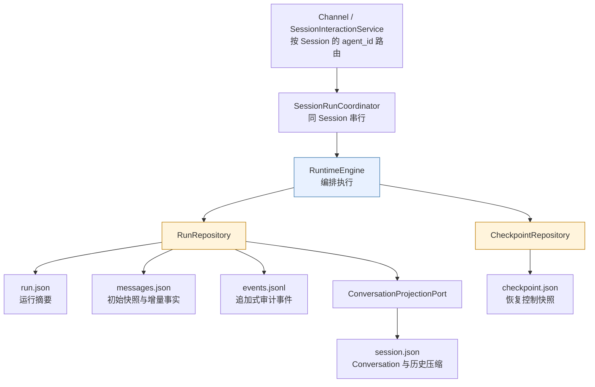
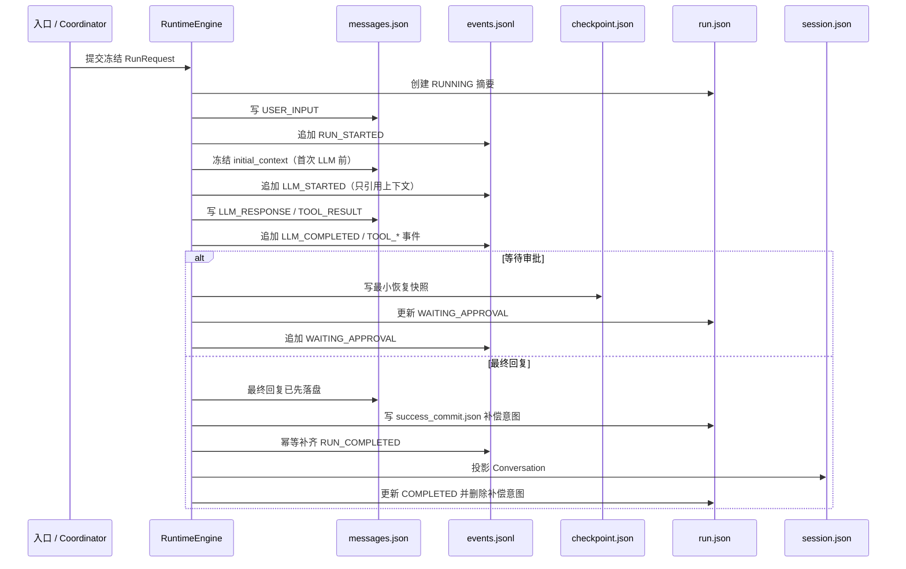

# Runtime 持久化架构

> 适用实现：Runtime v4 当前文件存储实现。
> 核心原则：**一个容器只回答一个问题；运行事实、恢复控制和用户会话投影不能互相替代。**

## 1. 概览

Runtime 的持久化不是把一次模型调用的所有对象“顺手存下来”，而是将不同生命周期、不同读者和不同一致性要求的数据拆为五个容器：

| 持久化部件 | 文件 | 唯一要回答的问题 |
| --- | --- | --- |
| Session | `session.json` | 这个用户会话已经成功沉淀了哪些长期对话语义？ |
| AgentRun | `run.json` | 这一次执行是谁、处于什么状态、最终因何结束？ |
| RunMessage | `messages.json` | 本次执行从开始到结束新增了哪些内容事实？ |
| RunEvent | `events.jsonl` | 本次执行按顺序发生了哪些调用与控制流事件？ |
| Checkpoint | `checkpoint.json` | 中断后允许从哪个安全边界继续、下一步做什么？ |

这里的“五个部件”按物理持久化容器划分。`Conversation` 是 `session.json` 中的一种成功会话投影，而不是第六份独立运行记录；`success_commit.json` 只是成功提交期间短暂存在的补偿意图，也不是业务事实容器。

Runtime 的职责是保存一次执行的完整、可审计事实，并在成功后将必要的用户语义投影到 Session。它不负责保存模型隐藏推理链，也不把 Trace、CLI 输出或任务队列当作恢复和业务判断的事实源。

## 2. 存储层级与依赖方向

`ApplicationHost` 通过私有 `runtime_factory` 将 Session 与 Runtime 仓储指向同一配置的数据根目录。逻辑目录如下，其中 `{session_id}` 和 `{run_id}` 都是受校验的路径片段：

```text
{storage_root}/
├── {session_id}/
│   ├── session.json
│   └── agent_runs/
│       └── {run_id}/
│           ├── run.json
│           ├── messages.json
│           ├── events.jsonl
│           ├── checkpoint.json           # 仅等待审批等可恢复边界存在
│           └── success_commit.json       # 仅成功提交补偿期间存在
└── approvals/
    └── {approval_id}.json                # 审批索引，属于控制记录
```



依赖由 Application 指向 `RunRepository`、`CheckpointRepository` 与 `ConversationProjectionPort` 等 Port；文件、SessionManager 和原子写入细节均在 Adapter 中。这样替换为 SQLite、PostgreSQL 或对象存储时，不需要让 `RuntimeEngine` 直接依赖具体存储技术。

## 3. 五个持久化部件

### 3.1 Session：长期、用户可见的会话语义

**作用**：`session.json` 是会话隔离单元。它记录“用户与 Agent 已经成功交流了什么”，并维护后续请求可使用的长期历史视图。

**记录时机**：

- 创建 Session 时写入基础信息；
- 成功 Run 完成提交时，由 `SessionConversationProjector` 追加一条 Conversation；
- 创建下一次 Run 前，如果历史超过轮次或上下文预算，由 `SessionHistoryPreparationService` 生成并写入一个新的历史压缩版本；
- 不在失败、取消、等待审批或只完成工具调用时写入 Conversation。

**记录内容**：

- Session 身份与展示信息：`id`、标题、Agent、模型、创建及更新时间；
- `conversations`：每次成功交互的 `conversation_id`、用户输入、最终回复、关联的 `agent_run_ids` 与创建时间；
- `conversation_version`：Conversation 列表的单调版本；
- `history_compressions`：不可变的摘要版本链，包含覆盖到的 `conversation_id`、摘要内容及内容 / 来源 hash；
- `active_compression_version`：当前模型注入时使用的历史摘要版本。

**不记录**：工具输出、中间模型回复、审批状态、失败细节、每轮完整 prompt，或子 Agent 的执行过程。

**为什么这样设计**：Session 的读者是后续用户请求与历史上下文构建。把只有成功才成立的用户语义与可能失败的运行过程隔离，可以避免“工具执行到一半失败”污染用户对话。历史压缩保留原始 Conversation，并以版本链替代早期注入视图，因此既能控制上下文预算，也能审计、重新压缩或迁移，而不是不可逆地删除历史。

### 3.2 AgentRun：一次执行的索引与终态摘要

**作用**：`run.json` 是一次 AgentRun 的轻量索引，回答“这次执行是谁、何时开始、当前或最终状态是什么”。它不是消息和事件的副本。

**记录时机**：

- `RuntimeEngine.execute()` 创建 Run 后立即创建，初始状态为 `RUNNING`；
- 进入等待审批时更新为 `WAITING_APPROVAL`，并关联最新 checkpoint；
- 恢复审批时恢复为 `RUNNING` 并增加 `resume_count`；
- 失败或取消时写入对应终态与错误摘要；
- 正常结束时通过成功提交协议最终写为 `COMPLETED`。

**记录内容**：

- 身份与归属：`run_id`、`session_id`、`agent_id`、父 / 根 Run 关联；
- 生命周期：状态、开始和结束时间、恢复次数；
- 引用：输入消息 ID、最终消息 ID、最新 checkpoint ID；
- 冻结策略：Agent 身份版本、模型、最大迭代次数及策略数据；
- 聚合统计：模型 / 工具调用次数、输入输出 token、时长；
- 终态错误摘要：错误码、信息与是否可重试。

**不记录**：完整消息、完整事件、完整 prompt、恢复快照或 Conversation 副本。

**为什么这样设计**：运行列表、取消、审批定位和状态展示通常只需要摘要；若把大量消息和事件内嵌进 `run.json`，每次更新都会造成重复写入，并使不同事实副本容易漂移。通过稳定 ID 引用其它容器，`run.json` 保持小、适合索引，也能让消息和审计随存储方案独立演进。

### 3.3 RunMessage：冻结初始条件与运行内增量内容事实

**作用**：`messages.json` 保存模型上下文如何在本 Run 内演化。它由两部分组成：不可变的 `initial_context` 与有序的 `messages` 增量事实。

**记录时机**：

- Run 创建后，先保存本次用户输入为 `USER_INPUT`；
- 第一次实际构造模型上下文、第一次调用 LLM 前，冻结 `initial_context`；
- 每次获得模型回复、工具结果或委派结果后，先原子更新整个消息数组；
- 审批恢复时只读取本文件的冻结初始上下文与增量消息，不读取已变化的 Session 历史。

**记录内容**：

- 顶层格式版本和 `run_id`；
- `initial_context.system_context`：按 Slot 保存名称、作用域、included / empty / failed 状态、内容、hash、Slot 顺序及渲染 hash；
- `initial_context.history`：来源 Session / Conversation 版本、当前历史压缩摘要、近期历史消息、是否发生裁剪及内容 hash；
- `messages`：连续序号、唯一 ID、`USER_INPUT`、`LLM_RESPONSE`、`TOOL_RESULT`、`DELEGATION_RESULT`、`FINAL_RESPONSE` 等新增事实，以及角色、文本、工具调用、工具调用 ID 与必要元数据。

**不记录**：每轮发送给 LLM 的完整重复 payload。特别是 system prompt、既有 Conversation 和当次用户输入不会再以 `llm_request` 消息在每轮复制一遍。

**为什么这样设计**：一次工具调用后，下一次模型调用需要同时看到先前的 assistant tool call 与 tool result；这些 RunMessage 是唯一需要逐轮增加的内容事实。相反，初始 system 与会话历史在 Run 开始时已经确定，重复持久化既浪费空间，又让审批恢复必须扫描重复 payload 才能反推上下文。将两者分开后，可以直接回答“起始条件是什么、之后新增了什么”，并保证恢复使用当时冻结的事实而非当前 Session 的可变状态。

### 3.4 RunEvent：追加式的调用与控制流审计索引

**作用**：`events.jsonl` 保存严格有序的 RunEvent，回答“运行中发生了哪些调用、状态迁移与控制决策”。它是结构化审计索引，而不是大内容载体。

**记录时机**：

- Run 启动后写入 `RUN_STARTED`；
- 每次模型调用前写入 `LLM_STARTED`，模型返回后写入 `LLM_COMPLETED`；
- 工具、委派、审批、恢复、取消、失败与完成等控制边界发生时追加相应事件；
- 事件引用消息时，必须先让对应 RunMessage 成功写入 `messages.json`，再追加事件。

**记录内容**：

- `run_id`、连续 `sequence`、事件类型与发生时间；
- 相关 `message_ids`、简短摘要与结构化小数据；
- `LLM_STARTED` 的调用序号、模型 ID、system / history 版本、增量消息引用、上下文 hash、工具 schema hash；
- 委派的 Task、子 Run、目标 Agent / Session 等关联；
- 状态变更、错误、审批与取消等过程信息。

**不记录**：完整 prompt、完整工具结果、完整 Conversation 或可恢复的 AgentState 快照。

**为什么这样设计**：事件采用 JSON Lines 追加，适合按发生顺序写入、流式读取和生成 Trace / UI 时间线。事件只引用消息 ID 而不复制大 payload，可以用 hash 和引用定位“模型当时看到了什么”，同时避免审计文件与消息文件形成两份会漂移的文本事实。Trace 是事件的可删、可重建投影，不能被 Runtime 反向读取作为真相。

### 3.5 Checkpoint：仅在安全边界使用的最小恢复控制快照

**作用**：`checkpoint.json` 用于中断或审批后的恢复，回答“从哪个已确认安全边界继续、接下来应做什么”。它不试图保存整个执行历史。

**记录时机**：

- 当前实现中，工具要求人工审批时：先保存工具结果和审批记录，再保存 checkpoint；
- 审批恢复时读取 checkpoint，恢复状态机、消息游标、事件游标、预算及待执行工具；
- Run 成功或取消收口后删除 checkpoint；无须恢复的普通完成 Run 不保留 checkpoint。

**记录内容**：

- checkpoint ID、Run / Session ID、checkpoint 序号；
- 已确认的事件序号和消息序号；
- 最小 `AgentState`、下一动作、待处理控制数据（例如 approval ID、待执行工具调用）与运行预算。

**不记录**：完整 prompt、完整 messages、工具结果全文、Conversation、事件历史或 Trace。仓储会校验并拒绝 `prompt`、`messages`、`tool_result` 等完整载荷字段。

**为什么这样设计**：Checkpoint 是“恢复控制面”，RunMessage 和 RunEvent 才是“内容与审计面”。把完整上下文塞入 checkpoint 会产生第三份消息副本，增大敏感信息暴露面，也容易和消息事实不一致。只保存游标和最小控制状态后，恢复可从 `initial_context + RunMessage + checkpoint` 确定性重建，并且新的 checkpoint 可以安全地替代旧的恢复快照。

## 4. 正常执行与成功提交



成功不是简单按“先写哪个文件”定义，而是以可恢复提交协议收口：先原子写入 `success_commit.json`，随后幂等确保完成事件、Session Conversation 投影和 `run.json=COMPLETED` 均已落盘，最后才删除意图文件。若进程在中间崩溃，启动扫描、读取 Run 或读取 Conversation 前都会尝试补偿，不会把“已经完成事件、仍 RUNNING、没有 Conversation”当成最终稳定状态。

## 5. 审批恢复、失败与取消

| 场景 | 保留 / 写入 | 不做什么 | 原因 |
| --- | --- | --- | --- |
| 工具等待审批 | RunMessage、审批记录、Checkpoint、`WAITING_APPROVAL` 事件与 Run 状态 | 不投影 Conversation | 用户会话不能含未确认的工具执行结果 |
| 审批恢复 | 读取冻结 initial_context、RunMessage、Checkpoint；追加恢复事件 | 不重新读取 Session 历史 | 防止审批期间的新对话改变旧 Run 的模型上下文 |
| 运行失败 | 保留已发生的消息和事件，Run 写 `FAILED` | 不写 Conversation | 失败过程可排障，但不是成功用户语义 |
| 取消 | Run 写 `CANCELLED`、追加取消事件并删除 Checkpoint | 不写 Conversation | 取消后的运行不应成为可注入历史 |
| v1 消息文件 | 允许只读，要求显式迁移 | 不原地写成伪 v2 | 缺少初始上下文索引时，无法安全区分重复请求与真实增量事实 |

## 6. 容器之间必须保持的不变量

1. 同一条 `RunEvent.message_ids` 中的所有 ID，都必须已存在于同 Run 的 `messages.json`。
2. RunMessage 的 `sequence` 从 1 连续递增，`message_id` 在同 Run 内唯一。
3. `initial_context` 一经保存不可用不同内容覆盖；审批恢复必须使用它。
4. `session.json` 只接收成功 Run 的 Conversation 投影，不能保存未成功的运行过程。
5. `checkpoint.json` 仅保存最小恢复控制数据，不能成为完整上下文的第二或第三份副本。
6. `run.json` 仅保存摘要和引用，不能内嵌完整消息或事件数组。
7. `success_commit.json` 存在表示提交尚待补偿；它被删除才表示三类成功事实已齐备。

## 7. 当前限制与演进方向

- 当前存储为本地文件与单进程 Session 租约；它提供原子文件替换、同 Session 串行和成功提交补偿，但不是多节点分布式事务。
- `events.jsonl` 是追加式审计文件；跨文件的成功提交通过补偿意图达到最终一致，而不是数据库事务。
- 当前历史压缩在创建 Run 前处理 `SESSION_HISTORY`；每次 `LLM_STARTED` 前对工具结果和中间回复进行 `RUN_CONTEXT` 压缩尚未启用。现有 `ContextCompactionPort` 已预留该作用域，未来新增的 Run 内摘要只能存入当前 Run，不能写入 Session。
- 审批记录存放于 `approvals/{approval_id}.json`，用于通过 approval ID 定位并一次性消费控制请求；它是控制索引，未计入上述五个核心容器。

### 7.1 Session 删除的持久化收口

删除 Session 是 `SessionInteractionService.delete_session()` 协调的应用级流程，而不是删除 `session.json`：先拒绝仍有非终态 Run 的 Session，再删除该 Session 的审批索引，最后移除整个 `{session_id}/` 目录。因此 `agent_runs/`、消息、事件、checkpoint、临时成功提交意图和 `session.json` 不会遗留孤儿文件。

删除后只释放该 Session 及其 Run 范围的 Context 缓存。AGENT 范围缓存按 Identity 跨 Session 共享，不能因删除一个 Session 而清空；它由 `ApplicationHost.shutdown()` 在进程级生命周期终点统一释放。

## 8. 排障顺序

一次运行异常时，按以下顺序检查通常可以最快定位问题：

1. `run.json`：确认状态、错误摘要、最终消息和 checkpoint 引用。
2. `events.jsonl`：确认最后一个控制边界、事件序号和模型调用引用。
3. `messages.json`：确认冻结初始上下文、模型回复、工具调用和工具结果。
4. `checkpoint.json`：仅在等待审批或恢复失败时检查下一动作和游标。
5. `success_commit.json`：若存在，说明成功提交尚未收口；重新启动或读取仓储会触发幂等补偿。
6. `session.json`：确认成功 Conversation 是否已投影，以及后续历史压缩版本是否符合预期。

相关实现入口：`runtime/application/engine.py` 负责编排写入时机；`runtime/adapters/run_repository.py` 负责 Run、消息、事件与成功补偿；`runtime/adapters/checkpoint_repository.py` 负责最小检查点校验；`session/session.py` 与 `runtime/adapters/session_conversation_projector.py` 负责 Session 和成功对话投影。
