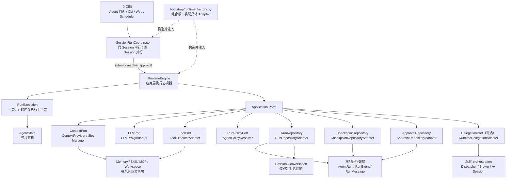
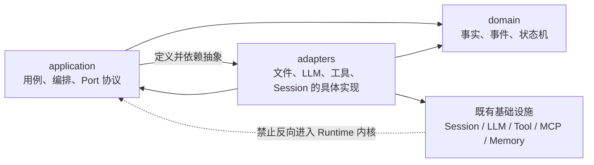
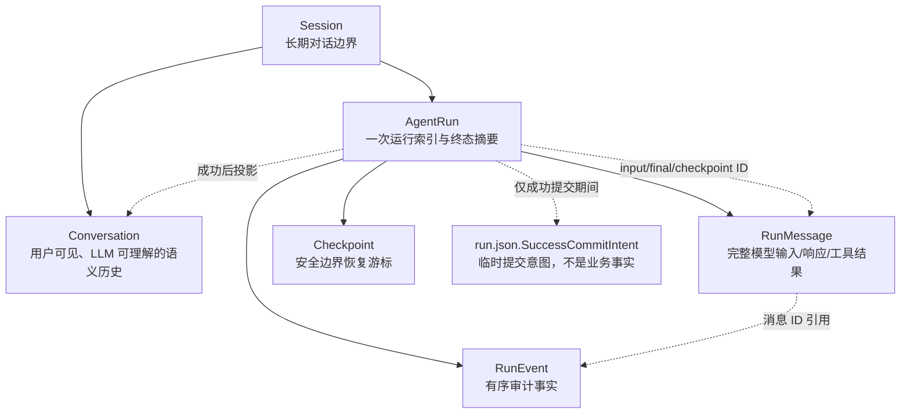
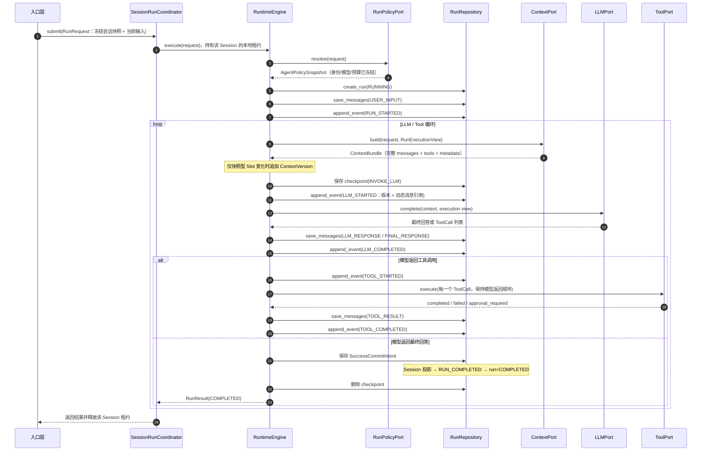
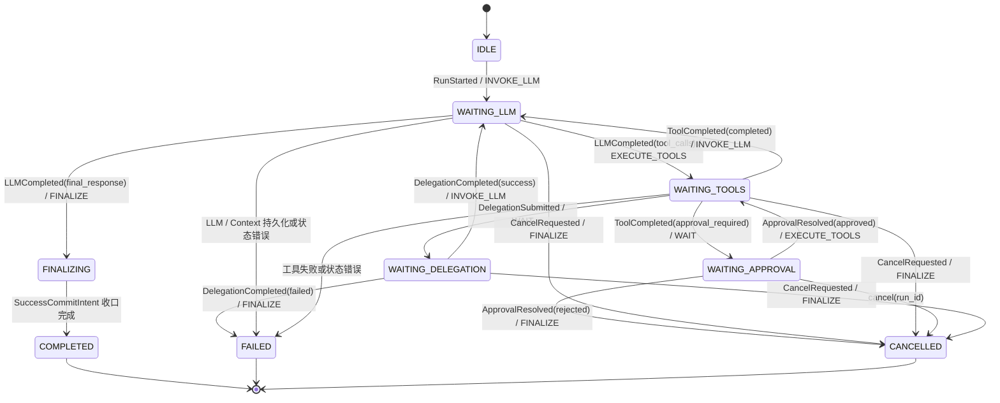
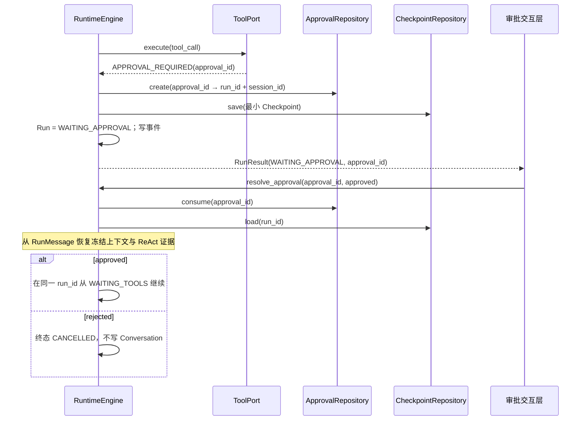
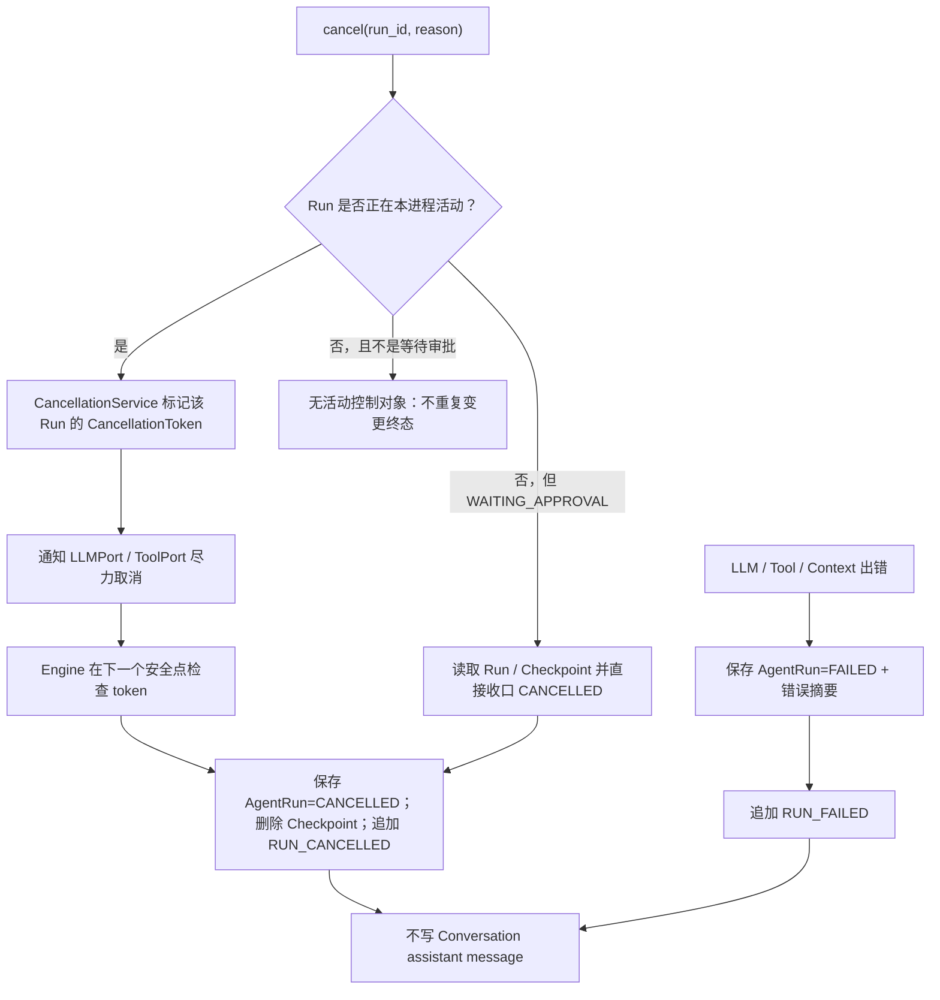
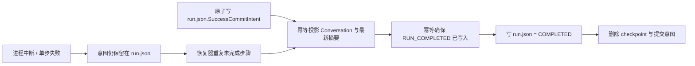

# Runtime 模块总体说明

> 适用实现：Runtime v4（Context E1–E6 已收口）
> 定位：共享的 Agent 执行机、运行控制器与事实提交协调器。  
> 设计原则：**每次执行独立、同会话串行、跨会话并行、事实与投影分离、从安全边界恢复、通过 Port 隔离基础设施。**

## 1. 一句话理解 Runtime

`RuntimeEngine` 不是“当前 Agent 的大管家”，而是无业务运行状态的执行协调器：它为每个请求新建一个短生命周期的 `RunExecution`，驱动纯 `AgentState` 状态机，调用上下文、模型、工具等抽象能力，并在明确的提交点保存运行事实。

因此，真正的隔离单位是：

```text
一个用户请求 → 一个 AgentRun → 一个 RunExecution → 一套独立的消息、事件与控制状态
```

同一 `RuntimeEngine` 实例可以服务多个 Session；运行中的消息、取消令牌、状态机和待审批数据都不存入 Engine 实例，而是归属于各自的 `RunExecution` 或持久化容器。

## 2. 顶层架构



### 2.1 依赖方向



图中的 `Application → Adapters` 表示**装配时的对象关系**；源码依赖中，Application 只依赖 `Protocol` 和 Domain 类型，不能 import Adapter 的具体实现。具体 Adapter 由组合根创建后注入 Application。

## 3. 代码树与层级职责

```text
src/dotclaw/
├── bootstrap/
│   └── runtime_factory.py
│       └── 唯一组合根：创建 Adapter，并注入 Engine / Coordinator
│
├── runtime/
│   ├── domain/                         # 运行领域的稳定事实与规则
│   │   ├── facts.py                    # AgentRun、RunMessage、RunCheckpoint、策略、状态枚举
│   │   ├── context.py                  # ContextVersion、Slot 快照、压缩候选
│   │   ├── events.py                   # DomainEvent、RunEvent、事件类型
│   │   ├── state.py                    # AgentState、AgentPhase、状态迁移
│   │   └── control.py                  # AgentAction
│   │
│   ├── application/                    # 一次运行如何被执行和协调
│   │   ├── dto.py                      # RunRequest、RunResult、ContextBundle、Tool DTO
│   │   ├── execution.py                # RunExecution、RunExecutionView、预算、取消令牌
│   │   ├── engine.py                   # RuntimeEngine：主循环、终态、恢复、取消
│   │   ├── context_budget.py           # 精确 Token 预算判断
│   │   ├── history_compaction.py       # Conversation 选择与滚动摘要
│   │   ├── ports.py                    # Repository / LLM / Tool / Context 等 Protocol
│   │   ├── request_factory.py          # 从既有 Session 构造冻结 RunRequest
│   │   ├── session_run_coordinator.py  # Session 串行协调
│   │   ├── approval_service.py         # approval_id 与 run 的受控关联
│   │   └── cancellation_service.py     # 活跃 Run 的取消令牌与子 Run 关联
│   │
│   └── adapters/                       # Port 的本地/既有系统实现
│       ├── run_repository.py           # JSON 运行仓储、未决成功提交补偿
│       ├── checkpoint_repository.py    # checkpoint.json
│       ├── approval_repository.py      # 审批记录
│       ├── llm_proxy_adapter.py        # 既有 LLMProxy → LLMPort
│       ├── llm_context_compactor.py    # 压缩用途 LLM 调用
│       ├── tiktoken_token_counter.py   # 精确 Token 统计
│       ├── tool_executor_adapter.py    # 既有 ToolExecutor → ToolPort
│       ├── agent_policy_resolver.py    # 配置 / Identity → 冻结策略
│       └── session_conversation_projector.py
│           └── 成功 Run → 既有 Session Conversation 的投影
│
├── context/                            # ContextPort 的实现细节，不属于 Runtime 内核
│   ├── contracts.py                     # Slot、Descriptor、Binding、Plan 契约
│   ├── defaults.py                      # 内置 Slot 注册与默认 Plan
│   ├── registry.py / plan_resolver.py   # 注册与有序 Plan 解析
│   ├── slot_manager.py / signals.py     # 缓存、刷新、释放与进程内信号
│   ├── provider.py                      # ContextBundle 物化与快照生成
│   ├── slots.py                         # 多 Owner 内置 Slot
│   └── ports.py                         # Memory、Skill、Registry 等依赖声明
│
└── orchestration/
    └── runtime_delegation_adapter.py    # 既有多 Agent 编排 → DelegationPort
```

### 3.1 Domain：放“事实与不变量”，不放执行技术

Domain 的模块应当在不启动文件系统、LLM、MCP、SessionManager 的情况下也能理解和测试。

| 类型 | 当前例子 | 职责 |
|---|---|---|
| 持久化事实 | `AgentRun`、`RunMessage`、`RunCheckpoint` | 描述已经发生或可恢复的运行事实 |
| 领域事件 | `RunStarted`、`LLMCompleted`、`ToolCompleted`、`ApprovalResolved` | 描述会触发状态变化的业务事实 |
| 状态机 | `AgentState` | 将“当前阶段 + 领域事件”转换为“新阶段 + 下一动作” |
| 枚举/值对象 | `RunStatus`、`RunError`、`ToolCall`、`AgentPolicySnapshot` | 统一可验证的语义与数据形状 |

Domain 不得依赖 LLM 客户端、工具执行器、文件路径、Session、Journal、任务调度器或 Repository。

### 3.2 Application：放“如何完成一次运行”

Application 是 Runtime 的用例层。它决定调用顺序、提交时机和失败分支，但不关心存到 JSON 还是数据库，也不认识具体模型 SDK。

| 模块 | 作用 | 不负责 |
|---|---|---|
| `RuntimeEngine` | 创建或恢复运行，驱动 LLM/Tool 循环，收口成功/失败/取消/审批 | 读取 Session 可变对象、拼 prompt、调用具体 SDK |
| `RunExecution` | 一次运行的内存事务：状态、消息游标、预算、取消令牌 | 长期持久化、跨 Run 任务管理 |
| `SessionRunCoordinator` | 同 Session 的串行入口与审批恢复串行化 | 状态机、checkpoint 内容、自然语言判断 |
| `ApprovalService` | 将有限选项的审批安全地关联回原 Run | 判断用户自然语言是否“算同意” |
| `CancellationService` | 管理活跃 Run 的取消令牌和父子取消映射 | 将取消令牌持久化为业务事实 |
| `ports.py` | 定义外部能力的最小接口 | 任何具体文件、SDK 或 UI 实现 |

`RunExecution` 放在 Application 而非 Domain，是因为它是短生命周期的**执行期上下文**：它包含取消令牌、消息游标和内存中的消息列表。这些是编排过程的可变控制数据，不是长期领域事实。

### 3.3 Adapters：放“怎么接入具体世界”

Adapter 将 Application Port 翻译为现有技术实现：

| Adapter | 实现的 Port | 隔离的具体细节 |
|---|---|---|
| `RunRepositoryAdapter` | `RunRepository` | JSON 文件、原子写、补偿提交、目录布局 |
| `CheckpointRepositoryAdapter` | `CheckpointRepository` | checkpoint 文件读写 |
| `ApprovalRepositoryAdapter` | `ApprovalRepository` | 审批记录的本地保存与原子消费 |
| `LLMProxyAdapter` | `LLMPort` | LLMProxy、模型供应商格式、取消调用 |
| `ToolExecutorAdapter` | `ToolPort` | 内置工具、MCP 工具与审批需求 |
| `AgentPolicyResolver` | `RunPolicyPort` | Identity、配置、工具目录与 Registry |
| `SessionConversationProjector` | `ConversationProjectionPort` | 既有 `SessionManager` 和 Conversation 存储 |
| `RuntimeDelegationAdapter` | `DelegationPort` | Dispatcher、Broker、子 Session、旧多 Agent 流程 |

这使得后续切换 SQLite/PostgreSQL、增加新的模型供应商或替换工具平台时，主要修改 Adapter 与组合根，Engine 和状态机无需重写。

## 4. Runtime 的核心容器与数据边界



| 容器 | 回答的问题 | 保存内容 | 不保存什么 |
|---|---|---|---|
| `Conversation` | 用户和 Agent 成功说了什么？ | 用户输入、成功 Run 的最终回答 | 工具过程、失败、审批、内部 prompt |
| `AgentRun` | 这一次是谁执行的、何时终止、结果概览？ | 归属、状态、策略快照、统计、错误摘要、消息/检查点引用 | 完整消息、事件副本、完整状态快照 |
| `RunMessage` | 模型和工具实际收发了什么？ | 用户输入、LLM 响应、tool result、委派结果 | Context Version、会话投影和恢复决策 |
| `ContextVersion` | 当前稳定上下文是什么？ | 快照型 Slot 的直接内容、内容 hash、工具 Schema hash | 动态 Run Message 正文 |
| `RunEvent` | 运行中按顺序发生了什么？ | `LLM_STARTED`、工具成对事件、状态事件、Message 引用 | 大 payload、完整 prompt、恢复快照 |
| `Checkpoint` | 能从哪个安全点继续？ | 状态、事件/消息游标、待审批工具、预算、活动 Context Version | 完整 prompt、完整工具输出、审计全历史 |
| `SuccessCommitIntent` | 成功提交是否需要补偿？ | `run.json` 中的最终 Conversation、候选和终态意图 | 任何长期业务事实 |

本地物理布局：

```text
data/sessions/{session_id}/
├── session.json              # Conversation 与已提交 history_compressions
└── agent_runs/{run_id}/
    ├── run.json                 # AgentRun 摘要、活动版本、staged 候选、成功意图
    ├── messages.json            # v4：RunMessage 与 ContextVersion
    ├── events.jsonl             # RunEvent 的追加日志
    ├── checkpoint.json          # 仅等待审批等安全边界时存在
```

## 5. 主业务流程

### 5.1 普通用户消息：总是创建新 Run



普通用户消息没有“自动续接旧 Run”的分支。LLM 若认为信息不足，应将澄清问题作为正常最终回复提交；用户下一条消息会创建新的 Run，再通过 Conversation 让模型自行理解它是补充还是新话题。

### 5.2 状态机与分支



`AgentState` 只根据领域事件做纯转换，不直接调用 LLM、工具或 Repository。`RuntimeEngine` 读取转换后给出的 `AgentAction`，再做实际 I/O。这是把“规则”与“副作用”拆开的关键。

### 5.3 审批：恢复原 Run，而不是创建新 Run



审批交互层只提交有限且结构化的决定；它不能自行指定要恢复哪个 Run。`ApprovalRepository.consume()` 让同一个 `approval_id` 只能被消费一次，防止重复恢复。

### 5.4 取消、失败与有副作用工具



恢复仅承诺发生在**安全边界**：完整 LLM 响应之后、完整工具调用结束之后、审批等待之前。对正在执行且有副作用的工具，系统不会凭 checkpoint 盲目重放；应由工具自身提供幂等键、外部状态查询或人工确认。

## 6. 关键可靠性设计与“小巧思”

### 6.1 冻结输入，消除并发中的“会话漂移”

入口层先构造 `RunRequest`，其中包含当前用户输入和 `ConversationSnapshot`。Engine 运行期间不重新读取可变 Session，因此另一个请求、配置更新或多 Agent 子运行不会让本次 prompt 在半途中改变。

同时，`RunPolicyPort` 在运行开始时解析并冻结 `AgentPolicySnapshot`：模型、Identity 版本、最大迭代数、工具和上下文策略都随 AgentRun 保存，便于复盘和恢复。

### 6.2 同 Session 串行、跨 Session 并行

`SessionRunCoordinator` 为每个 `session_id` 维护独立 `asyncio.Lock`：

```text
Session A: Run A1 ──完成──> Run A2
Session B: Run B1 ────────────────可与 A1 并行
```

这保证 Conversation 不需要做复杂的并发合并，同时不会把整个 Runtime 串行化。当前锁是**单进程内存租约**；多进程或多节点部署时必须将它替换为 Redis/数据库等分布式租约实现，不能误认为当前已经具备多节点高可用。

### 6.3 稳定快照与动态事实分离

`messages.json` v4 将上下文拆为两类事实：`ContextVersion` 只保存 Snapshot Slot，`run_messages` 则以 `LLM_STARTED.incremental_message_ids` 引用已持久化的动态 Run Message。普通 ReAct 中增加 LLM Response、Tool Result 不会创建冗余版本；仍可通过“Context Version + 引用消息”重建实际输入。

Engine 先保存 Run Message，再追加引用它的 `RunEvent`。工具调用还必须写成对的 `TOOL_STARTED` / `TOOL_COMPLETED`；完成状态使用独立的 `ToolAuditStatus`，可区分完成、审批、失败和取消，事件不重复保存工具参数或结果正文。

### 6.4 成功提交采用“可恢复意图”，避免半成功对用户可见

成功时需要同时形成三类事实：

```text
RUN_COMPLETED 事件 + Conversation 投影 + AgentRun=COMPLETED
```

文件系统没有跨文件事务，因此 Runtime 以 `run.json` 内的 `SuccessCommitIntent` 使用以下补偿协议：



这里 `run.json=COMPLETED` 是最后的可见完成标记。若 Conversation 投影失败，运行不会提前表现为“已完成但用户历史缺少最终回答”。补偿使用幂等检查，重复执行不会重复插入 Conversation。

### 6.5 Checkpoint 最小化：可恢复但不复制事实

Checkpoint 只保存恢复游标、纯状态、下一动作、预算、待处理控制引用和活动 Context Version；完整 prompt、工具结果等大内容只存在 `RunMessage` 或 Context Version。审批恢复时，Engine 用活动版本加动态 Run Message 重建执行上下文。

这避免了三份消息副本相互漂移，也降低了把敏感工具输出写进恢复快照的风险。

### 6.6 ReAct 证据连续：工具调用不会在下一轮“消失”

`RunExecutionView` 包含本 Run 已持久化的消息。`ContextProvider` 通过事实引用型 `run_messages` Slot 在下一次模型上下文中加入先前的 `LLM_RESPONSE`（含 tool calls）和 `TOOL_RESULT`。因此模型在工具返回后能看到自己刚刚发起的调用及其结果；审批恢复也使用同一份 RunMessage 证据，而不是空会话重启。

### 6.7 Context Slot 的隔离、降级和预算保护

`ContextSlotManager` 以 `(slot_id, owner, owner_key)` 管理实例缓存，并通过 `request_refresh()` 或进程内 `ContextSignalBus` 在下一 `LLM_STARTED` 安全点刷新。Run 终态、Session 删除或 Agent 卸载时，通过 `release_scope()` 释放对应实例。

Slot 明确声明 Owner、缓存范围、刷新策略、贡献 kind 和持久化模式。单个 Slot 加载异常以 `FAILED` 状态进入审计，其他 Slot 仍可继续生成上下文。

上下文预算由 tiktoken 的 `TokenCounterPort` 统计实际结构化输入；超限时只压缩最旧 75% 完整 Conversation，候选先暂存 Run，成功后才投影 Session。压缩后仍超限则明确失败，不静默截断。

### 6.8 取消和委派的边界清晰

取消令牌属于 `RunExecution`，而不是 Engine 的“当前运行”字段。Engine 通过 `CancellationService` 找到活动 token，并会向 LLMPort、ToolPort 发出 best-effort 取消；如果当前正在等待子运行，也会沿 `DelegationPort` 传播取消。

委派的 Dispatcher/Broker 细节被封装在 `RuntimeDelegationAdapter` 后。Engine 只知道“提交子执行、读取结果、取消子执行”，并把结果转换为领域事件和 `TOOL_RESULT`，从而避免 Runtime 重新耦合旧 orchestration。

## 7. 高可用、扩展与兜底能力的边界

### 7.1 当前已经具备的可用性基础

| 能力 | 当前实现 | 带来的效果 |
|---|---|---|
| 运行隔离 | 每 Run 独立 `RunExecution` | 不同 Session 不串状态，单 Run 失败不污染其他 Run |
| 会话顺序 | 单进程 Session 租约 | 同 Session 对话顺序稳定 |
| 成功提交补偿 | `SuccessCommitIntent` + 幂等恢复 | 防止成功事实与 Conversation 投影半提交 |
| 审批恢复 | Checkpoint + Context Version + RunMessage + 原 run_id | 进程重启后可从安全边界继续审批 Run |
| 审计可追溯 | `events.jsonl` 引用 v4 `messages.json` | 可定位稳定上下文、动态消息、工具结果和终态原因 |
| 上下文预算 | Slot 局部失败隔离、精确 Token 统计、staged 压缩 | 非关键来源故障或历史超限不会静默污染输入 |
| 外部依赖隔离 | Port + Adapter | 可替换存储、模型、工具和编排实现 |

### 7.2 当前不应夸大的能力

当前是本地文件存储与单进程租约架构，具备的是**可恢复性与故障隔离基础**，而不是完整的分布式高可用。以下能力仍是后续扩展项：

```text
多节点 Session 租约       → Redis / DB 分布式锁与 fencing token
多节点审批消费            → 事务数据库或带条件更新的 KV 存储
运行仓储高可用             → SQLite/PostgreSQL / 对象存储 Adapter
长时间后台执行             → 队列、worker、心跳与 lease 续租
正在执行的副作用工具恢复  → 工具幂等键、查询接口、人工确认协议
观测平台                   → 从 RunEvent 订阅构建 Trace / OpenTelemetry 投影
```

这些演进都应在 Port 边界外完成；不要为了增加某项基础设施能力，把 Session、数据库客户端或队列直接重新塞进 `RuntimeEngine`。

## 8. 维护约束与扩展指南

### 8.1 新需求应放在哪里？

| 需求 | 应放位置 |
|---|---|
| 新的状态转换规则 | `runtime/domain/state.py` 与对应 DomainEvent |
| 新的运行流程或提交分支 | `runtime/application/engine.py` |
| 新模型供应商 | 新 `LLMPort` Adapter |
| 新工具平台或审批策略 | 新/扩展 `ToolPort` Adapter |
| 新存储介质 | `RunRepository`、`CheckpointRepository`、`ApprovalRepository` 的 Adapter |
| 新上下文来源 | `context/` 中的 Slot；通过 `ContextPort` 输出 |
| 新的多 Agent 编排实现 | `DelegationPort` Adapter |
| Trace、监控、UI 时间线 | 订阅/读取 `RunEvent`，不能成为运行事实源 |

### 8.2 必须保持的不变量

1. 同一 Session 的普通请求不得同时执行；不同 Session 允许并发。
2. `RuntimeEngine` 不保存 `_current_agent`、`_current_session_id` 等 run 级字段。
3. `AgentState` 不依赖 LLM、Tool、Repository、Session、Task 或 Journal。
4. 只有成功 Run 可以写 Conversation；失败、取消、审批等待不得写 assistant 对话记录。
5. `RunEvent.message_ids` 必须都能在同一 Run 的 `RunMessage` 中找到；每个已开始工具调用必须有唯一完成事件。
6. Checkpoint 不保存完整 prompt 或完整工具结果；Context Version 不保存事实引用型 Run Message。
7. 审批只能通过有效、未消费的 `approval_id` 恢复原 `run_id`。
8. Slot 缓存不得跨 agent、session、run 作用域泄漏。
9. Runtime 不通过 Journal 保存或读取恢复状态。
10. 有副作用工具不自动盲目重放。

### 8.3 排障入口顺序

当一次运行异常时，建议按以下顺序查看：

```text
1. run.json
   └─ 状态、错误摘要、final_message_id、活动 Context Version、staged 候选、策略快照
2. events.jsonl
   └─ 确认运行走到哪个边界、LLM_STARTED、工具成对事件和事件序号
3. messages.json
   └─ 查看 Context Version、动态 Run Message、模型 tool call、工具结果和最终回复
4. checkpoint.json（若存在）
   └─ 判断是否正等待审批、恢复游标与 pending 工具
5. session.json
   └─ 查看已提交 Conversation 与 history_compressions；成功意图仍在 run.json 中等待幂等补偿
```

## 9. 与旧架构的根本差异

```text
旧模式：Runtime 持有当前 Agent / Session / Journal / Snapshot / Context
       → 单对象膨胀、跨会话串扰风险、恢复与观测混在一起

新模式：RuntimeEngine 只编排
       RunExecution 持有一次运行的临时状态
       Domain 定义状态机和事实
       Ports 隔离外部系统
       Adapter 负责具体实现
       Repository 在提交点保存可追溯、可恢复的事实
```

这套结构的价值不在于目录名称本身，而在于未来新增模型、工具、存储、上下文来源或多 Agent 能力时，仍能保持：**执行流程只有一个中心，运行状态只有一个归属，持久化容器各自只回答一个问题。**
