# Runtime 模块总体说明

> 适用代码：`aandbcct/dotClaw` 的 `master` 分支  
> 扫描基准：2026-07-24，包含 ApplicationHost 收口、ContextVersion、确定性 Token 预算、staged 历史压缩与 reasoning/response 双通道输出  
> 文档定位：自顶向下解释 Runtime 在系统中的位置、逻辑组件、核心类、运行事实、依赖与恢复流程，并记录当前设计取舍、真实痛点和演进方向。  
> 编写基准：《dotClaw Wiki 编写规范与验收准则 v1.1》  
> 上级导航：[dotClaw 开发者 Wiki](./README.md)

> **状态模型说明**：本文档状态机相关章节（第 4/5/6/8 节）已按「状态机分层重构」**之后**的口径编写。当前唯一持久化控制状态位于 `domain/state.py` 的 `AgentRunState`，状态迁移由纯函数 `transition()` 定义，是合法状态变化的唯一事实来源。详细设计与迁移计划见 `docs/Development/runtime/statemachine/状态机分层重构总体设计.md` 与 `状态机分层重构开发计划.md`。


**快速导航**

| 需要回答的问题 | 阅读位置 |
|---|---|
| Runtime 为什么存在、与 Session/Agent/Context 如何分工 | 第 1～2 节 |
| Runtime 有哪些逻辑组件 | 第 3 节 |
| 每个组件有哪些核心类、协议和数据对象 | 第 4 节 |
| 普通执行、审批、压缩、恢复、提交和委派如何运行 | 第 5 节 |
| Run、Message、Event、ContextVersion、Checkpoint 如何分工 | 第 6 节 |
| 修改某项功能从哪里开始 | 第 7 节 |
| 当前设计为何如此、存在哪些问题、如何演进 | 第 8 节 |
| 具体源码在哪里 | 第 9 节 |

```text
Session / Identity
→ SessionRunCoordinator
→ RuntimeEngine + RunExecution
→ Context / LLM / Tool / Delegation Ports
→ RunMessage / RunEvent / Checkpoint
→ SuccessCommitIntent
→ Session Conversation
```

阅读时应先区分三个层次：

- `AgentRunState`（`domain/state.py`）：唯一持久化控制状态，由生命周期（Created/Running/Suspended/Ended）、执行阶段（RunStage）、等待原因（SuspendReason）与终态结果（RunOutcome）组合而成；
- `RunExecution`：单次执行的易变运行态（上下文版本、迭代计数、安全预算等）；
- `Session Conversation`：仅由成功 Run 投影的长期对话语义。

---

## 1. 模块定位与边界

Runtime 是 dotClaw 的**执行内核**。它接收已经确定 Session、Agent Identity、用户输入和历史快照的 `RunRequest`，为本次请求创建独立的 `AgentRun` 与 `RunExecution`，驱动 Context、LLM、Tool 和 Delegation，直到运行成功、失败、取消、等待审批、中断或放弃。

Runtime 解决的核心问题不是“如何调用一次大模型”，而是：

> 如何把一次可能包含多轮 LLM、工具调用、审批、上下文压缩和子 Agent 委派的请求，组织成隔离、可审计、可恢复且提交边界明确的 AgentRun。

### 1.1 核心职责

Runtime 的稳定职责可归纳为七组：

1. **运行隔离与协调**：每次请求创建独立 RunExecution，共享 Engine 不保存当前 Session 或当前 Agent。
2. **Session 级顺序**：同一 Session 的普通执行串行，不同 Session 可以并行。
3. **状态与外部能力驱动**：使用 `AgentRunState` 状态机约束流程，由 Engine 调用 Context、LLM、Tool 和 Delegation Ports。
4. **运行事实管理**：保存 AgentRun、RunMessage、RunEvent、ContextVersion 和最小 Checkpoint。
5. **暂停、恢复与取消**：处理审批、中断重试、放弃、进程重启遗留 Run 和尽力取消。
6. **上下文预算保护**：使用显式 tokenizer 对 Runtime 当前可计数的输入组成进行确定性统计，必要时暂存历史压缩候选。
7. **成功语义提交**：通过 SuccessCommitIntent 幂等补齐 Conversation、完成事件和 Run 终态。

reasoning 和 response 的增量输出通过 `LLMOutputPort` 交给入口层；reasoning 不成为 Conversation 或恢复事实。

### 1.2 主要使用者

| 使用者 | 如何使用 Runtime |
|---|---|
| `SessionInteractionService` | 按 `session.agent_id` 路由 Identity，冻结并提交 `RunRequest` |
| Channel / CLI | 提交普通消息与控制事件，消费 `RunResult` 和运行级输出事件 |
| Orchestration | 通过 `DelegationPort` 创建和等待子 Run |
| ApplicationHost | 创建 Runtime 的 Port、Adapter、Repository 和生命周期资源 |
| Context | 根据 `RunRequest` 与 `RunExecutionView` 构造模型输入 |
| LLM / Tool | 作为 Runtime 调用的外部能力，经 Adapter 实现 Port |
| Session | 仅在成功提交时接收 Conversation 和最新历史压缩投影 |

### 1.3 明确不负责的内容

Runtime 不负责：

1. CLI 命令解析、自然语言审批判断或最终界面渲染；
2. 具体 LLM Provider 的路由、协议、重试、限流和熔断；
3. Tool 的声明、Capability、Policy、Handler 和 MCP 连接生命周期；
4. Context Slot、Memory、Skills 和 Agent Identity 的具体加载实现；
5. 将 Journal、Channel 输出或 reasoning 作为恢复事实源；
6. 跨进程、多节点 Session 租约和分布式事务；
7. 有副作用 Tool 的跨崩溃 exactly-once 或正在执行操作的强制终止。

### 1.4 与相邻模块的职责边界

| 相邻模块 | Runtime 负责 | 相邻模块负责 |
|---|---|---|
| Bootstrap | 定义所需 Port 和运行服务 | 创建具体实现、首次恢复和逆序关闭 |
| Session | 冻结历史输入并在成功后投影 Conversation | 保存长期会话、标题、Identity 绑定和成功语义 |
| Agent | 保存 Run 的不可变策略快照 | 定义 Identity、模型、提示词、工具白名单和 Context Plan |
| Context | 规定构建时机、版本和预算安全点 | 加载 Slot、组装消息、工具和动态事实引用 |
| LLM | 规定标准调用、输出与错误边界 | Provider 路由、协议适配、reasoning 解析、重试和降级 |
| Tool | 规定 Tool Call 的执行、审批需求和结果 DTO | 参数校验、Capability、Policy、Handler 和外部调用 |
| Orchestration | 提交、等待和取消子执行 | Task、Broker、目标 Session 和子 Run 映射 |
| Channel | 提供运行级输出端口和结构化控制输入 | 用户交互、增量展示和最终结果渲染 |
| Journal | 不依赖其恢复运行 | 可选观测、报告和额外 Trace 投影 |

## 2. 模块在项目中的位置

### 2.1 全局位置图

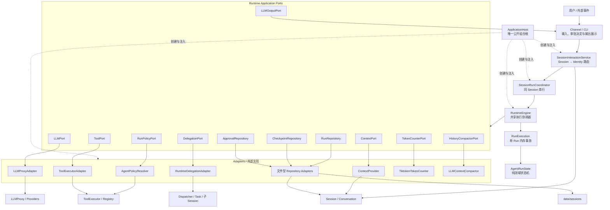
```mermaid
flowchart TB
    User["用户 / 外部事件"]
    Channel["Channel / CLI<br/>输入、审批决定与输出展示"]
    App["SessionInteractionService<br/>Session → Identity 路由"]
    Coordinator["SessionRunCoordinator<br/>同 Session 串行"]
    Engine["RuntimeEngine<br/>共享执行协调器"]
    Execution["RunExecution<br/>单 Run 内存事务"]
    State["AgentRunState<br/>纯领域状态机"]

    subgraph Ports["Runtime Application Ports"]
        PolicyPort["RunPolicyPort"]
        ContextPort["ContextPort"]
        LLMPort["LLMPort"]
        OutputPort["LLMOutputPort"]
        ToolPort["ToolPort"]
        DelegationPort["DelegationPort"]
        RunRepo["RunRepository"]
        CheckpointRepo["CheckpointRepository"]
        ApprovalRepo["ApprovalRepository"]
        TokenPort["TokenCounterPort"]
        CompactorPort["HistoryCompactorPort"]
    end

    subgraph Adapters["Adapters / 外部实现"]
        PolicyAdapter["AgentPolicyResolver"]
        ContextAdapter["ContextProvider"]
        LLMAdapter["LLMProxyAdapter"]
        ToolAdapter["ToolExecutorAdapter"]
        DelegationAdapter["RuntimeDelegationAdapter"]
        FileRepos["文件型 Repository Adapters"]
        TokenAdapter["TiktokenTokenCounter"]
        CompactorAdapter["LLMContextCompactor"]
    end

    Session["Session / Conversation"]
    LLM["LLMProxy / Providers"]
    Tool["ToolExecutor / Registry"]
    Orchestration["Dispatcher / Task / 子 Session"]
    Storage["data/sessions"]
    Host["ApplicationHost<br/>唯一公开组合根"]

    User --> Channel
    Channel --> App
    App --> Coordinator
    Coordinator --> Engine
    Engine --> Execution
    Execution --> State
    Engine --> Ports

    PolicyPort --> PolicyAdapter
    ContextPort --> ContextAdapter
    LLMPort --> LLMAdapter
    OutputPort --> Channel
    ToolPort --> ToolAdapter
    DelegationPort --> DelegationAdapter
    RunRepo --> FileRepos
    CheckpointRepo --> FileRepos
    ApprovalRepo --> FileRepos
    TokenPort --> TokenAdapter
    CompactorPort --> CompactorAdapter

    App --> Session
    PolicyAdapter --> Tool
    ContextAdapter --> Session
    LLMAdapter --> LLM
    ToolAdapter --> Tool
    DelegationAdapter --> Orchestration
    FileRepos --> Storage
    FileRepos --> Session

    Host -.创建与注入.-> App
    Host -.创建与注入.-> Coordinator
    Host -.创建与注入.-> Engine
    Host -.创建与注入.-> Adapters
```

**结论：**

- 普通请求的应用入口是 `SessionInteractionService`，不是 `RuntimeEngine` 的直接 UI 调用。
- `SessionRunCoordinator` 位于应用入口与 Engine 之间，负责 Session 级顺序。
- `RuntimeEngine` 是单次 Run 的执行协调中心，但不持有“当前 Session”或“当前 Agent”的共享状态。
- 单次运行的可变控制数据归属 `RunExecution`，长期事实归属 Repository。
- Runtime Application 只依赖 Port 和 Domain 类型；具体模块通过 Adapter 接入。
- `ApplicationHost` 可以依赖所有具体实现，因为它是唯一公开组合根。

### 2.2 一次普通请求在系统中的位置

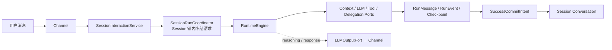
```mermaid
flowchart LR
    User["用户消息"] --> Channel["Channel"]
    Channel --> App["SessionInteractionService"]
    App --> Coord["SessionRunCoordinator<br/>Session 锁内冻结请求"]
    Coord --> Engine["RuntimeEngine"]
    Engine --> Ports["Context / LLM / Tool / Delegation Ports"]
    Ports --> Facts["RunMessage / RunEvent / Checkpoint"]
    Facts --> Commit["SuccessCommitIntent"]
    Commit --> Session["Session Conversation"]
    Engine -.reasoning / response.-> Output["LLMOutputPort → Channel"]
```

**结论：**

- 发起者是 Channel，应用入口是 `SessionInteractionService`，执行协调者是 `RuntimeEngine`。
- `SessionRunCoordinator` 在获取 Session 锁后才冻结 `RunRequest`，避免并发请求基于同一历史版本运行。
- 普通用户消息总是创建新 Run；只有审批恢复、重试、放弃和取消会定位已有 Run。
- Tool、LLM、Context 和 Delegation 不能直接修改 AgentRun 或 Session Conversation。
- response 成功后才能投影 Conversation；reasoning 只沿输出端口返回。

### 2.3 reasoning 与 response 的输出边界

最新 Runtime 将模型增量输出区分为两类：

```text
reasoning_delta
→ 仅通过 LLMOutputPort 实时交给入口层
→ 不聚合进 RunMessage.content
→ 不进入 Conversation
→ 不进入后续 Context

response_delta
→ 通过 LLMOutputPort 实时交给入口层
→ 同时聚合为完整 assistant RunMessage
→ 成功后投影到 Conversation
→ 可进入后续 Context
```

因此，`LLMOutputPort` 是**运行级输出通道**，不是 Runtime 事实仓储。`RunResult.has_streamed_response` 只用于避免入口层在已经增量展示 response 后重复输出最终正文。

### 2.4 依赖方向

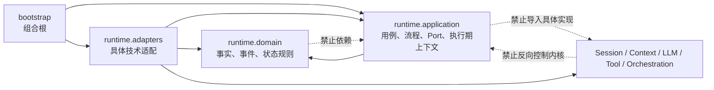
```mermaid
flowchart LR
    Domain["runtime.domain<br/>事实、事件、状态规则"]
    Application["runtime.application<br/>用例、流程、Port、执行期上下文"]
    Adapters["runtime.adapters<br/>具体技术适配"]
    External["Session / Context / LLM / Tool / Orchestration"]
    Bootstrap["bootstrap<br/>组合根"]

    Application --> Domain
    Adapters --> Application
    Adapters --> Domain
    Adapters --> External
    Bootstrap --> Application
    Bootstrap --> Adapters

    Domain -.禁止依赖.-> Application
    Application -.禁止导入具体实现.-> External
    External -.禁止反向控制内核.-> Application
```

源码层面的约束是：

1. Domain 不依赖 Application、Adapter 或外部模块。
2. Application 定义 Port，不导入具体 Adapter。
3. Adapter 可以依赖 Runtime 契约和外部模块。
4. Bootstrap 创建对象并连接依赖。
5. Context、LLM、Tool 和 Orchestration 不得直接修改 `AgentRunState` 或 `AgentRun`。

---

## 3. 组件总览

Runtime 的组成部分按职责分为执行核心、控制与可靠性、外部接入和生命周期支撑。部分重要类型物理上位于 `bootstrap/`、`context/` 或 `orchestration/`，但必须在 Runtime 文档中说明其接入角色，否则无法理解完整执行链。

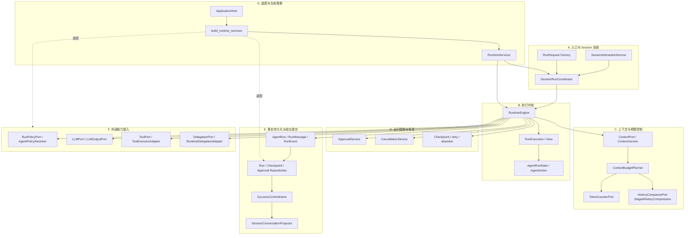
```mermaid
flowchart TB
    subgraph Entry["A. 入口与 Session 协调"]
        Interaction["SessionInteractionService"]
        RequestFactory["RunRequest Factory"]
        Coordinator["SessionRunCoordinator"]
    end

    subgraph Core["B. 执行内核"]
        Engine["RuntimeEngine"]
        Execution["RunExecution / View"]
        State["AgentRunState / AgentAction"]
    end

    subgraph ContextControl["C. 上下文与预算控制"]
        ContextPort["ContextPort / ContextVersion"]
        Budget["ContextBudgetPlanner"]
        Token["TokenCounterPort"]
        Compaction["HistoryCompactorPort<br/>StagedHistoryCompression"]
    end

    subgraph Control["D. 运行控制与恢复"]
        Approval["ApprovalService"]
        Cancellation["CancellationService"]
        Recovery["Checkpoint / retry / abandon"]
    end

    subgraph Facts["E. 事实持久化与成功提交"]
        RunFacts["AgentRun / RunMessage / RunEvent"]
        Repositories["Run / Checkpoint / Approval Repositories"]
        Commit["SuccessCommitIntent"]
        Projection["SessionConversationProjector"]
    end

    subgraph Integrations["F. 外部能力接入"]
        Policy["RunPolicyPort / AgentPolicyResolver"]
        LLM["LLMPort / LLMOutputPort"]
        Tool["ToolPort / ToolExecutorAdapter"]
        Delegation["DelegationPort / RuntimeDelegationAdapter"]
    end

    subgraph Lifecycle["G. 装配与生命周期"]
        Services["RuntimeServices"]
        Factory["build_runtime_services"]
        Host["ApplicationHost"]
    end

    Interaction --> Coordinator
    RequestFactory --> Coordinator
    Coordinator --> Engine
    Engine --> Execution
    Execution --> State

    Engine --> ContextPort
    ContextPort --> Budget
    Budget --> Token
    Budget --> Compaction

    Engine --> Approval
    Engine --> Cancellation
    Engine --> Recovery

    Engine --> RunFacts
    RunFacts --> Repositories
    Repositories --> Commit
    Commit --> Projection

    Engine --> Policy
    Engine --> LLM
    Engine --> Tool
    Engine --> Delegation

    Host --> Factory
    Factory --> Services
    Services --> Coordinator
    Services --> Engine
    Factory -.装配.-> Integrations
    Factory -.装配.-> Repositories
```

### 3.1 组成部分与责任

| 层级 | 组成部分 | 稳定职责 | 主要入口 |
|---|---|---|---|
| 入口与协调 | Session 交互入口 | Session → Identity 路由和控制用例 | `SessionInteractionService` |
| 入口与协调 | 请求冻结 | 从 Session 复制不可变历史视图 | `create_run_request` |
| 入口与协调 | Session 租约 | 同 Session 串行、跨 Session 并行 | `SessionRunCoordinator` |
| 执行内核 | 运行协调器 | 创建、恢复并驱动一个 Run | `RuntimeEngine` |
| 执行内核 | 执行期事务 | 保存一次 Run 的内存控制数据 | `RunExecution` |
| 执行内核 | 状态规则 | 领域事件 → 新状态与下一动作 | `AgentRunState` / `transition()` |
| 上下文控制 | Context 版本 | 冻结 LLM 调用前的稳定 Slot | `ContextVersion` |
| 上下文控制 | Token 预算 | 确定性判断继续、压缩或拒绝 | `ContextBudgetPlanner` |
| 上下文控制 | 历史压缩 | 生成、暂存并成功后提交摘要 | `HistoryCompactorPort` |
| 运行控制 | 审批 | approval_id 与原 Run 的一次性关联 | `ApprovalService` |
| 运行控制 | 取消 | 活动 Run 令牌和父子取消映射 | `CancellationService` |
| 运行控制 | 中断恢复 | 安全边界重试或放弃 | `resume_run`（恢复边界） |
| 事实持久化 | 运行事实 | Run 摘要、消息、事件、Checkpoint | Domain facts + Repository |
| 事实持久化 | 成功提交 | 文件系统上的可恢复多事实提交 | `SuccessCommitIntent` |
| 外部接入 | 运行策略 | 冻结 Identity、模型、工具和预算 | `AgentPolicyResolver` |
| 外部接入 | 模型与输出 | 模型调用、reasoning/response 输出 | `LLMProxyAdapter` |
| 外部接入 | 工具 | Tool 执行和结构化审批需求 | `ToolExecutorAdapter` |
| 外部接入 | 委派 | 目标 Session、Task 和子 Run | `RuntimeDelegationAdapter` |
| 生命周期 | Runtime 装配 | 创建 Port 实现并双向绑定委派 | `build_runtime_services` |
| 生命周期 | 进程生命周期 | 启动恢复和资源逆序关闭 | `ApplicationHost` |

---

## 4. 各组件的类与职责

本节从逻辑组件进入核心类、协议、数据对象和重要实现细节。每个重要类或子部分先说明职责、存在原因和调用链位置，再展开字段、行为与边界。

### 4.1 入口与 Session 协调

#### 4.1.1 `SessionInteractionService`

**职责与用途：**`SessionInteractionService` 是 Runtime 的应用级会话入口。它解决“外部只知道 Session，而 Runtime 必须得到明确 Agent Identity 和冻结 RunRequest”的问题，位于 Channel 与 `SessionRunCoordinator` 之间。

它负责：

- 加载或校验 Session；
- 以 `session.agent_id` 为权威，在 `AgentRegistry` 中验证 Identity；
- 创建 Session 时显式写入 Identity；
- 将普通消息包装为延迟执行的 `RunRequest` Factory；
- 将审批、取消、重试和放弃交给 Coordinator；
- 协调 Session 物理删除、审批清理和 Context 缓存释放；
- 返回 `RunResult`，不自行渲染。

它不负责：

- 构造运行时 Agent 门面；
- 直接调用 LLM、Tool 或 MCP；
- 持有 Runtime 状态；
- 判断自然语言是否表示审批；
- 在普通提交时绕过 Session 锁。

普通提交使用 `submit_prepared()`，请求在获得 Session 锁之后才冻结。这防止两个并发请求同时基于同一 Conversation 版本生成快照。

#### 4.1.2 `create_run_request` 与 `ConversationSnapshot`

**职责与用途：**请求工厂将可变 Session 数据复制为 Runtime 可独立使用的不可变输入。它让 Engine 在运行期间不需要重新读取 Session，从而避免 Conversation、历史压缩版本或 Identity 在半途中变化。

生成的 `RunRequest` 包含：

```text
session_id
lease_id
agent_id
本次 user_message
ConversationSnapshot
parent_run_id / root_run_id
可选预分配 run_id
```

`ConversationSnapshot` 只保留：

- 活动历史压缩摘要；
- 压缩边界之后仍需原文注入的 Conversation；
- 冻结时的 Conversation 版本。

它不是 Session 持久化实体，也不允许 Engine 反向修改 Session。

#### 4.1.3 `SessionRunCoordinator`

**职责与用途：**`SessionRunCoordinator` 是 Session 级串行边界。它避免同一 Conversation 被两个 Run 并发读取和提交，同时保留不同 Session 的并行能力。

内部结构：

```text
dict[session_id, asyncio.Lock]
+ 一个保护锁表的 _locks_guard
+ RuntimeControlPort
```

主要行为：

| 方法 | 作用 |
|---|---|
| `submit()` | 已有 RunRequest 的普通提交 |
| `submit_prepared()` | 在 Session 锁内冻结请求并执行 |
| `resolve_approval()` | 在审批所属 Session 锁内恢复 |
| `cancel()` | 不等待 Session 锁，立即发送取消 |
| `_prepare_new_request()` | 查询活动 Run：`AgentRunState` 非终态即视为占用并拒绝或返回 `SESSION_BUSY`，终态 Run 才允许新请求 |

取消不能等待当前 Run 正持有的 Session 锁，否则会形成：

```text
Run 持锁等待外部调用结束
→ 取消操作等待同一锁
→ Run 又依赖取消信号才能尽快退出
```

因此 `cancel()` 是特殊的旁路控制。

当前锁只存在于单进程内。Repository 中的活动 Run 检查可以发现持久化冲突，但不是跨进程原子租约。

---

### 4.2 执行内核

#### 4.2.1 `RuntimeEngine`

**职责与用途：**`RuntimeEngine` 是 Runtime Application 的主协调器。它为每次请求创建或恢复局部 `RunExecution`，按确定顺序调用 Port、持久化事实并收口终态，但自身不保存任何单次 Run 的共享状态。

构造依赖：

```text
RunRepository
CheckpointRepository
ContextPort
LLMPort
ToolPort
RunPolicyPort
ApprovalService
CancellationService
DelegationPort
TokenCounterPort
HistoryCompactorPort
```

核心公开用例：

| 方法 | 语义 |
|---|---|
| `execute()` | 创建新 Run 并执行 |
| `resolve_approval()` | 消费审批并恢复原 Run |
| `cancel()` | 尽力取消活动、等待审批或子 Run |
| `recover_session()` | 扫描遗留非终态 Run 并交由恢复边界按 Checkpoint 重放，不再改写状态 |
| `active_run()` | 查询 Session 当前唯一非终态 Run（按 `AgentRunState.is_ended()` 判断） |

`RuntimeEngine` 的基本工作方式是：

```text
读取 AgentRunState
→ 执行当前阶段需要的副作用（由 transition() 返回的 AgentAction 决定）
→ 将结果转换为 DomainEvent
→ transition(state, event) → (next state, next action)
→ 持久化新 AgentRunState + Checkpoint（action 与之匹配）
→ 进入下一轮
```

Engine 不应：

- 保存 `_current_session` 或 `_current_agent`；
- 直接 import 具体 Provider、ToolHandler 或 SessionManager；
- 将 Channel 交互混入主循环；
- 将 Journal 当作运行事实；
- 在不安全边界盲目重放 Tool。

#### 4.2.2 `RunExecution`

**职责与用途：**`RunExecution` 是一次 AgentRun 的短生命周期内存事务对象。它承载主循环所需的可变控制数据，避免这些字段进入共享 Engine，也避免把每次状态更新都立即建模为长期实体。

主要字段：

| 字段 | 用途 |
|---|---|
| `run_id` | 当前运行标识 |
| `request` | 冻结输入；历史压缩时可替换为重建请求 |
| `policy` | 本 Run 的不可变策略 |
| `state` | 当前 `AgentState` |
| `budget` | 运行预算控制对象 |
| `message_cursor` | 已保存消息游标 |
| `cancellation` | 当前 Run 的取消令牌 |
| `pending_control` | 等待审批或委派的最小引用 |
| `run_messages` | 已持久化 ReAct 证据 |
| `has_streamed_response` | 是否已输出 response 增量 |
| `active_context_version` | 当前活动上下文版本 |
| `staged_history_compressions` | 未提交到 Session 的候选 |
| `replay_active_context` | 恢复时是否重放活动版本 |
| `context_budget_decision` | 最近一次预算结论 |

它在 Run 结束后销毁。长期恢复所需内容必须存在于 Repository，而不能依赖仍在内存中的 `RunExecution`。

#### 4.2.3 `RunExecutionView`

**职责与用途：**`RunExecutionView` 是提供给 Port 的只读执行视图。它防止 Context、LLM、Tool 或 Delegation 实现直接修改 Runtime 的内部事务状态。

Port 可以读取：

- run_id 和 session_id；
- 冻结 Policy；
- 当前状态与预算；
- 已保存 RunMessage；
- 活动 ContextVersion；
- staged 压缩引用；
- 恢复重放标记。

Port 不应获得：

- Repository 写权限；
- 状态转换方法；
- Session 可变对象；
- Engine 内部循环控制。

#### 4.2.4 `AgentRunState` 与 `AgentAction`

**职责与用途：**`AgentRunState` 是 AgentRun 的单一持久化控制状态，由 `domain/state.py` 以 `@dataclass(frozen=True)` 定义。它将“当前最小控制状态 + 已发生领域事件”转换为“新状态 + Application 下一动作”，用于隔离流程规则与 I/O 副作用；状态迁移由纯函数 `transition(state, event) -> StateTransition` 计算，是合法状态变化的唯一事实来源。

`AgentRunState.mode` 是一个判别联合，恰好取以下之一：

```text
Created        # 运行已持久化但尚未开始（无业务字段）
Running        # 正在执行；持有 RunStage 子阶段
Suspended      # 等待外部输入；持有 SuspendReason + control_id + resume_stage
Ended          # 终态；保留 RunOutcome 与最终统计
```

辅助类型：

```text
RunStage       # PREPARING / CALLING_LLM / EXECUTING_TOOLS
SuspendReason  # APPROVAL / DELEGATION
RunOutcome     # COMPLETED / FAILED / CANCELLED / ABANDONED
Created()                                  # 运行已持久化但未开始
Running(stage)                             # 执行中，stage 为当前子阶段
Suspended(reason, control_id, resume_stage) # 等待外部输入
Ended(outcome)                             # 终态
StateTransition(state, action)             # 一次迁移的结果
```

`AgentRunState` 的主要方法：`is_ended()`、`is_active()`、`is_suspended()`、`is_waiting_approval()`、`is_waiting_delegation()`、`is_abandoned()`、`outcome() -> RunOutcome | None`、`describe()`。

`AgentAction`（来自 `domain/control.py`）表达迁移后的下一步执行动作：

```text
INVOKE_LLM      # 调用业务模型
EXECUTE_TOOLS   # 执行工具批次
FINALIZE        # 收口终态（由对应 action 方法返回 RunResult）
SUSPEND         # 挂起等待外部输入（由对应 action 方法返回 RunResult）
HANDOFF_TARGET  # 向目标 Agent 委派
```

典型迁移（由 `transition()` 定义）：

```text
Created + RunStarted
  → Running(CALLING_LLM)，action = INVOKE_LLM，iteration = 1

Running(CALLING_LLM) + LLMResponseProduced(final=True)
  → Ended(COMPLETED)，action = FINALIZE
Running(CALLING_LLM) + LLMResponseProduced(final=False)
  → Running(EXECUTING_TOOLS)，action = EXECUTE_TOOLS
Running(CALLING_LLM) + LLMCallFailed
  → Ended(FAILED)，action = FINALIZE

Running(EXECUTING_TOOLS) + ToolBatchCompleted
  → Running(CALLING_LLM)，action = INVOKE_LLM，iteration + 1
Running(EXECUTING_TOOLS) + ToolApprovalRequired
  → Suspended(APPROVAL, approval_id, EXECUTING_TOOLS)，action = SUSPEND
Running(EXECUTING_TOOLS) + ToolBatchFailed
  → Ended(FAILED)，action = FINALIZE
Running(EXECUTING_TOOLS) + DelegationRequested
  → 状态不变 Running(EXECUTING_TOOLS)，action = HANDOFF_TARGET
    （Engine 随后提交子 Run，委派期间状态保持 Running）
Running(EXECUTING_TOOLS) + DelegationSubmitted
  → Suspended(DELEGATION, child_run_id, CALLING_LLM)，action = SUSPEND

Suspended(APPROVAL) + ApprovalGranted(approval_id 匹配 control_id)
  → Running(EXECUTING_TOOLS)，action = EXECUTE_TOOLS
Suspended(APPROVAL) + ApprovalRejected(approval_id 匹配 control_id)
  → Ended(CANCELLED)，action = FINALIZE

Suspended(DELEGATION) + DelegationCompleted(child_run_id 匹配 control_id)
  → Running(CALLING_LLM)，action = INVOKE_LLM，iteration + 1

控制事件（任意非终态均有效）：
  CancelRequested   → Ended(CANCELLED)，action = FINALIZE
  TimeoutReached    → Ended(FAILED)，action = FINALIZE
  AbandonRequested  → Ended(ABANDONED)，action = FINALIZE

Ended + 任意事件 → InvalidTransition（拒绝）
```

`transition()` 只计算（next state, next action），不构造 LLM 请求、工具调用、审批、Checkpoint 或审计事件。

---

### 4.3 运行事实与数据容器

#### 4.3.1 `AgentRun`

**职责与用途：**`AgentRun` 是一次运行的长期索引和终态摘要。它回答“这次运行属于谁、处于什么状态、引用哪些事实、最终结果如何”，而不是保存完整执行正文。

保存：

- Session、Agent、父子 Run 归属；
- `AgentRunState`（含 `RunOutcome` 等控制字段）；
- 冻结 `AgentPolicySnapshot`；
- 输入、最终消息和 Checkpoint 引用；
- 活动 ContextVersion；
- staged 历史压缩候选；
- 成功提交控制意图；
- 统计和错误摘要。

不保存：

- 完整 prompt；
- 完整 Tool 结果副本；
- 全部事件；
- 全部状态机历史。

#### 4.3.2 `RunMessage`

**职责与用途：**`RunMessage` 是一次 Run 中模型和工具真实收发内容的正文事实。它保证 ReAct 的 LLM 响应、Tool Call、Tool Result 和最终回答可以被下一轮 Context 与恢复流程重放。

当前类型：

```text
USER_INPUT
LLM_RESPONSE
TOOL_RESULT
DELEGATION_RESULT
FINAL_RESPONSE
ERROR
```

`LLM_REQUEST` 仅为旧格式读取兼容保留，新路径用 `LLM_STARTED` 事件表达调用开始。

reasoning 文本不写入 `RunMessage.content`。只有 response 正文和 Tool Call 才形成标准化 assistant RunMessage。

#### 4.3.3 `RunEvent`

**职责与用途：**`RunEvent` 是按 sequence 追加的审计事实。它回答“运行按什么顺序经过了哪些边界”，通过 message_id 引用正文，避免在事件中重复保存大内容。

主要事件：

- Run 开始和终态；
- LLM 开始与完成；
- Tool 开始与完成；
- 审批等待与恢复；
- 委派提交与完成；
- 中断、放弃和取消。

工具审计采用成对事件：

```text
TOOL_STARTED(call_id, tool_name)
→ TOOL_COMPLETED(status, result_message_id, error_summary)
```

事件中的错误摘要应被截断和脱敏，不复制完整工具输出。

#### 4.3.4 `ContextVersion`

**职责与用途：**`ContextVersion` 是一次业务 LLM 调用前形成的不可变稳定上下文快照。它保存快照型 Slot 的真实载荷和 hash，使审批恢复、重试和审计可以确认当时模型看到的稳定信息。

它保存：

- 有序 `ContextSlotSnapshot`；
- 内容 hash；
- Tool Schema hash；
- 版本与创建时间。

它不保存事实引用型 RunMessage 正文。动态 ReAct 证据仍保存在 `RunMessage`，由 Context metadata 和 `LLM_STARTED` 事件引用。

#### 4.3.5 `RunCheckpoint`

**职责与用途：**`RunCheckpoint` 是从安全边界恢复所需的最小控制快照。它避免把完整上下文和工具结果复制到第三个存储位置，只保存恢复游标和引用。

保存：

```text
state            # 当前 AgentRunState
action           # 当前 AgentAction（与 Checkpoint 匹配，用于恢复重放）
message_sequence
event_sequence
pending control
budget
active_context_version
staged candidate ids
```

明确禁止：

```text
prompt
full_prompt
messages
tool_result
tool_results
```

#### 4.3.6 `RunRequest` 与 `RunResult`

**职责与用途：**`RunRequest` 和 `RunResult` 是 Runtime 与应用入口之间的稳定用例 DTO。前者冻结一次执行输入，后者只返回入口层需要的终态、最终回答、错误、审批标识和流式展示信息。

`RunResult` 通过 `.state`（`AgentRunState`）表达运行结果：

```text
终态 Ended(outcome)：COMPLETED / FAILED / CANCELLED / ABANDONED
非终态（如 Suspended(APPROVAL) / Suspended(DELEGATION)）：表示等待外部输入
  - 等待审批时返回 approval_id（与 control_id 对应）
  - 等待委派时返回 child_run_id（与 control_id 对应）
```

`has_streamed_response` 不是业务完成状态，只表示入口是否已经收到过 response 文本。

---

### 4.4 上下文与预算控制

#### 4.4.1 `ContextPort`

**职责与用途：**`ContextPort` 是 Runtime 获取完整模型输入的边界。Runtime 决定何时构建、版本化和计数，Context 模块决定 Slot 如何加载、排序、降级和物化。

接口提供：

- `build(request, execution)`；
- 按 Owner 释放缓存；
- 请求 Slot 刷新；
- 发布定向刷新信号。

`ContextBundle` 返回：

```text
messages
tools
metadata
```

Runtime 不直接拼接 Memory、Skills、Agent 或 Workspace 内容。

#### 4.4.2 `ContextBudgetPlanner`

**职责与用途：**`ContextBudgetPlanner` 在每次业务 LLM 调用前，对 Runtime 当前能够枚举的结构化输入组成进行确定性 Token 预算判断。它使用显式 tokenizer，拒绝字符数估算回退，并明确返回继续、压缩或拒绝。

结果：

| 状态 | 语义 |
|---|---|
| `WITHIN_BUDGET` | 可以直接调用模型 |
| `COMPACTION_REQUIRED` | 应压缩最旧完整 Conversation |
| `REJECTED` | Tokenizer 或策略配置不可用，或输入无法满足约束 |

它不自行调用压缩模型，也不修改 Session。

#### 4.4.3 `TiktokenTokenCounter`

**职责与用途：**`TiktokenTokenCounter` 是 `TokenCounterPort` 的当前实现。它使用 Agent Policy 中冻结的显式 tokenizer encoding，统计系统正文、历史摘要、历史正文、当前输入、RunMessage 正文和 Tool Schema JSON。

它不提供字符估算回退。encoding 缺失或不可用时返回确定性错误，由 Runtime 映射为 `TOKENIZER_UNAVAILABLE`。

当前统计不是 Provider wire-level 的完整精确计数：消息 role/name、Tool Call 参数、Chat Template 和 Provider 协议开销尚未完整纳入，`protocol_overhead_tokens` 当前也为 0。因此该结果应理解为 Runtime 输入组成的确定性预算，而不是供应商最终计费 Token 的严格等值。

#### 4.4.4 `LLMContextCompactor`

**职责与用途：**`LLMContextCompactor` 将 Runtime 的历史压缩请求适配为不携带工具的专用 LLM 调用。它只生成摘要，不参与业务 Tool 执行，也不直接提交 Session。

压缩输入包含：

- 已有摘要；
- 选中的完整 Conversation 批次；
- 目标预算；
- 稳定 fragment id。

空摘要或服务不可用不会覆盖原始历史。

#### 4.4.5 `StagedHistoryCompression`

**职责与用途：**`StagedHistoryCompression` 表示“本 Run 已使用、但尚未提交给 Session”的压缩候选。它解决运行失败时不应污染长期会话摘要的问题。

生命周期：

```text
STAGED
→ 后续新候选产生时 SUPERSEDED
→ Run 成功时最新候选 COMMITTED
→ Run 失败或取消时不投影 Session
```

摘要正文只存在于候选引用的 `ContextVersion`，`run.json` 仅保存 hash、边界和版本引用。

---

### 4.5 运行控制与恢复

#### 4.5.1 `ApprovalService`

**职责与用途：**`ApprovalService` 将 Tool 返回的 approval_id 与等待中的 run_id、session_id 建立持久化且一次性可消费的关联。它让入口层只能通过有效审批标识恢复正确的原 Run。

主要行为：

- 创建 `PENDING` 记录；
- 查询 pending 记录以定位 Session 锁；
- 消费审批，防止同一 approval_id 被重复恢复。

它不判断 Tool 是否危险，也不与用户直接交互。

#### 4.5.2 `ApprovalRepositoryAdapter`

**职责与用途：**`ApprovalRepositoryAdapter` 是审批关联的文件型持久化实现。它以 approval_id 作为索引，支持创建、读取、消费和按 Session 清理。

当前消费过程是：

```text
load pending JSON
→ 写回 status=CONSUMED
→ 返回记录
```

它满足单进程正常路径的一次消费语义，但不是跨进程数据库式 compare-and-swap。

#### 4.5.3 `CancellationService`

**职责与用途：**`CancellationService` 集中保存当前进程中活动 Run 的 `CancellationToken`，以及父 Run 当前等待的 child_run_id。它使取消请求不需要进入 Engine 的共享“当前运行”字段。

保存的是短生命周期控制引用：

```text
run_id → CancellationToken
parent_run_id → child_run_id
```

业务终态仍由 Engine 持久化。

#### 4.5.4 恢复边界、重试与放弃

**职责与用途：**恢复边界用于区分“确定性业务失败”和“在安全边界发生的暂时外部不可用”。Runtime 不在进程重启时把遗留非终态 Run 改写为某个特殊状态——`recover_session()` 只扫描遗留的非终态 `AgentRunState`（Created/Running/Suspended），由 `_apply_transition` 包裹的 `transition()` 恢复边界在每次非终态迁移后先持久化新状态与 Checkpoint，再执行下一个外部副作用。崩溃后 `resume_run` 重新加载 Checkpoint 的 `action`（INVOKE_LLM 或 EXECUTE_TOOLS）并从正确节点重放；`EXECUTE_TOOLS` 恢复重放工具轮（待执行工具调用保存在 `checkpoint.pending`），而不是退化的 LLM 重调。

当前可恢复来源主要包括：

- LLM 服务重试耗尽；
- 历史压缩服务不可用；
- 进程重启遗留的非终态 Run。

恢复要求：

```text
AgentRunState 非 Ended
checkpoint 存在
checkpoint.action ∈ {INVOKE_LLM, EXECUTE_TOOLS}
active_context_version 存在
用户输入 RunMessage 存在
```

放弃 Run 会：

- 经 `transition()` 进入 `Ended(ABANDONED)`；
- 删除 Checkpoint；
- 保留 RunMessage 和 RunEvent 供审计；
- 释放 Session 占用；
- 不写 Conversation。

---

### 4.6 事实持久化与成功提交

#### 4.6.1 `RunRepositoryAdapter`

**职责与用途：**`RunRepositoryAdapter` 是 Runtime 长期事实的本地文件实现。它保存 AgentRun、RunMessage、ContextVersion 和 RunEvent，并协调成功 Conversation 投影。

主要职责：

- 防止 run_id 覆盖和重复；
- 原子替换 JSON 文件；
- 追加并校验连续 ContextVersion；
- 追加有序 RunEvent；
- 扫描 Session 的非终态 Run；
- 执行和恢复 `SuccessCommitIntent`；
- 在读取 Run、查找 Run 或读取 Conversation 前补偿未决提交。

它既是当前本地实现，也是后续数据库 Adapter 需要遵循的行为契约参考。

#### 4.6.2 `CheckpointRepositoryAdapter`

**职责与用途：**`CheckpointRepositoryAdapter` 保存每个 Run 最新的恢复快照。它对字段递归检查，阻止完整 prompt、messages 和 Tool Result 进入 Checkpoint。

当前仅接受存储格式 v4。旧格式不会被静默迁移或兼容读取，以避免产生两套恢复事实。

#### 4.6.3 `SessionConversationProjector`

**职责与用途：**`SessionConversationProjector` 将成功 Run 的用户输入和最终回答投影为一条 Session Conversation，并在同一次 Session 保存中提交最新历史压缩。

它通过 `agent_run_ids` 判断该 Run 是否已经投影，保证补偿重试不会生成重复 Conversation。

失败、取消、中断、审批等待和放弃 Run 都不会调用该投影。

#### 4.6.4 `SuccessCommitIntent`

**职责与用途：**`SuccessCommitIntent` 是文件系统缺少跨文件事务时的恢复控制记录。它解决 Conversation、RUN_COMPLETED 事件和 `run.json=COMPLETED` 可能在进程崩溃时只写入一部分的问题。

当前顺序：

```text
创建 success_commit.json
→ 在 run.json 写入控制意图
→ 幂等投影 Conversation 与最新摘要
→ 幂等确保 RUN_COMPLETED
→ 写 run.json=COMPLETED
→ 删除 checkpoint
→ 删除 success_commit.json
```

`run.json=COMPLETED` 是最后的完成标记。临时意图文件不是长期业务事实，完成后必须删除。

---

### 4.7 LLM 与运行级输出接入

#### 4.7.1 `LLMPort`

**职责与用途：**`LLMPort` 是 Runtime 调用业务模型的最小协议。它接收标准 `ContextBundle` 和只读 `RunExecutionView`，返回完整 `RunMessage`，并可接收本次调用专属的 `LLMOutputPort`。

Runtime 不认识 Provider SDK、模型路由、熔断器或 reasoning 标签格式。

#### 4.7.2 `LLMProxyAdapter`

**职责与用途：**`LLMProxyAdapter` 将现有 `LLMProxy` 的流式 `ChatChunk` 转换为 Runtime 的标准消息、ToolCall、Token 统计和输出事件。

处理规则：

- reasoning delta：只 emit；
- response delta：emit 并聚合；
- ToolCall：解析 JSON arguments；
- usage：写入 response metadata；
- 代理异常：映射为 `LLMUnavailableError`。

它返回的 `RunMessage.metadata.has_streamed_response` 供 Engine 更新 `RunResult`。

#### 4.7.3 `LLMOutputPort` 与 `LLMOutputEvent`

**职责与用途：**`LLMOutputPort` 将“模型生成过程的即时展示”与“Runtime 长期事实”分开。它是每次提交或恢复时传入的运行级参数，不在 Adapter 构造期绑定全局 Channel。

事件字段：

```text
session_id
run_id
kind = reasoning_delta | response_delta
content
```

这使并发 Session 的输出可以正确归属，同时避免共享 LLM Client 持有跨请求流状态。

#### 4.7.4 模型取消边界

**职责与用途：**`LLMPort.cancel(run_id)` 为 Runtime 提供尽力取消协议，使未来 Provider 可以实现真实传输取消。

当前 `LLMProxyAdapter.cancel()` 没有底层句柄，是空实现。因此当前取消主要依赖：

- Engine 设置 `CancellationToken`；
- 当前模型调用自然返回或失败；
- Engine 在安全点收口。

---

### 4.8 Tool 接入

#### 4.8.1 `ToolPort`

**职责与用途：**`ToolPort` 是 Runtime 执行单个标准化 Tool Call 的边界。它隐藏 Tool Registry、Capability、Policy、MCP 和具体 Handler，只返回完成、失败或审批需求。

Runtime 负责：

- 调用顺序；
- RunMessage 和工具审计事件；
- 审批持久化；
- 状态转换和终态。

Tool 模块负责：

- 参数校验；
- 资源解释；
- Policy；
- Handler 副作用；
- Tool 级结果。

#### 4.8.2 `ToolExecutorAdapter`

**职责与用途：**`ToolExecutorAdapter` 将现有 ToolExecutor 适配为无 Channel 副作用的 Runtime `ToolPort`。它在 `(run_id, call_id)` 范围内区分等待和已执行调用，并将 Tool 的审批要求转换成 Runtime DTO。

当前特点：

- 稳定 approval_id 由 run_id 和 call_id 生成；
- `approved=True` 时依据持久化 Checkpoint 执行；
- Adapter 内集合不是审批恢复权威；
- Run 终态时由 Engine 调用可选 `clear_run()`；
- Tool 细粒度错误目前统一映射为 `RunErrorCode.TOOL_FAILURE`；
- 不具备真实运行中 Tool 句柄取消。

#### 4.8.3 Tool 审计事件

**职责与用途：**Runtime 在 ToolPort 调用前后写入成对审计事件，使工具失败、审批、取消和委派都能形成完整时间线。

审计事件不复制 Tool 参数和完整结果正文，只保存：

- call_id；
- tool_name；
- source/result message id；
- 标准状态；
- 截断错误摘要。

---

### 4.9 Run Policy 接入

#### 4.9.1 `RunPolicyPort`

**职责与用途：**`RunPolicyPort` 在 Run 创建之前解析并冻结 Agent 执行策略。它使模型、工具定义、提示词和上下文窗口在一次 Run 中保持稳定，而不是每轮重新读取可变配置。

#### 4.9.2 `AgentPolicyResolver`

**职责与用途：**`AgentPolicyResolver` 将 `AgentIdentity`、全局 Config、模型路由配置和 Tool Registry 定义快照转换为 `AgentPolicySnapshot`。

冻结内容：

```text
agent_id
identity_version
model_id
max_iterations
system_prompt
模型可见 Tool Definitions
project_root
context_window
tokenizer_encoding
压缩模型与 tokenizer
```

它支持主 Agent 和 `AgentRegistry` 中的 delegation target Identity。

需要准确区分：

- 冻结的是模型可见 Tool 定义；
- ToolExecutor 实际执行时仍按名称访问当前 Registry；
- 快照不保证 Handler 或外部服务在整个 Run 中持续可用。

---

### 4.10 Delegation 接入

#### 4.10.1 `DelegationPort`

**职责与用途：**`DelegationPort` 将子 Agent 执行抽象为提交、读取结果和取消三个动作。RuntimeEngine 不认识 Dispatcher、TaskMessageBroker 或目标 Session 的具体实现。

#### 4.10.2 `RuntimeDelegationAdapter`

**职责与用途：**`RuntimeDelegationAdapter` 将模型的 `delegate` Tool Call 转换为目标 Agent 的新 Session、Orchestration Task 和子 Run，并通过同一个 `SessionRunCoordinator` 提交。

主要流程：

```text
校验 target Agent
→ 创建目标 Session
→ 创建 Dispatcher Task
→ 预分配 child_run_id
→ 同一 Coordinator 提交子 Run
→ 等待 RunResult
→ 转换为 DelegationResult
→ 完成 Task
```

父 Run 保存：

- parent_run_id；
- root_run_id；
- child_run_id；
- task_id；
- 目标 Session；
- 子结果 RunMessage 与事件。

当前运行中的 Task、结果缓存和绑定保存在进程内字典中，不支持重启后继续等待原 delegation。

---

### 4.11 Bootstrap 装配与生命周期

#### 4.11.1 `RuntimeServices`

**职责与用途：**`RuntimeServices` 是 Host 私有的装配结果容器。它只暴露 ApplicationHost 和应用入口需要的 Runtime 服务，不将 Tool、MCP、Skills 和 Memory 等展示资源重新包装进 Runtime。

包含：

```text
engine
context_port
coordinator
run_repository
approval_repository
agent_registry
```

#### 4.11.2 `build_runtime_services`

**职责与用途：**`build_runtime_services` 是 Runtime 的私有组合函数。它创建具体 Adapter、Repository、ContextProvider、DelegationAdapter、Engine 和 Coordinator，并完成 DelegationAdapter 对 Coordinator 的反向绑定。

关键装配：

```text
RunRepositoryAdapter
CheckpointRepositoryAdapter
ApprovalRepositoryAdapter
ContextProvider
LLMProxyAdapter
ToolExecutorAdapter
AgentPolicyResolver
TiktokenTokenCounter
LLMContextCompactor
RuntimeDelegationAdapter
RuntimeEngine
SessionRunCoordinator
```

#### 4.11.3 `ApplicationHost`

**职责与用途：**`ApplicationHost` 是唯一公开组合根和进程生命周期宿主。它先创建 LLM、Session、Tools、Memory、MCP 和 AgentRegistry，再装配 Runtime，并在启动时补偿未决成功提交。

Runtime 相关生命周期：

```text
初始化基础设施
→ MCP 首次发现
→ 加载所有 Identity
→ build_runtime_services
→ recover_pending_success_commits
→ 创建 SessionInteractionService

关闭：
MCP
→ Context 全部 Owner 缓存
→ 共享 HTTP Client
```

Host 不承载状态机和对话业务规则。

---

## 5. 组件依赖和使用流程

本节从动态角度说明普通执行、状态迁移、输出、审批、压缩、恢复、提交、取消和委派。相同组件在不同图中重复出现，是为了分别表达系统位置、生命周期和局部可靠性机制。

### 5.1 启动与装配流程

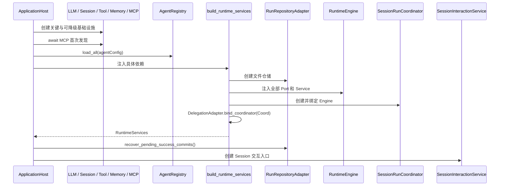
```mermaid
sequenceDiagram
    participant Host as ApplicationHost
    participant Infra as LLM / Session / Tool / Memory / MCP
    participant Registry as AgentRegistry
    participant Factory as build_runtime_services
    participant Repo as RunRepositoryAdapter
    participant Engine as RuntimeEngine
    participant Coord as SessionRunCoordinator
    participant App as SessionInteractionService

    Host->>Infra: 创建关键与可降级基础设施
    Host->>Infra: await MCP 首次发现
    Host->>Registry: load_all(agentConfig)
    Host->>Factory: 注入具体依赖
    Factory->>Repo: 创建文件仓储
    Factory->>Engine: 注入全部 Port 和 Service
    Factory->>Coord: 创建并绑定 Engine
    Factory->>Factory: DelegationAdapter.bind_coordinator(Coord)
    Factory-->>Host: RuntimeServices
    Host->>Repo: recover_pending_success_commits()
    Host->>App: 创建 Session 交互入口
```

**结论：**

- 首次 MCP 工具发现发生在 Runtime 对外就绪之前。
- 成功提交补偿发生在应用入口可用之前。
- Engine、Coordinator 和 Adapter 不自行读取全局配置。
- Delegation 需要组合根完成双向连接，但业务依赖方向仍通过 Port 隔离。

### 5.2 普通请求与 ReAct 主循环

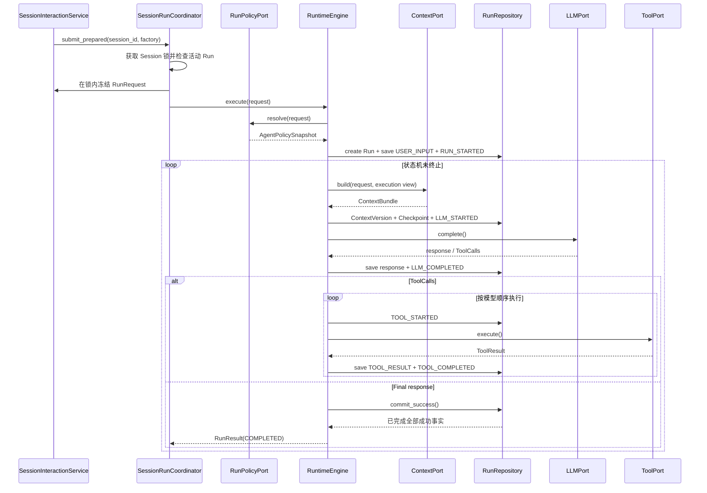
```mermaid
sequenceDiagram
    participant App as SessionInteractionService
    participant Coord as SessionRunCoordinator
    participant Policy as RunPolicyPort
    participant Engine as RuntimeEngine
    participant Context as ContextPort
    participant Repo as RunRepository
    participant LLM as LLMPort
    participant Tool as ToolPort

    App->>Coord: submit_prepared(session_id, factory)
    Coord->>Coord: 获取 Session 锁并检查活动 Run
    Coord->>App: 在锁内冻结 RunRequest
    Coord->>Engine: execute(request)
    Engine->>Policy: resolve(request)
    Policy-->>Engine: AgentPolicySnapshot
    Engine->>Repo: create Run + save USER_INPUT + RUN_STARTED

    loop 状态机未终止
        Engine->>Context: build(request, execution view)
        Context-->>Engine: ContextBundle
        Engine->>Repo: ContextVersion + Checkpoint + LLM_STARTED
        Engine->>LLM: complete()
        LLM-->>Engine: response / ToolCalls
        Engine->>Repo: save response + LLM_COMPLETED

        alt ToolCalls
            loop 按模型顺序执行
                Engine->>Repo: TOOL_STARTED
                Engine->>Tool: execute()
                Tool-->>Engine: ToolResult
                Engine->>Repo: save TOOL_RESULT + TOOL_COMPLETED
            end
        else Final response
            Engine->>Repo: commit_success()
            Repo-->>Engine: 已完成全部成功事实
            Engine-->>Coord: RunResult(COMPLETED)
        end
    end
```

**结论：**

- `SessionInteractionService` 发起提交，Coordinator 负责 Session 顺序，Engine 负责 ReAct 协调。
- `AgentPolicySnapshot` 在 Run 创建时冻结；ContextVersion 和 LLM Checkpoint 在每次业务 LLM 调用前保存。
- Tool Call 按模型返回顺序执行，开始和完成事件必须成对出现。
- 最终 response 保存后才进入 SuccessCommit；失败、审批等待和中断不写 Conversation。
- 普通请求不会自然语言续接旧 Run，用户后续消息创建新 Run，并通过 Conversation 获得上下文。

### 5.3 状态机与 Engine 驱动

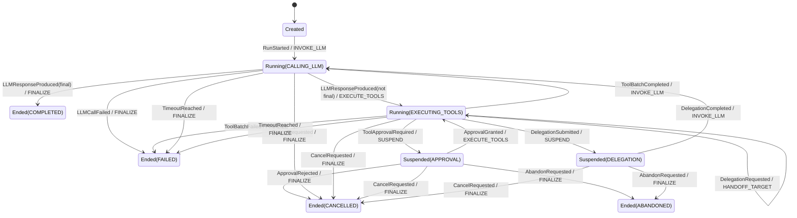
```mermaid
stateDiagram-v2
    [*] --> Created
    Created : Created

    Created --> R_LLM: RunStarted / INVOKE_LLM
    R_LLM --> EndedC: LLMResponseProduced(final) / FINALIZE
    R_LLM --> R_Tools: LLMResponseProduced(not final) / EXECUTE_TOOLS
    R_LLM --> EndedF: LLMCallFailed / FINALIZE

    R_Tools --> R_LLM: ToolBatchCompleted / INVOKE_LLM
    R_Tools --> S_Appr: ToolApprovalRequired / SUSPEND
    R_Tools --> EndedF: ToolBatchFailed / FINALIZE
    R_Tools --> R_Tools: DelegationRequested / HANDOFF_TARGET
    R_Tools --> S_Del: DelegationSubmitted / SUSPEND

    S_Appr --> R_Tools: ApprovalGranted / EXECUTE_TOOLS
    S_Appr --> EndedX: ApprovalRejected / FINALIZE

    S_Del --> R_LLM: DelegationCompleted / INVOKE_LLM

    R_LLM : Running(CALLING_LLM)
    R_Tools : Running(EXECUTING_TOOLS)
    S_Appr : Suspended(APPROVAL)
    S_Del : Suspended(DELEGATION)
    EndedC : Ended(COMPLETED)
    EndedF : Ended(FAILED)
    EndedX : Ended(CANCELLED)
    EndedA : Ended(ABANDONED)

    R_LLM --> EndedX: CancelRequested / FINALIZE
    R_Tools --> EndedX: CancelRequested / FINALIZE
    S_Appr --> EndedX: CancelRequested / FINALIZE
    S_Del --> EndedX: CancelRequested / FINALIZE

    R_LLM --> EndedF: TimeoutReached / FINALIZE
    R_Tools --> EndedF: TimeoutReached / FINALIZE

    S_Appr --> EndedA: AbandonRequested / FINALIZE
    S_Del --> EndedA: AbandonRequested / FINALIZE
```

`transition()` 是合法状态变化的唯一事实来源；主循环 `_drive()` 消费 `StateTransition.action` 选择执行器（`INVOKE_LLM` → `_invoke_llm_action`，`EXECUTE_TOOLS` → `_execute_tools_action`，`HANDOFF_TARGET` → `_handoff_target_action`），`FINALIZE`/`SUSPEND` 由其 action 方法内部收口并返回 `RunResult`。每次非终态迁移后，应用边界 `_apply_transition` 先持久化新 `AgentRunState` 与 Checkpoint（其 `action` 与之匹配），再执行下一个外部副作用。详见第 4.2.4 节迁移表与“已知痛点”。

### 5.4 reasoning / response 双通道流程

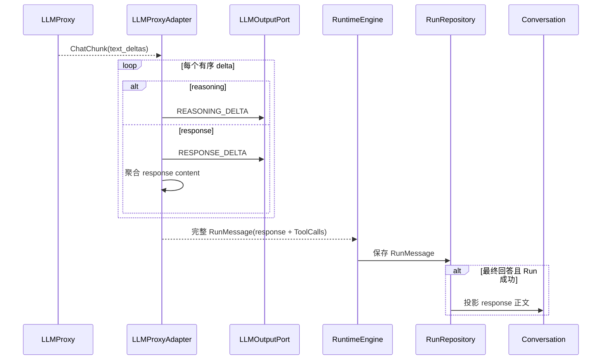
```mermaid
sequenceDiagram
    participant LLM as LLMProxy
    participant Adapter as LLMProxyAdapter
    participant Output as LLMOutputPort
    participant Engine as RuntimeEngine
    participant Repo as RunRepository
    participant Session as Conversation

    LLM-->>Adapter: ChatChunk(text_deltas)
    loop 每个有序 delta
        alt reasoning
            Adapter->>Output: REASONING_DELTA
        else response
            Adapter->>Output: RESPONSE_DELTA
            Adapter->>Adapter: 聚合 response content
        end
    end
    Adapter-->>Engine: 完整 RunMessage(response + ToolCalls)
    Engine->>Repo: 保存 RunMessage
    alt 最终回答且 Run 成功
        Repo->>Session: 投影 response 正文
    end
```

**结论：**

- reasoning 的生命周期止于输出端口；
- response 同时属于输出和事实；
- Tool Call 元数据仍由完整 LLM 响应进入 Runtime；
- 输出端口不是 RunEvent 的替代品；
- 当前没有通用持久化输出事件流。

### 5.5 上下文预算与 staged 压缩

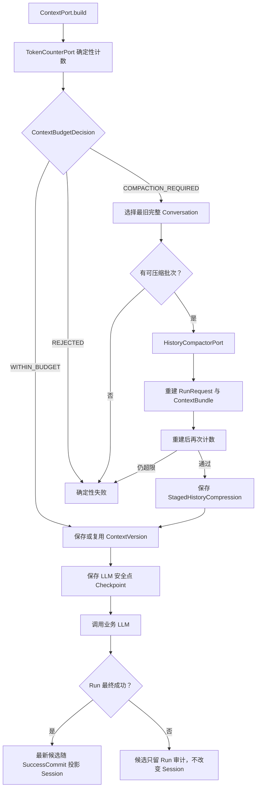
```mermaid
flowchart TD
    Build["ContextPort.build"] --> Count["TokenCounterPort 确定性计数"]
    Count --> Decision{"ContextBudgetDecision"}

    Decision -->|WITHIN_BUDGET| Version["保存或复用 ContextVersion"]
    Decision -->|REJECTED| Fail["确定性失败"]
    Decision -->|COMPACTION_REQUIRED| Select["选择最旧完整 Conversation"]

    Select --> Available{"有可压缩批次？"}
    Available -->|否| Fail
    Available -->|是| Compact["HistoryCompactorPort"]
    Compact --> Rebuild["重建 RunRequest 与 ContextBundle"]
    Rebuild --> Recount["重建后再次计数"]
    Recount -->|仍超限| Fail
    Recount -->|通过| Stage["保存 StagedHistoryCompression"]
    Stage --> Version

    Version --> Checkpoint["保存 LLM 安全点 Checkpoint"]
    Checkpoint --> LLM["调用业务 LLM"]
    LLM --> Success{"Run 最终成功？"}
    Success -->|是| Commit["最新候选随 SuccessCommit 投影 Session"]
    Success -->|否| KeepAudit["候选只留 Run 审计，不改变 Session"]
```

**结论：**

- Engine 是预算流程协调者，TokenCounter 和 HistoryCompactor 只通过 Port 提供能力。
- 压缩只作用于最旧完整 Conversation，不静默裁掉当前输入、最新 Conversation 或 Tool Schema。
- 压缩候选先写入 Run，只有 Run 成功时才提交 Session。
- 当前计数覆盖 Runtime 可枚举的正文与 Tool Schema，但不等于 Provider wire-level 完整 Token。

### 5.6 审批暂停与恢复

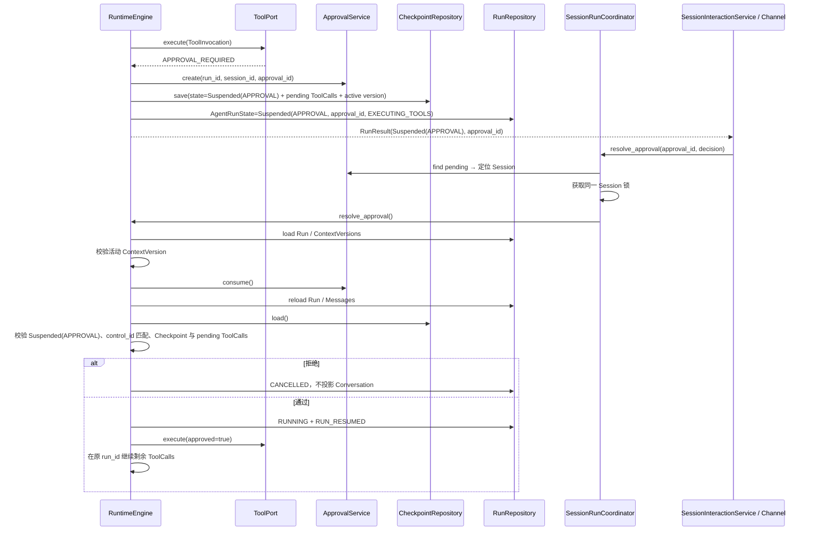
```mermaid
sequenceDiagram
    participant Engine as RuntimeEngine
    participant Tool as ToolPort
    participant Approval as ApprovalService
    participant Checkpoint as CheckpointRepository
    participant RunRepo as RunRepository
    participant Coord as SessionRunCoordinator
    participant Entry as SessionInteractionService / Channel

    Engine->>Tool: execute(ToolInvocation)
    Tool-->>Engine: APPROVAL_REQUIRED
    Engine->>Approval: create(run_id, session_id, approval_id)
    Engine->>Checkpoint: save(state=Suspended(APPROVAL) + pending ToolCalls + active version)
    Engine->>RunRepo: AgentRunState=Suspended(APPROVAL, approval_id, EXECUTING_TOOLS)
    Engine-->>Entry: RunResult(Suspended(APPROVAL), approval_id)

    Entry->>Coord: resolve_approval(approval_id, decision)
    Coord->>Approval: find pending → 定位 Session
    Coord->>Coord: 获取同一 Session 锁
    Coord->>Engine: resolve_approval()

    Engine->>RunRepo: load Run / ContextVersions
    Engine->>Engine: 校验活动 ContextVersion
    Engine->>Approval: consume()
    Engine->>RunRepo: reload Run / Messages
    Engine->>Checkpoint: load()
    Engine->>Engine: 校验 Suspended(APPROVAL)、control_id 匹配、Checkpoint 与 pending ToolCalls
    alt 拒绝
        Engine->>RunRepo: CANCELLED，不投影 Conversation
    else 通过
        Engine->>RunRepo: RUNNING + RUN_RESUMED
        Engine->>Tool: execute(approved=true)
        Engine->>Engine: 在原 run_id 继续剩余 ToolCalls
    end
```

审批恢复依赖：

```text
ApprovalRecord
+ AgentRun
+ RunCheckpoint
+ 活动 ContextVersion
+ RunMessage
```

**结论：**

- Coordinator 先通过 pending ApprovalRecord 定位 Session，并在同一 Session 锁内调用 Engine。
- ContextVersion、RunMessage 和 Checkpoint 是恢复事实；Adapter 的内存 waiting 集合不是恢复事实源。
- 恢复必须继续原 run_id，并依据 Checkpoint 中的剩余 ToolCalls 执行。
- 当前实现会在完成全部 Run/Checkpoint/pending 校验之前消费审批记录；后续校验失败时不能再次提交，属于第 8 节 R5。

### 5.7 恢复边界、重试和新请求替代

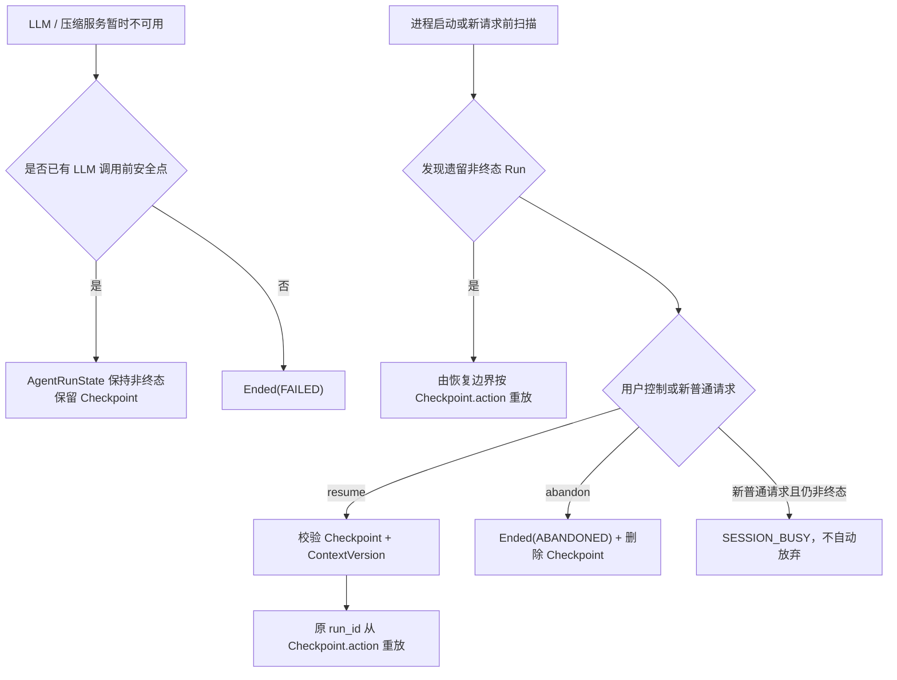
```mermaid
flowchart TD
    Failure["LLM / 压缩服务暂时不可用"] --> Safe{"是否已有 LLM 调用前安全点"}
    Safe -->|是| Keep["AgentRunState 保持非终态<br/>保留 Checkpoint"]
    Safe -->|否| Failed["Ended(FAILED)"]

    Restart["进程启动或新请求前扫描"] --> NonEnded{"发现遗留非终态 Run"}
    NonEnded -->|是| Recover["由恢复边界按 Checkpoint.action 重放"]

    NonEnded --> Choice{"用户控制或新普通请求"}
    Choice -->|resume| Validate["校验 Checkpoint + ContextVersion"]
    Validate --> Resume["原 run_id 从 Checkpoint.action 重放"]
    Choice -->|abandon| Abandoned["Ended(ABANDONED) + 删除 Checkpoint"]
    Choice -->|新普通请求且仍非终态| Busy["SESSION_BUSY，不自动放弃"]
```

**结论：**

- 恢复边界只在 LLM 调用前安全点保留可重放 Checkpoint。
- `resume` 继续原 run_id；`abandon` 保留审计事实但释放 Session 占用。
- 非终态 Run 即占用；新普通请求遇到非终态 Run 返回 `SESSION_BUSY`，不再自动放弃遗留 Run。
- 不允许依据普通 LLM Checkpoint 自动重放已经开始的有副作用 Tool。

### 5.8 成功提交补偿

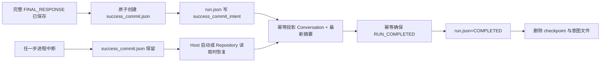
```mermaid
flowchart LR
    Final["完整 FINAL_RESPONSE 已保存"] --> Intent["原子创建 success_commit.json"]
    Intent --> Control["run.json 写 success_commit_intent"]
    Control --> Projection["幂等投影 Conversation + 最新摘要"]
    Projection --> Event["幂等确保 RUN_COMPLETED"]
    Event --> Finalize["run.json=COMPLETED"]
    Finalize --> Cleanup["删除 checkpoint 与意图文件"]

    Crash["任一步进程中断"] --> Remain["success_commit.json 保留"]
    Remain --> Recover["Host 启动或 Repository 读取时恢复"]
    Recover --> Projection
```

**结论：**

- `RunRepositoryAdapter` 是成功提交协调者，Session Projector 和完成事件写入都必须幂等。
- `success_commit.json` 是临时恢复意图，不是长期业务事实。
- `run.json=COMPLETED` 最后写入；进程在此前崩溃时由 Host 或 Repository 补偿。
- 失败、取消、审批等待和中断不进入成功提交协议。

### 5.9 取消流程

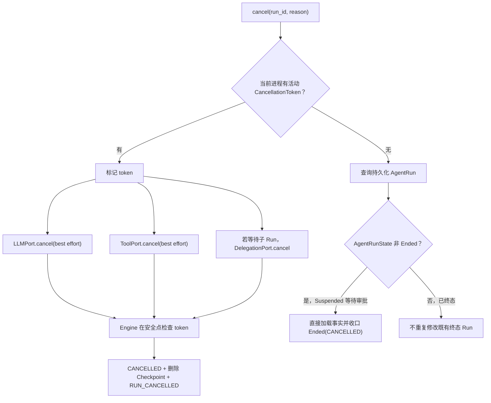
```mermaid
flowchart TD
    Cancel["cancel(run_id, reason)"] --> Token{"当前进程有活动 CancellationToken？"}
    Token -->|有| Mark["标记 token"]
    Mark --> LLM["LLMPort.cancel(best effort)"]
    Mark --> Tool["ToolPort.cancel(best effort)"]
    Mark --> Child["若等待子 Run，DelegationPort.cancel"]
    LLM --> Safe["Engine 在安全点检查 token"]
    Tool --> Safe
    Child --> Safe
    Safe --> Terminal["CANCELLED + 删除 Checkpoint + RUN_CANCELLED"]

    Token -->|无| Lookup["查询持久化 AgentRun"]
    Lookup --> Waiting{"AgentRunState 非 Ended？"}
    Waiting -->|是，Suspended 等待审批| Direct["直接加载事实并收口 Ended(CANCELLED)"]
    Waiting -->|否，已终态| Ignore["不重复修改既有终态 Run"]
```

**结论：**

- 取消发起者可以绕过 Session 锁，以避免活动 Run 持锁时形成死锁。
- `CancellationService` 只保存进程内控制引用，终态仍由 Engine 持久化。
- 当前 LLM 和 Tool Adapter 没有真实底层执行句柄，取消属于尽力协议。
- 等待审批 Run 的直接取消与审批恢复之间尚无跨进程原子协调，见第 8 节痛点。

### 5.10 Delegation 流程

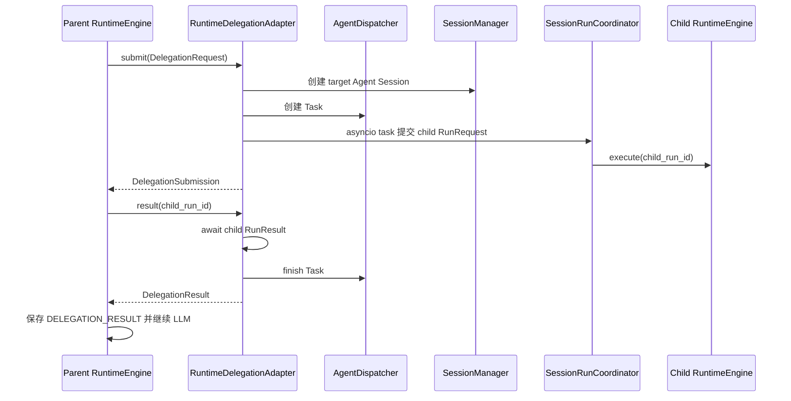
```mermaid
sequenceDiagram
    participant Parent as Parent RuntimeEngine
    participant Adapter as RuntimeDelegationAdapter
    participant Dispatcher as AgentDispatcher
    participant Session as SessionManager
    participant Coord as SessionRunCoordinator
    participant Child as Child RuntimeEngine

    Parent->>Adapter: submit(DelegationRequest)
    Adapter->>Session: 创建 target Agent Session
    Adapter->>Dispatcher: 创建 Task
    Adapter->>Coord: asyncio task 提交 child RunRequest
    Coord->>Child: execute(child_run_id)
    Adapter-->>Parent: DelegationSubmission
    Parent->>Adapter: result(child_run_id)
    Adapter->>Adapter: await child RunResult
    Adapter->>Dispatcher: finish Task
    Adapter-->>Parent: DelegationResult
    Parent->>Parent: 保存 DELEGATION_RESULT 并继续 LLM
```

**结论：**

- Parent RuntimeEngine 是委派发起者，`RuntimeDelegationAdapter` 负责 Orchestration 和子 Session 映射。
- 子执行仍通过同一个 Coordinator 和 RuntimeEngine，不在父 Run 中原地切换 Identity。
- 父子 Run 使用不同 Session 锁，因此可以并行；取消可沿 parent → child 传播。
- 当前 child Task、结果和绑定只保存在内存，进程重启后不能恢复等待关系。

---

## 6. 对外接口与数据契约

### 6.1 Runtime 公共 API

`dotclaw.runtime` 当前导出：

```text
RuntimeEngine
SessionRunCoordinator
AgentRunState
AgentAction
StateTransition
transition
RunRequest
RunResult
AgentRun
```

对普通应用代码，更推荐使用 `ApplicationHost.session_interaction`，而不是直接实例化或调用 Engine。

### 6.2 Port 契约

| Port | Runtime 需要的能力 | 当前实现 |
|---|---|---|
| `RunPolicyPort` | 冻结 Agent 执行策略 | `AgentPolicyResolver` |
| `ContextPort` | 构造 ContextBundle、刷新和释放 Slot | `ContextProvider` |
| `LLMPort` | 完整模型调用与尽力取消 | `LLMProxyAdapter` |
| `LLMOutputPort` | 接收 reasoning/response 增量 | Channel 运行级 Adapter |
| `ToolPort` | 执行 Tool 或返回审批需求 | `ToolExecutorAdapter` |
| `DelegationPort` | 提交、读取和取消子执行 | `RuntimeDelegationAdapter` |
| `RunRepository` | 运行事实与成功提交 | `RunRepositoryAdapter` |
| `CheckpointRepository` | 最小恢复快照 | `CheckpointRepositoryAdapter` |
| `ApprovalRepository` | 审批关联与一次消费 | `ApprovalRepositoryAdapter` |
| `ConversationProjectionPort` | 成功语义投影 Session | `SessionConversationProjector` |
| `TokenCounterPort` | 对当前可枚举输入组成进行确定性计数 | `TiktokenTokenCounter` |
| `HistoryCompactorPort` | 完整 Conversation 滚动摘要 | `LLMContextCompactor` |

### 6.3 `AgentRunState` 的控制语义

`AgentRunState` 是 AgentRun 的唯一持久化控制状态，由 `mode`（Created/Running/Suspended/Ended）组合 `RunStage`、`SuspendReason` 与 `RunOutcome` 构成。`is_ended()` 是判断运行是否终态、是否仍占用 Session 的唯一入口（取代旧模型中的持久化业务状态与可重试中断语义）。所有合法迁移由纯函数 `transition()` 计算，Engine 不再按独立阶段枚举分支；`RunResult.state`（`AgentRunState`）即对外暴露的运行结果。

### 6.4 数据容器边界

| 容器 | 回答的问题 | 保存内容 | 不保存什么 |
|---|---|---|---|
| `Session` | 长期会话属于谁？ | Identity、标题、Conversation、已提交摘要 | Run 过程 |
| `Conversation` | 成功的用户—Agent 对话是什么？ | 用户输入、最终回答、run_id 引用 | Tool、失败、审批、reasoning |
| `AgentRun` | 一次执行的索引和终态是什么？ | 状态、策略、引用、统计、错误 | 全部正文 |
| `RunMessage` | LLM/Tool 实际收发了什么？ | 输入、响应、Tool 结果、委派结果 | Context 快照本体 |
| `ContextVersion` | 某次 LLM 调用的稳定输入是什么？ | Snapshot Slot、hash、Tool Schema | 动态 RunMessage 正文 |
| `RunEvent` | 运行按顺序发生了什么？ | 边界事件和消息引用 | 大正文和恢复状态 |
| `RunCheckpoint` | 从哪个安全点继续？ | 状态、游标、pending、版本引用 | 完整 prompt/Tool Result |
| `ApprovalRecord` | approval_id 属于哪个 Run？ | run/session/status | Tool Policy 细节 |
| `SuccessCommitIntent` | 成功提交是否需补偿？ | 最终投影与完成目标 | 长期业务事实 |

### 6.5 本地存储布局

```text
data/sessions/
├── approvals/
│   └── {approval_id}.json
└── {session_id}/
    ├── session.json
    └── agent_runs/
        └── {run_id}/
            ├── run.json
            ├── messages.json
            ├── events.jsonl
            ├── checkpoint.json
            └── success_commit.json
```

文件语义：

| 文件 | 内容 |
|---|---|
| `session.json` | Session、成功 Conversation、已提交历史压缩 |
| `run.json` | AgentRun 摘要和控制引用 |
| `messages.json` | RunMessage 与 ContextVersion |
| `events.jsonl` | 追加式 RunEvent |
| `checkpoint.json` | 当前安全恢复点 |
| `success_commit.json` | 临时成功提交意图 |
| `approvals/*.json` | approval_id 到 Run 的关联 |

### 6.6 关键不变量

1. 普通消息创建新 Run；审批恢复必须继续原 run_id。
2. 同一 Session 的普通执行不得并发，不同 Session 可以并行。
3. `RuntimeEngine` 不保存任何 Run 级共享当前状态。
4. `AgentState` 不依赖外部系统。
5. Application 只依赖 Port，不直接 import 具体 Provider、Tool 或 SessionManager。
6. Run 创建时冻结 Identity、模型、提示词、模型可见工具和 Context 预算策略。
7. Engine 调用 LLM 前必须有活动 ContextVersion 和最小 Checkpoint。
8. RunEvent 引用的 message_id 必须已经持久化。
9. 每个 `TOOL_STARTED` 应有唯一的 `TOOL_COMPLETED` 终态事件。
10. Checkpoint 不保存完整 prompt、messages 或 Tool Result。
11. ContextVersion 只保存 Snapshot Slot，事实引用内容留在 RunMessage。
12. 只有成功 Run 可以投影 Conversation。
13. reasoning 不进入 RunMessage、Conversation 和后续 Context。
14. 历史压缩候选只有成功提交后才能更新 Session。
15. `DENY`、Tool 失败和审批拒绝不得伪装成成功 Conversation。
16. 有副作用 Tool 不允许依据普通 LLM Checkpoint 自动盲目重放。
17. `success_commit.json` 存在时必须补偿完成或继续保留，不能静默删除。
18. Run 终态后释放 RUN Owner Context 和 Tool Adapter 的短期缓存。
19. Journal 或 Channel 输出不能成为恢复事实源。
20. 本地锁和文件仓储不应被描述为分布式高可用能力。

---

## 7. 常见修改入口

| 修改目标 | 首要入口 | 可能涉及 | 必须保持的不变量 |
|---|---|---|---|
| 修改普通请求入口 | `bootstrap/session_interaction.py` | Request Factory、Coordinator | Session Identity 路由不可绕过 |
| 修改 Session 并发规则 | `session_run_coordinator.py` | RunRepository、控制用例 | 取消不得与活动锁死锁 |
| 修改主 ReAct 流程 | `application/engine.py::_drive` | State、Events、Checkpoint | 事实先后顺序明确 |
| 新增状态或转换 | `domain/state.py`、`domain/events.py` | Engine 分支、Checkpoint | Domain 无副作用依赖 |
| 修改 Run 输入 | `application/request_factory.py` | Session、ConversationSnapshot | 不把可变 Session 传入 Engine |
| 新增 Runtime 用例 | `RuntimeControlPort` + Engine/Service | SessionInteractionService | 控制操作定位正确 Session |
| 新增 Port | `application/ports.py` | Adapter、runtime_factory | Engine 只依赖 Protocol |
| 替换 LLM 实现 | 新 `LLMPort` Adapter | OutputPort、取消、错误映射 | response/reasoning 语义保持 |
| 修改运行级输出 | `LLMOutputPort`、`LLMProxyAdapter` | Channel Adapter、RunResult | reasoning 不进入 Conversation |
| 修改 Tool 接入 | `ToolExecutorAdapter` | Tool DTO、审批、错误映射 | 不向 Channel 提问 |
| 修改 Agent 策略冻结 | `AgentPolicyResolver` | Identity、Config、Tool Registry | Run 内模型可见定义稳定 |
| 新增上下文来源 | `context/` Slot | Context Plan、Owner、缓存 | Runtime 不直接加载来源 |
| 修改 Context Version | `domain/context.py`、Engine helpers | Repository、恢复 | 版本连续且不可覆盖 |
| 修改 Token 预算 | `context_budget.py` | TokenCounter、Policy 配置 | 使用显式 tokenizer，并明确未计入的协议开销 |
| 修改历史压缩 | `history_compaction.py`、Compactor Adapter | Context、Session 投影 | 只压缩完整旧 Conversation |
| 修改审批恢复 | `ApprovalService`、`resolve_approval()` | Checkpoint、Tool Adapter、Coordinator | 恢复前置条件与消费边界一致，继续原 run_id |
| 修改取消 | `CancellationService`、`Engine.cancel` | LLM/Tool/Delegation Adapter | 终态由 Engine 持久化 |
| 修改中断重试 | `resume_run`（恢复边界） | Checkpoint、ContextVersion | 只从明确安全点重放 |
| 修改成功提交 | `RunRepositoryAdapter.commit_success` | Projector、Fault tests | COMPLETED 最后写入 |
| 更换存储 | 实现 Repository Ports | Bootstrap、迁移工具 | 保持事实和投影分离 |
| 修改多 Agent 委派 | `RuntimeDelegationAdapter` | Dispatcher、Session、Coordinator | 子 Run 仍经同一 Runtime |
| 修改 Session 删除 | `SessionInteractionService.delete_session` | Approval Repo、Context | 有活动 Run 时拒绝 |
| 排查一次异常 Run | `run.json → events → messages → checkpoint` | Session 和提交意图 | 不以 Journal 代替事实 |

---

## 8. 设计取舍、痛点和演进方向

本节只保留理解 Runtime 架构所必需的设计判断。当前事实、真实问题和候选方案分别陈述，候选方案不代表已经实现。

### 8.1 当前架构承诺

当前 master 可以确认以下八项承诺：

1. `ApplicationHost` 是唯一公开组合根；Runtime Application 只依赖 Port。
2. Runtime 的隔离单位是 Run：共享 Engine 不保存当前 Session 或当前 Agent。
3. 同一 Session 的普通执行串行，不同 Session 可以并行。
4. `AgentRunState` + `transition()` 提供纯领域转换，副作用、持久化和终态收口由 Engine 执行。
5. Session Conversation 只保存成功语义；完整执行事实分布在 AgentRun、RunMessage、RunEvent、ContextVersion 和 Checkpoint。
6. 审批与中断只从明确安全边界恢复，不盲目重放有副作用 Tool。
7. 历史压缩候选先暂存 Run，只有成功提交后才更新 Session。
8. reasoning 仅沿运行级输出端口传递，不进入 Conversation、RunMessage 正文和后续 Context。

### 8.2 核心设计取舍

#### 8.2.1 共享无 Run 状态的 Engine

**问题与选择：**如果 Agent 对象持有 Runtime、Session 和当前状态，多 Session 并发时容易串扰。当前采用共享 `RuntimeEngine`，每次请求创建独立 `RunExecution`，Identity 仅以冻结策略进入 Run。

**未选择：**每个 Agent 创建一套 Runtime、Engine 保存 `_current_session_id`、运行时 Agent 门面拥有执行权。

**收益：**Run 成为明确隔离单元；多 Session 复用同一 Engine；生命周期统一归 Host。

**代价与边界：**所有单 Run 数据必须显式传递；恢复必须从 Repository 重建。Engine 无 Run 状态不代表整个进程无状态，Coordinator、CancellationService、Tool Adapter 和 DelegationAdapter 仍有内存控制数据。

#### 8.2.2 同 Session 串行

**问题与选择：**两个 Run 若并发读取同一 Conversation 基线并分别提交，会产生顺序和压缩冲突。当前以 `session_id → asyncio.Lock` 将请求冻结与执行放在同一锁内。

**未选择：**同 Session 并行后合并、只锁保存、全局单锁、把后续消息自动注入活动 Run。

**收益：**Conversation 顺序和压缩基线稳定，不同 Session 仍可并行。

**代价与边界：**长 Run 会阻塞同 Session 后续请求；取消必须旁路锁。该锁仅保证单进程顺序，不是跨进程 lease。

#### 8.2.3 纯状态规则与副作用 Engine 分离

**问题与选择：**状态判断、外部调用和文件写入若混在同一对象中，非法转换和恢复难以验证。`AgentState.transition(event)` 只返回新状态和 `AgentAction`，Engine 执行 I/O。

**未选择：**状态对象直接调用 Port、Repository 自动触发流程、散落字符串状态、重量级工作流引擎。

**收益：**Domain 可纯测试，Checkpoint 可以保存最小控制状态。

**代价与边界：**`transition()` 已是合法迁移的唯一事实来源；Engine 主循环 `_drive()` 直接消费 `transition()` 返回的 `AgentAction` 选择执行器，不再维护独立的阶段枚举。

#### 8.2.4 运行事实与成功 Conversation 分离

**问题与选择：**若 Tool、失败、审批和中间 LLM 响应都写入 Conversation，用户历史与执行审计会混在一起。当前由不同容器分别承担长期语义、正文事实、时序事实、上下文快照和恢复控制。

**未选择：**所有消息直接追加 Conversation、单一巨型 Run JSON、Journal 同时承担恢复、失败 Run 投影对话。

**收益：**用户历史保持干净，失败和 Tool 过程仍可审计，成功投影可幂等补偿。

**代价与边界：**排障需要联合读取多个容器，Repository 必须维护引用和顺序不变量。

#### 8.2.5 最小 Checkpoint 与成功提交意图

**问题与选择：**完整 prompt 和 Tool Result 若复制进 Checkpoint 会产生多份事实；文件系统又没有跨文件事务。当前 Checkpoint 只保存控制引用，成功则通过 `SuccessCommitIntent` 幂等补齐 Conversation、完成事件和 Run 终态。

**未选择：**完整 prompt Checkpoint、Python pickle、先写 COMPLETED、仅记录提交异常。

**收益：**恢复使用当时事实；Checkpoint 更小；成功提交可补偿。

**代价与边界：**恢复依赖多个文件；Repository 承担事务协调职责；这仍是单机文件协议，不是数据库 ACID 或多节点共识。

#### 8.2.6 确定性预算与 staged 历史压缩

**问题与选择：**字符数估算和静默截断会造成输入边界不确定。当前使用显式 tokenizer 统计 Runtime 可枚举的正文和 Tool Schema；超限时只压缩最旧完整 Conversation，重建后再次计数，候选先暂存 Run。

**未选择：**字符估算、直接丢弃消息、压缩后不重计、失败 Run 立即更新 Session。

**收益：**不静默丢数据，候选来源和 hash 可审计，失败不会污染 Session。

**代价与边界：**需要额外压缩模型调用和显式 tokenizer 配置。当前结果不是 Provider wire-level 完整精确 Token：消息协议字段、Tool Call 参数、Chat Template 和 Provider 开销尚未完整纳入。

#### 8.2.7 运行级输出端口

**问题与选择：**共享 Adapter 若在构造期绑定 Channel，会使并发run输出串扰；reasoning 也不应与最终回答混成同一事实。当前每次执行传入可选 `LLMOutputPort`，事件携带 session_id、run_id 和语义 kind。

**未选择：**Engine 直接依赖 CLI、Adapter 全局绑定 Channel、reasoning 写入 Conversation。

**收益：**输出按 Run 隔离，reasoning/response 可分区展示，response 仍形成最终事实。

**代价与边界：**输出与持久化存在两个通道；reasoning 不可恢复或回放；当前输出端口异常可能被误映射为模型不可用。

#### 8.2.8 子 Agent 委派为独立 Run

**问题与选择：**父 Run 原地切换 Identity 会模糊权限、Context、审计和取消边界。当前每次 delegation 创建目标 Agent 的独立 Session 和 child Run，父 Run只接收标准化结果。

**未选择：**父 Run 原地换 Agent、多 Agent 共用 Conversation、直接调用目标 Agent 对象。

**收益：**父子事实分离，各自冻结 Policy，子 Run 仍受 Coordinator 和 Runtime 规则约束。

**代价与边界：**每次委派创建新 Session；Task 和结果绑定当前只在进程内，不支持重启恢复。

### 8.3 已知痛点

#### R1. `RuntimeEngine` 内部职责过密

`engine.py` 同时处理新建、恢复、ReAct、Tool、Delegation、ContextVersion、预算、压缩、审计和各类终态。仍应保持单执行中心，但内部用例边界过密。

#### R2. 委派状态已接入主路径

`transition()` 已是唯一迁移事实来源，`_drive()` 直接按 `AgentAction` 分支选择执行器。其中 `DelegationRequested` 返回 `HANDOFF_TARGET` 且状态保持 `Running(EXECUTING_TOOLS)`，委派提交后 `DelegationSubmitted` 进入 `Suspended(DELEGATION)`；旧模型中独立的等待委派阶段已统一为 `Suspended(DELEGATION)` 与 `control_id` 校验。

#### R3. 循环、超时和部分状态字段未贯通

`max_iterations` 被写入 `RunBudget`，但 `_drive()` 没有根据它终止循环；`timeout_ms`、`TimeoutReached` 和 `RunErrorCode.TIMEOUT` 也未形成运行控制闭环。`retry_count`、`truncate_count` 和 `loop_fingerprint` 没有稳定更新，Checkpoint 恢复也未完整重建这些字段。

#### R4. Session 并发控制不是跨进程 lease

进程内 `asyncio.Lock` 与文件型活动 Run 检查不是原子条件写。两个进程可能同时通过检查，代码中“持久化占用保证跨进程串行”的表述超过当前能力。

#### R5. 审批消费与恢复不是原子边界

当前流程会先消费 ApprovalRecord，再读取并校验 Checkpoint、`AgentRunState` 和待执行 Tool Call。后续恢复校验失败时，审批已经无法再次提交。文件型 consume 也缺少跨进程 CAS。

等待审批 Run 的取消可绕过 Session 锁，而审批恢复会获取 Session 锁；二者之间没有事务型竞争协调。

#### R6. 取消主要依赖安全点标记

`LLMProxyAdapter.cancel()` 没有底层请求句柄，`ToolExecutorAdapter.cancel()` 不能终止正在执行的 Handler。长模型请求和有副作用 Tool 不一定立即停止。

#### R7. Tool 错误语义被压缩

Tool 的 `INVALID_ARGUMENTS`、`POLICY_DENIED`、`TIMEOUT` 和网络错误进入 Runtime 后统一映射为 `TOOL_FAILURE`，限制重试判断、模型反馈、统计和用户展示。

#### R8. 预算与统计事实边界不清

`RunBudget` 与 `RunStatistics` 都含有 Token、调用次数或时长相关语义；当前更新和 Checkpoint 恢复缺少单一权威入口，`duration_ms` 也未形成统一计算路径。

#### R9. 输出故障可能被误判为模型故障

`LLMProxyAdapter` 在流循环内直接等待 `output_port.emit()`；输出端异常可能被捕获并映射为 `LLMUnavailableError`。

#### R10. Delegation 恢复能力不足

`_running`、`_results` 和 `_task_bindings` 都是进程内字典。进程重启后父 Run 无法重新关联 child Run，当前也会为每次委派创建新的目标 Session。

#### R11. 持久化与兼容噪声

按 run_id 查找、扫描未决提交和列举活动 Run 依赖目录遍历；`STATE_TRANSITION`、`CHECKPOINT_SAVED` 等事件已定义但未进入主事件流；恢复辅助 DTO 使用部分合成元数据；Runtime v2/v4 和两套 Context 压缩协议仍有历史残留。

#### R12. reasoning 的观测边界有限

不保存 reasoning 是当前明确选择，但意味着无法重启后回放，也无法从 RunEvent 分析 reasoning 输出时序。这是能力限制，不等同于必须持久化全文。

### 8.4 演进方向

| 编号 | 解决的痛点 | 候选方向 | 影响模块与代价 |
|---|---|---|---|
| E1 | R1 | 在单执行中心下提取 LLMDrive、ToolDrive、ContextPreparation、Recovery 和 SuccessCommit 等内部服务 | Runtime Application；需防止服务互相触发形成新状态机 |
| E2 | R2、R3 | 明确状态机定位：要么让 AgentAction 成为唯一执行计划并补齐终态/超时/委派，要么删除未使用动作和字段，仅保留合法阶段校验 | Runtime Domain、Engine、Checkpoint；涉及较大控制流调整 |
| E3 | R3、R8 | 统一运行限制与统计：明确 max_iterations、deadline、Token 消耗和最终统计的单一更新入口 | Execution、Facts、Engine、测试；需要存储兼容 |
| E4 | R4 | 为数据库 Adapter 增加 session lease、fencing token 和条件更新 | Repository、Coordinator、Bootstrap；本地文件模式仍可保留单进程语义 |
| E5 | R5 | 将审批“验证恢复条件 + 消费记录 + 更新 Run”纳入事务；文件模式至少增加进程锁和失败补偿 | Approval、Checkpoint、Run Repository、Coordinator |
| E6 | R6 | LLM、Tool 和 Delegation 注册可取消 Operation Handle；有副作用 Tool 增加持久化调用账本和幂等键 | LLM、Tool、Runtime、外部 Provider；无法替代外部系统幂等 |
| E7 | R7 | Runtime Tool DTO 保留 tool_error_code、tool_error_type 和 retryable | Tool、Runtime Adapter、状态机和输出展示 |
| E8 | R9 | 将 OutputDeliveryError 与 LLMUnavailableError 分离，或采用非阻断输出队列；输出失败不影响最终 response 聚合 | Channel、LLM Adapter、Runtime |
| E9 | R10 | 持久化 parent/child/task/session binding，重启后按 child Run 终态恢复父 Run | Orchestration、Runtime Repository、Session |
| E10 | R11 | 引入 SQLite/PostgreSQL 索引型 Adapter；清理未使用事件、旧版本命名和重复压缩契约 | Runtime、Bootstrap、迁移工具；需要明确格式迁移 |
| E11 | R12 | 仅在明确隐私策略下增加有限 reasoning 元数据或摘要事件，而非默认保存全文 | LLM、Runtime Events、配置；需权衡隐私和存储 |

## 9. 源码索引

### 9.1 Runtime 目录

```text
src/dotclaw/runtime/
├── __init__.py
├── domain/
│   ├── __init__.py
│   ├── facts.py
│   ├── context.py
│   ├── events.py
│   ├── state.py
│   └── control.py
├── application/
│   ├── __init__.py
│   ├── dto.py
│   ├── ports.py
│   ├── execution.py
│   ├── engine.py
│   ├── request_factory.py
│   ├── session_run_coordinator.py
│   ├── approval_service.py
│   ├── cancellation_service.py
│   ├── context_budget.py
│   ├── context_compaction.py
│   └── history_compaction.py
└── adapters/
    ├── __init__.py
    ├── _file_support.py
    ├── run_repository.py
    ├── in_memory_run_repository.py
    ├── checkpoint_repository.py
    ├── approval_repository.py
    ├── session_conversation_projector.py
    ├── llm_proxy_adapter.py
    ├── llm_context_compactor.py
    ├── tiktoken_token_counter.py
    ├── tool_executor_adapter.py
    └── agent_policy_resolver.py
```

### 9.2 Domain 文件

| 文件 | 逻辑组件 | 主要内容 |
|---|---|---|
| `domain/facts.py` | 运行事实 | AgentRun、RunMessage、Checkpoint、Policy、Status、Error |
| `domain/context.py` | 上下文事实 | ContextVersion、Slot Snapshot、Staged Compression、Success Intent |
| `domain/events.py` | 事件 | DomainEvent、RunEvent、事件类型和 Tool 审计状态 |
| `domain/state.py` | 状态规则 | AgentRunState、RunStage、SuspendReason、RunOutcome、StateTransition、transition |
| `domain/control.py` | 控制动作 | AgentAction |

### 9.3 Application 文件

| 文件 | 逻辑组件 | 主要内容 |
|---|---|---|
| `application/engine.py` | 执行内核 | 新建、主循环、恢复、提交、终态 |
| `application/execution.py` | 执行内核 | RunExecution、View、Budget、CancellationToken |
| `application/dto.py` | 对外契约 | RunRequest/Result、Context、Tool、Delegation、Output DTO |
| `application/ports.py` | 依赖边界 | Repository、Context、LLM、Tool、Delegation Protocol |
| `application/request_factory.py` | 请求冻结 | Session → ConversationSnapshot → RunRequest |
| `application/session_run_coordinator.py` | Session 协调 | 进程内锁、普通提交和控制串行化 |
| `application/approval_service.py` | 审批 | approval_id 创建、定位和消费 |
| `application/cancellation_service.py` | 取消 | 活动 Run token 和 child 映射 |
| `application/context_budget.py` | 预算 | 确定性 Token 预算契约和 Planner |
| `application/history_compaction.py` | 压缩 | Conversation 批次选择与摘要协议 |
| `application/context_compaction.py` | 兼容压缩契约 | 通用 fragment 压缩 DTO |

### 9.4 Adapter 文件

| 文件 | 实现的边界 | 主要内容 |
|---|---|---|
| `adapters/run_repository.py` | RunRepository | 文件事实、ContextVersion、成功提交恢复 |
| `adapters/in_memory_run_repository.py` | RunRepository | 测试用内存实现 |
| `adapters/checkpoint_repository.py` | CheckpointRepository | v4 最小 Checkpoint |
| `adapters/approval_repository.py` | ApprovalRepository | 文件审批记录 |
| `adapters/session_conversation_projector.py` | ConversationProjectionPort | 成功 Run → Session |
| `adapters/llm_proxy_adapter.py` | LLMPort | 业务模型、reasoning/response 输出 |
| `adapters/llm_context_compactor.py` | HistoryCompactorPort | 历史摘要模型调用 |
| `adapters/tiktoken_token_counter.py` | TokenCounterPort | 显式 tokenizer 的确定性输入计数 |
| `adapters/tool_executor_adapter.py` | ToolPort | ToolExecutor、审批和结果转换 |
| `adapters/agent_policy_resolver.py` | RunPolicyPort | Identity、工具和模型策略冻结 |

### 9.5 跨目录接入

```text
src/dotclaw/
├── bootstrap/
│   ├── application_host.py
│   ├── runtime_factory.py
│   └── session_interaction.py
├── context/
│   ├── provider.py
│   ├── slot_manager.py
│   ├── slots.py
│   └── ...
├── orchestration/
│   └── runtime_delegation_adapter.py
├── channel/
│   └── runtime_llm_output.py
├── session/
│   └── session.py
├── llm/
│   └── proxy.py
└── tools/
    └── executor.py
```

| 文件 | Runtime 视角 |
|---|---|
| `bootstrap/application_host.py` | 唯一公开组合根、启动恢复和关闭 |
| `bootstrap/runtime_factory.py` | Runtime 私有装配 |
| `bootstrap/session_interaction.py` | Session/Identity 应用入口 |
| `context/provider.py` | ContextPort 当前实现 |
| `orchestration/runtime_delegation_adapter.py` | DelegationPort 当前实现 |
| `channel/runtime_llm_output.py` | 运行级 LLMOutputPort 实现 |
| `session/session.py` | 长期 Session 和 Conversation |
| `llm/proxy.py` | LLMPort 背后的模型代理 |
| `tools/executor.py` | ToolPort 背后的工具安全执行器 |

---
