# Runtime 模块总体说明

> 适用代码：`aandbcct/dotClaw` 的 `master` 分支  
> 扫描基准：2026-07-24，包含 ApplicationHost 收口、ContextVersion、精确上下文预算、staged 历史压缩与 reasoning/response 双通道输出  
> 文档定位：自顶向下解释 Runtime 在系统中的位置、逻辑组件、核心类、运行事实、依赖与恢复流程，并记录当前设计取舍、真实痛点和演进方向。  
> 编写基准：《dotClaw Wiki 编写规范与验收准则 v1.1》  
> 上级导航：[dotClaw 开发者 Wiki](./README.md)

---

## 1. 模块定位与边界

Runtime 是 dotClaw 的**执行内核**。它接收一份已经确定 Session、Agent Identity、当前用户输入和历史快照的 `RunRequest`，为本次请求创建独立的 `AgentRun` 与 `RunExecution`，然后按照领域状态机驱动 Context、LLM、Tool 和 Delegation 等外部能力，直到运行进入成功、失败、取消、审批等待、中断或放弃状态。

Runtime 解决的核心问题不是“如何调用一次大模型”，而是：

> 如何将一次可能经历多轮 LLM、工具调用、审批、上下文压缩和子 Agent 委派的请求，组织成隔离、可审计、可恢复且提交边界明确的 AgentRun。

### 1.1 对外提供的稳定能力

Runtime 当前对外提供：

1. **新建运行**：普通用户消息创建新的 `AgentRun`。
2. **执行协调**：驱动 LLM、Tool、Context 和 Delegation 的调用顺序。
3. **Session 级并发控制**：同一 Session 串行，不同 Session 可并行。
4. **状态转换**：使用纯 `AgentState` 将领域事件转换为下一阶段和动作。
5. **运行事实保存**：持久化 `AgentRun`、`RunMessage`、`RunEvent`、`ContextVersion` 和 `RunCheckpoint`。
6. **审批暂停与恢复**：保存审批记录和最小 Checkpoint，并在原 `run_id` 上继续。
7. **可恢复中断**：将模型或压缩服务暂时不可用映射为 `INTERRUPTED`，允许重试或放弃。
8. **成功提交补偿**：通过 `SuccessCommitIntent` 幂等补齐 Conversation、完成事件和 Run 终态。
9. **运行级输出**：通过 `LLMOutputPort` 将 reasoning 和 response 增量按语义交给入口层。
10. **取消传播**：向当前 LLM、Tool 和子 Run 发送尽力取消。
11. **上下文预算保护**：精确统计真实输入 Token，必要时暂存历史压缩候选。
12. **多 Agent 委派接入**：通过 `DelegationPort` 将 `delegate` Tool Call 映射为目标 Agent 的子 Run。

### 1.2 主要使用者

| 使用者 | 如何使用 Runtime |
|---|---|
| `SessionInteractionService` | 按 `session.agent_id` 路由 Identity，冻结并提交 `RunRequest` |
| Channel / CLI | 提交普通消息与控制事件，消费 `RunResult` 和运行级输出事件 |
| Orchestration | 通过 `DelegationPort` 创建和等待子 Run |
| ApplicationHost | 创建 Runtime 的 Port、Adapter、Repository 和生命周期资源 |
| Context | 根据 `RunRequest` 与 `RunExecutionView` 构造模型实际输入 |
| LLM / Tool | 作为 Runtime 调用的外部能力，经 Adapter 实现 Port |
| Session | 仅在成功提交时接收 Conversation 和最新历史压缩投影 |

### 1.3 明确不负责的内容

Runtime 不负责：

- 解析 CLI 命令或渲染 Markdown；
- 直接读取用户自然语言来判断审批是同意还是拒绝；
- 管理具体 LLM Provider、重试、限流和熔断；
- 声明、注册或执行具体 Builtin/MCP 工具的安全策略；
- 决定 Context Slot 的内容来源和缓存实现；
- 管理 MCP Server 的连接生命周期；
- 保存长期 Memory 或扫描 Skills；
- 维护 Agent 配置文件和 Identity 目录；
- 将 Journal 作为恢复事实源；
- 提供跨进程或多节点 Session 租约；
- 保证有副作用 Tool 跨崩溃 exactly-once；
- 持久化或展示 LLM reasoning 正文。

### 1.4 与相邻模块的职责边界

| 相邻模块 | Runtime 负责 | 相邻模块负责 |
|---|---|---|
| Bootstrap | 定义所需 Port 和运行服务 | 创建具体实现、首次恢复和逆序关闭 |
| Session | 冻结历史输入并在成功后投影 Conversation | 保存长期会话、标题、Identity 绑定和成功语义 |
| Agent | 保存 Run 的不可变策略快照 | 定义 Identity、模型、提示词、工具白名单和 Context Plan |
| Context | 规定构建时机、版本和预算安全点 | 加载 Slot、组装消息、工具和动态事实引用 |
| LLM | 规定标准调用、输出与错误边界 | Provider 路由、协议适配、reasoning 解析、重试和降级 |
| Tool | 规定 Tool Call 的执行、审批需求和结果 DTO | 参数校验、Capability、Policy、Handler 和外部调用 |
| Orchestration | 提交、等待和取消子执行 | Task、Broker、目标 Session 和子 Run 映射 |
| Channel | 提供运行级输出端口和结构化控制输入 | 用户交互、增量展示和最终结果渲染 |
| Journal | 不依赖其恢复运行 | 可选的观测、报告和额外 Trace 投影 |

---

## 2. 模块在项目中的位置

### 2.1 全局位置图


```mermaid
flowchart TB
    User["用户 / 外部事件"]
    Channel["Channel / CLI<br/>输入、审批决定与输出展示"]
    App["SessionInteractionService<br/>Session → Identity 路由"]
    Coordinator["SessionRunCoordinator<br/>同 Session 串行"]
    Engine["RuntimeEngine<br/>共享执行协调器"]
    Execution["RunExecution<br/>单 Run 内存事务"]
    State["AgentState<br/>纯领域状态机"]

    subgraph Ports["Runtime Application Ports"]
        PolicyPort["RunPolicyPort"]
        ContextPort["ContextPort"]
        LLMPort["LLMPort"]
        OutputPort["LLMOutputPort"]
        ToolPort["ToolPort"]
        DelegationPort["DelegationPort"]
        RunRepo["RunRepository"]
        CheckpointRepo["CheckpointRepository"]
        ApprovalRepo["ApprovalRepository"]
        TokenPort["TokenCounterPort"]
        CompactorPort["HistoryCompactorPort"]
    end

    subgraph Adapters["Adapters / 外部实现"]
        PolicyAdapter["AgentPolicyResolver"]
        ContextAdapter["ContextProvider"]
        LLMAdapter["LLMProxyAdapter"]
        ToolAdapter["ToolExecutorAdapter"]
        DelegationAdapter["RuntimeDelegationAdapter"]
        FileRepos["文件型 Repository Adapters"]
        TokenAdapter["TiktokenTokenCounter"]
        CompactorAdapter["LLMContextCompactor"]
    end

    Session["Session / Conversation"]
    LLM["LLMProxy / Providers"]
    Tool["ToolExecutor / Registry"]
    Orchestration["Dispatcher / Task / 子 Session"]
    Storage["data/sessions"]
    Host["ApplicationHost<br/>唯一公开组合根"]

    User --> Channel
    Channel --> App
    App --> Coordinator
    Coordinator --> Engine
    Engine --> Execution
    Execution --> State
    Engine --> Ports

    PolicyPort --> PolicyAdapter
    ContextPort --> ContextAdapter
    LLMPort --> LLMAdapter
    OutputPort --> Channel
    ToolPort --> ToolAdapter
    DelegationPort --> DelegationAdapter
    RunRepo --> FileRepos
    CheckpointRepo --> FileRepos
    ApprovalRepo --> FileRepos
    TokenPort --> TokenAdapter
    CompactorPort --> CompactorAdapter

    App --> Session
    PolicyAdapter --> Tool
    ContextAdapter --> Session
    LLMAdapter --> LLM
    ToolAdapter --> Tool
    DelegationAdapter --> Orchestration
    FileRepos --> Storage
    FileRepos --> Session

    Host -.创建与注入.-> App
    Host -.创建与注入.-> Coordinator
    Host -.创建与注入.-> Engine
    Host -.创建与注入.-> Adapters
```

**结论：**

- 普通请求的应用入口是 `SessionInteractionService`，不是 `RuntimeEngine` 的直接 UI 调用。
- `SessionRunCoordinator` 位于应用入口与 Engine 之间，负责 Session 级顺序。
- `RuntimeEngine` 是单次 Run 的执行协调中心，但不持有“当前 Session”或“当前 Agent”的共享状态。
- 单次运行的可变控制数据归属 `RunExecution`，长期事实归属 Repository。
- Runtime Application 只依赖 Port 和 Domain 类型；具体模块通过 Adapter 接入。
- `ApplicationHost` 可以依赖所有具体实现，因为它是唯一公开组合根。

### 2.2 一次普通请求在系统中的位置

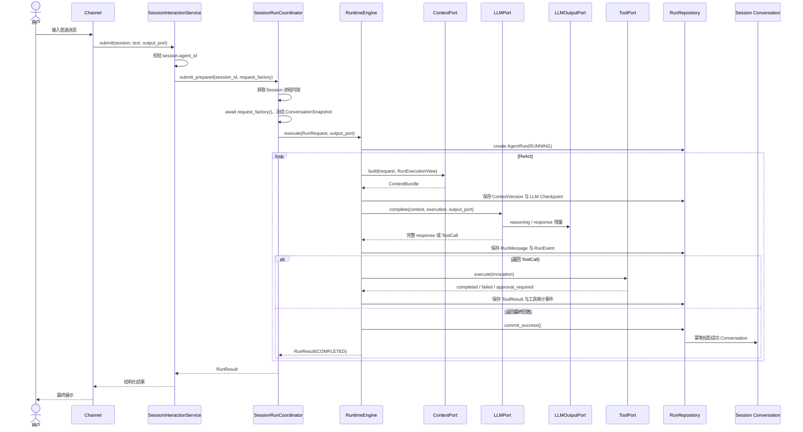
```mermaid
sequenceDiagram
    actor User as 用户
    participant Channel as Channel
    participant App as SessionInteractionService
    participant Coord as SessionRunCoordinator
    participant Engine as RuntimeEngine
    participant Context as ContextPort
    participant LLM as LLMPort
    participant Output as LLMOutputPort
    participant Tool as ToolPort
    participant Repo as RunRepository
    participant Session as Session Conversation

    User->>Channel: 输入普通消息
    Channel->>App: submit(session, text, output_port)
    App->>App: 校验 session.agent_id
    App->>Coord: submit_prepared(session_id, request_factory)
    Coord->>Coord: 获取 Session 进程内锁
    Coord->>Coord: await request_factory()，冻结 ConversationSnapshot
    Coord->>Engine: execute(RunRequest, output_port)

    Engine->>Repo: create AgentRun(RUNNING)
    loop ReAct
        Engine->>Context: build(request, RunExecutionView)
        Context-->>Engine: ContextBundle
        Engine->>Repo: 保存 ContextVersion 与 LLM Checkpoint
        Engine->>LLM: complete(context, execution, output_port)
        LLM->>Output: reasoning / response 增量
        LLM-->>Engine: 完整 response 或 ToolCall
        Engine->>Repo: 保存 RunMessage 与 RunEvent

        alt 返回 ToolCall
            Engine->>Tool: execute(invocation)
            Tool-->>Engine: completed / failed / approval_required
            Engine->>Repo: 保存 ToolResult 与工具审计事件
        else 返回最终回答
            Engine->>Repo: commit_success()
            Repo->>Session: 幂等投影成功 Conversation
            Engine-->>Coord: RunResult(COMPLETED)
        end
    end
    Coord-->>App: RunResult
    App-->>Channel: 结构化结果
    Channel-->>User: 最终展示
```

普通用户消息**总是创建新 Run**。只有审批恢复、重试中断、放弃和取消等结构化控制操作才定位已有 Run。

### 2.3 reasoning 与 response 的输出边界

最新 Runtime 将模型增量输出区分为两类：

```text
reasoning_delta
→ 仅通过 LLMOutputPort 实时交给入口层
→ 不聚合进 RunMessage.content
→ 不进入 Conversation
→ 不进入后续 Context

response_delta
→ 通过 LLMOutputPort 实时交给入口层
→ 同时聚合为完整 assistant RunMessage
→ 成功后投影到 Conversation
→ 可进入后续 Context
```

因此，`LLMOutputPort` 是**运行级输出通道**，不是 Runtime 事实仓储。`RunResult.has_streamed_response` 只用于避免入口层在已经增量展示 response 后重复输出最终正文。

### 2.4 依赖方向

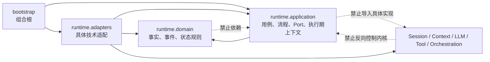
```mermaid
flowchart LR
    Domain["runtime.domain<br/>事实、事件、状态规则"]
    Application["runtime.application<br/>用例、流程、Port、执行期上下文"]
    Adapters["runtime.adapters<br/>具体技术适配"]
    External["Session / Context / LLM / Tool / Orchestration"]
    Bootstrap["bootstrap<br/>组合根"]

    Application --> Domain
    Adapters --> Application
    Adapters --> Domain
    Adapters --> External
    Bootstrap --> Application
    Bootstrap --> Adapters

    Domain -.禁止依赖.-> Application
    Application -.禁止导入具体实现.-> External
    External -.禁止反向控制内核.-> Application
```

源码层面的约束是：

1. Domain 不依赖 Application、Adapter 或外部模块。
2. Application 定义 Port，不导入具体 Adapter。
3. Adapter 可以依赖 Runtime 契约和外部模块。
4. Bootstrap 创建对象并连接依赖。
5. Context、LLM、Tool 和 Orchestration 不得直接修改 `AgentState` 或 `AgentRun`。

---

## 3. 组件总览

Runtime 的组成部分按职责分为执行核心、控制与可靠性、外部接入和生命周期支撑。部分重要类型物理上位于 `bootstrap/`、`context/` 或 `orchestration/`，但必须在 Runtime 文档中说明其接入角色，否则无法理解完整执行链。

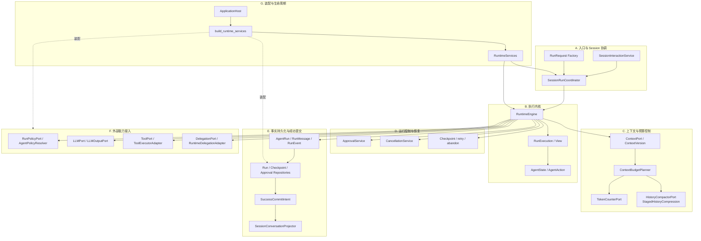
```mermaid
flowchart TB
    subgraph Entry["A. 入口与 Session 协调"]
        Interaction["SessionInteractionService"]
        RequestFactory["RunRequest Factory"]
        Coordinator["SessionRunCoordinator"]
    end

    subgraph Core["B. 执行内核"]
        Engine["RuntimeEngine"]
        Execution["RunExecution / View"]
        State["AgentState / AgentAction"]
    end

    subgraph ContextControl["C. 上下文与预算控制"]
        ContextPort["ContextPort / ContextVersion"]
        Budget["ContextBudgetPlanner"]
        Token["TokenCounterPort"]
        Compaction["HistoryCompactorPort<br/>StagedHistoryCompression"]
    end

    subgraph Control["D. 运行控制与恢复"]
        Approval["ApprovalService"]
        Cancellation["CancellationService"]
        Recovery["Checkpoint / retry / abandon"]
    end

    subgraph Facts["E. 事实持久化与成功提交"]
        RunFacts["AgentRun / RunMessage / RunEvent"]
        Repositories["Run / Checkpoint / Approval Repositories"]
        Commit["SuccessCommitIntent"]
        Projection["SessionConversationProjector"]
    end

    subgraph Integrations["F. 外部能力接入"]
        Policy["RunPolicyPort / AgentPolicyResolver"]
        LLM["LLMPort / LLMOutputPort"]
        Tool["ToolPort / ToolExecutorAdapter"]
        Delegation["DelegationPort / RuntimeDelegationAdapter"]
    end

    subgraph Lifecycle["G. 装配与生命周期"]
        Services["RuntimeServices"]
        Factory["build_runtime_services"]
        Host["ApplicationHost"]
    end

    Interaction --> Coordinator
    RequestFactory --> Coordinator
    Coordinator --> Engine
    Engine --> Execution
    Execution --> State

    Engine --> ContextPort
    ContextPort --> Budget
    Budget --> Token
    Budget --> Compaction

    Engine --> Approval
    Engine --> Cancellation
    Engine --> Recovery

    Engine --> RunFacts
    RunFacts --> Repositories
    Repositories --> Commit
    Commit --> Projection

    Engine --> Policy
    Engine --> LLM
    Engine --> Tool
    Engine --> Delegation

    Host --> Factory
    Factory --> Services
    Services --> Coordinator
    Services --> Engine
    Factory -.装配.-> Integrations
    Factory -.装配.-> Repositories
```

### 3.1 组成部分与责任

| 层级 | 组成部分 | 稳定职责 | 主要入口 |
|---|---|---|---|
| 入口与协调 | Session 交互入口 | Session → Identity 路由和控制用例 | `SessionInteractionService` |
| 入口与协调 | 请求冻结 | 从 Session 复制不可变历史视图 | `create_run_request` |
| 入口与协调 | Session 租约 | 同 Session 串行、跨 Session 并行 | `SessionRunCoordinator` |
| 执行内核 | 运行协调器 | 创建、恢复并驱动一个 Run | `RuntimeEngine` |
| 执行内核 | 执行期事务 | 保存一次 Run 的内存控制数据 | `RunExecution` |
| 执行内核 | 状态规则 | 领域事件 → 新状态与下一动作 | `AgentState` |
| 上下文控制 | Context 版本 | 冻结 LLM 调用前的稳定 Slot | `ContextVersion` |
| 上下文控制 | Token 预算 | 精确判断继续、压缩或拒绝 | `ContextBudgetPlanner` |
| 上下文控制 | 历史压缩 | 生成、暂存并成功后提交摘要 | `HistoryCompactorPort` |
| 运行控制 | 审批 | approval_id 与原 Run 的一次性关联 | `ApprovalService` |
| 运行控制 | 取消 | 活动 Run 令牌和父子取消映射 | `CancellationService` |
| 运行控制 | 中断恢复 | 安全边界重试或放弃 | `retry_interrupted` |
| 事实持久化 | 运行事实 | Run 摘要、消息、事件、Checkpoint | Domain facts + Repository |
| 事实持久化 | 成功提交 | 文件系统上的可恢复多事实提交 | `SuccessCommitIntent` |
| 外部接入 | 运行策略 | 冻结 Identity、模型、工具和预算 | `AgentPolicyResolver` |
| 外部接入 | 模型与输出 | 模型调用、reasoning/response 输出 | `LLMProxyAdapter` |
| 外部接入 | 工具 | Tool 执行和结构化审批需求 | `ToolExecutorAdapter` |
| 外部接入 | 委派 | 目标 Session、Task 和子 Run | `RuntimeDelegationAdapter` |
| 生命周期 | Runtime 装配 | 创建 Port 实现并双向绑定委派 | `build_runtime_services` |
| 生命周期 | 进程生命周期 | 启动恢复和资源逆序关闭 | `ApplicationHost` |

---

## 4. 各组件的类与职责

本节从逻辑组件进入核心类、协议、数据对象和重要实现细节。每个重要类或子部分先说明职责、存在原因和调用链位置，再展开字段、行为与边界。

### 4.1 入口与 Session 协调

#### 4.1.1 `SessionInteractionService`

**职责与用途：**`SessionInteractionService` 是 Runtime 的应用级会话入口。它解决“外部只知道 Session，而 Runtime 必须得到明确 Agent Identity 和冻结 RunRequest”的问题，位于 Channel 与 `SessionRunCoordinator` 之间。

它负责：

- 加载或校验 Session；
- 以 `session.agent_id` 为权威，在 `AgentRegistry` 中验证 Identity；
- 创建 Session 时显式写入 Identity；
- 将普通消息包装为延迟执行的 `RunRequest` Factory；
- 将审批、取消、重试和放弃交给 Coordinator；
- 协调 Session 物理删除、审批清理和 Context 缓存释放；
- 返回 `RunResult`，不自行渲染。

它不负责：

- 构造运行时 Agent 门面；
- 直接调用 LLM、Tool 或 MCP；
- 持有 Runtime 状态；
- 判断自然语言是否表示审批；
- 在普通提交时绕过 Session 锁。

普通提交使用 `submit_prepared()`，请求在获得 Session 锁之后才冻结。这防止两个并发请求同时基于同一 Conversation 版本生成快照。

#### 4.1.2 `create_run_request` 与 `ConversationSnapshot`

**职责与用途：**请求工厂将可变 Session 数据复制为 Runtime 可独立使用的不可变输入。它让 Engine 在运行期间不需要重新读取 Session，从而避免 Conversation、历史压缩版本或 Identity 在半途中变化。

生成的 `RunRequest` 包含：

```text
session_id
lease_id
agent_id
本次 user_message
ConversationSnapshot
parent_run_id / root_run_id
可选预分配 run_id
```

`ConversationSnapshot` 只保留：

- 活动历史压缩摘要；
- 压缩边界之后仍需原文注入的 Conversation；
- 冻结时的 Conversation 版本。

它不是 Session 持久化实体，也不允许 Engine 反向修改 Session。

#### 4.1.3 `SessionRunCoordinator`

**职责与用途：**`SessionRunCoordinator` 是 Session 级串行边界。它避免同一 Conversation 被两个 Run 并发读取和提交，同时保留不同 Session 的并行能力。

内部结构：

```text
dict[session_id, asyncio.Lock]
+ 一个保护锁表的 _locks_guard
+ RuntimeControlPort
```

主要行为：

| 方法 | 作用 |
|---|---|
| `submit()` | 已有 RunRequest 的普通提交 |
| `submit_prepared()` | 在 Session 锁内冻结请求并执行 |
| `resolve_approval()` | 在审批所属 Session 锁内恢复 |
| `retry_interrupted()` | 在所属 Session 锁内重试 |
| `abandon_interrupted()` | 在所属 Session 锁内放弃 |
| `cancel()` | 不等待 Session 锁，立即发送取消 |
| `_prepare_new_request()` | 恢复旧 RUNNING、处理 INTERRUPTED、拒绝其他占用 |

取消不能等待当前 Run 正持有的 Session 锁，否则会形成：

```text
Run 持锁等待外部调用结束
→ 取消操作等待同一锁
→ Run 又依赖取消信号才能尽快退出
```

因此 `cancel()` 是特殊的旁路控制。

当前锁只存在于单进程内。Repository 中的活动 Run 检查可以发现持久化冲突，但不是跨进程原子租约。

---

### 4.2 执行内核

#### 4.2.1 `RuntimeEngine`

**职责与用途：**`RuntimeEngine` 是 Runtime Application 的主协调器。它为每次请求创建或恢复局部 `RunExecution`，按确定顺序调用 Port、持久化事实并收口终态，但自身不保存任何单次 Run 的共享状态。

构造依赖：

```text
RunRepository
CheckpointRepository
ContextPort
LLMPort
ToolPort
RunPolicyPort
ApprovalService
CancellationService
DelegationPort
TokenCounterPort
HistoryCompactorPort
```

核心公开用例：

| 方法 | 语义 |
|---|---|
| `execute()` | 创建新 Run 并执行 |
| `resolve_approval()` | 消费审批并恢复原 Run |
| `retry_interrupted()` | 从 LLM 安全点重试中断 Run |
| `abandon_interrupted()` | 放弃中断 Run 并释放占用 |
| `cancel()` | 尽力取消活动、等待审批或子 Run |
| `recover_session()` | 将进程重启遗留 RUNNING 标记为 INTERRUPTED |
| `active_run()` | 查询 Session 当前唯一非终态 Run |

`RuntimeEngine` 的基本工作方式是：

```text
读取 AgentState.phase
→ 执行当前阶段需要的副作用
→ 将结果转换为 DomainEvent
→ AgentState.transition(event)
→ 保存消息、事件、Checkpoint 或终态
→ 进入下一轮
```

Engine 不应：

- 保存 `_current_session` 或 `_current_agent`；
- 直接 import 具体 Provider、ToolHandler 或 SessionManager；
- 将 Channel 交互混入主循环；
- 将 Journal 当作运行事实；
- 在不安全边界盲目重放 Tool。

#### 4.2.2 `RunExecution`

**职责与用途：**`RunExecution` 是一次 AgentRun 的短生命周期内存事务对象。它承载主循环所需的可变控制数据，避免这些字段进入共享 Engine，也避免把每次状态更新都立即建模为长期实体。

主要字段：

| 字段 | 用途 |
|---|---|
| `run_id` | 当前运行标识 |
| `request` | 冻结输入；历史压缩时可替换为重建请求 |
| `policy` | 本 Run 的不可变策略 |
| `state` | 当前 `AgentState` |
| `budget` | 运行预算控制对象 |
| `message_cursor` | 已保存消息游标 |
| `cancellation` | 当前 Run 的取消令牌 |
| `pending_control` | 等待审批或委派的最小引用 |
| `run_messages` | 已持久化 ReAct 证据 |
| `has_streamed_response` | 是否已输出 response 增量 |
| `active_context_version` | 当前活动上下文版本 |
| `staged_history_compressions` | 未提交到 Session 的候选 |
| `replay_active_context` | 恢复时是否重放活动版本 |
| `context_budget_decision` | 最近一次预算结论 |

它在 Run 结束后销毁。长期恢复所需内容必须存在于 Repository，而不能依赖仍在内存中的 `RunExecution`。

#### 4.2.3 `RunExecutionView`

**职责与用途：**`RunExecutionView` 是提供给 Port 的只读执行视图。它防止 Context、LLM、Tool 或 Delegation 实现直接修改 Runtime 的内部事务状态。

Port 可以读取：

- run_id 和 session_id；
- 冻结 Policy；
- 当前状态与预算；
- 已保存 RunMessage；
- 活动 ContextVersion；
- staged 压缩引用；
- 恢复重放标记。

Port 不应获得：

- Repository 写权限；
- 状态转换方法；
- Session 可变对象；
- Engine 内部循环控制。

#### 4.2.4 `AgentState`、`AgentPhase` 与 `AgentAction`

**职责与用途：**`AgentState` 是不依赖外部实现的纯领域状态机。它将“当前最小控制状态 + 已发生领域事件”转换为“新状态 + Application 下一动作”，用于隔离流程规则与 I/O 副作用。

主要阶段：

```text
IDLE
WAITING_LLM
WAITING_TOOLS
WAITING_APPROVAL
WAITING_DELEGATION
FINALIZING
COMPLETED
FAILED
CANCELLED
INTERRUPTED
ABANDONED
```

主要动作：

```text
INVOKE_LLM
EXECUTE_TOOLS
WAIT
FINALIZE
HANDOFF_TARGET
```

典型转换：

```text
RunStarted
IDLE → WAITING_LLM / INVOKE_LLM

LLMCompleted(tool_calls)
WAITING_LLM → WAITING_TOOLS / EXECUTE_TOOLS

ToolCompleted(completed)
WAITING_TOOLS → WAITING_LLM / INVOKE_LLM

ToolCompleted(approval_required)
WAITING_TOOLS → WAITING_APPROVAL / WAIT

ApprovalResolved(approved)
WAITING_APPROVAL → WAITING_TOOLS / EXECUTE_TOOLS

DelegationSubmitted
WAITING_TOOLS → WAITING_DELEGATION / WAIT

DelegationCompleted(success)
WAITING_DELEGATION → WAITING_LLM / INVOKE_LLM
```

状态机只做规则校验，不调用 LLM、Tool、Repository、Session 或 Channel。

需要注意：当前模型通过名为 `delegate` 的 Tool Call 进入委派路径时，Engine 调用 `_delegate(..., manage_state=False)`，因此主路径不会实际推进到 `WAITING_DELEGATION`；该阶段属于领域模型已经定义、但当前 tool-based delegation 尚未采用的独立转换分支。

---

### 4.3 运行事实与数据容器

#### 4.3.1 `AgentRun`

**职责与用途：**`AgentRun` 是一次运行的长期索引和终态摘要。它回答“这次运行属于谁、处于什么状态、引用哪些事实、最终结果如何”，而不是保存完整执行正文。

保存：

- Session、Agent、父子 Run 归属；
- `RunStatus`；
- 冻结 `AgentPolicySnapshot`；
- 输入、最终消息和 Checkpoint 引用；
- 活动 ContextVersion；
- staged 历史压缩候选；
- 成功提交控制意图；
- 统计和错误摘要。

不保存：

- 完整 prompt；
- 完整 Tool 结果副本；
- 全部事件；
- 全部状态机历史。

#### 4.3.2 `RunMessage`

**职责与用途：**`RunMessage` 是一次 Run 中模型和工具真实收发内容的正文事实。它保证 ReAct 的 LLM 响应、Tool Call、Tool Result 和最终回答可以被下一轮 Context 与恢复流程重放。

当前类型：

```text
USER_INPUT
LLM_RESPONSE
TOOL_RESULT
DELEGATION_RESULT
FINAL_RESPONSE
ERROR
```

`LLM_REQUEST` 仅为旧格式读取兼容保留，新路径用 `LLM_STARTED` 事件表达调用开始。

reasoning 文本不写入 `RunMessage.content`。只有 response 正文和 Tool Call 才形成标准化 assistant RunMessage。

#### 4.3.3 `RunEvent`

**职责与用途：**`RunEvent` 是按 sequence 追加的审计事实。它回答“运行按什么顺序经过了哪些边界”，通过 message_id 引用正文，避免在事件中重复保存大内容。

主要事件：

- Run 开始和终态；
- LLM 开始与完成；
- Tool 开始与完成；
- 审批等待与恢复；
- 委派提交与完成；
- 中断、放弃和取消。

工具审计采用成对事件：

```text
TOOL_STARTED(call_id, tool_name)
→ TOOL_COMPLETED(status, result_message_id, error_summary)
```

事件中的错误摘要应被截断和脱敏，不复制完整工具输出。

#### 4.3.4 `ContextVersion`

**职责与用途：**`ContextVersion` 是一次业务 LLM 调用前形成的不可变稳定上下文快照。它保存快照型 Slot 的真实载荷和 hash，使审批恢复、重试和审计可以确认当时模型看到的稳定信息。

它保存：

- 有序 `ContextSlotSnapshot`；
- 内容 hash；
- Tool Schema hash；
- 版本与创建时间。

它不保存事实引用型 RunMessage 正文。动态 ReAct 证据仍保存在 `RunMessage`，由 Context metadata 和 `LLM_STARTED` 事件引用。

#### 4.3.5 `RunCheckpoint`

**职责与用途：**`RunCheckpoint` 是从安全边界恢复所需的最小控制快照。它避免把完整上下文和工具结果复制到第三个存储位置，只保存恢复游标和引用。

保存：

```text
agent_state
next_action
message_sequence
event_sequence
pending control
budget
active_context_version
staged candidate ids
```

明确禁止：

```text
prompt
full_prompt
messages
tool_result
tool_results
```

#### 4.3.6 `RunRequest` 与 `RunResult`

**职责与用途：**`RunRequest` 和 `RunResult` 是 Runtime 与应用入口之间的稳定用例 DTO。前者冻结一次执行输入，后者只返回入口层需要的终态、最终回答、错误、审批标识和流式展示信息。

`RunResult` 可能表示：

```text
COMPLETED
FAILED
CANCELLED
WAITING_APPROVAL
INTERRUPTED
ABANDONED
```

`has_streamed_response` 不是业务完成状态，只表示入口是否已经收到过 response 文本。

---

### 4.4 上下文与预算控制

#### 4.4.1 `ContextPort`

**职责与用途：**`ContextPort` 是 Runtime 获取完整模型输入的边界。Runtime 决定何时构建、版本化和计数，Context 模块决定 Slot 如何加载、排序、降级和物化。

接口提供：

- `build(request, execution)`；
- 按 Owner 释放缓存；
- 请求 Slot 刷新；
- 发布定向刷新信号。

`ContextBundle` 返回：

```text
messages
tools
metadata
```

Runtime 不直接拼接 Memory、Skills、Agent 或 Workspace 内容。

#### 4.4.2 `ContextBudgetPlanner`

**职责与用途：**`ContextBudgetPlanner` 在每次业务 LLM 调用前，对真实结构化输入进行精确预算判断。它消除字符数估算与模型真实 Token 之间的偏差，明确返回继续、压缩或拒绝。

结果：

| 状态 | 语义 |
|---|---|
| `WITHIN_BUDGET` | 可以直接调用模型 |
| `COMPACTION_REQUIRED` | 应压缩最旧完整 Conversation |
| `REJECTED` | Tokenizer 或策略配置不可用，或输入无法满足约束 |

它不自行调用压缩模型，也不修改 Session。

#### 4.4.3 `TiktokenTokenCounter`

**职责与用途：**`TiktokenTokenCounter` 是 `TokenCounterPort` 的当前实现。它使用 Agent Policy 中冻结的显式 tokenizer encoding 统计系统内容、历史摘要、历史原文、当前输入、RunMessage 和 Tool Schema。

它不提供字符估算回退。encoding 缺失或不可用时返回确定性错误，由 Runtime 映射为 `TOKENIZER_UNAVAILABLE`。

#### 4.4.4 `LLMContextCompactor`

**职责与用途：**`LLMContextCompactor` 将 Runtime 的历史压缩请求适配为不携带工具的专用 LLM 调用。它只生成摘要，不参与业务 Tool 执行，也不直接提交 Session。

压缩输入包含：

- 已有摘要；
- 选中的完整 Conversation 批次；
- 目标预算；
- 稳定 fragment id。

空摘要或服务不可用不会覆盖原始历史。

#### 4.4.5 `StagedHistoryCompression`

**职责与用途：**`StagedHistoryCompression` 表示“本 Run 已使用、但尚未提交给 Session”的压缩候选。它解决运行失败时不应污染长期会话摘要的问题。

生命周期：

```text
STAGED
→ 后续新候选产生时 SUPERSEDED
→ Run 成功时最新候选 COMMITTED
→ Run 失败或取消时不投影 Session
```

摘要正文只存在于候选引用的 `ContextVersion`，`run.json` 仅保存 hash、边界和版本引用。

---

### 4.5 运行控制与恢复

#### 4.5.1 `ApprovalService`

**职责与用途：**`ApprovalService` 将 Tool 返回的 approval_id 与等待中的 run_id、session_id 建立持久化且一次性可消费的关联。它让入口层只能通过有效审批标识恢复正确的原 Run。

主要行为：

- 创建 `PENDING` 记录；
- 查询 pending 记录以定位 Session 锁；
- 消费审批，防止同一 approval_id 被重复恢复。

它不判断 Tool 是否危险，也不与用户直接交互。

#### 4.5.2 `ApprovalRepositoryAdapter`

**职责与用途：**`ApprovalRepositoryAdapter` 是审批关联的文件型持久化实现。它以 approval_id 作为索引，支持创建、读取、消费和按 Session 清理。

当前消费过程是：

```text
load pending JSON
→ 写回 status=CONSUMED
→ 返回记录
```

它满足单进程正常路径的一次消费语义，但不是跨进程数据库式 compare-and-swap。

#### 4.5.3 `CancellationService`

**职责与用途：**`CancellationService` 集中保存当前进程中活动 Run 的 `CancellationToken`，以及父 Run 当前等待的 child_run_id。它使取消请求不需要进入 Engine 的共享“当前运行”字段。

保存的是短生命周期控制引用：

```text
run_id → CancellationToken
parent_run_id → child_run_id
```

业务终态仍由 Engine 持久化。

#### 4.5.4 中断、重试与放弃

**职责与用途：**可恢复中断用于区分“确定性业务失败”和“在安全边界发生的暂时外部不可用”。Runtime 仅允许从明确的 LLM 调用前 Checkpoint 重试。

当前中断来源主要包括：

- LLM 服务重试耗尽；
- 历史压缩服务不可用；
- 进程重启遗留 RUNNING Run。

重试要求：

```text
RunStatus == INTERRUPTED
checkpoint 存在
checkpoint.next_action == INVOKE_LLM
active_context_version 存在
用户输入 RunMessage 存在
```

放弃中断 Run 会：

- 保存 `ABANDONED`；
- 删除 Checkpoint；
- 保留 RunMessage 和 RunEvent 供审计；
- 释放 Session 占用；
- 不写 Conversation。

---

### 4.6 事实持久化与成功提交

#### 4.6.1 `RunRepositoryAdapter`

**职责与用途：**`RunRepositoryAdapter` 是 Runtime 长期事实的本地文件实现。它保存 AgentRun、RunMessage、ContextVersion 和 RunEvent，并协调成功 Conversation 投影。

主要职责：

- 防止 run_id 覆盖和重复；
- 原子替换 JSON 文件；
- 追加并校验连续 ContextVersion；
- 追加有序 RunEvent；
- 扫描 Session 的非终态 Run；
- 执行和恢复 `SuccessCommitIntent`；
- 在读取 Run、查找 Run 或读取 Conversation 前补偿未决提交。

它既是当前本地实现，也是后续数据库 Adapter 需要遵循的行为契约参考。

#### 4.6.2 `CheckpointRepositoryAdapter`

**职责与用途：**`CheckpointRepositoryAdapter` 保存每个 Run 最新的恢复快照。它对字段递归检查，阻止完整 prompt、messages 和 Tool Result 进入 Checkpoint。

当前仅接受存储格式 v4。旧格式不会被静默迁移或兼容读取，以避免产生两套恢复事实。

#### 4.6.3 `SessionConversationProjector`

**职责与用途：**`SessionConversationProjector` 将成功 Run 的用户输入和最终回答投影为一条 Session Conversation，并在同一次 Session 保存中提交最新历史压缩。

它通过 `agent_run_ids` 判断该 Run 是否已经投影，保证补偿重试不会生成重复 Conversation。

失败、取消、中断、审批等待和放弃 Run 都不会调用该投影。

#### 4.6.4 `SuccessCommitIntent`

**职责与用途：**`SuccessCommitIntent` 是文件系统缺少跨文件事务时的恢复控制记录。它解决 Conversation、RUN_COMPLETED 事件和 `run.json=COMPLETED` 可能在进程崩溃时只写入一部分的问题。

当前顺序：

```text
创建 success_commit.json
→ 在 run.json 写入控制意图
→ 幂等投影 Conversation 与最新摘要
→ 幂等确保 RUN_COMPLETED
→ 写 run.json=COMPLETED
→ 删除 checkpoint
→ 删除 success_commit.json
```

`run.json=COMPLETED` 是最后的完成标记。临时意图文件不是长期业务事实，完成后必须删除。

---

### 4.7 LLM 与运行级输出接入

#### 4.7.1 `LLMPort`

**职责与用途：**`LLMPort` 是 Runtime 调用业务模型的最小协议。它接收标准 `ContextBundle` 和只读 `RunExecutionView`，返回完整 `RunMessage`，并可接收本次调用专属的 `LLMOutputPort`。

Runtime 不认识 Provider SDK、模型路由、熔断器或 reasoning 标签格式。

#### 4.7.2 `LLMProxyAdapter`

**职责与用途：**`LLMProxyAdapter` 将现有 `LLMProxy` 的流式 `ChatChunk` 转换为 Runtime 的标准消息、ToolCall、Token 统计和输出事件。

处理规则：

- reasoning delta：只 emit；
- response delta：emit 并聚合；
- ToolCall：解析 JSON arguments；
- usage：写入 response metadata；
- 代理异常：映射为 `LLMUnavailableError`。

它返回的 `RunMessage.metadata.has_streamed_response` 供 Engine 更新 `RunResult`。

#### 4.7.3 `LLMOutputPort` 与 `LLMOutputEvent`

**职责与用途：**`LLMOutputPort` 将“模型生成过程的即时展示”与“Runtime 长期事实”分开。它是每次提交或恢复时传入的运行级参数，不在 Adapter 构造期绑定全局 Channel。

事件字段：

```text
session_id
run_id
kind = reasoning_delta | response_delta
content
```

这使并发 Session 的输出可以正确归属，同时避免共享 LLM Client 持有跨请求流状态。

#### 4.7.4 模型取消边界

**职责与用途：**`LLMPort.cancel(run_id)` 为 Runtime 提供尽力取消协议，使未来 Provider 可以实现真实传输取消。

当前 `LLMProxyAdapter.cancel()` 没有底层句柄，是空实现。因此当前取消主要依赖：

- Engine 设置 `CancellationToken`；
- 当前模型调用自然返回或失败；
- Engine 在安全点收口。

---

### 4.8 Tool 接入

#### 4.8.1 `ToolPort`

**职责与用途：**`ToolPort` 是 Runtime 执行单个标准化 Tool Call 的边界。它隐藏 Tool Registry、Capability、Policy、MCP 和具体 Handler，只返回完成、失败或审批需求。

Runtime 负责：

- 调用顺序；
- RunMessage 和工具审计事件；
- 审批持久化；
- 状态转换和终态。

Tool 模块负责：

- 参数校验；
- 资源解释；
- Policy；
- Handler 副作用；
- Tool 级结果。

#### 4.8.2 `ToolExecutorAdapter`

**职责与用途：**`ToolExecutorAdapter` 将现有 ToolExecutor 适配为无 Channel 副作用的 Runtime `ToolPort`。它在 `(run_id, call_id)` 范围内区分等待和已执行调用，并将 Tool 的审批要求转换成 Runtime DTO。

当前特点：

- 稳定 approval_id 由 run_id 和 call_id 生成；
- `approved=True` 时依据持久化 Checkpoint 执行；
- Adapter 内集合不是审批恢复权威；
- Run 终态时由 Engine 调用可选 `clear_run()`；
- Tool 细粒度错误目前统一映射为 `RunErrorCode.TOOL_FAILURE`；
- 不具备真实运行中 Tool 句柄取消。

#### 4.8.3 Tool 审计事件

**职责与用途：**Runtime 在 ToolPort 调用前后写入成对审计事件，使工具失败、审批、取消和委派都能形成完整时间线。

审计事件不复制 Tool 参数和完整结果正文，只保存：

- call_id；
- tool_name；
- source/result message id；
- 标准状态；
- 截断错误摘要。

---

### 4.9 Run Policy 接入

#### 4.9.1 `RunPolicyPort`

**职责与用途：**`RunPolicyPort` 在 Run 创建之前解析并冻结 Agent 执行策略。它使模型、工具定义、提示词和上下文窗口在一次 Run 中保持稳定，而不是每轮重新读取可变配置。

#### 4.9.2 `AgentPolicyResolver`

**职责与用途：**`AgentPolicyResolver` 将 `AgentIdentity`、全局 Config、模型路由配置和 Tool Registry 定义快照转换为 `AgentPolicySnapshot`。

冻结内容：

```text
agent_id
identity_version
model_id
max_iterations
system_prompt
模型可见 Tool Definitions
project_root
context_window
tokenizer_encoding
压缩模型与 tokenizer
```

它支持主 Agent 和 `AgentRegistry` 中的 delegation target Identity。

需要准确区分：

- 冻结的是模型可见 Tool 定义；
- ToolExecutor 实际执行时仍按名称访问当前 Registry；
- 快照不保证 Handler 或外部服务在整个 Run 中持续可用。

---

### 4.10 Delegation 接入

#### 4.10.1 `DelegationPort`

**职责与用途：**`DelegationPort` 将子 Agent 执行抽象为提交、读取结果和取消三个动作。RuntimeEngine 不认识 Dispatcher、TaskMessageBroker 或目标 Session 的具体实现。

#### 4.10.2 `RuntimeDelegationAdapter`

**职责与用途：**`RuntimeDelegationAdapter` 将模型的 `delegate` Tool Call 转换为目标 Agent 的新 Session、Orchestration Task 和子 Run，并通过同一个 `SessionRunCoordinator` 提交。

主要流程：

```text
校验 target Agent
→ 创建目标 Session
→ 创建 Dispatcher Task
→ 预分配 child_run_id
→ 同一 Coordinator 提交子 Run
→ 等待 RunResult
→ 转换为 DelegationResult
→ 完成 Task
```

父 Run 保存：

- parent_run_id；
- root_run_id；
- child_run_id；
- task_id；
- 目标 Session；
- 子结果 RunMessage 与事件。

当前运行中的 Task、结果缓存和绑定保存在进程内字典中，不支持重启后继续等待原 delegation。

---

### 4.11 Bootstrap 装配与生命周期

#### 4.11.1 `RuntimeServices`

**职责与用途：**`RuntimeServices` 是 Host 私有的装配结果容器。它只暴露 ApplicationHost 和应用入口需要的 Runtime 服务，不将 Tool、MCP、Skills 和 Memory 等展示资源重新包装进 Runtime。

包含：

```text
engine
context_port
coordinator
run_repository
approval_repository
agent_registry
```

#### 4.11.2 `build_runtime_services`

**职责与用途：**`build_runtime_services` 是 Runtime 的私有组合函数。它创建具体 Adapter、Repository、ContextProvider、DelegationAdapter、Engine 和 Coordinator，并完成 DelegationAdapter 对 Coordinator 的反向绑定。

关键装配：

```text
RunRepositoryAdapter
CheckpointRepositoryAdapter
ApprovalRepositoryAdapter
ContextProvider
LLMProxyAdapter
ToolExecutorAdapter
AgentPolicyResolver
TiktokenTokenCounter
LLMContextCompactor
RuntimeDelegationAdapter
RuntimeEngine
SessionRunCoordinator
```

#### 4.11.3 `ApplicationHost`

**职责与用途：**`ApplicationHost` 是唯一公开组合根和进程生命周期宿主。它先创建 LLM、Session、Tools、Memory、MCP 和 AgentRegistry，再装配 Runtime，并在启动时补偿未决成功提交。

Runtime 相关生命周期：

```text
初始化基础设施
→ MCP 首次发现
→ 加载所有 Identity
→ build_runtime_services
→ recover_pending_success_commits
→ 创建 SessionInteractionService

关闭：
MCP
→ Context 全部 Owner 缓存
→ 共享 HTTP Client
```

Host 不承载状态机和对话业务规则。

---

## 5. 组件依赖和使用流程

本节从动态角度说明普通执行、状态迁移、输出、审批、压缩、恢复、提交、取消和委派。相同组件在不同图中重复出现，是为了分别表达系统位置、生命周期和局部可靠性机制。

### 5.1 启动与装配流程

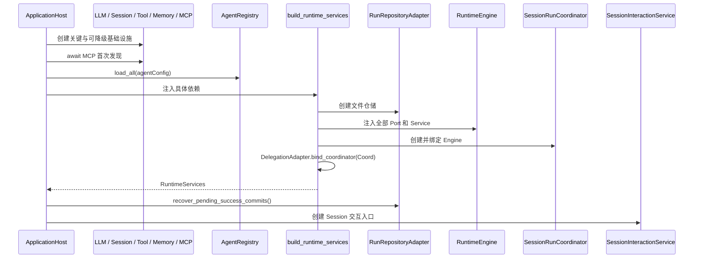
```mermaid
sequenceDiagram
    participant Host as ApplicationHost
    participant Infra as LLM / Session / Tool / Memory / MCP
    participant Registry as AgentRegistry
    participant Factory as build_runtime_services
    participant Repo as RunRepositoryAdapter
    participant Engine as RuntimeEngine
    participant Coord as SessionRunCoordinator
    participant App as SessionInteractionService

    Host->>Infra: 创建关键与可降级基础设施
    Host->>Infra: await MCP 首次发现
    Host->>Registry: load_all(agentConfig)
    Host->>Factory: 注入具体依赖
    Factory->>Repo: 创建文件仓储
    Factory->>Engine: 注入全部 Port 和 Service
    Factory->>Coord: 创建并绑定 Engine
    Factory->>Factory: DelegationAdapter.bind_coordinator(Coord)
    Factory-->>Host: RuntimeServices
    Host->>Repo: recover_pending_success_commits()
    Host->>App: 创建 Session 交互入口
```

**结论：**

- 首次 MCP 工具发现发生在 Runtime 对外就绪之前。
- 成功提交补偿发生在应用入口可用之前。
- Engine、Coordinator 和 Adapter 不自行读取全局配置。
- Delegation 需要组合根完成双向连接，但业务依赖方向仍通过 Port 隔离。

### 5.2 普通请求与 ReAct 主循环

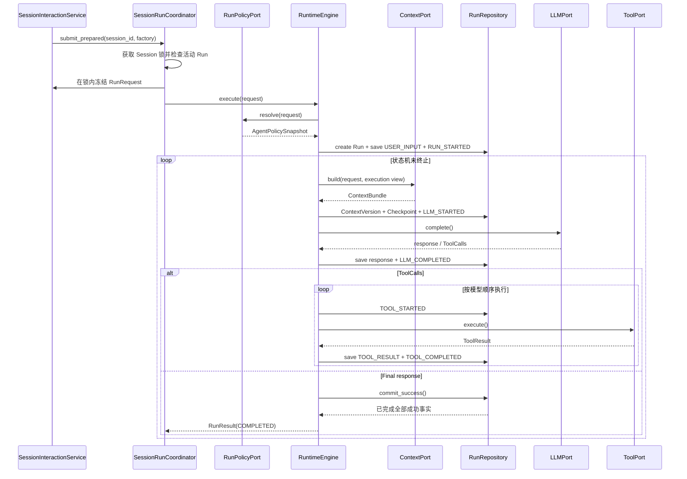
```mermaid
sequenceDiagram
    participant App as SessionInteractionService
    participant Coord as SessionRunCoordinator
    participant Policy as RunPolicyPort
    participant Engine as RuntimeEngine
    participant Context as ContextPort
    participant Repo as RunRepository
    participant LLM as LLMPort
    participant Tool as ToolPort

    App->>Coord: submit_prepared(session_id, factory)
    Coord->>Coord: 获取 Session 锁并检查活动 Run
    Coord->>App: 在锁内冻结 RunRequest
    Coord->>Engine: execute(request)
    Engine->>Policy: resolve(request)
    Policy-->>Engine: AgentPolicySnapshot
    Engine->>Repo: create Run + save USER_INPUT + RUN_STARTED

    loop 状态机未终止
        Engine->>Context: build(request, execution view)
        Context-->>Engine: ContextBundle
        Engine->>Repo: ContextVersion + Checkpoint + LLM_STARTED
        Engine->>LLM: complete()
        LLM-->>Engine: response / ToolCalls
        Engine->>Repo: save response + LLM_COMPLETED

        alt ToolCalls
            loop 按模型顺序执行
                Engine->>Repo: TOOL_STARTED
                Engine->>Tool: execute()
                Tool-->>Engine: ToolResult
                Engine->>Repo: save TOOL_RESULT + TOOL_COMPLETED
            end
        else Final response
            Engine->>Repo: commit_success()
            Repo-->>Engine: 已完成全部成功事实
            Engine-->>Coord: RunResult(COMPLETED)
        end
    end
```

普通请求没有“自动接续旧 Run”的自然语言分支。用户后续消息创建新 Run，模型通过 Conversation 理解上下文关系。

### 5.3 状态机与当前 Engine 驱动

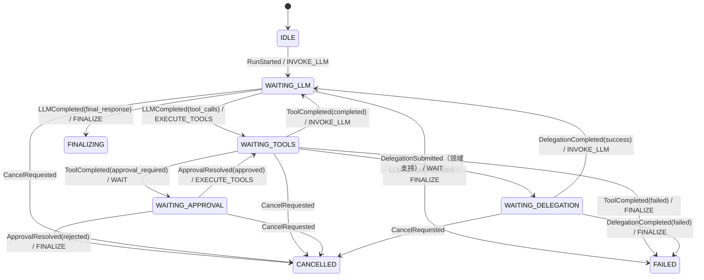
```mermaid
stateDiagram-v2
    [*] --> IDLE
    IDLE --> WAITING_LLM: RunStarted / INVOKE_LLM

    WAITING_LLM --> WAITING_TOOLS: LLMCompleted(tool_calls) / EXECUTE_TOOLS
    WAITING_LLM --> FINALIZING: LLMCompleted(final_response) / FINALIZE
    WAITING_LLM --> FAILED: LLMCompleted(failed) / FINALIZE

    WAITING_TOOLS --> WAITING_LLM: ToolCompleted(completed) / INVOKE_LLM
    WAITING_TOOLS --> WAITING_APPROVAL: ToolCompleted(approval_required) / WAIT
    WAITING_TOOLS --> FAILED: ToolCompleted(failed) / FINALIZE
    WAITING_TOOLS --> WAITING_DELEGATION: DelegationSubmitted（领域支持） / WAIT

    WAITING_APPROVAL --> WAITING_TOOLS: ApprovalResolved(approved) / EXECUTE_TOOLS
    WAITING_APPROVAL --> CANCELLED: ApprovalResolved(rejected) / FINALIZE

    WAITING_DELEGATION --> WAITING_LLM: DelegationCompleted(success) / INVOKE_LLM
    WAITING_DELEGATION --> FAILED: DelegationCompleted(failed) / FINALIZE

    WAITING_LLM --> CANCELLED: CancelRequested
    WAITING_TOOLS --> CANCELLED: CancelRequested
    WAITING_APPROVAL --> CANCELLED: CancelRequested
    WAITING_DELEGATION --> CANCELLED: CancelRequested
```

当前 Engine 主要根据 `AgentPhase` 分支执行，`AgentAction` 同时用于表达转换结果和写入 Checkpoint。状态机提供合法转换约束，但尚不是唯一的可执行计划解释器。尤其是当前 `delegate` Tool Call 使用 `manage_state=False`，不会进入图中的 `WAITING_DELEGATION`；该转换是领域模型能力而非当前主路径事实。详见“已知痛点”。

### 5.4 reasoning / response 双通道流程

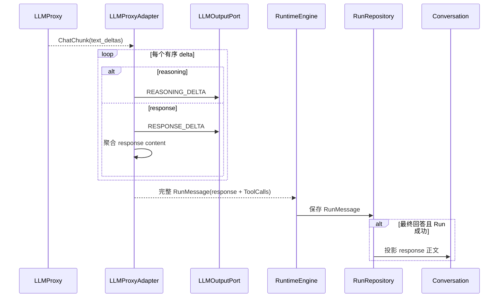
```mermaid
sequenceDiagram
    participant LLM as LLMProxy
    participant Adapter as LLMProxyAdapter
    participant Output as LLMOutputPort
    participant Engine as RuntimeEngine
    participant Repo as RunRepository
    participant Session as Conversation

    LLM-->>Adapter: ChatChunk(text_deltas)
    loop 每个有序 delta
        alt reasoning
            Adapter->>Output: REASONING_DELTA
        else response
            Adapter->>Output: RESPONSE_DELTA
            Adapter->>Adapter: 聚合 response content
        end
    end
    Adapter-->>Engine: 完整 RunMessage(response + ToolCalls)
    Engine->>Repo: 保存 RunMessage
    alt 最终回答且 Run 成功
        Repo->>Session: 投影 response 正文
    end
```

**结论：**

- reasoning 的生命周期止于输出端口；
- response 同时属于输出和事实；
- Tool Call 元数据仍由完整 LLM 响应进入 Runtime；
- 输出端口不是 RunEvent 的替代品；
- 当前没有通用持久化输出事件流。

### 5.5 上下文预算与 staged 压缩

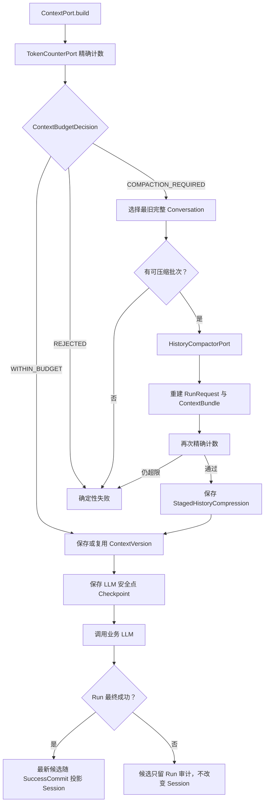
```mermaid
flowchart TD
    Build["ContextPort.build"] --> Count["TokenCounterPort 精确计数"]
    Count --> Decision{"ContextBudgetDecision"}

    Decision -->|WITHIN_BUDGET| Version["保存或复用 ContextVersion"]
    Decision -->|REJECTED| Fail["确定性失败"]
    Decision -->|COMPACTION_REQUIRED| Select["选择最旧完整 Conversation"]

    Select --> Available{"有可压缩批次？"}
    Available -->|否| Fail
    Available -->|是| Compact["HistoryCompactorPort"]
    Compact --> Rebuild["重建 RunRequest 与 ContextBundle"]
    Rebuild --> Recount["再次精确计数"]
    Recount -->|仍超限| Fail
    Recount -->|通过| Stage["保存 StagedHistoryCompression"]
    Stage --> Version

    Version --> Checkpoint["保存 LLM 安全点 Checkpoint"]
    Checkpoint --> LLM["调用业务 LLM"]
    LLM --> Success{"Run 最终成功？"}
    Success -->|是| Commit["最新候选随 SuccessCommit 投影 Session"]
    Success -->|否| KeepAudit["候选只留 Run 审计，不改变 Session"]
```

压缩只作用于最旧完整 Conversation，不静默裁掉当前输入、最新 Conversation 或 Tool Schema。

### 5.6 审批暂停与恢复

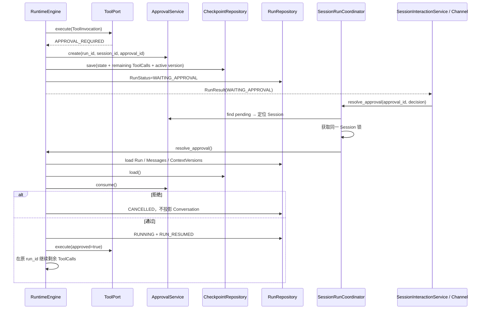
```mermaid
sequenceDiagram
    participant Engine as RuntimeEngine
    participant Tool as ToolPort
    participant Approval as ApprovalService
    participant Checkpoint as CheckpointRepository
    participant RunRepo as RunRepository
    participant Coord as SessionRunCoordinator
    participant Entry as SessionInteractionService / Channel

    Engine->>Tool: execute(ToolInvocation)
    Tool-->>Engine: APPROVAL_REQUIRED
    Engine->>Approval: create(run_id, session_id, approval_id)
    Engine->>Checkpoint: save(state + remaining ToolCalls + active version)
    Engine->>RunRepo: RunStatus=WAITING_APPROVAL
    Engine-->>Entry: RunResult(WAITING_APPROVAL)

    Entry->>Coord: resolve_approval(approval_id, decision)
    Coord->>Approval: find pending → 定位 Session
    Coord->>Coord: 获取同一 Session 锁
    Coord->>Engine: resolve_approval()

    Engine->>RunRepo: load Run / Messages / ContextVersions
    Engine->>Checkpoint: load()
    Engine->>Approval: consume()
    alt 拒绝
        Engine->>RunRepo: CANCELLED，不投影 Conversation
    else 通过
        Engine->>RunRepo: RUNNING + RUN_RESUMED
        Engine->>Tool: execute(approved=true)
        Engine->>Engine: 在原 run_id 继续剩余 ToolCalls
    end
```

审批恢复依赖：

```text
ApprovalRecord
+ AgentRun
+ RunCheckpoint
+ 活动 ContextVersion
+ RunMessage
```

Adapter 的内存 waiting 集合不是恢复事实源。

### 5.7 中断、重试和新请求替代

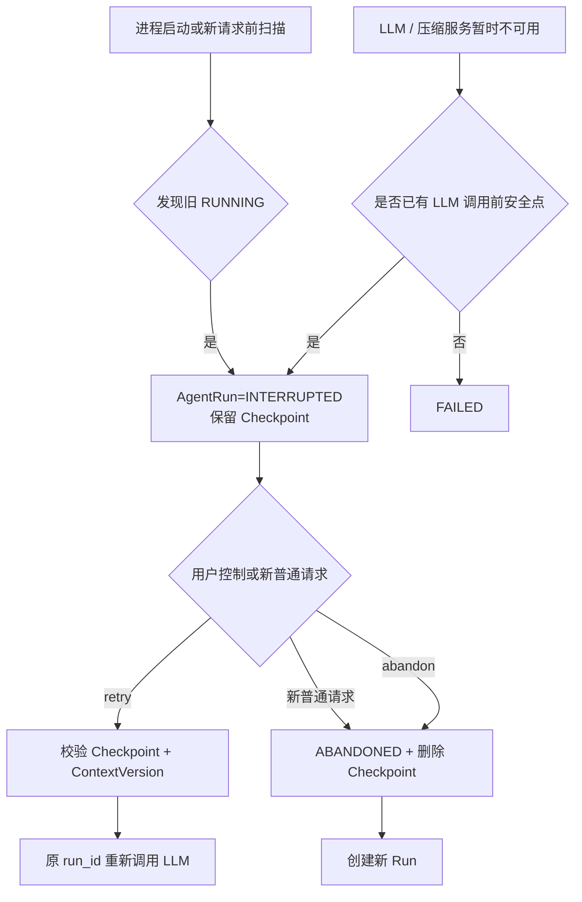
```mermaid
flowchart TD
    Failure["LLM / 压缩服务暂时不可用"] --> Safe{"是否已有 LLM 调用前安全点"}
    Safe -->|是| Interrupted["AgentRun=INTERRUPTED<br/>保留 Checkpoint"]
    Safe -->|否| Failed["FAILED"]

    Restart["进程启动或新请求前扫描"] --> Running{"发现旧 RUNNING"}
    Running -->|是| Interrupted

    Interrupted --> Choice{"用户控制或新普通请求"}
    Choice -->|retry| Validate["校验 Checkpoint + ContextVersion"]
    Validate --> Resume["原 run_id 重新调用 LLM"]
    Choice -->|abandon| Abandoned["ABANDONED + 删除 Checkpoint"]
    Choice -->|新普通请求| Abandoned
    Abandoned --> NewRun["创建新 Run"]
```

Coordinator 在新普通请求前自动放弃旧 `INTERRUPTED` Run；其他非终态占用返回 `SESSION_BUSY`。

### 5.8 成功提交补偿

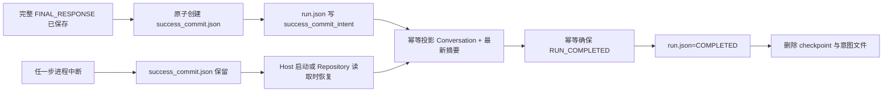
```mermaid
flowchart LR
    Final["完整 FINAL_RESPONSE 已保存"] --> Intent["原子创建 success_commit.json"]
    Intent --> Control["run.json 写 success_commit_intent"]
    Control --> Projection["幂等投影 Conversation + 最新摘要"]
    Projection --> Event["幂等确保 RUN_COMPLETED"]
    Event --> Finalize["run.json=COMPLETED"]
    Finalize --> Cleanup["删除 checkpoint 与意图文件"]

    Crash["任一步进程中断"] --> Remain["success_commit.json 保留"]
    Remain --> Recover["Host 启动或 Repository 读取时恢复"]
    Recover --> Projection
```

成功提交采用“先意图、后补偿、最后完成标记”。失败、取消和中断不进入此协议。

### 5.9 取消流程

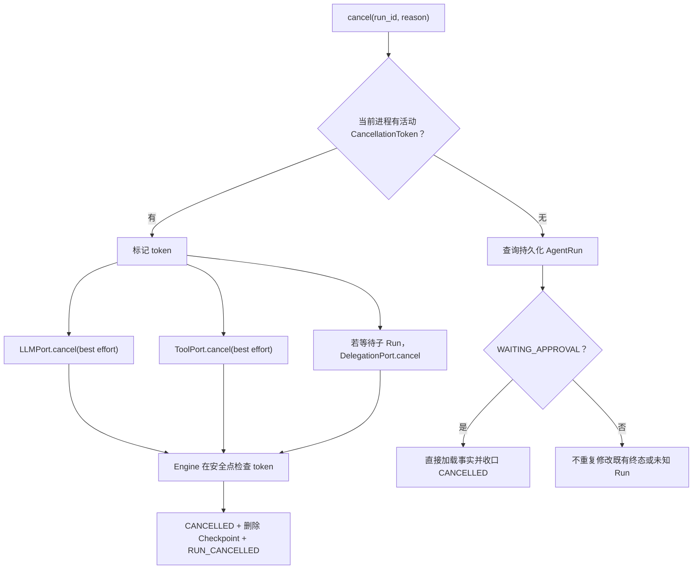
```mermaid
flowchart TD
    Cancel["cancel(run_id, reason)"] --> Token{"当前进程有活动 CancellationToken？"}
    Token -->|有| Mark["标记 token"]
    Mark --> LLM["LLMPort.cancel(best effort)"]
    Mark --> Tool["ToolPort.cancel(best effort)"]
    Mark --> Child["若等待子 Run，DelegationPort.cancel"]
    LLM --> Safe["Engine 在安全点检查 token"]
    Tool --> Safe
    Child --> Safe
    Safe --> Terminal["CANCELLED + 删除 Checkpoint + RUN_CANCELLED"]

    Token -->|无| Lookup["查询持久化 AgentRun"]
    Lookup --> Waiting{"WAITING_APPROVAL？"}
    Waiting -->|是| Direct["直接加载事实并收口 CANCELLED"]
    Waiting -->|否| Ignore["不重复修改既有终态或未知 Run"]
```

当前 LLM 和 Tool Adapter 没有真实底层执行句柄，取消属于尽力协议。

### 5.10 Delegation 流程

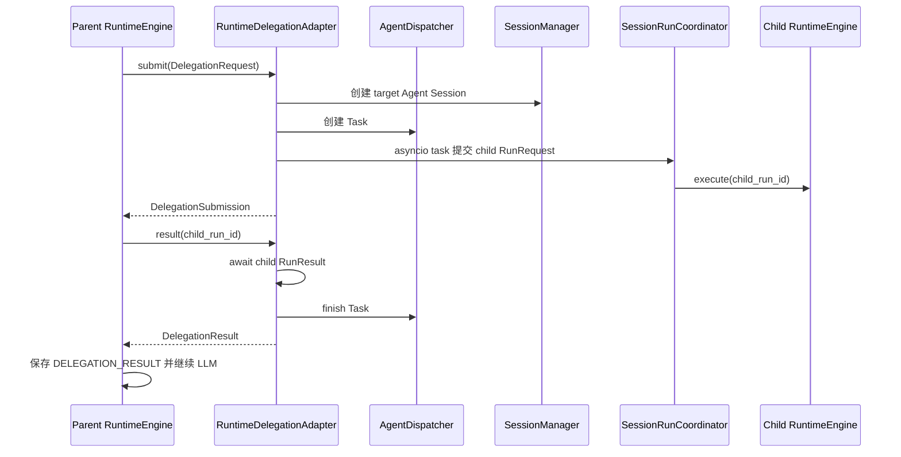
```mermaid
sequenceDiagram
    participant Parent as Parent RuntimeEngine
    participant Adapter as RuntimeDelegationAdapter
    participant Dispatcher as AgentDispatcher
    participant Session as SessionManager
    participant Coord as SessionRunCoordinator
    participant Child as Child RuntimeEngine

    Parent->>Adapter: submit(DelegationRequest)
    Adapter->>Session: 创建 target Agent Session
    Adapter->>Dispatcher: 创建 Task
    Adapter->>Coord: asyncio task 提交 child RunRequest
    Coord->>Child: execute(child_run_id)
    Adapter-->>Parent: DelegationSubmission
    Parent->>Adapter: result(child_run_id)
    Adapter->>Adapter: await child RunResult
    Adapter->>Dispatcher: finish Task
    Adapter-->>Parent: DelegationResult
    Parent->>Parent: 保存 DELEGATION_RESULT 并继续 LLM
```

父子 Run 使用不同 Session 锁，因此可以并行。取消可沿 parent → child 传播。

---

## 6. 对外接口与数据契约

### 6.1 Runtime 公共 API

`dotclaw.runtime` 当前导出：

```text
RuntimeEngine
SessionRunCoordinator
AgentPhase
AgentState
AgentAction
RunRequest
RunResult
RunStatus
AgentRun
```

对普通应用代码，更推荐使用 `ApplicationHost.session_interaction`，而不是直接实例化或调用 Engine。

### 6.2 Port 契约

| Port | Runtime 需要的能力 | 当前实现 |
|---|---|---|
| `RunPolicyPort` | 冻结 Agent 执行策略 | `AgentPolicyResolver` |
| `ContextPort` | 构造 ContextBundle、刷新和释放 Slot | `ContextProvider` |
| `LLMPort` | 完整模型调用与尽力取消 | `LLMProxyAdapter` |
| `LLMOutputPort` | 接收 reasoning/response 增量 | Channel 运行级 Adapter |
| `ToolPort` | 执行 Tool 或返回审批需求 | `ToolExecutorAdapter` |
| `DelegationPort` | 提交、读取和取消子执行 | `RuntimeDelegationAdapter` |
| `RunRepository` | 运行事实与成功提交 | `RunRepositoryAdapter` |
| `CheckpointRepository` | 最小恢复快照 | `CheckpointRepositoryAdapter` |
| `ApprovalRepository` | 审批关联与一次消费 | `ApprovalRepositoryAdapter` |
| `ConversationProjectionPort` | 成功语义投影 Session | `SessionConversationProjector` |
| `TokenCounterPort` | 精确结构化输入计数 | `TiktokenTokenCounter` |
| `HistoryCompactorPort` | 完整 Conversation 滚动摘要 | `LLMContextCompactor` |

### 6.3 `AgentPhase` 与 `RunStatus` 的区别

| 类型 | 生命周期 | 用途 |
|---|---|---|
| `AgentPhase` | 单次执行控制状态 | 决定下一步流程是否合法 |
| `RunStatus` | 持久化业务状态 | 表示对应用入口和 Session 占用的结果 |

二者不是同一枚举，也不要求每个时刻完全一一对应。当前实现中部分持久化终态由 Engine 直接收口，而不是全部由 `AgentState` 转换产生。

### 6.4 数据容器边界

| 容器 | 回答的问题 | 保存内容 | 不保存什么 |
|---|---|---|---|
| `Session` | 长期会话属于谁？ | Identity、标题、Conversation、已提交摘要 | Run 过程 |
| `Conversation` | 成功的用户—Agent 对话是什么？ | 用户输入、最终回答、run_id 引用 | Tool、失败、审批、reasoning |
| `AgentRun` | 一次执行的索引和终态是什么？ | 状态、策略、引用、统计、错误 | 全部正文 |
| `RunMessage` | LLM/Tool 实际收发了什么？ | 输入、响应、Tool 结果、委派结果 | Context 快照本体 |
| `ContextVersion` | 某次 LLM 调用的稳定输入是什么？ | Snapshot Slot、hash、Tool Schema | 动态 RunMessage 正文 |
| `RunEvent` | 运行按顺序发生了什么？ | 边界事件和消息引用 | 大正文和恢复状态 |
| `RunCheckpoint` | 从哪个安全点继续？ | 状态、游标、pending、版本引用 | 完整 prompt/Tool Result |
| `ApprovalRecord` | approval_id 属于哪个 Run？ | run/session/status | Tool Policy 细节 |
| `SuccessCommitIntent` | 成功提交是否需补偿？ | 最终投影与完成目标 | 长期业务事实 |

### 6.5 本地存储布局

```text
data/sessions/
├── approvals/
│   └── {approval_id}.json
└── {session_id}/
    ├── session.json
    └── agent_runs/
        └── {run_id}/
            ├── run.json
            ├── messages.json
            ├── events.jsonl
            ├── checkpoint.json
            └── success_commit.json
```

文件语义：

| 文件 | 内容 |
|---|---|
| `session.json` | Session、成功 Conversation、已提交历史压缩 |
| `run.json` | AgentRun 摘要和控制引用 |
| `messages.json` | RunMessage 与 ContextVersion |
| `events.jsonl` | 追加式 RunEvent |
| `checkpoint.json` | 当前安全恢复点 |
| `success_commit.json` | 临时成功提交意图 |
| `approvals/*.json` | approval_id 到 Run 的关联 |

### 6.6 关键不变量

1. 普通消息创建新 Run；审批恢复必须继续原 run_id。
2. 同一 Session 的普通执行不得并发，不同 Session 可以并行。
3. `RuntimeEngine` 不保存任何 Run 级共享当前状态。
4. `AgentState` 不依赖外部系统。
5. Application 只依赖 Port，不直接 import 具体 Provider、Tool 或 SessionManager。
6. Run 创建时冻结 Identity、模型、提示词、模型可见工具和 Context 预算策略。
7. Engine 调用 LLM 前必须有活动 ContextVersion 和最小 Checkpoint。
8. RunEvent 引用的 message_id 必须已经持久化。
9. 每个 `TOOL_STARTED` 应有唯一的 `TOOL_COMPLETED` 终态事件。
10. Checkpoint 不保存完整 prompt、messages 或 Tool Result。
11. ContextVersion 只保存 Snapshot Slot，事实引用内容留在 RunMessage。
12. 只有成功 Run 可以投影 Conversation。
13. reasoning 不进入 RunMessage、Conversation 和后续 Context。
14. 历史压缩候选只有成功提交后才能更新 Session。
15. `DENY`、Tool 失败和审批拒绝不得伪装成成功 Conversation。
16. 有副作用 Tool 不允许依据普通 LLM Checkpoint 自动盲目重放。
17. `success_commit.json` 存在时必须补偿完成或继续保留，不能静默删除。
18. Run 终态后释放 RUN Owner Context 和 Tool Adapter 的短期缓存。
19. Journal 或 Channel 输出不能成为恢复事实源。
20. 本地锁和文件仓储不应被描述为分布式高可用能力。

---

## 7. 常见修改入口

| 修改目标 | 首要入口 | 可能涉及 | 必须保持的不变量 |
|---|---|---|---|
| 修改普通请求入口 | `bootstrap/session_interaction.py` | Request Factory、Coordinator | Session Identity 路由不可绕过 |
| 修改 Session 并发规则 | `session_run_coordinator.py` | RunRepository、控制用例 | 取消不得与活动锁死锁 |
| 修改主 ReAct 流程 | `application/engine.py::_drive` | State、Events、Checkpoint | 事实先后顺序明确 |
| 新增状态或转换 | `domain/state.py`、`domain/events.py` | Engine 分支、Checkpoint | Domain 无副作用依赖 |
| 修改 Run 输入 | `application/request_factory.py` | Session、ConversationSnapshot | 不把可变 Session 传入 Engine |
| 新增 Runtime 用例 | `RuntimeControlPort` + Engine/Service | SessionInteractionService | 控制操作定位正确 Session |
| 新增 Port | `application/ports.py` | Adapter、runtime_factory | Engine 只依赖 Protocol |
| 替换 LLM 实现 | 新 `LLMPort` Adapter | OutputPort、取消、错误映射 | response/reasoning 语义保持 |
| 修改运行级输出 | `LLMOutputPort`、`LLMProxyAdapter` | Channel Adapter、RunResult | reasoning 不进入 Conversation |
| 修改 Tool 接入 | `ToolExecutorAdapter` | Tool DTO、审批、错误映射 | 不向 Channel 提问 |
| 修改 Agent 策略冻结 | `AgentPolicyResolver` | Identity、Config、Tool Registry | Run 内模型可见定义稳定 |
| 新增上下文来源 | `context/` Slot | Context Plan、Owner、缓存 | Runtime 不直接加载来源 |
| 修改 Context Version | `domain/context.py`、Engine helpers | Repository、恢复 | 版本连续且不可覆盖 |
| 修改 Token 预算 | `context_budget.py` | TokenCounter、Policy 配置 | 使用真实输入，不静默字符估算 |
| 修改历史压缩 | `history_compaction.py`、Compactor Adapter | Context、Session 投影 | 只压缩完整旧 Conversation |
| 修改审批恢复 | `ApprovalService`、`resolve_approval()` | Checkpoint、Tool Adapter | approval_id 一次消费、原 run_id |
| 修改取消 | `CancellationService`、`Engine.cancel` | LLM/Tool/Delegation Adapter | 终态由 Engine 持久化 |
| 修改中断重试 | `retry_interrupted()` | Checkpoint、ContextVersion | 只从明确安全点重试 |
| 修改成功提交 | `RunRepositoryAdapter.commit_success` | Projector、Fault tests | COMPLETED 最后写入 |
| 更换存储 | 实现 Repository Ports | Bootstrap、迁移工具 | 保持事实和投影分离 |
| 修改多 Agent 委派 | `RuntimeDelegationAdapter` | Dispatcher、Session、Coordinator | 子 Run 仍经同一 Runtime |
| 修改 Session 删除 | `SessionInteractionService.delete_session` | Approval Repo、Context | 有活动 Run 时拒绝 |
| 排查一次异常 Run | `run.json → events → messages → checkpoint` | Session 和提交意图 | 不以 Journal 代替事实 |

---

## 8. 设计取舍、痛点和演进方向

本节严格区分已经实现的设计、作出的工程选择、当前代码中的真实问题和未来候选方案。

### 8.1 当前设计

当前 master 已实现：

1. ApplicationHost 是唯一公开组合根和生命周期宿主。
2. 普通请求经 `SessionInteractionService → SessionRunCoordinator → RuntimeEngine`。
3. 已移除无独立生命周期和执行权的运行时 Agent 门面。
4. RuntimeEngine 是共享执行器，每次创建独立 RunExecution。
5. 同 Session 使用进程内锁串行，不同 Session 可并行。
6. AgentState 是无外部依赖的纯转换对象。
7. Runtime Application 通过 Port 隔离 Context、LLM、Tool、Repository 和 Delegation。
8. RunRequest 冻结 Session Conversation 和 Identity。
9. AgentPolicySnapshot 冻结模型、提示词、工具定义和预算设置。
10. ContextVersion 保存快照型 Slot，RunMessage 保存动态 ReAct 证据。
11. 每次 LLM 调用前精确计数 Token，并在必要时压缩最旧完整 Conversation。
12. 历史压缩先暂存 Run，成功后才提交 Session。
13. Tool 调用写入成对审计事件。
14. 审批使用 ApprovalRecord、Checkpoint、ContextVersion 和 RunMessage 恢复原 Run。
15. LLM 暂时不可用可形成 INTERRUPTED，并支持重试或放弃。
16. 成功提交使用临时意图和幂等补偿。
17. reasoning 与 response 使用运行级输出端口分流。
18. Delegation 创建独立目标 Session 和子 Run，并复用同一 Coordinator。
19. Run 终态释放 RUN Context 和 Tool Adapter 短期缓存。
20. Journal 不参与恢复。

### 8.2 设计取舍

#### 8.2.1 共享无 Run 状态的 Engine，而不是每个 Agent 持有 Runtime

**原问题：**

如果 Agent 对象持有 Runtime、Session、当前状态和外部资源，多 Session 并发时容易出现共享字段串扰，生命周期也会被 Agent 门面和应用入口重复管理。

**选择：**

保留一个可复用 `RuntimeEngine`，每次请求创建独立 `RunExecution`，Identity 只作为冻结策略数据进入 Run。

**未选择的方案：**

- 每个 AgentIdentity 创建一套 Runtime；
- RuntimeEngine 保存 `_current_session_id`；
- 由运行时 Agent 门面协调 LLM、Tool 和 Session；
- 将 Session 对象长期挂在 Engine。

**收益：**

- 真正隔离单位变为 Run；
- 多 Session 可安全复用同一 Engine；
- Identity 是配置和策略，不成为资源宿主；
- 生命周期统一归 ApplicationHost。

**代价：**

- 所有单 Run 数据都必须显式传入；
- Adapter 和 DTO 数量增加；
- 恢复必须从 Repository 重建 RunExecution。

**当前边界：**

Engine 无共享 Run 状态不等于整个进程无状态；Coordinator、CancellationService、Tool Adapter 和 DelegationAdapter仍有进程内控制缓存。

#### 8.2.2 同 Session 串行，而不是 Conversation 并发合并

**原问题：**

两个 Run 同时读取同一 Conversation 基线并分别提交，会造成顺序歧义、压缩候选覆盖和历史投影冲突。

**选择：**

每个 session_id 使用独立 `asyncio.Lock`，请求冻结和执行都在同一锁内。

**未选择的方案：**

- 允许同 Session 多 Run 并行，再合并 Conversation；
- 只锁 Session 保存，不锁执行；
- 全局单锁串行所有 Session；
- 将普通消息自动注入当前运行中的消息队列。

**收益：**

- Conversation 顺序确定；
- 压缩基线稳定；
- 不同 Session 仍可并行；
- 审批和重试也复用相同边界。

**代价：**

- 长 Run 会阻塞同 Session 后续普通请求；
- 需要特殊处理取消，避免等待锁；
- 当前进程内锁不能覆盖多进程竞争。

**当前边界：**

文件中的活动 Run 检查不是分布式 lease。多进程部署需要真正的条件写、fencing token 或数据库事务。

#### 8.2.3 纯状态规则与副作用 Engine 分离

**原问题：**

将状态判断、LLM 调用、工具调用和文件写入混在一个 if/else Loop 中，难以验证非法转换，也不利于恢复。

**选择：**

`AgentState.transition(event)` 只返回新状态和 `AgentAction`；RuntimeEngine 执行 I/O。

**未选择的方案：**

- 状态对象内部调用 Port；
- Repository 根据状态自动触发下一步；
- 用散落的 status 字符串替代状态转换；
- 将全部流程建成重量级工作流引擎。

**收益：**

- 状态规则可以纯单测；
- Domain 不依赖技术实现；
- Checkpoint 可以保存最小控制字段；
- 事件与下一动作语义更清楚。

**代价：**

- Engine 仍需解释状态和动作；
- 当前状态机和 Engine 分支存在部分双重控制；
- 持久化 RunStatus 与内存 AgentPhase 需要明确边界。

**当前边界：**

当前实现尚未做到“AgentAction 是唯一执行计划来源”，详见痛点 8.3.2。

#### 8.2.4 运行事实与成功 Conversation 分离

**原问题：**

如果将工具过程、失败、审批和中间 LLM 响应都写入 Conversation，后续模型历史会充满执行噪声，用户语义与运行审计也会混为一体。

**选择：**

- Conversation 只保存成功用户输入和最终回答；
- AgentRun 保存索引与终态；
- RunMessage 保存完整执行正文；
- RunEvent 保存顺序事实；
- Checkpoint 保存恢复控制。

**未选择的方案：**

- 所有消息直接追加 Session Conversation；
- 一个 AgentRun JSON 保存全部内容；
- 用 Journal 同时承担历史和恢复；
- 失败 Run 也写入 assistant 对话记录。

**收益：**

- 用户历史干净；
- 失败和工具过程仍可审计；
- 容器各自回答一个问题；
- 成功投影可以幂等补偿。

**代价：**

- 文件数量和引用关系增加；
- 排障需要联合读取多个容器；
- Repository 必须维护引用和顺序不变量。

**当前边界：**

Conversation 不是完整执行记录；需要调试 Tool 或 Context 时必须读取 Run 目录。

#### 8.2.5 最小 Checkpoint + ContextVersion/RunMessage 重建

**原问题：**

把完整 prompt、Tool Result 和全部消息复制进 Checkpoint，会形成多个事实副本，恢复时容易漂移，也增加敏感内容暴露面。

**选择：**

Checkpoint 只保存状态、游标、pending 控制和活动 ContextVersion 引用；正文留在 ContextVersion 和 RunMessage。

**未选择的方案：**

- 每个安全点保存完整 prompt；
- Python 对象 pickle；
- 只保存 state，不保存版本和消息游标；
- 从最新 Session 重新构造恢复输入。

**收益：**

- 恢复使用当时事实，而不是可变 Session；
- 减少重复和敏感数据；
- Checkpoint 体积小；
- 可验证 message/event/version 引用。

**代价：**

- 恢复依赖多个文件完整；
- 反序列化和版本校验更复杂；
- 必须维护 ContextVersion 连续性。

**当前边界：**

仅承诺从明确安全边界恢复，不承诺恢复正在执行中的非幂等副作用。

#### 8.2.6 文件系统使用成功提交意图，而不是假装存在事务

**原问题：**

成功需要同时写 Conversation、RUN_COMPLETED 和 AgentRun 终态；文件系统没有跨文件原子事务。

**选择：**

先写 `success_commit.json`，再按幂等顺序补齐事实，最后写 `COMPLETED` 并删除意图。

**未选择的方案：**

- 先把 run.json 写为 COMPLETED；
- 捕获异常后仅记录日志；
- 将全部 Session 和 Run 数据放在一个巨型 JSON；
- 引入数据库但仍沿用非事务多步写。

**收益：**

- 崩溃后可补偿；
- 不会出现 Run 已完成但 Conversation 缺失；
- 重复恢复不会重复 Conversation；
- 可在测试中注入每个故障边界。

**代价：**

- Repository 承担事务协调职责；
- 需要扫描未决意图；
- 本地文件锁和恢复仍不是多节点事务。

**当前边界：**

这是单机文件存储的恢复协议，不是数据库 ACID 或跨节点共识。

#### 8.2.7 精确预算和 staged 压缩，而不是静默截断

**原问题：**

字符数估算不等于模型 Token；直接截断可能丢失系统约束、最新目标或完整对话边界；失败 Run 产生的摘要也不应污染 Session。

**选择：**

- 使用显式 tokenizer 精确计数；
- 超限时只压缩最旧完整 Conversation；
- 重建后再次计数；
- 候选先暂存 Run；
- 只有成功提交才更新 Session。

**未选择的方案：**

- 字符数估算；
- 直接删除最旧消息；
- 压缩后不重新计数；
- 每次压缩立即写 Session；
- Tokenizer 不可用时继续调用模型。

**收益：**

- 输入边界确定；
- 不静默丢数据；
- 失败不会提交摘要；
- 压缩来源和 hash 可审计。

**代价：**

- 多一次或多次压缩 LLM 调用；
- Tokenizer 配置成为必要依赖；
- Engine 中的上下文控制流程变复杂。

**当前边界：**

压缩摘要仍由模型生成，语义保真需要 Prompt、测试和未来质量评估保障。

#### 8.2.8 运行级输出端口，而不是构造期绑定 Channel

**原问题：**

共享 Adapter 若持有全局流输出状态，并发 Run 会产生输出归属和状态串扰；reasoning 也不应与最终回答混为同一正文。

**选择：**

每次 `execute/resolve/retry` 传入可选 `LLMOutputPort`，事件包含 session_id、run_id 和语义 kind。

**未选择的方案：**

- LLMProxyAdapter 构造时绑定一个 Channel；
- RuntimeEngine 直接依赖 CLI；
- reasoning 与 response 一起写 RunMessage；
- 将所有增量都持久化为 Conversation。

**收益：**

- 输出按 Run 隔离；
- reasoning/response 可分区展示；
- response 仍形成可靠最终事实；
- Channel 可替换。

**代价：**

- 输出与事实存在两个通道；
- 入口必须处理最终去重；
- 输出失败当前可能影响 LLM 调用错误语义。

**当前边界：**

reasoning 不可恢复、不可回放，也不作为业务审计事实。

#### 8.2.9 Port 由 Runtime 定义，具体模块通过 Adapter 接入

**原问题：**

Runtime 若直接依赖 LLMProxy、ToolExecutor、SessionManager、Dispatcher 和文件路径，就会重新成为巨型耦合中心。

**选择：**

Application 定义最小 Protocol；Adapter 负责 DTO 和错误翻译；Bootstrap 负责创建并注入。

**未选择的方案：**

- Engine import 所有具体模块；
- 外部模块返回 Runtime 可变对象；
- 每种 Tool 或 Provider在 Engine 中增加分支；
- Service Locator 或全局单例。

**收益：**

- 核心可以使用内存 Fake 测试；
- 存储和外部能力可替换；
- 依赖方向明确；
- Runtime 不管理外部生命周期。

**代价：**

- DTO 和映射层增加；
- Adapter 可能压缩错误语义；
- 组合根更复杂。

**当前边界：**

Port 只隔离依赖，不自动保证 Adapter 正确、幂等或可恢复。

#### 8.2.10 委派仍创建子 Run，而不是在父 Run 内切换 Agent

**原问题：**

若父 Run 在执行中替换 Agent Identity、Session 或 Context，隔离、权限、审计和取消边界都会变得模糊。

**选择：**

每次 delegation 创建目标 Agent 的独立 Session 和 child AgentRun，父 Run 只接收标准化结果。

**未选择的方案：**

- 父 Run 原地切换 Identity；
- 多 Agent 共用一个 Conversation；
- RuntimeEngine 直接调用目标 Agent 对象；
- 将子执行作为普通 Python 函数调用。

**收益：**

- 父子运行事实分离；
- 每个 Identity 有独立 Policy；
- 子 Run 仍受 Session 串行和 Runtime 可靠性规则约束；
- 取消关系可显式记录。

**代价：**

- 每次委派创建新 Session；
- 进程内 Task 管理和结果缓存增加；
- 当前缺少重启恢复。

**当前边界：**

这是同进程异步委派，不是持久化任务队列或远程 worker。

### 8.3 已知痛点

#### 8.3.1 `RuntimeEngine` 规模过大

`engine.py` 当前约 1500 行，同时处理：

- 新建与恢复；
- ReAct 主循环；
- Tool/Delegation；
- 上下文预算；
- 历史压缩；
- ContextVersion；
- 审计事件；
- 成功/失败/取消/中断提交。

它仍保持一个执行中心，但内部用例边界过密，后续修改容易产生跨分支回归。

#### 8.3.2 状态机尚未成为唯一控制来源

当前 `AgentState` 返回 `AgentAction`，但 Engine 主循环主要根据 `AgentPhase` 直接分支：

```text
if phase == WAITING_TOOLS
else 构建 Context 并调用 LLM
```

此外：

- 最终回答转换到 `FINALIZING` 后，Engine 直接提交并返回，没有再通过状态机进入 `COMPLETED`；
- `INTERRUPTED`、`ABANDONED` 等持久化状态主要由 Engine 直接写入；
- `WAITING_DELEGATION` 的领域转换已定义，但当前 `delegate` Tool Call 以 `manage_state=False` 执行，不进入该状态；
- `HANDOFF_TARGET` 当前没有清晰执行路径。

状态机提供合法转换约束，但当前不是完整的可执行流程模型。

#### 8.3.3 部分状态字段没有形成完整闭环

`AgentState` 包含：

```text
retry_count
truncate_count
loop_fingerprint
```

当前主流程没有清晰更新这些字段；Checkpoint 恢复函数也只重建 phase、iteration 和 waiting approval id。若未来启用循环检测或重试计数，现有恢复会丢失控制数据。

#### 8.3.4 Session 租约不是跨进程安全协议

`SessionRunCoordinator` 使用进程内 `asyncio.Lock`。活动 Run 检查和新 Run 创建不是跨进程原子事务，因此两个进程仍可能同时通过检查。

代码注释中“以持久化占用保证跨进程串行”的表述超出了当前实现能力。

#### 8.3.5 审批消费缺少跨进程 CAS

文件型 Approval Repository 的 consume 是“读取 pending 后写回 consumed”。单进程路径可以防止重复处理，但多个进程没有条件更新或文件锁，不能证明只有一个消费者成功。

#### 8.3.6 取消目前主要是安全点标记

`LLMProxyAdapter.cancel()` 没有真实 Provider 句柄；`ToolExecutorAdapter.cancel()` 只清理等待集合。长时间模型请求或正在运行的有副作用 Tool 不一定立即停止。

#### 8.3.7 Tool 错误语义进入 Runtime 后被压缩

Tool 模块的 `INVALID_ARGUMENTS`、`POLICY_DENIED`、`TIMEOUT`、`NETWORK_ERROR` 等细粒度错误，在 `ToolExecutorAdapter` 中统一映射为 Runtime `TOOL_FAILURE`。

这限制了：

- Runtime 重试判断；
- 模型获得精确反馈；
- 事件统计；
- 用户错误展示。

#### 8.3.8 `RunBudget` 与 `RunStatistics` 存在重复语义

`RunExecution.RunBudget` 定义 token 和 timeout 字段，`AgentRun.RunStatistics` 也保存 tokens 和调用次数。当前统计更新主要发生在 AgentRun，Checkpoint 又保存 RunBudget，两个对象的权威关系不够明确。

`duration_ms` 当前也没有形成明显的统一计算和提交路径。

#### 8.3.9 输出端口失败可能被归类为模型不可用

`LLMProxyAdapter` 在流迭代中直接 `await output_port.emit()`。若 Channel 输出失败，该异常会落入模型调用异常捕获并映射为 `LLMUnavailableError`，导致 UI 传输故障与模型服务故障混淆。

#### 8.3.10 reasoning 缺少持久化观测

不保存 reasoning 是明确的隐私和上下文边界选择，但代价是：

- 无法在重启后回放；
- 无法从 RunEvent 分析 reasoning 输出时序；
- 调试模型“思考已输出但 response 未完成”的场景信息有限。

这不是必须修复的错误，但需要作为能力边界保持明确。

#### 8.3.11 Delegation 控制状态只在内存

`RuntimeDelegationAdapter` 的：

```text
_running
_results
_task_bindings
```

都是进程内字典。进程重启后，父 Run 无法重新关联和等待正在执行的 child Run；当前也会为每次委派创建新的目标 Session。

#### 8.3.12 定义的部分事件没有进入当前事件流

`RunEventType` 中保留 `STATE_TRANSITION` 和 `CHECKPOINT_SAVED`，当前 Engine 主路径主要写业务边界事件，没有对应发射点。事件枚举与实际审计时间线存在范围差异。

#### 8.3.13 恢复辅助对象使用合成元数据

审批恢复从 ContextVersion 重建 `ConversationSnapshot` 时，部分 session/version/历史压缩边界数据使用合成默认值。当前恢复依赖 `replay_active_context=True` 和 ContextVersion 作为权威，因此可以工作，但 DTO 语义不够直观，也不适合未来扩展更多恢复分支。

#### 8.3.14 文件仓储查找和恢复依赖目录扫描

按 run_id 查找 Run、扫描未决成功提交和列举活动 Run 都需要遍历目录。对于本地轻量场景可接受，但随着 Session/Run 数量增加，启动恢复和控制操作会变慢。

#### 8.3.15 Runtime v2 / v4 命名仍不一致

当前公开模块、Domain 和存储格式称 Runtime v4，但部分：

- docstring；
- 错误文本；
- Adapter 描述；
- Delegation 标题；
- `build_runtime_services` 文案

仍使用 Runtime v2。它们通常指同一套架构的不同演进阶段，容易让读者误以为存在两套并行 Runtime。

#### 8.3.16 Context 压缩协议存在兼容层重叠

Application 同时保留较通用的 `ContextCompactionPort` 和当前 Engine 实际使用的 `HistoryCompactorPort`。`LLMContextCompactor` 同时实现两种语义，增加了理解和维护成本。

### 8.4 演进方向

以下均为候选方案，尚未视为当前实现。

#### 8.4.1 在保留单执行中心的前提下拆分 Engine 内部用例

可以提取：

```text
RunLifecycleService
LLMDriveService
ToolDriveService
ContextPreparationService
SuccessCommitCoordinator
RecoveryService
```

这些服务仍由 RuntimeEngine 统一调用，避免把主循环重新分散为多个互相触发的对象。

#### 8.4.2 收口状态机与 Engine 的控制权

需要在两种方向中明确选择：

**方向 A：状态机成为权威执行计划**

```text
AgentState + DomainEvent
→ AgentAction
→ Engine 只分派 Action
```

补齐 FINALIZING → COMPLETED、中断、放弃、超时和委派动作。

**方向 B：状态机只负责合法阶段校验**

删除未使用 Action 和控制字段，避免表现为完整工作流引擎。

不应继续维持“状态机和 Engine 同时部分决定流程”的中间状态。

#### 8.4.3 建立版本化恢复 DTO

Checkpoint 恢复应完整、显式地重建所有启用的状态字段，避免 `_state_from_checkpoint` 手工遗漏。可以为每个存储版本定义严格 parser 和 migration。

#### 8.4.4 增加真正的跨进程 Session Lease

数据库 Adapter 可提供：

```text
session_id
lease_owner
lease_version / fencing_token
expires_at
active_run_id
```

请求创建、审批恢复和 Run 终态应使用条件更新，而不是仅依赖本地 Lock 和目录扫描。

#### 8.4.5 将审批消费改为事务条件更新

新的 Approval Repository 需要原子执行：

```text
UPDATE approval
SET status=CONSUMED
WHERE approval_id=? AND status=PENDING
```

以受影响行数判断唯一消费者。

#### 8.4.6 引入可取消 Operation Handle

LLMPort、ToolPort 和 DelegationPort 可以在开始外部操作时注册可取消句柄，由 CancellationService 统一调用真实传输或子进程取消。

有副作用 Tool 还需要持久化调用账本和幂等键，不能只依赖内存句柄。

#### 8.4.7 贯通细粒度 Tool 错误

Runtime Tool DTO 可保留：

```text
tool_error_code
tool_error_type
retryable
```

状态机仍可统一进入 Tool 失败，但重试、展示、模型反馈和审计不再丢失原因。

#### 8.4.8 统一预算与统计事实

明确：

- RunBudget 是限制与实时消耗；
- RunStatistics 是最终投影；

或合并为一个受控对象。所有更新和 Checkpoint 恢复应有单一入口，并补齐 duration/timeout 语义。

#### 8.4.9 分离输出故障与模型故障

`LLMOutputPort.emit()` 可以采用：

- 非阻断的独立输出队列；
- 明确 `OutputDeliveryError`；
- 输出失败降级但继续聚合最终 response；
- 按配置决定是否保存有限输出事件。

任何方案都应保持 response 最终事实不依赖 UI 连接。

#### 8.4.10 持久化 Delegation Binding

将：

```text
parent_run_id
child_run_id
task_id
target_session_id
status
```

写入 Repository，使重启后可以查询 child Run 终态并恢复父 Run，而不是依赖 `_running` Task 对象。

#### 8.4.11 使用索引型存储 Adapter

SQLite/PostgreSQL Adapter 可为：

- run_id；
- session_id + status；
- pending success commits；
- approval_id；
- parent/root run id

建立索引，减少全目录扫描。Domain 和 Application Port 无需因此改变。

#### 8.4.12 清理版本和兼容命名

统一对外称“Runtime”，将 v4 仅用于持久化格式版本；删除代码注释中的阶段号、Runtime v2 文案和旧 Task 工具兼容常量，避免 Wiki 与源码再次产生历史噪声。

---

## 9. 源码索引

### 9.1 Runtime 目录

```text
src/dotclaw/runtime/
├── __init__.py
├── domain/
│   ├── __init__.py
│   ├── facts.py
│   ├── context.py
│   ├── events.py
│   ├── state.py
│   └── control.py
├── application/
│   ├── __init__.py
│   ├── dto.py
│   ├── ports.py
│   ├── execution.py
│   ├── engine.py
│   ├── request_factory.py
│   ├── session_run_coordinator.py
│   ├── approval_service.py
│   ├── cancellation_service.py
│   ├── context_budget.py
│   ├── context_compaction.py
│   └── history_compaction.py
└── adapters/
    ├── __init__.py
    ├── _file_support.py
    ├── run_repository.py
    ├── in_memory_run_repository.py
    ├── checkpoint_repository.py
    ├── approval_repository.py
    ├── session_conversation_projector.py
    ├── llm_proxy_adapter.py
    ├── llm_context_compactor.py
    ├── tiktoken_token_counter.py
    ├── tool_executor_adapter.py
    └── agent_policy_resolver.py
```

### 9.2 Domain 文件

| 文件 | 逻辑组件 | 主要内容 |
|---|---|---|
| `domain/facts.py` | 运行事实 | AgentRun、RunMessage、Checkpoint、Policy、Status、Error |
| `domain/context.py` | 上下文事实 | ContextVersion、Slot Snapshot、Staged Compression、Success Intent |
| `domain/events.py` | 事件 | DomainEvent、RunEvent、事件类型和 Tool 审计状态 |
| `domain/state.py` | 状态规则 | AgentState、AgentPhase、StateTransition |
| `domain/control.py` | 控制动作 | AgentAction |

### 9.3 Application 文件

| 文件 | 逻辑组件 | 主要内容 |
|---|---|---|
| `application/engine.py` | 执行内核 | 新建、主循环、恢复、提交、终态 |
| `application/execution.py` | 执行内核 | RunExecution、View、Budget、CancellationToken |
| `application/dto.py` | 对外契约 | RunRequest/Result、Context、Tool、Delegation、Output DTO |
| `application/ports.py` | 依赖边界 | Repository、Context、LLM、Tool、Delegation Protocol |
| `application/request_factory.py` | 请求冻结 | Session → ConversationSnapshot → RunRequest |
| `application/session_run_coordinator.py` | Session 协调 | 进程内锁、普通提交和控制串行化 |
| `application/approval_service.py` | 审批 | approval_id 创建、定位和消费 |
| `application/cancellation_service.py` | 取消 | 活动 Run token 和 child 映射 |
| `application/context_budget.py` | 预算 | 精确 Token 预算契约和 Planner |
| `application/history_compaction.py` | 压缩 | Conversation 批次选择与摘要协议 |
| `application/context_compaction.py` | 兼容压缩契约 | 通用 fragment 压缩 DTO |

### 9.4 Adapter 文件

| 文件 | 实现的边界 | 主要内容 |
|---|---|---|
| `adapters/run_repository.py` | RunRepository | 文件事实、ContextVersion、成功提交恢复 |
| `adapters/in_memory_run_repository.py` | RunRepository | 测试用内存实现 |
| `adapters/checkpoint_repository.py` | CheckpointRepository | v4 最小 Checkpoint |
| `adapters/approval_repository.py` | ApprovalRepository | 文件审批记录 |
| `adapters/session_conversation_projector.py` | ConversationProjectionPort | 成功 Run → Session |
| `adapters/llm_proxy_adapter.py` | LLMPort | 业务模型、reasoning/response 输出 |
| `adapters/llm_context_compactor.py` | HistoryCompactorPort | 历史摘要模型调用 |
| `adapters/tiktoken_token_counter.py` | TokenCounterPort | 精确 Token 统计 |
| `adapters/tool_executor_adapter.py` | ToolPort | ToolExecutor、审批和结果转换 |
| `adapters/agent_policy_resolver.py` | RunPolicyPort | Identity、工具和模型策略冻结 |

### 9.5 跨目录接入

```text
src/dotclaw/
├── bootstrap/
│   ├── application_host.py
│   ├── runtime_factory.py
│   └── session_interaction.py
├── context/
│   ├── provider.py
│   ├── slot_manager.py
│   ├── slots.py
│   └── ...
├── orchestration/
│   └── runtime_delegation_adapter.py
├── channel/
│   └── adapters.py
├── session/
│   └── session.py
├── llm/
│   └── proxy.py
└── tools/
    └── executor.py
```

| 文件 | Runtime 视角 |
|---|---|
| `bootstrap/application_host.py` | 唯一公开组合根、启动恢复和关闭 |
| `bootstrap/runtime_factory.py` | Runtime 私有装配 |
| `bootstrap/session_interaction.py` | Session/Identity 应用入口 |
| `context/provider.py` | ContextPort 当前实现 |
| `orchestration/runtime_delegation_adapter.py` | DelegationPort 当前实现 |
| `channel/adapters.py` | 运行级 LLMOutputPort 实现 |
| `session/session.py` | 长期 Session 和 Conversation |
| `llm/proxy.py` | LLMPort 背后的模型代理 |
| `tools/executor.py` | ToolPort 背后的工具安全执行器 |

---

## 阅读总结

理解 Runtime 时应保持以下主线：

```text
Session 中的普通消息
→ 在 Session 锁内冻结 RunRequest
→ 冻结 AgentPolicySnapshot
→ 创建 AgentRun 与 RunExecution
→ AgentState 约束阶段
→ ContextVersion + RunMessage 构造真实 LLM 输入
→ LLM / Tool / Delegation 经 Port 执行
→ RunEvent 记录边界
→ Checkpoint 只保存最小恢复控制
→ 成功通过 SuccessCommitIntent 投影 Conversation
```

最重要的判断是：

1. Runtime 的隔离单位是 Run，不是 Agent 对象。
2. Session 负责长期成功语义，Runtime 负责一次执行事实。
3. AgentState 负责规则，RuntimeEngine 负责副作用和提交。
4. Context、LLM、Tool 和 Delegation 都通过 Port 接入。
5. reasoning 是即时输出，不是 Conversation 或恢复事实。
6. 审批和中断只从安全边界恢复，不盲目重放副作用。
7. SuccessCommitIntent 提供单机文件存储的补偿能力，不代表分布式事务。
8. 当前架构已经具备清晰的可恢复执行基础，但 Engine 规模、状态机权威性、跨进程租约、真实取消和持久化 Delegation 仍需继续收口。
