# Session 模块总体说明

> 适用代码：`aandbcct/dotClaw` 的 `master` 分支  
> 扫描基准：2026-07-26，包含 Session/Conversation/HistoryCompression、SessionManager、SessionInteractionService、RunRequest Factory、SessionRunCoordinator、成功 Conversation 投影、成功提交恢复和完整删除流程  
> 文档定位：自顶向下解释 Session 作为长期对话容器的领域边界、持久化结构、并发语义、成功投影、历史压缩、恢复与删除协议，并记录当前实现中的真实限制。  
> 编写基准：《dotClaw Wiki 编写规范与验收准则 v1.1》  
> 上级导航：[dotClaw 开发者 Wiki](./README.md)

**快速导航**

| 需要回答的问题 | 阅读位置 |
|---|---|
| Session 是什么、与 Run/Context/Agent 有什么区别 | 第 1～2 节 |
| Session 模块和外部接入由哪些组件组成 | 第 3 节 |
| Session、Conversation、Compression、Manager 和协调器分别做什么 | 第 4 节 |
| 创建、提交、成功投影、恢复、审批和删除如何运行 | 第 5 节 |
| JSON、快照、版本、租约和存储布局契约 | 第 6 节 |
| 修改某项 Session 能力从哪里开始 | 第 7 节 |
| 当前设计为何如此、存在哪些问题、如何演进 | 第 8 节 |
| 具体源码在哪里 | 第 9 节 |

```text
Session.agent_id + Session.conversations
→ SessionRunCoordinator 取得同 Session 租约
→ create_run_request() 冻结 ConversationSnapshot
→ RuntimeEngine 执行 AgentRun
→ 只有 COMPLETED Run 进入 success_commit
→ SessionConversationProjector
→ Session.add_conversation()
→ 可选 append_history_compression()
→ 原子替换 session.json
```

---

## 1. 模块定位与边界

Session 模块是 dotClaw 的**长期对话元数据与成功结果投影层**。

Session 不是运行中的 Agent，也不是 Runtime 状态机。它保存一个长期会话的稳定绑定和已经成功完成的对话结果；单次执行过程、Tool 消息、审批、Checkpoint、事件和中断状态属于 AgentRun 及其运行仓储。

核心问题是：

> 如何让同一会话长期绑定一个 Identity，按成功边界追加 Conversation，并把历史压缩、单 Session 串行、运行恢复和删除清理组织成可恢复且可审计的协议。

### 1.1 核心职责

当前职责归纳为六组：

1. **会话身份**：保存 Session ID、标题、Identity 绑定和时间元数据。
2. **成功对话投影**：把一次成功 Run 的用户输入与最终回答保存为一条 Conversation。
3. **历史版本**：维护 Conversation 单调版本，以及按版本追加、业务语义上不应覆盖的 HistoryCompression 记录链。
4. **持久化管理**：创建、加载、保存、列出和删除 Session 目录。
5. **请求快照来源**：为 Runtime 生成冻结 ConversationSnapshot 和活动压缩摘要。
6. **生命周期协调**：配合应用入口、SessionRunCoordinator、RunRepository 和 Context 完成串行、恢复、成功提交和删除。

### 1.2 主要使用者

| 使用者 | 如何使用 Session |
|---|---|
| `ApplicationHost` | 创建 SessionManager，并装配 Runtime 与应用入口 |
| `SessionInteractionService` | 创建、加载、提交、控制和删除 Session |
| `SessionRunCoordinator` | 按 session_id 串行普通提交、审批恢复和中断重试 |
| `create_run_request` | 复制 Session 历史形成不可变 RunRequest |
| `SessionConversationProjector` | 将成功 Run 投影为 Conversation 和历史压缩 |
| `RuntimeEngine` | 使用 session_id 保存 Run 事实并提交成功意图 |
| `ContextProvider` | 使用 ConversationSnapshot 与活动压缩生成模型上下文 |
| CLI | 持有当前 Session 引用，切换、列表和删除会话 |
| `RuntimeDelegationAdapter` | 为目标 Agent 创建独立子 Session |

### 1.3 明确不负责的内容

Session 模块不负责：

1. **执行状态**：不保存 Runtime 状态机、当前 ToolCall、审批控制或取消令牌。
2. **完整运行事实**：不在 `session.json` 保存 RunMessage、RunEvent、Checkpoint 或 ContextVersion。
3. **Identity 定义**：只保存 `agent_id`，不保存完整 AgentIdentity 或 AgentPolicySnapshot。
4. **上下文物化**：不执行 Token 预算、Memory 检索、Tool Schema 组装或 LLM 调用。
5. **跨模块事务协调**：SessionManager 只管理文件；成功提交和删除的多仓储步骤由 Runtime/Bootstrap 协调。
6. **分布式一致性**：不提供跨进程文件锁、数据库事务、分布式租约、CAS 或多节点 Session 服务。

### 1.4 与相邻模块的职责边界

| 相邻模块 | Session 负责 | 相邻模块负责 |
|---|---|---|
| Agent | 保存绑定的 agent_id | Identity 声明、Registry 和运行策略来源 |
| Bootstrap | 提供 SessionManager 和数据实体 | 默认 Identity、应用入口和资源装配 |
| Runtime Application | 提供可复制的会话事实 | RunRequest、同 Session 协调、执行与控制 |
| Runtime Repository | 接受成功投影 | Run、消息、事件、ContextVersion、Checkpoint 和 success_commit |
| Context | 提供历史和活动摘要 | Plan、Slot、预算与 ContextVersion |
| Approval | 不理解审批记录 | 保存、消费和按 Session 清理审批 |
| Orchestration | 提供可创建的子会话 | Delegation Task、父子 Run 和取消传播 |
| Channel / CLI | 提供当前 Session 数据 | 用户命令、选择和展示 |
| Config | 消费 Session directory | 配置加载和项目根解析 |
| Memory | Session 不保存长期 Memory | 检索、索引和蒸馏 |

---

## 2. 模块在项目中的位置

### 2.1 全局位置图

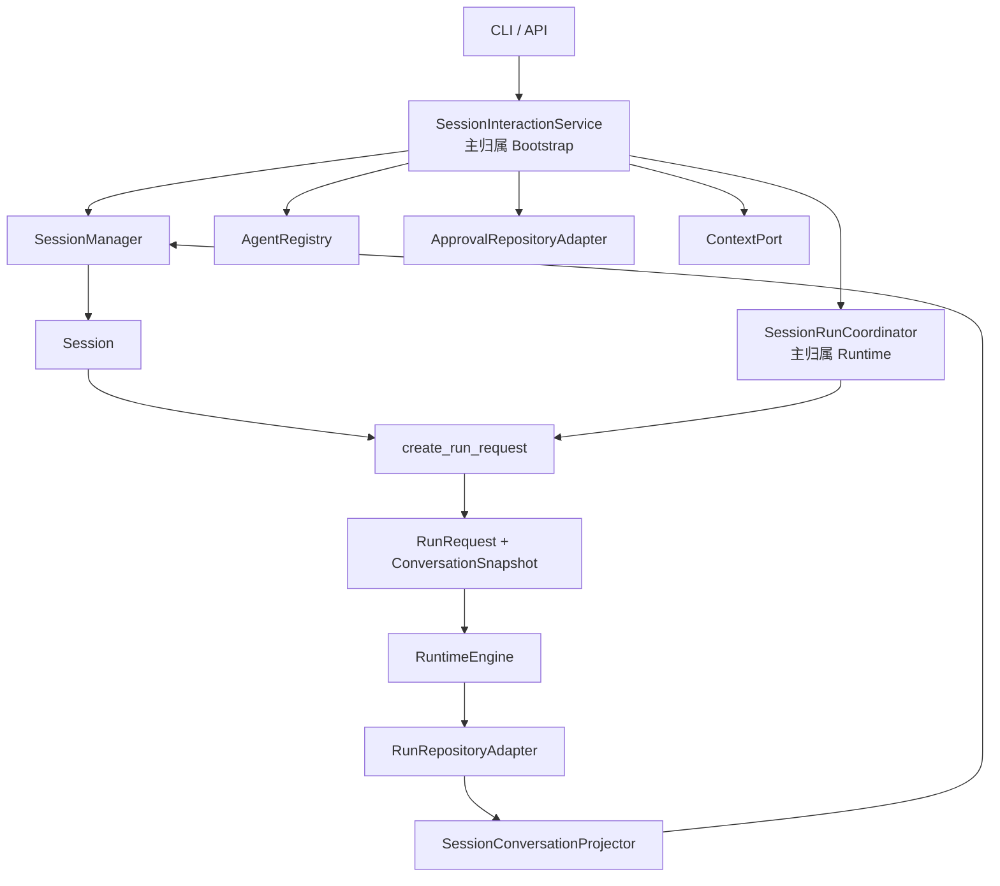

**结论：**

- Session Core 只包含领域实体和 SessionManager。
- SessionInteractionService 是应用入口，SessionRunCoordinator 是运行协调器，二者都不是 Session Core。
- RunRequest Factory 将可变 Session 投影为不可变运行请求。
- 成功结果由 RunRepository 通过 SessionConversationProjector 回写 Session。
- Approval 和 Context 只在删除与恢复边界参与，不进入 Session 实体。

### 2.2 Session、Run 与 Conversation 的关系

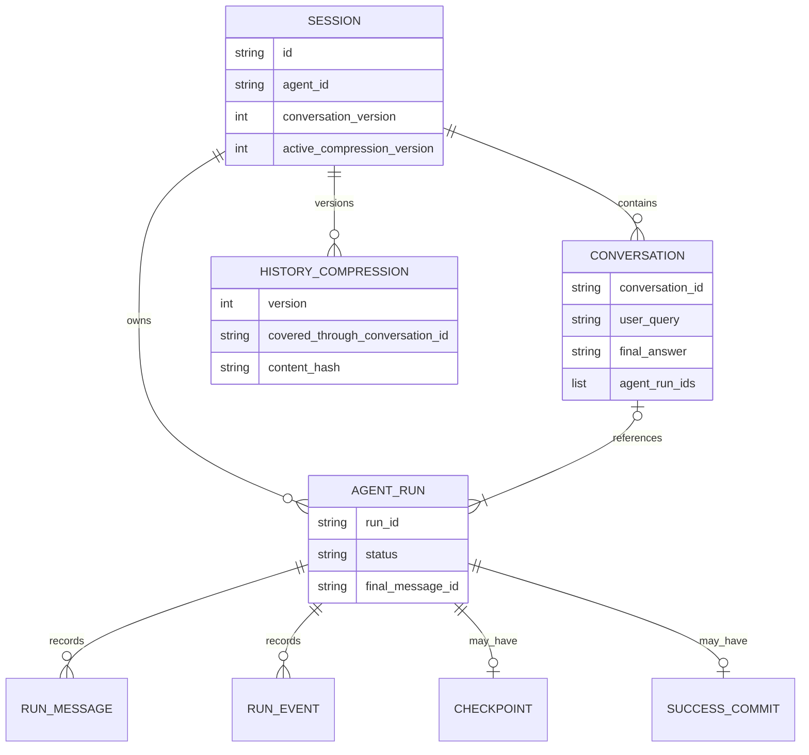

**结论：**

- Session 是长期容器，AgentRun 是一次执行事实。
- Conversation 是成功 Run 的业务投影，不是 Runtime 完整消息流。
- 一个 Session 可以有多个 Run 和多个 Conversation。
- 概念上，一条 Conversation 可以引用一个或多个相关 AgentRun；一个 AgentRun 最多投影到一条 Conversation。
- 当前 `SessionConversationProjector` 实际只把当前根 `run_id` 写入 `agent_run_ids`，尚未汇总委托子 Run。
- 等待审批、中断、失败、取消和放弃的 Run 不形成 Conversation。
- HistoryCompression 覆盖 Conversation 边界，不覆盖 RunMessage 序列。

### 2.3 成功与非成功路径

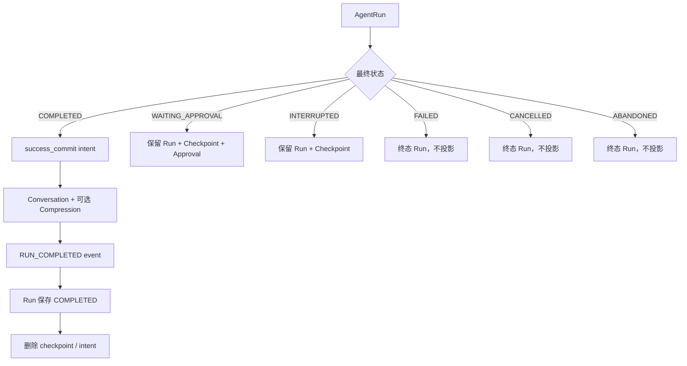

**结论：**

- 只有 COMPLETED 进入正式 Conversation。
- 成功提交以可恢复意图协调 Session、事件、Run 和 Checkpoint。
- WAITING_APPROVAL 与 INTERRUPTED 保留继续执行所需事实。
- FAILED、CANCELLED 和 ABANDONED 保留审计 Run，但不污染正式对话历史。
- Session 的 Conversation 数量不能用来推断运行次数。

### 2.4 存储布局

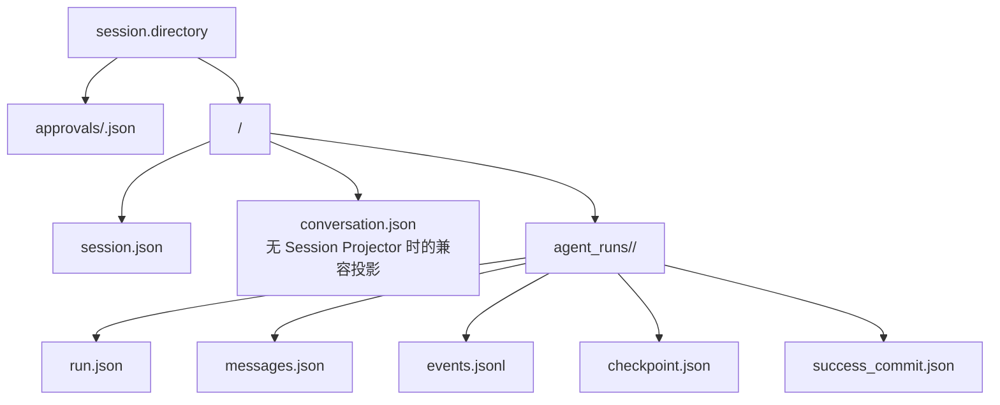

**结论：**

- 生产组合根注入 SessionConversationProjector，因此业务 Conversation 主要保存在 `session.json`。
- `conversation.json` 是 RunRepository 未注入 Projector 时的兼容容器，不是生产 Session 历史权威。
- Run 事实全部位于 Session 目录的 `agent_runs` 下。
- Approval 位于 Session 目录之外的共享 `approvals` 目录。
- 删除 Session 不能只删除 `session.json`。

### 2.5 依赖方向

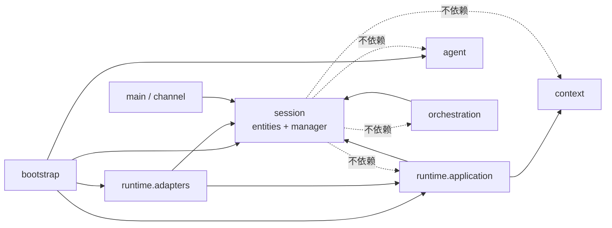

**结论：**

- Session Core 不依赖 Runtime、Agent、Context 或 Orchestration。
- Runtime 通过只读 Protocol 复制 Session，而不是把 Session 对象放入 RunExecution。
- SessionConversationProjector 是 Runtime Adapter 对 SessionManager 的依赖。
- Bootstrap 负责跨模块删除和应用入口组合。
- 禁止 Session 实体直接调用 Engine、LLM 或 Tool。

---

## 3. 组件总览

Session Wiki 完整说明 Session Core，并解释与其生命周期直接相关的外部适配器。

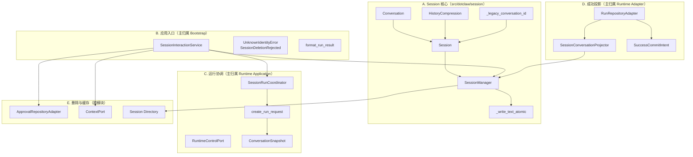

**结论：**

- Session Core 的权威实体是 Conversation、HistoryCompression、Session 和 SessionManager。
- SessionInteractionService、Coordinator 和 Projector 是外部应用/适配器。
- 成功投影与删除都是跨仓储流程，不能由 SessionManager 单独保证完整一致性。
- `session.json` 使用原子替换，但读改写事务仍需上层串行。
- 当前跨进程和路径安全问题主要位于 Manager 与协调边界。

### 3.1 组成部分与责任

| 分类 | 组成部分 | 主归属 | 稳定职责 |
|---|---|---|---|
| Session Core | `Conversation` | Session | 一次成功用户请求的业务记录 |
| Session Core | `HistoryCompression` | Session | 按版本追加的滚动摘要记录；当前 Python 对象本身可变 |
| Session Core | `Session` | Session | 长期对话容器、Identity 绑定和版本状态 |
| Session Core | `SessionManager` | Session | 文件创建、加载、保存、列表和目录删除 |
| Session Core | Atomic/Legacy helpers | Session | 原子写入和旧数据 ID 迁移 |
| 应用入口 | `SessionInteractionService` | Bootstrap | Identity 校验、提交控制和完整删除协调 |
| 运行协调 | `SessionRunCoordinator` | Runtime | 同 Session 串行、活动 Run 门禁和控制 |
| 请求冻结 | `create_run_request` | Runtime | Session→ConversationSnapshot |
| 成功投影 | `SessionConversationProjector` | Runtime Adapter | COMPLETED Run→Session Conversation |
| 事务恢复 | `RunRepositoryAdapter` | Runtime Adapter | success_commit 意图、补偿和 Run 事实 |
| 审批清理 | `ApprovalRepositoryAdapter` | Runtime Adapter | 按 Session 删除审批记录 |
| 缓存释放 | `ContextPort` | Context | 释放 SESSION/RUN Scope |
| 配置 | `SessionConfig` | Config | Session 存储目录 |
| 子会话创建 | `RuntimeDelegationAdapter` | Orchestration | 为目标 Agent 创建独立 Session |

---

## 4. 各组件的类与职责

本节先完整说明 Session Core，再解释请求冻结、同会话协调、成功投影和删除协调。外部组件保留必要边界，不替代其所属模块 Wiki。

### 4.1 `Conversation`

#### 4.1.1 `Conversation`

**职责与用途：**`Conversation` 是 Session 中一条已经成功完成的业务对话记录。

它表达：

```text
一次用户输入
→ 一次最终 assistant 回答
→ 关联的 AgentRun ID
```

它不保存：

```text
中间 LLM 回答
ToolCall / Tool Result
Reasoning
审批记录
RunEvent
ContextVersion
失败或中断信息
```

**`conversation_id`**

**职责与用途：**为 Conversation 提供稳定 ID，主要用作历史压缩覆盖边界。

新 Conversation 使用完整 UUID hex；旧 Session 数据缺失 ID 时，`from_dict()` 根据：

```text
session_id
列表位置
Conversation 原始 JSON
```

生成稳定的 `legacy-<hash>`。

**`user_query` 与 `final_answer`**

**职责与用途：**保存正式历史中可重新输入模型的用户文本和最终回答。

它们来自成功 Run 中已经持久化的：

```text
USER_INPUT RunMessage
FINAL_RESPONSE RunMessage
```

Conversation 不保存原消息 ID；Request Factory 使用 conversation_id 为用户消息 ID，并派生 assistant ID。

**`agent_run_ids`**

**职责与用途：**记录产生该 Conversation 的 AgentRun 标识列表，设计注释允许父 Run 和子 Run。

当前 SessionConversationProjector 实际只写：

```python
[run.run_id]
```

委托子 Run ID 没有自动汇总到父 Conversation。

**`created_at`**

**职责与用途：**记录 Conversation 投影时间，使用本地 `datetime.now().isoformat()`。

它不一定等于：

- 用户提交时间；
- Run started_at；
- Run ended_at；
- 最终消息创建时间。

---

### 4.2 `HistoryCompression`

#### 4.2.1 `HistoryCompression`

**职责与用途：**保存 Session 历史摘要的一个版本化业务记录。正常流程只追加新版本、不覆盖旧版本，但当前类是普通可变 `dataclass`，对象本身并未由类型系统冻结。

它不表示模型临时生成的候选。只有成功 Run 提交后，候选摘要才会进入 Session 历史压缩链。

#### 4.2.2 版本与边界字段

**职责与用途：**

```text
version
→ Session 压缩版本号

covered_through_conversation_id
→ 摘要已覆盖到哪条 Conversation

previous_version
→ 上一压缩版本引用

active_compression_version
→ Session 当前生效版本
```

Request Factory 只把边界之后的 Conversation 原文复制到新 Run。

**Hash 字段**

**职责与用途：**

```text
content_hash
→ 摘要正文 hash

source_conversation_hash
→ 生成摘要时被覆盖历史的来源 hash
```

Run 成功提交前会校验候选摘要与 ContextVersion 中摘要正文 hash 一致。

Session.from_dict 当前不会重新计算或验证持久化的 Hash。

#### 4.2.3 压缩链语义

**职责与用途：**Session 以列表保存历史版本，active_compression_version 指向当前版本。

正常追加要求：

```text
new version = active version + 1
boundary 必须属于当前 Session.conversations
```

当前没有在实体层强制：

- previous_version 必须等于旧 active；
- 新边界必须位于旧边界之后；
- 版本列表无重复且连续；
- active 引用一定存在。

---

### 4.3 `Session`

#### 4.3.1 `Session`

**职责与用途：**Session 是长期对话隔离和 Identity 绑定实体。

核心字段：

```text
id
title
agent_id
model
created_at / updated_at
conversations
conversation_version
active_compression_version
history_compressions
```

它是可变 dataclass；上层在受控读改写流程中修改并保存。

**`id`**

**职责与用途：**作为存储目录名、RunRequest.session_id、AgentRun.session_id 和 Context SESSION Owner Key。

当前 create() 生成 UUID 字符串前 8 位，没有在保存前执行冲突检查。

SessionManager 对外部传入 session_id 当前没有执行安全路径段校验。

#### 4.3.2 `agent_id`

**职责与用途：**保存该 Session 的长期 Identity 绑定。

规则：

- create() 要求非空；
- from_dict() 缺失或为空时失败；
- SessionInteractionService 提交前必须在 AgentRegistry 中找到；
- RunRequest.agent_id 从该字段派生；
- 不允许未知 Identity 静默回退默认项。

**`model`**

**职责与用途：**保存创建时传入的模型名。

当前普通 Session 创建通常为空；Delegation 创建时可能写目标 Identity.model。Runtime 实际模型由 agent_id→AgentPolicyResolver 冻结，因此该字段不是执行权威。

**`conversation_version`**

**职责与用途：**表示成功 Conversation 列表的单调版本。

新 Session 从 0 开始；每次 `add_conversation()` 加 1。旧数据反序列化时，版本小于等于 0 会回填为 Conversation 数量。

该版本当前进入 ConversationSnapshot，但成功投影不执行 compare-and-swap 校验。

#### 4.3.3 `to_dict` 与 `from_dict`

**职责与用途：**转换 `session.json` 载荷。

`from_dict()` 还负责：

- 为旧 Conversation 生成稳定 ID；
- 恢复 HistoryCompression；
- 回填 conversation_version；
- 强制 agent_id 非空。

当前它会对传入字典执行 `pop()`，因此会修改调用者提供的数据对象。

#### 4.3.4 `add_conversation`

**职责与用途：**追加一条成功 Conversation，生成 ID 和时间，并递增 conversation_version。

它不自动：

- 校验 user_query/final_answer 非空；
- 汇总子 Run ID；
- 更新 updated_at；
- 保存磁盘；
- 刷新 Context Cache。

updated_at 在 SessionManager.save() 中更新。

#### 4.3.5 `active_history_compression`

**职责与用途：**根据 active_compression_version 查找生效摘要。

active 值小于等于 0 返回 None。若 active 指向不存在的版本，也返回 None，不抛出数据损坏错误。

#### 4.3.6 `append_history_compression`

**职责与用途：**追加下一个摘要版本，并切换 active_compression_version。

校验：

```text
version == active + 1
boundary 属于当前 Conversation
```

它不计算 Hash、不验证 source hash，也不负责删除旧 Conversation 原文。

---

### 4.4 `SessionManager`

#### 4.4.1 `SessionManager`

**职责与用途：**SessionManager 是 Session Core 的本地文件管理器。

它管理：

```text
<session_root>/<session_id>/session.json
```

它不理解 Run 状态、Approval 布局和 Context Scope，完整删除由应用入口协调。

#### 4.4.2 存储根解析

**职责与用途：**构造时接收 data_dir，但相对路径不是基于调用者 CWD 或 Host.project_root，而是重新根据 `dotclaw.__file__` 推导项目根。

默认入口通常一致；自定义 ApplicationHost.project_root 时可能与 Runtime Repository 根不同。

#### 4.4.3 `_session_path`

**职责与用途：**返回：

```text
_data_dir / session_id / session.json
```

并立即创建 Session 目录。

它被 create、save 和 load 共用，因此调用 `load(不存在的 ID)` 也会创建空目录。

当前没有调用 Runtime Adapter 的 `validate_path_segment()`。

**`session_directory`**

**职责与用途：**返回 Session 目录而不创建，用于完整删除和枚举 Run 子目录。

它同样直接拼接 session_id，没有路径段验证。

#### 4.4.4 `create`

**职责与用途：**校验非空 agent_id，创建 Session，随后调用 save()。

默认：

```text
title = 新对话
model = ""
id = UUID 前 8 字符
created_at = updated_at = 本地时间
```

当前没有“仅当文件不存在”语义；极低概率 ID 冲突会覆盖既有 `session.json`。

#### 4.4.5 `load`

**职责与用途：**异步读取 Session JSON 并反序列化。

当前所有异常统一返回 None：

```text
文件不存在
JSON 损坏
字段不兼容
agent_id 缺失
权限/IO 错误
```

调用者不能区分“不存在”和“损坏”。

#### 4.4.6 `save`

**职责与用途：**更新 updated_at，将完整 Session 序列化，并在线程中执行同目录临时文件原子替换。

保证：

- 单个 `session.json` 不出现半写正文；
- 写入前 flush + fsync；
- replace 失败时清理临时文件。

不保证：

- 读改写隔离；
- conversation_version CAS；
- 多进程写入顺序；
- 目录 fsync；
- 多文件事务。

#### 4.4.7 `list_all`

**职责与用途：**遍历 Session 根的直接子目录，读取存在的 session.json，并按 updated_at 倒序返回。

任何读取或反序列化异常都会静默跳过。空目录和损坏 Session 不会出现在列表中。

#### 4.4.8 `delete`

**职责与用途：**使用 `shutil.rmtree()` 删除完整 Session 目录，然后调用可选 deletion_handler。

返回：

```text
目录存在并删除 → True
目录不存在 → False
```

该同步目录删除直接运行在事件循环线程中，大目录可能阻塞。

**`set_deletion_handler`**

**职责与用途：**允许 SessionManager 在文件删除后通知上层释放资源。

当前生产 ApplicationHost 没有设置该 handler；SessionInteractionService 在删除后显式释放 Context Scope。

---

### 4.5 原子写入与旧数据兼容

#### 4.5.1 `_write_text_atomic`

**职责与用途：**在目标同目录创建临时文件，写入、flush、fsync 后 replace。

这是文件内容级原子替换，不是 Session 业务事务和跨仓储事务。

**`_legacy_conversation_id`**

**职责与用途：**根据旧 Conversation 的规范化 JSON、Session ID 和列表序号生成确定性 ID。

同一旧文件重复加载会得到相同 ID；Conversation 内容或顺序变化会产生不同 ID。

---

### 4.6 RunRequest 冻结

#### 4.6.1 `create_run_request`

**职责与用途：**把 Session 当前事实复制为不可变 RunRequest。

它通过 Protocol 只读取：

```text
Session.id
conversation_version
conversations
active_history_compression()
```

不会把可变 Session 对象传给 RuntimeEngine。

**未覆盖历史选择**

**职责与用途：**若存在活动压缩，只保留 `covered_through_conversation_id` 之后的 Conversation。

每条 Conversation 转成两条 ConversationMessage：

```text
USER: conversation_id
ASSISTANT: conversation_id:assistant
```

边界在当前列表中不存在时明确失败。

#### 4.6.2 `ConversationSnapshot`

**职责与用途：**冻结：

```text
session_id
messages
version
compressed_history
```

它不是 Session 实体，也不会在 Run 中被更新。Context 构建和历史压缩基于该快照。

#### 4.6.3 `lease_id`

**职责与用途：**Request Factory 为每个请求生成随机 lease_id。

当前 SessionRunCoordinator 不读取或持久化该值，AgentRun 也不保存它，因此它不是可验证的跨进程租约令牌。

---

### 4.7 `SessionRunCoordinator`

#### 4.7.1 `SessionRunCoordinator`

**职责与用途：**在单进程内实现：

```text
同一 Session 串行
不同 Session 并行
```

它持有 `session_id → asyncio.Lock` 和一个创建 Lock 的 guard。

#### 4.7.2 `submit`

**职责与用途：**接受已经构建的 RunRequest，取得 Session 锁、检查占用后执行。

因为 Request 在锁外已经冻结，该入口不能避免调用者提供陈旧 ConversationSnapshot。

#### 4.7.3 `submit_prepared`

**职责与用途：**在取得 Session 锁和通过活动 Run 门禁后，才调用异步 request_factory。

它可以把“冻结动作”推迟到锁内，但不会强制 request_factory 重新从 SessionManager 读取最新 Session。

#### 4.7.4 `_prepare_new_request`

**职责与用途：**新请求前：

```text
recover_session()
→ 将遗留 RUNNING 标为 INTERRUPTED
→ active_run()
```

结果：

- 无活动 Run：允许；
- INTERRUPTED：自动 abandon，再允许；
- WAITING_APPROVAL 或其他非终态：返回 SESSION_BUSY。

**控制操作**

**职责与用途：**

- 审批恢复：在所属 Session 锁内；
- 中断重试：在所属 Session 锁内；
- 放弃中断：在所属 Session 锁内；
- 取消：直接发送，不等待 Session 锁。

取消绕过锁是为了避免活动 Run 持锁时形成互等。

#### 4.7.5 Lock 生命周期

**职责与用途：**`_get_lock()` 懒创建每个 Session 的 asyncio.Lock。

当前 Lock 字典不会在 Session 删除或长期闲置后清理。

---

### 4.8 `SessionInteractionService`

#### 4.8.1 `SessionInteractionService`

**职责与用途：**是按 Session 路由 Identity 的最小应用入口，主归属 Bootstrap。

它允许依赖：

```text
SessionManager
AgentRegistry
SessionRunCoordinator
RunRepository
ApprovalRepository
ContextPort
```

不依赖具体 LLM、Tool、MCP 或 Channel。

#### 4.8.2 创建与 Identity 校验

**职责与用途：**创建 Session 时解析显式/默认 agent_id，并要求 Registry 中存在。

提交时再次校验已有 `session.agent_id`，未知或空值明确失败。

#### 4.8.3 `submit`

**职责与用途：**接受 Session 对象或 ID，校验 Identity，构造 request_factory 后调用 `submit_prepared()`。

当前 request_factory 捕获锁外加载或调用者传入的 Session 对象：

```python
return create_run_request(session, identity.agent_id, user_message)
```

它没有在锁内重新调用 SessionManager.load()。

**控制门面**

**职责与用途：**转发：

```text
resolve_approval
cancel
retry_interrupted
abandon_interrupted
```

控制状态属于 Runtime，不写入 Session 实体。

#### 4.8.4 `delete_session`

**职责与用途：**协调完整删除：

1. Session 目录不存在则幂等返回；
2. 存在非终态 Run 则拒绝；
3. 读取 Run 目录名；
4. 删除该 Session 的 Approval；
5. 删除完整 Session 目录；
6. 释放 RUN 和 SESSION Context Scope。

Agent Scope 不随单 Session 删除。

#### 4.8.5 删除错误类型

**职责与用途：**

```text
UnknownIdentityError
→ Session/Identity 路由错误

SessionDeletionRejected
→ 存在非终态 Run，拒绝删除
```

文件 IO、Approval 删除和 Context 释放错误当前直接向上抛出，没有统一删除结果 DTO。

---

### 4.9 `SessionConversationProjector`

#### 4.9.1 `SessionConversationProjector`

**职责与用途：**实现 Runtime `ConversationProjectionPort`，将成功 Run 投影到 Session。

流程：

```text
load Session
→ run_id 幂等检查
→ add_conversation
→ 可选 append_history_compression
→ save Session
```

#### 4.9.2 幂等性

**职责与用途：**若任一 Conversation.agent_run_ids 已包含 run_id，则直接返回。

这可以避免 success_commit 恢复重复追加同一根 Run 的 Conversation。

#### 4.9.3 Conversation 与 Compression 同文件提交

**职责与用途：**Projector 在一次 Session 对象变更后只调用一次 save()，因此 Conversation 和最新摘要在单个 `session.json` 原子替换中一起出现。

该原子性不覆盖 RunEvent、run.json、checkpoint 和 success_commit 文件。

---

### 4.10 成功提交与恢复

#### 4.10.1 `ConversationProjectionPort`

**职责与用途：**定义成功 Run 到 Session Conversation 的抽象边界。

RunRepository 不直接依赖 Session 实体，具体实现由 Bootstrap 注入。

#### 4.10.2 `RunRepositoryAdapter.commit_success`

**职责与用途：**校验：

- Run 状态是 COMPLETED；
- final_message 是 assistant 且已保存；
- completed_event 是 RUN_COMPLETED；
- success intent 属于当前 Run/Session。

随后创建临时 success_commit 文件并启动恢复流程。

#### 4.10.3 成功恢复顺序

**职责与用途：**幂等补齐顺序：

```text
Session Conversation/Compression 投影
→ RUN_COMPLETED Event
→ run.json 最终化
→ 删除 checkpoint
→ 删除 success_commit intent
```

任何中间故障都可由保留的 intent 重试。

#### 4.10.4 启动恢复

**职责与用途：**ApplicationHost 在开放 SessionInteractionService 之前调用：

```text
run_repository.recover_pending_success_commits()
```

保证进程重启后补齐未完成的成功投影。

#### 4.10.5 兼容 Conversation 容器

**职责与用途：**RunRepository 未注入 Session Projector 时，会把最终 assistant 消息写入 `conversation.json`。

生产 runtime_factory 注入 Projector，因此该兼容容器与 Session.conversations 不应并列为两个业务权威源。

---

### 4.11 Approval 与 Context 删除接入

#### 4.11.1 `ApprovalRepositoryAdapter.delete_by_session`

**职责与用途：**扫描共享 approvals 目录，删除 session_id 匹配的全部审批记录。

SessionManager 不知道 Approval 文件布局。

#### 4.11.2 Context Scope 释放

**职责与用途：**完整删除后释放：

```text
RUN Scope：按 agent_runs 子目录名
SESSION Scope：按 session_id
```

AGENT Scope 跨多个 Session 共享，因此不释放。

---

### 4.12 Config 与 Host 装配

#### 4.12.1 `SessionConfig`

**职责与用途：**当前只定义：

```text
directory = ./data/sessions
```

没有 Session ID、保留期、压缩、锁、最大数量或删除策略配置。

#### 4.12.2 Runtime 组合

**职责与用途：**runtime_factory 使用 Host.project_root 解析 Runtime storage_root，并创建：

```text
SessionConversationProjector(session_manager)
RunRepositoryAdapter(storage_root, projector)
ApprovalRepositoryAdapter(storage_root)
SessionRunCoordinator(engine)
```

SessionManager 自己重新解析相对路径，二者当前不共享一个已解析 Path 对象。

**Host 生命周期**

**职责与用途：**Host 初始化时创建 SessionManager，启动恢复后创建 SessionInteractionService。

Host shutdown 不关闭 SessionManager，因为它没有进程级句柄；Context Cache 由 Host 单独释放。

---


## 5. 组件依赖和使用流程

本节说明 Session 从创建、提交、运行门禁、成功投影、历史压缩、审批恢复、中断处理到完整删除的实际流程。

### 5.1 创建、加载与列表

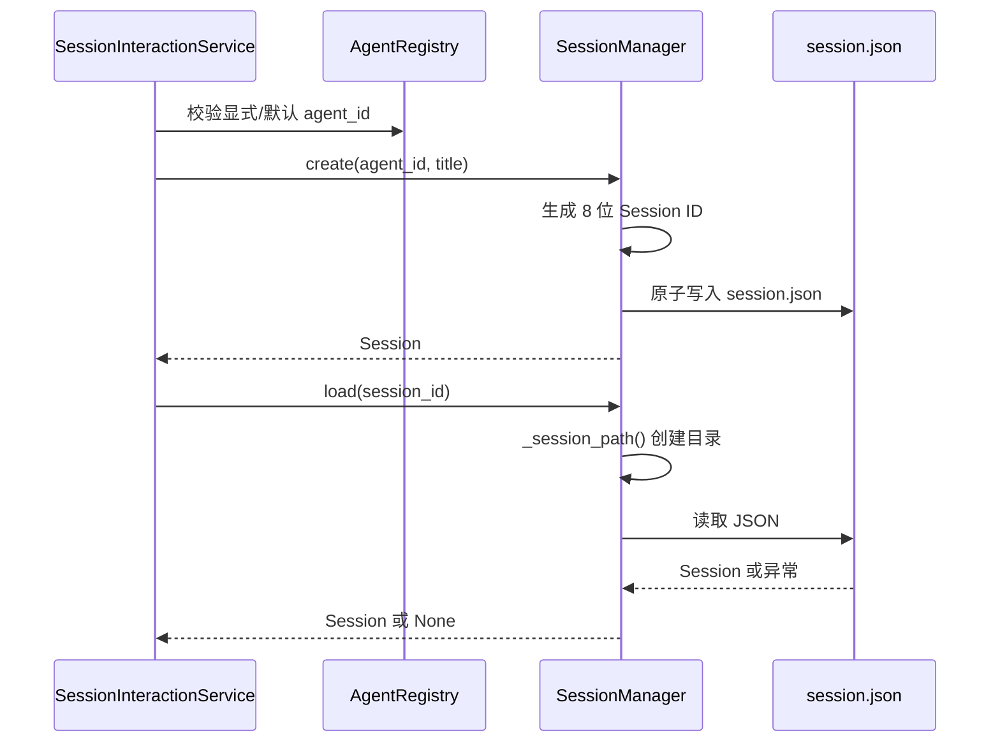

**结论：**

- Session 创建必须先确定有效 Identity。
- Session ID 由 Manager 生成，当前没有碰撞检查。
- load() 不区分不存在、损坏和权限错误。
- load() 查询不存在 ID 时仍会创建空目录。
- list_all() 只返回可成功反序列化的 Session。

### 5.2 CLI 当前 Session

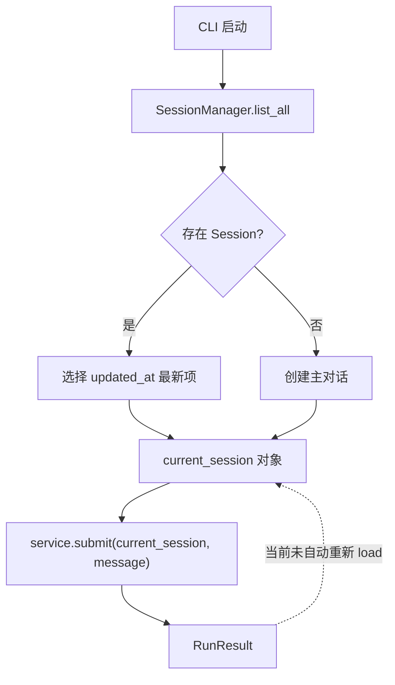

**结论：**

- CLI 长期持有一个 Session 对象引用。
- `/switch` 和启动时会重新加载；普通成功提交后不会更新 current_session。
- SessionConversationProjector 更新的是磁盘上重新加载的另一个 Session 对象。
- 因此后续普通提交可能继续使用旧 conversations 和旧 conversation_version。
- Session 对象不能被视为自动同步的 Unit of Work。

### 5.3 普通提交

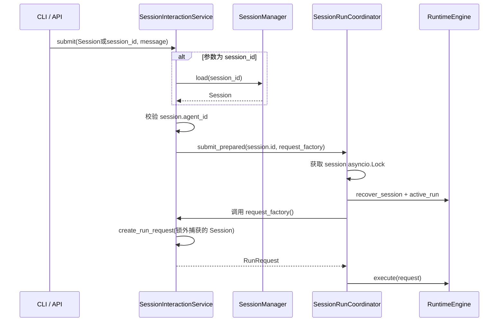

**结论：**

- 同一进程中普通执行持有 Session 锁直到 Engine 返回。
- Request Factory 在锁内执行，但当前读取的是锁外捕获的 Session 对象。
- 参数为字符串时也先在锁外 load，再等待锁。
- 该流程不能保证 ConversationSnapshot 一定来自取得锁后的最新磁盘版本。
- 正确边界应是锁内按 session_id 重新加载并冻结。

### 5.4 新请求活动 Run 门禁

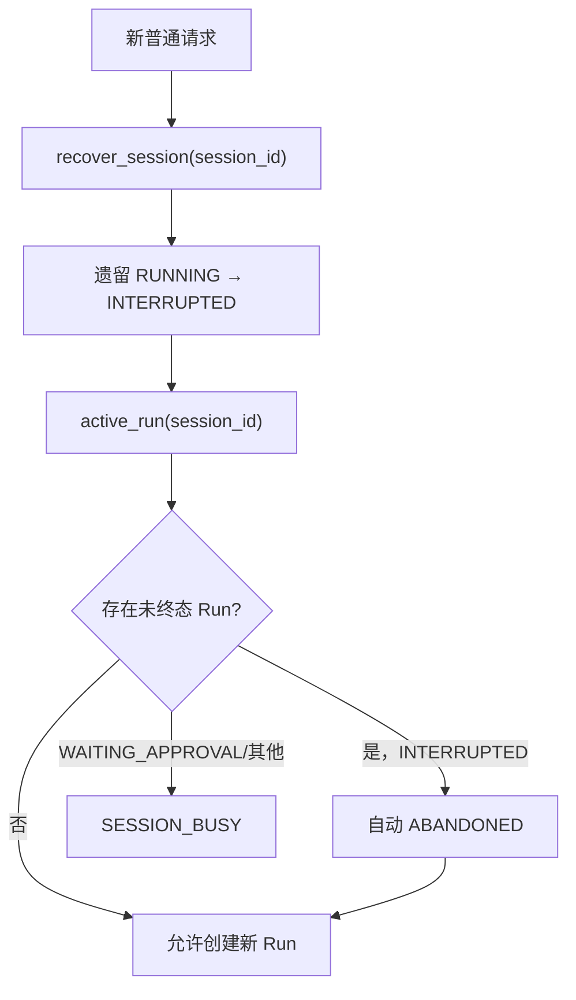

**结论：**

- 新进程第一次访问 Session 时会把遗留 RUNNING 标为 INTERRUPTED。
- 普通新消息自动放弃旧 INTERRUPTED Run。
- WAITING_APPROVAL 不会被新消息自动放弃。
- 同一 Session 最多一个未终态 Run 是持久化不变量；检测到多个时 Engine 抛错。
- 门禁是“读取后判断”，不是文件系统原子租约。

### 5.5 RunRequest 历史冻结

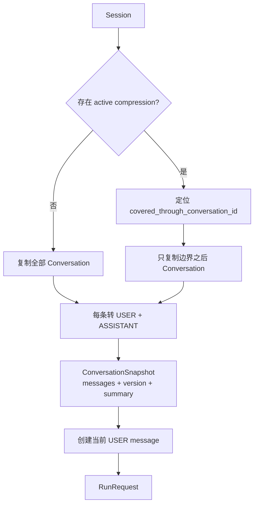

**结论：**

- Session 历史只在 RunRequest 创建时复制一次。
- 已覆盖 Conversation 原文不会重复进入 Snapshot。
- 压缩正文和未覆盖原文同时存在。
- conversation_version 是快照元数据，当前不参与成功提交 CAS。
- 活动边界不存在会拒绝创建请求。

### 5.6 成功 Run 投影

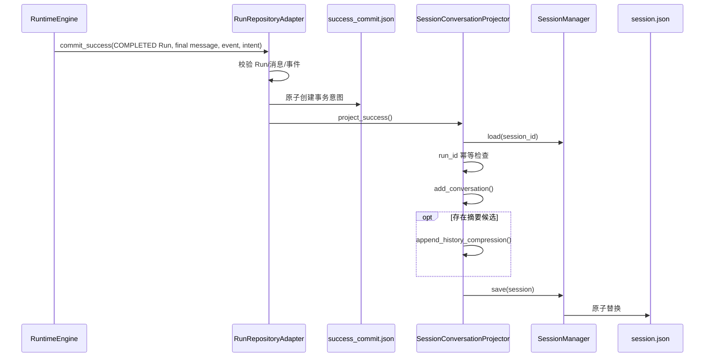

**结论：**

- Conversation 投影属于成功提交事务的一部分。
- 用户输入和最终回答从 RunMessage 唯一事实源读取。
- 同一个根 Run 重试提交不会重复 Conversation。
- Conversation 和摘要在同一 session.json 替换中提交。
- Session 文件投影成功不表示 RunEvent 和 run.json 已全部完成，需依赖 intent 补偿。

### 5.7 成功提交补偿

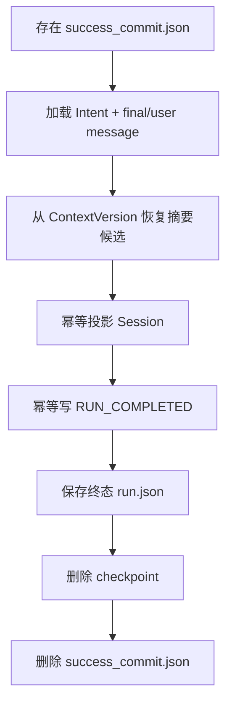

**结论：**

- success_commit 文件是临时事务意图，不是长期业务事实源。
- Projector、完成事件和 Run 最终化都必须可幂等重试。
- Host 启动时扫描全部未决意图。
- Session 读取不是统一触发所有恢复；RunRepository 的部分读取入口会先补偿。
- intent 删除失败会导致下次再次执行安全恢复。

### 5.8 历史压缩提交

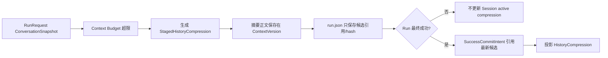

**结论：**

- 历史压缩候选在 Run 成功前不改变 Session。
- 摘要正文唯一保存在 ContextVersion，Run 控制面只保存引用和 hash。
- 失败、中断和取消不会激活候选。
- 成功 Projector 同时追加本轮 Conversation 和压缩版本。
- Session 保留旧 Conversation 原文和全部压缩版本，没有物理裁剪。

### 5.9 审批等待与恢复

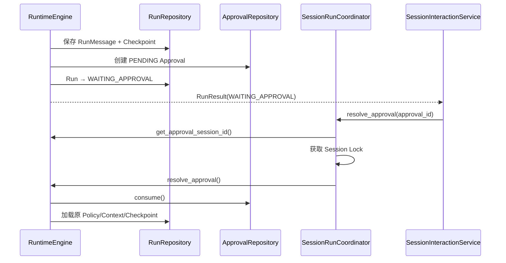

**结论：**

- WAITING_APPROVAL 是 Session 活动占用，不形成 Conversation。
- 审批恢复使用原 run_id、PolicySnapshot 和 ContextVersion。
- 审批恢复与普通提交使用同一 Session 锁。
- Approval 文件位于共享目录，删除 Session 时必须单独清理。
- Approval.consume 的本地文件读改写当前没有跨进程锁。

### 5.10 中断、重试与新消息

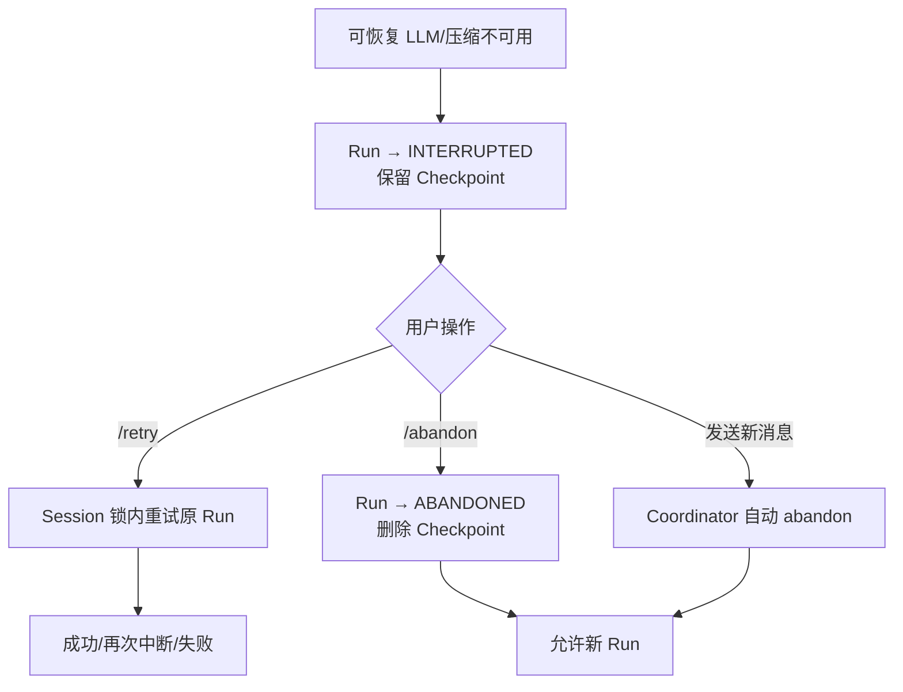

**结论：**

- INTERRUPTED 不是终态占用，仍会阻止直接并发 Run。
- 显式重试复用原 Policy、ContextVersion 和 run_id。
- 普通新消息选择放弃旧中断而不是自动重试。
- ABANDONED 不进入 Conversation。
- 自动放弃发生在新请求门禁内。

### 5.11 取消

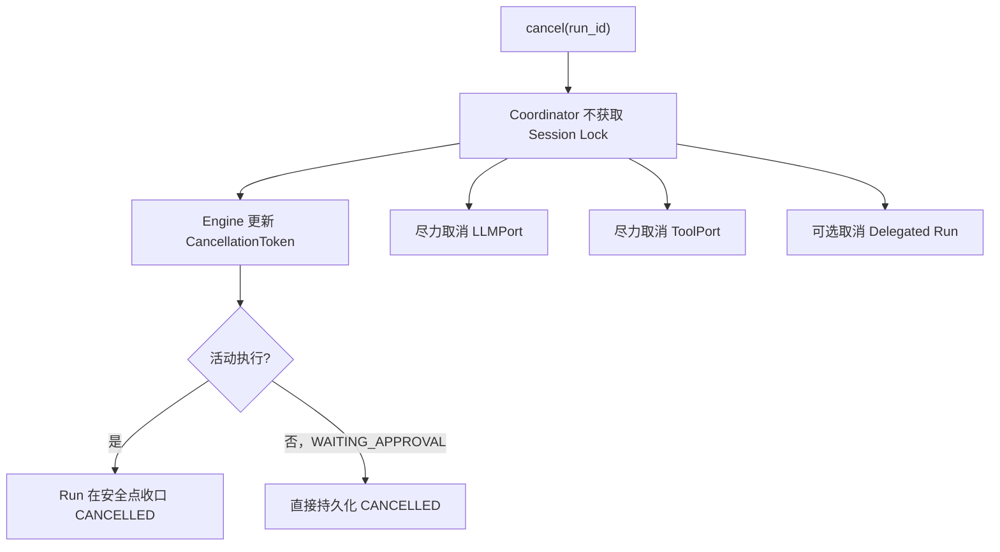

**结论：**

- 取消故意绕过同 Session Lock，避免等待正在持锁的 Run。
- 取消是尽力语义，具体 LLM/Tool 可能没有真实句柄。
- WAITING_APPROVAL 可立即取消并释放占用。
- CANCELLED 不投影 Conversation。
- 取消与删除仍需由调用方按结果顺序协调。

### 5.12 完整删除

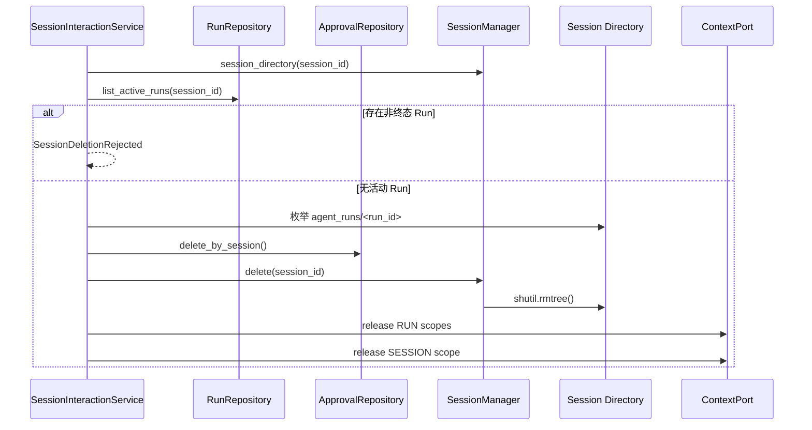

**结论：**

- 删除是跨 Approval、Session Directory 和 Context 的应用流程。
- 活动 Run 存在时拒绝删除。
- 删除不释放共享 AGENT Scope。
- 当前删除没有取得 SessionRunCoordinator 的同一把锁。
- 活动检查与 rmtree 之间可能有新提交进入，存在竞态窗口。

### 5.13 问题边界说明

路径安全、跨进程租约和陈旧 Session 快照不是正常业务流程。本节不重复展开，相关问题图和影响分别见第 8.3 节的 S1、S2～S5。

### 5.14 Delegation 子 Session

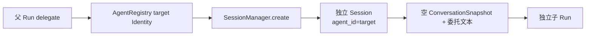

**结论：**

- 每次委托创建新 Session，不复用父 Session 历史。
- 子 Session 持久化目标 agent_id。
- 子 Run 成功会投影到自己的 Session。
- 父 Conversation 当前只记录父 run_id，不自动汇总 child_run_id。
- 临时子 Session 没有自动回收标记和策略。

---

## 6. 对外接口与数据契约

### 6.1 Session 公共 API

`dotclaw.session` 当前公开：

```python
Session
Conversation
SessionManager
```

`HistoryCompression` 可从实现文件访问，但没有从包级 `__all__` 导出。

### 6.2 `Conversation` 契约

```text
Conversation
├── user_query: str
├── conversation_id: str
├── final_answer: str
├── agent_run_ids: list[str]
└── created_at: str
```

调用者应理解：

1. Conversation 只代表成功业务投影。
2. user_query/final_answer 不等于完整 RunMessage 历史。
3. conversation_id 是压缩边界权威。
4. agent_run_ids 当前通常只包含根 Run。
5. created_at 是投影时间。

### 6.3 `HistoryCompression` 契约

```text
HistoryCompression
├── version
├── covered_through_conversation_id
├── content
├── content_hash
├── source_conversation_hash
├── previous_version
└── created_at
```

活动摘要由 Session.active_compression_version 指定。旧版本不会删除。

### 6.4 `Session` JSON 契约

典型 `session.json`：

```json
{
  "id": "a1b2c3d4",
  "title": "新对话",
  "agent_id": "default",
  "model": "",
  "created_at": "2026-07-26T10:00:00",
  "updated_at": "2026-07-26T10:01:00",
  "conversations": [],
  "conversation_version": 0,
  "active_compression_version": 0,
  "history_compressions": []
}
```

当前没有显式 `format_version` 字段。

### 6.5 SessionManager 契约

```python
SessionManager(data_dir)
set_deletion_handler(handler)
session_directory(session_id)
create(agent_id, title="新对话", model="")
load(session_id)
save(session)
list_all()
delete(session_id)
```

边界：

- load 不存在或异常均返回 None；
- save 原子替换单文件；
- delete 删除整目录；
- Manager 不检查活动 Run；
- Manager 不清理 Approval；
- Manager 不验证外部 session_id 路径段。

### 6.6 ConversationSnapshot 契约

```text
ConversationSnapshot
├── session_id
├── messages: tuple[ConversationMessage, ...]
├── version
└── compressed_history
```

它是 Run 创建时的只读复制，不是 Session 引用。Runtime 不得修改原 Session。

### 6.7 RunRequest Session 字段

```text
RunRequest
├── session_id
├── lease_id
├── agent_id
├── user_message
├── conversation
├── parent_run_id
├── root_run_id
└── run_id
```

当前 `lease_id` 不参与 Coordinator Lock、AgentRun 持久化或成功 CAS。

### 6.8 Session 串行契约

单进程内：

```text
同 session_id
→ 同一 asyncio.Lock
→ 普通提交 / 审批恢复 / retry / abandon 串行

不同 session_id
→ 不同 Lock
→ 可并行
```

例外：

```text
cancel
→ 不等待 Lock
```

跨进程不保证该契约。

### 6.9 活动 Run 契约

终态：

```text
COMPLETED
FAILED
CANCELLED
ABANDONED
```

未终态占用：

```text
RUNNING
WAITING_APPROVAL
INTERRUPTED
```

新普通请求：

- INTERRUPTED 自动 abandon；
- 其他未终态返回 SESSION_BUSY。

### 6.10 成功投影契约

只有同时满足：

1. Run.status == COMPLETED；
2. final_message 是已保存 assistant 消息；
3. run.final_message_id 一致；
4. completed_event 是 RUN_COMPLETED；
5. success intent 归属同一 Run/Session；

才允许创建 Conversation 投影。

### 6.11 历史压缩提交契约

Session 只接受：

```text
version = active + 1
covered boundary 属于 conversations
```

Runtime success intent 只引用最新 staged candidate。摘要正文从对应 ContextVersion 读取并校验 hash。

### 6.12 删除契约

生产应用完整删除要求：

1. Session 目录存在；
2. 无非终态 Run；
3. 删除 Approval；
4. 删除完整目录；
5. 释放 RUN Scope；
6. 释放 SESSION Scope；
7. 不释放 AGENT Scope。

该序列当前不是原子事务。

### 6.13 错误契约

| 情况 | 当前行为 |
|---|---|
| 创建时 agent_id 空 | ValueError |
| Session JSON 缺 agent_id | from_dict 抛错，但 load 返回 None |
| 未知 Identity | UnknownIdentityError |
| Session 不存在 | submit(string) 转 UnknownIdentityError |
| Session 损坏 | load 返回 None |
| 活动 Run 阻塞删除 | SessionDeletionRejected |
| 活动 Run 阻塞新消息 | RunResult + SESSION_BUSY |
| 压缩边界不存在 | ValueError |
| Success 投影 Session 不存在 | FileNotFoundError |
| 删除/保存 IO 错误 | 原异常向上抛出 |

### 6.14 时间契约

Session 与 Conversation 使用：

```text
datetime.now().isoformat()
```

Runtime Domain 多数时间使用 UTC 工具。当前持久化时间可能混合无时区本地时间和 UTC 字符串。

### 6.15 存储路径契约

默认：

```text
Config.session.directory = ./data/sessions
```

SessionManager 相对路径基于包位置推导项目根；RuntimeFactory 相对路径基于 Host.project_root。

只有默认项目布局下两者通常一致。

### 6.16 关键不变量

**当前实现已经保证**

1. Session 是长期会话容器，`session.json` 不保存单次 Runtime 可变执行状态。
2. Session 创建和反序列化都要求非空 `agent_id`，已有绑定不会由应用入口静默回退默认 Identity。
3. Conversation 只由 COMPLETED Run 中已保存的用户输入和最终 assistant 消息投影。
4. FAILED、CANCELLED、ABANDONED、INTERRUPTED 和 WAITING_APPROVAL 不进入正式 Conversation。
5. Conversation ID 在新建或旧数据迁移后保持稳定，并作为 HistoryCompression 覆盖边界。
6. `add_conversation()` 每次追加都会使 `conversation_version` 增加 1。
7. 正常追加 HistoryCompression 时要求新版本等于 `active + 1`，且覆盖边界属于当前 Conversation。
8. RunRequest 复制 ConversationSnapshot，不把可变 Session 对象交给 RuntimeEngine。
9. 活动压缩存在时，Request Factory 只复制覆盖边界之后的 Conversation 原文。
10. 单进程内，同一 Session 的普通提交、审批恢复、中断重试和放弃使用同一 `asyncio.Lock`。
11. 取消不等待活动 Run 当前持有的 Session Lock。
12. 新普通请求不会绕过 RUNNING 或 WAITING_APPROVAL 占用；INTERRUPTED 会先重试、显式放弃或自动放弃。
13. 成功提交通过可恢复 intent 协调 Session 投影、完成事件、终态 Run 和 Checkpoint。
14. 重复恢复同一 success_commit 不会生成重复 Conversation。
15. 应用级删除流程会在删除前检查活动 Run，并依次处理 Approval、Session 目录和 SESSION/RUN Context Scope。
16. 删除单个 Session 不释放共享 AGENT Context Scope。
17. `session.json` 使用同目录临时文件和原子替换写入。
18. `Session.model` 不参与 Runtime 实际模型解析。

**必须保持但当前尚未完全落实的设计约束**

1. SessionManager 与 Runtime Repository 应使用同一个由 Host 解析的受控绝对存储根；自定义 `project_root` 下当前仍可能分裂。
2. 所有外部 `session_id` 都必须通过单路径段校验；SessionManager 当前尚未执行。
3. ConversationSnapshot 应在取得 Session 串行权后重新加载最新 Session 再冻结；当前 request_factory 可能捕获陈旧对象。
4. Session 成功投影应基于 `conversation_version` 或等价 CAS 防止陈旧写入；当前尚未校验。
5. 删除的活动检查、阻止新提交和目录清理应属于同一生命周期事务；当前存在竞态窗口。
6. HistoryCompression 在加载时应验证版本连续、active 引用、边界顺序和 Hash；当前只在正常追加路径做部分检查。
7. 若支持多进程运行，同 Session 占用必须由持久化 Lease 或数据库唯一约束保证；当前 `asyncio.Lock` 和 `lease_id` 不满足该要求。

---

## 7. 常见修改入口

| 修改目标 | 首要入口 | 可能涉及 | 必须保持的不变量 |
|---|---|---|---|
| 新增 Session 字段 | `session/session.py::Session` | to_dict/from_dict、旧数据、CLI | 明确字段是否为执行权威 |
| 修改 Conversation 结构 | `Conversation` | Request Factory、Projector、压缩边界 | 只保存成功业务投影 |
| 修改 Conversation ID | `add_conversation`、`_legacy_conversation_id` | 压缩边界、迁移 | 已持久化边界必须稳定 |
| 修改 agent_id 绑定 | Session + SessionInteractionService | AgentRegistry、RunRequest | 旧 Session 不得静默换 Agent |
| 删除 Session.model | Session、Delegation Adapter | JSON 迁移、CLI | 模型权威保留在 PolicySnapshot |
| 增加 JSON Schema Version | Session.to_dict/from_dict | Migration、list/load | 旧文件处理必须显式 |
| 严格区分加载错误 | `SessionManager.load` | CLI、Interaction Service | 损坏不能伪装不存在 |
| 修复路径安全 | `_session_path`、`session_directory` | load/delete/list | session_id 必须是单路径段 |
| 修改 Session ID | `SessionManager.create` | 路径、迁移、引用 | 创建不得覆盖已有 Session |
| 修改存储根 | SessionManager + runtime_factory | Run/Approval/Checkpoint | 所有仓储使用同一绝对根 |
| 修改原子写入 | `_write_text_atomic` | Runtime file support | 保持同目录临时文件替换 |
| 增加乐观并发 | `SessionManager.save` | conversation_version、Projector | 冲突必须拒绝或重试 |
| 修复陈旧 Session | `SessionInteractionService.submit` | Coordinator、CLI | 锁内重新加载并冻结 |
| 修改普通提交串行 | `SessionRunCoordinator` | Engine active_run、cancel | 同 Session 不得并行 Run |
| 实现跨进程租约 | Coordinator + RunRepository | lease_id、run creation | 检查与占用创建必须原子 |
| 修改活动 Run 规则 | `_prepare_new_request` | RunStatus、恢复 | WAITING_APPROVAL 不得被覆盖 |
| 修改自动 abandon | `_prepare_new_request` | CLI 体验、审计 | 不得删除原 Run 事实 |
| 修改取消流程 | Coordinator.cancel | Engine、LLM/Tool/Delegation | 不等待活动 Run 的同一锁 |
| 修改 RunRequest 历史 | `request_factory.py` | ConversationSnapshot、Context | 只复制未压缩覆盖历史 |
| 修改压缩边界 | Session + Request Factory | Runtime compaction | 边界必须属于当前 Session |
| 修改成功投影 | `SessionConversationProjector` | RunRepository success commit | 只投影 COMPLETED Run |
| 汇总子 Run ID | Projector / Runtime events | Delegation、Conversation | 去重并保持父子关系可审计 |
| 修改 success_commit 顺序 | RunRepositoryAdapter | Projector、Event、Checkpoint | 每步可恢复且幂等 |
| 修改启动恢复 | ApplicationHost.initialize | RunRepository | 开放入口前完成补偿 |
| 修改兼容 conversation.json | RunRepositoryAdapter | Projector、迁移 | 只能有一个业务历史权威 |
| 修改 HistoryCompression | Session + Projector | ContextVersion、hash | 版本连续、正文 hash 一致 |
| 验证压缩链 | Session.from_dict | Migration、load error | active 引用必须存在 |
| 修改完整删除 | SessionInteractionService.delete_session | Coordinator、Approval、Context | 活动 Run 时拒绝 |
| 让删除与提交串行 | Coordinator / 新 SessionLifecycleService | submit、delete | 删除检查与 tombstone 原子 |
| 修改 Approval 清理 | ApprovalRepositoryAdapter | Session 删除、审批恢复 | 删除后审批不可恢复 |
| 修改 Context 释放 | delete_session / Host | RUN/SESSION/AGENT Scope | 单 Session 不释放 AGENT |
| 异步删除大目录 | SessionManager.delete | asyncio.to_thread | 不阻塞事件循环 |
| 清理 Session Lock | Coordinator | delete/idle 生命周期 | 不删除仍有 waiter 的 Lock |
| 增加归档/保留策略 | 新 SessionLifecycleService | list/delete/storage | 不破坏活动 Run 与审计 |
| 修改列表排序 | SessionManager.list_all | CLI、分页 | 损坏项处理必须可观测 |
| 统一时间格式 | Session/Conversation timestamps | Runtime UTC | 持久化时间带时区 |
| 修改子 Session 策略 | RuntimeDelegationAdapter | Orchestration、清理 | 子 Session 独立且可识别 |
| 排查对话历史不连续 | CLI current_session → submit → Request Factory | Projector、Coordinator | 确认锁内 load 最新 Session |
| 排查 SESSION_BUSY | Coordinator → active_run | run.json、恢复 | 检查 WAITING_APPROVAL/INTERRUPTED |
| 排查成功回答未进历史 | success_commit → Projector | session.json、intent | 检查未决成功提交 |
| 排查 Session 列表缺项 | list_all → from_dict | JSON、agent_id | 区分损坏和不存在 |
| 排查压缩摘要未生效 | active_compression_version → boundary | ContextVersion、Projector | 只在成功提交后激活 |
| 排查删除残留 | delete_session 多步骤 | approvals、agent_runs、Context | 检查每一步的失败位置 |

---

## 8. 设计取舍、痛点和演进方向

本节区分当前架构承诺、核心选择、真实问题和候选演进方案。

### 8.1 当前架构承诺

当前 master 可以确认：

1. Session 是长期对话容器，AgentRun 是单次执行事实。
2. Session 必须持久化 agent_id。
3. Conversation 只保存成功用户输入与最终回答。
4. 运行消息、事件、Checkpoint 和 ContextVersion 不写入 session.json。
5. HistoryCompression 以版本链保存，活动版本通过引用选择。
6. RunRequest 创建时复制 ConversationSnapshot。
7. 单进程内同 Session 普通提交串行，不同 Session 可并行。
8. WAITING_APPROVAL 会保持 Session 占用。
9. INTERRUPTED 可重试、放弃，或在新消息前自动放弃。
10. 只有 COMPLETED Run 进入 success_commit 和 Conversation 投影。
11. 成功提交支持进程重启补偿。
12. 删除 Session 是 Approval、目录和 Context 的应用级流程。
13. 单 Session 删除不释放共享 AGENT Context。
14. SessionManager 使用本地 JSON 文件和原子替换。
15. 当前实现不提供跨进程强一致租约。

### 8.2 核心设计取舍

#### 8.2.1 Session 与 Run 分离

**问题与选择：**长期对话和单次执行有不同生命周期。当前 Session 保存成功业务历史，RunRepository 保存完整运行事实。

**未选择：**把所有 Tool、审批、错误和状态机消息写进 Session；一个 Session 文件保存整个 Runtime。

**收益：**业务历史干净；失败 Run 可审计而不污染下一轮 Conversation；Runtime 可以独立恢复。

**代价与边界：**成功提交需要跨 Session 和 Run 仓储协调；调试需要同时查看两类文件。

#### 8.2.2 成功结果才形成 Conversation

**问题与选择：**中断或失败回答不能作为正式历史。当前只投影 COMPLETED Run 的用户输入和最终 assistant 消息。

**未选择：**每次提交立即追加用户消息、失败后留下半条 Conversation。

**收益：**Conversation 始终成对且可直接重放；失败不会改变长期历史。

**代价与边界：**用户看不到失败尝试的业务历史，只能查 Run 审计；成功提交必须可恢复。

#### 8.2.3 Session 只绑定 agent_id

**问题与选择：**Identity 配置会演进，Session 不复制完整声明。当前只持久化 agent_id。

**未选择：**Session 内嵌 AgentIdentity 或 PolicySnapshot。

**收益：**Session 文件轻量；多个 Session 共享 Identity。

**代价与边界：**未来新 Run 会使用 Registry 当前 Identity；已开始 Run 则使用冻结 PolicySnapshot。

#### 8.2.4 RunRequest 使用不可变历史快照

**问题与选择：**Runtime 不能持有会被外部修改的 Session。Request Factory 复制 Conversation 和压缩摘要。

**未选择：**RunExecution 保存 Session 对象并在每轮动态读取。

**收益：**执行输入稳定；恢复和 ContextVersion 可审计。

**代价与边界：**必须在正确的串行安全点读取最新 Session；当前实现没有完全满足。

#### 8.2.5 单进程每 Session 一把 Lock

**问题与选择：**本地 Agent Harness 需要简单地保证同 Session 串行。当前使用 `asyncio.Lock` 字典。

**未选择：**全局锁、数据库事务或每请求无锁乐观执行。

**收益：**不同 Session 可并行；实现轻量；审批恢复和重试可复用。

**代价与边界：**锁不跨进程，字典不回收，删除流程未共享该锁。

#### 8.2.6 取消绕过 Session Lock

**问题与选择：**活动 Run 在执行期间持有 Lock；取消若等待同一 Lock 就无法及时通知。当前直接调用 Engine.cancel。

**未选择：**所有控制操作都排队等待租约。

**收益：**可以及时设置取消令牌和取消子 Run。

**代价与边界：**取消与终态持久化依赖 Engine 安全点，无法形成普通串行调用的简单模型。

#### 8.2.7 新消息自动放弃 INTERRUPTED

**问题与选择：**用户发送新问题通常表示不再重试旧外部中断。当前门禁会先将旧 Run 标记 ABANDONED。

**未选择：**所有中断都必须手工 `/abandon`；自动重试旧 Run。

**收益：**会话不会长期被可恢复中断阻塞。

**代价与边界：**新消息具有隐式控制副作用；入口需要清晰提示。

#### 8.2.8 成功提交意图补偿多文件事务

**问题与选择：**本地文件系统无法原子更新 Session、Event、Run 和 Checkpoint。当前先保存 success_commit intent，再按固定顺序幂等补偿。

**未选择：**直接顺序写文件且失败后人工修复；引入数据库事务。

**收益：**进程中断可恢复；每个步骤可测试故障点。

**代价与边界：**短时间内 Session 与 run.json 可能处于不同阶段；所有参与者必须保持幂等。

#### 8.2.9 压缩候选只在成功后激活

**问题与选择：**历史压缩由本次 Run 生成，但失败 Run 不应改变未来上下文。当前候选正文保存在 ContextVersion，成功时才投影 Session。

**未选择：**压缩完成后立即改写 Session。

**收益：**失败无副作用；摘要与实际模型输入可审计。

**代价与边界：**成功提交要同时处理 Conversation 与 Compression；链验证更复杂。

#### 8.2.10 Session 文件保留完整 Conversation 原文

**问题与选择：**压缩是上下文优化，不是数据删除。当前摘要激活后旧 Conversation 仍保留。

**未选择：**压缩后物理删除原文。

**收益：**可审计、可重新压缩、可恢复边界。

**代价与边界：**session.json 持续增长，加载和保存成本线性增加。

#### 8.2.11 完整目录删除

**问题与选择：**Run 事实位于 Session 子目录。当前删除整个 Session 目录，而不是逐文件枚举。

**未选择：**只删除 session.json 或手工删除每类 Run 文件。

**收益：**目录内事实整体清除；新增 Run 文件无需修改删除列表。

**代价与边界：**Approval 位于目录外仍需单独处理；rmtree 与新提交存在竞态。

#### 8.2.12 单 Session 删除不释放 AGENT Scope

**问题与选择：**多个 Session 可以绑定同一 Identity。当前只释放 SESSION 和 RUN Context。

**未选择：**删除 Session 时同时清除 Agent Cache。

**收益：**不会影响其他会话。

**代价与边界：**单个 Identity 卸载需要独立生命周期协议。

### 8.3 已知痛点

#### S1. SessionManager 未验证 session_id 路径段


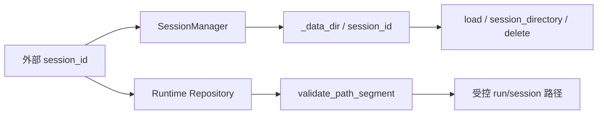

**结论：**SessionManager 的路径校验弱于 Runtime Repository；外部 Session ID 当前可以在进入文件操作前绕过统一路径段验证。

`_session_path()` 和 `session_directory()` 直接执行：

```text
_data_dir / session_id
```

外部 `/switch`、字符串 submit 和 delete_session 可以传入任意文本。相对父目录片段可能越过 Session 根，形成路径遍历和误删风险。

Runtime Repository 已有 `validate_path_segment()`，SessionManager 未复用。

#### S2. CLI 长期持有陈旧 Session 对象


```mermaid
sequenceDiagram
    participant CLI as current_session 对象
    participant Entry as SessionInteractionService
    participant Coord as SessionRunCoordinator
    participant Projector as Success Projector
    participant Disk as session.json

    CLI->>Entry: submit(current_session v0)
    Coord->>Projector: Run 1 成功
    Projector->>Disk: 保存 Session v1
    Projector-->>CLI: 不更新原对象

    CLI->>Entry: submit(current_session v0)
    Entry->>Coord: request_factory 捕获 v0
    Coord->>Entry: 锁内调用 factory
    Entry-->>Coord: ConversationSnapshot v0
```

**结论：**锁内执行 request_factory 不能弥补其捕获陈旧 Session 对象的问题；正确边界是取得锁后按 session_id 重新加载再冻结。

CLI 启动或 `/switch` 时加载 current_session，普通成功 Run 后不重新加载。

Success Projector 更新磁盘中的另一个 Session 实例，因此 current_session.conversations 和 conversation_version 不会自动前进。

#### S3. `submit_prepared` 没有真正保证锁内读取最新 Session

SessionInteractionService 在锁外取得 Session 对象，request_factory 只是延迟调用：

```python
create_run_request(session, ...)
```

即使 Factory 在 Lock 内执行，数据源仍可能陈旧。等待上一 Run 完成后，新请求仍可能冻结旧历史。

#### S4. conversation_version 没有参与乐观并发

ConversationSnapshot 保存 version，但 Projector 成功写入时不比较 Run 基线版本和当前 Session 版本。

并发或陈旧投影可能丢失更新或基于错误历史提交。

#### S5. 同 Session 跨进程串行并未保证


```mermaid
flowchart TD
    P1["进程 A"] --> LockA["内存 asyncio.Lock(session_id)"]
    P2["进程 B"] --> LockB["另一把内存 Lock(session_id)"]

    LockA --> CheckA["扫描 active Run"]
    LockB --> CheckB["扫描 active Run"]
    CheckA --> CreateA["创建 run-A 目录"]
    CheckB --> CreateB["创建 run-B 目录"]
```

**结论：**当前串行保证只成立于单进程；跨进程场景缺少原子占用或持久化 Lease，可能同时创建多个活动 Run。

每个进程有独立 asyncio.Lock。active Run 扫描和 create_run 是两个步骤，没有文件锁、原子占用文件或数据库唯一约束。

两进程可以同时看到无活动 Run，并各自创建不同 run_id。

#### S6. `lease_id` 不是实际租约

RunRequest 生成随机 lease_id，但 Coordinator 不读取，AgentRun 不保存，Repository 不验证。

名称暗示的所有权和过期语义当前不存在。

#### S7. 删除没有取得 SessionRunCoordinator Lock

delete_session 先检查活动 Run，再删除 Approval 和目录。检查与 rmtree 之间，新普通提交可能创建 Run。

可能出现：

```text
删除检查通过
→ 新 Run 开始
→ Session 目录被删除
```

#### S8. 删除多步骤不可恢复

顺序为：

```text
删除 Approval
→ rmtree Session
→ 释放 Context
```

任何中间失败都没有删除意图或补偿：

- Approval 已删但 Session 仍在；
- 目录已删但 Cache 未释放；
- 部分运行已无法恢复。

#### S9. SessionManager 根与 Runtime storage_root 可能分裂

SessionManager 基于 `dotclaw.__file__` 推导项目根；RuntimeFactory 基于 Host.project_root。

自定义 Host 构造时 Session、Run、Approval 和删除检查可能访问不同根。

#### S10. `load()` 把损坏伪装为不存在

JSON 错误、Schema 不兼容、agent_id 缺失和 IO 异常全部返回 None。

入口无法给出数据损坏诊断，也可能把真实 Session 当成不存在。

#### S11. `list_all()` 静默隐藏损坏 Session

读取异常直接 `pass`。列表结果不是磁盘目录的完整报告，也没有 corrupt entries、错误路径或修复提示。

#### S12. `load()` 会创建不存在 Session 的空目录

`_session_path()` 在检查文件前 mkdir。任何拼写错误或探测请求都会留下空目录。

空目录随后可被 delete() 视为存在并返回 True。

#### S13. 8 位 Session ID 无碰撞保护

UUID 前 8 位约 32 bit。create() 不检查目录或文件是否已存在，碰撞会通过 save() 覆盖已有 session.json。

#### S14. Session JSON 没有格式版本

Runtime 文件严格要求 v4，session.json 没有 version 字段或显式 Migration。

新增/删除字段只能依靠 dataclass 默认值和临时兼容逻辑。

#### S15. Session.from_dict 修改输入字典

它对传入 data 执行 `pop("conversations")` 和 `pop("history_compressions")`。

同一解析对象不能安全复用，行为也不符合纯转换预期。

#### S16. HistoryCompression 链校验不完整

当前未验证：

- previous_version 等于旧 active；
- 版本列表连续且唯一；
- active 引用存在；
- 新边界单调前移；
- Session 载入时 content/source hash；
- covered boundary 顺序。

损坏数据可能静默退化为无活动摘要。

#### S17. Conversation.agent_run_ids 与委托设计不一致

字段注释允许一次请求关联多个父子 AgentRun，但 Projector 只保存根 run_id。

Session 历史无法直接列出该回答涉及的子 Run。

#### S18. `Session.model` 是非权威冗余字段

普通创建为空，委托创建可能有值，Runtime 仍按 agent_id 重新冻结模型。

它可能与实际 Run Policy 和 LLM 最终路由不一致。

#### S19. `conversation.json` 形成潜在双历史源

RunRepository 在无 Projector 时写独立 conversation.json，生产则写 Session.conversations。

两个格式内容和粒度不同；错误装配或工具读取可能误判权威来源。

#### S20. success_commit 投影顺序存在暂态不一致

恢复顺序先更新 Session，再写完成事件和最终 run.json。

在意图完成前，Session 可能已经显示 Conversation，但对应 run.json 仍不是最终 COMPLETED。依靠 intent 可恢复，但普通读取者需要理解暂态。

#### S21. Session Projector 的读改写没有 CAS 或内部锁

Projector：

```text
load
→ mutate
→ save
```

自身不持有 Coordinator Lock，也不校验 baseline。它依赖调用上下文串行，启动恢复或未来其他调用者可能破坏假设。

#### S22. Approval.consume 不是跨进程原子消费

ApprovalRepository 的“consume”是读文件、检查 PENDING、再原子替换。两个进程可同时读取 PENDING 并都返回记录。

审批恢复的同 Session Lock 也只在单进程内。

#### S23. deletion_handler 是未接入扩展点

SessionManager 提供 set_deletion_handler，但生产 Host 未设置。删除流程又在 SessionInteractionService 显式释放 SESSION Scope。

接口、注释和实际装配不一致，未来容易重复释放或误以为自动清理。

#### S24. delete 使用同步 `shutil.rmtree`

大 Session 包含大量 Run 消息和事件时，会阻塞 asyncio 事件循环。

#### S25. Coordinator Lock 字典不回收

每个访问过的 session_id 都永久保留一个 Lock。大量创建、委托和删除 Session 后会持续增长。

#### S26. SessionInteractionService 删除依赖可选

构造器允许 run_repository、approval_repository 和 context_port 为 None。

兼容构造下 `delete_session()` 可能跳过活动 Run 检查、审批清理或 Cache 释放，但方法名称仍表示完整删除。

#### S27. 目录不存在时删除直接返回

如果 session.json/目录已丢失但仍有共享 approvals 或 Context Cache，delete_session 不执行清理。

孤儿外部事实无法通过该入口回收。

#### S28. 时间格式不统一

Session/Conversation 使用无时区本地时间，Runtime 使用 UTC 风格工具。

排序、跨机器复制和审计比较可能产生歧义。

#### S29. Session 文件随历史线性增长

每次 save 都序列化和替换完整 Session，包括所有 Conversation、摘要正文和旧摘要版本。

没有分页、分片、归档或大小限制。

#### S30. list_all 同步遍历所有目录

虽然单文件读取使用 aiofiles，但目录遍历和逐个读取是串行的。Session 数量大时启动和 `/list` 延迟线性增长。

#### S31. 自动 abandon 是隐式用户操作

发送新消息会自动放弃旧 INTERRUPTED Run，但入口结果主要返回新请求结果。

旧 Run 状态变化缺少单独确认或用户策略开关。

#### S32. 委托 Session 没有临时生命周期标记

每次 Delegation 创建持久化 Session。没有：

```text
temporary
owner_run_id
auto_archive
retention
reuse_key
```

大量委托会积累普通 Session 目录并进入 list_all。

#### S33. Session 删除没有 Tombstone

删除过程中其他入口无法识别“正在删除”。即使未来共享 Lock，跨进程调用仍可能重新创建同名目录或写入事实。

#### S34. 创建和保存没有所有权检查

SessionManager.save() 只按 session.id 路径写入，不验证对象是否来自该 Manager、agent_id 是否仍有效或 conversation_version 是否回退。

#### S35. active_history_compression 对损坏引用静默返回 None

active_compression_version 大于 0 但版本列表缺失时，不报错而是按无摘要继续。

这可能把已压缩的全部历史原文重新注入模型。

#### S36. Session 领域记录没有类型级不可变保证

`Conversation`、`HistoryCompression` 和 `Session` 都是普通可变 `dataclass`。

其中 HistoryCompression 虽按版本追加、业务语义上不应覆盖，但调用者仍可直接修改：

```python
compression.content = "..."
compression.version = 99
```

当前“不覆盖旧版本”依赖调用约定和 Projector 流程，不是类型系统保证。共享引用或未来扩展代码可能绕过版本链校验。

### 8.4 演进方向

| 编号 | 解决的痛点 | 候选方向 | 影响与代价 |
|---|---|---|---|
| E1 | S1 | Session Core 统一复用 `validate_path_segment`；所有 load/delete/switch 入口先校验 | Session、CLI、Bootstrap |
| E2 | S13 | 使用完整 UUID/ULID，并以 create-new 语义拒绝已存在目录 | SessionManager、迁移 |
| E3 | S10、S11、S14、S15 | 引入版本化 Session Schema 和结构化 `SessionLoadResult`；严格区分 missing/corrupt/incompatible/io | Session、CLI、修复工具 |
| E4 | S12 | 拆分 `_session_path(create=False)`，load 绝不创建目录 | SessionManager |
| E5 | S2、S3 | SessionInteractionService 只接受 session_id；在 Coordinator Lock 内重新 load、校验并冻结请求 | Bootstrap、Runtime Coordinator、CLI |
| E6 | S4、S21、S34 | SessionStore.save(expected_version) 使用 CAS；Projector 以 Run baseline version 提交并冲突重试 | Session、Projector、RunRequest |
| E7 | S5、S6、S22 | 实现持久化 Session Lease：原子占用文件/SQLite 唯一行、owner、epoch、expiry；lease_id 进入 Run | Coordinator、Repository、Runtime |
| E8 | S7、S33 | 删除也通过 Session 生命周期锁；先写 tombstone，再拒绝新提交，最后清理 | SessionLifecycleService、Coordinator |
| E9 | S8、S26、S27 | 引入可恢复 DeleteIntent，统一 Approval、目录和 Cache 步骤；生产构造强制依赖完整 | Bootstrap、Session、Runtime |
| E10 | S9 | Host 一次性解析绝对 SessionStoragePaths，并注入 Manager、Run、Approval、Checkpoint | Bootstrap、Config |
| E11 | S16、S35 | Session.from_dict 严格验证 Compression 版本链、边界、hash 和 active 引用 | Session、迁移 |
| E12 | S17 | SuccessIntent/ConversationProjector 从 Delegation 事件汇总完整 parent/child run_ids | Runtime、Orchestration、Session |
| E13 | S18 | 删除 Session.model，或改名为 display_model_snapshot 并明确非权威 | Session、Delegation、迁移 |
| E14 | S19 | 删除 standalone conversation.json 兼容路径，或定义明确只读迁移工具 | Runtime Repository、Session |
| E15 | S20 | 提供统一 `read_consistent_session()`：先恢复 pending success，再返回 Session/Run 一致视图 | Runtime Repository、Session Entry |
| E16 | S22 | Approval 使用原子 rename/锁文件/SQLite 条件更新消费 | Approval Repository |
| E17 | S23 | 删除未使用 deletion_handler，或由唯一 SessionLifecycleService 负责注册和调用 | Session、Context、Bootstrap |
| E18 | S24 | `shutil.rmtree` 放入 `asyncio.to_thread`，支持进度/失败清单 | SessionManager |
| E19 | S25 | 为 Lock 建立引用计数和安全清理；删除 Session 后移除无 waiter Lock | Coordinator |
| E20 | S28 | 所有持久化时间统一 UTC RFC3339，旧值显式迁移 | Session、Runtime |
| E21 | S29、S30 | Conversation 分页/追加日志或 SQLite；Session JSON 只保存元数据与活动指针 | Session Storage |
| E22 | S31 | 将自动 abandon 变为显式入口策略或在 RunResult 中返回 abandoned_run_id | Coordinator、Channel |
| E23 | S32 | Delegation Session 增加 temporary、owner_run_id 和终态归档/回收策略 | Orchestration、Session |
| E24 | 多项 | 建立并发契约测试：陈旧对象、双进程提交、删除竞态、CAS 冲突、成功补偿和路径遍历 | tests/session、runtime、bootstrap |
| E25 | 多项 | 中期迁移到 SQLite：Session、Conversation、Compression、Lease、Approval 和 Commit Intent 使用本地事务 | Storage、Runtime、Migration |
| E26 | S36 | 将 Conversation/HistoryCompression 改为冻结值对象，或只通过 Session 聚合根暴露不可变副本 | Session Domain、Projector、Migration |

---

## 9. 源码索引

### 9.1 Session Core

```text
src/dotclaw/session/
├── __init__.py
└── session.py
```

| 文件 | 主要内容 |
|---|---|
| `session/__init__.py` | 导出 Session、Conversation、SessionManager |
| `session/session.py` | Conversation、HistoryCompression、Session、SessionManager、原子写入和旧 ID 兼容 |

### 9.2 Bootstrap 应用入口

```text
src/dotclaw/bootstrap/
├── application_host.py
├── runtime_factory.py
└── session_interaction.py
```

| 文件 | Session 视角 |
|---|---|
| `bootstrap/application_host.py` | 创建 Manager、启动成功恢复、开放应用入口 |
| `bootstrap/runtime_factory.py` | 创建 Projector、Run/Approval Repository、Coordinator |
| `bootstrap/session_interaction.py` | Identity 路由、普通提交、控制和完整删除 |

### 9.3 Runtime Application

```text
src/dotclaw/runtime/application/
├── dto.py
├── ports.py
├── request_factory.py
├── session_run_coordinator.py
└── engine.py
```

| 文件 | Session 视角 |
|---|---|
| `runtime/application/dto.py` | ConversationMessage、ConversationSnapshot、RunRequest、RunResult |
| `runtime/application/ports.py` | ConversationProjectionPort、RunRepository、ContextPort |
| `runtime/application/request_factory.py` | Session 历史冻结与压缩边界选择 |
| `runtime/application/session_run_coordinator.py` | 同 Session Lock、活动 Run 门禁和控制 |
| `runtime/application/engine.py` | Run 生命周期、恢复、成功意图和 Conversation 投影触发 |

### 9.4 Runtime 文件适配器

```text
src/dotclaw/runtime/adapters/
├── _file_support.py
├── run_repository.py
├── session_conversation_projector.py
├── approval_repository.py
└── checkpoint_repository.py
```

| 文件 | Session 视角 |
|---|---|
| `runtime/adapters/_file_support.py` | Runtime v4 文件名、路径段校验和原子 JSON 写入 |
| `runtime/adapters/run_repository.py` | Run 事实、success_commit 意图与恢复 |
| `runtime/adapters/session_conversation_projector.py` | COMPLETED Run→Session Conversation/Compression |
| `runtime/adapters/approval_repository.py` | 审批持久化和按 Session 清理 |
| `runtime/adapters/checkpoint_repository.py` | Run 恢复 Checkpoint |

### 9.5 Config

```text
src/dotclaw/config/settings.py
config.yaml
```

`SessionConfig` 当前只有 `directory` 字段。

### 9.6 CLI

```text
src/dotclaw/main.py
```

Session 相关行为：

- 启动选择最新 Session；
- `/new`、`/list`、`/switch`、`/delete`；
- 普通提交使用长期持有的 current_session；
- `/retry`、`/abandon`、`/cancel`；
- 当前普通提交后不重新加载 Session。

### 9.7 Orchestration 跨模块参考

```text
src/dotclaw/orchestration/runtime_delegation_adapter.py
```

该文件为目标 Agent 创建独立 Session 和子 Run。Delegation Task、Dispatcher 和消息状态的完整说明主归属 Orchestration Wiki。

