# Skills 模块总体说明

> 适用代码：`aandbcct/dotClaw` 的 `master` 分支  
> 扫描基准：2026-07-27，包含 Skill 数据模型、递归扫描、注册表、Bootstrap、Context 注入、Agent Context Plan、Tool SkillParser、Journal 观测、Config、CLI 与测试配置  
> 文档定位：自顶向下解释 dotClaw 当前 Skill 如何从 `SKILL.md` 变成模型可见的技能目录，正文、references 和 scripts 如何依赖通用 Tool 渐进读取，以及当前哪些元数据只是预留、哪些观测链尚未真正生效。  
> 编写基准：《dotClaw Wiki 编写规范与验收准则 v1.1》  
> 上级导航：[dotClaw 开发者 Wiki](./README.md)

**快速导航**

| 需要回答的问题 | 阅读位置 |
|---|---|
| Skill 当前是什么，不是什么 | 第 1～2 节 |
| Scanner、Meta、Registry、Context 和 Tool Parser 如何分工 | 第 3～4 节 |
| 启动扫描、摘要注入、正文读取和脚本执行如何发生 | 第 5 节 |
| SKILL.md、Frontmatter、路径、Context 和观测契约 | 第 6 节 |
| 修改某项 Skill 能力从哪里开始 | 第 7 节 |
| 当前取舍、真实问题与演进路线 | 第 8 节 |
| 具体源码在哪里 | 第 9 节 |

```text
当前生产链
skills 目录
→ SkillScanner 只读取 Frontmatter 与资源清单
→ SkillRegistry
→ ContextProvider._skills_text()
→ SkillsSlot
→ ContextVersion Snapshot
→ LLM 看到 Skill 名称、简介和 SKILL.md 路径

渐进披露链
LLM 根据摘要判断需要某 Skill
→ 调用 builtin.files.read_text 读取 SKILL.md
→ 按正文说明读取 references 或调用现有 Tool 执行 scripts

当前仓库默认状态
skills/_example/SKILL.md（name=hello）
→ 目录名命中默认 skip_prefix="_"
→ Scanner 跳过
→ 默认 Registry 为空
→ /skills 显示“没有加载任何 Skill”

当前没有
SkillExecutor
Skill 自动触发器
Skill 正文自动注入
逐 Agent Skill 白名单
Skill 生命周期状态机
```

---

## 1. 模块定位与边界

Skills 模块是 dotClaw 的**文件型操作指南目录与渐进披露元数据层**。

它负责扫描一个或多个目录中的 `SKILL.md`，解析 YAML Frontmatter，登记 Skill 名称、描述、资源路径和预留生命周期信息，再把一个紧凑目录注入 Agent Context。

Skill 本身不是可执行函数，也不会直接给 Agent 新增权限。模型想使用 Skill 时，必须依赖已经注册并被 Agent 允许的 Tool：

```text
读取正文
→ builtin.files.read_text

读取 references
→ builtin.files.read_text

执行 scripts
→ builtin.process.execute 或其他已有 Tool
```

因此当前 Skills 的真实语义是：

> 告诉模型“有哪些可用工作流、它们在哪里”，而不是自动加载或运行这些工作流。

### 1.1 核心职责

当前职责归纳为六组：

1. **目录发现**：从配置的一个或多个根目录递归寻找子目录中的 `SKILL.md`。
2. **元数据解析**：解析名称、描述、关键词、生命周期、扩展字段和 OpenClaw 风格元数据。
3. **资源清单**：记录 Skill 目录下 `scripts/` 与 `references/` 的相对文件路径。
4. **注册与查询**：按 Skill 名称提供内存注册表和描述摘要。
5. **Context 注入**：将 Skill 名称、截断描述和 `SKILL.md` 路径作为 Agent Owner Snapshot 注入模型。
6. **工具观测识别**：尝试识别读取 Skill 正文、引用或执行脚本的 Tool 调用，并发射 Journal 事件。

### 1.2 主要使用者

| 使用者 | 如何使用 Skills |
|---|---|
| `ApplicationHost` | 以可降级组件创建 SkillRegistry |
| `_build_skills()` | 解析目录配置，执行扫描并注册元数据 |
| `runtime_factory` | 将 SkillRegistry 注入 ContextDependencies |
| `ContextProvider` | 读取 Skill 描述目录 |
| `SkillsSlot` | 把技能摘要转换为 Agent 级 System Content |
| `ContextPlanResolver` | 决定当前 Agent 是否启用整个 Skills Slot |
| `ToolExecutor` | 持有 SkillParser，尝试记录 Skill 文件/脚本使用事件 |
| `SkillParser` | 根据 Tool 名称和路径判断是否命中某 Skill |
| CLI `/skills` | 展示已注册 Skill 名称和短描述 |
| `MemoryManager` | 独立读取推导出的 `skills/knowledge/*.md`，不读取 SkillRegistry |
| Agent 模型 | 根据摘要选择 Skill，再通过 Tool 读取正文和资源 |

### 1.3 明确不负责的内容

Skills 当前不负责：

1. **工具能力和权限**：Tool Definition、Capability、Policy、审批和实际执行属于 Tool 模块。
2. **Skill 正文自动加载**：Context 默认只注入名称、描述和路径，不注入 `SKILL.md` Body。
3. **自动路由和触发**：没有关键词匹配器、分类器或 LLM 前置选择器。
4. **逐 Agent Skill 授权**：Agent 只能启用或禁用整个 Skills Slot，不能声明 Skill 名称白名单。
5. **生命周期执行**：ONE_SHOT、EPHEMERAL、deactivate_on 和 always_load 不参与运行状态。
6. **安装和更新**：没有 Skill 下载、版本、签名、更新或远程仓库管理。
7. **长期知识检索**：`skills/knowledge` 当前由 Memory 索引，不由 SkillRegistry 检索。
8. **资源内容安全审查**：Scanner 不分析 Skill Body、Script 代码或 Reference 内容。

### 1.4 与相邻模块的职责边界

| 相邻模块 | Skills 负责 | 相邻模块负责 |
|---|---|---|
| Context | 提供 Skill 摘要字符串 | Slot、Owner、Snapshot、缓存、顺序和 Token 预算 |
| Agent | 不定义 Agent 身份 | `context_slot_ids` 决定是否启用 Skills Slot |
| Tool | 提供路径识别元数据 | 文件读取、进程执行、安全策略、审批和结果 |
| Runtime | 不介入 Run 状态机 | 冻结 ContextVersion、执行 LLM/Tool 循环和恢复 |
| Bootstrap | 提供 Scanner/Registry | 目录解析、降级、依赖装配和 Host 持有 |
| Config | 消费 SkillsConfig | YAML 解析和项目根路径 |
| Journal | 不保存事件 | Skill Body/Reference/Script 观测事件 |
| Memory | 不索引通用 Skill Body | 当前索引 `skills/knowledge/*.md` |
| MCP | 不发现 MCP 工具 | 外部 Tool 发现和生命周期 |
| CLI | 提供 Registry 数据 | `/skills` 的展示和用户交互 |
| Workspace | 读取配置目录 | 目录内容、文件权限和变更来源 |

---

## 2. 模块在项目中的位置

### 2.1 全局位置图

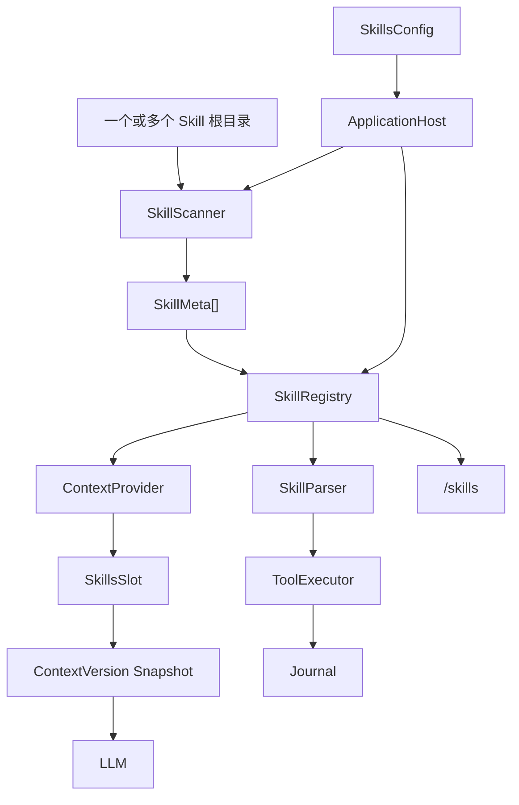

**结论：**

- Scanner 和 Registry 是 Skills Core。
- Context 注入与 Tool 观测是两条独立消费链。
- Skills 不直接依赖 RuntimeEngine。
- ToolExecutor 只使用 SkillParser 做观测，不使用它执行 Skill。
- ApplicationHost 是唯一生产装配点。

### 2.2 Skill 目录结构

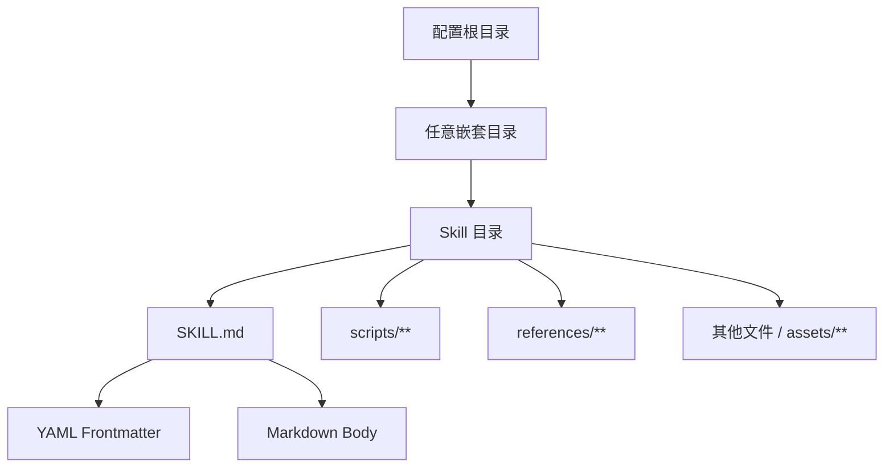

**结论：**

- Scanner 递归查找目录中的精确文件名 `SKILL.md`。
- Skill 根目录自身的 `SKILL.md` 不会被扫描，只检查其子目录。
- `scripts/` 和 `references/` 会被递归列出。
- 其他目录和 Assets 不进入 SkillMeta 专用字段。
- Body 只在模型显式读取文件时进入当前 Run。

### 2.3 元数据、正文与资源的披露层级

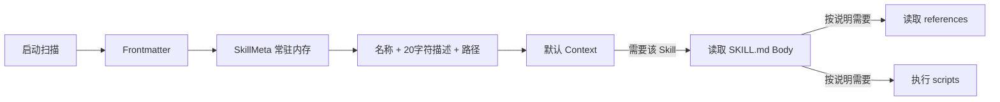

**结论：**

- 默认只披露元数据摘要。
- Body、Reference 和 Script 是按需披露。
- Scanner 不缓存 Body。
- Body 变更可以在后续 Tool 读取时立即看到，但 Registry 中的 Frontmatter 摘要仍是启动时旧值。
- 资源读取和执行仍受 Tool 可见性和安全策略约束。

### 2.4 Skills 与 Tools

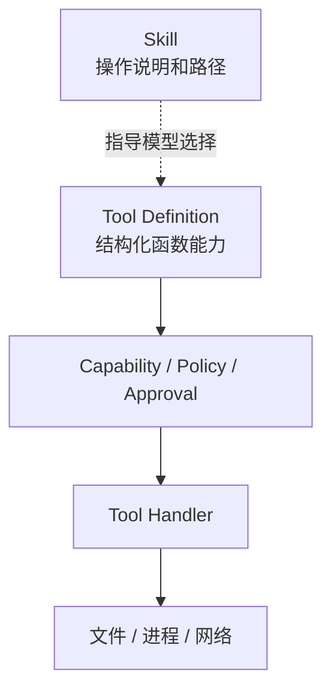

**结论：**

- Skill 不会注册 Tool Definition。
- Skill 不会绕过 Tool Policy。
- `has_scripts=True` 不代表脚本可执行。
- Agent 缺少文件读取工具时无法读取 Skill Body。
- Agent 缺少进程工具时无法执行 Script。

### 2.5 Skills 与 Agent

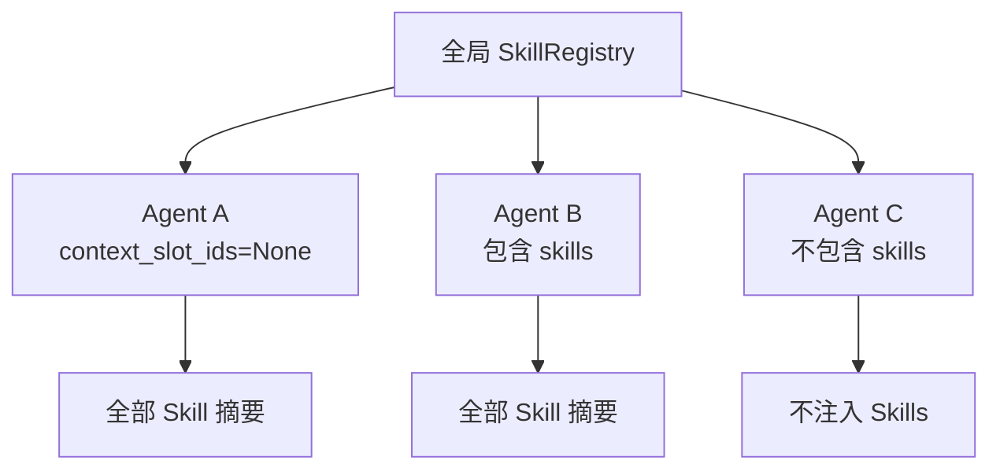

**结论：**

- SkillRegistry 是 Host 级全局实例。
- 未声明 Context Plan 的 Agent 使用默认计划，包含 Skills Slot。
- 显式包含 `skills` 的 Agent 也会看到全部已注册 Skill。
- 不包含 `skills` 的 Agent 完全看不到摘要。
- 当前没有按 Skill 名称筛选。
- 但当前仓库默认配置下 Registry 为空，因此上述“全部可见”只在用户新增非下划线 Skill 或调整 skip_prefix 后发生。

### 2.6 Skills 与 Memory Knowledge

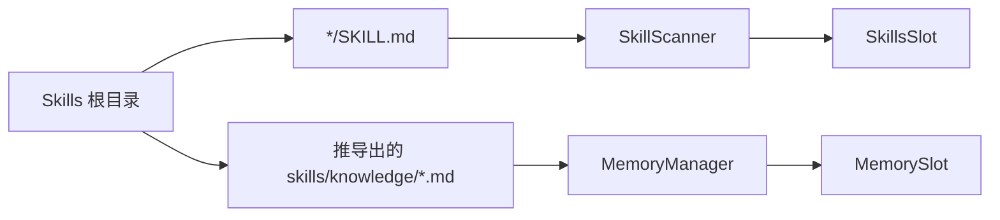

**结论：**

- `SKILL.md` 和 `skills/knowledge/*.md` 走两条不同链。
- SkillRegistry 不全文检索 Skill Body。
- MemoryManager 不理解 SkillMeta。
- Knowledge 文件进入 Memory Slot，不进入 Skills Slot。
- “Skill 指南”和“静态知识”当前目录相邻但领域归属不同。

### 2.7 启动和运行时状态

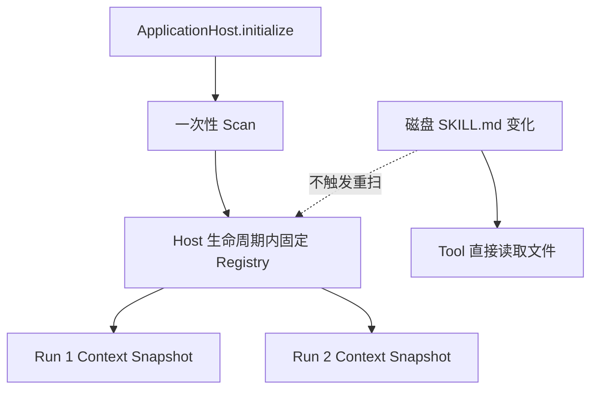

**结论：**

- Registry 只在 Host 初始化时构建。
- 没有文件 Watcher 或 Reload。
- 新 Run 仍使用旧 Frontmatter 摘要。
- 模型若按旧路径读取 Body，可能得到文件的新正文。
- 元数据和正文因此可能来自不同版本。

### 2.8 依赖方向

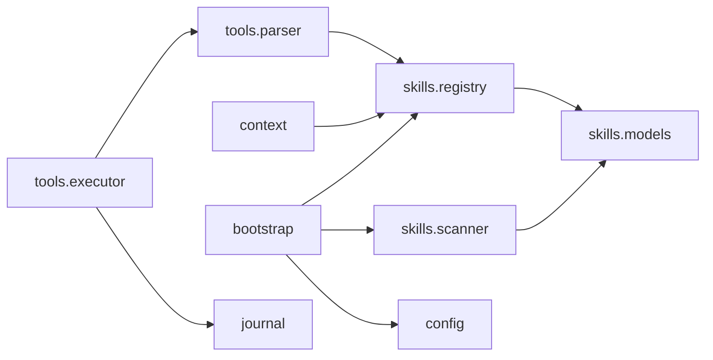

**结论：**

- Models 不依赖外部模块。
- Scanner 只依赖文件系统、YAML 和 Models。
- Registry 只依赖 SkillMeta。
- Context 通过 `SkillRegistryPort` 结构协议使用 Registry。
- Tool Parser 在 Tool 包中反向读取 SkillRegistry。
- Skills Core 不依赖 Tool、Context、Runtime 或 Journal。

---

## 3. 组件总览

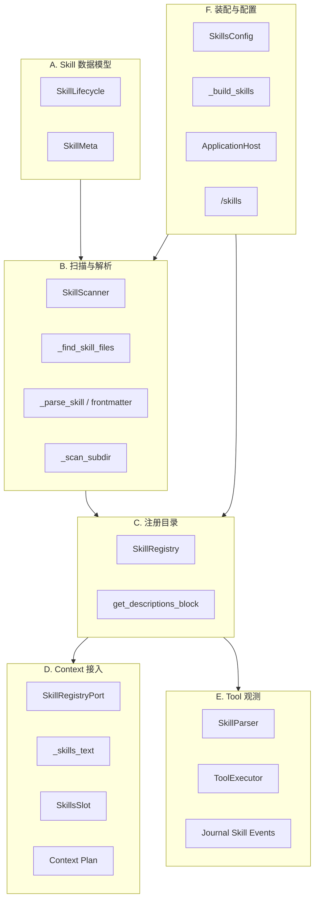

**结论：**

- Skills Core 只有 Models、Scanner 和 Registry 三组。
- Context 只消费描述摘要。
- Tool Parser 只做路径归类和观测。
- Bootstrap 决定扫描根、启停和降级。
- CLI 只读取 Registry，不触发重扫或正文加载。

### 3.1 组成部分与责任

| 分类 | 组成部分 | 主归属 | 稳定职责 |
|---|---|---|---|
| Domain | `SkillLifecycle` | Skills | 声明生命周期枚举；当前未执行 |
| Domain | `SkillMeta` | Skills | 常驻 Frontmatter 与资源路径元数据 |
| Scanner | `SkillScanner` | Skills | 多根递归发现和解析 |
| Registry | `SkillRegistry` | Skills | 名称索引和摘要目录 |
| Context Port | `SkillRegistryPort` | Context | 最小描述块协议 |
| Context | `_skills_text` | Context | 格式化 Skill System Content |
| Context | `SkillsSlot` | Context | Agent Owner Snapshot Slot |
| Context | Context Plan | Context/Agent | 整体启用或禁用 Skills Slot |
| Tool | `SkillParser` | Tool | Tool 参数到 Skill Body/Reference/Script 分类 |
| Tool | `ToolExecutor._check_skill` | Tool | 发射观测事件 |
| Journal | Skill Events | Journal | Body、Reference、Script 使用记录 |
| Config | `SkillsConfig` | Config | 根目录、启停和跳过前缀 |
| Bootstrap | `_build_skills` | Bootstrap | 路径解析、扫描和注册 |
| Bootstrap | `_build_tools` | Bootstrap | 用 Registry 构造 SkillParser |
| CLI | `_cmd_skills` | CLI | 展示已注册名称和 40 字符描述 |

### 3.2 当前仓库 Skill 清单

| 路径 | Frontmatter `name` | 描述 | Scripts | References | 默认扫描结果 |
|---|---|---|---:|---:|---|
| `skills/_example/SKILL.md` | `hello` | 示例技能：演示 Skill 系统的基本用法 | 1：`scripts/hello.py` | 0 | **跳过**：目录 `_example` 命中默认 `skip_prefix="_"` |

当前仓库资源与默认运行结果应区分：

```text
磁盘存在示例 Skill
≠
默认 Registry 已加载该 Skill
```

**结论：**

- 当前仓库已核对到的工作区 Skill 资源是 `skills/_example`。
- 该 Skill 的脚本 `skills/_example/scripts/hello.py` 只输出示例问候语。
- 默认配置 `directory=./skills`、`skip_prefix="_"` 会跳过整个 `_example` 子树。
- 因此当前仓库在默认配置下，SkillRegistry 预期为空。
- 旧架构文档中的 `xbrowser` 和“已加载 hello”属于历史示例，不应作为当前运行事实。

---

## 4. 各组件的类与职责

本节完整说明 Skills Core，并展开 Context 与 Tool 中直接消费 SkillRegistry 的组件。普通文件读取、进程执行和 Journal 内部存储仍分别归 Tool 与 Journal Wiki。

### 4.1 `SkillLifecycle`

#### 4.1.1 `SkillLifecycle`

**职责与用途：**声明三种生命周期值：

```text
PERSISTENT
ONE_SHOT
EPHEMERAL
```

当前运行代码没有根据该字段创建、激活、卸载或重新判定 Skill。所有已注册 Skill 实际都随 Host Registry 常驻。

**生命周期降级**

**说明：**Scanner 遇到未知字符串时记录 warning，并降级为 PERSISTENT。

该降级只影响 SkillMeta 字段，不会改变实际运行行为，因为三种生命周期当前都没有消费者。

---

### 4.2 `SkillMeta`

#### 4.2.1 `SkillMeta`

**职责与用途：**保存一个 Skill 的启动期元数据和资源清单。

字段分为：

```text
基础
→ name
→ description

触发与生命周期
→ keywords
→ lifecycle
→ deactivate_on
→ always_load

展示
→ emoji
→ homepage
→ author

扩展
→ metadata
→ extra

文件
→ skill_dir
→ skill_md_path
→ has_scripts / has_references
→ script_paths / reference_paths
```

**冻结边界**

**说明：**类使用 `frozen=True`，字段引用不能重新赋值。

但：

```text
metadata: dict
extra: dict
```

内部仍可原地修改，因此不是深度不可变值对象。

**`truncated_description`**

**说明：**提取 description 第一行，按 Python 字符数截断并追加 `...`。

默认 max_len=40。

实际调用：

```text
Registry 默认接口
→ 40

ContextProvider
→ 20

CLI /skills
→ 40
```

**字段类型边界**

**说明：**Dataclass 类型标注不会在运行时校验 Frontmatter。

Scanner 没有显式保证：

```text
name 是 str
description 是 str
keywords/deactivate_on 每项是 str
metadata.openclaw 是 dict
```

异常类型可能在排序、截断或 `.get()` 时才暴露。

---

### 4.3 `SkillScanner`

#### 4.3.1 `SkillScanner`

**职责与用途：**接受多个扫描根和一个跳过前缀，返回去重后的 SkillMeta 列表。

构造时只把输入转换为 Path，不立即检查存在性、权限或路径归属。

#### 4.3.2 `scan`

**职责与用途：**按配置根顺序执行：

```text
根不存在
→ debug 并跳过

根存在
→ 递归发现 SKILL.md
→ 解析
→ 按 name 去重
→ 返回列表
```

单个根失败不一定导致整个 Host 失败，具体取决于异常是否在 Scanner 内被捕获。

#### 4.3.3 `_find_skill_files`

**职责与用途：**递归遍历每个根目录的子目录：

1. 只处理目录；
2. 不跟随目录符号链接；
3. 跳过名称以 `skip_prefix` 开头的目录；
4. 若目录内存在 `SKILL.md`，加入结果；
5. 继续递归该目录。

因此允许：

```text
skills/group/a/SKILL.md
skills/group/a/nested/b/SKILL.md
```

同时根目录自身的 `SKILL.md` 不会被检查。

**精确文件名**

**说明：**只识别大小写精确的：

```text
SKILL.md
```

以下不会加载：

```text
skill.md
Skill.md
README.md
```

**跳过前缀**

**说明：**默认 `_`。

任何层级目录只要名称以 `_` 开头，整个子树都跳过。

当前 Config 不校验空字符串；若 `skip_prefix=""`，所有目录名都满足 `startswith("")`，扫描结果会为空。

**路径与符号链接**

**说明：**目录遍历使用 `is_dir(follow_symlinks=False)`，避免目录符号链接循环。

但目录中的 `SKILL.md` 只检查 `exists()`，没有拒绝文件符号链接。Skill Body 可能通过文件链接指向扫描根之外。

#### 4.3.4 `_parse_skill`

**职责与用途：**读取文本、解析 Frontmatter、扫描资源并构造 SkillMeta。

读取失败、Frontmatter 缺失、YAML 解析失败和缺少 name 时返回 None。

**Frontmatter 正则**

**说明：**要求文件开头直接是：

```markdown
---
YAML
---
正文
```

规则具有以下约束：

- `---` 前不能有 BOM、空格或注释；
- 兼容 CRLF、CR 和 LF；
- 关闭分隔符后必须有换行；
- 只解析第一段 Frontmatter；
- Body 不进入解析结果。

**YAML 返回类型**

**说明：**`yaml.safe_load()` 的结果直接返回。

若合法 YAML 解析为：

```text
list
string
number
boolean
```

后续 `_parse_skill()` 调用 `fm.get()` 会抛 AttributeError。该异常没有 per-file 兜底，可能使整个 `_build_skills()` 降级失败。

**基础字段**

**说明：**

```text
name
→ 必须 truthy

description
→ 可空；只记录 debug

keywords
→ 仅 list 时转 tuple

deactivate_on
→ 仅 list 时转 tuple
```

没有命名格式、长度、唯一标识字符或描述大小限制。

**OpenClaw 风格元数据**

**说明：**从：

```yaml
metadata:
  openclaw:
    always: true
    emoji: "..."
```

读取 `always_load` 和 `emoji`。

如果 `metadata` 是 dict 但 `metadata.openclaw` 不是 dict，`.get()` 会失败。

**`extra`**

**说明：**把未列入 known_keys 的 Frontmatter 字段原样保留。

当前 known_keys：

```text
name
description
keywords
lifecycle
deactivate_on
homepage
author
metadata
```

`extra` 没有运行消费者，只用于保留未知数据。

#### 4.3.5 `_scan_subdir`

**职责与用途：**递归列出 `scripts/` 或 `references/` 下的普通非符号链接文件，并返回相对 Skill 根路径的排序字符串。

它不读取内容、不识别语言、不验证可执行权限，也不限制文件数量和大小。

**Assets 边界**

**说明：**Scanner 没有专门扫描：

```text
assets/
templates/
examples/
agents/
```

这些文件仍可通过 Skill Body 路径说明被 Tool 读取，但不会在 SkillMeta 中形成结构化清单。

#### 4.3.6 重名处理

**职责与用途：**Scanner 使用 `seen_names`，第一个成功解析的名称保留，后续重名 warning 后跳过。

优先级：

```text
配置根顺序
+ 每个目录的 iterdir 遍历顺序
```

根顺序稳定，但同一根内的文件系统遍历顺序没有显式排序，因此重名选择不具备完整确定性。

---

### 4.4 `SkillRegistry`

#### 4.4.1 `SkillRegistry`

**职责与用途：**用：

```text
name → SkillMeta
```

维护 Host 级内存目录。

没有锁、版本、持久化、Owner Scope 或 Reload。

#### 4.4.2 `register`

**职责与用途：**手工注册同名 Skill 时，后注册静默覆盖前注册，只记录 debug。

生产 Builder 通常接收 Scanner 已去重结果，因此该覆盖语义很少触发。

**`get`**

**说明：**按精确名称返回 SkillMeta 原对象或 None。

虽然 SkillMeta frozen，但 metadata/extra 内部字典仍是共享可变引用。

**`list_all`**

**说明：**返回 Registry values 的新 list，但元素仍是原 SkillMeta。

顺序是字典插入顺序，不自动按名称排序。

#### 4.4.3 `get_descriptions_block`

**职责与用途：**按 Skill 名称排序，生成：

```markdown
- **name**: description `path/to/SKILL.md`
```

只使用名称、截断描述和路径，不使用：

```text
keywords
lifecycle
always_load
scripts
references
metadata
```

**摘要转义边界**

**说明：**名称、描述和路径直接拼接 Markdown，没有转义。

恶意或异常 Frontmatter 可以注入 Markdown、换行或指令文本，随后以 System Content 进入模型。

---

### 4.5 Context 接入

#### 4.5.1 `SkillRegistryPort`

**职责与用途：**Context 只要求：

```python
get_descriptions_block(max_desc_len: int) -> str
```

因此 Context 不依赖 SkillMeta、Scanner 或 Registry 的具体实现。

**`ContextDependencies.skill_registry`**

**说明：**RuntimeFactory 把可选 Registry 注入 ContextProvider。

Skills 初始化失败或禁用时为 None。

#### 4.5.2 `_skills_text`

**职责与用途：**调用：

```python
registry.get_descriptions_block(max_desc_len=20)
```

并包装为：

```markdown
## 可用技能

- **skill-name**: short description `/absolute/path/SKILL.md`
```

Context 截断长度与 Registry 默认值、CLI 展示值不同。

#### 4.5.3 `SkillsSlot`

**职责与用途：**是 `_TextOwnerSlot("skills_text")`。

它不扫描目录、不读取 Registry，也不加载 Body，只把 OwnerSnapshot 中的字符串转换成 System Content。

**Descriptor**

**说明：**默认注册属性：

```text
slot_id = skills
owner = AGENT
kind = SYSTEM_CONTENT
persistence = SNAPSHOT
cache_scope = AGENT
order = 30
refresh_policy = SIGNAL
```

**默认 Context Plan**

**说明：**Agent Owner 默认启用：

```text
identity
tools
skills
```

未显式声明 `context_slot_ids` 的所有 Agent 都会进入该默认计划。

**Agent 覆盖**

**说明：**`build_context_plan_from_registry()` 只读取 AgentIdentity.context_slot_ids。

例如：

```yaml
context_slot_ids:
  - identity
  - tools
```

会整体移除 Skills Slot。

当前不能写：

```yaml
allowed_skills:
  - code-review
```

**Owner 数据构建时机**

**说明：**ContextProvider 在 Plan resolve 前先调用 `_skills_text()` 构造 Agent OwnerSnapshot。

即使 Agent Plan 不启用 Skills Slot，也会生成一次描述字符串；但只涉及内存排序和格式化，不读取 Skill Body。

#### 4.5.4 Snapshot 与恢复

**职责与用途：**首次 Context 构建后，Skills 内容进入 ContextVersion Snapshot。

审批恢复或中断重试复用活动 Snapshot，不重新读取 Registry。新的 Run 会重新格式化当前 Registry，但 Registry 本身仍是启动时版本。

---

### 4.6 `SkillParser` 与 Tool 观测

#### 4.6.1 `SkillParser`

**职责与用途：**根据已注册 Skill 根目录，识别一次 Tool 调用是否属于：

```text
body
reference
script
```

它是 Tool 观测解析器，不是 Skill 执行器。

**目录索引**

**说明：**构造时把每个：

```text
meta.skill_dir.resolve()
```

映射到 SkillMeta。

Registry 后续修改不会自动更新 Parser 索引。

#### 4.6.2 `parse`

**职责与用途：**只从 Tool Arguments 读取：

```text
path
file_path
```

然后要求路径存在并可 resolve。

如果 Tool 的实际参数把路径放在 command、args 或其他字段中，Parser 无法识别。

**Body 识别**

**说明：**仅对：

```text
tool_name == builtin.files.read_text
```

且目标文件名是 `SKILL.md` 时返回 body。

它不验证目标是否等于 `meta.skill_md_path`，只要同一 Skill 目录树中任意名为 `SKILL.md` 的文件都可能被归类为 Body。

**Reference 识别**

**说明：**同一 Skill 目录内，任何由 `builtin.files.read_text` 读取且不名为 SKILL.md 的文件都归为 reference。

Parser 不检查该路径是否存在于 `reference_paths`，因此 scripts、assets 或普通文件读取也可能被记为 Reference。

**Script 识别**

**说明：**只要 Tool 名称为：

```text
builtin.process.execute
```

且解析出的 path 位于 Skill 目录内，就归类为 Script。

Parser 不检查 `script_paths`，也不解析 command 中实际执行的程序。

**`_find_skill`**

**说明：**从目标文件的父目录向上最多查找 5 层 Skill 根。

深层 resources 超过 5 层不会命中；嵌套 Skill 的目录映射可能优先匹配最近的根。

**`_check_skill`**

**说明：**ToolExecutor 在有 Journal 时调用 Parser，并映射为：

```text
body
→ skill_body_loaded

reference
→ skill_reference_load

script
→ skill_script_exec
```

**当前参数丢失**

**说明：**`ToolExecutor._finish()` 当前调用：

```python
self._check_skill(name, {}, journal, status)
```

传入空参数，而不是实际 Tool Arguments。

因此 Parser 得不到 path/file_path，当前成功 Tool 调用也不会命中 Skill 事件。这条观测链在代码上已装配，但实际失效。

**失败事件边界**

**说明：**`_finish()` 只在：

```text
journal 存在
result 非错误
handler 存在
```

时调用 `_check_skill()`。

即使修复参数传递，Tool 失败、审批拒绝和策略拒绝也不会产生 Skill 失败事件。

---

### 4.7 Bootstrap 与 Config

#### 4.7.1 `SkillsConfig`

**职责与用途：**声明：

```text
directory: str | list[str] = "./skills"
enabled: bool = True
skip_prefix: str = "_"
```

**Config 解析**

**说明：**YAML 中 directory 可以是字符串或列表。

解析器：

- list 原样保留；
- 其他值转换为字符串；
- enabled 和 skip_prefix 使用普通 `.get()`；
- 没有强类型或空值校验。

#### 4.7.2 `_build_skills`

**职责与用途：**

1. enabled=False 时返回 None；
2. 把单目录归一化为列表；
3. 相对路径基于 project_root；
4. 构造 Scanner；
5. 扫描全部 Meta；
6. 注册到新 Registry；
7. 返回 Registry。

#### 4.7.3 可降级启动

**职责与用途：**ApplicationHost 通过：

```text
_init_sync("技能", _build_skills)
```

按 DEGRADE 策略构建。

Scanner 未捕获的异常会使整个 Skills 组件为 None，但不会阻止 Host 继续构建 Tool、Memory、MCP 和 Runtime。

**构建顺序**

**说明：**

```text
Skills
→ HTTP Client
→ Tools
→ Memory
→ MCP
→ Agent Registry
→ Runtime
```

Tool 构建时可以使用已经创建的 SkillRegistry 构造 SkillParser。

**`ToolsConfig.skill_enabled`**

**说明：**ToolsConfig 另有：

```text
skill_enabled: bool = True
```

注释明确为预留，当前 `_build_tools()` 不读取。

真正控制 Skill 扫描的是 `SkillsConfig.enabled`。

**多根路径**

**说明：**每个相对目录都基于同一个 project_root 解析。

没有：

```text
路径优先级名称
可信等级
只读标记
按 Agent 根目录
用户级根目录
```

优先级只隐含在目录列表顺序和 Scanner 遍历顺序中。

---

### 4.8 CLI 与 Journal

#### 4.8.1 CLI `/skills`

**职责与用途：**读取 Host.skill_registry：

- None：显示未启用；
- 空 Registry：显示没有加载；
- 有数据：按名称排序，显示 40 字符描述。

不显示路径、生命周期、脚本、引用、来源根或解析警告。

**Host 属性**

**说明：**ApplicationHost 暴露只读 `skill_registry` 属性，主要供 CLI 诊断。

没有公开 reload、enable、disable 或 install API。

#### 4.8.2 Journal Skill Events

**职责与用途：**Journal 定义：

```text
SKILL_BODY_LOADED
SKILL_REFERENCE
SKILL_SCRIPT_EXEC
```

事件包含 AgentRun ID、Skill 名称、资源名和状态。

**`prompt_built.skills_injected`**

**说明：**Journal 的 `prompt_built()` 接受 skills_injected 列表。

当前 ContextProvider/Runtime v4 的 SkillsSlot 主链没有把实际 Skill 名称列表传给该字段；该观测接口与当前 ContextVersion 机制没有闭环。

---


## 5. 组件依赖和使用流程

本节说明当前正常运行路径。路径安全、元数据未消费、观测失效和动态更新问题集中放在第 8.3 节。

### 5.1 Bootstrap 构建

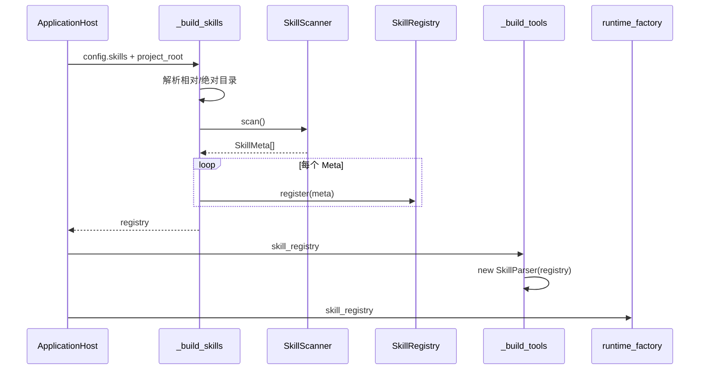

**结论：**

- Skill 扫描只发生一次。
- Registry 同时进入 Context 和 Tool 两条链。
- Skills 初始化失败时 Host 降级为 None。
- ToolExecutor 仍可在没有 SkillParser 时正常工作。
- Runtime 不直接持有 SkillScanner。

### 5.2 目录发现

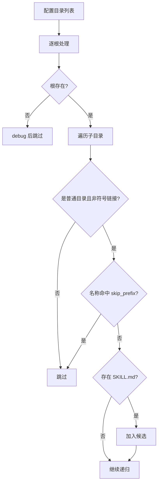

**结论：**

- 根目录本身不是 Skill。
- 目录符号链接不跟随。
- SKILL.md 所在目录仍继续递归。
- 支持任意嵌套分组。
- 候选列表没有显式路径排序。

### 5.3 Frontmatter 解析

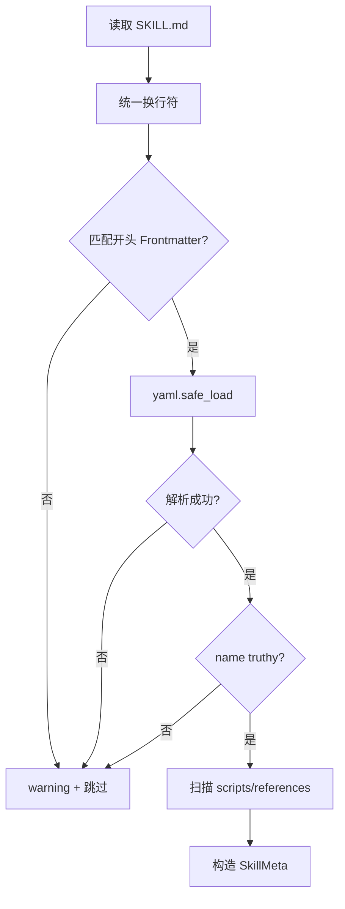

**结论：**

- Body 不进入 SkillMeta。
- description 可以为空。
- 合法但非 Mapping 的 YAML 可能在后续 `.get()` 处抛异常。
- 资源扫描发生在 Frontmatter 基础校验之后。
- 单文件异常未完全隔离。

### 5.4 重名选择

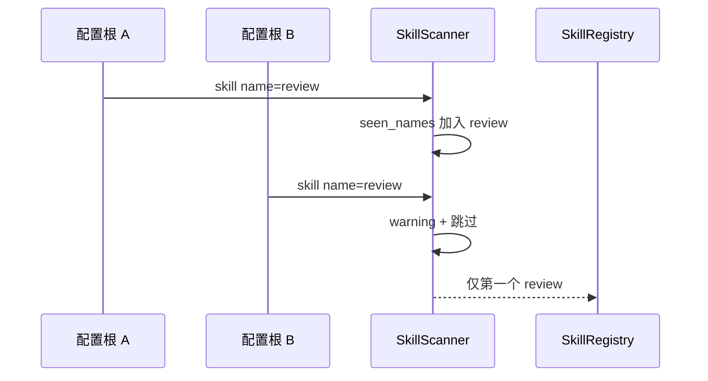

**结论：**

- 生产扫描是 first-wins。
- Registry 手工 register 是 last-wins。
- 两层重名语义不一致。
- 配置根列表顺序影响结果。
- 同根内遍历顺序没有确定性保证。

### 5.5 Skill 摘要进入 Context

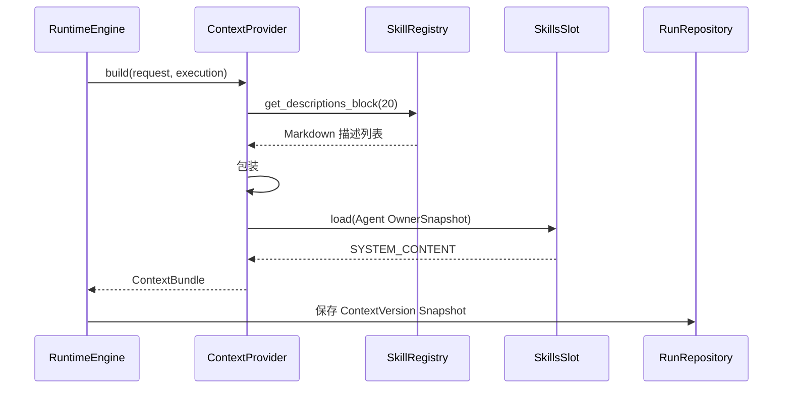

**结论：**

- 每个新 Run 会重新格式化同一 Registry。
- 默认只注入 20 字符首行描述。
- 绝对或解析后的 SKILL.md 路径随摘要进入 System Content。
- Body、关键词和生命周期不进入 Context。
- 当前 Run 的摘要被 ContextVersion 固化。

### 5.6 Agent Context Plan

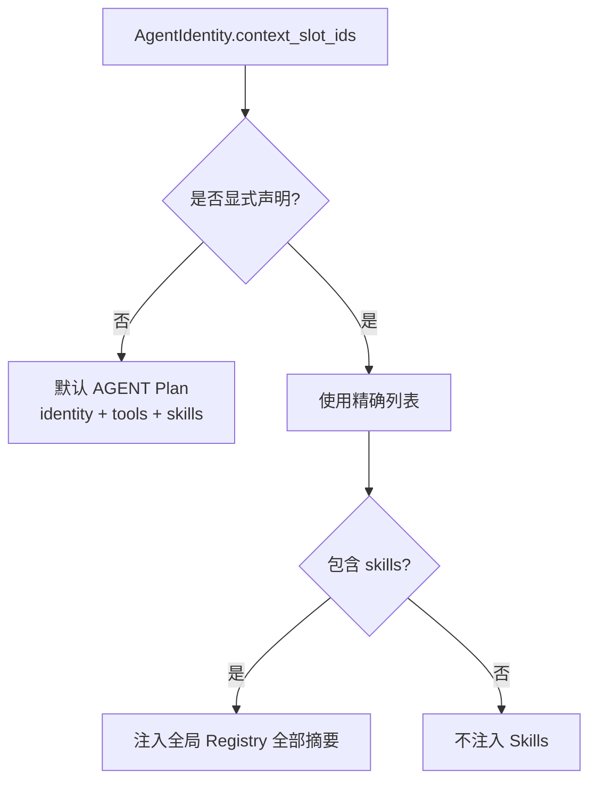

**结论：**

- Context Plan 控制的是 Slot，不是 Skill 项目。
- Agent 不能只选择部分 Skill。
- Agent 工具白名单与 Skills 可见性是两套独立配置。
- Agent 可能看到一个无法通过现有 Tool 使用的 Skill。
- Agent 也可能有文件工具但不启用 Skill 摘要。

### 5.7 模型按需读取 Body

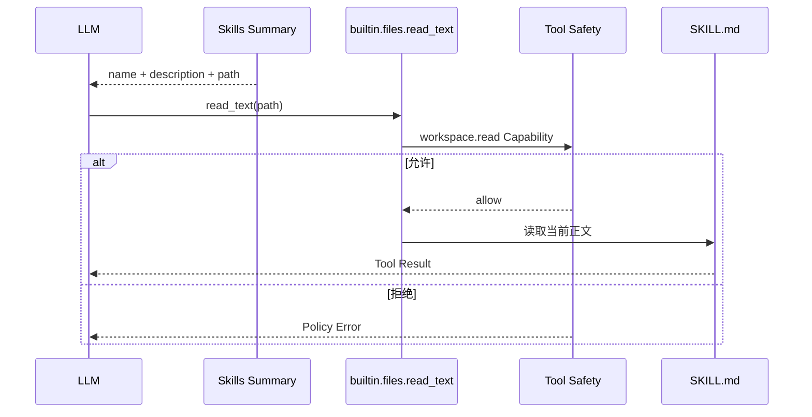

**结论：**

- Body 加载是普通 ToolCall。
- Skill 不获得特殊文件读取权限。
- 读取的是磁盘当前版本，不是启动快照。
- Body 不会自动成为 System Prompt；它作为 Tool Result 进入 Run Message。
- Agent 若无 read_text Tool，渐进披露在摘要层停止。

### 5.8 References 与 Scripts

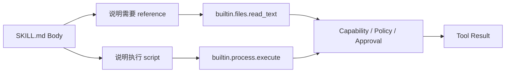

**结论：**

- `reference_paths` 和 `script_paths` 不自动暴露给模型。
- 模型主要依赖 Body 中的相对路径说明。
- Scanner 不验证 Body 引用的路径是否真的存在。
- Script 执行走 Process Tool 的审批和路径/命令策略。
- SkillMeta.has_scripts 只是静态提示，当前摘要也不展示。

### 5.9 Skill Tool 观测设计路径

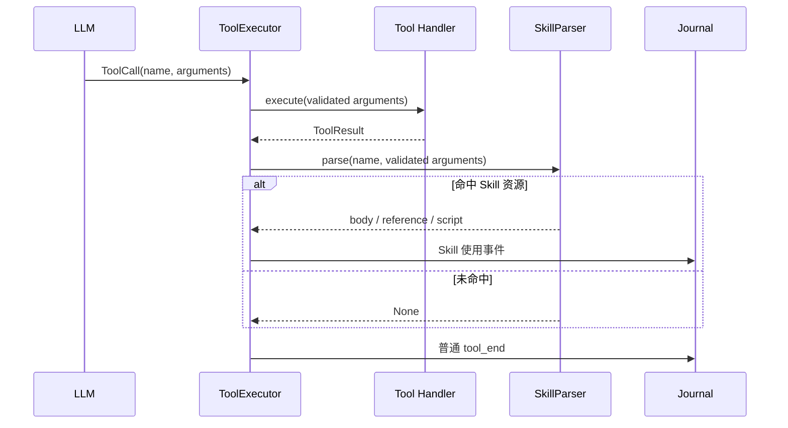

**结论：**

- 该链路只负责把普通 Tool 使用归类为 Skill 使用，不参与 Tool 执行。
- 正确实现时，Parser 应读取已经验证的实际参数。
- 当前 `_finish()` 实际传入空字典，导致 Skill 事件无法命中；完整根因见 S9。
- Tool 失败和策略拒绝的 Skill 级观测也尚未闭环，见 S9。

### 5.10 Registry 快照与运行时文件读取边界

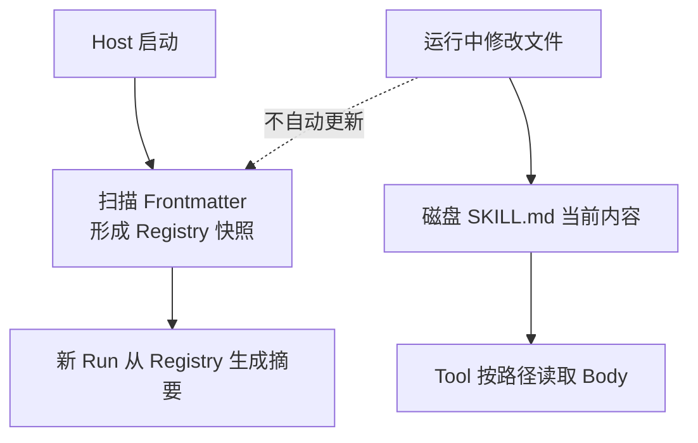

**结论：**

- Skill 摘要来自 Host 启动时的 Registry。
- Skill Body 来自 Tool 调用时的磁盘文件。
- 当前没有 Reload 或 Watcher，修改文件不会更新 Registry。
- 因此摘要与 Body 可能来自不同版本；一致性后果集中见 S6。

### 5.11 禁用与降级

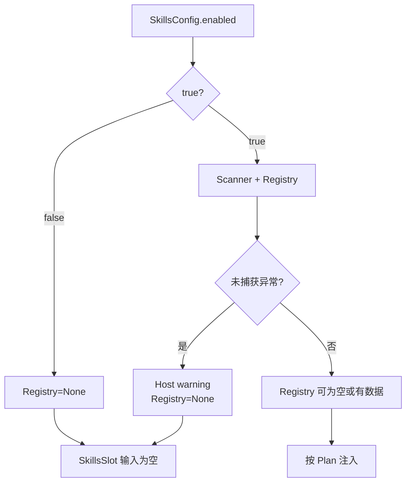

**结论：**

- `enabled=False` 与初始化失败最终都表现为无 Registry。
- CLI 可以区分“系统未启用”和“已启用但没有 Skill”。
- Context 对两者都返回空字符串。
- `ToolsConfig.skill_enabled` 不影响该流程。
- Skills 失败不会阻止 Runtime 启动。

---

## 6. 对外接口与数据契约

### 6.1 包级公共 API

`dotclaw.skills` 当前导出：

```python
SkillMeta
SkillLifecycle
SkillScanner
SkillRegistry
```

没有导出：

```text
SkillParser
SkillExecutor
SkillLoader
SkillRuntime
```

后四者中只有 SkillParser 存在，且归 Tool 包。

### 6.2 SKILL.md 最小契约

当前 Scanner 最低要求：

```markdown
---
name: skill-name
---

正文可以为空
```

description 不是硬性必填，只影响摘要质量。

推荐但未由代码强制的结构：

```markdown
---
name: skill-name
description: 何时使用、解决什么问题
keywords:
  - keyword
lifecycle: persistent
metadata:
  openclaw:
    always: false
    emoji: "..."
---

# Instructions
...
```

### 6.3 Frontmatter 语法契约

- 文件必须从 `---` 开始；
- Frontmatter 必须以独立 `---` 行结束；
- 结束分隔符后必须换行；
- YAML 使用 `yaml.safe_load()`；
- Parser 不支持前置 BOM；
- Body 不参与启动校验。

### 6.4 已识别字段

| 字段 | 转换 | 当前消费者 |
|---|---|---|
| `name` | 原值 | 去重、Registry、摘要、CLI |
| `description` | 原值 | 摘要和 CLI |
| `keywords` | list→tuple | 无 |
| `lifecycle` | enum，非法回退 persistent | 无运行消费者 |
| `deactivate_on` | list→tuple | 无 |
| `homepage` | str | 无 |
| `author` | str | 无 |
| `metadata` | dict | openclaw 子字段解析、其余无 |
| 未知字段 | `extra` | 无 |

### 6.5 OpenClaw 子字段契约

当前只读取：

```yaml
metadata:
  openclaw:
    always: bool
    emoji: any → str
```

`always_load` 不触发 Body 注入。

### 6.6 Skill 资源契约

结构化扫描目录：

```text
scripts/
references/
```

返回路径相对 Skill 根，使用平台路径分隔符字符串。

不扫描：

```text
assets/
templates/
examples/
```

### 6.7 目录配置契约

```yaml
skills:
  enabled: true
  directory:
    - ./skills
    - /absolute/shared-skills
  skip_prefix: "_"
```

当前 `config.yaml` 只显式设置：

```yaml
skills:
  directory: ./skills
```

其余使用默认值。

### 6.8 路径解析契约

- 绝对路径保持不变；
- 相对路径基于 ApplicationHost.project_root；
- Scanner 内 Skill Path 保留 Path 对象；
- 描述块使用 `str(meta.skill_md_path)`；
- 没有 Root ID 或来源标签。

### 6.9 重名契约

生产 Scanner：

```text
first successful name wins
```

Registry.register：

```text
last registration wins
```

两者没有统一 DuplicateError。

### 6.10 Registry 契约

```python
register(meta) -> None
get(name) -> SkillMeta | None
list_all() -> list[SkillMeta]
get_descriptions_block(max_desc_len=40) -> str
```

所有操作同步执行。

### 6.11 Context 摘要契约

```markdown
## 可用技能

- **name**: first 20 chars... `/path/SKILL.md`
```

没有 XML/JSON 结构，也不提供 Tool Schema。

### 6.12 Context Owner 契约

```text
owner = AGENT
owner_key = agent_id
slot_id = skills
persistence = SNAPSHOT
cache_scope = AGENT
```

Registry 是全局的，但 Snapshot 按 Agent Owner 分开保存。

### 6.13 Agent 启用契约

当前只有：

```text
context_slot_ids 包含 skills
```

没有：

```text
allowed_skills
denied_skills
skill_roots
skill_policy
```

### 6.14 Body 加载契约

Body 读取不是 Skills API，而是 ToolCall：

```text
builtin.files.read_text(path=skill_md_path)
```

成功与否取决于：

- Tool 是否注册；
- Agent.allowed_tools；
- Workspace Read Policy；
- Denied Paths；
- 文件是否仍存在。

### 6.15 Script 执行契约

Script 不是自动 Handler。

Skill Body 需要指导模型调用某个现有 Tool。默认观测只尝试识别：

```text
builtin.process.execute
```

但不会校验 Script 是否位于 SkillMeta.script_paths。

### 6.16 Journal 事件契约

```text
SKILL_BODY_LOADED
SKILL_REFERENCE
SKILL_SCRIPT_EXEC
```

设计字段：

```text
agentrun_id
skill_name
status
reference_name / script_name
cached
```

当前 Tool 参数丢失使自动命中链失效。

### 6.17 生命周期契约

SkillRegistry 生命周期：

```text
ApplicationHost.initialize
→ 构建一次
→ Host 运行期常驻
→ Host 释放引用
```

SkillLifecycle 枚举不改变上述行为。

### 6.18 错误与降级契约

| 情况 | 当前行为 |
|---|---|
| 根目录不存在 | debug，继续其他根 |
| 目录无权限 | warning，跳过该子树 |
| SKILL.md 读取失败 | warning，跳过该 Skill |
| Frontmatter 不匹配 | warning，跳过 |
| YAML 语法错误 | warning，跳过 |
| name 缺失/空 | warning，跳过 |
| description 空 | debug，仍注册 |
| lifecycle 非法 | warning，回退 persistent |
| Skill 名重名 | warning，后续项跳过 |
| 非 Mapping YAML | 可能异常，整个 Skills 组件降级 |
| metadata.openclaw 非 Mapping | 可能异常，整个 Skills 组件降级 |
| Skills 初始化失败 | Host 降级，Runtime 继续 |
| Tool 无权读取 Body | 普通 Tool Policy Error |
| Skill 文件运行时已删除 | 普通 File Tool Error |

### 6.19 当前实现已经保证的不变量

1. Skills Core 不依赖 Runtime、Context、Tool 或 Journal。
2. 配置相对目录统一基于 project_root。
3. 目录符号链接不会被递归跟随。
4. 以 skip_prefix 开头的目录子树不会扫描。
5. 缺少有效 Frontmatter 或 name 的文件不会注册。
6. 无效 lifecycle 不会阻止 Skill 加载。
7. Scanner 返回结果按 name 去重。
8. Registry 可在无 Skill 时返回空描述。
9. Context 只通过 SkillRegistryPort 使用 Registry。
10. Skills 初始化失败不会阻止 Host 启动。
11. Skill 摘要作为 Agent Owner Snapshot 进入 ContextVersion。
12. Run 恢复复用原 Skills Snapshot。
13. Skill Body 不会绕过 Tool 安全链自动读取。
14. Script 不会绕过 Tool 安全链自动执行。
15. scripts/references 中的符号链接文件不会进入资源清单。
16. CLI `/skills` 不修改 Registry。
17. Agent 可以通过 Context Plan 整体关闭 Skills Slot。
18. ToolExecutor 没有 SkillRegistry 时仍可执行普通 Tool。

### 6.20 必须保持但当前尚未落实的设计约束

1. Frontmatter 必须进行强类型 Schema 校验，并把单文件异常隔离。
2. Skill 来源、重名优先级和路径归属必须确定且可解释。
3. Agent 应能按名称或策略筛选 Skill，而不是只能全量可见。
4. `always_load`、keywords 和 lifecycle 要么实现，要么从公共模型删除。
5. Body、Reference 和 Script 的渐进披露必须有明确版本和审计。
6. Skill 内容必须作为低信任指令资料处理，防止 Prompt Injection。
7. Script 依赖必须声明所需 Tool/Capability，并在展示前验证可用性。
8. Tool 观测必须传递真实参数，且成功/失败均可审计。
9. Registry 必须支持受控 Reload 或文件变更刷新。
10. Context 摘要应避免暴露不必要的绝对路径。
11. Skill 安装、更新和第三方来源需要完整供应链安全边界。
12. 默认测试套件必须覆盖 Scanner、Registry、Context 和 Tool 观测契约。

---

## 7. 常见修改入口

| 修改目标 | 首要入口 | 可能涉及 | 必须保持的不变量 |
|---|---|---|---|
| 新增 Frontmatter 字段 | `skills/models.py::SkillMeta` | Scanner、Context、CLI、Schema | 明确字段是否真正消费 |
| 修改生命周期 | `SkillLifecycle` | Registry、Context、Runtime | 不把枚举存在写成行为已实现 |
| 增加强类型校验 | `SkillScanner._parse_skill` | Pydantic/YAML、错误日志 | 单文件错误不能拖垮全部 Skills |
| 修改 Frontmatter 语法 | `_parse_frontmatter` | 兼容性、测试 | CRLF/BOM/空正文行为明确 |
| 支持根目录自身 Skill | `_find_skill_files` | 扫描契约 | 不重复扫描 |
| 修改递归规则 | `_find_skill_files` | 嵌套 Skill、性能 | 防止循环和越界 |
| 修改 skip_prefix | SkillsConfig + Scanner | 空字符串校验 | 跳过规则确定 |
| 加强符号链接安全 | Scanner | Tool Policy、安装器 | SKILL.md realpath 不越过 Root |
| 扫描 assets | `_scan_subdir` / SkillMeta | Body、安装器 | 明确资源分类 |
| 修改 Script 清单 | SkillMeta.script_paths | Tool Parser | 运行时必须验证清单 |
| 修改 Reference 清单 | SkillMeta.reference_paths | Tool Parser | 非 Reference 文件不误报 |
| 修改重名策略 | Scanner + Registry | Config 根优先级 | 只有一个权威规则 |
| 增加来源信息 | SkillMeta | Registry、CLI、Context | 可追踪 Root 和优先级 |
| 增加 Skill Version | SkillMeta/Hash | Reload、Snapshot | Summary 与 Body 版本一致 |
| 修改 Registry 查询 | `SkillRegistry` | Context Port、CLI | 不泄漏可变内部状态 |
| 修改摘要格式 | `get_descriptions_block` | Context Token 预算 | 转义不可信文本 |
| 修改摘要长度 | `_skills_text` | Registry 默认、CLI | 统一配置来源 |
| 增加逐 Agent Skill 白名单 | AgentIdentity + Context | Registry、Plan | 展示与实际可用性一致 |
| 增加关键词触发 | 新 SkillSelector | Context、LLM | 选择结果可审计 |
| 启用 always_load | Selector/Context | Body Loader、预算 | Body 版本固化 |
| 实现 one-shot | Skill Runtime | Run/Session 状态 | 不污染全局 Registry |
| 实现 ephemeral | Skill Runtime | 每 Run 选择 | 恢复时保持原选择 |
| 实现 deactivate_on | Skill Runtime | Session/Run | 明确匹配语义 |
| 修改 SkillsSlot | `context/slots.py` | Context Snapshot | Slot 不直接读文件系统 |
| 修改默认 Slot | `context/defaults.py` | Agent Plan | 默认可见性变化需迁移 |
| 修改 Agent Plan | `build_context_plan_from_registry` | Identity YAML | 只影响当前 Agent |
| 让禁用 Slot 不格式化 | ContextProvider | Owner Data 惰性加载 | Plan 先于外部读取 |
| 修改 Body 加载方式 | Tool/Context | Message Role、Snapshot | 必须经过安全策略 |
| 增加 Body Cache | 新 SkillBodyStore | File Watch、Version | Cache Key 含内容 Hash |
| 修改 SkillParser | `tools/parser.py` | Tool Schema、Journal | 使用真实已验证参数 |
| 修复 Tool 参数传递 | `ToolExecutor._finish` | `_check_skill` | 不记录敏感原始参数 |
| 记录失败 Skill 调用 | ToolExecutor | Journal、Policy | 状态和失败原因准确 |
| 修正 Body 分类 | SkillParser | `skill_md_path` | 必须精确匹配 |
| 修正 Reference 分类 | SkillParser | reference_paths | 只记录登记资源 |
| 修正 Script 分类 | SkillParser | script_paths/command | 识别实际执行目标 |
| 修改查找深度 | `_find_skill` | 嵌套目录 | 不用固定魔法 5 |
| 增加 Capability 要求 | SkillMeta/Selector | Tool Registry、Policy | 无能力 Skill 不应展示 |
| 增加依赖二进制检查 | Selector | Process/Environment | 检查不执行副作用 |
| 增加 Skill Install | 新 SkillInstaller | Archive/Git/签名 | 防路径穿越和恶意脚本 |
| 增加 Reload | ApplicationHost/Registry | Context Signal | 新 Run 可见，旧 Run不变 |
| 修改 CLI `/skills` | `main.py::_cmd_skills` | Registry | 展示来源、状态和可用性 |
| 增加 `/skills reload` | CLI/Application Service | Scanner、Context | 原子替换 Registry |
| 修改 SkillsConfig | `config/settings.py` | Builder、测试 | 删除 `tools.skill_enabled` 重复开关 |
| 排查 Skill 不显示 | Config→Scanner→Registry→Context Plan | 日志、路径 | 区分未扫描与未注入 |
| 排查 Body 无法读取 | Summary path→allowed_tools→Policy | Tool | Skill 不提供读取权限 |
| 排查 Script 无法执行 | Body→Process Tool→Approval | Tool | 执行能力独立于 Skill |
| 排查 Journal 无 Skill 事件 | `_finish`→`_check_skill`→Parser | args、路径 | 检查是否传入真实参数 |
| 排查元数据未刷新 | Host 初始化→Registry | File Change | 当前需要重启 |
| 增加 Skills 测试 | `tests/skills/` | pyproject testpaths | 覆盖跨模块契约 |

---

## 8. 设计取舍、痛点和演进方向

本节区分当前设计、当前缺陷和未来能力，不把 AgentSkills/OpenClaw 生态中常见的 Skill 功能推断为 dotClaw 已实现能力。

### 8.1 当前架构承诺

当前 master 可以确认：

1. Skill 是 `SKILL.md` 文件型操作指南，不是 Tool Handler。
2. Scanner 在 Host 启动时扫描一次。
3. Registry 只保存 Frontmatter 与资源路径，不保存 Body。
4. Context 默认只注入名称、20 字符描述和路径。
5. 默认所有 Agent 都启用 Skills Slot。
6. Agent 可以整体关闭 Skills Slot，但不能选择具体 Skill。
7. Body、Reference 和 Script 依赖普通 Tool 渐进加载。
8. Skill 不增加 Agent Tool 权限。
9. keywords、lifecycle、deactivate_on 和 always_load 当前不参与运行。
10. Tool SkillParser 只用于观测。
11. 当前 ToolExecutor 参数丢失使 Skill 观测链实际失效。
12. Registry 不监听文件变化。
13. Skills 初始化失败允许 Host 降级运行。
14. `/skills` 只展示当前 Registry。
15. `ToolsConfig.skill_enabled` 当前未消费。
16. 当前仓库包含 `skills/_example` 示例资源，但默认 `skip_prefix="_"` 会跳过它，因此默认 Registry 为空。
17. 当前存在根目录级 `tests/test_phase7_acceptance.py`，但它标记为 `legacy`；默认 pytest `testpaths` 不收集该文件，`addopts` 也排除 legacy。
18. 当前默认测试目录中没有独立的 `tests/skills` 套件。

### 8.2 核心设计取舍

#### 8.2.1 Frontmatter 常驻、Body 按需读取

**问题与选择：**全部 Skill Body 注入会消耗大量 Context。当前只登记元数据，模型需要时读取 Body。

**未选择：**启动时加载全部 Body 到 System Prompt。

**收益：**基础 Context 较小，Skill 文件可以很长。

**代价与边界：**依赖模型正确选择和文件 Tool；摘要与正文可能版本分裂。

#### 8.2.2 Skill 与 Tool 分离

**问题与选择：**Skill 描述工作流，Tool 提供实际能力和安全控制。

**未选择：**每个 Skill 自动注册专属函数或直接运行脚本。

**收益：**所有副作用复用 Capability、Policy 和 Approval。

**代价与边界：**Skill 可见不代表可用；没有依赖匹配。

#### 8.2.3 全局 Registry

**问题与选择：**本地轻型框架只在启动时扫描一次公共目录。

**未选择：**每 Agent、每 Session 或每 User 独立目录。

**收益：**装配简单，多个 Agent 共享工作流目录。

**代价与边界：**没有隐私隔离和逐 Agent 授权。

#### 8.2.4 Context Slot 注入

**问题与选择：**Runtime 不应直接拼 Skills Prompt。当前通过 Agent Owner 的 SkillsSlot 注入。

**未选择：**AgentPolicyResolver 直接把 Skill 文本拼进 system_prompt。

**收益：**Skills 内容有独立 Snapshot、顺序和状态。

**代价与边界：**Agent Plan 只能控制整个 Slot。

#### 8.2.5 Scanner 容错跳过单文件

**问题与选择：**一个错误 Skill 不应阻止其他 Skill。

**未选择：**任何 YAML 错误都终止启动。

**收益：**大部分常见错误会 warning 后跳过。

**代价与边界：**非 Mapping YAML 等类型错误仍可能逃逸并让整个组件降级。

#### 8.2.6 多根目录

**问题与选择：**允许项目 Skill 和共享 Skill 同时加载。

**未选择：**固定单一 `./skills`。

**收益：**扩展简单。

**代价与边界：**来源、优先级和重名规则不够明确。

#### 8.2.7 保留未知 Frontmatter

**问题与选择：**Skill 格式可能扩展。当前将未知字段保存在 extra。

**未选择：**严格拒绝所有未知键。

**收益：**具有向前兼容空间。

**代价与边界：**用户容易误以为未知字段已经生效。

#### 8.2.8 通用 Tool 参数解析观测

**问题与选择：**不侵入 Runtime Loop，通过 Tool 调用路径判断 Skill 使用。

**未选择：**专门的 Skill Runtime 发射事件。

**收益：**理论上可以观察渐进披露行为。

**代价与边界：**依赖 Tool Schema 和路径字段，分类容易失真；当前实现还丢失参数。

#### 8.2.9 Registry 路径直接交给模型

**问题与选择：**模型需要知道从哪里读取 Body。

**未选择：**提供专用 `load_skill(name)` Tool。

**收益：**无需新增 Tool 协议。

**代价与边界：**暴露文件路径、依赖文件工具，并扩大 Prompt Injection 和路径漂移问题。

#### 8.2.10 Host 级一次性扫描

**问题与选择：**Skill 主要是开发期静态资源，当前不实现 Watcher。

**未选择：**运行时自动热更新。

**收益：**没有并发替换和缓存一致性复杂度。

**代价与边界：**修改、新增和删除都需要重启才更新目录。

### 8.3 已知痛点

#### S1. 当前仓库默认配置不会加载任何 Skill

```mermaid
flowchart LR
    Example["skills/_example/SKILL.md<br/>name=hello"] --> Prefix["目录名以 _ 开头"]
    Prefix --> Scanner["默认 skip_prefix=_"]
    Scanner --> Skip["跳过整个子树"]
    Skip --> Empty["SkillRegistry 为空"]
```

**结论：**仓库虽然提供示例 Skill 和脚本，但默认扫描规则主动排除了它。首次运行 `/skills` 预期为空，示例无法验证真实渐进披露主链，也容易让读者误以为 Skills 组件没有工作。

#### S2. Skill 可见性只有“全部或没有”

任何启用 Skills Slot 的 Agent 都看到同一 Registry 的全部 Skill；不启用则完全看不到。当前没有 `allowed_skills`、来源过滤、用户隔离或按能力过滤。

#### S3. Skill 选择、可用性和元数据消费没有统一协议

系统不校验 Agent 是否拥有读取正文、执行脚本或调用依赖 Tool 的能力。keywords、lifecycle、deactivate_on、always_load、homepage、author、extra 和资源标记又大多没有消费者，导致 Manifest 声明与实际选择行为脱节。

#### S4. Frontmatter 类型校验不足可能拖垮整个组件

```mermaid
flowchart TD
    File["单个 SKILL.md"] --> YAML["safe_load 成功"]
    YAML --> NonMap["结果是 list/string<br/>或 openclaw 不是 Mapping"]
    NonMap --> Get["调用 .get()"]
    Get --> Error["AttributeError"]
    Error --> Host["整个 Skills 组件降级为 None"]
```

**结论：**常见 YAML 语法错误能按文件跳过，但合法 YAML 的错误结构没有完整隔离，单个文件仍可能使全部 Skill 消失。

#### S5. 路径发现和文件安全契约不完整

根目录自身的 SKILL.md 被忽略；目录链接被拒绝但 SKILL.md 文件链接未拒绝；没有 realpath containment；`skip_prefix=""` 会跳过所有目录；资源数量、文件大小和越界路径也没有约束。

#### S6. Registry、摘要、Body 和 Context 缺少共同版本事实

Registry 在启动时冻结 Frontmatter，Body 在 Tool 调用时读取当前磁盘文件，ContextVersion 又保存某次摘要。文件变化后可能出现旧摘要、新正文和旧 Run Snapshot 并存，但没有 manifest_hash、body_hash 或版本关联。

#### S7. 重名与来源优先级不统一

Scanner 采用 first-wins，Registry.register 采用 last-wins；同根目录遍历未显式排序。多根目录没有来源 ID、可信等级和覆盖诊断，重名结果不够确定、也无法从 CLI 解释。

#### S8. Skill 摘要是高信任 Markdown，并暴露本地绝对路径

name、description 和 path 未转义，直接进入 System Content。第三方 Skill 可以通过描述注入 Markdown 或指令文本；绝对路径还泄露本地目录结构。

#### S9. Tool Skill 观测链不完整

`ToolExecutor._finish()` 把空参数传给 SkillParser，导致当前 Body、Reference 和 Script 事件无法命中。即使修复参数，Parser 仍未严格校验 `skill_md_path`、reference_paths 和 script_paths，且 Tool 失败、Policy Deny 和审批拒绝没有 Skill 级事件。

#### S10. 摘要和资源目录的信息价值不足

Context 只保留 20 字符描述，不展示关键词、来源、需要的 Tool、脚本和引用。Scanner 收集 script_paths/reference_paths，却不用于摘要、精确观测或 CLI；短英文描述尤其容易丢失触发条件。

#### S11. 配置和测试契约分裂

`SkillsConfig.enabled` 是真实开关，`ToolsConfig.skill_enabled` 是死字段。历史 Phase 7 验收测试仍位于 `tests/test_phase7_acceptance.py`，但被标记为 legacy，默认 testpaths 不收集根目录测试，默认 addopts 也排除 legacy；当前没有默认收集的独立 Skills 套件。

#### S12. Skill、Knowledge 与 Tool 的领域边界容易混淆

Skill Body 是操作指南，`skills/knowledge` 由 Memory 索引，scripts 由 Tool 执行。目录相邻且旧文档使用“Skill 系统加载正文/执行脚本”的表达，容易把目录资源、提示词目录和实际执行能力混为一体。

#### S13. 没有安装、版本和供应链安全

第三方目录一旦进入配置便可向高信任 Context 注入元数据，并引导读取文件或执行脚本。当前没有来源签名、版本锁、内容 Hash、静态代码检查、安装事务、更新和回滚。

#### S14. 缺少 Reload、诊断和运维入口

Registry 没有原子 Reload、文件 Watcher、解析报告或版本查询；CLI 只列名称和短描述。新增、删除或修复 Skill 后必须重启 Host，且无法查看跳过原因、来源根、资源清单和可用性。

### 8.4 演进方向

| 编号 | 解决的痛点 | 候选方向 | 影响与代价 |
|---|---|---|---|
| E1 | S1 | 将示例目录改为可加载示例，或明确 `_example` 是禁用模板并增加一个最小启用 Skill/启动验收 | Skills 资源、README、Bootstrap 测试 |
| E2 | S2、S3 | AgentIdentity 增加 `allowed_skills`；建立 SkillSelector，联合校验关键词、Tool、Capability、环境和生命周期 | Agent、Context、Tool |
| E3 | S3 | 收敛 SkillManifest：未实现字段标记 experimental 或删除，并为每个保留字段建立消费测试 | Models、Config、Docs |
| E4 | S4、S5 | 使用强类型 SkillManifest；逐文件隔离异常；校验 Root containment、BOM、链接、文件大小和资源数量 | Scanner、Security |
| E5 | S7 | 定义带来源 ID 和显式优先级的 SkillSource；排序发现；重名产生可查询 Resolution Report | Scanner、Registry、CLI |
| E6 | S6、S14 | SkillMeta 保存 manifest_hash/body_hash/version；Registry 支持原子 Reload，Context Snapshot 记录版本 | Skills、Context、Bootstrap |
| E7 | S8 | 使用结构化 SkillCatalog DTO，转义不可信文本，通过专用资源 ID 隐藏绝对路径 | Context、Security |
| E8 | S9 | ToolExecutor 传递已验证参数；Parser 精确匹配资源清单；成功、失败和策略拒绝均发射事件 | Tool、Journal |
| E9 | S10 | 摘要按 Token 预算包含用途、关键词、所需 Tool、来源和资源概况；删除不消费的扫描字段 | Context、Models |
| E10 | S11 | 删除重复开关；将现代 Skills 测试迁入 `tests/skills` 并纳入默认 pytest；保留 legacy 仅作历史对照 | Config、Tests、CI |
| E11 | S12 | 明确 Skill、Knowledge、Tool 的 Source Registry 与 Wiki 交叉边界，避免相邻目录代表同一领域 | Skills、Memory、Tool |
| E12 | S13 | 引入 SkillInstaller：可信来源、签名/Hash、归档解压防护、静态扫描、版本锁和回滚 | Skills、Security、CLI |
| E13 | S14 | 增加 `/skills status` 和 `/skills reload`，展示来源、版本、跳过原因、资源与 Tool 可用性 | CLI、Host、Registry |
| E14 | 多项 | 保持轻型定位：先闭合 Manifest、筛选、版本、测试与观测，再考虑远程 Skill 市场和复杂生命周期 | Architecture |

## 9. 源码索引

### 9.1 Skills Core

```text
src/dotclaw/skills/
├── __init__.py
├── models.py
├── scanner.py
└── registry.py
```

| 文件 | 主要内容 |
|---|---|
| `skills/__init__.py` | 导出 SkillMeta、Lifecycle、Scanner 和 Registry |
| `skills/models.py` | 生命周期枚举、SkillMeta 和描述截断 |
| `skills/scanner.py` | 多根递归扫描、Frontmatter、资源清单和重名处理 |
| `skills/registry.py` | 名称索引和 Context 摘要 |

### 9.2 Context 接入

```text
src/dotclaw/context/
├── ports.py
├── provider.py
├── slots.py
├── defaults.py
├── plan_configuration.py
└── plan_resolver.py
```

| 文件 | Skills 视角 |
|---|---|
| `context/ports.py` | SkillRegistryPort、ContextDependencies |
| `context/provider.py` | `_skills_text()` 和 Agent OwnerSnapshot |
| `context/slots.py` | SkillsSlot |
| `context/defaults.py` | 默认 Agent Plan 和 Skills Descriptor |
| `context/plan_configuration.py` | Owner 精确配置 |
| `context/plan_resolver.py` | AgentIdentity.context_slot_ids 覆盖 |

### 9.3 Tool 观测接入

```text
src/dotclaw/tools/
├── parser.py
└── executor.py
```

| 文件 | Skills 视角 |
|---|---|
| `tools/parser.py` | SkillParser 的路径和资源分类 |
| `tools/executor.py` | SkillParser 装配、`_check_skill` 和当前空参数问题 |

Tool 的 Capability、Policy、Approval 和 Handler 完整说明见 Tool Wiki。

### 9.4 Bootstrap 与 Config

```text
src/dotclaw/
├── bootstrap/
│   ├── _host_components.py
│   ├── application_host.py
│   └── runtime_factory.py
└── config/settings.py
```

| 文件 | Skills 视角 |
|---|---|
| `bootstrap/_host_components.py` | `_build_skills`、`_build_tools` 和构建顺序 |
| `bootstrap/application_host.py` | 可降级初始化、Host 属性和 Runtime 注入 |
| `bootstrap/runtime_factory.py` | SkillRegistry 注入 ContextDependencies |
| `config/settings.py` | SkillsConfig、YAML 解析和死字段 `ToolsConfig.skill_enabled` |

### 9.5 Agent 接入

```text
src/dotclaw/agent/identity.py
```

相关字段：

```text
context_slot_ids
allowed_tools
policy_rules
```

当前没有 `allowed_skills`。

### 9.6 Journal 与 CLI

```text
src/dotclaw/
├── journal/journal.py
├── journal/events.py
└── main.py
```

| 文件 | Skills 视角 |
|---|---|
| `journal/journal.py` | Skill Body/Reference/Script 事件和 prompt_built 接口 |
| `journal/events.py` | Skill EventType |
| `main.py` | `/skills` 展示 |

### 9.7 配置文件

```text
config.yaml
```

当前显式配置：

```yaml
skills:
  directory: ./skills
```

`enabled=True`、`skip_prefix="_"` 来自默认值。

### 9.8 当前仓库 Skill 内容

当前 master 已核对：

```text
skills/
└── _example/
    ├── SKILL.md
    └── scripts/
        └── hello.py
```

| 文件 | 当前内容 |
|---|---|
| `skills/_example/SKILL.md` | `name: hello`，描述为“示例技能：演示 Skill 系统的基本用法” |
| `skills/_example/scripts/hello.py` | 运行时输出 `Hello from dotClaw Skill!` 示例文本 |

默认配置：

```yaml
skills:
  directory: ./skills
```

配合 `SkillsConfig.skip_prefix="_"`，会跳过 `_example`，所以：

```text
当前仓库默认 Registry
→ 空
```

Scanner 仍支持用户自行增加：

```text
skills/<skill>/SKILL.md
skills/<group>/<skill>/SKILL.md
skills/<skill>/scripts/**
skills/<skill>/references/**
```

旧 `docs/arch/skills-architecture.md` 中出现的 `xbrowser` 和已加载 `hello` 是历史架构示例，不是当前默认 Registry 的事实。

### 9.9 测试状态

当前仓库存在历史验收文件：

```text
tests/test_phase7_acceptance.py
```

该文件：

- 覆盖 SkillMeta、Lifecycle、SkillsConfig、Scanner、Registry 和旧 SkillsProvider；
- 标记为 `pytest.mark.legacy`；
- 使用部分已废弃 AgentLoop/Provider 架构，只适合作迁移对照。

当前 `pyproject.toml`：

```text
testpaths
→ 只收集 tests/agent、channel、context、journal、llm、
  orchestration、runtime、runtime_v2、session、tools

addopts
→ -m 'not legacy'
```

因此默认测试运行不会收集根目录的 `tests/test_phase7_acceptance.py`，也没有独立的默认 `tests/skills` 套件。

建议新增：

```text
tests/skills/test_models.py
tests/skills/test_scanner.py
tests/skills/test_registry.py
tests/skills/test_manifest_security.py
tests/context/test_skills_slot.py
tests/tools/test_skill_parser.py
tests/tools/test_skill_journal_integration.py
tests/bootstrap/test_skills_degrade_reload.py
```

最低验证范围：

```text
当前 _example 默认被跳过
CRLF/BOM/Frontmatter 类型
根目录和嵌套目录发现
skip_prefix 空值
目录/文件符号链接
重名和来源优先级
资源清单
非字符串字段
Context 摘要、转义和版本
Agent 全量/禁用/白名单可见性
Body Tool 安全链
Parser 真实参数
Reference/Script 精确分类
成功/失败/拒绝 Journal 事件
Registry Reload
Skills 初始化降级
```
