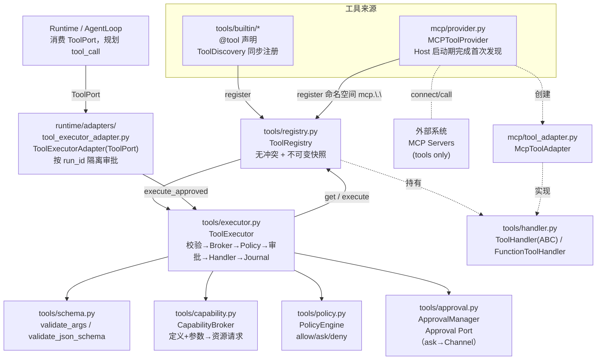
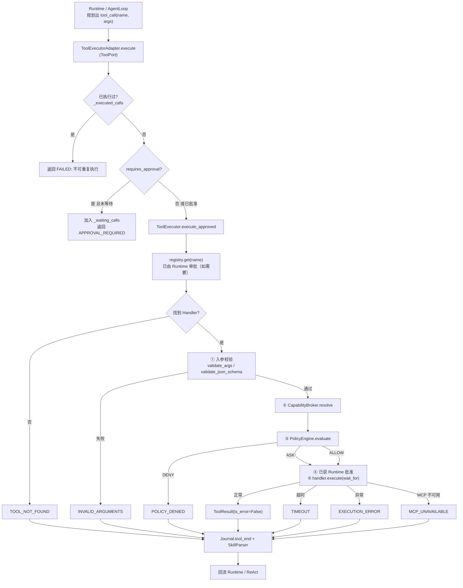
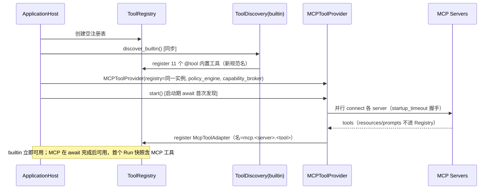
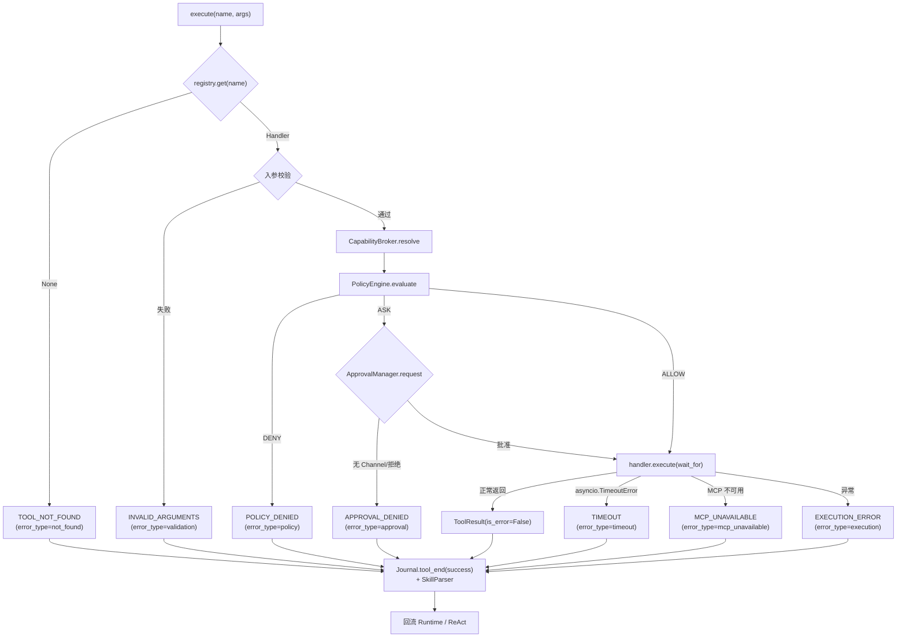

# Tool 模块总体说明

> 适用实现：Tool v1（阶段一至五已完成，含最终安全审计修复）
> 定位：统一的工具注册表与执行调度器，作为 Runtime 的基础设施。
> 设计原则：**声明式 `@tool` + 可信包发现；中心化 Registry + 固定安全链路；校验→Broker→Policy→审批→Handler→Journal；同名冲突拒绝；builtin 同步注册、MCP 命名空间接入；Run 级不可变快照。**

## 1. 概览

**模块定位**：Tool 模块负责把框架内所有可被 LLM 调用的「能力」（内置函数、MCP 远端工具）统一抽象为 `ToolHandler`，集中注册到 `ToolRegistry`，并由 `ToolExecutor` 以固定安全链路统一调度执行（入参校验、资源请求翻译、策略判断、审批、超时、错误与审计归一）。

**核心职责**
- 提供工具的统一抽象 `ToolHandler` 与元数据 `ToolDefinition`/`ToolMeta`。
- 提供中心化注册表 `ToolRegistry`（无冲突注册 / 查询 / 不可变快照）。
- 提供执行调度器 `ToolExecutor`：校验 → Broker → Policy → 审批 → Handler → Journal。
- 通过 `CapabilityBroker` + `PolicyEngine` + `ApprovalManager` 形成可测试的安全边界。
- 通过 `MCPToolProvider` + `McpToolAdapter` 把远端 MCP 工具以 `mcp.<server>.<tool>` 命名空间纳入同一注册表（只注册 tools）。

**非职责**
- 不持有业务运行状态（每次调用无状态，运行上下文由 `ToolExecutionContext` 临时注入）。
- 不解析 LLM 返回的 tool_call（那是 Runtime / AgentLoop 的职责，模块只消费「工具名 + 参数」）。
- 不实现 Skill 的注册：Skill 是另一套系统，模块仅通过 `SkillParser` 在工具执行后做命中检测，不把 Skill 注册成 `ToolHandler`。
- 不做 OS 级沙箱（总体设计 §2.3 非目标）。

**入口与适用边界**
- 注册入口：`bootstrap/_host_components.py:_build_tools`（builtin 同步）与 `_build_mcp`；`ApplicationHost` 在启动期完成首次 MCP 发现后才对外就绪。
- 执行入口：`ToolExecutor.execute(...)` / `execute_approved(...)`；Runtime v2 侧经 `runtime/adapters/tool_executor_adapter.py:ToolExecutorAdapter`（实现 `ToolPort`）间接调用。
- 适用边界：任何需要「把一段能力暴露给 LLM 作为 tool_call」的场景；配置 `config.yaml` 的 `tools` 段控制启停、审批与安全策略。

## 2. 代码层级

```text
src/dotclaw/
├── tools/                              # 工具核心（Tool v1）
│   ├── __init__.py                     # 公共导出
│   ├── base.py                         # ToolSource / ToolDefinition / ToolResult / ToolExecutionContext / ToolErrorCode / ToolErrorType
│   ├── decorator.py                    # @tool / ToolPolicy / ToolMeta
│   ├── schema.py                       # to_json_schema / validate_args / validate_json_schema / ToolValidationError
│   ├── function_handler.py             # FunctionToolHandler：已验证本地函数 → ToolResult
│   ├── handler.py                      # ToolHandler(ABC)（统一接口）
│   ├── registry.py                     # ToolRegistry：无冲突注册 + 不可变快照
│   ├── discovery.py                    # ToolDiscovery：可信包扫描 + 签名推导
│   ├── capability.py                   # CapabilityBroker / CapabilityRequest / ResourceKind / 规范化与受批准路径解析
│   ├── policy.py                       # PolicyEngine / PolicyDecision / PolicyScope / PolicyOutcome / default_policy_scope
│   ├── approval.py                     # ApprovalManager：Approval Port（只消费 ask 决策）
│   ├── executor.py                     # ToolExecutor：固定安全链路编排
│   ├── parser.py                       # SkillParser：工具执行后命中 Skill 检测（旁路）
│   ├── http_client.py                  # 受控 HTTP 客户端（阶段二）：HttpClient 协议 + HttpxHttpClient
│   ├── network.py                      # 固定网络主机路由表 KNOWN_NETWORK_HOSTS
│   ├── providers/                      # 固定外部协议 Provider（阶段三）
│   │   ├── __init__.py                 # ProviderError / TavilyProvider / OpenMeteoProvider 导出
│   │   ├── base.py                     # ProviderError / map_http_status / call 统一脱敏
│   │   ├── tavily.py                   # Tavily 搜索 Provider（POST /search）
│   │   └── open_meteo.py               # Open-Meteo 地理编码 + 预报 Provider
│   └── builtin/                        # 内置工具子包（@tool 声明）
│       ├── __init__.py                 # 供 ToolDiscovery 扫描
│       ├── exec_tool.py                # builtin.process.execute（需审批）
│       ├── file_tool.py                # builtin.files.read_text / write_text / list_directory
│       ├── memory_tool.py              # builtin.memory.read / write
│       ├── system_tool.py              # builtin.system.get_info / get_time
│       ├── web_tool.py                 # builtin.web.search（固定 Tavily，NETWORK）
│       ├── weather_tool.py             # builtin.weather.get_forecast（固定 Open-Meteo，NETWORK）
│       └── math_tool.py                # builtin.math.calculate（本地受限计算，无策略档案）
│
├── mcp/                                # MCP 接入
│   ├── provider.py                     # MCPToolProvider：只注册 tools + 状态 + 重连 + mcp.connect 网关
│   ├── tool_adapter.py                 # McpToolAdapter：mcp.<server>.<tool> + 协议转换
│   └── client.py                       # McpClient：单 server 连接状态机 + 调用
│
├── runtime/adapters/
│   └── tool_executor_adapter.py        # ToolExecutorAdapter：ToolPort 实现，按 run_id 隔离审批
│
└── bootstrap/
    ├── _host_components.py             # Host 私有：_build_tools / _build_mcp
    └── application_host.py             # 唯一公开组合根与资源生命周期宿主
```

## 3. 总体架构



**依赖方向**：`builtin` 与 `mcp` 两个来源都依赖核心抽象 `ToolHandler` / `ToolRegistry`；`ToolExecutor` 依赖 `ToolRegistry` + `CapabilityBroker` + `PolicyEngine` + `ApprovalManager` + schema；`ToolExecutorAdapter` 依赖 `ToolExecutor` 与 Runtime 的 `ToolPort` 协议。上层（Runtime）只依赖 `ToolPort` 抽象，不感知具体注册来源——符合依赖倒置。`ApplicationHost` 通过私有 `_host_components` 装配具体 Provider 与同一 `ToolRegistry` 实例。

## 4. 模块说明与依赖

### 4.1 基础类型 — `tools/base.py`
- `ToolSource(str, Enum)`：`BUILTIN` / `MCP` / `SKILL` / `CUSTOM`，标记工具来源。
- `ToolDefinition`：`name` / `description` / `parameters`(JSON Schema) / `source` / `needs_approval` / `timeout` / `metadata` / `policy_profile`(ToolPolicy 档案值) / `path_param`（文件档案对应的路径字段）。是工具对 LLM 与调度器的契约。
- `ToolResult`：`output` / `is_error` / `error_code`(ToolErrorCode) / `error_type`(ToolErrorType) / `metadata`——所有执行结果的归一结构。
- `ToolExecutionContext`：运行时注入（`timeout` / `agentrun_id` / `session_id` / `agent_id`），**每次执行新建、不持久化**。
- 禁止职责：不含执行逻辑、不含注册逻辑。

### 4.2 装饰器与策略档案 — `tools/decorator.py`
- `@tool(name, description, args_model?, policy?, source?, needs_approval?, timeout?, metadata?, path_param?)`：仅把 `ToolMeta` 写到 `func.__tool_meta__`，**不在导入时注册**，也不导入全局 Registry。
- `path_param`：文件类工具的实际路径参数名；默认是 `path`，记忆工具显式声明 `long_term_file`，避免安全策略检查与真实文件目标脱节。
- `ToolPolicy(str, Enum)`：`WORKSPACE_READ` / `WORKSPACE_WRITE` / `PROCESS` / `NETWORK` / `MCP`（工具作者只能从中选择，不能自由组合能力；MCP 档案由 Provider 自动生成）。
- `network_service` / `network_hosts`：网络类工具（`policy=NETWORK`）在 `ToolDefinition` / `ToolMeta` 上**静态声明**的 Provider 服务标识与精确 HTTPS 主机集合（如 `tavily` / `["api.tavily.com"]`）。Broker 据此生成 `NETWORK_HTTP` 请求，绝不读取 Agent 参数中的 URL；Policy 同时校验「服务已启用 + 主机精确匹配」才放行（开发计划 §2.2）。

### 4.3 参数校验 — `tools/schema.py`
- `to_json_schema(model)`：Pydantic 模型 → JSON Schema（供 LLM）。
- `validate_args(model, raw)`：本地工具校验，默认 `extra="forbid"` 拒绝未知字段；失败抛 `ToolValidationError`。
- `validate_json_schema(raw, schema)`：MCP 等外部工具的 JSON Schema 校验适配层；对 `$ref`/`anyOf` 等组合子保守降级，严格拒绝未知字段；失败抛 `ToolValidationError`，由 Executor 映射为 `INVALID_ARGUMENTS`。

### 4.4 函数执行器 — `tools/function_handler.py`
- `FunctionToolHandler`：把一个已验证的本地异步函数包装成 `ToolHandler`；`execute` 调用函数并归一 `ToolResult`（异常 → `EXECUTION_ERROR`）。不接触校验/策略/审批。

### 4.5 发现 — `tools/discovery.py`
- `ToolDiscovery.discover_builtin()`：导入可信包 `dotclaw.tools.builtin` 并收集 `@tool` 函数；复杂工具用显式 `args_model`，简单工具从签名推导等价 Pydantic 模型（仅 `str`/`int`/`float`/`bool` + 字面量默认）。
- `ToolDeclarationError`：对 `Optional`/`Union`/容器/枚举/嵌套/`Annotated`/位置参数/`*args`/`**kwargs`/自定义类型等不支持的签名**直接抛出，绝不退化为无校验调用**。

### 4.6 注册表 — `tools/registry.py`
- `ToolRegistry`：内存 `dict[str, ToolHandler]`。
- `register(handler)`：**同名冲突抛 `DuplicateToolError`**（携带双方来源），绝不静默覆盖。
- `unregister` / `get` / `get_definitions` / `list_by_source` / `all_names` / `clear`。
- `snapshot()`：返回 `tuple[ToolDefinition, ...]`，**每个定义深拷贝**——满足 Run 级快照隔离。
- 禁止职责：不执行、不做审批、不连接外部系统。

### 4.7 能力 Broker — `tools/capability.py`
- `CapabilityBroker.resolve(definition, validated_args, workspace_root) → list[CapabilityRequest]`：按 `policy_profile` 翻译文件/进程/网络请求；`policy=None` 或未知档案返回空列表（passthrough）。网络类（`NETWORK`）按 `definition.network_service` / `network_hosts` **静态声明**为每个精确主机生成一条 `NETWORK_HTTP` 请求（携带 `service` 与 `host`），**绝不读取 Agent 参数中的 URL**；声明多主机则生成多条请求。
- MCP 工具：`source == MCP` 时直接由 `metadata["server"]` 形成 `mcp.call` 请求，不依赖运行参数。
- `ResourceKind`：`FILE_READ` / `FILE_WRITE` / `PROCESS_EXEC` / `NETWORK_HTTP` / `MCP_CONNECT` / `MCP_CALL`。
- `normalize_workspace_path()`：先 `expanduser` 再用 `realpath` 解析符号链接/Windows 联接点，检测 `..`/绝对路径逃逸 workspace 根目录（安全关键）。
- `resolve_workspace_path()`：生成经检查的绝对真实路径；Executor 在策略通过后将它回填到已验证参数，handler 因而只能操作 Broker 检查过的目标，即使配置了非当前目录的 `workspace_root` 也不会落到进程 CWD。
- 脱敏：`_desensitize_command` 剥离 `KEY=VALUE` 环境导出；`_desensitize_url` 去除查询串；`CapabilityRequest.describe()` 只返回脱敏摘要。

### 4.8 策略引擎 — `tools/policy.py`
- `PolicyEngine.evaluate(requests, scope) → PolicyOutcome`：任一 `DENY` → 整体 `DENY`；否则任一 `ASK` → 整体 `ASK`；否则 `ALLOW`；无请求视为 `ALLOW`。
- `PolicyScope`：`global_rules`(安全上限) + `agent_rules`(只能收窄) + `workspace_root` + `denied_paths` + `allowed_mcp_servers` + `network_services`(服务→精确主机集合，fail-closed 空集合)。
- 网络策略：`NETWORK_HTTP` 请求需同时满足「全局 `network.http` 上限允许 + 服务在 `network_services` 中启用 + 请求主机在允许列表 + Agent 未收窄为 ask/deny」才 `ALLOW`；任一不满足即 `DENY`。`network_services` 与 `network.http` 由 Host 工厂从 `tools.network.<service>.enabled` 投影：启用任一服务时派生 `network.http=allow`，未启用则 `deny`；用户显式写出的 `allow/ask/deny` 始终优先。
- Agent 规则来自 `AgentIdentity.policy_rules`；Executor 按 `ToolExecutionContext.agent_id` 为每次 Run 构造独立 scope。基础 scope 不写入主 Agent 规则，因此委派子 Agent 不会继承主 Agent 的收窄权限。
- 默认规则：`workspace.read=allow` / `workspace.write=ask` / `process.exec=ask` / `network.http=deny` / `mcp.connect=ask` / `mcp.call=ask`。
- `mcp.connect` / `mcp.call`：server 不在 `allowed_mcp_servers` 即 `DENY`（空列表 = deny-all，fail-closed）。
- 路径约束：`escaped` 或命中 `denied_paths`(glob) → `DENY`。

### 4.9 审批端口 — `tools/approval.py`
- `ApprovalManager`：**Approval Port**——只消费 Policy 的 `ask` 决策，通过 `Channel` 展示**脱敏资源摘要**并请求确认。
- 不持有命令列表，也不自行决定放行；`ask` 决策由它转为一次 Channel 交互。`needs_approval` 与配置 `approval_commands` 的声明式补充由 `ToolExecutor` 合并判断。
- `request(summary, channel) → bool`：无 Channel → `False`（拒绝，不默认放行）；有 Channel → `channel.ask_user(...)`。

### 4.10 执行调度器 — `tools/executor.py`
- `ToolExecutor`：组合 `registry` + `approval_manager` + `policy_engine` + `capability_broker` + `skill_parser`，并按 `agent_id` 解析 Run 级收窄策略。
- 入口：`execute()`（完整链路含 channel 审批）/ `execute_approved()`（ask 视为已批准，供 Runtime v2 适配器复用）。
- `snapshot_definitions()`：转发 `registry.snapshot()`，供 Run 创建时捕获不可变工具集。
- `_run_chain()`：严格按「tool_start → 校验 → Broker → Policy →(ask 审批)→ 受批准路径回填 → Handler → tool_end」；校验失败/deny/审批拒绝均直接返回，绝不进入 Handler。
- `requires_approval(name, context)`：Runtime 预检与执行链共用 Agent 的有效策略；某 Agent 将全局 `allow` 收窄为 `ask` 时，首次调用仍会进入审批，不能被 `execute_approved()` 绕过。
- Journal 可观测：`tool_start` / `tool_policy_resolved` / `tool_approval_outcome`(仅脱敏) / `tool_end`，并关联 `agentrun_id`。网络类工具执行时，`ToolExecutor` 用审计包装客户端包裹注入的 `HttpClient`：每次网络请求成功后写入 `tool.network_audit` 事件，仅含服务/主机/HTTP 状态类别/耗时/响应字节/重试次数（脱敏，不含密钥、认证头或 URL 查询串）；`HttpClient` 本身不依赖 Journal。

### 4.11 MCP Provider 与 Adapter — `mcp/`
- `MCPToolProvider`（`provider.py`）：编排连接/发现/状态/重连；**只注册 tools**，不注册 resources/prompts；单 server 失败降级（`_failed_servers`），不阻塞 Agent 启动；`get_server_states()` 暴露 `McpClientState`（STARTING/CONNECTED/CRASHED/FAILED/SHUTDOWN）；连接前经 `mcp.connect` 网关（`allowed_mcp_servers` fail-closed）。
- `McpToolAdapter`（`tool_adapter.py`）：注册名 `mcp.<server>.<tool>`（server/tool 片段会合法化，原始 MCP tool 名仍用于协议调用）；`metadata["server"]` 保存 server 标识；`execute()` 调远程 `tools/call` 并归一 `ToolResult`；`input_schema` 暴露供 `validate_json_schema`。成功/超时/协议错误/不可用统一映射 `ToolResult`/Journal。
- `McpClient`（`client.py`）：单 server 连接状态机、`startup_timeout`(握手) / `tool_timeout`(调用)、崩溃重连（`restart_on_crash` / `max_restart_attempts`）。

### 4.12 Skill 命中检测 — `tools/parser.py`
- `SkillParser`：构造时以 `skill_dir → SkillMeta` 建查找表（依赖 `SkillRegistry`，可选）。
- `parse(tool_name, args)`：分析 `builtin.files.read_text` / `builtin.process.execute` 的参数路径，判断是否命中某 Skill 的 body/reference/script，返回 `(skill_name, part, osname)` 或 `None`。
- 与 ToolExecutor 协作，在工具执行后发射 Journal 事件；**不侵入 AgentLoop**。

### 4.13 Runtime 适配器 — `runtime/adapters/tool_executor_adapter.py`
- `ToolExecutorAdapter`：实现 Runtime `ToolPort`，按 `(run_id, call_id)` 去重避免重复执行副作用；预检时把 `execution.policy.agent_id` 传给 `requires_approval`，对「需审批且未批准」返回 `APPROVAL_REQUIRED`，批准后再 `execute_approved`。审批恢复的权威事实是持久化检查点还原的 `ToolInvocation.approved`，而非适配器的进程内集合；`_waiting_calls` / `_executed_calls` 仅作本进程短生命周期去重缓存，Run 终态由 Runtime 调用 `clear_run()` 清理。
- `AgentPolicyResolver`：在 Run 创建时调用 `executor.snapshot_definitions()` 冻结不可变工具集；Run 内不再读动态 Registry。

### 4.13.1 受控 HTTP 客户端、固定 Provider 与网络工具（阶段二 / 三 / 四）

网络能力默认关闭；仅在 `config.yaml` 的 `tools.network.<service>.enabled` 显式启用后才产生可用能力。所有联网 Tool 经 Tool v1 固定链路（校验 → Broker → Policy → 审批 → Handler → Journal）执行，且**不存在 Agent 可控的 URL / host / endpoint 参数**。

- `tools/http_client.py`（`HttpClient` 协议 + `HttpxHttpClient`）：仅供内置 Provider 使用的薄客户端。只允许 HTTPS、精确声明主机、443 端口与代码登记的 HTTP 方法/路径，拒绝 IP 字面量、非标准端口、用户信息段、重定向及同一主机上的未声明路由；连接超时 3s、总超时 10s、单响应 1 MiB 流式上限、并发 4；Tavily 不重试、Open-Meteo 仅对临时网络错误重试一次；异常消息脱敏（不含密钥/认证头/查询串/正文）。Agent 不可见、不进入工具注册表、不直接依赖 Journal。`ApplicationHost.shutdown()` 关闭共享连接池。
- `tools/network.py`（`KNOWN_NETWORK_HOSTS` / `KNOWN_NETWORK_ROUTES`）：固定服务→精确主机及方法/路径路由表（Tavily 仅 `POST /search`；Open-Meteo 仅 `GET /v1/search` 与 `GET /v1/forecast`）。
- `tools/providers/`：`ProviderError` 统一携带应映射的 `ToolErrorCode`（401/403→CONFIGURATION_ERROR，响应过大→RESPONSE_TOO_LARGE，429/其他 4xx/5xx→NETWORK_ERROR，均脱敏）；`call()` 将脱敏网络异常归一为对应错误码。Provider 只做最小必要请求与受限结果映射，端点/方法/认证方式属于代码、不可由 Agent 参数或 YAML 覆盖。
  - `TavilyProvider.search`：固定 `POST /search`，读取 `TAVILY_API_KEY` 环境变量（缺失→CONFIGURATION_ERROR，不读 YAML、不写日志）；请求不含 Extract/Crawl/Map；输出按 title/url/snippet/总字符上限截断。
  - `OpenMeteoProvider.get_forecast`：先地理编码（固定字段、支持 `country_code` 缩小候选），唯一候选直接预报、零候选返回 `no_candidate`、多候选返回至多 5 个 `candidates`；预报固定当前/每日字段、`timezone=auto`，不机械透传全部参数。
- `tools/builtin/math_tool.py`（`builtin.math.calculate`）：本地受限计算，不访问文件/网络/环境；仅允许 `+ - * / // % **`、括号、数值字面量、固定数学函数白名单（sqrt/log/exp/sin/cos…）与常量（pi/e/tau）；求值前做 AST 白名单遍历 + 深度/节点数限制，自定义幂运算限制指数与结果量级，非有限/复数结果拒绝；任何异常映射为脱敏的 `EXECUTION_ERROR`。该工具**不产生 Capability Request**（无策略档案）。

**边界（没有任意网页抓取）**：框架不提供通用 HTTP Tool、任意 URL 抓取、网页正文提取、爬虫或搜索引擎 HTML 抓取；联网能力严格限定为上述两个固定 Provider 的预授权端点。

### 4.14 组合根 — `bootstrap/ApplicationHost`
- `_build_tools(config, skill_registry)`：创建 `ToolRegistry` → `ToolDiscovery.discover_builtin()` 注册 → 按 `disabled_tools` `unregister` → 构造基础全局 `PolicyScope`、`PolicyEngine`/`CapabilityBroker`/`ApprovalManager`/`ToolExecutor`；所有 Agent 规则运行时按 `agent_id` 合并，不污染基础 scope。
- `_build_mcp(config, tool_executor)`：构造 `MCPToolProvider`，复用同一 executor 的 registry、`policy_engine` 与 `capability_broker`。
- `ApplicationHost.initialize()`：在装配 Runtime 前完成 MCP 首次发现，确保首个 Run 快照含 MCP 工具；`client.connect` 自带 `startup_timeout`，失败 server 降级，不阻断 Host 启动。

## 5. 业务处理流程

### 5.1 工具执行主路径（一次 tool_call）



### 5.2 注册 / 装配时序



**关键持久化/提交点**：工具执行本身**不持久化业务状态**；`ToolResult.output` 作为 ReAct 循环的一轮消息回流给 LLM（由上层 Runtime 负责落库）。MCP 的 `_clients` 状态在 `start()` 全部成功后一次性更新（原子提交式，避免半注册）。

## 6. 状态与分支



**降级与失败隔离**
- **MCP 加载失败**：Host 将 MCP 作为可降级依赖；单 server 失败（`gather return_exceptions`）不影响其他 server 与 Host 启动。`mcp_provider` 可为 `None`，但 builtin 工具仍可用。
- **disabled_tools**：`_build_tools` 在注册后按配置（新规范名）`unregister`，实现单工具降级（如关闭 `builtin.process.execute`）。
- **审批无 channel**：`ApprovalManager.request` 返回 `False` → `APPROVAL_DENIED`，保证子 Agent / 无交互场景不静默放行。
- **路径逃逸**：`normalize_workspace_path` 检测 `..`/绝对路径/`~`/符号链接/联接点逃逸 → `POLICY_DENIED`；通过后回填 `resolve_workspace_path` 的绝对路径，实际读写目标与审批目标一致。

**每个分支的最终落点**：所有分支都收敛为 `ToolResult`（`is_error` + `error_code`/`error_type`），并经 `Journal.tool_end` 收口后回流 Runtime；不存在「静默丢弃」路径。

## 7. 工程化设计亮点

### 7.1 固定安全链路（问题 → 机制 → 收益 → 边界）
- **问题**：旧实现按工具名审批、校验散落、安全逻辑与执行耦合。
- **机制**：`ToolExecutor._run_chain` 固定「校验 → Broker → Policy → 审批 → Handler」；校验失败/deny/审批拒绝均提前返回，绝不进入 Handler；无副作用前必完成 Broker 与 Policy。
- **收益**：安全边界可单测；拒绝路径不产生外部副作用。
- **边界**：`tool_start` 在链路最前发射但不写原始参数（脱敏摘要经 `tool_policy_resolved` 记录）。

### 7.1.1 策略目标与真实副作用绑定
- **问题**：仅在 Broker 中检查相对路径仍不够：handler 若按进程 CWD 重新解析，会在自定义 `workspace_root` 下操作另一个文件。
- **机制**：`CapabilityRequest` 保存不写入审计的 `absolute_path` 与 `param_field`；Executor 仅在策略通过后回填经 `resolve_workspace_path()` 得到的真实路径。
- **收益**：路径检查、审批摘要与 handler 的真实读写目标三者一致，避免“批准 A、实际操作 B”。
- **边界**：该机制只约束声明了 WORKSPACE_READ/WRITE 档案与路径字段的工具；新文件工具必须提供默认 `path` 或显式 `path_param`。

### 7.2 参数校验双轨（问题 → 机制 → 收益 → 边界）
- **问题**：本地工具与 MCP 工具的参数来源不同（Pydantic vs JSON Schema），需统一失败语义。
- **机制**：本地走 `validate_args(args_model)`（默认 `extra="forbid"`）；MCP 走 `validate_json_schema(input_schema)`；组合子（`$ref`/`anyOf`）保守降级，未知字段严格拒绝；统一抛 `ToolValidationError` → `INVALID_ARGUMENTS`。
- **收益**：非法参数在 `tools/call` 之前返回，绝不触达远端或本地函数。
- **边界**：JSON Schema 无法表达的结构（如 `$ref` 递归）不做深校验，但未知字段仍拒绝——保守而非宽松。

### 7.3 策略 fail-closed（问题 → 机制 → 收益 → 边界）
- **问题**：MCP server 由外部提供，按 server 授权仅能控制是否调用，不能限制其内部行为；默认放行风险高。
- **机制**：`mcp.connect` / `mcp.call` 的 server 不在 `allowed_mcp_servers` 即 `DENY`；空列表 = deny-all（fail-closed）；Provider 连接前经 `mcp.connect` 网关，未授权 server 直接降级。
- **收益**：未显式允许的 server 无法被调用，符合默认拒绝原则。
- **边界**：`allowed_mcp_servers` 为空列表在配置加载时被忽略（沿用 `default_policy_scope` 默认允许列表），需在配置中显式给出以收紧。

### 7.4 注册冲突拒绝（问题 → 机制 → 收益 → 边界）
- **问题**：多来源注册可能撞名，静默覆盖会无声替换 builtin。
- **机制**：`register` 同名即抛 `DuplicateToolError`（携带双方来源），绝不静默覆盖；MCP 工具走 `mcp.<server>.<tool>` 命名空间天然隔离跨 server 同名。
- **收益**：启动期即可暴露冲突根因，不掩盖问题。
- **边界**：同名冲突使该来源的初始化失败（启动崩），属预期行为（总体设计 §8.2）。

### 7.5 Run 级不可变快照（问题 → 机制 → 收益 → 边界）
- **问题**：MCP 重连/可用性变化不应修改在途 Run 的可见工具集。
- **机制**：`ToolExecutor.snapshot_definitions()` 转发 `registry.snapshot()`，对每个 `ToolDefinition` 深拷贝；Run 创建时捕获固定集合，Run 内不再读动态 Registry。
- **收益**：重连只影响下一 Run 快照，在途 Run 完全隔离（总体设计 §9）。
- **边界**：快照是深拷贝，后续注册表增删不影响已取快照；Host 在首次 Run 前完成 MCP 发现，保证首个 Run 可见。

### 7.5.1 Agent 级最小权限隔离
- **问题**：不同 Agent 的工具白名单之外，还可能需要把同一类资源从 `allow` 收窄为 `ask` 或 `deny`；把主 Agent 的规则写入共享 Executor 会污染委派子 Agent。
- **机制**：基础 `PolicyScope` 只保存全局上限。每次调用按 `ToolExecutionContext.agent_id` 解析 `AgentIdentity.policy_rules`，生成独立 `agent_rules`；Runtime 审批预检携带同一 `agent_id`。
- **收益**：主 Agent、子 Agent 与直接调用均使用一致的有效策略；收窄到 `ask` 时不会绕过审批，子 Agent 无规则时只继承全局上限。
- **边界**：Agent 规则只能收窄，`PolicyEngine` 仍以全局规则为上限；规则解析失败时保守回退到无额外收窄的全局 scope。

### 7.6 失败隔离与并发加载（问题 → 机制 → 收益 → 边界）
- **问题**：一个 MCP server 崩溃/超时不应阻断其他工具或整个启动。
- **机制**：`_connect_and_register` 并行执行；`asyncio.gather(..., return_exceptions=True)` 把单 server 异常隔离到 `_failed_servers`；`start()` 整体失败仅 warning，builtin 照常可用。
- **收益**：部分可用优于全部不可用（韧性降级）。
- **边界**：`get_server_states()` 暴露 STARTING / CONNECTED / FAILED / CRASHED 状态供排障。

### 7.7 脱敏审计（问题 → 机制 → 收益 → 边界）
- **问题**：审批提示与审计若含密钥/认证头/原始敏感值会泄漏。
- **机制**：`CapabilityBroker` 形成请求时 `_desensitize_command` 剥离 `KEY=VALUE`、`_desensitize_url` 去除查询串；`CapabilityRequest.describe()` 仅返回脱敏摘要；Journal 的 `tool_policy_resolved` / `tool_approval_outcome` 只写脱敏摘要；网络工具另经 `tool.network_audit` 写入脱敏的网络摘要（服务/主机/状态类别/耗时/字节/重试），`HttpClient` 不直接接触 Journal。
- **收益**：策略拒绝/审批信息不泄露敏感参数（计划 §7 验收 3）。
- **边界**：`normalized_path` 为相对 workspace 的逻辑路径，绝对路径仅用于逃逸判定，不写入审计展示。

### 7.8 依赖倒置与插件替换点（问题 → 机制 → 收益 → 边界）
- **问题**：新增工具来源（Skill/Custom）不应改动执行核心。
- **机制**：`ToolProvider(ABC)` + `ToolHandler(ABC)` + Runtime `ToolPort`；新来源只需实现 `discover_and_register` 并向同一 `ToolRegistry` 注册。
- **收益**：执行核心（`ToolExecutor`）对来源无感知，扩展点清晰。
- **边界**：`ToolProvider` 目前仅 `MCPToolProvider` 实现。

## 8. 数据与运维语义

### 8.1 数据容器
| 容器 | 字段 | 写入者 | 读取者 | 生命周期 |
|---|---|---|---|---|
| `ToolDefinition` | name/description/parameters/source/needs_approval/timeout/metadata/policy_profile/path_param | 各 Handler 构造时 | LLM（定义清单）、Executor、Policy | 随 Handler 常驻 registry |
| `ToolResult` | output/is_error/error_code/error_type/metadata | Handler.execute | Executor → Runtime | 单次调用，无持久化 |
| `ToolExecutionContext` | timeout/agentrun_id/session_id/agent_id | Executor 每次调用新建 | Handler、MCP 客户端 | 单次调用 |
| `ToolRegistry._handlers` | `dict[str, ToolHandler]` | register/unregister | Executor、Provider | 进程级（Agent 生命周期） |

`ToolResult` 是所有执行结果的**唯一归一出口**：成功、超时、审批拒绝、未找到、策略拒绝、MCP 不可用均收敛到此结构，便于上层统一处理。

### 8.2 配置项（`config.yaml` 的 `tools` 段）
| 配置项 | 默认 | 消费点 | 语义 |
|---|---|---|---|
| `builtin_enabled` | true | `_build_tools` | 是否注册内置工具 |
| `mcp_enabled` | true | `_build_mcp` | 是否启用 MCP |
| `skill_enabled` | true | **未消费** | 遗留字段；Skill 真实开关在 `config.skills.enabled` |
| `approval_commands` | [builtin.process.execute] | `ToolExecutor` | 配置级显式审批补充；与 `needs_approval` / Policy 的 `ask` 合并判断 |
| `disabled_tools` | [] | `_build_tools` | 注册后逐个 `unregister`（新规范名） |
| `exec_timeout` | 60.0 | builtin 硬编码超时 | 配置字段（当前 builtin 超时由工具定义 `timeout` 控制） |
| `policy.workspace_root` | . | `CapabilityBroker` | workspace 根目录 |
| `policy.rules` | 见 §4.8 默认 | `PolicyEngine` | 档案 → allow/ask/deny |
| `policy.denied_paths` | [.env, .git/**, **/*.key] | `PolicyEngine` | 命中即拒绝（glob） |
| `policy.allowed_mcp_servers` | [github] | `PolicyEngine` | MCP server 允许列表（fail-closed） |
| `network.tavily.enabled` | false | `_host_components` → `PolicyScope.network_services` | 启用 Tavily 搜索服务（预授权精确主机）；启用即派生 `network.http=allow` |
| `network.open_meteo.enabled` | false | `_host_components` → `PolicyScope.network_services` | 启用 Open-Meteo 天气服务（预授权两个固定主机） |
| `tavily.api_key` / `TAVILY_API_KEY` | 无 | `TavilyProvider` | 仅从环境变量 `TAVILY_API_KEY` 读取；缺失→CONFIGURATION_ERROR，不读 YAML、不写审计 |
| `tools.web_search`（旧） | 无 | `settings` 加载告警 | 已弃用且不再读取；出现时输出一次告警并忽略，请改用 `tools.network.*.enabled` |
| `mcp_global.startup_timeout` | 4.0 | `McpClient` | 握手超时 |
| `mcp_global.tool_timeout` | 60.0 | `McpClient` | MCP 工具调用超时 |
| `mcp_global.restart_on_crash` | true | `McpClient` | 崩溃自动重连 |
| `mcp_global.max_restart_attempts` | 3 | `McpClient` | 最大重连次数 |
| `mcp_servers` | [] | `_build_mcp` | MCP server 列表（name/transport/command+args 或 url+headers/覆盖项） |

### 8.3 调试与故障排查入口
- **日志**：各模块 `logger` 名 `dotclaw.tools`、`dotclaw.tools.executor`、`dotclaw.mcp.provider`、`dotclaw.mcp.client`、`dotclaw.tools.parser`。
- **MCP 状态**：`MCPToolProvider.get_server_states()` 返回各 server 的 `McpClientState` 与失败原因（`_failed_servers`）；CLI `/mcp` 展示降级状态。
- **工具清单**：CLI `/tools` 按来源（内置/MCP）与 server 分组展示新规范名与 `[需审批]` 标记。
- **审批**：交互式审批经 `channel.ask_user`；无 channel 返回 `APPROVAL_DENIED`（不静默放行）。

## 9. 当前限制与演进方向

1. **配置字段消费差异**：`config.tools.skill_enabled` 与 `config.tools.exec_timeout` 当前未被实际消费（前者由 `config.skills.enabled` 接管，后者由 builtin 工具定义 `timeout` 接管）。演进：清理遗留字段或补齐消费。
2. **`ToolProvider` 仅 MCP 实现**：`Skill` / `Custom` 来源尚无 Provider；Skill 走独立 `SkillParser` 命中检测而非注册为 Handler。演进：补齐 `SkillToolProvider` / `CustomToolProvider`，统一进 registry。
3. **`disabled_tools` 仅作用于 builtin**：MCP 工具禁用需在各 server 配置层处理，未纳入统一 `disabled_tools` 机制。
4. **Skill 与 Tool 两套系统**：工具执行后的 Skill 命中是「旁路检测」，未与工具生命周期强绑定。若未来希望 Skill 暴露为工具，需打通第 3 点。
5. **OS 级沙箱缺失**：进程命令字符串难以完全解析，首版基于受控执行接口 + 明确风险规则 + 审批降低风险，不声称完成命令沙箱（总体设计 §10.2）。
6. **MCP server 内部行为不可控**：按 server 授权仅控制 dotClaw 是否调用，不能限制 server 内部行为（总体设计 §10.2）。
