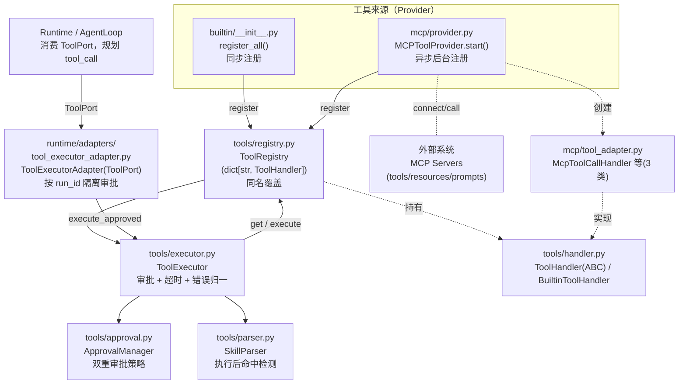
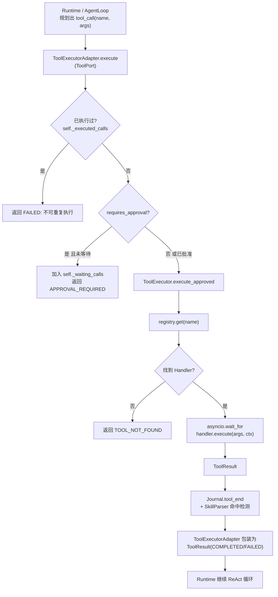
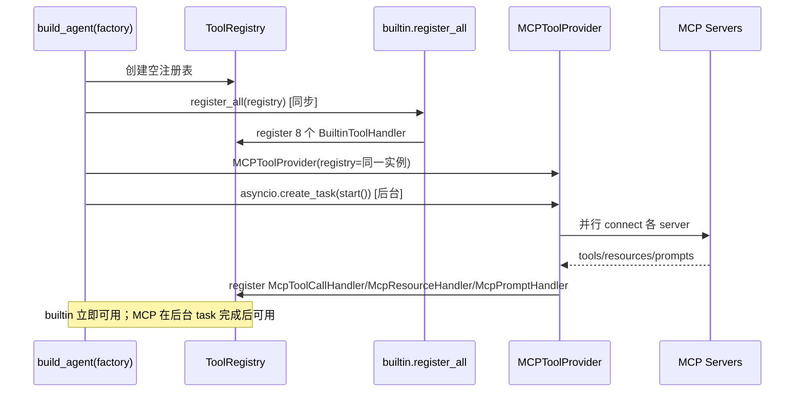
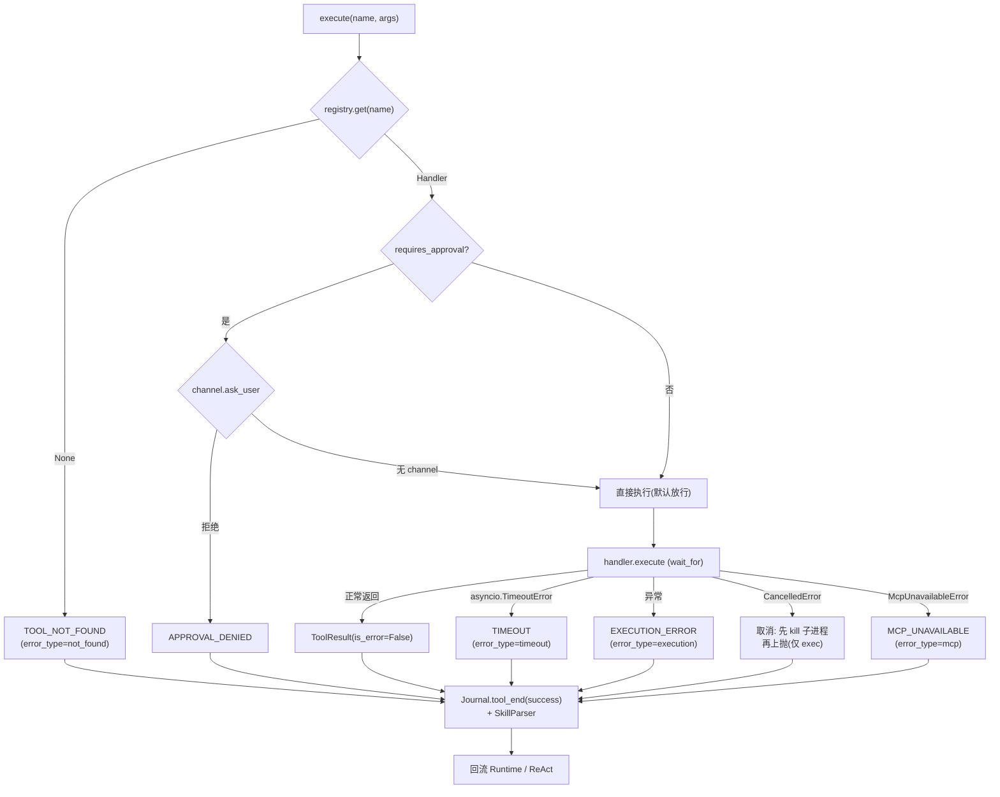

# Tool 模块总体说明

> 适用实现：Tool 模块 Phase 5（注册/执行重构）+ Phase 6（MCP 接入）
> 定位：统一的工具注册表与执行调度器，作为 Runtime 的基础设施。
> 设计原则：**中心化 Registry + Provider 模式；注册与执行分离；同名覆盖；builtin 同步注册、MCP 异步后台加载；声明式 + 配置式双重审批；超时与取消防护。**

## 1. 概览

**模块定位**：Tool 模块负责把框架内所有可被 LLM 调用的「能力」（内置函数、MCP 远端工具/资源/提示词）统一抽象为 `ToolHandler`，集中注册到 `ToolRegistry`，并由 `ToolExecutor` 统一调度执行（审批、超时、错误归一）。

**核心职责**
- 提供工具的统一抽象 `ToolHandler` 与元数据 `ToolDefinition`。
- 提供中心化注册表 `ToolRegistry`（注册 / 查询 / 按来源列举 / 取定义清单）。
- 提供执行调度器 `ToolExecutor`：查找 Handler → 审批检查 → 超时控制 → 归一 `ToolResult`。
- 通过 `ToolProvider` 抽象 + `MCPToolProvider` 实现，把远端 MCP 能力纳入同一注册表。

**非职责**
- 不持有业务运行状态（每次调用无状态，运行上下文由 `ToolExecutionContext` 临时注入）。
- 不解析 LLM 返回的 tool_call（那是 Runtime / AgentLoop 的职责，模块只消费「工具名 + 参数」）。
- 不实现 Skill 的注册：Skill 是另一套系统（见 `docs/wiki/上下文工程说明.md` 与 `skills/`），模块仅通过 `SkillParser` 在工具执行后做命中检测，不把 Skill 注册成 `ToolHandler`。

**入口与适用边界**
- 注册入口：`agent/factory.py:_build_tools`（builtin 同步）、`_build_mcp`（MCP 异步）。
- 执行入口：`ToolExecutor.execute(...)`；Runtime v4 侧经 `runtime/adapters/tool_executor_adapter.py:ToolExecutorAdapter`（实现 `ToolPort`）间接调用。
- 适用边界：任何需要「把一段能力暴露给 LLM 作为 tool_call」的场景；配置 `config.yaml` 的 `tools` 段控制启停与审批。

## 2. 代码层级

```text
src/dotclaw/
├── tools/                              # 工具核心（Phase 5 重构）
│   ├── __init__.py                     # 公共导出
│   ├── base.py                         # ToolSource / ToolDefinition / ToolResult / ToolExecutionContext
│   ├── handler.py                      # ToolHandler(ABC) / BuiltinToolHandler(适配器)
│   ├── registry.py                     # ToolRegistry：中心化注册表
│   ├── executor.py                     # ToolExecutor：审批 + 超时 + 错误归一
│   ├── approval.py                     # ApprovalManager：双重审批策略
│   ├── provider.py                     # ToolProvider(ABC)：discover_and_register 接口预留
│   ├── parser.py                       # SkillParser：工具执行后命中 Skill 检测
│   └── builtin/                        # 内置工具子包
│       ├── __init__.py                 # register_all()：统一注册入口
│       ├── exec_tool.py                # exec（Shell，需审批）
│       ├── file_tool.py                # read_file / write_file / list_dir
│       ├── memory_tool.py              # memory_read / memory_write（MEMORY.md）
│       └── system_tool.py              # system_info / get_time
│
├── mcp/                                # MCP 接入（Phase 6）
│   ├── provider.py                     # MCPToolProvider：ToolProvider 实现，编排 + 生命周期
│   ├── tool_adapter.py                 # McpToolCallHandler / McpResourceHandler / McpPromptHandler
│   └── client.py                       # McpClient：单 server 连接、状态机、调用
│
├── runtime/adapters/
│   └── tool_executor_adapter.py        # ToolExecutorAdapter：ToolPort 实现，隔离审批状态
│
└── agent/
    └── factory.py                      # 组合根：_build_tools / _build_mcp / build_agent
```

## 3. 总体架构



**依赖方向**：`builtin` 与 `mcp` 两个来源都依赖核心抽象 `ToolHandler` / `ToolRegistry`；`ToolExecutor` 依赖 `ToolRegistry` + `ApprovalManager` + `SkillParser`；`ToolExecutorAdapter` 依赖 `ToolExecutor` 与 Runtime 的 `ToolPort` 协议。上层（Runtime）只依赖 `ToolPort` 抽象，不感知具体注册来源——符合依赖倒置。组合根 `agent/factory.py` 负责将具体 Provider 与同一个 `ToolRegistry` 实例装配起来。

## 4. 模块说明与依赖

### 4.1 基础类型 — `tools/base.py`
- `ToolSource(str, Enum)`：BUILTIN / MCP / SKILL / CUSTOM，标记工具来源。
- `ToolDefinition`：name、description、parameters(JSON Schema)、source、needs_approval、timeout、metadata。是工具对 LLM 与调度器的「契约」。
- `ToolResult`：output、is_error、error_code、error_type、metadata——所有执行结果的归一结构。
- `ToolExecutionContext`：运行时注入的轻量上下文（timeout、agentrun_id），**每次执行新建、不持久化**。
- 禁止职责：不含执行逻辑、不含注册逻辑。

### 4.2 工具抽象 — `tools/handler.py`
- `ToolHandler(ABC)`：`definition()` + `execute(arguments, context)` 两个抽象方法，是「所有工具的统一形态」。
- `BuiltinToolHandler`：把一个异步函数 `handler_fn` 包装成 `ToolHandler`。`execute` 通过 `inspect.signature` 判断函数是否接受 `_context` 参数，自动注入运行上下文；捕获异常并归一为 `ToolResult(is_error=True)`。
- 依赖：`base`。被 `builtin/*` 与 `mcp/tool_adapter.py` 的上层复用其接口语义。

### 4.3 注册表 — `tools/registry.py`
- `ToolRegistry`：内存字典 `dict[str, ToolHandler]`。
- 方法：`register`（同名后注册**静默覆盖**）、`unregister`、`get`、`get_definitions`（汇总 `ToolDefinition` 供 LLM）、`list_by_source`、`all_names`、`clear`。
- 持有状态：仅 `_handlers` 字典；无外部依赖、无可变业务状态，纯查询/存储。
- 禁止职责：不执行、不做审批、不连接外部系统。

### 4.4 执行调度器 — `tools/executor.py`
- `ToolExecutor`：组合根注入 `registry` + `approval_manager` + `skill_parser`。
- 路径：`get(name)` 取 Handler → `requires_approval` 检查 →（如需）`ApprovalManager.check` → `_execute_handler`（`asyncio.wait_for(handler.execute(...), timeout)`）→ 错误归一。
- 关键方法：
  - `execute(...)`：完整路径，含审批交互（走 `channel`）。
  - `execute_approved(...)`：Runtime v4 已结构化审批后调用，**不触发交互式审批**。
  - `get_definitions()` / `get_handler()`：转发注册表。
- Journal 可观测：每次执行发射 `tool_start` / `tool_end`（含 `result_len`、`status`、`error_type`），并调用 `SkillParser` 命中检测。
- 持有状态：无业务状态，仅引用 registry/approval/parser 实例。

### 4.5 审批 — `tools/approval.py`
- `ApprovalManager`：双重策略——① `ToolDefinition.needs_approval` 声明式；② `config.tools.approval_commands` 配置式（覆盖式）。
- `requires_approval(name)`：纯查询、无副作用；`_enabled=False` 全部放行。
- `check(...)`：需审批时通过 `channel.ask_user` 向用户确认；**无 channel 时默认放行**（子 Agent 场景，避免阻塞）。
- 禁止职责：不直接执行工具，只回答「是否放行」。

### 4.6 Provider 接口 — `tools/provider.py`
- `ToolProvider(ABC)`：仅定义 `discover_and_register(registry) -> list[str]`，为 MCP / Skill / Custom 预留。
- 当前实现：`MCPToolProvider`（见 4.8）。Skill / Custom 尚无 Provider 实现——这是演进方向（见第 9 节）。

### 4.7 内置工具 — `tools/builtin/*`
- `register_all(registry)`：import 各 `get_*_handler()` 工厂，逐个 `registry.register`。
- 现有 8 个工具：

  | 工具名 | 函数 | 来源文件 | needs_approval | timeout |
  |---|---|---|---|---|
  | `exec` | `exec_command` | exec_tool.py | 是 | 60s |
  | `read_file` | `read_file` | file_tool.py | 否 | 10s |
  | `write_file` | `write_file` | file_tool.py | 是 | 10s |
  | `list_dir` | `list_dir` | file_tool.py | 否 | 10s |
  | `memory_read` | `memory_read` | memory_tool.py | 否 | 10s |
  | `memory_write` | `memory_write` | memory_tool.py | 是 | 10s |
  | `system_info` | `system_info` | system_tool.py | 否 | 10s |
  | `get_time` | `get_time` | system_tool.py | 否 | 5s |

- 约束细节：`file_tool` 限制单文件 ≤ 10MB；`exec_tool` 对 `CancelledError` 先 `proc.kill()` 再重抛（防孤儿进程，见 7.2）。

### 4.8 MCP Provider — `mcp/provider.py` + `mcp/tool_adapter.py` + `mcp/client.py`
- `MCPToolProvider`：实现 `ToolProvider`。`start()` 并行连接所有 `mcp_servers`，对每个 server 调 `_connect_and_register`：
  - 把远端 **tools** 包装为 `McpToolCallHandler`（名=原 name）；
  - 把 **resources** 包装为 `McpResourceHandler`（名=`read_{server}_{resource}`）；
  - 把 **prompts** 包装为 `McpPromptHandler`（名=`prompt_{server}_{prompt}`）；
  - 全部注册成功后才把 client 加入 `_clients`（W2 修复：防异常时状态不一致）。
  - 单个 server 失败不影响其他（`asyncio.gather(..., return_exceptions=True)`），失败项记入 `_failed_servers`。
- `McpClient`：单 server 连接管理，维护 `McpClientState`（STARTING / CONNECTED / CRASHED / FAILED / SHUTDOWN）；`tool_timeout` 取全局或 server 覆盖；支持崩溃重连（`restart_on_crash` / `max_restart_attempts`）。
- 依赖：`tools/registry`、`tools/provider`、`tools/base`、`tools/handler`。

### 4.9 Skill 命中检测 — `tools/parser.py`
- `SkillParser`：构造时以 `skill_dir → SkillMeta` 建查找表（依赖 `SkillRegistry`，可选）。
- `parse(tool_name, args)`：分析 `read_file` / `exec` 的参数路径，判断是否命中某 Skill 的 body（SKILL.md）/ reference / script，返回 `(skill_name, part, osname)` 或 `None`。
- 与 ToolExecutor 协作，在工具执行后发射 Journal 事件；**不侵入 AgentLoop**。

### 4.10 组合根 — `agent/factory.py`
- `_build_tools(config, skill_registry)`：创建 `ToolRegistry` → 若 `builtin_enabled` 则 `register_all` → 按 `disabled_tools` 逐个 `unregister` → 创建 `ToolExecutor`（注入 `ApprovalManager` + `SkillParser`）。
- `build_agent()`：先取 `tool_executor.registry`，再传给 `_build_mcp(config, tool_registry)`，使 builtin 与 MCP **共用同一 registry 实例**；MCP 加载以 `asyncio.create_task` 后台跑，返回 `(provider, task)`，task 挂在 `Agent` 上。
- 这是依赖倒置的落点：上层只拿到 `ToolExecutor` / `ToolPort`，不知道工具来自 builtin 还是 MCP。

## 5. 业务处理流程

### 5.1 工具执行主路径（一次 tool_call）



### 5.2 注册 / 装配时序



**关键持久化/提交点**：工具执行本身**不持久化业务状态**；`ToolResult.output` 作为 ReAct 循环的一轮消息回流给 LLM（由上层 Runtime 负责落库）。MCP 的 `_clients` 状态在 `start()` 全部成功后一次性更新（原子提交式，避免半注册）。

## 6. 状态与分支



**降级与失败隔离**
- **MCP 加载失败**：`_build_mcp` 内 `try/except` 仅 `logger.warning`，不阻断 builtin；单 server 失败（gather return_exceptions）不影响其他 server 与整体启动。`mcp_provider` 可为 `None`，`build_agent` 用 `or (None, None)` 兜底。
- **disabled_tools**：`_build_tools` 在注册后按配置 `unregister`，实现单工具降级（如关闭 `exec`）。
- **审批无 channel**：`ApprovalManager.check` 默认放行，保证子 Agent / 无交互场景不阻塞。

**每个分支的最终落点**：所有分支都收敛为 `ToolResult`（`is_error` + `error_code`/`error_type`），并经 `Journal.tool_end` 收口后回流 Runtime；不存在「静默丢弃」路径。

## 7. 工程化设计亮点

### 7.1 超时双层控制（问题 → 机制 → 收益 → 边界）
- **问题**：远端/MCP 工具可能挂起，拖垮整个 ReAct 循环。
- **机制**：`ToolExecutor` 用 `asyncio.wait_for(handler.execute(...), timeout=definition.timeout)` 做外层超时；MCP Handler 内部再向 `client.call_tool(timeout=...)` 传客户端超时作为兜底；`M4 修复` 用 `ToolExecutionContext.timeout` 覆盖 Handler 自身 `_timeout`。
- **收益**：外层保证调度器可取消，内层保证客户端连接不无限挂起。
- **边界**：超时只产生 `TIMEOUT` 结果并 kill 子进程（exec），不向上抛未处理异常。

### 7.2 取消防护：无孤儿进程（问题 → 机制 → 收益 → 边界）
- **问题**：`asyncio.wait_for` 超时会 cancel 内部 task，`CancelledError`（`BaseException` 子类）若不处理会跳过 `except Exception`，导致 shell 子进程变孤儿。
- **机制**：`exec_tool.exec_command` 在 `except asyncio.CancelledError` 中先 `proc.kill()` + `await proc.wait()` 再 `raise`，确保取消信号正常传导且子进程被回收。
- **收益**：长时间命令被取消后不残留僵尸进程。
- **边界**：仅覆盖 `exec` 创建的子进程；其他内置工具为纯内存操作，无需此处理。

### 7.3 双重审批策略（问题 → 机制 → 收益 → 边界）
- **问题**：危险工具（exec）需人工确认，但硬编码名单不灵活。
- **机制**：`needs_approval` 声明式（工具自述）+ `config.tools.approval_commands` 配置式（覆盖）；`ApprovalManager` 合并两者。Runtime v4 经 `ToolExecutorAdapter` 把「交互式审批」上移到运行控制层，适配器对「需审批且未批准」返回 `APPROVAL_REQUIRED`，批准后再 `execute_approved`。
- **收益**：危险操作可配置、可审计；`approval_id` 由 `(run_id, call_id)` 稳定派生，便于追踪。
- **边界**：无 `channel` 时默认放行（子 Agent 场景）；`_enabled=False` 全放行。

### 7.4 注册覆盖与防冲突命名（问题 → 机制 → 收益 → 边界）
- **问题**：多来源注册可能撞名，或重复注册应明确语义。
- **机制**：`register` 同名**静默覆盖**（后注册优先）；MCP 的 resource/prompt 用 `read_{server}_{name}` / `prompt_{server}_{name}` 前缀避免与 builtin 或跨 server 撞名。
- **收益**：配置驱动的优先级清晰，无需抛出异常打断启动。
- **边界/证据**：若某 MCP server 暴露的 tool 名恰好等于 builtin 名（且未走前缀规则），会**静默覆盖** builtin——属已知风险（见第 9 节）。

### 7.5 重复执行防护（问题 → 机制 → 收益 → 边界）
- **问题**：Runtime 重试或恢复时可能重复执行同一工具调用。
- **机制**：`ToolExecutorAdapter` 用 `self._waiting_calls` + `self._executed_calls` 两个以 `(run_id, call_id)` 为键的集合，保证同一调用只执行一次；重复提交返回 FAILED。
- **收益**：工具副作用（写文件、执行命令）不会被重试重复触发。
- **边界**：仅对「已批准待执行 / 已执行」去重；未审批调用可合法重新进入审批流。

### 7.6 失败隔离与并发加载（问题 → 机制 → 收益 → 边界）
- **问题**：一个 MCP server 崩溃/超时不应阻断其他工具或整个启动。
- **机制**：`_connect_and_register` 并行执行；`asyncio.gather(..., return_exceptions=True)` 把单 server 异常隔离到 `_failed_servers`；`start()` 整体失败仅 warning，builtin 照常可用。
- **收益**：部分可用优于全部不可用（韧性降级）。
- **边界**：`get_server_states()` 暴露 STARTING / CONNECTED / FAILED / CRASHED 状态供排障。

### 7.7 可观测与关联（问题 → 机制 → 收益 → 边界）
- **问题**：工具调用失败难定位、难复现。
- **机制**：`ToolExecutor` 每次执行发射 `tool_start`（含 args）/ `tool_end`（含 `result_len`、`status`、`error_type`）；`ToolExecutionContext.agentrun_id` 把工具调用关联到具体 Run；`SkillParser` 命中时补充 skill 事件。
- **收益**：从 trace 可重建「调了什么、参数、结果长度、成败、归属 Run」。
- **边界**：记录 `result_len` 而非全量 output，避免日志膨胀（完整 output 由 Runtime 落库）。

### 7.8 依赖倒置与插件替换点（问题 → 机制 → 收益 → 边界）
- **问题**：新增工具来源（Skill/Custom）不应改动执行核心。
- **机制**：`ToolProvider(ABC)` + `ToolHandler(ABC)` + Runtime `ToolPort`；新来源只需实现 `discover_and_register` 并向同一 `ToolRegistry` 注册。组合根 `factory.py` 负责装配。
- **收益**：执行核心（`ToolExecutor`）对来源无感知，扩展点清晰。
- **边界**：`ToolProvider` 目前仅 `MCPToolProvider` 一个实现（见第 9 节）。

## 8. 数据与运维语义

### 8.1 数据容器
| 容器 | 字段 | 写入者 | 读取者 | 生命周期 |
|---|---|---|---|---|
| `ToolDefinition` | name/description/parameters/source/needs_approval/timeout/metadata | 各 Handler 构造时 | LLM（定义清单）、Executor、`ApprovalManager` | 随 Handler 常驻 registry |
| `ToolResult` | output/is_error/error_code/error_type/metadata | Handler.execute | Executor → Runtime | 单次调用，无持久化 |
| `ToolExecutionContext` | timeout/agentrun_id | Executor 每次调用新建 | Handler、MCP 客户端 | 单次调用 |
| `ToolRegistry._handlers` | `dict[str, ToolHandler]` | register/unregister | Executor、Provider | 进程级（Agent 生命周期） |

`ToolResult` 是所有执行结果的**唯一归一出口**：成功、超时、审批拒绝、未找到、MCP 不可用均收敛到此结构，便于上层统一处理。

### 8.2 配置项（`config.yaml` 的 `tools` 段）
| 配置项 | 默认 | 消费点 | 语义 |
|---|---|---|---|
| `builtin_enabled` | true | `_build_tools` | 是否注册内置工具 |
| `mcp_enabled` | true | `_build_mcp` | 是否启用 MCP（**注**：`settings.py` 注释写「暂不消费」，但实际运行语义已被 `_build_mcp` 检查——属注释滞后） |
| `skill_enabled` | true | **未消费** | 遗留字段；Skill 真实开关在 `config.skills.enabled`（`_build_skills`），Skill 不进 `ToolRegistry` |
| `approval_commands` | [exec, python] | `ApprovalManager` | 需审批工具名列表（覆盖式） |
| `disabled_tools` | [] | `_build_tools` | 注册后逐个 `unregister` 的单工具禁用列表 |
| `exec_timeout` | 60.0 | **未消费** | 配置模型字段；当前 builtin 的 exec 超时由 `get_exec_handler` 硬编码 60s，factory 未用此值覆盖 |
| `mcp_global.startup_timeout` | 4.0 | `McpClient` | 握手超时 |
| `mcp_global.tool_timeout` | 60.0 | `McpClient.get_tool_timeout` | MCP 工具调用超时 |
| `mcp_global.restart_on_crash` | true | `McpClient` | 崩溃自动重连 |
| `mcp_global.max_restart_attempts` | 3 | `McpClient` | 最大重连次数 |
| `mcp_servers` | [] | `_build_mcp` | MCP server 列表（name/transport/command+args 或 url+headers/startup_timeout 覆盖） |

### 8.3 调试与故障排查入口
- **日志**：各模块 `logger` 名 `dotclaw.tools`、`dotclaw.tools.executor`、`dotclaw.mcp.provider`、`dotclaw.mcp.client`、`dotclaw.tools.parser`。
- **MCP 状态**：`MCPToolProvider.get_server_states()` 返回各 server 的 `McpClientState` 与失败原因（`_failed_servers`）。
- **MCP 就绪**：MCP 工具经后台 `mcp_task` 加载；若该 task 未完成，对应工具尚未进入 registry，调用会返回 `TOOL_NOT_FOUND`（见第 9 节时序窗口）。
- **审批**：交互式审批经 `channel.ask_user`；无 channel 默认放行。

## 9. 当前限制与演进方向

1. **MCP 异步加载时序窗口**：builtin 同步注册、MCP 后台 `asyncio.create_task` 加载。会话极早期若 LLM 立即调用某 MCP 工具，可能该工具尚未注册完，返回 `TOOL_NOT_FOUND`。演进：在 `ToolExecutor.get_definitions`（或首次工具调用前）`await mcp_task` 保证就绪。
2. **注册静默覆盖风险**：`register` 同名直接覆盖，无告警。若 MCP tool 名与 builtin 撞名（未走前缀规则），会无声替换 builtin。演进：覆盖时 `logger.warning` 或引入命名空间。
3. **`ToolProvider` 仅 MCP 实现**：`Skill` / `Custom` 来源尚无 Provider；Skill 走独立 `SkillParser` 命中检测而非注册为 Handler。演进：补齐 `SkillToolProvider` / `CustomToolProvider`，统一进 registry。
4. **配置字段消费差异**：`config.tools.skill_enabled` 与 `config.tools.exec_timeout` 当前未被实际消费（前者由 `config.skills.enabled` 接管，后者由 builtin 硬编码超时接管）。`settings.py` 中 `mcp_enabled` 注释「暂不消费」已与运行语义不符。演进：清理遗留字段或补齐消费。
5. **`disabled_tools` 仅作用于 builtin**：MCP 工具禁用需在各 server 配置层处理，未纳入统一 `disabled_tools` 机制。
6. **Skill 与 Tool 两套系统**：工具执行后的 Skill 命中是「旁路检测」，未与工具生命周期强绑定。若未来希望 Skill 暴露为工具，需打通第 3 点。
