# Tool 模块总体说明

> 适用代码：`aandbcct/dotClaw` 默认分支 `master`  
> 文档定位：自顶向下解释 Tool 在系统中的位置、完整组成、核心类、依赖与使用流程，并记录设计取舍、痛点和演进方向。  
> 扫描基准：2026-07-28，以 `master@31f30ae75d22f2b384e04a643894eaf9c0607323` 为事实基线。
> 编写基准：《dotClaw Wiki 编写规范与验收准则 v1.1》。  
> 上级导航：[dotClaw 开发者 Wiki](./README.md)

## 1. 模块定位与边界

Tool 模块负责把可被模型调用的能力统一为 `ToolHandler`，集中注册到 `ToolRegistry`，并在执行前完成参数校验、资源请求解释、策略决策和审批控制，最终以统一 `ToolResult` 返回给 Runtime。

它解决的核心问题不是“如何调用一个 Python 函数”，而是：

> 如何让来源不同、风险不同的工具，在进入真实副作用之前经过同一套可测试、可审计的执行边界。

### 1.1 对外提供的能力

Tool 模块对外提供四类稳定能力：

1. **工具定义**：向模型暴露名称、描述和 JSON Schema。
2. **工具目录**：注册、查询、禁用并生成不可变定义快照。
3. **工具执行**：把一次 `name + arguments` 调用归一为 `ToolResult`。
4. **安全决策**：根据已验证参数生成资源请求，并计算 `allow / ask / deny`。

### 1.2 主要使用者

| 使用者 | 使用方式 |
|---|---|
| Runtime | 通过 `ToolPort` 和 `ToolExecutorAdapter` 执行模型产生的 Tool Call |
| Context / Run Policy | 在 Run 创建时取得经过 Agent 白名单过滤的模型可见工具定义快照 |
| Bootstrap | 创建 Registry、Executor、安全组件、Builtin 和 MCP Provider |
| MCP | 将 MCP tools 适配为 `ToolHandler` 并注册到同一 Registry |
| CLI | 只读展示已注册工具，不直接驱动 Tool 的运行状态 |

### 1.3 明确不负责的内容

Tool 模块不负责：

- 解析 LLM 响应并决定何时调用工具；
- 驱动 Agent 状态机或 ReAct 循环；
- 持久化 Run、审批记录或 Checkpoint；
- 管理 MCP Server 的完整连接生命周期；
- 将 Skill 注册为工具；
- 提供任意 URL 的通用 HTTP Tool；
- 提供 OS 级强沙箱或保证 Shell 命令安全；
- 保证跨进程崩溃场景下副作用严格只执行一次。

审批在系统中有两条路径：

- `ToolExecutor.execute()` 的直接调用模式由 `ApprovalManager` 通过 Channel 询问用户；
- Runtime 主路径由 `ToolExecutorAdapter` 返回结构化审批需求，审批记录与恢复由 Runtime 负责。

---

## 2. 模块在项目中的位置

### 2.1 模块位置图

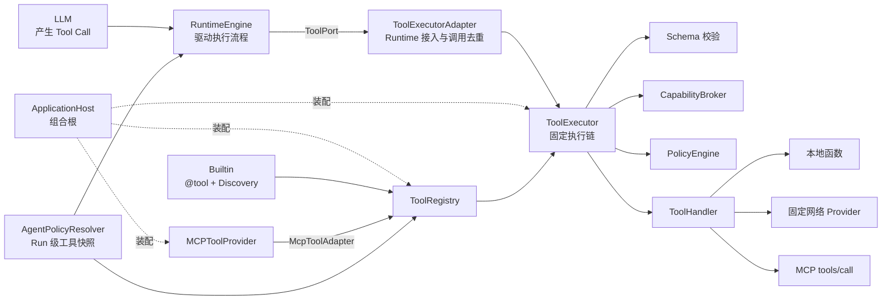
```mermaid
flowchart LR
    LLM["LLM<br/>产生 Tool Call"] --> Runtime["RuntimeEngine<br/>驱动执行流程"]
    Runtime -->|"ToolPort"| Adapter["ToolExecutorAdapter<br/>Runtime 接入与调用去重"]
    Adapter --> Executor["ToolExecutor<br/>固定执行链"]

    Bootstrap["ApplicationHost<br/>组合根"] -.装配.-> Executor
    Bootstrap -.装配.-> Registry["ToolRegistry"]
    Bootstrap -.装配.-> MCP["MCPToolProvider"]

    Builtin["Builtin<br/>@tool + Discovery"] --> Registry
    MCP -->|"McpToolAdapter"| Registry
    Registry --> Executor

    Executor --> Schema["Schema 校验"]
    Executor --> Broker["CapabilityBroker"]
    Executor --> Policy["PolicyEngine"]
    Executor --> Handler["ToolHandler"]

    Handler --> Local["本地函数"]
    Handler --> Provider["固定网络 Provider"]
    Handler --> Remote["MCP tools/call"]

    PolicySnapshot["AgentPolicyResolver<br/>Run 级工具快照"] --> Registry
    PolicySnapshot --> Runtime
```

**结论：**

- 调用发起者是 Runtime，不是 Tool 模块自身。
- Runtime 只依赖 `ToolPort`；具体 `ToolExecutor` 由 Adapter 接入。
- `ToolExecutor` 是执行链协调者，资源解释由 Broker 完成，放行判断由 Policy 完成。
- Builtin 和 MCP 都进入同一个 Registry，但 MCP 的连接生命周期仍由 MCP 模块管理。
- 禁止 Runtime Application 直接导入具体 Builtin、MCP Client 或 HTTP Provider。

### 2.2 一次 Tool Call 在系统请求中的位置

模块位置图表达的是静态边界；下面这条链路说明 Tool 在一次真实用户请求中何时被调用，以及结果如何回到 Runtime。

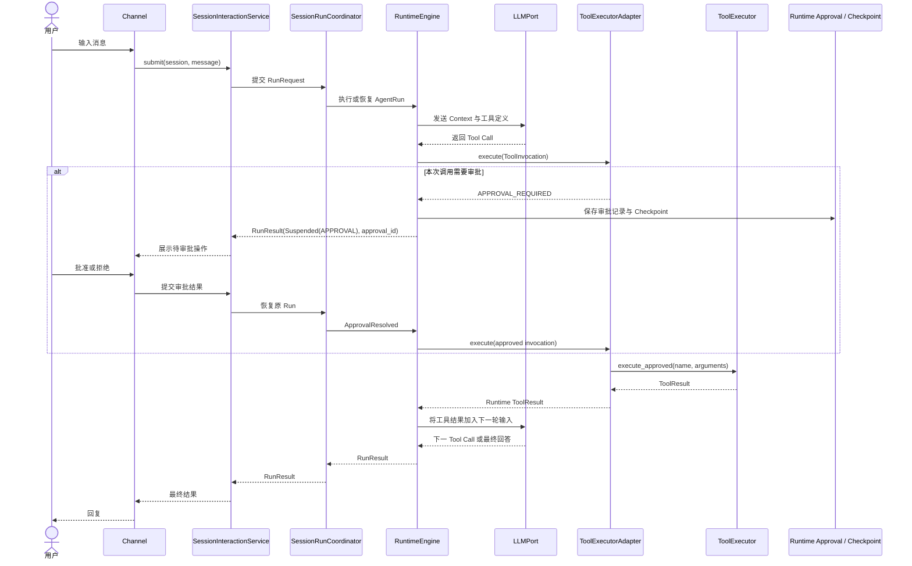
```mermaid
sequenceDiagram
    actor User as 用户
    participant Channel as Channel
    participant App as SessionInteractionService
    participant Coord as SessionRunCoordinator
    participant Engine as RuntimeEngine
    participant LLM as LLMPort
    participant Adapter as ToolExecutorAdapter
    participant Tool as ToolExecutor
    participant RuntimeApproval as Runtime Approval / Checkpoint

    User->>Channel: 输入消息
    Channel->>App: submit(session, message)
    App->>Coord: 提交 RunRequest
    Coord->>Engine: 执行或恢复 AgentRun
    Engine->>LLM: 发送 Context 与工具定义
    LLM-->>Engine: 返回 Tool Call
    Engine->>Adapter: execute(ToolInvocation)

    alt 本次调用需要审批
        Adapter-->>Engine: APPROVAL_REQUIRED
        Engine->>RuntimeApproval: 保存审批记录与 Checkpoint
        Engine-->>App: RunResult(Suspended(APPROVAL), approval_id)
        App-->>Channel: 展示待审批操作
        User->>Channel: 批准或拒绝
        Channel->>App: 提交审批结果
        App->>Coord: 恢复原 Run
        Coord->>Engine: ApprovalResolved
        Engine->>Adapter: execute(approved invocation)
    end

    Adapter->>Tool: execute_approved(name, arguments)
    Tool-->>Adapter: ToolResult
    Adapter-->>Engine: Runtime ToolResult
    Engine->>LLM: 将工具结果加入下一轮输入
    LLM-->>Engine: 下一 Tool Call 或最终回答
    Engine-->>Coord: RunResult
    Coord-->>App: RunResult
    App-->>Channel: 最终结果
    Channel-->>User: 回复
```

**结论：**

- Channel 和应用服务不会直接调用 Tool；它们负责提交消息、审批结果和展示 RunResult。
- `RuntimeEngine` 决定何时执行 Tool Call，并负责 Tool 前后的 Agent 状态转换。
- `ToolExecutorAdapter` 是 Runtime `ToolPort` 与 Tool 核心之间的边界，负责 DTO 转换、结构化审批需求和进程内调用去重。
- `ToolExecutor` 只负责本次 Tool Call 的安全执行，不持久化 Run、审批或 Checkpoint。
- Tool 执行结果不会直接回复用户，而是先回到 Runtime，再作为下一轮 LLM 输入或 Run 终态的一部分。
- 审批“为何产生”由 Tool 的声明、Capability 和 Policy 决定；审批“如何保存、恢复和收口”由 Runtime 决定。

### 2.3 与相邻模块的边界

| 相邻模块 | Tool 模块负责 | 相邻模块负责 |
|---|---|---|
| Runtime | 执行工具并返回工具级结果 | Tool Call 规划、审批持久化、Checkpoint、恢复和状态机 |
| Context | 提供工具定义快照的来源 | 将经过 Run Policy 过滤的工具定义加入模型上下文 |
| Agent | 消费 `agent_id` 对应的策略收窄规则 | 定义 `allowed_tools` 和 `policy_rules` |
| MCP | 提供 `ToolHandler`、Registry 和安全链 | 连接、发现、重连、状态管理和协议调用 |
| Skills | 工具执行后的旁路命中检测 | Skill 扫描、元数据注册和 Context 暴露 |
| Config | 消费 Tool、网络和 MCP 配置 | 配置模型、加载、环境变量展开和兼容迁移 |
| Journal | 可选地发射 Tool 级观测事件 | Trace、Report 和 Snapshot 的保存与输出 |

相关文档：

- [Runtime 模块总体说明](./Runtime%20模块总体说明.md)
- [MCP 模块说明](./MCP%20模块总体说明.md)
- [Skills 模块说明](./Skills%20模块总体说明.md)
- [Config 模块说明](./Config%20模块总体说明.md)

---

## 3. 组件总览

Tool 模块包含核心执行组件、具体能力实现、跨模块接入和辅助机制。它们对理解模块都重要，但不应被强行视为完全同级的组件。

组件划分遵循两个原则：

1. 围绕稳定职责和修改原因组织，而不是直接复制 `tools/` 目录；
2. Runtime Adapter、MCP、Bootstrap 和 Journal 等内容即使跨目录或不是独立 Tool 核心，也必须保留，因为它们决定 Tool 如何进入系统、如何被装配以及如何被观测。

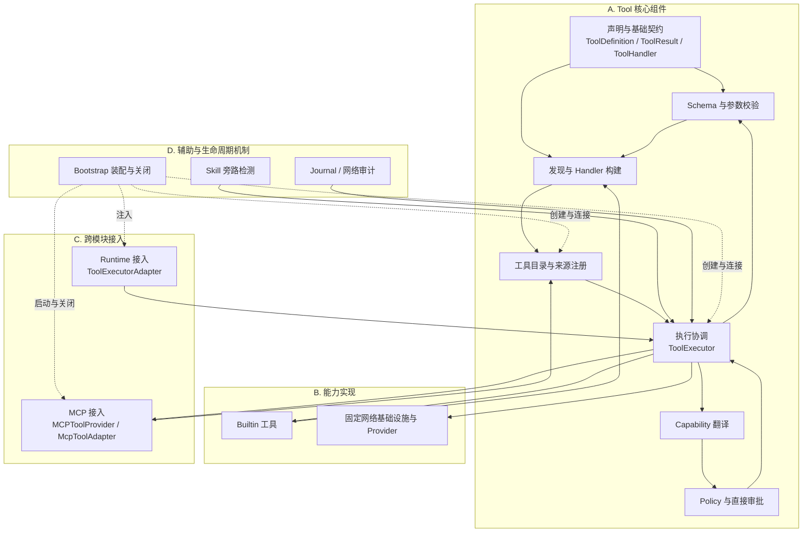
```mermaid
flowchart TB
    subgraph Core["A. Tool 核心组件"]
        Contract["声明与基础契约<br/>ToolDefinition / ToolResult / ToolHandler"]
        Schema["Schema 与参数校验"]
        Discovery["发现与 Handler 构建"]
        Registry["工具目录与来源注册"]
        Broker["Capability 翻译"]
        Policy["Policy 与直接审批"]
        Executor["执行协调<br/>ToolExecutor"]
    end

    subgraph Implementations["B. 能力实现"]
        Builtin["Builtin 工具"]
        Network["固定网络基础设施与 Provider"]
    end

    subgraph Integrations["C. 跨模块接入"]
        RuntimeAdapter["Runtime 接入<br/>ToolExecutorAdapter"]
        MCP["MCP 接入<br/>MCPToolProvider / McpToolAdapter"]
    end

    subgraph Support["D. 辅助与生命周期机制"]
        Skill["Skill 旁路检测"]
        Journal["Journal / 网络审计"]
        Bootstrap["Bootstrap 装配与关闭"]
    end

    Contract --> Schema
    Contract --> Discovery
    Schema --> Discovery
    Discovery --> Registry
    Builtin --> Discovery
    MCP --> Registry

    Registry --> Executor
    Executor --> Schema
    Executor --> Broker
    Broker --> Policy
    Policy --> Executor

    RuntimeAdapter --> Executor
    Executor --> Builtin
    Executor --> Network
    Executor --> MCP

    Skill --> Executor
    Journal --> Executor
    Bootstrap -.创建与连接.-> Registry
    Bootstrap -.创建与连接.-> Executor
    Bootstrap -.启动与关闭.-> MCP
    Bootstrap -.注入.-> RuntimeAdapter
```

这张图表达四个层次：

- **Tool 核心组件**定义统一契约、安全决策和执行链；
- **能力实现**提供真实业务副作用或本地计算；
- **跨模块接入**说明 Runtime 和 MCP 如何复用 Tool 核心；
- **辅助机制**说明 Tool 如何装配、关闭、审计和识别 Skill 操作。

### 3.1 组成部分与责任

| 层级 | 组成部分 | 稳定职责 | 主要入口 |
|---|---|---|---|
| Tool 核心 | 声明与基础契约 | 描述工具、执行上下文、结果和来源 | `ToolDefinition`、`ToolResult`、`ToolHandler`、`@tool` |
| Tool 核心 | Schema 与参数校验 | 生成模型 Schema，校验本地和外部 Tool 参数 | `to_json_schema`、`validate_args`、`validate_json_schema` |
| Tool 核心 | 发现与 Handler 构建 | 扫描可信 Builtin，将函数转换为 Handler | `ToolDiscovery`、`FunctionToolHandler` |
| Tool 核心 | 工具目录与来源注册 | 无冲突注册、查询、禁用和定义快照 | `ToolRegistry`、`ToolProvider` |
| Tool 核心 | Capability 翻译 | 将已验证调用解释为本次资源访问 | `CapabilityBroker`、`CapabilityRequest` |
| Tool 核心 | Policy 与直接审批 | 计算 allow/ask/deny；在直接模式下请求确认 | `PolicyEngine`、`PolicyScope`、`ApprovalManager` |
| Tool 核心 | 执行协调 | 固定执行顺序、超时、依赖注入和结果收口 | `ToolExecutor` |
| 能力实现 | Builtin 工具 | 提供文件、进程、记忆、系统、网络、天气和数学能力 | `tools/builtin/` |
| 能力实现 | 固定网络基础设施 | 限制服务、主机、方法、路由和响应资源 | `HttpxHttpClient`、固定 Provider |
| 跨模块接入 | Runtime 接入 | 将 ToolExecutor 映射为 ToolPort，衔接结构化审批 | `ToolExecutorAdapter`、`AgentPolicyResolver` |
| 跨模块接入 | MCP 接入 | 将 MCP tools 注册为 Handler，并复用安全链 | `MCPToolProvider`、`McpToolAdapter` |
| 辅助机制 | Skill 旁路检测 | 判断文件或脚本调用是否命中 Skill 内容 | `SkillParser` |
| 辅助机制 | Journal 与网络审计 | 记录脱敏的 Tool、Policy、审批和网络观测 | ToolExecutor Journal 调用点、`_AuditHttpClient` |
| 辅助机制 | Bootstrap 装配与生命周期 | 创建组件、确定注册顺序、启动 MCP 并关闭 HTTP/MCP | `_build_tools`、`_build_mcp`、`build_runtime_services` |

后续章节按内容选择表格、连续说明、流程图和不变量，不强制每个组成部分使用完全相同的表达形式。

---

## 4. 各组件的类与职责

本节从组件进入核心类、协议、数据对象和重要实现细节。不同组件采用不同表达方式：职责适合比较时使用表格，执行或安全逻辑复杂时使用连续说明、局部流程和不变量。


### 4.1 声明与基础契约

#### 4.1.1 核心类型

**职责与用途：**这一部分定义 Tool 模块内部及跨模块流转的基础对象和抽象接口。它统一描述模型能看到什么工具、一次工具调用携带什么上下文、执行结果如何返回，是 Discovery、Registry、Executor、Runtime Adapter 和具体 Handler 共同依赖的契约层。

| 类或协议 | 位置 | 负责 | 不负责 |
|---|---|---|---|
| `ToolDefinition` | `tools/base.py` | 模型可见定义、来源、超时、审批标记和策略档案 | 执行与策略计算 |
| `ToolResult` | `tools/base.py` | 统一成功或失败结果 | Runtime 状态和持久化 |
| `ToolExecutionContext` | `tools/base.py` | 向 Handler 注入 Run、Agent、超时和受控 HTTP Client | 保存长期状态 |
| `ToolHandler` | `tools/handler.py` | 统一 `definition()` 和 `execute()` 接口 | 注册、审批和来源发现 |
| `ToolSource` | `tools/base.py` | 标识 builtin、mcp、skill、custom 来源 | 决定安全策略 |
| `ToolErrorCode` | `tools/base.py` | 提供有限错误码集合 | Runtime 错误码映射 |

`ToolDefinition` 中与安全链直接相关的字段：

| 字段 | 用途 |
|---|---|
| `policy_profile` | Broker 应采用的资源档案，例如 `workspace.write` |
| `path_param` | 文件类工具真实路径参数名 |
| `network_service` | 固定网络服务标识 |
| `network_hosts` | 代码声明的精确主机集合 |
| `needs_approval` | 工具级显式审批要求 |
| `timeout` | Executor 的外层执行超时 |

#### 4.1.2 `@tool` 与元数据

**职责与用途：**这一部分负责把工具作者提供的名称、参数模型、安全档案、超时和审批要求声明为静态元数据。`@tool` 只完成声明，不执行注册或副作用，使工具定义可以在启动发现阶段被统一读取和校验。

| 类或函数 | 位置 | 职责 |
|---|---|---|
| `ToolPolicy` | `tools/decorator.py` | 定义 `workspace.read/write`、`process.exec`、`network.http`、`mcp.call` 档案 |
| `ToolMeta` | `tools/decorator.py` | 保存函数声明元数据，并生成 `ToolDefinition` |
| `tool()` | `tools/decorator.py` | 把 `ToolMeta` 附着到函数，不进行全局注册 |
| `get_tool_meta()` | `tools/decorator.py` | 读取函数上的声明元数据 |

选择“不在装饰器导入时自动注册”的原因是：

- 模块导入不产生隐式全局状态；
- Registry 的创建和生命周期仍由组合根控制；
- 测试可以显式构造 Registry；
- 同名冲突在发现和注册阶段集中暴露。

---

### 4.2 Schema、发现与 Handler 构建

#### 4.2.1 参数 Schema

**职责与用途：**参数 Schema 是模型工具定义与真实执行之间的输入契约。它既负责生成供 LLM 使用的 JSON Schema，也负责在副作用发生前把原始参数校验并规范化，避免未知字段、错误类型和敏感输入进入后续安全链。

| 函数或类型 | 位置 | 职责 |
|---|---|---|
| `to_json_schema()` | `tools/schema.py` | 将 Pydantic 模型转换为模型可用的内联 JSON Schema |
| `validate_args()` | `tools/schema.py` | 校验本地工具参数，严格拒绝未知字段 |
| `validate_json_schema()` | `tools/schema.py` | 对 MCP 等外部 Schema 做受限校验 |
| `ToolValidationError` | `tools/schema.py` | 以不包含输入值的安全错误描述统一校验失败 |

参数校验分为两条路径：

```text
Builtin / Local Tool
→ Pydantic args_model
→ validate_args
→ Pydantic Model

MCP Tool
→ input_schema
→ validate_json_schema
→ dict
```

两条路径都必须满足：

- 参数必须是对象；
- 必填字段缺失返回失败；
- 已声明 Schema 时默认拒绝未知字段；
- 错误文本不回显原始输入值；
- 失败统一映射为 `INVALID_ARGUMENTS`；
- 校验失败后不得进入 Broker、Policy 或 Handler。

`validate_json_schema()` 不是完整 JSON Schema 引擎。对递归 `$ref`、`allOf`、`anyOf` 和 `oneOf` 等复杂结构采取有限、明确的降级，而不是声称完成完整协议验证。

#### 4.2.2 工具发现

**职责与用途：**工具发现负责在启动阶段扫描显式可信的 Builtin 包，识别带有 `@tool` 元数据的函数，并将其转换为可注册的 `FunctionToolHandler`。它把“源码中声明了工具”转化为“进程级 Registry 中存在工具”。

| 类 | 位置 | 职责 |
|---|---|---|
| `ToolDiscovery` | `tools/discovery.py` | 扫描可信包、收集 `@tool` 函数并构造 Handler |
| `DiscoveryReport` | `tools/discovery.py` | 记录导入成功、失败、发现结果和冲突 |
| `ToolDeclarationError` | `tools/discovery.py` | 拒绝不可安全推导的函数签名 |

`ToolDiscovery` 只扫描显式指定的可信包，当前生产入口是 `dotclaw.tools.builtin`，不扫描用户工作区。

当 `@tool` 没有提供 `args_model` 时，Discovery 只对以下签名自动推导：

- `str`、`int`、`float`、`bool`；
- 普通位置或关键字参数；
- 字面量默认值；
- 可选 `context` / `ctx` 参数。

复杂类型、容器、Union、Optional、枚举、嵌套模型、`*args`、`**kwargs` 或缺失注解会直接抛 `ToolDeclarationError`。复杂工具应显式提供 Pydantic 模型。

#### 4.2.3 本地函数 Handler

**职责与用途：**`FunctionToolHandler` 是普通 Python 函数与统一 `ToolHandler` 契约之间的适配器。它负责按预先分析的函数签名注入参数和执行上下文，并把同步、异步或结构化返回值统一转换为 `ToolResult`。

`FunctionToolHandler` 位于 `tools/function_handler.py`，负责：

1. 在构造期分析函数调用方式；
2. 暴露由 `ToolMeta` 生成的定义；
3. 接收已验证模型或参数；
4. 调用同步或异步函数；
5. 将普通返回值转换为 `ToolResult(output=str(result))`；
6. 将抛出的异常映射为结构化执行失败。

它不负责 Capability 翻译、策略决策和审批。

---

### 4.3 工具目录与来源

#### 4.3.1 `ToolRegistry`

**职责与用途：**`ToolRegistry` 是进程级工具目录，保存当前可执行的 `ToolHandler`。它为 Bootstrap、Runtime Policy 和 ToolExecutor 提供统一的注册、查询、禁用、按来源列举和定义快照入口，但不负责发现工具或执行工具。

`ToolRegistry` 位于 `tools/registry.py`，内部保存：

```python
dict[str, ToolHandler]
```

它只承担：

- `register(handler)`；
- `unregister(name)`；
- `get(name)`；
- `get_definitions()`；
- `list_by_source(source)`；
- `snapshot()`；
- 测试所需的 `clear()`。

关键不变量：

- 同名注册抛 `DuplicateToolError`，禁止静默覆盖；
- Registry 不执行工具；
- Registry 不连接外部系统；
- `snapshot()` 深拷贝每个定义并返回元组；
- 后续 Registry 变化不影响已经生成的 Run 快照。

#### 4.3.2 Builtin 来源

**职责与用途：**Builtin 来源负责把 dotClaw 自带的本地能力接入统一 Tool 核心。这些工具通过 `@tool` 声明、由 Discovery 构造 Handler，再注册到同一 Registry，因此不会形成一套独立执行机制。

Builtin 采用：

```text
@tool 声明
→ ToolDiscovery
→ FunctionToolHandler
→ ToolRegistry
```

当前内置工具：

| 工具名 | 实现 | 策略档案 | 显式审批 |
|---|---|---|---|
| `builtin.files.read_text` | `builtin/file_tool.py` | `workspace.read` | 否 |
| `builtin.files.write_text` | `builtin/file_tool.py` | `workspace.write` | 是 |
| `builtin.files.list_directory` | `builtin/file_tool.py` | `workspace.read` | 否 |
| `builtin.process.execute` | `builtin/exec_tool.py` | `process.exec` | 是 |
| `builtin.memory.read` | `builtin/memory_tool.py` | `workspace.read` | 否 |
| `builtin.memory.write` | `builtin/memory_tool.py` | `workspace.write` | 是 |
| `builtin.system.get_info` | `builtin/system_tool.py` | 无 | 否 |
| `builtin.system.get_time` | `builtin/system_tool.py` | 无 | 否 |
| `builtin.web.search` | `builtin/web_tool.py` | `network.http` | 由 Policy 决定 |
| `builtin.weather.get_forecast` | `builtin/weather_tool.py` | `network.http` | 由 Policy 决定 |
| `builtin.math.calculate` | `builtin/math_tool.py` | 无 | 否 |

#### 4.3.3 MCP 来源

**职责与用途：**MCP 来源负责把远程 MCP Server 暴露的 tools 转换成 dotClaw 可执行的 `ToolHandler`。Tool 模块只接收已经完成协议发现的工具适配结果；连接、握手、重连和 Server 状态仍由 MCP 模块负责。

MCP 是独立模块。Tool 模块只依赖它提供的两项接入结果：

- `MCPToolProvider` 将发现到的 MCP tools 注册进同一个 `ToolRegistry`；
- `McpToolAdapter` 实现 `ToolHandler`，使用 `mcp.<server>.<tool>` 名称。

MCP resources 和 prompts 不进入 Tool Registry。连接状态机、重连和 Server 生命周期详见 [MCP 模块说明](./MCP%20模块总体说明.md)。

#### 4.3.4 `ToolProvider`

**职责与用途：**`ToolProvider` 是外部或动态工具来源接入 Registry 的扩展契约。它规定一个来源如何异步发现并注册 Handler，使来源生命周期可以扩展，而不需要修改 ToolExecutor 的执行核心。

`ToolProvider` 是外部来源的异步发现契约：

```python
async def discover_and_register(registry: ToolRegistry) -> list[str]
```

当前实际实现只有 `MCPToolProvider`。Builtin 使用同步 `ToolDiscovery`，Skill 不作为工具来源。

---

### 4.4 Capability 翻译

#### 4.4.1 `CapabilityRequest`

**职责与用途：**`CapabilityRequest` 是安全链中的资源事实对象。它不描述工具的抽象名称，而是记录本次已验证调用将实际读取、写入、执行、联网或访问哪个 MCP Server，供 Policy 决策、审批摘要和审计共同使用。

`CapabilityRequest` 表达的不是“这个工具通常能做什么”，而是：

> 这个工具在本次已验证调用中将触及什么资源。

| `ResourceKind` | 典型来源 |
|---|---|
| `FILE_READ` | `workspace.read` 文件参数 |
| `FILE_WRITE` | `workspace.write` 文件参数 |
| `PROCESS_EXEC` | Shell 命令 |
| `NETWORK_HTTP` | 固定 Provider 的服务和主机 |
| `MCP_CONNECT` | MCP Server 启动网关 |
| `MCP_CALL` | MCP 工具调用 |

安全相关字段：

- `normalized_path`：相对 workspace 的逻辑路径；
- `escaped`：真实路径是否逃逸 workspace；
- `absolute_path`：仅供执行前回填，不进入审批展示；
- `param_field`：应回填的实际参数名；
- `command`：已脱敏的命令摘要；
- `service` / `host`：固定网络服务和精确主机；
- `server`：MCP Server 名称。

#### 4.4.2 `CapabilityBroker`

**职责与用途：**`CapabilityBroker` 是“工具调用参数”到“资源访问请求”的解释器。它读取 `ToolDefinition` 与已验证参数，解析真实路径、命令、固定网络服务或 MCP Server，形成 `CapabilityRequest`，但不决定是否允许执行。

`CapabilityBroker.resolve()` 输入：

```text
ToolDefinition
+ 已验证参数
+ workspace_root
```

输出：

```text
list[CapabilityRequest]
```

Broker 负责：

- 根据 `policy_profile` 选择资源解释规则；
- 解析文件路径并检测 `..`、绝对路径、`~`、符号链接和 Windows 联接点逃逸；
- 为文件请求保存经检查的真实绝对路径；
- 对命令和 URL 摘要脱敏；
- 从 MCP 注册元数据取得 Server，而不是相信运行参数；
- 从 ToolDefinition 的静态声明取得网络服务和主机，而不是接受 Agent 提供 URL。

Broker 不负责：

- 决定 allow/ask/deny；
- 请求用户审批；
- 调用 Handler；
- 持久化资源请求。

---

### 4.5 策略与审批

#### 4.5.1 `PolicyScope`

**职责与用途：**`PolicyScope` 表示一次 Tool Policy 评估所需的完整策略上下文。它把全局安全上限、当前 Agent 的额外收窄规则、workspace 根目录、拒绝路径、MCP 允许列表和已启用网络服务汇总在一起，使 `PolicyEngine` 能针对本次资源请求计算有效决策。

一次策略评估由以下内容组成：

| 字段 | 语义 |
|---|---|
| `global_rules` | 系统安全上限 |
| `agent_rules` | 当前 Agent 额外收窄 |
| `workspace_root` | 文件访问根目录 |
| `denied_paths` | 即使档案允许也必须拒绝的路径模式 |
| `allowed_mcp_servers` | MCP 连接和调用允许列表 |
| `network_services` | 已启用服务到精确主机的映射 |

默认规则：

| 档案 | 默认决策 |
|---|---|
| `workspace.read` | `allow` |
| `workspace.write` | `ask` |
| `process.exec` | `ask` |
| `network.http` | `deny` |
| `mcp.connect` | `ask` |
| `mcp.call` | `ask` |

默认拒绝路径包括：

```text
.env
.git/**
**/*.key
```

默认 MCP 允许列表当前包含 `github`。

#### 4.5.2 `PolicyEngine`

**职责与用途：**`PolicyEngine` 是无副作用的策略决策器。它根据 `PolicyScope` 和一个或多个 `CapabilityRequest` 计算最终 `ALLOW / ASK / DENY`，并给出匹配规则与原因；它不请求用户确认，也不调用 Handler。

`PolicyEngine.evaluate()` 的合并规则：

```text
任一请求 DENY
→ 整体 DENY

否则任一请求 ASK
→ 整体 ASK

否则
→ 整体 ALLOW
```

每个请求先计算：

```text
effective_decision = max(global_decision, agent_decision)
```

其中严格程度为：

```text
ALLOW < ASK < DENY
```

因此 Agent 级策略只能收窄，不能把全局 `deny` 放宽为 `allow`。

资源约束优先于档案决策：

- 文件路径逃逸 workspace：`DENY`；
- 命中 `denied_paths`：`DENY`；
- MCP Server 不在允许列表：`DENY`；
- 网络服务未启用或主机不匹配：`DENY`。

#### 4.5.3 两种审批模式

**职责与用途：**审批模式负责把 Policy 的 `ASK` 结果转化为用户可确认的控制流程。直接模式面向独立 Tool 调用，Runtime 模式面向可暂停、持久化和恢复的 AgentRun；两者共享安全语义，但由不同模块管理交互状态。

##### 直接调用模式

```text
ToolExecutor.execute
→ Broker 生成资源摘要
→ Policy 返回 ASK
→ ApprovalManager.request(summary, channel)
→ 用户批准或拒绝
```

特点：

- 审批提示可以显示本次调用的脱敏资源摘要；
- 没有 Channel 时拒绝；
- 不持久化审批；
- 不支持进程重启后恢复。

##### Runtime 主路径

```text
ToolExecutorAdapter
→ requires_approval
→ 返回 APPROVAL_REQUIRED
→ Runtime 保存审批与 Checkpoint
→ 用户决定
→ Runtime 在原 Run 上恢复
→ ToolExecutor.execute_approved
```

特点：

- 审批记录、恢复和 Run 状态由 Runtime 管理；
- `execute_approved()` 只跳过 `ASK` 交互，不跳过参数校验、Broker 和 `DENY`；
- 审批恢复的权威事实来自持久化 Checkpoint，而不是 Adapter 的内存集合；
- 完整恢复流程主归属 [Runtime 模块总体说明](./Runtime%20模块总体说明.md)。

---

### 4.6 执行协调

#### 4.6.1 `ToolExecutor`

**职责与用途：**`ToolExecutor` 是 Tool 模块内部的主协调器。它把 Registry、参数校验、CapabilityBroker、PolicyEngine、审批、超时、Handler 和结果收口组织成固定执行链，但不负责 Agent 状态机和运行事实持久化。

`ToolExecutor` 组合：

```text
ToolRegistry
+ Schema
+ CapabilityBroker
+ PolicyEngine
+ ApprovalManager
+ 可选 SkillParser
+ 可选 HttpClient
+ Agent Policy Resolver
```

核心入口：

| 方法 | 使用场景 |
|---|---|
| `execute()` | 带 Channel 的直接执行，内部可询问审批 |
| `execute_approved()` | Runtime 已完成结构化审批后的执行 |
| `requires_approval()` | Runtime 执行前的审批预检 |
| `snapshot_definitions()` | Run 创建时生成不可变的模型可见工具定义快照 |
| `get_definitions()` | CLI 等诊断展示 |
| `get_handler()` | 诊断和内部接入 |

固定执行顺序：

```text
查找 Handler
→ 参数校验
→ CapabilityBroker
→ PolicyEngine
→ 审批处理
→ 已批准路径回填
→ Handler 执行
→ 结果收口
```

任何 `TOOL_NOT_FOUND`、`INVALID_ARGUMENTS`、`POLICY_DENIED` 或 `APPROVAL_DENIED` 都应在 Handler 之前结束。

对于文件工具，Executor 在 Policy 通过后把 Broker 已验证的 `absolute_path` 回填到参数，确保：

```text
策略检查目标
= 审批摘要目标
= Handler 实际操作目标
```

#### 4.6.2 `ToolExecutorAdapter`

**职责与用途：**`ToolExecutorAdapter` 是 Runtime 与 Tool 核心之间的边界适配器。它实现 Runtime 定义的 `ToolPort`，把 Runtime Tool DTO 转换为 ToolExecutor 调用，并将 Tool 的审批需求与执行结果转换回 Runtime 能处理的结构。

`ToolExecutorAdapter` 位于 Runtime 模块，完整类说明主归属 Runtime。Tool 侧需要理解其四个边界：

1. 实现 Runtime 的 `ToolPort`；
2. 使用 `(run_id, call_id)` 防止进程内重复执行；
3. 未批准且需要审批时返回 `APPROVAL_REQUIRED`；
4. 批准后调用 `ToolExecutor.execute_approved()`。

Adapter 不向 Channel 提问，也不持久化审批。

#### 4.6.3 Run 级工具快照

**职责与用途：**Run 级工具快照用于冻结一次 AgentRun 中模型可见的工具名称、描述和参数 Schema。它保证同一 Run 的 LLM 工具视图稳定，并在快照阶段应用 Agent 工具白名单；它不复制实际 Handler，也不保证外部来源在整个 Run 中持续可用。

Run 创建时：

```text
AgentPolicyResolver
→ ToolExecutor.snapshot_definitions()
→ ToolRegistry.snapshot()
→ 按 AgentIdentity.allowed_tools 过滤
→ 写入 AgentPolicySnapshot
```

因此：

- Registry 是进程级动态目录；
- Run 看到的是创建时冻结的定义集合；
- MCP 后续新增或移除只影响下一次 Run；
- Agent 白名单过滤发生在 Run Policy 冻结阶段；
- Run 内模型可见的工具定义不应重新读取动态 Registry；实际执行仍由 `ToolExecutor` 在当前 Registry 中查找 Handler。

---

### 4.7 固定网络基础设施

网络工具不是“任意 HTTP Tool”。当前只支持代码明确登记的固定 Provider。

#### 4.7.1 网络边界

**职责与用途：**网络边界说明网络 Tool 从模型参数进入外部 API 前必须经过哪些固定约束。它的目标是保证 Agent 只能提供业务参数，不能控制 URL、主机、方法、端口和路由。

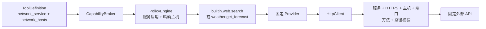
```mermaid
flowchart LR
    Tool["builtin.web.search<br/>或 weather.get_forecast"] --> Provider["固定 Provider"]
    Provider --> Client["HttpClient"]
    Client --> Validate["服务 + HTTPS + 主机 + 端口<br/>方法 + 路径校验"]
    Validate --> External["固定外部 API"]

    Definition["ToolDefinition<br/>network_service + network_hosts"] --> Broker["CapabilityBroker"]
    Broker --> Policy["PolicyEngine<br/>服务启用 + 精确主机"]
    Policy --> Tool
```

**结论：**

- Agent 只能提供搜索词、地点和天数等业务参数；
- URL、主机、端点、方法和认证方式由代码固定；
- Policy 和 HttpClient 分别执行一次主机/服务检查，形成纵深防御；
- 不存在通用网页抓取、任意 URL 访问或 HTML 爬取能力。

#### 4.7.2 `HttpClient`

**职责与用途：**`HttpClient` 是固定 Provider 依赖的受限网络传输端口。它集中执行 HTTPS、主机、端口、方法、路由、超时、并发、重定向和响应大小限制，使 Provider 无需直接依赖通用 `httpx.AsyncClient`。

`HttpClient` 是窄协议，只有：

- `request(...)`；
- `close()`。

`HttpxHttpClient` 的固定限制：

| 限制 | 当前值或规则 |
|---|---|
| 协议 | 仅 HTTPS |
| 端口 | 仅 443 |
| 主机 | 必须精确匹配服务白名单 |
| 路由 | 必须匹配登记的方法和路径 |
| 重定向 | 禁止 |
| URL 用户信息段 | 禁止 |
| 连接超时 | 3 秒 |
| 总请求超时 | 10 秒 |
| 最大响应 | 1 MiB |
| 最大并发 | 4 |
| 重试 | Tavily 不重试；Open-Meteo 临时错误重试一次 |

固定路由：

| 服务 | 主机 | 方法和路径 |
|---|---|---|
| Tavily | `api.tavily.com` | `POST /search` |
| Open-Meteo | `geocoding-api.open-meteo.com` | `GET /v1/search` |
| Open-Meteo | `api.open-meteo.com` | `GET /v1/forecast` |

#### 4.7.3 Provider

**职责与用途：**Provider 位于网络 Builtin 与 `HttpClient` 之间，负责适配某个固定外部服务的业务协议。它构造最小必要请求、处理认证、解析响应并映射稳定业务结果和脱敏错误，但不决定 Tool Policy，也不开放通用网络访问。

| Provider | 输入 | 固定行为 | 输出 |
|---|---|---|---|
| `TavilyProvider` | query、max_results | 只执行基础搜索，不请求正文、图片、Extract、Crawl 或 Map | 受限标题、URL、摘要 |
| `OpenMeteoProvider` | location、country_code、days | 先地理编码，再请求固定天气字段 | 无候选、候选列表或稳定预报结构 |

`ProviderError` 将外部异常映射为有限 Tool 错误码：

- `CONFIGURATION_ERROR`；
- `NETWORK_ERROR`；
- `RESPONSE_TOO_LARGE`。

认证信息只从环境变量读取，当前 Tavily 使用 `TAVILY_API_KEY`。

---

### 4.8 Builtin 的本地安全边界

#### 文件工具

**职责与用途：**文件工具向模型提供工作区内文本读取、覆盖写入和目录列举能力。它们依赖 Broker 与 Policy 完成真实路径解析和访问约束，Handler 本身只执行已经获准的文件操作。

- Broker 限制实际路径必须位于 workspace；
- `read_text` 有 10 MiB 文件上限；
- 写入采用覆盖语义；
- `list_directory` 只列一层；
- 文件内容本身仍是不可信输入，Tool 模块不负责内容级指令隔离。

#### 进程工具

**职责与用途：**进程工具提供 Shell 命令执行能力，用于调用工作区脚本或本地开发命令。由于它具有广泛副作用，必须经过 `process.exec` Policy 和审批，并在超时或取消时清理子进程。

- 使用 `asyncio.create_subprocess_shell`；
- 超时或取消时主动终止子进程；
- 命令执行仍是 Shell 级能力；
- 当前安全主要依赖 Policy 和审批；文件工具的 workspace 约束并不能限制 Shell 命令内部访问的路径，因此不构成 OS 级沙箱。

#### 数学工具

**职责与用途：**数学工具为模型提供不依赖 Shell、文件或网络的受限数值表达式求值能力。它通过 AST 和函数白名单控制可执行语法，用更窄的本地计算能力替代通用代码执行。

`builtin.math.calculate` 使用：

- AST 白名单；
- 节点数和深度限制；
- 固定函数与常量；
- 幂运算范围限制；
- 非有限值和复数拒绝。

它不调用 Python `eval`，不产生 Capability Request。

#### 系统工具

**职责与用途：**系统工具提供当前时间和有限的本地运行环境信息，帮助模型回答依赖本机状态的问题。它们目前没有 Policy 档案，因此也用于说明 passthrough 工具仍需要单独审查其信息暴露边界。

`get_time` 和 `get_info` 当前没有策略档案，因此属于 passthrough 工具。`get_info` 会读取当前目录、平台信息和环境变量名称摘要；这属于当前实现事实，不代表这些信息永远应被视为非敏感。

---

### 4.9 Skill 旁路检测

**职责与用途：**Skill 旁路检测用于识别一次文件读取或进程执行是否访问了某个 Skill 的主体、reference 或 script。它只补充观测语义，不把 Skill 注册成 Tool，也不改变本次调用的安全决策和执行结果。

`SkillParser` 试图通过文件读取或进程执行参数判断本次工具调用是否命中：

- Skill 主体 `SKILL.md`；
- Skill reference；
- Skill script。

它不把 Skill 注册为 Tool，也不影响 Tool 的放行结果，只用于观测。

该组件属于 Tool 与 Skills 的交界处。Skill 扫描与生命周期详见 [Skills 模块说明](./Skills%20模块总体说明.md)。

---


### 4.10 Bootstrap 装配与生命周期

**职责与用途：**这一部分说明 Tool 的核心对象如何在进程启动时被创建、连接和关闭。Bootstrap 是具体依赖和生命周期的所有者，负责将 Config、Builtin、MCP、网络客户端、ToolExecutor 与 Runtime Adapter 组合成完整对象图。

Tool 核心不创建全局单例，也不自行决定 Builtin、MCP 或网络服务是否启用。实际对象图由 Bootstrap 负责构建。

主要装配入口：

| 入口 | 主要职责 |
|---|---|
| `bootstrap/_host_components.py::_build_tools` | 创建 Registry、发现 Builtin、应用禁用列表、构造 Policy/Broker/Approval/HttpClient 和 ToolExecutor |
| `bootstrap/_host_components.py::_build_mcp` | 根据配置创建 MCPToolProvider，使其复用同一 Registry、Policy 和 Broker |
| `bootstrap/runtime_factory.py::build_runtime_services` | 创建 ToolExecutorAdapter，并以 Runtime `ToolPort` 注入 RuntimeEngine |
| `bootstrap/application_host.py` | 控制启动、降级和逆序关闭，最终关闭 MCP Provider 与 HttpClient |

装配顺序具有实际语义：

```text
读取 Config
→ 创建 PolicyScope / Registry
→ 发现并注册 Builtin
→ 应用 disabled_tools
→ 创建 ToolExecutor
→ 启动 MCP 并注册远程工具
→ 冻结首个 Run 可见工具集
→ 创建 Runtime Adapter
```

这里的关键边界是：

- Bootstrap 可以依赖所有具体模块，因为它是组合根；
- Tool 核心不能反向依赖 `ApplicationHost`；
- Runtime Application 不能自行创建 `ToolExecutor`；
- 生命周期资源由创建者关闭，Handler 不应各自关闭共享 HttpClient；
- MCP 单 Server 失败可以降级，但 Registry 冲突等不变量错误应显式暴露。

### 4.11 Journal 与网络审计

**职责与用途：**这一部分说明 Tool 执行过程如何产生脱敏的观测信息。Journal 和网络审计用于排障、统计和安全追踪，但不参与 Policy 决策，也不是 Runtime 恢复和提交的权威事实源。

ToolExecutor 可以接收可选 Journal，用于发射：

- `tool_start`；
- `tool_policy_resolved`；
- `tool_approval_outcome`；
- `tool_end`；
- Skill 命中事件；
- 网络请求的脱敏摘要。

`_AuditHttpClient` 是对真实 `HttpClient` 的观测包装。它只记录：

```text
tool_name
service
host
HTTP 状态类别
耗时
响应字节数
重试次数
```

它不记录认证头、API Key、完整查询串或响应正文，也不负责网络访问控制；真正的 URL、主机、路由和资源限制仍由 `HttpxHttpClient` 执行。

Journal 的边界必须与 Runtime 事实源区分：

- Journal 是可选观测设施；
- RunRepository、Checkpoint 和审批记录才是 Runtime 恢复依据；
- 当前 `ToolExecutorAdapter` 没有向 `execute_approved()` 传入 Journal，因此 Runtime 主路径不会自动获得 ToolExecutor 的全部 Journal 事件；
- 不能因为 Journal 中出现 Tool 事件，就把它视为执行成功或可恢复性的权威证明。

---

## 5. 组件依赖和使用流程

本节分别描述启动期装配、Runtime 主执行、审批恢复、直接执行以及文件、网络和 MCP 等局部机制。相同组件会在不同图中重复出现，但每张图回答的问题不同。

### 5.1 启动注册流程

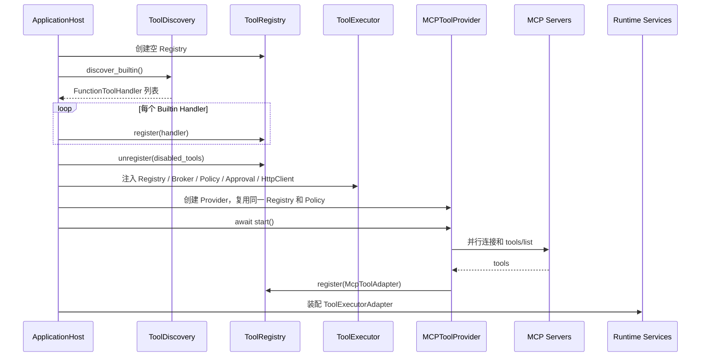
```mermaid
sequenceDiagram
    participant Host as ApplicationHost
    participant Discovery as ToolDiscovery
    participant Registry as ToolRegistry
    participant Executor as ToolExecutor
    participant MCP as MCPToolProvider
    participant Server as MCP Servers
    participant Runtime as Runtime Services

    Host->>Registry: 创建空 Registry
    Host->>Discovery: discover_builtin()
    Discovery-->>Host: FunctionToolHandler 列表
    loop 每个 Builtin Handler
        Host->>Registry: register(handler)
    end
    Host->>Registry: unregister(disabled_tools)
    Host->>Executor: 注入 Registry / Broker / Policy / Approval / HttpClient
    Host->>MCP: 创建 Provider，复用同一 Registry 和 Policy
    Host->>MCP: await start()
    MCP->>Server: 并行连接和 tools/list
    Server-->>MCP: tools
    MCP->>Registry: register(McpToolAdapter)
    Host->>Runtime: 装配 ToolExecutorAdapter
```

**结论：**

- Host 是启动发起者和生命周期所有者。
- Builtin 在 MCP 之前同步注册。
- MCP 首次发现发生在 Runtime 对外就绪之前，保证首个 Run 可以冻结 MCP 工具定义。
- `disabled_tools` 当前在 MCP 注册前执行，因此主要作用于 Builtin。
- Tool 核心不自行创建全局 Registry，也不持有 ApplicationHost。

### 5.2 Runtime 工具调用主流程

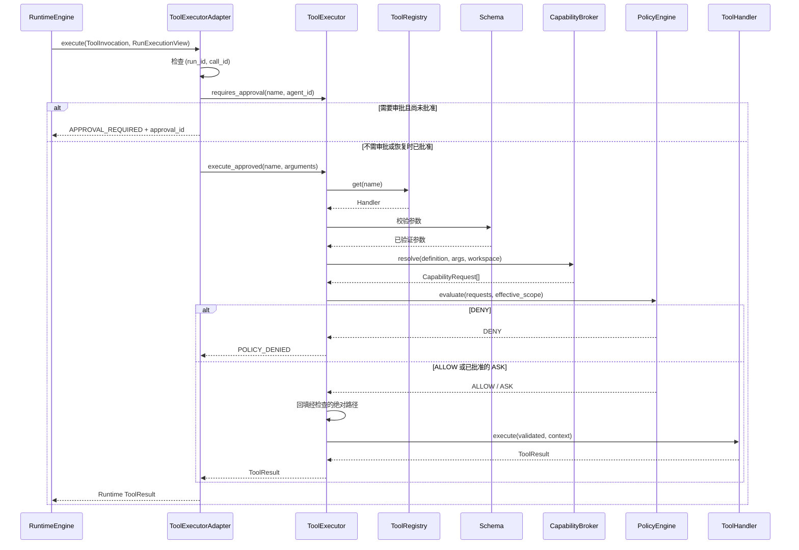
```mermaid
sequenceDiagram
    participant Engine as RuntimeEngine
    participant Adapter as ToolExecutorAdapter
    participant Executor as ToolExecutor
    participant Registry as ToolRegistry
    participant Schema as Schema
    participant Broker as CapabilityBroker
    participant Policy as PolicyEngine
    participant Handler as ToolHandler

    Engine->>Adapter: execute(ToolInvocation, RunExecutionView)
    Adapter->>Adapter: 检查 (run_id, call_id)
    Adapter->>Executor: requires_approval(name, agent_id)

    alt 需要审批且尚未批准
        Adapter-->>Engine: APPROVAL_REQUIRED + approval_id
    else 不需审批或恢复时已批准
        Adapter->>Executor: execute_approved(name, arguments)
        Executor->>Registry: get(name)
        Registry-->>Executor: Handler
        Executor->>Schema: 校验参数
        Schema-->>Executor: 已验证参数
        Executor->>Broker: resolve(definition, args, workspace)
        Broker-->>Executor: CapabilityRequest[]
        Executor->>Policy: evaluate(requests, effective_scope)
        alt DENY
            Policy-->>Executor: DENY
            Executor-->>Adapter: POLICY_DENIED
        else ALLOW 或已批准的 ASK
            Policy-->>Executor: ALLOW / ASK
            Executor->>Executor: 回填经检查的绝对路径
            Executor->>Handler: execute(validated, context)
            Handler-->>Executor: ToolResult
            Executor-->>Adapter: ToolResult
        end
        Adapter-->>Engine: Runtime ToolResult
    end
```

**结论：**

- `RuntimeEngine` 是业务调用发起者，Adapter 是跨模块边界，Executor 是 Tool 内部协调者。
- Adapter 的审批预检不替代执行时的参数校验、Broker 和 Policy。
- 即使 Tool Call 已获批准，实际参数命中 `DENY` 约束时仍不得执行。
- Handler 不应自行读取 Runtime 状态或决定全局 Policy。
- Runtime 负责运行事实和状态迁移；Tool 只返回本次调用结果。

### 5.3 Runtime 审批暂停与恢复流程

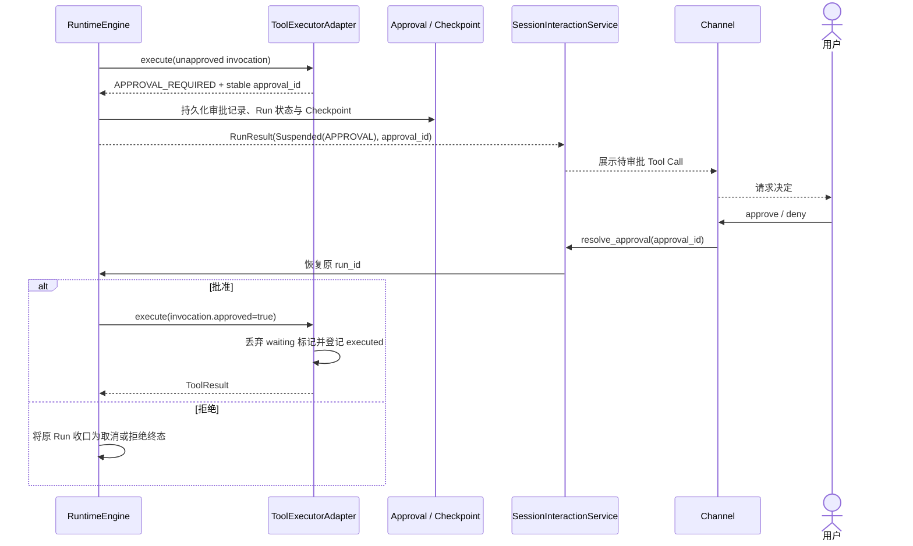
```mermaid
sequenceDiagram
    participant Engine as RuntimeEngine
    participant Adapter as ToolExecutorAdapter
    participant ApprovalRepo as Approval / Checkpoint
    participant App as SessionInteractionService
    participant Channel as Channel
    actor User as 用户

    Engine->>Adapter: execute(unapproved invocation)
    Adapter-->>Engine: APPROVAL_REQUIRED + stable approval_id
    Engine->>ApprovalRepo: 持久化审批记录、Run 状态与 Checkpoint
    Engine-->>App: RunResult(Suspended(APPROVAL), approval_id)
    App-->>Channel: 展示待审批 Tool Call
    Channel-->>User: 请求决定
    User->>Channel: approve / deny
    Channel->>App: resolve_approval(approval_id)
    App->>Engine: 恢复原 run_id

    alt 批准
        Engine->>Adapter: execute(invocation.approved=true)
        Adapter->>Adapter: 丢弃 waiting 标记并登记 executed
        Adapter-->>Engine: ToolResult
    else 拒绝
        Engine->>Engine: 将原 Run 收口为取消或拒绝终态
    end
```

**结论：**

- Tool 决定是否可能需要审批；Runtime 决定如何暂停和恢复 AgentRun。
- `approval_id` 用 `run_id + call_id` 生成稳定标识，但持久化权威来自 Runtime Repository。
- Adapter 的 `_waiting_calls` 和 `_executed_calls` 只提供进程内短生命周期保护。
- Channel 只收集用户决定，不直接执行 Tool，也不修改 Tool Policy。
- 审批通过不等于无条件执行，恢复后仍需通过完整参数和资源约束检查。

### 5.4 直接执行流程

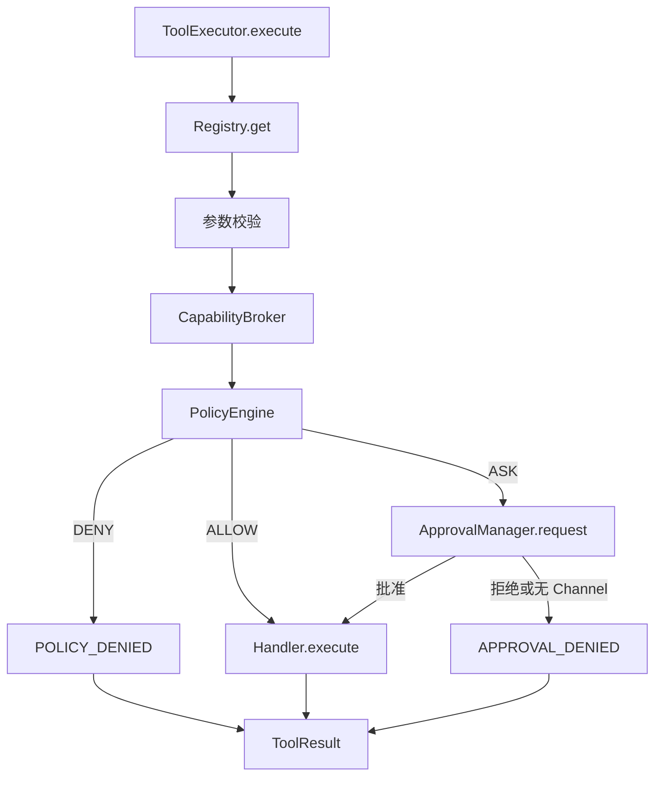
```mermaid
flowchart TD
    Start["ToolExecutor.execute"] --> Get["Registry.get"]
    Get --> Validate["参数校验"]
    Validate --> Broker["CapabilityBroker"]
    Broker --> Policy["PolicyEngine"]

    Policy -->|DENY| Denied["POLICY_DENIED"]
    Policy -->|ALLOW| Run["Handler.execute"]
    Policy -->|ASK| Approval["ApprovalManager.request"]

    Approval -->|批准| Run
    Approval -->|拒绝或无 Channel| Rejected["APPROVAL_DENIED"]

    Run --> Result["ToolResult"]
    Denied --> Result
    Rejected --> Result
```

直接模式适合 Tool 单元测试、诊断或不经过 Runtime 的调用。它可以展示 Broker 生成的具体资源摘要，但不持久化审批，也不支持重启后恢复。

### 5.5 文件路径安全流程

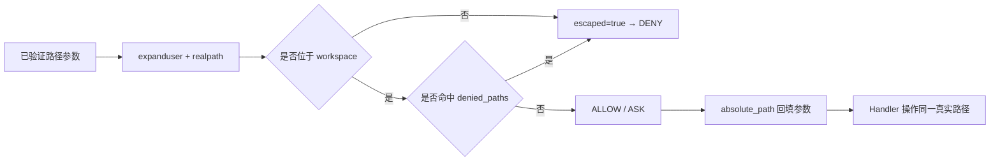
```mermaid
flowchart LR
    Args["已验证路径参数"] --> Normalize["expanduser + realpath"]
    Normalize --> Check{"是否位于 workspace"}
    Check -->|否| Deny["escaped=true → DENY"]
    Check -->|是| Rules{"是否命中 denied_paths"}
    Rules -->|是| Deny
    Rules -->|否| Decision["ALLOW / ASK"]
    Decision --> Rebind["absolute_path 回填参数"]
    Rebind --> Handler["Handler 操作同一真实路径"]
```

**结论：**

- 先解析真实路径，再判断 workspace 边界，避免 `..`、`~`、符号链接和联接点绕过。
- `absolute_path` 只用于执行目标回填，不应写入面向用户的审批摘要。
- 该约束只覆盖文件类 Handler，不限制 Shell 命令内部访问的路径。

### 5.6 固定网络工具调用流程

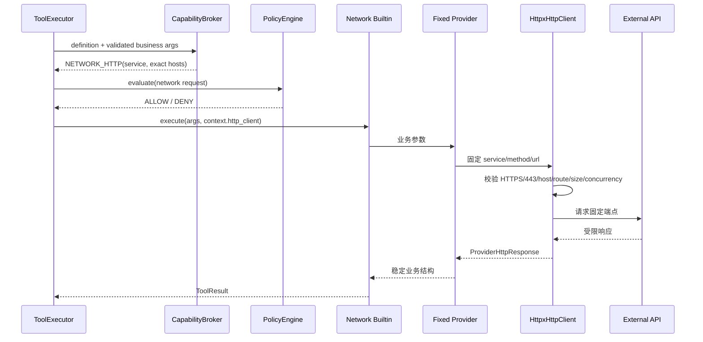
```mermaid
sequenceDiagram
    participant Executor as ToolExecutor
    participant Broker as CapabilityBroker
    participant Policy as PolicyEngine
    participant Builtin as Network Builtin
    participant Provider as Fixed Provider
    participant Client as HttpxHttpClient
    participant API as External API

    Executor->>Broker: definition + validated business args
    Broker-->>Executor: NETWORK_HTTP(service, exact hosts)
    Executor->>Policy: evaluate(network request)
    Policy-->>Executor: ALLOW / DENY
    Executor->>Builtin: execute(args, context.http_client)
    Builtin->>Provider: 业务参数
    Provider->>Client: 固定 service/method/url
    Client->>Client: 校验 HTTPS/443/host/route/size/concurrency
    Client->>API: 请求固定端点
    API-->>Client: 受限响应
    Client-->>Provider: ProviderHttpResponse
    Provider-->>Builtin: 稳定业务结构
    Builtin-->>Executor: ToolResult
```

**结论：**

- Agent 只能控制业务参数，不能控制 URL、主机、方法或路由。
- Broker/Policy 在执行前检查服务和主机，HttpClient 在发请求前再次检查完整 URL 与路由。
- Provider 负责协议和业务映射，HttpClient 负责传输资源边界。
- 网络 Tool 的返回文本属于不可信外部数据，不自动获得指令权限。

### 5.7 MCP 工具接入与调用流程

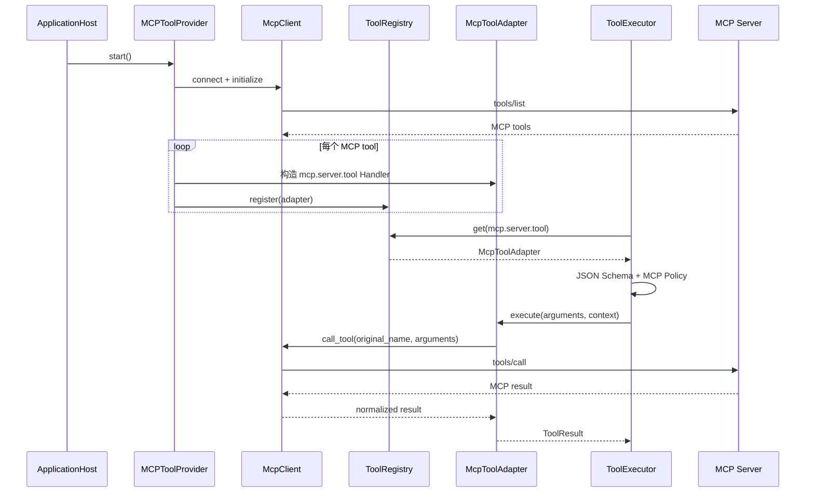
```mermaid
sequenceDiagram
    participant Host as ApplicationHost
    participant MCPProvider as MCPToolProvider
    participant Client as McpClient
    participant Registry as ToolRegistry
    participant Adapter as McpToolAdapter
    participant Executor as ToolExecutor
    participant Server as MCP Server

    Host->>MCPProvider: start()
    MCPProvider->>Client: connect + initialize
    Client->>Server: tools/list
    Server-->>Client: MCP tools
    loop 每个 MCP tool
        MCPProvider->>Adapter: 构造 mcp.server.tool Handler
        MCPProvider->>Registry: register(adapter)
    end

    Executor->>Registry: get(mcp.server.tool)
    Registry-->>Executor: McpToolAdapter
    Executor->>Executor: JSON Schema + MCP Policy
    Executor->>Adapter: execute(arguments, context)
    Adapter->>Client: call_tool(original_name, arguments)
    Client->>Server: tools/call
    Server-->>Client: MCP result
    Client-->>Adapter: normalized result
    Adapter-->>Executor: ToolResult
```

**结论：**

- MCPProvider 管连接、发现和注册；McpToolAdapter 管单次协议调用转换。
- MCP 工具与 Builtin 复用 Registry、Executor、Schema 和 Policy，不建立第二套执行核心。
- 注册名使用 `mcp.<server>.<tool>`，实际协议调用仍使用原始 MCP tool 名。
- resources 和 prompts 保持原生 MCP 能力，不伪装成 Tool。
- MCP Server 的内部行为不受 dotClaw Tool Policy 细粒度控制；Policy 只能控制是否连接和调用该 Server。

---

## 6. 对外接口与数据契约

### 6.1 公共入口

当前 `tools/__init__.py` 对外导出：

- 基础类型：`ToolDefinition`、`ToolResult`、`ToolExecutionContext`；
- 声明：`ToolPolicy`、`ToolMeta`、`tool`；
- Schema：`to_json_schema`、`validate_args`、`validate_json_schema`；
- Handler：`ToolHandler`、`FunctionToolHandler`；
- 目录：`ToolRegistry`、`ToolDiscovery`；
- 安全：`CapabilityBroker`、`CapabilityRequest`、`PolicyEngine`、`PolicyScope`；
- 执行：`ToolExecutor`、`ApprovalManager`；
- 来源扩展：`ToolProvider`。

Runtime 不应依赖这组全部导出，而应依赖自己定义的 `ToolPort`。

### 6.2 核心数据契约

#### `ToolDefinition`

```text
工具的模型可见定义
+ 来源
+ 执行控制
+ 安全声明
```

这是 Registry、Run Policy、Context 和 LLM 之间的定义来源。

#### `ToolResult`

```text
output
is_error
error_code
error_type
metadata
```

这是 Tool 模块内部的统一出口，但 Runtime Adapter 当前会把 Tool 失败转换为 Runtime `TOOL_FAILURE`。

#### `ToolExecutionContext`

当前字段：

```text
timeout
agentrun_id
session_id
agent_id
http_client
```

该对象只在单次调用中存在，不持久化。

#### `CapabilityRequest`

这是 Policy 输入和审批摘要来源。它不得携带未脱敏的认证信息或原始敏感内容。

#### `PolicyOutcome`

```text
decision
matched_rule
reason
```

用于表示最终决策及安全原因，不保存原始参数。

### 6.3 关键不变量

1. 参数校验必须先于 Broker、Policy 和 Handler。
2. Broker 只解释资源，不决定放行。
3. Policy 不执行副作用，也不接触 Channel。
4. `DENY` 不能被预审批覆盖。
5. Agent 策略只能收窄全局上限。
6. 文件 Handler 必须操作 Broker 检查过的同一真实路径。
7. Registry 同名冲突必须失败，不能静默覆盖。
8. Run 内模型可见工具定义来自创建时快照；实际执行仍在当前 Registry 中查找 Handler。
9. Tool 模块不持久化审批、Run 或 Checkpoint。
10. MCP tools 必须使用 Server 命名空间。
11. 网络工具不得接收 Agent 可控的 URL、主机或端点。
12. 无策略档案意味着 passthrough，不等于经过资源级安全审查。

### 6.4 配置契约

主要配置位于 `config.yaml` 的 `tools` 段。

| 配置 | 消费者 | 当前语义 |
|---|---|---|
| `builtin_enabled` | Bootstrap | 是否发现和注册 Builtin |
| `mcp_enabled` | Bootstrap | 是否启动 MCP Provider |
| `disabled_tools` | Bootstrap | Builtin 注册后注销指定名称 |
| `approval_commands` | ToolExecutor | 工具级显式审批补充 |
| `policy.workspace_root` | Broker / Policy | 文件访问根目录 |
| `policy.rules` | PolicyEngine | 全局档案决策 |
| `policy.denied_paths` | PolicyEngine | 文件拒绝模式 |
| `policy.allowed_mcp_servers` | MCP / Policy | 允许连接和调用的 Server |
| `network.tavily.enabled` | Bootstrap / Policy | 启用 Tavily 固定主机 |
| `network.open_meteo.enabled` | Bootstrap / Policy | 启用 Open-Meteo 固定主机 |
| `mcp_global.*` | MCP Client | MCP 默认超时和重连配置 |
| `mcp_servers` | MCP Provider | Server 连接列表 |

`config.tools.skill_enabled` 和 `config.tools.exec_timeout` 当前没有形成有效消费闭环，见“已知痛点”。

---

## 7. 常见修改入口

| 修改目标 | 首要入口 | 同时涉及 | 必须保持的不变量 |
|---|---|---|---|
| 新增简单 Builtin | `tools/builtin/*.py` 的 `@tool` 函数 | Discovery 测试、工具清单 | 名称唯一；参数可安全推导；选择正确 Policy |
| 新增复杂 Builtin | Pydantic Args Model + `@tool(args_model=...)` | Schema、Handler 测试 | 未知字段拒绝；错误不回显输入 |
| 新增文件类工具 | `@tool(policy=WORKSPACE_*)` | `path_param`、Broker、Policy | 实际路径必须由 Broker 检查并回填 |
| 新增受保护资源类型 | `ToolPolicy`、`ResourceKind`、`CapabilityBroker` | `PolicyScope`、PolicyEngine、Config、测试 | 未识别资源默认不能静默放行 |
| 修改默认策略 | `tools/policy.py` | Config 覆盖、Agent 收窄、文档 | Agent 不能放宽全局决策 |
| 修改审批行为 | `ToolExecutor.requires_approval` / `_run_chain` | Runtime Adapter、Runtime Approval | 区分直接审批和结构化审批 |
| 新增固定网络服务 | `network.py` | Config、Provider、Builtin、Host Builder、HttpClient 测试 | 服务、主机、方法和路径由代码固定 |
| 修改 HTTP 资源限制 | `tools/http_client.py` | Provider 测试、关闭流程 | 禁止无界响应、重定向和任意主机 |
| 新增 MCP Tool 接入规则 | `mcp/tool_adapter.py` | MCP Provider、Tool Policy | 命名空间唯一；Server 元数据不可来自 Agent 参数 |
| 新增工具来源 | `ToolProvider` / `ToolHandler` | Bootstrap 装配、Registry | 来源不得绕过统一执行链 |
| 修改 Agent 工具白名单 | `AgentIdentity.allowed_tools` | `AgentPolicyResolver` | Run 内模型可见定义使用冻结快照 |
| 修改 Agent 策略收窄 | `AgentIdentity.policy_rules` | ToolExecutor `_effective_scope` | 只能收窄，不得放宽 |
| 新增 Tool 错误码 | `tools/base.py` | Provider 映射、Builtin、Runtime Adapter | 成功和失败语义必须结构化 |
| 修改 Runtime Tool 接入 | `runtime/adapters/tool_executor_adapter.py` | Runtime ToolPort、审批和清理流程 | 不向 Channel 提问；审批可恢复 |
| 修改 Skill 命中观测 | `tools/parser.py` | ToolExecutor 收尾、Skills Registry | 不影响 Tool 放行和结果 |
| 禁用单个 Builtin | `disabled_tools` | Bootstrap `_build_tools` | 使用完整规范名 |
| 排查工具缺失 | `ToolDiscovery`、`ToolRegistry`、CLI `/tools` | 模块导入日志、disabled_tools | 区分未发现、导入失败和被禁用 |
| 排查策略拒绝 | `CapabilityRequest.describe()`、`PolicyOutcome` | Agent policy、Config | 不打印密钥或原始敏感参数 |

### 7.1 新增 Builtin 的最小步骤

```text
1. 定义稳定工具名
2. 定义 Pydantic 参数模型
3. 选择 ToolPolicy 或明确无受保护资源
4. 必要时声明 needs_approval / path_param / network_service
5. 编写 @tool 函数
6. 为参数校验、Policy、拒绝路径和成功路径添加测试
7. 验证 ToolDiscovery 能发现
8. 验证 Run Policy 快照中可见
```

### 7.2 新增资源类型的最小步骤

不能只在 `ToolPolicy` 中增加枚举值。完整变更至少包括：

```text
ToolPolicy
→ ResourceKind
→ CapabilityBroker 翻译
→ CapabilityRequest.describe
→ PolicyScope 约束
→ PolicyEngine 判定
→ Config 模型与装配
→ requires_approval 预检
→ 拒绝/审批/执行测试
```

---

## 8. 设计取舍、痛点和演进方向

本节严格区分已经实现的事实和候选改进，不把计划写成现状。

### 8.1 当前设计

当前已实现：

1. `@tool` 只声明，Registry 由组合根创建。
2. Builtin 通过可信包 Discovery 自动发现。
3. 所有来源统一为 `ToolHandler`。
4. Registry 拒绝同名覆盖并提供深拷贝快照。
5. Executor 固定执行顺序为校验、Broker、Policy、审批、Handler。
6. Broker 可以根据本次参数解释文件、进程、网络和 MCP 资源。
7. Agent 级 Policy 只能收窄全局规则。
8. Runtime 使用结构化审批并可在原 Run 上恢复。
9. 文件路径在执行前回填为 Broker 已检查的真实路径。
10. 网络访问限制为两个固定 Provider。
11. MCP tools 进入同一 Registry，resources/prompts 不伪装为工具。
12. Run 创建时冻结模型可见工具定义并应用 Agent 白名单，执行 Handler 不在该快照中。

### 8.2 设计取舍

#### 8.2.1 中心化安全链，而不是 Handler 自行检查

**原问题：**

Builtin、MCP 和后续 Custom Tool 的实现方式不同。如果每个 Handler 自行完成参数检查、权限判断和审批，安全语义会分散到各来源中；新增来源时也很容易遗漏某一步。

**选择：**

由 `ToolExecutor` 固定调度顺序，将资源解释和最终决策继续拆分为 `CapabilityBroker` 与 `PolicyEngine`：

```text
参数校验
→ CapabilityRequest
→ PolicyOutcome
→ 审批
→ Handler
```

**未选择的方案：**

- 让每个 Handler 自行决定是否允许执行；
- 把路径解析、规则匹配和用户交互全部堆进 Executor；
- 只依赖工具描述中的“危险”文字提示模型自律。

**选择原因与收益：**

- Handler 可以聚焦业务执行；
- 所有来源进入副作用前经过同一入口；
- Broker 和 Policy 可以独立测试；
- Runtime Adapter 可以复用 Tool 核心，而不理解每种工具；
- 安全失败可以在 Handler 前统一收口。

**代价：**

- Executor 成为高连接度协调点；
- 新资源类型需要同时修改 Broker、Policy、Config 和测试；
- 直接调用 Handler 会绕过安全链，因此生产调用入口必须受控。

**当前边界：**

中心化链路只对经过 `ToolExecutor` 的调用成立；Python 代码仍可以直接拿到 Handler 并执行，框架没有语言级强制封锁这一点。

#### 8.2.2 固定 ToolPolicy 档案，而不是工具自由声明任意能力

**原问题：**

同一个工具描述通常是静态的，但本次调用的风险取决于参数。例如“写文件”可能是写工作区普通文件，也可能是写 `.env` 或逃逸到工作区外。仅靠名称和描述无法形成稳定策略。

**选择：**

工具作者从有限 `ToolPolicy` 档案中选择，Broker 再结合本次已验证参数形成 `CapabilityRequest`。

**未选择的方案：**

- 让工具作者自由填写任意能力字符串或规则表达式；
- 直接按工具名配置 allow/deny；
- 在装饰器中预先枚举所有可能资源；
- 只在 Handler 内检查具体参数。

**选择原因与收益：**

- 所有工具共享有限、可理解的安全词汇；
- Policy 配置不绑定具体函数实现；
- 同一档案可以根据不同参数产生不同资源请求；
- Agent 级规则可以在档案层收窄全局权限。

**代价：**

- 复合资源工具的表达能力有限；
- 新资源类别需要框架级变更；
- 当前声明接口主要绑定单个 Policy，虽然执行结果已经是请求列表；
- passthrough 工具不会自动得到资源级审查。

**当前边界：**

Capability 不是 OS 权限，也不证明 Handler 没有隐藏副作用；它只描述框架当前能够解释和约束的资源。

#### 8.2.3 进程级 Registry 与 Run 级模型可见快照

**原问题：**

MCP 连接状态和可用工具可能在进程运行期间变化。如果模型在同一个 Run 中看到的 Schema 不稳定，历史 Tool Call、模型决策和恢复语义都会变得不可预测。

**选择：**

Registry 保持进程级动态目录；Run 创建时深拷贝工具定义，并按 `AgentIdentity.allowed_tools` 过滤后写入 `AgentPolicySnapshot`。

**未选择的方案：**

- 每次 LLM 调用都从动态 Registry 重新生成工具列表；
- 为每个 Run 深拷贝全部 Handler 和外部连接；
- 进程启动后彻底禁止 Registry 变化；
- 把 MCP 可用性变化直接写入在途 Run 的工具定义。

**选择原因与收益：**

- 同一 Run 的模型可见名称、描述和 Schema 稳定；
- Agent 白名单在 Run 边界冻结；
- MCP 重连只影响后续 Run；
- Registry 生命周期仍可由 Host 和 Provider 管理。

**代价：**

- 实际执行仍从当前 Registry 查找 Handler；
- 在途 Run 可能持有已经注销工具的旧定义；
- 定义快照和来源实时可用性可能短时不一致；
- 它不是完整执行对象快照。

**当前边界：**

该设计保证“模型可见定义稳定”，不保证 Handler、网络服务或 MCP Server 在整个 Run 中始终可用。

#### 8.2.4 固定 Provider，而不是开放通用 HTTP Tool

**原问题：**

通用 HTTP Tool 会让模型控制 URL、主机、端口、方法和请求内容，容易形成 SSRF、任意数据外发、重定向绕过和无界响应问题。

**选择：**

网络能力以固定 Provider 实现。服务、精确主机、方法和路径由代码登记，Agent 只提供搜索词、地点和天数等业务参数。

**未选择的方案：**

- `http_request(url, method, headers, body)` 通用工具；
- 仅依赖域名字符串前缀做白名单；
- 允许 Provider 跟随重定向；
- 将 API Key、目标主机和 endpoint 放入模型参数；
- 先读取完整响应后再检查大小。

**选择原因与收益：**

- 网络权限可以按服务显式启用；
- Provider 只发送完成业务所需的最小数据；
- Policy 与 HttpClient 执行两层校验；
- 认证、重试、响应大小和错误脱敏集中处理；
- 网络工具 Schema 中不存在任意 URL。

**代价：**

- 每接入一个服务都要增加代码、配置和测试；
- 不适用于通用浏览和网页抓取；
- 固定协议变化需要修改 Provider；
- 服务数量增加后，路由常量和配置可能继续膨胀。

**当前边界：**

固定 Provider 限制 dotClaw 发出的请求，但不能保证外部返回内容可信，也不能控制服务端后续如何处理数据。

#### 8.2.5 MCP 保持独立模块，但复用 Tool 核心

**原问题：**

MCP 同时包含连接生命周期、协议发现、远程调用和 tools/resources/prompts 等能力。如果全部塞入 Tool，Tool 会承担协议状态机；如果完全独立，又会形成第二套 Registry、审批和错误体系。

**选择：**

MCP 独立管理连接、发现、重连和协议对象；只将 MCP tools 适配为 `ToolHandler` 并注册到 ToolRegistry。

**未选择的方案：**

- 将 McpClient 和连接状态机并入 `tools/`；
- 为 MCP 单独建立工具注册表和执行器；
- 把 resources 与 prompts 伪装成模型工具；
- 让 Runtime 直接调用 McpClient。

**选择原因与收益：**

- MCP 生命周期边界清晰；
- Runtime 不需要区分本地和远程工具；
- MCP tools 复用同一参数校验、Policy 和 ToolResult；
- Server 命名空间可以避免不同来源静默覆盖。

**代价：**

- 代码和文档存在跨模块跳转；
- MCP 连接授权与工具调用授权发生在不同生命周期阶段；
- Host 必须控制连接和注册顺序；
- Server 内部行为不能被 Tool Policy 进一步拆解。

**当前边界：**

Tool Policy 只能决定是否连接或调用某个 MCP Server，无法限制 Server 在其进程或远端环境中的内部副作用。

#### 8.2.6 保留直接审批和 Runtime 结构化审批两条路径

**原问题：**

ToolExecutor 需要可独立测试和直接调用，但正式 Runtime 又需要将审批变成可持久化、可暂停、可恢复的 AgentRun 状态。如果只保留 Channel 询问，重启后无法恢复；如果 Tool 直接依赖 Runtime Repository，又会破坏模块边界。

**选择：**

- 直接模式使用 `ApprovalManager` 与 Channel；
- Runtime 主路径由 `ToolExecutorAdapter` 返回 `APPROVAL_REQUIRED`，Runtime 保存审批和 Checkpoint，恢复后调用 `execute_approved()`。

**未选择的方案：**

- ToolExecutor 自己写入 Runtime Repository；
- Adapter 内部同步阻塞等待用户输入；
- 无 Channel 时默认允许；
- 审批通过后直接绕过 Broker 和 Policy；
- 只保留 Runtime 路径，导致 Tool 核心难以独立测试。

**选择原因与收益：**

- Tool 核心不依赖 Runtime 持久化；
- Runtime 可以恢复原 `run_id`；
- 直接模式仍可以展示参数感知的资源摘要；
- `execute_approved()` 能复用完整安全链。

**代价：**

- 存在两套审批入口；
- Runtime 预检当前不是完整参数感知规划；
- 必须保证两条入口使用一致的 Agent Policy；
- Adapter 的短期内存状态与 Runtime 的持久化事实需要明确区分。

**当前边界：**

Runtime 审批当前主要表达“这个 Tool Call 是否允许继续”，还不能完整持久化 Broker 生成的具体资源请求和调用指纹。

#### 8.2.7 Runtime 定义 ToolPort，具体 Tool 通过 Adapter 接入

**原问题：**

RuntimeEngine 是通用执行内核。如果它直接依赖 `ToolExecutor`、Builtin 或 MCP，执行内核会与具体工具框架绑定；反过来如果 Tool 依赖 Runtime 状态类，也会使 Tool 难以独立测试和复用。

**选择：**

Runtime Application 定义 `ToolPort` 和自己的 `ToolInvocation/ToolResult` DTO；`ToolExecutorAdapter` 位于 Runtime Adapter 层，负责调用 ToolExecutor 和转换语义。

**未选择的方案：**

- RuntimeEngine 直接导入 `dotclaw.tools.executor.ToolExecutor`；
- ToolExecutor 返回 Runtime Domain 对象；
- Runtime 为 Builtin、MCP 和网络 Provider 分别建立调用分支；
- Adapter 放到 Tool 核心并让 Tool 反向依赖 Runtime 内部实现。

**选择原因与收益：**

- Runtime Application 只依赖抽象；
- Tool 模块可以独立测试和演进；
- 具体工具来源对 Runtime 透明；
- 跨模块 DTO 转换和审批桥接集中在一个边界；
- Bootstrap 可以替换 ToolPort 实现。

**代价：**

- Tool 与 Runtime 存在两套 ToolResult/错误类型；
- Adapter 需要维护映射和清理逻辑；
- 当前映射把细粒度 Tool 错误压缩成 `TOOL_FAILURE`；
- 文档必须同时解释逻辑主归属和物理文件归属。

**当前边界：**

Adapter 是依赖倒置边界，不是新的业务执行器。审批、状态迁移和持久化仍属于 Runtime，参数安全和 Handler 执行仍属于 Tool。


### 8.3 已知痛点

#### 8.3.1 Runtime 审批预检不是参数感知的完整规划

`ToolExecutorAdapter` 先调用 `requires_approval(name, agent_id)`。该方法依据：

- `needs_approval`；
- `approval_commands`；
- Policy 档案的有效决策。

它不接收实际参数，也不运行 `CapabilityBroker`。因此 Runtime 可以判断“该工具通常需要暂停审批”，但当前审批记录不能直接携带 Broker 生成的本次资源摘要。

安全后果：

- 它不会绕过 `DENY`，因为批准后完整执行链仍会重新校验和评估；
- 但用户可能先批准一个泛化工具调用，随后因具体路径约束被拒绝；
- Runtime 审批界面无法像直接模式一样准确展示“将写哪个文件”。

#### 8.3.2 Tool 错误在 Runtime Adapter 中被压缩

Tool 内部有细粒度错误：

```text
INVALID_ARGUMENTS
POLICY_DENIED
APPROVAL_DENIED
TIMEOUT
CONFIGURATION_ERROR
NETWORK_ERROR
...
```

`ToolExecutorAdapter` 当前把所有 `legacy_result.is_error` 映射为 Runtime `TOOL_FAILURE`。上层难以区分校验失败、策略拒绝、网络错误和超时。

#### 8.3.3 部分 Builtin 仍以普通字符串表示失败

文件、进程和记忆工具中的部分错误路径返回：

```text
"错误：..."
```

`FunctionToolHandler` 会把普通字符串包装成：

```text
ToolResult(is_error=False)
```

因此当前并非所有 Builtin 失败都真正进入结构化错误语义。Web、Weather 和 Math 已使用 `ToolResult.from_error()`，两类实现仍不一致。

#### 8.3.4 SkillParser 的参数在当前收尾路径丢失

`SkillParser.parse()` 需要文件或命令参数判断命中内容，但 `ToolExecutor._finish()` 当前调用 `_check_skill(name, {}, ...)`，传入空字典。因此路径型 Skill 命中观测在主执行链中无法正常工作。

#### 8.3.5 Journal 观测与 Runtime 主路径未完全对齐

`ToolExecutor` 只有在调用方传入 Journal 时才发射：

- `tool_start`；
- `tool_policy_resolved`；
- `tool_approval_outcome`；
- `tool_end`；
- 网络审计。

`ToolExecutorAdapter` 当前调用 `execute_approved()` 时没有传入 Journal。因此 Runtime 主路径主要依赖自己的 RunEvent 事实，不会自动获得 ToolExecutor 的完整 Journal 事件。

#### 8.3.6 进程内去重不等于持久化幂等

`ToolExecutorAdapter` 的 `_waiting_calls` 和 `_executed_calls` 是进程内集合：

- 可以阻止同一进程内重复调用；
- Run 终态时清理；
- 进程重启后不存在。

若进程在副作用已经发生、结果尚未持久化时崩溃，当前 Adapter 本身不能证明跨重启 exactly-once。

#### 8.3.7 模型可见快照与执行 Handler 不是同一份快照

`AgentPolicyResolver` 冻结的是名称、描述和参数 Schema；`ToolExecutor` 执行时仍按名称查询当前 `ToolRegistry`。

因此：

- 在途 Run 的模型可见工具列表保持稳定；
- 但工具被注销后，在途 Run 仍可能产生该 Tool Call，执行时得到 `TOOL_NOT_FOUND`；
- 若未来允许同名重新注册，模型看到的旧 Schema 与新 Handler 可能不一致；
- 当前“Run 级不可变快照”应准确表述为定义可见性快照，而不是完整执行对象快照。

#### 8.3.8 配置存在未消费或难以表达的字段

当前代码可见：

- `config.tools.skill_enabled` 未形成真实消费闭环；
- `config.tools.exec_timeout` 未驱动 Builtin 的定义超时；
- `_build_tools` 只有在 `allowed_mcp_servers` 非空时才覆盖默认值，因此配置空列表不能表达 deny-all；
- `disabled_tools` 在 MCP 注册前执行，不能统一禁用后续 MCP 规范名。

#### 8.3.9 Discovery 的导入失败报告没有进入启动结果

`ToolDiscovery.scan()` 会记录 `failed_modules`，但生产入口使用 `discover_builtin()`，只取得 Handler 列表。子模块导入失败会记录 warning 并继续，Host 不会得到结构化 DiscoveryReport，也可能在工具缺失时继续启动。

#### 8.3.10 `ToolExecutionContext` 字段没有完全贯通

`ToolExecutionContext` 定义了 `session_id`，但 Runtime Adapter 当前只传 `agentrun_id` 和 `agent_id`；Executor 重建上下文时也没有保留传入的 `session_id`。该字段的契约与实际注入不一致。

#### 8.3.11 Passthrough 工具仍需安全审查

无 Policy 的工具不生成 Capability Request。当前 `builtin.system.get_info` 会读取当前目录、平台和环境变量名称摘要，却按 passthrough 处理。是否应新增系统信息资源档案，尚未形成明确设计。

#### 8.3.12 Handler 内仍保留重复校验

`FunctionToolHandler.execute()` 仍保留 Pydantic 校验逻辑，尽管主路径已经由 Executor 统一校验。它保证直接 Handler 调用的兼容性，但使“唯一校验位置”的边界不完全纯粹。

#### 8.3.13 OS 级执行隔离缺失

`builtin.process.execute` 使用系统 Shell。审批和 Policy 可以降低误调用风险，但不能：

- 限制子进程系统调用；
- 限制 CPU、内存和文件描述符；
- 防止命令访问 workspace 外部资源；
- 证明命令没有隐藏副作用。

这是当前明确边界，不应在 README 中宣传为安全沙箱。

### 8.4 演进方向

以下均为候选方案，尚未视为当前实现。

#### 8.4.1 引入 `PreparedToolCall` 两阶段协议

建议增加逻辑上的准备阶段：

```text
prepare(name, arguments, agent_id)
→ 校验参数
→ 生成 CapabilityRequest
→ 计算 PolicyOutcome
→ 生成脱敏摘要和调用指纹
→ 返回 PreparedToolCall
```

Runtime 持久化：

```text
prepared_call
+ approval_id
+ decision
+ resource_summary
```

批准后：

```text
execute_prepared(prepared_call)
```

收益：

- Runtime 审批真正参数感知；
- 校验、Broker 和 Policy 不必重复执行；
- 审批摘要与实际副作用目标一致；
- 可为持久化幂等和调用指纹提供基础。

在协议稳定前，不建议立即把它拆成多个新源码包；可以先在 Tool Application 层形成清晰对象和方法。

#### 8.4.2 保留细粒度错误到 Runtime

建议 Runtime Tool DTO 增加：

```text
tool_error_code
tool_error_type
```

Adapter 只做类型映射，不把所有失败压缩为 `TOOL_FAILURE`。Runtime 状态机仍可把它们统一视为 Tool 失败，但观测、模型反馈和重试策略可以区分原因。

#### 8.4.3 统一 Builtin 错误语义

将返回 `"错误：..."` 的 Builtin 改为：

```python
ToolResult.from_error(...)
```

优先处理：

- file；
- process；
- memory。

并明确业务返回文本中是否允许使用“错误”字样，避免字符串模式承担状态语义。

#### 8.4.4 建立持久化副作用调用账本

对于副作用工具，可使用：

```text
run_id + call_id + tool_name + normalized_arguments_hash
```

形成持久化调用键，记录：

```text
PREPARED
STARTED
COMPLETED
FAILED
UNKNOWN_AFTER_CRASH
```

但这只能提高可恢复性。非幂等外部系统仍需要 Handler 或 Provider 提供 idempotency key，框架无法普遍保证 exactly-once。

#### 8.4.5 统一观测边界

可选方向：

- Runtime 将 Tool 规划、Policy 和执行结果写入统一 RunEvent；
- Tool 模块改为依赖窄 `ToolTelemetryPort`；
- 或 Runtime Adapter 显式注入当前 Run 的观测接口。

不建议继续让 Tool 核心直接依赖完整 Journal 门面，同时又在主 Runtime 路径中不传 Journal。

#### 8.4.6 清理兼容性职责

建议逐步处理：

- 移除未消费的 `skill_enabled` 和 `exec_timeout`；
- 允许配置显式空 MCP Server 白名单；
- 决定 `disabled_tools` 是否统一覆盖 MCP；
- 移除 `FunctionToolHandler` 的重复校验或明确其“安全直调”契约；
- 将 DiscoveryReport 接入 Host 启动诊断；
- 修复 SkillParser 参数传递；
- 贯通 `session_id`。

#### 8.4.7 审查无 Policy 工具

为每个 passthrough 工具建立明确判断：

```text
是否读取系统信息
是否读取环境信息
是否产生时间或随机依赖
是否访问进程状态
是否需要新的 ResourceKind
```

不要仅因为工具“没有文件或网络参数”就默认它没有敏感资源。

---

## 9. 源码索引

### 9.1 Tool 核心

```text
src/dotclaw/tools/
├── __init__.py
├── base.py
├── decorator.py
├── schema.py
├── handler.py
├── function_handler.py
├── discovery.py
├── registry.py
├── capability.py
├── policy.py
├── approval.py
├── executor.py
├── provider.py
└── parser.py
```

| 文件 | 主要内容 |
|---|---|
| `__init__.py` | Tool 公共导出 |
| `base.py` | 定义、结果、错误、执行上下文和来源 |
| `decorator.py` | `@tool`、元数据和安全档案 |
| `schema.py` | Schema 生成与双轨参数校验 |
| `handler.py` | `ToolHandler` 抽象 |
| `function_handler.py` | 本地函数 Handler |
| `discovery.py` | 可信包发现和签名推导 |
| `registry.py` | 无冲突注册与不可变快照 |
| `capability.py` | 资源请求模型和参数感知翻译 |
| `policy.py` | Policy 作用域、默认规则和决策 |
| `approval.py` | 直接调用模式的 Channel 审批适配 |
| `executor.py` | 固定执行链、超时和上下文注入 |
| `provider.py` | 外部工具来源抽象 |
| `parser.py` | Skill 操作旁路检测 |

### 9.2 Builtin

```text
src/dotclaw/tools/builtin/
├── __init__.py
├── file_tool.py
├── exec_tool.py
├── memory_tool.py
├── system_tool.py
├── web_tool.py
├── weather_tool.py
└── math_tool.py
```

| 文件 | 工具 |
|---|---|
| `file_tool.py` | 文件读取、覆盖写入和目录列举 |
| `exec_tool.py` | Shell 命令执行 |
| `memory_tool.py` | MEMORY.md 读取和追加 |
| `system_tool.py` | 系统信息和当前时间 |
| `web_tool.py` | Tavily 固定搜索 |
| `weather_tool.py` | Open-Meteo 固定天气查询 |
| `math_tool.py` | 受限数学表达式计算 |

### 9.3 网络基础设施

```text
src/dotclaw/tools/
├── http_client.py
├── network.py
└── providers/
    ├── __init__.py
    ├── base.py
    ├── tavily.py
    └── open_meteo.py
```

| 文件 | 主要内容 |
|---|---|
| `http_client.py` | 窄 HttpClient 协议、httpx 实现和资源限制 |
| `network.py` | 固定服务、主机、方法和路径 |
| `providers/base.py` | ProviderError 和错误映射 |
| `providers/tavily.py` | Tavily 搜索协议 |
| `providers/open_meteo.py` | 地理编码和天气预报协议 |

### 9.4 跨模块接入

```text
src/dotclaw/
├── bootstrap/
│   ├── application_host.py
│   ├── _host_components.py
│   └── runtime_factory.py
├── runtime/adapters/
│   ├── tool_executor_adapter.py
│   └── agent_policy_resolver.py
├── mcp/
│   ├── provider.py
│   ├── tool_adapter.py
│   └── client.py
├── agent/
│   └── identity.py
└── config/
    └── settings.py
```

| 文件 | 与 Tool 的关系 |
|---|---|
| `bootstrap/_host_components.py` | 创建 Registry、Executor、Policy、HTTP Client 和 MCP Provider |
| `bootstrap/application_host.py` | 持有 Tool/MCP/HTTP 生命周期 |
| `bootstrap/runtime_factory.py` | 将 ToolExecutorAdapter 注入 Runtime |
| `runtime/adapters/tool_executor_adapter.py` | Runtime `ToolPort` 实现 |
| `runtime/adapters/agent_policy_resolver.py` | 冻结 Run 级工具定义和 Agent 白名单 |
| `mcp/provider.py` | MCP 连接后向 Registry 注册 Handler |
| `mcp/tool_adapter.py` | MCP tool 到 `ToolHandler` 的转换 |
| `agent/identity.py` | `allowed_tools` 和 `policy_rules` |
| `config/settings.py` | Tool、网络和 MCP 配置模型 |

---

### 9.11 阅读总结

理解 Tool 模块时应保持以下主线：

```text
工具声明
→ Handler 构建
→ Registry
→ Run 级定义快照
→ Runtime ToolPort
→ 参数校验
→ CapabilityRequest
→ Policy
→ 审批
→ Handler 副作用
→ ToolResult
```

最重要的边界判断是：

1. Tool 名称不是权限，真实权限来自本次参数对应的资源请求。
2. Runtime 负责可恢复审批，Tool 负责安全执行。
3. `allow/ask/deny` 与 Handler 业务逻辑必须分离。
4. Registry 是动态目录，Run 使用不可变快照。
5. MCP 和固定网络 Provider 可以扩展工具来源，但不能绕过同一执行链。
6. 当前实现已经具备参数感知的执行安全链，但 Runtime 审批摘要、错误保真、Builtin 结构化失败和跨崩溃幂等仍需要继续收口。
