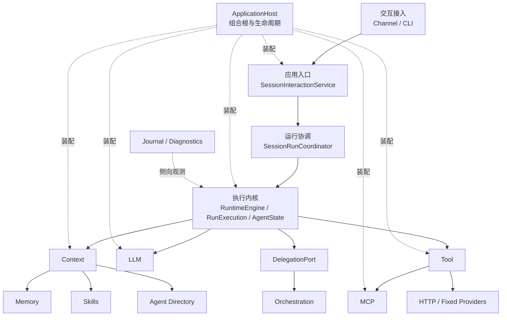

# dotClaw 模块与组件清单

> 扫描范围：`aandbcct/dotClaw` 当前默认分支 `master`  
> 目标：为 Wiki 首页和各模块 Wiki 重写建立代码事实底稿。  
> 性质：这是架构级模块与组件盘点，不是穷举所有私有函数、异常和枚举的 API 索引。各模块进入正式重写时，再补齐完整源码索引。

## 1. 总体判断

当前代码可以归纳为 **15 个面向开发者的逻辑模块**：

1. Bootstrap 与应用入口
2. Channel
3. Agent
4. Session
5. Runtime
6. Context
7. LLM
8. Tool
9. MCP
10. Memory
11. Skills
12. Orchestration
13. Config
14. Journal
15. Scheduler

其中 `common/` 和 `cli/` 更适合作为支撑代码归入相关模块，不建议单独建立模块 Wiki：

- `common/utils.py` 归入 Config 的公共加载支持；
- `cli/banner.py` 归入 Channel 或 Bootstrap 与应用入口的展示组件。

当前系统主链可以先统一理解为：



这张图表达的是逻辑职责和运行调用方向，不等同于源码目录依赖。

---

## 2. 模块总表

| 模块 | 主要代码范围 | 模块定位 | 建议 Wiki 形态 |
|---|---|---|---|
| Bootstrap 与应用入口 | `main.py`、`bootstrap/`、`cli/banner.py` | 进程入口、对象装配、生命周期和 Session 级应用用例 | 独立完整文档 |
| Channel | `channel/` | 外部消息输入、文本输出、审批交互和 Runtime 流适配 | 独立短文档 |
| Agent | `agent/identity.py`，以及当前位于 `orchestration/registry.py` 的 `AgentRegistry` | 声明 Agent 身份、行为和权限约束，维护系统级 Identity 目录 | 独立文档 |
| Session | `session/session.py` | 保存成功对话语义、历史压缩和会话元数据 | 独立文档 |
| Runtime | `runtime/domain/`、`runtime/application/`、`runtime/adapters/` | 驱动一次 AgentRun 的状态转换、外部能力调用、恢复和可靠提交 | 独立重点文档 |
| Context | `context/` | 按 Owner 和 Slot 计划构造稳定快照与动态运行事实 | 独立重点文档 |
| LLM | `llm/`、`runtime/adapters/llm_*` | Provider 接入、模型路由、韧性控制和统一调用 | 独立重点文档 |
| Tool | `tools/`、`runtime/adapters/tool_executor_adapter.py` | 工具声明、注册、安全决策和统一执行 | 独立重点文档 |
| MCP | `mcp/` | MCP 连接生命周期、协议适配和工具注册 | 独立文档 |
| Memory | `memory/` | 知识同步、混合检索、日记忆写入和长期蒸馏 | 独立文档 |
| Skills | `skills/`，以及 `tools/parser.py` 的接入 | Skill 元数据扫描、注册和 Context 暴露 | 独立短文档 |
| Orchestration | `orchestration/` | Task 编排事实、消息 Broker 和子 Agent 委派 | 独立文档 |
| Config | `config/settings.py`、`common/utils.py` | 全局配置模型、路由配置、环境变量和兼容迁移 | 独立文档 |
| Journal | `journal/` | 可选 trace、report 和 snapshot 观测 | 独立短文档 |
| Scheduler | `scheduler/reminder.py` | 当前仅提供进程内一次性提醒 | 独立极短文档，或在 Wiki 首页标记实验性 |

---

## 3. 各模块组件清单

## 3.1 Bootstrap 与应用入口

### 模块定位

负责启动 dotClaw、构造全部进程级资源、协调生命周期，并将用户级操作转换为 Runtime 请求。它不是 Runtime 状态机的一部分，也不是某个具体 Agent 的可执行门面。

### 逻辑组件

| 组件 | 核心代码 | 核心对象 | 职责 |
|---|---|---|---|
| 进程入口与 CLI 命令循环 | `src/dotclaw/main.py` | `_run_cli`、命令处理函数 | 创建 Channel 和 ApplicationHost；接收命令或普通消息；渲染 `RunResult`；处理结构化审批 |
| 组合根与生命周期 | `bootstrap/application_host.py` | `ApplicationHost` | 读取配置、创建关键和可降级资源、执行启动恢复、按依赖逆序关闭 |
| 基础设施构建 | `bootstrap/_host_components.py` | `_build_llm`、`_build_tools`、`_build_memory`、`_build_mcp`、`_build_skills` | 将配置翻译为具体模块对象；定义 critical/degrade 初始化策略 |
| Runtime 装配 | `bootstrap/runtime_factory.py` | `RuntimeServices`、`build_runtime_services` | 创建 Runtime adapters、ContextProvider、DelegationAdapter、Engine 和 Coordinator |
| Session 应用服务 | `bootstrap/session_interaction.py` | `SessionInteractionService` | 按 `session.agent_id` 路由 Identity；提交消息、审批、取消、重试和放弃；协调 Session 删除 |
| CLI 展示支持 | `cli/banner.py` | `build_banner` | 生成 Rich 启动面板；属于展示支撑，不应成为独立架构模块 |

### 主要依赖

- 上游：`main.py`、后续 Web/API/Scheduler 入口。
- 下游：Config、AgentRegistry、Session、Runtime、Context、LLM、Tool、MCP、Memory、Skills、Orchestration。
- 关键边界：`ApplicationHost` 只负责装配和生命周期；`SessionInteractionService` 才是应用用例入口。

---

## 3.2 Channel

### 模块定位

将外部交互方式适配为统一输入、输出、流式文本和审批提问能力，不处理 Session 路由和 AgentRun 状态。

### 逻辑组件

| 组件 | 核心代码 | 核心对象 | 职责 |
|---|---|---|---|
| 通道契约 | `channel/base.py` | `Channel` | 定义 `receive`、`send`、`stream`、`ask_user` 和展示接口 |
| CLI 通道实现 | `channel/cli.py` | `CLIChannel` | 使用 Rich 实现命令行输入、Markdown 输出和流式渲染 |
| Runtime 输出适配 | `channel/runtime_text_stream.py` | `ChannelTextStreamAdapter` | 将 Runtime 的 `TextStreamPort.emit` 转发到当前 Channel |
| 结果与审批渲染 | 当前位于 `main.py` | `_render_result`、`_resolve_pending_approvals` | 将结构化 `RunResult` 呈现给用户，并把审批选择提交给应用服务 |

### 边界说明

`main.py` 中仍包含较多 Channel 侧渲染和命令逻辑。文档上应把它们作为“入口层协作”，但不应把 `main.py` 描述成 Channel 模块本身。

---

## 3.3 Agent

### 模块定位

描述一个 Agent 的身份、模型、Prompt、工具白名单、策略收窄和 Context Slot 选择。Agent 是声明数据，不持有 Runtime、工具或会话对象。

### 逻辑组件

| 组件 | 核心代码 | 核心对象 | 职责 |
|---|---|---|---|
| Identity 模型 | `agent/identity.py` | `AgentIdentity` | 保存身份、行为、权限、能力标签和输入输出模式 |
| Identity 配置加载 | `agent/identity.py` | `load_agent_config` | 从 `.dotclaw/agentConfig/*.yaml` 加载并展开环境变量 |
| Identity 目录 | `orchestration/registry.py` | `AgentRegistry` | 启动时扫描全部 Identity；按 `agent_id` 注册、查询和枚举 |
| 运行策略投影 | `runtime/adapters/agent_policy_resolver.py` | `AgentPolicyResolver` | 将 Identity、全局配置和工具目录冻结为 Run 级策略快照 |

### 主要依赖

- 被 ApplicationHost、SessionInteractionService、Context、Runtime Policy 和 Orchestration 使用。
- Identity 本身应保持纯数据，不依赖任何运行技术。

### 边界待定

`AgentRegistry` 物理上位于 `orchestration/`，但职责是系统级 Identity Directory，并不只服务多 Agent Task。文档主归属更适合放在 Agent 模块；Orchestration 文档只说明其使用方式。是否移动源码可另行决定。

---

## 3.4 Session

### 模块定位

Session 是长期对话边界，保存成功的用户—Agent 语义历史、历史压缩版本和会话元数据；不保存完整工具过程和失败运行事实。

### 逻辑组件

| 组件 | 核心代码 | 核心对象 | 职责 |
|---|---|---|---|
| 对话语义模型 | `session/session.py` | `Conversation` | 保存用户输入、最终回答和关联 Run ID |
| 历史压缩模型 | `session/session.py` | `HistoryCompression` | 保存不可变压缩版本和覆盖边界 |
| Session 聚合 | `session/session.py` | `Session` | 维护会话标识、Identity 绑定、Conversation 列表和压缩版本 |
| Session 持久化 | `session/session.py` | `SessionManager` | 创建、加载、保存、列举和删除 Session 目录 |
| Session 删除协调 | `bootstrap/session_interaction.py` | `SessionInteractionService.delete_session` | 拒绝活动 Run、清理审批、删除完整目录并释放 Context 缓存 |

### 关键边界

- `SessionManager` 只执行 Session 数据持久化。
- “是否允许删除”属于应用级协调，不属于 Session 存储类。
- Runtime 成功后通过 `SessionConversationProjector` 将结果投影到 Conversation。

---

## 3.5 Runtime

### 模块定位

Runtime 是共享、业务无状态的执行内核。每个请求创建独立 `RunExecution`，由 `RuntimeEngine` 驱动纯 `AgentState` 状态机，通过 Ports 调用外部能力，并将运行事实可靠持久化。

### 逻辑组件

| 组件 | 核心代码 | 核心对象 | 职责 |
|---|---|---|---|
| 运行事实与值对象 | `runtime/domain/facts.py`、`context.py` | `AgentRun`、`RunMessage`、`RunCheckpoint`、`ContextVersion`、`SuccessCommitIntent` | 描述持久化事实、策略、错误、消息和恢复数据 |
| 领域事件 | `runtime/domain/events.py` | `RunStarted`、`LLMCompleted`、`ToolCompleted`、`ApprovalResolved` 等 | 描述驱动状态迁移的业务事实 |
| 状态机 | `runtime/domain/state.py`、`control.py` | `AgentState`、`AgentPhase`、`AgentAction` | 将领域事件转换为新状态和下一动作 |
| 单 Run 执行上下文 | `runtime/application/execution.py` | `RunExecution`、`RunExecutionView`、`RunBudget` | 保存本次 Run 的可变控制数据、消息游标和取消令牌 |
| 执行引擎 | `runtime/application/engine.py` | `RuntimeEngine` | 创建/恢复 Run；驱动 Context、LLM、Tool、Delegation 循环；收口终态和提交 |
| Session 运行协调 | `runtime/application/session_run_coordinator.py` | `SessionRunCoordinator` | 同 Session 串行、跨 Session 并行；审批恢复和中断重试串行化 |
| 控制服务 | `approval_service.py`、`cancellation_service.py` | `ApprovalService`、`CancellationService` | 审批记录关联、活动取消令牌和父子取消映射 |
| Context 预算与历史压缩 | `context_budget.py`、`history_compaction.py` | `ContextBudgetPlanner`、压缩选择和批处理函数 | 精确计数、超限判断和成功后提交的 staged 压缩 |
| 应用契约 | `dto.py`、`ports.py`、`request_factory.py` | `RunRequest`、`RunResult`、各类 Port | 定义 Runtime 与外部世界的稳定边界 |
| 持久化与恢复 adapters | `runtime/adapters/run_repository.py`、`checkpoint_repository.py`、`approval_repository.py` | 对应 Adapter | JSON 事实存储、Checkpoint、审批记录和成功提交补偿 |
| 外部能力 adapters | `llm_proxy_adapter.py`、`tool_executor_adapter.py`、`session_conversation_projector.py`、`agent_policy_resolver.py` | 对应 Adapter | 把现有 LLM、Tool、Session 和 Identity 翻译为 Runtime Ports |
| Token 与压缩 adapters | `tiktoken_token_counter.py`、`llm_context_compactor.py` | 对应 Adapter | 精确 Token 计数和 LLM 压缩调用 |

### 主要调用关系

```text
SessionRunCoordinator
→ RuntimeEngine
→ RunExecution / AgentState
→ ContextPort / LLMPort / ToolPort / DelegationPort
→ RunRepository / CheckpointRepository / ApprovalService
→ RunResult
```

### 文档重点

Runtime 文档应完整解释：

- Run 与 Session 的边界；
- 状态机和 Engine 的分工；
- 审批、取消、中断和恢复；
- Conversation 与运行事实的提交关系；
- Port/Adapter 依赖方向。

---

## 3.6 Context

### 模块定位

Context 按 Agent、Session、Run 和 Global 四类 Owner 解析 Slot 计划，加载可缓存的上下文贡献，并物化为 Runtime 需要的 `ContextBundle`。

### 逻辑组件

| 组件 | 核心代码 | 核心对象 | 职责 |
|---|---|---|---|
| Slot 契约 | `context/contracts.py` | `ContextSlotDescriptor`、`ContextSlotBinding`、`ContextPlan`、`ContextContribution` | 定义 Slot 的 Owner、顺序、缓存、刷新和持久化模式 |
| Slot 注册与默认计划 | `registry.py`、`defaults.py` | `ContextSlotRegistry`、`build_context_provider` | 注册内置 Slot 并装配默认 ContextProvider |
| Plan 配置 | `plan_configuration.py` | `ContextOwnerPlanConfiguration`、`InMemoryContextPlanConfiguration` | 定义不同 Owner 启用哪些 Slot |
| Plan 解析 | `plan_resolver.py` | `ContextPlanResolver` | 根据 Owner 快照解析有序、去重的实际计划 |
| Slot 生命周期管理 | `slot_manager.py` | `ContextSlotManager` | 加载 Slot、管理缓存、刷新和释放 |
| 刷新信号 | `signals.py` | `ContextSignalBus`、`ContextRefreshSignal` | 将领域变化转换为精确 Slot 刷新请求 |
| Context 物化 | `provider.py` | `ContextProvider` | 读取 Owner 数据、执行 Plan、生成消息、工具定义、快照和事实引用 |
| 内置 Slot | `slots.py` | `IdentitySlot`、`ConversationSlot`、`RunMessagesSlot`、`ToolsSlot`、`MemorySlot`、`SkillsSlot` 等 | 从不同来源构造具体上下文贡献 |
| 外部依赖端口 | `context/ports.py` | `ContextDependencies`、Memory/Skill/Agent Directory 等协议 | 隔离 Memory、Skills、Agent Registry 和知识来源 |

### 主要调用关系

```text
RuntimeEngine
→ ContextProvider
→ ContextPlanResolver
→ ContextSlotManager
→ ContextSlot
→ ContextBundle
```

Memory、Skills 和 Agent Directory 不是 Runtime 直接拼接，而是 Context 的下游来源。

---

## 3.7 LLM

### 模块定位

LLM 模块提供统一的模型调用入口，在 Provider 客户端之上完成候选路由、限流、熔断、重试、跨模型降级和流式结果归一。

### 逻辑组件

| 组件 | 核心代码 | 核心对象 | 职责 |
|---|---|---|---|
| 基础调用契约 | `llm/base.py` | `LLMClient`、`Message`、`ChatChunk`、`ToolCall`、`ToolDefinition` | 定义 Provider 客户端和统一消息模型 |
| Provider 注册与发现 | `llm/providers/__init__.py` | `register`、`get_provider` | 自动导入 Provider 模块并维护客户端类型注册表 |
| Provider 客户端 | `llm/providers/*.py` | 各 `LLMClient` 实现 | 将具体供应商协议适配为统一 chat/embed 接口 |
| 模型路由 | `llm/model_router.py` | `ModelRouter` | 按 purpose 和优先级生成候选；懒加载客户端；上报成功失败 |
| 限流 | `llm/rate_limiter.py` | `RateLimiter` | Provider 级速率控制和获取超时 |
| 熔断 | `llm/circuit_breaker.py` | `CircuitBreaker` | 维护 CLOSED/OPEN/HALF_OPEN 状态并过滤候选 |
| 调用代理 | `llm/proxy.py` | `LLMProxy` | 编排单模型重试、跨候选降级、流式错误边界和 embedding 调用 |
| Runtime 接入 | `runtime/adapters/llm_proxy_adapter.py` | `LLMProxyAdapter` | 将 LLMProxy 转换为 Runtime `LLMPort` |
| 历史压缩调用 | `runtime/adapters/llm_context_compactor.py` | `LLMContextCompactor` | 以独立 Port 用途执行 Context 压缩 |

### 已知边界问题

- `LLMProxy.chat` 仍是主要入口，内部直接调用客户端 `chat()`；chat 与 embedding 的统一调用抽象尚未完全收口。
- Router 目前直接负责客户端实例化和 Provider 注册表访问，后续重构时需要明确“路由决策”和“Provider 生命周期”是否继续绑定。
- Runtime Adapter 物理归属 Runtime，LLM 文档只应摘要说明接口；具体 Adapter 类的完整职责主归属 Runtime 文档。

---

## 3.8 Tool

### 模块定位

Tool 将本地函数和外部工具统一为 `ToolHandler`，经固定链路完成声明、校验、资源解释、策略决策、审批、执行、错误归一和审计。

### 逻辑组件

| 组件 | 核心代码 | 核心对象 | 职责 |
|---|---|---|---|
| 基础契约 | `tools/base.py`、`handler.py` | `ToolDefinition`、`ToolResult`、`ToolExecutionContext`、`ToolHandler` | 定义模型可见声明和执行边界 |
| 声明与 Schema | `decorator.py`、`schema.py` | `@tool`、`ToolMeta`、`ToolPolicy`、校验函数 | 声明本地工具元数据并验证参数 |
| 发现与注册 | `discovery.py`、`registry.py` | `ToolDiscovery`、`ToolRegistry` | 扫描可信 builtin 包、拒绝冲突并生成不可变快照 |
| Handler 实现 | `function_handler.py`、`provider.py` | `FunctionToolHandler`、`ToolProvider` | 将本地函数或外部来源统一为 ToolHandler |
| 执行调度 | `executor.py` | `ToolExecutor` | 驱动校验、Broker、Policy、审批、Handler、超时和结果归一 |
| Capability 翻译 | `capability.py` | `CapabilityBroker`、`CapabilityRequest`、`ResourceKind` | 根据工具定义和本次参数生成具体资源访问请求 |
| 策略决策 | `policy.py` | `PolicyEngine`、`PolicyScope`、`PolicyOutcome` | 对资源请求执行 allow/ask/deny，并合并 Agent 级收窄 |
| 审批入口 | `approval.py` | `ApprovalManager` | 将 ask 决策转成结构化审批需求 |
| Builtin 工具 | `tools/builtin/` | 文件、进程、记忆、系统、Web、天气、数学工具 | 通过 `@tool` 提供框架内置能力 |
| 受控网络基础设施 | `http_client.py`、`network.py`、`providers/` | `HttpClient`、`HttpxHttpClient`、固定 Provider | 仅允许代码固定服务和主机，不向 Agent 暴露任意 URL |
| Skill 旁路接入 | `tools/parser.py` | `SkillParser` | 工具执行后检测 Skill 命中，不把 Skill 注册成工具 |
| Runtime 接入 | `runtime/adapters/tool_executor_adapter.py` | `ToolExecutorAdapter` | 将 ToolExecutor 适配为 Runtime `ToolPort` |

### 主要流程

```text
@tool
→ ToolDiscovery
→ ToolRegistry
→ ToolExecutor
→ 参数校验
→ CapabilityBroker
→ PolicyEngine
→ ApprovalManager（按需）
→ ToolHandler
→ ToolResult
```

### 边界说明

- MCP 是独立模块，但作为 `ToolProvider` 向同一 Registry 注册工具。
- `HttpClient` 是 Tool 的内部基础设施，不属于模型可见工具。
- Runtime Adapter 的完整类说明建议主归属 Runtime；Tool 文档保留边界和调用摘要。

---

## 3.9 MCP

### 模块定位

MCP 模块负责管理 MCP Server 连接、发现协议能力，并将 MCP tools 转换为 Tool 模块可执行的 Handler。当前 resources 和 prompts 保留原生客户端入口，但不注册为模型工具。

### 逻辑组件

| 组件 | 核心代码 | 核心对象 | 职责 |
|---|---|---|---|
| MCP 协议模型 | `mcp/client.py` | `McpToolInfo`、`McpResourceInfo`、`McpPromptInfo`、`McpToolResult` | 将 MCP SDK 类型归一为框架内部类型 |
| 单 Server 客户端 | `mcp/client.py` | `McpClient`、`McpClientState` | 创建 transport、握手、发现、调用、重连和关闭 |
| Provider 生命周期 | `mcp/provider.py` | `MCPToolProvider` | 并行启动多个 Server、记录状态并向 ToolRegistry 注册工具 |
| Tool 适配 | `mcp/tool_adapter.py` | `McpToolAdapter`、`mcp_tool_name` | 生成 `mcp.<server>.<tool>` 稳定名称并实现 ToolHandler |
| 连接策略网关 | `MCPToolProvider._authorize_connect` | `CapabilityRequest(MCP_CONNECT)` | 连接前通过 Tool Policy 显式授权；后台无交互时 fail-closed |
| Tool 集成 | ToolRegistry、PolicyEngine、CapabilityBroker | 共享 Tool 核心对象 | MCP 不建立第二套注册和安全链路 |

### 生命周期

```text
ApplicationHost
→ MCPToolProvider.start
→ McpClient.connect
→ discover tools/resources/prompts
→ McpToolAdapter
→ ToolRegistry
→ shutdown
```

---

## 3.10 Memory

### 模块定位

Memory 将工作区知识和长期记忆同步到本地索引，提供向量 + 关键词 + 时间衰减的混合检索，并支持从对话生成日记忆和长期蒸馏结果。

### 逻辑组件

| 组件 | 核心代码 | 核心对象 | 职责 |
|---|---|---|---|
| 存储与索引 | `memory/storage.py` | `MemoryStorage`、`MemoryChunk`、`SearchResult` | 保存分块、文件状态、向量和全文索引 |
| 文本分块 | `memory/chunker.py` | `TextChunker` | 将 Markdown/文本转换为可索引分块 |
| Embedding 缓存 | `memory/embedding.py` | `EmbeddingCache` | 缓存文本向量，减少重复调用 |
| 同步与检索协调 | `memory/manager.py` | `MemoryManager` | 文件变更检测、批量 embedding、混合检索、时间衰减和 flush 触发 |
| 日记忆写入 | `memory/flush.py` | `MemoryFlushManager` | 从消息生成日记忆文件 |
| 长期蒸馏 | `memory/dream.py` | `DeepDream` | 将日记忆和已有 `MEMORY.md` 语义合并并重新入库 |
| Context 接入 | `context/ports.py`、`context/provider.py` | `MemorySearchPort` 结构协议 | Context 在 Run Owner 阶段检索并注入相关记忆 |

### 已知问题

- `MemoryManager` 仍保留指向已不存在的 `dotclaw.storage.conversation` 的 TYPE_CHECKING 引用，属于迁移遗留，应清理。
- `sync()` 中已有 TODO：向量索引更新仍偏全量，增量同步边界尚未完成。
- Memory 的“静态知识文件”和“用户长期记忆”目前共享部分同步和检索链路，文档中需要明确两者来源差异。

---

## 3.11 Skills

### 模块定位

Skills 负责发现和登记 SKILL.md 元数据，向 Context 暴露可用技能摘要；不直接执行脚本，也不把 Skill 注册成 ToolHandler。

### 逻辑组件

| 组件 | 核心代码 | 核心对象 | 职责 |
|---|---|---|---|
| Skill 模型 | `skills/models.py` | `SkillMeta`、`SkillLifecycle` | 表达名称、描述、生命周期、关键词、脚本和引用路径 |
| 文件扫描与解析 | `skills/scanner.py` | `SkillScanner` | 递归发现 SKILL.md、解析 YAML frontmatter 和附属目录 |
| Skill 注册表 | `skills/registry.py` | `SkillRegistry` | 按名称注册、查询、枚举并生成 Prompt 摘要块 |
| Context 暴露 | `context/slots.py`、`context/provider.py` | `SkillsSlot` | 将 Skill 描述作为 Agent Owner 的上下文贡献 |
| Tool 旁路检测 | `tools/parser.py` | `SkillParser` | 工具执行后进行 Skill 命中检测，不改变 Tool Registry |

### 边界说明

当前 `SkillRegistry.register` 对同名 Skill 采用覆盖，而 ToolRegistry 对同名工具采用拒绝。两者语义不同，文档需要显式说明，避免开发者假定注册规则一致。

---

## 3.12 Orchestration

### 模块定位

Orchestration 保存多 Agent 委派的 Task 领域事实和消息状态，并通过 RuntimeDelegationAdapter 将父 Run 的委派请求映射为目标 Agent 的新 Session 和子 Run。

### 逻辑组件

| 组件 | 核心代码 | 核心对象 | 职责 |
|---|---|---|---|
| Task 领域模型 | `orchestration/task.py` | `Task`、`TaskStatus`、`TaskSpecification`、`TaskMessage`、Endpoint 类型 | 表达委派任务、参与端点和消息状态 |
| Task 消息 Broker | `message_broker.py` | `TaskMessageBroker` | 保存 Task、校验端点、推进消息序列和终态 |
| Dispatcher 门面 | `dispatcher.py` | `AgentDispatcher` | 创建 delegation Task，并将子 Run 终态投影回 Task |
| Runtime 委派适配 | `runtime_delegation_adapter.py` | `RuntimeDelegationAdapter` | 创建目标 Session、构造子 `RunRequest`、异步提交、查询结果和传播取消 |
| 子 Run 绑定 | `runtime_delegation_adapter.py` | `DelegationTaskBinding`、内部运行缓存 | 关联 Task、目标 Session 和 child_run_id |
| Agent Directory | `registry.py` | `AgentRegistry` | 为目标 Agent 发现提供 Identity 目录；逻辑主归属存在争议 |

### 主要流程

```text
RuntimeEngine
→ DelegationPort.submit
→ RuntimeDelegationAdapter
→ 创建目标 Session
→ AgentDispatcher / TaskMessageBroker 登记 Task
→ SessionRunCoordinator 提交子 Run
→ 子 RunResult
→ Dispatcher 投影 Task 终态
→ DelegationResult 返回父 Run
```

### 边界说明

- Task 只保存编排事实；实际子 Run 执行由 Runtime 和 SessionRunCoordinator 完成。
- Dispatcher 不应重新成为第二个 Runtime。
- `AgentRegistry` 建议逻辑主归属 Agent 模块。

---

## 3.13 Config

### 模块定位

Config 将 `config.yaml`、`model_router_config.yaml`、`.env` 和环境变量解析为强类型配置对象，并承担部分向后兼容迁移。

### 逻辑组件

| 组件 | 核心代码 | 核心对象 | 职责 |
|---|---|---|---|
| 全局配置模型 | `config/settings.py` | `Config`、Agent/LLM/Tool/Memory/Session/Scheduler/Debug 配置 | 表达进程级配置 |
| Tool/MCP/Network 配置 | `settings.py` | `ToolsConfig`、`ToolPolicyConfig`、`McpGlobalConfig`、`McpServerConfig`、网络配置 | 表达安全、连接和服务开关 |
| Router 配置模型 | `settings.py` | `ProviderConfig`、`ModelConfig`、`PurposeConfig`、`RouterConfig` 等 | 表达模型 Provider、模型和 purpose 优先级 |
| 主配置加载 | `load_config`、`get_config` | 配置加载函数 | 读取 YAML、展开环境变量并应用默认值 |
| Router 配置加载 | `load_router_config` | 路由加载函数 | 读取独立模型路由配置 |
| 环境支持 | `common/utils.py`、`.env` 加载 | `expand_env_vars`、`safe_load_yaml` | 提供通用递归环境展开和 YAML 安全读取 |
| 兼容迁移 | `_migrate_tool_names`、legacy router 转换 | 迁移函数 | 在加载边界转换旧工具名和旧 LLM 配置 |

### 已知问题

- 大部分配置类型、解析和迁移逻辑集中在单个 `settings.py`，文件职责偏重。
- 模块配置定义和模块实现分离是合理的，但新增功能通常需要同时修改 Config、Builder 和目标模块，修改入口需要在 Wiki 中明确。

---

## 3.14 Journal

### 模块定位

Journal 是侧向观测系统，将具名事件写入 trace，并可生成 report 和 snapshot。它不是 Runtime 的恢复事实源。

### 逻辑组件

| 组件 | 核心代码 | 核心对象 | 职责 |
|---|---|---|---|
| 观测事件模型 | `journal/events.py` | `AgentEvent`、`EventType`、`TraceMessageRole` | 定义观测事件和消息角色 |
| Journal 门面 | `journal/journal.py` | `Journal` | 提供 session、run、LLM、Tool、Task 等具名事件入口 |
| Trace 输出 | `journal/journal.py`、`journal/sinks/` | trace writer / sinks | 将事件实时追加到 `trace.jsonl` |
| Report 输出 | Journal 内部及 sink | report 数据 | 汇总 token、工具、错误和耗时 |
| Snapshot 工具 | `journal/storage.py` | `save_snapshot`、`load_snapshot`、`diff_snapshots` | 保存和比较调试快照 |

### 边界待核验

Journal 文档和代码中仍出现 `TurnLoop`、旧 `AgentRun` 生命周期等历史措辞，而 Runtime v4 的 README 明确将 Journal 定义为可选观测、非恢复事实源。正式重写前需要确认当前 Runtime v4 实际接入程度，避免把旧观测路径写成现行主链。

---

## 3.15 Scheduler

### 模块定位

Scheduler 当前只有一个进程内一次性提醒管理器，尚未形成完整任务调度平台。

### 逻辑组件

| 组件 | 核心代码 | 核心对象 | 职责 |
|---|---|---|---|
| Reminder 管理 | `scheduler/reminder.py` | `ReminderManager` | 创建、保存和取消 `asyncio.Task` |
| 延迟触发 | 内部 `_remind` 协程 | `asyncio.sleep` | 延迟后向 Channel 发送提醒 |
| Channel 通知 | `Channel.send` | Channel 依赖 | 将提醒文本发送到当前通道 |

### 当前边界

- 未看到 ApplicationHost 对 ReminderManager 的装配。
- 任务状态只在内存中，进程重启后丢失。
- 不支持持久化、重复计划、条件触发或与 AgentRun 集成。
- Wiki 应明确标记为“当前轻量能力/实验性模块”，避免与 Runtime 调度或多 Agent Orchestration 混淆。

---

## 4. 跨模块依赖关系

## 4.1 主调用依赖

```text
main / Channel
→ SessionInteractionService
→ SessionRunCoordinator
→ RuntimeEngine
├── ContextPort → ContextProvider
│   ├── Memory
│   ├── Skills
│   └── AgentRegistry
├── LLMPort → LLMProxy
├── ToolPort → ToolExecutor
│   ├── Builtin
│   ├── Fixed Network Providers
│   └── MCPToolProvider / McpToolAdapter
└── DelegationPort → RuntimeDelegationAdapter
    ├── AgentRegistry
    ├── AgentDispatcher / TaskMessageBroker
    ├── SessionManager
    └── SessionRunCoordinator
```

## 4.2 装配依赖

```text
ApplicationHost
├── Config
├── LLM
├── Tool + HttpClient
├── Memory
├── Skills
├── MCP
├── AgentRegistry
├── Context
├── Runtime Adapters
├── RuntimeEngine
├── SessionRunCoordinator
└── SessionInteractionService
```

## 4.3 持久化边界

```text
SessionManager
└── session.json
    ├── Session metadata
    ├── Conversation
    └── HistoryCompression

RunRepositoryAdapter
└── agent_runs/{run_id}/
    ├── AgentRun
    ├── RunMessage
    ├── ContextVersion
    ├── RunEvent
    ├── Checkpoint
    └── SuccessCommitIntent
```

---

## 5. 需要在 Wiki 中明确的边界问题

### 5.1 `AgentRegistry` 的逻辑归属

**事实：** 位于 `orchestration/registry.py`，但被 ApplicationHost、SessionInteractionService、Context 和 Runtime Policy 普遍使用。

**建议：** Wiki 中将它作为 Agent 模块的“Identity Directory”组件完整说明；Orchestration 只说明它如何用于选择目标 Agent。暂不要求立即移动源码。

### 5.2 Runtime adapters 的主文档归属

`LLMProxyAdapter`、`ToolExecutorAdapter` 等类物理上位于 Runtime，并实现 Runtime Port。

**建议：**

- 完整类职责和依赖规则主归属 Runtime Wiki；
- LLM、Tool 等能力 Wiki 在“Runtime 接入”章节摘要说明接口和调用关系，并链接 Runtime 对应章节；
- 避免两份文档复制同一 Adapter 细节。

### 5.3 Bootstrap 与应用服务混在同一包

`ApplicationHost` 是组合根，`SessionInteractionService` 是应用服务，两者职责不同但当前都位于 `bootstrap/`。

**建议：** 仍可使用一份“Bootstrap 与应用入口”Wiki，但必须分成“组合与生命周期”和“应用用例入口”两个组件，不能统称为启动代码。

### 5.4 Journal 的现行程度需要核验

Journal 代码保留完整观测模型，但 Runtime v4 的主执行和恢复事实由 RunRepository 管理。

**建议：** 在正式 Journal 文档重写前，先搜索 Runtime v4 对 Journal 的真实调用点，区分现行观测、旧实现遗留和未接入能力。

### 5.5 Scheduler 尚不是第一类运行模块

ReminderManager 未进入 ApplicationHost 的装配主链。

**建议：** 保留模块记录，但在 Wiki 首页标记为“轻量/实验性”，不与 Runtime 的运行协调或 Orchestration 的 Task 调度并列宣传。

### 5.6 README 的源码结构存在遗漏

当前 README 的项目结构未列出 `cli/` 和 `common/`，但代码存在实际使用。

**建议：** README 不再列完整源码树；Wiki 首页的“源码导航”应覆盖这些支撑包，并说明它们不独立构成业务模块。

---

## 6. 文档重写优先级

根据模块复杂度、当前信息密度和修改频率，推荐顺序：

1. Tool
2. Runtime
3. Context
4. Bootstrap 与应用入口
5. LLM
6. Session
7. Agent
8. Orchestration
9. MCP
10. Memory
11. Skills
12. Config
13. Channel
14. Journal
15. Scheduler

理由：

- Tool 最适合验证“模块—组件—核心类—协作—修改入口”模板；
- Runtime、Context 是全局理解的核心，但结构复杂，应在 Tool 模板验证后处理；
- Bootstrap 和 LLM 近期仍在演进，越早形成清晰边界越有价值；
- Journal 和 Scheduler 当前不在主请求链，可后置。

---

## 7. 第一阶段结论

这次盘点已经能够作为 Wiki 首页和模块文档的事实基础，核心结论是：

1. Wiki 的逻辑模块应以稳定开发边界划分，而不是逐个对应源码目录。
2. 当前主链为 Channel → SessionInteractionService → SessionRunCoordinator → Runtime → Context/LLM/Tool/Delegation。
3. ApplicationHost 是侧向组合根，Journal 是侧向观测，二者不应被画成请求处理主链的一层。
4. Context 下接 Memory、Skills 和 Agent Directory；Tool 下接 Builtin、固定网络 Provider 和 MCP。
5. `AgentRegistry`、Runtime adapters、Journal 和 Scheduler 是后续写 Wiki 时必须明确归属或成熟度的边界项。
6. 这份清单足以进入第二项任务：生成 Wiki 首页骨架和模块依赖图。
