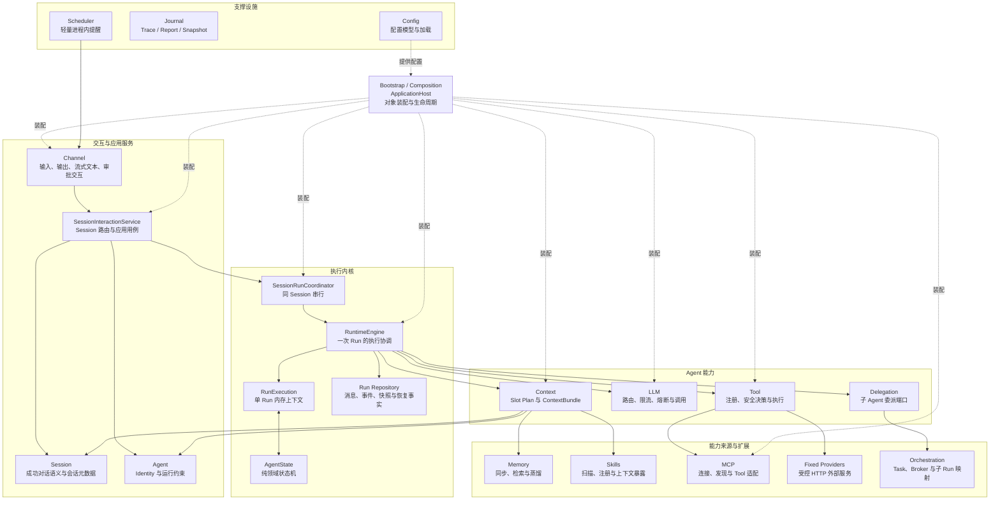
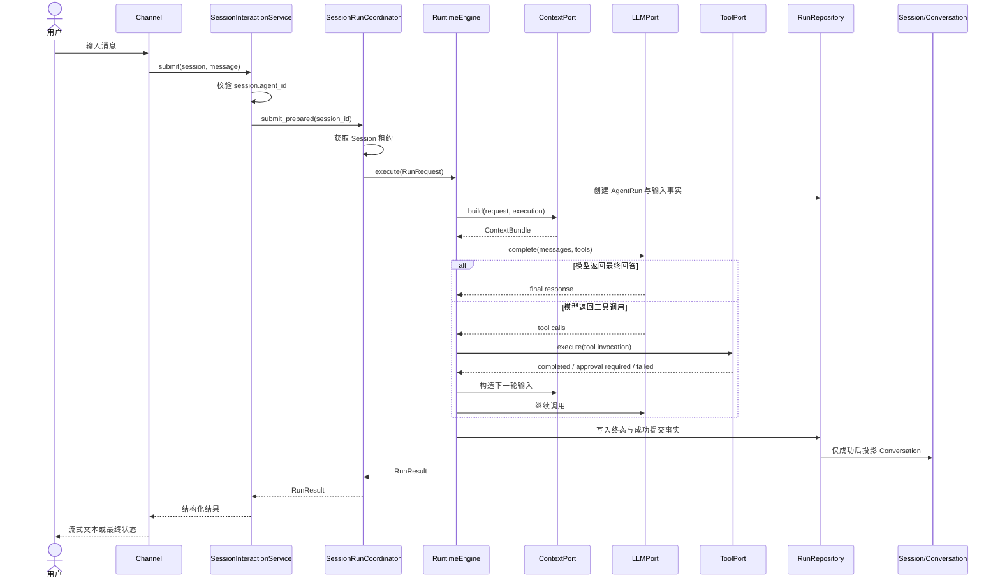
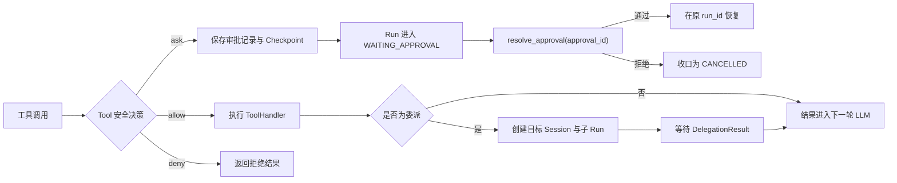
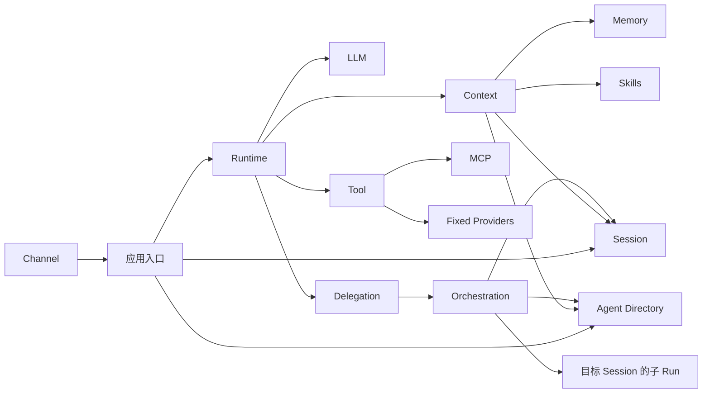
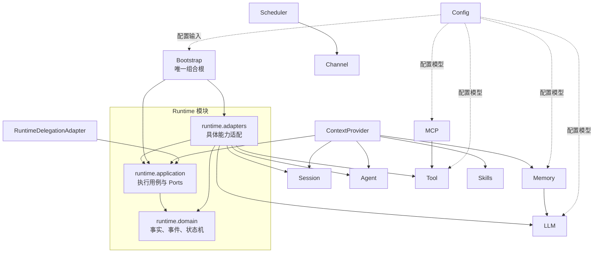

# dotClaw 开发者 Wiki

> 本 Wiki 面向参与 dotClaw 开发、扩展和排障的开发者。  
> 阅读顺序遵循“项目地图 → 核心链路 → 模块 → 逻辑组件 → 核心类 → 修改入口”，不要求读者先理解源码目录。

> [!NOTE]
> 当前首页中的模块链接按文档重写后的目标结构编排。已有的 Runtime、Context 和 Tool 文档沿用当前文件名；其他链接会在对应模块文档建立后生效。

## 1. 项目代码地图

dotClaw 是一个本地 Agent Harness。外部输入首先进入交互和应用服务，随后由 Runtime 驱动一次独立的 AgentRun；Context、LLM、Tool 和 Delegation 作为执行能力接入，Memory、Skills、MCP 等模块位于这些能力之后。`ApplicationHost` 负责装配和生命周期，不参与正常请求处理；Journal 属于侧向观测，不是运行恢复事实源。



从这张图应当先建立四个判断：

1. `RuntimeEngine` 是一次运行的执行协调器，不是整个应用的组合根。
2. `SessionRunCoordinator` 处理多个 Run 之间的 Session 占用，`AgentState` 处理单个 Run 内部的状态转换。
3. Memory、Skills 和 Agent Directory 主要通过 Context 进入模型输入；MCP 主要通过 Tool 进入工具注册表。
4. Bootstrap、Config、Journal 不应被误画成请求主链中的业务步骤。

---

## 2. 系统核心链路

### 2.1 一次普通用户请求



### 2.2 审批、取消和委派分支

普通消息总是创建新的 Run。只有审批、取消、重试和放弃等结构化控制事件会定位已有 Run。



完整状态迁移、Checkpoint 和恢复不变量由 [Runtime 模块](./Runtime%20模块总体说明.md) 维护；工具为何产生审批由 [Tool 模块](./Tool%20模块总体说明.md) 维护。

---

## 3. 逻辑子系统与模块索引

这里的“子系统”只用于建立阅读地图，不要求源码存在同名目录。模块文档应以逻辑组件组织，并在文末映射回实际文件。

### 3.1 交互与应用服务

| 模块 | 定位 | 主要入口 | 详细文档 |
|---|---|---|---|
| Bootstrap 与应用入口 | 进程启动、对象装配、生命周期和 Session 级应用用例 | `ApplicationHost`、`SessionInteractionService` | [Bootstrap 与应用入口](./Bootstrap%20与应用入口模块说明.md) |
| Channel | 外部输入、输出、流式文本和审批交互适配 | `Channel`、`CLIChannel`、`ChannelTextStreamAdapter` | [Channel](./Channel%20模块说明.md) |

### 3.2 身份与会话

| 模块 | 定位 | 主要入口 | 详细文档 |
|---|---|---|---|
| Agent | 声明 Agent Identity、行为、模型、权限和 Context 计划 | `AgentIdentity`、`AgentRegistry` | [Agent](./Agent%20模块说明.md) |
| Session | 保存成功对话语义、历史压缩和会话元数据 | `Session`、`Conversation`、`SessionManager` | [Session](./Session%20模块说明.md) |

### 3.3 执行内核

| 模块 | 定位 | 主要入口 | 详细文档 |
|---|---|---|---|
| Runtime | 驱动 AgentRun 状态、外部能力调用、恢复和可靠提交 | `SessionRunCoordinator`、`RuntimeEngine`、`RunExecution`、`AgentState` | [Runtime](./Runtime%20模块总体说明.md) |

### 3.4 Agent 能力系统

| 模块 | 定位 | 主要入口 | 详细文档 |
|---|---|---|---|
| Context | 按 Owner 和 Slot Plan 构造模型上下文、工具快照和动态事实引用 | `ContextProvider`、`ContextPlanResolver`、`ContextSlotManager` | [Context](./上下文工程说明.md) |
| LLM | Provider 接入、候选路由、限流、熔断、重试和降级 | `LLMProxy`、`ModelRouter` | [LLM](./LLM%20模块说明.md) |
| Tool | 工具声明、发现、注册、安全决策、审批和统一执行 | `ToolExecutor`、`ToolRegistry`、`CapabilityBroker`、`PolicyEngine` | [Tool](./Tool%20模块总体说明.md) |
| MCP | MCP Server 生命周期、能力发现和 ToolHandler 适配 | `McpClient`、`MCPToolProvider`、`McpToolAdapter` | [MCP](./MCP%20模块说明.md) |
| Memory | 文件同步、混合检索、日记忆写入和长期蒸馏 | `MemoryManager`、`MemoryStorage`、`DeepDream` | [Memory](./Memory%20模块说明.md) |
| Skills | SKILL.md 扫描、元数据注册和 Context 暴露 | `SkillScanner`、`SkillRegistry` | [Skills](./Skills%20模块说明.md) |

### 3.5 多 Agent 编排

| 模块 | 定位 | 主要入口 | 详细文档 |
|---|---|---|---|
| Orchestration | 保存委派 Task 事实、传递消息并将委派映射为目标子 Run | `RuntimeDelegationAdapter`、`AgentDispatcher`、`TaskMessageBroker` | [Orchestration](./Orchestration%20模块说明.md) |

### 3.6 支撑设施

| 模块 | 定位 | 主要入口 | 详细文档 |
|---|---|---|---|
| Config | 加载全局配置、模型路由配置、环境变量和兼容迁移 | `Config`、`RouterConfig`、`get_config` | [Config](./Config%20模块说明.md) |
| Journal | 可选的 Trace、Report 和 Snapshot 观测 | `Journal`、`AgentEvent` | [Journal](./Journal%20模块说明.md) |
| Scheduler | 当前提供轻量、进程内的一次性提醒 | `ReminderManager` | [Scheduler](./Scheduler%20模块说明.md) |

---

## 4. 模块依赖关系

模块依赖必须区分两种关系：

- **运行调用关系**：一次请求执行时，哪个模块调用哪个能力。
- **源码与装配依赖**：哪个模块定义契约、哪个模块实现或装配具体对象。

如果把两者混在同一张图中，会错误地认为 Runtime 内核直接依赖全部具体模块。

### 4.1 运行调用关系



关键结论：

- Runtime 只应通过稳定 Port 使用 Context、LLM、Tool 和 Delegation。
- Context 是 Memory、Skills、Agent Directory 与模型输入之间的主要汇聚点。
- MCP 是工具来源，不应在 Runtime 中建立独立调用分支。
- Orchestration 管理 Task 事实，但子 Run 仍由同一个 Runtime/Coordinator 执行。

### 4.2 源码依赖与 Port 边界



这张图中的箭头表示源码层面的主要依赖或装配关系：

1. `runtime.application` 只依赖 Domain 和自己定义的 Protocol，不应导入具体 LLM、Tool、Session 或 MCP 实现。
2. `runtime.adapters` 依赖具体模块，将它们翻译为 Runtime Port。
3. ContextProvider 和 RuntimeDelegationAdapter 实现 Runtime 定义的能力边界，因此它们可以依赖 Runtime 契约；Runtime 内核不反向依赖它们的具体类。
4. Bootstrap 可以依赖各具体模块，因为组合根的职责就是创建对象并连接依赖。
5. Config 向装配和各模块提供数据，但不应反向调用业务模块。

### 4.3 模块主归属规则

跨目录类型按职责确定文档主归属，而不是按文件路径机械归类：

| 类型或机制 | 完整说明主归属 | 其他模块如何处理 |
|---|---|---|
| `AgentRegistry` | Agent | Orchestration、Context 和 Bootstrap 只说明使用关系 |
| `LLMProxyAdapter`、`ToolExecutorAdapter` | Runtime | LLM、Tool 文档只保留 Runtime 接入摘要 |
| 审批产生与安全决策 | Tool | Runtime 说明审批恢复和状态收口 |
| 审批恢复与 Checkpoint | Runtime | Channel 只说明如何提交结构化决定 |
| Session 删除规则 | Bootstrap 与应用入口 | Session 只说明存储删除能力 |
| MCP 工具注册 | MCP | Tool 说明其作为 ToolProvider 的接入边界 |
| Memory/Skills 注入模型输入 | Context | Memory、Skills 说明对外提供的数据能力 |

---

## 5. 常见修改入口

| 开发目标 | 首先阅读 | 主要代码入口 | 需要同时关注 |
|---|---|---|---|
| 新增一种交互通道 | [Channel](./Channel%20模块说明.md) | `channel/base.py`、新 Channel 实现 | `main.py` 或新的应用入口、`TextStreamPort` |
| 修改 Session 到 Agent 的路由 | [Bootstrap 与应用入口](./Bootstrap%20与应用入口模块说明.md) | `SessionInteractionService` | AgentRegistry、Session.agent_id |
| 修改 Run 状态或状态迁移 | [Runtime](./Runtime%20模块总体说明.md) | `runtime/domain/state.py`、`events.py`、`control.py` | Engine 驱动逻辑、Checkpoint |
| 修改一次 Run 的执行顺序 | [Runtime](./Runtime%20模块总体说明.md) | `runtime/application/engine.py` | Ports、RunExecution、持久化事实 |
| 修改同 Session 的并发规则 | [Runtime](./Runtime%20模块总体说明.md) | `session_run_coordinator.py` | 活跃 Run 查询、取消和审批恢复 |
| 新增 Context Slot | [Context](./上下文工程说明.md) | `context/slots.py`、`registry.py`、默认计划 | Owner、缓存范围、刷新和快照模式 |
| 修改历史压缩 | [Runtime](./Runtime%20模块总体说明.md) + [Context](./上下文工程说明.md) | `context_budget.py`、`history_compaction.py` | Session 压缩版本、成功提交 |
| 新增 LLM Provider | [LLM](./LLM%20模块说明.md) | `llm/providers/`、Provider 注册表 | RouterConfig、重试和错误分类 |
| 修改模型路由或降级 | [LLM](./LLM%20模块说明.md) | `model_router.py`、`proxy.py` | RateLimiter、CircuitBreaker |
| 新增 builtin 工具 | [Tool](./Tool%20模块总体说明.md) | `tools/builtin/`、`@tool` | Schema、Capability、Policy 和测试 |
| 新增 ToolPolicy 或资源类型 | [Tool](./Tool%20模块总体说明.md) | `decorator.py`、`capability.py`、`policy.py` | Config、Agent 级策略收窄 |
| 新增固定网络 Provider | [Tool](./Tool%20模块总体说明.md) | `tools/providers/`、`network.py` | HttpClient、服务开关和主机白名单 |
| 接入新的 MCP Server | [MCP](./MCP%20模块说明.md) | MCP 配置、`MCPToolProvider` | ToolRegistry、连接策略和命名空间 |
| 修改记忆同步或检索 | [Memory](./Memory%20模块说明.md) | `memory/manager.py`、`storage.py` | LLM embedding、Context 注入 |
| 新增或修改 Skill | [Skills](./Skills%20模块说明.md) | SKILL.md、`SkillScanner`、`SkillRegistry` | Context SkillsSlot、Tool SkillParser |
| 修改子 Agent 委派 | [Orchestration](./Orchestration%20模块说明.md) | `runtime_delegation_adapter.py`、`dispatcher.py` | Runtime DelegationPort、Session、取消传播 |
| 修改配置结构 | [Config](./Config%20模块说明.md) | `config/settings.py` | ApplicationHost Builder、目标模块 |
| 排查 Run 执行事实 | [Runtime](./Runtime%20模块总体说明.md) | Session 下 `agent_runs/{run_id}/` | RunMessage、RunEvent、Checkpoint |
| 排查观测输出 | [Journal](./Journal%20模块说明.md) | `journal/` | 当前 Runtime v4 的实际接入范围 |
| 扩展提醒能力 | [Scheduler](./Scheduler%20模块说明.md) | `scheduler/reminder.py` | Channel、持久化和 Host 装配 |

---

## 6. 推荐阅读路径

### 6.1 第一次理解项目

```text
项目代码地图
→ 系统核心链路
→ Runtime
→ Context
→ Tool
→ Bootstrap 与应用入口
```

这条路径先建立一次请求如何执行，再理解上下文和工具能力如何接入，最后查看系统如何装配。

### 6.2 理解可靠执行

```text
Runtime：Run / Session 边界
→ AgentState 状态机
→ RunExecution 与 RuntimeEngine
→ RunRepository / Checkpoint
→ 审批、取消、中断与成功提交
```

### 6.3 理解工具安全

```text
Tool：声明与注册
→ CapabilityBroker
→ PolicyEngine
→ ApprovalManager
→ Builtin / MCP / Fixed Provider
→ Runtime ToolPort 接入
```

### 6.4 理解上下文工程

```text
Context：Owner 与 Slot
→ PlanResolver
→ SlotManager
→ ContextProvider
→ ContextVersion 与动态事实引用
→ Memory / Skills / Tools 来源
```

### 6.5 理解多 Agent 委派

```text
AgentIdentity / AgentRegistry
→ Runtime DelegationPort
→ RuntimeDelegationAdapter
→ AgentDispatcher / TaskMessageBroker
→ 目标 Session 与子 Run
→ 结果和取消传播
```

### 6.6 开发新能力

```text
常见修改入口
→ 对应模块的“组件总览”
→ “各组件的类与职责”
→ “对外契约”
→ “修改入口与不变量”
→ 源码索引
```

---

## 7. 当前架构边界

以下内容是当前实现边界，不应在文档中包装成已经完成的分布式或生产级能力：

- dotClaw 当前定位为本地、单进程 Agent Harness。
- Session 协调当前使用进程内 `asyncio.Lock`，不是跨进程或多节点租约。
- Session、Run、Checkpoint 和审批数据当前主要使用本地文件存储。
- Tool 的安全链路提供参数校验、资源解释和 allow/ask/deny 决策，但不是 OS 级强沙箱。
- MCP 只将 tools 接入 Tool Registry；resources 和 prompts 当前不作为模型工具暴露。
- Journal 是可选观测设施，Runtime 的恢复依据是 Run Repository 和 Checkpoint，而不是 Journal。
- Scheduler 当前只是内存中的一次性提醒，尚未形成持久化调度系统。
- `AgentRegistry` 的物理目录与逻辑归属不完全一致；Wiki 按 Agent Identity Directory 解释。
- Runtime adapters 的完整说明主归属 Runtime，能力模块只解释自身对外接口，避免重复维护。
- 当前部分模块文档尚未建立或仍需重写；首页链接将随模块文档落地逐步生效。

---

## 8. 文档维护约定

为避免 Wiki 再次变成大量信息的堆积，各模块文档统一遵循以下结构：

```text
模块定位与边界
→ 模块在项目中的位置
→ 组件总览图与职责表
→ 各组件的核心类
→ 组件依赖和使用流程
→ 对外接口与数据契约
→ 常见修改入口
→ 当前设计 / 设计取舍 / 已知痛点 / 演进方向
→ 源码索引
```

同一事实只在一个主要文档中完整维护；其他文档保留理解本模块所需的摘要，并链接到主归属章节。
