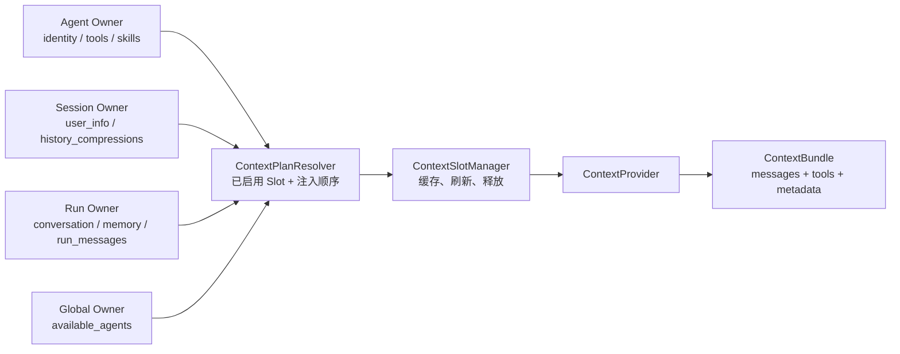
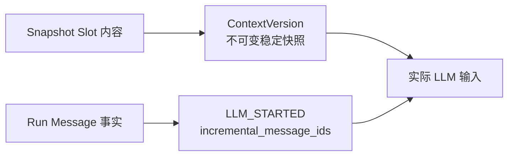
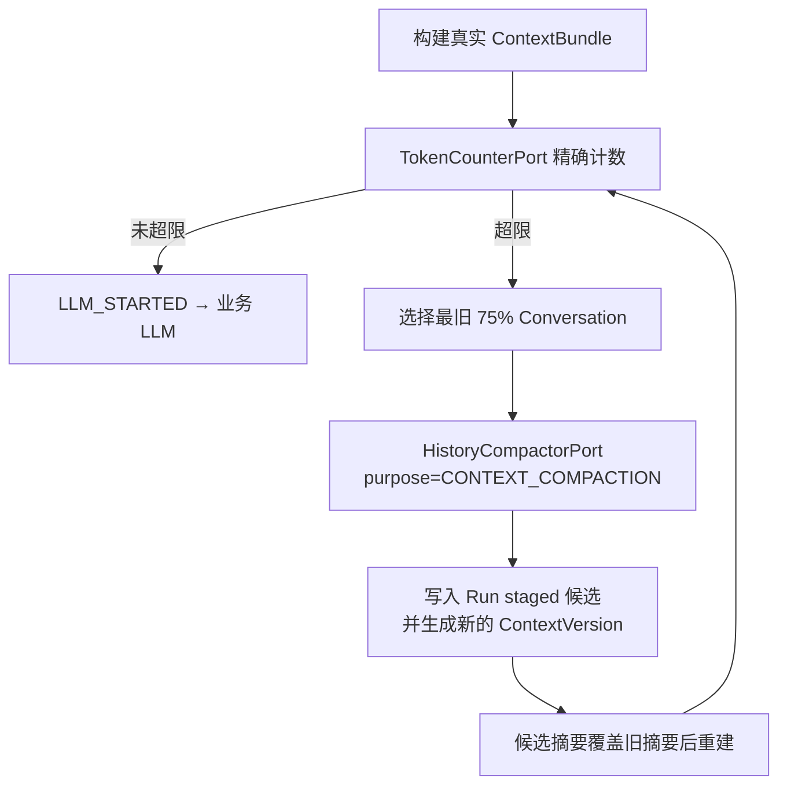

# 上下文工程说明

> 适用实现：Context Slot 与 Runtime v4。
> 定位：将 Agent、Session、Run、Global 四类 Owner 的数据安全地组装为一次可审计、可预算的 LLM 输入。
> 关联模块：[Runtime 模块总体说明](Runtime 模块总体说明.md)

## 1. 概览

上下文工程不等于“拼接 prompt”。它解决四个问题：

1. 不同来源的内容如何按生命周期管理；
2. 一次 LLM 调用实际用了什么，如何准确审计和重建；
3. 多轮 ReAct 的工具结果如何进入下一次调用，而不让 Context Version 无限增长；
4. 输入超过模型窗口时，如何压缩 Session 历史且不污染未完成 Run 的长期数据。

`context/` 实现 Runtime 的 `ContextPort`。它不拥有 Agent、Session 或 Run 的领域事实，只通过 Owner Snapshot 和 Port 读取内容，并输出 `ContextBundle`。

## 2. 代码结构

```text
src/dotclaw/context/
├── contracts.py              # Slot、Descriptor、Binding、Plan、缓存/刷新契约
├── defaults.py               # 内置 Slot 注册、默认 Plan、组合根
├── registry.py               # Slot ID → Descriptor/构造器
├── plan_configuration.py     # 按 Owner 启用 Slot 的配置
├── plan_resolver.py          # 配置 → 有序 ContextPlan
├── slot_manager.py           # 实例缓存、定向刷新、释放与信号消费
├── signals.py                # 进程内 ContextSignalBus
├── provider.py               # ContextPort：Plan → ContextBundle / 快照
├── slots.py                  # 内置 Slot 实现
└── ports.py                  # Memory、Skill、Agent 目录等外部依赖

src/dotclaw/runtime/
├── domain/context.py         # ContextVersion、Slot 快照、直接载荷 DTO
├── application/context_budget.py
├── application/history_compaction.py
└── adapters/tiktoken_token_counter.py / llm_context_compactor.py
```

## 3. Owner、Slot 与 Plan



Owner 是领域数据的唯一真相，Slot 只是适配器：

| Owner | 代表 Slot | 事实来源 | 生命周期 |
|---|---|---|---|
| `AGENT` | `identity`、`tools`、`skills` | AgentPolicySnapshot、启用能力配置 | Agent 配置有效期 |
| `SESSION` | `user_info`、`history_compressions` | Session 长期资料与已提交摘要 | Session |
| `RUN` | `conversation`、`memory`、`knowledge`、`run_messages` | Run 创建时会话视图、Run Message、检索结果 | AgentRun |
| `GLOBAL` | `available_agents` | Agent 注册表 | 进程或注册表生命周期 |

Slot 不得直接写 Session、Run 或 Agent 配置。外部只能调用 `ContextSlotManager.request_refresh()` 请求失效；不能取得具体 Slot 实例后直接刷新。

## 4. 默认 Slot 与注入顺序

默认配置在 `context/defaults.py` 中声明：

| 顺序 | Slot | Owner | kind | 模式 | 作用 |
|---:|---|---|---|---|---|
| 10 | `identity` | Agent | system content | Snapshot | 冻结 Agent 身份与系统提示词 |
| 20 | `tools` | Agent | tool definitions | Snapshot | Agent 裁剪后的实际工具 Schema |
| 30 | `skills` | Agent | system content | Snapshot | 可用技能说明 |
| 40 | `available_agents` | Global | system content | Snapshot | 可委派 Agent 摘要 |
| 50 | `user_info` | Session | system content | Snapshot | 用户资料 |
| 60 | `history_compressions` | Session | history compressions | Snapshot | 当前有效历史摘要 |
| 70 | `conversation` | Run | conversation messages | Snapshot | 摘要边界后的完整 Conversation |
| 80 / 90 | `memory`、`knowledge` | Run | system content | Snapshot | 本次检索结果 |
| 100 | `run_messages` | Run | run message references | Fact reference | 当前 Run 的用户、LLM、工具事实 |

新增 Slot 的标准步骤：

```text
定义 kind 与持久化模式
    → 实现只读取 Owner 的 Slot
    → 注册 Descriptor 与构造器
    → 在 Owner Plan 配置启用并给定顺序
    → 编写载荷序列化、刷新与审计契约测试
```

正常新增 Slot 不需要修改 `RuntimeEngine`、全局固定 Slot 元组或 Manager 的条件分支。

## 5. Snapshot 与 Fact Reference

每个 `ContextSlotDescriptor` 有一个 `ContextPersistenceMode`：

| 模式 | 是否进入 LLM 输入 | 是否进入 Context Version | 适用内容 |
|---|---|---|---|
| `SNAPSHOT` | 是 | 是 | 稳定的系统内容、工具列表、历史摘要、Conversation、检索结果 |
| `FACT_REFERENCE` | 是 | 否 | 已作为 Run Message 持久化的动态事实 |

`run_messages` 是事实引用型 Slot，并非未注入：Provider 根据它的 Message ID 从 Run Message 事实中还原 assistant tool call、tool result 等内容，加入下一次实际 LLM 输入。



这避免了工具结果每增加一条就创建一个冗余 Context Version，同时保留完整重放证据。

## 6. Context Version 与审计

`messages.json` v4 中的 `ContextVersion` 只包含快照型 Slot。每个 Slot 直接保存 `content`，其结构由封闭的 `ContextContributionKind` 决定：

| kind | `content` 形状 |
|---|---|
| `SYSTEM_CONTENT`、`HISTORY_COMPRESSIONS` | 字符串 |
| `TOOL_DEFINITIONS` | 有序、裁剪后的 `ToolDefinition` 列表 |
| `CONVERSATION_MESSAGES` | 有序 Conversation Message 列表 |
| `RUN_MESSAGE_REFERENCES` | Message ID 列表，仅在运行时使用，不持久化到 Version |

不再使用泛用 `attributes` 或 Snapshot 的泛用 `message_ids`。这使审计界面能直接查看 tools、摘要和 Conversation 内容。

`content_hash` 只规范化哈希快照 Slot 的 ID、Owner、kind、顺序、状态与内容；不得包含生成 ID、当前输入或 Run Message。`tool_schema_hash` 只哈希 `tools` Slot 的实际 Schema。因此：

- 仅新增 LLM Response、Tool Result 时复用活动版本；
- Agent 配置、Memory/Knowledge 刷新、Conversation 快照或候选摘要变化时追加新版本；
- `LLM_STARTED.context_version + incremental_message_ids` 可重建某次业务模型调用。

## 7. 历史压缩

### 7.1 语义

历史压缩只处理 Session Conversation，不压缩本 Run 的工具结果、LLM 中间响应或委派消息。每次业务 LLM 调用前使用实际结构化输入进行 Token 统计；不为未来回答预留预算。

超过上下文窗口时：

1. 从当前压缩边界后的完整 Conversation 中选择最旧 75%；
2. 至少保留一条最新 Conversation 原文；
3. 摘要输入过大时，以完整 Conversation 为边界滚动压缩；
4. 压缩后再次计数，仍超限则明确失败，不静默截断。



### 7.2 staged 候选与提交边界

`history_compressions` 与 `conversation` 被拆开：

| Slot | Owner | 内容 |
|---|---|---|
| `history_compressions` | Session | 已提交摘要，或当前 Run 最新 staged 候选摘要 |
| `conversation` | Run | 压缩边界后的完整 Conversation |

当前 Run 有 staged 候选时，它**覆盖** Session 已提交摘要；两份摘要绝不同时注入。候选控制元数据放在 `run.json.staged_history_compressions`，摘要正文只放在候选引用的 Context Version Slot 中。

```text
Run 成功      → 投影最新候选到 session.json，刷新 history_compressions Slot
取消 / 失败   → 丢弃候选，不写 Session
中断 / 放弃   → 丢弃候选，不写 Session
```

本期只有历史摘要具备 staged 语义。不要将其泛化为所有 Slot 的通用暂存事务；其他 Slot 需要延迟提交时，应先单独定义事实源、覆盖优先级、恢复与幂等契约。

## 8. 刷新、缓存与释放

`ContextSlotManager` 以 `(slot_id, owner, owner_key)` 管理实例，支持：

- `request_refresh(slot_id, owner, owner_key)`：在下一 LLM_STARTED 安全点刷新指定 Slot；
- `ContextSignalBus`：外部发布进程内类型化刷新信号，订阅 Slot 自行判断是否需要刷新；
- `release_scope(owner, owner_key)`：Run 终态、Session 删除或 Agent 卸载后释放对应缓存。

当前 SignalBus 不保证跨进程传递、持久化、顺序、重放或至少一次投递；它不是消息队列。需要跨进程刷新时必须另行设计可靠事件机制。

## 9. 失败与排障

| 场景 | 行为 |
|---|---|
| 单个 Slot 加载异常 | 标为 `FAILED`，其余 Slot 可继续加载；是否导致调用失败由实际 Context/预算需求决定 |
| Tokenizer 缺失或不可用 | 写不含 prompt 正文的 WARNING，明确拒绝调用，不使用字符估算 |
| 摘要服务不可用 | Run 保存 checkpoint 并进入 `INTERRUPTED`，不生成候选 |
| 压缩后仍超限 | `FAILED`，不静默丢内容 |
| Run 取消/失败/中断 | staged 摘要不提交 Session |

排障时依次检查：`run.json` 的活动版本和 staged 元数据 → `events.jsonl` 的 `LLM_STARTED` 引用 → `messages.json` 对应 Context Version 与 Run Message → `session.json` 的已提交摘要。

## 10. 当前限制与演进

- Memory、工具结果等内容增长仍由下一次 `LLM_STARTED` 触发预算判断；已具备该入口，不需要回退到 Run 创建前压缩。
- 当前 Run 不接受普通新 query；同 Session 有未终态 Run 时入口返回忙。审批、取消、重试和放弃是控制命令。
- 同一 Session 没有并行 Run，因此 staged 历史摘要没有 Run 间合并语义；开放并行前必须设计分支与冲突解决。
- WorkspaceSlot、ProjectSlot 不在默认 Plan；需要时应按“新增 Slot 标准步骤”显式接入。
